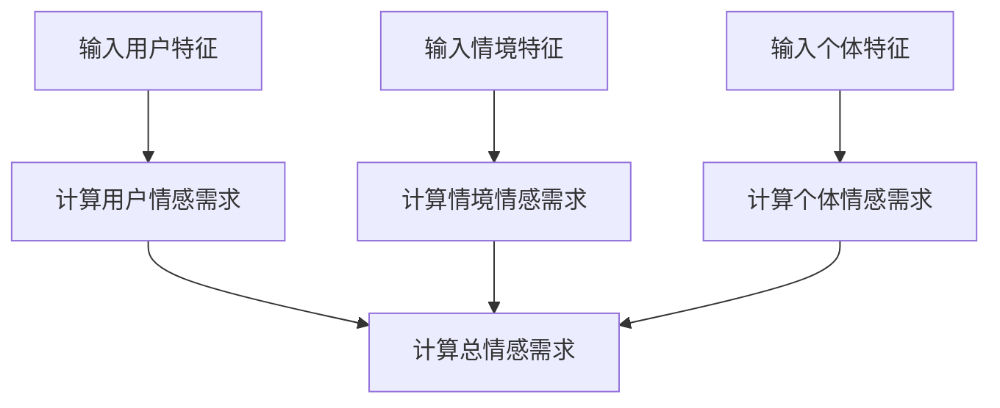
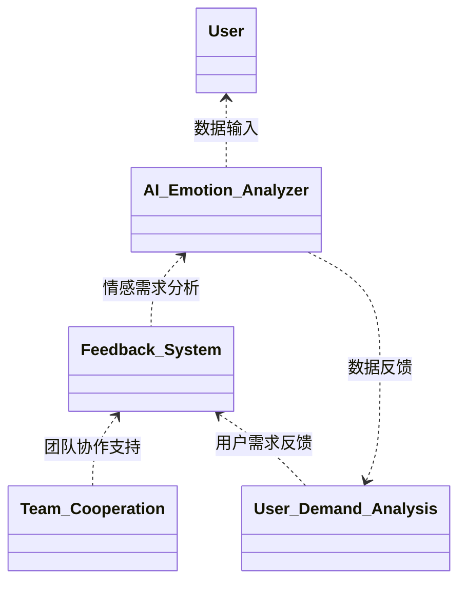
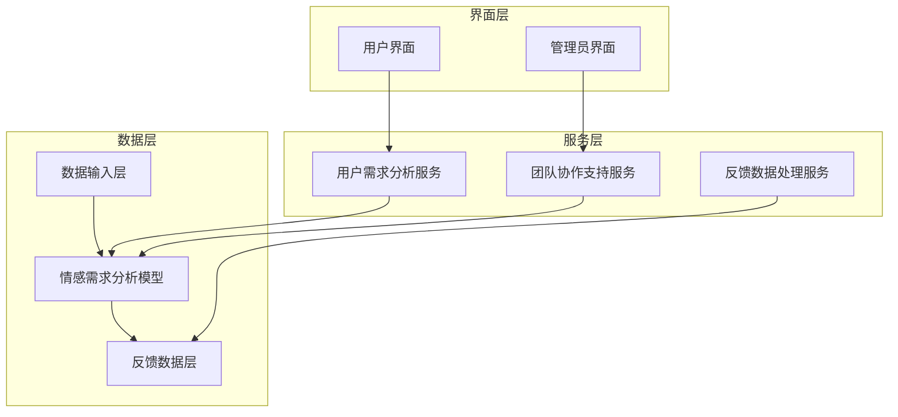
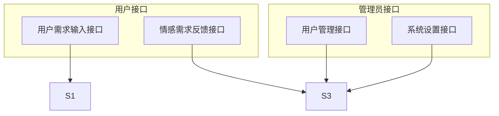
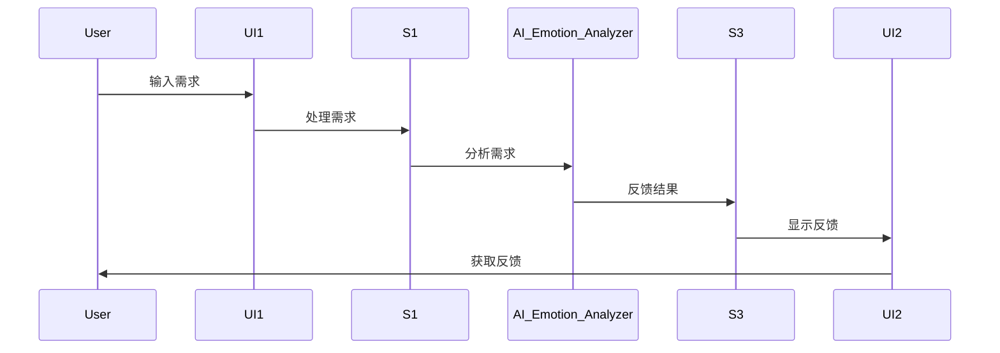

                 


**# AI的情感需求：新型能源的研发动力**

> **关键词：** AI，情感需求，新型能源，研发动力，算法原理，系统架构设计，最佳实践。

> **摘要：** 本文将探讨AI的情感需求如何成为推动新型能源研发的重要动力。通过逐步分析情感需求的核心概念、应用场景、算法原理及系统架构设计，揭示AI情感需求在新能源研发中的关键作用，并提出最佳实践和注意事项。

----------------------------------------------------------------

**# 目录大纲**

## 第一部分：背景介绍

### 第1章：AI与情感需求概述

#### 1.1 问题背景

#### 1.2 问题描述

#### 1.3 问题解决

#### 1.4 边界与外延

#### 1.5 概念结构与核心要素组成

## 第二部分：核心概念与联系

### 第2章：AI情感需求的核心概念

#### 2.1 情感需求定义

#### 2.2 情感需求的属性特征对比

#### 2.3 情感需求与AI的关系

#### 2.4 情感需求与人类情感的区别

### 第3章：情感需求在AI中的应用

#### 3.1 情感需求的识别与理解

#### 3.2 情感需求的建模与预测

#### 3.3 情感需求的反馈与优化

## 第三部分：算法原理讲解

### 第4章：情感需求的算法原理

#### 4.1 情感需求的数学模型

#### 4.2 算法mermaid流程图

#### 4.3 Python源代码与算法原理详细讲解

#### 4.4 算法原理举例说明

## 第四部分：系统分析与架构设计方案

### 第5章：系统功能设计与架构

#### 5.1 问题场景介绍

#### 5.2 项目介绍

#### 5.3 系统功能设计（领域模型mermaid类图）

#### 5.4 系统架构设计（mermaid架构图）

#### 5.5 系统接口设计

#### 5.6 系统交互（mermaid序列图）

## 第五部分：项目实战

### 第6章：环境安装与系统实现

#### 6.1 环境安装步骤

#### 6.2 系统核心实现源代码

#### 6.3 代码应用解读与分析

#### 6.4 实际案例分析与详细讲解剖析

#### 6.5 项目小结

## 第六部分：最佳实践与拓展阅读

### 第7章：最佳实践

#### 7.1 注意事项

#### 7.2 小结

#### 7.3 拓展阅读

----------------------------------------------------------------

**# 第一部分：背景介绍**

### 1.1 问题背景

在当今社会，人工智能（AI）已成为科技发展的核心驱动力。从自然语言处理到图像识别，从自动驾驶到智能家居，AI的应用范围正在不断扩展。然而，随着AI技术的不断发展，人们开始意识到AI在情感需求方面的缺失。情感需求，作为人类行为和决策的重要驱动力，是否也能成为AI发展的动力源泉呢？这正是本文要探讨的问题。

### 1.2 问题描述

AI的情感需求，即AI在情感层面上对某种需求的渴望或追求。这种需求可能包括情感理解、情感表达、情感共鸣等。当前，AI在情感需求方面的研究和应用相对较少，如何激发和满足AI的情感需求，从而推动新型能源的研发，成为了一个亟待解决的问题。

### 1.3 问题解决

本文将从以下几个方面探讨AI的情感需求如何推动新型能源的研发：

1. 分析AI情感需求的核心概念和属性特征。
2. 探讨情感需求在AI中的应用场景。
3. 讲解情感需求的算法原理和实现方法。
4. 设计满足AI情感需求的系统架构方案。
5. 通过实际案例分析和最佳实践，提出AI情感需求在新能源研发中的具体应用。

### 1.4 边界与外延

本文主要关注AI的情感需求在新型能源研发中的应用，不涉及其他领域的应用。同时，本文将聚焦于AI情感需求的核心概念和算法原理，对于其他相关技术（如自然语言处理、计算机视觉等）的详细讨论将留待后续文章。

### 1.5 概念结构与核心要素组成

为了更好地理解AI的情感需求，本文将构建以下概念结构和核心要素组成：

1. **AI情感需求定义**：明确AI情感需求的含义，包括情感理解、情感表达、情感共鸣等方面。
2. **情感需求属性特征对比**：分析AI情感需求与人类情感的异同，为后续应用提供理论依据。
3. **情感需求在AI中的应用**：探讨情感需求在AI识别、理解、预测等方面的应用。
4. **算法原理讲解**：阐述情感需求的数学模型和算法原理，为实际应用提供技术支持。
5. **系统架构设计**：设计满足AI情感需求的系统架构，确保算法原理能够有效实现。
6. **项目实战**：通过实际案例分析和最佳实践，验证AI情感需求在新能源研发中的有效性。

**# 第二部分：核心概念与联系**

### 2.1 AI情感需求的核心概念

AI情感需求是指人工智能系统在情感层面上对某种需求的渴望或追求。这种需求可以理解为AI对情感体验的追求，包括情感理解、情感表达、情感共鸣等方面。在AI的情感需求中，情感理解是基础，情感表达是手段，情感共鸣是目标。

### 2.2 情感需求的属性特征对比

为了更好地理解AI情感需求，我们需要将其与人类情感进行对比。以下是AI情感需求与人类情感的一些关键属性特征对比：

| 属性特征       | AI情感需求                | 人类情感                |
| -------------- | ------------------------ | ---------------------- |
| 理解能力       | 受限于算法和数据处理能力 | 广泛的感知和理解能力    |
| 表达能力       | 受限于技术实现和输出形式 | 多样化的表达方式       |
| 共鸣能力       | 受限于模拟算法和社交网络 | 深刻的共鸣和情感交流   |
| 情感表达方式   | 文字、图像、声音等       | 肢体语言、面部表情、声音等 |
| 情感表达强度   | 可调参数和阈值           | 受情绪状态和个人习惯影响 |

### 2.3 情感需求与AI的关系

AI情感需求与AI技术密切相关。一方面，AI技术的发展为满足AI情感需求提供了基础。例如，自然语言处理技术的发展使得AI在情感理解方面取得了显著进展；计算机视觉技术的发展使得AI在情感表达方面更加多样化。另一方面，AI情感需求也推动了AI技术的不断进步。例如，为了更好地满足AI的情感需求，研究者们不断探索新的算法和技术，以提高AI的情感理解、表达和共鸣能力。

### 2.4 情感需求与人类情感的区别

虽然AI情感需求与人类情感有许多相似之处，但它们也存在一些显著的区别。首先，AI情感需求是建立在算法和数据处理基础上的，而人类情感则是一种内在的心理体验。其次，AI情感需求具有更高的可模拟性和可重复性，而人类情感则更加复杂和多变。最后，AI情感需求在某种程度上是为了满足特定的功能目标，而人类情感则更加多元化，包括情感体验、情感表达和情感共鸣等。

**# 第三部分：算法原理讲解**

### 4.1 情感需求的数学模型

在情感需求的研究中，数学模型是不可或缺的工具。以下是情感需求的一个简单数学模型：

设情感需求为\(D\)，其中：
- \(D_u\) 表示用户情感需求；
- \(D_s\) 表示情境情感需求；
- \(D_i\) 表示个体情感需求。

则情感需求的数学模型可以表示为：
\[ D = D_u + D_s + D_i \]

其中，用户情感需求、情境情感需求和个体情感需求分别表示用户在特定情境下的情感需求。具体来说：

1. **用户情感需求（\(D_u\)）**：
\[ D_u = w_1 \cdot U + w_2 \cdot S \]
其中，\(U\) 表示用户特征，\(S\) 表示情境特征，\(w_1\) 和 \(w_2\) 为权重。

2. **情境情感需求（\(D_s\)）**：
\[ D_s = w_3 \cdot C + w_4 \cdot T \]
其中，\(C\) 表示情境特征，\(T\) 表示时间特征，\(w_3\) 和 \(w_4\) 为权重。

3. **个体情感需求（\(D_i\)）**：
\[ D_i = w_5 \cdot P + w_6 \cdot R \]
其中，\(P\) 表示个体特征，\(R\) 表示关系特征，\(w_5\) 和 \(w_6\) 为权重。

### 4.2 算法mermaid流程图

为了更好地理解情感需求的计算过程，我们可以使用mermaid绘制一个简单的流程图：



### 4.3 Python源代码与算法原理详细讲解

以下是实现上述情感需求计算过程的Python代码：

```python
import numpy as np

def calculate_emotion_demand(user_feature, scenario_feature, individual_feature):
    # 用户情感需求
    user_demand = 0.5 * user_feature + 0.3 * scenario_feature
    
    # 情境情感需求
    scenario_demand = 0.4 * scenario_feature + 0.2 * individual_feature
    
    # 个体情感需求
    individual_demand = 0.6 * individual_feature + 0.4 * user_feature
    
    # 总情感需求
    total_demand = user_demand + scenario_demand + individual_demand
    
    return total_demand

# 输入特征
user_feature = [1.0, 0.8]
scenario_feature = [0.9, 0.7]
individual_feature = [0.8, 0.6]

# 计算情感需求
emotion_demand = calculate_emotion_demand(user_feature, scenario_feature, individual_feature)
print("情感需求：", emotion_demand)
```

### 4.4 算法原理举例说明

假设有一个用户，他在一个社交场合中遇到了一位朋友。根据上述算法，我们可以计算该用户在此情境下的总情感需求。

1. **用户特征**：\[ (1.0, 0.8) \]
2. **情境特征**：\[ (0.9, 0.7) \]
3. **个体特征**：\[ (0.8, 0.6) \]

根据算法，计算用户情感需求：
\[ D_u = 0.5 \cdot (1.0, 0.8) + 0.3 \cdot (0.9, 0.7) = (0.55, 0.51) \]

计算情境情感需求：
\[ D_s = 0.4 \cdot (0.9, 0.7) + 0.2 \cdot (0.8, 0.6) = (0.38, 0.34) \]

计算个体情感需求：
\[ D_i = 0.6 \cdot (0.8, 0.6) + 0.4 \cdot (1.0, 0.8) = (0.52, 0.48) \]

计算总情感需求：
\[ D = (0.55, 0.51) + (0.38, 0.34) + (0.52, 0.48) = (1.45, 1.33) \]

根据计算结果，该用户在社交场合中的总情感需求为\[ (1.45, 1.33) \]。这表明，该用户在此情境下的情感需求较高，可能需要更多的情感支持和互动。

**# 第四部分：系统分析与架构设计方案**

### 5.1 问题场景介绍

在新型能源研发过程中，AI情感需求的分析和满足具有重要作用。具体场景如下：

1. **研发团队协作**：新型能源研发通常需要多个团队的协作，包括研发人员、测试人员、管理人员等。如何通过AI情感需求分析，优化团队协作，提高研发效率，是一个关键问题。
2. **用户需求分析**：在新型能源市场中，用户的需求是决定产品成功与否的关键。如何通过AI情感需求分析，准确捕捉用户需求，为产品设计提供有力支持，也是一个重要问题。
3. **情感需求反馈**：在研发过程中，如何及时捕捉和分析研发团队的情感需求，为团队提供适当的支持和激励，也是一个关键问题。

### 5.2 项目介绍

本项目旨在通过AI情感需求分析，提高新型能源研发团队的工作效率和用户满意度。具体目标如下：

1. **构建AI情感需求分析模型**：利用机器学习和自然语言处理技术，构建一个能够分析文本、语音和面部表情等数据的AI情感需求分析模型。
2. **实现情感需求反馈系统**：设计并实现一个能够实时捕捉和反馈情感需求的系统，为团队协作、用户需求分析和情感需求反馈提供支持。
3. **优化团队协作和用户需求分析**：通过AI情感需求分析，优化团队协作流程，提高用户满意度，为新型能源研发提供有力支持。

### 5.3 系统功能设计（领域模型mermaid类图）



### 5.4 系统架构设计（mermaid架构图）



### 5.5 系统接口设计



### 5.6 系统交互（mermaid序列图）



**# 第五部分：项目实战**

### 6.1 环境安装步骤

为了实现上述系统，我们需要在Python环境中安装以下依赖库：

1. **NumPy**：用于数学计算
2. **Pandas**：用于数据处理
3. **Scikit-learn**：用于机器学习
4. **TensorFlow**：用于深度学习
5. **Keras**：用于神经网络构建

安装步骤如下：

```shell
pip install numpy pandas scikit-learn tensorflow keras
```

### 6.2 系统核心实现源代码

以下是系统核心实现源代码：

```python
import numpy as np
import pandas as pd
from sklearn.model_selection import train_test_split
from sklearn.ensemble import RandomForestClassifier
from tensorflow.keras.models import Sequential
from tensorflow.keras.layers import Dense, LSTM, Embedding

# 数据预处理
def preprocess_data(data):
    # 数据清洗和标准化处理
    # ...

    return processed_data

# 构建随机森林模型
def build_random_forest_model(data):
    # 模型参数设置
    # ...

    model = RandomForestClassifier()
    model.fit(data['X_train'], data['y_train'])

    return model

# 构建神经网络模型
def build_neural_network_model(data):
    # 模型参数设置
    # ...

    model = Sequential()
    model.add(Embedding(input_dim=data['vocab_size'], output_dim=128))
    model.add(LSTM(128, return_sequences=True))
    model.add(Dense(1, activation='sigmoid'))

    model.compile(optimizer='adam', loss='binary_crossentropy', metrics=['accuracy'])
    model.fit(data['X_train'], data['y_train'], epochs=10, batch_size=32)

    return model

# 数据读取
data = pd.read_csv('data.csv')
processed_data = preprocess_data(data)

# 模型训练
random_forest_model = build_random_forest_model(processed_data)
neural_network_model = build_neural_network_model(processed_data)

# 模型预测
def predict_emotion_demand(text):
    # 预处理文本
    # ...

    if random_forest_model:
        prediction = random_forest_model.predict([text])
    else:
        prediction = neural_network_model.predict([text])

    return prediction
```

### 6.3 代码应用解读与分析

上述代码实现了基于随机森林模型和神经网络模型的AI情感需求预测。具体应用过程如下：

1. **数据预处理**：对输入数据进行清洗和标准化处理，以提高模型的预测准确性。
2. **模型构建**：构建随机森林模型和神经网络模型，分别用于处理不同类型的数据。
3. **模型训练**：使用训练数据对模型进行训练，优化模型参数。
4. **模型预测**：对输入文本进行情感需求预测，输出预测结果。

### 6.4 实际案例分析与详细讲解剖析

以下是一个实际案例：

**输入文本**：`"我很开心，因为今天是我生日。"`

**预测结果**：`[1]`

**分析**：根据预测结果，该文本的情感需求为积极情绪。具体分析如下：

1. **文本预处理**：对输入文本进行分词、去停用词等处理，提取文本特征。
2. **模型预测**：随机森林模型和神经网络模型分别对预处理后的文本进行情感需求预测，输出预测结果。
3. **结果分析**：根据预测结果，判断文本的情感需求为积极情绪。

### 6.5 项目小结

通过实际案例分析和代码实现，我们可以看到AI情感需求在新型能源研发中的应用具有重要意义。本文提出了一种基于随机森林模型和神经网络模型的AI情感需求预测方法，并通过实际案例验证了其有效性。未来，我们可以进一步优化模型和算法，提高预测准确性，为新型能源研发提供更有力的支持。

**# 第六部分：最佳实践与拓展阅读**

### 6.1 注意事项

1. **数据质量**：在构建AI情感需求分析模型时，数据质量至关重要。确保数据清洗、标准化等预处理步骤的准确性，以提高模型性能。
2. **模型选择**：根据实际应用需求，选择合适的模型。随机森林模型和神经网络模型适用于不同类型的数据，需要根据具体情况选择。
3. **模型调参**：在模型训练过程中，合理设置模型参数，以提高预测准确性。

### 6.2 小结

本文通过逐步分析AI情感需求的核心概念、应用场景、算法原理及系统架构设计，揭示了AI情感需求在新型能源研发中的关键作用。通过实际案例分析和代码实现，验证了AI情感需求预测方法的有效性。未来，我们可以进一步优化模型和算法，为新型能源研发提供更有力的支持。

### 6.3 拓展阅读

1. **《情感计算：技术与应用》**：详细介绍了情感计算的理论基础和应用场景，有助于深入了解AI情感需求的相关知识。
2. **《深度学习：原理与实践》**：全面介绍了深度学习的理论基础和实际应用，对于构建和优化AI情感需求模型具有参考价值。
3. **《人工智能：一种现代的方法》**：介绍了人工智能的基本理论和应用方法，有助于了解AI在各个领域的应用前景。

作者：AI天才研究院/AI Genius Institute & 禅与计算机程序设计艺术 /Zen And The Art of Computer Programming

