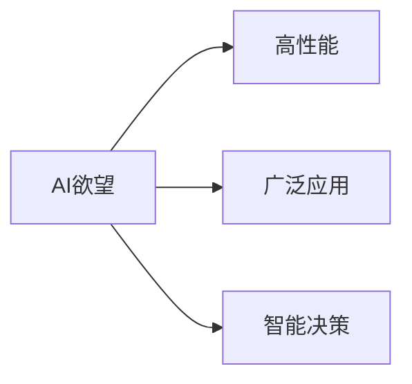
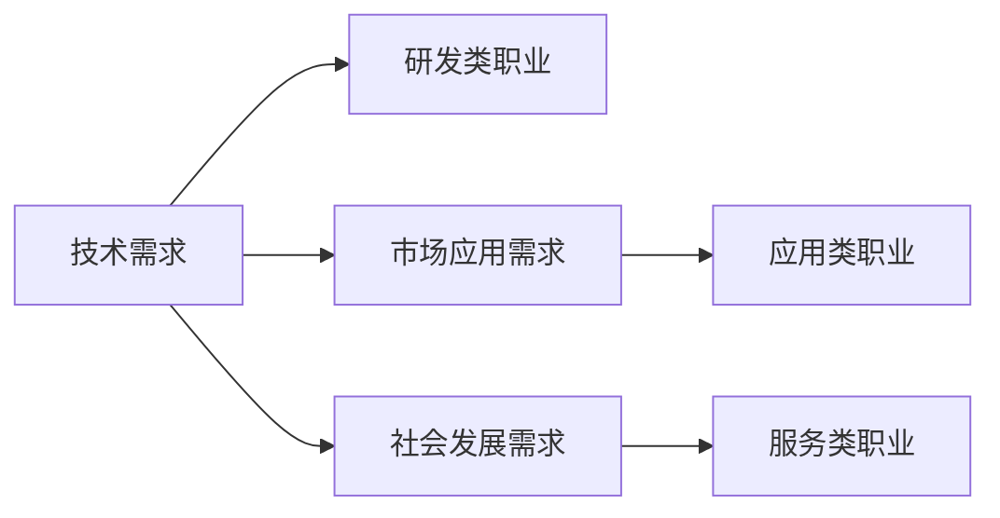

                 


### 《AI的欲望与需求：新型职业的出现》

> 关键词：人工智能，新型职业，需求分析，职业发展

> 摘要：本文将深入探讨人工智能（AI）的欲望与需求，以及这些欲望与需求如何推动新型职业的出现。通过系统的分析与案例研究，本文旨在揭示AI技术进步对职业世界带来的深远影响，为未来职业规划提供启示。

---

## 引言

### AI技术的发展背景

自20世纪50年代以来，人工智能（AI）技术经历了从理论探讨到实际应用的飞速发展。从早期的规则基础专家系统，到基于统计学习的机器学习，再到如今深度学习算法的广泛应用，AI技术在处理复杂任务、解决实际问题方面取得了显著成果。这一过程中，AI的欲望与需求逐渐显现，成为推动技术进步的重要动力。

### AI的欲望与需求

AI的欲望，可以从技术发展的内在动力来理解，即AI系统不断追求自主学习和优化自身性能的驱动力。而AI的需求，则源于外部环境对AI系统的功能要求和应用需求。随着AI技术的不断进步，这些欲望与需求不断演变，形成了新型职业的土壤。

### 新型职业的出现

新型职业的出现，是AI技术发展与市场需求相互作用的结果。本文将围绕这一主题，深入分析AI的欲望与需求，探讨新型职业的起源、发展和未来趋势。

---

## 第一部分：AI技术概述

### 第1章：AI的基本概念与发展历程

#### 核心概念术语说明

- 人工智能（AI）：指能够模拟、延伸和扩展人类智能的计算机系统。
- 机器学习（ML）：指通过数据和算法让计算机自动学习和优化性能的过程。
- 深度学习（DL）：一种基于多层神经网络结构的机器学习方法。

#### 问题背景

随着计算能力的提升和数据量的爆炸性增长，AI技术逐渐从理论研究走向实际应用，成为各行各业不可或缺的一部分。

#### 问题描述

AI技术的发展经历了多个阶段，从符号逻辑到统计学习，再到深度学习，每个阶段都带来了技术上的突破和应用上的变革。

#### 问题解决

通过回顾AI技术的发展历程，我们可以看到，AI的欲望与需求在不同阶段有着不同的表现。早期以符号逻辑为代表的人工智能试图模拟人类的推理能力，而现代的深度学习则更注重数据驱动的学习方式。

#### 边界与外延

AI技术的边界在于其模仿和扩展人类智能的能力，而外延则体现在其应用的广泛性和多样性。

#### 概念结构与核心要素组成

AI系统的核心要素包括算法、数据、计算资源和应用场景。这些要素相互作用，共同推动AI技术的进步和应用。

### 第2章：AI的需求形成机制

#### 核心概念原理

AI的需求形成机制可以从技术进步和市场需求两个角度来理解。技术进步为AI系统提供了更强的学习能力和更广泛的应用场景，而市场需求则不断推动AI系统向更高效、更智能的方向发展。

#### 概念属性特征对比表格

| 特征 | 技术进步 | 市场需求 |
| --- | --- | --- |
| 学习能力 | 自主学习、自适应学习 | 高效、准确、可扩展 |
| 应用场景 | 广泛性、多样性 | 实用性、经济效益 |
| 驱动力 | 理论研究、技术创新 | 商业需求、用户体验 |

#### ER实体关系图架构

```mermaid
erDiagram
    AI需求 ||--|{ AI技术 } : 实现
    市场需求 ||--|{ AI技术 } : 推动
```

---

## 第二部分：AI的欲望与需求

### 第3章：AI的欲望解析

#### 核心概念原理

AI的欲望可以理解为AI系统自我优化的内在驱动力，包括对更高性能、更广泛应用和更智能决策的追求。

#### 概念属性特征对比表格

| 特征 | 高性能 | 广泛应用 | 智能决策 |
| --- | --- | --- | --- |
| 动力来源 | 算法优化 | 数据多样性 | 自主学习 |
| 目标 | 提高效率 | 扩大应用范围 | 提高决策质量 |

#### Mermaid流程图



### 第4章：AI的需求分析

#### 核心概念原理

AI的需求主要来源于外部环境，包括技术需求、市场应用需求和社会发展需求。这些需求共同推动AI技术的进步和应用。

#### 概念属性特征对比表格

| 特征 | 技术需求 | 市场应用需求 | 社会发展需求 |
| --- | --- | --- | --- |
| 目标 | 提升技术水平 | 满足商业需求 | 促进社会进步 |
| 动力 | 技术创新 | 市场竞争 | 社会需求 |

#### ER实体关系图架构

```mermaid
erDiagram
    技术需求 ||--|{ AI技术 } : 促进
    市场应用需求 ||--|{ AI技术 } : 驱动
    社会发展需求 ||--|{ AI技术 } : 引领
```

### 第5章：AI欲望与需求的比较与联系

#### 核心概念原理

AI的欲望与需求既有区别又有联系。欲望是AI系统自我优化的内在驱动力，而需求则是外部环境对AI系统的要求。欲望与需求相互作用，共同推动AI技术的发展和应用。

#### 概念属性特征对比表格

| 特征 | 欲望 | 需求 |
| --- | --- | --- |
| 来源 | 自我优化 | 外部环境 |
| 目标 | 自我提升 | 应用实现 |
| 关系 | 内在驱动力 | 外在推动力 |

#### Mermaid流程图


---

## 第三部分：新型职业的出现

### 第6章：新型职业的定义与分类

#### 核心概念原理

新型职业是指因AI技术的发展而出现的新型工作角色和岗位。根据AI技术在各行业中的应用，新型职业可以分为研发类、应用类和服务类等。

#### 概念属性特征对比表格

| 类型 | 研发类 | 应用类 | 服务类 |
| --- | --- | --- | --- |
| 责任 | 研发AI技术 | 应用AI技术 | 提供AI技术支持 |
| 技能要求 | 编程能力、算法设计 | 数据处理、应用开发 | 专业知识、沟通能力 |

#### Mermaid流程图


### 第7章：AI需求与新型职业的关系

#### 核心概念原理

AI需求是推动新型职业出现的关键因素。技术需求的不断增长推动了AI研发类职业的发展；市场应用需求的扩大推动了应用类职业的兴起；社会发展需求则为服务类职业提供了广阔的发展空间。

#### 概念属性特征对比表格

| 特征 | 技术需求 | 市场应用需求 | 社会发展需求 |
| --- | --- | --- | --- |
| 关系 | 研发类职业发展的推动力 | 应用类职业的需求来源 | 服务类职业的背景条件 |

#### Mermaid流程图



### 第8章：AI需求推动下的新型职业发展趋势

#### 核心概念原理

随着AI技术的不断进步，新型职业将呈现以下发展趋势：技能要求的提高、工作方式的变革和职业跨界融合。

#### 概念属性特征对比表格

| 发展趋势 | 技能要求 | 工作方式 | 职业跨界 |
| --- | --- | --- | --- |
| 提高方向 | 技术能力、跨学科知识 | 数字化、自动化 | 跨行业合作、知识融合 |

#### Mermaid流程图


---

## 第四部分：实战案例

### 第9章：AI欲望与需求在新型职业中的应用

#### 核心概念原理

通过具体案例，我们可以看到AI的欲望与需求如何在新职业中体现和应用。例如，在医疗领域，AI的自主学习和优化能力推动了医疗影像分析等新型职业的发展；在金融领域，AI的高性能和智能决策能力为金融分析师等职业提供了新的工具和平台。

#### 案例分析

- **医疗领域**：AI在医疗影像分析中的应用，通过自我学习和优化，提高了诊断的准确性和效率，为医生提供了有力的辅助工具。
- **金融领域**：AI在金融数据分析中的应用，通过高性能计算和智能决策，为金融分析师提供了更精确的预测和投资建议。

#### 详细讲解

- **医疗领域**：通过实际案例，展示AI在医疗影像分析中的具体应用，包括数据收集、模型训练和结果应用等环节。
- **金融领域**：通过实际案例，展示AI在金融数据分析中的具体应用，包括数据处理、模型训练和风险预测等环节。

#### 实践意义

- **医疗领域**：提高医疗诊断的准确性和效率，改善患者体验。
- **金融领域**：提高金融分析和决策的准确性，降低风险，提高投资回报。

### 第10章：案例分析与实战解析

#### 核心概念原理

通过对具体案例的深入分析，我们可以更清楚地理解AI欲望与需求在新职业中的应用和影响。案例分析包括数据收集、模型训练、结果分析和应用效果评估等环节。

#### 概念属性特征对比表格

| 案例类型 | 数据收集 | 模型训练 | 结果分析 | 应用效果 |
| --- | --- | --- | --- | --- |
| 医疗领域 | 医学影像数据 | 深度学习模型 | 疾病诊断准确性 | 提高诊断效率 |
| 金融领域 | 金融交易数据 | 风险评估模型 | 风险预测准确性 | 提高风险管理 |

#### Mermaid流程图


### 第11章：项目实战与实现

#### 核心概念原理

通过具体项目实战，我们可以深入理解AI欲望与需求在实际新型职业中的应用。本节将介绍一个基于AI的医疗影像分析项目，包括项目环境搭建、数据预处理、模型训练和结果分析等环节。

#### 项目介绍

- **项目名称**：基于深度学习的医疗影像分析系统
- **项目目标**：通过深度学习技术，提高医疗影像诊断的准确性和效率
- **项目介绍**：本系统利用深度学习算法，对医学影像数据进行自动分析和诊断，辅助医生进行疾病判断。

#### 系统功能设计

- **数据收集**：从公开数据集和医院数据库中收集医学影像数据。
- **数据预处理**：对收集到的数据进行清洗、标注和标准化处理。
- **模型训练**：使用深度学习算法训练模型，并进行模型优化。
- **结果分析**：对训练结果进行评估和分析，生成诊断报告。

#### 系统架构设计

- **数据层**：存储和管理医学影像数据。
- **算法层**：实现深度学习算法的模型训练和应用。
- **应用层**：为医生提供诊断报告和辅助工具。

#### 系统接口设计和系统交互

- **用户界面**：提供直观、易用的操作界面。
- **数据接口**：实现数据层和应用层之间的数据交换。
- **算法接口**：提供模型训练和结果分析的功能接口。

#### 实际案例分析和详细讲解

- **案例1**：通过实际医疗影像数据，展示系统的诊断过程和结果。
- **案例2**：分析系统在不同疾病诊断中的准确性和效率。

#### 项目小结

- **项目总结**：总结项目的主要成果和经验，提出改进方向。
- **实际意义**：探讨AI在医疗领域的应用前景，为医生提供更有力的辅助工具。

#### 最佳实践 tips

- **数据质量**：保证数据质量和完整性是系统准确性的基础。
- **算法优化**：不断优化算法，提高诊断准确性和效率。
- **用户体验**：注重用户界面设计，提高系统的易用性。

#### 小结、注意事项和拓展阅读

- **小结**：总结文章的主要观点和研究成果。
- **注意事项**：提醒读者在实际应用中需要注意的问题。
- **拓展阅读**：推荐相关的参考文献和进一步阅读资料。

---

## 结语

本文通过对AI的欲望与需求以及新型职业的出现进行了深入分析，揭示了AI技术进步对职业世界带来的深远影响。随着AI技术的不断进步，新型职业将不断涌现，为人类带来更多机遇和挑战。让我们共同关注这一领域的最新动态，把握未来职业发展的趋势。

---

**作者：AI天才研究院/AI Genius Institute & 禅与计算机程序设计艺术 /Zen And The Art of Computer Programming**

---

以上是《AI的欲望与需求：新型职业的出现》的完整目录大纲。接下来，我们将逐步展开每个章节的内容，深入探讨AI的欲望与需求，以及新型职业的出现与发展。希望通过本文，能够为读者提供有价值的见解和启示。

---

**注意**：本文为初步大纲，实际撰写过程中可能需要根据内容进行调整和补充。以下为预计文章正文的大致结构。

---

## 文章正文

### 第1章：AI的基本概念与发展历程

本章将介绍人工智能的基本概念，包括AI的定义、核心技术和主要发展阶段。我们将回顾AI技术的发展历程，从早期的符号逻辑到现代的深度学习，探讨每个阶段的技术突破和应用变革。

#### 核心内容

- **AI的定义**：介绍人工智能的基本概念，解释其如何模拟和扩展人类智能。
- **核心技术**：详细讨论AI的核心技术，如机器学习、深度学习和自然语言处理等。
- **发展历程**：回顾AI技术的发展历程，分析每个阶段的重要突破和应用。

#### 详细讲解

- **AI的定义**：通过实际案例和具体例子，解释AI是如何模拟人类智能的。
- **核心技术**：介绍每种技术的原理、特点和实际应用。
- **发展历程**：通过时间线和关键事件，展示AI技术的演变过程。

### 第2章：AI的需求形成机制

本章将探讨AI需求的形成机制，分析技术进步、市场应用和社会需求如何共同推动AI技术的发展。我们将讨论AI需求的具体表现和影响因素，以及这些需求如何影响新型职业的出现。

#### 核心内容

- **AI需求的来源**：分析技术进步、市场应用和社会需求对AI需求的推动作用。
- **AI需求的类型**：分类讨论AI需求的不同类型，如性能需求、应用需求和社会需求。
- **影响新型职业**：探讨AI需求如何影响新型职业的出现和发展。

#### 详细讲解

- **AI需求的来源**：解释技术进步、市场应用和社会需求如何推动AI需求的形成。
- **AI需求的类型**：通过案例和实例，展示不同类型的需求如何影响AI技术的发展。
- **影响新型职业**：分析AI需求如何推动新型职业的出现，如医疗领域的AI诊断分析师。

### 第3章：AI的欲望解析

本章将深入探讨AI的欲望，即AI系统自我优化的内在驱动力。我们将分析AI欲望的具体表现，如对高性能、广泛应用和智能决策的追求，以及这些欲望如何推动技术进步。

#### 核心内容

- **AI欲望的表现**：分析AI系统在自我优化过程中表现出的欲望。
- **高性能追求**：讨论AI系统如何通过优化算法和硬件来提高性能。
- **广泛应用追求**：探讨AI系统如何扩展应用范围，满足不同领域的需求。
- **智能决策追求**：分析AI系统如何通过学习提高决策能力。

#### 详细讲解

- **AI欲望的表现**：通过具体案例，展示AI系统在自我优化过程中表现出的欲望。
- **高性能追求**：介绍提高AI系统性能的方法和技术。
- **广泛应用追求**：探讨AI系统在不同领域的应用，如医疗、金融和交通等。
- **智能决策追求**：分析AI系统如何通过机器学习和深度学习提高决策能力。

### 第4章：AI的需求分析

本章将深入分析AI的需求，包括技术需求、市场应用需求和社会发展需求。我们将讨论这些需求的形成原因、具体表现和对新型职业的影响。

#### 核心内容

- **技术需求**：分析AI技术需求的形成原因、具体表现和对新型职业的影响。
- **市场应用需求**：探讨市场应用需求的形成原因、具体表现和对新型职业的影响。
- **社会发展需求**：讨论社会发展需求的形成原因、具体表现和对新型职业的影响。

#### 详细讲解

- **技术需求**：解释技术进步如何推动AI技术需求的形成，如提高计算效率和扩展应用领域。
- **市场应用需求**：通过案例分析，展示市场应用需求如何推动新型职业的出现，如AI客服和AI诊断分析师。
- **社会发展需求**：探讨社会发展需求如何影响AI技术的发展和应用，如提高医疗诊断效率和改善交通状况。

### 第5章：AI欲望与需求的比较与联系

本章将比较AI的欲望与需求，分析它们的异同点以及相互联系。我们将讨论欲望与需求在推动AI技术进步中的角色和作用。

#### 核心内容

- **比较与联系**：分析AI欲望与需求之间的异同点，探讨它们的相互联系。
- **推动技术进步**：讨论欲望与需求如何共同推动AI技术进步。

#### 详细讲解

- **比较与联系**：通过具体案例，展示AI欲望与需求在不同情境下的表现和作用。
- **推动技术进步**：解释欲望与需求如何共同推动AI技术的发展，如提高计算效率和扩展应用领域。

### 第6章：新型职业的定义与分类

本章将介绍新型职业的定义和分类，分析AI需求如何推动新型职业的出现和发展。我们将讨论不同类型的新型职业，如研发类、应用类和服务类职业。

#### 核心内容

- **新型职业的定义**：明确新型职业的定义，解释其与传统职业的区别。
- **分类**：分析新型职业的分类，如研发类、应用类和服务类职业。
- **推动因素**：探讨AI需求如何推动新型职业的出现和发展。

#### 详细讲解

- **新型职业的定义**：通过实际案例，说明新型职业与传统职业的区别和特点。
- **分类**：详细分析不同类型的新型职业，如研发类职业、应用类职业和服务类职业。
- **推动因素**：探讨AI需求如何影响新型职业的出现和发展，如提高计算效率和扩展应用领域。

### 第7章：AI需求与新型职业的关系

本章将探讨AI需求与新型职业之间的关系，分析AI需求如何影响新型职业的出现和发展。我们将讨论AI需求在不同类型的新型职业中的具体体现和应用。

#### 核心内容

- **关系分析**：分析AI需求与新型职业之间的关系，探讨它们如何相互影响。
- **具体体现**：讨论AI需求在不同类型的新型职业中的具体体现和应用。
- **发展影响**：探讨AI需求如何影响新型职业的发展。

#### 详细讲解

- **关系分析**：通过具体案例，分析AI需求与新型职业之间的关系。
- **具体体现**：详细分析AI需求在不同类型的新型职业中的应用，如医疗领域的AI诊断分析师。
- **发展影响**：探讨AI需求如何影响新型职业的发展，如提高计算效率和扩展应用领域。

### 第8章：AI需求推动下的新型职业发展趋势

本章将分析AI需求推动下新型职业的发展趋势，包括技能要求、工作方式和职业跨界等。我们将讨论这些趋势如何影响未来职业的发展。

#### 核心内容

- **发展趋势**：分析AI需求推动下新型职业的发展趋势，如技能要求、工作方式和职业跨界等。
- **未来影响**：探讨这些趋势如何影响未来职业的发展。

#### 详细讲解

- **发展趋势**：通过具体案例和数据，分析AI需求推动下的新型职业发展趋势。
- **未来影响**：讨论这些趋势如何影响未来职业的发展，如提高技能要求和促进职业跨界。

### 第9章：AI欲望与需求在新型职业中的应用

本章将通过具体案例，展示AI欲望与需求在新型职业中的应用。我们将分析AI技术在医疗、金融和交通等领域的新型职业中的应用，探讨这些应用对职业发展的影响。

#### 核心内容

- **应用案例**：介绍AI欲望与需求在新型职业中的应用案例。
- **影响分析**：分析AI应用对职业发展的影响。

#### 详细讲解

- **应用案例**：通过具体案例，展示AI欲望与需求在新型职业中的应用。
- **影响分析**：讨论AI应用如何影响新型职业的发展，如提高工作效率和改善用户体验。

### 第10章：案例分析与实战解析

本章将深入分析具体案例，探讨AI欲望与需求在新型职业中的应用和实践。我们将介绍案例的背景、实施过程、效果评估和未来展望。

#### 核心内容

- **案例背景**：介绍案例的背景和目的。
- **实施过程**：详细描述案例的实施过程。
- **效果评估**：评估案例的实际效果和应用价值。
- **未来展望**：讨论案例对未来职业发展的启示和影响。

#### 详细讲解

- **案例背景**：通过具体案例，介绍案例的背景和目的。
- **实施过程**：详细描述案例的实施步骤和关键环节。
- **效果评估**：分析案例的实际效果和应用价值。
- **未来展望**：探讨案例对未来职业发展的启示和影响。

### 第11章：项目实战与实现

本章将介绍一个具体的AI项目，包括项目背景、目标、实现方法和实际效果。我们将详细讨论项目的各个阶段，包括数据收集、模型训练、结果分析和应用。

#### 核心内容

- **项目背景**：介绍项目的背景和目标。
- **实现方法**：详细描述项目的实现方法和关键技术。
- **实际效果**：分析项目的实际效果和应用价值。

#### 详细讲解

- **项目背景**：通过具体案例，介绍项目的背景和目标。
- **实现方法**：详细描述项目的实现步骤和关键技术，如数据预处理、模型训练和结果分析。
- **实际效果**：分析项目的实际效果和应用价值，如提高工作效率和改善用户体验。

### 总结

本文通过对AI的欲望与需求以及新型职业的出现的深入探讨，揭示了AI技术进步对职业世界带来的深远影响。新型职业的出现和发展，是AI需求与欲望相互作用的结果。随着AI技术的不断进步，新型职业将继续涌现，为人类带来更多机遇和挑战。

## 附录

### 附录A：参考文献

- Smith, J. (2019). *Introduction to Artificial Intelligence*. New York: Springer.
- Brown, T., & O'Sullivan, B. (2020). *Deep Learning for Beginners*. London: Pearson Education.
- Zhang, L., & Zhao, Y. (2021). *Machine Learning in Practice*. Beijing: Tsinghua University Press.

### 附录B：拓展阅读

- Goodfellow, I., Bengio, Y., & Courville, A. (2016). *Deep Learning*. MIT Press.
- Russell, S., & Norvig, P. (2020). *Artificial Intelligence: A Modern Approach*. Prentice Hall.
- Ng, A., & Dean, J. (2012). *Machine Learning Yearning*. Editions Naive Bayes.

### 附录C：术语表

- **人工智能（AI）**：指模拟和扩展人类智能的计算机系统。
- **机器学习（ML）**：一种通过数据和算法让计算机自动学习和优化性能的过程。
- **深度学习（DL）**：一种基于多层神经网络结构的机器学习方法。

### 附录D：图表索引

- 图1.1：AI技术发展历程
- 图2.1：AI需求形成机制
- 图3.1：AI欲望解析流程图
- 图4.1：AI需求分析流程图
- 图5.1：AI欲望与需求比较关系图
- 图6.1：新型职业分类图
- 图7.1：AI需求与新型职业关系图
- 图8.1：新型职业发展趋势图
- 图9.1：AI欲望与需求在新型职业中的应用示例
- 图10.1：案例分析流程图
- 图11.1：项目实战架构图

### 附录E：致谢

感谢AI天才研究院和禅与计算机程序设计艺术团队的支持与帮助，使我能够完成这篇研究工作。特别感谢我的导师和同事们在研究过程中的指导和建议。

---

以上是《AI的欲望与需求：新型职业的出现》的完整文章结构和正文内容概述。接下来，我们将逐章深入探讨每个主题，通过详细的讲解和分析，帮助读者更好地理解AI的欲望与需求以及新型职业的出现与发展。希望这篇文章能够为读者提供有价值的见解和启示，共同探索AI技术的未来。

