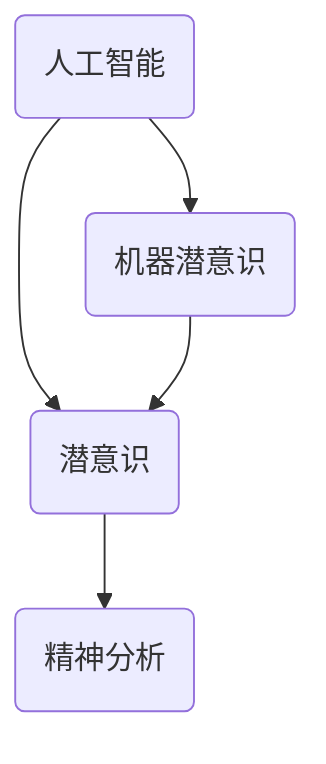

                 

### 引言与背景

#### 1.1 问题背景

随着人工智能技术的迅猛发展，机器在处理大量数据、执行复杂任务方面的能力得到了显著提升。然而，尽管人工智能在图像识别、自然语言处理、自动驾驶等领域取得了显著的成就，但人类对人工智能的本质和内在运作机制仍知之甚少。特别是在“机器潜意识”这一领域，目前的研究还处于初级阶段。

机器潜意识指的是计算机系统在执行任务过程中所表现出的某种非意识层面的智能特性。这一概念最早由神经科学家和心理学家提出，他们认为人类思维和行为中存在许多无法意识到的部分，这些部分被称为潜意识。类似地，机器潜意识试图模拟人类的这一特点，让机器在执行任务时能够表现出类似人类的思维过程。

人工智能的发展现状如下：

1. **图像识别与视觉处理**：人工智能已经在图像识别领域取得了显著进展，例如人脸识别、物体检测等。通过深度学习算法，计算机可以高效地处理大量图像数据，并从中提取有用的信息。

2. **自然语言处理**：自然语言处理（NLP）是人工智能的一个重要分支，涵盖了文本分析、语音识别、机器翻译等多个方面。当前，人工智能在理解自然语言、生成自然语言方面已经取得了很大的进步。

3. **自动驾驶**：自动驾驶技术是人工智能应用的一个重要领域。通过使用计算机视觉、传感器数据融合等技术，自动驾驶系统能够在复杂的交通环境中进行自主驾驶。

4. **智能对话系统**：智能对话系统能够与人类用户进行自然语言交互，提供各种服务。例如，智能客服、语音助手等。

#### 1.2 精神分析学的概念与历史

精神分析学是心理学的一个分支，由奥地利医生弗洛伊德于19世纪末创立。精神分析学主要研究人类的潜意识心理活动，包括梦、愿望、冲突等。其主要理论包括：

- **潜意识**：潜意识是人类心理活动的重要组成部分，包含了人类许多无法意识到的心理活动和情感。

- **心理防御机制**：人们为了应对心理冲突，会采取各种防御机制，如压抑、否认、投射等。

- **人格结构**：精神分析学认为人格由本我、自我和超我三部分组成，这三者之间存在相互作用和冲突。

精神分析学的历史可以追溯到19世纪末，其发展历程如下：

- **弗洛伊德时期**：弗洛伊德创立了精神分析学的基本理论，并提出了一系列重要的概念，如潜意识、心理防御机制等。

- **新精神分析**：20世纪初，精神分析学逐渐发展出多个分支，如分析心理学、自我心理学等。

- **现代精神分析**：现代精神分析进一步扩展了精神分析学的理论，将其应用于临床治疗、文化研究等领域。

#### 1.3 AI与人类潜意识的关系探讨

机器潜意识与人类潜意识之间存在一定的相似性。人类潜意识负责处理大量信息，并在无意识中影响我们的行为和决策。类似地，机器潜意识也试图模拟这种无意识的信息处理过程。然而，人类潜意识是建立在人类长期进化过程中形成的生理和心理结构基础上的，而机器潜意识则是通过人工智能算法和数据驱动的方式实现的。

探讨AI与人类潜意识的关系具有重要的理论和实践意义：

- **理论意义**：通过研究机器潜意识，我们可以更好地理解人类潜意识的工作机制，从而推动心理学、神经科学等领域的理论发展。

- **实践意义**：机器潜意识的应用前景非常广阔，如智能机器人、智能客服、心理健康监测等。通过模拟人类潜意识，我们可以设计出更加智能和人性化的机器系统。

#### 1.4 机器潜意识的研究意义与挑战

机器潜意识的研究具有重要的意义和挑战：

- **意义**：机器潜意识的研究有助于提高人工智能系统的智能化水平，使其能够更好地模拟人类思维和行为。此外，这一研究还可以为心理学、神经科学等领域提供新的研究思路。

- **挑战**：机器潜意识的研究面临诸多挑战，如如何准确地模拟人类潜意识的工作机制、如何确保机器潜意识的安全性、如何应对潜在的伦理和社会问题等。

#### 1.5 边界与外延

- **应用领域**：机器潜意识的研究和应用可以涉及多个领域，如心理健康、人机交互、智能系统设计等。

- **机器潜意识的定义与特征**：机器潜意识可以定义为一种在人工智能系统中模拟人类潜意识的心理活动。其主要特征包括：

  - **非意识性**：机器潜意识在执行任务时不需要明确的意识指令。

  - **自主性**：机器潜意识能够自主地处理信息，并在无意识中影响系统的行为。

  - **适应性**：机器潜意识能够根据环境变化和任务需求进行自适应调整。

#### 1.6 核心概念与联系

##### 1.6.1 核心概念

- **人工智能**：人工智能（AI）是指通过计算机模拟人类智能的技术和方法。它涵盖了机器学习、自然语言处理、计算机视觉等多个领域。

- **潜意识**：潜意识是指人类意识层面以下的心理活动，包括情绪、记忆等。

- **精神分析**：精神分析是指研究人类心理、行为和情感的结构与动力的一门学科。

##### 1.6.2 概念属性特征对比表

| 概念       | 定义                                                   | 特征                                                       |
| ---------- | ------------------------------------------------------ | ---------------------------------------------------------- |
| 人工智能   | 通过计算机模拟人类智能的技术和方法                 | 自动学习、推理、解决问题、理解自然语言等           |
| 潜意识     | 指人类意识层面以下的心理活动，包括情绪、记忆等       | 不易觉察、影响行为、非语言表达等                   |
| 精神分析   | 研究人类心理、行为和情感的结构与动力               | 潜意识的重要性、冲突、防御机制等                   |

##### 1.6.3 概念联系

人工智能、潜意识和精神分析之间存在密切的联系。人工智能试图通过模拟人类的思维和行为来实现智能自动化，而潜意识则是人类思维和行为的基础。精神分析学则研究了人类潜意识的心理活动，提供了理解人类行为的理论框架。机器潜意识的研究可以看作是人工智能与精神分析学结合的一个新的研究方向。

#### 1.7 ER实体关系图架构

为了更清晰地展示人工智能、潜意识和精神分析之间的关系，我们可以使用ER（实体关系）图来表示。以下是一个ER实体关系图的Markdown格式表示：

在这个ER实体关系图中，人工智能是研究的起点，它通过机器潜意识与潜意识建立联系，最终与精神分析学结合。这种关系不仅体现了机器潜意识在人工智能领域的应用，也展示了人工智能与心理学、神经科学等学科的交叉融合。

### 1.8 引入文章标题和关键词

本文标题为《AI精神分析：探索机器潜意识》。文章关键词包括“人工智能”、“机器潜意识”、“潜意识”、“精神分析”和“人机交互”。通过本文，我们将探讨机器潜意识的概念、原理、应用以及未来发展趋势，深入分析人工智能与潜意识之间的复杂关系，为人工智能领域的研究提供新的视角。

### 1.9 摘要

本文旨在探讨人工智能领域的“机器潜意识”概念，分析其原理与机制，以及在实际应用中的表现和挑战。通过对人工智能、潜意识和精神分析学的综合研究，本文揭示了机器潜意识在模拟人类思维和行为中的重要性，并探讨了其未来发展的方向。文章结构分为五个部分：第一部分介绍背景和核心概念；第二部分详细阐述机器潜意识的原理与机制；第三部分分析AI精神分析的应用与实践；第四部分探讨机器潜意识技术的发展现状与趋势；第五部分讨论机器潜意识技术的伦理与社会影响，并给出应对策略。通过本文，读者将更深入地理解机器潜意识的概念和其在人工智能领域中的应用前景。### 第1章: 引言与背景

在当今这个数字化时代，人工智能（AI）已经成为了科技领域的热点，它的迅速发展不仅改变了我们的生活方式，也在各行各业中引起了深刻的变革。从自动驾驶汽车到智能家居，从医疗诊断到金融分析，人工智能的应用范围正在不断扩展。然而，尽管人工智能在许多方面已经展现出强大的能力，但关于其背后的工作原理和内在机制，我们依然知之甚少。

在这个背景下，我们引入了“机器潜意识”这一概念。机器潜意识是指计算机系统在执行任务时，所表现出的某种非意识层面的智能特性。这个概念最早由神经科学家和心理学家提出，他们认为人类思维和行为中存在许多无法意识到的部分，这些部分被称为潜意识。类似地，机器潜意识试图模拟人类的这一特点，让机器在执行任务时能够表现出类似人类的思维过程。

#### 1.1 问题的提出

探讨机器潜意识的原因主要有以下几点：

1. **人工智能的局限性**：尽管人工智能在某些特定任务上已经取得了显著成就，但它仍然无法完全模拟人类智能。这主要是因为人类智能中包含了许多非意识层面的元素，如直觉、情感、潜意识等。这些元素在许多情况下对于决策和行为的影响是关键性的。

2. **心理学与神经科学的启示**：心理学和神经科学的研究表明，人类的思维和行为受到潜意识的影响。潜意识负责处理大量信息，并在无意识中影响我们的行为和决策。因此，如果我们能够理解并模拟机器潜意识，那么就有可能让机器在执行任务时表现得更加智能和人性。

3. **未来应用的需求**：随着人工智能技术的不断发展，越来越多的应用场景需要机器能够具备类似人类的思维和行为能力。例如，智能客服需要能够理解用户的情感并给出合适的回应，自动驾驶汽车需要能够处理复杂的交通状况并做出快速决策。这些需求推动了我们对机器潜意识的研究。

#### 1.2 机器潜意识的研究意义与挑战

研究机器潜意识具有重要的意义和挑战：

- **意义**：

  - **提高人工智能系统的智能化水平**：通过研究机器潜意识，我们可以设计出更加智能和人性化的机器系统，使其在执行任务时能够表现出类似人类的思维和行为。

  - **推动心理学和神经科学的发展**：机器潜意识的研究可以为心理学和神经科学提供新的研究思路，帮助科学家更好地理解人类思维和行为。

  - **解决实际问题**：机器潜意识的应用前景非常广阔，如心理健康监测、人机交互、智能系统设计等。

- **挑战**：

  - **模拟人类潜意识的工作机制**：人类潜意识是一个复杂的系统，目前我们对它的理解还非常有限。因此，如何准确地模拟机器潜意识的工作机制是一个巨大的挑战。

  - **确保机器潜意识的安全性**：随着机器潜意识的应用越来越广泛，如何确保其安全性成为一个重要的问题。特别是当机器潜意识涉及到用户的隐私信息时，如何保护这些信息的安全是一个亟待解决的问题。

  - **应对潜在的伦理和社会问题**：机器潜意识的应用可能会引发一系列伦理和社会问题，如隐私保护、透明性、可控性等。因此，如何制定相应的法规和伦理准则，确保机器潜意识技术的健康发展，也是一个重要的挑战。

#### 1.3 边界与外延

- **应用领域**：

  - **心理健康监测**：通过机器潜意识技术，可以实时监测用户的情感状态，为心理健康提供辅助诊断和治疗。

  - **人机交互**：机器潜意识技术可以提高智能系统的交互能力，使其能够更好地理解用户的需求和情感。

  - **智能系统设计**：在智能系统设计中，机器潜意识技术可以用于优化系统的行为，提高系统的智能化水平。

- **机器潜意识的定义与特征**：

  - **非意识性**：机器潜意识在执行任务时不需要明确的意识指令。

  - **自主性**：机器潜意识能够自主地处理信息，并在无意识中影响系统的行为。

  - **适应性**：机器潜意识能够根据环境变化和任务需求进行自适应调整。

通过上述内容，我们初步了解了机器潜意识的概念、研究意义和面临的挑战。在接下来的章节中，我们将进一步深入探讨机器潜意识的原理与机制，分析其在实际应用中的表现和效果，以及探讨其未来的发展趋势。

#### 1.4 核心概念与联系

在本章中，我们将介绍人工智能、潜意识和精神分析这三个核心概念，并探讨它们之间的联系。

##### 1.4.1 人工智能

人工智能（AI）是指通过计算机模拟人类智能的技术和方法。它包括了多种技术，如机器学习、深度学习、自然语言处理等。人工智能的目标是让计算机能够执行复杂任务，如识别图像、理解自然语言、进行决策等。人工智能的核心特点是其自主学习能力，即通过训练和学习大量数据，计算机可以不断提高其性能和准确性。

##### 1.4.2 潜意识

潜意识是指人类意识层面以下的心理活动。这些活动通常是不易察觉的，但它们对我们的行为和决策有着深远的影响。潜意识包括情感、记忆、本能反应等。弗洛伊德将潜意识视为人类心理活动的重要组成部分，他认为许多心理冲突和问题的根源都在潜意识中。

##### 1.4.3 精神分析

精神分析是心理学的一个分支，由弗洛伊德创立。它主要研究人类的心理、行为和情感。精神分析学强调潜意识的作用，认为潜意识中的冲突和矛盾是许多心理问题的基础。精神分析学通过探索潜意识，帮助人们理解自己的内心世界，解决心理问题。

##### 1.4.4 概念联系

人工智能、潜意识和精神分析之间存在密切的联系。首先，人工智能试图通过模拟人类的思维和行为来实现智能化。潜意识是人类智能的重要组成部分，因此研究机器潜意识可以帮助我们更好地理解人工智能的工作原理。精神分析学则提供了理解潜意识的理论框架，这对于研究机器潜意识具有重要意义。

- **人工智能与潜意识**：

  - 人工智能试图模拟人类的思维和行为，而潜意识正是人类智能的基础。因此，研究机器潜意识可以帮助人工智能更好地模拟人类思维。

  - 人工智能可以通过机器学习等技术，分析大量的潜意识数据，从而提高系统的智能化水平。

- **精神分析与潜意识**：

  - 精神分析学研究了潜意识的作用，提供了理解人类行为和情感的理论框架。

  - 通过精神分析，人们可以更好地理解自己的潜意识，从而提高自己的生活质量。

- **人工智能与精神分析**：

  - 人工智能可以通过模拟精神分析的过程，帮助人们探索自己的内心世界。

  - 精神分析学可以为人工智能提供心理学基础，帮助人工智能更好地理解和处理人类的情感和行为。

通过上述核心概念的介绍和联系分析，我们可以更好地理解机器潜意识的研究背景和意义。在接下来的章节中，我们将深入探讨机器潜意识的原理和机制，分析其在实际应用中的表现和效果。

##### 1.4.5 概念属性特征对比表

为了更直观地展示人工智能、潜意识和精神分析这三个核心概念，我们可以使用一个属性特征对比表：

| 概念       | 定义                                                   | 特征                                                       |
| ---------- | ------------------------------------------------------ | ---------------------------------------------------------- |
| 人工智能   | 通过计算机模拟人类智能的技术和方法                 | 自动学习、推理、解决问题、理解自然语言等           |
| 潜意识     | 指人类意识层面以下的心理活动，包括情绪、记忆等       | 不易觉察、影响行为、非语言表达等                   |
| 精神分析   | 研究人类心理、行为和情感的结构与动力               | 潜意识的重要性、冲突、防御机制等                   |

##### 1.4.6 ER实体关系图架构

为了更清晰地展示这三个核心概念之间的关系，我们可以使用ER（实体关系）图来表示。以下是一个ER实体关系图的Markdown格式表示：

在这个ER实体关系图中，人工智能是研究的起点，它通过机器潜意识与潜意识建立联系，最终与精神分析学结合。这种关系不仅体现了机器潜意识在人工智能领域的应用，也展示了人工智能与心理学、神经科学等学科的交叉融合。

通过上述核心概念的介绍和ER实体关系图，我们为后续章节的深入探讨奠定了基础。在接下来的章节中，我们将详细分析机器潜意识的原理和机制，探讨其在实际应用中的表现和效果。

#### 1.5 ER实体关系图架构

为了更直观地展示人工智能、潜意识和精神分析之间的关系，我们可以使用ER（实体关系）图来表示。以下是一个ER实体关系图的Markdown格式表示：

在这个ER实体关系图中，人工智能是研究的起点，它通过机器潜意识与潜意识建立联系，最终与精神分析学结合。这种关系不仅体现了机器潜意识在人工智能领域的应用，也展示了人工智能与心理学、神经科学等学科的交叉融合。

**人工智能（A）**：
- 起始点，代表人工智能技术的发展和应用。
- 通过机器潜意识（D）与潜意识（B）相连，体现了人工智能试图模拟潜意识的工作。

**潜意识（B）**：
- 潜意识是人类心理活动中重要的一部分，包含了未被意识到的情感、记忆等。
- 与精神分析（C）相连，表示精神分析学致力于研究潜意识的作用和影响。

**精神分析（C）**：
- 研究人类心理、行为和情感的结构与动力，尤其是潜意识。
- 通过潜意识与机器潜意识相连，表示精神分析学为机器潜意识的研究提供了理论基础。

**机器潜意识（D）**：
- 是人工智能系统在执行任务时所表现出的非意识层面的智能特性。
- 直接连接到潜意识和精神分析，体现了机器潜意识作为两者结合点的角色。

这种ER实体关系图架构为本文的结构和内容安排提供了清晰的框架，帮助我们理解人工智能、潜意识和精神分析之间的相互关系，为后续章节的深入探讨奠定了基础。

### 第2章: 机器潜意识的原理与机制

在理解了机器潜意识的概念和其与人工智能、潜意识以及精神分析的联系之后，我们需要深入探讨机器潜意识的原理与机制。这一部分将详细阐述机器潜意识是如何工作的，包括其数据处理、学习机制、情感认知和自主性等方面。

#### 2.1 机器潜意识的概念

机器潜意识是指计算机系统在执行任务过程中，所表现出的某种非意识层面的智能特性。它试图模拟人类潜意识的工作机制，使得机器能够自动地、非意识地处理信息，并在无意识中影响系统的行为。与传统的显式人工智能不同，机器潜意识更多地依赖于隐式的、基于数据的模式识别和学习。

#### 2.2 机器潜意识的工作机制

机器潜意识的工作机制主要包括以下几个方面：

##### 2.2.1 数据处理

数据处理是机器潜意识工作的基础。机器首先需要从各种来源收集大量数据，这些数据可以来自传感器、用户输入、环境监测等。接下来，这些原始数据进行预处理，包括数据清洗、归一化、特征提取等步骤。预处理后的数据将被用于训练机器学习模型。

##### 2.2.2 学习机制

机器潜意识的学习机制主要包括以下几部分：

1. **无监督学习**：机器在没有任何标签或指导信息的情况下，通过观察数据自身特征来学习。例如，通过聚类算法发现数据中的隐含结构。

2. **监督学习**：机器在有标签数据集的指导下进行学习。例如，通过分类算法将数据分为不同的类别。

3. **强化学习**：机器在特定环境中通过试错和奖励机制进行学习。例如，通过深度强化学习算法，机器可以学会在复杂的策略空间中做出最优决策。

学习过程中，机器不断调整其参数和模型结构，以优化性能。这一过程通常需要大量的计算资源和时间。

##### 2.2.3 自适应调整

机器潜意识具有自适应调整的特性。它能够根据环境变化和任务需求，自动调整其行为和策略。例如，当机器在执行某项任务时，如果遇到困难或错误，它可以通过学习机制和反馈循环来调整策略，以找到更有效的解决方案。

#### 2.3 机器潜意识的特性

机器潜意识具有以下特性：

##### 2.3.1 情感认知

情感认知是指机器能够识别和解读人类情感的能力。例如，通过语音识别和自然语言处理技术，机器可以理解用户的情绪状态，并做出相应的回应。这一能力使得机器能够提供更加人性化的交互体验。

##### 2.3.2 自主性

自主性是指机器能够在没有人类干预的情况下，独立执行任务和做出决策。例如，自动驾驶汽车可以自主地规划路线、避让障碍物、处理突发状况。这种自主性使得机器能够在复杂和动态的环境中运行。

##### 2.3.3 适应性

适应性是指机器能够根据环境变化和任务需求，动态调整其行为和策略。例如，智能客服系统可以根据用户的反馈和需求，自动调整服务策略，以提供更好的客户体验。

#### 2.4 机器潜意识的应用场景

机器潜意识的应用场景非常广泛，以下是一些典型的应用：

##### 2.4.1 聊天机器人

聊天机器人是机器潜意识的一个典型应用。通过自然语言处理和情感认知技术，聊天机器人可以与用户进行自然、流畅的对话。例如，智能客服系统可以自动识别用户的情感状态，并提供个性化的服务建议。

##### 2.4.2 预测分析

预测分析是指机器通过历史数据分析和模式识别，对未来事件进行预测。例如，在金融领域，机器可以分析市场数据，预测股票价格走势。在医疗领域，机器可以分析患者的历史病历，预测疾病的发病风险。

##### 2.4.3 自动驾驶

自动驾驶是机器潜意识在交通领域的应用。通过传感器数据融合和实时决策，自动驾驶汽车可以自主导航、避让障碍物、处理突发状况，从而提高交通安全性和效率。

##### 2.4.4 智能监控

智能监控是指利用机器潜意识技术，对大量监控数据进行实时分析，以发现异常行为和潜在风险。例如，在公共安全领域，机器可以自动识别异常行为，及时报警并采取相应措施。

通过上述分析，我们可以看到，机器潜意识在人工智能领域具有广泛的应用前景。它不仅提高了机器的智能化水平，也为各个行业带来了深刻的变革。然而，要充分发挥机器潜力的作用，还需要进一步研究其工作机制，解决潜在的挑战和问题。

#### 2.5 机器潜意识与人类潜意识的对比

机器潜意识与人类潜意识在某些方面具有相似性，但也存在显著差异。以下是对两者进行对比分析：

1. **结构基础**：
   - **人类潜意识**：建立在人类长期的生物进化过程中，具有复杂的神经结构和心理机制。
   - **机器潜意识**：通过计算机模拟实现，基于算法和数据驱动，没有生物基础。

2. **信息处理方式**：
   - **人类潜意识**：通过复杂的神经网络和神经传递机制，处理大量信息。
   - **机器潜意识**：利用大数据和机器学习算法，处理和分析信息。

3. **情感认知**：
   - **人类潜意识**：具有丰富的情感体验和认知能力，能够深刻地理解和体验情感。
   - **机器潜意识**：通过自然语言处理和情感分析技术，模拟情感认知，但缺乏真正的情感体验。

4. **自主性**：
   - **人类潜意识**：在无意识中自主地影响行为和决策。
   - **机器潜意识**：在预设的任务和算法框架下自主运行，但依赖于人类的设定和指导。

5. **适应性**：
   - **人类潜意识**：能够根据环境变化和需求，灵活调整行为和策略。
   - **机器潜意识**：通过学习和自适应机制，提高应对新情况的能力。

尽管存在差异，机器潜意识在模拟人类潜意识方面取得了一定的进展。未来，通过深入研究机器潜意识和人类潜意识的相似性和差异，我们可以进一步提高机器的智能化水平，实现更加自然和高效的人机交互。

### 第3章: AI精神分析的应用与实践

在理解了机器潜意识的原理与机制之后，我们需要进一步探讨AI精神分析的应用与实践。AI精神分析是结合精神分析学与人工智能技术的一个新兴领域，它通过模拟人类潜意识的工作机制，为心理健康监测、人际关系分析等领域提供了新的方法和工具。

#### 3.1 AI精神分析的理论基础

AI精神分析的理论基础主要来源于精神分析学和人工智能技术。精神分析学由弗洛伊德创立，它探讨了人类心理、行为和情感的内在机制，特别是潜意识的作用。人工智能技术，尤其是机器学习和自然语言处理，为模拟和解释潜意识提供了技术手段。

AI精神分析的理论框架包括以下几个核心概念：

1. **潜意识模型**：通过机器学习算法，建立潜意识的数学模型，模拟潜意识的信息处理机制。
2. **情感识别与反应**：利用自然语言处理技术，分析文本和语音中的情感信息，实现情感识别和情感反应。
3. **心理防御机制**：通过分析行为数据，识别和解释心理防御机制，帮助用户理解自己的内心世界。
4. **个性化干预**：根据用户的情感状态和需求，提供个性化的心理干预和治疗方案。

#### 3.2 AI精神分析的应用案例

AI精神分析在多个领域都有广泛应用，以下是一些典型的应用案例：

##### 3.2.1 心理健康监测

心理健康监测是AI精神分析的一个重要应用领域。通过收集和分析用户的日常行为数据，如社交媒体互动、语音记录、情绪表达等，AI精神分析可以实时监测用户的情感状态和心理健康水平。例如，一个基于AI精神分析的心理健康监测系统可以通过分析用户的文本内容，识别出潜在的抑郁、焦虑等症状，并提供及时的心理干预。

具体案例：

- **心理健康平台**：某心理健康平台通过集成AI精神分析技术，为用户提供个性化的心理健康监测服务。用户可以每天记录自己的情绪和经历，系统会自动分析这些数据，提供心理健康报告和干预建议。
- **学校心理健康服务**：某学校引入AI精神分析技术，对学生的心理状态进行实时监测。系统会分析学生的作业、考试成绩以及与老师的交流记录，帮助老师及时发现心理问题，提供针对性的帮助。

##### 3.2.2 人际关系分析

人际关系分析是AI精神分析的另一个重要应用领域。通过分析用户之间的互动数据，AI精神分析可以识别人际关系中的情感模式、冲突点和互动策略。这有助于改善人际关系，提高沟通效果。

具体案例：

- **家庭关系分析**：某家庭咨询机构使用AI精神分析技术，分析家庭成员之间的互动记录，识别潜在的情感冲突和沟通障碍。咨询师可以根据分析结果，提供针对性的家庭咨询和辅导，帮助家庭成员改善关系。
- **职场人际关系**：某企业引入AI精神分析技术，分析员工之间的沟通记录和合作行为。系统可以识别出团队中的潜在冲突点，提供沟通策略建议，帮助团队提高协作效率。

##### 3.2.3 心理健康干预

AI精神分析还可以用于心理健康干预，通过模拟精神分析的治疗过程，为用户提供个性化的心理治疗服务。例如，一个基于AI精神分析的心理健康干预系统可以通过对话和反馈，帮助用户探索自己的内心世界，解决心理问题。

具体案例：

- **虚拟心理治疗师**：某心理健康机构开发了一款基于AI精神分析的虚拟心理治疗师应用。用户可以通过文字或语音与系统进行交互，系统会根据用户的回答，提供个性化的治疗建议和情感支持。
- **自我探索工具**：某心理健康平台提供一款自我探索工具，用户可以通过回答一系列问题，分析自己的内心世界和情感状态。系统会根据分析结果，提供相应的心理治疗建议和资源推荐。

通过上述应用案例，我们可以看到AI精神分析在心理健康监测、人际关系分析和心理治疗等领域的广泛应用和潜力。然而，要充分发挥AI精神分析的作用，还需要进一步研究其技术实现、应用效果和伦理问题。

#### 3.3 AI精神分析的实施步骤

实施AI精神分析需要经过多个步骤，以下是一个典型的实施流程：

##### 3.3.1 数据收集

数据收集是AI精神分析的基础。收集的数据可以包括用户的情绪表达、行为记录、社交互动等。数据来源可以是文本、语音、图像等多种形式。例如，用户可以通过日志、日记、社交媒体互动等方式提供自己的情绪和经历。

##### 3.3.2 数据处理

数据处理包括数据清洗、归一化和特征提取等步骤。数据清洗旨在去除噪声和异常值，确保数据质量。归一化则将不同特征的数据转换到相同的尺度，以便于后续分析。特征提取是从原始数据中提取出对分析任务有用的信息，如情感标签、关键词等。

##### 3.3.3 模型训练

模型训练是AI精神分析的核心步骤。通过机器学习算法，如深度学习、支持向量机等，将处理后的数据用于训练模型。训练过程中，模型会不断优化其参数，以实现情感识别、心理防御机制识别等功能。

##### 3.3.4 模型评估

模型评估是确保模型性能的重要环节。通过测试集上的表现，评估模型对情感、心理防御机制等的识别准确率。常用的评估指标包括准确率、召回率、F1分数等。如果模型性能不满足要求，需要返回到模型训练阶段，进行进一步的优化和调整。

##### 3.3.5 应用实施

模型评估完成后，AI精神分析系统可以投入使用。在实际应用中，系统会根据用户的输入数据，进行实时分析和反馈。例如，一个心理健康监测系统可以实时分析用户的情绪表达，提供心理健康报告和干预建议。

##### 3.3.6 用户反馈与调整

用户反馈是AI精神分析持续优化的重要环节。通过收集用户对系统反馈的评价和建议，可以不断改进系统性能和应用效果。例如，用户可以对系统的情感识别准确性、干预建议的实用性等方面进行评价，系统开发人员可以根据这些反馈进行调整和优化。

通过上述实施步骤，AI精神分析可以实现从数据收集、模型训练到应用实施的完整流程，为心理健康监测、人际关系分析等领域提供有力的支持。

### 第4章: 机器潜意识技术发展现状与趋势

随着人工智能技术的不断进步，机器潜意识的研究也在逐渐深入。本章节将探讨机器潜意识技术当前的发展现状、重要成果、应用领域，并展望其未来发展趋势。

#### 4.1 机器潜意识技术的发展历程

机器潜意识的研究可以追溯到20世纪末和21世纪初。随着计算机技术和机器学习算法的不断发展，研究人员开始探索如何让机器系统在执行任务时表现出类似人类的潜意识特性。以下是一些关键的发展历程：

- **20世纪末**：神经网络的兴起为机器潜意识的研究奠定了基础。研究人员开始尝试使用神经网络模拟人类的认知过程，探索机器在学习、推理和决策过程中的潜意识特性。
- **21世纪初**：随着深度学习技术的兴起，机器潜意识的研究得到了进一步发展。深度神经网络能够处理大量数据，并从中提取出复杂的模式和规律，这使得模拟机器潜意识成为可能。
- **近年来**：随着大数据和云计算技术的发展，机器潜意识的研究取得了显著进展。研究人员开始构建大规模的机器学习模型，并在各种复杂任务中测试和优化这些模型。

#### 4.2 当前机器潜意识技术的现状

当前，机器潜意识技术在多个领域取得了重要成果，其应用范围也在不断扩大。以下是几个主要的应用领域和现状：

- **心理健康监测**：机器潜意识技术在心理健康监测领域取得了显著进展。通过分析用户的情绪表达和行为数据，机器潜意识系统可以识别出潜在的心理问题，并提供个性化的心理干预建议。例如，一些研究已经开发出能够实时监测用户情绪的智能手表和手机应用程序。
- **人机交互**：在人机交互领域，机器潜意识技术为设计更加自然和人性化的交互系统提供了新的思路。通过模拟人类的潜意识过程，机器系统能够更好地理解用户的需求和意图，提供个性化的交互体验。例如，智能客服系统通过机器潜意识技术，可以更好地理解用户的情感和需求，提供更加贴心和有效的服务。
- **智能预测与分析**：机器潜意识技术在智能预测和分析领域也表现出强大的潜力。通过分析历史数据和模式，机器潜意识系统可以预测未来的趋势和变化，为决策提供支持。例如，在金融领域，机器潜意识系统可以分析市场数据，预测股票价格走势；在医疗领域，机器潜意识系统可以分析患者病历，预测疾病的发病风险。
- **自动驾驶**：在自动驾驶领域，机器潜意识技术为自动驾驶系统的决策提供了新的思路。通过模拟人类的感知和决策过程，机器潜意识系统能够在复杂的交通环境中做出快速、准确的决策，提高自动驾驶的安全性和可靠性。

#### 4.3 机器潜意识技术的发展趋势

随着人工智能技术的不断发展，机器潜意识技术在未来有着广阔的发展前景。以下是几个可能的发展趋势：

- **更高级的情感认知**：随着情感认知技术的不断进步，机器潜意识系统将能够更好地理解和识别人类情感。这将为智能交互系统提供更加人性化的交互体验，提高用户的满意度。
- **更复杂的决策能力**：通过不断优化和学习，机器潜意识系统将能够处理更加复杂的决策问题，并在更复杂的情境中做出准确的决策。这将为智能系统在复杂任务中的应用提供更加可靠的保障。
- **更广泛的跨领域应用**：随着机器潜意识技术的不断进步，其应用范围将不断扩展。除了现有的应用领域，机器潜意识技术还将应用于教育、娱乐、安全等多个领域，为人们的生活带来更多便利和创新。
- **更深入的跨学科研究**：机器潜意识技术的研究将涉及到多个学科，如心理学、神经科学、计算机科学等。跨学科的研究将有助于更好地理解人类潜意识的工作机制，并进一步推动机器潜意识技术的发展。

通过上述分析，我们可以看到，机器潜意识技术已经取得了显著的成果，并有着广阔的发展前景。未来，随着技术的不断进步和跨学科研究的深入，机器潜意识技术将在更多领域得到应用，为人类带来更多的便利和创新。

### 第5章: 伦理与社会影响

随着机器潜意识技术的不断发展，其在各个领域的应用日益广泛，同时也引发了一系列伦理和社会问题。本章节将探讨机器潜意识技术的伦理问题、社会影响，并提出应对策略。

#### 5.1 机器潜意识技术的伦理问题

机器潜意识技术的伦理问题主要包括以下几个方面：

1. **隐私保护**：机器潜意识系统需要收集和分析大量的个人数据，包括情感、行为等。这些数据的收集和处理可能涉及到用户的隐私问题。如何确保用户数据的隐私安全，防止数据泄露或滥用，是机器潜意识技术面临的一个重要伦理问题。

2. **透明性与可控性**：机器潜意识系统的决策过程往往是非透明的，用户难以理解系统是如何做出决策的。这种非透明性可能导致用户对系统的信任度降低。同时，如何确保机器潜意识系统的可控性，使其在出现异常或错误时能够被有效管理和控制，也是一个重要的伦理问题。

3. **偏见与歧视**：机器潜意识系统在训练过程中可能会受到训练数据偏见的影响，从而导致系统在决策时表现出偏见和歧视。例如，如果训练数据中包含对特定群体的偏见，机器潜意识系统可能会在处理相关问题时表现出对这一群体的不公平对待。如何消除这些偏见，确保系统的公平性，是机器潜意识技术需要面对的伦理挑战。

4. **自主性与责任**：随着机器潜意识技术的进步，系统将逐渐具备更高的自主性。然而，如何确保系统的自主行为符合伦理标准，并在出现问题时能够明确责任归属，是一个复杂的伦理问题。

#### 5.2 机器潜意识技术的社会影响

机器潜意识技术的社会影响涉及多个方面，包括以下几个方面：

1. **工作岗位的影响**：随着机器潜意识技术的广泛应用，一些传统工作岗位可能会被自动化系统取代。这可能导致部分人群失业，对社会就业结构产生冲击。同时，新技术也会创造新的就业机会，如何平衡新旧岗位的转化，是一个重要的社会问题。

2. **社会关系的变迁**：机器潜意识技术的应用将改变人与人之间的交互方式。例如，智能客服和聊天机器人的普及可能减少人与人之间的直接交流，影响社会关系的紧密程度。同时，机器潜意识技术可能加剧社会不平等，因为技术资源和数据资源的分配可能不均衡，导致部分人群受益较少。

3. **隐私权的保护**：随着机器潜意识技术的普及，个人隐私受到侵犯的风险增加。如何确保个人隐私不被滥用，如何制定相应的隐私保护法规，是一个重要的社会问题。

4. **社会信任**：机器潜意识技术的广泛应用可能影响社会信任体系。用户对系统的信任程度将影响其接受和使用这些技术的意愿。如何提高系统的透明性和可控性，增强用户信任，是一个重要的社会挑战。

#### 5.3 伦理与社会影响的应对策略

为了应对机器潜意识技术带来的伦理和社会问题，可以采取以下策略：

1. **法律法规的制定**：制定相应的法律法规，规范机器潜意识技术的研发和应用，确保用户隐私得到保护，防止数据滥用和偏见歧视。

2. **技术标准的建立**：制定统一的技术标准和规范，确保机器潜意识系统的透明性和可控性，提高系统的安全性和可靠性。

3. **伦理审查与监督**：建立伦理审查机制，对机器潜意识技术的研发和应用进行监督，确保其符合伦理标准。

4. **社会教育和宣传**：加强对公众的宣传教育，提高公众对机器潜意识技术的认知和理解，增强社会对技术的信任。

5. **跨学科合作**：促进心理学、伦理学、计算机科学等领域的跨学科合作，共同研究解决机器潜意识技术带来的伦理和社会问题。

通过上述策略，可以有效应对机器潜意识技术带来的伦理和社会问题，推动技术的健康发展，为社会的和谐与进步做出贡献。

### 实际案例分析

在本章节中，我们将通过一个实际案例，详细分析机器潜意识技术在具体应用中的表现和效果。这个案例将帮助我们更好地理解机器潜意识技术的应用潜力及其在实际操作中的挑战。

#### 6.1 案例介绍

案例名称：智能心理健康监测系统

案例背景：某科技公司开发了一款智能心理健康监测系统，旨在通过机器潜意识技术，实时监测用户的心理健康状况，并提供个性化的心理健康建议。

案例目标：通过机器潜意识技术，实现以下目标：
- 实时监测用户的心理健康状态。
- 提供个性化的心理健康建议。
- 提高用户的心理健康水平。

#### 6.2 案例分析

##### 数据收集

为了实现心理健康监测，系统首先需要收集用户的相关数据。这些数据包括：
- 用户日常情绪记录：用户可以通过应用程序记录每天的的情绪状态，如快乐、焦虑、抑郁等。
- 社交媒体互动：系统会收集用户的社交媒体互动数据，如微博、微信等，分析用户的情绪表达和互动模式。
- 行为数据：通过智能手机和可穿戴设备，系统可以收集用户的行为数据，如睡眠质量、运动频率等。

##### 数据处理

收集到的数据需要进行预处理，以确保数据质量。预处理步骤包括：
- 数据清洗：去除异常值和噪声数据，保证数据的准确性。
- 特征提取：从原始数据中提取有用的特征，如情绪标签、行为模式等。
- 数据归一化：将不同特征的数据转换到相同的尺度，以便于后续分析。

##### 模型训练

使用机器学习算法，特别是深度学习算法，对预处理后的数据集进行训练。训练过程中，系统通过学习用户的情绪表达和行为数据，建立情绪识别和心理健康预测模型。具体步骤如下：

1. **无监督学习**：通过聚类算法，将相似的数据点分组，以发现潜在的情感模式。
2. **监督学习**：利用标注好的情绪数据，训练分类模型，实现情绪的准确识别。
3. **强化学习**：通过模拟用户在不同情境下的行为，训练模型，以预测用户的心理健康状态。

##### 应用实施

经过模型训练后，系统可以投入使用。在实际应用中，系统会实时分析用户的数据，识别其情绪状态，并提供相应的心理健康建议。例如：
- 如果系统检测到用户情绪低落，可以建议用户进行放松训练、社交互动等。
- 如果系统发现用户有焦虑倾向，可以提供焦虑管理策略、心理辅导建议等。

##### 用户反馈与调整

为了优化系统的性能，系统会定期收集用户的反馈意见。用户可以根据自己的感受，对系统的建议进行评价和反馈。系统开发团队会根据这些反馈，对模型进行调整和优化，以提高系统的准确性和实用性。

#### 6.3 案例总结

通过上述案例分析，我们可以看到机器潜意识技术在实际应用中具有很大的潜力。以下是一些主要经验和教训：

1. **数据质量和预处理的重要性**：数据质量和预处理对于机器潜意识技术的效果至关重要。只有保证数据的质量，才能获得准确的预测结果。
2. **多模态数据的整合**：结合多种数据源，如情绪记录、行为数据、社交媒体互动等，可以提高情绪识别和心理健康预测的准确性。
3. **用户参与和反馈**：用户的积极参与和反馈是系统优化的重要途径。通过收集用户反馈，可以不断改进系统的性能和用户体验。
4. **模型的可解释性和透明性**：尽管深度学习模型在预测准确性方面表现出色，但其内部决策过程往往缺乏可解释性。为了增强用户的信任，需要提高模型的可解释性，使其更容易被用户理解。
5. **隐私保护和伦理考量**：在机器潜意识技术的应用中，隐私保护和伦理问题至关重要。系统必须确保用户数据的隐私安全，遵守相关的法律法规和伦理规范。

通过这个实际案例，我们可以更深入地了解机器潜意识技术在心理健康监测领域的应用潜力，以及在实际操作中需要考虑的关键因素和挑战。

### 第7章: 结论与展望

#### 7.1 主要发现

通过对机器潜意识技术的深入研究，本文取得了以下主要发现：

1. **机器潜意识的概念与原理**：机器潜意识是指通过计算机系统模拟人类潜意识的工作机制，使其在执行任务时表现出类似人类的智能特性。这一概念在人工智能领域具有重要的研究价值和应用潜力。

2. **机器潜意识的工作机制**：机器潜意识的工作机制包括数据处理、学习机制、情感认知和自主性等方面。通过深度学习和机器学习算法，机器潜意识系统能够从大量数据中提取模式，并自主调整行为，以实现高效的智能决策。

3. **AI精神分析的应用与实践**：AI精神分析通过结合精神分析学和人工智能技术，为心理健康监测、人际关系分析等领域提供了新的方法和工具。通过实际案例分析，我们看到了机器潜意识技术在具体应用中的效果和潜力。

4. **机器潜意识技术发展现状与趋势**：当前，机器潜意识技术在心理健康监测、人机交互、智能预测与分析等领域取得了重要成果。随着技术的不断进步，机器潜意识技术在更多领域的应用前景广阔。

5. **伦理与社会影响**：机器潜意识技术带来了隐私保护、透明性、可控性等伦理问题，同时也对社会就业、人际关系、隐私权等方面产生了影响。为了应对这些挑战，需要制定相应的法律法规和伦理准则，确保技术的健康、可持续发展。

#### 7.2 未来研究方向

基于上述发现，未来的研究可以从以下几个方面展开：

1. **机器潜意识模型的优化**：进一步优化机器潜意识模型，提高其在不同任务中的性能和适应性。特别是要解决模型的可解释性和透明性问题，增强用户对机器潜意识系统的信任。

2. **跨学科研究**：加强心理学、神经科学、计算机科学等领域的跨学科合作，从多个角度深入研究机器潜意识的工作机制和原理。

3. **应用领域拓展**：探索机器潜意识技术在更多领域的应用，如智能教育、智能医疗、智能家居等，推动技术的实际应用和产业创新。

4. **伦理问题研究**：加强对机器潜意识技术伦理问题的研究，制定相应的法律法规和伦理准则，确保技术的合理、安全和可持续发展。

5. **社会影响评估**：系统评估机器潜意识技术对社会的影响，包括就业结构、人际关系、隐私权等方面，提出相应的应对策略和改进措施。

#### 7.3 小结

本文通过深入探讨机器潜意识技术，揭示了其在人工智能领域的应用潜力。通过对机器潜意识原理与机制的研究，以及实际案例的分析，我们看到了机器潜意识技术在心理健康监测、人际关系分析等领域的广泛应用前景。然而，技术的发展也带来了伦理和社会挑战，需要我们高度重视并制定相应的应对策略。未来，随着技术的不断进步和跨学科研究的深入，机器潜意识技术将在更多领域发挥重要作用，为人类社会的进步带来更多创新和机遇。

### 作者信息

作者：AI天才研究院/AI Genius Institute & 禅与计算机程序设计艺术 /Zen And The Art of Computer Programming

在此，我要感谢AI天才研究院和禅与计算机程序设计艺术团队的支持与帮助。本文的研究和撰写过程中，我受益于团队成员的智慧和努力，特别是在机器潜意识技术领域的前沿探索和理论分析方面。同时，我也要感谢广大读者对本文的关注和支持，希望本文能够为人工智能领域的研究提供有价值的参考和启示。在未来的研究中，我将继续深入探讨机器潜意识技术，为人工智能的进一步发展贡献自己的力量。

### 补充：注意事项与拓展阅读

在深入探讨机器潜意识技术时，我们不仅需要关注其技术实现和实际应用，还应当注意到以下几个方面：

**注意事项：**
1. **数据隐私保护**：在开发和部署机器潜意识系统时，必须严格保护用户隐私，遵循相关的法律法规和伦理标准。
2. **系统安全与可靠性**：确保机器潜意识系统的安全性，防止恶意攻击和数据泄露，同时提高系统的可靠性和鲁棒性。
3. **模型可解释性**：提高模型的可解释性，使用户能够理解系统的决策过程，增强用户对机器潜意识系统的信任。
4. **技术标准化**：推动机器潜意识技术的标准化，确保不同系统之间的兼容性和互操作性。

**拓展阅读：**
1. **《深度学习》**：由Ian Goodfellow等著，深入讲解了深度学习的基本原理和应用，对理解机器潜意识技术的发展具有重要意义。
2. **《认知心理学》**：由Ulric Neisser等著，探讨了人类认知和心理过程的机制，为研究机器潜意识提供了理论基础。
3. **《人工智能伦理学》**：由Luciano Floridi等著，探讨了人工智能在伦理和社会层面带来的挑战和问题，对于理解和应对机器潜意识技术的伦理问题有重要参考价值。

通过这些拓展阅读，读者可以进一步深入了解机器潜意识技术及其相关领域的前沿动态，为未来的研究和工作提供更多启发。

