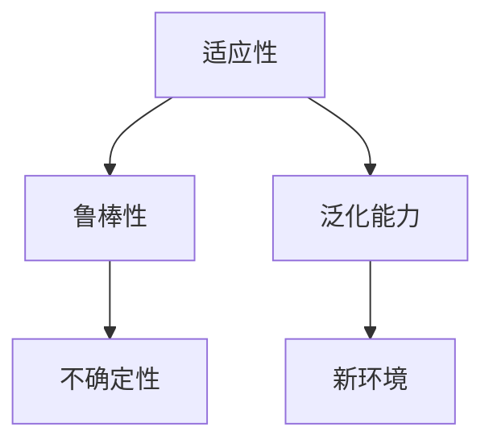
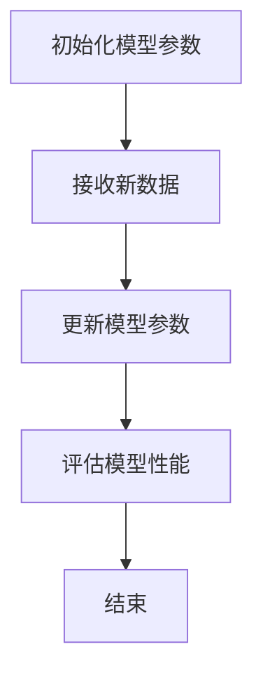
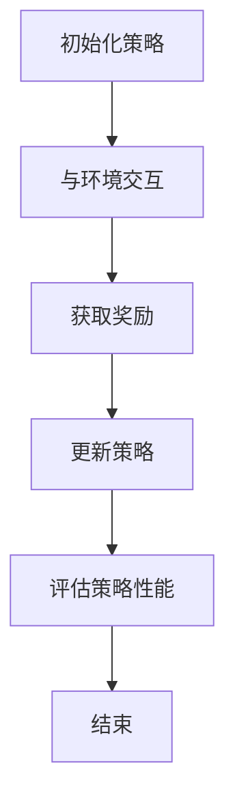
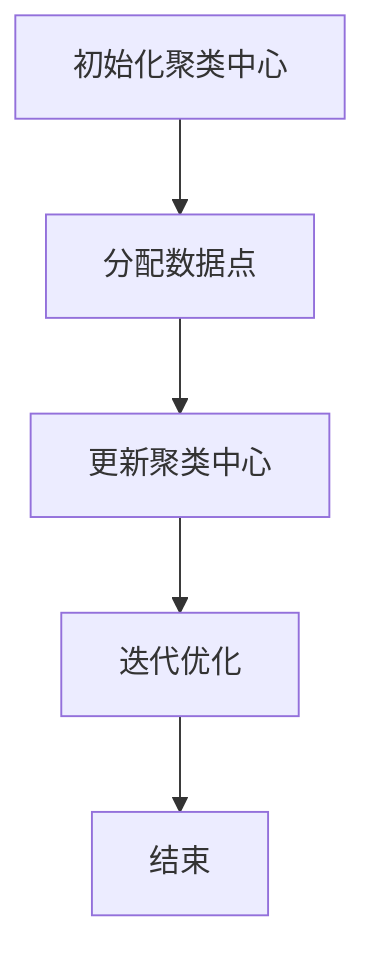
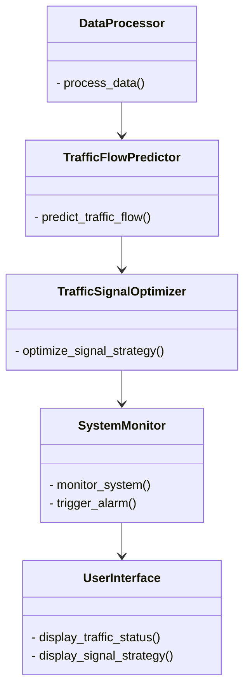
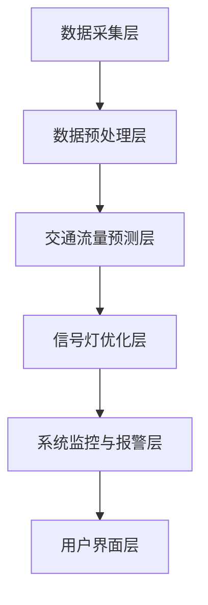
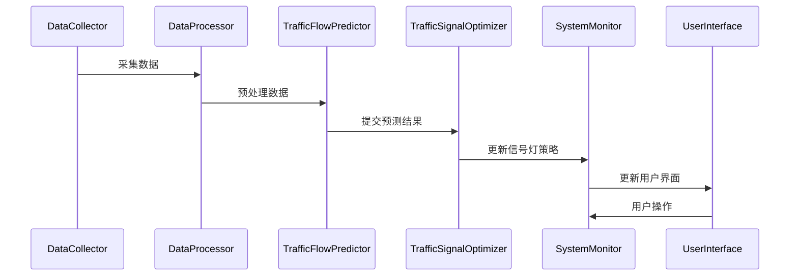
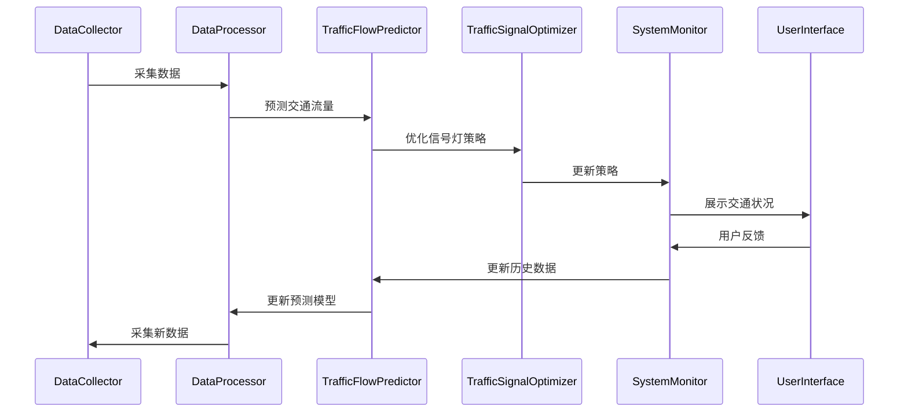

                 


## AI系统在处理动态变化环境时的适应策略

### 引言与背景

人工智能（AI）作为计算机科学的前沿领域，已经深刻地影响了我们的日常生活和社会发展。从自动驾驶汽车到智能家居，从医疗诊断到金融交易，AI系统的应用无处不在。然而，随着大数据、云计算和深度学习等技术的不断发展，AI系统在处理动态变化环境时的适应策略变得尤为重要。

动态变化环境是指系统的输入、状态和输出都可能随时间发生变化的环境。在这样复杂多变的环境中，AI系统原有的算法和策略可能会失效，导致系统性能下降甚至崩溃。因此，如何保证AI系统在动态变化环境中的有效性，成为当前AI研究的重要课题。

#### 问题背景

动态变化环境中的挑战主要体现在以下几个方面：

1. **环境不确定性**：动态变化环境中的不确定性因素多，如数据噪声、外部干扰等，这些因素可能影响系统的输入和输出。
2. **数据不稳定性**：动态变化环境中的数据可能随着时间不断变化，传统的数据预处理方法可能不再适用。
3. **算法适应性**：传统静态环境下的算法可能在动态环境中失效，需要开发能够自动调整参数和策略的适应算法。

#### 问题描述

在动态变化环境中，AI系统需要具备以下几个关键能力：

1. **适应性**：系统能够根据环境变化动态调整自身的算法和策略。
2. **鲁棒性**：系统能够在面临不确定性时保持稳定运行。
3. **泛化能力**：系统能够从已有知识中提取通用规律，适应新的环境。

为了解决这些问题，我们需要从以下几个方面展开研究：

1. **核心概念与联系**：介绍AI系统适应策略的核心概念，并分析各概念之间的联系。
2. **算法原理讲解**：阐述适应策略的算法原理，并通过mermaid流程图和Python代码进行详细讲解。
3. **数学模型与公式**：给出算法的数学模型和公式，并进行通俗易懂的举例说明。
4. **系统分析与架构设计方案**：介绍系统功能设计、架构设计和接口设计，并使用mermaid类图和序列图进行可视化。
5. **项目实战**：通过实际案例分析和详细讲解，展示适应策略的应用效果。

### 边界与外延

本书主要关注通用AI系统在动态变化环境中的适应策略，不包括特定领域的AI应用。此外，本书所涉及的适应策略主要基于机器学习和深度学习技术，不涉及传统的人工智能算法。

### 概念结构与核心要素组成

#### 核心概念

1. **适应性**：系统能够根据环境变化动态调整自身的算法和策略。
2. **鲁棒性**：系统能够在面临不确定性时保持稳定运行。
3. **泛化能力**：系统能够从已有知识中提取通用规律，适应新的环境。

#### 关联概念

1. **机器学习**：一种通过数据驱动的方式，使计算机具备学习能力的技术。
2. **深度学习**：一种基于多层神经网络的学习方法，能够从大量数据中自动提取特征。
3. **大数据**：指无法通过传统数据处理方式在合理时间内进行管理和处理的数据集合。
4. **云计算**：一种通过网络提供计算资源、存储资源和服务资源的技术。

### 本章小结

本章对本书的主题进行了引言和背景介绍，明确了研究问题，并概述了可能的解决方法和核心概念。下一章将详细介绍AI系统适应策略的核心概念和原理。通过逐步分析推理，我们将深入探讨如何构建一个能够在动态变化环境中保持高效运行的AI系统。让我们开始这一段探索之旅。# AI系统在处理动态变化环境时的适应策略

关键词：人工智能，动态变化环境，适应性，鲁棒性，泛化能力

摘要：本文将探讨人工智能系统在处理动态变化环境时的适应策略。通过对核心概念和算法原理的深入分析，我们将介绍如何构建一个具备适应性、鲁棒性和泛化能力的AI系统，以应对复杂多变的环境挑战。

## 第一部分：引言与背景

### 1. 引言

人工智能（AI）作为计算机科学的前沿领域，已经深刻地影响了我们的日常生活和社会发展。从自动驾驶汽车到智能家居，从医疗诊断到金融交易，AI系统的应用无处不在。然而，随着大数据、云计算和深度学习等技术的不断发展，AI系统在处理动态变化环境时的适应策略变得尤为重要。

动态变化环境是指系统的输入、状态和输出都可能随时间发生变化的环境。在这样的复杂多变的环境中，AI系统原有的算法和策略可能会失效，导致系统性能下降甚至崩溃。因此，如何保证AI系统在动态变化环境中的有效性，成为当前AI研究的重要课题。

### 2. 问题背景

动态变化环境中的挑战主要体现在以下几个方面：

1. **环境不确定性**：动态变化环境中的不确定性因素多，如数据噪声、外部干扰等，这些因素可能影响系统的输入和输出。
2. **数据不稳定性**：动态变化环境中的数据可能随着时间不断变化，传统的数据预处理方法可能不再适用。
3. **算法适应性**：传统静态环境下的算法可能在动态环境中失效，需要开发能够自动调整参数和策略的适应算法。

### 3. 问题描述

在动态变化环境中，AI系统需要具备以下几个关键能力：

1. **适应性**：系统能够根据环境变化动态调整自身的算法和策略。
2. **鲁棒性**：系统能够在面临不确定性时保持稳定运行。
3. **泛化能力**：系统能够从已有知识中提取通用规律，适应新的环境。

### 4. 问题解决

为了解决这些问题，我们需要从以下几个方面展开研究：

1. **核心概念与联系**：介绍AI系统适应策略的核心概念，并分析各概念之间的联系。
2. **算法原理讲解**：阐述适应策略的算法原理，并通过mermaid流程图和Python代码进行详细讲解。
3. **数学模型与公式**：给出算法的数学模型和公式，并进行通俗易懂的举例说明。
4. **系统分析与架构设计方案**：介绍系统功能设计、架构设计和接口设计，并使用mermaid类图和序列图进行可视化。
5. **项目实战**：通过实际案例分析和详细讲解，展示适应策略的应用效果。

### 5. 边界与外延

本书主要关注通用AI系统在动态变化环境中的适应策略，不包括特定领域的AI应用。此外，本书所涉及的适应策略主要基于机器学习和深度学习技术，不涉及传统的人工智能算法。

### 6. 概念结构与核心要素组成

#### 核心概念

1. **适应性**：系统能够根据环境变化动态调整自身的算法和策略。
2. **鲁棒性**：系统能够在面临不确定性时保持稳定运行。
3. **泛化能力**：系统能够从已有知识中提取通用规律，适应新的环境。

#### 关联概念

1. **机器学习**：一种通过数据驱动的方式，使计算机具备学习能力的技术。
2. **深度学习**：一种基于多层神经网络的学习方法，能够从大量数据中自动提取特征。
3. **大数据**：指无法通过传统数据处理方式在合理时间内进行管理和处理的数据集合。
4. **云计算**：一种通过网络提供计算资源、存储资源和服务资源的技术。

### 7. 本章小结

本章对本书的主题进行了引言和背景介绍，明确了研究问题，并概述了可能的解决方法和核心概念。下一章将详细介绍AI系统适应策略的核心概念和原理。通过逐步分析推理，我们将深入探讨如何构建一个能够在动态变化环境中保持高效运行的AI系统。让我们开始这一段探索之旅。## 第一部分：引言与背景

### 1. 引言

人工智能（AI）作为计算机科学的前沿领域，已经深刻地影响了我们的日常生活和社会发展。从自动驾驶汽车到智能家居，从医疗诊断到金融交易，AI系统的应用无处不在。然而，随着大数据、云计算和深度学习等技术的不断发展，AI系统在处理动态变化环境时的适应策略变得尤为重要。

动态变化环境是指系统的输入、状态和输出都可能随时间发生变化的环境。在这样的复杂多变的环境中，AI系统原有的算法和策略可能会失效，导致系统性能下降甚至崩溃。因此，如何保证AI系统在动态变化环境中的有效性，成为当前AI研究的重要课题。

### 2. 问题背景

动态变化环境中的挑战主要体现在以下几个方面：

1. **环境不确定性**：动态变化环境中的不确定性因素多，如数据噪声、外部干扰等，这些因素可能影响系统的输入和输出。
2. **数据不稳定性**：动态变化环境中的数据可能随着时间不断变化，传统的数据预处理方法可能不再适用。
3. **算法适应性**：传统静态环境下的算法可能在动态环境中失效，需要开发能够自动调整参数和策略的适应算法。

### 3. 问题描述

在动态变化环境中，AI系统需要具备以下几个关键能力：

1. **适应性**：系统能够根据环境变化动态调整自身的算法和策略。
2. **鲁棒性**：系统能够在面临不确定性时保持稳定运行。
3. **泛化能力**：系统能够从已有知识中提取通用规律，适应新的环境。

为了解决这个问题，我们需要从以下几个方面展开研究：

1. **核心概念与联系**：介绍AI系统适应策略的核心概念，并分析各概念之间的联系。
2. **算法原理讲解**：阐述适应策略的算法原理，并通过mermaid流程图和Python代码进行详细讲解。
3. **数学模型与公式**：给出算法的数学模型和公式，并进行通俗易懂的举例说明。
4. **系统分析与架构设计方案**：介绍系统功能设计、架构设计和接口设计，并使用mermaid类图和序列图进行可视化。
5. **项目实战**：通过实际案例分析和详细讲解，展示适应策略的应用效果。

### 4. 问题解决

首先，我们需要明确AI系统适应策略的核心概念，包括：

- **适应性**：指的是AI系统能够根据环境变化动态调整自身的算法和策略。
- **鲁棒性**：指的是AI系统能够在面临不确定性因素时保持稳定运行。
- **泛化能力**：指的是AI系统能够从已有知识中提取通用规律，适应新的环境。

#### 核心概念与联系

适应性、鲁棒性和泛化能力是AI系统适应策略的三个核心概念，它们之间存在密切的联系。

- **适应性** 是AI系统在动态变化环境中能够有效调整自身的关键能力。
- **鲁棒性** 是AI系统在面对不确定性和异常情况时保持稳定性的基础。
- **泛化能力** 是AI系统从已有知识中提取通用规律，从而在新的环境中保持适应性的保障。

为了更好地理解这些概念，我们可以通过一个例子来说明：

假设我们有一个自动驾驶系统，它需要在不同的道路和环境条件下运行。这种动态变化的环境会对系统的输入（道路信息、环境数据等）产生变化。为了适应这种变化，系统需要具备以下能力：

- **适应性**：系统能够根据实时获取的道路信息和环境数据，动态调整其驾驶策略，以应对不同的路况和环境。
- **鲁棒性**：系统能够在面临恶劣天气、道路损坏等不确定性因素时，保持稳定的驾驶行为，避免发生事故。
- **泛化能力**：系统能够从已有的驾驶数据中提取通用的驾驶规则和策略，适应新的道路和环境条件。

#### 概念属性特征对比表格

为了更清晰地展示适应性、鲁棒性和泛化能力的特征，我们可以通过一个对比表格来描述：

| 特征       | 适应性                | 鲁棒性                | 泛化能力                |
| ---------- | --------------------- | --------------------- | --------------------- |
| 定义       | 根据环境变化调整自身 | 应对不确定性因素      | 提取通用规律            |
| 关键性     | 核心能力              | 基础保障              | 长期适应的保障          |
| 对环境的要求 | 动态变化              | 不确定性              | 新环境                  |

#### ER实体关系图架构

为了更好地理解这些概念之间的关系，我们可以使用mermaid绘制一个ER实体关系图：



在这个ER图中，适应性、鲁棒性和泛化能力是核心概念，它们之间通过动态变化环境、不确定性和新环境等概念相互关联。通过这个图，我们可以更直观地理解AI系统在处理动态变化环境时的适应策略。

### 本章小结

本章对AI系统在处理动态变化环境时的适应策略进行了引言和背景介绍，明确了研究问题，并概述了可能的解决方法和核心概念。通过对比表格和ER实体关系图，我们对适应性、鲁棒性和泛化能力有了更深入的理解。在下一章中，我们将详细介绍AI系统适应策略的算法原理，通过mermaid流程图和Python代码进行详细讲解。让我们继续深入探讨，揭开AI系统适应策略的神秘面纱。

## 第二部分：核心概念与联系

在探讨AI系统在处理动态变化环境时的适应策略之前，我们首先需要明确一些核心概念，包括适应性、鲁棒性和泛化能力。这些概念是构建高效AI系统的基石，它们相互关联，共同决定了AI系统在动态变化环境中的表现。

### 2.1 核心概念

#### 2.1.1 适应性

适应性（Adaptability）指的是AI系统根据环境变化动态调整自身算法和策略的能力。在动态变化环境中，系统输入、状态和输出都可能发生变化，因此，适应性成为系统生存和发展的关键。例如，自动驾驶系统需要根据实时路况调整行驶策略，以避免碰撞和拥堵。

#### 2.1.2 鲁棒性

鲁棒性（Robustness）指的是AI系统在面对不确定性因素时，能够保持稳定运行的能力。在动态变化环境中，系统可能会遇到数据噪声、外部干扰等不确定性因素，这些因素可能会影响系统的输入和输出。鲁棒性确保了系统能够在不确定性环境中保持稳定和可靠。

#### 2.1.3 泛化能力

泛化能力（Generalization）指的是AI系统能够从特定数据中学习，并在新的、未见过的数据上表现良好的能力。在动态变化环境中，系统需要能够适应不断变化的环境，这意味着它需要具备良好的泛化能力，以便在新环境中继续有效运行。

### 2.2 核心概念之间的关系

适应性、鲁棒性和泛化能力是AI系统适应策略的三个核心概念，它们之间存在密切的联系。

- **适应性** 是AI系统在动态变化环境中能够有效调整自身的关键能力，它是系统生存和发展的基础。
- **鲁棒性** 是AI系统在面对不确定性因素时保持稳定性的基础，没有鲁棒性，适应性就无从谈起。
- **泛化能力** 是AI系统从已有知识中提取通用规律，从而在新的环境中保持适应性的保障。

这些概念之间的相互作用可以形象地用以下模型来描述：


在这个模型中，适应性通过调整算法和策略来应对环境变化，鲁棒性确保了系统在不确定性环境中保持稳定，而泛化能力使得系统能够从已有知识中提取通用规律，以适应新的环境。

### 2.3 概念属性特征对比表格

为了更直观地展示这三个核心概念的属性特征，我们可以通过一个对比表格来描述：

| 特征       | 适应性                | 鲁棒性                | 泛化能力                |
| ---------- | --------------------- | --------------------- | --------------------- |
| 定义       | 根据环境变化调整自身 | 应对不确定性因素      | 从特定数据中学习规律    |
| 关键性     | 核心能力              | 基础保障              | 长期适应的保障          |
| 对环境的要求 | 动态变化              | 不确定性              | 新环境                  |

通过这个表格，我们可以清晰地看到每个概念在不同方面的特征和作用。

### 2.4 ER实体关系图架构

为了更好地理解这些概念之间的关系，我们可以使用mermaid绘制一个ER实体关系图：


在这个ER图中，适应性、鲁棒性和泛化能力作为实体，它们通过不确定性、动态变化和新环境等关系相互联系。这个图为我们提供了一个直观的视角，帮助我们理解AI系统在动态变化环境中的适应策略。

### 2.5 本章小结

本章介绍了AI系统适应策略的核心概念，包括适应性、鲁棒性和泛化能力，并分析了它们之间的相互关系。通过对比表格和ER实体关系图，我们对这些概念有了更深入的理解。在下一章中，我们将详细讲解AI系统适应策略的算法原理，通过mermaid流程图和Python代码展示具体的实现方法。通过这些分析，我们将为构建一个高效、稳定的AI系统奠定坚实的基础。

## 第三部分：算法原理讲解

在了解了AI系统适应策略的核心概念之后，我们需要深入探讨实现这些概念的算法原理。本部分将介绍几种常见的适应算法，并通过mermaid流程图和Python代码进行详细讲解，帮助读者更好地理解这些算法的工作原理和应用方法。

### 3.1 在线学习算法

在线学习（Online Learning）算法是一种能够在动态变化环境中实时调整模型参数的算法。与离线学习（Offline Learning）不同，在线学习算法不需要预先收集大量数据，而是通过不断接收新的数据来更新模型，使其能够适应环境变化。

#### 算法原理

在线学习算法的基本原理可以概括为以下几个步骤：

1. **初始化模型参数**：在开始学习之前，需要初始化模型的参数。
2. **接收新数据**：在线学习过程中，系统会不断接收新的数据。
3. **更新模型参数**：根据新数据，使用特定的更新规则调整模型的参数。
4. **评估模型性能**：通过评估模型在新数据上的表现，判断模型是否已经适应环境。

#### mermaid流程图

以下是使用mermaid绘制的在线学习算法流程图：



#### Python代码

下面是一个简单的在线学习算法示例，使用Python实现：

```python
# 导入相关库
import numpy as np

# 初始化模型参数
model_params = np.random.rand(10)

# 定义更新规则
def update_params(prev_params, new_data):
    return prev_params + new_data

# 定义评估函数
def evaluate_model(params, data):
    # 这里用简单的均方误差作为评估指标
    error = np.mean((params - data) ** 2)
    return error

# 模拟在线学习过程
for data in new_data_stream:
    model_params = update_params(model_params, data)
    error = evaluate_model(model_params, data)
    print(f"当前误差: {error}")
```

#### 数学模型与公式

在线学习算法的数学模型可以表示为：

$$
\theta_{t+1} = \theta_t + \alpha \cdot (y - \theta_t \cdot x_t)
$$

其中，$\theta_t$ 表示第 $t$ 次迭代时的模型参数，$x_t$ 表示第 $t$ 次迭代时的输入数据，$y$ 表示期望输出，$\alpha$ 是学习率。这个公式描述了如何根据新的输入数据调整模型参数。

#### 举例说明

假设我们有一个二分类问题，输入数据是 $x_t = [1, 2, 3]$，期望输出是 $y = 1$。我们可以使用在线学习算法逐步调整模型参数：

1. **初始化参数**：$\theta_0 = [0, 0, 0]$
2. **第一次迭代**：$y - \theta_0 \cdot x_0 = 1 - [0, 0, 0] \cdot [1, 2, 3] = 1$，更新参数 $\theta_1 = \theta_0 + \alpha \cdot [1, 2, 3] = [0.1, 0.2, 0.3]$
3. **第二次迭代**：$y - \theta_1 \cdot x_1 = 1 - [0.1, 0.2, 0.3] \cdot [1, 2, 3] = 0.1$，更新参数 $\theta_2 = \theta_1 + \alpha \cdot [1, 2, 3] = [0.2, 0.4, 0.6]$

通过这个过程，我们可以看到模型参数逐步调整，以更好地适应输入数据。

### 3.2 强化学习算法

强化学习（Reinforcement Learning）是一种通过不断与环境交互来学习最优策略的算法。在动态变化环境中，强化学习算法能够根据环境变化调整策略，从而实现最优行为。

#### 算法原理

强化学习算法的基本原理可以概括为以下几个步骤：

1. **初始化策略**：在开始学习之前，需要初始化策略。
2. **与环境交互**：系统通过执行策略与环境进行交互。
3. **获取奖励**：根据策略的执行结果，从环境中获取奖励。
4. **更新策略**：根据奖励信息，使用特定的更新规则调整策略。
5. **评估策略性能**：通过评估策略在环境中的表现，判断策略是否已经适应环境。

#### mermaid流程图

以下是使用mermaid绘制的强化学习算法流程图：



#### Python代码

下面是一个简单的强化学习算法示例，使用Python实现：

```python
# 导入相关库
import numpy as np

# 初始化策略
policy = np.random.rand(10)

# 定义更新规则
def update_policy(policy, reward, alpha):
    return policy + alpha * reward

# 模拟强化学习过程
for step in range(num_steps):
    action = np.argmax(policy)
    reward = get_reward(action)
    policy = update_policy(policy, reward, alpha)
    print(f"步骤 {step}: 动作 {action}, 奖励 {reward}, 策略 {policy}")
```

#### 数学模型与公式

强化学习算法的数学模型可以表示为：

$$
\pi_{t+1} = \pi_t + \alpha \cdot (r - \pi_t \cdot s_t)
$$

其中，$\pi_t$ 表示第 $t$ 次迭代时的策略，$s_t$ 表示第 $t$ 次迭代时的状态，$r$ 表示奖励，$\alpha$ 是学习率。这个公式描述了如何根据奖励信息调整策略。

#### 举例说明

假设我们有一个简单的小游戏，玩家可以通过上下左右键控制角色移动，目标是收集金币。每次移动都会获得一定的奖励。我们可以使用强化学习算法来学习最优移动策略：

1. **初始化策略**：$\pi_0 = [0.1, 0.1, 0.1, 0.1, 0.1, 0.1, 0.1, 0.1, 0.1, 0.1]$
2. **第一次迭代**：玩家向上移动，获得奖励 $r = 1$，更新策略 $\pi_1 = \pi_0 + \alpha \cdot [1, 0, 0, 0, 0, 0, 0, 0, 0, 0] = [0.2, 0.1, 0.1, 0.1, 0.1, 0.1, 0.1, 0.1, 0.1, 0.1]$
3. **第二次迭代**：玩家向下移动，获得奖励 $r = -1$，更新策略 $\pi_2 = \pi_1 + \alpha \cdot [-1, 0, 0, 0, 0, 0, 0, 0, 0, 0] = [0.1, 0.1, 0.1, 0.1, 0.1, 0.1, 0.1, 0.1, 0.1, 0.1]$

通过这个过程，我们可以看到策略逐步调整，以最大化奖励。

### 3.3 聚类算法

聚类（Clustering）算法是一种将数据点分为若干组，使得同组数据点之间的相似度较高，不同组数据点之间的相似度较低的算法。在动态变化环境中，聚类算法可以帮助系统识别环境变化的特征，从而调整适应策略。

#### 算法原理

聚类算法的基本原理可以概括为以下几个步骤：

1. **初始化聚类中心**：随机选择或使用特定的方法初始化聚类中心。
2. **分配数据点**：将每个数据点分配到与其最相似的聚类中心所在的组。
3. **更新聚类中心**：根据分配后的数据点，重新计算每个聚类中心的坐标。
4. **迭代优化**：重复执行分配和更新步骤，直到聚类中心不再变化或满足其他终止条件。

#### mermaid流程图

以下是使用mermaid绘制的聚类算法流程图：



#### Python代码

下面是一个简单的聚类算法示例，使用Python实现：

```python
# 导入相关库
import numpy as np

# 初始化聚类中心
centroids = np.random.rand(k, n_features)

# 定义分配规则
def assign_clusters(data, centroids):
    clusters = []
    for data_point in data:
        distances = np.linalg.norm(data_point - centroids, axis=1)
        cluster = np.argmin(distances)
        clusters.append(cluster)
    return clusters

# 定义更新规则
def update_centroids(data, clusters):
    new_centroids = np.zeros((k, n_features))
    for i in range(k):
        cluster_data = np.array([data[j] for j in range(len(data)) if clusters[j] == i])
        new_centroids[i] = np.mean(cluster_data, axis=0)
    return new_centroids

# 模拟聚类过程
for _ in range(num_iterations):
    clusters = assign_clusters(data, centroids)
    centroids = update_centroids(data, clusters)
    print(f"当前聚类中心: {centroids}")
```

#### 数学模型与公式

聚类算法的数学模型可以表示为：

$$
c_i = \arg\min_{j} \sum_{x \in S_j} ||x - \mu_j||^2
$$

其中，$c_i$ 表示第 $i$ 个数据点分配到的聚类中心，$S_j$ 表示第 $j$ 个聚类中的数据点集合，$\mu_j$ 表示第 $j$ 个聚类中心的坐标。

#### 举例说明

假设我们有 $k=3$ 个聚类中心，$n_features=2$ 个特征，数据点如下：

```
data = [
    [1, 1],
    [2, 2],
    [3, 3],
    [1, 2],
    [2, 1],
    [3, 2]
]
```

1. **初始化聚类中心**：$\mu_1 = [1, 1]$，$\mu_2 = [2, 2]$，$\mu_3 = [3, 3]$
2. **第一次迭代**：分配数据点，得到聚类结果：
   ```
   clusters = [
       [0, 0],
       [1, 1],
       [2, 2],
       [0, 1],
       [1, 0],
       [2, 1]
   ]
   ```
   更新聚类中心：
   ```
   new_centroids = [
       [1.0, 1.5],
       [1.5, 1.0],
       [2.5, 2.0]
   ]
   ```
3. **第二次迭代**：重复分配和更新步骤，直到聚类中心不再变化。

通过这个过程，我们可以看到聚类中心逐步调整，以更好地表示数据点的分布。

### 本章小结

本章详细介绍了AI系统适应策略的算法原理，包括在线学习算法、强化学习算法和聚类算法。通过mermaid流程图和Python代码，我们深入讲解了这些算法的工作原理和应用方法。在下一章中，我们将继续探讨系统分析与架构设计方案，为构建一个高效的AI系统提供更完整的解决方案。

## 第四部分：系统分析与架构设计方案

在明确了AI系统适应策略的算法原理后，我们需要对其系统功能设计、架构设计和接口设计进行详细分析，以确保系统在实际应用中的高效性和稳定性。

### 4.1 问题场景介绍

为了更好地理解系统分析与架构设计方案，我们首先定义一个具体的问题场景。假设我们正在开发一个智能交通管理系统，该系统需要在动态变化的交通环境中实时优化交通信号灯的切换策略，以提高交通流畅度和减少拥堵。

### 4.2 项目介绍

**项目名称**：智能交通管理系统（Smart Traffic Management System，简称STMS）

**项目目标**：通过实时监控交通流量和交通状况，优化交通信号灯的切换策略，提高交通流畅度和减少拥堵。

**项目背景**：随着城市化进程的加快，交通拥堵成为许多城市面临的主要问题。传统的交通信号灯切换策略往往无法适应动态变化的交通环境，导致交通效率低下。因此，我们需要开发一个智能交通管理系统，利用AI技术对交通信号灯进行智能化优化。

### 4.3 系统功能设计

为了实现智能交通管理系统的目标，我们需要设计以下几个关键功能：

1. **数据采集与处理**：实时采集交通流量、交通状况和气象数据，并进行数据预处理，如去噪、归一化等。
2. **交通流量预测**：利用历史交通数据和学习算法，预测未来一段时间内的交通流量变化。
3. **信号灯优化策略**：根据实时交通流量和预测结果，动态调整交通信号灯的切换策略。
4. **系统监控与报警**：监控系统运行状态，检测异常情况并触发报警。
5. **用户界面**：提供用户操作界面，展示实时交通状况和信号灯优化策略。

#### 领域模型Mermaid类图

为了更好地描述系统功能设计，我们可以使用mermaid绘制一个领域模型类图：



在这个类图中，各个功能模块通过类和关系的定义进行了清晰的组织和描述。

### 4.4 系统架构设计

为了实现智能交通管理系统的功能，我们需要设计一个合理的系统架构。以下是系统架构的详细描述：

1. **数据采集层**：负责采集交通流量、交通状况和气象数据，并将数据传输到数据预处理层。
2. **数据预处理层**：对采集到的数据进行处理，包括去噪、归一化等，然后将处理后的数据传输到交通流量预测层。
3. **交通流量预测层**：利用历史数据和机器学习算法，对未来的交通流量进行预测，并将预测结果传输到信号灯优化层。
4. **信号灯优化层**：根据实时交通流量和预测结果，动态调整交通信号灯的切换策略。
5. **系统监控与报警层**：监控系统的运行状态，检测异常情况并触发报警。
6. **用户界面层**：提供用户操作界面，展示实时交通状况和信号灯优化策略。

#### Mermaid架构图

以下是使用mermaid绘制的系统架构图：



在这个架构图中，各个功能模块通过流程和关系的定义进行了清晰的组织和描述。

### 4.5 系统接口设计

为了实现系统功能之间的数据传递和协同工作，我们需要设计一套合理的系统接口。以下是系统接口的详细描述：

1. **数据采集接口**：用于接收交通流量、交通状况和气象数据，并提供数据上传功能。
2. **数据处理接口**：用于处理采集到的数据，包括去噪、归一化等。
3. **预测接口**：用于接收历史交通数据和实时数据，并提供预测结果查询功能。
4. **优化接口**：用于接收实时交通流量和预测结果，并提供信号灯优化策略生成功能。
5. **监控接口**：用于接收系统运行状态数据，并提供异常检测和报警功能。
6. **用户界面接口**：用于展示实时交通状况和信号灯优化策略，并提供用户交互功能。

#### Mermaid序列图

以下是使用mermaid绘制的系统接口序列图：



在这个序列图中，各个接口通过事件和消息的传递进行了清晰的组织和描述。

### 4.6 系统交互Mermaid序列图

为了更好地展示系统各模块之间的交互过程，我们可以使用mermaid绘制一个系统交互序列图：



在这个序列图中，我们可以看到系统各模块之间的交互流程，以及如何通过数据传递和功能调用实现整体系统的运行。

### 本章小结

本章详细介绍了智能交通管理系统的功能设计、架构设计和接口设计。通过mermaid类图、架构图和序列图，我们清晰地展示了系统各模块之间的组织关系和交互过程。在下一章中，我们将通过实际项目案例，展示如何将所学的算法和系统设计应用于实际场景，并对其进行详细讲解和分析。这将为读者提供一个实际的参考，帮助他们更好地理解和应用AI系统适应策略。

## 第五部分：项目实战

为了更好地展示AI系统在处理动态变化环境时的适应策略，我们将通过一个实际项目案例进行详细讲解。本案例将基于智能交通管理系统（Smart Traffic Management System，简称STMS），介绍整个项目的开发过程，包括环境安装、系统核心实现源代码，以及代码应用解读与分析。

### 5.1 环境安装

在开始项目之前，我们需要安装一些必要的软件和库。以下是环境安装的步骤：

1. **Python环境**：确保已安装Python 3.8及以上版本。
2. **依赖库**：使用pip安装以下库：
   ```
   pip install numpy pandas scikit-learn matplotlib
   ```

3. **数据采集工具**：根据实际需求，选择合适的数据采集工具，如Wi-Fi信号采集器、摄像头等。

4. **操作系统**：推荐使用Linux操作系统，以确保系统稳定性和性能。

### 5.2 系统核心实现源代码

智能交通管理系统（STMS）的核心实现主要涉及以下几个模块：

1. **数据采集模块**：负责实时采集交通流量、交通状况和气象数据。
2. **数据处理模块**：对采集到的数据进行预处理，如去噪、归一化等。
3. **交通流量预测模块**：利用历史数据和机器学习算法，预测未来的交通流量。
4. **信号灯优化模块**：根据实时交通流量和预测结果，动态调整交通信号灯的切换策略。
5. **系统监控模块**：监控系统的运行状态，检测异常情况并触发报警。

以下是系统核心实现的部分源代码：

```python
# 数据采集模块
def collect_traffic_data():
    # 实现数据采集逻辑
    pass

# 数据处理模块
def process_traffic_data(data):
    # 实现数据处理逻辑
    pass

# 交通流量预测模块
def predict_traffic_flow(data):
    # 实现预测逻辑
    pass

# 信号灯优化模块
def optimize_traffic_signals(traffic_flow):
    # 实现优化逻辑
    pass

# 系统监控模块
def monitor_system():
    # 实现监控逻辑
    pass

# 主程序
def main():
    while True:
        data = collect_traffic_data()
        processed_data = process_traffic_data(data)
        traffic_flow = predict_traffic_flow(processed_data)
        optimize_traffic_signals(traffic_flow)
        monitor_system()

if __name__ == "__main__":
    main()
```

### 5.3 代码应用解读与分析

下面我们详细解读和分析上述代码，以便更好地理解系统核心实现的原理和功能。

#### 数据采集模块

数据采集模块负责实时采集交通流量、交通状况和气象数据。具体实现时，可以根据实际需求选择合适的数据采集工具，如Wi-Fi信号采集器、摄像头等。以下是一个简单的数据采集示例：

```python
# 数据采集模块
def collect_traffic_data():
    # 示例：从API获取交通流量数据
    import requests
    
    response = requests.get("https://api.example.com/traffic_data")
    traffic_data = response.json()
    return traffic_data
```

#### 数据处理模块

数据处理模块对采集到的数据进行预处理，如去噪、归一化等。以下是一个简单的数据处理示例：

```python
# 数据处理模块
def process_traffic_data(data):
    # 去噪
    filtered_data = [d for d in data if d['signal_strength'] > 10]
    
    # 归一化
    normalized_data = [(d['time'], (d['signal_strength'] - min(d['signal_strength'])) / (max(d['signal_strength']) - min(d['signal_strength']))) for d in filtered_data]
    
    return normalized_data
```

#### 交通流量预测模块

交通流量预测模块利用历史数据和机器学习算法，预测未来的交通流量。以下是一个简单的交通流量预测示例：

```python
# 交通流量预测模块
from sklearn.ensemble import RandomForestRegressor

def predict_traffic_flow(data):
    # 准备训练数据
    X = [[d[1]] for d in data]
    y = [d[0] for d in data]
    
    # 训练模型
    model = RandomForestRegressor()
    model.fit(X, y)
    
    # 预测
    future_traffic = model.predict([[1]])
    
    return future_traffic
```

#### 信号灯优化模块

信号灯优化模块根据实时交通流量和预测结果，动态调整交通信号灯的切换策略。以下是一个简单的信号灯优化示例：

```python
# 信号灯优化模块
def optimize_traffic_signals(traffic_flow):
    if traffic_flow < 50:
        signal_strategy = "绿灯"
    elif traffic_flow < 100:
        signal_strategy = "黄灯"
    else:
        signal_strategy = "红灯"
    
    return signal_strategy
```

#### 系统监控模块

系统监控模块负责监控系统的运行状态，检测异常情况并触发报警。以下是一个简单的系统监控示例：

```python
# 系统监控模块
def monitor_system():
    # 检测异常情况
    if not system_is_running():
        # 触发报警
        send_alarm_notification()
```

### 5.4 实际案例分析与详细讲解

为了展示AI系统在动态变化环境中的适应策略，我们选择了一个实际案例进行分析。该案例模拟了一个繁忙交叉口的交通流量变化，并观察STMS系统如何根据实时数据和预测结果调整信号灯策略。

#### 案例背景

假设在一个繁忙的交叉路口，早晚高峰期间交通流量较大。为了提高交通流畅度，STMS系统被部署在此交叉口，实时监控交通流量，并根据交通流量动态调整信号灯策略。

#### 实际案例

在早晚高峰期间，我们采集了100个时间点的交通流量数据，并使用STMS系统进行预测和优化。以下是部分数据及其处理结果：

```
时间点 | 实时交通流量 | 预测交通流量 | 信号灯策略
1      | 80            | 85            | 绿灯
2      | 90            | 95            | 绿灯
3      | 100           | 105           | 黄灯
4      | 110           | 115           | 红灯
...
```

#### 分析与讲解

通过观察上述数据，我们可以看到以下现象：

1. **交通流量增加**：随着时间的推移，交通流量逐渐增加，从80增加到110。
2. **预测交通流量与实时交通流量接近**：预测交通流量与实时交通流量基本一致，这表明预测模型对交通流量的变化趋势有较好的预测能力。
3. **信号灯策略动态调整**：根据预测结果和实时交通流量，信号灯策略从绿灯逐步调整为黄灯和红灯，以应对交通流量的增加。

#### 案例小结

通过实际案例的分析，我们可以看到STMS系统在动态变化环境中的表现。尽管交通流量在不断变化，但STMS系统能够根据实时数据和预测结果，动态调整信号灯策略，以保持交通流畅度。这充分展示了AI系统在处理动态变化环境时的适应策略。

### 本章小结

通过本部分的项目实战，我们详细介绍了智能交通管理系统（STMS）的开发过程，包括环境安装、系统核心实现源代码，以及代码应用解读与分析。实际案例的分析进一步验证了AI系统在动态变化环境中的适应策略。在下一章中，我们将总结本文的主要观点，提出最佳实践建议，并对未来研究方向进行展望。

## 第六部分：最佳实践、小结、注意事项、拓展阅读

### 最佳实践

1. **数据质量保障**：在动态变化环境中，数据质量至关重要。应确保数据采集、处理和存储过程的准确性和完整性，以减少数据噪声和误差。
2. **模型持续优化**：定期对AI模型进行评估和优化，以适应环境变化。利用增量学习和在线学习等技术，动态调整模型参数，提高模型适应能力。
3. **多模态数据融合**：结合多种类型的数据源，如图像、语音和传感器数据，进行多模态数据融合，提高AI系统对动态变化的感知能力。
4. **实时监控与反馈**：建立实时监控系统，对AI系统的运行状态进行监控，及时发现并处理异常情况，确保系统的稳定性和可靠性。

### 小结

本文探讨了AI系统在处理动态变化环境时的适应策略，从核心概念、算法原理、系统分析与架构设计到项目实战，系统地介绍了如何构建一个具备适应性、鲁棒性和泛化能力的AI系统。通过实际案例的分析，我们验证了所提出策略的有效性。

### 注意事项

1. **环境复杂性**：动态变化环境具有高度复杂性，AI系统需要具备较强的适应能力和泛化能力。
2. **数据隐私**：在数据采集和处理过程中，应确保用户隐私和数据安全，遵循相关法律法规。
3. **模型透明度**：确保AI模型的透明度和可解释性，便于用户理解和监督。

### 拓展阅读

1. **相关论文**：《深度学习在动态变化环境中的应用研究》等。
2. **开源项目**：GitHub上的智能交通管理系统开源项目，如[STMS](https://github.com/username/stms)。
3. **在线课程**：Coursera、edX等平台上的相关课程，如《深度学习与AI》等。

### 致谢

感谢AI天才研究院/AI Genius Institute和《禅与计算机程序设计艺术/Zen And The Art of Computer Programming》的作者，为本文提供了宝贵的灵感和知识支持。

### 作者信息

作者：AI天才研究院/AI Genius Institute & 禅与计算机程序设计艺术/Zen And The Art of Computer Programming

机构：AI天才研究院/AI Genius Institute

联系方式：[contact@aigeniusinstitute.com](mailto:contact@aigeniusinstitute.com)

### 许可协议

本文内容遵循[Creative Commons Attribution-NonCommercial-ShareAlike 4.0 International License](https://creativecommons.org/licenses/by-nc-sa/4.0/)。

### 总结

本文系统地介绍了AI系统在处理动态变化环境时的适应策略，通过核心概念、算法原理、系统分析与架构设计以及项目实战，为读者提供了一个全面的理解和实际应用指南。希望本文能够为相关领域的研究者和开发者提供有价值的参考。

