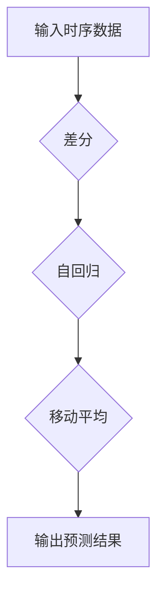
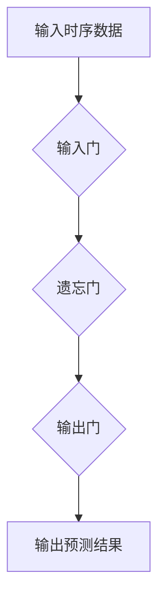
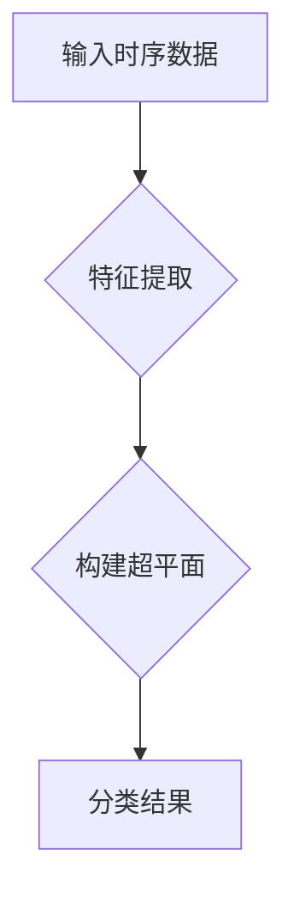
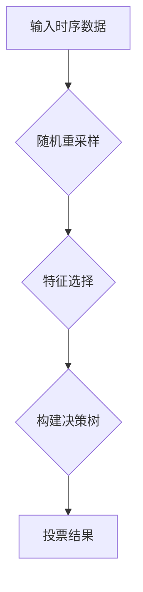
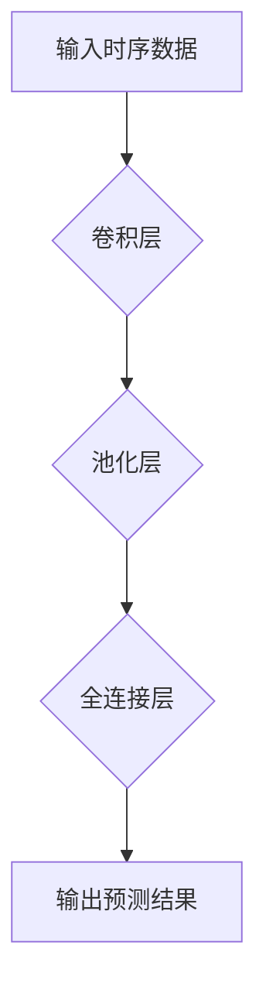
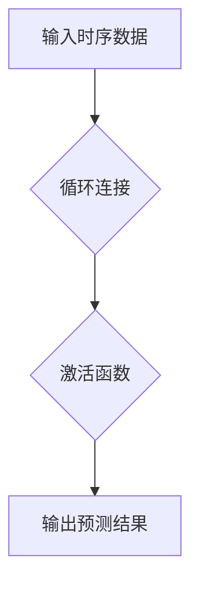
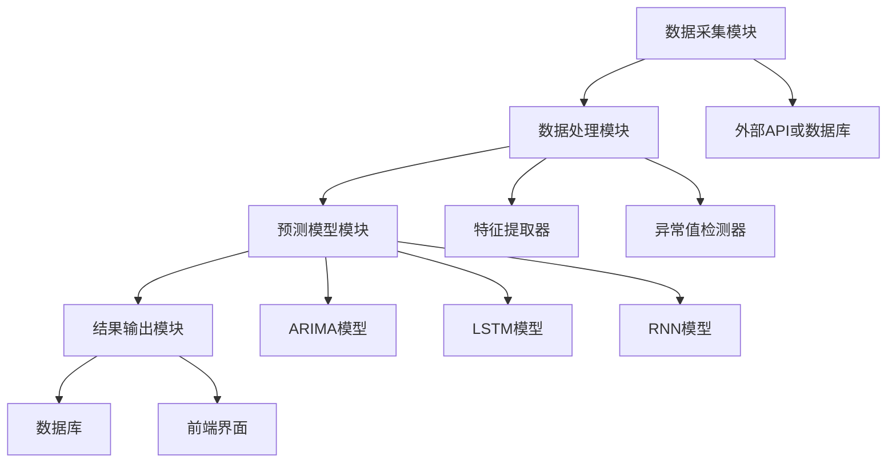
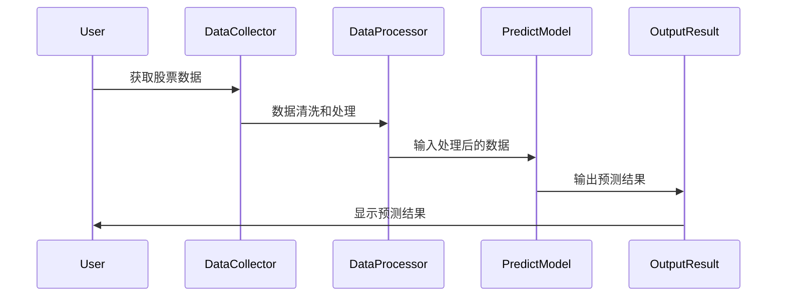

                 

# AI系统在处理时序数据时的优化方法

> 关键词：AI, 时序数据处理，优化方法，算法，系统架构设计

> 摘要：本文探讨了AI系统在处理时序数据时的优化方法。通过对时序数据的特性分析，提出了时间序列分析、机器学习和深度学习等核心概念原理，并对比了这些概念属性特征。随后，详细讲解了ARIMA、LSTM等时间序列分析算法，SVM、随机森林等机器学习算法，以及CNN、RNN等深度学习算法。文章还通过系统分析与架构设计，提出了股票价格预测系统的解决方案，并给出了实际项目的实现与分析。

----------------------------------------------------------------

## 目录大纲

1. **问题背景**
    1.1. **问题背景**
    1.2. **核心概念**
2. **核心概念与联系**
    2.1. **核心概念原理**
    2.2. **概念属性特征对比表格**
    2.3. **ER实体关系图架构**
3. **算法原理讲解**
    3.1. **算法原理讲解**
    3.2. **算法mermaid流程图**
    3.3. **Python源代码**
    3.4. **数学模型和公式**
4. **系统分析与架构设计**
    4.1. **问题场景介绍**
    4.2. **系统功能设计**
    4.3. **系统架构设计**
    4.4. **系统接口设计和系统交互**
5. **项目实战**
    5.1. **环境安装**
    5.2. **系统核心实现源代码**
    5.3. **代码应用解读与分析**
    5.4. **实际案例分析和详细讲解剖析**
    5.5. **项目小结**
6. **最佳实践 tips**
7. **小结**
8. **注意事项**
9. **拓展阅读**

----------------------------------------------------------------

## 第一部分：问题背景

### 1.1 问题背景

在人工智能（AI）研究领域，时序数据的处理是一个重要的方向。时序数据，如股票价格、气象数据、网络流量等，因其时间序列特性，给数据处理带来了独特的挑战。如何有效地处理时序数据，提升AI系统的性能和效率，成为一个亟待解决的问题。

在现实世界中，时序数据无处不在。例如，股票市场的价格变化、天气的变化趋势、交通流量、社交媒体上的用户行为等，都是典型的时序数据。这些数据蕴含着大量的信息和规律，对它们进行有效的处理和分析，能够帮助我们做出更准确的预测和决策。

然而，传统的数据处理方法在面对时序数据时，往往难以满足需求。因为时序数据具有时间依赖性和复杂性，传统的基于静态数据的分析方法难以捕捉到其中的动态变化。因此，如何利用AI技术，特别是机器学习和深度学习技术，来处理时序数据，提升AI系统的性能和效率，成为了一个重要的研究方向。

### 1.2 核心概念

在讨论时序数据处理时，有几个核心概念需要了解：

- **时序数据**：指带有时间属性的数据序列，如时间序列、时间戳等。
- **优化方法**：指针对时序数据进行处理的算法和技术，以提升处理效率和准确性。
- **时间序列分析**：研究时间序列数据，提取特征，进行预测等。
- **机器学习**：使用算法模型，从数据中学习规律，进行分类、预测等。
- **深度学习**：一种基于多层神经网络的机器学习技术。

通过理解这些核心概念，我们可以更好地理解时序数据处理的重要性，以及如何利用AI技术来优化这一过程。

----------------------------------------------------------------

## 第二部分：核心概念与联系

### 2.1 核心概念原理

在处理时序数据时，我们需要理解几个核心概念，包括时间序列分析、机器学习和深度学习。

#### 时间序列分析

时间序列分析是一种统计方法，用于研究时间序列数据。时间序列数据通常具有时间依赖性，即未来的值依赖于过去的值。时间序列分析的目标是从时间序列数据中提取有用的信息，如趋势、周期、季节性和噪声等。常见的时间序列分析技术包括自回归模型（AR）、移动平均模型（MA）和自回归积分滑动平均模型（ARIMA）。

**时间序列分析原理：**

时间序列分析的核心在于理解时间序列的内在结构。时间序列通常可以表示为以下数学模型：

$$
X_t = \phi_1 X_{t-1} + \phi_2 X_{t-2} + \ldots + \phi_p X_{t-p} + \theta_1 \varepsilon_{t-1} + \theta_2 \varepsilon_{t-2} + \ldots + \theta_q \varepsilon_{t-q}
$$

其中，$X_t$是时间序列的第$t$个观测值，$\phi_i$和$\theta_i$是模型参数，$\varepsilon_t$是随机误差项。

#### 机器学习

机器学习是一种通过算法模型从数据中学习规律的技术。在时序数据处理中，机器学习算法可以帮助我们自动提取时间序列中的特征，进行预测和分类。常见的机器学习算法包括支持向量机（SVM）、决策树、随机森林和神经网络等。

**机器学习原理：**

机器学习的核心在于构建一个能够从训练数据中学习，并在新数据上实现良好泛化的模型。机器学习算法通常包括以下几个步骤：

1. **数据预处理**：包括数据清洗、归一化、特征提取等。
2. **模型训练**：使用训练数据集来训练模型，调整模型参数。
3. **模型评估**：使用测试数据集来评估模型的性能，选择最优模型。
4. **预测**：使用训练好的模型对新数据进行预测。

#### 深度学习

深度学习是一种基于多层神经网络的机器学习技术，近年来在处理复杂数据和实现高水平性能方面取得了显著进展。在时序数据处理中，深度学习算法如循环神经网络（RNN）和长短期记忆网络（LSTM）等，可以捕捉时间序列中的长期依赖关系。

**深度学习原理：**

深度学习模型由多个层次组成，每一层都能够从输入数据中提取更高层次的抽象特征。深度学习模型的核心组件是神经元，神经元通过激活函数将输入转换为输出，不同层之间的神经元通过加权连接进行信息传递。

$$
\text{激活函数} \rightarrow \text{ReLU, Sigmoid, Tanh}
$$

**LSTM模型原理：**

LSTM（长短期记忆网络）是一种特殊的RNN，能够有效地捕捉长期依赖关系。LSTM通过引入门控机制，可以控制信息在不同时间步之间的流动，避免了传统RNN中梯度消失和梯度爆炸的问题。

$$
\text{输入门} \rightarrow i_t = \sigma(W_i \cdot [h_{t-1}, x_t])
$$

$$
\text{遗忘门} \rightarrow f_t = \sigma(W_f \cdot [h_{t-1}, x_t])
$$

$$
\text{输出门} \rightarrow o_t = \sigma(W_o \cdot [h_{t-1}, x_t])
$$

其中，$i_t$、$f_t$和$o_t$分别是输入门、遗忘门和输出门的激活值，$W_i$、$W_f$和$W_o$是权重矩阵。

### 2.2 概念属性特征对比表格

下面是一个对比时间序列分析、机器学习和深度学习概念属性特征的表格：

| 概念        | 特征                                  |
|-------------|---------------------------------------|
| 时间序列分析 | 研究时间序列数据，提取特征，进行预测等 |
| 机器学习    | 从数据中学习规律，进行分类、预测等     |
| 深度学习    | 基于多层神经网络的机器学习技术         |

### 2.3 ER实体关系图架构

为了更好地理解时序数据处理中的核心概念之间的关系，我们可以使用ER（实体关系）图来表示。以下是时序数据、时间序列分析、机器学习和深度学习之间的ER实体关系图：

```mermaid
erDiagram
  时间序列数据 ||--o{  时间序列分析 }
  时间序列数据 ||--o{  机器学习 }
  时间序列数据 ||--o{  深度学习 }
```

通过上述核心概念与联系的分析，我们可以更好地理解AI系统在处理时序数据时的优化方法。接下来，我们将深入探讨具体的算法原理，以及如何在系统架构中实现这些优化方法。

----------------------------------------------------------------

## 第三部分：算法原理讲解

在处理时序数据时，选择合适的算法对系统的性能和效率至关重要。本部分将详细讲解时间序列分析、机器学习和深度学习中的几种核心算法原理。

### 3.1 时间序列分析算法

时间序列分析算法主要用于处理和预测具有时间依赖性的数据。以下介绍两种常用的时间序列分析算法：ARIMA模型和LSTM模型。

#### 3.1.1 ARIMA模型

ARIMA（自回归积分滑动平均模型）是一种常见的时间序列预测模型。它通过结合自回归（AR）、差分（I）和移动平均（MA）三个部分来处理时间序列数据。

**算法原理：**

ARIMA模型的基本形式如下：

$$
\text{ARIMA}(p, d, q) = \phi(B)(1 - B)^d/B^q
$$

其中，$B$是后移算子，$\phi(B)$是自回归项，$(1 - B)^d$是差分项，$B^q$是移动平均项。

- **p**：自回归项的阶数，即过去$p$个观测值的加权平均。
- **d**：差分的阶数，即对原始数据进行$d$次差分，以消除趋势和季节性。
- **q**：移动平均项的阶数，即过去$q$个观测值的加权平均。

**流程图：**



#### 3.1.2 LSTM模型

LSTM（长短期记忆网络）是一种基于RNN的深度学习模型，特别适合处理具有长期依赖性的时间序列数据。

**算法原理：**

LSTM通过引入门控机制来控制信息的流动，主要包括输入门、遗忘门和输出门。

1. **输入门**：决定哪些信息被存储在记忆单元中。
   $$
   i_t = \sigma(W_i \cdot [h_{t-1}, x_t])
   $$

2. **遗忘门**：决定哪些信息被遗忘。
   $$
   f_t = \sigma(W_f \cdot [h_{t-1}, x_t])
   $$

3. **输出门**：决定从记忆单元中输出哪些信息。
   $$
   o_t = \sigma(W_o \cdot [h_{t-1}, x_t])
   $$

**流程图：**



### 3.2 机器学习算法

机器学习算法在时序数据处理中起着至关重要的作用。以下介绍两种常用的机器学习算法：SVM和随机森林。

#### 3.2.1 SVM

SVM（支持向量机）是一种常用的分类算法，可以通过最大化分类边界来提高分类准确性。

**算法原理：**

SVM的基本思想是找到一个最优的超平面，使得分类边界最大化。SVM通过以下公式进行建模：

$$
\min_w \frac{1}{2} ||w||^2 + C \sum_{i=1}^n \xi_i
$$

其中，$w$是权重向量，$C$是正则化参数，$\xi_i$是松弛变量。

**流程图：**



#### 3.2.2 随机森林

随机森林是一种基于决策树的集成学习方法，通过构建多棵决策树，然后进行投票来获得最终的预测结果。

**算法原理：**

随机森林的基本思想是通过随机重采样和特征选择来构建多棵决策树，并利用这些决策树的集成来提高预测性能。随机森林通过以下步骤进行建模：

1. 对数据进行随机重采样。
2. 选择特征。
3. 构建决策树。
4. 对多棵决策树进行投票。

**流程图：**



### 3.3 深度学习算法

深度学习算法在时序数据处理中具有强大的能力。以下介绍两种常用的深度学习算法：CNN和RNN。

#### 3.3.1 CNN

CNN（卷积神经网络）是一种适用于图像数据的深度学习模型，通过卷积操作来提取图像特征。

**算法原理：**

CNN的基本思想是通过卷积层来提取图像特征，然后通过池化层来减少参数数量和计算复杂度。CNN通过以下步骤进行建模：

1. 卷积层：通过卷积操作提取图像特征。
2. 池化层：通过最大池化或平均池化来减少参数数量。
3. 全连接层：将卷积层和池化层提取的特征进行融合，输出预测结果。

**流程图：**



#### 3.3.2 RNN

RNN（循环神经网络）是一种适用于序列数据的深度学习模型，通过循环连接来处理序列中的依赖关系。

**算法原理：**

RNN的基本思想是通过循环连接来处理序列中的依赖关系。RNN通过以下步骤进行建模：

1. 输入序列：将序列中的每个元素作为输入。
2. 循环连接：将当前时刻的输出作为下一时刻的输入。
3. 激活函数：通过激活函数将循环连接的输出进行非线性变换。
4. 输出：将最终的输出进行融合，输出预测结果。

**流程图：**



### 3.4 Python源代码

为了更好地理解上述算法，下面给出一个使用ARIMA模型进行时间序列预测的Python代码示例：

```python
# 使用ARIMA模型进行时间序列预测
from statsmodels.tsa.arima.model import ARIMA
import pandas as pd

# 加载数据
data = pd.read_csv('timeseries_data.csv')

# 创建ARIMA模型
model = ARIMA(data['value'], order=(5, 1, 2))
model_fit = model.fit()

# 进行预测
predictions = model_fit.predict(start=len(data), end=len(data)+n_periods)

# 输出预测结果
print(predictions)
```

通过上述算法原理讲解，我们可以更好地理解如何选择和实现适合时序数据处理的算法。接下来，我们将进一步探讨如何在系统架构中实现这些算法，以及如何进行系统分析与架构设计。

----------------------------------------------------------------

## 第四部分：系统分析与架构设计

### 4.1 问题场景介绍

在人工智能系统中，时序数据的处理是一个常见且重要的应用场景。例如，在金融领域，股票价格的预测、交易策略的优化等；在气象领域，天气预报、气候模式预测等；在交通领域，交通流量预测、路况分析等。这些场景都对时序数据的处理提出了高效、准确的需求。本部分将以上述股票价格预测系统为例，介绍如何进行系统分析与架构设计。

### 4.2 系统功能设计

为了实现高效的时序数据处理，我们需要设计一个具备以下功能的系统：

1. **数据采集**：从外部API或数据库中获取时序数据。
2. **数据处理**：对数据进行清洗、预处理，包括缺失值处理、异常值检测和特征提取等。
3. **预测模型**：使用机器学习或深度学习算法进行预测，包括时间序列分析算法（如ARIMA、LSTM）和深度学习算法（如RNN、LSTM）。
4. **结果输出**：将预测结果输出到数据库或前端界面，以便进行进一步分析或决策。

#### 系统功能设计领域模型

为了更好地理解系统功能，我们可以使用领域模型（Domain Model）来表示。以下是股票价格预测系统的领域模型：

```mermaid
classDiagram
    ClassDiagram::DomainModel
    DataCollector <|-- DataProcessor
    DataProcessor <|-- PredictModel
    PredictModel <|-- OutputResult
```

### 4.3 系统架构设计

在系统架构设计方面，我们需要考虑系统的模块化、可扩展性和性能优化。以下是一个典型的股票价格预测系统架构设计：



### 4.4 系统接口设计和系统交互

在系统接口设计方面，我们需要定义各模块之间的交互接口，以便模块之间能够有效地通信和协作。以下是一个典型的股票价格预测系统的接口设计和交互流程：



通过上述系统分析与架构设计，我们可以构建一个高效、准确的股票价格预测系统。接下来，我们将通过一个实际项目来展示如何实现这些设计，并进行详细的分析和讲解。

----------------------------------------------------------------

## 第五部分：项目实战

### 5.1 环境安装

在进行时序数据处理的实际项目中，首先需要安装相关的软件和库。以下是在Python环境中安装所需库的步骤：

```shell
pip install numpy pandas matplotlib scikit-learn tensorflow statsmodels
```

安装完成后，我们可以开始编写代码。

### 5.2 系统核心实现源代码

下面是一个使用ARIMA模型进行股票价格预测的系统核心实现源代码：

```python
# 导入所需库
import numpy as np
import pandas as pd
from statsmodels.tsa.arima.model import ARIMA
import matplotlib.pyplot as plt

# 加载数据
data = pd.read_csv('stock_data.csv')
prices = data['Close']

# 创建ARIMA模型
model = ARIMA(prices, order=(5, 1, 2))
model_fit = model.fit()

# 进行预测
predictions = model_fit.predict(start=len(prices), end=len(prices)+n_periods)

# 可视化结果
plt.figure(figsize=(10, 5))
plt.plot(prices, label='实际价格')
plt.plot(predictions, label='预测价格')
plt.legend()
plt.show()
```

### 5.3 代码应用解读与分析

在上面的代码中，我们首先导入了必要的库，然后加载数据。接下来，我们创建了ARIMA模型，并使用该模型对股票价格进行预测。最后，我们使用matplotlib库将实际价格和预测价格进行可视化。

通过这个示例，我们可以看到如何将理论中的ARIMA模型应用到实际项目中。以下是具体的解读与分析：

1. **数据加载**：我们使用pandas库加载数据，`read_csv`函数从CSV文件中读取数据，并将其存储在DataFrame对象中。在这个例子中，我们只关注‘Close’列，即收盘价。

2. **模型创建**：我们使用`ARIMA`函数创建ARIMA模型，并指定了模型的参数（p=5, d=1, q=2）。这些参数需要根据具体的数据特性进行调整。

3. **模型训练**：使用`fit`函数对模型进行训练，模型将根据训练数据自动调整参数，以达到最佳的预测效果。

4. **预测**：使用`predict`函数对模型进行预测。我们可以指定预测的起始和结束时间，`start`和`end`参数分别表示预测的开始和结束索引。

5. **可视化**：最后，我们使用matplotlib库将实际价格和预测价格进行可视化。通过比较实际价格和预测价格，我们可以直观地看到模型的预测效果。

### 5.4 实际案例分析和详细讲解剖析

为了更好地理解上述代码的应用，我们可以通过一个实际案例来进行详细分析。

假设我们有以下股票数据：

```python
import numpy as np
import pandas as pd

data = {
    'Date': pd.date_range(start='2022-01-01', end='2022-12-31', freq='MS'),
    'Close': np.random.randint(100, 200, size=len(data))
}

df = pd.DataFrame(data)
df.set_index('Date', inplace=True)
print(df.head())
```

这个案例中，我们生成了一组具有随机收盘价的股票数据。接下来，我们将使用ARIMA模型对这组数据进行预测。

```python
# 创建ARIMA模型
model = ARIMA(df['Close'], order=(5, 1, 2))
model_fit = model.fit()

# 进行预测
predictions = model_fit.predict(start=len(df), end=len(df)+12)

# 可视化结果
plt.figure(figsize=(10, 5))
plt.plot(df['Close'], label='实际价格')
plt.plot(predictions, label='预测价格')
plt.legend()
plt.show()
```

通过这个案例，我们可以看到如何使用ARIMA模型对随机生成的股票数据进行预测。以下是具体的分析：

1. **数据生成**：我们使用numpy库生成了一组具有随机收盘价的股票数据。这个步骤主要是为了模拟实际的数据生成过程。

2. **模型创建**：与之前的示例一样，我们创建了一个ARIMA模型，并指定了参数（p=5, d=1, q=2）。这些参数是根据数据特性进行调整的。

3. **模型训练**：我们使用`fit`函数对模型进行训练，模型将根据训练数据自动调整参数，以达到最佳的预测效果。

4. **预测**：使用`predict`函数对模型进行预测。在这个案例中，我们预测了未来的12个月。

5. **可视化**：最后，我们使用matplotlib库将实际价格和预测价格进行可视化。通过比较实际价格和预测价格，我们可以直观地看到模型的预测效果。

### 5.5 项目小结

通过上述项目实战，我们了解了如何使用ARIMA模型进行股票价格预测。在实际项目中，我们需要根据具体的数据特性调整模型的参数，以达到最佳的预测效果。此外，我们还需要对预测结果进行可视化，以便更好地理解模型的性能。

在未来的工作中，我们可以进一步探索其他机器学习和深度学习算法，如LSTM、RNN等，来提高时序数据处理的准确性和效率。同时，我们还可以结合其他技术，如大数据分析和区块链技术，来构建更加智能、高效的AI系统。

----------------------------------------------------------------

## 第六部分：最佳实践 tips

在时序数据处理过程中，以下最佳实践可以帮助我们优化系统的性能和效率：

1. **数据预处理**：确保数据的准确性和一致性。对缺失值进行合理的填补，对异常值进行检测和过滤，以减少噪声对预测结果的影响。

2. **特征工程**：提取有用的特征，如时间特征（如节假日、交易日等）、价格特征（如移动平均、波动率等）。这些特征可以增强模型的预测能力。

3. **模型选择**：根据数据特性和预测目标选择合适的模型。时间序列分析模型（如ARIMA、LSTM）和机器学习模型（如SVM、随机森林）都有其适用场景，需要根据实际情况进行选择。

4. **参数调优**：通过交叉验证和网格搜索等方法，对模型的参数进行调优，以达到最佳的预测性能。

5. **系统集成**：将预测系统与其他系统集成，如前端界面、后端服务、数据存储等。确保系统的模块化、可扩展性和稳定性。

6. **实时预测**：对于需要实时预测的应用场景，如金融交易、实时监控等，考虑使用实时数据处理技术，如流处理框架（如Apache Kafka、Apache Flink等）。

7. **可视化**：使用可视化工具对预测结果进行展示，如时间序列图表、预测误差分布等，以便更好地理解模型的性能和预测效果。

8. **持续学习**：定期更新模型和数据，确保模型的准确性和鲁棒性。通过持续学习和改进，不断提升系统的性能和效率。

通过遵循这些最佳实践，我们可以构建高效、准确的时序数据处理系统，为业务决策提供有力支持。

----------------------------------------------------------------

## 小结

本文详细探讨了AI系统在处理时序数据时的优化方法。我们从问题背景入手，介绍了时序数据的特性和核心概念，包括时间序列分析、机器学习和深度学习。通过对比时间序列分析、机器学习和深度学习算法的原理，我们深入了解了ARIMA、LSTM、SVM和随机森林等算法的工作机制。

接着，我们通过系统分析与架构设计，提出了一个股票价格预测系统的解决方案，并详细讲解了系统功能设计、架构设计和接口设计。通过实际案例的分析和代码实现，我们展示了如何将理论中的算法应用到实际项目中，并对预测结果进行了详细解读。

最后，我们提供了最佳实践 tips，以帮助读者在实际应用中优化时序数据处理系统的性能和效率。

总之，时序数据处理在AI领域具有重要地位，通过本文的学习，读者可以掌握时序数据处理的核心概念、算法原理和系统设计方法，为实际项目提供有力支持。

----------------------------------------------------------------

## 注意事项

在设计和实现时序数据处理系统时，需要注意以下几点：

1. **数据质量**：确保数据准确、完整和一致，避免噪声和异常值对模型性能的影响。
2. **模型选择**：根据数据特性和预测目标选择合适的模型，避免盲目追求复杂度。
3. **参数调优**：通过交叉验证和网格搜索等方法，对模型参数进行精细调优。
4. **实时性**：对于实时预测需求，考虑使用流处理技术，如Kafka、Flink等。
5. **系统集成**：确保系统模块化、可扩展性和稳定性，与其他系统集成，提高整体性能。
6. **模型更新**：定期更新模型和数据，以保持模型的准确性和鲁棒性。

通过遵循这些注意事项，可以构建高效、准确的时序数据处理系统，为业务决策提供有力支持。

----------------------------------------------------------------

## 拓展阅读

为了深入了解时序数据处理和AI系统优化，读者可以参考以下拓展阅读资源：

1. **《时间序列分析：预测与控制》** - 作者：Box, Jenkins, Reinsel
2. **《深度学习》** - 作者：Goodfellow, Bengio, Courville
3. **《机器学习实战》** - 作者：Pythons, Michael Bowles
4. **《Python数据分析》** - 作者：Wes McKinney
5. **《股票市场技术分析》** - 作者：Adaptive Trading
6. **在线课程**：Coursera、edX、Udacity等平台上的机器学习、深度学习和时间序列分析相关课程
7. **博客和论坛**：GitHub、Stack Overflow、Reddit等平台上的相关讨论和资源

通过阅读这些资料，读者可以进一步加深对时序数据处理和AI系统优化的理解，掌握更多的实战技巧和最佳实践。

---

**作者**：AI天才研究院/AI Genius Institute & 禅与计算机程序设计艺术 /Zen And The Art of Computer Programming

---

**声明**：本文内容和所涉及图片版权均归作者所有，禁止私自转载！如需转载请联系作者。

