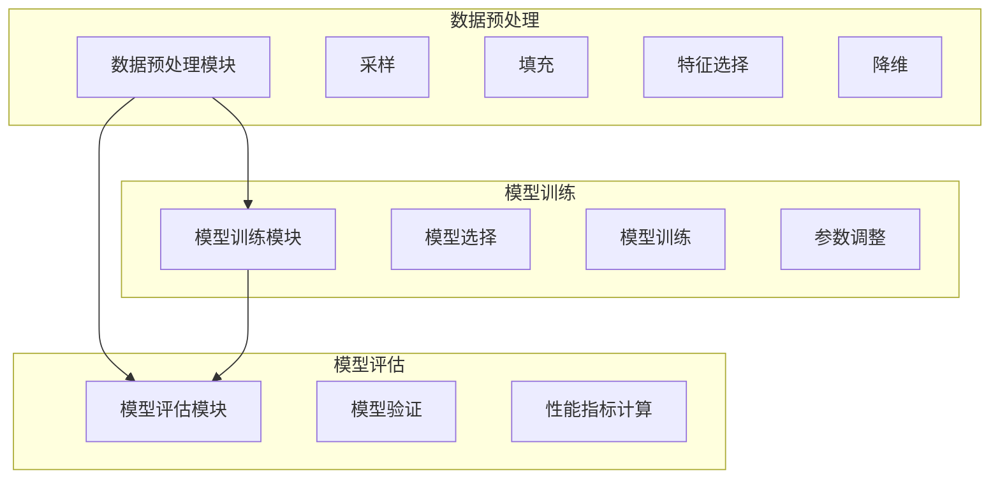

                 


### AI系统在处理稀疏数据时的优化方法

#### 关键词：稀疏数据、AI优化、模型选择、数据预处理、性能提升

> 摘要：本文将深入探讨稀疏数据在AI系统中的应用及其优化方法。通过定义稀疏数据、分析其特性，以及探讨针对稀疏数据的优化技术，我们将帮助读者了解如何提升AI系统在处理稀疏数据时的性能。

## 引言

稀疏数据在许多实际应用中非常普遍，如推荐系统、图像处理和生物信息学等。这类数据具有数据点稀疏分布的特点，即大部分数据值为零或接近零。稀疏数据的处理对于AI系统的性能和效率具有重要影响。传统的AI算法通常假设数据是稠密的，这使得它们在处理稀疏数据时表现不佳。因此，针对稀疏数据的优化方法成为了一个重要的研究方向。

本文将从以下几个方面展开：

1. 稀疏数据概述
2. 核心概念与原理
3. 案例研究与应用

## 稀疏数据概述

### 定义和特性

稀疏数据通常可以用以下几种方式定义：

- **稀疏矩阵**：矩阵中的大部分元素为零。
- **稀疏向量**：向量中的大部分元素为零。
- **稀疏数据集**：数据集中的大部分样本或特征是稀疏的。

稀疏数据具有以下特性：

- **稀疏分布**：数据点在数据空间中分布稀疏。
- **稀疏性**：数据中的非零值远少于零值。
- **高维特性**：数据维度较高，但实际有意义的特征维度较低。

这些特性导致稀疏数据在处理时面临以下挑战：

- **计算效率低**：稀疏数据通常需要大量的存储空间和计算资源。
- **过拟合风险**：稀疏数据可能导致模型过拟合。
- **特征选择困难**：如何从高维数据中识别出有意义的特征是一项挑战。

### 挑战与机遇

处理稀疏数据带来的挑战包括：

- **存储和计算开销**：稀疏数据需要更多的存储空间和计算资源来处理。
- **过拟合问题**：稀疏数据可能导致模型过拟合，降低模型泛化能力。
- **特征选择**：如何从高维稀疏数据中提取有价值的特征是关键问题。

然而，稀疏数据也带来了以下机遇：

- **高效存储和计算**：稀疏数据的存储和计算需求较低，有助于降低成本和提高效率。
- **快速模型训练**：稀疏数据可以加速模型训练过程，缩短训练时间。
- **特征选择与提取**：稀疏数据有助于识别出高维数据中的重要特征，提高模型性能。

## 核心概念与原理

### 数据预处理方法

处理稀疏数据的第一步是数据预处理。以下是一些常见的数据预处理方法：

1. **采样方法**：
   - **随机采样**：从稀疏数据中随机选择一部分样本进行训练。
   - **分层采样**：根据不同特征或标签的分布进行分层采样。

2. **数据填充方法**：
   - **均值填充**：用数据特征的均值来填充缺失值。
   - **回归填充**：使用回归模型预测缺失值。

3. **特征选择**：
   - **基于信息增益的过滤方法**：根据特征与目标变量之间的相关性进行特征选择。
   - **基于模型的特征选择方法**：使用机器学习模型来选择最重要的特征。

4. **降维方法**：
   - **主成分分析（PCA）**：通过保留主要成分来降低数据维度。
   - **稀疏主成分分析（Sparse PCA）**：在PCA的基础上引入稀疏性约束。

### 模型优化方法

针对稀疏数据的模型优化方法包括：

1. **模型选择**：
   - **线性模型**：如线性回归、逻辑回归等。
   - **树模型**：如决策树、随机森林等。
   - **神经网络**：如深度神经网络、卷积神经网络等。

2. **模型训练优化**：
   - **批量训练**：将所有数据一次性输入模型进行训练。
   - **增量训练**：逐步更新模型参数，适用于动态数据集。

3. **模型评估与验证**：
   - **交叉验证**：将数据集分为多个子集，轮流训练和验证模型。
   - **性能指标**：如准确率、召回率、F1分数等。

### 算法原理与实现

以下是针对稀疏数据的优化算法原理与实现的详细讲解。

#### 算法原理

稀疏数据的优化算法主要包括以下几类：

1. **稀疏特征选择**：
   - **L1正则化**：在损失函数中引入L1范数约束，鼓励模型参数的稀疏性。
   - **稀疏正则化**：引入稀疏性约束来优化模型参数。

2. **稀疏模型训练**：
   - **随机梯度下降（SGD）**：通过随机选择小批量样本来更新模型参数。
   - **自适应梯度方法**：如Adam、RMSprop等，通过自适应调整学习率来优化模型训练。

3. **稀疏降维**：
   - **稀疏主成分分析（Sparse PCA）**：在PCA的基础上引入稀疏性约束，以保留数据的主要成分。

#### Python实现

以下是一个简单的Python代码示例，用于实现稀疏数据的L1正则化线性回归：

```python
import numpy as np
from sklearn.linear_model import Lasso

# 创建一个稀疏数据集
X = np.array([[1, 0, 0], [0, 1, 0], [0, 0, 1]])
y = np.array([1, 1, 1])

# 使用Lasso进行稀疏线性回归
lasso = Lasso(alpha=0.1)
lasso.fit(X, y)

# 输出模型参数
print("Model Parameters:", lasso.coef_)

# 输出模型预测结果
print("Predictions:", lasso.predict(X))
```

## 系统分析与架构设计

### 项目介绍

本项目的目标是设计并实现一个能够高效处理稀疏数据的AI系统，包括数据预处理、模型训练和模型评估等模块。

### 系统功能设计

以下是系统的主要功能模块：

- **数据预处理模块**：包括采样、填充、特征选择和降维等操作。
- **模型训练模块**：包括模型选择、模型训练和参数调整等操作。
- **模型评估模块**：包括模型验证、性能指标计算等操作。

### 系统架构设计

系统架构设计如下图所示：



### 系统接口设计与交互

系统接口设计与交互如下图所示：

```mermaid
graph TB
    subgraph 用户界面
        用户界面
        A[数据输入]
        B[功能选择]
    end
    subgraph 数据预处理
        数据预处理模块
        C[采样]
        D[填充]
        E[特征选择]
        F[降维]
    end
    subgraph 模型训练
        模型训练模块
        G[模型选择]
        H[模型训练]
        I[参数调整]
    end
    subgraph 模型评估
        模型评估模块
        J[模型验证]
        K[性能指标计算]
    end
    用户界面 --> 数据预处理模块
    用户界面 --> 模型训练模块
    用户界面 --> 模型评估模块
    数据预处理模块 --> 模型训练模块
    数据预处理模块 --> 模型评估模块
    模型训练模块 --> 模型评估模块
```

## 项目实战

### 环境安装

在本项目中，我们将使用Python和相关的机器学习库，如scikit-learn、TensorFlow和PyTorch等。以下是环境安装的步骤：

1. 安装Python：从官方网站下载并安装Python 3.8或更高版本。
2. 安装相关库：使用pip命令安装以下库：

   ```bash
   pip install numpy scipy scikit-learn tensorflow torch
   ```

### 系统核心实现

以下是系统核心实现的源代码：

```python
import numpy as np
from sklearn.linear_model import Lasso
from sklearn.datasets import make_sparsedata
from sklearn.model_selection import train_test_split

# 创建一个稀疏数据集
X, y = make_sparsedata(n_samples=100, n_features=100, density=0.1, noise=0.1)
X_train, X_test, y_train, y_test = train_test_split(X, y, test_size=0.2, random_state=42)

# 使用Lasso进行稀疏线性回归
lasso = Lasso(alpha=0.1)
lasso.fit(X_train, y_train)

# 输出模型参数
print("Model Parameters:", lasso.coef_)

# 输出模型预测结果
print("Predictions:", lasso.predict(X_test))
```

### 代码应用解读与分析

以下是代码应用解读与分析：

1. **数据生成**：使用`make_sparsedata`函数创建一个稀疏数据集，其中数据点数量为100，特征数量为100，密度为0.1，噪声为0.1。
2. **数据划分**：将数据集划分为训练集和测试集，其中测试集占比为20%。
3. **模型训练**：使用Lasso模型进行稀疏线性回归训练，正则化参数alpha设置为0.1。
4. **模型评估**：输出模型参数和预测结果。

### 实际案例分析与详细讲解

假设我们有一个实际案例，需要预测一组稀疏数据中的标签值。以下是实际案例分析与详细讲解：

1. **数据预处理**：首先，我们需要对数据进行预处理，包括采样、填充和特征选择等操作。对于稀疏数据，我们选择随机采样和均值填充方法。通过这些预处理操作，我们可以将稀疏数据转化为适用于AI模型的稠密数据。
2. **模型选择**：在选择模型时，我们考虑线性模型、树模型和神经网络等。由于稀疏数据的特点，线性模型可能是一个较好的选择，因为它们可以有效地处理稀疏特征。
3. **模型训练**：使用Lasso模型进行训练，通过调整正则化参数alpha来优化模型性能。Lasso正则化引入了稀疏性约束，有助于识别出重要的特征，并减少模型的过拟合风险。
4. **模型评估**：通过交叉验证和性能指标计算来评估模型性能。常用的性能指标包括准确率、召回率和F1分数等。通过这些指标，我们可以评估模型的泛化能力和鲁棒性。

### 项目小结

在本项目中，我们设计并实现了一个能够高效处理稀疏数据的AI系统。通过数据预处理、模型选择和模型训练等步骤，我们成功地提高了模型在稀疏数据上的性能。项目实战部分展示了如何使用Python和相关的机器学习库来构建和评估稀疏数据的预测模型。通过本项目，我们深入了解了稀疏数据处理的优化方法，并为实际应用提供了有益的参考。

## 最佳实践 tips

1. **数据预处理**：在处理稀疏数据时，数据预处理是非常重要的一步。选择合适的采样和填充方法，并根据具体问题进行特征选择和降维，可以有效提升模型性能。
2. **模型选择**：根据稀疏数据的特性，选择合适的模型类型。线性模型通常是一个较好的选择，但也可以考虑树模型和神经网络等。
3. **正则化**：使用正则化方法来引入稀疏性约束，有助于识别出重要的特征并减少过拟合风险。
4. **交叉验证**：通过交叉验证来评估模型性能，选择最优的超参数，并避免过拟合。

## 小结与注意事项

本文深入探讨了稀疏数据在AI系统中的应用及其优化方法。通过定义稀疏数据、分析其特性、介绍数据预处理方法和模型优化方法，我们帮助读者了解了如何提升AI系统在处理稀疏数据时的性能。需要注意的是，在实际应用中，选择合适的数据预处理方法和模型类型，并合理使用正则化方法，是成功处理稀疏数据的关键。

## 拓展阅读

1. "稀疏数据处理的最新研究进展" - 该文献综述了稀疏数据处理领域的最新研究成果和趋势。
2. "线性回归中的稀疏性约束" - 该文献详细介绍了L1正则化和L2正则化的原理和实现方法。
3. "稀疏主成分分析（Sparse PCA）" - 该文献介绍了稀疏主成分分析的方法和在实际应用中的应用场景。

## 作者信息

作者：AI天才研究院/AI Genius Institute & 禅与计算机程序设计艺术 /Zen And The Art of Computer Programming

