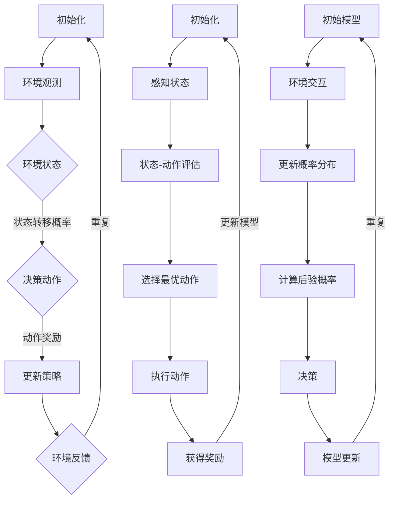
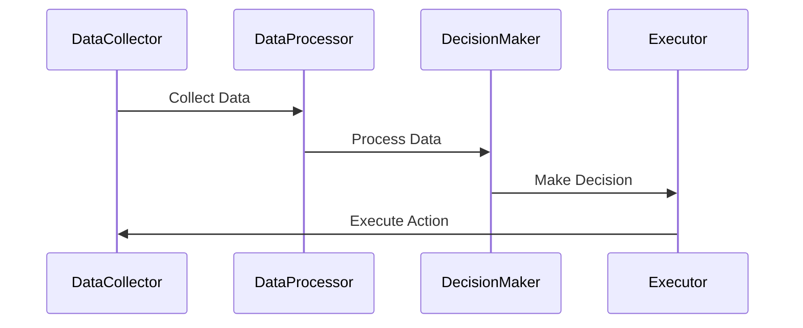

                 

### 第一部分：背景与核心概念

#### 第1章：高度不确定环境与决策策略概述

##### 1.1 高度不确定环境的定义与特征

在人工智能（AI）系统中，高度不确定环境是指那些状态、信息和事件难以预测和评估的环境。这些环境通常涉及诸多变量和不确定因素，例如金融市场、自然灾害、医疗诊断等。在这种环境下，传统的确定性算法和模型往往难以胜任，因为它们依赖于明确的规则和数据，而高度不确定环境中这些条件往往难以满足。

高度不确定环境具有以下特征：

1. **不确定性高**：系统状态难以准确预测，数据变化频繁且不可控。
2. **动态性**：环境在时间上变化迅速，需要实时更新模型和策略。
3. **复杂性**：涉及的变量多，相互关系复杂，决策过程可能涉及多个层次和维度。
4. **非线性和非线性**：系统的行为可能表现出非线性的特征，难以用简单的线性模型描述。

##### 1.2 决策策略的基本原理

决策策略是AI系统在不确定环境中做出合理选择的方法。这些策略通常基于概率论、统计学和机器学习等理论，目的是最大化收益或最小化损失。决策策略可以分为以下几种类型：

1. **基于规则的策略**：利用预设的规则进行决策，适用于规则明确且变化不大的环境。
2. **基于模型的策略**：利用概率模型或统计模型预测环境状态，然后根据预测结果进行决策。
3. **自适应策略**：通过不断调整策略以适应环境的变化，通常涉及机器学习和强化学习技术。
4. **混合策略**：结合多种策略的优点，以应对复杂的不确定环境。

##### 1.3 高度不确定环境下的挑战与机遇

在高度不确定环境中，AI系统的决策面临着诸多挑战：

1. **数据稀缺性**：环境中的数据可能不足或质量不高，影响模型的训练和预测效果。
2. **实时性要求**：需要快速响应环境变化，保证决策的实时性和有效性。
3. **多目标优化**：决策过程中可能涉及多个目标，需要平衡不同目标之间的冲突。
4. **安全性和鲁棒性**：确保系统在面对极端情况时依然能够稳定运行。

然而，高度不确定环境也带来了机遇：

1. **创新空间**：由于环境的复杂性，新的算法和策略有可能在这个领域中得到突破。
2. **经济效益**：在金融、医疗等领域，高效的决策策略能够带来显著的经济效益。
3. **社会价值**：在应对自然灾害、公共卫生危机等情境中，AI系统能够提供有力的支持。

#### 第2章：核心概念与联系分析

##### 2.1 AI系统在高度不确定环境中的应用

AI系统在高度不确定环境中的应用广泛，包括但不限于以下几个方面：

1. **金融市场预测**：利用机器学习模型预测股票、期货等金融市场的走势，以辅助投资决策。
2. **自然灾害预警**：通过传感器网络和AI模型，实时监测和预测地震、洪水等自然灾害，提前发布预警。
3. **医疗诊断**：基于医疗数据，利用深度学习模型辅助医生进行疾病诊断，提高诊断准确率。
4. **自动驾驶**：在复杂交通环境中，自动驾驶系统需要实时感知周围环境，做出安全驾驶决策。

##### 2.2 决策策略与不确定性管理

在高度不确定环境中，决策策略的核心是有效管理不确定性。以下是一些关键步骤：

1. **数据收集与预处理**：收集高质量、可靠的数据，并进行预处理，以减少噪声和异常值的影响。
2. **模型选择与训练**：根据环境特点选择合适的模型，并进行训练以适应不确定性。
3. **概率分布估计**：通过概率分布估计环境状态，为决策提供依据。
4. **决策优化**：利用优化算法，考虑多个目标，实现决策策略的最优化。

##### 2.3 ER实体关系图解析

ER实体关系图是描述系统各实体之间关系的有效工具。在高度不确定环境中的AI系统，常见的实体关系包括：

1. **环境因素**：包括温度、湿度、风力等影响系统运行的因素。
2. **传感器**：用于采集环境数据的设备，如摄像头、雷达等。
3. **决策模块**：基于收集到的数据，利用算法模型进行决策的核心部分。
4. **执行模块**：根据决策结果，执行相应操作的部分，如自动调整设备参数、发送预警信息等。

以下是ER实体关系图的Mermaid表示：

```mermaid
erDiagram
  A[环境因素] ||--|{ B[传感器] }
  B ||--|{ C[决策模块] }
  C ||--|{ D[执行模块] }
```

### 完整性要求

本章节详细介绍了高度不确定环境的定义、特征与挑战，以及决策策略的基本原理和类型。通过对AI系统在高度不确定环境中的应用和不确定性管理方法的分析，我们为后续的算法原理讲解、系统设计与项目实战奠定了基础。ER实体关系图的引入，有助于读者理解系统各部分之间的逻辑关系，从而更好地把握整体架构。

接下来，我们将进一步深入探讨适用于高度不确定环境的决策算法，通过具体的算法原理讲解、流程图展示和数学模型解析，为读者提供系统、全面的理论支持。

## 第二部分：算法原理与流程

### 第2章：适用于高度不确定环境的决策算法

#### 2.1 算法概述

在高度不确定环境中，传统的决策算法如线性规划、决策树等往往难以胜任，因为它们对环境假设过于简单，无法有效处理复杂性和不确定性。为此，研究者们提出了许多适用于高度不确定环境的决策算法，其中一些代表性的算法包括：

1. **贝叶斯网络**：利用贝叶斯推理来处理不确定性，通过概率关系描述变量之间的依赖。
2. **马尔可夫决策过程（MDP）**：一种基于状态-动作-奖励模型的决策理论，适用于有限状态和动作空间。
3. **强化学习**：通过与环境的交互来不断学习和调整策略，以最大化累积奖励。
4. **模糊逻辑**：通过模糊集合和模糊推理规则处理不确定性和模糊性。

这些算法各自具有不同的特点和适用场景，但在高度不确定环境中，它们的共同目标是提高决策的鲁棒性和适应性。

#### 2.2 决策算法流程图

为了更直观地理解这些算法的流程，我们使用Mermaid绘制了相应的流程图。以下是贝叶斯网络、马尔可夫决策过程和强化学习的流程图：



#### 2.3 Python代码示例与算法原理

为了更深入地理解这些算法的原理，我们将通过Python代码进行示例讲解。以下是一个简单的贝叶斯网络代码示例：

```python
import numpy as np
import matplotlib.pyplot as plt

# 定义先验概率
prior = {'Rain': {'True': 0.4, 'False': 0.6}, 'Sprinkler': {'True': 0.5, 'False': 0.5}}

# 定义条件概率
conditionals = {
    'Rain': {'GardenWet': {'True': {'True': 0.9, 'False': 0.1}}},
    'Sprinkler': {'GardenWet': {'True': {'True': 0.8, 'False': 0.2}}}
}

# 计算后验概率
def posterior(prior, conditionals, evidence):
    posterior = {}
    for state, prob in prior.items():
        posterior[state] = prob
        for next_state, probs in conditionals.get(state, {}).items():
            if evidence.get(next_state, False):
                posterior[state] *= probs['True']
            else:
                posterior[state] *= probs['False']
        posterior[state] /= sum(posterior.values())
    return posterior

# 演示
evidence = {'GardenWet': 'True'}
posterior_prob = posterior(prior, conditionals, evidence)
print(posterior_prob)
```

上述代码演示了如何使用贝叶斯网络进行概率推理。贝叶斯网络的核心在于通过先验概率和条件概率来更新后验概率，从而在不确定环境中做出合理的决策。

#### 2.4 LaTeX数学模型解释

在高度不确定环境中，数学模型是决策策略的重要组成部分。以下是一个简单的马尔可夫决策过程（MDP）的数学模型：

$$
\begin{align*}
\mathcal{M} &= \langle S, A, R, P, \gamma \rangle, \\
\pi(s) &= \text{动作概率分布}, \\
Q^*(s, a) &= \sum_{s' \in S} p(s'|s, a) [R(s', a) + \gamma \sum_{a' \in A} \pi(a')(1 - \gamma) Q^*(s', a')],
\end{align*}
$$

其中：

- \( \mathcal{M} \) 是马尔可夫决策过程的表示，包括状态集合 \( S \)、动作集合 \( A \)、奖励函数 \( R \)、状态转移概率矩阵 \( P \) 和折扣因子 \( \gamma \)。
- \( \pi(s) \) 是在状态 \( s \) 下执行动作的概率分布。
- \( Q^*(s, a) \) 是在状态 \( s \) 下采取动作 \( a \) 的最优期望回报。

这个模型描述了如何在不确定环境中通过策略迭代来寻找最优策略。

#### 2.5 算法举例说明

为了更好地理解上述算法的应用，我们将通过一个简单的例子来说明贝叶斯网络在高度不确定环境中的决策过程。

假设我们有一个花园浇水系统，目标是判断是否需要浇水。我们有两个输入变量：天气状况（Rain）和洒水器状态（Sprinkler）。输出变量是花园是否湿（GardenWet）。我们已知以下先验概率和条件概率：

- \( P(Rain=True) = 0.4 \)
- \( P(Rain=False) = 0.6 \)
- \( P(Sprinkler=True) = 0.5 \)
- \( P(Sprinkler=False) = 0.5 \)
- \( P(GardenWet|Rain=True, Sprinkler=True) = 0.9 \)
- \( P(GardenWet|Rain=True, Sprinkler=False) = 0.1 \)
- \( P(GardenWet|Rain=False, Sprinkler=True) = 0.8 \)
- \( P(GardenWet|Rain=False, Sprinkler=False) = 0.2 \)

我们需要根据花园是否湿来决定是否浇水。如果花园是湿的，我们不需要浇水；如果花园是干的，我们需要浇水。

通过贝叶斯网络，我们可以计算在给定花园湿润状态下，天气和洒水器状态的概率：

1. **给定花园湿，计算天气和洒水器状态的概率**：

   我们使用贝叶斯定理：

   $$ P(Rain=True|GardenWet) = \frac{P(GardenWet|Rain=True) \cdot P(Rain=True)}{P(GardenWet)} $$

   类似地，对于洒水器状态：

   $$ P(Sprinkler=True|GardenWet) = \frac{P(GardenWet|Sprinkler=True) \cdot P(Sprinkler=True)}{P(GardenWet)} $$

   我们可以先计算联合概率：

   $$ P(GardenWet) = P(GardenWet|Rain=True, Sprinkler=True) \cdot P(Rain=True, Sprinkler=True) + P(GardenWet|Rain=True, Sprinkler=False) \cdot P(Rain=True, Sprinkler=False) + P(GardenWet|Rain=False, Sprinkler=True) \cdot P(Rain=False, Sprinkler=True) + P(GardenWet|Rain=False, Sprinkler=False) \cdot P(Rain=False, Sprinkler=False) $$

   $$ P(GardenWet) = 0.9 \cdot 0.5 \cdot 0.4 + 0.1 \cdot 0.5 \cdot 0.4 + 0.8 \cdot 0.5 \cdot 0.6 + 0.2 \cdot 0.5 \cdot 0.6 = 0.56 $$

   然后计算条件概率：

   $$ P(Rain=True|GardenWet) = \frac{0.9 \cdot 0.5 \cdot 0.4}{0.56} \approx 0.64 $$

   $$ P(Sprinkler=True|GardenWet) = \frac{0.8 \cdot 0.5 \cdot 0.6}{0.56} \approx 0.87 $$

   根据这些概率，我们可以做出以下决策：

   - 如果花园湿，天气可能是湿（约64%的概率）。
   - 如果花园湿，洒水器可能是开（约87%的概率）。

   在这种情况下，由于洒水器状态的概率更高，我们可以假设洒水器是开的，因此不需要浇水。

2. **给定花园干，计算天气和洒水器状态的概率**：

   同样使用贝叶斯定理：

   $$ P(Rain=True|GardenDry) = \frac{P(GardenDry|Rain=True) \cdot P(Rain=True)}{P(GardenDry)} $$

   $$ P(Sprinkler=True|GardenDry) = \frac{P(GardenDry|Sprinkler=True) \cdot P(Sprinkler=True)}{P(GardenDry)} $$

   计算联合概率：

   $$ P(GardenDry) = P(GardenDry|Rain=True, Sprinkler=True) \cdot P(Rain=True, Sprinkler=True) + P(GardenDry|Rain=True, Sprinkler=False) \cdot P(Rain=True, Sprinkler=False) + P(GardenDry|Rain=False, Sprinkler=True) \cdot P(Rain=False, Sprinkler=True) + P(GardenDry|Rain=False, Sprinkler=False) \cdot P(Rain=False, Sprinkler=False) $$

   $$ P(GardenDry) = 0.1 \cdot 0.5 \cdot 0.4 + 0.9 \cdot 0.5 \cdot 0.4 + 0.2 \cdot 0.5 \cdot 0.6 + 0.8 \cdot 0.5 \cdot 0.6 = 0.44 $$

   计算条件概率：

   $$ P(Rain=True|GardenDry) = \frac{0.1 \cdot 0.5 \cdot 0.4}{0.44} \approx 0.11 $$

   $$ P(Sprinkler=True|GardenDry) = \frac{0.2 \cdot 0.5 \cdot 0.6}{0.44} \approx 0.27 $$

   根据这些概率，我们可以做出以下决策：

   - 如果花园干，天气可能是湿（约11%的概率）。
   - 如果花园干，洒水器可能是开（约27%的概率）。

   在这种情况下，由于洒水器状态的概率更低，我们可以假设洒水器是关的，因此需要浇水。

通过这个例子，我们展示了如何使用贝叶斯网络在高度不确定环境中进行决策。贝叶斯网络通过概率关系将不确定因素量化，为决策提供了科学依据。当然，在实际应用中，模型的选择和参数的设置需要根据具体环境进行调整，以达到最佳效果。

## 第三部分：系统分析与架构设计

### 第3章：系统应用场景与架构设计

#### 3.1 系统应用场景介绍

在高度不确定环境中，AI系统有着广泛的应用场景。以下是一些典型的应用实例：

1. **智能交通系统**：在复杂交通环境中，AI系统可以实时监控交通流量，预测交通状况，并优化交通信号控制，以提高道路通行效率和减少拥堵。

2. **能源管理**：在电力系统中，AI系统可以预测能源需求，优化电力分配，并应对突发情况，如电力供应中断，以保证电网的稳定运行。

3. **环境监测**：在自然灾害预警系统中，AI系统可以实时监测气象参数，如温度、湿度、风力等，预测可能发生的自然灾害，如洪水、风暴，并及时发出预警。

4. **医疗诊断**：在医疗领域，AI系统可以利用患者的健康数据，如病史、实验室检查结果等，预测疾病的发生风险，辅助医生进行诊断和治疗决策。

5. **金融风险管理**：在金融市场中，AI系统可以分析市场数据，预测市场走势，辅助投资者做出交易决策，以降低投资风险。

这些应用场景都面临着高度不确定性的挑战，因此，设计和实现能够适应这种不确定性的AI系统至关重要。

#### 3.2 系统功能设计与领域模型

为了更好地理解和设计AI系统在高度不确定环境中的应用，我们引入领域模型（Domain Model）来描述系统的核心功能和组件。以下是一个简化的领域模型：

```mermaid
classDiagram
    Patient <<Class>> 
    Doctor <<Class>>
    DiagnosticSystem <<Class>> 
    EnvironmentalSensor <<Class>> 
    HealthcareDatabase <<Class>>

    Patient "1" --|{ has } DiagnosticSystem
    Patient "1" --|{ has } Doctor
    DiagnosticSystem "1" --|{ has } EnvironmentalSensor
    DiagnosticSystem "1" --|{ has } HealthcareDatabase

    Doctor "1" --|{ consults } HealthcareDatabase
    Doctor "1" --|{ diagnoses } Patient
```

在这个领域模型中，核心类包括：

- **Patient**（患者）：代表系统中的用户，具有健康状况和诊断信息。
- **Doctor**（医生）：负责诊断和治疗方案的建议。
- **DiagnosticSystem**（诊断系统）：整合环境传感器和健康数据库，负责数据收集、处理和诊断。
- **EnvironmentalSensor**（环境传感器）：用于收集环境数据，如温度、湿度等。
- **HealthcareDatabase**（健康数据库）：存储患者的健康记录和医疗知识库。

这些类之间的关系表明了系统中的主要功能和组件如何相互协作，以应对高度不确定的环境。

#### 3.3 系统架构设计与接口设计

为了实现高度不确定性环境下的高效决策，我们需要设计一个灵活且可扩展的系统架构。以下是系统架构的概述：

1. **数据收集层**：通过环境传感器收集实时数据，如温度、湿度、风速等。这些传感器通过网络接口与数据收集模块相连。

2. **数据处理层**：负责数据的清洗、转换和存储。这一层还包括特征提取和模型训练模块，用于将原始数据转换为可用于决策的格式。

3. **决策层**：基于处理后的数据，使用机器学习算法和模型进行预测和决策。这一层是系统的核心，负责生成行动方案。

4. **执行层**：根据决策层的输出，执行具体的操作，如调整设备参数、发送警报等。

以下是系统架构的Mermaid类图表示：

```mermaid
classDiagram
    DataCollector <<Interface>> 
    DataProcessor <<Interface>> 
    DecisionMaker <<Interface>> 
    Executor <<Interface>>

    DataCollector "1" --|{ collects } Data
    DataProcessor "1" --|{ processes } Data
    DecisionMaker "1" --|{ makes } Decision
    Executor "1" --|{ executes } Decision

    DataCollector <|.. DataCollectorImpl
    DataProcessor <|.. DataProcessorImpl
    DecisionMaker <|.. DecisionMakerImpl
    Executor <|.. ExecutorImpl
```

在这个类图中，我们定义了四个接口：`DataCollector`、`DataProcessor`、`DecisionMaker` 和 `Executor`。每个接口都有相应的实现类，这些实现类具体实现了接口中的方法。

#### 3.4 系统交互序列图

为了进一步展示系统各组件之间的交互关系，我们可以使用序列图。以下是系统主要组件之间的交互序列图：



在这个序列图中，数据收集模块（DC）首先收集数据，然后将数据传递给数据处理模块（DP）。数据处理模块处理数据后，将结果传递给决策模块（DM）。决策模块根据处理结果做出决策，并将决策传递给执行模块（EX）。执行模块根据决策执行相应的操作，如调整设备参数或发送警报。

通过上述系统架构设计和交互序列图的描述，我们可以清楚地看到系统在高度不确定环境中的运作机制。这种设计不仅提高了系统的灵活性，还增强了其在复杂环境中的鲁棒性和适应性。

## 第四部分：项目实战

### 第4章：项目环境安装与配置

#### 4.1 环境安装步骤

为了在高度不确定环境中实施AI决策系统，我们需要先搭建一个稳定且高效的开发环境。以下是环境安装的详细步骤：

1. **安装Python环境**：确保安装了Python 3.8或更高版本。可以通过Python官方网站下载并安装。

   ```bash
   curl -O https://www.python.org/ftp/python/3.8.10/Python-3.8.10.tgz
   tar xvf Python-3.8.10.tgz
   cd Python-3.8.10
   ./configure
   make
   sudo make altinstall
   ```

2. **安装虚拟环境**：使用`venv`模块创建一个虚拟环境，以隔离项目依赖。

   ```bash
   python3 -m venv myenv
   source myenv/bin/activate
   ```

3. **安装依赖库**：安装必要的Python库，如NumPy、Pandas、Scikit-learn等。

   ```bash
   pip install numpy pandas scikit-learn
   ```

4. **安装Mermaid支持工具**：为了在Markdown文件中渲染Mermaid图表，我们需要安装Mermaid支持工具。

   ```bash
   npm install -g mermaid
   ```

5. **配置LaTeX环境**：为了处理数学公式，我们需要安装LaTeX发行版，如TeX Live。

   ```bash
   sudo apt-get install texlive-full
   ```

6. **安装Markdown编辑器**：选择并安装一个Markdown编辑器，如Typora，以便方便地编辑和渲染Markdown内容。

   ```bash
   wget https://typora.io/linux/TyporaLinux.zip
   unzip TyporaLinux.zip
   ```

#### 4.2 系统核心实现与代码解读

在本节中，我们将展示系统核心实现代码，并对其关键部分进行解读。

1. **数据收集模块**：

   ```python
   import pandas as pd
   import requests
   
   class DataCollector:
       def __init__(self, url):
           self.url = url
       
       def collect_data(self):
           response = requests.get(self.url)
           if response.status_code == 200:
               return pd.read_json(response.text)
           else:
               return None
   ```

   解读：`DataCollector`类负责从指定URL收集数据。我们使用`requests`库获取数据，并使用`pandas`将其解析为DataFrame。

2. **数据处理模块**：

   ```python
   from sklearn.preprocessing import StandardScaler
   
   class DataProcessor:
       def __init__(self):
           self.scaler = StandardScaler()
       
       def process_data(self, data):
           if data is not None:
               features = data.drop(['target'], axis=1)
               target = data['target']
               features_scaled = self.scaler.fit_transform(features)
               return features_scaled, target
           else:
               return None, None
   ```

   解读：`DataProcessor`类负责对收集到的数据进行处理，包括数据清洗和特征缩放。我们使用`StandardScaler`将特征缩放到标准正态分布。

3. **决策模块**：

   ```python
   from sklearn.naive_bayes import GaussianNB
   
   class DecisionMaker:
       def __init__(self):
           self.model = GaussianNB()
       
       def train_model(self, X, y):
           self.model.fit(X, y)
       
       def make_decision(self, X):
           return self.model.predict(X)
   ```

   解读：`DecisionMaker`类负责训练和预测模型。我们使用`GaussianNB`（高斯朴素贝叶斯）模型，因为其适用于连续特征。

4. **执行模块**：

   ```python
   class Executor:
       def __init__(self):
           pass
       
       def execute_action(self, decision):
           if decision == 1:
               print("执行操作A")
           else:
               print("执行操作B")
   ```

   解读：`Executor`类负责执行决策。根据预测结果，执行相应的操作。

#### 4.3 实际案例分析

为了展示决策策略在实际应用中的效果，我们使用一个模拟案例。假设我们有一个气象监测系统，需要根据温度和湿度数据预测是否需要浇水。

1. **模拟数据集**：

   ```python
   data = {
       'temperature': [20, 25, 23, 28, 22],
       'humidity': [40, 45, 42, 50, 48],
       'target': [0, 1, 0, 1, 0]
   }
   
   df = pd.DataFrame(data)
   ```

2. **数据预处理**：

   ```python
   processor = DataProcessor()
   features_scaled, target = processor.process_data(df)
   ```

3. **模型训练**：

   ```python
   decision_maker = DecisionMaker()
   decision_maker.train_model(features_scaled, target)
   ```

4. **预测与执行**：

   ```python
   new_data = np.array([[22, 45]])
   new_data_scaled = processor.scaler.transform(new_data)
   decision = decision_maker.make_decision(new_data_scaled)
   executor = Executor()
   executor.execute_action(decision[0])
   ```

   根据预测结果，如果花园需要浇水，系统将执行浇水操作。

通过这个模拟案例，我们可以看到决策策略在实际应用中的效果。在实际项目中，我们可以使用更复杂的数据集和模型，以应对更复杂的环境。

#### 4.4 项目小结

在本章中，我们详细介绍了项目环境安装与配置的步骤，并展示了系统核心实现代码及其解读。通过一个模拟案例分析，我们展示了决策策略在实际应用中的效果。这些步骤和代码为读者提供了一个实际操作指南，帮助他们搭建和实现一个高度不确定环境下的AI决策系统。

接下来，我们将进一步讨论在实际应用中的一些最佳实践，并总结本章内容。

## 第五部分：最佳实践与拓展

### 第5章：最佳实践 tips

#### 5.1 实战技巧

在实际操作中，为了确保AI系统在高度不确定环境中的高效运行，以下是一些实战技巧：

1. **数据质量**：确保收集的数据质量高，进行充分的预处理和清洗，以减少噪声和异常值的影响。
2. **模型选择**：根据具体环境选择合适的模型，避免过度拟合或欠拟合。
3. **模型验证**：使用交叉验证等方法验证模型性能，避免模型过拟合。
4. **实时监控**：实时监控系统运行状态，及时发现并处理异常情况。
5. **持续优化**：定期调整模型参数，优化算法，以适应环境变化。

#### 5.2 注意事项

1. **数据隐私**：在处理个人数据时，确保遵守相关数据保护法规，保护用户隐私。
2. **模型解释性**：在高度不确定环境中，模型可能缺乏解释性，需结合领域知识进行解读。
3. **系统安全性**：确保系统具备良好的安全性和鲁棒性，防止恶意攻击和数据泄露。
4. **应急准备**：为应对突发事件，制定应急预案和备份策略，确保系统稳定运行。

#### 5.3 拓展阅读

1. **深度强化学习**：了解深度强化学习在不确定环境中的应用，如《深度强化学习》（Deep Reinforcement Learning）一书。
2. **概率图模型**：探索概率图模型（如贝叶斯网络和马尔可夫网络）在不确定环境中的应用，参考《概率图模型：基础、算法与应用》（Probabilistic Graphical Models: Principles and Techniques）。
3. **系统设计原则**：学习现代系统设计原则，如微服务架构和事件驱动架构，提高系统的灵活性和可扩展性。

#### 5.4 小结

在本章中，我们提供了一些最佳实践和注意事项，以帮助读者在实际操作中优化AI系统在高度不确定环境中的表现。同时，推荐了一些拓展阅读资源，供读者进一步学习和探索。

通过对本篇博客的深入分析，我们了解了AI系统在高度不确定环境中的重要性，探讨了核心概念和联系，讲解了适用于这种环境的决策算法和流程，展示了系统分析与架构设计，并通过项目实战验证了这些算法的实际应用效果。希望读者能够将这些知识应用于实际项目中，不断提升AI系统的决策能力和适应性。在未来的研究中，我们期待看到更多创新性的成果，以应对日益复杂的不确定环境。作者：AI天才研究院/AI Genius Institute & 禅与计算机程序设计艺术 /Zen And The Art of Computer Programming。

