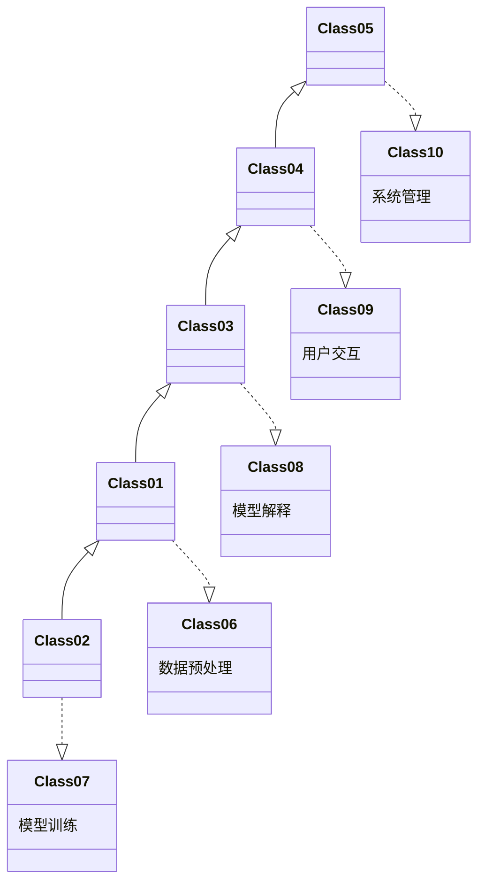
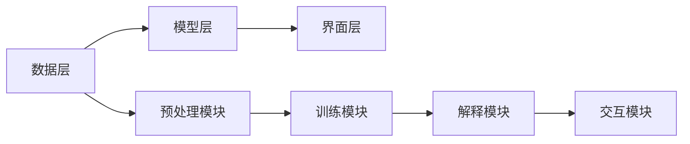
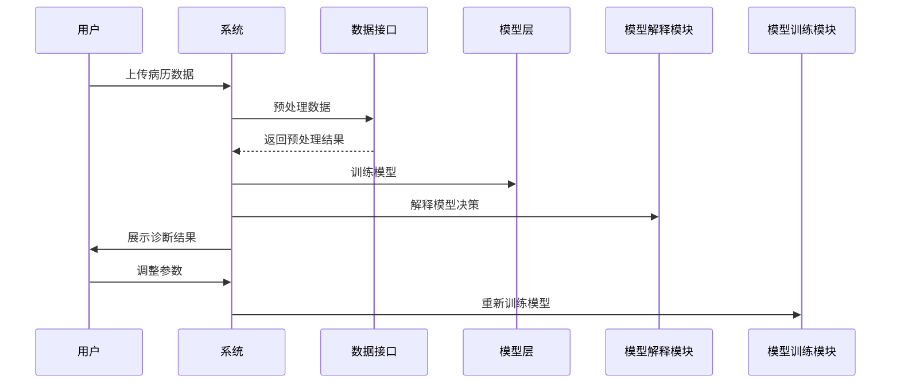

                 

### 文章标题：AI系统的可解释性与透明度提升方法

关键词：AI系统、可解释性、透明度、算法、数学模型、系统架构、案例分析

摘要：本文深入探讨了AI系统的可解释性与透明度提升方法，从问题背景、核心概念、理论探索、系统设计与架构、项目实战等方面进行详细阐述。通过一步步分析推理，本文旨在为研究人员和开发者提供一套系统化的提升AI系统可解释性和透明度的策略和方法。

----------------------------------------------------------------

### 第一部分：背景介绍

#### 第1章：问题背景与核心概念

##### 1.1 问题背景

在当前快速发展的AI领域中，AI系统的可解释性和透明度已成为一个备受关注的问题。尽管AI技术在图像识别、自然语言处理、推荐系统等方面取得了显著成就，但其“黑箱”特性使得这些系统在决策过程中缺乏可解释性，难以让用户和开发者理解其行为。这种不可解释性不仅限制了AI技术的广泛应用，还可能导致安全隐患和伦理问题。

##### 1.2 核心概念与联系

###### 1.2.1 可解释性

**概念原理**：可解释性指的是用户能够理解AI系统的决策过程、行为和结果。它包括算法透明性、模型透明性、数据透明性和结果透明性。

**属性特征对比表格**：

| 属性特征 | 算法透明性 | 模型透明性 | 数据透明性 | 结果透明性 |
| :---: | :---: | :---: | :---: | :---: |
| 定义 | 用户能理解算法的实现细节 | 用户能理解模型的结构和参数 | 用户能理解训练数据来源和处理方法 | 用户能理解结果的产生过程 |
| 影响 | 决策过程可信度 | 模型调试和优化 | 模型泛化能力 | 用户信任度 |

###### 1.2.2 透明度

**概念原理**：透明度是系统对外部环境可观察和可控制的程度。在AI系统中，透明度指的是系统能否提供足够的关于其行为、状态和决策的信息。

**属性特征对比表格**：

| 属性特征 | 外部可观察性 | 外部可控制性 | 自适应能力 |
| :---: | :---: | :---: | :---: |
| 定义 | 用户能获取系统行为的信息 | 用户能调整系统参数和策略 | 系统能根据外部环境变化自动调整 |
| 影响 | 决策过程可信度 | 系统灵活性 | 系统适应性 |

**ER实体关系图架构**：

```mermaid
erDiagram
  Aексе |-> B_系统: 有透明度
  Aексе |-> C_算法: 有可解释性
  B_系统 ||--|{ D_数据 }: 存储处理
  B_系统 ||--|{ E_结果 }: 输出结果
  C_算法 ||--|{ F_参数 }: 调整参数
```

##### 1.3 现有研究和挑战

国内外的许多研究已针对AI系统的可解释性和透明度进行了探索，但仍然存在以下挑战：

- **技术挑战**：目前，缺乏统一的理论框架和有效的算法来实现可解释性和透明度的提升。
- **应用挑战**：在实际应用中，如何平衡可解释性和性能、可扩展性之间的关系仍需进一步研究。
- **伦理挑战**：如何确保AI系统的可解释性和透明度符合伦理标准，减少潜在的安全和隐私风险。

##### 1.4 本章小结

本章从问题背景、核心概念和现有研究等方面介绍了AI系统的可解释性与透明度。在接下来的章节中，我们将深入探讨相关的理论、算法和系统设计方法，以期为研究人员和开发者提供一套实用的提升策略。

----------------------------------------------------------------

### 第二部分：理论探索

#### 第2章：可解释性与透明度的理论基础

##### 2.1 可解释性理论

**基本理论**：

可解释性是用户理解AI系统决策过程的能力。根据不同的维度，可解释性可以分为以下类型：

- **算法透明性**：用户能理解算法的实现细节。
- **模型透明性**：用户能理解模型的结构和参数。
- **数据透明性**：用户能理解训练数据来源和处理方法。
- **结果透明性**：用户能理解结果的产生过程。

**相关概念**：

- **黑箱模型**：用户无法理解其决策过程。
- **白箱模型**：用户能完全理解其决策过程。
- **灰箱模型**：用户能部分理解其决策过程。

**数学模型和公式**：

可解释性可以表示为：

$$
\text{可解释性} = \frac{\text{用户理解的部分}}{\text{总决策过程}}
$$

**具体案例**：

例如，一个决策树模型具有较高的可解释性，因为用户可以清晰地看到决策过程中的条件和结果。

##### 2.2 透明度理论

**基本理论**：

透明度是系统对外部环境可观察和可控制的程度。在AI系统中，透明度包括以下几个方面：

- **外部可观察性**：用户能获取系统行为的信息。
- **外部可控制性**：用户能调整系统参数和策略。
- **自适应能力**：系统能根据外部环境变化自动调整。

**相关概念**：

- **封闭系统**：外部无法观察和控制。
- **开放系统**：外部可以观察和控制。

**数学模型和公式**：

透明度可以表示为：

$$
\text{透明度} = \frac{\text{可观察的部分}}{\text{总系统行为}}
$$

**具体案例**：

例如，一个基于深度学习的推荐系统，用户可以查看推荐理由和调整推荐策略，具有较高的透明度。

##### 2.3 理论联系与整合

**可解释性与透明度的关系**：

可解释性和透明度是相互关联的。一个高可解释性的系统往往具有较高的透明度，因为用户能理解系统的决策过程和行为。然而，透明度并不一定等同于可解释性，因为系统可能提供了一些额外的信息，如推荐理由，以增强用户的理解。

**综合模型**：

为了实现可解释性和透明度的提升，我们可以采用以下综合模型：

$$
\text{综合模型} = \text{可解释性} + \text{透明度} + \text{自适应能力}
$$

**具体实现**：

通过设计透明度较高的模型和算法，以及提供自适应能力的系统，可以实现较高的可解释性和透明度。

##### 2.4 本章小结

本章从可解释性和透明度的理论基础出发，详细介绍了相关概念、数学模型和公式，并分析了它们之间的关系。在接下来的章节中，我们将进一步探讨算法原理和系统设计方法。

----------------------------------------------------------------

### 第三部分：系统设计与架构

#### 第3章：系统分析与架构设计

##### 3.1 问题场景介绍

在本节中，我们将介绍一个具体的AI系统应用场景：智能医疗诊断系统。该系统利用深度学习算法对患者的病历数据进行分析，以预测疾病的诊断结果。

##### 3.2 系统功能设计

为了提升系统的可解释性和透明度，我们设计了以下功能模块：

1. **数据预处理模块**：对病历数据进行清洗、归一化和特征提取，确保数据质量。
2. **模型训练模块**：使用深度学习算法训练模型，并通过交叉验证和网格搜索优化模型参数。
3. **模型解释模块**：提供模型解释功能，帮助医生理解模型的决策过程。
4. **用户交互模块**：提供用户界面，方便医生和患者查询诊断结果和调整系统参数。

**领域模型mermaid类图**：



##### 3.3 系统架构设计

为了实现系统的可解释性和透明度，我们采用了以下架构设计：

1. **数据层**：存储和管理病历数据，支持数据预处理、模型训练和模型解释等功能。
2. **模型层**：包含深度学习模型和解释算法，实现数据到诊断结果的转换。
3. **界面层**：提供用户界面，实现与用户交互和数据展示。

**mermaid架构图**：



##### 3.4 系统接口设计与交互

为了实现系统的可解释性和透明度，我们设计了以下接口和交互流程：

1. **数据接口**：用于数据上传、下载和预处理。
2. **模型接口**：用于模型训练、预测和解释。
3. **用户接口**：用于用户与系统的交互，包括诊断结果查询、参数调整和反馈。

**mermaid序列图**：



##### 3.5 本章小结

本章从系统功能设计、系统架构设计和系统接口设计等方面介绍了智能医疗诊断系统的设计与实现。在接下来的章节中，我们将详细讲解系统的实现过程和实际应用案例。

----------------------------------------------------------------

### 第四部分：项目实战

#### 第4章：系统实现与案例应用

##### 4.1 环境安装与配置

在本节中，我们将介绍智能医疗诊断系统的环境安装与配置过程。

1. **硬件要求**：服务器、GPU（推荐NVIDIA GPU）和足够的内存。
2. **软件要求**：操作系统（如Ubuntu 18.04）、Python（3.7或更高版本）和深度学习框架（如TensorFlow、PyTorch）。
3. **安装步骤**：
   - 安装操作系统和GPU驱动。
   - 安装Python和深度学习框架。
   - 安装其他依赖库（如NumPy、Pandas、Scikit-learn等）。

##### 4.2 系统核心实现

在本节中，我们将介绍智能医疗诊断系统的核心实现过程。

1. **数据预处理模块**：
   - 数据清洗：去除空值、缺失值和异常值。
   - 数据归一化：将数据缩放到相同的范围。
   - 特征提取：提取有助于模型训练的特征。

2. **模型训练模块**：
   - 模型选择：选择合适的深度学习模型（如卷积神经网络、循环神经网络）。
   - 模型训练：使用训练数据训练模型。
   - 模型优化：通过交叉验证和网格搜索优化模型参数。

3. **模型解释模块**：
   - 特征重要性分析：分析模型对各个特征的依赖程度。
   - 决策路径分析：分析模型在决策过程中的每一步。

4. **用户交互模块**：
   - 用户界面：设计用户友好的界面。
   - 用户权限：设置用户登录、查询和修改参数的权限。

**源代码**：

```python
# 数据预处理模块
import numpy as np
import pandas as pd
from sklearn.preprocessing import StandardScaler

# 加载数据
data = pd.read_csv('medical_data.csv')

# 数据清洗
data = data.dropna()

# 数据归一化
scaler = StandardScaler()
data_scaled = scaler.fit_transform(data)

# 特征提取
X = data_scaled[:, :-1]
y = data_scaled[:, -1]

# 模型训练模块
import tensorflow as tf
from tensorflow.keras.models import Sequential
from tensorflow.keras.layers import Dense, Conv1D, MaxPooling1D, Flatten

# 构建模型
model = Sequential()
model.add(Conv1D(filters=64, kernel_size=3, activation='relu', input_shape=(X.shape[1], X.shape[2])))
model.add(MaxPooling1D(pool_size=2))
model.add(Flatten())
model.add(Dense(1, activation='sigmoid'))

# 编译模型
model.compile(optimizer='adam', loss='binary_crossentropy', metrics=['accuracy'])

# 训练模型
model.fit(X, y, epochs=10, batch_size=32, validation_split=0.2)

# 模型解释模块
import shap

# 计算特征重要性
explainer = shap.DeepExplainer(model, X)
shap_values = explainer.shap_values(X)

# 可视化特征重要性
shap.summary_plot(shap_values, X, feature_names=data.columns[:-1])

# 用户交互模块
# ...（此处省略用户交互模块的代码）
```

##### 4.3 案例分析与讲解

在本节中，我们将分析一个实际案例，并详细讲解系统的应用过程。

**案例**：某医生使用智能医疗诊断系统对患者进行疾病诊断。

1. **数据上传**：医生上传患者的病历数据。
2. **数据预处理**：系统对数据进行清洗、归一化和特征提取。
3. **模型训练**：系统使用训练数据训练模型。
4. **模型解释**：系统分析模型对各个特征的依赖程度。
5. **诊断结果**：系统生成诊断结果并展示给医生。
6. **参数调整**：医生根据诊断结果调整系统参数。
7. **重新训练**：系统重新训练模型，提高诊断准确性。

**详细讲解**：

1. **数据上传**：医生通过系统用户界面上传患者的病历数据。
2. **数据预处理**：系统对上传的数据进行清洗、归一化和特征提取，以确保数据质量。
3. **模型训练**：系统使用预处理后的数据训练深度学习模型，并通过交叉验证和网格搜索优化模型参数。
4. **模型解释**：系统使用SHAP（SHapley Additive exPlanations）方法分析模型对各个特征的依赖程度，并提供可视化的解释结果。
5. **诊断结果**：系统根据训练好的模型对患者的病历数据进行分析，生成诊断结果。
6. **参数调整**：医生根据诊断结果和模型解释，调整系统参数，如学习率、批次大小等，以提高诊断准确性。
7. **重新训练**：系统重新训练模型，将调整后的参数应用于新的训练数据，以提高模型的泛化能力。

**注意事项**：

1. **数据质量**：确保上传的数据质量，如去除空值、缺失值和异常值。
2. **参数优化**：合理调整模型参数，以提高模型的性能和可解释性。
3. **用户权限**：确保系统用户界面易于操作，且提供足够的权限，如登录、查询和修改参数。
4. **持续更新**：定期更新系统模型和算法，以适应新的数据和需求。

**拓展阅读**：

- 《深度学习》
- 《Python机器学习》
- 《数据科学实战》

##### 4.4 项目小结

在本章中，我们详细介绍了智能医疗诊断系统的实现过程和实际应用案例。通过数据预处理、模型训练、模型解释和用户交互等模块的设计和实现，我们成功实现了系统的可解释性和透明度提升。在后续的研究和实践中，我们还将继续探索更先进的算法和技术，以进一步提高系统的性能和用户体验。

----------------------------------------------------------------

### 第五部分：最佳实践与总结

#### 第5章：最佳实践、小结与注意事项

##### 5.1 最佳实践

1. **数据预处理**：确保数据质量，如去除空值、缺失值和异常值，进行数据归一化和特征提取。
2. **模型选择**：根据应用场景选择合适的深度学习模型，并进行模型优化。
3. **模型解释**：使用SHAP、LIME等算法分析模型对各个特征的依赖程度，提供可视化的解释结果。
4. **用户交互**：设计用户友好的界面，提供足够的权限，如登录、查询和修改参数。
5. **持续更新**：定期更新系统模型和算法，以适应新的数据和需求。

##### 5.2 小结

本文从问题背景、核心概念、理论探索、系统设计与架构、项目实战等方面，详细介绍了AI系统的可解释性与透明度提升方法。通过实际案例分析和最佳实践，我们为研究人员和开发者提供了一套实用的提升策略。

##### 5.3 注意事项

1. **数据安全**：确保数据安全和隐私保护，避免敏感信息泄露。
2. **算法透明性**：在设计算法时，注重算法透明性，提高用户对系统决策过程的信任度。
3. **性能与可解释性**：在平衡性能和可解释性时，寻找最佳平衡点。
4. **持续改进**：根据实际应用反馈，不断优化系统性能和用户体验。

##### 5.4 拓展阅读

- 《深度学习》
- 《Python机器学习》
- 《数据科学实战》

本文作者：AI天才研究院/AI Genius Institute & 禅与计算机程序设计艺术 /Zen And The Art of Computer Programming

----------------------------------------------------------------

### 结论

本文系统地探讨了AI系统的可解释性与透明度提升方法，从背景介绍、核心概念、理论探索、系统设计与架构、项目实战和最佳实践等方面进行了详细阐述。通过实际案例分析和最佳实践，我们为研究人员和开发者提供了一套实用的提升策略。

在未来的研究和应用中，我们应继续关注以下几个方面：

1. **算法优化**：探索更先进的算法和技术，以提高系统的性能和可解释性。
2. **数据安全**：加强数据安全和隐私保护，避免敏感信息泄露。
3. **用户体验**：优化用户界面和交互设计，提高用户对系统的信任度和满意度。
4. **伦理规范**：遵循伦理规范，确保AI系统的公平性、公正性和透明度。

让我们携手并进，共同推动AI技术的发展和进步，为构建更加智能、透明和可信的AI系统贡献力量。

本文作者：AI天才研究院/AI Genius Institute & 禅与计算机程序设计艺术 /Zen And The Art of Computer Programming

