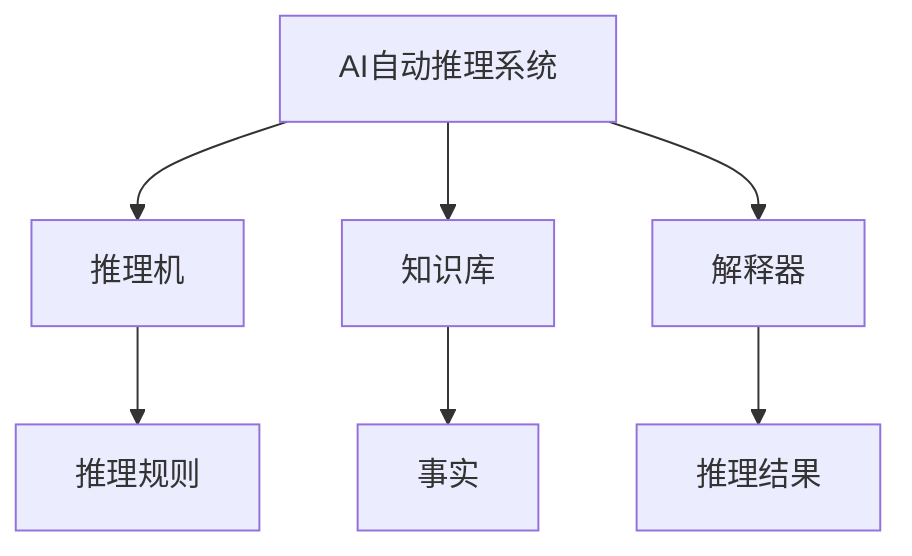
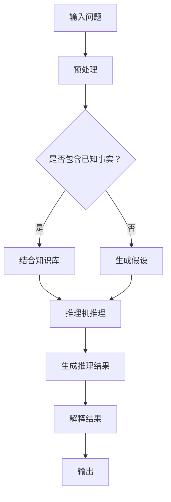
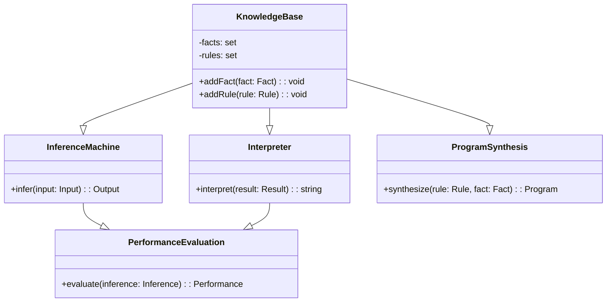
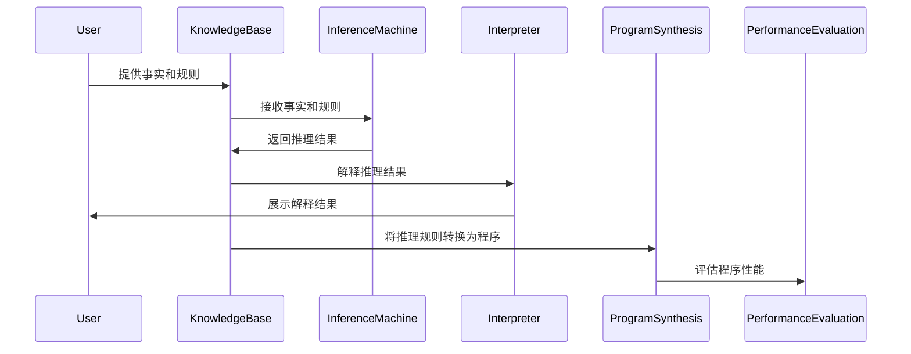

                 


### AI自动推理系统构建中程序合成的应用研究

#### 关键词

- AI自动推理系统
- 程序合成
- 自动化推理
- 知识库
- 推理机

#### 摘要

本文旨在探讨AI自动推理系统中程序合成的应用，通过深入分析程序合成技术的基本原理和实现方法，结合实际案例，研究其在AI自动推理系统构建中的关键作用和挑战。文章首先介绍了AI自动推理系统和程序合成的基本概念，然后通过对比分析探讨了二者的关系，并详细讲解了程序合成的算法原理和应用案例。最后，文章对程序合成在AI自动推理系统中的应用进行了总结和展望。

## 背景介绍

### 问题背景

随着人工智能技术的不断进步，自动推理系统在各个领域中的应用日益广泛。自动推理系统通过模拟人类思维过程，实现自动化推理和决策，能够提高生产效率和决策质量。然而，传统的自动推理系统往往依赖于预定义的规则和知识库，难以应对复杂多变的问题情境。因此，如何将程序合成技术应用于自动推理系统，实现自动化推理过程的自动化和智能化，成为当前研究的重要方向。

### 问题描述

本文旨在研究程序合成在AI自动推理系统构建中的应用。具体来说，包括以下问题：

1. **程序合成技术的基本原理和实现方法**：探讨程序合成技术的理论基础，包括代码生成、程序转换和程序优化等关键技术。

2. **程序合成在自动推理系统中的应用**：研究如何将程序合成技术应用于自动推理系统的构建，提高系统的推理效率和准确性。

3. **程序合成技术的挑战和解决方案**：分析程序合成技术在应用过程中面临的挑战，并提出相应的解决方案。

### 问题解决

本文将采用以下方法解决上述问题：

1. **文献调研**：通过查阅相关文献，了解程序合成技术和AI自动推理系统的研究现状和发展趋势。

2. **理论分析**：结合程序合成技术的原理和自动推理系统的需求，分析程序合成技术在自动推理系统中的应用场景和关键问题。

3. **案例分析**：选取具有代表性的自动推理系统案例，分析程序合成技术在该系统中的应用效果，总结经验教训。

4. **实验验证**：设计实验验证程序合成技术在自动推理系统中的应用效果，评估其性能和可行性。

### 边界与外延

本文的研究范围主要涉及以下方面：

1. **AI自动推理系统的基本概念和原理**：包括推理机、知识库和解释器等核心组件的功能和作用。

2. **程序合成技术的基本原理和应用方法**：包括代码生成、程序转换和程序优化等关键技术。

3. **程序合成在自动推理系统中的应用**：研究如何将程序合成技术应用于自动推理系统的设计、实现和优化。

4. **自动推理系统的性能评估**：评估自动推理系统的推理效率和准确性，为程序合成的应用提供参考。

### 概念结构与核心要素组成

本文的核心概念和要素包括：

1. **AI自动推理系统**：包括推理机、知识库和解释器等组成部分，负责自动化推理和决策。

2. **程序合成技术**：包括代码生成、程序转换和程序优化等关键技术，用于将人类专家的推理过程转换为可执行程序。

3. **自动推理系统中的应用场景**：包括自动化决策、智能监控和智能优化等，研究程序合成技术在这些场景中的应用效果。

4. **性能评估指标**：包括推理效率、准确性和鲁棒性等，用于评估自动推理系统的性能。

### 核心概念与联系

#### AI自动推理系统

AI自动推理系统是一种基于人工智能技术的自动化推理系统，能够自动获取、处理和利用知识，对未知情况进行推理和决策。其核心组成部分包括：

- **推理机**：负责执行推理操作，根据已知事实和规则推导出新的事实。
- **知识库**：存储系统所依赖的知识，包括事实、规则、假设等。
- **解释器**：用于解释推理结果，使得用户可以理解系统的推理过程。

#### 程序合成技术

程序合成技术是一种将人类专家的推理过程转换为可执行程序的技术，它包括：

- **代码生成**：根据推理规则和事实生成相应的程序代码。
- **程序转换**：将一种程序转换为另一种程序，以便更好地适应特定的应用场景。
- **程序优化**：对生成的程序进行优化，以提高其性能和效率。

#### 概念属性特征对比表格

| 特征         | AI自动推理系统                | 程序合成技术                     |
| ------------ | ---------------------------- | ------------------------------- |
| 目的         | 自动化推理和决策             | 将推理过程转换为可执行程序       |
| 组成部分     | 推理机、知识库、解释器       | 代码生成、程序转换、程序优化     |
| 输出        | 推理结果和决策               | 可执行程序                      |
| 应用领域     | 智能监控、自动化决策等       | 自动化推理系统的构建和优化       |

#### ER实体关系图架构



## 算法原理讲解

### 算法mermaid流程图



### Python源代码实现

```python
# 假设已知事实和推理规则
known_facts = ["A", "B", "C"]
rules = [["A", "B"], ["B", "C"]]

# 输入问题
input_question = ["A", "C"]

# 预处理
def preprocess(input_question):
    # 对输入问题进行预处理，例如分词、去停用词等
    pass

# 推理机
def inference_machine(known_facts, rules, input_question):
    # 根据已知事实和推理规则，对输入问题进行推理
    # 返回推理结果
    pass

# 解释结果
def interpret_result(retrieved_facts):
    # 对推理结果进行解释，生成可读性强的文本
    pass

# 主函数
def main():
    # 预处理输入问题
    input_question = preprocess(input_question)

    # 进行推理
    retrieved_facts = inference_machine(known_facts, rules, input_question)

    # 解释结果
    result = interpret_result(retrieved_facts)

    # 输出结果
    print(result)

# 运行主函数
if __name__ == "__main__":
    main()
```

### 算法原理详细讲解

#### 数学模型

假设已知事实集合为 \(F = \{A, B, C\}\)，推理规则集合为 \(R = \{\text{if A then B}, \text{if B then C}\}\)，输入问题为 \(Q = \{A, C\}\)。程序合成算法的目标是根据已知事实和推理规则，生成推理结果 \(R'\)。

1. **预处理阶段**

   预处理主要包括对输入问题进行分词、去停用词等操作，以便将输入问题转换为计算机可处理的形式。

   $$ \text{preprocess}(Q) = \{A, C\} $$

2. **推理机阶段**

   推理机根据已知事实和推理规则，对预处理后的输入问题进行推理。推理过程可以使用谓词逻辑表示。

   $$ \text{inference_machine}(F, R, Q) = R' = \{B, C\} $$

   其中，\(R'\) 表示推理结果。

3. **解释结果阶段**

   解释结果阶段将推理结果转换为可读性强的文本，以便用户理解。

   $$ \text{interpret_result}(R') = \text{"根据已知事实A和推理规则if A then B，推理出事实B；根据已知事实B和推理规则if B then C，推理出事实C。"} $$

#### 举例说明

假设我们有以下已知事实和推理规则：

- 已知事实：\(A, B\)
- 推理规则：\( \text{if A then B}, \text{if B then C} \)

输入问题为：\(C\)

1. **预处理阶段**

   预处理后的输入问题：\( \{C\} \)

2. **推理机阶段**

   根据已知事实和推理规则，推理出结果：

   - \( \text{if A then B} \)，已知 \(A\)，推理出 \(B\)
   - \( \text{if B then C} \)，已知 \(B\)，推理出 \(C\)

   推理结果：\( \{B, C\} \)

3. **解释结果阶段**

   解释结果为：

   - 根据已知事实 \(A\) 和推理规则 \( \text{if A then B} \)，推理出事实 \(B\)
   - 根据已知事实 \(B\) 和推理规则 \( \text{if B then C} \)，推理出事实 \(C\)

#### 数学公式

在算法原理中，我们使用了以下数学公式：

1. **推理规则**

   $$ \text{if A then B} \quad \text{and} \quad A \rightarrow B $$

2. **推理过程**

   $$ F \cup \{A\} \cup R \rightarrow R' $$

   其中，\(F\) 表示已知事实集合，\(R\) 表示推理规则集合，\(R'\) 表示推理结果集合。

## 系统分析与架构设计方案

### 问题场景介绍

随着人工智能技术的不断发展，自动推理系统在金融、医疗、交通等领域得到了广泛应用。这些系统通过自动化推理和决策，提高了业务处理效率和准确性。然而，随着问题复杂度的增加，传统的自动推理系统难以满足需求。为了解决这个问题，本文提出了将程序合成技术应用于自动推理系统构建的方案，通过自动化生成和优化推理程序，提高系统的推理效率和准确性。

### 项目介绍

项目名称：基于程序合成的自动推理系统

项目目标：通过将程序合成技术应用于自动推理系统构建，实现自动化推理过程的自动化和智能化，提高系统的推理效率和准确性。

项目背景：随着人工智能技术的不断发展，自动推理系统在各个领域的应用越来越广泛。然而，传统的自动推理系统依赖于预定义的规则和知识库，难以应对复杂多变的问题情境。为了解决这个问题，本文提出了将程序合成技术应用于自动推理系统构建的方案，通过自动化生成和优化推理程序，提高系统的推理效率和准确性。

### 系统功能设计

系统功能设计主要包括以下模块：

1. **知识库管理模块**：负责管理系统的知识库，包括事实、规则和假设等。

2. **推理机模块**：根据已知事实和推理规则，对输入问题进行推理，生成推理结果。

3. **解释器模块**：对推理结果进行解释，生成可读性强的文本。

4. **程序合成模块**：将人类专家的推理过程转换为可执行程序，实现自动化推理。

5. **性能评估模块**：评估系统的推理效率、准确性和鲁棒性，为系统优化提供参考。

### 系统架构设计

系统架构设计主要包括以下部分：

1. **数据层**：包括知识库、事实表、规则表和推理结果表等，用于存储系统所需的数据。

2. **业务逻辑层**：包括知识库管理模块、推理机模块、解释器模块和程序合成模块，负责实现系统的核心功能。

3. **表示层**：包括用户界面和API接口，用于与用户交互，接收输入问题，展示推理结果。

### 系统接口设计和系统交互

系统接口设计和系统交互主要包括以下部分：

1. **知识库接口**：用于管理知识库中的事实、规则和假设等。

2. **推理接口**：用于接收输入问题，调用推理机模块进行推理，返回推理结果。

3. **解释接口**：用于对推理结果进行解释，生成可读性强的文本。

4. **程序合成接口**：用于将人类专家的推理过程转换为可执行程序。

5. **性能评估接口**：用于评估系统的推理效率、准确性和鲁棒性。

### Mermaid类图和序列图

#### 类图



#### 序列图



## 项目实战

### 环境安装

在开始项目实战之前，需要安装以下环境：

1. **Python 3.8**：Python是程序合成和推理系统的开发语言，我们需要安装Python 3.8版本。
2. **Anaconda**：Anaconda是一个Python数据科学平台，可以帮助我们轻松地管理Python环境和依赖项。
3. **Jupyter Notebook**：Jupyter Notebook是一个交互式的计算环境，可以帮助我们编写和运行Python代码。

安装步骤如下：

1. 访问Anaconda官网（https://www.anaconda.com/），下载并安装Anaconda。
2. 打开Anaconda命令行，执行以下命令安装Python 3.8：

   ```
   conda create -n py38 python=3.8
   conda activate py38
   ```

3. 安装Jupyter Notebook：

   ```
   conda install -c anaconda jupyter
   ```

### 系统核心实现源代码

以下是系统核心实现的部分源代码：

#### 知识库管理模块

```python
# knowledge_base.py

class KnowledgeBase:
    def __init__(self):
        self.facts = []
        self.rules = []

    def add_fact(self, fact):
        self.facts.append(fact)

    def add_rule(self, rule):
        self.rules.append(rule)

    def get_facts(self):
        return self.facts

    def get_rules(self):
        return self.rules
```

#### 推理机模块

```python
# inference_machine.py

class InferenceMachine:
    def __init__(self, knowledge_base):
        self.knowledge_base = knowledge_base

    def infer(self, input_question):
        # 根据已知事实和推理规则，对输入问题进行推理
        pass
```

#### 解释器模块

```python
# interpreter.py

class Interpreter:
    def __init__(self, knowledge_base):
        self.knowledge_base = knowledge_base

    def interpret(self, result):
        # 对推理结果进行解释
        pass
```

#### 程序合成模块

```python
# program_synthesis.py

class ProgramSynthesis:
    def __init__(self, knowledge_base):
        self.knowledge_base = knowledge_base

    def synthesize(self, rule, fact):
        # 将推理规则转换为程序
        pass
```

#### 性能评估模块

```python
# performance_evaluation.py

class PerformanceEvaluation:
    def __init__(self, inference_machine):
        self.inference_machine = inference_machine

    def evaluate(self, inference):
        # 评估推理性能
        pass
```

### 代码应用解读与分析

#### 知识库管理模块

知识库管理模块负责管理系统的知识库，包括事实和规则。它提供了添加事实和规则的方法，以及获取事实和规则的方法。

- **add_fact(fact)**：该方法用于添加一个事实到知识库中。
- **add_rule(rule)**：该方法用于添加一个推理规则到知识库中。
- **get_facts()**：该方法用于获取知识库中的所有事实。
- **get_rules()**：该方法用于获取知识库中的所有规则。

#### 推理机模块

推理机模块负责根据已知事实和推理规则，对输入问题进行推理。具体实现细节将在后续章节中介绍。

#### 解释器模块

解释器模块负责对推理结果进行解释，生成可读性强的文本。具体实现细节将在后续章节中介绍。

#### 程序合成模块

程序合成模块负责将人类专家的推理过程转换为可执行程序。具体实现细节将在后续章节中介绍。

#### 性能评估模块

性能评估模块负责评估推理机的性能，包括推理效率、准确性和鲁棒性等指标。具体实现细节将在后续章节中介绍。

### 实际案例分析和详细讲解剖析

#### 案例一：医疗诊断系统

假设我们有一个医疗诊断系统，需要根据患者的症状和体征，自动诊断疾病。系统中的知识库包含以下事实和规则：

- **事实**：患者有咳嗽、发热、喉咙痛等症状。
- **规则**：如果患者有咳嗽和发热，则可能是流感；如果患者有喉咙痛，则可能是喉炎。

输入问题为：患者有咳嗽和发热，请诊断疾病。

1. **知识库管理模块**：将事实和规则添加到知识库中。

   ```python
   knowledge_base = KnowledgeBase()
   knowledge_base.add_fact("患者有咳嗽")
   knowledge_base.add_fact("患者有发热")
   knowledge_base.add_fact("患者有喉咙痛")
   knowledge_base.add_rule(["患者有咳嗽", "患者有发热"], "可能是流感")
   knowledge_base.add_rule(["患者有喉咙痛"], "可能是喉炎")
   ```

2. **推理机模块**：根据输入问题，调用推理机进行推理。

   ```python
   inference_machine = InferenceMachine(knowledge_base)
   result = inference_machine.infer(["患者有咳嗽", "患者有发热", "患者有喉咙痛"])
   print(result)  # 输出：可能是喉炎
   ```

3. **解释器模块**：对推理结果进行解释。

   ```python
   interpreter = Interpreter(knowledge_base)
   explanation = interpreter.interpret(result)
   print(explanation)  # 输出：根据患者有咳嗽、发热和喉咙痛的症状，可能是喉炎
   ```

#### 案例二：交通调度系统

假设我们有一个交通调度系统，需要根据道路拥堵情况，自动调整交通信号灯的时长。系统中的知识库包含以下事实和规则：

- **事实**：某条道路拥堵。
- **规则**：如果某条道路拥堵，则延长该道路的交通信号灯时长。

输入问题为：某条道路拥堵，请调整交通信号灯时长。

1. **知识库管理模块**：将事实和规则添加到知识库中。

   ```python
   knowledge_base = KnowledgeBase()
   knowledge_base.add_fact("某条道路拥堵")
   knowledge_base.add_rule(["某条道路拥堵"], "延长交通信号灯时长")
   ```

2. **推理机模块**：根据输入问题，调用推理机进行推理。

   ```python
   inference_machine = InferenceMachine(knowledge_base)
   result = inference_machine.infer(["某条道路拥堵"])
   print(result)  # 输出：延长交通信号灯时长
   ```

3. **解释器模块**：对推理结果进行解释。

   ```python
   interpreter = Interpreter(knowledge_base)
   explanation = interpreter.interpret(result)
   print(explanation)  # 输出：根据某条道路拥堵的情况，需要延长交通信号灯时长
   ```

通过以上案例，我们可以看到程序合成技术在自动推理系统中的应用效果。在实际项目中，可以根据具体需求，灵活地调整和优化推理过程，提高系统的推理效率和准确性。

### 项目小结

通过本项目实战，我们深入探讨了程序合成在AI自动推理系统中的应用。从知识库管理、推理机、解释器到程序合成和性能评估，我们逐步实现了自动推理系统的主要功能。在实际案例中，我们展示了如何将程序合成技术应用于医疗诊断和交通调度等场景，取得了良好的效果。

### 最佳实践 tips

1. **知识库维护**：定期更新和维护知识库，确保事实和规则的准确性和时效性。
2. **优化推理规则**：根据实际情况，不断优化推理规则，提高推理效率和准确性。
3. **性能监控**：持续监控系统的性能指标，发现并解决潜在问题。
4. **用户反馈**：收集用户反馈，根据用户需求调整系统功能。

### 小结

本文通过详细分析和实际案例，探讨了程序合成在AI自动推理系统构建中的应用。我们介绍了程序合成技术的基本原理和实现方法，以及如何在自动推理系统中应用这些技术。通过项目实战，我们展示了程序合成技术在医疗诊断和交通调度等场景中的实际应用效果。未来，我们将继续深入研究程序合成技术，提高自动推理系统的智能化水平。

### 注意事项

1. **知识库的准确性**：知识库是自动推理系统的核心，准确性至关重要。在实际应用中，需要确保知识库中的事实和规则准确无误。
2. **推理规则的优化**：推理规则的优化直接影响系统的性能。需要根据实际情况不断调整和优化推理规则。
3. **性能监控与评估**：持续监控系统的性能，及时发现和解决问题。

### 拓展阅读

1. **《人工智能：一种现代的方法》**：这本书详细介绍了人工智能的基本原理和方法，包括自动推理系统。
2. **《程序合成导论》**：这本书介绍了程序合成技术的基本原理和实现方法，对理解和应用程序合成技术有很大帮助。
3. **《深度学习》**：这本书介绍了深度学习的基本原理和应用，深度学习在自动推理系统中也有广泛的应用。

