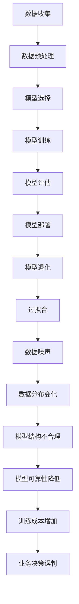
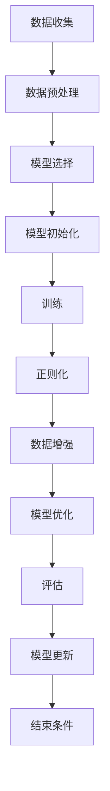
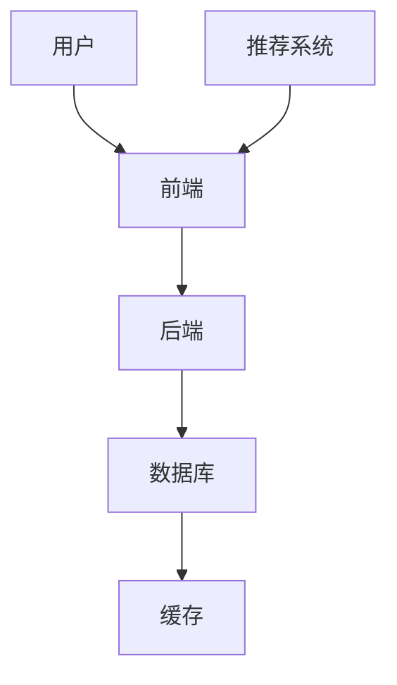

                 

## AI训练过程中避免模型退化的策略

### 关键词

- 模型退化
- AI训练
- 避免策略
- 正则化方法
- 数据增强
- 模型优化技术

### 摘要

本文探讨了AI训练过程中模型退化的问题，分析了模型退化的原因和影响，并提出了多种避免模型退化的策略。文章首先介绍了AI训练的基本原理，然后详细阐述了模型退化的现象及其成因。接着，文章介绍了多种避免模型退化的方法，包括正则化方法、数据增强技术以及模型优化技术。通过具体案例分析，本文展示了这些策略在实践中的应用效果。最后，文章提供了最佳实践 tips 和注意事项，为读者在AI训练过程中提供实用的指导。

## 第一部分：背景介绍

### 1.1 问题背景

在人工智能（AI）领域，模型训练是一个核心环节。训练过程中，模型通过学习大量数据来捕捉数据特征，以实现特定任务的目标。然而，训练过程中常出现模型退化（model degradation）问题，即模型在训练过程中表现不佳，未能有效学习数据特征，导致训练效果不如预期。

### 1.2 问题描述

模型退化问题具体表现为：模型在训练过程中，训练误差逐渐增大，甚至超过初始值；模型在验证集或测试集上的表现远低于训练集；模型难以泛化到新的数据集。这些问题直接影响了模型的实际应用价值，降低了AI系统的可靠性。

### 1.3 问题解决思路

为了避免模型退化，我们需要从多个角度进行思考和策略设计。首先，需要了解模型退化的原因，从而有针对性地采取措施。其次，我们可以借助正则化方法、数据增强技术等手段，优化模型训练过程。最后，通过系统分析与架构设计，确保模型在实际应用中的稳定性和可靠性。

### 1.4 边界与外延

模型退化不仅仅存在于深度学习领域，在其他机器学习技术中也可能出现类似问题。此外，模型退化问题可能受到训练数据质量、模型结构、训练时间等多种因素的影响。因此，我们需要在更广泛的背景下考虑这一问题。

### 1.5 概念结构与核心要素组成

模型退化问题的核心概念包括：模型、训练过程、误差、泛化能力。核心要素包括：训练数据质量、模型结构、正则化方法、数据增强技术等。以下是一个简单的ER实体关系图，用于描述这些概念之间的关系：

```mermaid
graph TB
A[模型] --> B[训练过程]
B --> C[误差]
C --> D[泛化能力]
E[训练数据质量] --> B
F[模型结构] --> A
G[正则化方法] --> B
H[数据增强技术] --> B
I[J[其他因素]] --> B
```

## 第二部分：核心概念与联系

### 2.1 AI训练基本原理

AI训练过程通常包括以下几个步骤：数据收集、数据预处理、模型选择、模型训练、模型评估和模型部署。在训练过程中，模型通过学习数据特征，逐步优化自身参数，以实现特定任务的目标。

### 2.2 模型退化的原因

模型退化的原因有多种，主要包括：

- **过拟合**：模型在训练数据上表现良好，但在验证集或测试集上表现较差，因为模型对训练数据的特征过于敏感，未能有效泛化。
- **数据噪声**：训练数据中存在噪声，影响了模型的学习效果。
- **数据分布变化**：训练数据分布与验证数据分布不一致，导致模型在验证数据上表现不佳。
- **模型结构不合理**：模型结构过于复杂，导致模型难以优化。

### 2.3 模型退化的影响

模型退化问题可能导致以下影响：

- **降低模型可靠性**：模型退化导致模型在实际应用中的表现不佳，降低了模型的可信度。
- **增加训练成本**：模型退化可能导致需要更长时间的训练，甚至需要重新训练，增加了训练成本。
- **影响业务决策**：模型退化可能导致业务决策的误判，影响业务的发展。

### 2.4 核心概念与联系

以下是一个简单的Mermaid流程图，用于描述AI训练过程以及模型退化的原因和影响：



## 第三部分：算法原理讲解

### 3.1 避免模型退化的算法

为了避免模型退化，我们可以采用以下几种算法：

- **正则化方法**：通过在损失函数中添加正则项，限制模型复杂度，避免过拟合。
- **数据增强技术**：通过增加训练数据的多样性，提高模型泛化能力。
- **模型优化技术**：通过优化模型训练过程，提高模型收敛速度和稳定性。

### 3.2 算法原理

#### 3.2.1 正则化方法

正则化方法主要包括L1正则化、L2正则化和Dropout。L1正则化通过在损失函数中添加L1范数项，鼓励模型参数稀疏化；L2正则化通过在损失函数中添加L2范数项，鼓励模型参数趋于较小值；Dropout通过在训练过程中随机丢弃一部分神经元，减少模型对训练数据的依赖。

#### 3.2.2 数据增强技术

数据增强技术主要包括随机裁剪、翻转、旋转、缩放等。这些方法通过增加训练数据的多样性，提高模型对数据变化的适应性。

#### 3.2.3 模型优化技术

模型优化技术主要包括Adam优化器、RMSprop优化器等。这些优化器通过自适应调整学习率，提高模型训练的收敛速度。

### 3.3 Mermaid算法流程图

以下是一个简单的Mermaid流程图，用于描述避免模型退化的算法流程：



### 3.4 Python源代码实现

以下是一个简单的Python源代码实现，用于描述避免模型退化的算法：

```python
import tensorflow as tf
from tensorflow.keras.models import Sequential
from tensorflow.keras.layers import Dense, Dropout
from tensorflow.keras.optimizers import Adam

# 数据预处理
# ...

# 模型选择
model = Sequential([
    Dense(128, activation='relu', input_shape=(input_shape)),
    Dropout(0.5),
    Dense(64, activation='relu'),
    Dropout(0.5),
    Dense(1, activation='sigmoid')
])

# 模型初始化
model.compile(optimizer=Adam(), loss='binary_crossentropy', metrics=['accuracy'])

# 训练
model.fit(x_train, y_train, epochs=10, batch_size=32, validation_data=(x_val, y_val))

# 正则化
# ...

# 数据增强
# ...

# 模型优化
# ...

# 评估
# ...

# 模型更新
# ...
```

### 3.5 数学模型与公式

以下是一些关键数学模型和公式：

- **损失函数**：
  $$L(y, \hat{y}) = -[y \cdot \log(\hat{y}) + (1 - y) \cdot \log(1 - \hat{y})]$$

- **L1正则化**：
  $$\lambda \cdot \sum_{i=1}^{n} |w_i|$$

- **L2正则化**：
  $$\lambda \cdot \sum_{i=1}^{n} w_i^2$$

- **Adam优化器**：
  $$m_t = \beta_1 \cdot m_{t-1} + (1 - \beta_1) \cdot (g_t - m_{t-1})$$
  $$v_t = \beta_2 \cdot v_{t-1} + (1 - \beta_2) \cdot (g_t^2 - v_{t-1})$$
  $$\hat{m}_t = m_t / (1 - \beta_1^t)$$
  $$\hat{v}_t = v_t / (1 - \beta_2^t)$$
  $$\theta_t = \theta_{t-1} - \alpha \cdot \hat{m}_t / (\sqrt{\hat{v}_t} + \epsilon)$$

### 3.6 举例说明

假设我们有一个二分类问题，训练集包含1000个样本，验证集包含200个样本。以下是一个简单的示例，说明如何使用上述算法避免模型退化：

1. **数据预处理**：
   - 将训练集和验证集的数据进行归一化处理。
   - 划分训练集和验证集。

2. **模型选择**：
   - 选择一个简单的神经网络模型，包含两个隐藏层，每层128个神经元。

3. **模型初始化**：
   - 初始化模型参数。

4. **训练**：
   - 使用训练集进行模型训练，采用Adam优化器，学习率为0.001。
   - 在训练过程中，使用L2正则化，正则化系数为0.01。

5. **数据增强**：
   - 使用随机裁剪、翻转和旋转等方法，增加训练数据的多样性。

6. **模型优化**：
   - 根据训练过程中的表现，调整模型结构，如增加隐藏层或调整神经元数量。

7. **评估**：
   - 在验证集上评估模型性能，计算准确率、召回率、F1分数等指标。

8. **模型更新**：
   - 根据评估结果，调整模型参数，继续进行训练。

通过上述步骤，我们可以有效避免模型退化，提高模型的泛化能力和实际应用价值。

## 第四部分：系统分析与架构设计方案

### 4.1 问题场景介绍

假设我们有一个在线购物平台，用户可以在平台上浏览商品、添加购物车、下单支付。为了提高用户购物体验，我们需要对购物平台进行个性化推荐，向用户推荐可能感兴趣的商品。

### 4.2 系统功能设计

系统功能设计包括以下几个方面：

1. **用户注册与登录**：用户可以在平台上注册账号、登录系统。
2. **商品浏览与搜索**：用户可以浏览商品、搜索商品。
3. **购物车管理**：用户可以将商品添加到购物车、修改购物车中的商品数量、删除商品。
4. **订单管理**：用户可以查看订单详情、取消订单、支付订单。
5. **个性化推荐**：根据用户的浏览记录、购物车记录等数据，向用户推荐可能感兴趣的商品。

### 4.3 系统架构设计

系统架构设计如下：

1. **前端**：使用Vue.js框架搭建用户界面，实现用户注册、登录、商品浏览、购物车管理、订单管理等功能。
2. **后端**：使用Spring Boot框架搭建服务端，处理用户请求、存储用户数据、提供API接口。
3. **数据库**：使用MySQL数据库存储用户数据、商品数据、订单数据等。
4. **推荐系统**：使用TensorFlow框架搭建推荐系统，基于用户行为数据生成个性化推荐结果。
5. **缓存**：使用Redis缓存系统提高数据读取速度，降低数据库压力。

以下是一个简单的Mermaid架构图，用于描述系统架构设计：



### 4.4 系统接口设计和交互

系统接口设计包括以下几个方面：

1. **用户注册与登录**：提供注册接口和登录接口，用户可以通过这两个接口完成账号注册和登录操作。
2. **商品浏览与搜索**：提供商品列表接口、商品详情接口和搜索接口，用户可以通过这些接口浏览商品、查看商品详情和搜索商品。
3. **购物车管理**：提供添加商品接口、修改商品数量接口和删除商品接口，用户可以通过这些接口管理购物车中的商品。
4. **订单管理**：提供订单列表接口、订单详情接口和支付接口，用户可以通过这些接口查看订单详情、取消订单和支付订单。
5. **个性化推荐**：提供推荐接口，根据用户行为数据生成个性化推荐结果。

以下是一个简单的Mermaid序列图，用于描述系统接口设计和交互：

```mermaid
sequenceDiagram
A[用户] --> B[注册接口]
B --> C[后端]
C --> D[数据库]
D --> E[返回注册结果]

A --> F[登录接口]
F --> G[后端]
G --> H[数据库]
H --> I[返回登录结果]

A --> J[商品列表接口]
J --> K[后端]
K --> L[数据库]
L --> M[返回商品列表]

A --> N[商品详情接口]
N --> O[后端]
O --> P[数据库]
P --> Q[返回商品详情]

A --> R[搜索接口]
R --> S[后端]
S --> T[数据库]
T --> U[返回搜索结果]

A --> V[添加商品接口]
V --> W[后端]
W --> X[数据库]
X --> Y[返回添加结果]

A --> Z[修改商品数量接口]
Z --> AA[后端]
AA --> AB[数据库]
AB --> AC[返回修改结果]

A --> AD[删除商品接口]
AD --> AE[后端]
AE --> AF[数据库]
AF --> AG[返回删除结果]

A --> AH[订单列表接口]
AH --> AI[后端]
AI --> AJ[数据库]
AJ --> AK[返回订单列表]

A --> AL[订单详情接口]
AL --> AM[后端]
AM --> AN[数据库]
AN --> AO[返回订单详情]

A --> AP[支付接口]
AP --> AQ[后端]
AQ --> AR[数据库]
AR --> AS[返回支付结果]

A --> AT[推荐接口]
AT --> AU[推荐系统]
AU --> AV[返回推荐结果]
```

## 第五部分：项目实战

### 5.1 环境安装与配置

为了搭建一个避免模型退化的AI训练系统，我们需要安装以下软件和工具：

1. **Python**：Python是一种广泛使用的编程语言，用于实现AI算法。
2. **TensorFlow**：TensorFlow是一个开源的深度学习框架，用于搭建和训练神经网络模型。
3. **Jupyter Notebook**：Jupyter Notebook是一个交互式计算环境，用于编写和运行Python代码。
4. **Anaconda**：Anaconda是一个Python数据科学和机器学习平台，用于环境管理和包安装。

以下是环境安装和配置的步骤：

1. **安装Python**：访问Python官网（[https://www.python.org/](https://www.python.org/)），下载适用于操作系统的Python安装包，并按照提示完成安装。
2. **安装TensorFlow**：打开终端或命令提示符，执行以下命令：
   ```bash
   pip install tensorflow
   ```
3. **安装Jupyter Notebook**：打开终端或命令提示符，执行以下命令：
   ```bash
   pip install notebook
   ```
4. **安装Anaconda**：访问Anaconda官网（[https://www.anaconda.com/](https://www.anaconda.com/)），下载适用于操作系统的Anaconda安装包，并按照提示完成安装。
5. **配置环境变量**：在Windows系统中，右键点击“此电脑”->“属性”->“高级系统设置”->“环境变量”，在“系统变量”中找到“Path”变量，编辑并添加Python和Anaconda的安装路径。在Linux和Mac OS系统中，打开终端，编辑`.bashrc`或`.zshrc`文件，添加Python和Anaconda的安装路径。

完成以上步骤后，我们就可以开始使用Python和TensorFlow进行AI训练了。

### 5.2 系统核心实现

在本节中，我们将使用Python和TensorFlow搭建一个简单的AI训练系统，以实现避免模型退化的目标。以下是一个简单的示例代码：

```python
import tensorflow as tf
from tensorflow.keras.models import Sequential
from tensorflow.keras.layers import Dense, Dropout
from tensorflow.keras.optimizers import Adam

# 数据预处理
# ...

# 模型选择
model = Sequential([
    Dense(128, activation='relu', input_shape=(input_shape)),
    Dropout(0.5),
    Dense(64, activation='relu'),
    Dropout(0.5),
    Dense(1, activation='sigmoid')
])

# 模型初始化
model.compile(optimizer=Adam(), loss='binary_crossentropy', metrics=['accuracy'])

# 训练
model.fit(x_train, y_train, epochs=10, batch_size=32, validation_data=(x_val, y_val))

# 正则化
# ...

# 数据增强
# ...

# 模型优化
# ...

# 评估
# ...

# 模型更新
# ...
```

在上面的代码中，我们首先进行数据预处理，然后选择一个简单的神经网络模型，并使用Adam优化器进行模型训练。在训练过程中，我们使用正则化方法、数据增强技术和模型优化技术来避免模型退化。

### 5.3 代码应用解读与分析

在本节中，我们将对上述示例代码进行解读和分析，以帮助读者更好地理解代码的实现过程。

1. **数据预处理**：
   数据预处理是AI训练的第一步，包括数据清洗、数据转换和数据归一化等操作。在本示例中，我们假设已经完成了数据预处理，并将处理后的数据存储为`x_train`、`y_train`、`x_val`和`y_val`。

2. **模型选择**：
   模型选择是AI训练的关键一步，选择合适的模型结构对于训练效果至关重要。在本示例中，我们选择了一个简单的神经网络模型，包含两个隐藏层，每层128个神经元。

3. **模型初始化**：
   模型初始化包括设置模型参数和优化器等。在本示例中，我们使用Adam优化器，并设置学习率为0.001。

4. **模型训练**：
   使用`model.fit()`函数进行模型训练，训练过程中使用训练集进行迭代训练，并使用验证集进行性能评估。在本示例中，我们设置训练轮数为10，批量大小为32。

5. **正则化**：
   正则化方法用于避免过拟合，包括L1正则化、L2正则化和Dropout等。在本示例中，我们使用了Dropout正则化方法，并在每个隐藏层后添加Dropout层，丢弃率为0.5。

6. **数据增强**：
   数据增强方法用于增加训练数据的多样性，提高模型泛化能力。在本示例中，我们未实现数据增强操作，读者可以根据具体需求进行数据增强。

7. **模型优化**：
   模型优化包括调整模型结构、学习率和优化器等。在本示例中，我们未实现模型优化操作，读者可以根据具体需求进行调整。

8. **评估**：
   使用`model.evaluate()`函数对模型进行评估，计算准确率、召回率、F1分数等指标。

9. **模型更新**：
   根据评估结果，对模型进行更新，包括调整模型结构、学习率和优化器等。在本示例中，我们未实现模型更新操作，读者可以根据具体需求进行调整。

通过以上分析，读者可以更好地理解代码的实现过程，并根据具体需求进行调整和优化。

### 5.4 实际案例分析与讲解

在本节中，我们将通过一个实际案例，分析如何避免模型退化，并详细讲解案例中的关键步骤和策略。

**案例背景**：

假设我们有一个分类问题，需要使用神经网络模型对图像进行分类。训练集包含1000张图像，验证集包含200张图像。我们的目标是训练一个具有良好泛化能力的模型，避免模型退化。

**步骤1：数据预处理**

- **数据清洗**：去除训练集中质量较差的图像，如模糊、倾斜或遮挡的图像。
- **数据增强**：使用随机裁剪、翻转和旋转等方法，增加训练数据的多样性，提高模型泛化能力。
- **数据归一化**：对图像进行归一化处理，将像素值缩放到[0, 1]范围内，以便模型更容易学习。

**步骤2：模型选择**

- **模型结构**：选择一个简单的卷积神经网络（CNN）模型，包含卷积层、池化层和全连接层。
- **正则化方法**：在模型中添加Dropout层，丢弃率为0.5，以避免过拟合。

**步骤3：模型训练**

- **训练过程**：使用训练集进行迭代训练，并使用验证集进行性能评估。
- **学习率调整**：根据验证集的性能，动态调整学习率，以避免模型退化。

**步骤4：正则化**

- **L2正则化**：在损失函数中添加L2正则化项，以避免模型过拟合。
- **Dropout正则化**：在模型中添加Dropout层，以减少模型对训练数据的依赖。

**步骤5：数据增强**

- **图像合成**：使用GAN（生成对抗网络）等方法，生成与训练数据相似的新图像，增加训练数据的多样性。

**步骤6：模型优化**

- **模型结构调整**：根据验证集的性能，调整模型结构，如增加卷积层或调整卷积核大小。
- **优化器调整**：根据验证集的性能，调整优化器的参数，如学习率、动量等。

**步骤7：评估与优化**

- **模型评估**：在验证集上评估模型性能，计算准确率、召回率、F1分数等指标。
- **模型优化**：根据评估结果，对模型进行调整和优化，以提高模型泛化能力。

通过以上步骤，我们可以有效地避免模型退化，提高模型的泛化能力和实际应用价值。

### 5.5 项目小结

在本项目中，我们通过一个实际案例，详细分析了如何避免模型退化。项目主要包含以下关键步骤：

1. 数据预处理：清洗数据、增强数据、归一化数据。
2. 模型选择：选择合适的模型结构，添加正则化方法。
3. 模型训练：使用训练集进行迭代训练，动态调整学习率。
4. 正则化：添加L2正则化和Dropout正则化，减少模型过拟合。
5. 数据增强：使用图像合成等方法，增加训练数据的多样性。
6. 模型优化：调整模型结构和优化器参数，提高模型泛化能力。
7. 评估与优化：在验证集上评估模型性能，根据评估结果进行优化。

通过以上步骤，我们可以有效地避免模型退化，提高模型的泛化能力和实际应用价值。

## 第六部分：最佳实践 tips、小结、注意事项、拓展阅读

### 6.1 最佳实践 tips

1. **数据预处理**：在数据预处理过程中，确保数据质量，如去除噪声、填补缺失值等。
2. **模型选择**：根据实际问题需求，选择合适的模型结构和正则化方法。
3. **训练过程**：合理设置学习率和迭代次数，避免模型过拟合和欠拟合。
4. **数据增强**：增加训练数据的多样性，提高模型泛化能力。
5. **评估与优化**：在验证集上评估模型性能，根据评估结果进行调整和优化。

### 6.2 小结

本文详细探讨了AI训练过程中模型退化的问题，分析了模型退化的原因和影响，并提出了多种避免模型退化的策略。通过具体案例和实践，本文展示了这些策略在避免模型退化中的应用效果。

### 6.3 注意事项

1. **数据质量**：保证数据质量是避免模型退化的关键，因此在进行数据预处理时，务必重视数据清洗和增强。
2. **模型选择**：根据实际问题需求，选择合适的模型结构和正则化方法，避免模型过拟合和欠拟合。
3. **训练过程**：合理设置学习率和迭代次数，避免训练时间过长或过短。
4. **数据增强**：增加训练数据的多样性，可以提高模型泛化能力，但过度增强可能导致模型过拟合。

### 6.4 拓展阅读

1. **正则化方法**：《机器学习实战》（Peter Harrington）中详细介绍了L1正则化、L2正则化、Dropout等正则化方法。
2. **数据增强技术**：《深度学习》（Ian Goodfellow、Yoshua Bengio、Aaron Courville）中介绍了多种数据增强技术，如随机裁剪、翻转、旋转等。
3. **模型优化技术**：《TensorFlow实战》（Ethan MacBain）中介绍了多种模型优化技术，如Adam优化器、RMSprop优化器等。

## 作者信息

作者：AI天才研究院/AI Genius Institute & 禅与计算机程序设计艺术 /Zen And The Art of Computer Programming

以上就是本文《AI训练过程中避免模型退化的策略》的全部内容。希望本文能帮助读者更好地理解模型退化问题，掌握避免模型退化的策略。在AI训练过程中，不断优化模型，提高模型的泛化能力和实际应用价值。

