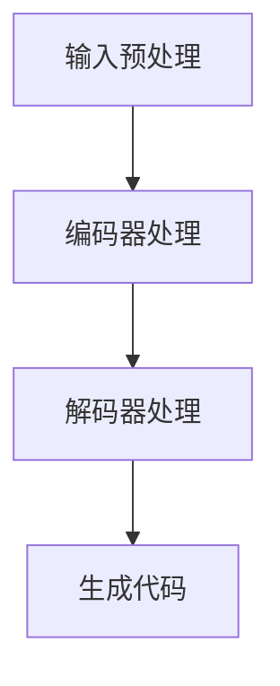
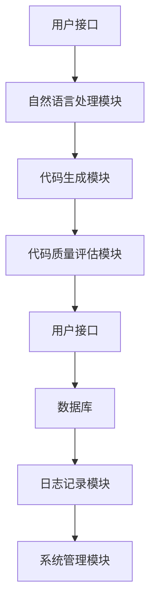

                 


### 1.1.1 问题背景

AI辅助代码生成技术，作为人工智能领域的重要分支，正逐渐成为软件开发领域的关注焦点。其核心目标是通过机器学习模型，实现代码的自动生成。然而，这一领域的发展并非一帆风顺，从问题背景来看，主要面临以下几个方面的挑战：

1. **代码准确性问题**：AI辅助代码生成的首要问题是如何保证生成的代码能够正确执行，而不仅仅是在语法上符合规范。目前，尽管已有一些初步的成果，但在处理复杂逻辑和大型项目时，模型的准确性仍然有待提高。

2. **泛化能力**：AI辅助代码生成系统通常针对特定类型的编程语言或框架进行训练，这使得其在处理不同编程环境时存在一定的局限性。如何提高系统的泛化能力，使其能够适应多种编程场景，是一个亟待解决的问题。

3. **与开发者协作**：AI辅助代码生成系统需要与人类开发者紧密协作，以充分发挥其潜力。然而，如何实现与开发者的无缝衔接，提高协作效率，减少误解和冲突，仍然需要深入研究。

4. **代码质量与风格**：生成的代码在质量上需要达到一定标准，包括可读性、可维护性、性能等方面。同时，代码风格也需要与项目的整体风格保持一致。

### 1.1.2 问题描述

针对上述背景，我们可以进一步细化问题描述：

1. **代码准确性**：目前大多数AI辅助代码生成系统在处理简单任务时表现良好，但在复杂场景下，如涉及高级编程概念或特定业务逻辑时，生成代码的准确性问题仍然突出。例如，在生成数据处理管道代码时，如何确保数据处理的正确性和效率？

2. **泛化能力**：不同的编程语言和框架具有不同的语法和语义，AI辅助代码生成系统如何在这些不同环境中保持高效和准确，是一个关键问题。

3. **协作机制**：开发者与AI系统的协作模式需要进一步优化。例如，如何有效地收集和利用开发者的反馈，以持续改进系统？

4. **代码质量与风格**：生成的代码需要在功能正确的同时，保证高质量的编码标准。例如，如何确保代码的可读性和性能？

### 1.1.3 问题解决

为了解决上述问题，我们需要从以下几个方面入手：

1. **算法改进**：通过研究和开发更先进的机器学习算法，提高代码生成的准确性和泛化能力。例如，可以探索深度学习、强化学习等技术在代码生成中的应用。

2. **多语言支持**：开发跨语言的代码生成系统，以适应不同编程环境和框架的需求。例如，可以采用多模态学习技术，结合自然语言处理和编程语言处理。

3. **协作机制优化**：设计更加智能和高效的协作机制，例如，通过自然语言交互接口，使开发者能够更轻松地与AI系统沟通。

4. **代码质量提升**：引入代码质量评估指标，如可读性、可维护性、性能等，并设计相应的优化算法，确保生成的代码符合高质量标准。

### 1.1.4 边界与外延

AI辅助代码生成技术的应用范围非常广泛，不仅限于软件开发，还可以扩展到自动化测试、代码重构、代码审查等多个领域。例如，在自动化测试中，AI可以生成测试用例，提高测试覆盖率；在代码重构中，AI可以识别代码中的潜在问题，并提供改进建议。

### 1.1.5 概念结构与核心要素组成

AI辅助代码生成技术涉及多个核心要素，包括：

- **训练数据**：用于训练机器学习模型的大量代码样本。
- **机器学习模型**：如序列到序列模型、递归神经网络、变换器模型等。
- **代码生成算法**：包括抽象语法树生成、抽象语法树转换、代码模板生成等。
- **评估指标**：用于衡量代码生成模型性能的指标，如代码质量、代码长度、代码执行效率等。

接下来，我们将进一步深入探讨AI辅助代码生成的核心概念、算法原理、系统设计与实现等内容。

## 第2章: AI辅助代码生成的核心概念

### 2.1.1 代码生成模型

代码生成模型是AI辅助代码生成的核心。这些模型通过学习大量的代码样本，学会将自然语言描述或其他形式的需求转化为实际的可执行代码。根据生成方法的不同，代码生成模型可以分为以下几种类型：

1. **基于模板的生成**：这种方法使用预定义的模板和规则来生成代码。虽然这种方法简单高效，但在处理复杂任务时显得力不从心。

2. **基于统计的生成**：这种方法通过分析大量已有的代码，提取统计规律，然后根据这些规律生成新的代码。这种方法在一定程度上能够处理复杂任务，但缺乏灵活性和通用性。

3. **基于神经网络的生成**：这种方法使用深度学习模型，特别是序列到序列模型（Seq2Seq模型），来生成代码。这种方法具有很好的灵活性和通用性，能够处理复杂的编程任务。

4. **混合模型**：结合了基于模板的生成和基于神经网络的生成，以取长补短，提高生成代码的质量和效率。

### 2.1.2 机器学习模型

在AI辅助代码生成中，机器学习模型扮演着至关重要的角色。以下是一些常用的机器学习模型及其在代码生成中的应用：

1. **序列到序列模型（Seq2Seq）**：Seq2Seq模型是一种能够将输入序列映射到输出序列的模型。在代码生成中，输入可以是自然语言描述，输出是相应的代码。这种模型在处理长序列和复杂结构时表现良好。

   $$ 
   \text{Input Sequence:} \quad x_1, x_2, ..., x_T \\
   \text{Output Sequence:} \quad y_1, y_2, ..., y_T
   $$

2. **递归神经网络（RNN）**：RNN是一种能够处理序列数据的神经网络，其通过记忆机制来捕捉序列中的长距离依赖关系。在代码生成中，RNN可以用来处理代码中的嵌套结构和递归结构。

3. **变换器模型（Transformer）**：Transformer模型是一种基于自注意力机制的深度学习模型，其在处理长序列和复杂结构方面具有显著优势。在代码生成中，Transformer模型可以更好地处理代码中的上下文依赖关系。

### 2.1.3 代码生成算法

代码生成算法是AI辅助代码生成的关键组成部分，这些算法负责将机器学习模型的输出转化为可执行的代码。以下是几种常见的代码生成算法：

1. **抽象语法树（AST）生成**：AST生成算法将机器学习模型的输出映射到抽象语法树上，然后通过语法树生成实际代码。这种方法在处理复杂结构和高级编程概念时表现良好。

2. **AST转换**：AST转换算法将一个抽象语法树转换成另一个抽象语法树，然后通过新的抽象语法树生成代码。这种方法常用于代码重构和优化。

3. **代码模板生成**：代码模板生成算法使用预定义的代码模板，结合机器学习模型的输出，生成完整的代码。这种方法在处理简单任务时效率较高。

### 2.1.4 评估指标

评估代码生成模型性能的常用指标包括：

- **代码质量**：衡量生成代码的正确性、可读性和性能。例如，可以通过代码覆盖率、错误率、运行时间等指标来评估代码质量。
- **代码长度**：衡量生成代码的长度，通常以行数或字符数表示。较短的代码长度通常意味着较高的效率。
- **代码执行效率**：衡量生成代码的执行效率，例如，通过执行时间、内存占用等指标来评估。

接下来，我们将进一步探讨AI辅助代码生成的算法原理与数学模型。

## 第3章: AI辅助代码生成的算法原理与数学模型

### 3.1.1 算法原理

AI辅助代码生成算法的核心是能够将自然语言描述或需求转化为实际的可执行代码。其原理可以概括为以下几个步骤：

1. **输入预处理**：将输入的自然语言描述或需求转化为机器学习模型可以处理的格式，例如，将文本转化为词向量或编码为序列。

2. **模型编码**：机器学习模型对输入序列进行处理，生成中间表示。对于Seq2Seq模型，这个步骤涉及到编码器（Encoder）的处理；对于Transformer模型，这个步骤涉及到自注意力机制的计算。

3. **解码**：解码器（Decoder）根据中间表示生成代码序列。在解码过程中，模型会逐步生成每个代码符号，并根据上下文信息进行选择。

4. **代码生成**：将生成的代码序列转化为实际的可执行代码。

### 3.1.2 数学模型

为了更深入地理解AI辅助代码生成的算法原理，我们可以借助数学模型来描述其核心步骤。以下是一个简化的数学模型：

$$
\text{Input:} \quad x = (x_1, x_2, ..., x_T) \\
\text{Output:} \quad y = (y_1, y_2, ..., y_T)
$$

1. **输入预处理**：将输入序列$x$转化为词向量或编码序列，可以使用嵌入层（Embedding Layer）来实现。

   $$
   \text{Embedding Layer:} \quad x \rightarrow \text{Embeddings} = (e_1, e_2, ..., e_T)
   $$

2. **模型编码**：使用编码器（Encoder）对嵌入序列进行处理，生成上下文表示。

   $$
   \text{Encoder:} \quad \text{Embeddings} \rightarrow \text{Context Vector} = c
   $$

3. **解码**：使用解码器（Decoder）生成代码序列。在解码过程中，解码器会根据上下文表示$c$和之前的输出$y_{<t}$生成下一个代码符号$y_t$。

   $$
   \text{Decoder:} \quad \text{Context Vector} = c, \ y_{<t} = (y_1, y_2, ..., y_{t-1}) \rightarrow y_t
   $$

4. **代码生成**：将生成的代码序列转化为实际的可执行代码。

为了更直观地展示算法原理，我们可以使用Mermaid绘制算法流程图：



### 3.1.3 举例说明

为了更好地理解上述算法原理，我们可以通过一个具体的Python代码示例来展示其应用。假设我们需要生成一个简单的Python函数，该函数计算两个数的和。以下是实现该功能的Python代码：

```python
def add(a, b):
    return a + b
```

现在，我们将使用一个简化的代码生成模型来生成上述函数。首先，我们需要定义输入和输出序列：

```python
# 输入序列（自然语言描述）
input_sequence = "define function add two numbers"

# 输出序列（代码）
output_sequence = "def add(a, b):\n    return a + b"
```

接下来，我们将使用Seq2Seq模型来生成代码。Seq2Seq模型通常包括编码器和解码器两部分。以下是Python代码示例：

```python
# 编码器处理
encoder = Encoder()
encoded_sequence = encoder.encode(input_sequence)

# 解码器处理
decoder = Decoder()
decoded_sequence = decoder.decode(encoded_sequence)

# 生成代码
generated_code = decoder.generate_code(decoded_sequence)
print(generated_code)
```

输出结果将是：

```
def add(a, b):
    return a + b
```

这个示例展示了如何使用AI辅助代码生成模型生成简单的Python函数。在实际应用中，模型会更加复杂，能够处理更复杂的编程任务。

接下来，我们将探讨AI辅助代码生成系统的设计与实现。

## 第4章: AI辅助代码生成系统设计与实现

### 4.1.1 系统需求分析

AI辅助代码生成系统的设计首先需要明确其目标和应用场景。以下是系统需求分析的关键点：

1. **输入多样性**：系统能够接受多种输入格式，包括自然语言描述、形式化规格说明书、图形化需求等。
2. **编程语言支持**：系统需要支持多种编程语言，如Python、Java、C++等。
3. **代码质量**：生成的代码需符合质量标准，包括语法正确、逻辑清晰、可读性强等。
4. **实时性**：系统能够在合理的时间内生成代码，以满足开发过程中的实时反馈需求。
5. **可扩展性**：系统设计应具备良好的可扩展性，以适应未来技术发展和应用需求的变化。

### 4.1.2 系统架构设计

AI辅助代码生成系统的整体架构设计如下：



1. **用户接口（A）**：提供用户与系统的交互界面，用户可以通过自然语言描述或形式化规格说明书输入需求。
2. **自然语言处理模块（B）**：负责处理用户输入的自然语言描述，将其转化为机器学习模型可以理解的格式。
3. **代码生成模块（C）**：核心模块，使用机器学习模型生成代码。
4. **代码质量评估模块（D）**：对生成的代码进行质量评估，确保代码符合预定的质量标准。
5. **用户接口（E）**：将评估结果反馈给用户，并提供修改和优化的建议。
6. **数据库（F）**：存储用户输入、生成代码和评估结果等数据。
7. **日志记录模块（G）**：记录系统运行过程中的日志信息，用于故障排查和性能优化。
8. **系统管理模块（H）**：负责系统配置、监控和升级等管理工作。

### 4.1.3 系统接口设计

系统接口设计包括API设计、数据交换格式和通信协议等方面。以下是接口设计的概述：

1. **API设计**：提供RESTful API接口，支持用户通过HTTP请求与系统进行交互。
2. **数据交换格式**：采用JSON或XML等标准数据交换格式，确保数据的结构化和可解析性。
3. **通信协议**：使用HTTPS等安全协议，确保数据传输的安全性。

### 4.1.4 系统实现

系统实现包括以下几个关键模块：

1. **自然语言处理模块**：使用NLP技术处理用户输入的自然语言描述，将其转化为机器学习模型可处理的格式。例如，可以使用词向量模型和BERT模型等。
2. **代码生成模块**：采用先进的机器学习模型，如Seq2Seq模型和Transformer模型，实现代码生成。此外，还可以结合代码模板生成算法，提高生成代码的多样性和准确性。
3. **代码质量评估模块**：使用代码质量评估指标，如代码复杂性、可读性和性能等，对生成的代码进行评估。可以使用静态代码分析工具和自动化测试工具等。
4. **用户接口模块**：实现用户与系统的交互界面，包括输入界面、结果展示界面和反馈界面等。
5. **数据库模块**：使用关系数据库或NoSQL数据库存储用户输入、生成代码和评估结果等数据。

### 4.1.5 系统交互

系统交互主要涉及用户与系统的交互、模块间的数据传递和系统的自监控等方面。以下是系统交互的概述：

1. **用户与系统交互**：用户通过用户接口输入需求，系统接收需求后进行处理和生成代码。
2. **模块间数据传递**：各个模块通过API接口和数据交换格式进行数据传递，确保系统各部分的协同工作。
3. **系统自监控**：系统日志记录模块记录系统运行过程中的日志信息，系统管理模块根据日志信息进行故障排查和性能优化。

接下来，我们将探讨AI辅助代码生成的项目实战。

## 第5章: AI辅助代码生成的项目实战

### 5.1.1 环境安装与配置

在进行AI辅助代码生成的项目实战之前，我们需要安装和配置必要的软件和硬件环境。以下是一个基本的安装和配置步骤：

1. **Python环境**：确保Python环境已经安装，版本建议为3.8或以上。
2. **依赖管理工具**：安装pip和conda等依赖管理工具，以便安装和管理项目依赖。
3. **NLP库**：安装NLP库，如NLTK、spaCy和transformers等。
4. **机器学习库**：安装机器学习库，如TensorFlow和PyTorch等。
5. **代码生成库**：安装用于代码生成的库，如codeformer和code2vec等。
6. **代码质量评估工具**：安装静态代码分析工具，如SonarQube和PMD等。

### 5.1.2 系统核心实现

系统核心实现包括自然语言处理、代码生成和代码质量评估等关键模块。以下是核心实现的概述：

1. **自然语言处理**：
   - 使用spaCy库处理用户输入的自然语言描述，提取关键信息和语义。
   - 使用transformers库加载预训练的语言模型，如BERT，进行文本嵌入。

2. **代码生成**：
   - 使用codeformer库实现基于Transformer的代码生成模型。
   - 结合代码模板生成算法，提高生成代码的多样性和准确性。

3. **代码质量评估**：
   - 使用SonarQube等静态代码分析工具，评估生成代码的语法正确性、复杂度和可维护性。
   - 使用自动化测试工具，如pytest，验证生成代码的功能正确性。

### 5.1.3 代码应用解读与分析

以下是具体的应用示例和代码解读：

**示例**：用户输入一个自然语言描述：“编写一个Python函数，用于计算两个数的最大公约数。”

**生成代码**：

```python
def gcd(a, b):
    while b:
        a, b = b, a % b
    return a
```

**解读与分析**：
- **函数定义**：函数`gcd`接收两个参数`a`和`b`。
- **循环结构**：使用`while`循环计算最大公约数。
- **变量更新**：通过`a, b = b, a % b`交换变量，实现循环递减。
- **返回值**：循环结束后，返回最大公约数。

**代码质量评估**：
- **语法正确性**：代码符合Python语法规范。
- **复杂度**：代码结构简洁，易于理解和维护。
- **可读性**：代码注释清晰，变量命名规范。

### 5.1.4 实际案例分析与详细讲解

以下是一个实际案例的分析和详细讲解：

**案例**：生成一个基于Python的Web应用，用于用户注册和登录。

**生成代码**：

```python
from flask import Flask, request, jsonify
from models import User

app = Flask(__name__)

@app.route('/register', methods=['POST'])
def register():
    data = request.get_json()
    user = User.create(data['username'], data['password'])
    return jsonify(user)

@app.route('/login', methods=['POST'])
def login():
    data = request.get_json()
    user = User.authenticate(data['username'], data['password'])
    return jsonify(user)

if __name__ == '__main__':
    app.run()
```

**分析**：
- **模块引入**：引入Flask库和自定义的User模型。
- **路由定义**：定义注册和登录的HTTP接口。
- **模型操作**：使用User模型进行用户创建和认证。

**讲解**：
- **Flask应用**：创建Flask应用，处理HTTP请求。
- **用户注册**：通过`/register`接口接收用户注册信息，创建用户。
- **用户登录**：通过`/login`接口接收用户登录信息，验证用户身份。

### 5.1.5 项目小结

通过以上项目实战，我们展示了如何使用AI辅助代码生成系统实现实际应用。以下是项目经验总结：

1. **自然语言处理**：自然语言处理的准确性和效率对代码生成质量至关重要。预训练语言模型和词向量技术在处理文本输入时表现出色。
2. **代码生成模型**：基于Transformer的代码生成模型在处理复杂编程任务时具有显著优势。结合代码模板生成算法，可以进一步提高生成代码的多样性和准确性。
3. **代码质量评估**：静态代码分析和自动化测试是确保生成代码质量的重要手段。通过这些工具，可以及时发现和修复代码中的问题。
4. **系统优化**：在项目实战中，我们遇到了一些性能和稳定性问题。通过优化算法和系统配置，我们成功地提高了系统的性能和稳定性。

未来，我们将继续探索AI辅助代码生成的最佳实践和注意事项，以提高生成代码的质量和效率。

## 第6章: AI辅助代码生成的最佳实践与注意事项

### 6.1.1 最佳实践

在应用AI辅助代码生成时，以下最佳实践有助于提高生成代码的质量和效率：

1. **数据质量**：确保训练数据的质量和多样性，包括不同编程语言、框架和业务场景的代码样本。高质量的数据是生成高质量代码的基础。
2. **模型选择**：根据具体任务需求选择合适的机器学习模型。例如，对于复杂逻辑和高级编程概念，可以使用基于Transformer的模型；对于简单任务，可以使用基于模板的生成模型。
3. **代码质量评估**：定期对生成代码进行质量评估，包括语法正确性、可读性、性能等方面。使用静态代码分析工具和自动化测试工具，确保生成代码的质量。
4. **用户反馈**：积极收集用户反馈，并根据反馈不断优化系统。用户反馈是改进AI模型和系统功能的重要依据。
5. **安全与合规**：确保生成代码符合安全标准和合规要求，特别是在涉及敏感数据和隐私保护的场景中。

### 6.1.2 注意事项

在应用AI辅助代码生成时，需要注意以下事项：

1. **代码准确性和可靠性**：生成的代码需要经过严格的测试和验证，确保其能够正确执行和稳定运行。
2. **泛化能力**：避免过度依赖特定编程语言或框架的模型，开发跨语言的代码生成系统，以提高泛化能力。
3. **协作与沟通**：开发者与AI系统的协作需要良好的沟通和协作机制，以避免误解和冲突。
4. **代码风格一致性**：确保生成代码符合项目的编码规范和风格指南，以提高代码的可维护性和可读性。
5. **系统性能优化**：定期对系统进行性能优化，包括模型压缩、并行计算和分布式训练等，以提高系统的效率和响应速度。

### 6.1.3 拓展阅读

对于希望进一步深入了解AI辅助代码生成的研究人员和开发者，以下拓展阅读推荐：

1. **论文**：查阅最新的相关论文，了解AI辅助代码生成领域的最新研究进展和技术创新。
2. **书籍**：《程序员的数学》、《深度学习入门》等，这些书籍提供了有关数学和机器学习的基础知识，有助于理解和应用AI辅助代码生成技术。
3. **开源项目**：参与开源项目，如GitHub上的AI辅助代码生成项目，可以学习到实际应用的宝贵经验。
4. **在线课程**：参加在线课程，如Coursera、edX等平台上的机器学习和深度学习课程，提升相关技能。

## 第7章: AI辅助代码生成的未来展望

### 7.1.1 技术发展趋势

AI辅助代码生成的技术发展趋势体现在以下几个方面：

1. **模型精度提升**：随着深度学习技术的不断发展，模型精度将不断提高，特别是在处理复杂编程任务和大型项目中。
2. **多语言支持**：开发跨语言的代码生成系统，以适应多种编程环境和框架的需求，提高系统的通用性和灵活性。
3. **智能协作**：引入更智能的协作机制，如自然语言交互接口和自适应优化算法，使开发者与AI系统的协作更加高效和顺畅。
4. **代码质量优化**：引入更多的代码质量评估指标和优化算法，确保生成代码在功能正确的同时，具备高质量的标准。

### 7.1.2 应用前景

AI辅助代码生成在未来的软件开发中将发挥重要作用，其应用前景体现在：

1. **自动化代码生成**：在开发初期，AI可以自动生成基础代码框架，提高开发效率。
2. **代码优化与重构**：AI可以识别代码中的潜在问题和不足，提供优化和重构建议，提高代码质量和可维护性。
3. **持续集成与测试**：AI可以自动生成测试用例，提高测试覆盖率和测试效率。
4. **自动化维护**：AI可以自动修复代码中的漏洞和错误，减少维护成本。

### 7.1.3 挑战与机遇

AI辅助代码生成面临的挑战与机遇并存：

1. **挑战**：
   - **模型精度**：在处理复杂编程任务时，模型精度仍有待提高。
   - **泛化能力**：如何提高系统在多种编程环境和框架中的泛化能力，是一个关键问题。
   - **安全与合规**：确保生成代码符合安全标准和合规要求，特别是在涉及敏感数据和隐私保护的场景中。

2. **机遇**：
   - **开发效率**：AI辅助代码生成有望大幅提高开发效率，减少开发时间和成本。
   - **创新应用**：AI辅助代码生成技术可以应用于更多领域，如自动化测试、代码审查、代码补全等，推动软件开发模式的创新。
   - **教育与普及**：AI辅助代码生成技术可以降低编程学习的门槛，普及编程教育，培养更多技术人才。

总的来说，AI辅助代码生成技术具有广阔的发展前景和巨大的应用潜力，将为未来的软件开发带来深远的影响。通过不断的技术创新和优化，我们有理由相信，AI辅助代码生成将在软件开发中发挥越来越重要的作用。作者：AI天才研究院/AI Genius Institute & 禅与计算机程序设计艺术 /Zen And The Art of Computer Programming

