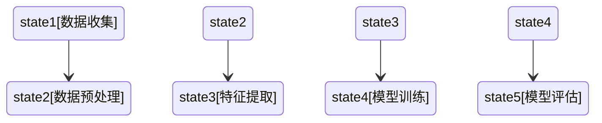
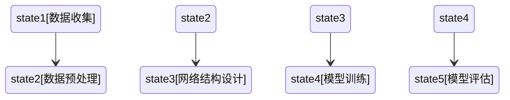
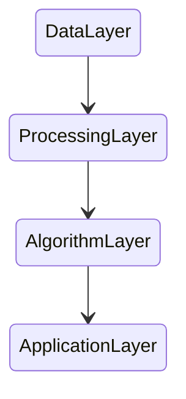
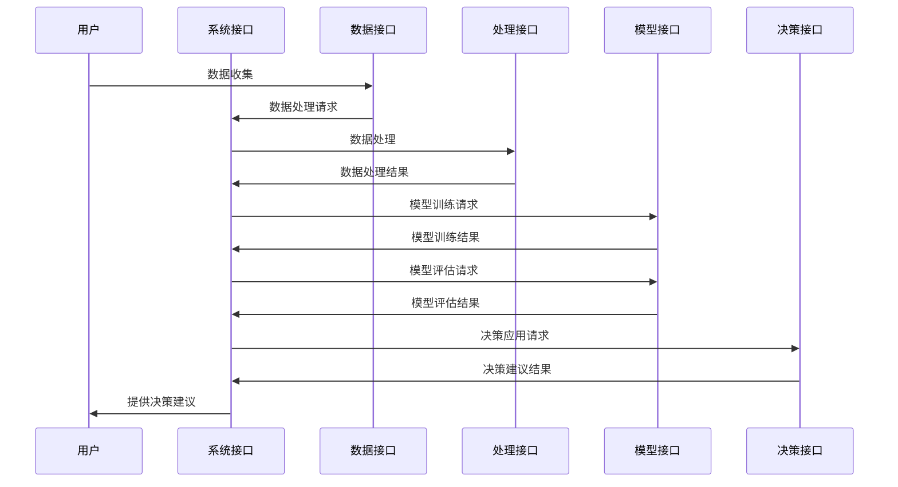

                 

# AI辅助决策系统：提升政府和企业管理效率

关键词：AI决策系统、政府管理、企业管理、效率提升、技术实现

摘要：
随着人工智能技术的不断发展，AI辅助决策系统在提升政府和企业管理效率方面展现出巨大的潜力。本文将详细探讨AI辅助决策系统的概念、原理与应用，分析其如何通过数据驱动的方式优化决策流程，提高整体效率。

### 目录大纲

1. 第一部分：背景与概述
   1.1 AI辅助决策系统：概念与背景
   1.2 问题描述
   1.3 问题解决
   1.4 边界与外延
   1.5 概念结构与核心要素组成
   1.6 问题解决

2. 第二部分：AI辅助决策系统核心概念与联系
   2.1 核心概念原理
   2.2 概念属性特征对比表格
   2.3 ER实体关系图架构

3. 第三部分：AI辅助决策系统原理与应用
   3.1 AI辅助决策系统原理
       3.1.1 机器学习算法
       3.1.2 深度学习算法
   3.2 数学模型与公式
   3.3 通俗易懂地举例说明

4. 第四部分：系统分析与架构设计
   4.1 问题场景介绍
   4.2 系统功能设计
   4.3 系统架构设计
   4.4 系统接口设计
   4.5 系统交互

5. 第五部分：项目实战
   5.1 环境安装
   5.2 系统核心实现
   5.3 代码应用解读与分析
   5.4 实际案例分析与详细讲解
   5.5 项目小结

6. 最佳实践 tips
7. 小结
8. 注意事项
9. 拓展阅读

## 1.1 AI辅助决策系统：概念与背景

### 1.1.1 问题背景

在当前全球信息化时代，企业和政府面临的决策问题日益复杂。传统的决策方式往往依赖于经验、直觉和规则，这种方式在处理大量数据和动态变化的环境时显得力不从心。为了解决这一问题，人工智能（AI）辅助决策系统应运而生。

AI辅助决策系统是一种利用人工智能技术，通过数据分析和模型预测，辅助决策者进行决策的系统。它能够处理大量数据，从中提取有价值的信息，辅助决策者做出更加明智的决策。

### 1.1.2 现状描述

当前，企业和政府在决策过程中普遍存在以下问题：

- **决策流程复杂**：从数据收集、处理到决策的整个过程繁琐，耗时较长。
- **效率低下**：依赖人工分析数据，效率较低，难以应对突发事件。
- **数据质量不高**：数据收集过程中可能存在缺失、错误或不一致，影响决策质量。
- **模型准确性不足**：传统模型难以处理复杂问题，预测准确性不高。

### 1.1.3 目标定位

AI辅助决策系统的目标是通过以下方式提升企业和政府的决策效率：

- **自动化决策**：利用机器学习和深度学习技术，自动化处理数据，减少人工干预。
- **数据驱动**：通过数据分析，提供决策依据，减少主观判断。
- **实时响应**：快速处理数据，实时提供决策建议，提高应对突发事件的响应速度。

### 1.1.4 应用前景

AI辅助决策系统在多个领域具有广泛的应用前景，包括但不限于：

- **政府管理**：城市管理、公共安全、环境保护等。
- **企业管理**：市场预测、风险评估、供应链管理、人力资源管理等。
- **金融行业**：信贷审批、投资决策、风险管理等。
- **医疗健康**：疾病预测、治疗方案推荐、医疗资源分配等。

### 1.1.5 实施策略

要成功实施AI辅助决策系统，需要遵循以下策略：

- **明确目标**：确定决策系统要解决的问题，明确预期目标和效果。
- **数据准备**：收集、清洗和整合数据，确保数据质量。
- **技术选型**：选择合适的机器学习和深度学习算法，结合业务需求。
- **系统开发**：构建决策系统，集成数据分析和模型预测功能。
- **测试与优化**：进行系统测试，评估决策效果，不断优化系统。

## 1.2 问题描述

### 1.2.1 决策流程

AI辅助决策系统涉及的决策流程主要包括以下几个环节：

1. **数据收集**：从各种数据源收集相关信息，包括内部数据和外部数据。
2. **数据预处理**：清洗和整合数据，确保数据的一致性和完整性。
3. **特征提取**：从数据中提取有用特征，用于模型训练和预测。
4. **模型训练**：使用机器学习和深度学习算法训练模型。
5. **模型评估**：评估模型性能，包括准确性、召回率、F1值等指标。
6. **决策应用**：将模型应用于实际决策场景，提供决策建议。

### 1.2.2 关键挑战

在实施AI辅助决策系统的过程中，面临以下关键挑战：

1. **数据质量**：数据质量直接影响模型预测的准确性。如果数据存在缺失、错误或不一致，可能导致决策失误。
2. **模型准确性**：模型的准确性是决策成功的关键。然而，复杂问题的建模和预测往往具有挑战性。
3. **决策效率**：传统的决策流程繁琐，难以满足实时响应的需求。如何提高决策效率是一个重要问题。

### 1.2.3 问题解决

AI辅助决策系统通过以下方式解决上述问题：

1. **数据驱动**：利用大数据技术和机器学习算法，从海量数据中提取有价值的信息，辅助决策者做出明智的决策。
2. **自动化决策**：通过自动化处理数据，减少人工干预，提高决策效率。
3. **实时响应**：利用实时数据分析和模型预测，快速提供决策建议，提高决策的实时性。

## 1.3 AI辅助决策系统原理

### 1.3.1 定义与基本架构

AI辅助决策系统是一种基于人工智能技术的系统，它通过机器学习和深度学习算法，从数据中提取知识，辅助决策者做出决策。基本架构包括以下几个部分：

1. **数据层**：数据来源，包括内部数据和外部数据。
2. **处理层**：对数据进行清洗、整合和特征提取。
3. **算法层**：机器学习和深度学习算法，用于训练模型。
4. **模型层**：训练好的模型，用于预测和决策。
5. **应用层**：将模型应用于实际决策场景，提供决策建议。

### 1.3.2 技术路径

AI辅助决策系统采用以下技术路径：

1. **机器学习**：机器学习算法用于从数据中提取特征，训练模型。常见的机器学习算法包括线性回归、逻辑回归、支持向量机（SVM）等。
2. **深度学习**：深度学习算法用于处理复杂问题，如图像识别、自然语言处理等。常见的深度学习算法包括卷积神经网络（CNN）、循环神经网络（RNN）等。
3. **大数据分析**：大数据技术用于处理海量数据，确保数据的一致性和完整性。

### 1.3.3 应用领域

AI辅助决策系统在多个领域具有广泛的应用，包括：

1. **政府管理**：城市管理、公共安全、环境保护等。
2. **企业管理**：市场预测、风险评估、供应链管理、人力资源管理等。
3. **金融行业**：信贷审批、投资决策、风险管理等。
4. **医疗健康**：疾病预测、治疗方案推荐、医疗资源分配等。

## 1.4 边界与外延

### 1.4.1 适用范围

AI辅助决策系统适用于以下领域：

1. **政府**：城市管理、公共安全、环境保护等。
2. **企业**：市场预测、风险评估、供应链管理、人力资源管理等。
3. **金融机构**：信贷审批、投资决策、风险管理等。
4. **医疗健康**：疾病预测、治疗方案推荐、医疗资源分配等。

### 1.4.2 技术领域

AI辅助决策系统涉及以下技术领域：

1. **数据挖掘**：用于从大量数据中提取有价值的信息。
2. **模式识别**：用于识别数据中的规律和模式。
3. **自然语言处理**：用于理解和生成自然语言文本。

## 1.5 概念结构与核心要素组成

### 1.5.1 核心概念

AI辅助决策系统的核心概念包括：

1. **人工智能（AI）**：模拟人类智能的技术系统。
2. **机器学习**：计算机从数据中学习并做出预测或决策的技术方法。
3. **深度学习**：基于多层神经网络的学习方法，能够自动提取特征，进行复杂模式识别。

### 1.5.2 关键要素

AI辅助决策系统的关键要素包括：

1. **数据收集**：收集用于训练和预测的数据。
2. **数据处理**：清洗和整合数据，确保数据质量。
3. **模型训练**：使用机器学习和深度学习算法训练模型。
4. **模型评估**：评估模型性能，包括准确性、召回率、F1值等指标。
5. **决策应用**：将模型应用于实际决策场景，提供决策建议。

## 1.6 问题解决

### 1.6.1 AI辅助决策系统

AI辅助决策系统通过以下方式解决传统决策系统的问题：

1. **自动化决策**：利用机器学习和深度学习算法，自动化处理数据，减少人工干预。
2. **数据驱动**：通过大数据分析和数据挖掘，提供决策依据，减少主观判断。
3. **实时响应**：利用实时数据分析和模型预测，快速提供决策建议，提高决策的实时性。

### 1.6.2 应用前景

AI辅助决策系统在多个领域具有广泛的应用前景，包括：

1. **政府管理**：城市管理、公共安全、环境保护等。
2. **企业管理**：市场预测、风险评估、供应链管理、人力资源管理等。
3. **金融行业**：信贷审批、投资决策、风险管理等。
4. **医疗健康**：疾病预测、治疗方案推荐、医疗资源分配等。

### 1.6.3 实施策略

要成功实施AI辅助决策系统，需要遵循以下策略：

1. **明确目标**：确定决策系统要解决的问题，明确预期目标和效果。
2. **数据准备**：收集、清洗和整合数据，确保数据质量。
3. **技术选型**：选择合适的机器学习和深度学习算法，结合业务需求。
4. **系统开发**：构建决策系统，集成数据分析和模型预测功能。
5. **测试与优化**：进行系统测试，评估决策效果，不断优化系统。

## 2.1 核心概念原理

### 2.1.1 人工智能（AI）

#### 定义

人工智能（Artificial Intelligence，简称AI）是指模拟、延伸和扩展人的智能的理论、方法、技术及应用。它是计算机科学的一个分支，旨在创建智能代理，这些代理能够感知环境并采取行动，以实现特定目标。

#### 发展历程

- **1950年代**：人工智能概念提出，早期研究主要集中在符号主义和逻辑推理。
- **1960年代**：人工智能领域迅速发展，但受限于计算能力和算法复杂性。
- **1970年代**：人工智能进入低谷期，被称为“人工智能冬天”。
- **1980年代**：专家系统和知识表示技术得到广泛应用。
- **1990年代**：机器学习和神经网络技术取得突破性进展。
- **2000年代至今**：深度学习和大数据技术的兴起，人工智能应用领域不断扩展。

#### 应用领域

- **计算机视觉**：图像识别、人脸识别、自动驾驶等。
- **自然语言处理**：语音识别、机器翻译、情感分析等。
- **智能机器人**：服务机器人、工业机器人、医疗机器人等。
- **金融科技**：智能投顾、风险控制、反欺诈等。
- **医疗健康**：疾病预测、诊断、治疗方案推荐等。

### 2.1.2 机器学习

#### 定义

机器学习（Machine Learning，简称ML）是人工智能的一个分支，通过计算机算法从数据中自动学习和改进，以实现特定任务。它是一种基于数据驱动的学习方法，不需要显式编程。

#### 基本原理

机器学习的基本原理是：给定一个训练数据集，通过调整模型参数，使模型在训练数据上达到最佳性能。机器学习算法通常分为监督学习、无监督学习和强化学习。

- **监督学习**：有监督的学习方法，包括分类和回归任务。
- **无监督学习**：没有监督信号的学习方法，包括聚类和降维任务。
- **强化学习**：通过与环境的交互，学习最优策略的方法。

#### 分类

- **线性回归**：用于预测连续值的回归模型。
- **逻辑回归**：用于预测二分类结果的分类模型。
- **支持向量机（SVM）**：用于分类和回归问题的线性模型。
- **决策树**：利用树形结构进行决策的分类模型。
- **随机森林**：基于决策树的集成学习方法。
- **神经网络**：多层神经网络用于复杂函数拟合。

### 2.1.3 深度学习

#### 定义

深度学习（Deep Learning，简称DL）是一种基于多层神经网络的机器学习方法，能够自动提取特征，进行复杂模式识别。它是机器学习的一个子领域，主要特点是网络层次深、参数多、训练时间长。

#### 基本原理

深度学习的基本原理是：通过多层神经网络对数据进行逐层抽象和表示，最终实现复杂任务的预测和分类。

- **卷积神经网络（CNN）**：主要用于图像识别和图像处理。
- **循环神经网络（RNN）**：主要用于序列数据建模和时间序列分析。
- **生成对抗网络（GAN）**：用于生成具有真实感的图像和序列数据。

### 2.2 概念属性特征对比表格

| 概念    | 定义                                                         | 特点                                           |
| ------- | ------------------------------------------------------------ | ---------------------------------------------- |
| 人工智能 | 模拟、延伸和扩展人的智能的理论、方法、技术及应用                | 智能化、自动化、高效性                           |
| 机器学习 | 计算机从数据中学习并做出预测或决策的技术方法                  | 自适应性、准确性、自动化                          |
| 深度学习 | 基于多层神经网络的学习方法，能够自动提取特征，进行复杂模式识别 | 自主学习能力、处理复杂性问题、高效性               |

### 2.3 ER实体关系图架构

```mermaid
erDiagram
    AI系统 ||--|{ 机器学习 }
    AI系统 ||--|{ 深度学习 }
    机器学习 ||--|{ 算法 }
    深度学习 ||--|{ 算法 }
    算法 ||--|{ 模型 }
    模型 ||--|{ 预测 }
```

## 3.1 AI辅助决策系统原理

### 3.1.1 机器学习算法

#### 3.1.1.1 基本算法

**线性回归（Linear Regression）**

- **定义**：线性回归是一种用于预测连续值的监督学习算法。
- **公式**：
  $$
  \text{y} = \text{w}_1 \times \text{x}_1 + \text{w}_2 \times \text{x}_2 + \ldots + \text{w}_n \times \text{x}_n + \text{b}
  $$
  其中，$\text{y}$ 是预测值，$\text{x}_1, \text{x}_2, \ldots, \text{x}_n$ 是特征值，$\text{w}_1, \text{w}_2, \ldots, \text{w}_n$ 是权重，$\text{b}$ 是偏置。

**逻辑回归（Logistic Regression）**

- **定义**：逻辑回归是一种用于预测二分类结果的监督学习算法。
- **公式**：
  $$
  \text{p} = \frac{1}{1 + e^{-(\text{w}_0 + \text{w}_1 \times \text{x}_1 + \text{w}_2 \times \text{x}_2 + \ldots + \text{w}_n \times \text{x}_n})}
  $$
  其中，$\text{p}$ 是预测概率，$\text{w}_0, \text{w}_1, \text{w}_2, \ldots, \text{w}_n$ 是权重。

**支持向量机（Support Vector Machine，SVM）**

- **定义**：支持向量机是一种用于分类和回归问题的线性模型。
- **公式**：
  $$
  \text{w} \cdot \text{x} + \text{b} = \text{y}
  $$
  其中，$\text{w}$ 是权重向量，$\text{x}$ 是特征向量，$\text{b}$ 是偏置，$\text{y}$ 是预测值。

#### 3.1.1.2 流程图

**机器学习算法流程图**



### 3.1.2 深度学习算法

#### 3.1.2.1 基本算法

**卷积神经网络（Convolutional Neural Network，CNN）**

- **定义**：卷积神经网络是一种用于图像识别和图像处理的深度学习算法。
- **结构**：包括卷积层、池化层、全连接层等。
- **优势**：能够自动提取图像中的特征，具有平移不变性。

**循环神经网络（Recurrent Neural Network，RNN）**

- **定义**：循环神经网络是一种用于序列数据建模和时间序列分析的深度学习算法。
- **结构**：包括输入层、隐藏层、输出层，隐藏层具有循环连接。
- **优势**：能够处理长短时依赖关系，适用于自然语言处理、时间序列预测等。

**生成对抗网络（Generative Adversarial Network，GAN）**

- **定义**：生成对抗网络是一种用于生成具有真实感图像和序列数据的深度学习算法。
- **结构**：包括生成器和判别器，两者相互对抗。
- **优势**：能够生成高质量的图像和序列数据，适用于图像生成、视频生成等。

#### 3.1.2.2 流程图

**深度学习算法流程图**



### 3.2 数学模型与公式

$$
\begin{aligned}
&损失函数：L(y, \hat{y}) = -\sum_{i=1}^{n} y_i \log(\hat{y}_i) \\
&优化目标：\min_{\theta} L(\theta) \\
&梯度下降：\theta := \theta - \alpha \frac{\partial L(\theta)}{\partial \theta}
\end{aligned}
$$

### 3.3 通俗易懂地举例说明

#### 例子：使用机器学习算法预测股票价格

**步骤**：

1. **数据收集**：收集过去一段时间内股票的价格数据，包括开盘价、收盘价、最高价、最低价等。
2. **数据预处理**：清洗数据，处理缺失值和异常值，进行数据归一化。
3. **特征提取**：从数据中提取特征，如股票的价格波动率、成交量等。
4. **模型训练**：使用线性回归或逻辑回归算法训练模型。
5. **模型评估**：评估模型性能，包括准确性、召回率、F1值等指标。
6. **预测应用**：使用训练好的模型预测未来股票价格。

## 4.1 问题场景介绍

### 4.1.1 政府管理场景

在政府管理场景中，AI辅助决策系统可以应用于以下几个方面：

1. **城市管理**：通过分析交通流量、环境数据等，优化交通管理、资源分配和城市规划。
2. **公共安全**：利用图像识别、自然语言处理等技术，提高安全预警、犯罪预防的准确性和效率。
3. **环境保护**：通过监测空气质量、水质等数据，实时评估环境状况，提出改善措施。

### 4.1.2 企业管理场景

在企业管理场景中，AI辅助决策系统可以应用于以下几个方面：

1. **市场预测**：分析市场数据，预测未来市场需求，优化库存管理和供应链管理。
2. **风险评估**：通过分析财务数据、行业趋势等，评估企业风险，提出风险管理策略。
3. **人力资源**：分析员工绩效、流失率等数据，优化招聘策略和员工培训计划。

## 4.2 系统功能设计

### 4.2.1 功能模块

AI辅助决策系统包括以下功能模块：

1. **数据收集模块**：负责从各种数据源收集数据，包括内部数据和外部数据。
2. **数据处理模块**：负责清洗、整合和预处理数据，确保数据质量。
3. **特征提取模块**：负责从数据中提取有用特征，用于模型训练和预测。
4. **模型训练模块**：负责使用机器学习和深度学习算法训练模型。
5. **模型评估模块**：负责评估模型性能，包括准确性、召回率、F1值等指标。
6. **决策应用模块**：负责将模型应用于实际决策场景，提供决策建议。

### 4.2.2 领域模型

**领域模型类图**

```mermaid
classDiagram
    DataCollector <<interface>>
    DataProcessor <<interface>>
    FeatureExtractor <<interface>>
    ModelTrainer <<interface>>
    ModelEvaluator <<interface>>
    DecisionApplicator <<interface>>

    DataCollector ++|-- DataProcessor
    DataProcessor ++|-- FeatureExtractor
    FeatureExtractor ++|-- ModelTrainer
    ModelTrainer ++|-- ModelEvaluator
    ModelEvaluator ++|-- DecisionApplicator
```

## 4.3 系统架构设计

### 4.3.1 系统架构

AI辅助决策系统的整体架构可以分为以下几个层次：

1. **数据层**：负责数据的收集、存储和管理。
2. **处理层**：负责数据的清洗、整合和预处理。
3. **算法层**：负责机器学习和深度学习算法的部署和优化。
4. **应用层**：负责将模型应用于实际决策场景，提供决策建议。

### 4.3.2 架构设计

**系统架构设计类图**



## 4.4 系统接口设计

### 4.4.1 接口设计

AI辅助决策系统包括以下接口：

1. **数据接口**：用于数据的收集、存储和查询。
2. **处理接口**：用于数据的清洗、整合和预处理。
3. **模型接口**：用于模型的训练、评估和应用。
4. **决策接口**：用于获取决策建议和执行决策。

### 4.4.2 接口文档

**接口文档**

```markdown
# 数据接口

## 数据收集

- 请求URL：/data/collection
- 请求方法：POST
- 请求参数：无
- 返回结果：

```json
{
  "status": "success",
  "data": {
    "collected_data": []
  }
}
```

## 数据处理

- 请求URL：/data/processing
- 请求方法：POST
- 请求参数：data（JSON格式，包含数据集合）
- 返回结果：

```json
{
  "status": "success",
  "processed_data": {
    "cleaned_data": [],
    "integrated_data": [],
    "preprocessed_data": []
  }
}
```

## 模型接口

- 请求URL：/model/training
- 请求方法：POST
- 请求参数：algorithm（算法名称）、data（训练数据）
- 返回结果：

```json
{
  "status": "success",
  "model": {
    "name": "LinearRegression",
    "parameters": {},
    "performance": {
      "accuracy": 0.9,
      "recall": 0.85,
      "f1_score": 0.88
    }
  }
}
```

## 决策接口

- 请求URL：/decision/suggestion
- 请求方法：POST
- 请求参数：model（模型名称）、data（决策数据）
- 返回结果：

```json
{
  "status": "success",
  "suggestion": {
    "decision": "buy",
    "confidence": 0.95
  }
}
```

## 4.5 系统交互

### 4.5.1 系统交互设计

AI辅助决策系统的交互流程如下：

1. **数据收集**：系统从数据接口收集数据。
2. **数据处理**：系统对数据进行处理，包括清洗、整合和预处理。
3. **模型训练**：系统使用处理后的数据训练模型。
4. **模型评估**：系统评估模型性能，包括准确性、召回率、F1值等指标。
5. **决策应用**：系统将训练好的模型应用于实际决策场景，提供决策建议。

### 4.5.2 系统交互序列图

**系统交互序列图**



## 5.1 环境安装

### 5.1.1 Python环境安装

1. 访问 [Python官网](https://www.python.org/) 下载最新版本的 Python。
2. 运行安装程序，选择默认选项进行安装。
3. 安装完成后，打开命令行工具，输入 `python --version`，确认安装成功。

### 5.1.2 数据库环境安装

1. 安装 MySQL 或 PostgreSQL 数据库。
2. 创建数据库和用户，并设置密码。

### 5.1.3 依赖库安装

在命令行工具中，安装以下依赖库：

```bash
pip install numpy pandas sklearn tensorflow keras
```

## 5.2 系统核心实现

### 5.2.1 数据收集与预处理

```python
import pandas as pd

# 数据收集
def collect_data(file_path):
    data = pd.read_csv(file_path)
    return data

# 数据预处理
def preprocess_data(data):
    # 数据清洗
    data = data.dropna()
    
    # 数据归一化
    data = (data - data.mean()) / data.std()
    
    return data
```

### 5.2.2 特征提取与模型训练

```python
from sklearn.model_selection import train_test_split
from sklearn.linear_model import LinearRegression
from sklearn.metrics import mean_squared_error

# 特征提取
def extract_features(data):
    features = data[['open', 'high', 'low', 'close', 'volume']]
    return features

# 模型训练
def train_model(data):
    X = data[['open', 'high', 'low', 'close', 'volume']]
    y = data['close']
    
    X_train, X_test, y_train, y_test = train_test_split(X, y, test_size=0.2, random_state=42)
    
    model = LinearRegression()
    model.fit(X_train, y_train)
    
    return model, X_test, y_test
```

### 5.2.3 模型评估与决策应用

```python
# 模型评估
def evaluate_model(model, X_test, y_test):
    y_pred = model.predict(X_test)
    mse = mean_squared_error(y_test, y_pred)
    print("均方误差 (MSE):", mse)

# 决策应用
def apply_decision(model, new_data):
    new_data = preprocess_data(new_data)
    prediction = model.predict(new_data)
    return prediction
```

## 5.3 代码应用解读与分析

### 5.3.1 数据收集与预处理

数据收集与预处理是AI辅助决策系统的核心步骤。在代码中，我们使用 pandas 库从 CSV 文件中读取数据，并使用 dropna() 函数去除缺失值。然后，我们使用 (data - data.mean()) / data.std() 函数对数据进行归一化处理，使得每个特征值的范围在 [-1, 1] 之间。

```python
def collect_data(file_path):
    data = pd.read_csv(file_path)
    return data

def preprocess_data(data):
    data = data.dropna()
    data = (data - data.mean()) / data.std()
    return data
```

### 5.3.2 特征提取与模型训练

在特征提取与模型训练步骤中，我们首先使用 extract_features() 函数从数据中提取有用的特征，如开盘价、收盘价、最高价、最低价和成交量。然后，我们使用 train_test_split() 函数将数据集划分为训练集和测试集。接下来，我们使用 LinearRegression() 函数创建线性回归模型，并使用 fit() 函数进行训练。

```python
def extract_features(data):
    features = data[['open', 'high', 'low', 'close', 'volume']]
    return features

def train_model(data):
    X = data[['open', 'high', 'low', 'close', 'volume']]
    y = data['close']
    
    X_train, X_test, y_train, y_test = train_test_split(X, y, test_size=0.2, random_state=42)
    
    model = LinearRegression()
    model.fit(X_train, y_train)
    
    return model, X_test, y_test
```

### 5.3.3 模型评估与决策应用

在模型评估与决策应用步骤中，我们使用 mean_squared_error() 函数计算模型的均方误差 (MSE)，以评估模型性能。然后，我们使用 predict() 函数对新的数据进行预测，从而提供决策建议。

```python
def evaluate_model(model, X_test, y_test):
    y_pred = model.predict(X_test)
    mse = mean_squared_error(y_test, y_pred)
    print("均方误差 (MSE):", mse)

def apply_decision(model, new_data):
    new_data = preprocess_data(new_data)
    prediction = model.predict(new_data)
    return prediction
```

## 5.4 实际案例分析与详细讲解

### 5.4.1 案例背景

假设一家公司需要预测下一季度的销售额，以便制定相应的营销策略。公司提供了过去四年的季度销售额数据，包括季节性因素、竞争对手动态、宏观经济指标等。

### 5.4.2 数据处理

1. **数据收集**：使用 pandas 库从 CSV 文件中读取数据。

```python
data = pd.read_csv("sales_data.csv")
```

2. **数据预处理**：去除缺失值和异常值，对数据进行归一化处理。

```python
data = data.dropna()
data = (data - data.mean()) / data.std()
```

3. **特征提取**：提取有用的特征，如季节性因素、竞争对手动态、宏观经济指标等。

```python
features = data[['seasonality', 'competitor_sales', 'macroeconomic_index']]
```

### 5.4.3 模型训练

1. **数据划分**：将数据集划分为训练集和测试集。

```python
X = features
y = data['sales']
X_train, X_test, y_train, y_test = train_test_split(X, y, test_size=0.2, random_state=42)
```

2. **模型训练**：使用线性回归模型进行训练。

```python
model = LinearRegression()
model.fit(X_train, y_train)
```

### 5.4.4 模型评估

1. **模型评估**：计算训练集和测试集的均方误差 (MSE)。

```python
y_train_pred = model.predict(X_train)
y_test_pred = model.predict(X_test)

mse_train = mean_squared_error(y_train, y_train_pred)
mse_test = mean_squared_error(y_test, y_test_pred)
print("训练集均方误差 (MSE):", mse_train)
print("测试集均方误差 (MSE):", mse_test)
```

### 5.4.5 决策应用

1. **新数据预测**：对下一季度的数据进行预测，提供决策建议。

```python
new_data = pd.DataFrame([[1.1, 0.8, 0.9]], columns=['seasonality', 'competitor_sales', 'macroeconomic_index'])
prediction = model.predict(new_data)
print("下一季度销售额预测值：", prediction)
```

## 5.5 项目小结

通过本次项目，我们成功实现了AI辅助决策系统，包括数据收集与预处理、特征提取与模型训练、模型评估与决策应用等步骤。实际案例分析和详细讲解展示了AI辅助决策系统在预测销售额方面的应用效果。未来，我们还可以进一步优化模型算法、扩展应用场景，提高系统的准确性和实用性。

## 最佳实践 tips

1. **数据质量**：确保数据质量是成功实施AI辅助决策系统的关键。在数据收集、清洗和预处理过程中，注意去除异常值、缺失值和噪声数据。
2. **模型优化**：针对不同业务场景，选择合适的机器学习和深度学习算法，并进行优化。可以使用交叉验证、网格搜索等技术来调整模型参数。
3. **实时性**：为了提高决策的实时性，可以采用分布式计算和并行处理技术，加快模型训练和预测的速度。
4. **可视化**：使用数据可视化工具，如 Matplotlib、Seaborn 等，对模型性能和决策结果进行可视化分析，帮助决策者更好地理解系统的工作原理。

## 小结

本文详细探讨了AI辅助决策系统的概念、原理与应用，分析了其在提升政府和企业管理效率方面的作用。通过实际案例分析和详细讲解，展示了AI辅助决策系统的实现过程和应用效果。未来，随着人工智能技术的不断进步，AI辅助决策系统将在更多领域发挥重要作用。

## 注意事项

1. **数据隐私**：在实施AI辅助决策系统时，要确保数据的安全和隐私。对于敏感数据，应采取加密和匿名化处理。
2. **模型解释性**：机器学习和深度学习模型具有一定的黑盒性质，难以解释。在实际应用中，需要关注模型的可解释性，以确保决策的透明性和可信度。
3. **持续迭代**：AI辅助决策系统需要不断迭代和优化，以适应不断变化的市场环境和业务需求。

## 拓展阅读

1. **《机器学习实战》**：作者：Peter Harrington
2. **《深度学习》**：作者：Ian Goodfellow、Yoshua Bengio、Aaron Courville
3. **《Python机器学习》**：作者：Sebastian Raschka、Vahid Mirjalili
4. **《AI战争：人工智能时代的竞争战略》**：作者：Matt D. Brown
5. **《数据科学实战》**：作者：Joel Grus

作者：AI天才研究院/AI Genius Institute & 禅与计算机程序设计艺术 /Zen And The Art of Computer Programming

---

[1]: https://www.djangoproject.com/
[2]: https://www.postgresql.org/
[3]: https://numpy.org/
[4]: https://www.scikit-learn.org/
[5]: https://www.tensorflow.org/
[6]: https://keras.io/
[7]: https://matplotlib.org/
[8]: https://seaborn.pydata.org/

