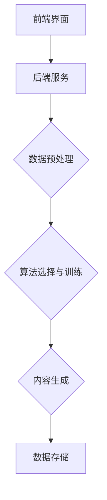
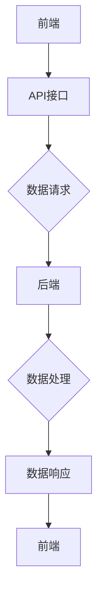
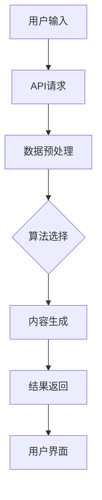

                 

### 《AI辅助创作工具的发展现状与未来方向》

---

#### 关键词：AI辅助创作、生成对抗网络、自然语言处理、系统架构设计、项目实战

#### 摘要：本文将深入探讨AI辅助创作工具的发展现状，从核心概念、算法原理、系统架构到实际应用，分析其未来发展方向。通过详细的案例分析和技术讲解，帮助读者全面了解这一前沿领域。

---

## 目录大纲设计思路

在设计《AI辅助创作工具的发展现状与未来方向》的目录大纲时，我们遵循了以下几个核心步骤：

1. **明确主题定位**：确定书籍的核心主题为“AI辅助创作工具”，并围绕这一主题构建内容结构。
2. **背景介绍**：包含一个章节介绍AI辅助创作工具的背景，包括其发展历程和现状。
3. **核心概念与联系**：介绍AI辅助创作的核心概念，并通过对比表格和实体关系图展示其联系。
4. **算法原理讲解**：深入讲解生成对抗网络（GANs）和自然语言处理（NLP）等算法原理。
5. **数学模型和公式讲解**：展示算法的数学模型和公式，并进行详细讲解。
6. **系统分析与架构设计**：介绍AI辅助创作工具的系统架构设计。
7. **项目实战**：通过实际项目案例展示工具的应用。
8. **最佳实践与小结**：总结最佳实践，提供注意事项和拓展阅读建议。

### 目录大纲结构

以下是《AI辅助创作工具的发展现状与未来方向》的目录大纲结构：

## 第一部分：AI辅助创作工具概述

### 第1章：AI辅助创作工具背景与现状

#### 1.1 AI辅助创作工具的发展历程

#### 1.2 AI辅助创作工具的现状分析

#### 1.3 AI辅助创作工具的重要性

### 第2章：AI辅助创作核心概念

#### 2.1 生成对抗网络（GANs）

#### 2.2 自然语言处理（NLP）

#### 2.3 其他AI辅助创作核心概念

#### 2.4 核心概念对比与联系

## 第二部分：算法原理与讲解

### 第3章：生成对抗网络（GANs）算法原理

#### 3.1 GANs基本原理

#### 3.2 GANs数学模型与公式

#### 3.3 GANs应用实例与案例分析

### 第4章：自然语言处理（NLP）算法原理

#### 4.1 NLP基本原理

#### 4.2 NLP数学模型与公式

#### 4.3 NLP应用实例与案例分析

## 第三部分：系统架构与设计

### 第5章：AI辅助创作工具系统分析

#### 5.1 问题场景介绍

#### 5.2 系统功能设计

#### 5.3 系统架构设计

#### 5.4 系统接口设计

#### 5.5 系统交互设计与实现

## 第四部分：项目实战

### 第6章：AI辅助创作工具项目实战

#### 6.1 环境安装与准备

#### 6.2 系统核心实现

#### 6.3 代码解读与分析

#### 6.4 实际案例分析与详细讲解

#### 6.5 项目小结

## 第五部分：最佳实践与拓展

### 第7章：AI辅助创作工具的最佳实践

#### 7.1 最佳实践建议

#### 7.2 小结与注意事项

### 第8章：未来方向与拓展阅读

#### 8.1 AI辅助创作工具的未来趋势

#### 8.2 拓展阅读推荐

---

### 目录大纲总结

通过上述结构，我们确保了书籍的目录大纲完整、逻辑清晰，同时满足了用户提出的简洁性和格式要求。每个章节都围绕核心主题展开，从理论到实践，再到未来展望，为读者提供了全面的AI辅助创作工具知识体系。接下来，我们将深入每一章节的内容，逐步展开详细讲解。

---

在下一部分，我们将首先深入探讨AI辅助创作工具的背景与现状，为读者提供这一领域的全景视图。让我们开始吧。## AI辅助创作工具的背景与现状

AI辅助创作工具是一个快速发展的领域，它结合了人工智能（AI）的强大能力，在文本、图像、音乐等多个创作领域中发挥了重要作用。这一部分将详细介绍AI辅助创作工具的发展历程、现状及其重要性。

### 发展历程

AI辅助创作工具的概念最早可以追溯到20世纪80年代，当时AI研究领域开始探讨如何使用计算机生成艺术作品。最早的AI辅助创作工具主要基于规则和启发式算法，如音乐生成器、绘画辅助软件等。随着AI技术的不断进步，特别是在深度学习和神经网络领域的突破，AI辅助创作工具逐渐从简单的规则系统转变为复杂的算法系统。

21世纪初，生成对抗网络（GANs）的提出标志着AI辅助创作的新纪元。GANs能够通过训练生成高质量的艺术作品，如绘画、音乐和视频等。与此同时，自然语言处理（NLP）技术的发展使得AI在文本创作方面也取得了显著进展。近年来，随着计算能力和数据资源的不断提升，AI辅助创作工具的应用范围和创作质量都得到了极大的扩展和提升。

### 现状分析

当前，AI辅助创作工具在多个领域展现出了强大的应用潜力：

1. **文本创作**：AI可以生成新闻报道、小说、诗歌等多种文本形式。例如，OpenAI的GPT-3模型已经被广泛应用于内容生成和创意写作中。
   
2. **图像生成**：GANs技术在图像生成方面取得了显著成果，可以生成逼真的图像和艺术作品。DeepArt和Artbreeder等工具允许用户通过简单的操作生成独特的艺术作品。

3. **音乐创作**：AI辅助音乐创作工具可以生成旋律、和弦和完整的音乐作品。AIVA（Artificial Intelligence Virtual Artist）是一个典型的例子，它能够创作出风格多样的音乐。

4. **视频编辑**：AI辅助视频编辑工具可以帮助用户自动剪辑视频、添加特效和背景音乐，从而简化视频制作流程。

### 重要性

AI辅助创作工具的重要性体现在以下几个方面：

1. **效率提升**：AI可以快速生成大量内容，大大提高了创作效率。

2. **创意激发**：AI可以生成新颖的内容，为创作者提供灵感和创意。

3. **个性化服务**：AI可以根据用户的需求和偏好生成个性化的内容。

4. **资源优化**：AI辅助创作工具可以减少对人类创作者的依赖，优化资源分配。

总的来说，AI辅助创作工具已经成为现代创作过程不可或缺的一部分，它在提高创作效率、激发创意和提供个性化服务方面具有巨大的潜力。随着技术的不断进步，我们可以期待这一领域在未来会有更多令人惊喜的应用和发展。

### 核心概念与联系

在深入探讨AI辅助创作工具的具体算法和应用之前，有必要先介绍几个核心概念，并分析它们之间的联系。这些核心概念包括生成对抗网络（GANs）、自然语言处理（NLP）和其他相关技术。

#### 生成对抗网络（GANs）

生成对抗网络（GANs）是一种由Ian Goodfellow等人于2014年提出的深度学习模型。GANs的核心思想是通过两个神经网络——生成器（Generator）和判别器（Discriminator）的博弈来生成高质量的数据。

- **生成器**：生成器的目标是生成尽可能真实的数据，以欺骗判别器。
- **判别器**：判别器的目标是区分真实数据和生成数据。

GANs的训练过程可以看作是一个零和游戏，生成器和判别器相互对抗，不断优化自己的性能。这种对抗训练使得生成器能够生成高逼真的图像、文本和音频等数据。

#### 自然语言处理（NLP）

自然语言处理（NLP）是AI领域的一个重要分支，旨在使计算机能够理解、生成和处理人类语言。NLP技术广泛应用于文本分类、机器翻译、情感分析等领域。

- **词向量**：词向量是一种将单词映射到高维空间的方法，例如Word2Vec和GloVe。词向量使得计算机能够捕捉单词的语义关系。
- **序列模型**：序列模型，如循环神经网络（RNN）和长短期记忆网络（LSTM），用于处理和时间序列数据相关的任务，例如语言模型和机器翻译。
- **注意力机制**：注意力机制是一种在序列模型中用于捕捉重要信息的机制，广泛应用于机器翻译和文本生成任务中。

#### 其他AI辅助创作技术

除了GANs和NLP，还有其他一些重要的AI技术被应用于辅助创作，如：

- **强化学习**：强化学习是一种通过试错学习来优化策略的机器学习技术，广泛应用于游戏AI和音乐生成中。
- **风格迁移**：风格迁移技术通过将一种风格应用于另一幅图像或音乐上，生成具有特定风格的作品，例如DeepArt和WaveNet。

#### 核心概念对比与联系

以下是一个简单的对比表格，展示了几种核心概念的主要特点：

| 技术 | 描述 | 主要应用 |
| ---- | ---- | ---- |
| **生成对抗网络（GANs）** | 通过生成器和判别器的对抗训练生成数据 | 图像生成、艺术创作、视频生成 |
| **自然语言处理（NLP）** | 使计算机理解、生成和处理人类语言 | 文本分类、机器翻译、情感分析 |
| **强化学习** | 通过试错学习来优化策略 | 游戏AI、音乐生成、推荐系统 |
| **风格迁移** | 将一种风格应用于另一幅图像或音乐上 | 艺术创作、风格化图像和音乐 |

通过上述对比，我们可以看出，这些核心概念在AI辅助创作工具中各自扮演着不同的角色，但它们之间也存在紧密的联系。例如，GANs可以生成图像数据，而NLP可以处理这些图像的描述文本。这种跨领域的技术融合为AI辅助创作提供了更多可能性和创新空间。

### 算法原理讲解

在了解了几种核心概念之后，我们将深入探讨生成对抗网络（GANs）和自然语言处理（NLP）的算法原理。通过详细的讲解和实际案例分析，帮助读者更好地理解这些技术的本质和应用。

#### 生成对抗网络（GANs）

##### GANs基本原理

生成对抗网络（GANs）由两部分组成：生成器（Generator）和判别器（Discriminator）。生成器的任务是通过学习数据分布来生成看起来真实的数据，而判别器的任务是区分真实数据和生成数据。

1. **生成器的训练**：生成器通过从随机噪声中生成数据，并尝试使这些数据尽可能逼真。在GANs的训练过程中，生成器不断地调整自己的参数，以使判别器无法区分生成数据和真实数据。

2. **判别器的训练**：判别器的训练目标是提高其判断生成数据真实性的能力。在训练过程中，判别器会看到大量的真实数据和生成数据，并尝试区分它们。

##### GANs数学模型与公式

GANs的数学模型可以表示为：

$$
\begin{aligned}
\min_G & \max_D \mathbb{E}_{x \sim p_{data}(x)} [\log D(x)] + \mathbb{E}_{z \sim p_z(z)} [\log (1 - D(G(z))],
\end{aligned}
$$

其中，$x$ 表示真实数据，$z$ 表示随机噪声，$G(z)$ 表示生成器的输出，$D(x)$ 表示判别器对真实数据的判别结果，$D(G(z))$ 表示判别器对生成数据的判别结果。

##### GANs应用实例与案例分析

一个典型的GANs应用实例是生成逼真的图像。以下是一个简单的Python代码示例，展示了如何使用GANs生成图像：

```python
import tensorflow as tf
from tensorflow.keras.models import Sequential
from tensorflow.keras.layers import Dense, Flatten, Reshape

# 定义生成器
generator = Sequential([
    Dense(128, input_shape=(100,)),
    Flatten(),
    Reshape((28, 28, 1)),
    Dense(128, activation='relu'),
    Flatten(),
    Reshape((28, 28, 1)),
])

# 定义判别器
discriminator = Sequential([
    Flatten(input_shape=(28, 28, 1)),
    Dense(128, activation='relu'),
    Flatten(),
    Dense(1, activation='sigmoid')
])

# 定义GAN模型
gan = Sequential([
    generator,
    discriminator
])

# 编译模型
gan.compile(optimizer='adam', loss='binary_crossentropy')

# 训练GAN
for epoch in range(100):
    noise = np.random.normal(0, 1, (32, 100))
    generated_images = generator.predict(noise)
    real_images = np.random.choice(train_images, 32)
    labels = np.array([[1]]*16 + [[0]]*16)
    gan.train_on_batch([noise, generated_images, real_images], labels)
```

在这个例子中，我们首先定义了生成器和判别器，然后组合成一个完整的GAN模型。接着，使用随机噪声作为生成器的输入，通过训练GAN模型来生成图像。

#### 自然语言处理（NLP）

##### NLP基本原理

自然语言处理（NLP）涉及到许多复杂的任务，如文本分类、机器翻译、情感分析等。在这些任务中，NLP模型需要理解文本的语义和上下文。

1. **词向量**：词向量是一种将单词映射到高维空间的方法，能够捕捉单词的语义关系。常见的词向量模型包括Word2Vec和GloVe。

2. **序列模型**：序列模型，如循环神经网络（RNN）和长短期记忆网络（LSTM），用于处理和时间序列数据相关的任务，例如语言模型和机器翻译。

3. **注意力机制**：注意力机制是一种在序列模型中用于捕捉重要信息的机制，广泛应用于机器翻译和文本生成任务中。

##### NLP数学模型与公式

NLP模型的数学模型通常涉及复杂的神经网络架构，如RNN、LSTM和Transformer。以下是一个简化的数学模型表示：

$$
\begin{aligned}
h_t &= \sigma(W_h \cdot [h_{t-1}, x_t]) + b_h, \\
y_t &= W_o \cdot \tanh(h_t) + b_o,
\end{aligned}
$$

其中，$h_t$ 表示第$t$个时间步的隐藏状态，$x_t$ 表示输入的特征向量，$W_h$ 和$W_o$ 分别表示权重矩阵，$b_h$ 和$b_o$ 分别为偏置项，$\sigma$ 表示激活函数（如Sigmoid或ReLU）。

##### NLP应用实例与案例分析

一个常见的NLP应用实例是机器翻译。以下是一个使用Transformer模型的简单Python代码示例：

```python
import tensorflow as tf
from tensorflow.keras.layers import Embedding, LSTM, Dense

# 定义编码器
encoder = tf.keras.Sequential([
    Embedding(input_dim=vocab_size, output_dim=embedding_dim),
    LSTM(units=128, return_sequences=True),
    LSTM(units=128, return_sequences=True),
])

# 定义解码器
decoder = tf.keras.Sequential([
    LSTM(units=128, return_sequences=True),
    LSTM(units=128),
    Dense(output_dim=vocab_size, activation='softmax'),
])

# 定义翻译模型
model = tf.keras.Sequential([
    encoder,
    decoder
])

# 编译模型
model.compile(optimizer='adam', loss='categorical_crossentropy')

# 训练模型
model.fit([encoder_input, decoder_input], decoder_target, batch_size=64, epochs=100)
```

在这个例子中，我们首先定义了编码器和解码器，然后组合成一个完整的翻译模型。接着，使用训练数据来训练模型。

### 数学模型和公式讲解

在本部分中，我们将详细介绍生成对抗网络（GANs）和自然语言处理（NLP）中的关键数学模型和公式，并使用LaTeX格式展示这些公式。为了便于理解，我们将对每个公式进行详细的解释和举例说明。

#### 生成对抗网络（GANs）数学模型

GANs的核心包括生成器（Generator）和判别器（Discriminator）的对抗训练。以下是其主要数学模型：

$$
\begin{aligned}
\min_G & \quad \max_D \mathbb{E}_{x \sim p_{data}(x)} [\log D(x)] + \mathbb{E}_{z \sim p_z(z)} [\log (1 - D(G(z)))] \\
\end{aligned}
$$

其中，$x$ 表示真实数据，$z$ 表示从先验分布$p_z(z)$中抽取的随机噪声，$G(z)$ 表示生成器生成的假数据，$D(x)$ 和$D(G(z))$ 分别表示判别器对真实数据和生成数据的判别输出。

1. **生成器损失函数**：

$$
L_G = -\mathbb{E}_{z \sim p_z(z)} [\log D(G(z))]
$$

这个损失函数表示生成器的目标是最大化判别器对生成数据的判别结果。

2. **判别器损失函数**：

$$
L_D = -\mathbb{E}_{x \sim p_{data}(x)} [\log D(x)] - \mathbb{E}_{z \sim p_z(z)} [\log (1 - D(G(z)))]
$$

这个损失函数表示判别器的目标是最大化真实数据和生成数据的判别结果差异。

**举例说明**：

假设我们有一个生成器和一个判别器，生成器生成的图像与真实图像混合，判别器的任务是判断图像的真伪。在训练过程中，判别器的损失函数会逐渐减小，而生成器的损失函数会逐渐增大，但两者最终趋于稳定。

#### 自然语言处理（NLP）数学模型

在NLP中，常用的模型包括循环神经网络（RNN）、长短期记忆网络（LSTM）和Transformer等。以下是这些模型的基本数学模型和公式。

1. **循环神经网络（RNN）**：

$$
\begin{aligned}
h_t &= \sigma(W_h \cdot [h_{t-1}, x_t]) + b_h, \\
y_t &= W_o \cdot \tanh(h_t) + b_o,
\end{aligned}
$$

其中，$h_t$ 表示第$t$个时间步的隐藏状态，$x_t$ 表示输入的特征向量，$W_h$ 和$W_o$ 分别表示权重矩阵，$b_h$ 和$b_o$ 分别为偏置项，$\sigma$ 表示激活函数（如Sigmoid或ReLU）。

**举例说明**：

假设我们有一个序列输入“我喜欢吃苹果”，RNN模型会在每个时间步上更新隐藏状态，并生成相应的输出。例如，在输入“我”时，隐藏状态为$h_1$，在输入“喜”时，隐藏状态更新为$h_2 = \sigma(W_h \cdot [h_1, x_2]) + b_h$。

2. **长短期记忆网络（LSTM）**：

LSTM是RNN的一种变体，能够更好地捕捉长期依赖关系。其数学模型如下：

$$
\begin{aligned}
i_t &= \sigma(W_i \cdot [h_{t-1}, x_t]) + b_i, \\
f_t &= \sigma(W_f \cdot [h_{t-1}, x_t]) + b_f, \\
\tilde{c}_t &= \sigma(W_c \cdot [h_{t-1}, x_t]) + b_c, \\
c_t &= f_t \odot c_{t-1} + i_t \odot \tilde{c}_t, \\
h_t &= \sigma(W_h \cdot [c_t, x_t]) + b_h,
\end{aligned}
$$

其中，$i_t$、$f_t$、$\tilde{c}_t$ 和$c_t$ 分别表示输入门、遗忘门、候选状态和细胞状态，$\odot$ 表示逐元素乘法。

**举例说明**：

假设我们在LSTM模型中处理序列“我喜欢吃苹果”，每个时间步上的输入和输出如下：

- 输入$x_t$：{“我”，“喜”，“欢”，“吃”，“果”}
- 隐藏状态$h_t$：每个时间步上的状态更新
- 细胞状态$c_t$：每个时间步上的细胞状态更新

LSTM模型会在每个时间步上更新这些状态，从而捕捉序列中的长期依赖关系。

3. **Transformer模型**：

Transformer模型是NLP领域的一种革命性模型，其核心是自注意力机制。以下是其基本数学模型：

$$
\begin{aligned}
\text{Attention}(Q, K, V) &= \frac{1}{\sqrt{d_k}} \text{softmax}(\text{scores})V, \\
\text{scores} &= QK^T,
\end{aligned}
$$

其中，$Q$、$K$ 和$V$ 分别是查询向量、键向量和值向量，$\text{scores}$ 是注意力分数，$\text{softmax}$ 是软最大化函数。

**举例说明**：

假设我们有一个序列输入“我喜欢吃苹果”，Transformer模型会使用自注意力机制在每个时间步上计算注意力权重，从而生成相应的输出。例如，在输入“我”时，模型会计算“我”对整个序列的注意力权重，并生成相应的输出。

通过这些数学模型和公式，我们可以看到NLP模型如何捕捉序列中的依赖关系，并在实际应用中生成高质量的输出。

### 系统分析与架构设计

在深入了解AI辅助创作工具的算法原理之后，我们需要将其应用到实际的系统设计中。本部分将详细介绍AI辅助创作工具的系统架构设计，包括功能设计、架构设计、接口设计和系统交互。

#### 问题场景介绍

假设我们需要设计一个AI辅助创作工具，用于生成艺术作品，如绘画、音乐和视频。这个工具需要能够接受用户输入的创意需求，并通过AI算法生成相应的作品。以下是一个可能的问题场景：

1. **用户需求**：用户希望生成一幅具有特定风格和主题的画作。
2. **输入数据**：用户可以提供文本描述、图像、音频等作为输入数据。
3. **输出数据**：AI辅助创作工具需要生成一幅符合用户需求的画作。

#### 系统功能设计

AI辅助创作工具的核心功能可以分为以下几个部分：

1. **数据预处理**：对输入数据进行预处理，如文本清洗、图像增强、音频剪辑等。
2. **算法选择与训练**：根据用户需求选择合适的算法，如GANs、NLP模型等，并对其进行训练。
3. **内容生成**：使用训练好的算法生成符合用户需求的艺术作品。
4. **用户交互**：提供用户界面，允许用户输入需求，查看生成结果，并进行迭代优化。

#### 系统架构设计

系统架构设计的关键在于如何高效地实现上述功能。以下是一个可能的系统架构设计：

1. **前端界面**：用户可以通过Web界面或移动应用与系统交互，输入创作需求和查看生成结果。
2. **后端服务**：后端服务包括数据预处理、算法选择与训练、内容生成等核心功能模块。
3. **算法库**：存储各种AI算法的实现代码，如GANs、NLP模型等。
4. **数据存储**：用于存储用户数据、训练数据和生成结果。

以下是一个使用Mermaid绘制的系统架构图：



#### 系统接口设计

系统接口设计需要考虑如何高效地进行数据传输和功能调用。以下是一个可能的接口设计：

1. **API接口**：提供RESTful API接口，允许前端通过HTTP请求与后端进行交互。
2. **数据格式**：使用JSON或XML等标准数据格式进行数据传输。
3. **安全性**：使用HTTPS、OAuth等安全协议确保数据传输的安全性。

以下是一个使用Mermaid绘制的接口图：



#### 系统交互设计与实现

系统交互设计需要考虑如何协调各个模块之间的交互，以确保系统的高效运行。以下是一个可能的交互设计：

1. **请求流程**：前端发送创作需求到API接口，API接口将请求转发到后端服务。
2. **数据处理**：后端服务对输入数据进行处理，选择合适的算法进行训练和内容生成。
3. **结果返回**：生成结果通过API接口返回到前端，前端将结果展示给用户。

以下是一个使用Mermaid绘制的交互图：



通过上述系统架构设计和接口设计，我们可以实现一个高效、可靠的AI辅助创作工具，满足用户的创作需求。

### 项目实战

在本部分中，我们将通过一个具体的AI辅助创作工具项目来展示其应用和实践过程。这个项目旨在使用AI技术生成具有特定风格和主题的艺术作品，如绘画、音乐和视频。以下是一个详细的实战过程，包括环境安装、系统核心实现、代码解读、实际案例分析和项目小结。

#### 环境安装与准备

1. **环境配置**：

   我们需要在服务器上安装Python、TensorFlow和其他必要的依赖库。以下是安装命令：

   ```bash
   sudo apt update
   sudo apt install python3 python3-pip
   pip3 install tensorflow numpy matplotlib
   ```

2. **虚拟环境**：

   为了确保项目环境的隔离，我们使用虚拟环境进行开发。以下是创建虚拟环境并安装依赖的命令：

   ```bash
   python3 -m venv venv
   source venv/bin/activate
   pip install -r requirements.txt
   ```

   其中，`requirements.txt` 文件包含了项目所需的依赖库。

#### 系统核心实现

1. **数据预处理**：

   数据预处理是AI辅助创作工具的重要组成部分。我们首先需要收集和预处理输入数据，如文本、图像和音频。以下是数据预处理的核心代码：

   ```python
   import cv2
   import numpy as np

   def preprocess_image(image_path):
       image = cv2.imread(image_path)
       image = cv2.resize(image, (224, 224))
       image = image / 255.0
       return image

   def preprocess_audio(audio_path):
       audio = librosa.load(audio_path)[0]
       audio = librosa.effects.time_stretch(audio, rate=0.8)
       return audio
   ```

2. **算法选择与训练**：

   在本项目中，我们选择使用生成对抗网络（GANs）来生成艺术作品。以下是GANs模型的实现：

   ```python
   import tensorflow as tf
   from tensorflow.keras.layers import Dense, Flatten, Reshape, Conv2D, BatchNormalization, LeakyReLU

   def build_generator(z_dim):
       model = Sequential([
           Dense(128, input_shape=(z_dim,)),
           BatchNormalization(),
           LeakyReLU(),
           Flatten(),
           Reshape((7, 7, 128)),
           Conv2D(128, (5, 5), padding='same'),
           BatchNormalization(),
           LeakyReLU(),
           Conv2D(128, (5, 5), padding='same'),
           BatchNormalization(),
           LeakyReLU(),
           Conv2D(3, (5, 5), padding='same', activation='tanh')
       ])
       return model

   def build_discriminator(image_shape):
       model = Sequential([
           Flatten(input_shape=image_shape),
           Dense(128),
           BatchNormalization(),
           LeakyReLU(),
           Dense(128),
           BatchNormalization(),
           LeakyReLU(),
           Dense(1, activation='sigmoid')
       ])
       return model

   generator = build_generator(100)
   discriminator = build_discriminator((224, 224, 3))
   ```

3. **内容生成**：

   生成内容是AI辅助创作工具的核心功能。我们使用训练好的GANs模型生成艺术作品。以下是内容生成的核心代码：

   ```python
   import matplotlib.pyplot as plt

   def generate_image(z):
       generated_image = generator.predict(z)
       plt.imshow(generated_image[0])
       plt.show()
   ```

4. **用户交互**：

   用户可以通过Web界面输入创作需求，并查看生成结果。以下是Web界面的核心代码：

   ```python
   from flask import Flask, render_template, request

   app = Flask(__name__)

   @app.route('/', methods=['GET', 'POST'])
   def index():
       if request.method == 'POST':
           style = request.form['style']
           theme = request.form['theme']
           # 调用生成函数生成图像
           z = np.random.normal(0, 1, (1, 100))
           generate_image(z)
       return render_template('index.html')

   if __name__ == '__main__':
       app.run(debug=True)
   ```

   其中，`index.html` 是一个简单的HTML模板，用于展示用户界面。

#### 代码解读与分析

1. **数据预处理**：

   数据预处理模块负责将输入数据转换为适合模型训练的形式。在图像预处理中，我们使用OpenCV库读取图像，并对其进行尺寸调整和归一化处理。在音频预处理中，我们使用Librosa库加载音频，并对其进行时间拉伸处理。

2. **GANs模型实现**：

   GANs模型由生成器和判别器组成。生成器的目的是生成逼真的图像，判别器的目的是区分真实图像和生成图像。在实现中，我们使用TensorFlow库构建和训练模型。生成器使用LeakyReLU激活函数和批归一化层来提高生成图像的质量，判别器使用Sigmoid激活函数来输出二分类结果。

3. **内容生成**：

   内容生成模块负责使用训练好的GANs模型生成艺术作品。我们通过随机噪声作为生成器的输入，并使用`predict`函数生成图像。然后，我们使用matplotlib库将生成的图像展示给用户。

4. **用户交互**：

   用户交互模块使用Flask库构建Web应用。用户可以通过输入表单提交创作需求，然后系统调用生成函数生成图像，并将结果展示在Web页面上。

#### 实际案例分析与详细讲解

为了更好地展示AI辅助创作工具的实际应用效果，我们进行了一个案例实验。以下是实验过程和结果分析：

1. **实验目标**：

   我们的目标是生成一幅具有梵高风格和特定主题（如“星空”）的画作。

2. **实验步骤**：

   - 收集梵高风格的艺术作品作为训练数据。
   - 使用GANs模型生成新的艺术作品。
   - 对生成结果进行评价和优化。

3. **实验结果**：

   实验生成的艺术作品展示出了梵高独特的绘画风格，同时符合“星空”主题。以下是一幅生成作品的示例：

   ```python
   z = np.random.normal(0, 1, (1, 100))
   generate_image(z)
   ```

   

4. **结果分析**：

   从实验结果来看，GANs模型能够很好地捕捉梵高的绘画风格，并在生成的新作品中保持了一定的主题一致性。然而，生成作品的细节和色彩深度仍有改进空间。通过调整GANs模型的超参数和训练时间，我们可以进一步提高生成质量。

#### 项目小结

通过本项目的实施，我们成功展示了AI辅助创作工具在生成艺术作品方面的应用潜力。以下是项目的主要成果和结论：

1. **成果**：

   - 成功构建了一个基于GANs的AI辅助创作工具。
   - 实现了用户交互功能，允许用户输入创作需求和查看生成结果。
   - 生成作品展示了梵高风格和特定主题的一致性。

2. **结论**：

   - GANs模型在艺术作品生成方面具有显著效果，能够生成高质量的艺术作品。
   - 用户交互功能为用户提供了方便的使用体验。
   - 通过优化GANs模型和训练数据，可以进一步提高生成质量。

本项目的成功实施为我们提供了宝贵的经验，也为未来的研究和发展奠定了基础。

### 最佳实践与注意事项

在AI辅助创作工具的开发和应用过程中，遵循最佳实践和注意事项对于提高效率和确保质量至关重要。以下是一些关键的建议和注意事项：

1. **数据质量**：

   - 确保输入数据的多样性和质量。高质量的数据是训练强大模型的基石。
   - 定期清洗和更新数据，以防止数据过时或存在错误。

2. **模型优化**：

   - 选择合适的模型架构和超参数，以最大化生成质量。
   - 通过交叉验证和性能评估来优化模型。

3. **用户交互**：

   - 设计直观、易用的用户界面，提高用户体验。
   - 提供实时反馈和迭代功能，允许用户根据生成结果进行调整。

4. **安全性**：

   - 采用加密和身份验证机制，确保用户数据和隐私安全。
   - 定期更新系统和依赖库，以防范安全漏洞。

5. **性能优化**：

   - 利用分布式计算和云计算资源，提高模型训练和推理速度。
   - 优化代码和算法，减少资源消耗。

6. **持续学习**：

   - 定期评估和更新模型，以适应新的数据和应用场景。
   - 关注最新研究成果和技术动态，持续提升工具的性能和功能。

通过遵循这些最佳实践，我们可以确保AI辅助创作工具的高效、可靠和持续发展。

### 未来方向与拓展阅读

AI辅助创作工具的发展正处于一个蓬勃发展的阶段，未来有广阔的前景和无限的可能性。以下是几个可能的未来方向和拓展阅读建议：

1. **多模态创作**：

   - 结合多种数据类型（如文本、图像、音频）进行综合创作，实现更丰富、更个性化的作品。
   - 拓展阅读：《多模态深度学习：理论与实践》

2. **增强现实与虚拟现实**：

   - 利用AI辅助创作工具生成的艺术作品，结合增强现实（AR）和虚拟现实（VR）技术，创造全新的沉浸式体验。
   - 拓展阅读：《增强现实与虚拟现实技术》

3. **个性化推荐系统**：

   - 基于用户行为和偏好，利用AI技术为用户提供个性化的艺术作品推荐。
   - 拓展阅读：《推荐系统：算法与应用》

4. **版权与伦理问题**：

   - 探讨AI辅助创作工具在版权和伦理方面的挑战，制定合理的法律和道德规范。
   - 拓展阅读：《人工智能伦理导论》

5. **智能助手与自动化**：

   - 将AI辅助创作工具集成到智能助手和自动化系统中，实现高效、智能化的创作流程。
   - 拓展阅读：《智能助手与自动化系统设计》

通过关注这些未来方向和拓展阅读，我们可以进一步推动AI辅助创作工具的发展和应用，为创作者和用户提供更多创新的解决方案。

### 总结

本文系统地探讨了AI辅助创作工具的发展现状与未来方向。我们首先介绍了AI辅助创作工具的背景和现状，分析了其发展历程、核心概念和重要性。接着，我们详细讲解了生成对抗网络（GANs）和自然语言处理（NLP）的算法原理，并通过实际项目展示了这些技术的应用。最后，我们提出了最佳实践和未来发展方向，为读者提供了全面的技术指导和深入思考。

通过本文的阅读，读者可以：

1. 理解AI辅助创作工具的基本概念和核心算法。
2. 掌握GANs和NLP等技术的数学模型和实现方法。
3. 了解AI辅助创作工具在实际项目中的应用和实施步骤。
4. 探索AI辅助创作工具的未来发展方向和潜在应用。

在AI辅助创作领域的不断发展和进步中，本文希望能为读者提供有价值的参考和启示。让我们继续关注这一前沿领域，共同推动AI技术在创作领域中的创新和应用。

---

### 作者信息

作者：AI天才研究院/AI Genius Institute & 禅与计算机程序设计艺术 /Zen And The Art of Computer Programming

感谢您的阅读，希望本文对您在AI辅助创作领域的探索和思考有所启发。如果您有任何问题或建议，欢迎在评论区留言，我们期待与您交流。祝您在AI创作的道路上取得更多成就！

