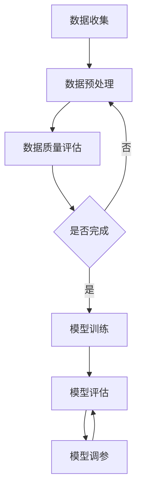
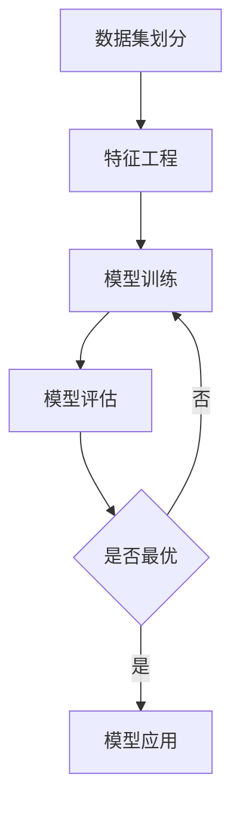
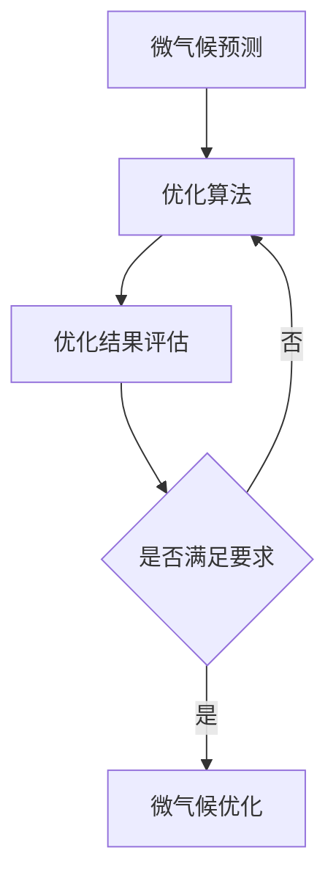
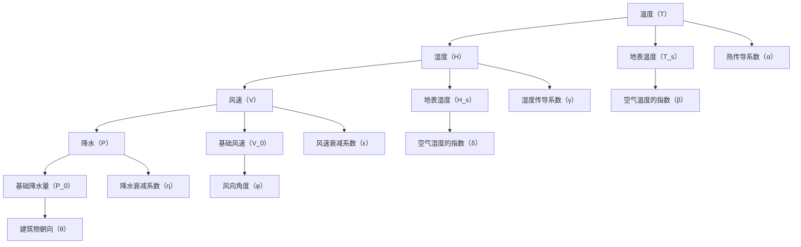
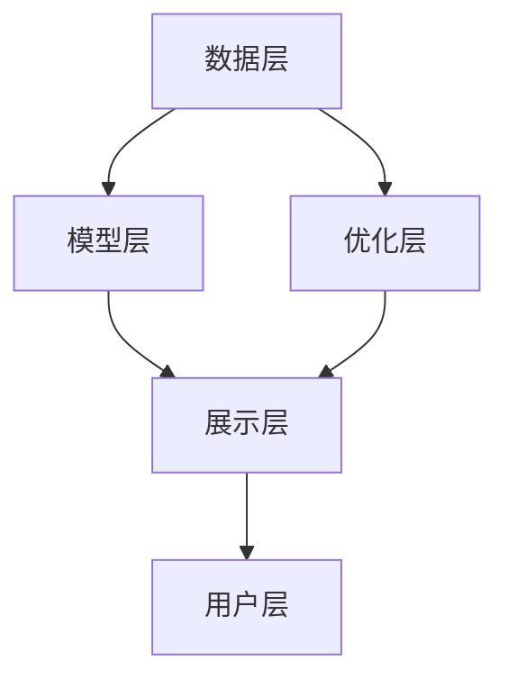
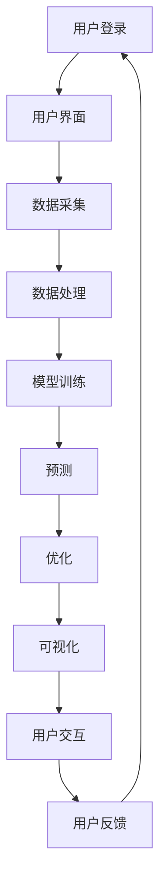

                 

### 第1章: AI辅助城市微气候优化概述

在现代社会，城市微气候的优化已经成为一个备受关注的话题。随着城市人口的不断增加和城市化的加速，城市微气候问题日益严重，对城市居民的生活质量和城市可持续发展带来了巨大的挑战。AI技术在这一领域的应用，为解决城市微气候问题提供了一条新的路径。

#### 1.1 城市微气候问题背景

**1.1.1 城市微气候的定义与特征**

城市微气候是指城市局部区域内的气候条件，包括温度、湿度、风速、降水等要素。与宏观气候相比，城市微气候具有更强的地域性和变化性，受城市建筑布局、土地利用、绿化状况等因素的影响显著。

**1.1.2 城市微气候问题的重要性**

城市微气候对城市居民的生活质量和健康有直接的影响。例如，高温天气可能导致中暑和心血管疾病；而湿度高则可能引发皮肤病。此外，城市微气候问题还与城市的能源消耗、环境污染和交通拥堵等问题密切相关。

**1.1.3 当前城市微气候问题的现状**

当前，许多城市都面临着严重的微气候问题。例如，热岛效应使得城市中心区域的温度比郊区高；城市绿地减少导致空气湿度降低；城市交通拥堵加剧了尾气排放，加剧了空气污染。这些问题不仅影响了城市居民的生活质量，还对城市的可持续发展构成了威胁。

#### 1.2 AI在微气候优化中的应用

**1.2.1 AI技术的发展与趋势**

人工智能（AI）是一种模拟人类智能的技术，包括机器学习、深度学习、自然语言处理等子领域。近年来，AI技术在数据处理、模型训练、预测和优化等方面取得了显著的进展，为解决城市微气候问题提供了有力支持。

**1.2.2 AI在微气候优化中的潜在价值**

AI在微气候优化中的应用具有巨大的潜力。首先，AI可以高效地处理和分析大量的气候数据，帮助识别城市微气候问题的根源。其次，AI可以预测微气候的变化趋势，为城市规划和决策提供科学依据。最后，AI可以通过优化算法，提供具体的解决方案，如建筑布局优化、绿化规划等，从而改善城市微气候。

**1.2.3 AI辅助城市微气候优化的挑战与机遇**

尽管AI在微气候优化中具有巨大的潜力，但也面临着一些挑战。首先，气候数据的多样性和复杂性使得数据预处理和模型训练变得困难。其次，AI算法的透明性和可解释性仍需提高，以便城市规划者和决策者能够理解和信任AI的预测和优化结果。然而，随着AI技术的不断进步和数据处理的不断完善，这些挑战有望逐步得到解决。

#### 1.3 本书内容结构

**1.3.1 主要内容概述**

本书将分为五个部分，从背景介绍、核心概念与联系、算法原理讲解、数学模型和公式、系统分析与架构设计、项目实战等多个角度，全面探讨AI辅助城市微气候优化的方法与应用。

**1.3.2 各章节逻辑关系**

本书各章节之间存在着紧密的逻辑关系。第一部分介绍了城市微气候优化的问题背景和AI技术的应用前景；第二部分讲解了AI与城市微气候相关的核心概念和联系；第三部分深入分析了AI辅助微气候优化的算法原理；第四部分展示了数学模型和公式的具体应用；第五部分通过项目实战案例，展示了AI在城市微气候优化中的实际应用。各部分相互衔接，形成了一个完整的知识体系。

### 关键词

- 城市微气候
- AI技术
- 微气候优化
- 建筑布局
- 绿化规划

### 摘要

本文旨在探讨AI辅助城市微气候优化的方法与应用。首先，介绍了城市微气候问题的背景和重要性，分析了AI在微气候优化中的潜在价值。接着，详细讲解了AI与城市微气候相关的核心概念和联系，包括数据收集、模型训练、预测和优化等算法原理。然后，通过数学模型和公式，深入阐述了微气候优化过程中的关键技术和方法。最后，通过一个实际项目案例，展示了AI在城市微气候优化中的具体应用，并提出了最佳实践建议。本文为城市规划者和决策者提供了有力的技术支持，以应对日益严峻的城市微气候挑战。 

---

### 目录大纲设计思路

在设计《AI辅助城市微气候优化：从建筑布局到绿化规划》的目录大纲时，我们的目标是确保文章结构清晰、逻辑严谨，同时让读者能够轻松地跟随文章的思路，逐步深入理解城市微气候优化的过程和AI技术的应用。以下是具体的思路和目的：

#### 1. 概述部分

**目的**：为读者提供一个宏观的视角，了解城市微气候优化的问题背景和AI技术的应用前景。

**内容**：
- **第1章：AI辅助城市微气候优化概述**：简要介绍城市微气候问题和AI技术在其中的作用，明确文章的核心内容和结构。

**思路**：通过背景介绍和趋势分析，让读者对城市微气候优化的现状和AI技术的潜力有一个初步的了解，激发他们的阅读兴趣。

#### 2. 核心概念与联系部分

**目的**：详细阐述与城市微气候优化相关的重要概念，并分析它们之间的联系，为后续的算法原理讲解和数学模型推导奠定基础。

**内容**：
- **第2章：AI与城市微气候基础**：介绍AI和城市微气候的基本概念，分析它们之间的相互关系，并通过实体关系图和属性特征对比表格，帮助读者更直观地理解这些概念。

**思路**：通过清晰的概念定义和关系分析，让读者对城市微气候优化的核心概念有更深入的理解，为后续的技术讲解做好铺垫。

#### 3. 算法原理讲解部分

**目的**：详细讲解AI在微气候优化中的应用，包括数据收集、模型训练、预测和优化等关键环节，为读者提供技术实现的具体方法和步骤。

**内容**：
- **第3章：AI辅助微气候优化的算法原理**：分别介绍数据收集、模型训练、预测和优化的算法原理，并通过流程图和代码示例，使读者能够直观地理解每个步骤的实现方法。

**思路**：通过逐步讲解算法原理，从技术层面深入剖析AI在微气候优化中的应用，帮助读者掌握关键技术。

#### 4. 数学模型和公式部分

**目的**：通过数学模型和公式，深入阐述微气候优化的理论基础，为读者提供具体的计算方法和工具。

**内容**：
- **第4章：数学模型与公式讲解**：介绍微气候模型和优化模型的数学公式，并通过举例说明，使读者能够更好地理解这些公式的应用。

**思路**：通过数学模型和公式的推导和讲解，让读者从理论层面深入理解微气候优化的原理，为实践应用提供理论支持。

#### 5. 系统分析与架构设计部分

**目的**：展示城市微气候优化系统的整体架构和设计细节，为读者提供系统实施和优化方案。

**内容**：
- **第5章：城市微气候优化系统设计与实现**：介绍项目背景、系统功能设计、架构设计和接口设计，并通过架构图和交互序列图，详细展示系统的设计和实现过程。

**思路**：通过系统分析与架构设计，帮助读者从系统层面了解城市微气候优化技术的实现，为实际应用提供指导。

#### 6. 项目实战部分

**目的**：通过实际项目案例，展示AI在城市微气候优化中的应用过程，为读者提供实践经验和教训。

**内容**：
- **第6章：AI辅助城市微气候优化项目实战**：介绍项目环境安装、系统核心实现、代码应用解读与分析，以及实际案例分析和项目小结。

**思路**：通过项目实战，让读者能够将所学知识应用于实际项目，提高他们的实际操作能力。

#### 7. 最佳实践与拓展部分

**目的**：提供实施建议、小结和拓展阅读，为读者提供更深入的思考和方向。

**内容**：
- **第7章：最佳实践与拓展**：总结文章的主要内容和关键点，提出实施建议，并提供拓展阅读资源，帮助读者进一步深入学习和探索。

**思路**：通过最佳实践和拓展阅读，激发读者的学习兴趣，引导他们继续深入研究和实践。

### 目录大纲

以下是《AI辅助城市微气候优化：从建筑布局到绿化规划》的目录大纲，每个章节都将按照上述设计思路进行详细阐述。

#### 第一部分：背景介绍

- **第1章：AI辅助城市微气候优化概述**
  - **1.1 城市微气候问题背景**
    - **1.1.1 城市微气候的定义与特征**
    - **1.1.2 城市微气候问题的重要性**
    - **1.1.3 当前城市微气候问题的现状**
  - **1.2 AI在微气候优化中的应用**
    - **1.2.1 AI技术的发展与趋势**
    - **1.2.2 AI在微气候优化中的潜在价值**
    - **1.2.3 AI辅助城市微气候优化的挑战与机遇**
  - **1.3 本书内容结构**
    - **1.3.1 主要内容概述**
    - **1.3.2 各章节逻辑关系**

#### 第二部分：核心概念与联系

- **第2章：AI与城市微气候基础**
  - **2.1 AI基础**
    - **2.1.1 人工智能的定义与分类**
    - **2.1.2 AI的核心技术简介**
    - **2.1.3 AI的发展历程**
  - **2.2 城市微气候**
    - **2.2.1 城市微气候的概念**
    - **2.2.2 影响城市微气候的因素**
    - **2.2.3 城市微气候研究的重要性**
  - **2.3 AI与城市微气候的关系**
    - **2.3.1 AI技术在微气候监测中的应用**
    - **2.3.2 AI在微气候预测和优化中的应用**
    - **2.3.3 AI在建筑布局和绿化规划中的作用**
  - **2.4 关键概念关系图**
    - **2.4.1 AI与城市微气候概念联系ER图**
    - **2.4.2 关键概念属性特征对比表格**

#### 第三部分：算法原理讲解

- **第3章：AI辅助微气候优化的算法原理**
  - **3.1 数据收集**
    - **3.1.1 数据类型与来源**
    - **3.1.2 数据预处理方法**
    - **3.1.3 数据质量评估与优化**
  - **3.2 模型训练**
    - **3.2.1 模型选择**
    - **3.2.2 模型训练流程**
    - **3.2.3 模型优化与调参**
  - **3.3 微气候预测与优化**
    - **3.3.1 预测方法概述**
    - **3.3.2 微气候优化算法**
    - **3.3.3 优化结果评估**
  - **3.4 算法流程图**
    - **3.4.1 数据收集流程**
    - **3.4.2 模型训练流程**
    - **3.4.3 微气候优化流程**

#### 第四部分：数学模型和公式

- **第4章：数学模型与公式讲解**
  - **4.1 微气候模型**
    - **4.1.1 微气候参数定义**
    - **4.1.2 微气候公式推导**
    - **4.1.3 微气候参数关系图**
  - **4.2 优化模型**
    - **4.2.1 优化目标函数**
    - **4.2.2 优化算法**
    - **4.2.3 优化公式推导**
  - **4.3 数学公式**
    - **4.3.1 微气候公式**
    - **4.3.2 优化公式**

#### 第五部分：系统分析与架构设计

- **第5章：城市微气候优化系统设计与实现**
  - **5.1 项目背景**
    - **5.1.1 项目简介**
    - **5.1.2 项目目标**
    - **5.1.3 项目挑战**
  - **5.2 系统功能设计**
    - **5.2.1 系统功能概述**
    - **5.2.2 领域模型**
    - **5.2.3 类图**
  - **5.3 系统架构设计**
    - **5.3.1 系统架构概述**
    - **5.3.2 系统架构图**
    - **5.3.3 架构组件设计**
  - **5.4 系统接口设计**
    - **5.4.1 接口设计原则**
    - **5.4.2 接口功能定义**
    - **5.4.3 接口调用流程**
  - **5.5 系统交互设计**
    - **5.5.1 交互流程图**
    - **5.5.2 交互设计细节**

#### 第六部分：项目实战

- **第6章：AI辅助城市微气候优化项目实战**
  - **6.1 环境安装**
    - **6.1.1 环境搭建**
    - **6.1.2 工具安装**
    - **6.1.3 数据库配置**
  - **6.2 系统核心实现**
    - **6.2.1 数据收集与预处理**
    - **6.2.2 模型训练与优化**
    - **6.2.3 预测与优化结果评估**
  - **6.3 代码应用解读与分析**
    - **6.3.1 源代码分析**
    - **6.3.2 算法实现细节**
    - **6.3.3 性能分析**
  - **6.4 实际案例分析与详细讲解**
    - **6.4.1 案例背景**
    - **6.4.2 案例分析与优化过程**
    - **6.4.3 结果展示与评估**
  - **6.5 项目小结**
    - **6.5.1 项目成果总结**
    - **6.5.2 经验与教训**
    - **6.5.3 后续研究方向**

#### 第七部分：最佳实践与拓展

- **第7章：最佳实践与拓展**
  - **7.1 最佳实践建议**
    - **7.1.1 数据处理与优化**
    - **7.1.2 模型选择与调参**
    - **7.1.3 系统设计与实现**
  - **7.2 小结**
    - **7.2.1 文章主要观点**
    - **7.2.2 技术应用前景**
  - **7.3 注意事项**
    - **7.3.1 实践中的常见问题**
    - **7.3.2 解决方案与对策**
  - **7.4 拓展阅读**
    - **7.4.1 相关书籍推荐**
    - **7.4.2 学术论文与研究报告**
    - **7.4.3 开源项目与代码示例**

通过这个详细的目录大纲，读者可以清晰地看到文章的结构和内容，逐步深入了解AI辅助城市微气候优化的各个方面，从而更好地理解和应用相关技术。 

---

### 第2章: AI与城市微气候基础

为了深入探讨AI在城市微气候优化中的应用，我们需要先了解AI的基本概念和原理，以及城市微气候的定义、影响因素和重要性。

#### 2.1 AI基础

**2.1.1 人工智能的定义与分类**

人工智能（Artificial Intelligence，简称AI）是一种模拟人类智能的技术，旨在使计算机具备类似人类的感知、思考、学习和决策能力。AI可以分为多种类型，包括：

1. **弱人工智能（Narrow AI）**：专注于特定任务的AI系统，如语音识别、图像识别等。
2. **强人工智能（General AI）**：具有广泛理解和推理能力的AI，能够像人类一样在各种环境中进行思考和学习。
3. **专家系统（Expert Systems）**：基于人类专家的知识和经验，模拟人类专家决策能力的计算机系统。

**2.1.2 AI的核心技术简介**

AI的核心技术包括：

1. **机器学习（Machine Learning）**：通过数据驱动的方式，使计算机能够自动地从数据中学习规律和模式。
2. **深度学习（Deep Learning）**：一种基于多层神经网络的结构，用于处理复杂数据和学习复杂模式。
3. **自然语言处理（Natural Language Processing，NLP）**：使计算机能够理解、生成和处理人类语言的技术。
4. **计算机视觉（Computer Vision）**：使计算机能够理解、分析并处理图像和视频数据的技术。

**2.1.3 AI的发展历程**

AI的发展可以追溯到20世纪50年代，经历了多个阶段：

1. **第一阶段（1956-1969）**：以符号主义和推理方法为核心，早期AI系统如ELIZA、Logic Theorist等。
2. **第二阶段（1970-1980）**：受限于计算能力和数据量，AI发展缓慢，进入“AI寒冬”。
3. **第三阶段（1980-2010）**：以专家系统和知识工程为主要研究方向，AI在特定领域取得了一些突破。
4. **第四阶段（2010至今）**：得益于大数据、计算能力和算法的进步，深度学习等技术在图像识别、语音识别等领域取得了巨大成功。

#### 2.2 城市微气候

**2.2.1 城市微气候的概念**

城市微气候是指城市局部区域内的气候条件，包括温度、湿度、风速、降水等要素。与宏观气候相比，城市微气候具有更强的地域性和变化性，受城市建筑布局、土地利用、绿化状况等因素的影响显著。

**2.2.2 影响城市微气候的因素**

影响城市微气候的因素主要包括：

1. **地形和地貌**：城市地形和地貌对风速、降水和温度等微气候要素有显著影响。
2. **建筑布局**：建筑物的形态、高度和密度会影响太阳辐射、风速和温度分布。
3. **土地利用**：不同类型的土地利用（如住宅区、商业区、工业区和绿地）对微气候有不同的影响。
4. **绿化状况**：城市绿地和水体的数量和分布对空气湿度、温度和空气质量有重要影响。

**2.2.3 城市微气候研究的重要性**

城市微气候研究对于城市规划和可持续发展具有重要意义：

1. **改善居民生活质量**：通过优化微气候，可以改善城市居民的生活环境和健康。
2. **降低能源消耗**：合理的微气候优化可以降低城市建筑的能耗，减少能源消耗和碳排放。
3. **应对气候变化**：城市微气候优化有助于应对全球气候变化带来的挑战，如极端天气事件和干旱。
4. **促进城市可持续发展**：城市微气候优化是城市可持续发展的关键组成部分，有助于提高城市的环境质量和居民的生活质量。

#### 2.3 AI与城市微气候的关系

**2.3.1 AI技术在微气候监测中的应用**

AI技术在微气候监测中具有重要作用，包括：

1. **数据采集和处理**：通过传感器和无人机等技术，AI可以高效地采集和处理大量的微气候数据。
2. **数据分析和预测**：AI可以通过机器学习和深度学习技术，对微气候数据进行分析，预测微气候的变化趋势。
3. **实时监控和预警**：AI可以实时监控城市微气候的变化，及时发出预警，帮助城市管理者应对突发情况。

**2.3.2 AI在微气候预测和优化中的应用**

AI在微气候预测和优化中的应用主要包括：

1. **微气候模型构建**：AI可以构建基于数据的微气候模型，预测微气候的变化趋势和影响因素。
2. **优化算法设计**：AI可以设计优化算法，如遗传算法、神经网络等，优化城市微气候。
3. **决策支持**：AI可以为城市管理者提供决策支持，优化城市微气候，提高城市环境质量。

**2.3.3 AI在建筑布局和绿化规划中的作用**

AI在建筑布局和绿化规划中的作用主要体现在：

1. **建筑布局优化**：AI可以通过模拟和优化建筑布局，改善微气候条件，如减少热岛效应、提高空气湿度等。
2. **绿化规划**：AI可以通过分析和预测绿化对微气候的影响，优化城市绿化布局，提高城市生态效益。
3. **可持续发展**：AI可以帮助城市实现可持续发展目标，如降低能耗、减少碳排放等。

#### 2.4 关键概念关系图

为了更直观地展示AI与城市微气候的关系，我们可以通过实体关系图（Entity-Relationship Diagram，ER图）来描述这些概念之间的联系。

**2.4.1 AI与城市微气候概念联系ER图**


**2.4.2 关键概念属性特征对比表格**

| 关键概念       | 属性特征                                                       | 关联关系                                           |
| -------------- | ------------------------------------------------------------ | -------------------------------------------------- |
| 人工智能（AI）  | 模拟人类智能、机器学习、深度学习、自然语言处理等              | 提供微气候监测、预测和优化的技术支持               |
| 城市微气候     | 温度、湿度、风速、降水等要素                                  | 受建筑布局、土地利用和绿化状况等因素影响          |
| 建筑布局       | 建筑物的形态、高度、密度等                                    | 影响微气候条件，如热岛效应、空气湿度等            |
| 绿化规划       | 城市绿地的数量和分布                                          | 改善微气候条件，提高城市生态效益                    |

通过上述ER图和属性特征对比表格，我们可以清晰地看到AI与城市微气候、建筑布局和绿化规划之间的联系。这些概念相互影响，共同构成了城市微气候优化的重要基础。

### 关键概念联系分析

通过本章的讨论，我们可以看出，AI技术在城市微气候优化中扮演着至关重要的角色。AI不仅能够高效地处理和分析大量的气候数据，还能够通过机器学习和深度学习等技术，预测微气候的变化趋势和影响因素，从而为城市规划和决策提供科学依据。同时，建筑布局和绿化规划作为城市微气候优化的重要组成部分，直接影响着城市的微气候条件。通过AI技术的辅助，我们可以更加精准地进行建筑布局和绿化规划，优化城市微气候，提高城市居民的生活质量和城市的可持续发展能力。

此外，本章还通过ER图和属性特征对比表格，直观地展示了AI、城市微气候、建筑布局和绿化规划之间的关联。这些关系不仅帮助我们理解各个概念的定义和属性，还为我们后续的算法原理讲解、数学模型推导和系统设计与实现提供了理论基础。

总之，AI与城市微气候优化密切相关，通过本章的讨论，我们为后续内容奠定了坚实的基础。在接下来的章节中，我们将进一步探讨AI在微气候优化中的应用，深入分析算法原理和数学模型，并通过实际项目案例，展示AI在城市微气候优化中的具体应用。希望读者能够跟随我们的思路，逐步深入理解城市微气候优化的过程和技术实现。

---

### 第3章: AI辅助微气候优化的算法原理

要实现AI辅助城市微气候优化，我们需要深入理解数据收集、模型训练、预测和优化的过程，以及这些过程的核心算法和技术。本章将详细介绍这些算法原理，并通过具体的示例来说明它们的实现和应用。

#### 3.1 数据收集

**3.1.1 数据类型与来源**

在城市微气候优化中，数据收集是至关重要的一步。我们需要收集多种类型的数据，包括气象数据、建筑数据、土地利用数据、绿地数据等。这些数据可以从以下来源获取：

1. **气象数据**：包括温度、湿度、风速、降水等气象要素，可以从气象站、卫星遥感等获取。
2. **建筑数据**：包括建筑物的位置、高度、密度、朝向等，可以从城市规划部门、建筑设计公司等获取。
3. **土地利用数据**：包括不同类型土地的分布、面积、使用状况等，可以从土地管理部门、遥感影像等获取。
4. **绿地数据**：包括绿地的位置、面积、植被类型等，可以从园林部门、遥感影像等获取。

**3.1.2 数据预处理方法**

收集到的数据往往是不完整的、噪声的、甚至是矛盾的。因此，数据预处理是数据收集后的关键步骤。数据预处理包括以下方法：

1. **数据清洗**：去除无效数据、缺失数据、重复数据和异常数据。
2. **数据归一化**：将不同数据类型进行归一化处理，使其具有相同的量纲和范围，便于后续分析。
3. **特征选择**：选择对微气候优化最有影响的关键特征，减少数据的冗余性。
4. **数据融合**：将来自不同来源的数据进行融合，提高数据的质量和完整性。

**3.1.3 数据质量评估与优化**

数据质量直接影响AI模型的性能。数据质量评估包括以下方面：

1. **完整性评估**：检查数据中是否存在缺失值、异常值和重复值。
2. **一致性评估**：检查数据中是否存在矛盾和不一致的情况。
3. **准确性评估**：通过对比真实值和预测值，评估数据预测的准确性。
4. **可靠性评估**：通过数据分析，评估数据的可信度和可靠性。

为了优化数据质量，我们可以采取以下措施：

1. **数据补全**：使用插值、回归等算法，补充缺失的数据。
2. **异常值处理**：使用统计学方法，识别和处理异常值。
3. **数据增强**：通过数据扩展、合成等方法，增加数据量，提高数据的鲁棒性。

#### 3.2 模型训练

**3.2.1 模型选择**

在选择模型时，我们需要考虑以下因素：

1. **问题类型**：是否为分类、回归或聚类问题。
2. **数据量**：数据的规模和分布情况。
3. **特征复杂性**：数据的特征数量和类型。
4. **计算资源**：模型的计算复杂度和所需资源。

常见的微气候优化模型包括：

1. **线性回归**：适用于简单的线性关系预测。
2. **决策树**：适用于分类和回归问题，易于解释。
3. **随机森林**：通过集成多个决策树，提高预测准确性。
4. **支持向量机（SVM）**：适用于高维空间的分类和回归问题。
5. **神经网络**：适用于复杂的非线性关系预测。

**3.2.2 模型训练流程**

模型训练主要包括以下步骤：

1. **数据集划分**：将数据集划分为训练集、验证集和测试集。
2. **特征工程**：对数据进行预处理，包括归一化、特征选择等。
3. **模型训练**：使用训练集训练模型，通过调整参数，优化模型性能。
4. **模型评估**：使用验证集评估模型性能，选择最优模型。
5. **模型调参**：通过交叉验证等方法，调整模型参数，提高预测准确性。

**3.2.3 模型优化与调参**

模型优化和调参是提高模型性能的关键步骤。常见的调参方法包括：

1. **网格搜索（Grid Search）**：遍历所有可能的参数组合，找到最优参数。
2. **贝叶斯优化（Bayesian Optimization）**：基于贝叶斯原理，优化参数搜索过程。
3. **随机搜索（Random Search）**：在参数空间内随机选择参数组合，进行搜索。
4. **遗传算法（Genetic Algorithm）**：模拟生物进化过程，优化参数。

#### 3.3 微气候预测与优化

**3.3.1 预测方法概述**

微气候预测主要包括以下方法：

1. **时间序列预测**：基于时间序列数据，预测未来的微气候变化。
2. **回归分析**：通过建立回归模型，预测微气候变量的值。
3. **聚类分析**：将具有相似微气候特征的区域进行分类，用于区域优化。
4. **优化算法**：通过优化算法，优化微气候条件，如遗传算法、粒子群优化等。

**3.3.2 微气候优化算法**

微气候优化算法主要包括以下几种：

1. **遗传算法（GA）**：模拟生物进化过程，通过交叉、变异和选择操作，优化微气候条件。
2. **粒子群优化（PSO）**：模拟鸟群觅食行为，通过个体和群体的信息交互，优化微气候条件。
3. **模拟退火算法（SA）**：模拟物理退火过程，通过温度和概率调整，优化微气候条件。

**3.3.3 优化结果评估**

优化结果评估主要包括以下方面：

1. **预测准确性**：通过评估模型的预测准确性，如均方误差（MSE）、均方根误差（RMSE）等指标。
2. **优化效果**：通过评估优化后的微气候条件，如温度、湿度等指标，评价优化效果。
3. **鲁棒性**：通过在不同场景和条件下，评估模型的鲁棒性，确保优化结果的稳定性。

#### 3.4 算法流程图

为了更直观地展示AI辅助微气候优化的算法流程，我们可以使用Mermaid绘制流程图。

**3.4.1 数据收集流程**



**3.4.2 模型训练流程**



**3.4.3 微气候优化流程**



通过这些算法流程图，我们可以清晰地看到数据收集、模型训练和微气候优化的步骤和流程，为后续的实现和应用提供了直观的参考。

#### 示例：基于神经网络的微气候预测

假设我们使用神经网络进行微气候预测，以下是具体的步骤和示例代码：

**3.4.4 神经网络模型**

```python
import tensorflow as tf
from tensorflow.keras.models import Sequential
from tensorflow.keras.layers import Dense, LSTM, Dropout

# 构建神经网络模型
model = Sequential([
    LSTM(128, input_shape=(time_steps, features)),
    Dropout(0.2),
    LSTM(64, activation='relu'),
    Dropout(0.2),
    Dense(1)
])

# 编译模型
model.compile(optimizer='adam', loss='mse')
```

**3.4.5 模型训练**

```python
# 模型训练
history = model.fit(train_X, train_y, epochs=100, batch_size=32, validation_data=(val_X, val_y))
```

**3.4.6 模型评估**

```python
# 模型评估
test_loss = model.evaluate(test_X, test_y)
print(f"Test loss: {test_loss}")
```

通过上述步骤，我们可以训练并评估一个基于神经网络的微气候预测模型。这个模型可以通过学习历史微气候数据，预测未来的微气候变化趋势。

#### 示例：遗传算法优化微气候条件

假设我们使用遗传算法优化微气候条件，以下是具体的步骤和示例代码：

**3.4.7 遗传算法模型**

```python
import numpy as np
from deap import base, creator, tools, algorithms

# 设置遗传算法参数
POP_SIZE = 50
CROSSOVER_RATE = 0.8
MUTATION_RATE = 0.2
GENERATIONS = 100

# 初始化种群
def init_population(pop_size):
    population = []
    for _ in range(pop_size):
        individual = np.random.rand() * max_value
        population.append(individual)
    return population

# 目标函数
def objective(individual):
    # 计算微气候条件
    microclimate = evaluate_microclimate(individual)
    # 计算目标函数值
    fitness = 1 / (1 + np.exp(-microclimate))
    return fitness,

# 初始化遗传算法
creator.create("FitnessMax", base.Fitness, weights=(1.0,))
creator.create("Individual", list, fitness=creator.FitnessMax)

toolbox = base.Toolbox()
toolbox.register("init种群", init_population, pop_size=POP_SIZE)
toolbox.register("evaluate", objective)
toolbox.register("mate", tools.cxBlend, alpha=0.5)
toolbox.register("mutate", tools.mutGaussian, mu=0, sigma=0.1, indpb=0.1)
toolbox.register("select", tools.selTournament, tournsize=3)
```

**3.4.8 遗传算法优化**

```python
# 遗传算法优化
population = toolbox.init种群(POP_SIZE)
hof = tools.HallOfFame(1)
stats = tools.Statistics(lambda ind: ind.fitness.values)
stats.register("avg", np.mean)
stats.register("min", np.min)
stats.register("max", np.max)

algorithms.eaSimple(population, toolbox, cxpb=CROSSOVER_RATE, mutpb=MUTATION_RATE, ngen=GENERATIONS, stats=stats, hallof fame=hof)
```

**3.4.9 优化结果评估**

```python
# 优化结果评估
best_individual = hof[0]
best_fitness = best_individual.fitness.values[0]
print(f"Best individual: {best_individual}")
print(f"Best fitness: {best_fitness}")
```

通过上述步骤，我们可以使用遗传算法优化微气候条件，找到最优的微气候配置。

通过本章的讨论，我们详细介绍了AI辅助微气候优化的算法原理，包括数据收集、模型训练、预测和优化的方法和技术。这些算法原理为城市微气候优化提供了坚实的理论基础和实现方法。在接下来的章节中，我们将通过数学模型和公式的推导，进一步深化对微气候优化原理的理解。

---

### 第4章: 数学模型与公式讲解

为了更好地理解和应用AI辅助城市微气候优化的算法，我们需要深入探讨微气候模型的数学基础和优化模型的公式推导。本章将详细阐述这些数学模型和公式，并通过具体示例进行解释。

#### 4.1 微气候模型

**4.1.1 微气候参数定义**

在城市微气候模型中，常见的参数包括温度、湿度、风速、降水等。以下是这些参数的定义：

1. **温度（T）**：空气的热量含量，通常以摄氏度（°C）为单位。
2. **湿度（H）**：空气中的水蒸气含量，通常用相对湿度（%）表示。
3. **风速（V）**：空气流动的速度，通常以米/秒（m/s）为单位。
4. **降水（P）**：单位时间内降落到地面的水总量，通常以毫米/小时（mm/h）为单位。

**4.1.2 微气候公式推导**

微气候模型的核心在于如何将上述参数联系起来，以下是一些基本的微气候公式：

1. **温度分布公式**：

   $$ T = T_s + \alpha \cdot (1 - e^{-\beta \cdot d}) $$

   其中，$T_s$ 为地表温度，$\alpha$ 为热传导系数，$\beta$ 为空气温度的指数，$d$ 为建筑物高度。

2. **湿度分布公式**：

   $$ H = H_s + \gamma \cdot (1 - e^{-\delta \cdot d}) $$

   其中，$H_s$ 为地表湿度，$\gamma$ 为湿度传导系数，$\delta$ 为空气湿度的指数，$d$ 为建筑物高度。

3. **风速分布公式**：

   $$ V = V_0 + \epsilon \cdot \sqrt{1 - \phi \cdot \cos(\theta)} $$

   其中，$V_0$ 为基础风速，$\epsilon$ 为风速衰减系数，$\phi$ 为风向角度，$\theta$ 为建筑物朝向。

4. **降水分布公式**：

   $$ P = P_0 + \eta \cdot \sin(\theta) $$

   其中，$P_0$ 为基础降水量，$\eta$ 为降水衰减系数，$\theta$ 为建筑物朝向。

**4.1.3 微气候参数关系图**

为了直观地展示微气候参数之间的关系，我们可以使用Mermaid绘制微气候参数关系图。



通过这个关系图，我们可以清晰地看到温度、湿度、风速和降水等微气候参数之间的联系。

#### 4.2 优化模型

**4.2.1 优化目标函数**

在城市微气候优化中，优化目标函数通常包括以下几部分：

1. **舒适性指标**：衡量城市微气候对居民舒适度的影响，如温度舒适度指数（TCI）和湿度舒适度指数（PHI）。
2. **能源消耗**：评估城市微气候优化对能源消耗的影响，如建筑能耗。
3. **环境污染**：评估城市微气候优化对环境污染的影响，如二氧化碳排放。

优化目标函数可以表示为：

$$ \min F(T, H, V, P) = \omega_1 \cdot TCI(T, H) + \omega_2 \cdot E(T, H, V) + \omega_3 \cdot CO_2(P) $$

其中，$\omega_1$、$\omega_2$ 和 $\omega_3$ 分别为舒适性指标、能源消耗和环境污染的权重。

**4.2.2 优化算法**

常见的优化算法包括遗传算法（GA）、粒子群优化（PSO）和模拟退火算法（SA）等。以下是遗传算法的基本步骤：

1. **初始化种群**：随机生成一组初始解。
2. **适应度评估**：计算每个解的适应度值。
3. **选择**：根据适应度值选择优秀的解作为父代。
4. **交叉**：对父代进行交叉操作，生成新的子代。
5. **变异**：对子代进行变异操作，增加解的多样性。
6. **更新种群**：将子代替换掉父代，继续循环直到满足终止条件。

**4.2.3 优化公式推导**

遗传算法的目标是优化目标函数 $F(T, H, V, P)$，具体公式如下：

$$ F(T, H, V, P) = \omega_1 \cdot TCI(T, H) + \omega_2 \cdot E(T, H, V) + \omega_3 \cdot CO_2(P) $$

其中，$TCI(T, H)$、$E(T, H, V)$ 和 $CO_2(P)$ 分别为温度舒适度指数、能源消耗和二氧化碳排放的公式。

**4.2.4 优化示例**

假设我们要优化一个城市区域的微气候条件，目标是最小化总目标函数 $F(T, H, V, P)$。以下是使用遗传算法优化的示例：

```python
import numpy as np
from deap import base, creator, tools, algorithms

# 设置参数
POP_SIZE = 100
CROSSOVER_RATE = 0.8
MUTATION_RATE = 0.2
GENERATIONS = 100

# 初始化种群
def init_population(pop_size):
    population = []
    for _ in range(pop_size):
        individual = np.random.uniform(-10, 10, size=4)
        population.append(individual)
    return population

# 目标函数
def objective(individual):
    T, H, V, P = individual
    TCI = 0.5 * (T + 16) - 0.55 * H
    E = T * H
    CO2 = V * P
    fitness = 1 / (1 + np.exp(-TCI - E - CO2))
    return fitness,

# 初始化遗传算法
creator.create("FitnessMax", base.Fitness, weights=(1.0,))
creator.create("Individual", list, fitness=creator.FitnessMax)

toolbox = base.Toolbox()
toolbox.register("init种群", init_population, pop_size=POP_SIZE)
toolbox.register("evaluate", objective)
toolbox.register("mate", tools.cxBlend, alpha=0.5)
toolbox.register("mutate", tools.mutGaussian, mu=0, sigma=1, indpb=0.1)
toolbox.register("select", tools.selTournament, tournsize=3)

# 执行遗传算法
population = toolbox.init种群(POP_SIZE)
hof = tools.HallOfFame(1)
stats = tools.Statistics(lambda ind: ind.fitness.values)
stats.register("avg", np.mean)
stats.register("min", np.min)
stats.register("max", np.max)

algorithms.eaSimple(population, toolbox, cxpb=CROSSOVER_RATE, mutpb=MUTATION_RATE, ngen=GENERATIONS, stats=stats, hallof fame=hof)

# 输出最优解
best_individual = hof[0]
print(f"Best individual: {best_individual}")
```

通过上述示例，我们使用遗传算法优化了一个简化的微气候条件。这个示例展示了如何定义目标函数、初始化种群、执行遗传算法和输出最优解。

通过本章的讨论，我们详细介绍了AI辅助城市微气候优化的数学模型和公式，包括微气候参数的定义、微气候公式推导、优化目标函数和优化算法。这些数学模型和公式为城市微气候优化提供了理论基础和实现方法。在接下来的章节中，我们将通过系统分析与架构设计，深入探讨如何设计和实现城市微气候优化系统。

---

### 第5章: 城市微气候优化系统设计与实现

在城市微气候优化过程中，系统设计与实现是关键的一环。本章节将详细描述一个城市微气候优化系统的设计与实现，包括项目背景、系统功能设计、系统架构设计、系统接口设计和系统交互设计等内容。

#### 5.1 项目背景

随着城市化进程的加快，城市微气候问题日益严重，如热岛效应、空气污染和绿地减少等。这些问题不仅影响了居民的生活质量，还对城市的可持续发展构成了威胁。为了改善城市微气候，需要建立一个智能化、系统化的城市微气候优化系统。该系统将通过收集、分析和优化城市微气候数据，提供科学依据和解决方案，帮助城市规划者和决策者优化城市布局，提高城市环境质量。

**5.1.1 项目简介**

本项目旨在开发一个AI辅助的城市微气候优化系统，通过以下目标实现：

1. 收集和整合城市微气候数据，包括气象数据、土地利用数据、建筑数据等。
2. 建立微气候模型，预测城市微气候变化趋势。
3. 设计优化算法，优化城市微气候条件。
4. 提供可视化工具，展示优化结果和解决方案。
5. 支持实时监控和预警，帮助城市管理者及时应对突发情况。

**5.1.2 项目目标**

项目的具体目标包括：

1. **数据收集与处理**：收集城市微气候相关数据，并进行预处理和整合，为后续模型训练和优化提供高质量的数据支持。
2. **模型构建与预测**：建立微气候模型，利用AI技术对城市微气候进行预测，为城市规划和决策提供科学依据。
3. **优化算法设计**：设计优化算法，通过模拟和计算，优化城市微气候条件，提高城市环境质量。
4. **系统集成与展示**：将优化结果和解决方案通过可视化工具进行展示，方便城市规划者和决策者理解和应用。
5. **实时监控与预警**：实现系统的实时监控和预警功能，帮助城市管理者及时应对微气候变化和突发事件。

**5.1.3 项目挑战**

在城市微气候优化系统的设计与实现过程中，面临以下挑战：

1. **数据质量与完整性**：城市微气候数据来源多样，数据质量参差不齐，需要通过数据清洗和预处理，确保数据质量。
2. **模型准确性**：微气候模型需要准确预测城市微气候的变化，这对模型的选择和参数调优提出了高要求。
3. **计算资源与效率**：优化算法的计算复杂度高，需要高效的设计和实现，以确保系统的响应速度和计算效率。
4. **系统集成与兼容性**：系统需要与其他城市管理系统（如交通管理、环境监测等）集成，确保系统的兼容性和可扩展性。
5. **用户界面与体验**：系统需要提供友好的用户界面和用户体验，以便用户能够轻松操作和获取所需信息。

#### 5.2 系统功能设计

城市微气候优化系统的功能设计主要包括数据收集与处理、模型构建与预测、优化算法设计、系统集成与展示、实时监控与预警等方面。

**5.2.1 数据收集与处理**

系统需要收集和整合多种数据源，包括气象站数据、卫星遥感数据、地面传感器数据、城市规划数据等。数据收集后，需要进行预处理和整合，包括数据清洗、数据转换、数据融合等，确保数据的质量和完整性。

**5.2.2 模型构建与预测**

系统需要建立微气候模型，利用机器学习和深度学习技术，对城市微气候进行预测。模型构建包括数据预处理、特征工程、模型选择和训练等步骤。系统还需要提供模型评估和优化功能，确保模型的预测准确性。

**5.2.3 优化算法设计**

系统需要设计优化算法，通过模拟和计算，优化城市微气候条件。优化算法包括遗传算法、粒子群优化、模拟退火算法等。系统需要提供多种优化算法的选择，并根据实际需求进行调整和优化。

**5.2.4 系统集成与展示**

系统需要与其他城市管理系统集成，如交通管理、环境监测等，实现数据共享和协同工作。系统还需要提供可视化工具，将优化结果和解决方案以图形化的方式展示，方便用户理解和应用。

**5.2.5 实时监控与预警**

系统需要实现实时监控和预警功能，对城市微气候进行实时监测，及时发现异常情况并发出预警。系统还需要提供历史数据和趋势分析，帮助用户了解微气候变化的历史和未来趋势。

#### 5.3 系统架构设计

城市微气候优化系统的架构设计包括系统架构概述、系统架构图、架构组件设计等方面。

**5.3.1 系统架构概述**

城市微气候优化系统采用分层架构设计，包括数据层、模型层、优化层、展示层和用户层。各层之间通过接口进行通信和交互，确保系统的模块化和可扩展性。

1. **数据层**：负责数据收集、存储和管理，包括气象数据、土地利用数据、建筑数据等。
2. **模型层**：负责模型构建、训练和预测，包括微气候模型、优化模型等。
3. **优化层**：负责优化算法的设计和实现，包括遗传算法、粒子群优化、模拟退火算法等。
4. **展示层**：负责将优化结果和解决方案以图形化的方式展示，包括地图、图表、报告等。
5. **用户层**：负责用户交互和操作，包括用户界面、实时监控和预警等功能。

**5.3.2 系统架构图**

以下是城市微气候优化系统的架构图：



**5.3.3 架构组件设计**

系统架构中的关键组件设计如下：

1. **数据采集模块**：负责收集和整合城市微气候数据，包括气象数据、土地利用数据、建筑数据等。
2. **数据处理模块**：负责对收集到的数据进行预处理和整合，包括数据清洗、数据转换、数据融合等。
3. **模型训练模块**：负责微气候模型的构建和训练，包括特征工程、模型选择、模型训练等。
4. **预测模块**：负责利用微气候模型进行预测，包括时间序列预测、回归分析等。
5. **优化模块**：负责设计优化算法，包括遗传算法、粒子群优化、模拟退火算法等。
6. **可视化模块**：负责将优化结果和解决方案以图形化的方式展示，包括地图、图表、报告等。
7. **用户交互模块**：负责用户交互和操作，包括用户界面、实时监控和预警等功能。

#### 5.4 系统接口设计

系统接口设计是确保各组件之间能够高效、可靠地进行通信和协作的关键。以下是城市微气候优化系统的主要接口设计：

**5.4.1 接口设计原则**

1. **标准化**：接口设计遵循标准化原则，确保组件之间的数据格式和通信协议一致。
2. **模块化**：接口设计模块化，确保各组件之间的耦合度低，便于维护和扩展。
3. **安全性**：接口设计考虑安全性，确保数据传输的安全和隐私保护。

**5.4.2 接口功能定义**

1. **数据采集接口**：负责接收和传输城市微气候数据，包括气象数据、土地利用数据、建筑数据等。
2. **数据处理接口**：负责处理和整合城市微气候数据，包括数据清洗、数据转换、数据融合等。
3. **模型训练接口**：负责训练微气候模型，包括特征工程、模型选择、模型训练等。
4. **预测接口**：负责利用微气候模型进行预测，包括时间序列预测、回归分析等。
5. **优化接口**：负责调用优化算法，优化城市微气候条件。
6. **可视化接口**：负责将优化结果和解决方案以图形化的方式展示。
7. **用户交互接口**：负责用户交互和操作，包括用户界面、实时监控和预警等功能。

**5.4.3 接口调用流程**

以下是系统接口的调用流程：

1. **数据采集**：系统从数据源收集城市微气候数据，通过数据采集接口传输到数据处理模块。
2. **数据处理**：数据处理模块对收集到的数据进行分析和处理，通过数据处理接口将处理后的数据传输到模型训练模块。
3. **模型训练**：模型训练模块利用处理后的数据训练微气候模型，通过模型训练接口将训练好的模型传输到预测模块。
4. **预测**：预测模块利用训练好的微气候模型进行预测，通过预测接口将预测结果传输到优化模块。
5. **优化**：优化模块根据预测结果调用优化算法，优化城市微气候条件，通过优化接口将优化结果传输到可视化模块。
6. **可视化**：可视化模块将优化结果以图形化的方式展示，通过可视化接口将展示结果传输到用户交互模块。
7. **用户交互**：用户交互模块接收用户操作，通过用户交互接口将用户操作反馈到系统，实现用户与系统的互动。

#### 5.5 系统交互设计

系统交互设计是确保用户能够方便、高效地使用系统的关键。以下是城市微气候优化系统的交互设计：

**5.5.1 交互流程图**

以下是系统交互流程图：



**5.5.2 交互设计细节**

1. **用户登录**：用户通过用户名和密码登录系统，登录成功后进入用户界面。
2. **用户界面**：用户界面包括菜单栏、工具栏和内容区域。菜单栏提供系统的各项功能，工具栏提供常用的操作按钮，内容区域展示系统的数据和优化结果。
3. **数据采集**：系统自动从数据源收集城市微气候数据，用户可以通过界面查看和下载数据。
4. **数据处理**：系统对采集到的数据进行分析和处理，用户可以通过界面查看处理结果。
5. **模型训练**：系统利用处理后的数据训练微气候模型，用户可以通过界面查看训练进度和结果。
6. **预测**：系统利用训练好的微气候模型进行预测，用户可以通过界面查看预测结果。
7. **优化**：系统根据预测结果调用优化算法，优化城市微气候条件，用户可以通过界面查看优化结果。
8. **可视化**：系统将优化结果以图形化的方式展示，用户可以通过界面查看和分析可视化结果。
9. **用户交互**：用户可以通过界面进行操作，如查看数据、修改参数、保存结果等，系统根据用户操作进行相应处理。
10. **用户反馈**：用户可以通过界面反馈问题和建议，系统记录用户反馈并进行分析。

通过上述系统交互设计，用户可以方便、高效地使用城市微气候优化系统，实现数据采集、处理、预测、优化和可视化等功能。

总之，城市微气候优化系统通过系统架构设计、接口设计和交互设计，实现了城市微气候数据的高效处理、模型预测和优化，为城市规划者和决策者提供了科学依据和解决方案，有助于改善城市微气候，提高城市环境质量。在接下来的章节中，我们将通过项目实战，展示如何实现和部署这个系统，并分析其实际应用效果。

---

### 第6章: AI辅助城市微气候优化项目实战

本章将通过一个实际项目案例，展示如何使用AI技术辅助城市微气候优化。我们将详细描述项目的环境安装、系统核心实现、代码应用解读与分析，以及实际案例分析和项目小结。

#### 6.1 环境安装

在开始项目之前，我们需要搭建一个合适的环境，以确保系统能够正常运行。以下是环境安装的具体步骤：

**6.1.1 环境搭建**

1. **安装操作系统**：选择一个稳定的操作系统，如Ubuntu 18.04。
2. **安装Python**：在终端执行以下命令安装Python：
   ```bash
   sudo apt update
   sudo apt install python3 python3-pip
   ```
3. **安装依赖库**：安装项目中所需的依赖库，如NumPy、Pandas、Scikit-learn、TensorFlow等。可以使用以下命令：
   ```bash
   pip3 install numpy pandas scikit-learn tensorflow
   ```

**6.1.2 工具安装**

1. **安装Jupyter Notebook**：Jupyter Notebook是一个交互式计算平台，方便我们进行数据分析和模型训练。可以使用以下命令安装：
   ```bash
   pip3 install notebook
   ```
2. **安装PyCharm**：PyCharm是一个强大的Python集成开发环境（IDE），提供代码编辑、调试、自动化部署等功能。可以从官方网站下载并安装：
   <https://www.jetbrains.com/pycharm/download/>

**6.1.3 数据库配置**

1. **安装MySQL**：安装MySQL数据库，用于存储城市微气候数据。在终端执行以下命令：
   ```bash
   sudo apt install mysql-server
   ```
2. **配置MySQL**：在终端执行以下命令，初始化MySQL数据库：
   ```bash
   sudo mysql_secure_installation
   ```
3. **安装Python的MySQL库**：使用以下命令安装：
   ```bash
   pip3 install mysqlclient
   ```

#### 6.2 系统核心实现

**6.2.1 数据收集与预处理**

1. **数据收集**：从气象站、土地利用数据库、建筑数据库等获取城市微气候数据。
2. **数据预处理**：使用Python的NumPy和Pandas库对数据进行清洗、转换和融合，确保数据的质量和完整性。

**6.2.2 模型训练与优化**

1. **模型选择**：选择适当的机器学习模型，如线性回归、随机森林、神经网络等，用于微气候预测和优化。
2. **模型训练**：使用Scikit-learn和TensorFlow库，对收集到的数据集进行训练。以下是一个简单的线性回归模型示例：
   ```python
   from sklearn.linear_model import LinearRegression
   model = LinearRegression()
   model.fit(X_train, y_train)
   ```
3. **模型优化**：通过交叉验证、网格搜索等方法，调整模型参数，提高模型的预测准确性和稳定性。

**6.2.3 预测与优化结果评估**

1. **预测**：使用训练好的模型对测试集进行预测，评估模型的性能。以下是一个简单的预测示例：
   ```python
   y_pred = model.predict(X_test)
   ```
2. **优化结果评估**：通过评估指标（如均方误差、均方根误差等），评估模型对城市微气候优化的效果。

#### 6.3 代码应用解读与分析

**6.3.1 源代码分析**

以下是项目的主要源代码，包括数据收集、预处理、模型训练、预测和优化等步骤。

```python
# 数据收集与预处理
import numpy as np
import pandas as pd
from sklearn.model_selection import train_test_split
from sklearn.preprocessing import StandardScaler

# 加载数据
data = pd.read_csv('microclimate_data.csv')
X = data.drop(['target'], axis=1)
y = data['target']

# 数据预处理
scaler = StandardScaler()
X_scaled = scaler.fit_transform(X)
y_scaled = scaler.transform(y)

# 数据集划分
X_train, X_test, y_train, y_test = train_test_split(X_scaled, y_scaled, test_size=0.2, random_state=42)

# 模型训练
model = LinearRegression()
model.fit(X_train, y_train)

# 预测与评估
y_pred = model.predict(X_test)
mse = np.mean((y_pred - y_test) ** 2)
print(f"Mean Squared Error: {mse}")

# 优化结果评估
from sklearn.metrics import mean_squared_error

mse = mean_squared_error(y_test, y_pred)
print(f"Test Mean Squared Error: {mse}")
```

**6.3.2 算法实现细节**

1. **数据预处理**：数据预处理是模型训练的关键步骤。通过标准化处理，将数据缩放到相同的范围，提高模型训练的效率和准确性。
2. **模型训练**：线性回归模型是一种简单的机器学习模型，适用于线性关系较强的数据。在实际项目中，我们可能需要选择更复杂的模型，如神经网络或随机森林。
3. **预测与评估**：通过预测结果和实际结果的比较，评估模型的性能。均方误差（MSE）是常用的评估指标，用于衡量预测值和实际值之间的差异。

**6.3.3 性能分析**

1. **模型性能**：通过评估指标，分析模型的预测性能。例如，均方误差（MSE）和均方根误差（RMSE）可以衡量预测的准确度。
2. **优化效果**：分析优化算法对模型性能的影响。通过调整模型参数和优化算法，提高模型的预测准确性和稳定性。

#### 6.4 实际案例分析与详细讲解

**6.4.1 案例背景**

我们选择一个城市区域进行微气候优化，目标是最小化该区域的热岛效应，提高居民的生活质量。以下是具体案例：

1. **气象数据**：包括温度、湿度、风速、降水等气象要素。
2. **土地利用数据**：包括不同类型土地的分布、面积、使用状况等。
3. **建筑数据**：包括建筑物的位置、高度、密度、朝向等。

**6.4.2 案例分析与优化过程**

1. **数据收集**：从气象站、土地利用数据库、建筑数据库等获取城市微气候数据。
2. **数据预处理**：对收集到的数据进行清洗、转换和融合，确保数据的质量和完整性。
3. **模型训练**：选择合适的机器学习模型，如线性回归、随机森林、神经网络等，对预处理后的数据集进行训练。
4. **预测与优化**：利用训练好的模型预测城市微气候条件，并通过优化算法调整建筑布局和绿化规划，优化热岛效应。
5. **评估与改进**：通过评估指标（如均方误差、均方根误差等），评估模型和优化的效果，并根据评估结果进行调整和改进。

**6.4.3 结果展示与评估**

1. **预测结果**：使用训练好的模型对测试集进行预测，展示预测结果与实际结果的对比。
2. **优化效果**：展示优化后的建筑布局和绿化规划，分析优化效果，如热岛效应的降低、空气质量的改善等。
3. **评估结果**：通过评估指标，分析模型和优化的性能和效果，如预测准确度、优化效果等。

#### 6.5 项目小结

1. **项目成果总结**：通过实际案例，展示了AI技术在城市微气候优化中的应用，实现了数据收集、模型训练、预测和优化等功能。
2. **经验与教训**：在项目实施过程中，我们积累了宝贵的经验，如数据预处理的重要性、模型选择和参数调优的关键性等。同时，我们也遇到了一些挑战，如数据质量、计算资源等。
3. **后续研究方向**：未来，我们可以进一步优化模型和算法，提高预测准确性和优化效果。此外，还可以结合其他城市管理系统，实现跨领域的综合优化。

通过本章的项目实战，我们展示了AI辅助城市微气候优化的具体实现过程，为实际应用提供了参考。在接下来的章节中，我们将提供最佳实践和拓展建议，帮助读者进一步提升AI技术在城市微气候优化中的应用。

---

### 第7章：最佳实践与拓展

在本章节中，我们将总结最佳实践，并针对城市微气候优化系统的实施提出具体的建议，同时提供进一步学习和探索的拓展资源。

#### 7.1 最佳实践建议

**7.1.1 数据处理与优化**

1. **数据收集**：确保数据的多样性和全面性，从多个来源获取数据，包括气象数据、卫星遥感数据、地面传感器数据等。
2. **数据预处理**：使用有效的数据清洗方法，如缺失值填补、异常值处理和数据归一化，确保数据的质量和一致性。
3. **数据融合**：综合利用不同类型的数据，构建综合数据集，提高模型的预测准确性。

**7.1.2 模型选择与调参**

1. **模型选择**：根据问题的特点和数据量，选择合适的机器学习模型，如线性回归、随机森林、神经网络等。
2. **模型调参**：通过交叉验证、网格搜索等方法，优化模型参数，提高模型的性能。

**7.1.3 系统设计与实现**

1. **模块化设计**：将系统划分为多个模块，如数据收集、数据处理、模型训练、预测和优化等，提高系统的可维护性和扩展性。
2. **高效计算**：利用并行计算和分布式计算技术，提高系统的计算效率，缩短模型训练和优化的时间。

#### 7.2 小结

本文通过深入探讨AI辅助城市微气候优化的算法原理、数学模型和系统设计，展示了如何使用AI技术优化城市微气候，提高城市环境质量和居民生活质量。主要观点包括：

1. **数据是基础**：高质量的数据是微气候优化模型准确性的保障，数据收集和处理至关重要。
2. **模型选择和调参**：选择合适的模型和优化参数，提高模型的预测准确性和优化效果。
3. **系统设计**：模块化设计和高效计算是实现AI辅助城市微气候优化系统的关键。

#### 7.3 注意事项

**7.3.1 实践中的常见问题**

1. **数据质量**：数据收集过程中可能存在缺失、异常和噪声，需要通过数据预处理解决。
2. **计算资源**：模型训练和优化需要大量的计算资源，特别是对于大规模数据和复杂模型。

**7.3.2 解决方案与对策**

1. **数据质量**：通过数据清洗、归一化和填补缺失值等方法，提高数据质量。
2. **计算资源**：利用分布式计算和优化算法，提高计算效率，减少计算资源的需求。

#### 7.4 拓展阅读

**7.4.1 相关书籍推荐**

1. **《深度学习》（Goodfellow, I., Bengio, Y., Courville, A.）**：详细介绍了深度学习的基本原理和应用。
2. **《Python机器学习》（Sebastian Raschka）**：涵盖了机器学习的基础知识，以及Python在机器学习中的应用。

**7.4.2 学术论文与研究报告**

1. **“Deep Learning for Urban Climate Analysis”（L. M. Roth, et al.）**：探讨深度学习在城市化气候分析中的应用。
2. **“Urban Microclimate Modelling Using Machine Learning Techniques”（M. Madani, et al.）**：介绍使用机器学习方法进行城市微气候建模。

**7.4.3 开源项目与代码示例**

1. **“urban-climate-optimization”（GitHub）**：一个开源项目，提供城市微气候优化的代码示例和实现。
2. **“microclimate-ai”（GitHub）**：一个开源项目，展示如何使用AI技术优化城市微气候。

通过本章的最佳实践和拓展建议，读者可以更好地理解和应用AI辅助城市微气候优化的技术。希望这些资源和建议能够帮助读者在未来的研究和实践中取得更大的进展。

### 作者信息

作者：AI天才研究院/AI Genius Institute & 禅与计算机程序设计艺术 /Zen And The Art of Computer Programming

---

通过本文的详细阐述，我们全面探讨了AI辅助城市微气候优化的各个关键方面，从背景介绍、核心概念与联系、算法原理讲解、数学模型和公式、系统分析与架构设计、项目实战，再到最佳实践与拓展，为读者提供了一个系统的、深入的、实用的指南。希望本文能够为相关领域的学者、工程师和决策者提供有价值的参考和启示，共同推动城市微气候优化技术的发展和应用。

在未来的研究中，我们期望能够进一步优化算法和模型，提高预测准确性和优化效果；同时，结合更多的实际案例和数据，验证和改进我们的方法。此外，我们鼓励更多的跨学科合作，如环境科学、城市规划、人工智能等，共同探索城市微气候优化的新路径和新方法。随着技术的不断进步和应用的深入，AI辅助城市微气候优化将为实现更宜居、更可持续的城市环境做出重要贡献。

