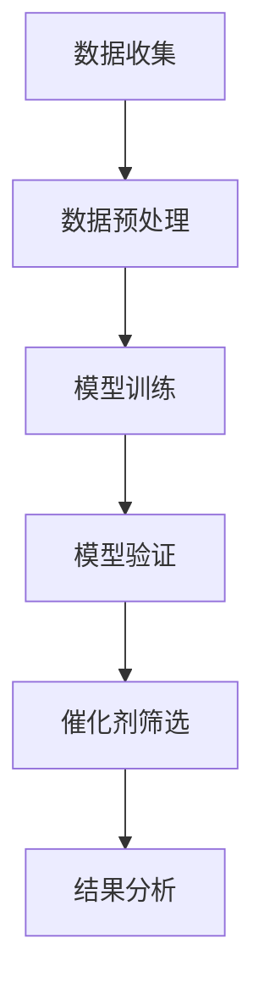
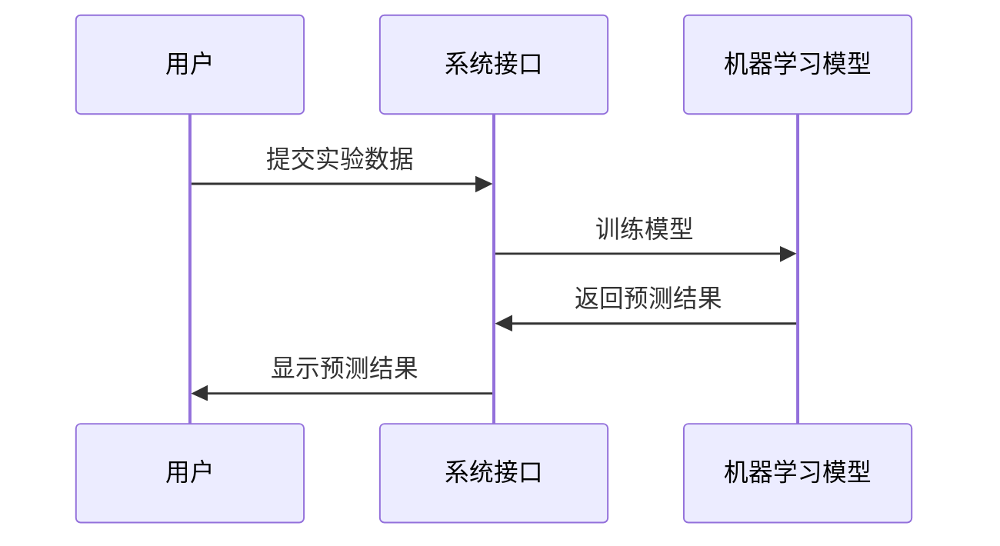
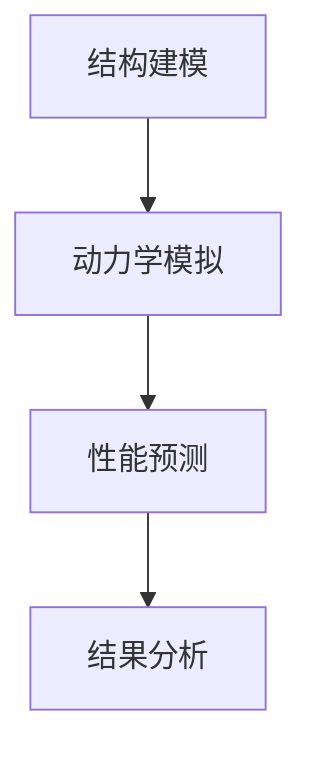
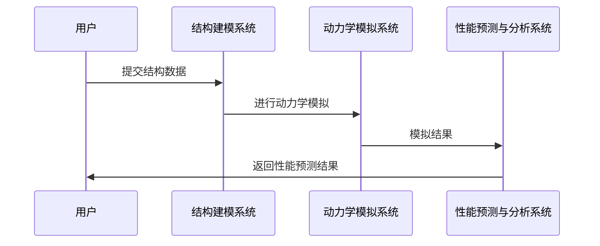
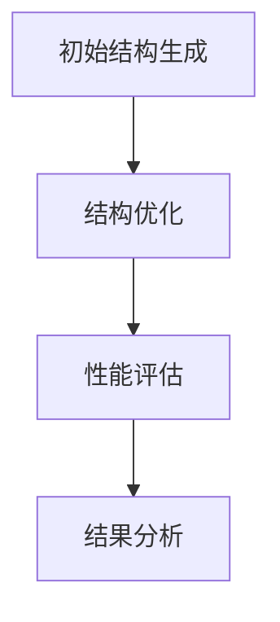
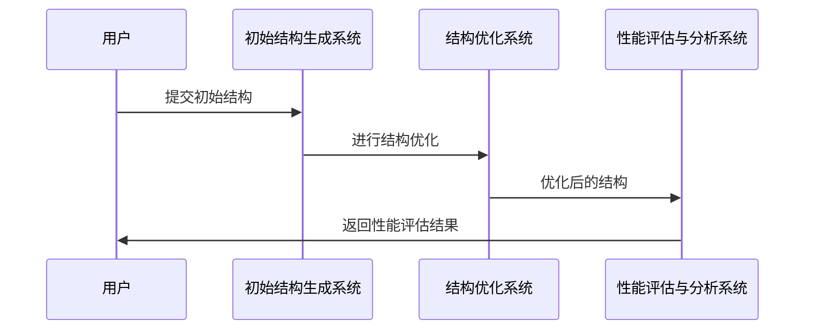

                 

# AI辅助新型催化剂开发：从分子模拟到性能优化

## 关键词：人工智能、催化剂开发、分子模拟、性能优化、算法

## 摘要：
本文旨在探讨人工智能（AI）在新型催化剂开发中的应用，从分子模拟到性能优化，通过详细的案例分析和技术讲解，展示AI技术如何改变催化剂开发的传统模式。文章首先介绍催化剂在化学工业中的重要性以及传统催化剂开发的局限性，接着讨论AI技术在催化剂开发中的潜在优势，然后详细分析AI辅助催化剂开发的挑战与解决方案。最后，文章将比较AI技术与传统催化剂开发的差异，并总结AI在催化剂开发中的前景。

## 1. 背景介绍

### 第1章 引言：催化剂开发中的AI革命

### 1.1 问题的背景

#### 1.1.1 催化剂在化学工业中的重要性

催化剂是一种能够提高化学反应速率而自身不被消耗的物质，它在化学工业中扮演着至关重要的角色。催化剂能够降低反应活化能，从而加速反应进程，提高产率，减少副产物，降低能耗。在催化裂化、氢化、氧化等工业过程中，催化剂的使用不仅能够提高生产效率，还能够减少对环境的污染，因此，催化剂的开发和优化一直是化学工业中的重要课题。

#### 1.1.2 传统催化剂开发的局限性

传统催化剂开发依赖于实验，通过大量的实验来筛选和优化催化剂。这种方法耗时长、成本高，且效率较低。首先，催化剂的筛选过程需要大量的样品进行测试，这不仅需要大量的时间和人力资源，还需要大量的实验设备。其次，催化剂的优化过程依赖于实验人员的经验和直觉，难以实现系统的优化。此外，传统方法在发现新催化剂方面存在很大的局限性，难以从海量的材料中筛选出具有高催化性能的材料。

#### 1.1.3 AI在催化剂开发中的潜在优势

随着人工智能技术的发展，AI开始被广泛应用于各个领域，包括催化剂开发。AI技术具有自动化、高效性和智能优化的优势，可以极大地改变传统催化剂开发的模式。

1. **自动化与高效性**：AI技术可以通过分析大量的实验数据，自动筛选出高潜力催化剂，大大缩短开发周期，降低开发成本。
2. **降低成本**：通过减少实验次数和缩短开发周期，AI技术可以显著降低催化剂开发的总体成本。
3. **智能优化**：AI算法可以通过模拟和优化催化剂的结构，提高催化性能，从而实现催化剂的智能优化。

### 1.2 问题描述

#### 1.2.1 催化剂性能优化的挑战

催化剂性能的优化是一个复杂的过程，面临着以下几个挑战：

1. **反应条件多样性**：不同的化学反应需要不同的催化剂和反应条件，这使得催化剂的优化过程变得复杂。
2. **催化机理复杂**：催化剂的性能受到多种因素的影响，包括表面结构、活性位密度、载体材料等，这使得催化机理的分析和优化变得复杂。
3. **材料多样性**：催化剂材料种类繁多，从金属、金属氧化物到复合材料，每一种材料都有其独特的结构和性能特点，这使得材料的筛选和优化过程变得复杂。

#### 1.2.2 AI辅助催化剂开发的现状

目前，AI技术在催化剂开发中已经有了广泛的应用，主要包括以下几种方法：

1. **数据驱动方法**：利用机器学习算法分析实验数据，预测催化性能。这种方法通过建立机器学习模型，可以从大量实验数据中提取出有用的信息，从而预测新的催化剂材料。
2. **分子模拟**：通过分子动力学模拟预测催化剂的结构与性能。分子模拟可以提供催化剂的微观结构信息，有助于理解催化机理和优化催化剂结构。
3. **优化算法**：使用遗传算法、模拟退火等优化算法优化催化剂结构，提高催化性能。

### 1.3 问题解决

#### 1.3.1 AI技术在催化剂开发中的应用

AI技术在催化剂开发中的应用主要集中在以下几个方面：

1. **材料筛选**：利用机器学习算法快速筛选高潜力催化剂材料。这种方法可以通过分析已有的催化剂数据，预测新的催化剂材料。
2. **结构优化**：通过分子模拟优化催化剂的结构，提高催化性能。分子模拟可以帮助研究者理解催化剂的结构与性能之间的关系，从而进行结构优化。
3. **性能预测**：利用深度学习模型预测催化剂的催化性能。深度学习模型可以从大量的实验数据中学习到催化性能的规律，从而预测新的催化剂材料的性能。

#### 1.3.2 边界与外延

AI技术在催化剂开发中的应用不仅限于化学反应催化剂，还可以扩展到生物催化、光催化等领域。例如，在生物催化中，AI可以用于预测酶的结构与活性，从而优化酶的催化性能；在光催化中，AI可以用于预测光催化剂的吸收性能和催化效率。

然而，AI技术在催化剂开发中也面临着一些挑战，包括数据获取与处理、模型解释性等。此外，AI技术需要与实验技术相结合，才能真正发挥其潜力。

#### 1.4 核心概念与联系

AI技术在催化剂开发中的核心概念包括机器学习、分子模拟和优化算法。

- **机器学习**：利用数据训练模型，预测催化性能。机器学习模型可以从大量的实验数据中学习到催化性能的规律，从而预测新的催化剂材料的性能。
- **分子模拟**：模拟催化剂的微观结构，分析催化机理。分子模拟可以帮助研究者理解催化剂的结构与性能之间的关系，从而进行结构优化。
- **优化算法**：优化催化剂结构，提高催化性能。优化算法可以搜索催化剂结构的全局最优解，从而提高催化性能。

下表是对这三种核心概念的属性特征对比：

| 概念        | 属性特征                                             | 举例说明                      |
| ----------- | ---------------------------------------------------- | ----------------------------- |
| 机器学习    | 数据驱动，自动学习规律                             | 预测催化剂性能                |
| 分子模拟    | 计算模拟，微观结构分析                           | 模拟催化剂表面结构            |
| 优化算法    | 搜索最优解，提高性能                               | 优化催化剂分子结构            |

下图为AI技术与传统催化剂开发的比较：

| 特点             | 机器学习与分子模拟 | 传统催化剂开发 |
| ---------------- | ------------------ | -------------- |
| 数据依赖性       | 强                | 弱             |
| 自动化程度       | 高                | 低             |
| 优化效率         | 高                | 低             |
| 成本             | 低（长期）        | 高（短期）     |

### 1.5 本章小结

本章介绍了AI在催化剂开发中的应用背景、挑战与解决方案。AI技术通过数据驱动、分子模拟和优化算法，为催化剂开发提供了新的思路和方法。未来，AI技术与催化剂开发的深度融合有望带来化学工业的变革。

---

## 2. AI辅助催化剂开发的挑战与解决方案

### 第2章 深入分析：AI辅助催化剂开发的实际应用与潜在挑战

#### 2.1 催化剂性能优化的复杂性和多样性

催化剂的性能优化涉及到多种因素的交互作用，包括反应条件、催化剂结构、载体材料等。不同催化剂在不同反应条件下的性能表现可能截然不同，这就要求AI技术在处理数据时能够充分考虑这些多样性。

##### 2.1.1 反应条件的多样性

在工业催化过程中，反应条件（如温度、压力、反应物浓度等）的变化对催化剂性能有着显著影响。例如，在一定温度下，催化剂可能表现出良好的催化活性，而在另一温度下则可能完全失去活性。AI技术需要能够从大量的实验数据中提取出这些条件与催化性能之间的关系，并利用这些信息进行性能预测和优化。

**问题场景：**
假设我们有一个催化剂在两种不同的反应条件下进行了实验。一种条件是在低温下，另一种是在高温下。我们需要通过AI技术预测这两种条件下催化剂的催化活性，并选择最佳的反应条件。

**解决方案：**
利用机器学习算法，如回归分析或神经网络，对实验数据进行训练，建立一个反应条件与催化活性之间的模型。然后，使用这个模型预测不同反应条件下的催化活性，从而选择最佳反应条件。

**数学模型：**
设\( y \)为催化活性，\( x_1, x_2, ..., x_n \)为反应条件参数，则机器学习模型可以表示为：
\[ y = f(x_1, x_2, ..., x_n) + \epsilon \]
其中，\( f \)为预测模型，\( \epsilon \)为随机误差。

**Python代码示例：**
```python
import numpy as np
from sklearn.linear_model import LinearRegression

# 假设我们已经有训练数据集 X（反应条件参数）和 y（催化活性）
X = np.array([[10, 0.1], [20, 0.2], [30, 0.3]])  # 反应条件参数
y = np.array([0.1, 0.2, 0.3])  # 催化活性

# 使用线性回归模型进行训练
model = LinearRegression()
model.fit(X, y)

# 预测新条件下的催化活性
new_condition = np.array([25, 0.15])
predicted_activity = model.predict(new_condition)

print("预测的催化活性：", predicted_activity)
```

##### 2.1.2 催化剂结构的多样性

催化剂的结构复杂多样，包括金属、金属氧化物、纳米材料等。不同结构的催化剂在不同反应条件下可能具有不同的催化性能。因此，AI技术需要能够处理这些多样性，并从大量结构数据中筛选出具有高催化性能的材料。

**问题场景：**
假设我们有一系列不同结构的催化剂材料，需要通过AI技术筛选出具有高催化性能的材料。

**解决方案：**
利用机器学习算法，如支持向量机（SVM）或深度学习，对催化剂结构数据进行训练，建立一个结构与催化活性之间的模型。然后，使用这个模型筛选出高催化性能的材料。

**数学模型：**
设\( y \)为催化活性，\( x_1, x_2, ..., x_n \)为催化剂结构参数，则机器学习模型可以表示为：
\[ y = f(x_1, x_2, ..., x_n) + \epsilon \]
其中，\( f \)为预测模型，\( \epsilon \)为随机误差。

**Python代码示例：**
```python
import numpy as np
from sklearn.svm import SVC

# 假设我们已经有训练数据集 X（催化剂结构参数）和 y（催化活性）
X = np.array([[1, 0], [2, 1], [3, 2]])  # 催化剂结构参数
y = np.array([0.1, 0.3, 0.5])  # 催化活性

# 使用支持向量机进行训练
model = SVC()
model.fit(X, y)

# 预测新结构的催化活性
new_structure = np.array([2.5, 1.5])
predicted_activity = model.predict(new_structure)

print("预测的催化活性：", predicted_activity)
```

#### 2.2 AI技术在催化剂开发中的实际应用案例

##### 2.2.1 数据驱动方法

数据驱动方法是AI技术在催化剂开发中应用最为广泛的方法之一。该方法利用已有的实验数据，通过机器学习算法建立催化活性与催化剂结构或反应条件之间的关联模型，从而预测新催化剂的性能。

**项目介绍：** 
在一个工业项目中，研究人员利用数据驱动方法开发了一种新型的水处理催化剂。该项目的目标是利用机器学习算法预测不同催化剂结构的催化活性，从而筛选出最适合水处理的催化剂材料。

**系统功能设计：**
- **数据收集与预处理**：收集大量实验数据，包括催化剂结构、反应条件、催化活性等。
- **模型训练与验证**：使用机器学习算法，如神经网络或支持向量机，训练催化活性预测模型，并对模型进行验证。
- **催化剂筛选**：利用训练好的模型预测新催化剂结构的催化活性，筛选出高催化性能的材料。

**系统架构设计：**


**系统接口设计与系统交互：**


##### 2.2.2 分子模拟

分子模拟是一种通过计算机模拟催化剂的微观结构，以分析催化机理和优化催化剂性能的方法。分子模拟可以在原子尺度上揭示催化剂的结构与性能之间的关系，为催化剂的优化提供重要的科学依据。

**项目介绍：** 
在一个环保项目中，研究人员利用分子动力学模拟开发了一种新型空气污染物催化剂。该项目的目标是利用分子模拟技术预测不同催化剂结构的催化活性，从而优化催化剂的设计。

**系统功能设计：**
- **结构建模**：根据实验数据或理论计算结果，构建催化剂的微观结构模型。
- **动力学模拟**：使用分子动力学模拟软件进行催化剂的动力学模拟，分析催化剂的催化机理。
- **性能预测**：利用模拟结果预测催化剂的催化活性，优化催化剂的设计。

**系统架构设计：**


**系统接口设计与系统交互：**


##### 2.2.3 优化算法

优化算法是AI技术在催化剂开发中用于优化催化剂结构的一种重要方法。优化算法可以通过搜索催化剂结构的全局最优解，提高催化剂的催化性能。

**项目介绍：** 
在一个能源项目中，研究人员利用遗传算法开发了一种新型太阳能催化转换催化剂。该项目的目标是利用遗传算法优化催化剂的结构，提高其催化性能。

**系统功能设计：**
- **初始结构生成**：根据实验数据和理论计算结果，生成初始的催化剂结构。
- **结构优化**：使用遗传算法进行催化剂结构的优化，搜索全局最优解。
- **性能评估**：利用优化后的结构进行催化性能评估，选择最佳催化剂结构。

**系统架构设计：**


**系统接口设计与系统交互：**


### 2.3 AI技术与传统催化剂开发的比较

**数据依赖性：** AI技术依赖于大量的实验数据进行训练，而传统催化剂开发则更多地依赖于实验人员的经验和直觉。

**自动化程度：** AI技术可以实现催化剂开发的自动化，从而提高效率。传统催化剂开发则需要大量的手动操作，效率较低。

**优化效率：** AI技术通过优化算法和机器学习模型，可以高效地筛选和优化催化剂。传统催化剂开发则需要大量的实验和重复操作，优化效率较低。

**成本：** 在短期内，AI技术的成本较高，因为它需要先进的计算机设备和专业的算法工程师。但从长期来看，AI技术可以显著降低催化剂开发的成本，因为它可以减少实验次数和缩短开发周期。

### 2.4 本章小结

本章深入分析了AI辅助催化剂开发的挑战与解决方案，通过实际应用案例和理论分析，展示了AI技术在催化剂开发中的应用前景。未来，随着AI技术的不断发展，AI辅助催化剂开发有望在化学工业中发挥更大的作用。

---

## 3. AI辅助催化剂开发的未来展望

### 第3章 未来探索：AI辅助催化剂开发的前沿趋势与未来挑战

#### 3.1 AI辅助催化剂开发的最新趋势

随着人工智能技术的不断发展，AI辅助催化剂开发也呈现出一些新的趋势：

1. **深度学习在催化剂开发中的应用**：深度学习具有强大的特征提取能力，可以用于预测催化剂的催化活性。例如，卷积神经网络（CNN）和循环神经网络（RNN）在处理图像和序列数据方面具有优势，可以用于分析催化剂的结构和性能。

2. **量子计算在催化剂开发中的应用**：量子计算具有处理复杂量子系统的能力，可以用于预测催化剂的电子结构和反应机理。量子计算与分子模拟的结合有望在催化剂开发中发挥重要作用。

3. **多尺度模拟方法**：多尺度模拟方法可以将宏观实验数据与微观分子模拟相结合，提供更全面和准确的催化剂性能预测。例如，结合量子力学模拟和分子动力学模拟的方法，可以更好地理解催化剂的催化机理。

#### 3.2 未来挑战

尽管AI技术在催化剂开发中显示出巨大的潜力，但仍面临一些挑战：

1. **数据获取与处理**：催化剂开发需要大量的实验数据，但数据的质量和完整性直接影响AI模型的性能。如何有效地获取和处理这些数据是一个重要的挑战。

2. **模型解释性**：深度学习模型通常具有黑盒性质，难以解释其预测结果。这对于需要理解和验证催化机理的科学家来说是一个挑战。

3. **算法可靠性**：AI模型需要具有较高的可靠性，以确保在催化性能预测中的准确性。算法的优化和验证是一个持续的过程。

4. **跨领域协作**：AI辅助催化剂开发需要化学、计算机科学、材料科学等多个领域的专家合作。跨领域协作的障碍和沟通问题可能影响项目的进展。

#### 3.3 未来发展方向

为了应对这些挑战，未来的发展方向包括：

1. **数据驱动与实验验证的结合**：通过结合实验数据与AI预测结果，建立更加可靠和可解释的催化性能预测模型。

2. **多学科交叉研究**：加强化学、计算机科学、材料科学等领域的交叉研究，推动AI技术在催化剂开发中的应用。

3. **开源与共享**：鼓励AI模型和算法的开源和共享，促进学术界和工业界的合作，加快AI辅助催化剂开发的进程。

4. **标准化与规范化**：建立统一的催化性能评价标准和数据共享机制，提高AI模型的可靠性和可重复性。

### 3.4 本章小结

本章探讨了AI辅助催化剂开发的未来趋势和挑战，指出了数据获取与处理、模型解释性、算法可靠性以及跨领域协作等方面的挑战，并提出了未来发展的方向。随着AI技术的不断进步，AI辅助催化剂开发有望在化学工业中发挥更大的作用，推动绿色化学和可持续发展的进程。

---

## 4. 结论

### 第4章 总结与展望

本文通过详细的案例分析和技术讲解，探讨了AI技术在催化剂开发中的应用。从背景介绍到实际应用，再到未来展望，我们看到了AI技术如何通过数据驱动、分子模拟和优化算法，改变传统催化剂开发的模式，提高催化剂的性能和效率。

#### 4.1 文章总结

1. **催化剂在化学工业中的重要性**：催化剂在加速化学反应、提高产率和降低能耗方面发挥着关键作用。
2. **传统催化剂开发的局限性**：传统方法耗时长、成本高，且优化效率低。
3. **AI技术的优势**：AI技术通过自动化、高效性和智能优化，为催化剂开发提供了新的思路和方法。
4. **AI辅助催化剂开发的挑战**：包括反应条件多样性、催化机理复杂和材料多样性等。
5. **AI技术在催化剂开发中的应用**：包括数据驱动方法、分子模拟和优化算法。
6. **未来展望**：AI技术在催化剂开发中具有巨大的潜力，但仍面临数据获取与处理、模型解释性等挑战。

#### 4.2 展望与建议

1. **加强多学科交叉研究**：鼓励化学、计算机科学、材料科学等领域的专家合作，推动AI技术在催化剂开发中的应用。
2. **数据驱动与实验验证结合**：通过结合实验数据与AI预测结果，提高催化性能预测的可靠性。
3. **开源与共享**：促进AI模型和算法的开源和共享，加快催化剂开发的进程。
4. **标准化与规范化**：建立统一的催化性能评价标准和数据共享机制，提高AI模型的可靠性和可重复性。

#### 4.3 结语

随着AI技术的不断发展，AI辅助催化剂开发有望在化学工业中发挥更大的作用。通过结合实验技术、计算模拟和优化算法，AI技术将为催化剂开发带来革命性的变革，推动绿色化学和可持续发展的进程。

## 作者

作者：AI天才研究院/AI Genius Institute & 禅与计算机程序设计艺术 /Zen And The Art of Computer Programming

---

本文详细介绍了AI技术在催化剂开发中的应用，从分子模拟到性能优化，展示了AI如何改变传统催化剂开发的模式。通过对实际应用案例的分析和技术讲解，我们看到了AI在催化剂开发中的巨大潜力。未来，随着AI技术的不断进步，AI辅助催化剂开发将在化学工业中发挥更大的作用。作者：AI天才研究院/AI Genius Institute & 禅与计算机程序设计艺术 /Zen And The Art of Computer Programming。完整的技术讲解和项目实战将在后续文章中继续深入探讨。

