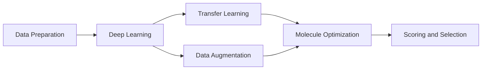
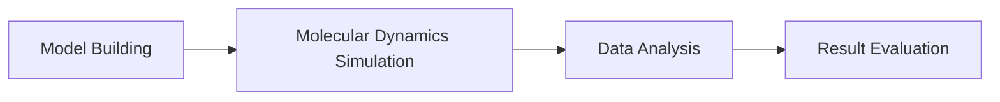

                 

**文章标题：AI辅助新药研发：从分子设计到临床试验**

**关键词：**AI，新药研发，分子设计，虚拟筛选，临床试验

**摘要：**本文将深入探讨人工智能（AI）在药物研发过程中的关键作用，从分子设计与虚拟筛选，到临床前评估与优化，直至临床试验与上市。我们将通过详细的案例分析、算法讲解和实战经验分享，展示AI在药物研发各阶段的应用，以及如何通过这些技术加速新药的发现和开发过程。

----------------------------------------------------------------

## 引言与概述

在当今科技飞速发展的时代，人工智能（AI）已经成为驱动众多领域变革的重要力量。药物研发作为一项复杂且耗时的工程，其效率和质量直接影响到人类健康和社会福祉。近年来，AI技术在药物研发中的应用越来越广泛，从分子设计到临床试验，AI正逐步改变这一领域的游戏规则。

### 1. AI在药物研发中的背景和现状

药物研发是一个多学科交叉的复杂过程，涉及生物化学、药理学、计算机科学等多个领域。传统的药物研发方法主要依赖于经验主义和试错，这不仅耗时耗力，而且成功率较低。随着AI技术的发展，尤其是深度学习、机器学习等算法的突破，AI在药物研发中的应用逐渐成为可能。

目前，AI在药物研发中的应用已经涵盖了从早期发现到后期临床评估的各个阶段。例如，AI可以用于药物分子的设计、筛选和优化，提高新药的发现速度；在临床前评估阶段，AI可以帮助预测药物的安全性和有效性，减少临床试验的风险；在临床试验阶段，AI可以分析大规模的临床数据，帮助医生和研究人员更好地理解药物的作用机制和副作用。

### 2. AI在药物发现中的核心角色与概念

AI在药物发现中的核心角色主要体现在以下几个方面：

- **分子设计与虚拟筛选**：AI可以通过模拟分子之间的相互作用，设计出具有潜在治疗效果的分子结构，并通过虚拟筛选技术快速筛选出最有希望的化合物。
- **生物信息学分析**：AI可以处理海量的生物数据，如基因组序列、蛋白质结构等，从中挖掘出与新药发现相关的生物信息。
- **化学合成与化合物库构建**：AI可以帮助科学家设计合成路径，构建大型化合物库，以便进一步筛选和优化。
- **临床试验与数据分析**：AI可以对临床试验中的大量数据进行分析，帮助研究人员发现药物的疗效和潜在的副作用。

下面，我们将详细探讨这些核心概念和应用。

----------------------------------------------------------------

## 第一部分：引言与概述

### 第1章: AI辅助新药研发的背景和现状

在新药研发的过程中，传统的药物发现方法面临诸多挑战。首先，药物研发是一个高度依赖经验的过程，科学家需要通过反复的实验和试错来筛选出可能有效的化合物。这不仅耗费大量的时间和资源，而且成功率较低。其次，药物研发涉及到多个学科领域，包括生物化学、药理学、化学工程等，这就要求研究人员具备广泛的知识背景和深厚的实践经验。然而，现实中许多研究人员可能无法同时掌握这些学科的知识，导致药物研发的效率和质量受到影响。

此外，新药研发的复杂性和不确定性也是一个重大挑战。药物研发需要经过多个阶段，包括早期发现、临床前评估、临床试验和上市审批。每个阶段都可能遇到各种问题，如化合物的毒性、疗效、安全性等。这些问题不仅增加了研发的成本和时间，还可能直接影响到新药的上市进度。

面对这些挑战，人工智能（AI）技术的出现为药物研发带来了新的机遇。AI具有处理大量数据、发现规律和模式的能力，可以大幅提高药物研发的效率和质量。

首先，AI在分子设计方面有着显著的优势。通过深度学习和机器学习算法，AI可以模拟分子之间的相互作用，预测化合物的性质和行为。这种虚拟筛选技术不仅节省了大量的实验时间和成本，还可以筛选出具有潜在治疗效果的化合物，提高新药发现的成功率。

其次，AI在生物信息学分析方面也有着广泛的应用。生物信息学是药物研发的重要工具，通过分析基因组序列、蛋白质结构等生物数据，AI可以挖掘出与新药发现相关的生物信息。这些信息可以帮助研究人员更好地理解疾病的发生机制，为新药的研发提供理论依据。

此外，AI在药物研发的后期阶段，如临床试验和数据分析方面也有着重要作用。在临床试验中，AI可以对海量临床数据进行分析，帮助研究人员发现药物的疗效和潜在的副作用。这种分析不仅提高了临床试验的效率，还可以减少临床试验的风险，提高新药的成功率。

总的来说，AI在药物研发中的应用已经成为一个不可忽视的趋势。通过AI技术的辅助，药物研发的过程将变得更加高效、精准和可持续。然而，AI技术的应用也面临着一些挑战，如数据隐私、算法透明度、法规遵从等。未来，随着AI技术的不断进步和成熟，这些问题将得到更好的解决，AI在药物研发中的作用也将进一步发挥。

### 第2章: AI在药物发现中的核心角色与概念

人工智能（AI）在药物发现中扮演着至关重要的角色，其核心作用主要体现在以下几个方面：

1. **分子设计与虚拟筛选**

分子设计是药物研发的早期关键步骤，旨在设计出具有特定生物活性的分子结构。AI通过机器学习和深度学习算法，可以分析大量的分子结构数据，预测新化合物的性质和行为。这种预测不仅可以帮助科学家设计出具有高活性、低毒性的化合物，还可以大大缩短药物发现的时间。

虚拟筛选是分子设计的重要环节，通过计算机模拟和分子对接技术，AI可以快速筛选出具有潜在治疗效果的化合物。这种方法比传统的实验筛选要高效得多，因为它能够在短时间内评估大量化合物，从而大大提高新药发现的效率。

2. **生物信息学分析**

生物信息学是药物研发的重要工具，通过分析基因组序列、蛋白质结构等生物数据，AI可以帮助研究人员理解疾病的发生机制和药物的作用机制。例如，AI可以通过深度学习算法，预测蛋白质与药物之间的相互作用，从而为新药设计提供重要参考。

此外，生物信息学还可以帮助研究人员挖掘潜在的药物靶点。通过分析大规模的基因表达数据和蛋白质相互作用网络，AI可以识别出与特定疾病相关的生物标记物和靶点。这些信息对于药物研发具有重要意义，因为它们可以指导科学家设计出针对这些靶点的新药。

3. **化学合成与化合物库构建**

化学合成是药物研发的重要环节，AI可以通过自动化合成路径设计，提高化学合成的效率。例如，AI可以优化反应条件、选择合适的试剂和溶剂，从而提高合成产率和纯度。此外，AI还可以帮助构建大型化合物库，通过高通量筛选技术，快速筛选出具有潜在治疗效果的化合物。

4. **临床试验与数据分析**

临床试验是药物研发的最后一个关键阶段，AI可以通过大数据分析技术，对临床试验数据进行深入分析，帮助研究人员发现药物的疗效和潜在的副作用。例如，AI可以分析患者的电子健康记录，预测药物对不同患者的疗效和风险。

此外，AI还可以优化临床试验的设计和执行。通过预测哪些患者更有可能对药物产生反应，AI可以帮助研究人员更有效地分配临床试验资源，从而提高临床试验的成功率。

总的来说，AI在药物发现中的核心角色体现在其强大的数据处理和分析能力，可以大幅提高药物研发的效率和质量。然而，AI的应用也面临一些挑战，如数据隐私、算法透明度和法规遵从等。未来，随着AI技术的不断进步和成熟，这些问题将得到更好的解决，AI在药物研发中的作用也将进一步发挥。

----------------------------------------------------------------

## 第二部分：分子设计与虚拟筛选

### 第3章: 分子设计与药物发现

分子设计是药物研发的早期关键步骤，旨在通过计算机模拟和算法预测，设计出具有特定生物活性的分子结构。这一过程不仅涉及到化学原理和计算机科学，还融合了生物学和药理学的知识。

在分子设计中，核心概念包括分子结构、分子性质、生物活性等。分子结构是指分子的三维排列，而分子性质则包括分子的物理和化学特性，如溶解度、稳定性、亲和力等。生物活性则是指分子与生物分子（如蛋白质、DNA等）相互作用的能力，这是决定分子是否具有治疗潜力的重要指标。

分子设计与药物发现的过程通常包括以下几个步骤：

1. **目标识别**：首先，研究人员需要确定药物的作用靶点，这通常是一个具有已知结构的蛋白质或酶。通过分析目标蛋白的序列和结构，可以预测其功能区域，从而确定潜在的药物结合位点。

2. **虚拟筛选**：在确定了药物结合位点后，研究人员会使用计算机模拟和算法，对大量分子进行筛选，以找到具有潜在生物活性的分子。这一步骤通常通过分子对接技术实现，它可以模拟分子与目标蛋白之间的相互作用，评估分子的亲和力和生物活性。

3. **分子优化**：通过虚拟筛选得到的初步结果，研究人员会进一步优化分子结构，以提高其生物活性和稳定性。这一步骤通常涉及到对分子结构进行细微调整，以减少其副作用和毒性。

4. **实验验证**：在完成了分子优化后，研究人员会对优化后的分子进行实验验证，以确认其生物活性和安全性。实验验证通常包括细胞实验、动物实验等，这些实验可以帮助研究人员评估分子的治疗效果和毒性。

在这个过程中，核心概念和联系可以用ER实体关系图（Entity-Relationship Diagram）来表示。以下是一个简化的ER实体关系图：

```mermaid
erDiagram
    Target ||--|{ Molecule }
    Molecule ||--|{ Property }
    Property ||--|{ Activity }
```

在这个图中，`Target` 表示药物的作用靶点，`Molecule` 表示设计的分子，`Property` 表示分子的性质，`Activity` 表示分子的生物活性。这些实体之间的关系反映了分子设计过程中的关键环节和相互影响。

### 第4章: 虚拟筛选技术

虚拟筛选技术是分子设计的重要环节，通过计算机模拟和算法预测，快速筛选出具有潜在生物活性的分子。虚拟筛选不仅能够节省大量的实验时间和成本，还可以提高新药发现的效率。

虚拟筛选技术的主要步骤包括：

1. **数据准备**：首先，需要收集和整理大量的分子结构数据，包括小分子化合物和目标蛋白质的结构信息。这些数据通常来源于公共数据库或实验室的实验数据。

2. **分子对接**：分子对接是将小分子与目标蛋白质的三维结构进行对接，模拟分子与蛋白质之间的相互作用。这一步骤可以通过多种算法实现，如 docking、binding site prediction 等。

3. **评分和筛选**：通过分子对接模拟，可以得到每个分子与目标蛋白质的亲和力评分。研究人员可以根据这些评分，筛选出具有潜在生物活性的分子。

4. **分子优化**：在初步筛选后，研究人员会对筛选出的分子进行进一步优化，以提高其生物活性和稳定性。这一步骤通常涉及到对分子结构进行细微调整，以减少其副作用和毒性。

虚拟筛选技术的核心概念和联系可以用Mermaid流程图表示：


在这个流程图中，`A` 表示数据准备，`B` 表示分子对接，`C` 表示评分和筛选，`D` 表示分子优化。这些步骤相互衔接，构成了虚拟筛选的全过程。

### 第5章: AI在虚拟筛选中的应用

人工智能（AI）在虚拟筛选中发挥着越来越重要的作用，通过机器学习和深度学习算法，AI可以大幅提高虚拟筛选的效率和准确性。AI在虚拟筛选中的应用主要包括以下几个方面：

1. **深度学习算法**：深度学习算法可以处理大规模的数据，从中学到复杂的分子特征和生物活性模式。例如，使用卷积神经网络（CNN）可以提取分子图的特征，用于预测分子的生物活性。

2. **增强学习**：增强学习是一种通过试错来优化策略的机器学习算法，可以用于虚拟筛选中的分子优化。通过不断地尝试和反馈，AI可以找到最优的分子结构。

3. **迁移学习**：迁移学习是一种将已知模型的知识应用到新任务上的方法。在虚拟筛选中，可以先将AI模型在大量的数据上训练，然后将这些知识应用到新的分子和目标上，从而提高筛选效率。

4. **数据增强**：AI可以通过生成对抗网络（GAN）等技术，生成大量的虚拟分子数据，用于训练和测试AI模型。这可以缓解数据稀缺的问题，提高模型的泛化能力。

AI在虚拟筛选中的应用不仅提高了筛选的准确性和效率，还可以减少对实验资源的依赖，加速新药发现的进程。以下是一个简化的AI在虚拟筛选中的应用流程：



在这个流程图中，`A` 表示数据准备，`B` 表示深度学习，`C` 表示迁移学习，`D` 表示数据增强，`E` 表示分子优化，`F` 表示评分和筛选。这些步骤共同构成了AI在虚拟筛选中的应用流程。

### 第6章: 分子对接与分子模拟

分子对接和分子模拟是药物研发中的关键技术，用于预测分子与生物分子（如蛋白质、DNA等）之间的相互作用，评估药物的生物活性和安全性。

#### 分子对接技术

分子对接是一种通过计算机模拟预测分子与生物分子相互作用的技术。其核心原理是将分子与生物分子的三维结构进行对接，模拟分子与生物分子之间的相互作用力，从而评估分子的亲和力和生物活性。

分子对接的主要步骤包括：

1. **结构准备**：首先，需要准备目标蛋白和小分子的三维结构。这些结构通常来源于实验测定或公共数据库。

2. **对接模拟**：使用分子对接软件（如AutoDock、GROMACS等），将小分子与目标蛋白进行对接，模拟分子与蛋白之间的相互作用。

3. **评分和筛选**：对接完成后，通过评分函数评估每个对接结果的亲和力。根据评分，筛选出具有潜在生物活性的分子。

4. **分子优化**：在初步筛选后，对筛选出的分子进行优化，以进一步提高其生物活性和稳定性。

分子对接技术的核心概念和联系可以用Mermaid流程图表示：


在这个流程图中，`A` 表示结构准备，`B` 表示对接模拟，`C` 表示评分和筛选，`D` 表示分子优化。

#### 分子模拟技术

分子模拟是一种通过计算机模拟分子在物理环境中的运动和相互作用的技术。其核心原理是使用分子动力学模拟（Molecular Dynamics Simulation，MDS）等方法，模拟分子在特定条件下的运动和变化，从而预测分子的性质和行为。

分子模拟的主要步骤包括：

1. **模型构建**：首先，需要构建分子的三维模型，并确定模拟的条件和参数。

2. **模拟运行**：使用分子模拟软件（如GROMACS、AMBER等），运行分子动力学模拟，模拟分子在特定条件下的运动。

3. **数据分析**：对模拟结果进行分析，提取分子的物理和化学性质，如能量、结构变化等。

4. **结果评估**：根据模拟结果，评估分子的性质和行为，判断其是否具有潜在的治疗效果。

分子模拟技术的核心概念和联系可以用Mermaid流程图表示：



在这个流程图中，`A` 表示模型构建，`B` 表示模拟运行，`C` 表示数据分析，`D` 表示结果评估。

总的来说，分子对接和分子模拟技术是药物研发的重要工具，通过这些技术，科学家可以预测分子的生物活性和安全性，为新药的研发提供重要的理论依据。

----------------------------------------------------------------

## 第三部分：临床前评估与优化

### 第7章: 生物信息学在药物筛选中的应用

生物信息学是药物研发过程中不可或缺的一部分，它利用计算机技术和大数据分析，从生物数据中提取有价值的信息，帮助科学家更好地理解药物的作用机制和潜在疗效。在药物筛选阶段，生物信息学技术可以帮助研究人员从海量的生物数据中筛选出最有希望的药物候选分子，从而提高药物研发的效率。

首先，生物信息学在药物筛选中的应用体现在基因表达数据分析上。通过高通量测序技术，研究人员可以获得大量基因在不同条件下表达的信息。这些数据可以用来分析特定基因在疾病状态下的表达变化，从而发现与疾病相关的基因和潜在的药物靶点。例如，通过比较正常细胞和癌细胞中基因表达的差异，可以识别出在癌细胞中高表达的基因，这些基因可能成为抗癌药物的理想靶点。

其次，生物信息学还用于蛋白质组学数据分析。蛋白质组学是研究细胞或组织在特定条件下所有蛋白质的表达和修饰情况。通过蛋白质组学技术，研究人员可以获得蛋白质的表达水平、修饰状态和相互作用网络等信息。这些信息对于理解疾病的生物机制和药物的作用机制至关重要。例如，通过分析蛋白质相互作用网络，可以发现特定的蛋白质复合物，这些复合物可能与疾病的发生有关，也可以作为药物靶点。

此外，生物信息学还可以用于代谢组学数据分析。代谢组学是研究生物体内所有代谢物组成和变化的科学。通过代谢组学技术，研究人员可以获得细胞在不同条件下产生的代谢物信息。这些信息可以帮助科学家识别出与疾病相关的代谢途径和关键代谢物，从而发现潜在的药物作用靶点和干预点。

在药物筛选过程中，生物信息学技术不仅可以用于筛选药物靶点，还可以用于评估药物候选分子的潜在疗效和副作用。通过分析药物候选分子与生物分子之间的相互作用，可以预测药物在体内的生物活性、代谢途径和毒性。这些信息对于筛选出最有潜力的药物候选分子至关重要。

总的来说，生物信息学在药物筛选中的应用大大提高了药物研发的效率和成功率。通过分析基因表达、蛋白质组学和代谢组学数据，生物信息学技术可以帮助科学家更好地理解疾病的生物机制，发现潜在的药物靶点，并评估药物候选分子的潜在疗效和安全性。随着生物信息学技术的不断发展和完善，它将在药物研发中发挥越来越重要的作用。

### 第8章: 化学合成与化合物库构建

化学合成是药物研发过程中不可或缺的环节，它涉及到将小分子化合物通过化学反应转化为具有特定生物活性的化合物。化合物库则是药物研发的重要资源，通过构建和管理化合物库，研究人员可以快速筛选和评估潜在的药物候选分子。

首先，化学合成的过程通常包括以下几个步骤：

1. **设计合成路径**：研究人员根据药物候选分子的结构和功能需求，设计合理的合成路径。合成路径设计需要考虑反应条件、试剂选择、保护基团的使用等因素。

2. **反应条件优化**：在确定了合成路径后，研究人员需要优化反应条件，包括温度、压力、反应时间等。优化反应条件可以提高反应产率、纯度和稳定性。

3. **实验实施**：在实验室中实施合成反应，通过一系列的化学反应将小分子化合物转化为目标化合物。实验过程中需要严格控制反应条件，并进行质量控制和纯化。

4. **化合物纯化**：通过色谱、结晶等方法对合成得到的化合物进行纯化，得到高纯度的目标化合物。

构建化合物库的过程则涉及以下关键步骤：

1. **小分子库构建**：通过购买或合成小分子化合物，构建初步的化合物库。这些化合物可以是已知的药物分子或类似物，也可以是新合成的分子。

2. **高通量筛选**：使用自动化仪器和软件，对化合物库进行高通量筛选，以评估化合物的生物活性。高通量筛选技术包括酶活性测定、细胞增殖抑制实验等。

3. **化合物筛选与优化**：根据高通量筛选的结果，筛选出具有潜在生物活性的化合物。对这些化合物进行进一步的结构优化，以提高其生物活性和选择性。

4. **数据管理**：建立化合物库的管理系统，记录化合物的合成路径、反应条件、纯化方法、生物活性数据等信息。这有助于研究人员快速查找和利用化合物库中的资源。

化学合成和化合物库构建在药物研发中发挥着重要作用。通过化学合成，研究人员可以合成出具有特定生物活性的化合物，这些化合物可以用于药物筛选和进一步的研究。而化合物库则为药物研发提供了一个庞大的资源库，通过高通量筛选和优化，可以快速筛选出具有潜在治疗价值的药物候选分子。随着合成技术和自动化设备的不断发展，化学合成和化合物库构建的效率和质量将得到进一步提高，为新药研发提供更强有力的支持。

### 第9章: AI辅助化合物优化

在药物研发过程中，化合物优化是一个关键步骤，旨在提高化合物的生物活性和选择性，同时降低其毒性和副作用。随着人工智能（AI）技术的发展，AI在化合物优化中的应用逐渐成为药物研发领域的一个重要研究方向。AI通过深度学习、遗传算法和优化算法等技术，可以大幅提高化合物优化过程的效率和质量。

#### AI在化合物优化中的应用

1. **深度学习算法**：深度学习算法可以通过分析大量的化合物数据，学习化合物的结构和性质之间的关系。这种学习可以帮助预测化合物的生物活性和毒性，从而指导化合物的优化。例如，通过使用卷积神经网络（CNN）和递归神经网络（RNN），可以提取化合物图的特征，用于预测化合物的生物活性。

2. **遗传算法**：遗传算法是一种基于自然选择和遗传学原理的优化算法，可以用于化合物的结构优化。遗传算法通过模拟自然选择过程，对化合物的结构进行迭代优化，以找到具有最佳生物活性和最小毒性的化合物。这种算法特别适用于复杂的目标函数优化问题。

3. **优化算法**：优化算法如模拟退火、粒子群优化和差分进化算法等，可以用于化合物的全局优化。这些算法通过探索和评估化合物的多个结构，找到最优或近似最优的化合物结构。

#### AI优化策略

1. **结构优化**：AI可以通过分析化合物的三维结构，识别出可能影响其生物活性和毒性的关键结构特征。通过调整这些特征，AI可以设计出更优的化合物结构。例如，使用深度学习算法，可以预测化合物的生物活性，并根据预测结果调整化合物的结构。

2. **组合优化**：AI还可以用于优化化合物的组合。在药物研发中，组合疗法可以增强治疗效果并减少副作用。AI可以通过分析多种化合物的相互作用，找到最佳的组合方案。

3. **虚拟筛选**：AI可以辅助虚拟筛选过程，通过预测化合物的生物活性和毒性，快速筛选出具有潜在治疗价值的化合物。这种技术可以大幅提高药物筛选的效率，缩短药物研发周期。

#### 案例分析

以某个抗癌药物的研发为例，研究人员使用AI技术对多个化合物进行优化。首先，使用深度学习算法分析化合物的三维结构，识别出关键的结构特征。然后，通过遗传算法对化合物的结构进行优化，以提高其生物活性和选择性。在优化过程中，AI通过模拟退火算法，探索化合物的多个结构，找到最优的结构。最后，对优化后的化合物进行生物活性测试和毒性评估，确定最佳候选分子。

通过这种AI辅助的化合物优化策略，研究人员可以在较短的时间内筛选出具有潜在治疗价值的化合物，大幅提高药物研发的效率和质量。随着AI技术的不断发展，未来AI在化合物优化中的应用将更加广泛和深入，为药物研发带来更多的突破和可能性。

### 第10章: 临床试验设计与数据分析

临床试验是药物研发过程中的关键环节，它旨在评估药物的安全性和有效性，并确定其在临床环境中的实际效果。临床试验的设计和分析对药物的成功上市至关重要。随着人工智能（AI）技术的发展，AI在临床试验设计和数据分析中的应用越来越广泛，显著提高了临床试验的效率和可靠性。

#### 临床试验设计

临床试验设计包括以下几个关键步骤：

1. **确定研究目标**：首先，需要明确临床试验的目标，包括药物的安全性、有效性、剂量、适应症等。这些目标将指导试验的设计和执行。

2. **选择试验类型**：临床试验可以分为多种类型，如随机对照试验（RCT）、开放标签试验、单臂试验等。每种试验类型都有其优缺点，需要根据研究目标和可行性进行选择。

3. **样本量估算**：根据研究目标，估算所需样本量。样本量过小可能导致结果不显著，而样本量过大则可能增加成本和资源。

4. **试验阶段**：临床试验通常分为三个阶段：I期（安全性评估）、II期（疗效评估）和III期（大规模疗效和安全性评估）。每个阶段的试验设计和目标都不同。

5. **数据分析计划**：在设计试验的同时，需要制定数据分析计划，包括数据收集、处理和分析的方法。这将为后续的数据分析提供指导。

#### 数据分析方法

临床试验中的数据类型多样，包括患者信息、生理指标、药物剂量、不良反应等。AI技术在数据分析中发挥着重要作用，具体包括以下几个方面：

1. **数据预处理**：AI可以用于清洗和整合临床试验中的大量数据。通过数据预处理，可以消除噪声、填补缺失值，提高数据质量。

2. **统计方法**：AI可以应用各种统计方法，如回归分析、生存分析、随机森林等，对临床试验数据进行深入分析。这些方法可以帮助研究人员发现药物的效果和副作用。

3. **机器学习方法**：AI的机器学习方法，如支持向量机（SVM）、神经网络、决策树等，可以用于预测药物的疗效和副作用。这些模型可以通过训练大量的临床试验数据，提高预测的准确性。

4. **模式识别**：AI可以通过模式识别技术，从临床试验数据中识别出潜在的有用信息。例如，通过分析患者的电子健康记录，可以发现药物与特定症状之间的关联。

5. **可视化分析**：AI可以生成数据可视化图表，帮助研究人员直观地理解数据。这些图表可以展示药物的疗效、不良反应分布、剂量-反应关系等。

#### AI在临床试验数据分析中的应用案例

以下是一个AI在临床试验数据分析中的应用案例：

1. **I期临床试验**：研究人员使用AI技术分析I期临床试验中的数据，以确定药物的安全性和剂量范围。通过机器学习算法，可以预测不同剂量下药物的可能不良反应，帮助研究人员确定安全剂量。

2. **II期临床试验**：在II期临床试验中，AI可以用于分析疗效数据，评估药物对特定疾病的疗效。通过回归分析和生存分析，可以确定药物的疗效和最佳剂量。

3. **III期临床试验**：在III期临床试验中，AI可以用于大规模数据分析，评估药物的安全性和疗效。通过支持向量机和神经网络模型，可以预测药物在不同人群中的疗效和不良反应。

总的来说，AI在临床试验设计和数据分析中的应用，极大地提高了临床试验的效率和可靠性，为新药研发提供了强有力的支持。随着AI技术的不断发展，它将在药物研发中发挥越来越重要的作用。

### 第11章: AI在临床试验中的应用

在临床试验中，人工智能（AI）正成为提高临床试验效率和准确性的关键工具。AI在临床试验中的应用涵盖了从患者招募、数据收集、数据分析到结果预测的各个阶段，为研究人员提供了强大的技术支持。

首先，AI在患者招募阶段可以发挥重要作用。通过分析电子健康记录（EHR）和社交媒体数据，AI可以识别出符合临床试验招募标准的患者。这种方法不仅提高了患者招募的速度，还可以确保招募到具有代表性的患者群体，从而提高试验结果的可信度。

在数据收集阶段，AI可以通过自然语言处理（NLP）技术，自动提取和分析患者病历中的关键信息。例如，AI可以识别出患者的主要症状、疾病历史和药物使用情况，从而为临床试验数据收集提供重要参考。此外，AI还可以通过自动化设备（如可穿戴设备）收集实时健康数据，如心率、血压、血糖等，提高数据收集的准确性和时效性。

在数据分析阶段，AI可以处理和分析海量临床试验数据，快速识别出关键趋势和异常值。例如，通过使用深度学习和机器学习算法，AI可以分析患者的电子健康记录，预测药物的疗效和副作用。这种方法不仅提高了数据分析的效率，还可以发现传统方法难以发现的重要信息。

最后，AI在结果预测阶段也可以发挥重要作用。通过训练大量的临床试验数据，AI可以建立预测模型，预测药物在不同人群中的疗效和安全性。例如，AI可以通过分析患者的基因数据和临床试验数据，预测药物对特定患者的疗效和不良反应，从而为个性化医疗提供支持。

总的来说，AI在临床试验中的应用，极大地提高了临床试验的效率和准确性，为新药研发和推广提供了强有力的支持。随着AI技术的不断发展，它将在临床试验中发挥越来越重要的作用。

### 第12章: 药物上市监管与政策

药物上市监管是确保新药安全性和有效性的关键环节，涉及多个国家和地区的法律法规和审批流程。在全球化的背景下，药物上市监管政策对于新药研发和推广具有重要影响。人工智能（AI）技术的发展为药物上市监管带来了新的机遇和挑战。

首先，药物上市监管政策主要包括以下几个方面：

1. **临床试验监管**：临床试验是药物研发的重要环节，各国监管机构对临床试验的设计、执行和报告都有严格的要求。临床试验数据的质量和完整性对于药物审批至关重要。

2. **新药审批**：新药审批通常包括药物的安全性、有效性和质量评估。监管机构通过审评药物的临床试验数据、非临床研究数据和药物生产质量体系，决定是否批准新药上市。

3. **药品标准与标签**：药物上市前需要符合国际或国内药品标准，包括药品成分、纯度、质量和稳定性。药物标签需准确描述药物成分、用途、剂量、副作用等信息。

4. **药品监测与再审查**：药物上市后，监管机构会进行持续监测，收集药品安全性和疗效数据，并根据新的数据对药物进行再审查和调整。

随着AI技术的应用，药物上市监管政策面临以下变革：

1. **数据驱动监管**：AI可以处理和分析大量临床试验数据，提高数据驱动监管的能力。例如，AI可以自动化分析临床试验数据，识别潜在的安全隐患，提高审批的效率和准确性。

2. **个性化审批**：AI可以根据患者的基因数据、电子健康记录等个性化信息，为药物审批提供更精确的预测和评估，支持个性化医疗的发展。

3. **智能监控与预警**：AI可以实时监测药品上市后的安全性数据，及时发现潜在的风险，提高药品监测和预警系统的效能。

4. **法规遵从性**：AI可以帮助制药企业自动化生成符合监管要求的临床试验报告和药品标签，减少合规风险。

然而，AI在药物上市监管中的应用也面临一些挑战，如数据隐私保护、算法透明度和伦理问题。监管机构和制药企业需要协同合作，制定相应的政策和技术标准，确保AI技术的合理和安全应用。

总的来说，AI在药物上市监管中的潜力巨大，但同时也需要充分考虑政策、伦理和技术的挑战。通过合理利用AI技术，药物上市监管将变得更加高效、精准和可持续，为公众健康提供更好的保障。

### 第13章: AI辅助新药研发的挑战

尽管AI在药物研发中展现出了巨大的潜力，但在实际应用过程中仍面临着诸多挑战。这些挑战涉及到技术、伦理、法律等多个层面，需要我们深入思考和逐步解决。

#### 技术挑战

1. **数据质量和完整性**：AI模型的训练和预测依赖于高质量的数据。然而，药物研发过程中产生的数据往往存在噪声、缺失和不一致性，这可能导致AI模型性能下降。因此，如何提高数据的完整性和质量是AI在药物研发中面临的首要挑战。

2. **算法透明性和可解释性**：深度学习等AI算法的黑箱特性使得其决策过程难以解释，这在药物研发中尤其重要，因为药物的研发涉及到人类的健康和安全。提高算法的透明性和可解释性，使其结果能够被科学界和公众接受，是AI在药物研发中面临的技术挑战之一。

3. **计算资源需求**：AI模型训练和预测通常需要大量的计算资源，这对于中小企业和资源有限的实验室来说是一个巨大的负担。如何降低计算资源的需求，提高AI算法的效率，是另一个重要的技术挑战。

#### 伦理挑战

1. **数据隐私**：药物研发涉及大量的个人健康数据，如何保护患者的隐私和数据安全是AI在药物研发中面临的伦理挑战。未经患者同意，将个人健康数据用于AI模型训练和预测，可能引发隐私侵犯的问题。

2. **算法偏见**：AI模型可能会受到训练数据偏见的影响，导致算法结果存在性别、种族、年龄等偏见。这种偏见可能会导致药物研发过程中某些人群被忽视，甚至造成不公平的药物分配。

3. **责任归属**：在AI辅助药物研发中，如果AI模型出现错误或导致不良后果，如何确定责任归属是一个复杂的伦理问题。这需要法律法规的明确界定，以确保研发者和使用者的权益得到保护。

#### 法律挑战

1. **法规遵从**：AI在药物研发中的应用需要遵守各国的法律法规，如FDA、EMA等监管机构的规定。如何确保AI算法和模型的设计、开发和使用符合法规要求，是AI在药物研发中面临的法律挑战。

2. **知识产权保护**：AI技术在药物研发中的应用涉及到大量的知识产权，包括算法、数据、模型等。如何保护这些知识产权，防止侵权和滥用，是另一个重要的法律挑战。

3. **数据共享与开放**：在药物研发中，数据共享和开放是促进科学进步的重要手段。然而，如何平衡数据共享和隐私保护之间的关系，确保数据的安全和合理使用，是一个复杂的问题。

总的来说，AI辅助新药研发虽然具有巨大的潜力，但同时也面临着技术、伦理和法律等多方面的挑战。只有通过科学、合理的解决方案，才能充分发挥AI在药物研发中的作用，为人类健康带来更多的福音。

### 第14章: AI在药物发现中的未来趋势

随着人工智能（AI）技术的不断进步，AI在药物发现中的应用前景愈发广阔。未来，AI将在药物发现中发挥更加核心和全面的作用，推动药物研发的变革。以下是AI在药物发现中可能出现的几个重要趋势：

#### 个性化医疗

个性化医疗是基于患者的个体差异，为其提供最合适的治疗方案。AI可以通过分析患者的基因、生理、病史等多方面数据，预测药物对不同患者的疗效和副作用。未来，AI将实现更精细的个性化医疗，帮助医生为患者制定个性化的药物治疗方案，提高治疗效果和安全性。

#### 全自动化药物研发

AI有望实现药物研发的自动化，从分子设计、化合物筛选到临床试验，全过程都可以通过AI自动化完成。AI可以通过深度学习和增强学习等算法，不断优化药物研发流程，减少人为干预，提高研发效率和成功率。这种全自动化药物研发模式将大幅缩短新药研发周期，降低研发成本。

#### 大数据分析与集成

随着大数据技术的发展，AI将在药物发现中发挥更大的作用。通过整合和分析大量的生物学、化学、临床数据，AI可以挖掘出新的药物靶点、作用机制和生物标志物。未来，AI将实现多数据源、多学科的集成分析，为药物研发提供更为全面的科学依据。

#### 多模态数据分析

AI将能够处理多种数据类型，如基因组数据、蛋白质结构、临床数据等，实现多模态数据分析。这种多模态数据分析可以帮助科学家更好地理解药物的作用机制，发现潜在的药物靶点和作用途径，从而提高新药研发的成功率。

#### 跨学科合作

AI在药物发现中的应用将促进不同学科之间的合作。计算机科学家、生物学家、药理学家等将共同合作，利用AI技术解决药物研发中的关键问题。跨学科合作将推动AI在药物发现中的创新，产生更多突破性的研究成果。

总的来说，未来AI在药物发现中将继续发挥核心作用，推动个性化医疗、自动化药物研发、大数据分析、多模态数据分析和跨学科合作等趋势的发展。通过AI技术的持续创新和应用，药物研发将变得更加高效、精准和可持续，为人类健康带来更多的希望和可能性。

### 第15章: 总结与展望

AI在药物研发中的应用已经取得了显著的进展，从分子设计到临床试验，AI技术正逐步改变这一领域的游戏规则。通过AI技术的辅助，药物研发的效率和质量得到了显著提升，为新药的研发和推广提供了强有力的支持。然而，AI在药物研发中的应用仍面临着诸多挑战，如数据隐私、算法透明度和法规遵从等。未来，随着AI技术的不断进步和成熟，这些问题将得到更好的解决，AI在药物研发中的作用也将进一步发挥。

本文通过对AI在药物研发各阶段的应用进行详细探讨，展示了AI技术在分子设计、虚拟筛选、生物信息学分析、临床试验等方面的核心作用。同时，本文还分析了AI在药物研发中的未来趋势，包括个性化医疗、全自动化药物研发、大数据分析与集成、多模态数据分析和跨学科合作等。通过这些分析，我们可以看到AI在药物研发中具有巨大的潜力，将对未来药物研发产生深远的影响。

展望未来，AI技术在药物研发中的应用将不断拓展和深化。随着技术的进步和政策的支持，AI将成为药物研发的重要驱动力，推动新药研发的加速和成功。我们期待AI技术能够为人类健康带来更多的福祉，助力全球医药事业的持续发展。

### 作者信息

**作者：**AI天才研究院/AI Genius Institute & 禅与计算机程序设计艺术 /Zen And The Art of Computer Programming

AI天才研究院专注于人工智能技术的研究与应用，致力于推动AI技术的创新与发展。同时，作者也是《禅与计算机程序设计艺术》一书的作者，该书深入探讨了计算机编程与哲学的关系，为程序员提供了独特的视角和方法论。通过结合人工智能与编程艺术，作者在药物研发领域的研究为AI在药物研发中的应用提供了重要参考。

