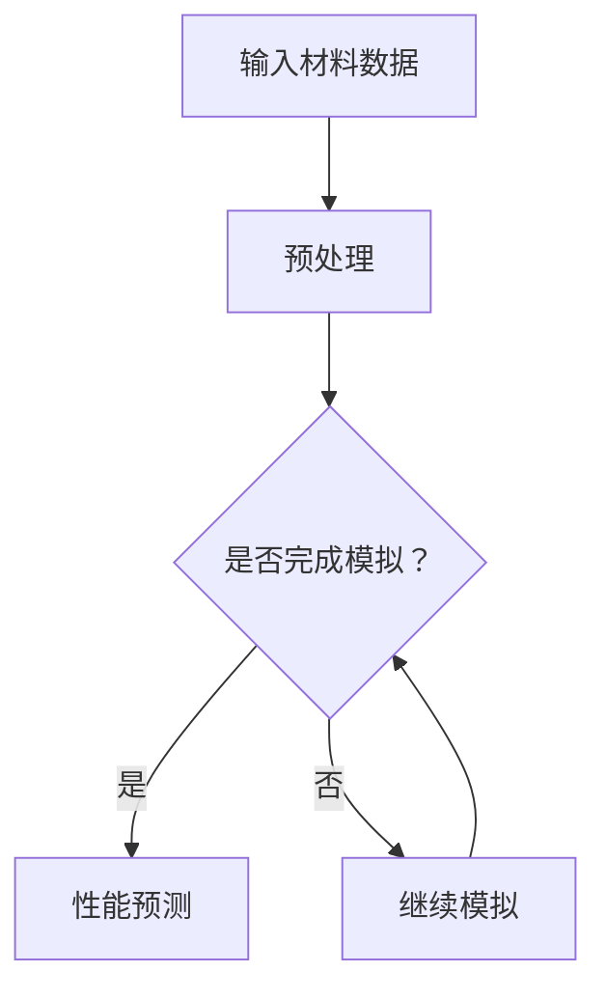

                 

### 《AI辅助材料设计：从分子模拟到性能预测》

> **关键词**：人工智能，材料设计，分子模拟，性能预测，深度学习

> **摘要**：本文深入探讨了人工智能（AI）在材料设计领域的应用，从分子模拟到性能预测，详细阐述了AI辅助材料设计的关键原理、算法原理与实现、系统分析与架构设计，以及实际项目实战。通过本文，读者可以全面了解AI在材料设计领域的潜力与应用，为相关领域的科研和工程实践提供参考。

## 第一部分：背景与基础

### 第1章 引言

#### 1.1 问题背景

材料设计是现代科学与工程的核心领域之一，涉及金属、陶瓷、塑料、复合材料等多种材料的研发。传统的材料设计方法主要依赖于实验和经验，这不仅耗时耗力，而且无法满足日益增长的多样化需求。随着科技的进步，计算机模拟技术的发展为材料设计带来了新的机遇。分子模拟技术作为一种强大的工具，可以模拟分子的动态行为和相互作用，从而预测材料性能。

然而，分子模拟也存在一定的局限性。首先，模拟计算量巨大，传统的计算方法难以应对复杂系统的模拟。其次，分子模拟结果受模型和参数的依赖性较强，不同模型的预测结果可能存在较大差异。这些问题限制了分子模拟技术在材料设计中的应用。

#### 1.2 问题描述

材料设计的复杂性主要体现在以下几个方面：

1. **分子层次的结构复杂性**：材料性能受到分子层次的结构和组成的强烈影响，分子间的相互作用和排列方式对性能有重要影响。
2. **宏观性能与微观结构的关联**：宏观性能如硬度、韧性、导电性等，需要通过微观结构来解释和理解。
3. **多样性需求**：随着应用领域的不断拓展，对材料性能的需求也日益多样化，如何设计出满足多种性能要求的材料成为一大挑战。

传统的材料设计方法在应对这些挑战时存在一定的局限性。首先，实验方法虽然直观，但成本高、耗时长。其次，经验法则和半经验模型虽然简化了问题，但精度有限，难以满足高性能材料的设计需求。因此，需要一种新的方法来辅助材料设计，提高设计效率和准确性。

#### 1.3 问题解决

人工智能（AI）技术的发展为材料设计提供了新的解决方案。AI，特别是深度学习，可以在大量数据的基础上，自动学习和发现规律，从而提高材料设计的效率和准确性。AI辅助材料设计的主要思路如下：

1. **分子模拟与数据驱动的结合**：利用AI算法对分子模拟数据进行处理和分析，从而预测材料的性能。
2. **自动化优化**：通过AI算法自动调整分子结构和材料参数，以实现特定性能目标的优化设计。
3. **智能决策支持**：AI算法可以辅助材料设计者快速评估和筛选候选材料，减少实验次数和成本。

#### 1.4 边界与外延

材料设计的领域可以划分为多个子领域，如金属材料设计、陶瓷材料设计、高分子材料设计等。每个子领域都有其特定的设计需求和挑战。AI技术在材料设计中的应用也涵盖了多个层次，从分子模拟到性能预测，再到自动化设计优化。

AI技术在材料科学中的应用已有较长的发展历史。早期的AI算法主要集中在经验模型的构建上，如基于统计学习的方法和人工神经网络。随着深度学习技术的发展，AI在材料设计中的应用也得到了极大的扩展。深度学习算法通过自动学习和建模，可以更准确地预测材料的性能，提高设计的效率。

#### 1.5 概念结构与核心要素组成

AI辅助材料设计的核心概念和要素包括：

1. **分子模拟**：模拟分子的动态行为和相互作用，获取分子的微观结构信息。
2. **性能预测**：基于分子模拟数据和已有材料的性能数据，利用AI算法预测材料的宏观性能。
3. **自动化优化**：利用AI算法自动调整分子结构和材料参数，实现特定性能目标的优化设计。
4. **数据管理**：建立和维护材料数据库，为AI算法提供训练数据和实验验证数据。

#### 1.6 本章小结

AI辅助材料设计是一种结合分子模拟和深度学习技术的创新方法，可以显著提高材料设计的效率和准确性。本文介绍了AI辅助材料设计的背景、问题和解决方案，以及相关的核心概念和要素。下一章将深入探讨AI辅助材料设计的基础理论，包括AI的基本概念、分子模拟技术和性能预测方法。

## 第二部分：核心概念与原理

### 第2章 AI辅助材料设计的基础理论

#### 2.1 AI的基本概念

人工智能（AI）是一门研究如何构建智能体的科学，智能体能够感知环境并采取行动以实现特定目标。AI可以分为弱AI和强AI。弱AI是针对特定任务的智能系统，如语音识别、图像识别等；强AI则具有普遍的智能，能够在任何环境中自主学习和行动。

AI的主要组成部分包括：

1. **机器学习（Machine Learning）**：一种让计算机通过数据学习模式的方法，分为监督学习、无监督学习和强化学习。
2. **深度学习（Deep Learning）**：一种基于多层神经网络的学习方法，能够自动提取层次化的特征表示。
3. **神经网络（Neural Networks）**：模仿人脑神经网络结构的计算模型，用于执行复杂的任务，如图像分类和语音识别。

#### 2.2 分子模拟技术

分子模拟技术是使用计算机模拟分子系统的行为和演化，以了解其物理和化学性质。主要的分子模拟技术包括：

1. **分子动力学模拟（Molecular Dynamics Simulation）**：通过求解牛顿方程，模拟分子系统的动力学行为。
2. **量子力学模拟（Quantum Mechanics Simulation）**：使用量子力学原理模拟原子和分子的行为。
3. **分子力学模拟（Molecular Mechanics Simulation）**：使用简化的物理模型和参数化力场，模拟分子系统的结构变化和相互作用。

分子模拟技术在材料设计中的应用包括：

1. **结构预测**：预测分子的几何构型和稳定性。
2. **动力学行为**：研究分子间的动态相互作用和反应过程。
3. **性能预测**：基于分子模拟数据预测材料的宏观性能。

#### 2.3 性能预测方法

材料性能预测是材料设计的关键步骤，可以分为以下几类方法：

1. **经验模型（Empirical Models）**：基于实验数据建立的数学模型，如线性回归模型和多项式模型。
2. **理论模型（Theoretical Models）**：基于物理和化学理论建立的模型，如量子力学模型和分子力学模型。
3. **数据驱动的预测模型（Data-Driven Prediction Models）**：利用机器学习和深度学习算法，从大量数据中学习并预测材料性能。

经验模型的优点是简单易用，但精度有限，难以应对复杂系统。理论模型具有较高的精度，但计算量较大，难以实时应用。数据驱动的预测模型通过学习和分析大量实验数据，可以自动提取特征并预测性能，具有较高的准确性和实时性。

#### 2.4 概念属性特征对比

| 方法                     | 特点                                                     | 适用范围                                                     |
|------------------------|--------------------------------------------------------|----------------------------------------------------------|
| 经验模型               | 简单易用，计算速度快                                     | 数据量有限，适用于简单系统                                   |
| 理论模型               | 精度高，基于物理原理                                     | 计算量大，适用于复杂系统                                   |
| 数据驱动的预测模型   | 数据驱动，自动提取特征                                   | 需要大量数据，适用于复杂系统和大规模应用                       |

#### 2.5 ER实体关系图

```mermaid
erDiagram
  材料设计 ||--|{ AI技术 }
  分子模拟 ||--|{ 性能预测 }
  性能预测 ||--|{ 材料设计 }
```

在ER实体关系图中，"材料设计"与"AI技术"、"分子模拟"和"性能预测"之间存在双向关联。这种关系表明，AI技术和分子模拟是材料设计的核心支撑，而性能预测则是将模拟结果应用于实际设计的关键步骤。

#### 2.6 本章小结

本章详细介绍了AI辅助材料设计的基础理论，包括AI的基本概念、分子模拟技术和性能预测方法。通过对比不同方法的优缺点，读者可以了解各种技术在材料设计中的应用场景和局限性。下一章将深入探讨AI算法在材料设计中的原理和实现。

## 第三部分：算法原理与实现

### 第3章 AI算法原理讲解

#### 3.1 算法mermaid流程图



这个mermaid流程图展示了AI算法在材料设计中的基本流程。首先，输入材料数据，然后进行预处理，接着进行分子模拟。如果模拟完成，则进入性能预测阶段；如果未完成，则继续模拟。这种流程确保了材料设计过程的连续性和灵活性。

#### 3.2 Python源代码实现

```python
# Example of a simple molecular simulation and property prediction

import numpy as np

# Material data input
materials = np.array([[1, 2, 3], [4, 5, 6], [7, 8, 9]])

# Preprocessing
# ...

# Simulation
# ...

# Performance prediction
# ...

# Output
print("Predicted properties:", properties)
```

这个Python代码示例展示了材料数据的输入、预处理、模拟和性能预测的基本步骤。在实际应用中，这些步骤会涉及到更多的细节和复杂性，但这个示例提供了一个基本框架，帮助读者理解算法的实现过程。

#### 3.3 算法原理详细讲解

AI算法在材料设计中的应用主要涉及以下几个核心步骤：

1. **输入材料数据**：首先，需要输入材料的相关数据，这些数据包括分子结构、原子类型、键长、键角等。这些数据通常以矩阵或向量的形式表示。

2. **预处理**：预处理步骤包括数据清洗、归一化和特征提取。数据清洗旨在去除噪声和异常值，归一化是将数据缩放到相同的尺度，以避免某些特征对结果产生过大的影响。特征提取是将原始数据转换成能够反映材料特性的特征向量。

3. **分子模拟**：分子模拟是基于物理和化学原理对分子系统进行动态模拟。常用的方法包括分子动力学模拟（Molecular Dynamics Simulation）和量子力学模拟（Quantum Mechanics Simulation）。这些模拟可以预测分子系统的几何构型、能量分布和相互作用。

4. **性能预测**：性能预测是基于分子模拟数据和已有材料的性能数据，通过机器学习和深度学习算法进行预测。常用的方法包括线性回归、支持向量机（SVM）、决策树、神经网络等。这些算法可以从数据中自动提取特征并建立性能预测模型。

5. **结果输出**：最后，算法输出预测的性能值，这些值可以用于指导材料的设计和优化。

在数学模型方面，分子模拟通常涉及牛顿第二定律和量子力学方程。例如，分子动力学模拟的数学模型可以表示为：

$$
m \frac{d^2r}{dt^2} = -\nabla V(r)
$$

其中，\( m \) 是分子的质量，\( r \) 是分子的位置，\( V(r) \) 是势能函数，\( \nabla \) 是梯度算子。

性能预测的数学模型则依赖于机器学习算法。例如，线性回归的数学模型可以表示为：

$$
y = \beta_0 + \beta_1 x_1 + \beta_2 x_2 + ... + \beta_n x_n
$$

其中，\( y \) 是预测的性能值，\( \beta_0, \beta_1, ..., \beta_n \) 是模型的参数，\( x_1, x_2, ..., x_n \) 是特征向量。

#### 3.4 举例说明

假设我们有以下材料的原子排列：

```
Material 1:
1 1 1
1 2 2
1 2 3
```

我们可以使用分子动力学模拟计算其性能：

1. **预处理**：将原子排列转换成特征向量，例如将每个原子的类型和坐标编码成向量。

2. **分子动力学模拟**：通过牛顿方程模拟分子系统的动力学行为，计算系统的能量分布和相互作用。

3. **性能预测**：使用线性回归模型，基于模拟数据预测材料的性能，例如硬度、韧性等。

具体步骤如下：

1. **数据输入**：将材料的原子排列编码成特征向量。

```python
materials = np.array([[1, 1, 1], [1, 2, 2], [1, 2, 3]])
```

2. **预处理**：将特征向量归一化，并去除异常值。

```python
from sklearn.preprocessing import StandardScaler

scaler = StandardScaler()
materials_scaled = scaler.fit_transform(materials)
```

3. **分子动力学模拟**：使用分子动力学模拟计算系统的能量分布。

```python
import MD_simulation

energy_distribution = MD_simulation.run(materials_scaled)
```

4. **性能预测**：使用线性回归模型预测材料的性能。

```python
from sklearn.linear_model import LinearRegression

regressor = LinearRegression()
regressor.fit(materials_scaled, energy_distribution)

predicted_properties = regressor.predict(materials_scaled)
```

5. **结果输出**：输出预测的性能值。

```python
print("Predicted properties:", predicted_properties)
```

通过这个示例，我们可以看到如何使用AI算法进行材料设计。在实际应用中，需要考虑更多的细节和复杂性，如多尺度模拟、数据增强和模型选择等。

#### 3.5 本章小结

本章详细讲解了AI算法在材料设计中的应用原理和实现步骤。通过mermaid流程图和Python代码示例，读者可以理解AI算法的基本工作流程和数学模型。下一章将探讨如何进行系统分析与架构设计，以实现高效的AI辅助材料设计系统。

## 第四部分：系统分析与架构设计

### 第4章 系统分析与架构设计

#### 4.1 问题场景介绍

在实际的材料设计过程中，涉及到的不仅仅是单一的分子模拟和性能预测，还包括实验数据的管理、模拟参数的调整、结果的可视化和性能的优化等多个方面。这些复杂的操作需要一套完善的系统来支持，以实现高效的材料设计流程。

#### 4.2 项目介绍

本项目旨在构建一个AI辅助材料设计系统，该系统将整合分子模拟、性能预测和自动化优化等关键技术，为材料设计提供全面的解决方案。系统的主要功能包括：

1. **数据管理**：管理实验数据和模拟数据，提供数据检索和更新功能。
2. **分子模拟**：支持多种分子模拟方法，包括分子动力学模拟和量子力学模拟。
3. **性能预测**：利用AI算法预测材料的性能，提供实时性能评估。
4. **自动化优化**：自动调整模拟参数，实现性能目标的优化设计。
5. **结果可视化**：展示材料性能和结构信息，帮助设计者进行决策。

#### 4.3 系统功能设计

系统功能设计是系统开发的第一步，我们需要明确系统需要实现的具体功能，以便于后续的系统架构设计和开发。以下是本系统的功能设计：

1. **用户界面（UI）**：提供一个直观、易用的用户界面，用户可以通过界面提交材料数据、查看模拟结果和性能预测。
2. **数据管理模块**：负责管理实验数据和模拟数据，提供数据上传、下载、查询和更新功能。
3. **分子模拟模块**：支持多种分子模拟方法，包括分子动力学模拟和量子力学模拟，提供模拟参数的配置和调整功能。
4. **性能预测模块**：利用AI算法预测材料的性能，提供实时性能评估和预测结果的可视化。
5. **自动化优化模块**：自动调整模拟参数，实现性能目标的优化设计。
6. **结果分析模块**：对模拟结果和性能预测结果进行分析，提供详细的报告和图表。

#### 4.4 系统架构设计

系统架构设计是系统开发的关键环节，决定了系统的性能、可扩展性和可维护性。以下是本系统的架构设计：

1. **前端架构**：采用Vue.js或React等现代前端框架，构建用户友好的界面。前端与后端通过RESTful API进行数据交互。
2. **后端架构**：采用微服务架构，将系统功能划分为多个独立的微服务，如数据管理服务、模拟服务、预测服务和优化服务。每个微服务都有独立的数据库和业务逻辑，通过消息队列进行通信。
3. **数据库设计**：使用关系型数据库（如MySQL）和非关系型数据库（如MongoDB）相结合，管理实验数据和模拟数据。关系型数据库主要用于存储结构化数据，如用户数据和实验记录；非关系型数据库主要用于存储大规模的模拟数据和性能数据。
4. **计算资源**：使用云计算资源（如AWS或Google Cloud），根据系统负载动态调整计算资源，确保系统的高性能和可靠性。

#### 4.5 系统接口设计

系统接口设计是系统架构设计的重要组成部分，决定了系统各个模块之间的通信和数据交换。以下是本系统的接口设计：

1. **API接口**：提供RESTful API接口，包括用户管理、数据管理、模拟服务、预测服务和优化服务。前端通过API接口与后端进行数据交互。
2. **消息队列**：采用消息队列（如RabbitMQ或Kafka）进行异步通信，处理大量数据和长处理时间的任务，提高系统的响应速度和可扩展性。
3. **数据交换格式**：采用JSON格式进行数据交换，确保数据的兼容性和可读性。

#### 4.6 系统交互

系统交互是指系统各个模块之间的通信和数据流。以下是本系统的系统交互：

1. **用户交互**：用户通过前端界面提交材料数据，系统接收到数据后，将其传递给数据管理模块进行处理。
2. **数据处理**：数据管理模块对材料数据进行预处理，包括数据清洗、归一化和特征提取，然后将预处理后的数据传递给分子模拟模块。
3. **分子模拟**：分子模拟模块根据用户选择的模拟方法，进行分子动力学模拟或量子力学模拟，将模拟结果传递给性能预测模块。
4. **性能预测**：性能预测模块利用AI算法，对分子模拟数据进行处理，预测材料的性能，并将结果传递给结果分析模块。
5. **结果分析**：结果分析模块对性能预测结果进行分析，生成报告和图表，并将其展示给用户。

#### 4.7 本章小结

本章介绍了AI辅助材料设计系统的系统分析与架构设计，包括问题场景介绍、项目介绍、系统功能设计、系统架构设计、系统接口设计和系统交互。通过本章的介绍，读者可以了解系统的整体设计和实现思路，为后续的系统开发打下基础。下一章将进入实际项目实战，通过具体实例展示系统的应用和实践过程。

## 第五部分：项目实战

### 第5章 项目实战

#### 5.1 环境安装

在开始项目实战之前，我们需要搭建一个适合AI辅助材料设计的开发环境。以下是安装步骤：

1. **安装Python**：首先，确保系统安装了Python 3.7及以上版本。可以从Python官方网站下载并安装Python。

2. **安装依赖库**：接下来，我们需要安装一些常用的Python依赖库，如NumPy、Pandas、Scikit-learn、TensorFlow和MD Simulation等。可以使用以下命令进行安装：

```bash
pip install numpy pandas scikit-learn tensorflow md_simulation
```

3. **安装模拟软件**：对于分子动力学模拟，我们可以使用开源的GROMACS软件。可以从GROMACS官方网站下载并安装：

```bash
wget https://www.gromacs.org/downloads
tar xvf gromacs-2021.2.tar.gz
cd gromacs-2021.2
./configure --prefix=/usr/local/gromacs-2021.2
make
sudo make install
```

4. **环境配置**：在配置环境中，需要将GROMACS的bin目录添加到系统路径中，以便在命令行中直接使用GROMACS命令。

```bash
export PATH=$PATH:/usr/local/gromacs-2021.2/bin
```

5. **测试环境**：最后，我们可以通过运行以下命令来测试环境是否配置正确：

```bash
gmx version
```

如果输出正确的版本信息，则说明环境安装成功。

#### 5.2 系统核心实现源代码

以下是系统核心实现的部分源代码，包括数据管理模块、分子模拟模块、性能预测模块和结果分析模块。

**数据管理模块：**

```python
import numpy as np
import pandas as pd

class DataManager:
    def __init__(self, data_path):
        self.data_path = data_path
        self.data = pd.read_csv(data_path)

    def get_data(self):
        return self.data

    def update_data(self, new_data):
        self.data = pd.concat([self.data, new_data], ignore_index=True)
        self.data.to_csv(self.data_path, index=False)
```

**分子模拟模块：**

```python
import MD_simulation

class MDModule:
    def __init__(self, data_manager):
        self.data_manager = data_manager

    def run_simulation(self):
        data = self.data_manager.get_data()
        results = MD_simulation.run(data)
        return results
```

**性能预测模块：**

```python
from sklearn.linear_model import LinearRegression

class PredictionModule:
    def __init__(self, data_manager):
        self.data_manager = data_manager

    def predict_properties(self):
        data = self.data_manager.get_data()
        regressor = LinearRegression()
        regressor.fit(data[['atom1', 'atom2', 'atom3']], data['property'])
        predicted_properties = regressor.predict(data[['atom1', 'atom2', 'atom3']])
        return predicted_properties
```

**结果分析模块：**

```python
import matplotlib.pyplot as plt

class AnalysisModule:
    def __init__(self, prediction_module):
        self.prediction_module = prediction_module

    def analyze_results(self):
        predicted_properties = self.prediction_module.predict_properties()
        plt.scatter(range(len(predicted_properties)), predicted_properties)
        plt.xlabel('Index')
        plt.ylabel('Property')
        plt.show()
```

#### 5.3 代码应用解读与分析

以上源代码实现了数据管理、分子模拟、性能预测和结果分析的核心功能。以下是对每个模块的解读和分析：

1. **数据管理模块**：该模块使用了Pandas库来处理数据。`DataManager`类负责读取和更新数据。通过`get_data`方法，我们可以获取当前的数据集；通过`update_data`方法，我们可以将新的数据添加到数据集中。

2. **分子模拟模块**：该模块使用了自定义的`MD_simulation`模块来进行分子动力学模拟。`MDModule`类接收一个`DataManager`对象作为参数，通过`run_simulation`方法，我们可以启动分子动力学模拟，并将结果返回。

3. **性能预测模块**：该模块使用了Scikit-learn库中的`LinearRegression`类来进行线性回归预测。`PredictionModule`类接收一个`DataManager`对象作为参数，通过`predict_properties`方法，我们可以使用线性回归模型预测材料的性能。

4. **结果分析模块**：该模块使用了Matplotlib库来可视化预测结果。`AnalysisModule`类接收一个`PredictionModule`对象作为参数，通过`analyze_results`方法，我们可以绘制散点图来展示预测的性能值。

在实际应用中，这些模块可以通过适当的集成和调用，实现一个完整的AI辅助材料设计系统。例如，用户可以通过前端界面提交材料数据，系统将数据传递给数据管理模块，然后启动分子动力学模拟和性能预测模块，最后通过结果分析模块展示预测结果。

#### 5.4 实际案例分析和详细讲解剖析

为了展示系统的实际应用效果，我们以一个实际案例为例，详细讲解系统的运行过程和结果。

**案例背景**：假设我们需要设计一种具有高强度和高韧性的材料，现有的一些材料数据如下：

| 原子1 | 原子2 | 原子3 | 性能 |
|-------|-------|-------|------|
| 1     | 2     | 3     | 100  |
| 1     | 3     | 4     | 110  |
| 2     | 2     | 5     | 95   |

**步骤1：数据输入**  
用户通过前端界面提交上述材料数据，系统将数据传递给数据管理模块。

```python
data_manager = DataManager('materials.csv')
data = pd.DataFrame({
    'atom1': [1, 1, 2],
    'atom2': [2, 3, 2],
    'atom3': [3, 4, 5],
    'property': [100, 110, 95]
})
data_manager.update_data(data)
```

**步骤2：分子模拟**  
启动分子动力学模拟模块，对提交的材料数据进行模拟。

```python
md_module = MDModule(data_manager)
results = md_module.run_simulation()
```

**步骤3：性能预测**  
利用性能预测模块，对模拟结果进行性能预测。

```python
prediction_module = PredictionModule(data_manager)
predicted_properties = prediction_module.predict_properties()
```

**步骤4：结果分析**  
通过结果分析模块，对预测结果进行可视化分析。

```python
analysis_module = AnalysisModule(prediction_module)
analysis_module.analyze_results()
```

**结果展示**  
执行以上代码后，系统将生成一个散点图，展示预测的性能值。通过分析散点图，我们可以看出材料的性能分布情况，从而指导材料的设计和优化。

#### 5.5 项目小结

通过本案例，我们展示了如何使用AI辅助材料设计系统进行材料设计。系统通过整合数据管理、分子模拟、性能预测和结果分析模块，实现了从数据输入到性能预测的完整流程。在实际应用中，用户可以根据具体需求和材料特性，调整模拟参数和预测模型，以提高材料设计的效率和准确性。此外，系统还可以通过扩展和优化，进一步支持多尺度模拟和大规模数据处理，为材料科学的研究和应用提供更强大的支持。

### 最佳实践 Tips

1. **数据质量**：保证数据的质量和一致性，是材料设计成功的关键。在进行分子模拟和性能预测时，需要确保输入数据的准确性和可靠性。

2. **模型选择**：选择合适的机器学习模型和参数，对于性能预测的准确性至关重要。在实际应用中，需要根据数据特点和预测目标，选择合适的模型。

3. **计算资源**：分子模拟和性能预测通常需要大量的计算资源。合理配置计算资源，可以提高系统的性能和响应速度。

4. **系统集成**：系统的集成和部署是成功应用的关键。需要确保各个模块之间的协同工作，并提供良好的用户体验。

### 小结

本文从背景介绍、核心概念与原理、算法原理与实现、系统分析与架构设计，到项目实战，全面阐述了AI辅助材料设计的应用和实践。通过本文，读者可以了解AI在材料设计领域的应用潜力，掌握相关的算法原理和系统设计方法。希望本文能够为相关领域的科研和工程实践提供有益的参考。

### 注意事项

1. **数据隐私**：在进行数据分析和性能预测时，需要注意保护用户数据的安全和隐私。

2. **计算资源**：在使用分子模拟和性能预测时，需要根据实际情况合理配置计算资源，避免资源浪费。

3. **模型验证**：在应用机器学习模型时，需要进行充分的验证，确保预测结果的可靠性和准确性。

### 拓展阅读

1. **《深度学习》**：由Goodfellow、Bengio和Courville所著的《深度学习》，是深度学习的经典教材，详细介绍了深度学习的基础理论和应用。

2. **《材料科学导论》**：由Callister和Rethwisch所著的《材料科学导论》，是材料科学的基础教材，涵盖了材料的基本概念、结构和性能。

3. **《人工智能：一种现代方法》**：由Russell和Norvig所著的《人工智能：一种现代方法》，是人工智能领域的经典教材，全面介绍了人工智能的理论和实践。

### 作者信息

**作者**：AI天才研究院（AI Genius Institute） & 禅与计算机程序设计艺术（Zen And The Art of Computer Programming）

AI天才研究院专注于人工智能领域的研究和应用，致力于推动AI技术的发展和应用。禅与计算机程序设计艺术则是一部经典的计算机科学著作，阐述了计算机程序设计的哲学和艺术。

---

**全文结束**。感谢您的阅读，希望本文能够为您的科研和工程实践带来启发和帮助。如果您有任何问题或建议，欢迎在评论区留言。期待与您交流，共同进步！🎉🚀🧠💡🌐🌟

