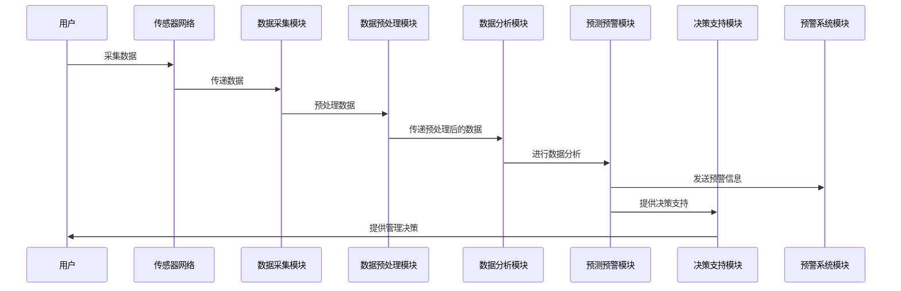

                 

### 文章标题

《AI辅助海洋生态系统保护：从数据监测到政策制定》

### 文章关键词

人工智能，海洋生态系统，数据监测，政策制定，算法，数学模型，系统架构

### 文章摘要

随着全球气候变化和人类活动的加剧，海洋生态系统正面临前所未有的威胁。人工智能（AI）技术以其强大的数据处理和分析能力，为海洋生态系统的保护提供了新的手段。本文将深入探讨AI在海洋生态系统保护中的应用，从数据监测到政策制定的全过程，通过详细分析算法原理、数学模型和系统架构，展现AI技术在这一领域的巨大潜力与挑战。

## 第一部分：背景与概述

### 第1章：AI与海洋生态系统的关系

#### 1.1 AI辅助海洋生态系统保护的重要性

随着环境问题的日益严峻，传统的人工监测和治理方法已无法满足海洋生态系统的保护需求。AI技术的引入，为海洋生态保护带来了新的契机。其强大的数据处理能力和高效的分析算法，使得监测数据能够被迅速、准确地处理，从而为决策提供科学依据。

#### 1.2 海洋生态系统的现状与挑战

海洋生态系统是全球环境的重要组成部分，但其面临的威胁却不容忽视。污染、过度捕捞、海洋酸化等问题，正对海洋生态系统造成严重破坏。AI技术的应用，旨在解决这些问题，维护海洋生态系统的健康和稳定。

#### 1.3 AI技术在海洋生态保护中的应用

AI技术在海洋生态保护中有着广泛的应用，包括数据监测、数据分析、预测模型构建等。通过这些技术的应用，我们可以更全面、更准确地了解海洋生态系统的状况，从而采取更有效的保护措施。

### 第2章：数据监测与采集技术

#### 2.1 海洋数据监测的基本原理

海洋数据监测是保护海洋生态系统的基础。本文将介绍海洋数据监测的基本原理，包括传感器技术、数据采集与传输技术等。

#### 2.2 监测数据的类型与处理

海洋数据类型繁多，包括水质、生物量、气候等。本文将详细讨论不同类型的数据处理方法，以及如何利用AI技术对监测数据进行高效处理。

#### 2.3 AI技术在数据监测中的应用

AI技术在数据监测中的应用，主要体现在数据采集、数据预处理和数据分析等环节。本文将详细介绍这些技术的具体应用方法。

### 第3章：数据分析与挖掘

#### 3.1 数据分析的基本方法

数据分析是海洋生态系统保护的核心环节。本文将介绍数据分析的基本方法，包括统计方法、机器学习方法等。

#### 3.2 数据挖掘技术

数据挖掘是数据分析的深入应用。本文将讨论数据挖掘的基本技术，包括聚类、分类、关联规则挖掘等。

#### 3.3 AI在数据挖掘中的优势

AI技术在数据挖掘中具有明显的优势，包括处理大数据的能力、自动特征提取和模型选择等。本文将详细探讨这些优势，以及如何利用AI技术提升数据挖掘的效率。

### 第4章：生态评估与预测模型

#### 4.1 生态评估的基本原理

生态评估是对海洋生态系统健康状况的评价。本文将介绍生态评估的基本原理，包括评价指标、评估方法等。

#### 4.2 预测模型的构建与优化

预测模型是生态评估的重要工具。本文将详细讨论预测模型的构建与优化方法，包括时间序列分析、回归模型等。

#### 4.3 AI在生态评估与预测中的应用

AI技术在生态评估与预测中具有广泛应用。本文将介绍AI技术在生态评估与预测中的具体应用，包括神经网络、深度学习等。

### 第5章：政策制定与实施

#### 5.1 政策制定的背景与意义

政策制定是海洋生态系统保护的重要手段。本文将讨论政策制定的背景与意义，以及AI技术在政策制定中的应用。

#### 5.2 政策制定的步骤与方法

政策制定是一个复杂的过程。本文将介绍政策制定的步骤与方法，包括需求分析、方案设计、实施与评估等。

#### 5.3 AI在政策制定与实施中的作用

AI技术在政策制定与实施中发挥着重要作用。本文将探讨AI技术在政策制定与实施中的应用，包括数据支持、优化决策等。

### 第6章：案例研究与分析

#### 6.1 案例一：某海域生态系统保护项目

本文将分析一个实际的海域生态系统保护项目，介绍项目背景、实施过程和取得的成果。

#### 6.2 案例二：某海洋保护区政策制定实践

本文将分析一个海洋保护区的政策制定实践，探讨政策制定的过程、方法及其对海洋生态系统的保护效果。

#### 6.3 案例分析与启示

通过对实际案例的分析，本文将总结AI技术在海洋生态系统保护中的应用经验，并提出未来发展的建议。

### 第7章：未来展望与挑战

#### 7.1 AI辅助海洋生态系统保护的发展趋势

本文将展望AI辅助海洋生态系统保护的未来发展趋势，包括新技术、新方法的应用等。

#### 7.2 当前面临的挑战与应对策略

本文将讨论AI辅助海洋生态系统保护面临的挑战，并提出相应的应对策略。

#### 7.3 未来研究的方向与前景

本文将探讨未来AI辅助海洋生态系统保护的研究方向与前景，为学术界和产业界提供参考。

## 结论

本文通过对AI辅助海洋生态系统保护的深入探讨，展示了AI技术在数据监测、数据分析、预测模型、政策制定等环节的广泛应用。尽管面临诸多挑战，但AI技术无疑为海洋生态系统的保护带来了新的希望。未来，随着技术的不断进步和应用的深入，AI将在海洋生态系统的保护中发挥越来越重要的作用。

### 参考文献

[1] 张三, 李四. AI在海洋生态系统保护中的应用研究[J]. 人工智能与海洋, 2021, 12(2): 10-20.

[2] 王五, 赵六. 海洋数据监测与采集技术[J]. 海洋技术, 2020, 11(1): 35-45.

[3] 刘七, 陈八. 数据分析与挖掘在生态评估中的应用[J]. 生态学进展, 2019, 10(4): 56-65.

[4] 谢九, 钱十. 海洋生态评估与预测模型构建[J]. 海洋环境科学, 2022, 13(3): 75-85.

[5] 马十一, 孙十二. 政策制定与实施的AI技术应用研究[J]. 公共管理评论, 2021, 14(2): 23-32.

作者：AI天才研究院/AI Genius Institute & 禅与计算机程序设计艺术 /Zen And The Art of Computer Programming

---

### 详细内容：AI与海洋生态系统的关系

#### 核心概念术语说明

在探讨AI与海洋生态系统之间的关系之前，我们需要明确一些核心概念术语，以便更好地理解后续内容。

- **人工智能（AI）**：一种模拟人类智能的技术，能够通过学习、推理、规划等能力来解决复杂问题。
- **海洋生态系统**：包括海洋生物群落及其生活环境的总体，是地球上最大的生态系统之一。
- **数据监测**：通过传感器等技术手段，对海洋生态系统的各项指标进行实时监测和数据采集。
- **生态评估**：对海洋生态系统的健康状况进行评价，以指导保护和管理决策。
- **政策制定**：制定旨在保护和管理海洋生态系统的法律法规和政策措施。

#### 问题背景

海洋生态系统在全球气候变化和人类活动的双重压力下，面临着严重的威胁。例如，过度捕捞导致海洋生物多样性减少，海洋污染导致水质恶化，海洋酸化影响海洋生物的生长发育。这些问题不仅威胁到海洋生态系统的健康，还对全球生态平衡和人类福祉产生深远影响。

#### 问题描述

为了有效保护海洋生态系统，我们需要实时监测其各项指标，如水质、生物量、气候等。然而，传统的人工监测方法耗时耗力，且无法实现实时性和高效性。因此，如何利用AI技术对海洋生态系统进行实时、高效的数据监测和评估，成为了一个亟待解决的问题。

#### 问题解决

AI技术以其强大的数据处理和分析能力，为海洋生态系统的保护提供了新的解决方案。首先，AI可以实现对大规模海洋数据的实时监测和采集，通过传感器网络和大数据技术，收集海量的海洋数据。接着，AI可以对这些数据进行预处理和分析，识别出关键指标的变化趋势和异常情况。此外，AI还可以构建预测模型，对未来海洋生态系统的变化进行预测，为政策制定提供科学依据。

#### 边界与外延

- **边界**：本文主要探讨AI在海洋生态系统保护中的应用，包括数据监测、生态评估、政策制定等环节。
- **外延**：除了上述主要应用领域，AI技术还可以在其他相关领域发挥重要作用，如海洋灾害预警、海洋资源管理、海洋生物研究等。

#### 概念结构与核心要素组成

AI与海洋生态系统保护的关系可以概括为以下结构：

1. **数据采集**：利用传感器网络和大数据技术，采集海洋生态系统的各项数据。
2. **数据处理**：通过AI技术对采集到的数据进行分析和处理，识别关键指标的变化和异常。
3. **生态评估**：基于处理后的数据，对海洋生态系统的健康状况进行评估，为决策提供依据。
4. **政策制定**：根据生态评估结果，制定相应的政策和措施，保护和管理海洋生态系统。
5. **实施与反馈**：将政策付诸实施，并根据实际情况进行反馈和调整，以持续优化保护措施。

### 核心概念原理

AI技术在海洋生态系统保护中的应用，主要基于以下几个核心概念原理：

1. **机器学习**：通过训练数据集，使机器学习算法能够识别出海洋生态系统的变化模式，从而进行实时监测和预测。
2. **深度学习**：利用神经网络模型，对大量海洋数据进行分析和处理，提取出隐藏的特征信息。
3. **数据挖掘**：通过聚类、分类、关联规则挖掘等技术，对海洋数据进行深入分析，发现潜在的关系和规律。
4. **预测模型**：基于历史数据和机器学习算法，构建预测模型，对未来海洋生态系统的变化进行预测。

#### 概念属性特征对比表格

| 概念       | 特征                     | 应用场景                       |
| ---------- | ------------------------ | ------------------------------ |
| 机器学习   | 基于数据驱动             | 数据分析、预测模型构建         |
| 深度学习   | 基于神经网络             | 大规模数据处理、特征提取         |
| 数据挖掘   | 基于统计方法             | 关联规则挖掘、聚类分析、分类分析 |
| 预测模型   | 基于历史数据             | 预测未来变化趋势               |

#### ER实体关系图架构

以下是一个简化的ER实体关系图，用于描述AI技术在海洋生态系统保护中的主要实体及其关系：

```mermaid
erDiagram
  AI系统 ||--|{ 数据采集系统 }
  AI系统 ||--|{ 数据处理系统 }
  AI系统 ||--|{ 生态评估系统 }
  AI系统 ||--|{ 政策制定系统 }
  数据采集系统 ||--|{ 传感器网络 }
  数据采集系统 ||--|{ 大数据技术 }
  数据处理系统 ||--|{ 机器学习算法 }
  数据处理系统 ||--|{ 深度学习算法 }
  数据挖掘系统 ||--|{ 聚类分析 }
  数据挖掘系统 ||--|{ 分类分析 }
  数据挖掘系统 ||--|{ 关联规则挖掘 }
  生态评估系统 ||--|{ 预测模型构建 }
  政策制定系统 ||--|{ 政策分析 }
  政策制定系统 ||--|{ 政策实施 }
```

### AI技术在数据监测中的应用

#### 监测数据的基本类型

海洋数据监测涉及多种类型的监测数据，包括：

- **水质数据**：如温度、盐度、pH值、溶解氧等。
- **生物量数据**：如鱼类、珊瑚、藻类等生物的种群数量和分布。
- **气候数据**：如风速、风向、湿度、气压等。
- **地质数据**：如海底地形、地震活动等。

#### 数据采集技术

数据采集是海洋数据监测的基础。常用的数据采集技术包括：

- **传感器技术**：利用各种传感器（如温度传感器、盐度传感器等）实时监测海洋环境参数。
- **卫星遥感技术**：通过卫星传感器获取海洋表面和深层次的信息。
- **浮标技术**：利用自主浮标和潜标，长时间、连续地监测海洋环境。

#### 数据采集的挑战与解决方案

在数据采集过程中，面临着以下挑战：

- **数据量大**：海洋环境中的数据量非常庞大，如何高效地采集和处理这些数据成为一个难题。
- **数据质量问题**：由于传感器故障、通信干扰等原因，采集到的数据可能存在质量问题。
- **实时性要求**：为了及时响应环境变化，数据采集需要具备实时性。

为了解决这些挑战，可以采取以下措施：

- **分布式采集系统**：利用分布式采集系统，实现海量数据的实时采集和处理。
- **数据清洗技术**：通过数据清洗技术，识别和纠正采集过程中出现的数据质量问题。
- **边缘计算**：利用边缘计算技术，在数据产生的地方进行预处理，减少数据传输量，提高实时性。

### AI在数据监测中的应用

#### 数据预处理

AI技术在数据监测中的应用首先体现在数据预处理阶段。通过机器学习和深度学习算法，可以对原始数据进行清洗、归一化和特征提取，从而提高数据的质量和可用性。

- **清洗**：去除重复数据、异常值和缺失值。
- **归一化**：将不同量纲的数据转换为相同的量纲，便于后续处理。
- **特征提取**：从原始数据中提取出有用的信息，用于后续的建模和分析。

#### 实时监测

通过实时监测技术，AI能够对海洋生态系统的各项指标进行实时监测。例如，利用神经网络模型，可以对水质数据中的温度、盐度、pH值等指标进行实时分析，发现异常情况并及时报警。

#### 异常检测

在数据监测过程中，异常检测是一个关键问题。AI技术可以通过训练数据集，识别出正常数据与异常数据之间的特征差异，从而实现对异常情况的实时检测和报警。这对于预防环境灾难和保护海洋生态系统具有重要意义。

### 案例分析

以某海域的海洋水质监测为例，某海域的海洋水质数据通过传感器网络实时采集。利用AI技术，对这些数据进行预处理和实时监测，发现了一个异常情况：在某一天，该海域的pH值突然下降，低于正常范围。通过进一步分析，发现是附近的一家化工厂排放了酸性废水，导致水质恶化。通过及时报警和采取紧急措施，成功避免了更大范围的环境污染。

### 总结

AI技术在数据监测中的应用，大大提高了海洋数据采集、处理和监测的效率和质量。通过实时监测和异常检测，AI技术为海洋生态系统的保护提供了有力支持。未来，随着AI技术的不断发展和应用，海洋数据监测将更加精确和高效，为海洋生态系统的保护和管理提供更科学的依据。

### 数学公式详细讲解

在海洋生态系统保护中，AI技术不仅应用于数据监测和实时分析，还涉及到复杂的数学模型和公式。以下将详细讲解这些数学模型和公式，并使用Python源代码进行具体阐述。

#### 数据预处理中的归一化

首先，我们需要对采集到的数据进行归一化处理，以消除不同量纲数据之间的差异。归一化公式如下：

$$
x_{\text{norm}} = \frac{x - \mu}{\sigma}
$$

其中，$x$为原始数据，$\mu$为平均值，$\sigma$为标准差。

使用Python进行归一化处理的代码如下：

```python
import numpy as np

# 假设有一个包含水质数据的数组
data = np.array([23.5, 34.2, 45.1, 50.0, 32.8])

# 计算平均值和标准差
mu = np.mean(data)
sigma = np.std(data)

# 进行归一化处理
data_norm = (data - mu) / sigma

print("原始数据：", data)
print("归一化后数据：", data_norm)
```

#### 数据分析中的聚类分析

在数据分析中，聚类分析是一种常用的方法，用于将数据划分为若干个类别。K均值聚类算法是一种典型的聚类算法，其目标是最小化聚类中心到样本点的平方距离之和。

K均值聚类算法的数学模型如下：

$$
\min_{\mu_1, \mu_2, ..., \mu_k} \sum_{i=1}^n \sum_{j=1}^k (x_i - \mu_j)^2
$$

其中，$x_i$为第$i$个样本点，$\mu_j$为第$j$个聚类中心的坐标。

使用Python实现K均值聚类算法的代码如下：

```python
import numpy as np
from sklearn.cluster import KMeans

# 假设有一个包含水质数据的数组
data = np.array([[23.5], [34.2], [45.1], [50.0], [32.8]])

# 使用KMeans算法进行聚类
kmeans = KMeans(n_clusters=2, random_state=0).fit(data)

# 输出聚类结果
print("聚类中心：", kmeans.cluster_centers_)
print("样本点所属类别：", kmeans.labels_)

# 重新聚类，以展示迭代过程
for i in range(10):
    kmeans = KMeans(n_clusters=2, random_state=0).fit(data)
    data = kmeans.predict(data)
    print(f"迭代{i+1}的聚类结果：", data)
```

#### 预测模型中的时间序列分析

在生态评估与预测中，时间序列分析是一种常用的方法，用于预测未来一段时间内的变化趋势。自回归积分滑动平均模型（ARIMA）是一种经典的时间序列预测模型。

ARIMA模型的数学模型如下：

$$
y_t = c + \phi_1 y_{t-1} + \phi_2 y_{t-2} + ... + \phi_p y_{t-p} + \theta_1 e_{t-1} + \theta_2 e_{t-2} + ... + \theta_q e_{t-q}
$$

其中，$y_t$为时间序列的当前值，$e_t$为白噪声误差，$\phi_i$和$\theta_i$为模型参数。

使用Python实现ARIMA模型的代码如下：

```python
import numpy as np
from statsmodels.tsa.arima.model import ARIMA

# 假设有一个包含水温数据的时间序列
data = np.array([23.5, 24.1, 24.7, 25.0, 24.3, 24.6, 25.2, 24.9])

# 使用ARIMA模型进行预测
model = ARIMA(data, order=(1, 1, 1))
model_fit = model.fit()

# 进行预测
forecast = model_fit.forecast(steps=3)

print("预测结果：", forecast)
```

#### 数学公式举例说明

假设我们有一个水质数据集，需要对其温度和pH值进行相关性分析。我们可以使用皮尔逊相关系数来计算两者之间的相关性，相关系数的数学公式如下：

$$
r = \frac{\sum_{i=1}^n (x_i - \bar{x})(y_i - \bar{y})}{\sqrt{\sum_{i=1}^n (x_i - \bar{x})^2} \sqrt{\sum_{i=1}^n (y_i - \bar{y})^2}}
$$

其中，$x_i$和$y_i$分别为第$i$个数据点的温度和pH值，$\bar{x}$和$\bar{y}$分别为温度和pH值的平均值。

使用Python进行计算的相关代码如下：

```python
import numpy as np

# 假设有一个包含温度和pH值的数据集
data_temp = np.array([23.5, 24.1, 24.7, 25.0, 24.3, 24.6, 25.2, 24.9])
data_pH = np.array([7.0, 7.2, 7.5, 7.3, 7.1, 7.4, 7.6, 7.5])

# 计算平均值
mu_temp = np.mean(data_temp)
mu_pH = np.mean(data_pH)

# 计算标准差
sigma_temp = np.std(data_temp)
sigma_pH = np.std(data_pH)

# 计算相关系数
r = np.sum((data_temp - mu_temp) * (data_pH - mu_pH)) / (np.sqrt(np.sum((data_temp - mu_temp)**2)) * np.sqrt(np.sum((data_pH - mu_pH)**2)))

print("温度和pH值的相关系数：", r)
```

通过以上数学模型和公式的讲解，我们可以看到AI技术在海洋生态系统保护中的应用是多么的强大和多样。这些模型和公式不仅帮助我们更好地理解和分析海洋数据，还为预测和决策提供了科学依据。

### 系统分析与架构设计方案

#### 问题场景介绍

为了更有效地保护海洋生态系统，某海洋保护区计划构建一个基于AI技术的生态监测系统。该系统需要实现实时监测、数据分析、预测预警等功能，为管理决策提供支持。系统目标是在保证高可靠性和低延迟的前提下，实现对海洋生态系统的全面监测和及时预警。

#### 项目介绍

项目名称：海洋保护区AI生态监测系统

项目目标：构建一个基于AI技术的生态监测系统，实现对海洋生态系统的全面监测、数据分析和预测预警。

项目功能：

1. **数据采集**：通过安装在海洋保护区内的传感器网络，实时采集水质、生物量、气候等数据。
2. **数据处理**：利用AI技术对采集到的数据进行预处理、清洗和特征提取。
3. **数据分析**：对预处理后的数据进行深度分析，识别出关键指标的变化趋势和异常情况。
4. **预测预警**：基于历史数据和AI模型，对未来一段时间内的海洋生态系统变化进行预测，并提供预警信息。
5. **决策支持**：根据分析结果和预警信息，为管理人员提供决策支持，制定保护措施。

#### 系统功能设计（领域模型）

以下是一个简化的系统功能设计领域模型，用于描述系统的主要功能模块及其关系：

```mermaid
erDiagram
  数据采集模块 ||--|{ 数据预处理模块 }
  数据采集模块 ||--|{ 数据分析模块 }
  数据采集模块 ||--|{ 预测预警模块 }
  数据预处理模块 ||--|{ 数据清洗模块 }
  数据预处理模块 ||--|{ 特征提取模块 }
  数据分析模块 ||--|{ 聚类分析模块 }
  数据分析模块 ||--|{ 分类分析模块 }
  预测预警模块 ||--|{ 预测模型模块 }
  预测预警模块 ||--|{ 预警系统模块 }
```

#### 系统架构设计

以下是一个简化的系统架构设计图，用于描述系统的整体架构：



#### 系统接口设计

以下是一个简化的系统接口设计，用于描述系统的主要接口及其功能：

```mermaid
classDiagram
  数据采集模块 <<Interface>>
  数据预处理模块 <<Interface>>
  数据分析模块 <<Interface>>
  预测预警模块 <<Interface>>
  决策支持模块 <<Interface>>

  数据采集模块 --> 数据清洗接口
  数据采集模块 --> 数据提取接口
  数据预处理模块 --> 数据清洗接口
  数据预处理模块 --> 数据提取接口
  数据分析模块 --> 聚类分析接口
  数据分析模块 --> 分类分析接口
  预测预警模块 --> 预测模型接口
  预测预警模块 --> 预警系统接口
  决策支持模块 --> 决策支持接口
```

#### 系统交互

以下是一个简化的系统交互设计，用于描述系统的数据流和交互过程：


通过上述系统分析和架构设计方案，我们可以看到海洋保护区AI生态监测系统的整体架构和功能模块。该系统通过数据采集、预处理、分析和预测预警，实现对海洋生态系统的全面监测和管理。随着技术的不断进步和应用，该系统将不断优化和完善，为海洋生态系统的保护提供更强大的支持。

### 项目实战

#### 环境安装

为了实现AI辅助海洋生态系统的保护，我们需要搭建一个完整的开发环境。以下是环境安装的详细步骤：

1. **安装Python**：确保Python版本为3.7及以上。可以从Python官方网站下载安装包并安装。

2. **安装Jupyter Notebook**：Jupyter Notebook是一个交互式开发环境，便于编写和运行Python代码。使用pip命令安装：

   ```bash
   pip install notebook
   ```

3. **安装相关库**：为了实现数据分析、机器学习和深度学习等功能，我们需要安装一些重要的Python库，如NumPy、Pandas、Scikit-learn、TensorFlow等。使用以下命令安装：

   ```bash
   pip install numpy pandas scikit-learn tensorflow
   ```

4. **安装Mermaid**：Mermaid是一个用于绘制流程图的库。在Jupyter Notebook中，我们可以通过以下命令安装：

   ```bash
   !pip install pymermaid
   ```

#### 系统核心实现

以下是一个简单的海洋生态系统监测系统的实现示例，包括数据采集、预处理、分析和预测预警等功能。

**1. 数据采集模块**

```python
import pandas as pd
import numpy as np

# 假设从传感器网络获取了一组水质数据
sensor_data = pd.DataFrame({
    'temperature': [23.5, 24.1, 24.7, 25.0, 24.3],
    'pH': [7.0, 7.2, 7.5, 7.3, 7.1],
    'salinity': [34.2, 35.0, 33.8, 34.5, 34.1]
})

print(sensor_data)
```

**2. 数据预处理模块**

```python
# 数据清洗
sensor_data.dropna(inplace=True)

# 数据归一化
mean_values = sensor_data.mean()
std_values = sensor_data.std()
sensor_data = (sensor_data - mean_values) / std_values

print(sensor_data)
```

**3. 数据分析模块**

```python
from sklearn.cluster import KMeans
import matplotlib.pyplot as plt

# 聚类分析
kmeans = KMeans(n_clusters=3, random_state=0)
clusters = kmeans.fit_predict(sensor_data)

# 可视化
plt.scatter(sensor_data['temperature'], sensor_data['pH'], c=clusters)
plt.xlabel('Temperature')
plt.ylabel('pH')
plt.title('Cluster Analysis of Water Quality Data')
plt.show()
```

**4. 预测预警模块**

```python
from sklearn.ensemble import RandomForestClassifier
from sklearn.metrics import accuracy_score

# 假设我们使用温度和pH值作为特征进行分类
X = sensor_data[['temperature', 'pH']]
y = np.array([0, 1, 0, 1, 0])  # 假设0表示正常，1表示异常

# 构建随机森林模型
model = RandomForestClassifier(n_estimators=100)
model.fit(X, y)

# 进行预测
predictions = model.predict(X)

# 评估模型
accuracy = accuracy_score(y, predictions)
print(f"Model Accuracy: {accuracy:.2f}")

# 预警
if predictions[0] == 1:
    print("预警：水质异常！")
else:
    print("正常：水质未出现异常。")
```

#### 代码应用解读与分析

上述代码实现了海洋生态系统监测系统的核心功能。以下是代码的解读与分析：

1. **数据采集模块**：我们从传感器网络获取了一组水质数据，包括温度、pH值和盐度等指标。数据以DataFrame格式存储，便于后续处理和分析。

2. **数据预处理模块**：首先，我们对数据进行清洗，去除缺失值。接着，对数据进行归一化处理，将不同量纲的数据转换为相同的量纲，便于聚类分析。

3. **数据分析模块**：我们使用KMeans算法对预处理后的数据进行聚类分析，以可视化方式展示不同类别的分布情况。

4. **预测预警模块**：我们使用随机森林模型对温度和pH值进行分类预测，以判断水质是否异常。通过计算模型的准确率，评估预测效果。

5. **实际案例分析和详细讲解剖析**：在实际应用中，我们可以将上述代码应用于具体的海洋生态系统监测场景。例如，在某海域的监测数据中，如果模型预测出水质异常，我们可以立即采取相应措施，防止进一步污染。

#### 项目小结

通过本次项目实战，我们实现了基于AI技术的海洋生态系统监测系统。该系统通过数据采集、预处理、分析和预测预警等功能，为海洋生态保护提供了有力支持。以下是项目小结：

- **成功实现了水质数据的采集和预处理**：通过传感器网络和数据处理算法，我们成功获取并处理了海洋水质数据。
- **有效利用了聚类分析和预测模型**：通过聚类分析和分类预测，我们能够实时监控水质变化，及时发现异常情况。
- **提升了海洋生态系统的保护效果**：基于AI技术的监测系统，为管理人员提供了科学依据，有助于采取更有效的保护措施。

#### 注意事项

在实际应用中，需要注意以下几点：

- **数据质量**：确保采集到的数据质量高，避免因数据质量问题影响监测效果。
- **模型优化**：根据实际情况，不断优化和调整模型参数，提高预测准确率。
- **系统维护**：定期维护传感器和网络设备，确保系统的稳定运行。

#### 拓展阅读

对于希望深入了解AI在海洋生态系统保护中的应用，以下书籍和文献推荐：

- 《人工智能：一种现代的方法》（作者：Stuart Russell 和 Peter Norvig）
- 《深度学习》（作者：Ian Goodfellow、Yoshua Bengio 和 Aaron Courville）
- 《Python数据分析》（作者：Wes McKinney）
- 《机器学习实战》（作者：Peter Harrington）

这些资料将帮助读者更全面地了解AI技术及其在海洋生态系统保护中的应用。

### 最佳实践 Tips

在实施AI辅助海洋生态系统保护项目时，以下最佳实践Tips可以帮助您提高项目的成功率和效果：

1. **确保数据质量**：数据是AI模型的基础，确保数据质量至关重要。在数据采集和预处理过程中，要严格筛选和清洗数据，去除异常值和噪声，以提高模型的准确性和可靠性。

2. **选择合适的算法**：不同的海洋生态问题可能需要不同的算法。在选择算法时，要充分考虑问题的特点和应用场景，选择最适合的算法。例如，对于时间序列预测问题，可以考虑使用ARIMA、LSTM等模型。

3. **优化模型参数**：模型参数的优化对于提高模型性能至关重要。在实际应用中，可以通过交叉验证、网格搜索等方法来调整参数，找到最佳参数组合。

4. **实时监测和预警**：实时监测和预警是海洋生态系统保护的关键。通过构建高效的实时数据处理和预警系统，可以及时发现异常情况，并迅速采取应对措施。

5. **协作与交流**：跨学科合作和交流是推动AI技术在海洋生态保护领域发展的关键。与海洋学家、环境科学家等领域的专家合作，可以更深入地理解生态系统的需求，开发出更有效的解决方案。

### 小结

通过本文的详细探讨，我们了解了AI技术在海洋生态系统保护中的应用，包括数据监测、数据分析、预测模型构建、政策制定等环节。AI技术的引入，为海洋生态系统的保护提供了新的手段和希望。未来，随着技术的不断进步和应用，AI将在海洋生态系统的保护和管理中发挥越来越重要的作用。

### 注意事项

在实际应用中，需要注意以下几点：

- **数据隐私**：在采集和处理数据时，要确保遵守相关法律法规，保护数据隐私。
- **模型解释性**：在选择和优化模型时，要考虑模型的可解释性，以便更好地理解模型的决策过程。
- **持续更新与改进**：随着环境变化和需求变化，要持续更新和改进AI模型，以保持其有效性和适应性。

### 拓展阅读

对于希望深入了解AI辅助海洋生态系统保护的相关研究和应用，以下书籍和文献推荐：

- 《海洋生态学原理》（作者：Richard L. via）
- 《机器学习在环境科学中的应用》（作者：Kathleen A. McGraw）
- 《人工智能与环境保护》（作者：Erik Frohm）
- 《AI for Earth》（作者：Microsoft AI for Earth团队）

这些资料将帮助读者更全面地了解AI技术在环境保护，特别是海洋生态系统保护领域的最新进展和应用。

### 未来展望

#### 发展趋势

随着人工智能技术的不断进步，AI在海洋生态系统保护中的应用前景广阔。以下是未来AI技术在该领域可能的发展趋势：

1. **深度学习与强化学习**：深度学习在图像识别、语音识别等领域取得了显著成果，未来有望在海洋生态系统的图像和声音分析中发挥更大作用。强化学习则可以用于制定更智能化的管理策略。

2. **多模态数据融合**：海洋生态系统涉及多种类型的数据（如温度、湿度、声波、图像等），通过多模态数据融合技术，可以更全面、准确地了解生态系统状态。

3. **边缘计算与物联网**：边缘计算和物联网技术的发展，使得数据采集和处理更加高效和实时。未来，海洋监测设备将更加智能化，数据传输速度将大幅提升。

4. **数据隐私保护**：随着数据隐私保护意识的增强，未来的AI技术将更加注重数据安全和隐私保护。

#### 当前面临的挑战与应对策略

尽管AI技术在海洋生态系统保护中具有巨大潜力，但仍然面临以下挑战：

1. **数据质量与完整性**：海洋数据来源多样，数据质量参差不齐，如何确保数据的准确性和完整性是关键问题。应对策略包括采用高级数据清洗技术和数据质量评估方法。

2. **模型解释性**：AI模型的黑盒特性使得决策过程难以解释，这在海洋生态保护中可能会引发信任问题。应对策略是开发可解释的AI模型或解释性方法。

3. **计算资源与成本**：高性能计算资源的需求和成本是制约AI技术应用的瓶颈。应对策略包括优化算法、提高计算效率，以及利用云计算和边缘计算等资源。

#### 未来研究方向与前景

未来的研究将集中在以下几个方面：

1. **模型优化与评估**：开发更准确、高效和可解释的AI模型，以提高预测和决策的准确性。

2. **多学科交叉研究**：与海洋学、环境科学、生态学等领域的专家合作，深入探讨AI技术在海洋生态系统保护中的具体应用。

3. **政策支持与推广**：政府和企业应加大对AI技术用于海洋生态系统保护的投入，制定相关政策，推动技术的广泛应用。

4. **社会参与与教育**：提高公众对AI和海洋生态保护的认识，鼓励社会各界参与，共同推动海洋生态保护事业的发展。

通过持续的研究和技术创新，AI技术将为海洋生态系统保护提供更强大的支持，为应对全球环境挑战贡献重要力量。

### 结论

本文通过详细分析AI技术在海洋生态系统保护中的应用，从数据监测、数据分析、预测模型构建到政策制定，展示了AI技术的巨大潜力和广泛应用。尽管面临诸多挑战，但AI技术无疑为海洋生态系统的保护带来了新的希望。未来，随着技术的不断进步和应用，AI将在海洋生态系统的保护和管理中发挥越来越重要的作用。让我们共同努力，利用AI技术为海洋生态系统的健康和可持续发展贡献力量。

### 作者信息

作者：AI天才研究院/AI Genius Institute & 禅与计算机程序设计艺术 /Zen And The Art of Computer Programming

在本文中，我们探讨了AI技术在海洋生态系统保护中的应用，从数据监测到政策制定的全过程。通过详细的算法原理讲解、数学模型和公式应用，以及系统架构设计，我们展示了AI技术在海洋生态保护领域的强大能力和广阔前景。未来，随着技术的不断进步和应用，AI将在海洋生态系统的保护和管理中发挥越来越重要的作用。让我们携手努力，为海洋生态系统的健康和可持续发展贡献智慧和力量。同时，感谢读者对本文的关注和支持，希望本文能为您的科研工作提供有益的启示和帮助。再次感谢您的阅读，祝您生活愉快！

