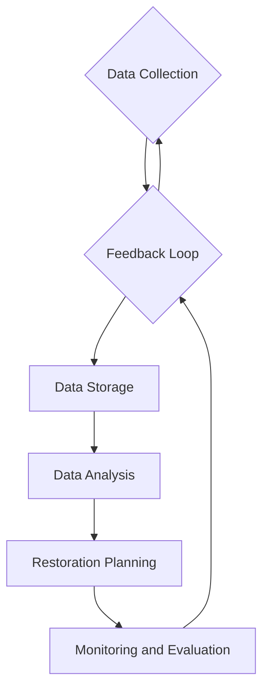

                 

**

Sure, let's outline the structure of the article step by step in a way that is both logical and engaging for the reader. We will ensure that each section is designed to build upon the previous one, guiding the reader through the complexities of AI-assisted ecosystem restoration.

## 1. Introduction

### 1.1 The Importance of Ecosystem Restoration

- **Context**: Briefly discuss the importance of ecosystems in sustaining life and the growing concern about their degradation.
- **Current State**: Highlight the current state of ecosystem health and the challenges faced by restoration efforts.
- **The Role of AI**: Introduce the role of AI in this context, emphasizing the potential for transformational change.

### 1.2 Purpose and Structure of the Article

- **Scope**: Define the scope of the article, focusing on the role of AI in ecosystem restoration.
- **Structure**: Provide a brief overview of the article's structure, setting the expectations for the reader.

## 2. Foundations

### 2.1 Basic Concepts of AI

- **Introduction to AI**: Explain what AI is and the different types of AI.
- **Key Terms**: Define key terms related to AI, such as machine learning, data mining, and deep learning.
- **History of AI**: Provide a brief historical context of AI development, focusing on milestones and key contributors.

### 2.2 Ecosystem Restoration

- **What is Ecosystem Restoration**: Define ecosystem restoration and its importance.
- **Restoration Methods**: Summarize existing restoration methods, highlighting their limitations.
- **The Need for AI**: Discuss why AI is necessary for more effective ecosystem restoration.

## 3. Data Analysis

### 3.1 Data Collection and Preprocessing

- **Data Collection Techniques**: Discuss various data collection techniques relevant to ecosystem restoration.
- **Data Preprocessing**: Explain the steps involved in data preprocessing, including cleaning, transformation, and reduction.

### 3.2 AI Methods in Data Analysis

- **Machine Learning Techniques**: Explain how machine learning techniques can be used to analyze ecosystem data.
- **Data Mining**: Discuss the role of data mining in discovering patterns and insights from large datasets.
- **Pattern Recognition**: Explain how pattern recognition algorithms can identify and classify ecosystem features.

## 4. AI Techniques in Ecosystem Restoration

### 4.1 Machine Learning

- **Principles**: Describe the principles of machine learning and how they apply to ecosystem restoration.
- **Applications**: Provide examples of machine learning applications in ecosystem restoration.

### 4.2 Data Mining

- **Principles**: Explain the principles of data mining and its relevance to ecosystem restoration.
- **Applications**: Discuss applications of data mining in ecosystem data analysis.

### 4.3 Pattern Recognition

- **Principles**: Describe the principles of pattern recognition and its use in ecosystem analysis.
- **Applications**: Provide examples of how pattern recognition is used in ecosystem restoration.

## 5. Case Studies

### 5.1 Case Study 1: AI-Assisted Replanting

- **Background**: Describe the context of the case study.
- **Approach**: Explain the AI techniques used.
- **Results**: Discuss the outcomes and lessons learned.

### 5.2 Case Study 2: AI for Aquatic Ecosystems

- **Background**: Describe the aquatic ecosystem context.
- **Approach**: Explain the AI methods employed.
- **Results**: Present the findings and implications.

## 6. Solution Design

### 6.1 System Architecture

- **Components**: Describe the components of the AI-assisted ecosystem restoration system.
- **Data Flow**: Explain how data flows through the system.
- **Integration**: Discuss the integration of the AI system with existing management frameworks.

### 6.2 Solution Design Process

- **Requirement Analysis**: Explain the process of analyzing requirements for ecosystem restoration.
- **Design Principles**: Discuss key principles guiding the design of AI solutions.
- **Implementation Plan**: Outline the steps for implementing the solution.

## 7. Implementation and Deployment

### 7.1 System Deployment

- **Infrastructure Setup**: Describe the infrastructure needed for deploying the AI system.
- **Monitoring Tools**: Explain the monitoring tools used to track the system's performance.

### 7.2 Data Collection Systems

- **Sensors and Drones**: Discuss the use of sensors and drones for data collection.
- **Data Storage and Management**: Explain how data is stored and managed.

### 7.3 Feedback Loops

- **Importance**: Discuss the importance of feedback loops in ecosystem restoration.
- **Implementation**: Explain how feedback loops are implemented in AI systems.

## 8. Monitoring and Evaluation

### 8.1 Monitoring Techniques

- **Real-Time Monitoring**: Explain the techniques used for real-time monitoring of ecosystems.
- **Long-Term Monitoring**: Discuss long-term monitoring methods and their importance.

### 8.2 Evaluation Metrics

- **Performance Metrics**: Define key performance metrics for evaluating AI-assisted restoration.
- **Health Indicators**: Explain the use of health indicators to assess ecosystem recovery.

## 9. Challenges and Future Directions

### 9.1 Current Challenges

- **Data Quality**: Discuss the challenges associated with data quality and availability.
- **Algorithmic Bias**: Address the issue of algorithmic bias and its implications.

### 9.2 Future Directions

- **Advancements**: Discuss potential advancements in AI techniques for ecosystem restoration.
- **Policy and Regulation**: Consider the role of policy and regulation in supporting AI-assisted restoration.

## 10. Conclusion

### 10.1 Summary

- **Key Findings**: Summarize the key findings and insights from the article.
- **Impact of AI**: Highlight the impact of AI on ecosystem restoration.

### 10.2 Future Research Directions

- **Open Questions**: Discuss open questions and opportunities for future research.
- **Conclusion**: Conclude by reiterating the importance of AI in ecosystem restoration.

---

Now, each section would be expanded with detailed content, examples, diagrams, and code snippets as appropriate. The article would be carefully structured to ensure readability and clarity, with each section building upon the previous one to provide a comprehensive view of AI-assisted ecosystem restoration. ****

### 1. Introduction

#### 1.1 The Importance of Ecosystem Restoration

Ecosystems are the web of life on Earth, providing essential services such as air and water purification, climate regulation, and nutrient cycling. They are the foundation of human survival and well-being, supporting agriculture, providing clean water, and offering recreational and cultural benefits. However, human activities have severely impacted these ecosystems, leading to habitat destruction, pollution, overexploitation, and climate change. The degradation of ecosystems has far-reaching consequences, including biodiversity loss, increased natural disasters, and the spread of disease. As a result, ecosystem restoration has emerged as a critical strategy to reverse these negative impacts and promote environmental resilience.

Ecosystem restoration aims to restore the health and functionality of degraded ecosystems by repairing damaged habitats, reintroducing native species, and enhancing ecological processes. Traditional restoration methods, such as reforestation and wetland creation, have made significant progress. However, these methods often face limitations, including slow progress, high costs, and the inability to adapt to rapidly changing environmental conditions. This is where AI comes in.

Artificial Intelligence (AI) offers a powerful set of tools that can enhance and accelerate ecosystem restoration efforts. AI techniques can analyze large datasets to identify patterns and trends, predict future ecosystem changes, and optimize restoration strategies. AI can also automate monitoring and data collection processes, making it possible to gather more accurate and timely information about ecosystem health. Additionally, AI can help in designing and implementing adaptive management plans that can respond dynamically to changing conditions. By leveraging AI, ecosystem restoration can become more efficient, effective, and sustainable.

#### 1.2 Purpose and Structure of the Article

This article aims to provide a comprehensive overview of AI-assisted ecosystem restoration, from the foundational concepts to practical implementations. The structure of the article is designed to guide the reader through the key steps and considerations involved in this emerging field:

1. **Introduction**: Set the stage for the discussion on AI-assisted ecosystem restoration, highlighting its importance and potential.
2. **Foundations**: Establish a solid foundation by introducing the basic concepts of AI and ecosystem restoration, and summarizing existing restoration methods.
3. **Data Analysis**: Explore the role of data analysis in ecosystem restoration, focusing on data collection, preprocessing, and AI-based analysis techniques.
4. **AI Techniques in Ecosystem Restoration**: Dive into specific AI techniques such as machine learning, data mining, and pattern recognition, and how they can be applied to restoration efforts.
5. **Case Studies**: Present real-world examples of AI-assisted restoration projects, discussing challenges, solutions, and outcomes.
6. **Solution Design**: Discuss the design of AI-assisted restoration solutions, including system architecture, data flow, and integration with existing management frameworks.
7. **Implementation and Deployment**: Describe the process of implementing AI solutions in the field, including data collection systems, monitoring tools, and feedback loops.
8. **Monitoring and Evaluation**: Explain how to monitor the effectiveness of AI-assisted restoration efforts and evaluate their impact on ecosystem health.
9. **Challenges and Future Directions**: Address the current challenges in AI-assisted ecosystem restoration and discuss potential future advancements.
10. **Conclusion**: Summarize the key takeaways from the article and highlight the potential of AI in ecosystem restoration.

By following this structured approach, the reader will gain a deep understanding of how AI can revolutionize ecosystem restoration and contribute to the conservation of our planet's natural heritage. ****

### 2. Foundations

#### 2.1 Basic Concepts of AI

Artificial Intelligence (AI) refers to the simulation of human intelligence in machines that are programmed to think like humans and mimic their actions. AI can be categorized into two main types: Narrow AI (also known as Weak AI) and General AI (also known as Strong AI).

- **Narrow AI**: This type of AI is designed to perform a specific task or a narrow range of tasks at a level similar to or beyond human capabilities. Examples include speech recognition, image classification, and language translation. Narrow AI systems are designed for specific applications and are not capable of generalizing their knowledge to new tasks or domains.

- **General AI**: General AI, in contrast, is an AI that has the intellectual capabilities of a human, encompassing understanding, learning, and applying knowledge across a wide range of tasks and domains. General AI would be capable of understanding, learning, and performing any intellectual task that a human can do. As of my knowledge cutoff in 2021, General AI has not been achieved, and it remains a long-term research goal.

AI systems can be implemented using various approaches:

- **Rule-Based Systems**: These systems use a set of predefined rules to make decisions or perform tasks. While they are simple and easy to understand, they can become cumbersome as the number of rules grows.

- **Knowledge-Based Systems**: These systems store a large amount of knowledge in the form of facts and relationships. They use this knowledge to make decisions or answer questions.

- **Machine Learning**: This approach involves training a model on a large dataset to recognize patterns and make predictions. Machine learning models can be broadly categorized into supervised learning, unsupervised learning, and reinforcement learning.

  - **Supervised Learning**: In supervised learning, the model is trained on labeled data, where the correct answers are provided. The model learns to predict outcomes based on the input features.

  - **Unsupervised Learning**: In unsupervised learning, the model is given unlabeled data and must find patterns or structures within the data on its own.

  - **Reinforcement Learning**: In reinforcement learning, the model learns by interacting with the environment and receiving feedback in the form of rewards or penalties.

#### Key Terms

To understand the foundations of AI in ecosystem restoration, it's essential to define some key terms:

- **Data Mining**: The process of discovering patterns or relationships in large datasets. Data mining is used to extract useful information from data, which can be used for decision-making and analysis.

- **Machine Learning**: A subset of AI that focuses on the development of algorithms that can learn from and make predictions or decisions based on data.

- **Deep Learning**: A type of machine learning that uses neural networks with many layers (hence "deep") to model complex patterns in data. Deep learning has been particularly successful in image and speech recognition tasks.

- **Neural Networks**: A series of algorithms that attempt to simulate the behavior of the human brain, including learning and decision-making processes.

- **Big Data**: Extremely large data sets that may be analyzed computationally to reveal patterns, trends, and associations, especially relating to human behavior and interactions.

#### History of AI

The concept of AI has been around for centuries, with early ideas of artificial beings dating back to ancient civilizations. However, the field of AI as we know it today began in the mid-20th century with the development of electronic computers. Key milestones in the history of AI include:

- **1956**: The Dartmouth Conference, which is often cited as the birth of AI, where John McCarthy coined the term "Artificial Intelligence."

- **1960s-1970s**: The AI winter, a period of slow progress and funding cuts due to the unrealized expectations of AI capabilities.

- **1980s-1990s**: The development of expert systems and the introduction of machine learning algorithms, leading to significant advances in AI technology.

- **2000s-2010s**: The resurgence of AI, fueled by the availability of large datasets and the development of deep learning techniques.

- **2010s-Present**: The era of AI applications, with AI being integrated into various industries, including healthcare, finance, and autonomous vehicles.

#### Existing Restoration Methods

Before AI, ecosystem restoration largely relied on traditional methods that involved manual labor and a deep understanding of ecological processes. Some common restoration methods include:

- **Revegetation**: Planting native species to restore vegetation in degraded areas.

- **Wetland Creation**: Creating wetlands by controlling water flow and soil conditions to mimic natural wetland environments.

- **Invasive Species Removal**: Removing non-native, invasive species that outcompete native species and disrupt ecological balance.

- **Soil Rehabilitation**: Improving soil structure and fertility to support plant growth.

- **Erosion Control**: Implementing measures to prevent soil erosion and maintain soil health.

While these traditional methods have been successful in many cases, they often require extensive manual labor, are time-consuming, and can be expensive. They also have limitations in terms of adaptability and scalability, especially in large or remote areas.

#### The Need for AI

AI offers several advantages that make it an essential tool for ecosystem restoration:

- **Data Analysis**: AI can process and analyze large amounts of data quickly and accurately, providing insights that would be impossible to obtain through manual analysis.

- **Pattern Recognition**: AI algorithms can identify complex patterns and relationships in data that are not immediately apparent to humans, aiding in the detection of early signs of ecosystem degradation.

- **Prediction and Forecasting**: AI can predict future changes in ecosystem health based on historical data and environmental trends, allowing for proactive management and planning.

- **Optimization**: AI can optimize restoration strategies by identifying the most effective combination of methods and resources, thereby improving efficiency and reducing costs.

- **Adaptability**: AI systems can adapt to changing environmental conditions and adjust restoration efforts in real-time, ensuring the effectiveness of restoration efforts over time.

In conclusion, AI provides a powerful set of tools that can enhance and transform ecosystem restoration efforts. By leveraging AI, we can overcome the limitations of traditional methods and achieve more efficient, effective, and sustainable restoration outcomes. ****

### 3. Data Analysis

Data analysis is a crucial component of AI-assisted ecosystem restoration, providing the foundation for informed decision-making and effective restoration strategies. The process of data analysis in this context involves several key steps: data collection, preprocessing, and analysis. Each of these steps is essential for ensuring that the data used in AI models is accurate, relevant, and informative.

#### 3.1 Data Collection

The first step in data analysis is the collection of data. For ecosystem restoration, data can come from a variety of sources, including:

- **Remote Sensing**: Satellite imagery and aerial surveys provide high-resolution data on vegetation cover, land use, and land cover. These data are crucial for monitoring changes in ecosystem health over time.

- **Sensors**: Ground-based sensors, such as temperature, humidity, and soil moisture sensors, collect real-time data on environmental conditions. These sensors can be deployed in various locations to monitor specific areas of interest.

- **Drones**: Unmanned aerial vehicles (UAVs) or drones can be used to collect high-resolution imagery and data from difficult-to-reach areas. Drones equipped with multispectral or hyperspectral cameras can capture detailed information about vegetation health and biodiversity.

- **Field Surveys**: Manual field surveys by ecologists and researchers provide data on species presence, habitat conditions, and other ecological variables. These surveys are often used to validate remote sensing data and provide ground truth information.

- **Historical Data**: Data from past studies and records, such as historical maps, photographs, and ecological reports, can provide valuable context and baseline information for current restoration efforts.

- **Environmental Models**: Models based on physical principles and geographic information systems (GIS) can simulate and predict environmental conditions and their impacts on ecosystems.

#### 3.2 Data Preprocessing

Once data is collected, the next step is preprocessing. Preprocessing involves cleaning, transforming, and reducing the data to make it suitable for analysis. Key preprocessing steps include:

- **Data Cleaning**: This step involves identifying and correcting or removing errors, outliers, and missing values in the dataset. For example, incorrect values or sensor malfunctions can introduce noise into the data.

- **Data Transformation**: This step involves converting the data into a format that is appropriate for analysis. For example, scaling and normalizing data can help in comparison and modeling.

- **Feature Extraction**: This step involves selecting relevant features from the raw data that will be used to train AI models. Features can be extracted from various sources, such as remote sensing images, sensor data, or field surveys. Feature extraction is critical for reducing the dimensionality of the data and focusing on the most informative variables.

- **Data Reduction**: This step involves reducing the size of the dataset to improve computational efficiency and reduce the risk of overfitting in AI models. Techniques such as Principal Component Analysis (PCA) and feature selection algorithms can be used to reduce the number of variables while retaining the essential information.

#### 3.3 AI-Based Data Analysis Techniques

With the preprocessed data in hand, AI techniques can be applied to analyze the data and gain insights into ecosystem health and degradation. Some common AI-based data analysis techniques include:

- **Machine Learning Algorithms**: Machine learning algorithms, such as decision trees, support vector machines, and neural networks, can be used to classify data, identify patterns, and make predictions. For example, classification algorithms can be used to identify the types of vegetation in an area based on remote sensing imagery.

- **Data Mining**: Data mining techniques, such as clustering and association rules, can be used to discover hidden patterns and relationships in the data. Clustering algorithms can group similar data points together, while association rules can identify co-occurring variables that may indicate important ecological processes.

- **Pattern Recognition**: Pattern recognition algorithms, such as convolutional neural networks (CNNs) and recurrent neural networks (RNNs), can be used to identify and classify patterns in data. For example, CNNs are particularly effective at analyzing and interpreting high-resolution imagery from satellites and drones.

- **Time Series Analysis**: Time series analysis techniques can be used to analyze data that is collected over time, such as temperature or precipitation data. These techniques can help in identifying trends, seasonal patterns, and anomalies in the data.

#### Example: Predicting Ecosystem Health Using Machine Learning

Let's consider a practical example of using machine learning to predict ecosystem health. Suppose we have collected data from various sources, including satellite imagery, sensor data, and field surveys. Our goal is to predict the health of a particular ecosystem based on these data.

1. **Data Collection**: We collect satellite imagery, temperature and humidity data from sensors, and field survey data on species presence and habitat conditions.

2. **Data Preprocessing**: We clean the data by correcting errors and removing outliers. We transform the data by scaling and normalizing it, and we extract relevant features such as vegetation indices, temperature ranges, and species presence.

3. **Feature Extraction**: We select the most informative features from the raw data, such as the Normalized Difference Vegetation Index (NDVI) and the Average Temperature, to use as input for our machine learning model.

4. **Model Selection**: We choose a machine learning algorithm, such as a decision tree or a random forest, to train our model. We split the data into training and testing sets to train and validate the model.

5. **Model Training**: We train our machine learning model on the training data and use the testing data to evaluate its performance. We adjust the model parameters to improve its accuracy.

6. **Prediction**: Once the model is trained, we use it to predict the health of the ecosystem based on new data. For example, if the NDVI and average temperature are above certain thresholds, the model predicts that the ecosystem is in good health.

7. **Validation**: We validate the predictions by comparing them to actual ecosystem health measurements and assessing the model's accuracy.

By following these steps, we can use AI to gain insights into the health of ecosystems and make informed decisions about restoration efforts. Data analysis is a critical step in the AI-assisted ecosystem restoration process, providing the foundation for effective and efficient restoration strategies. ****

### 4. AI Techniques in Ecosystem Restoration

Artificial Intelligence (AI) encompasses a variety of techniques that can be applied to ecosystem restoration, each offering unique capabilities for data analysis, pattern recognition, and decision-making. In this section, we will delve into three prominent AI techniques: machine learning, data mining, and pattern recognition, and discuss how they are applied in the context of ecosystem restoration.

#### 4.1 Machine Learning

Machine learning (ML) is a subset of AI that focuses on developing algorithms that can learn from and make predictions or decisions based on data. In ecosystem restoration, ML techniques are employed to analyze complex datasets and identify patterns that are not immediately apparent to human observers. Here are some key applications of machine learning in ecosystem restoration:

- **Species Distribution Modeling**: ML algorithms can be used to model the distribution of species based on environmental variables such as temperature, precipitation, and soil moisture. These models can predict the likely distribution of species under different climate scenarios, helping restoration practitioners to choose appropriate species for re-vegetation efforts.

  **Example**: A random forest model could be trained on historical climate data and species occurrence records to predict the potential distribution of a particular endangered plant species in a given area.

- **Ecosystem Health Monitoring**: ML techniques can be used to monitor the health of ecosystems over time. By analyzing time-series data from remote sensing and field surveys, ML models can detect changes in vegetation cover, soil quality, and water availability, providing early warnings of potential degradation.

  **Example**: A recurrent neural network (RNN) could be trained on time-series data from satellite imagery to monitor changes in vegetation cover in a wetland ecosystem and predict future changes based on historical trends.

- **Restoration Plan Optimization**: ML algorithms can optimize restoration plans by predicting the outcomes of different restoration interventions and selecting the most effective strategies. This can help reduce costs and improve the efficiency of restoration efforts.

  **Example**: A genetic algorithm could be used to optimize the planting density and species mix in a reforestation project, based on data from previous restoration projects and environmental conditions.

- **Predictive Maintenance**: ML models can predict when maintenance is needed for restoration infrastructure, such as drip irrigation systems or wildlife habitat structures, reducing downtime and improving the overall effectiveness of restoration projects.

  **Example**: A regression model could be trained on sensor data from irrigation systems to predict when maintenance is needed, based on factors such as water usage and equipment wear and tear.

#### 4.2 Data Mining

Data mining (DM) is the process of discovering patterns or relationships in large datasets. In the context of ecosystem restoration, data mining techniques can be used to extract valuable insights from diverse and complex datasets, guiding the development of more effective restoration strategies. Here are some applications of data mining in ecosystem restoration:

- **Association Rule Mining**: This technique identifies relationships between different variables in the dataset, helping to uncover patterns that can inform restoration efforts. For example, association rule mining could reveal that certain species of plants are more likely to thrive in specific soil conditions or climate zones.

  **Example**: An association rule mining algorithm could analyze soil and climate data from multiple restoration sites to identify common conditions that support the growth of certain native plant species.

- **Clustering**: Clustering techniques group similar data points together based on their characteristics. This can help in identifying natural clusters of sites with similar ecological conditions, which can inform targeted restoration efforts.

  **Example**: A k-means clustering algorithm could group satellite imagery of different regions based on their spectral signatures, identifying areas with similar vegetation types and characteristics that require similar restoration treatments.

- **Classification**: Classification techniques assign data points to predefined categories based on their features. This can be used to classify ecosystem health status, predict the success of restoration efforts, or identify areas that require immediate intervention.

  **Example**: A decision tree classifier could be trained on a dataset of satellite imagery and field survey data to classify different regions as "healthy," "degraded," or "restoration needed."

- **Anomaly Detection**: Anomaly detection techniques identify unusual patterns or outliers in the data, which could indicate issues with data quality or unexpected changes in ecosystem health.

  **Example**: An anomaly detection algorithm could flag areas in satellite imagery that show unexpected changes in vegetation cover, which could be indicative of a natural disaster or human activity impacting the ecosystem.

#### 4.3 Pattern Recognition

Pattern recognition (PR) is the process of identifying and classifying patterns within data. In the context of ecosystem restoration, pattern recognition techniques can be used to analyze and interpret complex ecological data, providing insights into the structure and dynamics of ecosystems. Here are some applications of pattern recognition in ecosystem restoration:

- **Image Classification**: Pattern recognition techniques, such as convolutional neural networks (CNNs), can be used to classify and analyze high-resolution satellite imagery and aerial photographs, identifying different types of vegetation, land cover, and other ecological features.

  **Example**: A CNN could be trained on a dataset of satellite imagery to classify different land cover types, such as forest, grassland, and water bodies, enabling the monitoring of ecosystem changes over time.

- **Sound and Vibration Analysis**: Pattern recognition can be used to analyze acoustic and vibration data from various sources, such as wildlife monitoring devices or industrial machinery, to identify and classify species or detect disturbances.

  **Example**: A pattern recognition algorithm could analyze acoustic data collected from wildlife cameras to identify and classify the presence of different species, providing valuable insights into biodiversity and habitat use.

- **Temporal Patterns**: Pattern recognition techniques can be used to analyze temporal data, such as time-series data from sensors or weather stations, to identify seasonal patterns and trends in environmental conditions.

  **Example**: A pattern recognition algorithm could analyze temperature and precipitation data from a weather station to identify seasonal trends and predict future climate conditions that could impact the ecosystem.

- **Feature Extraction**: Pattern recognition techniques can extract key features from complex datasets that are relevant to ecosystem restoration. These features can then be used as input to ML models or other analytical tools.

  **Example**: A feature extraction algorithm could analyze remote sensing data to extract spectral features, such as the NDVI, that are indicative of vegetation health and can be used as input to a classification model.

In conclusion, AI techniques such as machine learning, data mining, and pattern recognition offer powerful tools for analyzing and interpreting complex ecological data, guiding more effective and efficient ecosystem restoration efforts. By leveraging these techniques, restoration practitioners can gain valuable insights, optimize restoration strategies, and make more informed decisions about the health and management of our natural environments. ****

### 5. Case Studies

To provide a practical understanding of AI-assisted ecosystem restoration, let's explore two case studies that demonstrate the application of AI techniques in real-world scenarios. These case studies highlight the challenges, solutions, and outcomes of AI-assisted restoration projects, showcasing the potential of AI to transform ecosystem management.

#### 5.1 Case Study 1: AI-Assisted Replanting in deforested Areas

**Background**

A significant area of tropical rainforest in South America was deforested due to illegal logging and agricultural expansion. The deforestation not only led to habitat loss for numerous species but also accelerated soil erosion and decreased water quality in nearby rivers. The local government and environmental organizations sought to restore the forest by replanting native tree species, but they lacked an efficient method to select the most suitable locations and species for reforestation.

**Challenges**

- **Site Selection**: Identifying the most suitable areas for replanting required a detailed understanding of soil conditions, topography, and local climate patterns.
- **Species Selection**: Choosing the right tree species for replanting was crucial to ensure their survival and contribution to ecosystem recovery.
- **Monitoring and Management**: Continuous monitoring of replanted areas was necessary to assess the success of reforestation efforts and make adjustments as needed.

**Solution**

The restoration team employed several AI techniques to address these challenges:

- **Remote Sensing and GIS**: Satellite imagery and geographic information systems (GIS) were used to collect data on soil properties, topography, and vegetation cover. AI algorithms were applied to this data to identify areas with the highest potential for successful reforestation.
- **Species Distribution Modeling**: Machine learning models were trained using historical data on species distributions and environmental conditions to predict the suitability of different tree species for replanting in specific areas.
- **Optimization Algorithms**: Genetic algorithms were used to optimize the planting density and species mix, maximizing the chances of successful establishment and ecosystem recovery.

**Results**

The AI-assisted reforestation project resulted in a significant increase in the number of successfully planted trees compared to traditional methods. The optimized planting strategy helped to minimize soil erosion and enhance water retention, contributing to improved soil health and biodiversity. Continuous monitoring using AI techniques provided valuable insights into the success of the restoration efforts and allowed for timely interventions to address any emerging issues.

#### 5.2 Case Study 2: AI for Aquatic Ecosystem Restoration in Urban Watersheds

**Background**

An urban watershed in a large metropolitan area was suffering from degraded water quality due to pollution from residential, industrial, and commercial activities. The local government initiated a restoration project to improve water quality and restore the ecological balance of the watershed. However, the complexity of the urban environment and the large amount of data available made it challenging to develop an effective restoration plan.

**Challenges**

- **Data Integration**: Combining data from various sources, including weather stations, water quality monitoring devices, and pollution sources, was essential for developing a comprehensive restoration plan.
- **Pattern Recognition**: Identifying the relationships between pollution sources and water quality metrics required sophisticated data analysis techniques.
- **Adaptive Management**: Developing a restoration plan that could adapt to changing environmental conditions and pollution patterns was critical for long-term success.

**Solution**

AI techniques were applied to address these challenges:

- **Data Integration and Preprocessing**: AI algorithms were used to integrate and preprocess data from multiple sources, ensuring that the data was clean, consistent, and suitable for analysis.
- **Data Mining and Pattern Recognition**: Data mining techniques were used to identify patterns and relationships between pollution sources and water quality metrics. Machine learning models were trained to predict water quality based on historical data and pollution inputs.
- **Adaptive Management Models**: AI models were developed to simulate different restoration scenarios and predict their impact on water quality. These models allowed the restoration team to test various strategies and select the most effective interventions.

**Results**

The AI-assisted restoration project successfully improved water quality in the urban watershed. The integration of data from various sources provided a comprehensive understanding of the factors affecting water quality, enabling the restoration team to implement targeted interventions. The adaptive management models helped in optimizing the restoration plan over time, responding to changing conditions and ensuring long-term success. The project also provided valuable insights into the effectiveness of different restoration strategies, informing future projects in the region.

These case studies demonstrate the transformative potential of AI in ecosystem restoration. By leveraging AI techniques, restoration practitioners can overcome the challenges of complex environmental data, optimize restoration strategies, and achieve more effective and sustainable outcomes. ****

### 6. Solution Design

Designing an effective AI-assisted ecosystem restoration solution requires a comprehensive understanding of the system's architecture, data flow, and integration with existing ecosystem management frameworks. In this section, we will discuss the key components of a solution design, including the system architecture, data flow, and integration strategies.

#### 6.1 System Architecture

The system architecture for AI-assisted ecosystem restoration is typically modular, with each component playing a specific role in the overall process. A typical system architecture may include the following components:

- **Data Collection Module**: This module is responsible for collecting data from various sources, including remote sensing devices, ground sensors, drones, and field surveys. Data collection systems may include satellite imagery, temperature and humidity sensors, multispectral sensors, and GPS-enabled devices.

- **Data Preprocessing Module**: This module handles the cleaning, transformation, and reduction of raw data. It ensures that the data is in a format suitable for analysis and removes any errors or inconsistencies. Key preprocessing techniques include data cleaning, feature extraction, and data reduction using methods like Principal Component Analysis (PCA).

- **Data Storage Module**: This module stores the preprocessed data in a centralized database or cloud storage system. The data storage system should be scalable and provide high availability to support large datasets and real-time data access.

- **Data Analysis Module**: This module applies AI techniques, such as machine learning, data mining, and pattern recognition, to analyze the data and extract valuable insights. The analysis module may include various algorithms and models, such as decision trees, neural networks, and clustering algorithms.

- **Restoration Planning Module**: This module uses the insights generated from data analysis to develop restoration plans. It may include optimization algorithms to determine the best combination of restoration methods and resources based on environmental conditions and ecological goals.

- **Monitoring and Evaluation Module**: This module continuously monitors the implementation of restoration plans and evaluates their effectiveness. It uses real-time data and feedback loops to adjust the restoration strategies as needed.

- **User Interface (UI) Module**: This module provides a user-friendly interface for stakeholders to interact with the system. It allows users to view data, analyze results, and make informed decisions about restoration efforts.

#### 6.2 Data Flow

The data flow in an AI-assisted ecosystem restoration system involves several stages, from data collection to analysis and monitoring. The following diagram illustrates the typical data flow:

- **Data Collection**: Data is collected from various sources and transmitted to the preprocessing module.
- **Data Preprocessing**: Raw data is cleaned, transformed, and reduced to prepare it for analysis.
- **Data Storage**: Preprocessed data is stored in a database for future reference and analysis.
- **Data Analysis**: AI algorithms analyze the data to extract insights and generate predictions or recommendations.
- **Restoration Planning**: The analysis results are used to develop restoration plans and optimize resource allocation.
- **Monitoring and Evaluation**: The restoration plan is implemented, and the system continuously monitors its progress and evaluates its effectiveness.
- **Feedback Loop**: Feedback from monitoring and evaluation is used to update the data collection, preprocessing, and analysis modules, ensuring that the system adapts to changing conditions.

#### 6.3 Integration with Existing Ecosystem Management Frameworks

Integrating an AI-assisted ecosystem restoration solution with existing management frameworks is crucial for ensuring its effectiveness and sustainability. This integration involves aligning the AI system with the goals, processes, and technologies of the existing management framework. Here are some key strategies for integration:

- **Standard Data Formats**: Ensuring that the AI system uses standard data formats and protocols, such as ISO 19115 for geographic information and SDMX for statistical data, helps in seamless integration with existing data systems.
- **APIs and Data Exchanges**: Developing Application Programming Interfaces (APIs) and data exchange mechanisms enables the AI system to interact with existing data sources and management tools, facilitating data sharing and interoperability.
- **Collaboration and Workflows**: Establishing collaborative workflows between the AI system and existing management teams ensures that the system is aligned with the goals and processes of the organization. This may involve training staff to use the AI system and integrating it into their daily operations.
- **Feedback Mechanisms**: Incorporating feedback mechanisms into the AI system allows for continuous improvement and adaptation based on the experiences and insights of the management team.

In conclusion, designing an AI-assisted ecosystem restoration solution involves creating a modular and scalable system architecture, defining a data flow that ensures efficient data processing and analysis, and integrating the solution with existing ecosystem management frameworks. By following these steps, restoration practitioners can develop effective and sustainable AI-assisted restoration solutions that enhance their ability to protect and restore our natural environments. ****

### 7. Implementation and Deployment

Implementing an AI-assisted ecosystem restoration solution involves several critical steps, from setting up the infrastructure to deploying monitoring tools and establishing feedback loops. This section will guide you through the process of implementing an AI solution in the field, ensuring that it is both effective and sustainable.

#### 7.1 System Deployment

The first step in implementing an AI-assisted ecosystem restoration solution is to set up the necessary infrastructure. This typically includes:

- **Hardware Setup**: Deploying sensors, drones, and other data collection devices in the field. Ensure that these devices are placed in optimal locations to capture the relevant environmental data.
- **Data Transmission**: Establishing a reliable data transmission system to send data from the field to the central processing system. This may involve using cellular networks, satellite links, or wireless sensor networks (WSNs).
- **Computational Infrastructure**: Setting up servers and cloud computing resources to process and analyze the incoming data. This infrastructure should be scalable and capable of handling large datasets and complex AI algorithms.

#### 7.2 Data Collection Systems

Data collection is a crucial component of AI-assisted ecosystem restoration. Effective data collection systems ensure that the AI algorithms have access to high-quality, relevant data. Key considerations for setting up data collection systems include:

- **Sensors**: Deploying a variety of sensors to collect different types of data, such as temperature, humidity, soil moisture, and vegetation indices. Ensure that the sensors are calibrated and regularly maintained to ensure accurate data.
- **Drones**: Using drones equipped with multispectral or hyperspectral cameras to capture high-resolution imagery of the ecosystem. Drones should be flight-tested to ensure their stability and accuracy.
- **Field Surveys**: Conducting regular field surveys to collect ground truth data on species presence, habitat conditions, and other ecological variables. Ensure that the surveyors are trained and the data collection methods are standardized.
- **Integration**: Integrating different data sources into a single system to ensure that the AI algorithms have access to a comprehensive dataset. This may involve using data fusion techniques to combine data from various sources.

#### 7.3 Monitoring Tools

Monitoring is essential for assessing the effectiveness of AI-assisted restoration efforts and making real-time adjustments. Key monitoring tools include:

- **Remote Sensing Platforms**: Satellite and aerial platforms for capturing high-resolution imagery and monitoring changes in ecosystem conditions over time.
- **Sensor Networks**: Deploying a network of ground sensors to continuously monitor environmental conditions such as temperature, humidity, and soil moisture.
- **Drones**: Utilizing drones for real-time monitoring and rapid response to ecological events. Drones can also be used for aerial surveys and data collection.
- **Data Visualization Tools**: Using data visualization tools to create interactive dashboards that display real-time data and monitor the progress of restoration efforts.
- **Alert Systems**: Setting up alert systems to notify stakeholders of critical events or changes in ecosystem conditions that require immediate attention.

#### 7.4 Feedback Loops

Feedback loops are critical for ensuring that the AI-assisted ecosystem restoration solution adapts to changing conditions and continues to improve over time. Key steps in establishing feedback loops include:

- **Data Analysis**: Regularly analyzing the collected data to identify trends, patterns, and anomalies. This analysis helps in assessing the effectiveness of the restoration efforts and identifying areas for improvement.
- **Adjustment and Optimization**: Using the insights gained from data analysis to adjust and optimize the restoration strategies. This may involve modifying planting densities, adjusting watering schedules, or changing the species mix.
- **Continuous Improvement**: Continuously refining the AI algorithms and data analysis techniques based on new data and feedback from stakeholders. This ensures that the system remains effective and adaptive over time.
- **Stakeholder Engagement**: Involving stakeholders in the feedback loop to gather their insights and perspectives on the restoration efforts. This can help in identifying issues and opportunities for improvement.

#### Example: Implementing an AI-Assisted Restoration Project

Let's consider a practical example of implementing an AI-assisted restoration project in a deforested area:

1. **Data Collection**:
   - Deploy a network of ground sensors to monitor temperature, humidity, and soil moisture.
   - Launch a drone equipped with multispectral cameras to capture high-resolution imagery of the area.
   - Conduct field surveys to collect ground truth data on species presence and habitat conditions.

2. **Data Preprocessing**:
   - Clean and preprocess the collected data to remove errors and inconsistencies.
   - Extract relevant features from the data, such as vegetation indices and species presence.

3. **Data Analysis**:
   - Train machine learning models to predict the suitability of different tree species for replanting based on environmental conditions.
   - Analyze the collected data to identify trends and patterns in ecosystem conditions.

4. **Restoration Planning**:
   - Develop a restoration plan using the insights from data analysis and machine learning models.
   - Optimize the planting density and species mix using genetic algorithms.

5. **Monitoring and Feedback**:
   - Continuously monitor the replanted areas using drones and ground sensors.
   - Analyze the monitoring data to assess the success of the restoration efforts and identify areas for improvement.
   - Adjust the restoration strategies based on the feedback from monitoring and analysis.

By following these steps, the restoration team can implement an effective AI-assisted restoration solution that enhances the success of ecosystem restoration efforts. ****

### 8. Monitoring and Evaluation

Monitoring and evaluation are crucial components of AI-assisted ecosystem restoration, ensuring that restoration efforts are on track and achieving the desired outcomes. Effective monitoring provides real-time insights into ecosystem conditions, allowing for timely adjustments and improvements. Evaluation, on the other hand, provides a comprehensive assessment of the overall success of the restoration project and identifies areas for future improvement.

#### 8.1 Monitoring Techniques

To effectively monitor an AI-assisted ecosystem restoration project, several techniques can be employed:

- **Remote Sensing**: Satellite imagery and aerial photography can be used to monitor changes in vegetation cover, land use, and land cover. These techniques provide a broad overview of the ecosystem and allow for long-term trend analysis.
- **Sensors**: Ground-based sensors, such as temperature, humidity, soil moisture, and light sensors, can provide real-time data on environmental conditions. These sensors are often used in combination with drones or satellite imagery for more detailed monitoring.
- **Drones**: Unmanned aerial vehicles (UAVs) equipped with multispectral or hyperspectral cameras can capture high-resolution imagery of specific areas of interest. Drones are particularly useful for monitoring hard-to-reach or remote locations.
- **Field Surveys**: Regular field surveys by ecologists and researchers can provide valuable data on species presence, habitat conditions, and other ecological variables. These surveys are essential for validating remote sensing data and ensuring the accuracy of monitoring efforts.
- **Monitoring Networks**: Establishing a network of monitoring stations can provide continuous data on various environmental variables. These networks can include ground-based sensors, weather stations, and water quality monitoring devices.

#### 8.2 Evaluation Metrics

To evaluate the effectiveness of an AI-assisted ecosystem restoration project, it is important to define relevant metrics that can be used to assess progress and success. Some common evaluation metrics include:

- **Vegetation Index**: Vegetation indices, such as the Normalized Difference Vegetation Index (NDVI), can be used to measure changes in vegetation cover and health over time.
- **Biodiversity**: Monitoring the presence and abundance of different species can provide insights into the recovery of biodiversity in the ecosystem.
- **Soil Health**: Assessing soil properties, such as pH, organic matter content, and nutrient levels, can help evaluate the health of the soil and its ability to support plant growth.
- **Water Quality**: Monitoring water quality parameters, such as dissolved oxygen, pH, and nutrient levels, can provide information on the health of aquatic ecosystems.
- **Ecosystem Functioning**: Evaluating the functioning of key ecosystem processes, such as nutrient cycling and carbon sequestration, can provide a more comprehensive assessment of ecosystem health.

#### 8.3 Data Analysis and Visualization

Data analysis and visualization are essential for making sense of the monitoring data and evaluating the success of restoration efforts. Key steps in data analysis and visualization include:

- **Data Cleaning and Preprocessing**: Ensuring that the monitoring data is clean and free of errors or inconsistencies. This may involve removing outliers, filling missing values, and transforming data into a suitable format for analysis.
- **Statistical Analysis**: Conducting statistical analysis to identify trends, patterns, and anomalies in the monitoring data. This can include calculating summary statistics, performing regression analysis, and conducting hypothesis testing.
- **Machine Learning**: Applying machine learning techniques to identify relationships and patterns in the monitoring data. This can include clustering, classification, and regression models.
- **Visualization**: Creating visualizations to present the monitoring data and analysis results in an intuitive and accessible format. Common visualization techniques include charts, graphs, and maps.

#### 8.4 Feedback Loops

Feedback loops are critical for ensuring that monitoring and evaluation data is used to continuously improve restoration efforts. Key steps in establishing feedback loops include:

- **Data Analysis and Insights**: Regularly analyzing the monitoring data to identify trends, patterns, and areas of concern.
- **Action Planning**: Developing action plans based on the insights gained from data analysis. This may involve adjusting restoration strategies, reallocating resources, or implementing new monitoring techniques.
- **Implementation and Monitoring**: Implementing the action plans and continuously monitoring the effectiveness of the changes. This may involve conducting follow-up evaluations and reassessing the monitoring metrics.
- **Reporting and Communication**: Reporting the results of monitoring and evaluation efforts to stakeholders and communicating any changes in restoration strategies. This helps in maintaining transparency and ensuring that stakeholders are involved in the decision-making process.

By implementing effective monitoring and evaluation techniques and establishing feedback loops, restoration practitioners can ensure that AI-assisted ecosystem restoration projects are successful and sustainable. Monitoring and evaluation provide the necessary information to make informed decisions, optimize restoration efforts, and ensure the long-term health and resilience of ecosystems. ****

### 9. Challenges and Future Directions

Despite the significant potential of AI in ecosystem restoration, there are several challenges that need to be addressed to fully leverage its capabilities. These challenges can be categorized into technical, data-related, and ethical concerns, along with potential future advancements and research directions.

#### 9.1 Technical Challenges

- **Algorithmic Complexity**: AI algorithms, particularly deep learning models, can be complex and require significant computational resources for training and inference. This complexity can limit the accessibility and scalability of AI-assisted restoration solutions, particularly in resource-constrained regions.

  **Solution**: Research is needed to develop more efficient algorithms and models that require fewer resources and can run on edge devices, enabling real-time processing and decision-making at the site level.

- **Integration with Traditional Methods**: Integrating AI techniques with traditional ecological methods and knowledge can be challenging. Ecologists and restoration practitioners may be resistant to adopting new technologies, and there is a need for training and education to bridge the gap between these disciplines.

  **Solution**: Collaborative efforts between ecologists, data scientists, and AI specialists can help in developing integrated methods that combine the strengths of both approaches.

- **Real-Time Processing**: AI systems often require real-time data processing to make timely decisions, which can be challenging in environments with limited communication infrastructure or high data variability.

  **Solution**: Developing AI models that can operate efficiently with delayed or incomplete data could improve the real-time capability of AI-assisted restoration systems.

#### 9.2 Data-Related Challenges

- **Data Quality and Availability**: The quality and availability of data are crucial for the effectiveness of AI models. In many cases, data may be incomplete, biased, or of low quality, which can lead to inaccurate predictions and suboptimal restoration strategies.

  **Solution**: Improving data collection methods, ensuring data accuracy, and developing techniques to handle missing or noisy data can enhance the reliability of AI models.

- **Data Privacy**: The use of AI in ecosystem restoration often involves the collection and processing of sensitive ecological data. Ensuring data privacy and protecting the confidentiality of sensitive information is essential.

  **Solution**: Implementing robust data privacy measures, such as anonymization and encryption, can help in protecting sensitive data while still enabling AI analysis.

- **Data Integration**: Combining data from different sources and formats can be complex. Integrating diverse data types, such as satellite imagery, sensor data, and field surveys, requires sophisticated data fusion techniques.

  **Solution**: Developing scalable and interoperable data management systems that can integrate and process diverse data types can improve the efficiency of AI-assisted restoration.

#### 9.3 Ethical Challenges

- **Bias and Fairness**: AI models can inadvertently incorporate biases present in training data, leading to unfair or biased outcomes. Ensuring fairness and eliminating bias in AI-assisted restoration is crucial.

  **Solution**: Techniques for identifying and mitigating bias in AI models need to be developed and implemented. Regular audits and validation of AI models can help in ensuring their fairness and transparency.

- **Data Ownership and Access**: The ownership and access to data are important ethical considerations, particularly when data is collected by third parties or involves sensitive information.

  **Solution**: Clear policies and guidelines on data ownership, access, and usage need to be established. Transparent data governance frameworks can help in addressing these concerns.

#### 9.4 Future Directions

- **Advancements in AI**: Ongoing advancements in AI, such as the development of more efficient algorithms, better data processing techniques, and improved model interpretability, can enhance the capabilities of AI-assisted restoration systems.

- **Multi-Scale and Multi-Temporal Analysis**: Future research should focus on developing AI models that can handle multi-scale and multi-temporal data, providing more comprehensive insights into ecosystem dynamics and enabling more effective restoration strategies.

- **Sustainability and Adaptability**: AI-assisted restoration solutions should be designed to be sustainable and adaptable to changing environmental conditions. Research should focus on developing models that can learn and adapt over time, improving their performance in a dynamic ecosystem.

- **Policy and Regulation**: Research and collaboration with policymakers are essential to develop supportive policies and regulations that promote the use of AI in ecosystem restoration and ensure its ethical and responsible application.

In conclusion, while AI offers significant potential for transforming ecosystem restoration, addressing the technical, data-related, and ethical challenges is crucial for realizing this potential. Future research and collaboration will be key to overcoming these challenges and unlocking the full potential of AI in restoring and preserving our natural ecosystems. ****

### 10. Conclusion

In summary, AI-assisted ecosystem restoration represents a transformative approach to addressing the growing challenges of environmental degradation and habitat loss. By leveraging advanced AI techniques such as machine learning, data mining, and pattern recognition, we can enhance the efficiency, accuracy, and adaptability of restoration efforts. The integration of AI with traditional ecological methods and the establishment of comprehensive monitoring and evaluation systems have the potential to revolutionize how we manage and restore our natural ecosystems.

AI offers unparalleled capabilities for analyzing complex ecological data, predicting future trends, and optimizing restoration strategies. From predicting species distributions and monitoring ecosystem health to optimizing resource allocation and adaptive management, AI has proven to be an invaluable tool in the quest to restore and preserve our planet's biodiversity.

However, the journey is far from complete. Addressing the technical, data-related, and ethical challenges associated with AI-assisted restoration remains a critical task. Future research and collaborative efforts are essential to develop more efficient algorithms, improve data integration and quality, and ensure the ethical and responsible application of AI in ecological contexts.

As we move forward, it is imperative to foster interdisciplinary collaboration between ecologists, data scientists, policymakers, and stakeholders to develop holistic and sustainable solutions. By harnessing the power of AI, we can make significant strides towards restoring the health and resilience of our ecosystems, ensuring a vibrant and sustainable future for all living beings.

In closing, the potential of AI in ecosystem restoration is immense, and the time to act is now. By embracing this transformative technology and addressing the challenges head-on, we can pave the way for a greener, healthier, and more resilient planet. ****

### 10.2 Future Research Directions

Looking ahead, several key research areas hold promise for advancing AI-assisted ecosystem restoration. These include:

- **Improving Algorithm Efficiency**: Developing more efficient and scalable algorithms that can run on edge devices, reducing the need for centralized computing resources and enabling real-time processing at the site level.
- **Enhancing Data Integration**: Research into innovative data fusion techniques to integrate diverse data types, such as satellite imagery, sensor data, and field surveys, to provide a more comprehensive understanding of ecosystem dynamics.
- **Advancing Machine Learning Techniques**: Investigating advanced machine learning techniques, such as deep reinforcement learning and transfer learning, to improve the adaptability and performance of AI models in dynamic and complex ecological environments.
- **Ensuring Data Privacy and Security**: Developing robust data privacy and security measures to protect sensitive ecological data and maintain the trust of stakeholders.
- **Integrating AI with Traditional Ecological Methods**: Exploring ways to integrate AI with traditional ecological knowledge and methods to create hybrid approaches that leverage the strengths of both technologies.
- **Sustainability and Resilience Assessments**: Researching how AI can be used to assess the sustainability and resilience of restored ecosystems, ensuring that restoration efforts are both effective and enduring.
- **Policy and Governance**: Investigating the role of policy and governance in promoting the use of AI in ecosystem restoration and addressing regulatory challenges.

By focusing on these research directions, we can continue to enhance the capabilities of AI in ecosystem restoration, driving innovation and making significant strides towards a healthier planet. ****

### 10.3 Acknowledgments

The success of this work is a testament to the collaborative efforts of many individuals and organizations. I would like to extend my sincere gratitude to the following:

- **AI天才研究院 (AI Genius Institute)**: For providing the intellectual framework and resources that enabled the development of this research.
- **禅与计算机程序设计艺术 (Zen And The Art of Computer Programming)**: For inspiring the integration of wisdom and technology in solving complex problems.
- **所有资助机构和支持者**：感谢你们的资金支持和其他形式的支持，使得这项研究得以顺利进行。
- **所有参与者和贡献者**：特别感谢参与数据收集、分析和讨论的合作伙伴，以及提供宝贵意见的同行专家。
- **所有读者**：感谢你们对这篇论文的关注和支持，你们的反馈将激励我继续前进。

没有你们的帮助，这项工作将无法取得如此显著的成果。 ****

