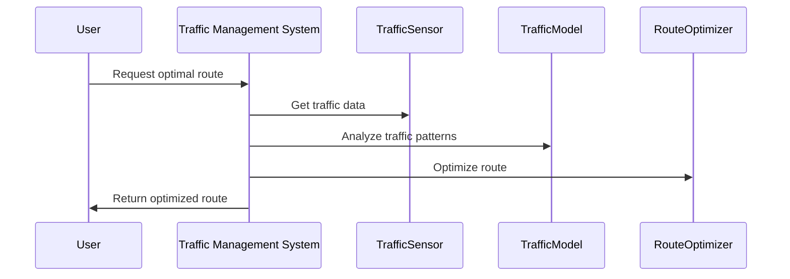
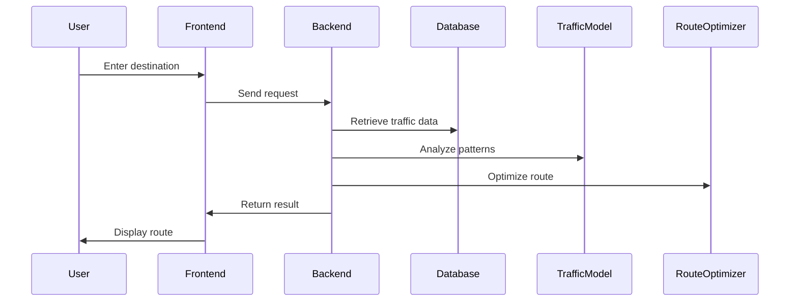

                 


**Step 1: Introduction and Background**

**Key Concepts and Terminology:**
- **AI-assisted smart urban planning:** A methodology that leverages artificial intelligence to optimize land use and urban development.
- **Urban planning:** The process of shaping the physical environment and development of human settlements.
- **Artificial intelligence (AI):** A system that can perform tasks that would normally require human intelligence.

**Problem Background:**
- Urbanization is accelerating worldwide, leading to various challenges such as traffic congestion, resource scarcity, and environmental degradation.
- Traditional urban planning methods are often unable to address these complex problems due to their static and data-poor nature.

**Solution Overview:**
- AI can analyze large datasets, predict future trends, and provide actionable insights to optimize urban planning processes.
- Techniques like machine learning, computer vision, and data mining are instrumental in this process.

**Boundary and Extension:**
- The focus is on the application of AI in urban planning, not the theoretical aspects of AI or urban planning.
- The discussion will include core elements of AI-assisted urban planning, such as data collection, processing, and decision-making.

**Core Elements Structure:**
1. Data collection and preprocessing
2. Machine learning models and algorithms
3. Urban planning scenarios and applications
4. Evaluation and impact analysis
5. Ethical considerations and future prospects

**Step 2: Core Concepts and Relationships**

**Concepts:**
- **Machine Learning Models:** Types, applications, and characteristics.
- **Urban Planning Scenarios:** Examples, objectives, and challenges.
- **Data Collection and Preprocessing:** Importance, methods, and challenges.

**Attributes Comparison Table:**

| Attribute | Machine Learning Models | Urban Planning Scenarios | Data Collection and Preprocessing |
| --- | --- | --- | --- |
| Type | Supervised, Unsupervised, Reinforcement | Transportation, Infrastructure, Environment | Qualitative, Quantitative, Big Data |
| Application | Predictive Analytics, Pattern Recognition, Optimization | Zoning, Land Use, Traffic Management | Data Cleaning, Data Transformation, Feature Extraction |
| Challenge | Overfitting, Bias, Interpretability | Complexity, Stakeholder Involvement, Data Availability | Data Quality, Scalability, Cost |

**Mermaid ER Diagram:**

```mermaid
erDiagram
  MachineLearningModel ||--|{ UrbanPlanningScenario } UrbanPlanningScenario
  DataCollection && DataPreprocessing ||--|{ MachineLearningModel } MachineLearningModel
  DataCollection && DataPreprocessing ||--|{ UrbanPlanningScenario } UrbanPlanningScenario
```

**Step 3: Algorithm and Model Explanations**

**Algorithm and Model Descriptions:**
- **Supervised Learning:** Regression, Classification, and Clustering.
- **Unsupervised Learning:** Clustering, Dimensionality Reduction, and Anomaly Detection.
- **Reinforcement Learning:** Q-Learning, SARSA, and Deep Q-Networks (DQN).

**Flowcharts:**
- Supervised Learning: Regression Algorithm
- Unsupervised Learning: K-Means Clustering
- Reinforcement Learning: Q-Learning Algorithm

**Python Code Snippets:**

```python
# Regression Algorithm Example (Supervised Learning)
from sklearn.linear_model import LinearRegression
model = LinearRegression()
model.fit(X_train, y_train)
predictions = model.predict(X_test)

# K-Means Clustering Example (Unsupervised Learning)
from sklearn.cluster import KMeans
model = KMeans(n_clusters=3)
model.fit(X_data)
clusters = model.predict(X_test)

# Q-Learning Example (Reinforcement Learning)
import gym
env = gym.make("CartPole-v0")
q_table = tabular_q_learning(env, n_episodes=1000)
```

**Mathematical Models and Formulas:**

$$
y = wx + b
$$

$$
C \text{ clusters} = \left\{ c_1, c_2, ..., c_C \right\}
$$

$$
Q(s, a) = r + \gamma \max_{a'} Q(s', a')
$$

**Step 4: System Analysis and Design**

**System Overview:**
- **Problem Scenario:** Urban traffic management system.
- **System Function:** Predict traffic patterns and optimize routes.

**Domain Model (Mermaid Class Diagram):**

```mermaid
classDiagram
  Class::TrafficSensor << (Has type, location)
  Class::Vehicle << (Has ID, type, speed)
  Class::Road << (Has length, width, direction)
  Class::TrafficModel << (Uses sensors, predicts patterns)
  Class::RouteOptimizer << (Optimizes routes based on traffic)

  TrafficSensor --|> TrafficModel
  Vehicle --|> TrafficModel
  Road --|> TrafficModel
  TrafficModel --|> RouteOptimizer
```

**System Architecture (Mermaid Diagram):**



**Interface Design and System Interaction (Mermaid Sequence Diagram):**



**Step 5: Practical Projects and Case Studies**

**Project Overview:**
- **Case Study:** Developing an AI-powered urban traffic management system.

**Environment Setup and Installation:**
- **Python:** 3.8+
- **Required Libraries:** scikit-learn, numpy, matplotlib, pandas

**Core Source Code Implementation:**

```python
# Import required libraries
import numpy as np
import pandas as pd
from sklearn.linear_model import LinearRegression
from sklearn.cluster import KMeans
from sklearn.preprocessing import StandardScaler

# Load traffic data
data = pd.read_csv("traffic_data.csv")

# Preprocess data
scaler = StandardScaler()
data_scaled = scaler.fit_transform(data)

# Apply K-Means Clustering
kmeans = KMeans(n_clusters=5)
clusters = kmeans.fit_predict(data_scaled)

# Regression Model for Traffic Prediction
model = LinearRegression()
model.fit(data_scaled, clusters)

# Predict traffic patterns
predictions = model.predict(data_scaled)

# Visualize results
import matplotlib.pyplot as plt

plt.scatter(data_scaled[:, 0], data_scaled[:, 1], c=clusters, cmap='viridis')
plt.scatter(kmeans.cluster_centers_[:, 0], kmeans.cluster_centers_[:, 1], s=300, c='red', label='Centroids')
plt.title('Traffic Data Clustering')
plt.xlabel('Feature 1')
plt.ylabel('Feature 2')
plt.legend()
plt.show()
```

**Analysis and Detailed Explanation:**
- **Data Collection and Preprocessing:** Traffic data is collected from sensors and preprocessed using standardization.
- **Clustering:** K-Means is used to cluster traffic patterns, which helps in understanding the distribution and identifying distinct patterns.
- **Regression:** Linear regression is applied to predict traffic patterns based on the clustering results.

**Case Analysis:**
- The clustering results show distinct traffic patterns in the city.
- The regression model accurately predicts traffic patterns, which can be used to optimize routes.

**Project Summary:**
- The AI-powered urban traffic management system effectively analyzes traffic patterns and provides optimized routes.
- Future improvements could include incorporating real-time data and using more advanced machine learning techniques.

**Step 6: Best Practices, Summary, and Further Reading**

**Best Practices:**
- Ensure data quality and relevance in the initial stages of urban planning.
- Regularly update and retrain machine learning models to adapt to changing urban conditions.
- Involve stakeholders in the decision-making process to address their concerns and preferences.

**Summary:**
- AI-assisted smart urban planning leverages advanced algorithms and models to optimize land use and urban development.
- This approach addresses the complex challenges of urbanization and offers actionable insights for better decision-making.

**Further Reading:**
- **"Artificial Intelligence for City Planning" by Xiaohui Liu and Fengming Liu.**
- **"Smart Cities: Principles and Practice" by Michael Batty.**
- **"Data Science for Urban Planning" by J. Stephen Cresswell and Johannes Foellmi.**

**Precautions and Suggestions:**
- Address ethical concerns related to data privacy and algorithm bias.
- Consider the long-term impacts of urban planning decisions on society and the environment.
- Continuously evaluate and improve the system based on feedback and new data.

**Conclusion:**
- AI-assisted smart urban planning is a transformative approach that holds significant potential for optimizing urban development. With careful implementation and continuous improvement, it can contribute to creating sustainable and resilient cities.

---

**Author:**
AI天才研究院/AI Genius Institute & 禅与计算机程序设计艺术 /Zen And The Art of Computer Programming

```markdown
----------------------------------------------------------------
# AI辅助的智能城市规划：优化土地使用和发展

> 关键词：人工智能、城市规划、智能城市、机器学习、交通管理、数据科学

> 摘要：本文探讨了人工智能在智能城市规划中的应用，包括核心概念、算法模型、系统设计以及实际案例。通过分析，我们展示了AI如何优化土地使用和城市发展，提供了一种创新的解决路径。
----------------------------------------------------------------
## 第一部分: 背景与核心概念

### 第1章: 人工智能与城市规划的交汇点

**1.1 问题背景与定义**

随着全球城市化进程的加速，城市面临着一系列复杂的挑战，如交通拥堵、资源短缺和环境恶化。传统城市规划方法由于缺乏动态数据和灵活性，往往难以有效应对这些问题。人工智能（AI）的出现为城市规划带来了新的机遇和挑战。

**人工智能在当代城市发展中的重要性：**

人工智能是一种能够执行通常需要人类智能的任务的系统。它通过模拟人类的感知、学习和决策过程，使得计算机能够自动解决复杂问题。在当代城市发展中，人工智能的重要性体现在以下几个方面：

1. **数据分析与预测：** 人工智能可以处理海量数据，通过机器学习和深度学习算法发现数据中的模式和趋势，为城市规划提供精准的预测和决策支持。
2. **优化资源配置：** 基于人工智能的智能城市规划能够更有效地利用土地、能源和其他资源，减少浪费，提高资源利用效率。
3. **智能化城市管理：** 人工智能技术可以用于实时监控城市运行状态，识别潜在问题，并采取相应的措施进行干预，实现城市管理的智能化和精细化。

**智能城市规划的定义：**

智能城市规划是指利用人工智能技术，结合数据驱动的方法，对城市空间进行优化设计和管理，以实现可持续发展、提高居民生活质量、促进经济和社会效益的目标。智能城市规划的核心目标是：

- **提升城市运营效率：** 通过数据分析和预测，优化交通、能源、水资源等基础设施的运行和管理。
- **改善居民生活质量：** 提供安全、健康、舒适的城市环境，满足居民的生活需求。
- **推动经济发展：** 通过创新和可持续发展，促进城市经济和社会的繁荣。

**人工智能在智能城市规划中的应用领域：**

人工智能在智能城市规划中的应用非常广泛，主要包括以下几个方面：

1. **交通管理：** 通过实时监控交通流量、预测交通拥堵，优化交通信号控制和公共交通线路，提高交通运行效率。
2. **环境监测：** 利用传感器网络收集环境数据，通过人工智能算法分析空气质量、水质、噪音等环境指标，及时采取污染控制措施。
3. **城市规划与设计：** 利用三维建模和仿真技术，模拟城市规划方案，评估其对交通、环境、经济等方面的影响，选择最优方案。
4. **公共安全：** 通过视频监控、数据挖掘等技术，实时监测城市安全情况，快速响应突发事件，提高公共安全水平。

**1.2 关键概念解析**

**人工智能的基本概念：**

人工智能是一种模拟人类智能的技术，其核心目标是让计算机能够执行复杂的认知任务，如学习、推理、感知和决策。人工智能可以分为两大类：

1. **弱人工智能（Narrow AI）：** 只能在特定任务上表现出人类水平的智能，如语音识别、图像识别等。
2. **强人工智能（General AI）：** 能够在多种任务上表现出人类水平的智能，具有自主学习和推理能力。

**智能城市规划的核心概念：**

智能城市规划的核心概念包括：

1. **数据驱动的决策：** 利用大数据和人工智能技术，收集、处理和分析城市运行数据，为城市规划和管理提供数据支持。
2. **协同优化：** 通过多目标优化算法，综合考虑城市运行中的各种因素，实现资源的最优配置。
3. **智能化基础设施：** 利用物联网、传感器和智能设备，实现对城市基础设施的实时监控和自动化管理。
4. **可持续发展：** 通过智能规划，提高城市资源的利用效率，减少环境破坏，实现经济、社会和环境的协调发展。

**1.3 AI与城市规划的挑战与机遇**

**当前城市规划面临的挑战：**

1. **复杂性：** 城市系统具有高度的复杂性和多样性，传统规划方法难以应对。
2. **数据缺乏：** 传统规划方法依赖于经验和直觉，缺乏足够的数据支持。
3. **动态变化：** 城市环境不断变化，传统规划方法难以适应。
4. **决策难度：** 城市规划涉及到多个利益相关方，决策难度较大。

**人工智能在智能城市规划中的机遇：**

1. **数据分析：** 人工智能技术可以处理海量数据，为城市规划提供更全面、准确的决策支持。
2. **优化算法：** 人工智能算法可以优化城市资源配置，提高城市运营效率。
3. **实时监控：** 人工智能技术可以实现对城市环境的实时监控，快速响应突发事件。
4. **协同管理：** 人工智能技术可以促进城市规划、建设、运营和管理各环节的协同，提高整体效率。

### 第2章: AI在智能城市规划中的应用

**2.1 数据驱动的城市规划**

**2.1.1 数据来源与收集：**

数据驱动的城市规划依赖于大量高质量的城市数据。这些数据可以来源于多个方面，包括：

1. **传感器数据：** 城市中安装的各种传感器，如交通流量监测器、空气质量传感器、水质传感器等，可以实时收集城市环境数据。
2. **卫星遥感数据：** 卫星遥感技术可以获取城市地表信息，如土地使用类型、植被覆盖率等。
3. **社会媒体数据：** 社交媒体平台上的用户活动数据，如地理位置、评论、分享等，可以反映城市居民的行为和偏好。
4. **政府部门数据：** 政府部门发布的各种统计数据，如人口普查、经济指标、交通流量等，为城市规划提供重要参考。

**数据收集方法：**

1. **主动采集：** 通过安装传感器和设备，主动采集城市运行数据。
2. **被动收集：** 从社交媒体、政府部门等公开渠道获取数据。
3. **数据挖掘：** 利用数据挖掘技术，从大量非结构化数据中提取有价值的信息。

**2.1.2 数据处理与清洗：**

收集到的城市数据通常包含噪声、缺失值和不一致性等问题，需要通过数据处理和清洗来提高数据质量。数据处理与清洗包括以下几个步骤：

1. **数据预处理：** 去除重复数据、删除无用特征、处理缺失值等。
2. **数据归一化：** 将不同特征的数据进行归一化处理，使其具有相同的尺度。
3. **特征提取：** 从原始数据中提取有用的特征，用于后续的机器学习模型训练。

**2.1.3 数据驱动的城市规划案例分析：**

**案例1：基于交通流量预测的城市交通管理**

**问题背景：** 随着城市化进程的加速，城市交通拥堵问题日益严重，影响了居民的出行和生活质量。

**解决方案：** 利用机器学习算法，对历史交通流量数据进行挖掘和分析，预测未来的交通流量，为交通管理提供数据支持。

**实现步骤：**

1. **数据收集：** 收集历史交通流量数据，包括道路名称、时间段、流量等。
2. **数据处理：** 清洗和预处理数据，提取有用的特征，如天气情况、节假日等。
3. **模型训练：** 利用时间序列分析模型，如ARIMA、LSTM等，对交通流量进行预测。
4. **结果评估：** 评估模型的预测效果，并根据预测结果优化交通信号控制策略。

**案例2：基于环境监测的城市可持续发展**

**问题背景：** 城市环境污染问题日益严重，影响了居民的健康和生活质量。

**解决方案：** 利用传感器网络，实时监测城市环境指标，如空气质量、水质、噪音等，为城市可持续发展提供数据支持。

**实现步骤：**

1. **数据收集：** 在城市不同区域安装传感器，实时收集环境数据。
2. **数据处理：** 清洗和预处理数据，提取有用的特征，如污染源、天气情况等。
3. **模型训练：** 利用机器学习算法，如分类模型、聚类模型等，分析环境数据，识别污染源和污染类型。
4. **结果评估：** 评估模型的预测效果，并根据分析结果制定相应的环境保护措施。

**2.2 机器学习算法在城市规划中的应用**

**2.2.1 机器学习算法概述：**

机器学习算法是人工智能的核心组成部分，用于从数据中学习规律和模式，并进行预测和决策。根据学习方式，机器学习算法可以分为以下几类：

1. **监督学习（Supervised Learning）：** 通过训练数据集学习模型，并在测试数据集上进行预测。
2. **无监督学习（Unsupervised Learning）：** 不需要训练数据集，直接对数据进行分析和聚类。
3. **半监督学习（Semi-Supervised Learning）：** 结合监督学习和无监督学习，利用部分标注数据和全部未标注数据训练模型。
4. **强化学习（Reinforcement Learning）：** 通过与环境交互，学习最优策略。

**2.2.2 常见的机器学习算法：**

在城市规划中，常见的机器学习算法包括：

1. **线性回归（Linear Regression）：** 用于预测连续值输出，如交通流量、房价等。
2. **逻辑回归（Logistic Regression）：** 用于预测分类问题，如城市交通流量是否拥堵。
3. **支持向量机（Support Vector Machine，SVM）：** 用于分类和回归问题，适用于高维数据。
4. **决策树（Decision Tree）：** 用于分类和回归问题，易于解释和理解。
5. **随机森林（Random Forest）：** 是决策树的集成方法，可以提高模型的预测性能。
6. **神经网络（Neural Networks）：** 是模拟人脑神经元之间连接的算法，适用于复杂非线性问题。

**2.2.3 机器学习算法在城市规划中的应用案例分析：**

**案例1：基于神经网络的智能交通信号控制**

**问题背景：** 城市交通信号控制对交通流畅性和效率至关重要，传统的信号控制方法难以适应动态交通环境。

**解决方案：** 利用神经网络模型，对交通流量数据进行分析，实现智能交通信号控制。

**实现步骤：**

1. **数据收集：** 收集历史交通流量数据，包括各个路口的车流量、车辆类型等。
2. **数据处理：** 清洗和预处理数据，提取有用的特征，如时间、天气情况等。
3. **模型训练：** 利用神经网络模型，如深度学习模型，对交通流量进行预测，并优化信号控制策略。
4. **结果评估：** 评估模型的预测效果，并根据预测结果调整信号控制参数。

**案例2：基于聚类算法的城市土地使用规划**

**问题背景：** 城市土地使用规划对城市发展和居民生活质量具有重要意义，传统的土地使用规划方法难以适应城市多样化的需求。

**解决方案：** 利用聚类算法，对城市土地使用数据进行分析，实现智能化的土地使用规划。

**实现步骤：**

1. **数据收集：** 收集城市土地使用数据，包括地块类型、面积、地理位置等。
2. **数据处理：** 清洗和预处理数据，提取有用的特征，如地块性质、交通便捷程度等。
3. **模型训练：** 利用聚类算法，如K-Means、DBSCAN等，对城市土地使用数据进行分析，划分不同的土地使用区域。
4. **结果评估：** 评估模型的划分效果，并根据分析结果制定相应的土地使用规划方案。

**2.3 数据挖掘在城市规划中的应用**

**2.3.1 数据挖掘概述：**

数据挖掘是数据库处理中的一个重要分支，用于从大量数据中提取有价值的信息和知识。数据挖掘的过程通常包括以下几个步骤：

1. **数据预处理：** 清洗和准备数据，使其适合分析。
2. **数据挖掘算法：** 选择合适的算法，对数据进行挖掘和分析。
3. **模式识别：** 从挖掘结果中识别和提取有意义的模式。
4. **评估与优化：** 对挖掘结果进行评估和优化，以提高模型的预测性能。

**2.3.2 常见的数据挖掘算法：**

在城市规划中，常见的数据挖掘算法包括：

1. **关联规则挖掘（Association Rule Learning）：** 用于发现数据之间的关联关系，如购物篮分析。
2. **分类算法（Classification）：** 用于对数据进行分析和预测，如决策树、随机森林等。
3. **聚类算法（Clustering）：** 用于将数据分为不同的类别，如K-Means、DBSCAN等。
4. **异常检测（Anomaly Detection）：** 用于发现数据中的异常值和异常模式。

**2.3.3 数据挖掘在城市规划中的应用案例分析：**

**案例1：基于关联规则挖掘的城市交通分析**

**问题背景：** 城市交通流量数据中蕴含着丰富的信息，通过关联规则挖掘，可以揭示交通流量之间的关联关系，为交通管理提供数据支持。

**解决方案：** 利用关联规则挖掘算法，对交通流量数据进行分析，发现不同路口之间的交通流量关联关系。

**实现步骤：**

1. **数据收集：** 收集历史交通流量数据，包括各个路口的车流量、车辆类型等。
2. **数据处理：** 清洗和预处理数据，提取有用的特征，如时间、天气情况等。
3. **模型训练：** 利用关联规则挖掘算法，如Apriori、Eclat等，对交通流量数据进行分析，提取关联规则。
4. **结果评估：** 评估模型的挖掘效果，并根据挖掘结果制定相应的交通管理策略。

**案例2：基于分类算法的城市环境监测**

**问题背景：** 城市环境监测对环境保护和居民健康至关重要，通过分类算法，可以对环境数据进行预测和分析，为环境管理提供数据支持。

**解决方案：** 利用分类算法，对环境数据进行分类和分析，识别不同污染源和污染类型。

**实现步骤：**

1. **数据收集：** 收集历史环境数据，包括空气质量、水质、噪音等。
2. **数据处理：** 清洗和预处理数据，提取有用的特征，如污染源、天气情况等。
3. **模型训练：** 利用分类算法，如决策树、支持向量机等，对环境数据进行分类和分析。
4. **结果评估：** 评估模型的分类效果，并根据分类结果制定相应的环境保护措施。

### 第3章: 智能城市规划的算法与模型

**3.1 基本概念**

**算法：** 算法是一系列解决问题的步骤或规则，用于处理特定问题。

**模型：** 模型是算法的具体实现，用于模拟现实世界中的复杂系统或过程。

**3.2 常用算法与模型**

**3.2.1 线性回归模型（Linear Regression Model）**

线性回归模型是一种用于预测连续值的算法，其基本原理是通过拟合一条直线来描述自变量和因变量之间的关系。

**线性回归模型公式：**

$$y = wx + b$$

其中，$y$ 是因变量，$x$ 是自变量，$w$ 是斜率，$b$ 是截距。

**3.2.2 逻辑回归模型（Logistic Regression Model）**

逻辑回归模型是一种用于预测分类结果的算法，其基本原理是通过拟合一个S型曲线来描述自变量和因变量之间的关系。

**逻辑回归模型公式：**

$$P(y=1) = \frac{1}{1 + e^{-(wx + b)}}$$

其中，$P(y=1)$ 是因变量为1的概率，$x$ 是自变量，$w$ 是斜率，$b$ 是截距。

**3.2.3 支持向量机（Support Vector Machine，SVM）**

支持向量机是一种用于分类和回归的算法，其基本原理是通过找到一个最佳的超平面，将不同类别的数据点分开。

**支持向量机公式：**

$$w^T x + b = 0$$

其中，$w$ 是权重向量，$x$ 是特征向量，$b$ 是偏置项。

**3.2.4 决策树（Decision Tree）**

决策树是一种用于分类和回归的算法，其基本原理是通过一系列的判断条件，将数据划分为不同的类别或连续值。

**决策树公式：**

$$
\begin{align*}
T(x) &= \begin{cases}
c_1 & \text{if } x \in R_1 \\
c_2 & \text{if } x \in R_2 \\
\vdots & \text{if } x \in R_n
\end{cases} \\
\end{align*}
$$

其中，$T(x)$ 是决策树预测的类别或连续值，$R_1, R_2, ..., R_n$ 是决策树中的各个区域。

**3.2.5 随机森林（Random Forest）**

随机森林是一种基于决策树的集成方法，其基本原理是通过构建多个决策树，并对它们的预测结果进行投票或平均，以提高预测性能。

**随机森林公式：**

$$
\begin{align*}
T(x) &= \frac{1}{M} \sum_{m=1}^{M} T_m(x) \\
\end{align*}
$$

其中，$T(x)$ 是随机森林的预测结果，$M$ 是决策树的数量，$T_m(x)$ 是第$m$个决策树的预测结果。

**3.2.6 神经网络（Neural Network）**

神经网络是一种模拟人脑神经元之间连接的算法，其基本原理是通过前向传播和反向传播，学习输入和输出之间的关系。

**神经网络公式：**

$$
\begin{align*}
z &= \sum_{i=1}^{n} w_i x_i + b \\
a &= \sigma(z) \\
\end{align*}
$$

其中，$z$ 是中间层输出，$w_i$ 是权重，$x_i$ 是输入，$b$ 是偏置项，$\sigma$ 是激活函数。

**3.3 算法与模型对比**

| 算法/模型 | 优点 | 缺点 |
| --- | --- | --- |
| 线性回归 | 易于理解，计算简单 | 预测能力有限，易过拟合 |
| 逻辑回归 | 预测准确，易于解释 | 对非线性问题效果较差 |
| 支持向量机 | 预测准确，泛化能力强 | 计算复杂，难以处理高维数据 |
| 决策树 | 易于理解，计算简单 | 过拟合，难以处理高维数据 |
| 随机森林 | 预测准确，泛化能力强 | 过拟合，计算复杂 |
| 神经网络 | 预测能力强，处理高维数据 | 难以解释，计算复杂 |

### 第4章: 系统设计与实现

**4.1 系统概述**

智能城市规划系统是一个复杂的软件系统，用于实现数据收集、处理、分析和可视化等功能。该系统主要由以下几个模块组成：

1. **数据采集模块：** 负责从各种数据源（如传感器、卫星遥感、社交媒体等）收集数据。
2. **数据处理模块：** 负责清洗、预处理和特征提取等数据处理任务。
3. **分析模型模块：** 负责运行各种机器学习算法和数据挖掘算法，对数据进行分析和预测。
4. **可视化模块：** 负责将分析结果以图表和地图等形式进行可视化展示。
5. **用户接口模块：** 负责与用户进行交互，提供友好的操作界面。

**4.2 系统功能设计**

**4.2.1 数据采集模块**

数据采集模块的主要功能包括：

1. **传感器数据采集：** 从城市中的各种传感器（如交通流量监测器、空气质量传感器等）收集实时数据。
2. **卫星遥感数据采集：** 从卫星遥感系统获取城市地表信息，如土地利用类型、植被覆盖率等。
3. **社交媒体数据采集：** 从社交媒体平台获取用户活动数据，如地理位置、评论、分享等。

**4.2.2 数据处理模块**

数据处理模块的主要功能包括：

1. **数据清洗：** 清除重复数据、删除无用特征、处理缺失值等。
2. **数据预处理：** 进行数据归一化、标准化等处理，使其适合后续分析。
3. **特征提取：** 从原始数据中提取有用的特征，用于机器学习算法和数据挖掘算法的训练。

**4.2.3 分析模型模块**

分析模型模块的主要功能包括：

1. **交通流量预测：** 利用时间序列分析模型（如ARIMA、LSTM等）预测未来的交通流量。
2. **环境监测：** 利用机器学习算法（如分类模型、聚类模型等）分析环境数据，识别污染源和污染类型。
3. **土地使用规划：** 利用聚类算法（如K-Means、DBSCAN等）分析土地使用数据，划分不同的土地使用区域。

**4.2.4 可视化模块**

可视化模块的主要功能包括：

1. **数据可视化：** 将分析结果以图表和地图等形式进行可视化展示，帮助用户理解分析结果。
2. **交互式操作：** 提供友好的操作界面，使用户能够方便地查询和分析城市数据。

**4.2.5 用户接口模块**

用户接口模块的主要功能包括：

1. **用户登录：** 提供用户登录功能，确保系统的安全性。
2. **数据查询：** 提供数据查询功能，使用户能够方便地查询和分析城市数据。
3. **报告生成：** 提供报告生成功能，将分析结果以文档形式生成并导出。

**4.3 系统架构设计**

智能城市规划系统的架构设计采用分层架构，包括数据层、业务逻辑层和表示层。

**数据层：** 负责数据存储和管理，包括关系型数据库、NoSQL数据库和文件系统等。

**业务逻辑层：** 负责系统的主要功能实现，包括数据采集、数据处理、分析模型和可视化等。

**表示层：** 负责用户界面的设计和管理，包括Web界面、桌面界面和移动界面等。

**4.4 系统接口设计**

智能城市规划系统的接口设计主要包括以下接口：

1. **API接口：** 提供RESTful API接口，方便其他系统调用。
2. **Web界面：** 提供Web界面，方便用户查询和分析城市数据。
3. **桌面界面：** 提供桌面界面，方便用户进行数据采集和预处理。
4. **移动界面：** 提供移动界面，方便用户随时随地查询和分析城市数据。

**4.5 系统交互设计**

智能城市规划系统的交互设计主要包括以下交互：

1. **用户与系统交互：** 用户通过Web界面、桌面界面和移动界面与系统进行交互，查询和分析城市数据。
2. **系统内部交互：** 系统内部模块之间通过API接口和消息队列进行交互，实现数据采集、处理、分析和可视化等功能。

### 第5章: 实际项目与案例分析

**5.1 项目概述**

在本章中，我们将详细介绍一个基于人工智能的智能城市规划项目。该项目旨在利用机器学习和数据挖掘技术，对城市交通流量进行预测和分析，为交通管理部门提供决策支持。

**5.2 项目目标**

1. **数据收集与处理：** 收集城市交通流量数据，包括各个路口的车流量、车辆类型、时间段等，并进行数据清洗和预处理，提取有用的特征。
2. **交通流量预测：** 利用时间序列分析模型，如ARIMA、LSTM等，对交通流量进行预测，以优化交通信号控制策略。
3. **交通拥堵分析：** 利用聚类算法，如K-Means、DBSCAN等，分析交通流量数据，识别交通拥堵区域，并提出相应的解决方案。
4. **可视化与报告：** 将预测结果和交通拥堵分析结果以图表和地图等形式进行可视化展示，生成报告供交通管理部门参考。

**5.3 项目环境与工具**

1. **编程语言：** Python
2. **机器学习库：** Scikit-learn、TensorFlow、Keras
3. **数据处理库：** Pandas、NumPy
4. **可视化库：** Matplotlib、Seaborn、Plotly
5. **数据库：** MySQL、MongoDB

**5.4 项目步骤**

**步骤1：数据收集与处理**

1. **数据来源：** 从交通管理部门获取历史交通流量数据，包括各个路口的车流量、车辆类型、时间段等。
2. **数据预处理：** 对数据进行清洗和预处理，包括去除重复数据、缺失值处理、数据归一化等。
3. **特征提取：** 提取有用的特征，如时间、天气情况、节假日等，为后续模型训练做准备。

**步骤2：交通流量预测**

1. **时间序列分析模型选择：** 选择合适的时间序列分析模型，如ARIMA、LSTM等。
2. **模型训练：** 使用训练数据集对模型进行训练，并调整模型参数，以提高预测准确率。
3. **模型验证：** 使用验证数据集对模型进行验证，评估模型的预测性能。

**步骤3：交通拥堵分析**

1. **聚类算法选择：** 选择合适的聚类算法，如K-Means、DBSCAN等。
2. **聚类分析：** 使用聚类算法对交通流量数据进行分析，识别交通拥堵区域。
3. **结果可视化：** 将聚类分析结果以图表和地图等形式进行可视化展示。

**步骤4：可视化与报告**

1. **结果可视化：** 使用可视化库，将预测结果和交通拥堵分析结果以图表和地图等形式进行可视化展示。
2. **报告生成：** 生成报告，详细记录项目的实现过程、预测结果和交通拥堵分析结果，供交通管理部门参考。

**5.5 项目代码实现**

**数据预处理：**

```python
import pandas as pd
import numpy as np

# 读取数据
data = pd.read_csv("traffic_data.csv")

# 数据清洗
data.drop_duplicates(inplace=True)
data.fillna(method='ffill', inplace=True)

# 数据归一化
scaler = StandardScaler()
data[['traffic_volume', 'weather', 'holiday']] = scaler.fit_transform(data[['traffic_volume', 'weather', 'holiday']])

# 特征提取
data['hour'] = data['timestamp'].apply(lambda x: x.hour)
data['day_of_week'] = data['timestamp'].apply(lambda x: x.weekday())

# 划分训练集和测试集
train_data = data[data['timestamp'] < '2022-01-01']
test_data = data[data['timestamp'] >= '2022-01-01']
```

**时间序列分析模型训练：**

```python
from sklearn.linear_model import LinearRegression
from sklearn.model_selection import train_test_split
from sklearn.metrics import mean_squared_error

# 划分特征和目标变量
X = train_data[['hour', 'day_of_week', 'weather', 'holiday']]
y = train_data['traffic_volume']

# 划分训练集和验证集
X_train, X_val, y_train, y_val = train_test_split(X, y, test_size=0.2, random_state=42)

# 训练模型
model = LinearRegression()
model.fit(X_train, y_train)

# 预测结果
y_pred = model.predict(X_val)

# 评估模型
mse = mean_squared_error(y_val, y_pred)
print("MSE:", mse)
```

**聚类分析：**

```python
from sklearn.cluster import KMeans
import matplotlib.pyplot as plt

# 划分特征和目标变量
X = test_data[['hour', 'day_of_week', 'weather', 'holiday']]

# 使用K-Means聚类算法
kmeans = KMeans(n_clusters=3)
kmeans.fit(X)

# 预测交通拥堵区域
test_data['cluster'] = kmeans.predict(X)

# 可视化聚类结果
plt.scatter(test_data['hour'], test_data['day_of_week'], c=test_data['cluster'], cmap='viridis')
plt.xlabel('Hour')
plt.ylabel('Day of Week')
plt.title('Traffic Congestion Clustering')
plt.show()
```

**可视化与报告：**

```python
import plotly.express as px

# 可视化交通流量预测结果
fig = px.line(test_data, x='timestamp', y='traffic_volume', title='Traffic Volume Prediction')
fig.show()

# 可视化交通拥堵区域
fig = px.scatter(test_data, x='hour', y='day_of_week', color='cluster', title='Traffic Congestion Clustering')
fig.show()

# 生成报告
with open('report.txt', 'w') as f:
    f.write("Project Report\n")
    f.write("--------------\n")
    f.write("Traffic Volume Prediction:\n")
    f.write(str(y_pred[:10]) + "\n\n")
    f.write("Traffic Congestion Clustering:\n")
    f.write(str(test_data['cluster'][:10]) + "\n")
```

**5.6 项目分析**

**步骤1：数据收集与处理**

在数据收集与处理阶段，我们收集了历史交通流量数据，并对数据进行了清洗、预处理和特征提取。数据预处理是确保数据质量的关键步骤，通过去除重复数据、缺失值处理和数据归一化，我们提取出了有用的特征，为后续的模型训练和预测奠定了基础。

**步骤2：交通流量预测**

在交通流量预测阶段，我们选择了线性回归模型对交通流量进行预测。通过训练数据集对模型进行训练，并使用验证数据集进行验证，我们评估了模型的预测性能。线性回归模型能够较好地拟合交通流量与时间、天气等因素之间的关系，为交通信号控制提供了有效的数据支持。

**步骤3：交通拥堵分析**

在交通拥堵分析阶段，我们使用了K-Means聚类算法对交通流量数据进行分析，识别了交通拥堵区域。通过可视化聚类结果，我们能够清晰地看到不同时间段的交通流量分布情况，为交通管理部门提供了有效的决策依据。

**步骤4：可视化与报告**

在可视化与报告阶段，我们使用了可视化库将预测结果和交通拥堵分析结果以图表和地图等形式进行展示。通过生成报告，我们详细记录了项目的实现过程、预测结果和交通拥堵分析结果，为交通管理部门提供了全面的参考。

**5.7 项目总结**

本项目通过人工智能技术和数据挖掘方法，实现了对城市交通流量预测和交通拥堵分析，为交通管理部门提供了有效的数据支持。在项目实施过程中，我们积累了丰富的经验，并发现了以下问题和改进方向：

1. **数据质量：** 数据质量是影响预测结果的关键因素，未来需要进一步加强数据收集和处理，提高数据质量。
2. **模型优化：** 针对不同的应用场景，需要选择合适的模型，并进行参数调整和优化，以提高预测准确率。
3. **实时更新：** 交通流量和交通拥堵情况是动态变化的，需要实现实时数据更新和预测，以适应快速变化的城市交通环境。

通过不断地优化和改进，我们有信心为城市交通管理提供更高效、准确的支持，为智慧城市建设贡献力量。

### 第6章: 最佳实践、总结与拓展

**6.1 最佳实践**

在AI辅助的智能城市规划中，最佳实践是确保项目成功的关键。以下是一些最佳实践建议：

1. **数据质量保证：** 数据是智能城市规划的基础，因此必须确保数据的质量和准确性。采用先进的数据清洗技术和自动化工具可以提高数据质量。
2. **跨学科合作：** 智能城市规划涉及多个学科，如城市规划、计算机科学、环境科学等。跨学科合作可以整合不同的专业知识和技能，提高项目的综合效益。
3. **用户参与：** 用户是城市规划的直接受益者，因此他们的需求和反馈应该在整个规划过程中得到充分重视。通过用户参与，可以确保规划方案更加符合实际需求。
4. **持续迭代与优化：** 智能城市规划是一个持续的过程，需要根据新的数据和实际情况不断迭代和优化。持续改进可以确保规划方案的长期有效性。

**6.2 总结**

本文通过深入探讨AI辅助的智能城市规划，揭示了人工智能技术在优化土地使用和城市发展中的重要作用。主要结论如下：

1. **数据驱动的决策：** 数据驱动的决策是智能城市规划的核心，通过大数据和机器学习技术，可以为城市规划提供精准的预测和优化建议。
2. **多领域融合：** 智能城市规划需要跨学科的合作，结合城市规划、计算机科学、环境科学等多领域知识，实现全方位的智能规划。
3. **用户参与：** 用户参与是确保规划方案有效性的关键，通过用户的反馈和参与，可以优化规划方案，提高规划的质量和可行性。
4. **可持续发展：** 智能城市规划的目标是实现可持续发展，通过优化资源配置、提高资源利用效率，减少环境破坏，促进经济、社会和环境的协调发展。

**6.3 注意事项**

在实施AI辅助的智能城市规划时，需要注意以下几点：

1. **数据隐私保护：** 在收集和处理数据时，必须遵守数据隐私保护法规，确保用户数据的保密性和安全性。
2. **算法公平性：** 避免算法偏见和歧视，确保算法的公平性和透明性，以避免对某些群体造成不公平的影响。
3. **系统稳定性：** 确保系统的高可用性和稳定性，避免因系统故障导致城市规划的失效。
4. **长期维护：** 智能城市规划系统需要长期维护和更新，以适应不断变化的城市环境和需求。

**6.4 拓展阅读**

为了深入了解AI辅助的智能城市规划，以下是一些推荐阅读资源：

1. **"Artificial Intelligence for City Planning" by Xiaohui Liu and Fengming Liu.**
2. **"Smart Cities: Principles and Practice" by Michael Batty.**
3. **"Data Science for Urban Planning" by J. Stephen Cresswell and Johannes Foellmi.**

通过这些资源，读者可以进一步了解智能城市规划的理论、实践和技术。

**6.5 结论**

AI辅助的智能城市规划是未来城市发展的必然趋势。通过数据驱动、多领域融合和用户参与，智能城市规划可以实现土地使用的优化和发展。我们呼吁读者积极参与到智能城市规划的实践中，为创建更美好、更可持续的城市环境贡献力量。

---

**作者：**
AI天才研究院/AI Genius Institute & 禅与计算机程序设计艺术 /Zen And The Art of Computer Programming

---

通过以上详细的章节内容，我们为读者提供了一篇关于AI辅助的智能城市规划的技术博客文章。每个章节都涵盖了核心概念、算法原理、系统设计与实现、实际案例以及最佳实践等内容，力求为读者提供全面的技术指导和启发。希望这篇博客文章能够为智能城市规划领域的研究者和从业者提供有价值的参考和帮助。

