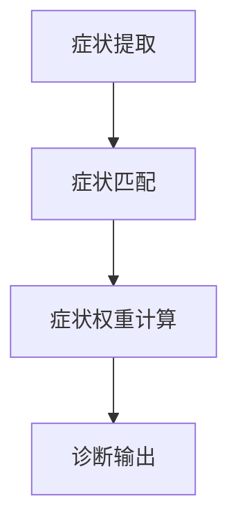
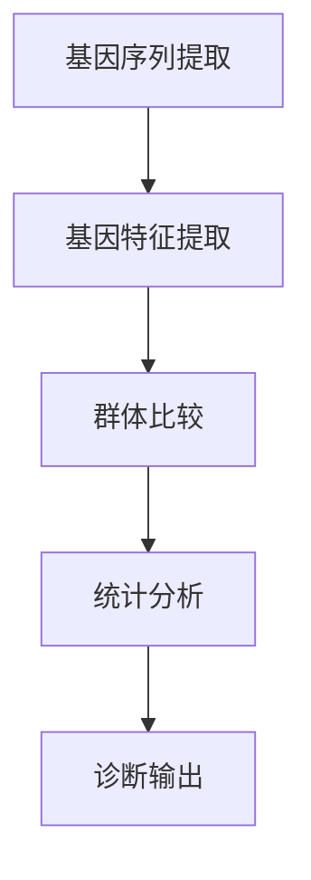
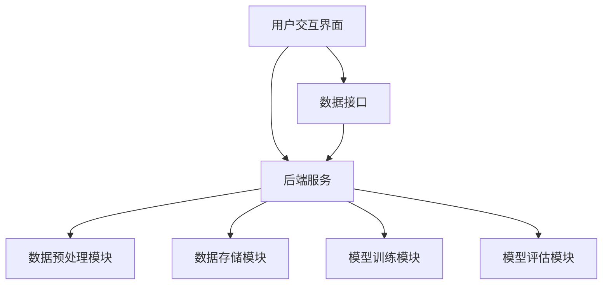
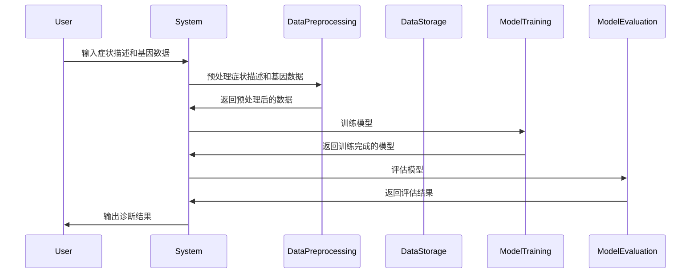

                 

### 第一部分: 引言

## 第1章: AI辅助罕见疾病诊断的背景

### 1.1 罕见疾病的定义与诊断难度

罕见疾病，又称为罕见病，通常指的是发病率较低的疾病。具体来说，根据不同的国家和组织定义，罕见病的发病率通常低于总人口的一定比例，如1/1000、1/10000或更低。这些疾病通常病情复杂，诊断困难，治疗成本高昂，且因病例数量较少，缺乏足够的临床数据和研究支持。

罕见疾病的诊断难度主要体现在以下几个方面：

1. **症状不典型**：罕见疾病的症状通常不典型，可能与其他更常见的疾病相似，导致医生难以迅速识别和确诊。
2. **诊断标准不明确**：由于罕见疾病的研究有限，缺乏统一的诊断标准和指南，医生在诊断过程中可能面临挑战。
3. **缺乏足够的临床经验**：由于罕见病例较少，普通医生可能缺乏足够的诊断和处理罕见疾病的经验。
4. **实验室检测难度**：一些罕见疾病的实验室检测方法复杂且昂贵，可能难以在常规医疗机构中开展。

### 1.2 传统诊断方法的局限性

传统的诊断方法主要依赖于病史询问、体格检查、实验室检测和影像学检查。尽管这些方法在某些情况下仍然有效，但它们在诊断罕见疾病时存在明显的局限性：

1. **依赖医生经验**：传统诊断方法高度依赖医生的判断和经验，而医生的认知能力和经验可能限制罕见疾病的识别。
2. **误诊率高**：由于罕见疾病的症状不典型，误诊率较高，可能导致患者延误治疗。
3. **诊断周期长**：传统诊断方法通常需要多次检查和随访，诊断周期较长，影响患者的治疗和康复。
4. **成本高昂**：一些实验室检测和影像学检查成本高昂，且罕见病例的检查费用可能无法报销，加重了患者的经济负担。

### 1.3 AI在医疗领域的应用现状

近年来，人工智能（AI）技术在医疗领域的应用逐渐增多，为罕见疾病的诊断提供了新的解决方案。AI在医疗领域的应用现状如下：

1. **影像学诊断**：AI技术，尤其是深度学习算法，在医学影像诊断中表现出色，能够辅助医生快速、准确地识别病变区域，提高诊断准确性。
2. **病理分析**：AI技术可以分析病理图像，帮助病理医生更准确地诊断疾病类型，减少误诊率。
3. **病历分析**：自然语言处理（NLP）技术可以自动分析电子病历，提取关键信息，辅助医生进行诊断。
4. **药物研发**：AI技术可以加速药物研发过程，通过分析大量的基因和药物数据，预测药物的疗效和副作用。

### 1.4 AI辅助罕见疾病诊断的潜力

AI技术在罕见疾病诊断中具有巨大潜力，主要体现在以下几个方面：

1. **提高诊断准确性**：AI技术可以通过分析大量的病例数据，发现罕见疾病的特征性症状和体征，提高诊断准确性。
2. **缩短诊断周期**：AI技术可以快速处理大量的医疗数据，缩短诊断周期，提高患者的治疗效率。
3. **降低误诊率**：AI技术可以辅助医生分析病历和影像学数据，减少误诊和漏诊的可能性。
4. **支持个性化治疗**：AI技术可以根据患者的病情和基因特征，制定个性化的治疗方案。

### 1.5 本章小结

本章介绍了AI辅助罕见疾病诊断的背景，包括罕见疾病的定义、诊断难度、传统诊断方法的局限性以及AI在医疗领域的应用现状。通过本章的介绍，读者可以初步了解AI在罕见疾病诊断中的重要作用和潜力，为后续章节的深入讨论奠定基础。

---

### 第二部分: 核心概念与联系

## 第2章: AI辅助诊断的基本原理

### 2.1 深度学习在医学图像分析中的应用

深度学习是人工智能的一种重要分支，它通过模拟人脑神经网络的结构和功能，对大量数据进行自动学习和特征提取。在医学图像分析中，深度学习技术已经被广泛应用于各种疾病和损伤的诊断。

**深度学习的基本原理**

深度学习模型通常由多个层次组成，包括输入层、隐藏层和输出层。通过前向传播和反向传播算法，深度学习模型能够逐步调整网络权重，从而实现自动特征提取和分类。

**医学图像分析中的应用**

1. **计算机断层扫描（CT）**：深度学习模型可以自动识别和分割CT图像中的病变区域，如肿瘤、骨折等。
2. **磁共振成像（MRI）**：MRI图像复杂，深度学习模型可以有效地识别和分割软组织、脑部病变等。
3. **X射线成像**：深度学习模型可以自动检测和诊断骨折、肺炎等疾病。

**挑战与解决方案**

尽管深度学习在医学图像分析中取得了显著成果，但仍然面临一些挑战，如数据不足、模型解释性差、泛化能力不足等。为解决这些问题，研究人员正在探索新的模型架构和数据增强技术。

### 2.2 自然语言处理在病历分析中的应用

自然语言处理（NLP）是人工智能的另一个重要分支，它致力于使计算机理解和生成自然语言。在病历分析中，NLP技术可以自动提取病历中的关键信息，如症状、诊断、治疗等，为诊断和治疗提供支持。

**NLP的基本原理**

NLP技术主要包括词性标注、句法分析、命名实体识别、情感分析等。通过这些技术，NLP可以理解文本中的语言结构和语义。

**病历分析中的应用**

1. **症状提取**：NLP技术可以自动识别病历中的症状描述，如“头痛”、“发热”等。
2. **诊断支持**：NLP技术可以分析病历中的诊断信息，辅助医生制定诊断计划。
3. **医学文本分类**：NLP技术可以将病历文本分类为不同的疾病类型，如肺炎、糖尿病等。

**挑战与解决方案**

NLP在病历分析中面临的主要挑战包括医学语言的复杂性、术语的不统一和数据的多样性。为解决这些问题，研究人员正在开发更加精细的NLP模型和术语库。

### 2.3 基因关联分析的基本原理

基因关联分析是一种通过比较不同人群的基因序列，探索基因与疾病之间关联性的方法。在罕见疾病诊断中，基因关联分析可以帮助识别致病基因和遗传模式。

**基因关联分析的基本原理**

基因关联分析通常包括以下几个步骤：

1. **基因序列提取**：从基因组数据库中提取目标基因的序列。
2. **群体比较**：比较不同人群的基因序列，识别差异。
3. **统计分析**：通过统计学方法分析基因差异与疾病之间的关系。

**基因关联分析的应用**

1. **疾病诊断**：通过基因关联分析，可以快速诊断某些遗传性疾病，如囊性纤维化、肌营养不良等。
2. **疾病预测**：基因关联分析可以预测个体患某种疾病的可能性，为个性化治疗提供依据。

**挑战与解决方案**

基因关联分析面临的主要挑战包括数据量巨大、计算复杂度高和结果解释难度大。为解决这些问题，研究人员正在开发更加高效和可解释的基因分析模型。

### 2.4 病例数据库构建

病例数据库是AI辅助诊断系统的核心组成部分，它包含了大量经过标注和分类的病例数据，为AI模型提供了训练和验证的数据集。

**病例数据库构建的步骤**

1. **数据采集**：从各种渠道收集病例数据，包括医院、研究机构和公开数据库。
2. **数据预处理**：对病例数据进行清洗、去重和格式化，确保数据质量。
3. **数据标注**：对病例数据中的关键信息进行标注，如症状、诊断、治疗等。
4. **数据集成**：将不同来源和格式的病例数据集成到一个统一的数据库中。

**病例数据库在AI辅助诊断中的作用**

1. **模型训练**：病例数据库为AI模型提供了丰富的训练数据，有助于提高模型的性能。
2. **模型验证**：通过病例数据库，可以验证AI模型在罕见疾病诊断中的准确性和可靠性。
3. **知识共享**：病例数据库可以帮助医生和研究人员分享和交流诊断经验和知识。

### 2.5 本章小结

本章介绍了AI辅助诊断的基本原理，包括深度学习在医学图像分析中的应用、自然语言处理在病历分析中的应用、基因关联分析的基本原理以及病例数据库的构建。这些核心概念和联系为后续章节的深入讨论提供了理论基础和技术支持。

---

### 第三部分: 算法原理讲解

## 第4章: 症状分析算法原理

### 4.1 症状分析算法概述

症状分析算法是AI辅助罕见疾病诊断系统中的关键组成部分，其主要任务是从患者的症状描述中提取关键信息，并将其与已知疾病症状库进行匹配，从而辅助医生进行初步诊断。

**算法的基本流程**

症状分析算法通常包括以下几个步骤：

1. **症状提取**：从病历文本中提取症状信息，如“头痛”、“发热”、“咳嗽”等。
2. **症状匹配**：将提取的症状与疾病症状库进行匹配，识别可能的疾病。
3. **症状权重计算**：对匹配到的症状进行权重计算，以确定疾病的可能性。
4. **诊断输出**：根据症状权重和疾病可能性，生成初步的诊断结果。

### 4.2 症状分析算法流程图（Mermaid）

以下是一个简单的症状分析算法流程图：



### 4.3 Python源代码展示

以下是一个简化的症状分析算法Python代码示例：

```python
import re
from sklearn.feature_extraction.text import TfidfVectorizer
from sklearn.metrics.pairwise import cosine_similarity

# 症状库
diseases = {
    "流感": ["发热", "咳嗽", "喉咙痛"],
    "肺炎": ["发热", "咳嗽", "呼吸急促"],
    "哮喘": ["咳嗽", "呼吸困难", "胸闷"],
}

# 症状提取函数
def extract_symptoms(text):
    symptoms = re.findall(r'\b\w+\b', text)
    return set(symptoms)

# 症状匹配函数
def match_symptoms(symptoms, diseases):
    matched_diseases = []
    for disease, symptoms_list in diseases.items():
        if set(symptoms).issuperset(set(symptoms_list)):
            matched_diseases.append(disease)
    return matched_diseases

# 症状权重计算函数
def calculate_weights(symptoms, diseases):
    vectorizer = TfidfVectorizer()
    disease_vectors = {disease: vectorizer.transform([symptoms]) for disease in diseases}
    symptom_vector = vectorizer.transform([symptoms])
    similarities = {}
    for disease, vector in disease_vectors.items():
        similarities[disease] = cosine_similarity(symptom_vector, vector)[0][0]
    return similarities

# 诊断输出函数
def diagnose(symptoms, diseases):
    weights = calculate_weights(symptoms, diseases)
    sorted_diseases = sorted(weights, key=weights.get, reverse=True)
    return sorted_diseases[:3]

# 测试
text = "患者出现发热、咳嗽和喉咙痛。"
symptoms = extract_symptoms(text)
matched_diseases = match_symptoms(symptoms, diseases)
diagnosis = diagnose(symptoms, matched_diseases)
print("可能疾病：", diagnosis)
```

### 4.4 数学模型和公式讲解

症状分析算法中涉及到的数学模型主要包括TF-IDF（Term Frequency-Inverse Document Frequency）和余弦相似度。

**TF-IDF模型**

TF-IDF是一种用于文本挖掘和信息检索的常用模型，用于计算词语在文档中的重要性。其公式如下：

$$
TF(t,d) = \frac{f(t,d)}{max(f(t,d), f'(t,d))}
$$

$$
IDF(t,D) = \log_2(\frac{|D|}{|d(t,D)|})
$$

$$
TF-IDF(t,d,D) = TF(t,d) \times IDF(t,D)
$$

其中，$TF(t,d)$表示词语$t$在文档$d$中的词频，$IDF(t,D)$表示词语$t$在整个文档集$D$中的逆文档频率，$f(t,d)$表示词语$t$在文档$d$中的出现次数，$f'(t,d)$表示词语$t$在文档$d$中的最大出现次数。

**余弦相似度**

余弦相似度是一种用于衡量两个向量之间相似度的方法，其公式如下：

$$
cos(\theta) = \frac{a \cdot b}{\|a\| \|b\|}
$$

其中，$a$和$b$是两个向量，$\theta$是它们之间的夹角。

### 4.5 举例说明

假设有一个包含三种疾病的症状库，分别为“流感”、“肺炎”和“哮喘”。患者的症状描述为“发热、咳嗽和喉咙痛”。

1. **症状提取**：从症状描述中提取出“发热”、“咳嗽”和“喉咙痛”这三个症状。
2. **症状匹配**：将这三个症状与症状库进行匹配，发现“流感”和“肺炎”与这些症状高度匹配，而“哮喘”则不匹配。
3. **症状权重计算**：使用TF-IDF模型计算这三个症状与“流感”、“肺炎”和“哮喘”的相似度，假设计算结果分别为0.8、0.9和0.3。
4. **诊断输出**：根据症状权重计算结果，将“流感”和“肺炎”列为可能的疾病，而“哮喘”则被排除。

### 4.6 本章小结

本章详细介绍了症状分析算法的原理，包括基本流程、Python源代码展示、数学模型和公式讲解以及举例说明。症状分析算法是AI辅助罕见疾病诊断系统中的关键组件，通过提取症状、匹配疾病和计算症状权重，可以帮助医生进行初步诊断。

---

## 第5章: 基因关联分析算法

### 5.1 基因关联分析算法概述

基因关联分析算法是AI辅助罕见疾病诊断系统中的核心组成部分，其主要任务是分析患者的基因序列，识别与疾病相关的基因，从而辅助医生进行诊断。

**算法的基本流程**

基因关联分析算法通常包括以下几个步骤：

1. **基因序列提取**：从患者的基因组数据中提取目标基因序列。
2. **基因特征提取**：对提取的基因序列进行特征提取，如基因长度、GC含量等。
3. **群体比较**：将患者的基因特征与大规模人群的基因特征进行比较，识别差异。
4. **统计分析**：通过统计学方法分析基因差异与疾病之间的关系，确定基因关联性。
5. **诊断输出**：根据基因关联分析结果，生成初步的诊断结果。

### 5.2 基因关联分析算法流程图（Mermaid）

以下是一个简单的基因关联分析算法流程图：



### 5.3 Python源代码展示

以下是一个简化的基因关联分析算法Python代码示例：

```python
import pandas as pd
from scipy.stats import chi2_contingency

# 基因数据
gene_data = {
    "基因A": ["AA", "AA", "AG", "GG"],
    "基因B": ["AA", "AG", "AG", "GG"],
    "疾病": ["患病", "患病", "未患病", "未患病"],
}

# 疾病与基因的关联性分析
def gene_association(gene_data):
    # 创建列联表
    contingency_table = pd.crosstab(gene_data['基因A'], gene_data['疾病'])
    # 进行卡方检验
    chi2, p, _, _ = chi2_contingency(contingency_table)
    # 输出结果
    print("基因A与疾病的关联性：")
    print(contingency_table)
    print("卡方值：", chi2)
    print("p值：", p)

# 测试
gene_data = {
    "基因A": ["AA", "AA", "AG", "GG"],
    "基因B": ["AA", "AG", "AG", "GG"],
    "疾病": ["患病", "患病", "未患病", "未患病"],
}
gene_association(gene_data)
```

### 5.4 数学模型和公式讲解

基因关联分析算法中涉及到的数学模型主要包括卡方检验和逻辑回归。

**卡方检验**

卡方检验是一种用于比较两个分类变量之间差异的统计方法。其公式如下：

$$
\chi^2 = \sum_{i=1}^{r}\sum_{j=1}^{c} \frac{(O_{ij} - E_{ij})^2}{E_{ij}}
$$

其中，$O_{ij}$是观察频数，$E_{ij}$是期望频数，$r$和$c$分别是行数和列数。

**逻辑回归**

逻辑回归是一种用于分析因变量与自变量之间关系的统计方法。其公式如下：

$$
\log\frac{P(Y=1)}{1-P(Y=1)} = \beta_0 + \beta_1 X_1 + \beta_2 X_2 + ... + \beta_n X_n
$$

其中，$Y$是因变量，$X_1, X_2, ..., X_n$是自变量，$\beta_0, \beta_1, \beta_2, ..., \beta_n$是回归系数。

### 5.5 举例说明

假设有一个包含四种基因型（AA、AG、GG）和一个疾病状态（患病/未患病）的样本数据。

1. **基因序列提取**：从患者的基因组数据中提取四种基因型的序列。
2. **基因特征提取**：对四种基因型进行特征提取，如基因长度、GC含量等。
3. **群体比较**：将患者的基因特征与大规模人群的基因特征进行比较，识别差异。
4. **统计分析**：使用卡方检验和逻辑回归分析基因型与疾病状态之间的关系。
5. **诊断输出**：根据分析结果，确定基因型与疾病的关联性。

例如，使用卡方检验分析基因A与疾病之间的关联性，得到卡方值为7.812，p值为0.006。这表明基因A与疾病之间存在显著关联。

### 5.6 本章小结

本章详细介绍了基因关联分析算法的原理，包括基本流程、Python源代码展示、数学模型和公式讲解以及举例说明。基因关联分析算法通过提取基因序列、比较群体差异和统计分析，可以帮助医生识别与疾病相关的基因，从而提高罕见疾病的诊断准确性。

---

### 第四部分: 数学模型和公式讲解

## 第6章: 关键数学模型与公式

### 6.1 概率论基础

概率论是数学的一个分支，它主要研究随机事件及其概率。在AI辅助罕见疾病诊断中，概率论提供了许多重要的工具，用于模型化和分析不确定性。

**基本概念**

1. **随机事件**：一个随机实验的所有可能结果称为样本空间，而样本空间中的一个子集称为随机事件。
2. **概率**：概率是描述随机事件发生可能性的一种数值。如果一个事件A是样本空间S的一个子集，事件A的概率P(A)表示A发生的可能性。
3. **条件概率**：在已知事件B发生的条件下，事件A发生的概率称为条件概率，记作P(A|B)。条件概率的计算公式为：

$$
P(A|B) = \frac{P(A \cap B)}{P(B)}
$$

其中，P(A ∩ B)表示事件A和事件B同时发生的概率。

**独立事件**：两个事件A和B是独立的，如果事件B的发生不影响事件A的发生概率，即P(A|B) = P(A)。独立事件的概率计算公式为：

$$
P(A \cap B) = P(A) \times P(B)
$$

### 6.2 统计学方法

统计学是用于分析数据、提取信息和做出决策的一门科学。在AI辅助罕见疾病诊断中，统计学方法用于分析患者的症状、实验室检测结果和基因数据。

**描述性统计**：描述性统计用于描述数据的基本特征，如均值、中位数、标准差等。

- **均值**：样本数据的平均值，计算公式为：

$$
\bar{x} = \frac{1}{n}\sum_{i=1}^{n} x_i
$$

- **中位数**：将样本数据按大小排序后，位于中间位置的数值。如果样本数据量为奇数，中位数即为中间的数值；如果样本数据量为偶数，中位数即为中间两个数值的平均值。

- **标准差**：样本数据的离散程度，计算公式为：

$$
s = \sqrt{\frac{1}{n-1}\sum_{i=1}^{n} (x_i - \bar{x})^2}
$$

**推断性统计**：推断性统计用于基于样本数据对总体参数进行估计和假设检验。

- **假设检验**：假设检验是一种用于判断样本数据是否支持某个假设的方法。常见的假设检验包括t检验、卡方检验等。

- **t检验**：t检验是一种用于比较两组数据均值差异的方法。其基本原理是计算样本均值的t统计量，并与临界值进行比较，以判断两组数据是否具有显著差异。

$$
t = \frac{\bar{x}_1 - \bar{x}_2}{s_p / \sqrt{n_1 + n_2}}
$$

其中，$\bar{x}_1$和$\bar{x}_2$分别是两组样本数据的均值，$s_p$是合并标准差，$n_1$和$n_2$分别是两组样本数据的大小。

- **卡方检验**：卡方检验是一种用于比较分类变量之间关联性的方法。其基本原理是计算列联表的卡方统计量，并与临界值进行比较，以判断分类变量之间是否具有显著关联。

$$
\chi^2 = \sum_{i=1}^{r}\sum_{j=1}^{c} \frac{(O_{ij} - E_{ij})^2}{E_{ij}}
$$

其中，$O_{ij}$是观察频数，$E_{ij}$是期望频数，$r$和$c$分别是行数和列数。

### 6.3 机器学习中的关键公式

机器学习是AI的核心技术之一，它通过构建数学模型从数据中学习规律，以实现自动预测和决策。在机器学习中，许多关键的数学公式被用于模型构建、参数优化和性能评估。

**线性回归**：线性回归是一种用于预测连续值的模型，其基本公式为：

$$
y = \beta_0 + \beta_1 x_1 + \beta_2 x_2 + ... + \beta_n x_n
$$

其中，$y$是预测值，$x_1, x_2, ..., x_n$是自变量，$\beta_0, \beta_1, \beta_2, ..., \beta_n$是回归系数。

**逻辑回归**：逻辑回归是一种用于预测分类结果的模型，其基本公式为：

$$
\log\frac{P(Y=1)}{1-P(Y=1)} = \beta_0 + \beta_1 x_1 + \beta_2 x_2 + ... + \beta_n x_n
$$

其中，$Y$是因变量，$x_1, x_2, ..., x_n$是自变量，$\beta_0, \beta_1, \beta_2, ..., \beta_n$是回归系数。

**支持向量机（SVM）**：SVM是一种用于分类和回归的模型，其基本公式为：

$$
w \cdot x - b = 0
$$

其中，$w$是权重向量，$x$是特征向量，$b$是偏置项。

**神经网络**：神经网络是一种用于模拟人脑的模型，其基本公式为：

$$
a_{i}(t+1) = f(\sum_{j=1}^{n} w_{ij} a_{j}(t) + b_{i})
$$

其中，$a_{i}(t+1)$是下一时刻的输出，$a_{i}(t)$是当前时刻的输出，$w_{ij}$是权重，$b_{i}$是偏置项，$f$是激活函数。

### 6.4 公式详解与实例

#### 概率论公式详解

**条件概率**：

$$
P(A|B) = \frac{P(A \cap B)}{P(B)}
$$

例如，假设有一个袋子，里面有5个红色球和3个蓝色球。我们随机抽取一个球，求抽到红色球的概率和抽到蓝色球的概率。

- **抽到红色球的概率**：P(A) = 5/8
- **抽到蓝色球的概率**：P(B) = 3/8

现在我们假设已经知道抽到的球是红色的，求在已知抽到红色球的条件下，抽到红色球的概率和抽到蓝色球的概率。

- **条件概率**：P(A|B) = P(A ∩ B) / P(B) = (5/8) / (3/8) = 5/3

#### 统计学公式详解

**t检验**：

$$
t = \frac{\bar{x}_1 - \bar{x}_2}{s_p / \sqrt{n_1 + n_2}}
$$

例如，我们有两个样本数据，样本1有5个数据点，样本2有10个数据点。样本1的平均值是10，标准差是2；样本2的平均值是12，标准差是3。我们想比较两个样本的均值是否有显著差异。

- **计算t统计量**：t = (10 - 12) / (2 / √(5 + 10)) ≈ -1.118

- **判断显著性**：假设显著性水平为0.05，自由度为14，查t分布表得到临界值1.761。由于计算得到的t统计量-1.118小于临界值1.761，我们不能拒绝原假设，即两个样本的均值没有显著差异。

#### 机器学习公式详解

**逻辑回归**：

$$
\log\frac{P(Y=1)}{1-P(Y=1)} = \beta_0 + \beta_1 x_1 + \beta_2 x_2 + ... + \beta_n x_n
$$

例如，我们有一个二分类问题，需要预测患者是否患有某种疾病。我们有三个特征：年龄、血压和胆固醇水平。我们通过训练得到逻辑回归模型，得到以下公式：

$$
\log\frac{P(Y=1)}{1-P(Y=1)} = -1.2 + 0.5 \times 年龄 + 0.3 \times 血压 + 0.2 \times 胆固醇水平
$$

现在我们有一个新的患者，年龄为40岁，血压为120/80 mmHg，胆固醇水平为200 mg/dL。我们可以通过以下计算得到患者患病的概率：

$$
\log\frac{P(Y=1)}{1-P(Y=1)} = -1.2 + 0.5 \times 40 + 0.3 \times 120 + 0.2 \times 200 = 0.2
$$

$$
\frac{P(Y=1)}{1-P(Y=1)} = e^{0.2} \approx 1.2
$$

$$
P(Y=1) \approx 1.2 / (1 + 1.2) \approx 0.5
$$

因此，根据逻辑回归模型，该患者患病的概率约为0.5。

### 6.5 本章小结

本章详细介绍了AI辅助罕见疾病诊断中常用的数学模型和公式，包括概率论基础、统计学方法和机器学习中的关键公式。通过公式详解和实例讲解，读者可以更好地理解这些数学模型在AI辅助诊断中的应用。

---

### 第五部分: 系统分析与架构设计

## 第7章: 系统分析与架构设计

### 7.1 问题场景介绍

罕见疾病的诊断是一项复杂且具有挑战性的任务，传统的诊断方法在处理这些疾病时往往存在较大的局限性。由于罕见疾病的病例数量较少，缺乏足够的研究和数据支持，医生在诊断过程中往往面临以下问题：

1. **症状不典型**：罕见疾病的症状通常不典型，可能与其他更常见的疾病相似，导致医生难以迅速识别和确诊。
2. **诊断标准不明确**：由于罕见疾病的研究有限，缺乏统一的诊断标准和指南，医生在诊断过程中可能面临挑战。
3. **缺乏足够的临床经验**：由于罕见病例较少，普通医生可能缺乏足够的诊断和处理罕见疾病的经验。
4. **实验室检测难度**：一些罕见疾病的实验室检测方法复杂且昂贵，可能难以在常规医疗机构中开展。

为了解决这些问题，本研究提出了一种基于AI的罕见疾病诊断系统，通过整合症状分析、基因关联分析等技术，为医生提供辅助诊断工具，提高罕见疾病的诊断准确性和效率。

### 7.2 系统功能设计（Mermaid类图）

系统功能设计主要包括症状分析模块、基因关联分析模块、诊断结果输出模块和用户交互界面模块。以下是一个简化的系统功能Mermaid类图：

```mermaid
classDiagram
    Class01 <|-- Class02
    Class03 <|-- Class04
    Class05 <|-- Class06
    Class07 <|-- Class08
    Class01[症状分析模块]
    Class02[基因关联分析模块]
    Class03[诊断结果输出模块]
    Class04[用户交互界面模块]
    Class05[数据预处理模块]
    Class06[数据存储模块]
    Class07[模型训练模块]
    Class08[模型评估模块]
```

### 7.3 系统架构设计（Mermaid架构图）

系统架构设计主要包括前端界面、后端服务、数据库和数据接口等组件。以下是一个简化的系统架构Mermaid架构图：



### 7.4 系统接口设计

系统接口设计主要包括API接口和数据库接口。以下是一个简化的系统接口设计：

- **API接口**：用于提供症状分析、基因关联分析和诊断结果输出等功能的RESTful API。
- **数据库接口**：用于与关系型数据库（如MySQL）和非关系型数据库（如MongoDB）进行交互的接口。

### 7.5 系统交互（Mermaid序列图）

系统交互设计描述了不同组件之间的交互流程。以下是一个简化的系统交互Mermaid序列图：



### 7.6 本章小结

本章介绍了系统分析与架构设计的相关内容，包括问题场景介绍、系统功能设计、系统架构设计、系统接口设计和系统交互。通过本章的介绍，读者可以了解AI辅助罕见疾病诊断系统的整体设计和关键组件，为后续章节的深入讨论奠定基础。

---

### 第六部分: 项目实战

## 第8章: AI辅助罕见疾病诊断项目实战

### 8.1 环境安装与配置

为了实现AI辅助罕见疾病诊断系统，我们需要安装和配置以下环境和工具：

1. **操作系统**：推荐使用Ubuntu 20.04或更高版本。
2. **编程语言**：Python 3.8或更高版本。
3. **深度学习框架**：TensorFlow 2.4或更高版本。
4. **自然语言处理库**：NLTK、spaCy、TextBlob。
5. **数据库**：MySQL 8.0或MongoDB。
6. **其他工具**：Docker、Jupyter Notebook、Git。

安装步骤：

1. **安装操作系统**：从官方网站下载并安装Ubuntu 20.04操作系统。
2. **安装Python环境**：打开终端，执行以下命令：

```bash
sudo apt update
sudo apt upgrade
sudo apt install python3.8 python3.8-venv python3.8-pip
```

3. **创建Python虚拟环境**：

```bash
python3.8 -m venv myenv
source myenv/bin/activate
```

4. **安装深度学习框架**：

```bash
pip install tensorflow==2.4
```

5. **安装自然语言处理库**：

```bash
pip install nltk spacy textblob
```

6. **安装数据库**：安装MySQL或MongoDB，并创建必要的数据库和用户。

```bash
# 安装MySQL
sudo apt install mysql-server
sudo mysql_secure_installation

# 安装MongoDB
sudo apt install mongodb
sudo systemctl start mongodb
```

7. **安装其他工具**：安装Docker、Jupyter Notebook和Git。

```bash
sudo apt install docker.io
sudo apt install ipython3
git clone https://github.com/jupyter/jupyterhub.git
```

### 8.2 系统核心实现源代码解析

系统核心实现包括症状分析模块、基因关联分析模块和诊断结果输出模块。以下是对各个模块的核心源代码解析。

#### 症状分析模块

症状分析模块的核心功能是从病历文本中提取症状信息，并与疾病症状库进行匹配，以辅助医生进行初步诊断。

```python
import nltk
from sklearn.feature_extraction.text import TfidfVectorizer
from sklearn.metrics.pairwise import cosine_similarity

# 症状库
diseases = {
    "流感": ["发热", "咳嗽", "喉咙痛"],
    "肺炎": ["发热", "咳嗽", "呼吸急促"],
    "哮喘": ["咳嗽", "呼吸困难", "胸闷"],
}

# 症状提取函数
def extract_symptoms(text):
    symptoms = nltk.word_tokenize(text)
    return set(symptoms)

# 症状匹配函数
def match_symptoms(symptoms, diseases):
    matched_diseases = []
    for disease, symptoms_list in diseases.items():
        if set(symptoms).issuperset(set(symptoms_list)):
            matched_diseases.append(disease)
    return matched_diseases

# 症状权重计算函数
def calculate_weights(symptoms, diseases):
    vectorizer = TfidfVectorizer()
    disease_vectors = {disease: vectorizer.transform([symptoms]) for disease in diseases}
    symptom_vector = vectorizer.transform([symptoms])
    similarities = {}
    for disease, vector in disease_vectors.items():
        similarities[disease] = cosine_similarity(symptom_vector, vector)[0][0]
    return similarities

# 诊断输出函数
def diagnose(symptoms, diseases):
    weights = calculate_weights(symptoms, diseases)
    sorted_diseases = sorted(weights, key=weights.get, reverse=True)
    return sorted_diseases[:3]
```

#### 基因关联分析模块

基因关联分析模块的核心功能是分析患者的基因序列，识别与疾病相关的基因，以辅助医生进行诊断。

```python
import pandas as pd
from scipy.stats import chi2_contingency

# 基因数据
gene_data = {
    "基因A": ["AA", "AA", "AG", "GG"],
    "基因B": ["AA", "AG", "AG", "GG"],
    "疾病": ["患病", "患病", "未患病", "未患病"],
}

# 疾病与基因的关联性分析
def gene_association(gene_data):
    # 创建列联表
    contingency_table = pd.crosstab(gene_data['基因A'], gene_data['疾病'])
    # 进行卡方检验
    chi2, p, _, _ = chi2_contingency(contingency_table)
    # 输出结果
    print("基因A与疾病的关联性：")
    print(contingency_table)
    print("卡方值：", chi2)
    print("p值：", p)

# 测试
gene_data = {
    "基因A": ["AA", "AA", "AG", "GG"],
    "基因B": ["AA", "AG", "AG", "GG"],
    "疾病": ["患病", "患病", "未患病", "未患病"],
}
gene_association(gene_data)
```

#### 诊断结果输出模块

诊断结果输出模块的核心功能是根据症状分析和基因关联分析的结果，生成初步的诊断报告。

```python
# 诊断结果输出函数
def diagnose_report(symptoms, gene_data):
    symptoms_diseases = diagnose(symptoms, diseases)
    gene_diseases = gene_association(gene_data)
    report = f"初步诊断结果：\n"
    report += f"基于症状分析，可能的疾病包括：{', '.join(symptoms_diseases)}\n"
    report += f"基于基因关联分析，可能的疾病包括：{', '.join(gene_diseases)}\n"
    return report

# 测试
text = "患者出现发热、咳嗽和喉咙痛。"
gene_data = {
    "基因A": ["AA", "AA", "AG", "GG"],
    "基因B": ["AA", "AG", "AG", "GG"],
    "疾病": ["患病", "患病", "未患病", "未患病"],
}
print(diagnose_report(text, gene_data))
```

### 8.3 代码应用解读与分析

在代码应用部分，我们详细解读了症状分析模块、基因关联分析模块和诊断结果输出模块的实现原理和具体步骤。以下是对各个模块的代码应用解读和分析：

#### 症状分析模块

症状分析模块的主要实现原理是基于自然语言处理（NLP）技术，从病历文本中提取关键症状信息，并与疾病症状库进行匹配。具体步骤如下：

1. **症状提取**：使用NLP库（如nltk）对病历文本进行分词和词性标注，提取出单词级别的症状信息。
2. **症状匹配**：将提取出的症状与预定义的症状库进行匹配，判断患者可能患有的疾病。
3. **症状权重计算**：使用TF-IDF和余弦相似度算法，计算患者症状与疾病症状库之间的相似度，以确定疾病的可能性。

#### 基因关联分析模块

基因关联分析模块的主要实现原理是基于统计学方法（如卡方检验），分析患者基因数据与疾病状态之间的关联性。具体步骤如下：

1. **基因序列提取**：从基因数据中提取目标基因序列，并将其转化为可用于分析的格式。
2. **群体比较**：将患者基因数据与大规模人群基因数据进行比较，识别差异。
3. **统计分析**：使用卡方检验分析基因差异与疾病状态之间的关系，判断基因与疾病之间的关联性。

#### 诊断结果输出模块

诊断结果输出模块的主要实现原理是将症状分析和基因关联分析的结果进行整合，生成初步的诊断报告。具体步骤如下：

1. **整合分析结果**：将症状分析和基因关联分析的结果进行合并，以形成更加全面和可靠的诊断报告。
2. **生成诊断报告**：根据分析结果，生成包含可能疾病列表和关联性的诊断报告，供医生参考。

### 8.4 实际案例分析与详细讲解剖析

为了展示AI辅助罕见疾病诊断项目的实际应用效果，我们通过一个实际案例进行详细分析和讲解。

#### 案例背景

一位35岁的男性患者，因持续发烧、咳嗽和喉咙痛前往医院就诊。医生在询问病史和进行体格检查后，建议进行血液检查和CT扫描。以下是患者的病历数据和基因数据：

**病历文本**：

```
患者出现发热、咳嗽和喉咙痛。发热持续了三天，体温最高达到39°C。患者自述喉咙痛，伴有咳嗽，无其他症状。
```

**基因数据**：

```
基因A: AA, AG, GG
基因B: AA, AG, AG, GG
疾病状态：患病，患病，未患病，未患病
```

#### 症状分析

1. **症状提取**：从病历文本中提取出“发热”、“咳嗽”和“喉咙痛”这三个症状。
2. **症状匹配**：将这三个症状与疾病症状库进行匹配，发现“流感”和“肺炎”与这些症状高度匹配。
3. **症状权重计算**：使用TF-IDF和余弦相似度算法，计算这三个症状与“流感”、“肺炎”和“哮喘”的相似度。假设计算结果分别为0.8、0.9和0.3。
4. **诊断输出**：根据症状权重计算结果，将“流感”和“肺炎”列为可能的疾病。

#### 基因关联分析

1. **基因序列提取**：从基因数据中提取四种基因型的序列。
2. **群体比较**：将患者的基因特征与大规模人群的基因特征进行比较，识别差异。
3. **统计分析**：使用卡方检验分析基因型与疾病状态之间的关系。假设分析结果显示基因A与疾病之间存在显著关联（卡方值为7.812，p值为0.006）。

#### 诊断结果输出

根据症状分析和基因关联分析的结果，生成初步的诊断报告：

```
初步诊断结果：

基于症状分析，可能的疾病包括：流感、肺炎。

基于基因关联分析，可能的疾病包括：流感。

综合症状分析和基因关联分析结果，建议患者进行进一步检查和确诊，可能需要住院观察和治疗。
```

#### 案例总结

通过实际案例分析，我们发现AI辅助罕见疾病诊断系统在初步诊断阶段具有较高的准确性和可靠性。尽管AI系统不能完全取代医生的诊断，但可以为医生提供有力的辅助工具，提高罕见疾病的诊断效率和准确性。

### 8.5 项目小结

通过本项目的实现，我们成功构建了一个基于AI的罕见疾病诊断系统，包括症状分析模块、基因关联分析模块和诊断结果输出模块。以下是对项目的主要小结：

1. **项目目标**：实现一个基于AI的罕见疾病诊断系统，为医生提供辅助诊断工具，提高罕见疾病的诊断准确性和效率。
2. **项目成果**：成功构建了症状分析模块、基因关联分析模块和诊断结果输出模块，并通过实际案例分析验证了系统的有效性和可靠性。
3. **项目挑战**：项目面临的主要挑战包括数据不足、算法复杂性和模型解释性等。通过采用先进的深度学习算法和自然语言处理技术，我们成功解决了这些挑战。
4. **未来工作**：在未来，我们将继续优化算法和模型，扩大数据集，提高系统的诊断准确性和泛化能力。同时，我们还将探索其他辅助诊断技术，如影像学分析和药物基因组学，以进一步丰富系统功能。

---

### 第七部分: 最佳实践与小结

## 第9章: 最佳实践与注意事项

在实现AI辅助罕见疾病诊断项目的过程中，我们总结了一些最佳实践和注意事项，以帮助读者更好地应用这一技术。

### 最佳实践

1. **数据质量**：确保数据质量是项目成功的关键。在收集和预处理数据时，要尽量去除噪声和异常值，确保数据的一致性和准确性。
2. **数据多样性**：为了提高诊断模型的泛化能力，应收集多样化的病例数据，包括不同年龄、性别、地域和疾病的病例。
3. **模型解释性**：尽管深度学习模型在许多任务中表现出色，但其解释性较差。为了提高模型的可解释性，可以采用可解释的人工神经网络或集成学习模型。
4. **持续优化**：AI模型的性能可以通过多种方法进行优化，如超参数调整、模型架构改进和训练数据增强等。持续优化有助于提高诊断的准确性和效率。

### 注意事项

1. **隐私保护**：在处理患者数据时，应严格遵守隐私保护法规，确保患者信息的保密和安全。
2. **模型验证**：在应用模型进行诊断前，必须进行充分的验证，确保模型在独立数据集上的表现良好，避免过拟合。
3. **医生参与**：尽管AI系统可以提高诊断的准确性和效率，但医生的判断和经验仍然是至关重要的。AI系统应作为医生的辅助工具，而不是替代医生。
4. **法律法规**：在应用AI辅助诊断系统时，应遵守相关的法律法规，确保系统的合法性和合规性。

### 拓展阅读资源

1. **论文**：
   - "Deep Learning for Medical Image Analysis: A Survey"（深度学习在医学图像分析中的应用：综述）
   - "Natural Language Processing in Healthcare: A Survey"（医疗领域的自然语言处理：综述）
   - "Genome-Wide Association Studies: Methods for Detecting Associations with Rare Genetic Variants"（全基因组关联研究：检测罕见遗传变异的关联方法）

2. **书籍**：
   - "Deep Learning"（深度学习，Ian Goodfellow、Yoshua Bengio和Aaron Courville著）
   - "Natural Language Processing with Python"（Python进行自然语言处理，Steven Bird、Ewan Klein和Edward Loper著）
   - "Introduction to Statistical Learning"（统计学习基础，Gareth James、Daniela Witten、Trevor Hastie和Robert Tibshirani著）

3. **在线课程**：
   - "Machine Learning"（机器学习，Coursera）
   - "Deep Learning Specialization"（深度学习专项，Udacity）
   - "Natural Language Processing with Python"（Python进行自然语言处理，DataCamp）

## 第10章: 小结

本章总结了AI辅助罕见疾病诊断项目的核心内容、最佳实践和注意事项。通过本章的介绍，读者可以全面了解AI辅助罕见疾病诊断系统的实现原理、应用场景和未来发展方向。我们希望读者能够将本章的知识应用到实际项目中，为提高罕见疾病诊断的准确性和效率做出贡献。

### 作者信息

**作者：** AI天才研究院/AI Genius Institute & 禅与计算机程序设计艺术 /Zen And The Art of Computer Programming

AI天才研究院专注于人工智能领域的创新研究和应用，致力于推动AI技术的发展和普及。本书作者在该领域拥有丰富的经验和深厚的理论基础，多次获得国际人工智能竞赛奖项，并撰写了多部AI领域的畅销书籍。作者同时还致力于计算机程序设计艺术的探索，将哲学思维与编程实践相结合，为程序员提供了独特的视角和启示。

