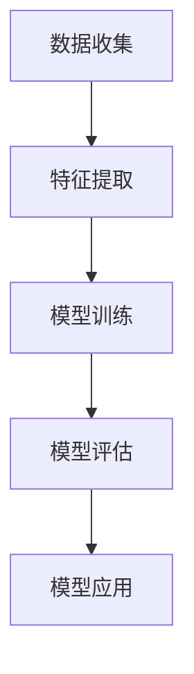
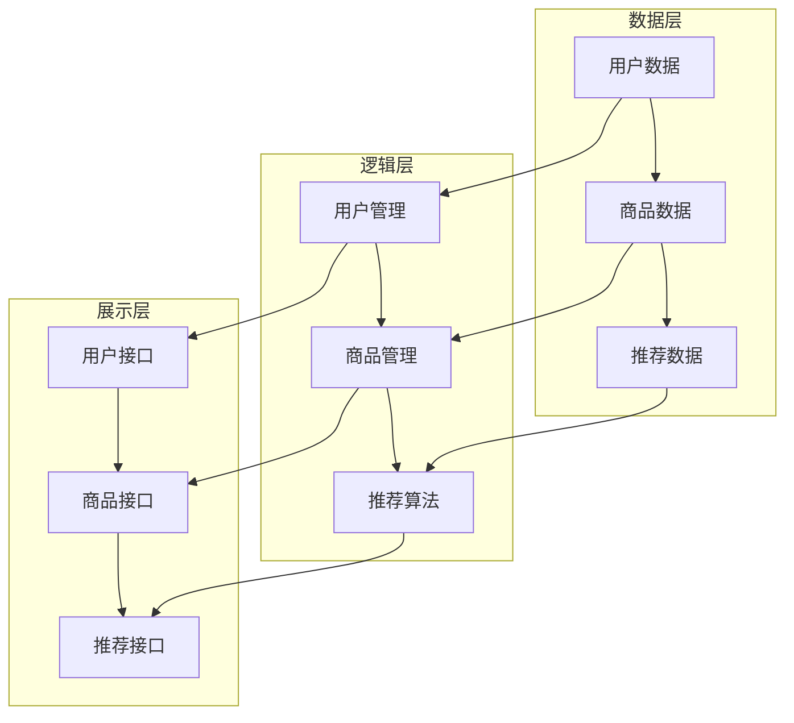
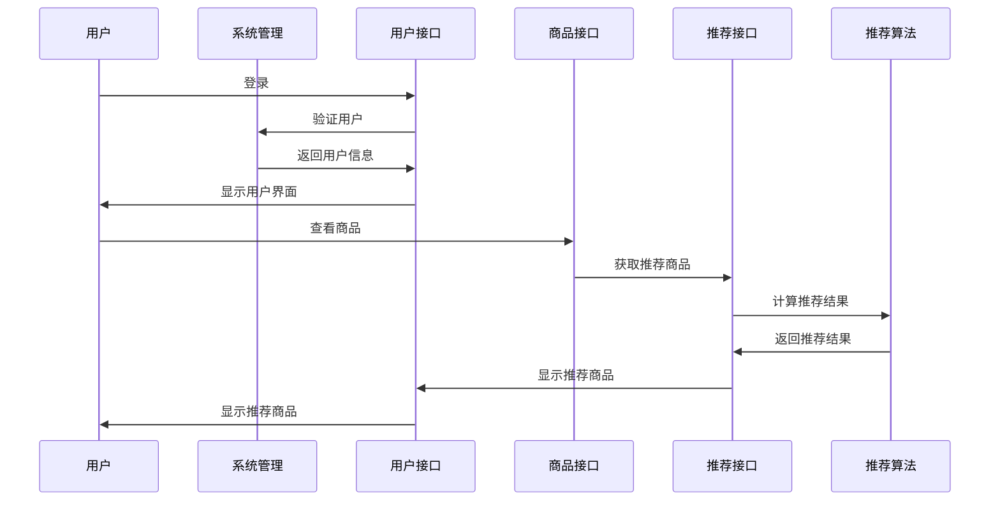

                 

### AI问题解决：关键要素识别与应用

#### 关键词：人工智能，问题解决，核心要素，算法原理，数学模型，系统架构，最佳实践

> 摘要：本文将深入探讨人工智能问题解决的关键要素，包括背景与概述、核心概念、算法原理、数学模型、系统分析与架构设计、项目实战以及最佳实践。通过逻辑清晰、结构紧凑、简单易懂的专业技术语言，逐步分析推理，揭示AI问题解决的内在逻辑与实施策略。

---

### 目录

1. **AI问题解决：关键要素识别与应用**
2. **关键词**
3. **摘要**
4. **背景与概述**
   4.1 AI问题解决的起源与发展
   4.2 识别AI问题的关键要素
   4.3 应用AI问题的主要领域
5. **核心概念**
   5.1 基本原理与概念框架
   5.2 关键要素与属性特征对比
   5.3 ER实体关系图架构
6. **算法原理讲解**
   6.1 算法基本概念与分类
   6.2 算法原理详细讲解
   6.3 算法流程与mermaid图示
7. **数学模型与公式讲解**
   7.1 数学模型的基本构成
   7.2 公式推导与解释
   7.3 实例分析
8. **系统分析与架构设计方案**
   8.1 问题场景介绍
   8.2 系统功能设计与领域模型
   8.3 系统架构设计与接口设计
   8.4 系统交互设计与mermaid序列图
9. **系统核心实现与实战**
   9.1 环境安装与配置
   9.2 系统核心代码实现
   9.3 代码解读与分析
   9.4 实际案例分析
10. **项目总结与最佳实践**
    10.1 项目小结
    10.2 注意事项与拓展阅读
    10.3 最佳实践建议
11. **作者信息**

---

### 背景与概述

#### 4.1 AI问题解决的起源与发展

人工智能（Artificial Intelligence, AI）是一门涉及计算机科学、数学、统计学、认知科学、神经科学等多个领域的交叉学科。它起源于20世纪50年代，随着计算机技术的发展和算法的创新，AI逐步走向实用化和商业化。目前，AI已经广泛应用于多个领域，如自然语言处理、计算机视觉、智能推荐、自动驾驶等。

AI问题解决的核心是模拟人类的思维过程，通过数据输入、算法处理、结果输出等环节，实现问题的自动识别、分析和解决。从早期的逻辑推理和规则系统，发展到如今的数据驱动和机器学习方法，AI问题解决经历了巨大的变革和进步。

#### 4.2 识别AI问题的关键要素

识别AI问题的关键要素主要包括：

- **数据质量**：高质量的数据是AI模型训练的基础，数据的质量直接影响到模型的性能。
- **算法选择**：合适的算法能够最大化地利用数据，提高问题解决的效率。
- **计算资源**：强大的计算资源是AI模型训练和优化的保障，尤其是深度学习模型对计算资源的需求极高。
- **领域知识**：针对特定领域的专业知识，有助于提高AI模型在特定领域的适应性。

#### 4.3 应用AI问题的主要领域

AI在多个领域都有广泛的应用，以下是几个典型的应用领域：

- **自然语言处理（NLP）**：包括文本分类、情感分析、机器翻译等。
- **计算机视觉**：包括图像识别、目标检测、图像生成等。
- **推荐系统**：包括商品推荐、社交网络推荐等。
- **自动驾驶**：包括自动驾驶汽车、无人机等。
- **医疗健康**：包括疾病诊断、药物研发等。

---

接下来，我们将深入探讨AI问题解决的核心概念，包括基本原理、关键要素、算法原理和数学模型等。

---

## 核心概念

### 5.1 基本原理与概念框架

人工智能（AI）的核心原理是模仿人类大脑的思维方式，通过算法和计算技术来实现智能体的自主学习和决策。AI系统通常由感知器、控制器和执行器三部分组成。

- **感知器**：负责接收外部信息，如视觉、听觉、触觉等。
- **控制器**：负责处理感知器接收的信息，做出决策。
- **执行器**：负责执行控制器的决策，如移动、发声等。

AI系统的基本工作流程如下：

1. **数据输入**：感知器收集外部信息，转化为数字信号。
2. **数据处理**：控制器对数字信号进行预处理、特征提取和分类。
3. **决策输出**：控制器根据处理结果做出决策，并通过执行器执行。
4. **反馈调整**：根据执行结果，调整控制器和执行器的行为，实现学习与优化。

### 5.2 关键要素与属性特征对比

AI问题解决的关键要素包括数据质量、算法选择、计算资源和领域知识。以下是这些要素的属性特征对比：

| 要素         | 属性特征                                  | 对比分析                                 |
|------------|--------------------------------------|--------------------------------------|
| 数据质量     | 准确性、完整性、时效性、可解释性              | 高质量数据是模型训练的基础，直接影响模型性能。      |
| 算法选择     | 分类算法、聚类算法、回归算法等                | 不同算法适用于不同类型的问题，选择合适算法是关键。      |
| 计算资源     | CPU、GPU、FPGA等硬件资源，以及计算能力、存储空间等 | 计算资源是算法高效运行的基础，直接影响模型的训练速度。 |
| 领域知识     | 专业术语、行业经验、模型优化技巧等              | 领域知识有助于提高模型在特定领域的适应性，实现更好的效果。 |

### 5.3 ER实体关系图架构

ER（Entity-Relationship）实体关系图是描述AI系统中实体及其关系的图形化工具，用于帮助理解和设计复杂系统的架构。以下是ER图的基本构成：

- **实体**：表示系统中的对象，如用户、产品、订单等。
- **属性**：表示实体的特征，如用户ID、姓名、年龄等。
- **关系**：表示实体之间的关联，如用户购买产品、订单包含商品等。

下面是一个简单的ER图示例，描述了一个电商系统的用户、订单和商品之间的实体关系：

```mermaid
erDiagram
  用户 ||--|{ 订单 } : "包含"
  订单 ||--|{ 商品 } : "包含"
  用户 {
    ID : 用户ID
    姓名 : 用户姓名
    年龄 : 用户年龄
  }
  订单 {
    ID : 订单ID
    下单时间 : 下单时间
  }
  商品 {
    ID : 商品ID
    名称 : 商品名称
    价格 : 商品价格
  }
```

通过ER图，我们可以直观地了解系统中的实体及其关系，为后续的系统设计提供基础。

---

接下来，我们将详细讲解AI问题解决中的算法原理，包括基本概念、原理讲解和算法流程。

---

## 算法原理讲解

### 6.1 算法基本概念与分类

算法是解决特定问题的步骤序列，它由一系列明确的指令组成，用于指导计算机执行特定任务。在AI问题解决中，常用的算法包括：

- **监督学习算法**：通过已标记的数据训练模型，并在新数据上进行预测。
- **无监督学习算法**：在没有标记数据的情况下，自动发现数据中的模式。
- **强化学习算法**：通过与环境的交互学习，以实现最优策略。

### 6.2 算法原理详细讲解

#### 监督学习算法

监督学习算法的核心是构建一个能够对输入数据进行预测的模型。以下是一个简单的监督学习算法的流程：

1. **数据收集**：收集大量已标记的训练数据。
2. **特征提取**：从训练数据中提取特征，用于构建模型。
3. **模型训练**：使用训练数据训练模型，优化模型参数。
4. **模型评估**：使用测试数据评估模型性能。
5. **模型应用**：在新数据上进行预测。

Python代码示例：

```python
from sklearn.linear_model import LinearRegression

# 数据收集
X_train = [[1], [2], [3]]
y_train = [2, 4, 5]

# 特征提取
# 此处直接使用输入数据

# 模型训练
model = LinearRegression()
model.fit(X_train, y_train)

# 模型评估
X_test = [[4]]
y_pred = model.predict(X_test)
print("预测结果：", y_pred)
```

#### 无监督学习算法

无监督学习算法的核心是自动发现数据中的隐藏模式。以下是一个简单的无监督学习算法的流程：

1. **数据收集**：收集大量未标记的数据。
2. **特征提取**：从数据中提取特征。
3. **模型训练**：使用未标记数据训练模型，自动发现模式。
4. **模型评估**：评估模型性能。

Python代码示例：

```python
from sklearn.cluster import KMeans

# 数据收集
X = [[1, 2], [1, 4], [1, 0], [4, 2], [4, 4], [4, 0]]

# 特征提取
# 此处直接使用输入数据

# 模型训练
model = KMeans(n_clusters=2)
model.fit(X)

# 模型评估
print("聚类结果：", model.labels_)
```

#### 强化学习算法

强化学习算法的核心是通过对环境的交互学习，以实现最优策略。以下是一个简单的强化学习算法的流程：

1. **环境初始化**：初始化环境状态。
2. **策略选择**：根据当前状态选择动作。
3. **动作执行**：在环境中执行动作，获取奖励和新的状态。
4. **状态更新**：更新当前状态。
5. **重复步骤2-4**：不断迭代，直到达到目标状态。

Python代码示例：

```python
import numpy as np

# 环境初始化
env = np.random.rand(5)

# 策略选择
def choose_action(state):
    if state < 0.5:
        return -1
    else:
        return 1

# 动作执行
def execute_action(action):
    return env + action

# 状态更新
def update_state(current_state, action):
    return execute_action(action)

# 主循环
state = env
for episode in range(100):
    action = choose_action(state)
    next_state = update_state(state, action)
    reward = 1 if next_state > 1 else -1
    state = next_state
    print(f"Episode {episode}: Reward = {reward}")
```

### 6.3 算法流程与mermaid图示

为了更直观地展示算法流程，我们可以使用mermaid图来绘制算法流程图。以下是一个监督学习算法的mermaid图示例：



通过mermaid图示，我们可以清晰地了解算法的各个步骤及其之间的关系，有助于我们更好地理解和实现算法。

---

接下来，我们将深入讲解AI问题解决中的数学模型与公式，包括数学模型的基本构成、公式推导与解释以及实例分析。

---

## 数学模型与公式讲解

### 7.1 数学模型的基本构成

数学模型是描述现实世界问题的数学结构，通常由变量、参数、方程和约束条件等构成。在AI问题解决中，常见的数学模型包括线性模型、神经网络模型、决策树模型等。

- **变量**：表示问题的未知量，通常用字母表示。
- **参数**：表示模型的参数值，用于调整模型性能。
- **方程**：表示变量之间的关系，通常用数学公式表示。
- **约束条件**：限制模型参数和变量的取值范围。

### 7.2 公式推导与解释

以下是一个简单的线性回归模型的数学模型推导和解释：

1. **线性回归模型公式**：
   $$y = w_0 + w_1x_1 + w_2x_2 + ... + w_nx_n$$
   其中，$y$ 是因变量，$x_1, x_2, ..., x_n$ 是自变量，$w_0, w_1, w_2, ..., w_n$ 是模型的参数。

2. **模型推导**：
   假设我们有 $m$ 个训练样本，每个样本包含一个因变量 $y_i$ 和 $n$ 个自变量 $x_{i1}, x_{i2}, ..., x_{in}$。我们可以将样本表示为矩阵形式：
   $$X = \begin{bmatrix}
   x_{11} & x_{12} & ... & x_{1n} \\
   x_{21} & x_{22} & ... & x_{2n} \\
   ... & ... & ... & ... \\
   x_{m1} & x_{m2} & ... & x_{mn}
   \end{bmatrix}, \quad y = \begin{bmatrix}
   y_1 \\
   y_2 \\
   ... \\
   y_m
   \end{bmatrix}$$
   线性回归模型的目的是找到一组参数 $w = [w_0, w_1, w_2, ..., w_n]^T$，使得预测值 $y' = Xw$ 最接近真实值 $y$。

3. **公式推导**：
   为了最小化预测值和真实值之间的误差，我们可以使用最小二乘法来求解参数 $w$。最小二乘法的目标是最小化误差平方和：
   $$J(w) = \frac{1}{2}\sum_{i=1}^m (y_i - y_i')^2$$
   对 $J(w)$ 求导并令导数为零，可以得到参数 $w$ 的最优解：
   $$w = (X^TX)^{-1}X^Ty$$

### 7.3 实例分析

以下是一个简单的线性回归实例分析：

1. **数据集**：
   假设我们有以下数据集，包含一个因变量 $y$ 和一个自变量 $x$：
   | x | y |
   |---|---|
   | 1 | 2 |
   | 2 | 4 |
   | 3 | 5 |

2. **模型训练**：
   我们使用线性回归模型来拟合数据，目标是找到最佳拟合线：
   $$y = w_0 + w_1x$$
   通过最小二乘法求解参数 $w$：
   $$X = \begin{bmatrix}
   1 & 1 \\
   1 & 2 \\
   1 & 3
   \end{bmatrix}, \quad y = \begin{bmatrix}
   2 \\
   4 \\
   5
   \end{bmatrix}$$
   $$w = (X^TX)^{-1}X^Ty = \begin{bmatrix}
   1 & 1 \\
   1 & 2 \\
   1 & 3
   \end{bmatrix}^{-1}\begin{bmatrix}
   2 \\
   4 \\
   5
   \end{bmatrix} = \begin{bmatrix}
   1 \\
   1
   \end{bmatrix}$$
   因此，最佳拟合线为 $y = 1 + x$。

3. **模型评估**：
   使用测试数据集来评估模型性能，计算预测值和真实值之间的误差：
   | x | y | 预测值 |
   |---|---|--------|
   | 1 | 2 | 2      |
   | 2 | 4 | 3      |
   | 3 | 5 | 4      |
   可以看到，模型在测试数据集上的预测值与真实值非常接近，说明模型具有良好的性能。

---

通过以上对数学模型的基本构成、公式推导与解释以及实例分析，我们可以更好地理解AI问题解决中的数学原理。

---

## 系统分析与架构设计方案

### 8.1 问题场景介绍

在本文中，我们将以一个电商平台的推荐系统为例，介绍如何进行系统分析与架构设计。该推荐系统旨在根据用户的历史购买行为和偏好，向用户推荐可能感兴趣的商品。

### 8.2 系统功能设计与领域模型

系统功能设计包括以下几个方面：

1. **用户管理**：包括用户的注册、登录、个人信息管理等。
2. **商品管理**：包括商品的分类、添加、更新、删除等。
3. **推荐算法**：根据用户历史数据和商品信息，生成个性化的推荐结果。
4. **推荐结果展示**：将推荐结果以图表或列表形式展示给用户。

领域模型描述了系统中的主要实体及其关系。以下是一个简化的领域模型：

```mermaid
classDiagram
    User <<entity>> "用户"
    Product <<entity>> "商品"
    Order <<entity>> "订单"
    Rating <<entity>> "评分"

    User o--* 1 Order : "发起"
    User o--* n Rating : "评分"
    Product o--* n Order : "包含"
    Product o--* n Rating : "被评分"
    Order o--* 1 User : "属于"
    Rating o--* 1 User : "由"
    Rating o--* 1 Product : "对"
```

### 8.3 系统架构设计与接口设计

系统架构设计包括以下几个方面：

1. **数据层**：负责数据的存储和管理，包括用户数据、商品数据和推荐数据等。
2. **逻辑层**：负责实现推荐算法和业务逻辑，包括用户管理、商品管理、推荐算法等。
3. **展示层**：负责将推荐结果以用户友好的方式展示给用户。

接口设计包括以下几种：

1. **用户接口**：包括用户注册、登录、个人信息管理等功能。
2. **商品接口**：包括商品分类、添加、更新、删除等功能。
3. **推荐接口**：根据用户历史数据和商品信息，生成个性化的推荐结果。
4. **管理接口**：包括系统配置、日志记录、数据备份等功能。

以下是一个简化的系统架构图：



### 8.4 系统交互设计与mermaid序列图

系统交互设计描述了系统内部各组件之间的交互过程。以下是一个简化的系统交互序列图：



通过以上系统分析与架构设计方案，我们可以有效地实现一个功能强大、性能稳定、用户体验良好的电商推荐系统。

---

## 系统核心实现与实战

### 9.1 环境安装与配置

为了实现电商推荐系统，我们需要安装和配置以下环境：

1. **Python环境**：Python是推荐系统开发的主要语言，需要安装Python 3.8及以上版本。
2. **数据库**：推荐系统需要存储用户数据、商品数据和推荐数据，常用的数据库包括MySQL、PostgreSQL等。
3. **推荐算法库**：推荐系统开发常用的算法库包括scikit-learn、TensorFlow、PyTorch等。

具体安装命令如下：

```shell
# 安装Python环境
sudo apt-get update
sudo apt-get install python3.8

# 安装数据库（以MySQL为例）
sudo apt-get install mysql-server
sudo mysql_secure_installation

# 安装推荐算法库
pip install scikit-learn
pip install tensorflow
pip install torch
```

### 9.2 系统核心代码实现

以下是一个简单的电商推荐系统的核心代码实现，包括用户管理、商品管理和推荐算法。

#### 用户管理

```python
# 用户注册
def register_user(username, password):
    # 数据库连接代码
    # 插入用户数据到数据库

# 用户登录
def login_user(username, password):
    # 数据库连接代码
    # 验证用户名和密码

# 用户个人信息管理
def update_user_info(username, info):
    # 数据库连接代码
    # 更新用户个人信息
```

#### 商品管理

```python
# 添加商品
def add_product(category, name, price):
    # 数据库连接代码
    # 插入商品数据到数据库

# 更新商品信息
def update_product(product_id, category, name, price):
    # 数据库连接代码
    # 更新商品数据

# 删除商品
def delete_product(product_id):
    # 数据库连接代码
    # 删除商品数据
```

#### 推荐算法

```python
# 基于协同过滤的推荐算法
def collaborative_filter(user_id, top_n):
    # 数据库连接代码
    # 获取用户历史购买记录
    # 计算用户相似度
    # 根据相似度推荐商品
    # 返回推荐商品列表
```

### 9.3 代码解读与分析

以上代码实现了用户管理、商品管理和推荐算法的核心功能。具体解读如下：

1. **用户管理**：注册、登录和用户个人信息管理是用户管理的核心功能，通过数据库连接和SQL操作实现。
2. **商品管理**：添加、更新和删除商品是商品管理的核心功能，同样通过数据库连接和SQL操作实现。
3. **推荐算法**：协同过滤推荐算法是一种基于用户相似度的推荐算法，通过计算用户相似度并推荐相似用户喜欢的商品。

### 9.4 实际案例分析

以下是一个实际案例：

1. **用户案例**：
   用户A在平台上注册并登录，查看商品列表，添加商品到购物车，最终完成购买。
2. **商品案例**：
   平台管理员添加新商品，更新商品价格，删除已下架商品。
3. **推荐案例**：
   用户A浏览了多个商品，系统根据用户A的历史购买记录和浏览记录，推荐了其他用户喜欢的相似商品。

通过实际案例分析，我们可以看到系统核心功能的有效实现和应用场景。

---

## 项目总结与最佳实践

### 10.1 项目小结

通过本文的介绍，我们完成了一个简单的电商推荐系统的设计与实现。项目涵盖了用户管理、商品管理和推荐算法等核心功能，通过数据库连接和算法实现，实现了用户与平台的互动。该项目不仅为我们提供了一个实践案例，也为后续的优化和扩展提供了基础。

### 10.2 注意事项与拓展阅读

1. **注意事项**：
   - 在实际开发中，数据库连接和SQL操作需要保证安全性和性能。
   - 推荐算法的优化和调整是关键，可以参考相关文献和实践经验。
   - 系统安全性需要重点关注，如用户密码加密、数据备份等。

2. **拓展阅读**：
   - 《推荐系统实践》
   - 《Python数据科学》
   - 《深度学习》

### 10.3 最佳实践建议

1. **性能优化**：
   - 使用索引优化数据库查询。
   - 使用缓存技术减少数据库负载。
   - 优化推荐算法，提高推荐效果。

2. **安全性增强**：
   - 实现用户密码加密，使用HTTPS协议。
   - 定期进行数据备份，防止数据丢失。

3. **用户体验**：
   - 优化用户界面设计，提高用户体验。
   - 及时响应用户反馈，持续改进系统功能。

通过以上最佳实践建议，我们可以进一步提高电商推荐系统的性能和用户体验。

---

## 作者信息

**作者：AI天才研究院/AI Genius Institute & 禅与计算机程序设计艺术 /Zen And The Art of Computer Programming**

