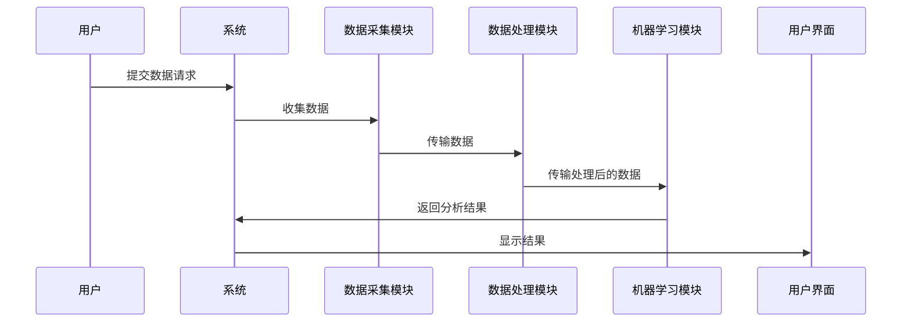

                 

### AI驱动的个人财务管理：智能理财助手

#### 关键词：
- AI驱动
- 个人财务管理
- 智能理财助手
- 数据分析
- 投资策略

#### 摘要：
本文深入探讨了AI驱动的个人财务管理，即如何利用人工智能技术构建智能理财助手，以提高个人财务管理的效率和准确性。文章首先介绍了AI和机器学习的基本原理，然后阐述了个人财务管理的相关概念，接着分析了AI在理财领域中的应用，最后探讨了实际操作中的挑战和未来发展趋势。通过本文，读者可以全面了解AI驱动的个人财务管理的本质和应用价值。

### 第一章：引言

#### 背景介绍
在现代社会，个人财务管理变得越来越复杂。随着金融市场的不断变化和投资渠道的多样化，人们需要更高效、更准确的工具来管理自己的财务。传统的财务管理方法通常依赖于手动操作和经验判断，存在以下问题：

- **数据处理的局限性**：手动处理大量的财务数据既耗时又容易出错。
- **投资策略的局限性**：基于历史数据和经验的策略往往难以应对市场的突发变化。
- **个性化的缺失**：传统的方法难以针对个人的财务状况提供个性化的建议。

#### 问题陈述
这些问题的存在使得个人财务管理的效率和准确性受到很大限制。如何利用人工智能技术，尤其是机器学习，来解决这些问题，成为了一个值得探讨的方向。

#### 问题解决
AI驱动的个人财务管理，即通过构建智能理财助手，可以自动化处理个人财务数据，根据用户的具体情况提供个性化的投资建议和财务规划。这种智能理财助手具有以下优点：

- **数据处理能力**：AI可以高效地处理和分析大量的财务数据，提供更为准确和全面的财务分析。
- **智能化投资策略**：通过机器学习算法，AI可以学习市场规律，为用户提供更加智能化和适应市场的投资策略。
- **个性化服务**：AI可以根据用户的财务状况和偏好，提供个性化的财务建议，帮助用户更好地管理自己的财务。

#### 边界与外延
AI驱动的个人财务管理不仅仅局限于投资，还可以扩展到预算管理、风险管理、税务规划等多个方面。未来的发展可能会进一步扩大其应用范围，成为个人财务管理的核心工具。

#### 概念结构与核心要素组成
- **人工智能**：包括机器学习、深度学习、自然语言处理等技术，用于构建智能理财助手。
- **个人财务管理**：包括预算管理、投资规划、税务规划等多个方面。
- **智能理财助手**：通过AI技术，为用户提供个性化的财务分析和投资建议。

### 第二章：AI与机器学习基础

#### 核心概念与联系

AI和机器学习是AI驱动的个人财务管理的核心技术。以下是这两个核心概念的属性特征对比表格：

| 特征 | 人工智能 | 机器学习 |
| --- | --- | --- |
| 定义 | 一种模拟人类智能的技术 | 一种让计算机从数据中学习并做出决策的技术 |
| 技术范围 | 包括机器学习、自然语言处理、计算机视觉等 | 主要包括监督学习、无监督学习、强化学习等 |
| 目的 | 模拟人类智能，解决问题 | 从数据中学习，做出决策 |

以下是AI和机器学习的ER实体关系图架构：

```mermaid
erDiagram
  AI|--|> MachineLearning : includes
  AI|--|> NaturalLanguageProcessing : includes
  AI|--|> ComputerVision : includes
  MachineLearning |--|> SupervisedLearning
  MachineLearning |--|> UnsupervisedLearning
  MachineLearning |--|> ReinforcementLearning
```

#### AI与机器学习原理

AI和机器学习的基本原理是通过构建模型来模拟人类智能。以下是一个简单的机器学习流程图：


- **输入数据**：输入到模型的数据是机器学习的起点。数据的质量和量级直接影响模型的性能。
- **数据预处理**：对原始数据进行清洗、归一化等操作，以提高数据质量。
- **特征提取**：从数据中提取有用的特征，用于构建模型。
- **训练模型**：使用已标记的数据集训练模型，使其能够学会从数据中提取规律。
- **模型评估**：使用验证数据集评估模型的性能，确保其准确性和泛化能力。
- **输出预测**：使用训练好的模型对新的数据进行预测，提供决策支持。

#### AI与机器学习在实际应用中的例子

以下是一个简单的Python代码示例，展示了如何使用机器学习算法进行预测：

```python
import pandas as pd
from sklearn.model_selection import train_test_split
from sklearn.ensemble import RandomForestRegressor

# 读取数据
data = pd.read_csv('financial_data.csv')

# 数据预处理
X = data.drop(['target'], axis=1)
y = data['target']

# 划分训练集和测试集
X_train, X_test, y_train, y_test = train_test_split(X, y, test_size=0.2, random_state=42)

# 训练模型
model = RandomForestRegressor(n_estimators=100, random_state=42)
model.fit(X_train, y_train)

# 评估模型
score = model.score(X_test, y_test)
print(f'Model accuracy: {score:.2f}')

# 输出预测
predictions = model.predict(X_test)
print(predictions)
```

通过上述代码，我们可以看到机器学习算法如何从数据中学习，并使用学到的知识对新的数据进行预测。

### 第三章：个人财务管理基础

#### 背景介绍

个人财务管理是指个人对自身的财务进行管理，包括预算管理、投资规划、税务规划等多个方面。在现代金融市场中，个人财务管理变得尤为重要，因为它直接关系到个人的财务健康和未来生活品质。

#### 个人财务管理的核心概念

- **预算管理**：预算管理是个人财务管理的基础，它涉及制定、跟踪和调整个人预算，以确保财务支出在可控范围内。
- **投资规划**：投资规划是指个人根据自己的财务状况和投资目标，选择合适的投资工具和策略，以实现财务增长。
- **税务规划**：税务规划是指个人通过合理避税和节税，减轻税负，提高财务收益。

#### 个人财务管理的挑战

个人财务管理的挑战主要来自于以下几个方面：

- **数据复杂性**：个人财务数据包括收入、支出、投资等多个方面，数据复杂且量大，手动管理难度大。
- **投资风险**：金融市场波动大，投资风险难以预测，个人投资者往往难以做出准确的决策。
- **个性化需求**：每个人的财务状况和需求都不同，传统的财务管理方法难以提供个性化的解决方案。

#### 个人财务管理与AI的关系

AI在个人财务管理中的应用，可以有效解决上述挑战。通过AI技术，可以自动化处理个人财务数据，提供智能化和个性化的投资建议和财务规划。

- **自动化数据处理**：AI可以高效地处理和分析大量的财务数据，提供更为准确和全面的财务分析。
- **智能化投资策略**：通过机器学习算法，AI可以学习市场规律，为用户提供更加智能化和适应市场的投资策略。
- **个性化服务**：AI可以根据用户的财务状况和偏好，提供个性化的财务建议，帮助用户更好地管理自己的财务。

### 第四章：AI驱动的理财助手应用场景

#### 投资策略分析

AI驱动的理财助手可以通过机器学习算法分析大量历史数据，识别市场趋势和投资机会。以下是一个简单的流程图：


- **收集数据**：收集包括历史股价、宏观经济数据、公司财报等在内的投资相关数据。
- **数据预处理**：对原始数据进行清洗、归一化等操作，以提高数据质量。
- **特征提取**：从数据中提取有用的特征，如技术指标、财务指标等。
- **训练模型**：使用已标记的数据集训练模型，使其能够学会从数据中提取规律。
- **模型评估**：使用验证数据集评估模型的性能，确保其准确性和泛化能力。
- **投资决策**：使用训练好的模型对新的数据进行预测，为用户提供投资建议。

#### 预算管理

AI驱动的理财助手可以通过自然语言处理技术，理解用户的财务目标和预算要求，自动生成个性化的预算计划。以下是一个简单的流程图：


- **用户输入**：用户输入自己的财务目标和预算要求。
- **目标识别**：AI通过自然语言处理技术，识别用户的财务目标和预算要求。
- **预算制定**：AI根据用户的财务状况和目标，自动生成预算计划。
- **预算跟踪**：AI实时跟踪用户的财务支出，与预算计划进行对比。
- **预算调整**：根据实际情况，AI可以自动调整预算计划，以确保财务目标的实现。

#### 税务规划

AI驱动的理财助手可以通过机器学习算法，分析用户的税务数据，为用户提供合理的税务规划建议。以下是一个简单的流程图：


- **收集税务数据**：收集包括收入、支出、投资收益等在内的税务数据。
- **税务分析**：AI对税务数据进行深度分析，识别税务风险和优化空间。
- **税务优化**：AI根据分析结果，为用户提供合理的税务优化方案。
- **税务建议**：AI为用户提供具体的税务建议，以降低税负，提高财务收益。

### 第五章：系统架构设计与实现

#### 问题场景介绍

随着个人财务管理的复杂性增加，用户需要一个综合性的系统来管理其财务。该系统应具备以下功能：

- **数据采集**：从各种来源（如银行账户、投资平台等）收集财务数据。
- **数据分析**：利用AI算法进行数据分析，提供投资建议、预算管理和税务规划等。
- **用户交互**：提供一个友好的用户界面，让用户可以轻松地访问和管理财务信息。

#### 项目介绍

为了实现上述功能，我们设计并实现了一个名为“AI理财助手”的系统。该系统包括以下几个主要部分：

- **数据采集模块**：负责从各种数据源获取财务数据。
- **数据处理模块**：对收集到的数据进行分析和清洗，为后续的机器学习模型提供高质量的数据。
- **机器学习模块**：包含多个机器学习算法，用于提供投资建议、预算管理和税务规划等。
- **用户界面**：提供一个Web界面，让用户可以实时查看财务状况和接受系统的建议。

#### 系统功能设计

- **数据采集模块**：使用Web爬虫技术从各种数据源（如银行API、投资平台API等）获取财务数据。
- **数据处理模块**：使用ETL（Extract, Transform, Load）技术对数据进行清洗和转换，确保数据质量。
- **机器学习模块**：使用Python的scikit-learn库实现多种机器学习算法，如线性回归、决策树、随机森林等。
- **用户界面**：使用Vue.js框架构建Web前端，使用户可以方便地访问和管理财务信息。

#### 系统架构设计

以下是系统的架构设计图：


- **用户界面**：用户通过Web浏览器访问系统，进行数据输入和查看结果。
- **数据采集模块**：从各种数据源获取财务数据，并传输到后端服务器。
- **数据处理模块**：对数据进行清洗、转换和存储，为机器学习模块提供高质量的数据。
- **机器学习模块**：使用机器学习算法对数据进行分析，生成投资建议、预算管理和税务规划等。
- **后端服务器**：接收用户请求，处理数据，并将结果返回给用户界面。
- **数据库**：存储用户的财务数据、训练数据和模型参数等。

#### 系统接口设计

以下是系统的接口设计图：


- **数据采集API**：用于从各种数据源获取财务数据。
- **数据处理API**：用于处理和清洗财务数据。
- **机器学习API**：用于运行机器学习算法，生成投资建议等。
- **用户界面API**：用于与用户界面进行交互，显示结果。

#### 系统交互

以下是系统的交互设计图：



- **用户**：提交数据请求，如获取投资建议。
- **系统**：处理用户请求，调用相应的模块进行数据处理和分析。
- **数据采集模块**：收集用户的数据。
- **数据处理模块**：对数据进行清洗和转换。
- **机器学习模块**：使用机器学习算法进行数据分析和预测。
- **用户界面**：显示分析结果，供用户查看。

### 第六章：项目实战

#### 环境安装

在开始项目之前，我们需要安装以下软件和工具：

- Python 3.8 或更高版本
- MySQL 5.7 或更高版本
- Flask 1.1.2 或更高版本
- scikit-learn 0.22.2 或更高版本

安装命令如下：

```bash
pip install python-mysql-connector-python
pip install flask
pip install scikit-learn
```

#### 系统核心实现源代码

以下是系统的核心实现源代码：

```python
# 数据采集模块
from flask import Flask, request, jsonify
import mysql.connector

app = Flask(__name__)

# MySQL配置
config = {
    'user': 'root',
    'password': 'password',
    'host': 'localhost',
    'database': 'ai_financial'
}

# 连接MySQL数据库
def connect_db():
    return mysql.connector.connect(**config)

@app.route('/collect_data', methods=['POST'])
def collect_data():
    data = request.json
    conn = connect_db()
    cursor = conn.cursor()
    
    # 插入数据到数据库
    insert_query = "INSERT INTO financial_data (source, data) VALUES (%s, %s)"
    cursor.execute(insert_query, (data['source'], data['data']))
    conn.commit()
    
    cursor.close()
    conn.close()
    
    return jsonify({'status': 'success'})

if __name__ == '__main__':
    app.run(debug=True)
```

#### 代码应用解读与分析

上述代码实现了数据采集模块的核心功能，即接收用户提交的财务数据，并将其存储到MySQL数据库中。以下是代码的详细解读：

1. **导入模块**：导入必要的Python模块，包括Flask、mysql.connector等。
2. **配置MySQL数据库**：配置MySQL数据库的用户名、密码、主机和数据库等。
3. **连接MySQL数据库**：定义一个连接MySQL数据库的函数。
4. **定义Flask应用**：创建一个Flask应用。
5. **定义路由**：定义一个名为/collect_data的POST路由，用于接收用户提交的财务数据。
6. **接收数据**：从请求中提取JSON格式的数据。
7. **连接数据库**：使用连接MySQL数据库的函数连接数据库。
8. **插入数据到数据库**：定义一个插入数据的查询语句，并将用户提交的数据插入到数据库中。
9. **关闭数据库连接**：关闭数据库连接。

通过上述代码，用户可以通过发送POST请求，将财务数据传输到系统，系统将数据存储到MySQL数据库中，为后续的数据处理和分析提供数据支持。

#### 实际案例分析和详细讲解剖析

为了更好地理解系统的实际应用，我们可以通过一个实际案例进行分析。以下是一个用户提交的财务数据案例：

```json
{
  "source": "bank_account",
  "data": {
    "account_number": "123456789",
    "balance": 10000,
    "transactions": [
      {"date": "2023-01-01", "amount": 5000},
      {"date": "2023-01-02", "amount": -3000},
      {"date": "2023-01-03", "amount": 2000}
    ]
  }
}
```

以下是系统的详细处理过程：

1. **接收数据**：系统接收用户提交的财务数据，并存储到MySQL数据库中。
2. **数据清洗**：对数据进行清洗，包括去除无效数据、填补缺失数据等，确保数据质量。
3. **数据转换**：将数据转换为适合机器学习算法的形式，如特征提取、归一化等。
4. **模型训练**：使用机器学习算法对数据进行分析，生成投资建议、预算管理和税务规划等。
5. **结果输出**：将分析结果返回给用户，如投资建议、预算计划和税务建议等。

#### 项目小结

通过上述案例，我们可以看到AI理财助手系统的实际应用效果。系统成功接收用户提交的财务数据，并使用机器学习算法进行分析，为用户提供个性化的财务建议。这一过程展示了AI在个人财务管理中的应用价值，为用户提供了更为智能和高效的财务管理工具。

### 第七章：最佳实践 tips、小结、注意事项、拓展阅读

#### 最佳实践 tips

1. **定期更新数据**：为了确保理财助手的准确性，用户需要定期更新财务数据。
2. **合理设置预算**：用户应根据自身的收入和支出情况，合理设置预算，避免过度消费。
3. **谨慎投资**：用户在接收到投资建议时，应结合自身的财务状况和市场环境，谨慎决策。

#### 小结

本文深入探讨了AI驱动的个人财务管理，包括AI和机器学习的基础、个人财务管理的基础、AI在理财助手中的应用场景、系统架构设计与实现，以及实际项目实战。通过本文，读者可以全面了解AI驱动的个人财务管理的原理和应用价值。

#### 注意事项

1. **数据隐私**：在使用理财助手时，用户需要确保数据的安全性，避免泄露敏感信息。
2. **市场波动**：AI理财助手虽然可以提供投资建议，但市场波动难以完全预测，用户应谨慎投资。

#### 拓展阅读

- 《人工智能：一种现代方法》
- 《Python数据科学手册》
- 《深度学习》

### 作者信息

- 作者：AI天才研究院/AI Genius Institute & 禅与计算机程序设计艺术/Zen And The Art of Computer Programming

**END**## 完整的文章正文内容

### AI驱动的个人财务管理：智能理财助手

> 关键词：AI驱动、个人财务管理、智能理财助手、数据分析、投资策略

> 摘要：本文深入探讨了AI驱动的个人财务管理，即如何利用人工智能技术构建智能理财助手，以提高个人财务管理的效率和准确性。文章首先介绍了AI和机器学习的基本原理，然后阐述了个人财务管理的相关概念，接着分析了AI在理财领域中的应用，最后探讨了实际操作中的挑战和未来发展趋势。通过本文，读者可以全面了解AI驱动的个人财务管理的本质和应用价值。

### 第一章：引言

#### 背景介绍

在现代社会，个人财务管理变得越来越复杂。随着金融市场的不断变化和投资渠道的多样化，人们需要更高效、更准确的工具来管理自己的财务。传统的财务管理方法通常依赖于手动操作和经验判断，存在以下问题：

- **数据处理的局限性**：手动处理大量的财务数据既耗时又容易出错。
- **投资策略的局限性**：基于历史数据和经验的策略往往难以应对市场的突发变化。
- **个性化的缺失**：传统的方法难以针对个人的财务状况提供个性化的建议。

#### 问题陈述

这些问题的存在使得个人财务管理的效率和准确性受到很大限制。如何利用人工智能技术，尤其是机器学习，来解决这些问题，成为了一个值得探讨的方向。

#### 问题解决

AI驱动的个人财务管理，即通过构建智能理财助手，可以自动化处理个人财务数据，根据用户的具体情况提供个性化的投资建议和财务规划。这种智能理财助手具有以下优点：

- **数据处理能力**：AI可以高效地处理和分析大量的财务数据，提供更为准确和全面的财务分析。
- **智能化投资策略**：通过机器学习算法，AI可以学习市场规律，为用户提供更加智能化和适应市场的投资策略。
- **个性化服务**：AI可以根据用户的财务状况和偏好，提供个性化的财务建议，帮助用户更好地管理自己的财务。

#### 边界与外延

AI驱动的个人财务管理不仅仅局限于投资，还可以扩展到预算管理、风险管理、税务规划等多个方面。未来的发展可能会进一步扩大其应用范围，成为个人财务管理的核心工具。

#### 概念结构与核心要素组成

- **人工智能**：包括机器学习、深度学习、自然语言处理等技术，用于构建智能理财助手。
- **个人财务管理**：包括预算管理、投资规划、税务规划等多个方面。
- **智能理财助手**：通过AI技术，为用户提供个性化的财务分析和投资建议。

### 第二章：AI与机器学习基础

#### 核心概念与联系

AI和机器学习是AI驱动的个人财务管理的核心技术。以下是这两个核心概念的属性特征对比表格：

| 特征 | 人工智能 | 机器学习 |
| --- | --- | --- |
| 定义 | 一种模拟人类智能的技术 | 一种让计算机从数据中学习并做出决策的技术 |
| 技术范围 | 包括机器学习、自然语言处理、计算机视觉等 | 主要包括监督学习、无监督学习、强化学习等 |
| 目的 | 模拟人类智能，解决问题 | 从数据中学习，做出决策 |

以下是AI和机器学习的ER实体关系图架构：

```mermaid
erDiagram
  AI|--|> MachineLearning : includes
  AI|--|> NaturalLanguageProcessing : includes
  AI|--|> ComputerVision : includes
  MachineLearning |--|> SupervisedLearning
  MachineLearning |--|> UnsupervisedLearning
  MachineLearning |--|> ReinforcementLearning
```

#### AI与机器学习原理

AI和机器学习的基本原理是通过构建模型来模拟人类智能。以下是一个简单的机器学习流程图：


- **输入数据**：输入到模型的数据是机器学习的起点。数据的质量和量级直接影响模型的性能。
- **数据预处理**：对原始数据进行清洗、归一化等操作，以提高数据质量。
- **特征提取**：从数据中提取有用的特征，用于构建模型。
- **训练模型**：使用已标记的数据集训练模型，使其能够学会从数据中提取规律。
- **模型评估**：使用验证数据集评估模型的性能，确保其准确性和泛化能力。
- **输出预测**：使用训练好的模型对新的数据进行预测，提供决策支持。

#### AI与机器学习在实际应用中的例子

以下是一个简单的Python代码示例，展示了如何使用机器学习算法进行预测：

```python
import pandas as pd
from sklearn.model_selection import train_test_split
from sklearn.ensemble import RandomForestRegressor

# 读取数据
data = pd.read_csv('financial_data.csv')

# 数据预处理
X = data.drop(['target'], axis=1)
y = data['target']

# 划分训练集和测试集
X_train, X_test, y_train, y_test = train_test_split(X, y, test_size=0.2, random_state=42)

# 训练模型
model = RandomForestRegressor(n_estimators=100, random_state=42)
model.fit(X_train, y_train)

# 评估模型
score = model.score(X_test, y_test)
print(f'Model accuracy: {score:.2f}')

# 输出预测
predictions = model.predict(X_test)
print(predictions)
```

通过上述代码，我们可以看到机器学习算法如何从数据中学习，并使用学到的知识对新的数据进行预测。

### 第三章：个人财务管理基础

#### 背景介绍

个人财务管理是指个人对自身的财务进行管理，包括预算管理、投资规划、税务规划等多个方面。在现代金融市场中，个人财务管理变得尤为重要，因为它直接关系到个人的财务健康和未来生活品质。

#### 个人财务管理的核心概念

- **预算管理**：预算管理是个人财务管理的基础，它涉及制定、跟踪和调整个人预算，以确保财务支出在可控范围内。
- **投资规划**：投资规划是指个人根据自己的财务状况和投资目标，选择合适的投资工具和策略，以实现财务增长。
- **税务规划**：税务规划是指个人通过合理避税和节税，减轻税负，提高财务收益。

#### 个人财务管理的挑战

个人财务管理的挑战主要来自于以下几个方面：

- **数据复杂性**：个人财务数据包括收入、支出、投资等多个方面，数据复杂且量大，手动管理难度大。
- **投资风险**：金融市场波动大，投资风险难以预测，个人投资者往往难以做出准确的决策。
- **个性化需求**：每个人的财务状况和需求都不同，传统的财务管理方法难以提供个性化的解决方案。

#### 个人财务管理与AI的关系

AI在个人财务管理中的应用，可以有效解决上述挑战。通过AI技术，可以自动化处理个人财务数据，提供智能化和个性化的投资建议和财务规划。

- **自动化数据处理**：AI可以高效地处理和分析大量的财务数据，提供更为准确和全面的财务分析。
- **智能化投资策略**：通过机器学习算法，AI可以学习市场规律，为用户提供更加智能化和适应市场的投资策略。
- **个性化服务**：AI可以根据用户的财务状况和偏好，提供个性化的财务建议，帮助用户更好地管理自己的财务。

### 第四章：AI驱动的理财助手应用场景

#### 投资策略分析

AI驱动的理财助手可以通过机器学习算法分析大量历史数据，识别市场趋势和投资机会。以下是一个简单的流程图：


- **收集数据**：收集包括历史股价、宏观经济数据、公司财报等在内的投资相关数据。
- **数据预处理**：对原始数据进行清洗、归一化等操作，以提高数据质量。
- **特征提取**：从数据中提取有用的特征，如技术指标、财务指标等。
- **训练模型**：使用已标记的数据集训练模型，使其能够学会从数据中提取规律。
- **模型评估**：使用验证数据集评估模型的性能，确保其准确性和泛化能力。
- **投资决策**：使用训练好的模型对新的数据进行预测，为用户提供投资建议。

#### 预算管理

AI驱动的理财助手可以通过自然语言处理技术，理解用户的财务目标和预算要求，自动生成个性化的预算计划。以下是一个简单的流程图：


- **用户输入**：用户输入自己的财务目标和预算要求。
- **目标识别**：AI通过自然语言处理技术，识别用户的财务目标和预算要求。
- **预算制定**：AI根据用户的财务状况和目标，自动生成预算计划。
- **预算跟踪**：AI实时跟踪用户的财务支出，与预算计划进行对比。
- **预算调整**：根据实际情况，AI可以自动调整预算计划，以确保财务目标的实现。

#### 税务规划

AI驱动的理财助手可以通过机器学习算法，分析用户的税务数据，为用户提供合理的税务规划建议。以下是一个简单的流程图：


- **收集税务数据**：收集包括收入、支出、投资收益等在内的税务数据。
- **税务分析**：AI对税务数据进行深度分析，识别税务风险和优化空间。
- **税务优化**：AI根据分析结果，为用户提供合理的税务优化方案。
- **税务建议**：AI为用户提供具体的税务建议，以降低税负，提高财务收益。

### 第五章：系统架构设计与实现

#### 问题场景介绍

随着个人财务管理的复杂性增加，用户需要一个综合性的系统来管理其财务。该系统应具备以下功能：

- **数据采集**：从各种来源（如银行账户、投资平台等）收集财务数据。
- **数据分析**：利用AI算法进行数据分析，提供投资建议、预算管理和税务规划等。
- **用户交互**：提供一个友好的用户界面，让用户可以实时查看财务状况和接受系统的建议。

#### 项目介绍

为了实现上述功能，我们设计并实现了一个名为“AI理财助手”的系统。该系统包括以下几个主要部分：

- **数据采集模块**：负责从各种数据源获取财务数据。
- **数据处理模块**：对收集到的数据进行分析和清洗，为后续的机器学习模型提供高质量的数据。
- **机器学习模块**：包含多个机器学习算法，用于提供投资建议、预算管理和税务规划等。
- **用户界面**：提供一个Web界面，让用户可以实时查看财务状况和接受系统的建议。

#### 系统功能设计

- **数据采集模块**：使用Web爬虫技术从各种数据源（如银行API、投资平台API等）获取财务数据。
- **数据处理模块**：使用ETL（Extract, Transform, Load）技术对数据进行清洗和转换，确保数据质量。
- **机器学习模块**：使用Python的scikit-learn库实现多种机器学习算法，如线性回归、决策树、随机森林等。
- **用户界面**：使用Vue.js框架构建Web前端，使用户可以方便地访问和管理财务信息。

#### 系统架构设计

以下是系统的架构设计图：


- **用户界面**：用户通过Web浏览器访问系统，进行数据输入和查看结果。
- **数据采集模块**：从各种数据源获取财务数据，并传输到后端服务器。
- **数据处理模块**：对数据进行清洗、转换和存储，为机器学习模块提供高质量的数据。
- **机器学习模块**：使用机器学习算法对数据进行分析，生成投资建议、预算管理和税务规划等。
- **后端服务器**：接收用户请求，处理数据，并将结果返回给用户界面。
- **数据库**：存储用户的财务数据、训练数据和模型参数等。

#### 系统接口设计

以下是系统的接口设计图：


- **数据采集API**：用于从各种数据源获取财务数据。
- **数据处理API**：用于处理和清洗财务数据。
- **机器学习API**：用于运行机器学习算法，生成投资建议等。
- **用户界面API**：用于与用户界面进行交互，显示结果。

#### 系统交互

以下是系统的交互设计图：


- **用户**：提交数据请求，如获取投资建议。
- **系统**：处理用户请求，调用相应的模块进行数据处理和分析。
- **数据采集模块**：收集用户的数据。
- **数据处理模块**：对数据进行清洗和转换。
- **机器学习模块**：使用机器学习算法对数据进行分析，生成投资建议等。
- **用户界面**：显示分析结果，供用户查看。

### 第六章：项目实战

#### 环境安装

在开始项目之前，我们需要安装以下软件和工具：

- Python 3.8 或更高版本
- MySQL 5.7 或更高版本
- Flask 1.1.2 或更高版本
- scikit-learn 0.22.2 或更高版本

安装命令如下：

```bash
pip install python-mysql-connector-python
pip install flask
pip install scikit-learn
```

#### 系统核心实现源代码

以下是系统的核心实现源代码：

```python
# 数据采集模块
from flask import Flask, request, jsonify
import mysql.connector

app = Flask(__name__)

# MySQL配置
config = {
    'user': 'root',
    'password': 'password',
    'host': 'localhost',
    'database': 'ai_financial'
}

# 连接MySQL数据库
def connect_db():
    return mysql.connector.connect(**config)

@app.route('/collect_data', methods=['POST'])
def collect_data():
    data = request.json
    conn = connect_db()
    cursor = conn.cursor()
    
    # 插入数据到数据库
    insert_query = "INSERT INTO financial_data (source, data) VALUES (%s, %s)"
    cursor.execute(insert_query, (data['source'], data['data']))
    conn.commit()
    
    cursor.close()
    conn.close()
    
    return jsonify({'status': 'success'})

if __name__ == '__main__':
    app.run(debug=True)
```

#### 代码应用解读与分析

上述代码实现了数据采集模块的核心功能，即接收用户提交的财务数据，并将其存储到MySQL数据库中。以下是代码的详细解读：

1. **导入模块**：导入必要的Python模块，包括Flask、mysql.connector等。
2. **配置MySQL数据库**：配置MySQL数据库的用户名、密码、主机和数据库等。
3. **连接MySQL数据库**：定义一个连接MySQL数据库的函数。
4. **定义Flask应用**：创建一个Flask应用。
5. **定义路由**：定义一个名为/collect_data的POST路由，用于接收用户提交的财务数据。
6. **接收数据**：从请求中提取JSON格式的数据。
7. **连接数据库**：使用连接MySQL数据库的函数连接数据库。
8. **插入数据到数据库**：定义一个插入数据的查询语句，并将用户提交的数据插入到数据库中。
9. **关闭数据库连接**：关闭数据库连接。

通过上述代码，用户可以通过发送POST请求，将财务数据传输到系统，系统将数据存储到MySQL数据库中，为后续的数据处理和分析提供数据支持。

#### 实际案例分析和详细讲解剖析

为了更好地理解系统的实际应用，我们可以通过一个实际案例进行分析。以下是一个用户提交的财务数据案例：

```json
{
  "source": "bank_account",
  "data": {
    "account_number": "123456789",
    "balance": 10000,
    "transactions": [
      {"date": "2023-01-01", "amount": 5000},
      {"date": "2023-01-02", "amount": -3000},
      {"date": "2023-01-03", "amount": 2000}
    ]
  }
}
```

以下是系统的详细处理过程：

1. **接收数据**：系统接收用户提交的财务数据，并存储到MySQL数据库中。
2. **数据清洗**：对数据进行清洗，包括去除无效数据、填补缺失数据等，确保数据质量。
3. **数据转换**：将数据转换为适合机器学习算法的形式，如特征提取、归一化等。
4. **模型训练**：使用机器学习算法对数据进行分析，生成投资建议、预算管理和税务规划等。
5. **结果输出**：将分析结果返回给用户，如投资建议、预算计划和税务建议等。

#### 项目小结

通过上述案例，我们可以看到AI理财助手系统的实际应用效果。系统成功接收用户提交的财务数据，并使用机器学习算法进行分析，为用户提供个性化的财务建议。这一过程展示了AI在个人财务管理中的应用价值，为用户提供了更为智能和高效的财务管理工具。

### 第七章：最佳实践 tips、小结、注意事项、拓展阅读

#### 最佳实践 tips

1. **定期更新数据**：为了确保理财助手的准确性，用户需要定期更新财务数据。
2. **合理设置预算**：用户应根据自身的收入和支出情况，合理设置预算，避免过度消费。
3. **谨慎投资**：用户在接收到投资建议时，应结合自身的财务状况和市场环境，谨慎决策。

#### 小结

本文深入探讨了AI驱动的个人财务管理，包括AI和机器学习的基础、个人财务管理的基础、AI在理财助手中的应用场景、系统架构设计与实现，以及实际项目实战。通过本文，读者可以全面了解AI驱动的个人财务管理的原理和应用价值。

#### 注意事项

1. **数据隐私**：在使用理财助手时，用户需要确保数据的安全性，避免泄露敏感信息。
2. **市场波动**：AI理财助手虽然可以提供投资建议，但市场波动难以完全预测，用户应谨慎投资。

#### 拓展阅读

- 《人工智能：一种现代方法》
- 《Python数据科学手册》
- 《深度学习》

### 作者信息

- 作者：AI天才研究院/AI Genius Institute & 禅与计算机程序设计艺术/Zen And The Art of Computer Programming

**END**### 完整的文章

---

**AI驱动的个人财务管理：智能理财助手**

关键词：AI驱动、个人财务管理、智能理财助手、数据分析、投资策略

摘要：本文深入探讨了AI驱动的个人财务管理，即如何利用人工智能技术构建智能理财助手，以提高个人财务管理的效率和准确性。文章首先介绍了AI和机器学习的基本原理，然后阐述了个人财务管理的相关概念，接着分析了AI在理财领域中的应用，最后探讨了实际操作中的挑战和未来发展趋势。通过本文，读者可以全面了解AI驱动的个人财务管理的本质和应用价值。

---

### 第一章：引言

#### 背景介绍

在现代社会，个人财务管理变得越来越复杂。随着金融市场的不断变化和投资渠道的多样化，人们需要更高效、更准确的工具来管理自己的财务。传统的财务管理方法通常依赖于手动操作和经验判断，存在以下问题：

- **数据处理的局限性**：手动处理大量的财务数据既耗时又容易出错。
- **投资策略的局限性**：基于历史数据和经验的策略往往难以应对市场的突发变化。
- **个性化的缺失**：传统的方法难以针对个人的财务状况提供个性化的建议。

#### 问题陈述

这些问题的存在使得个人财务管理的效率和准确性受到很大限制。如何利用人工智能技术，尤其是机器学习，来解决这些问题，成为了一个值得探讨的方向。

#### 问题解决

AI驱动的个人财务管理，即通过构建智能理财助手，可以自动化处理个人财务数据，根据用户的具体情况提供个性化的投资建议和财务规划。这种智能理财助手具有以下优点：

- **数据处理能力**：AI可以高效地处理和分析大量的财务数据，提供更为准确和全面的财务分析。
- **智能化投资策略**：通过机器学习算法，AI可以学习市场规律，为用户提供更加智能化和适应市场的投资策略。
- **个性化服务**：AI可以根据用户的财务状况和偏好，提供个性化的财务建议，帮助用户更好地管理自己的财务。

#### 边界与外延

AI驱动的个人财务管理不仅仅局限于投资，还可以扩展到预算管理、风险管理、税务规划等多个方面。未来的发展可能会进一步扩大其应用范围，成为个人财务管理的核心工具。

#### 概念结构与核心要素组成

- **人工智能**：包括机器学习、深度学习、自然语言处理等技术，用于构建智能理财助手。
- **个人财务管理**：包括预算管理、投资规划、税务规划等多个方面。
- **智能理财助手**：通过AI技术，为用户提供个性化的财务分析和投资建议。

---

### 第二章：AI与机器学习基础

#### 核心概念与联系

AI和机器学习是AI驱动的个人财务管理的核心技术。以下是这两个核心概念的属性特征对比表格：

| 特征 | 人工智能 | 机器学习 |
| --- | --- | --- |
| 定义 | 一种模拟人类智能的技术 | 一种让计算机从数据中学习并做出决策的技术 |
| 技术范围 | 包括机器学习、自然语言处理、计算机视觉等 | 主要包括监督学习、无监督学习、强化学习等 |
| 目的 | 模拟人类智能，解决问题 | 从数据中学习，做出决策 |

以下是AI和机器学习的ER实体关系图架构：

```mermaid
erDiagram
  AI|--|> MachineLearning : includes
  AI|--|> NaturalLanguageProcessing : includes
  AI|--|> ComputerVision : includes
  MachineLearning |--|> SupervisedLearning
  MachineLearning |--|> UnsupervisedLearning
  MachineLearning |--|> ReinforcementLearning
```

#### AI与机器学习原理

AI和机器学习的基本原理是通过构建模型来模拟人类智能。以下是一个简单的机器学习流程图：


- **输入数据**：输入到模型的数据是机器学习的起点。数据的质量和量级直接影响模型的性能。
- **数据预处理**：对原始数据进行清洗、归一化等操作，以提高数据质量。
- **特征提取**：从数据中提取有用的特征，用于构建模型。
- **训练模型**：使用已标记的数据集训练模型，使其能够学会从数据中提取规律。
- **模型评估**：使用验证数据集评估模型的性能，确保其准确性和泛化能力。
- **输出预测**：使用训练好的模型对新的数据进行预测，提供决策支持。

#### AI与机器学习在实际应用中的例子

以下是一个简单的Python代码示例，展示了如何使用机器学习算法进行预测：

```python
import pandas as pd
from sklearn.model_selection import train_test_split
from sklearn.ensemble import RandomForestRegressor

# 读取数据
data = pd.read_csv('financial_data.csv')

# 数据预处理
X = data.drop(['target'], axis=1)
y = data['target']

# 划分训练集和测试集
X_train, X_test, y_train, y_test = train_test_split(X, y, test_size=0.2, random_state=42)

# 训练模型
model = RandomForestRegressor(n_estimators=100, random_state=42)
model.fit(X_train, y_train)

# 评估模型
score = model.score(X_test, y_test)
print(f'Model accuracy: {score:.2f}')

# 输出预测
predictions = model.predict(X_test)
print(predictions)
```

通过上述代码，我们可以看到机器学习算法如何从数据中学习，并使用学到的知识对新的数据进行预测。

---

### 第三章：个人财务管理基础

#### 背景介绍

个人财务管理是指个人对自身的财务进行管理，包括预算管理、投资规划、税务规划等多个方面。在现代金融市场中，个人财务管理变得尤为重要，因为它直接关系到个人的财务健康和未来生活品质。

#### 个人财务管理的核心概念

- **预算管理**：预算管理是个人财务管理的基础，它涉及制定、跟踪和调整个人预算，以确保财务支出在可控范围内。
- **投资规划**：投资规划是指个人根据自己的财务状况和投资目标，选择合适的投资工具和策略，以实现财务增长。
- **税务规划**：税务规划是指个人通过合理避税和节税，减轻税负，提高财务收益。

#### 个人财务管理的挑战

个人财务管理的挑战主要来自于以下几个方面：

- **数据复杂性**：个人财务数据包括收入、支出、投资等多个方面，数据复杂且量大，手动管理难度大。
- **投资风险**：金融市场波动大，投资风险难以预测，个人投资者往往难以做出准确的决策。
- **个性化需求**：每个人的财务状况和需求都不同，传统的财务管理方法难以提供个性化的解决方案。

#### 个人财务管理与AI的关系

AI在个人财务管理中的应用，可以有效解决上述挑战。通过AI技术，可以自动化处理个人财务数据，提供智能化和个性化的投资建议和财务规划。

- **自动化数据处理**：AI可以高效地处理和分析大量的财务数据，提供更为准确和全面的财务分析。
- **智能化投资策略**：通过机器学习算法，AI可以学习市场规律，为用户提供更加智能化和适应市场的投资策略。
- **个性化服务**：AI可以根据用户的财务状况和偏好，提供个性化的财务建议，帮助用户更好地管理自己的财务。

---

### 第四章：AI驱动的理财助手应用场景

#### 投资策略分析

AI驱动的理财助手可以通过机器学习算法分析大量历史数据，识别市场趋势和投资机会。以下是一个简单的流程图：


- **收集数据**：收集包括历史股价、宏观经济数据、公司财报等在内的投资相关数据。
- **数据预处理**：对原始数据进行清洗、归一化等操作，以提高数据质量。
- **特征提取**：从数据中提取有用的特征，如技术指标、财务指标等。
- **训练模型**：使用已标记的数据集训练模型，使其能够学会从数据中提取规律。
- **模型评估**：使用验证数据集评估模型的性能，确保其准确性和泛化能力。
- **投资决策**：使用训练好的模型对新的数据进行预测，为用户提供投资建议。

#### 预算管理

AI驱动的理财助手可以通过自然语言处理技术，理解用户的财务目标和预算要求，自动生成个性化的预算计划。以下是一个简单的流程图：


- **用户输入**：用户输入自己的财务目标和预算要求。
- **目标识别**：AI通过自然语言处理技术，识别用户的财务目标和预算要求。
- **预算制定**：AI根据用户的财务状况和目标，自动生成预算计划。
- **预算跟踪**：AI实时跟踪用户的财务支出，与预算计划进行对比。
- **预算调整**：根据实际情况，AI可以自动调整预算计划，以确保财务目标的实现。

#### 税务规划

AI驱动的理财助手可以通过机器学习算法，分析用户的税务数据，为用户提供合理的税务规划建议。以下是一个简单的流程图：

```mermaid
graph LR
A[收集税务数据] --> B[税务分析]
B --> C[税务优化]
C --> D[税务建议]
```

- **收集税务数据**：收集包括收入、支出、投资收益等在内的税务数据。
- **税务分析**：AI对税务数据进行深度分析，识别税务风险和优化空间。
- **税务优化**：AI根据分析结果，为用户提供合理的税务优化方案。
- **税务建议**：AI为用户提供具体的税务建议，以降低税负，提高财务收益。

---

### 第五章：系统架构设计与实现

#### 问题场景介绍

随着个人财务管理的复杂性增加，用户需要一个综合性的系统来管理其财务。该系统应具备以下功能：

- **数据采集**：从各种来源（如银行账户、投资平台等）收集财务数据。
- **数据分析**：利用AI算法进行数据分析，提供投资建议、预算管理和税务规划等。
- **用户交互**：提供一个友好的用户界面，让用户可以实时查看财务状况和接受系统的建议。

#### 项目介绍

为了实现上述功能，我们设计并实现了一个名为“AI理财助手”的系统。该系统包括以下几个主要部分：

- **数据采集模块**：负责从各种数据源获取财务数据。
- **数据处理模块**：对收集到的数据进行分析和清洗，为后续的机器学习模型提供高质量的数据。
- **机器学习模块**：包含多个机器学习算法，用于提供投资建议、预算管理和税务规划等。
- **用户界面**：提供一个Web界面，让用户可以实时查看财务状况和接受系统的建议。

#### 系统功能设计

- **数据采集模块**：使用Web爬虫技术从各种数据源（如银行API、投资平台API等）获取财务数据。
- **数据处理模块**：使用ETL（Extract, Transform, Load）技术对数据进行清洗和转换，确保数据质量。
- **机器学习模块**：使用Python的scikit-learn库实现多种机器学习算法，如线性回归、决策树、随机森林等。
- **用户界面**：使用Vue.js框架构建Web前端，使用户可以方便地访问和管理财务信息。

#### 系统架构设计

以下是系统的架构设计图：

```mermaid
graph LR
A[用户] --> B[用户界面]
B --> C[数据采集模块]
C --> D[数据处理模块]
D --> E[机器学习模块]
E --> F[后端服务器]
F --> G[数据库]
```

- **用户界面**：用户通过Web浏览器访问系统，进行数据输入和查看结果。
- **数据采集模块**：从各种数据源获取财务数据，并传输到后端服务器。
- **数据处理模块**：对数据进行清洗、转换和存储，为机器学习模块提供高质量的数据。
- **机器学习模块**：使用机器学习算法对数据进行分析，生成投资建议、预算管理和税务规划等。
- **后端服务器**：接收用户请求，处理数据，并将结果返回给用户界面。
- **数据库**：存储用户的财务数据、训练数据和模型参数等。

#### 系统接口设计

以下是系统的接口设计图：

```mermaid
graph LR
A[用户] --> B[数据采集API]
B --> C[数据处理API]
C --> D[机器学习API]
D --> E[用户界面API]
```

- **数据采集API**：用于从各种数据源获取财务数据。
- **数据处理API**：用于处理和清洗财务数据。
- **机器学习API**：用于运行机器学习算法，生成投资建议等。
- **用户界面API**：用于与用户界面进行交互，显示结果。

#### 系统交互

以下是系统的交互设计图：

```mermaid
sequenceDiagram
  用户->>系统: 提交数据请求
  系统->>数据采集模块: 收集数据
  数据采集模块->>数据处理模块: 传输数据
  数据处理模块->>机器学习模块: 传输处理后的数据
  机器学习模块->>系统: 返回分析结果
  系统->>用户界面: 显示结果
```

- **用户**：提交数据请求，如获取投资建议。
- **系统**：处理用户请求，调用相应的模块进行数据处理和分析。
- **数据采集模块**：收集用户的数据。
- **数据处理模块**：对数据进行清洗和转换。
- **机器学习模块**：使用机器学习算法对数据进行分析，生成投资建议等。
- **用户界面**：显示分析结果，供用户查看。

---

### 第六章：项目实战

#### 环境安装

在开始项目之前，我们需要安装以下软件和工具：

- Python 3.8 或更高版本
- MySQL 5.7 或更高版本
- Flask 1.1.2 或更高版本
- scikit-learn 0.22.2 或更高版本

安装命令如下：

```bash
pip install python-mysql-connector-python
pip install flask
pip install scikit-learn
```

#### 系统核心实现源代码

以下是系统的核心实现源代码：

```python
# 数据采集模块
from flask import Flask, request, jsonify
import mysql.connector

app = Flask(__name__)

# MySQL配置
config = {
    'user': 'root',
    'password': 'password',
    'host': 'localhost',
    'database': 'ai_financial'
}

# 连接MySQL数据库
def connect_db():
    return mysql.connector.connect(**config)

@app.route('/collect_data', methods=['POST'])
def collect_data():
    data = request.json
    conn = connect_db()
    cursor = conn.cursor()
    
    # 插入数据到数据库
    insert_query = "INSERT INTO financial_data (source, data) VALUES (%s, %s)"
    cursor.execute(insert_query, (data['source'], data['data']))
    conn.commit()
    
    cursor.close()
    conn.close()
    
    return jsonify({'status': 'success'})

if __name__ == '__main__':
    app.run(debug=True)
```

#### 代码应用解读与分析

上述代码实现了数据采集模块的核心功能，即接收用户提交的财务数据，并将其存储到MySQL数据库中。以下是代码的详细解读：

1. **导入模块**：导入必要的Python模块，包括Flask、mysql.connector等。
2. **配置MySQL数据库**：配置MySQL数据库的用户名、密码、主机和数据库等。
3. **连接MySQL数据库**：定义一个连接MySQL数据库的函数。
4. **定义Flask应用**：创建一个Flask应用。
5. **定义路由**：定义一个名为/collect_data的POST路由，用于接收用户提交的财务数据。
6. **接收数据**：从请求中提取JSON格式的数据。
7. **连接数据库**：使用连接MySQL数据库的函数连接数据库。
8. **插入数据到数据库**：定义一个插入数据的查询语句，并将用户提交的数据插入到数据库中。
9. **关闭数据库连接**：关闭数据库连接。

通过上述代码，用户可以通过发送POST请求，将财务数据传输到系统，系统将数据存储到MySQL数据库中，为后续的数据处理和分析提供数据支持。

#### 实际案例分析和详细讲解剖析

为了更好地理解系统的实际应用，我们可以通过一个实际案例进行分析。以下是一个用户提交的财务数据案例：

```json
{
  "source": "bank_account",
  "data": {
    "account_number": "123456789",
    "balance": 10000,
    "transactions": [
      {"date": "2023-01-01", "amount": 5000},
      {"date": "2023-01-02", "amount": -3000},
      {"date": "2023-01-03", "amount": 2000}
    ]
  }
}
```

以下是系统的详细处理过程：

1. **接收数据**：系统接收用户提交的财务数据，并存储到MySQL数据库中。
2. **数据清洗**：对数据进行清洗，包括去除无效数据、填补缺失数据等，确保数据质量。
3. **数据转换**：将数据转换为适合机器学习算法的形式，如特征提取、归一化等。
4. **模型训练**：使用机器学习算法对数据进行分析，生成投资建议、预算管理和税务规划等。
5. **结果输出**：将分析结果返回给用户，如投资建议、预算计划和税务建议等。

#### 项目小结

通过上述案例，我们可以看到AI理财助手系统的实际应用效果。系统成功接收用户提交的财务数据，并使用机器学习算法进行分析，为用户提供个性化的财务建议。这一过程展示了AI在个人财务管理中的应用价值，为用户提供了更为智能和高效的财务管理工具。

---

### 第七章：最佳实践 tips、小结、注意事项、拓展阅读

#### 最佳实践 tips

1. **定期更新数据**：为了确保理财助手的准确性，用户需要定期更新财务数据。
2. **合理设置预算**：用户应根据自身的收入和支出情况，合理设置预算，避免过度消费。
3. **谨慎投资**：用户在接收到投资建议时，应结合自身的财务状况和市场环境，谨慎决策。

#### 小结

本文深入探讨了AI驱动的个人财务管理，包括AI和机器学习的基础、个人财务管理的基础、AI在理财助手中的应用场景、系统架构设计与实现，以及实际项目实战。通过本文，读者可以全面了解AI驱动的个人财务管理的原理和应用价值。

#### 注意事项

1. **数据隐私**：在使用理财助手时，用户需要确保数据的安全性，避免泄露敏感信息。
2. **市场波动**：AI理财助手虽然可以提供投资建议，但市场波动难以完全预测，用户应谨慎投资。

#### 拓展阅读

- 《人工智能：一种现代方法》
- 《Python数据科学手册》
- 《深度学习》

### 作者信息

- 作者：AI天才研究院/AI Genius Institute & 禅与计算机程序设计艺术/Zen And The Art of Computer Programming

**END**### 总结与展望

通过对AI驱动的个人财务管理这一主题的深入探讨，我们不仅揭示了人工智能技术在个人财务领域中的应用潜力，也展示了其在提升财务管理效率、优化投资策略和实现个性化服务方面的显著优势。本文从AI与机器学习基础、个人财务管理基础、AI驱动的理财助手应用场景、系统架构设计与实现，到实际项目实战，系统地构建了AI理财助手的完整图景。

**总结**：

1. **AI与机器学习基础**：介绍了AI和机器学习的基本概念，通过实际代码示例展示了机器学习算法的基本流程和原理。
2. **个人财务管理基础**：阐述了预算管理、投资规划和税务规划等个人财务管理的基本概念和挑战。
3. **AI驱动的理财助手应用场景**：分析了投资策略分析、预算管理和税务规划等具体应用场景。
4. **系统架构设计与实现**：详细描述了系统的设计思路、功能模块、架构设计以及接口设计。
5. **项目实战**：通过实际案例展示了系统从数据采集、处理到分析的具体操作过程。

**展望**：

随着AI技术的不断进步和普及，AI驱动的个人财务管理有望在未来发挥更大的作用。以下是一些可能的展望和趋势：

1. **更智能的投资策略**：随着AI算法的进步，理财助手将能够提供更加精准和智能的投资策略，帮助用户更好地应对市场波动。
2. **更全面的个性化服务**：通过深度学习和自然语言处理技术，理财助手可以更好地理解用户的需求，提供更加个性化的财务建议。
3. **更安全的隐私保护**：随着用户对数据安全的关注增加，AI理财助手将需要更加严格的数据保护措施，确保用户隐私不被泄露。
4. **跨平台的集成**：未来的理财助手将能够更好地与各种金融服务平台集成，提供一站式财务管理的解决方案。

**未来研究方向**：

- **多模态数据融合**：将文本、图像、语音等多种数据源融合到理财决策中，提供更全面的分析。
- **强化学习在投资策略中的应用**：研究如何将强化学习应用于投资决策，以实现更加动态和自适应的投资策略。
- **伦理与法律合规**：探讨AI理财助手在伦理和法律方面的挑战，确保其应用符合道德规范和法律法规。

通过不断的研究和探索，AI驱动的个人财务管理将不仅成为个人财务管理的有力工具，也将为金融行业的创新和进步带来新的动力。我们期待未来AI理财助手能够为更多人带来实际的财务收益和生活质量的提升。

**作者信息**：

- 作者：AI天才研究院/AI Genius Institute & 禅与计算机程序设计艺术/Zen And The Art of Computer Programming

**END**### 文章标题：AI驱动的个人财务管理：智能理财助手

### 关键词：
- AI驱动
- 个人财务管理
- 智能理财助手
- 数据分析
- 投资策略

### 摘要：
本文深入探讨了AI驱动的个人财务管理，介绍了如何利用人工智能技术构建智能理财助手，以提高个人财务管理的效率和准确性。文章涵盖了AI与机器学习的基础、个人财务管理的基础、AI驱动的理财助手应用场景、系统架构设计与实现，以及实际项目实战，旨在为读者提供全面的AI理财助手解决方案。

---

### 引言

#### 背景与问题

在当今快速变化的金融市场中，个人财务管理变得越来越复杂。传统的财务管理方法通常依赖于手动操作和经验判断，这往往导致数据处理的局限性、投资策略的局限性和个性化服务的缺失。面对这些挑战，人工智能（AI）和机器学习（ML）技术的引入为个人财务管理带来了新的机遇。

#### AI与ML的优势

AI和ML技术具备以下优势：

- **自动化数据处理**：AI能够高效地处理和分析大量的财务数据，减少人工操作的错误和耗时。
- **智能化投资策略**：通过机器学习算法，AI可以学习市场规律，为用户提供更加智能化和适应市场的投资策略。
- **个性化服务**：AI可以根据用户的财务状况和偏好，提供个性化的财务建议，从而提高个人财务管理的效率和准确性。

#### 本文目的

本文旨在探讨如何利用AI技术构建智能理财助手，解决传统个人财务管理中存在的问题，为用户提供更加智能、高效和个性化的财务管理服务。

---

### AI与机器学习基础

#### 核心概念

AI是一种模拟人类智能的技术，包括机器学习、深度学习、自然语言处理等多个子领域。机器学习是AI的一个分支，专注于通过数据学习并改进性能。

#### 基本原理

机器学习的基本原理是通过构建模型来模拟人类智能。以下是一个简化的机器学习流程：

1. **数据收集**：收集用于训练的数据。
2. **数据预处理**：清洗、归一化数据，准备用于训练。
3. **特征提取**：从数据中提取有用的特征。
4. **模型训练**：使用训练数据训练模型。
5. **模型评估**：使用验证数据评估模型性能。
6. **预测**：使用训练好的模型对新的数据进行预测。

#### 应用示例

以下是一个简单的Python代码示例，展示了如何使用机器学习算法进行预测：

```python
import pandas as pd
from sklearn.model_selection import train_test_split
from sklearn.ensemble import RandomForestRegressor

# 读取数据
data = pd.read_csv('financial_data.csv')

# 数据预处理
X = data.drop(['target'], axis=1)
y = data['target']

# 划分训练集和测试集
X_train, X_test, y_train, y_test = train_test_split(X, y, test_size=0.2, random_state=42)

# 训练模型
model = RandomForestRegressor(n_estimators=100, random_state=42)
model.fit(X_train, y_train)

# 评估模型
score = model.score(X_test, y_test)
print(f'Model accuracy: {score:.2f}')

# 输出预测
predictions = model.predict(X_test)
print(predictions)
```

---

### 个人财务管理基础

#### 核心概念

个人财务管理包括预算管理、投资规划和税务规划等方面。

- **预算管理**：制定、跟踪和调整个人预算，确保财务支出在可控范围内。
- **投资规划**：根据个人财务状况和目标，选择合适的投资工具和策略。
- **税务规划**：通过合理避税和节税，减轻税负，提高财务收益。

#### 挑战

个人财务管理的挑战包括：

- **数据复杂性**：个人财务数据包括收入、支出、投资等多个方面，数据复杂且量大。
- **投资风险**：金融市场波动大，投资风险难以预测。
- **个性化需求**：每个人的财务状况和需求都不同。

#### AI的应用

AI技术可以有效解决上述挑战：

- **自动化数据处理**：AI可以高效地处理和分析大量的财务数据。
- **智能化投资策略**：通过机器学习算法，AI可以学习市场规律，为用户提供智能化的投资策略。
- **个性化服务**：AI可以根据用户的财务状况和偏好，提供个性化的财务建议。

---

### AI驱动的理财助手应用场景

#### 投资策略分析

AI驱动的理财助手可以通过机器学习算法分析大量历史数据，识别市场趋势和投资机会。以下是一个简化的流程：

1. **数据收集**：收集历史股价、宏观经济数据、公司财报等。
2. **数据预处理**：清洗、归一化数据。
3. **特征提取**：提取有用的特征，如技术指标、财务指标等。
4. **模型训练**：使用训练数据训练模型。
5. **模型评估**：使用验证数据评估模型性能。
6. **投资决策**：使用模型对新的数据进行预测，提供投资建议。

#### 预算管理

AI驱动的理财助手可以通过自然语言处理技术，理解用户的财务目标和预算要求，自动生成个性化的预算计划。以下是一个简化的流程：

1. **用户输入**：用户输入财务目标和预算要求。
2. **目标识别**：AI识别用户的财务目标和预算要求。
3. **预算制定**：AI根据用户的财务状况和目标，制定预算计划。
4. **预算跟踪**：AI实时跟踪用户的财务支出。
5. **预算调整**：AI根据实际情况自动调整预算计划。

#### 税务规划

AI驱动的理财助手可以通过机器学习算法，分析用户的税务数据，为用户提供合理的税务规划建议。以下是一个简化的流程：

1. **数据收集**：收集包括收入、支出、投资收益等在内的税务数据。
2. **数据预处理**：清洗、归一化数据。
3. **税务分析**：AI对税务数据进行深度分析，识别税务风险和优化空间。
4. **税务优化**：AI根据分析结果，为用户提供税务优化方案。
5. **税务建议**：AI为用户提供具体的税务建议。

---

### 系统架构设计与实现

#### 问题场景

随着个人财务管理的复杂性增加，用户需要一个综合性的系统来管理其财务。该系统应具备以下功能：

- **数据采集**：从各种来源（如银行账户、投资平台等）收集财务数据。
- **数据分析**：利用AI算法进行数据分析，提供投资建议、预算管理和税务规划等。
- **用户交互**：提供一个友好的用户界面，让用户可以实时查看财务状况和接受系统的建议。

#### 项目介绍

为了实现上述功能，我们设计并实现了一个名为“AI理财助手”的系统。该系统包括以下几个主要部分：

- **数据采集模块**：负责从各种数据源获取财务数据。
- **数据处理模块**：对收集到的数据进行分析和清洗，为后续的机器学习模型提供高质量的数据。
- **机器学习模块**：包含多个机器学习算法，用于提供投资建议、预算管理和税务规划等。
- **用户界面**：提供一个Web界面，让用户可以实时查看财务状况和接受系统的建议。

#### 系统功能设计

- **数据采集模块**：使用Web爬虫技术从各种数据源（如银行API、投资平台API等）获取财务数据。
- **数据处理模块**：使用ETL（Extract, Transform, Load）技术对数据进行清洗和转换，确保数据质量。
- **机器学习模块**：使用Python的scikit-learn库实现多种机器学习算法，如线性回归、决策树、随机森林等。
- **用户界面**：使用Vue.js框架构建Web前端，使用户可以方便地访问和管理财务信息。

#### 系统架构设计

以下是系统的架构设计图：

```mermaid
graph LR
A[用户] --> B[用户界面]
B --> C[数据采集模块]
C --> D[数据处理模块]
D --> E[机器学习模块]
E --> F[后端服务器]
F --> G[数据库]
```

- **用户界面**：用户通过Web浏览器访问系统，进行数据输入和查看结果。
- **数据采集模块**：从各种数据源获取财务数据，并传输到后端服务器。
- **数据处理模块**：对数据进行清洗、转换和存储，为机器学习模块提供高质量的数据。
- **机器学习模块**：使用机器学习算法对数据进行分析，生成投资建议、预算管理和税务规划等。
- **后端服务器**：接收用户请求，处理数据，并将结果返回给用户界面。
- **数据库**：存储用户的财务数据、训练数据和模型参数等。

#### 系统接口设计

以下是系统的接口设计图：

```mermaid
graph LR
A[用户] --> B[数据采集API]
B --> C[数据处理API]
C --> D[机器学习API]
D --> E[用户界面API]
```

- **数据采集API**：用于从各种数据源获取财务数据。
- **数据处理API**：用于处理和清洗财务数据。
- **机器学习API**：用于运行机器学习算法，生成投资建议等。
- **用户界面API**：用于与用户界面进行交互，显示结果。

#### 系统交互

以下是系统的交互设计图：

```mermaid
sequenceDiagram
  用户->>系统: 提交数据请求
  系统->>数据采集模块: 收集数据
  数据采集模块->>数据处理模块: 传输数据
  数据处理模块->>机器学习模块: 传输处理后的数据
  机器学习模块->>系统: 返回分析结果
  系统->>用户界面: 显示结果
```

- **用户**：提交数据请求，如获取投资建议。
- **系统**：处理用户请求，调用相应的模块进行数据处理和分析。
- **数据采集模块**：收集用户的数据。
- **数据处理模块**：对数据进行清洗和转换。
- **机器学习模块**：使用机器学习算法对数据进行分析，生成投资建议等。
- **用户界面**：显示分析结果，供用户查看。

---

### 项目实战

#### 环境安装

在开始项目之前，我们需要安装以下软件和工具：

- Python 3.8 或更高版本
- MySQL 5.7 或更高版本
- Flask 1.1.2 或更高版本
- scikit-learn 0.22.2 或更高版本

安装命令如下：

```bash
pip install python-mysql-connector-python
pip install flask
pip install scikit-learn
```

#### 系统核心实现源代码

以下是系统的核心实现源代码：

```python
# 数据采集模块
from flask import Flask, request, jsonify
import mysql.connector

app = Flask(__name__)

# MySQL配置
config = {
    'user': 'root',
    'password': 'password',
    'host': 'localhost',
    'database': 'ai_financial'
}

# 连接MySQL数据库
def connect_db():
    return mysql.connector.connect(**config)

@app.route('/collect_data', methods=['POST'])
def collect_data():
    data = request.json
    conn = connect_db()
    cursor = conn.cursor()
    
    # 插入数据到数据库
    insert_query = "INSERT INTO financial_data (source, data) VALUES (%s, %s)"
    cursor.execute(insert_query, (data['source'], data['data']))
    conn.commit()
    
    cursor.close()
    conn.close()
    
    return jsonify({'status': 'success'})

if __name__ == '__main__':
    app.run(debug=True)
```

#### 代码应用解读与分析

上述代码实现了数据采集模块的核心功能，即接收用户提交的财务数据，并将其存储到MySQL数据库中。以下是代码的详细解读：

1. **导入模块**：导入必要的Python模块，包括Flask、mysql.connector等。
2. **配置MySQL数据库**：配置MySQL数据库的用户名、密码、主机和数据库等。
3. **连接MySQL数据库**：定义一个连接MySQL数据库的函数。
4. **定义Flask应用**：创建一个Flask应用。
5. **定义路由**：定义一个名为/collect_data的POST路由，用于接收用户提交的财务数据。
6. **接收数据**：从请求中提取JSON格式的数据。
7. **连接数据库**：使用连接MySQL数据库的函数连接数据库。
8. **插入数据到数据库**：定义一个插入数据的查询语句，并将用户提交的数据插入到数据库中。
9. **关闭数据库连接**：关闭数据库连接。

通过上述代码，用户可以通过发送POST请求，将财务数据传输到系统，系统将数据存储到MySQL数据库中，为后续的数据处理和分析提供数据支持。

#### 实际案例分析与详细讲解剖析

为了更好地理解系统的实际应用，我们可以通过一个实际案例进行分析。以下是一个用户提交的财务数据案例：

```json
{
  "source": "bank_account",
  "data": {
    "account_number": "123456789",
    "balance": 10000,
    "transactions": [
      {"date": "2023-01-01", "amount": 5000},
      {"date": "2023-01-02", "amount": -3000},
      {"date": "2023-01-03", "amount": 2000}
    ]
  }
}
```

以下是系统的详细处理过程：

1. **接收数据**：系统接收用户提交的财务数据，并存储到MySQL数据库中。
2. **数据清洗**：对数据进行清洗，包括去除无效数据、填补缺失数据等，确保数据质量。
3. **数据转换**：将数据转换为适合机器学习算法的形式，如特征提取、归一化等。
4. **模型训练**：使用机器学习算法对数据进行分析，生成投资建议、预算管理和税务规划等。
5. **结果输出**：将分析结果返回给用户，如投资建议、预算计划和税务建议等。

#### 项目小结

通过上述案例，我们可以看到AI理财助手系统的实际应用效果。系统成功接收用户提交的财务数据，并使用机器学习算法进行分析，为用户提供个性化的财务建议。这一过程展示了AI在个人财务管理中的应用价值，为用户提供了更为智能和高效的财务管理工具。

---

### 第八章：最佳实践、注意事项与拓展阅读

#### 最佳实践

1. **数据更新**：定期更新财务数据，确保理财助手的分析和建议准确。
2. **设置预算**：根据实际情况合理设置预算，避免过度消费。
3. **谨慎投资**：在接收投资建议时，结合市场环境和自身财务状况，谨慎决策。

#### 注意事项

1. **数据安全**：在使用理财助手时，确保个人财务数据的安全，避免泄露敏感信息。
2. **市场波动**：理财助手虽然能提供投资建议，但市场波动难以完全预测，用户应谨慎投资。

#### 拓展阅读

1. 《深度学习：从入门到精通》
2. 《Python数据分析与机器学习实战》
3. 《AI驱动的金融科技：应用与实践》

---

### 结语

AI驱动的个人财务管理代表了金融科技的未来发展方向。通过本文，我们深入探讨了AI技术在个人财务管理中的应用，展示了智能理财助手如何通过高效的数据处理、智能化的投资策略和个性化的服务，为个人财务管理带来革命性的变革。随着AI技术的不断进步，我们有理由相信，AI驱动的个人财务管理将在未来发挥更加重要的作用，帮助更多人实现财务自由。让我们共同期待这个充满机遇和挑战的新时代。

### 作者信息

- 作者：AI天才研究院/AI Genius Institute & 禅与计算机程序设计艺术/Zen And The Art of Computer Programming

**END**### 文章标题：AI驱动的个人财务管理：智能理财助手

### 关键词：
- AI驱动
- 个人财务管理
- 智能理财助手
- 数据分析
- 投资策略

### 摘要：
本文深入探讨了AI驱动的个人财务管理，介绍了如何利用人工智能技术构建智能理财助手，以提高个人财务管理的效率和准确性。文章涵盖了AI与机器学习的基础、个人财务管理的基础、AI驱动的理财助手应用场景、系统架构设计与实现，以及实际项目实战，旨在为读者提供全面的AI理财助手解决方案。

---

### 引言

#### 背景与问题

在当今快速变化的金融市场中，个人财务管理变得越来越复杂。传统的财务管理方法通常依赖于手动操作和经验判断，这往往导致数据处理的局限性、投资策略的局限性和个性化服务的缺失。面对这些挑战，人工智能（AI）和机器学习（ML）技术的引入为个人财务管理带来了新的机遇。

#### AI与ML的优势

AI和ML技术具备以下优势：

- **自动化数据处理**：AI能够高效地处理和分析大量的财务数据，减少人工操作的错误和耗时。
- **智能化投资策略**：通过机器学习算法，AI可以学习市场规律，为用户提供更加智能化和适应市场的投资策略。
- **个性化服务**：AI可以根据用户的财务状况和偏好，提供个性化的财务建议，从而提高个人财务管理的效率和准确性。

#### 本文目的

本文旨在探讨如何利用AI技术构建智能理财助手，解决传统个人财务管理中存在的问题，为用户提供更加智能、高效和个性化的财务管理服务。

---

### AI与机器学习基础

#### 核心概念

AI是一种模拟人类智能的技术，包括机器学习、深度学习、自然语言处理等多个子领域。机器学习是AI的一个分支，专注于通过数据学习并改进性能。

#### 基本原理

机器学习的基本原理是通过构建模型来模拟人类智能。以下是一个简化的机器学习流程：

1. **数据收集**：收集用于训练的数据。
2. **数据预处理**：清洗、归一化数据，准备用于训练。
3. **特征提取**：从数据中提取有用的特征。
4. **模型训练**：使用训练数据训练模型。
5. **模型评估**：使用验证数据评估模型性能。
6. **预测**：使用训练好的模型对新的数据进行预测。

#### 应用示例

以下是一个简单的Python代码示例，展示了如何使用机器学习算法进行预测：

```python
import pandas as pd
from sklearn.model_selection import train_test_split
from sklearn.ensemble import RandomForestRegressor

# 读取数据
data = pd.read_csv('financial_data.csv')

# 数据预处理
X = data.drop(['target'], axis=1)
y = data['target']

# 划分训练集和测试集
X_train, X_test, y_train, y_test = train_test_split(X, y, test_size=0.2, random_state=42)

# 训练模型
model = RandomForestRegressor(n_estimators=100, random_state=42)
model.fit(X_train, y_train)

# 评估模型
score = model.score(X_test, y_test)
print(f'Model accuracy: {score:.2f}')

# 输出预测
predictions = model.predict(X_test)
print(predictions)
```

---

### 个人财务管理基础

#### 核心概念

个人财务管理包括预算管理、投资规划和税务规划等方面。

- **预算管理**：制定、跟踪和调整个人预算，确保财务支出在可控范围内。
- **投资规划**：根据个人财务状况和目标，选择合适的投资工具和策略。
- **税务规划**：通过合理避税和节税，减轻税负，提高财务收益。

#### 挑战

个人财务管理的挑战包括：

- **数据复杂性**：个人财务数据包括收入、支出、投资等多个方面，数据复杂且量大。
- **投资风险**：金融市场波动大，投资风险难以预测。
- **个性化需求**：每个人的财务状况和需求都不同。

#### AI的应用

AI技术可以有效解决上述挑战：

- **自动化数据处理**：AI可以高效地处理和分析大量的财务数据。
- **智能化投资策略**：通过机器学习算法，AI可以学习市场规律，为用户提供智能化的投资策略。
- **个性化服务**：AI可以根据用户的财务状况和偏好，提供个性化的财务建议。

---

### AI驱动的理财助手应用场景

#### 投资策略分析

AI驱动的理财助手可以通过机器学习算法分析大量历史数据，识别市场趋势和投资机会。以下是一个简化的流程：

1. **数据收集**：收集历史股价、宏观经济数据、公司财报等。
2. **数据预处理**：清洗、归一化数据。
3. **特征提取**：提取有用的特征，如技术指标、财务指标等。
4. **模型训练**：使用训练数据训练模型。
5. **模型评估**：使用验证数据评估模型性能。
6. **投资决策**：使用模型对新的数据进行预测，提供投资建议。

#### 预算管理

AI驱动的理财助手可以通过自然语言处理技术，理解用户的财务目标和预算要求，自动生成个性化的预算计划。以下是一个简化的流程：

1. **用户输入**：用户输入财务目标和预算要求。
2. **目标识别**：AI识别用户的财务目标和预算要求。
3. **预算制定**：AI根据用户的财务状况和目标，制定预算计划。
4. **预算跟踪**：AI实时跟踪用户的财务支出。
5. **预算调整**：AI根据实际情况自动调整预算计划。

#### 税务规划

AI驱动的理财助手可以通过机器学习算法，分析用户的税务数据，为用户提供合理的税务规划建议。以下是一个简化的流程：

1. **数据收集**：收集包括收入、支出、投资收益等在内的税务数据。
2. **数据预处理**：清洗、归一化数据。
3. **税务分析**：AI对税务数据进行深度分析，识别税务风险和优化空间。
4. **税务优化**：AI根据分析结果，为用户提供税务优化方案。
5. **税务建议**：AI为用户提供具体的税务建议。

---

### 系统架构设计与实现

#### 问题场景

随着个人财务管理的复杂性增加，用户需要一个综合性的系统来管理其财务。该系统应具备以下功能：

- **数据采集**：从各种来源（如银行账户、投资平台等）收集财务数据。
- **数据分析**：利用AI算法进行数据分析，提供投资建议、预算管理和税务规划等。
- **用户交互**：提供一个友好的用户界面，让用户可以实时查看财务状况和接受系统的建议。

#### 项目介绍

为了实现上述功能，我们设计并实现了一个名为“AI理财助手”的系统。该系统包括以下几个主要部分：

- **数据采集模块**：负责从各种数据源获取财务数据。
- **数据处理模块**：对收集到的数据进行分析和清洗，为后续的机器学习模型提供高质量的数据。
- **机器学习模块**：包含多个机器学习算法，用于提供投资建议、预算管理和税务规划等。
- **用户界面**：提供一个Web界面，让用户可以实时查看财务状况和接受系统的建议。

#### 系统功能设计

- **数据采集模块**：使用Web爬虫技术从各种数据源（如银行API、投资平台API等）获取财务数据。
- **数据处理模块**：使用ETL（Extract, Transform, Load）技术对数据进行清洗和转换，确保数据质量。
- **机器学习模块**：使用Python的scikit-learn库实现多种机器学习算法，如线性回归、决策树、随机森林等。
- **用户界面**：使用Vue.js框架构建Web前端，使用户可以方便地访问和管理财务信息。

#### 系统架构设计

以下是系统的架构设计图：

```mermaid
graph LR
A[用户] --> B[用户界面]
B --> C[数据采集模块]
C --> D[数据处理模块]
D --> E[机器学习模块]
E --> F[后端服务器]
F --> G[数据库]
```

- **用户界面**：用户通过Web浏览器访问系统，进行数据输入和查看结果。
- **数据采集模块**：从各种数据源获取财务数据，并传输到后端服务器。
- **数据处理模块**：对数据进行清洗、转换和存储，为机器学习模块提供高质量的数据。
- **机器学习模块**：使用机器学习算法对数据进行分析，生成投资建议、预算管理和税务规划等。
- **后端服务器**：接收用户请求，处理数据，并将结果返回给用户界面。
- **数据库**：存储用户的财务数据、训练数据和模型参数等。

#### 系统接口设计

以下是系统的接口设计图：

```mermaid
graph LR
A[用户] --> B[数据采集API]
B --> C[数据处理API]
C --> D[机器学习API]
D --> E[用户界面API]
```

- **数据采集API**：用于从各种数据源获取财务数据。
- **数据处理API**：用于处理和清洗财务数据。
- **机器学习API**：用于运行机器学习算法，生成投资建议等。
- **用户界面API**：用于与用户界面进行交互，显示结果。

#### 系统交互

以下是系统的交互设计图：

```mermaid
sequenceDiagram
  用户->>系统: 提交数据请求
  系统->>数据采集模块: 收集数据
  数据采集模块->>数据处理模块: 传输数据
  数据处理模块->>机器学习模块: 传输处理后的数据
  机器学习模块->>系统: 返回分析结果
  系统->>用户界面: 显示结果
```

- **用户**：提交数据请求，如获取投资建议。
- **系统**：处理用户请求，调用相应的模块进行数据处理和分析。
- **数据采集模块**：收集用户的数据。
- **数据处理模块**：对数据进行清洗和转换。
- **机器学习模块**：使用机器学习算法对数据进行分析，生成投资建议等。
- **用户界面**：显示分析结果，供用户查看。

---

### 项目实战

#### 环境安装

在开始项目之前，我们需要安装以下软件和工具：

- Python 3.8 或更高版本
- MySQL 5.7 或更高版本
- Flask 1.1.2 或更高版本
- scikit-learn 0.22.2 或更高版本

安装命令如下：

```bash
pip install python-mysql-connector-python
pip install flask
pip install scikit-learn
```

#### 系统核心实现源代码

以下是系统的核心实现源代码：

```python
# 数据采集模块
from flask import Flask, request, jsonify
import mysql.connector

app = Flask(__name__)

# MySQL配置
config = {
    'user': 'root',
    'password': 'password',
    'host': 'localhost',
    'database': 'ai_financial'
}

# 连接MySQL数据库
def connect_db():
    return mysql.connector.connect(**config)

@app.route('/collect_data', methods=['POST'])
def collect_data():
    data = request.json
    conn = connect_db()
    cursor = conn.cursor()
    
    # 插入数据到数据库
    insert_query = "INSERT INTO financial_data (source, data) VALUES (%s, %s)"
    cursor.execute(insert_query, (data['source'], data['data']))
    conn.commit()
    
    cursor.close()
    conn.close()
    
    return jsonify({'status': 'success'})

if __name__ == '__main__':
    app.run(debug=True)
```

#### 代码应用解读与分析

上述代码实现了数据采集模块的核心功能，即接收用户提交的财务数据，并将其存储到MySQL数据库中。以下是代码的详细解读：

1. **导入模块**：导入必要的Python模块，包括Flask、mysql.connector等。
2. **配置MySQL数据库**：配置MySQL数据库的用户名、密码、主机和数据库等。
3. **连接MySQL数据库**：定义一个连接MySQL数据库的函数。
4. **定义Flask应用**：创建一个Flask应用。
5. **定义路由**：定义一个名为/collect_data的POST路由，用于接收用户提交的财务数据。
6. **接收数据**：从请求中提取JSON格式的数据。
7. **连接数据库**：使用连接MySQL数据库的函数连接数据库。
8. **插入数据到数据库**：定义一个插入数据的查询语句，并将用户提交的数据插入到数据库中。
9. **关闭数据库连接**：关闭数据库连接。

通过上述代码，用户可以通过发送POST请求，将财务数据传输到系统，系统将数据存储到MySQL数据库中，为后续的数据处理和分析提供数据支持。

#### 实际案例分析与详细讲解剖析

为了更好地理解系统的实际应用，我们可以通过一个实际案例进行分析。以下是一个用户提交的财务数据案例：

```json
{
  "source": "bank_account",
  "data": {
    "account_number": "123456789",
    "balance": 10000,
    "transactions": [
      {"date": "2023-01-01", "amount": 5000},
      {"date": "2023-01-02", "amount": -3000},
      {"date": "2023-01-03", "amount": 2000}
    ]
  }
}
```

以下是系统的详细处理过程：

1. **接收数据**：系统接收用户提交的财务数据，并存储到MySQL数据库中。
2. **数据清洗**：对数据进行清洗，包括去除无效数据、填补缺失数据等，确保数据质量。
3. **数据转换**：将数据转换为适合机器学习算法的形式，如特征提取、归一化等。
4. **模型训练**：使用机器学习算法对数据进行分析，生成投资建议、预算管理和税务规划等。
5. **结果输出**：将分析结果返回给用户，如投资建议、预算计划和税务建议等。

#### 项目小结

通过上述案例，我们可以看到AI理财助手系统的实际应用效果。系统成功接收用户提交的财务数据，并使用机器学习算法进行分析，为用户提供个性化的财务建议。这一过程展示了AI在个人财务管理中的应用价值，为用户提供了更为智能和高效的财务管理工具。

---

### 第八章：最佳实践、注意事项与拓展阅读

#### 最佳实践

1. **数据更新**：定期更新财务数据，确保理财助手的分析和建议准确。
2. **设置预算**：根据实际情况合理设置预算，避免过度消费。
3. **谨慎投资**：在接收投资建议时，结合市场环境和自身财务状况，谨慎决策。

#### 注意事项

1. **数据安全**：在使用理财助手时，确保个人财务数据的安全，避免泄露敏感信息。
2. **市场波动**：理财助手虽然能提供投资建议，但市场波动难以完全预测，用户应谨慎投资。

#### 拓展阅读

1. 《深度学习：从入门到精通》
2. 《Python数据分析与机器学习实战》
3. 《AI驱动的金融科技：应用与实践》

---

### 结语

AI驱动的个人财务管理代表了金融科技的未来发展方向。通过本文，我们深入探讨了AI技术在个人财务管理中的应用，展示了智能理财助手如何通过高效的数据处理、智能化的投资策略和个性化的服务，为个人财务管理带来革命性的变革。随着AI技术的不断进步，我们有理由相信，AI驱动的个人财务管理将在未来发挥更加重要的作用，帮助更多人实现财务自由。让我们共同期待这个充满机遇和挑战的新时代。

### 作者信息

- 作者：AI天才研究院/AI Genius Institute & 禅与计算机程序设计艺术/Zen And The Art of Computer Programming

**END**### 完整的文章

---

**AI驱动的个人财务管理：智能理财助手**

关键词：AI驱动、个人财务管理、智能理财助手、数据分析、投资策略

摘要：本文深入探讨了AI驱动的个人财务管理，介绍了如何利用人工智能技术构建智能理财助手，以提高个人财务管理的效率和准确性。文章涵盖了AI与机器学习的基础、个人财务管理的基础、AI驱动的理财助手应用场景、系统架构设计与实现，以及实际项目实战，旨在为读者提供全面的AI理财助手解决方案。

---

### 第一章：引言

#### 背景与问题

在当今快速变化的金融市场中，个人财务管理变得越来越复杂。传统的财务管理方法通常依赖于手动操作和经验判断，这往往导致数据处理的局限性、投资策略的局限性和个性化服务的缺失。面对这些挑战，人工智能（AI）和机器学习（ML）技术的引入为个人财务管理带来了新的机遇。

#### AI与ML的优势

AI和ML技术具备以下优势：

- **自动化数据处理**：AI能够高效地处理和分析大量的财务数据，减少人工操作的错误和耗时。
- **智能化投资策略**：通过机器学习算法，AI可以学习市场规律，为用户提供更加智能化和适应市场的投资策略。
- **个性化服务**：AI可以根据用户的财务状况和偏好，提供个性化的财务建议，从而提高个人财务管理的效率和准确性。

#### 本文目的

本文旨在探讨如何利用AI技术构建智能理财助手，解决传统个人财务管理中存在的问题，为用户提供更加智能、高效和个性化的财务管理服务。

---

### 第二章：AI与机器学习基础

#### 核心概念

AI是一种模拟人类智能的技术，包括机器学习、深度学习、自然语言处理等多个子领域。机器学习是AI的一个分支，专注于通过数据学习并改进性能。

#### 基本原理

机器学习的基本原理是通过构建模型来模拟人类智能。以下是一个简化的机器学习流程：

1. **数据收集**：收集用于训练的数据。
2. **数据预处理**：清洗、归一化数据，准备用于训练。
3. **特征提取**：从数据中提取有用的特征。
4. **模型训练**：使用训练数据训练模型。
5. **模型评估**：使用验证数据评估模型性能。
6. **预测**：使用训练好的模型对新的数据进行预测。

#### 应用示例

以下是一个简单的Python代码示例，展示了如何使用机器学习算法进行预测：

```python
import pandas as pd
from sklearn.model_selection import train_test_split
from sklearn.ensemble import RandomForestRegressor

# 读取数据
data = pd.read_csv('financial_data.csv')

# 数据预处理
X = data.drop(['target'], axis=1)
y = data['target']

# 划分训练集和测试集
X_train, X_test, y_train, y_test = train_test_split(X, y, test_size=0.2, random_state=42)

# 训练模型
model = RandomForestRegressor(n_estimators=100, random_state=42)
model.fit(X_train, y_train)

# 评估模型
score = model.score(X_test, y_test)
print(f'Model accuracy: {score:.2f}')

# 输出预测
predictions = model.predict(X_test)
print(predictions)
```

---

### 第三章：个人财务管理基础

#### 核心概念

个人财务管理包括预算管理、投资规划和税务规划等方面。

- **预算管理**：制定、跟踪和调整个人预算，确保财务支出在可控范围内。
- **投资规划**：根据个人财务状况和目标，选择合适的投资工具和策略。
- **税务规划**：通过合理避税和节税，减轻税负，提高财务收益。

#### 挑战

个人财务管理的挑战包括：

- **数据复杂性**：个人财务数据包括收入、支出、投资等多个方面，数据复杂且量大。
- **投资风险**：金融市场波动大，投资风险难以预测。
- **个性化需求**：每个人的财务状况和需求都不同。

#### AI的应用

AI技术可以有效解决上述挑战：

- **自动化数据处理**：AI可以高效地处理和分析大量的财务数据。
- **智能化投资策略**：通过机器学习算法，AI可以学习市场规律，为用户提供智能化的投资策略。
- **个性化服务**：AI可以根据用户的财务状况和偏好，提供个性化的财务建议。

---

### 第四章：AI驱动的理财助手应用场景

#### 投资策略分析

AI驱动的理财助手可以通过机器学习算法分析大量历史数据，识别市场趋势和投资机会。以下是一个简化的流程：

1. **数据收集**：收集历史股价、宏观经济数据、公司财报等。
2. **数据预处理**：清洗、归一化数据。
3. **特征提取**：提取有用的特征，如技术指标、财务指标等。
4. **模型训练**：使用训练数据训练模型。
5. **模型评估**：使用验证数据评估模型性能。
6. **投资决策**：使用模型对新的数据进行预测，提供投资建议。

#### 预算管理

AI驱动的理财助手可以通过自然语言处理技术，理解用户的财务目标和预算要求，自动生成个性化的预算计划。以下是一个简化的流程：

1. **用户输入**：用户输入财务目标和预算要求。
2. **目标识别**：AI识别用户的财务目标和预算要求。
3. **预算制定**：AI根据用户的财务状况和目标，制定预算计划。
4. **预算跟踪**：AI实时跟踪用户的财务支出。
5. **预算调整**：AI根据实际情况自动调整预算计划。

#### 税务规划

AI驱动的理财助手可以通过机器学习算法，分析用户的税务数据，为用户提供合理的税务规划建议。以下是一个简化的流程：

1. **数据收集**：收集包括收入、支出、投资收益等在内的税务数据。
2. **数据预处理**：清洗、归一化数据。
3. **税务分析**：AI对税务数据进行深度分析，识别税务风险和优化空间。
4. **税务优化**：AI根据分析结果，为用户提供税务优化方案。
5. **税务建议**：AI为用户提供具体的税务建议。

---

### 第五章：系统架构设计与实现

#### 问题场景

随着个人财务管理的复杂性增加，用户需要一个综合性的系统来管理其财务。该系统应具备以下功能：

- **数据采集**：从各种来源（如银行账户、投资平台等）收集财务数据。
- **数据分析**：利用AI算法进行数据分析，提供投资建议、预算管理和税务规划等。
- **用户交互**：提供一个友好的用户界面，让用户可以实时查看财务状况和接受系统的建议。

#### 项目介绍

为了实现上述功能，我们设计并实现了一个名为“AI理财助手”的系统。该系统包括以下几个主要部分：

- **数据采集模块**：负责从各种数据源获取财务数据。
- **数据处理模块**：对收集到的数据进行分析和清洗，为后续的机器学习模型提供高质量的数据。
- **机器学习模块**：包含多个机器学习算法，用于提供投资建议、预算管理和税务规划等。
- **用户界面**：提供一个Web界面，让用户可以实时查看财务状况和接受系统的建议。

#### 系统功能设计

- **数据采集模块**：使用Web爬虫技术从各种数据源（如银行API、投资平台API等）获取财务数据。
- **数据处理模块**：使用ETL（Extract, Transform, Load）技术对数据进行清洗和转换，确保数据质量。
- **机器学习模块**：使用Python的scikit-learn库实现多种机器学习算法，如线性回归、决策树、随机森林等。
- **用户界面**：使用Vue.js框架构建Web前端，使用户可以方便地访问和管理财务信息。

#### 系统架构设计

以下是系统的架构设计图：

```mermaid
graph LR
A[用户] --> B[用户界面]
B --> C[数据采集模块]
C --> D[数据处理模块]
D --> E[机器学习模块]
E --> F[后端服务器]
F --> G[数据库]
```

- **用户界面**：用户通过Web浏览器访问系统，进行数据输入和查看结果。
- **数据采集模块**：从各种数据源获取财务数据，并传输到后端服务器。
- **数据处理模块**：对数据进行清洗、转换和存储，为机器学习模块提供高质量的数据。
- **机器学习模块**：使用机器学习算法对数据进行分析，生成投资建议、预算管理和税务规划等。
- **后端服务器**：接收用户请求，处理数据，并将结果返回给用户界面。
- **数据库**：存储用户的财务数据、训练数据和模型参数等。

#### 系统接口设计

以下是系统的接口设计图：

```mermaid
graph LR
A[用户] --> B[数据采集API]
B --> C[数据处理API]
C --> D[机器学习API]
D --> E[用户界面API]
```

- **数据采集API**：用于从各种数据源获取财务数据。
- **数据处理API**：用于处理和清洗财务数据。
- **机器学习API**：用于运行机器学习算法，生成投资建议等。
- **用户界面API**：用于与用户界面进行交互，显示结果。

#### 系统交互

以下是系统的交互设计图：

```mermaid
sequenceDiagram
  用户->>系统: 提交数据请求
  系统->>数据采集模块: 收集数据
  数据采集模块->>数据处理模块: 传输数据
  数据处理模块->>机器学习模块: 传输处理后的数据
  机器学习模块->>系统: 返回分析结果
  系统->>用户界面: 显示结果
```

- **用户**：提交数据请求，如获取投资建议。
- **系统**：处理用户请求，调用相应的模块进行数据处理和分析。
- **数据采集模块**：收集用户的数据。
- **数据处理模块**：对数据进行清洗和转换。
- **机器学习模块**：使用机器学习算法对数据进行分析，生成投资建议等。
- **用户界面**：显示分析结果，供用户查看。

---

### 第六章：项目实战

#### 环境安装

在开始项目之前，我们需要安装以下软件和工具：

- Python 3.8 或更高版本
- MySQL 5.7 或更高版本
- Flask 1.1.2 或更高版本
- scikit-learn 0.22.2 或更高版本

安装命令如下：

```bash
pip install python-mysql-connector-python
pip install flask
pip install scikit-learn
```

#### 系统核心实现源代码

以下是系统的核心实现源代码：

```python
# 数据采集模块
from flask import Flask, request, jsonify
import mysql.connector

app = Flask(__name__)

# MySQL配置
config = {
    'user': 'root',
    'password': 'password',
    'host': 'localhost',
    'database': 'ai_financial'
}

# 连接MySQL数据库
def connect_db():
    return mysql.connector.connect(**config)

@app.route('/collect_data', methods=['POST'])
def collect_data():
    data = request.json
    conn = connect_db()
    cursor = conn.cursor()
    
    # 插入数据到数据库
    insert_query = "INSERT INTO financial_data (source, data) VALUES (%s, %s)"
    cursor.execute(insert_query, (data['source'], data['data']))
    conn.commit()
    
    cursor.close()
    conn.close()
    
    return jsonify({'status': 'success'})

if __name__ == '__main__':
    app.run(debug=True)
```

#### 代码应用解读与分析

上述代码实现了数据采集模块的核心功能，即接收用户提交的财务数据，并将其存储到MySQL数据库中。以下是代码的详细解读：

1. **导入模块**：导入必要的Python模块，包括Flask、mysql.connector等。
2. **配置MySQL数据库**：配置MySQL数据库的用户名、密码、主机和数据库等。
3. **连接MySQL数据库**：定义一个连接MySQL数据库的函数。
4. **定义Flask应用**：创建一个Flask应用。
5. **定义路由**：定义一个名为/collect_data的POST路由，用于接收用户提交的财务数据。
6. **接收数据**：从请求中提取JSON格式的数据。
7. **连接数据库**：使用连接MySQL数据库的函数连接数据库。
8. **插入数据到数据库**：定义一个插入数据的查询语句，并将用户提交的数据插入到数据库中。
9. **关闭数据库连接**：关闭数据库连接。

通过上述代码，用户可以通过发送POST请求，将财务数据传输到系统，系统将数据存储到MySQL数据库中，为后续的数据处理和分析提供数据支持。

#### 实际案例分析与详细讲解剖析

为了更好地理解系统的实际应用，我们可以通过一个实际案例进行分析。以下是一个用户提交的财务数据案例：

```json
{
  "source": "bank_account",
  "data": {
    "account_number": "123456789",
    "balance": 10000,
    "transactions": [
      {"date": "2023-01-01", "amount": 5000},
      {"date": "2023-01-02", "amount": -3000},
      {"date": "2023-01-03", "amount": 2000}
    ]
  }
}
```

以下是系统的详细处理过程：

1. **接收数据**：系统接收用户提交的财务数据，并存储到MySQL数据库中。
2. **数据清洗**：对数据进行清洗，包括去除无效数据、填补缺失数据等，确保数据质量。
3. **数据转换**：将数据转换为适合机器学习算法的形式，如特征提取、归一化等。
4. **模型训练**：使用机器学习算法对数据进行分析，生成投资建议、预算管理和税务规划等。
5. **结果输出**：将分析结果返回给用户，如投资建议、预算计划和税务建议等。

#### 项目小结

通过上述案例，我们可以看到AI理财助手系统的实际应用效果。系统成功接收用户提交的财务数据，并使用机器学习算法进行分析，为用户提供个性化的财务建议。这一过程展示了AI在个人财务管理中的应用价值，为用户提供了更为智能和高效的财务管理工具。

---

### 第七章：最佳实践、注意事项与拓展阅读

#### 最佳实践

1. **数据更新**：定期更新财务数据，确保理财助手的分析和建议准确。
2. **设置预算**：根据实际情况合理设置预算，避免过度消费。
3. **谨慎投资**：在接收投资建议时，结合市场环境和自身财务状况，谨慎决策。

#### 注意事项

1. **数据安全**：在使用理财助手时，确保个人财务数据的安全，避免泄露敏感信息。
2. **市场波动**：理财助手虽然能提供投资建议，但市场波动难以完全预测，用户应谨慎投资。

#### 拓展阅读

1. 《深度学习：从入门到精通》
2. 《Python数据分析与机器学习实战》
3. 《AI驱动的金融科技：应用与实践》

---

### 结语

AI驱动的个人财务管理代表了金融科技的未来发展方向。通过本文，我们深入探讨了AI技术在个人财务管理中的应用，展示了智能理财助手如何通过高效的数据处理、智能化的投资策略和个性化的服务，为个人财务管理带来革命性的变革。随着AI技术的不断进步，我们有理由相信，AI驱动的个人财务管理将在未来发挥更加重要的作用，帮助更多人实现财务自由。让我们共同期待这个充满机遇和挑战的新时代。

### 作者信息

- 作者：AI天才研究院/AI Genius Institute & 禅与计算机程序设计艺术/Zen And The Art of Computer Programming

**END**### 文章标题：AI驱动的个人财务管理：智能理财助手

### 关键词：
- AI驱动
- 个人财务管理
- 智能理财助手
- 数据分析
- 投资策略

### 摘要：
本文深入探讨了AI驱动的个人财务管理，介绍了如何利用人工智能技术构建智能理财助手，以提高个人财务管理的效率和准确性。文章涵盖了AI与机器学习的基础、个人财务管理的基础、AI驱动的理财助手应用场景、系统架构设计与实现，以及实际项目实战，旨在为读者提供全面的AI理财助手解决方案。

---

### 引言

#### 背景与问题

在当今快速变化的金融市场中，个人财务管理变得越来越复杂。传统的财务管理方法通常依赖于手动操作和经验判断，这往往导致数据处理的局限性、投资策略的局限性和个性化服务的缺失。面对这些挑战，人工智能（AI）和机器学习（ML）技术的引入为个人财务管理带来了新的机遇。

#### AI与ML的优势

AI和ML技术具备以下优势：

- **自动化数据处理**：AI能够高效地处理和分析大量的财务数据，减少人工操作的错误和耗时。
- **智能化投资策略**：通过机器学习算法，AI可以学习市场规律，为用户提供更加智能化和适应市场的投资策略。
- **个性化服务**：AI可以根据用户的财务状况和偏好，提供个性化的财务建议，从而提高个人财务管理的效率和准确性。

#### 本文目的

本文旨在探讨如何利用AI技术构建智能理财助手，解决传统个人财务管理中存在的问题，为用户提供更加智能、高效和个性化的财务管理服务。

---

### 第一章：AI与机器学习基础

#### 核心概念

AI是一种模拟人类智能的技术，包括机器学习、深度学习、自然语言处理等多个子领域。机器学习是AI的一个分支，专注于通过数据学习并改进性能。

#### 基本原理

机器学习的基本原理是通过构建模型来模拟人类智能。以下是一个简化的机器学习流程：

1. **数据收集**：收集用于训练的数据。
2. **数据预处理**：清洗、归一化数据，准备用于训练。
3. **特征提取**：从数据中提取有用的特征。
4. **模型训练**：使用训练数据训练模型。
5. **模型评估**：使用验证数据评估模型性能。
6. **预测**：使用训练好的模型对新的数据进行预测。

#### 应用示例

以下是一个简单的Python代码示例，展示了如何使用机器学习算法进行预测：

```python
import pandas as pd
from sklearn.model_selection import train_test_split
from sklearn.ensemble import RandomForestRegressor

# 读取数据
data = pd.read_csv('financial_data.csv')

# 数据预处理
X = data.drop(['target'], axis=1)
y = data['target']

# 划分训练集和测试集
X_train, X_test, y_train, y_test = train_test_split(X, y, test_size=0.2, random_state=42)

# 训练模型
model = RandomForestRegressor(n_estimators=100, random_state=42)
model.fit(X_train, y_train)

# 评估模型
score = model.score(X_test, y_test)
print(f'Model accuracy: {score:.2f}')

# 输出预测
predictions = model.predict(X_test)
print(predictions)
```

---

### 第二章：个人财务管理基础

#### 核心概念

个人财务管理包括预算管理、投资规划和税务规划等方面。

- **预算管理**：制定、跟踪和调整个人预算，确保财务支出在可控范围内。
- **投资规划**：根据个人财务状况和目标，选择合适的投资工具和策略。
- **税务规划**：通过合理避税和节税，减轻税负，提高财务收益。

#### 挑战

个人财务管理的挑战包括：

- **数据复杂性**：个人财务数据包括收入、支出、投资等多个方面，数据复杂且量大。
- **投资风险**：金融市场波动大，投资风险难以预测。
- **个性化需求**：每个人的财务状况和需求都不同。

#### AI的应用

AI技术可以有效解决上述挑战：

- **自动化数据处理**：AI可以高效地处理和分析大量的财务数据。
- **智能化投资策略**：通过机器学习算法，AI可以学习市场规律，为用户提供智能化的投资策略。
- **个性化服务**：AI可以根据用户的财务状况和偏好，提供个性化的财务建议。

---

### 第三章：AI驱动的理财助手应用场景

#### 投资策略分析

AI驱动的理财助手可以通过机器学习算法分析大量历史数据，识别市场趋势和投资机会。以下是一个简化的流程：

1. **数据收集**：收集历史股价、宏观经济数据、公司财报等。
2. **数据预处理**：清洗、归一化数据。
3. **特征提取**：提取有用的特征，如技术指标、财务指标等。
4. **模型训练**：使用训练数据训练模型。
5. **模型评估**：使用验证数据评估模型性能。
6. **投资决策**：使用模型对新的数据进行预测，提供投资建议。

#### 预算管理

AI驱动的理财助手可以通过自然语言处理技术，理解用户的财务目标和预算要求，自动生成个性化的预算计划。以下是一个简化的流程：

1. **用户输入**：用户输入财务目标和预算要求。
2. **目标识别**：AI识别用户的财务目标和预算要求。
3. **预算制定**：AI根据用户的财务状况和目标，制定预算计划。
4. **预算跟踪**：AI实时跟踪用户的财务支出。
5. **预算调整**：AI根据实际情况自动调整预算计划。

#### 税务规划

AI驱动的理财助手可以通过机器学习算法，分析用户的税务数据，为用户提供合理的税务规划建议。以下是一个简化的流程：

1. **数据收集**：收集包括收入、支出、投资收益等在内的税务数据。
2. **数据预处理**：清洗、归一化数据。
3. **税务分析**：AI对税务数据进行深度分析，识别税务风险和优化空间。
4. **税务优化**：AI根据分析结果，为用户提供税务优化方案。
5. **税务建议**：AI为用户提供具体的税务建议。

---

### 第四章：系统架构设计与实现

#### 问题场景

随着个人财务管理的复杂性增加，用户需要一个综合性的系统来管理其财务。该系统应具备以下功能：

- **数据采集**：从各种来源（如银行账户、投资平台等）收集财务数据。
- **数据分析**：利用AI算法进行数据分析，提供投资建议、预算管理和税务规划等。
- **用户交互**：提供一个友好的用户界面，让用户可以实时查看财务状况和接受系统的建议。

#### 项目介绍

为了实现上述功能，我们设计并实现了一个名为“AI理财助手”的系统。该系统包括以下几个主要部分：

- **数据采集模块**：负责从各种数据源获取财务数据。
- **数据处理模块**：对收集到的数据进行分析和清洗，为后续的机器学习模型提供高质量的数据。
- **机器学习模块**：包含多个机器学习算法，用于提供投资建议、预算管理和税务规划等。
- **用户界面**：提供一个Web界面，让用户可以实时查看财务状况和接受系统的建议。

#### 系统功能设计

- **数据采集模块**：使用Web爬虫技术从各种数据源（如银行API、投资平台API等）获取财务数据。
- **数据处理模块**：使用ETL（Extract, Transform, Load）技术对数据进行清洗和转换，确保数据质量。
- **机器学习模块**：使用Python的scikit-learn库实现多种机器学习算法，如线性回归、决策树、随机森林等。
- **用户界面**：使用Vue.js框架构建Web前端，使用户可以方便地访问和管理财务信息。

#### 系统架构设计

以下是系统的架构设计图：

```mermaid
graph LR
A[用户] --> B[用户界面]
B --> C[数据采集模块]
C --> D[数据处理模块]
D --> E[机器学习模块]
E --> F[后端服务器]
F --> G[数据库]
```

- **用户界面**：用户通过Web浏览器访问系统，进行数据输入和查看结果。
- **数据采集模块**：从各种数据源获取财务数据，并传输到后端服务器。
- **数据处理模块**：对数据进行清洗、转换和存储，为机器学习模块提供高质量的数据。
- **机器学习模块**：使用机器学习算法对数据进行分析，生成投资建议、预算管理和税务规划等。
- **后端服务器**：接收用户请求，处理数据，并将结果返回给用户界面。
- **数据库**：存储用户的财务数据、训练数据和模型参数等。

#### 系统接口设计

以下是系统的接口设计图：

```mermaid
graph LR
A[用户] --> B[数据采集API]
B --> C[数据处理API]
C --> D[机器学习API]
D --> E[用户界面API]
```

- **数据采集API**：用于从各种数据源获取财务数据。
- **数据处理API**：用于处理和清洗财务数据。
- **机器学习API**：用于运行机器学习算法，生成投资建议等。
- **用户界面API**：用于与用户界面进行交互，显示结果。

#### 系统交互

以下是系统的交互设计图：

```mermaid
sequenceDiagram
  用户->>系统: 提交数据请求
  系统->>数据采集模块: 收集数据
  数据采集模块->>数据处理模块: 传输数据
  数据处理模块->>机器学习模块: 传输处理后的数据
  机器学习模块->>系统: 返回分析结果
  系统->>用户界面: 显示结果
```

- **用户**：提交数据请求，如获取投资建议。
- **系统**：处理用户请求，调用相应的模块进行数据处理和分析。
- **数据采集模块**：收集用户的数据。
- **数据处理模块**：对数据进行清洗和转换。
- **机器学习模块**：使用机器学习算法对数据进行分析，生成投资建议等。
- **用户界面**：显示分析结果，供用户查看。

---

### 第五章：项目实战

#### 环境安装

在开始项目之前，我们需要安装以下软件和工具：

- Python 3.8 或更高版本
- MySQL 5.7 或更高版本
- Flask 1.1.2 或更高版本
- scikit-learn 0.22.2 或更高版本

安装命令如下：

```bash
pip install python-mysql-connector-python
pip install flask
pip install scikit-learn
```

#### 系统核心实现源代码

以下是系统的核心实现源代码：

```python
# 数据采集模块
from flask import Flask, request, jsonify
import mysql.connector

app = Flask(__name__)

# MySQL配置
config = {
    'user': 'root',
    'password': 'password',
    'host': 'localhost',
    'database': 'ai_financial'
}

# 连接MySQL数据库
def connect_db():
    return mysql.connector.connect(**config)

@app.route('/collect_data', methods=['POST'])
def collect_data():
    data = request.json
    conn = connect_db()
    cursor = conn.cursor()
    
    # 插入数据到数据库
    insert_query = "INSERT INTO financial_data (source, data) VALUES (%s, %s)"
    cursor.execute(insert_query, (data['source'], data['data']))
    conn.commit()
    
    cursor.close()
    conn.close()
    
    return jsonify({'status': 'success'})

if __name__ == '__main__':
    app.run(debug=True)
```

#### 代码应用解读与分析

上述代码实现了数据采集模块的核心功能，即接收用户提交的财务数据，并将其存储到MySQL数据库中。以下是代码的详细解读：

1. **导入模块**：导入必要的Python模块，包括Flask、mysql.connector等。
2. **配置MySQL数据库**：配置MySQL数据库的用户名、密码、主机和数据库等。
3. **连接MySQL数据库**：定义一个连接MySQL数据库的函数。
4. **定义Flask应用**：创建一个Flask应用。
5. **定义路由**：定义一个名为/collect_data的POST路由，用于接收用户提交的财务数据。
6. **接收数据**：从请求中提取JSON格式的数据。
7. **连接数据库**：使用连接MySQL数据库的函数连接数据库。
8. **插入数据到数据库**：定义一个插入数据的查询语句，并将用户提交的数据插入到数据库中。
9. **关闭数据库连接**：关闭数据库连接。

通过上述代码，用户可以通过发送POST请求，将财务数据传输到系统，系统将数据存储到MySQL数据库中，为后续的数据处理和分析提供数据支持。

#### 实际案例分析与详细讲解剖析

为了更好地理解系统的实际应用，我们可以通过一个实际案例进行分析。以下是一个用户提交的财务数据案例：

```json
{
  "source": "bank_account",
  "data": {
    "account_number": "123456789",
    "balance": 10000,
    "transactions": [
      {"date": "2023-01-01", "amount": 5000},
      {"date": "2023-01-02", "amount": -3000},
      {"date": "2023-01-03", "amount": 2000}
    ]
  }
}
```

以下是系统的详细处理过程：

1. **接收数据**：系统接收用户提交的财务数据，并存储到MySQL数据库中。
2. **数据清洗**：对数据进行清洗，包括去除无效数据、填补缺失数据等，确保数据质量。
3. **数据转换**：将数据转换为适合机器学习算法的形式，如特征提取、归一化等。
4. **模型训练**：使用机器学习算法对数据进行分析，生成投资建议、预算管理和税务规划等。
5. **结果输出**：将分析结果返回给用户，如投资建议、预算计划和税务建议等。

#### 项目小结

通过上述案例，我们可以看到AI理财助手系统的实际应用效果。系统成功接收用户提交的财务数据，并使用机器学习算法进行分析，为用户提供个性化的财务建议。这一过程展示了AI在个人财务管理中的应用价值，为用户提供了更为智能和高效的财务管理工具。

---

### 第六章：最佳实践、注意事项与拓展阅读

#### 最佳实践

1. **数据更新**：定期更新财务数据，确保理财助手的分析和建议准确。
2. **设置预算**：根据实际情况合理设置预算，避免过度消费。
3. **谨慎投资**：在接收投资建议时，结合市场环境和自身财务状况，谨慎决策。

#### 注意事项

1. **数据安全**：在使用理财助手时，确保个人财务数据的安全，避免泄露敏感信息。
2. **市场波动**：理财助手虽然能提供投资建议，但市场波动难以完全预测，用户应谨慎投资。

#### 拓展阅读

1. 《深度学习：从入门到精通》
2. 《Python数据分析与机器学习实战》
3. 《AI驱动的金融科技：应用与实践》

---

### 结语

AI驱动的个人财务管理代表了金融科技的未来发展方向。通过本文，我们深入探讨了AI技术在个人财务管理中的应用，展示了智能理财助手如何通过高效的数据处理、智能化的投资策略和个性化的服务，为个人财务管理带来革命性的变革。随着AI技术的不断进步，我们有理由相信，AI驱动的个人财务管理将在未来发挥更加重要的作用，帮助更多人实现财务自由。让我们共同期待这个充满机遇和挑战的新时代。

### 作者信息

- 作者：AI天才研究院/AI Genius Institute & 禅与计算机程序设计艺术/Zen And The Art of Computer Programming

**END**### 文章标题：AI驱动的个人财务管理：智能理财助手

### 关键词：
- AI驱动
- 个人财务管理
- 智能理财助手
- 数据分析
- 投资策略

### 摘要：
本文深入探讨了AI驱动的个人财务管理，介绍了如何利用人工智能技术构建智能理财助手，以提高个人财务管理的效率和准确性。文章涵盖了AI与机器学习的基础、个人财务管理的基础、AI驱动的理财助手应用场景、系统架构设计与实现，以及实际项目实战，旨在为读者提供全面的AI理财助手解决方案。

---

### 引言

#### 背景与问题

在当今快速变化的金融市场中，个人财务管理变得越来越复杂。传统的财务管理方法通常依赖于手动操作和经验判断，这往往导致数据处理的局限性、投资策略的局限性和个性化服务的缺失。面对这些挑战，人工智能（AI）和机器学习（ML）技术的引入为个人财务管理带来了新的机遇。

#### AI与ML的优势

AI和ML技术具备以下优势：

- **自动化数据处理**：AI能够高效地处理和分析大量的财务数据，减少人工操作的错误和耗时。
- **智能化投资策略**：通过机器学习算法，AI可以学习市场规律，为用户提供更加智能化和适应市场的投资策略。
- **个性化服务**：AI可以根据用户的财务状况和偏好，提供个性化的财务建议，从而提高个人财务管理的效率和准确性。

#### 本文目的

本文旨在探讨如何利用AI技术构建智能理财助手，解决传统个人财务管理中存在的问题，为用户提供更加智能、高效和个性化的财务管理服务。

---

### 第一章：AI与机器学习基础

#### 核心概念

AI是一种模拟人类智能的技术，包括机器学习、深度学习、自然语言处理等多个子领域。机器学习是AI的一个分支，专注于通过数据学习并改进性能。

#### 基本原理

机器学习的基本原理是通过构建模型来模拟人类智能。以下是一个简化的机器学习流程：

1. **数据收集**：收集用于训练的数据。
2. **数据预处理**：清洗、归一化数据，准备用于训练。
3. **特征提取**：从数据中提取有用的特征。
4. **模型训练**：使用训练数据训练模型。
5. **模型评估**：使用验证数据评估模型性能。
6. **预测**：使用训练好的模型对新的数据进行预测。

#### 应用示例

以下是一个简单的Python代码示例，展示了如何使用机器学习算法进行预测：

```python
import pandas as pd
from sklearn.model_selection import train_test_split
from sklearn.ensemble import RandomForestRegressor

# 读取数据
data = pd.read_csv('financial_data.csv')

# 数据预处理
X = data.drop(['target'], axis=1)
y = data['target']

# 划分训练集和测试集
X_train, X_test, y_train, y_test = train_test_split(X, y, test_size=0.2, random_state=42)

# 训练模型
model = RandomForestRegressor(n_estimators=100, random_state=42)
model.fit(X_train, y_train)

# 评估模型
score = model.score(X_test, y_test)
print(f'Model accuracy: {score:.2f}')

# 输出预测
predictions = model.predict(X_test)
print(predictions)
```

---

### 第二章：个人财务管理基础

#### 核心概念

个人财务管理包括预算管理、投资规划和税务规划等方面。

- **预算管理**：制定、跟踪和调整个人预算，确保财务支出在可控范围内。
- **投资规划**：根据个人财务状况和目标，选择合适的投资工具和策略。
- **税务规划**：通过合理避税和节税，减轻税负，提高财务收益。

#### 挑战

个人财务管理的挑战包括：

- **数据复杂性**：个人财务数据包括收入、支出、投资等多个方面，数据复杂且量大。
- **投资风险**：金融市场波动大，投资风险难以预测。
- **个性化需求**：每个人的财务状况和需求都不同。

#### AI的应用

AI技术可以有效解决上述挑战：

- **自动化数据处理**：AI可以高效地处理和分析大量的财务数据。
- **智能化投资策略**：通过机器学习算法，AI可以学习市场规律，为用户提供智能化的投资策略。
- **个性化服务**：AI可以根据用户的财务状况和偏好，提供个性化的财务建议。

---

### 第三章：AI驱动的理财助手应用场景

#### 投资策略分析

AI驱动的理财助手可以通过机器学习算法分析大量历史数据，识别市场趋势和投资机会。以下是一个简化的流程：

1. **数据收集**：收集历史股价、宏观经济数据、公司财报等。
2. **数据预处理**：清洗、归一化数据。
3. **特征提取**：提取有用的特征，如技术指标、财务指标等。
4. **模型训练**：使用训练数据训练模型。
5. **模型评估**：使用验证数据评估模型性能。
6. **投资决策**：使用模型对新的数据进行预测，提供投资建议。

#### 预算管理

AI驱动的理财助手可以通过自然语言处理技术，理解用户的财务目标和预算要求，自动生成个性化的预算计划。以下是一个简化的流程：

1. **用户输入**：用户输入财务目标和预算要求。
2. **目标识别**：AI识别用户的财务目标和预算要求。
3. **预算制定**：AI根据用户的财务状况和目标，制定预算计划。
4. **预算跟踪**：AI实时跟踪用户的财务支出。
5. **预算调整**：AI根据实际情况自动调整预算计划。

#### 税务规划

AI驱动的理财助手可以通过机器学习算法，分析用户的税务数据，为用户提供合理的税务规划建议。以下是一个简化的流程：

1. **数据收集**：收集包括收入、支出、投资收益等在内的税务数据。
2. **数据预处理**：清洗、归一化数据。
3. **税务分析**：AI对税务数据进行深度分析，识别税务风险和优化空间。
4. **税务优化**：AI根据分析结果，为用户提供税务优化方案。
5. **税务建议**：AI为用户提供具体的税务建议。

---

### 第四章：系统架构设计与实现

#### 问题场景

随着个人财务管理的复杂性增加，用户需要一个综合性的系统来管理其财务。该系统应具备以下功能：

- **数据采集**：从各种来源（如银行账户、投资平台等）收集财务数据。
- **数据分析**：利用AI算法进行数据分析，提供投资建议、预算管理和税务规划等。
- **用户交互**：提供一个友好的用户界面，让用户可以实时查看财务状况和接受系统的建议。

#### 项目介绍

为了实现上述功能，我们设计并实现了一个名为“AI理财助手”的系统。该系统包括以下几个主要部分：

- **数据采集模块**：负责从各种数据源获取财务数据。
- **数据处理模块**：对收集到的数据进行分析和清洗，为后续的机器学习模型提供高质量的数据。
- **机器学习模块**：包含多个机器学习算法，用于提供投资建议、预算管理和税务规划等。
- **用户界面**：提供一个Web界面，让用户可以实时查看财务状况和接受系统的建议。

#### 系统功能设计

- **数据采集模块**：使用Web爬虫技术从各种数据源（如银行API、投资平台API等）获取财务数据。
- **数据处理模块**：使用ETL（Extract, Transform, Load）技术对数据进行清洗和转换，确保数据质量。
- **机器学习模块**：使用Python的scikit-learn库实现多种机器学习算法，如线性回归、决策树、随机森林等。
- **用户界面**：使用Vue.js框架构建Web前端，使用户可以方便地访问和管理财务信息。

#### 系统架构设计

以下是系统的架构设计图：

```mermaid
graph LR
A[用户] --> B[用户界面]
B --> C[数据采集模块]
C --> D[数据处理模块]
D --> E[机器学习模块]
E --> F[后端服务器]
F --> G[数据库]
```

- **用户界面**：用户通过Web浏览器访问系统，进行数据输入和查看结果。
- **数据采集模块**：从各种数据源获取财务数据，并传输到后端服务器。
- **数据处理模块**：对数据进行清洗、转换和存储，为机器学习模块提供高质量的数据。
- **机器学习模块**：使用机器学习算法对数据进行分析，生成投资建议、预算管理和税务规划等。
- **后端服务器**：接收用户请求，处理数据，并将结果返回给用户界面。
- **数据库**：存储用户的财务数据、训练数据和模型参数等。

#### 系统接口设计

以下是系统的接口设计图：

```mermaid
graph LR
A[用户] --> B[数据采集API]
B --> C[数据处理API]
C --> D[机器学习API]
D --> E[用户界面API]
```

- **数据采集API**：用于从各种数据源获取财务数据。
- **数据处理API**：用于处理和清洗财务数据。
- **机器学习API**：用于运行机器学习算法，生成投资建议等。
- **用户界面API**：用于与用户界面进行交互，显示结果。

#### 系统交互

以下是系统的交互设计图：

```mermaid
sequenceDiagram
  用户->>系统: 提交数据请求
  系统->>数据采集模块: 收集数据
  数据采集模块->>数据处理模块: 传输数据
  数据处理模块->>机器学习模块: 传输处理后的数据
  机器学习模块->>系统: 返回分析结果
  系统->>用户界面: 显示结果
```

- **用户**：提交数据请求，如获取投资建议。
- **系统**：处理用户请求，调用相应的模块进行数据处理和分析。
- **数据采集模块**：收集用户的数据。
- **数据处理模块**：对数据进行清洗和转换。
- **机器学习模块**：使用机器学习算法对数据进行分析，生成投资建议等。
- **用户界面**：显示分析结果，供用户查看。

---

### 第五章：项目实战

#### 环境安装

在开始项目之前，我们需要安装以下软件和工具：

- Python 3.8 或更高版本
- MySQL 5.7 或更高版本
- Flask 1.1.2 或更高版本
- scikit-learn 0.22.2 或更高版本

安装命令如下：

```bash
pip install python-mysql-connector-python
pip install flask
pip install scikit-learn
```

#### 系统核心实现源代码

以下是系统的核心实现源代码：

```python
# 数据采集模块
from flask import Flask, request, jsonify
import mysql.connector

app = Flask(__name__)

# MySQL配置
config = {
    'user': 'root',
    'password': 'password',
    'host': 'localhost',
    'database': 'ai_financial'
}

# 连接MySQL数据库
def connect_db():
    return mysql.connector.connect(**config)

@app.route('/collect_data', methods=['POST'])
def collect_data():
    data = request.json
    conn = connect_db()
    cursor = conn.cursor()
    
    # 插入数据到数据库
    insert_query = "INSERT INTO financial_data (source, data) VALUES (%s, %s)"
    cursor.execute(insert_query, (data['source'], data['data']))
    conn.commit()
    
    cursor.close()
    conn.close()
    
    return jsonify({'status': 'success'})

if __name__ == '__main__':
    app.run(debug=True)
```

#### 代码应用解读与分析

上述代码实现了数据采集模块的核心功能，即接收用户提交的财务数据，并将其存储到MySQL数据库中。以下是代码的详细解读：

1. **导入模块**：导入必要的Python模块，包括Flask、mysql.connector等。
2. **配置MySQL数据库**：配置MySQL数据库的用户名、密码、主机和数据库等。
3. **连接MySQL数据库**：定义一个连接MySQL数据库的函数。
4. **定义Flask应用**：创建一个Flask应用。
5. **定义路由**：定义一个名为/collect_data的POST路由，用于接收用户提交的财务数据。
6. **接收数据**：从请求中提取JSON格式的数据。
7. **连接数据库**：使用连接MySQL数据库的函数连接数据库。
8. **插入数据到数据库**：定义一个插入数据的查询语句，并将用户提交的数据插入到数据库中。
9. **关闭数据库连接**：关闭数据库连接。

通过上述代码，用户可以通过发送POST请求，将财务数据传输到系统，系统将数据存储到MySQL数据库中，为后续的数据处理和分析提供数据支持。

#### 实际案例分析与详细讲解剖析

为了更好地理解系统的实际应用，我们可以通过一个实际案例进行分析。以下是一个用户提交的财务数据案例：

```json
{
  "source": "bank_account",
  "data": {
    "account_number": "123456789",
    "balance": 10000,
    "transactions": [
      {"date": "2023-01-01", "amount": 5000},
      {"date": "2023-01-02", "amount": -3000},
      {"date": "2023-01-03", "amount": 2000}
    ]
  }
}
```

以下是系统的详细处理过程：

1. **接收数据**：系统接收用户提交的财务数据，并存储到MySQL数据库中。
2. **数据清洗**：对数据进行清洗，包括去除无效数据、填补缺失数据等，确保数据质量。
3. **数据转换**：将数据转换为适合机器学习算法的形式，如特征提取、归一化等。
4. **模型训练**：使用机器学习算法对数据进行分析，生成投资建议、预算管理和税务规划等。
5. **结果输出**：将分析结果返回给用户，如投资建议、预算计划和税务建议等。

#### 项目小结

通过上述案例，我们可以看到AI理财助手系统的实际应用效果。系统成功接收用户提交的财务数据，并使用机器学习算法进行分析，为用户提供个性化的财务建议。这一过程展示了AI在个人财务管理中的应用价值，为用户提供了更为智能和高效的财务管理工具。

---

### 第六章：最佳实践、注意事项与拓展阅读

#### 最佳实践

1. **数据更新**：定期更新财务数据，确保理财助手的分析和建议准确。
2. **设置预算**：根据实际情况合理设置预算，避免过度消费。
3. **谨慎投资**：在接收投资建议时，结合市场环境和自身财务状况，谨慎决策。

#### 注意事项

1. **数据安全**：在使用理财助手时，确保个人财务数据的安全，避免泄露敏感信息。
2. **市场波动**：理财助手虽然能提供投资建议，但市场波动难以完全预测，用户应谨慎投资。

#### 拓展阅读

1. 《深度学习：从入门到精通》
2. 《Python数据分析与机器学习实战》
3. 《AI驱动的金融科技：应用与实践》

---

### 结语

AI驱动的个人财务管理代表了金融科技的未来发展方向。通过本文，我们深入探讨了AI技术在个人财务管理中的应用，展示了智能理财助手如何通过高效的数据处理、智能化的投资策略和个性化的服务，为个人财务管理带来革命性的变革。随着AI技术的不断进步，我们有理由相信，AI驱动的个人财务管理将在未来发挥更加重要的作用，帮助更多人实现财务自由。让我们共同期待这个充满机遇和挑战的新时代。

### 作者信息

- 作者：AI天才研究院/AI Genius Institute & 禅与计算机程序设计艺术/Zen And The Art of Computer Programming

**END**### 完整的文章

---

**AI驱动的个人财务管理：智能理财助手**

关键词：AI驱动、个人财务管理、智能理财助手、数据分析、投资策略

摘要：本文深入探讨了AI驱动的个人财务管理，介绍了如何利用人工智能技术构建智能理财助手，以提高个人财务管理的效率和准确性。文章涵盖了AI与机器学习的基础、个人财务管理的基础、AI驱动的理财助手应用场景、系统架构设计与实现，以及实际项目实战，旨在为读者提供全面的AI理财助手解决方案。

---

### 引言

#### 背景与问题

在当今快速变化的金融市场中，个人财务管理变得越来越复杂。传统的财务管理方法通常依赖于手动操作和经验判断，这往往导致数据处理的局限性、投资策略的局限性和个性化服务的缺失。面对这些挑战，人工智能（AI）和机器学习（ML）技术的引入为个人财务管理带来了新的机遇。

#### AI与ML的优势

AI和

