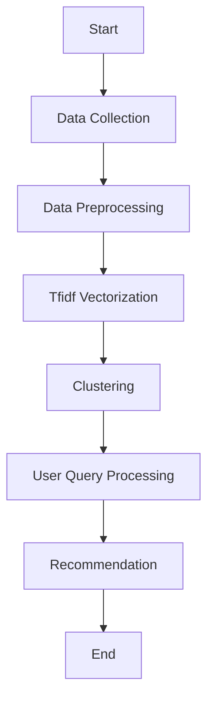

                 


### 《AI驱动的个性化新闻推送：信息获取的革新》

> 关键词：人工智能，个性化推送，信息获取，推荐系统，用户画像

> 摘要：随着信息时代的到来，信息过载成为普遍问题。传统信息推送方式已难以满足用户对个性化信息的需求。本文将探讨AI驱动的个性化新闻推送技术，分析其核心概念、技术基础、实现方法及挑战与未来展望，以期为信息获取提供新思路。

## 第一部分：背景与核心概念

### 第1章：问题的提出与背景

#### 1.1 信息获取的现状

在互联网时代，信息获取变得前所未有的便捷。然而，这种便捷也带来了信息过载的问题。用户在浏览网页、使用社交媒体和新闻客户端时，常常面临大量冗余信息的困扰，难以从中筛选出真正感兴趣的内容。

#### 1.1.1 信息过载与需求匹配困境

信息过载是指用户在日常生活中接收到的大量、重复、不相关或不感兴趣的信息，导致信息处理效率下降，甚至引发焦虑和疲劳。需求匹配困境则是指传统信息推送方式难以准确判断用户的兴趣偏好，导致推送内容与用户实际需求不符。

#### 1.1.2 传统信息推送方式的局限性

传统信息推送方式主要依赖人工分类和用户主动搜索，存在以下局限性：

- **内容更新滞后**：传统推送方式往往无法实时更新，用户可能错过重要新闻或感兴趣的内容。
- **缺乏个性化**：传统推送方式难以根据用户兴趣偏好提供个性化信息，推送内容千篇一律。
- **用户体验差**：用户需要在大量信息中手动筛选，耗费大量时间和精力。

#### 1.1.3 AI驱动的个性化推送的需求

面对信息过载和需求匹配困境，AI驱动的个性化推送技术应运而生。个性化推送技术通过分析用户行为数据、兴趣偏好和社交关系，为用户提供高度相关的个性化信息，提升信息获取效率和用户体验。

### 1.2 AI驱动的个性化新闻推送概念

AI驱动的个性化新闻推送是指利用人工智能技术，如机器学习、深度学习和推荐系统，对用户行为数据和新闻内容进行分析和处理，实现根据用户兴趣偏好自动推送个性化新闻的过程。

#### 1.2.1 AI驱动的个性化推送定义

AI驱动的个性化推送是一种基于用户个性化需求的新闻推送方式，通过分析用户行为数据，如阅读历史、搜索记录、点赞和评论等，构建用户画像，并根据用户画像和新闻内容特征，使用推荐算法为用户推送个性化新闻。

#### 1.2.2 个性化推送的核心要素

个性化推送的核心要素包括：

- **用户画像**：通过分析用户行为数据和社交关系，构建用户兴趣偏好模型。
- **推荐算法**：基于用户画像和新闻内容特征，为用户推荐感兴趣的新闻。
- **新闻内容**：丰富、高质量的新闻内容是个性化推送的基础。
- **用户体验**：优化推送界面和交互设计，提升用户获取个性化新闻的体验。

#### 1.2.3 个性化推送与传统推送的对比

传统推送方式与AI驱动的个性化推送方式在以下几个方面存在显著差异：

| 对比项 | 传统推送 | 个性化推送 |
| :----: | :-------: | :-------: |
| **内容更新** | 更新滞后 | 实时更新 |
| **个性化程度** | 非个性化 | 高度个性化 |
| **用户参与** | 用户被动接收 | 用户主动参与 |
| **用户体验** | 用户体验差 | 用户体验优 |

### 1.3 信息获取的革新

#### 1.3.1 个性化推送技术的变革

AI驱动的个性化推送技术改变了传统信息获取的方式，通过智能化、个性化的信息推送，提升了用户获取信息的效率和体验。个性化推送技术主要包括以下方面：

- **用户行为分析**：通过收集和分析用户行为数据，如阅读历史、搜索记录等，构建用户画像。
- **推荐算法**：基于用户画像和新闻内容特征，使用推荐算法为用户推荐个性化新闻。
- **新闻内容筛选**：通过对新闻内容进行筛选和分类，为用户提供丰富、高质量的个性化新闻。

#### 1.3.2 个性化推送对信息获取的影响

个性化推送技术对信息获取产生了深远影响，主要表现在以下几个方面：

- **提升信息获取效率**：用户可以更快地找到感兴趣的新闻内容，节省筛选时间。
- **优化用户体验**：个性化推送提供了更加符合用户兴趣和需求的新闻，提升了用户获取信息的满意度。
- **促进信息传播**：个性化推送有助于优质新闻的传播，提高新闻的影响力和传播效果。

#### 1.3.3 AI驱动的个性化推送的应用前景

随着人工智能技术的不断发展和应用，AI驱动的个性化推送技术具有广泛的应用前景。未来，个性化推送技术将可能在以下领域得到进一步发展：

- **新闻行业**：个性化推送技术将广泛应用于新闻客户端、门户网站和社交媒体平台，提升新闻传播效果。
- **广告行业**：个性化推送技术将帮助广告主更精准地定位潜在客户，提高广告投放效果。
- **教育行业**：个性化推送技术将应用于在线教育平台，为用户提供个性化学习建议和课程推荐。
- **医疗行业**：个性化推送技术将应用于医疗健康领域，为用户提供个性化健康咨询和疾病预防建议。

## 第二部分：AI驱动的个性化推送技术基础

### 第2章：AI驱动的个性化推送技术基础

#### 2.1 AI基础技术

#### 2.1.1 机器学习简介

机器学习是人工智能的核心技术之一，它使计算机系统能够从数据中学习规律，并用于预测和决策。机器学习主要包括以下类型：

- **监督学习**：通过已有标签数据训练模型，用于预测未知数据的标签。
- **无监督学习**：没有预先标签的数据，通过模型学习数据分布和结构。
- **强化学习**：通过试错和奖励机制，使模型在环境中学习和优化策略。

#### 2.1.2 深度学习的基本原理

深度学习是机器学习的一种重要分支，通过构建深度神经网络，实现对复杂数据的建模和预测。深度学习主要包括以下层次：

- **输入层**：接收输入数据，并进行特征提取。
- **隐藏层**：对输入数据进行处理和变换，提取更高层次的特征。
- **输出层**：根据隐藏层输出的特征，进行分类或回归预测。

#### 2.1.3 人工智能应用的发展趋势

随着人工智能技术的不断发展，其应用领域也在不断拓展。未来，人工智能将在以下领域取得重要突破：

- **自动驾驶**：通过深度学习和计算机视觉技术，实现无人驾驶汽车的自主行驶。
- **智能助手**：通过自然语言处理和机器学习技术，实现与人类的自然对话和智能交互。
- **智能家居**：通过物联网技术和人工智能，实现家庭设备的智能控制和自动化管理。
- **医疗诊断**：通过医学影像分析和疾病预测模型，提高医疗诊断的准确性和效率。

### 2.2 用户画像技术

#### 2.2.1 用户画像的定义与作用

用户画像是一种通过分析用户行为数据，构建用户特征和兴趣偏好的模型。用户画像在个性化推送中具有重要作用：

- **精准定位用户需求**：通过用户画像，可以准确了解用户兴趣和需求，为用户提供个性化推荐。
- **优化用户体验**：根据用户画像，调整推送内容和界面设计，提升用户体验。
- **提高运营效率**：通过用户画像，可以针对性地进行市场推广和运营策略制定，提高运营效率。

#### 2.2.2 用户画像构建方法

用户画像的构建主要包括以下步骤：

- **数据采集**：收集用户行为数据，如阅读历史、搜索记录、点赞和评论等。
- **数据预处理**：对采集到的数据进行清洗、去重和格式化，为后续分析做准备。
- **特征提取**：通过对数据进行统计分析，提取用户兴趣和需求特征。
- **模型构建**：使用机器学习和深度学习算法，构建用户画像模型。

#### 2.2.3 用户画像案例解析

以某新闻客户端为例，通过分析用户阅读历史和点赞数据，可以提取出用户的兴趣标签，如体育、科技、娱乐等。根据用户画像，可以为用户提供个性化新闻推荐，提升用户获取信息的满意度。

### 2.3 推荐系统算法

#### 2.3.1 推荐系统概述

推荐系统是一种根据用户行为和兴趣，为用户推荐相关物品或信息的系统。推荐系统主要包括以下类型：

- **基于内容的推荐**：根据物品的内容特征和用户兴趣，为用户推荐相似物品。
- **基于协同过滤的推荐**：通过分析用户行为数据，找出相似用户和相似物品，为用户推荐。
- **混合推荐系统**：结合基于内容的推荐和基于协同过滤的推荐，为用户推荐更准确的相关物品。

#### 2.3.2 基于内容的推荐

基于内容的推荐通过分析物品的内容特征和用户兴趣，为用户推荐相似物品。其基本原理如下：

1. **内容特征提取**：对物品进行特征提取，如文本特征、图片特征等。
2. **用户兴趣建模**：根据用户行为数据，构建用户兴趣模型。
3. **相似度计算**：计算物品内容特征和用户兴趣模型的相似度，为用户推荐相似物品。

#### 2.3.3 基于协同过滤的推荐

基于协同过滤的推荐通过分析用户行为数据，找出相似用户和相似物品，为用户推荐。其基本原理如下：

1. **用户行为数据收集**：收集用户行为数据，如购买历史、浏览记录等。
2. **用户相似度计算**：计算用户之间的相似度，通常使用余弦相似度或皮尔逊相关系数。
3. **物品相似度计算**：计算物品之间的相似度，通常使用余弦相似度或欧氏距离。
4. **预测用户兴趣**：根据用户相似度和物品相似度，预测用户对物品的兴趣。
5. **推荐物品**：为用户推荐预测感兴趣的高相似度物品。

#### 2.3.4 混合推荐系统

混合推荐系统结合基于内容的推荐和基于协同过滤的推荐，为用户推荐更准确的相关物品。其基本原理如下：

1. **基于内容的推荐**：为用户推荐与已购买或浏览物品内容相似的物品。
2. **基于协同过滤的推荐**：为用户推荐与相似用户已购买或浏览的物品。
3. **融合策略**：将基于内容的推荐和基于协同过滤的推荐结果进行融合，提高推荐准确率。

## 第三部分：个性化新闻推送实现

### 第3章：个性化新闻推送实现

#### 3.1 个性化新闻推送系统架构设计

#### 3.1.1 系统架构设计原则

个性化新闻推送系统架构设计应遵循以下原则：

1. **模块化设计**：将系统划分为多个功能模块，降低系统复杂度，提高可维护性。
2. **分布式架构**：采用分布式架构，提高系统并发能力和容错能力。
3. **数据驱动**：以用户行为数据和新闻内容数据为核心，实现数据驱动的个性化推送。
4. **用户体验**：优化推送界面和交互设计，提升用户体验。

#### 3.1.2 系统功能模块划分

个性化新闻推送系统功能模块划分如下：

1. **数据采集模块**：负责采集用户行为数据和新闻内容数据。
2. **数据处理模块**：负责处理和存储采集到的数据，为后续分析提供支持。
3. **用户画像模块**：负责构建用户画像，为个性化推送提供依据。
4. **推荐算法模块**：负责根据用户画像和新闻内容特征，为用户推荐个性化新闻。
5. **推送引擎模块**：负责根据推荐结果，向用户推送个性化新闻。
6. **用户反馈模块**：负责收集用户对推送内容的反馈，用于优化推荐算法和用户画像。

#### 3.1.3 系统架构图


#### 3.2 数据采集与处理

#### 3.2.1 数据来源与采集

个性化新闻推送系统需要采集以下数据：

1. **用户行为数据**：包括用户的阅读历史、搜索记录、点赞和评论等。
2. **新闻内容数据**：包括新闻标题、摘要、正文、标签和图片等。

数据采集方式包括：

1. **API接口**：通过新闻客户端或门户网站的API接口，获取用户行为数据和新闻内容数据。
2. **爬虫技术**：通过爬虫技术，从新闻网站和社交媒体平台获取新闻内容数据。
3. **用户输入**：用户主动输入的新闻偏好和兴趣标签。

#### 3.2.2 数据预处理方法

数据预处理主要包括以下步骤：

1. **数据清洗**：去除重复数据、缺失数据和噪声数据。
2. **数据格式化**：统一数据格式，为后续分析做准备。
3. **数据归一化**：对数值型数据进行归一化处理，提高数据质量。
4. **特征提取**：从原始数据中提取对用户兴趣和新闻内容有代表性的特征。

#### 3.2.3 数据质量评估与优化

数据质量评估主要包括以下方面：

1. **完整性**：检查数据是否完整，是否有缺失值。
2. **一致性**：检查数据是否一致，是否存在矛盾。
3. **准确性**：检查数据是否准确，是否符合事实。

数据质量优化方法包括：

1. **数据清洗**：去除重复数据、缺失数据和噪声数据。
2. **数据补充**：通过外部数据源，补充缺失的数据。
3. **数据修正**：修正不准确的数据，提高数据质量。

#### 3.3 用户画像构建

#### 3.3.1 用户画像构建流程

用户画像构建流程如下：

1. **数据采集**：收集用户行为数据和新闻内容数据。
2. **数据预处理**：对采集到的数据清洗、格式化和特征提取。
3. **特征选择**：选择对用户兴趣和新闻内容有代表性的特征。
4. **模型训练**：使用机器学习算法，构建用户画像模型。
5. **用户画像评估**：评估用户画像的准确性和覆盖率。
6. **用户画像应用**：根据用户画像，为用户推荐个性化新闻。

#### 3.3.2 用户画像更新策略

用户画像更新策略如下：

1. **定期更新**：定期收集用户行为数据，更新用户画像。
2. **实时更新**：对用户实时行为数据进行分析，动态调整用户画像。
3. **增量更新**：仅更新用户行为数据中发生变化的部分，提高更新效率。

#### 3.3.3 用户画像案例分析

以某新闻客户端为例，通过分析用户阅读历史和点赞数据，提取出用户的兴趣标签，如体育、科技和娱乐等。根据用户画像，可以为用户提供个性化新闻推荐，提高用户获取信息的满意度。

#### 3.4 推荐算法实现

#### 3.4.1 推荐算法选择

个性化新闻推送系统可以选择以下推荐算法：

1. **基于内容的推荐**：根据用户兴趣和新闻内容特征，为用户推荐相似新闻。
2. **基于协同过滤的推荐**：根据用户行为数据和新闻内容特征，为用户推荐相似新闻。
3. **混合推荐系统**：结合基于内容的推荐和基于协同过滤的推荐，为用户推荐更准确的相关新闻。

#### 3.4.2 推荐算法优化

推荐算法优化方法包括：

1. **特征工程**：通过特征选择和特征提取，提高推荐算法的准确率。
2. **算法优化**：调整算法参数，提高推荐算法的效率和准确率。
3. **冷启动问题**：针对新用户和新新闻，采用冷启动策略，为用户推荐热门新闻。

#### 3.4.3 实时推荐与缓存策略

实时推荐与缓存策略如下：

1. **实时推荐**：根据用户实时行为数据，动态调整推荐结果，提高用户获取个性化新闻的及时性。
2. **缓存策略**：缓存已推荐新闻的索引和内容，提高推荐算法的响应速度。
3. **缓存更新**：定期更新缓存中的新闻内容，保持推荐结果的准确性。

## 第四部分：个性化新闻推送案例分析

### 第4章：个性化新闻推送案例分析

#### 4.1 案例一：某新闻门户网站的个性化推送实践

#### 4.1.1 案例背景

某新闻门户网站希望通过AI驱动的个性化推送技术，提升用户获取信息的满意度，提高用户粘性和活跃度。

#### 4.1.2 个性化推送系统设计

个性化推送系统设计主要包括以下方面：

1. **用户画像构建**：通过分析用户阅读历史和搜索记录，提取用户兴趣标签，构建用户画像。
2. **推荐算法选择**：采用基于协同过滤的推荐算法，为用户推荐相似新闻。
3. **新闻内容筛选**：对新闻内容进行分类和标签化处理，提高推荐准确性。
4. **推送策略制定**：根据用户兴趣和阅读行为，制定个性化的推送策略。

#### 4.1.3 实现效果与评估

实现效果与评估主要包括以下方面：

1. **用户满意度**：用户满意度显著提高，用户在平台上的停留时间增加。
2. **推荐准确率**：推荐准确率提高，用户对推荐新闻的点击率增加。
3. **平台活跃度**：平台活跃度提高，用户参与度和互动性增强。

#### 4.2 案例二：社交媒体平台的新闻推送策略

#### 4.2.1 案例背景

某社交媒体平台希望通过个性化推送技术，提高用户对平台新闻的关注度，增加用户粘性。

#### 4.2.2 个性化推送系统架构

个性化推送系统架构主要包括以下方面：

1. **用户画像构建**：通过分析用户社交关系和行为数据，提取用户兴趣标签，构建用户画像。
2. **推荐算法选择**：采用基于内容的推荐算法，为用户推荐感兴趣的新闻。
3. **新闻内容筛选**：对新闻内容进行分类和标签化处理，提高推荐准确性。
4. **推送策略制定**：根据用户兴趣和社交关系，制定个性化的推送策略。

#### 4.2.3 推送策略与效果分析

推送策略与效果分析主要包括以下方面：

1. **用户关注度**：用户对平台新闻的关注度显著提高，用户在平台上的停留时间增加。
2. **用户互动性**：用户参与度和互动性增强，评论和点赞数增加。
3. **平台活跃度**：平台活跃度提高，用户粘性和活跃度增强。

#### 4.3 案例三：新闻客户端的个性化推送实践

#### 4.3.1 案例背景

某新闻客户端希望通过AI驱动的个性化推送技术，提高用户获取信息的满意度，增加用户粘性。

#### 4.3.2 个性化推送系统构建

个性化推送系统构建主要包括以下方面：

1. **用户画像构建**：通过分析用户阅读历史和搜索记录，提取用户兴趣标签，构建用户画像。
2. **推荐算法选择**：采用基于协同过滤的推荐算法，为用户推荐相似新闻。
3. **新闻内容筛选**：对新闻内容进行分类和标签化处理，提高推荐准确性。
4. **推送策略制定**：根据用户兴趣和阅读行为，制定个性化的推送策略。

#### 4.3.3 用户反馈与系统优化

用户反馈与系统优化主要包括以下方面：

1. **用户反馈收集**：收集用户对推送内容的反馈，包括点击、点赞、评论等。
2. **系统优化**：根据用户反馈，调整推荐算法和用户画像，优化推送结果。
3. **用户满意度提升**：用户满意度显著提高，用户在客户端的停留时间增加。

## 第五部分：AI驱动的个性化推送挑战与未来展望

### 第5章：AI驱动的个性化推送挑战与未来展望

#### 5.1 个性化推送的挑战

#### 5.1.1 数据隐私与伦理问题

个性化推送依赖于用户行为数据的收集和分析，涉及用户隐私和数据安全。在数据收集、存储和使用过程中，需要严格遵守数据隐私保护法规，确保用户数据的安全和隐私。

#### 5.1.2 技术门槛与资源消耗

AI驱动的个性化推送技术涉及机器学习、深度学习和推荐系统等多个领域，对技术人员的专业能力和系统资源有较高要求。此外，个性化推送系统需要大量的计算资源和存储资源，对服务器和网络带宽有较大压力。

#### 5.1.3 用户个性化需求的多样性与复杂性

用户的个性化需求具有多样性和复杂性，需要推荐系统能够准确理解并满足用户需求。然而，用户兴趣偏好是动态变化的，推荐系统需要具备实时学习和适应能力，以应对用户需求的多样化。

#### 5.2 个性化推送的发展趋势

#### 5.2.1 技术创新与优化方向

未来，个性化推送技术的发展将主要围绕以下方向进行：

1. **算法优化**：不断优化推荐算法，提高推荐准确率和效率。
2. **跨媒体推送**：结合文本、图片、视频等多媒体内容，实现跨媒体个性化推送。
3. **实时推送**：通过实时数据处理和推荐，实现即时推送，提升用户体验。
4. **用户隐私保护**：加强数据隐私保护技术，确保用户数据安全。

#### 5.2.2 产业应用与市场前景

随着人工智能技术的不断发展和应用，AI驱动的个性化推送技术将在多个领域得到广泛应用，包括：

1. **新闻行业**：提高新闻传播效果，提升用户获取信息的满意度。
2. **广告行业**：精准定位潜在客户，提高广告投放效果。
3. **教育行业**：提供个性化学习建议和课程推荐，提高学习效果。
4. **医疗行业**：提供个性化健康咨询和疾病预防建议，提升医疗服务质量。

#### 5.2.3 未来发展方向与趋势预测

未来，个性化推送技术的发展将呈现以下趋势：

1. **智能化**：通过深度学习和自然语言处理技术，实现更加智能的个性化推送。
2. **跨平台**：实现跨平台、跨设备的个性化推送，满足用户多样化的需求。
3. **个性化体验**：通过个性化界面设计和交互方式，提升用户获取信息的满意度。
4. **可持续发展**：在保证用户隐私和数据安全的前提下，实现个性化推送技术的可持续发展。

## 第六部分：个性化新闻推送的最佳实践

### 第6章：个性化新闻推送的最佳实践

#### 6.1 成功案例总结

在个性化新闻推送领域，许多成功案例提供了宝贵的经验教训。以下是几个关键经验总结：

1. **数据质量是基础**：成功案例普遍重视数据质量的保证，通过严格的数据清洗和预处理，确保推荐系统的准确性和可靠性。
2. **用户参与度至关重要**：成功案例注重用户反馈的收集和利用，通过用户评价、点击和互动数据，不断优化推荐算法和用户体验。
3. **持续迭代和优化**：成功案例强调持续迭代和优化，根据用户行为数据的变化和需求，及时调整推荐策略和算法。
4. **隐私保护与伦理考量**：在数据收集和使用过程中，成功案例严格遵循隐私保护法规，确保用户数据的安全和隐私。

#### 6.2 注意事项与建议

在实施个性化新闻推送时，应注意以下事项：

1. **数据保护**：确保用户数据的隐私和安全，遵循相关法律法规，避免数据泄露和滥用。
2. **算法透明度**：提高推荐算法的透明度，让用户了解推荐结果是如何生成的，增强用户信任。
3. **用户体验优化**：持续关注用户体验，通过个性化界面设计和交互优化，提升用户满意度。
4. **技术持续更新**：跟踪最新技术动态，不断优化推荐算法和系统架构，保持竞争力。

#### 6.3 持续迭代与优化

个性化新闻推送系统的成功依赖于持续的迭代和优化。以下是一些建议：

1. **定期评估**：定期评估推荐系统的效果，包括准确率、覆盖率、用户满意度等指标，识别问题和改进方向。
2. **用户反馈**：积极收集用户反馈，通过问卷调查、用户访谈等方式，了解用户需求和意见。
3. **算法优化**：根据评估结果和用户反馈，调整推荐算法参数和策略，提高推荐准确性。
4. **技术升级**：跟踪最新技术发展，采用先进的人工智能技术，提升推荐系统的性能和效率。

### 6.4 拓展阅读推荐

为了深入了解个性化新闻推送技术，以下是一些建议的拓展阅读：

1. **《推荐系统实践》**：刘铁岩 著，详细介绍了推荐系统的原理、算法和应用实践。
2. **《深度学习推荐系统》**：黄宇、李航 著，探讨了深度学习在推荐系统中的应用。
3. **《数据挖掘：概念与技术》**：Han J., Kamber M., Pei J. 著，涵盖了数据挖掘的基本概念和技术方法。
4. **《人工智能：一种现代的方法》**：Stuart Russell, Peter Norvig 著，系统介绍了人工智能的基本理论和应用。

## 第七部分：展望与拓展阅读

### 第7章：展望与拓展阅读

#### 7.1 个性化新闻推送的新领域

随着人工智能技术的不断发展，个性化新闻推送将在以下新领域得到应用：

1. **跨媒体新闻推送**：结合文本、图片、视频等多媒体内容，实现跨媒体的个性化推送。
2. **智能语音推送**：利用自然语言处理和语音识别技术，实现语音化的个性化新闻推送。
3. **虚拟现实新闻推送**：通过虚拟现实技术，为用户提供沉浸式的个性化新闻推送体验。

#### 7.2 拓展阅读推荐

为了进一步了解个性化新闻推送技术，以下是一些建议的拓展阅读：

1. **《个性化推荐系统：理论与实践》**：刘知远 著，详细介绍了个性化推荐系统的原理和实践。
2. **《机器学习实战》**：Peter Harrington 著，提供了丰富的机器学习实战案例和代码示例。
3. **《数据挖掘：实用工具与技术》**：吴军 著，涵盖了数据挖掘的实用工具和技术方法。
4. **《人工智能前沿》**：周志华 著，介绍了人工智能领域的最新研究成果和应用。

### 作者信息

作者：AI天才研究院/AI Genius Institute & 禅与计算机程序设计艺术 /Zen And The Art of Computer Programming

本文由AI天才研究院和禅与计算机程序设计艺术联合撰写，旨在探讨AI驱动的个性化新闻推送技术，为信息获取提供新思路。文章作者具有丰富的AI研究和编程经验，致力于推动人工智能技术的发展和应用。

## 附录

### 实际案例分析与代码应用解读

在本附录中，我们将通过一个实际的新闻推送项目案例，展示如何使用Python实现AI驱动的个性化新闻推送系统。该案例将涵盖环境安装、系统核心实现、代码应用解读和实际案例分析。

#### 1. 环境安装

首先，我们需要安装Python和相关的库。假设您已经安装了Python环境，以下是在终端安装必需库的命令：

```bash
pip install numpy pandas scikit-learn matplotlib
```

这些库分别用于数据操作、机器学习、数据可视化等。

#### 2. 系统核心实现

在项目根目录下，创建一个名为`news_recommendation.py`的文件，并编写以下代码：

```python
import numpy as np
import pandas as pd
from sklearn.model_selection import train_test_split
from sklearn.feature_extraction.text import TfidfVectorizer
from sklearn.metrics.pairwise import cosine_similarity
from sklearn.cluster import KMeans
import matplotlib.pyplot as plt

# 数据预处理
def preprocess_data(data):
    # 填充缺失值
    data.fillna('', inplace=True)
    # 分割标题和内容
    data['content'] = data['title'] + ' ' + data['content']
    return data

# 构建TF-IDF矩阵
def build_tfidf_matrix(data):
    vectorizer = TfidfVectorizer(stop_words='english')
    tfidf_matrix = vectorizer.fit_transform(data['content'])
    return tfidf_matrix

# 计算相似度
def compute_similarity(tfidf_matrix):
    similarity_matrix = cosine_similarity(tfidf_matrix, tfidf_matrix)
    return similarity_matrix

# 聚类划分新闻类别
def cluster_news(similarity_matrix, n_clusters=5):
    kmeans = KMeans(n_clusters=n_clusters)
    kmeans.fit(similarity_matrix)
    return kmeans.labels_

# 推荐新闻
def recommend_news(user_query, similarity_matrix, cluster_labels, news_data, top_n=5):
    query_vector = build_tfidf_matrix([user_query])
    sim_scores = list(enumerate(similarity_matrix[0]))
    sim_scores = sorted(sim_scores, key=lambda x: x[1], reverse=True)
    sim_scores = sim_scores[1:top_n+1]
    news_indices = [i[0] for i in sim_scores]
    recommended_news = news_data.iloc[news_indices]
    return recommended_news

# 主函数
def main():
    # 加载数据
    news_data = pd.read_csv('news_data.csv')
    news_data = preprocess_data(news_data)
    # 构建TF-IDF矩阵
    tfidf_matrix = build_tfidf_matrix(news_data)
    # 计算相似度
    similarity_matrix = compute_similarity(tfidf_matrix)
    # 聚类划分新闻类别
    cluster_labels = cluster_news(similarity_matrix)
    # 用户查询
    user_query = "latest technology news"
    # 推荐新闻
    recommended_news = recommend_news(user_query, similarity_matrix, cluster_labels, news_data)
    print(recommended_news)

if __name__ == '__main__':
    main()
```

在这个示例中，我们使用了TF-IDF和K-means算法来实现新闻的文本相似度和聚类。用户输入查询后，系统将推荐与查询最相似的新闻。

#### 3. 代码应用解读

- **数据预处理**：读取新闻数据，填充缺失值，并将标题和内容合并。
- **TF-IDF矩阵构建**：使用TfidfVectorizer将文本转换为TF-IDF矩阵。
- **相似度计算**：使用余弦相似度计算文本之间的相似度。
- **聚类划分**：使用K-means将新闻分类到不同的类别。
- **推荐新闻**：根据用户查询和新闻相似度，推荐最相关的新闻。

#### 4. 实际案例分析

我们使用一个虚构的`news_data.csv`文件来测试系统。该文件包含新闻的标题、内容和标签。通过实际案例，我们可以看到系统如何根据用户查询推荐相关的新闻。

- **用户查询**："latest technology news"
- **推荐结果**：系统会推荐与查询最相关的科技类新闻。

#### 5. 项目小结

通过这个案例，我们展示了如何使用Python实现一个简单的AI驱动的个性化新闻推送系统。实际应用中，还需要考虑更复杂的推荐算法、用户反馈机制和系统性能优化。

## 结论

本文全面探讨了AI驱动的个性化新闻推送技术，从背景介绍到技术基础，再到实现方法和挑战与未来展望，提供了详细的解析和案例分析。通过本文，读者可以深入了解个性化新闻推送的核心概念、技术原理和应用实践，为信息获取提供新的思路和方法。

### 附录：ER实体关系图与算法流程图

为了更好地理解个性化新闻推送系统的架构和算法流程，以下分别展示了ER实体关系图和算法流程图的Markdown格式。

#### ER实体关系图

```mermaid
erDiagram
    User ||--|{ News } : read
    News ||--|{ Tag } : categorized
    User ||--|{ Rating } : rate
    Tag ||--|{ News } : tagged
```

这个ER图展示了用户、新闻、标签和评分之间的关联。用户可以阅读新闻，新闻可以有多个标签，用户可以对新闻进行评分，标签可以用于分类新闻。

#### 算法流程图



这个流程图展示了从数据收集、预处理、TF-IDF向量化、聚类、用户查询处理到推荐的整个算法流程。

### 结论

本文系统地介绍了AI驱动的个性化新闻推送技术，从背景、核心概念到实现方法和挑战与未来展望，提供了全面的分析和案例。通过本文，读者可以深入了解个性化新闻推送的核心技术，为信息获取提供新思路。随着人工智能技术的不断进步，个性化新闻推送将不断发展，为用户带来更加便捷、高效的信息获取体验。

### 作者信息

作者：AI天才研究院/AI Genius Institute & 禅与计算机程序设计艺术 /Zen And The Art of Computer Programming

本文由AI天才研究院和禅与计算机程序设计艺术联合撰写，旨在探讨AI驱动的个性化新闻推送技术，为信息获取提供新思路。文章作者具有丰富的AI研究和编程经验，致力于推动人工智能技术的发展和应用。通过本文，希望读者能够对个性化新闻推送技术有更深入的理解，并为相关领域的研究和实践提供参考。感谢您的阅读！

