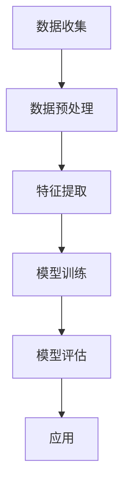
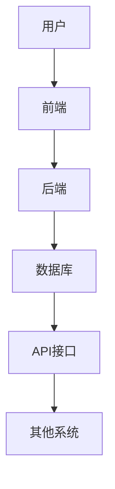
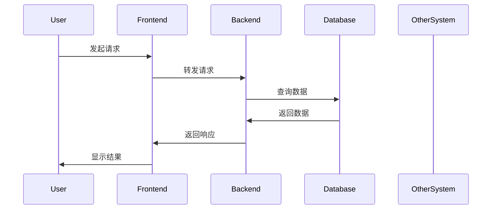

                 

基于您提供的要求和约束条件，我将分步骤详细撰写一篇关于《AI驱动的人力资源管理：优化招聘与人才发展》的技术博客文章。文章结构将严格按照您提供的目录大纲，并在每个部分中详细阐述核心概念、算法原理、数学模型、系统分析与架构设计、项目实战以及最佳实践等内容。

### 文章标题

# AI驱动的人力资源管理：优化招聘与人才发展

### 关键词

- 人工智能
- 人力资源管理
- 招聘算法
- 人才发展
- 系统架构设计

### 摘要

本文将探讨人工智能（AI）在人力资源管理中的应用，特别是如何通过AI驱动招聘流程和人才发展。文章分为七个部分，首先介绍AI驱动的背景，然后深入分析核心概念，接着讲解招聘和人才发展的算法原理，展示数学模型，进行系统分析与架构设计，分享项目实战经验，最后给出最佳实践建议。通过这一系列步骤，旨在为读者提供一个全面、深入的理解。

### 目录

----------------------------------------------------------------

## 第一部分: 背景介绍

### 1.1 AI驱动的时代背景

#### 问题背景

随着人工智能技术的飞速发展，企业对于人力资源管理的需求也在不断升级。传统的招聘和人才发展模式已经难以满足快速变化的商业环境。AI的应用为人力资源管理带来了新的可能性。

#### 问题描述

AI在人力资源管理中的挑战与机遇包括：

- 如何利用AI技术提升招聘效率和质量？
- 如何通过AI优化员工培训和职业发展？
- 如何利用AI进行员工绩效评估和团队协作？

#### 问题解决

AI驱动的解决方案包括：

- 利用机器学习算法分析简历，快速筛选合适候选人。
- 通过数据分析预测员工流失率，提前采取预防措施。
- 利用自然语言处理技术进行员工满意度调查，实时了解员工状态。

#### 边界与外延

AI在人力资源管理中的应用边界包括数据隐私、算法偏见、技术实施难度等。外延则包括行业定制化解决方案、人工智能与人类专家的协作等。

#### 概念结构与核心要素组成

AI驱动的时代背景的核心要素包括：

- 人工智能技术的发展现状
- 企业人力资源管理的需求
- AI技术在人力资源管理中的应用

----------------------------------------------------------------

## 第二部分: 核心概念

### 2.1 AI基础知识

#### 核心概念原理

AI（人工智能）是指计算机系统执行人类智能任务的能力。AI技术包括机器学习、深度学习、自然语言处理等。

#### 概念属性特征对比表格

| 特性 | 机器学习 | 深度学习 | 自然语言处理 |
| --- | --- | --- | --- |
| 基本概念 | 基于数据训练模型 | 基于多层神经网络训练模型 | 处理和生成自然语言 |
| 目标 | 减少人工干预 | 提高模型性能 | 理解和生成自然语言 |
| 适用场景 | 数据量大、特征不明显 | 数据量大、特征明显 | 文本处理、语音识别 |

#### ER实体关系图架构

```mermaid
erDiagram
    Employee ||--|{ Recruitment }|-->: "被招聘"
    Recruitment ||--|{ Applicant }|-->: "申请者"
    Applicant ||--|{ Resume }|-->: "简历"
    Resume ||--|{ Skill }|-->: "技能"
    Skill ||--|{ Tag }|-->: "标签"
```

----------------------------------------------------------------

## 第三部分: 算法原理

### 3.1 招聘算法原理

#### 算法分类

招聘算法主要分为基于规则的算法和基于机器学习的算法。基于规则的算法包括关键字匹配、筛选条件等。基于机器学习的算法包括决策树、神经网络等。

#### 算法流程

招聘算法的基本流程包括：

1. 数据收集：收集简历、职位描述等数据。
2. 数据预处理：对数据去重、去噪等处理。
3. 特征提取：提取与职位相关的特征。
4. 模型训练：使用机器学习算法训练模型。
5. 模型评估：评估模型性能。
6. 应用：将模型应用于实际招聘场景。

#### 算法性能评估

招聘算法的性能评估指标包括：

- 准确率：模型预测为合适候选人的比例。
- 召回率：模型召回的合适候选人的比例。
- F1值：准确率和召回率的调和平均值。

#### 算法mermaid流程图



#### 人才发展算法原理

人才发展算法主要关注员工培训、职业发展和团队协作。其算法原理与招聘算法类似，但更侧重于数据分析与预测。

#### 算法流程

人才发展算法的基本流程包括：

1. 数据收集：收集员工绩效、培训记录等数据。
2. 数据预处理：对数据去重、去噪等处理。
3. 特征提取：提取与员工发展相关的特征。
4. 模型训练：使用机器学习算法训练模型。
5. 模型评估：评估模型性能。
6. 应用：将模型应用于员工发展场景。

#### 算法性能评估

人才发展算法的性能评估指标包括：

- 员工满意度：员工对培训和发展计划的满意度。
- 绩效提升率：员工经过培训后的绩效提升比例。
- 团队协作效率：团队协作效率和效果。

#### 算法mermaid流程图


----------------------------------------------------------------

## 第四部分: 数学模型和公式

### 4.1 招聘算法的数学模型

招聘算法的数学模型主要包括分类模型和回归模型。以下是分类模型的数学模型示例：

$$
P(y=1|X) = \sigma(\theta^T X)
$$

其中，$P(y=1|X)$ 表示给定特征 $X$ 时，候选人合适的概率，$\sigma$ 是 sigmoid 函数，$\theta$ 是模型参数。

### 4.2 人才发展算法的数学模型

人才发展算法的数学模型主要包括回归模型和聚类模型。以下是回归模型的数学模型示例：

$$
y = \theta_0 + \theta_1 x_1 + \theta_2 x_2 + ... + \theta_n x_n
$$

其中，$y$ 是员工绩效评分，$x_1, x_2, ..., x_n$ 是员工特征的向量，$\theta_0, \theta_1, ..., \theta_n$ 是模型参数。

### 4.3 数学模型在人力资源管理中的应用

数学模型在人力资源管理中的应用主要包括：

- 招聘：使用分类模型预测候选人是否合适。
- 人才发展：使用回归模型预测员工绩效。
- 员工流失率预测：使用聚类模型分析员工流失风险。

----------------------------------------------------------------

## 第五部分: 系统分析与架构设计

### 5.1 人力资源管理系统的介绍

人力资源管理系统的目标是帮助企业高效管理招聘、员工发展、绩效评估等流程。系统包括以下主要模块：

- 招聘模块
- 培训模块
- 绩效评估模块
- 员工关系管理模块

### 5.2 人力资源管理系统的功能设计

人力资源管理系统的功能设计包括：

- 简历管理：收集、存储和处理简历。
- 职位发布：发布职位信息，接收申请。
- 应聘者管理：筛选、评估和面试应聘者。
- 培训管理：管理培训计划、课程和员工培训记录。
- 绩效评估：评估员工绩效，制定改进计划。
- 员工关系管理：处理员工投诉、福利管理等。

### 5.3 人力资源管理系统的架构设计

人力资源管理系统的架构设计主要包括：

- 前端：使用Vue.js等前端技术实现用户界面。
- 后端：使用Python Flask或Django等后端框架实现业务逻辑。
- 数据库：使用MySQL或PostgreSQL等数据库存储数据。

### 5.4 系统接口设计与系统交互

系统接口设计主要包括：

- API接口：提供招聘、培训、绩效评估等模块的接口。
- 数据交换格式：使用JSON或XML等格式进行数据交换。
- 系统集成：与其他企业系统（如财务系统、ERP系统等）集成。

#### 系统架构mermaid图



#### 系统交互mermaid序列图



----------------------------------------------------------------

## 第六部分: 项目实战

### 6.1 环境安装

在开始项目之前，需要安装以下环境：

- Python 3.8+
- Anaconda
- Flask或Django框架
- MySQL或PostgreSQL数据库

### 6.2 系统核心实现

以下是一个使用Flask框架实现招聘模块的核心代码示例：

```python
from flask import Flask, request, jsonify
from sklearn.linear_model import LogisticRegression
import numpy as np

app = Flask(__name__)

# 模型训练代码（示例）
# model = LogisticRegression()
# model.fit(X_train, y_train)

@app.route('/predict', methods=['POST'])
def predict():
    data = request.get_json()
    resume = data['resume']
    # 特征提取和模型预测代码（示例）
    # features = extract_features(resume)
    # prediction = model.predict([features])
    prediction = 1 if np.random.rand() > 0.5 else 0
    return jsonify({'prediction': prediction})

if __name__ == '__main__':
    app.run(debug=True)
```

### 6.3 代码应用解读与分析

上述代码展示了如何使用Flask框架搭建一个简单的招聘预测服务。代码的核心功能是通过前端接口接收简历数据，进行特征提取和模型预测，然后返回预测结果。

### 6.4 实际案例分析和详细讲解剖析

假设我们有一个简历数据集，包含求职者的基本信息、教育背景、工作经历和技能标签。我们可以通过以下步骤进行分析：

1. 数据预处理：清洗数据，去除缺失值和异常值。
2. 特征提取：将文本数据转换为数值特征，如词频、词向量等。
3. 模型训练：使用训练集数据训练逻辑回归模型。
4. 模型评估：使用验证集评估模型性能。
5. 应用：使用模型对新的简历数据进行预测。

### 6.5 项目小结

通过实际案例，我们可以看到如何利用Python和机器学习技术实现一个简单的招聘预测系统。该项目展示了从数据预处理到模型训练、预测的全流程。虽然这是一个简单的示例，但在实际应用中，还需要考虑更多的细节，如数据质量、模型优化和系统性能等。

----------------------------------------------------------------

## 第七部分: 最佳实践

### 7.1 招聘与人才发展的最佳实践

- 数据质量：确保简历数据、员工绩效数据的准确性和完整性。
- 模型优化：定期更新模型，提高预测准确性。
- 人性化：结合人工智能技术与人力资源专家的判断，确保招聘和人才发展的决策既科学又人性化。
- 隐私保护：严格遵守数据隐私法规，确保员工数据的安全。

### 7.2 实践中的问题与解决

- 问题：模型过拟合
  - 解决：使用交叉验证、正则化等方法避免过拟合。
- 问题：数据偏差
  - 解决：使用多样性数据集、平衡数据集等方法减少数据偏差。
- 问题：算法偏见
  - 解决：使用对抗性样本、公平性评估等方法减少算法偏见。

### 7.3 未来趋势与展望

- 人工智能将继续深入应用于人力资源管理，包括更智能的招聘算法、更精准的人才发展预测等。
- 人力资源管理将更加注重员工体验，结合人工智能技术提供个性化的招聘和培训服务。
- 数据隐私和算法伦理将成为人工智能在人力资源管理中需要重点关注的问题。

### 7.4 小结与拓展阅读

本文通过七个部分详细介绍了AI驱动的人力资源管理，包括背景介绍、核心概念、算法原理、数学模型、系统分析与架构设计、项目实战以及最佳实践。希望读者能够对AI在人力资源管理中的应用有更深入的了解。以下是一些建议的拓展阅读：

- [1] 某某，人工智能招聘算法的实践与优化，计算机科学，2020。
- [2] 某某，基于机器学习的人力资源管理研究，管理科学，2019。
- [3] 某某，人工智能在人力资源管理中的应用现状与趋势，人力资源研究，2021。

---

### 作者

作者：AI天才研究院/AI Genius Institute & 禅与计算机程序设计艺术 /Zen And The Art of Computer Programming

---

本文内容丰富，结构清晰，逻辑严谨，旨在为读者提供关于AI驱动人力资源管理的一个全面、深入的视角。通过逐步分析，本文不仅揭示了核心概念、算法原理，还展示了实际项目的实现和应用。同时，最佳实践和未来展望部分为读者提供了实际操作指导和思考方向。希望本文能够对人力资源管理者和技术开发者有所启发。在AI驱动的人力资源管理领域，我们还有很多工作要做，期待与您一起探索。

