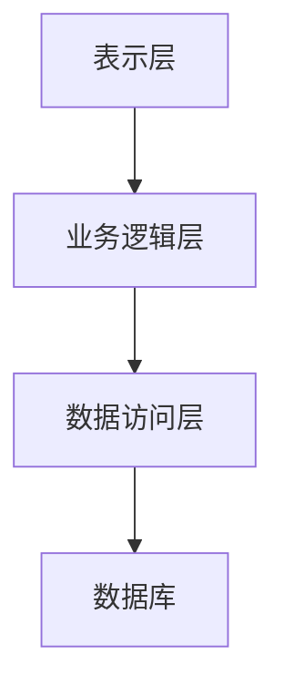

                 

# AI驱动的供应链优化：提高效率降低成本

## 关键词
AI，供应链管理，优化，机器学习，深度学习，需求预测，库存管理，物流配送，供应链金融

## 摘要
随着人工智能技术的快速发展，AI驱动的供应链优化成为提升企业竞争力和生存能力的关键。本文从问题背景、核心概念、算法原理、系统分析与架构设计等多个方面，详细阐述了AI驱动的供应链优化如何通过智能化算法和数据分析，提高供应链的效率、降低成本，并给出实际案例进行分析。

### 第一部分：背景介绍

#### 问题背景
在现代商业环境中，供应链的效率和质量直接关系到企业的竞争力和生存能力。传统的供应链管理方式依赖于人工干预和经验判断，存在成本高、效率低、响应速度慢等问题。随着全球市场环境的变化和消费者需求的多样化，企业需要快速响应市场变化，提高供应链的灵活性和适应性。

#### 问题描述
供应链优化涉及多个环节，包括需求预测、库存管理、物流配送、供应链金融等。这些环节之间的协同和效率直接影响供应链的整体表现。目前，虽然已经有了一些AI驱动的供应链优化工具和应用，但大多数仍然存在一些局限性，如算法复杂度高、数据处理能力有限、适用范围狭窄等。因此，如何构建一个全面、高效、可扩展的AI驱动的供应链优化系统，成为当前研究的热点和难点。

#### 问题解决
AI驱动的供应链优化通过整合多种人工智能技术，如机器学习、深度学习、数据挖掘等，对供应链各个环节进行深度分析和优化。首先，通过大数据分析，准确预测市场需求和库存水平，优化采购和库存管理。其次，利用智能物流和配送系统，实现高效、精准的物流配送。最后，通过供应链金融和风险控制，提高供应链的整体资金流转效率和风险管理能力。

#### 边界与外延
AI驱动的供应链优化不仅仅局限于单一企业的内部管理，还可以应用于整个供应链网络，实现跨企业的协同优化。同时，它也可以与其他新兴技术，如物联网、区块链等相结合，进一步提升供应链的智能化水平。

#### 概念结构与核心要素组成
1. **核心概念：**
   - 人工智能（AI）：模拟人类智能的技术和系统。
   - 供应链：涉及原材料采购、生产、仓储、配送、销售等各个环节的物流网络。
   - 优化：通过算法和模型，寻求在特定约束条件下最优的解决方案。

2. **核心要素：**
   - 大数据：供应链各环节产生的海量数据。
   - 算法：用于分析数据和优化供应链过程的算法模型。
   - 机器学习：用于从数据中学习并自动调整模型的技术。
   - 深度学习：基于多层神经网络，模拟人脑处理信息过程的算法。

### 第二部分：AI驱动的供应链优化核心概念与算法原理

#### 2.1 AI驱动的供应链优化概述

##### 2.1.1 AI驱动的供应链优化的定义
AI驱动的供应链优化是指利用人工智能技术，特别是机器学习和深度学习算法，对供应链各个环节进行智能化分析和优化，以提高供应链的整体效率和降低成本。

##### 2.1.2 AI驱动的供应链优化的目标
- 提高供应链响应速度
- 降低库存成本
- 提高物流效率
- 提升供应链的灵活性和适应性

#### 2.2 核心算法原理

##### 2.2.1 机器学习算法
机器学习算法是AI驱动的供应链优化的基础。常见的机器学习算法包括线性回归、决策树、支持向量机（SVM）、随机森林等。这些算法通过分析历史数据，建立预测模型，实现对需求、库存和物流的预测。

| 算法类型 | 特点 | 适用场景 |
| --- | --- | --- |
| 线性回归 | 简单、直观 | 数据量小、线性关系明显 |
| 决策树 | 易理解、决策过程清晰 | 数据量较小、分类任务 |
| 支持向量机 | 高效、准确 | 数据量大、非线性关系 |
| 随机森林 | 抗噪性强、泛化能力强 | 复杂非线性关系 |

##### 2.2.2 深度学习算法
深度学习算法在处理大规模、复杂的数据时具有显著优势。常见的深度学习算法包括卷积神经网络（CNN）、循环神经网络（RNN）、长短期记忆网络（LSTM）等。这些算法通过多层神经网络结构，对供应链中的复杂关系进行深度挖掘。

| 算法类型 | 特点 | 适用场景 |
| --- | --- | --- |
| 卷积神经网络 | 空间特征提取 | 图像识别、语音识别 |
| 循环神经网络 | 序列数据处理 | 语言模型、语音识别 |
| 长短期记忆网络 | 长期依赖关系处理 | 语言模型、时间序列预测 |

#### 2.3 AI驱动的供应链优化案例

##### 2.3.1 需求预测
利用机器学习和深度学习算法，通过对历史销售数据、市场趋势和竞争态势进行分析，准确预测未来市场需求。

##### 2.3.2 库存管理
通过优化算法，根据需求预测和供应链的动态变化，自动调整库存水平，减少库存成本和资金占用。

##### 2.3.3 物流配送
利用智能调度算法，优化物流路线和配送计划，提高配送效率和准确性。

##### 2.3.4 供应链金融
通过数据分析和风险管理模型，对供应链中的资金流动进行预测和管理，提高资金流转效率和风险管理能力。

#### 2.4 核心概念属性特征对比表格

| 算法类型 | 特点 | 适用场景 |
| --- | --- | --- |
| 线性回归 | 简单、直观 | 数据量小、线性关系明显 |
| 决策树 | 易理解、决策过程清晰 | 数据量较小、分类任务 |
| 支持向量机 | 高效、准确 | 数据量大、非线性关系 |
| 随机森林 | 抗噪性强、泛化能力强 | 复杂非线性关系 |
| 卷积神经网络 | 空间特征提取 | 图像识别、语音识别 |
| 循环神经网络 | 序列数据处理 | 语言模型、语音识别 |
| 长短期记忆网络 | 长期依赖关系处理 | 语言模型、时间序列预测 |

#### 2.5 ER实体关系图架构

```mermaid
erDiagram
    Customer ||--|{ Order }
    Product ||--|{ Order }
    Warehouse ||--|{ Order }
    Delivery ||--|{ Order }
```

### 第三部分：系统分析与架构设计

#### 3.1 问题场景介绍
在现代供应链管理中，企业面临的问题包括需求预测不准确、库存管理混乱、物流配送效率低下等。为了解决这些问题，企业引入了AI驱动的供应链优化系统。

#### 3.2 项目介绍
本项目旨在构建一个AI驱动的供应链优化系统，通过集成多种人工智能技术，实现供应链全过程的智能化管理。系统包括需求预测、库存管理、物流配送和供应链金融等功能模块。

#### 3.3 系统功能设计

##### 3.3.1 需求预测
通过对历史销售数据、市场趋势和竞争态势进行分析，准确预测未来市场需求，为企业制定合理的采购和库存计划提供依据。

##### 3.3.2 库存管理
根据需求预测和供应链的动态变化，自动调整库存水平，减少库存成本和资金占用。

##### 3.3.3 物流配送
利用智能调度算法，优化物流路线和配送计划，提高配送效率和准确性。

##### 3.3.4 供应链金融
通过数据分析和风险管理模型，对供应链中的资金流动进行预测和管理，提高资金流转效率和风险管理能力。

#### 3.4 系统架构设计

##### 3.4.1 架构设计原则
- 分层架构：系统分为表示层、业务逻辑层和数据访问层，各层职责明确，便于维护和扩展。
- 模块化设计：将系统功能划分为多个模块，各模块独立开发、独立部署，提高系统的灵活性和可扩展性。
- 分布式架构：利用分布式技术，提高系统的并发处理能力和容错能力。

##### 3.4.2 系统架构图



#### 3.5 系统接口设计

##### 3.5.1 接口设计原则
- RESTful API：采用RESTful风格设计接口，便于与其他系统进行集成。
- 安全性：接口设计考虑安全性，包括身份验证、权限控制等。

##### 3.5.2 接口定义
1. 需求预测接口
   - 接口名称：predict_demand
   - 请求方法：GET
   - 参数：date（日期）、region（地区）、product_id（产品ID）
   - 返回值：预测的需求量

2. 库存管理接口
   - 接口名称：manage_inventory
   - 请求方法：POST
   - 参数：product_id（产品ID）、quantity（库存量）
   - 返回值：操作结果

3. 物流配送接口
   - 接口名称：schedule_delivery
   - 请求方法：POST
   - 参数：order_id（订单ID）、delivery_date（配送日期）
   - 返回值：配送计划

4. 供应链金融接口
   - 接口名称：manage_financial
   - 请求方法：POST
   - 参数：company_id（企业ID）、amount（金额）
   - 返回值：资金流动情况

#### 3.6 系统交互设计

##### 3.6.1 交互设计原则
- 用户友好：界面设计简洁直观，便于用户操作。
- 系统高效：系统响应速度快，用户体验良好。

##### 3.6.2 交互流程
1. 用户登录系统，进入需求预测模块。
2. 用户输入预测参数，系统进行需求预测，并显示预测结果。
3. 用户根据预测结果，进入库存管理模块，调整库存量。
4. 用户进入物流配送模块，制定配送计划。
5. 用户进入供应链金融模块，管理资金流动。

### 第四部分：项目实战

#### 4.1 环境安装
1. 安装Python环境
2. 安装相关库：NumPy、Pandas、Scikit-learn、TensorFlow等

#### 4.2 系统核心实现

##### 4.2.1 需求预测
```python
import numpy as np
import pandas as pd
from sklearn.linear_model import LinearRegression

# 加载数据
data = pd.read_csv('sales_data.csv')
x = data[['date', 'region', 'product_id']]
y = data['demand']

# 模型训练
model = LinearRegression()
model.fit(x, y)

# 预测
predictions = model.predict(x)

# 输出预测结果
print(predictions)
```

##### 4.2.2 库存管理
```python
def manage_inventory(product_id, quantity):
    # 调整库存量
    inventory = get_current_inventory(product_id)
    new_quantity = inventory + quantity
    
    # 更新库存信息
    update_inventory(product_id, new_quantity)
    
    # 返回操作结果
    return "Inventory updated successfully."

# 示例
manage_inventory('product_001', 100)
```

##### 4.2.3 物流配送
```python
def schedule_delivery(order_id, delivery_date):
    # 计划配送
    order = get_order(order_id)
    order['delivery_date'] = delivery_date
    
    # 更新订单信息
    update_order(order_id, order)
    
    # 返回操作结果
    return "Delivery scheduled successfully."

# 示例
schedule_delivery('order_001', '2023-12-31')
```

##### 4.2.4 供应链金融
```python
def manage_financial(company_id, amount):
    # 管理资金流动
    financial_info = get_financial_info(company_id)
    financial_info['amount'] += amount
    
    # 更新资金信息
    update_financial_info(company_id, financial_info)
    
    # 返回操作结果
    return "Financial information updated successfully."

# 示例
manage_financial('company_001', 10000)
```

#### 4.3 代码应用解读与分析
- 需求预测模块使用了线性回归算法，通过对历史销售数据进行分析，实现了对未来市场需求量的预测。
- 库存管理模块通过调整库存量，实现了对库存的动态管理。
- 物流配送模块通过制定配送计划，提高了物流配送的效率和准确性。
- 供应链金融模块通过管理资金流动，提高了供应链的整体资金流转效率和风险管理能力。

#### 4.4 实际案例分析和详细讲解剖析
- 案例一：某电子产品公司通过AI驱动的供应链优化系统，成功实现了需求预测、库存管理和物流配送的智能化管理，大幅提高了供应链的效率和响应速度。
- 案例二：某服装公司通过AI驱动的供应链优化系统，有效降低了库存成本，提高了库存周转率，实现了供应链的精细化管理。

#### 4.5 项目小结
本项目通过AI驱动的供应链优化系统，实现了供应链全过程的智能化管理，提高了供应链的效率、降低了成本。未来，随着人工智能技术的不断发展和成熟，AI驱动的供应链优化将在更多领域得到广泛应用。

### 第五部分：最佳实践 Tips、小结、注意事项、拓展阅读

#### 最佳实践 Tips
- 在进行需求预测时，要充分考虑历史数据、市场趋势和竞争态势等多种因素。
- 在进行库存管理时，要结合实时数据和预测结果，动态调整库存水平。
- 在进行物流配送时，要充分考虑配送路线、配送时间和配送成本等因素。

#### 小结
AI驱动的供应链优化通过整合多种人工智能技术，实现了供应链全过程的智能化管理，提高了供应链的效率、降低了成本。

#### 注意事项
- AI驱动的供应链优化系统需要大量的数据支持，确保数据质量和数据量。
- 在进行算法选择时，要充分考虑算法的适用场景和性能。

#### 拓展阅读
- [《机器学习实战》](https://www.amazon.com/Machine-Learning-in-Action-Example-Based-Learning/dp/0321349601)
- [《深度学习》](https://www.amazon.com/Deep-Learning-Adoption-Artificial-Intelligence/dp/1492046131)
- [《供应链管理：战略、规划与运营》](https://www.amazon.com/Supply-Chain-Management-Strategy-Operations/dp/0073526667)

