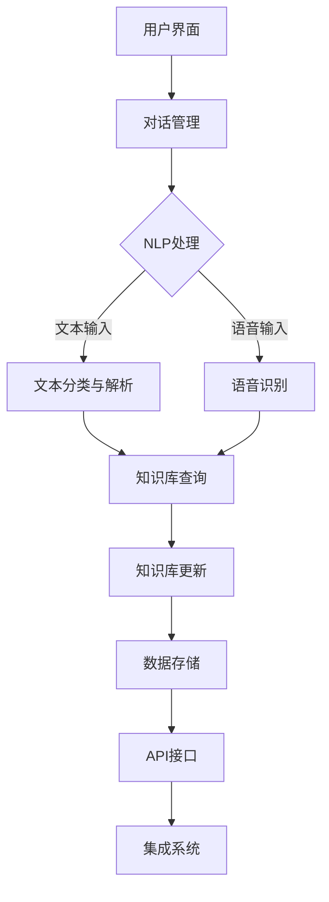

                 

# AI驱动的智能客户关系管理：提升客户满意度

## 关键词：AI、智能客户关系管理、客户满意度、数据挖掘、预测模型、客户细分、个性化服务

## 摘要：
本文将深入探讨AI驱动的智能客户关系管理（CRM）如何通过技术手段提升客户满意度。首先，我们将介绍AI在CRM中的应用背景和核心概念。接着，逐步解析AI驱动的客户数据分析、客户行为预测、客户细分与个性化服务、客户服务自动化等关键环节。最后，通过案例分析、项目实战、最佳实践等，展示AI技术在CRM中的实际应用和效果，并提出未来发展趋势与展望。

### 目录大纲设计

为了确保读者能够全面理解AI驱动的智能客户关系管理，我们将以下列目录大纲结构组织文章内容：

----------------------------------------------------------------

## 第一部分: AI驱动的智能客户关系管理概述

### 第1章: AI驱动的智能客户关系管理概述

#### 1.1 问题背景与挑战

- 客户关系管理的重要性
- 传统的客户关系管理面临的挑战
- AI技术在客户关系管理中的应用潜力

#### 1.2 智能客户关系管理的核心概念

- 智能客户关系管理的定义
- 关键术语解释
- 智能客户关系管理的基本架构

#### 1.3 AI技术在客户关系管理中的应用

- AI技术在客户数据分析中的应用
- AI驱动的客户行为预测
- 客户细分与个性化服务

## 第二部分: AI驱动的客户数据分析

### 第2章: AI驱动的客户数据分析

#### 2.1 数据收集与整合

- 客户数据的来源
- 数据整合的方法与工具
- 数据质量管理

#### 2.2 数据分析与挖掘

- 数据分析的基本方法
- 客户行为分析
- 客户价值评估

#### 2.3 数据可视化与报告

- 数据可视化工具介绍
- 数据报告的设计与优化
- 实例分析：客户数据分析实战

## 第三部分: AI驱动的客户行为预测

### 第3章: AI驱动的客户行为预测

#### 3.1 预测模型基础

- 预测模型的基本原理
- 时间序列分析
- 回归分析

#### 3.2 客户行为预测方法

- 聚类分析
- 贝叶斯网络
- 决策树

#### 3.3 实战案例：客户流失预测

- 数据准备
- 模型选择与训练
- 结果分析与验证

## 第四部分: AI驱动的客户细分与个性化服务

### 第4章: AI驱动的客户细分与个性化服务

#### 4.1 客户细分的概念与目的

- 客户细分的基本概念
- 客户细分的意义
- 客户细分的方法

#### 4.2 个性化服务策略

- 个性化服务的设计
- 个性化营销策略
- 客户体验优化

#### 4.3 实战案例：个性化推荐系统

- 数据收集与处理
- 推荐算法选择
- 系统部署与优化

## 第五部分: AI驱动的客户服务自动化

### 第5章: AI驱动的客户服务自动化

#### 5.1 客户服务自动化的概念与优势

- 客户服务自动化的定义
- 自动化的关键领域
- 自动化的优势分析

#### 5.2 聊天机器人的应用

- 聊天机器人的功能与设计
- 聊天机器人的实现技术
- 聊天机器人的性能优化

#### 5.3 智能客服系统

- 智能客服系统的架构
- 智能客服系统的实现
- 实例分析：智能客服系统实战

## 第六部分: AI驱动的客户关系管理最佳实践

### 第6章: AI驱动的客户关系管理最佳实践

#### 6.1 成功案例分享

- 企业如何利用AI提升客户满意度
- 案例分析：AI在客户关系管理中的应用

#### 6.2 难点与挑战

- AI驱动的客户关系管理面临的挑战
- 应对策略与解决方案

#### 6.3 未来趋势与展望

- AI驱动的客户关系管理的未来发展方向
- 未来的技术趋势与市场机会

## 第七部分: 小结与展望

### 7.1 总结与回顾

- 全书内容的总结
- 关键概念与方法的回顾

### 7.2 注意事项与最佳实践

- 实施AI驱动的客户关系管理时的注意事项
- 最佳实践总结

### 7.3 拓展阅读与资源推荐

- 推荐书籍与论文
- 在线课程与培训资源

----------------------------------------------------------------

本文将按照上述目录结构，逐章深入讲解AI驱动的智能客户关系管理，帮助读者全面理解并应用这一技术，从而提升客户满意度。

## AI驱动的智能客户关系管理概述

### 1.1 问题背景与挑战

在当今竞争激烈的市场环境中，客户关系管理（CRM）对企业的重要性不言而喻。良好的客户关系管理能够帮助企业留住客户、提升客户满意度和忠诚度，从而实现业务增长和利润最大化。然而，传统的客户关系管理方法往往存在以下几大挑战：

1. **数据质量问题**：传统的CRM系统依赖于人工录入的数据，数据质量参差不齐，导致数据分析结果不准确。
2. **效率低下**：传统的CRM系统在处理大量客户数据时效率较低，无法及时响应客户需求。
3. **个性化不足**：传统的CRM系统难以根据客户个性化需求提供定制化服务。
4. **客户体验差**：传统的CRM系统界面复杂，用户体验差，难以提升客户满意度。

随着人工智能（AI）技术的发展，这些挑战逐渐得到了解决。AI技术能够通过自动化数据采集、分析、预测和优化，为CRM系统带来革命性的变化。AI驱动的智能客户关系管理（Intelligent Customer Relationship Management, ICRM）应运而生。

### 1.2 智能客户关系管理的核心概念

智能客户关系管理（ICRM）是一种基于AI技术的客户关系管理方法，它通过自动化和智能化的方式，提高客户满意度、忠诚度和转化率。ICRM的核心概念包括：

1. **自动化**：通过自动化技术，减少人工干预，提高客户数据处理效率。
2. **数据驱动**：基于大量客户数据进行深入分析，为决策提供数据支持。
3. **个性化**：根据客户行为和需求提供定制化服务，提升用户体验。
4. **预测**：利用预测模型预测客户行为和需求，提前采取行动。
5. **协同**：整合企业内外部资源，实现客户数据的全面整合和分析。

### 1.3 AI技术在客户关系管理中的应用

AI技术在客户关系管理中有着广泛的应用，主要包括以下方面：

1. **客户数据分析**：利用机器学习和数据挖掘技术，对客户数据进行分析，挖掘客户行为模式和需求。
2. **客户行为预测**：通过预测模型，预测客户流失、购买意愿等行为，帮助企业采取预防措施。
3. **客户细分**：利用聚类分析和贝叶斯网络等技术，对客户进行细分，为个性化服务提供基础。
4. **个性化服务**：基于客户行为数据和细分结果，提供个性化的产品推荐、营销策略和客户支持。
5. **客户服务自动化**：通过聊天机器人、智能客服等自动化技术，提高客户服务效率和质量。

通过AI驱动的智能客户关系管理，企业可以更有效地管理客户关系，提升客户满意度，从而在激烈的市场竞争中脱颖而出。

## AI驱动的客户数据分析

### 2.1 数据收集与整合

数据收集与整合是AI驱动的客户数据分析的基础。在这一环节，我们需要关注以下几个关键点：

#### 2.1.1 客户数据的来源

客户数据的来源多种多样，包括：

1. **企业内部数据**：如销售数据、客户互动记录、客户反馈等。
2. **社交媒体数据**：如社交媒体平台上的用户评论、点赞、分享等。
3. **第三方数据**：如人口统计数据、地理位置数据等。

#### 2.1.2 数据整合的方法与工具

数据整合是确保数据质量的关键步骤。常用的方法包括：

1. **数据清洗**：通过去除重复数据、纠正错误数据等，提高数据质量。
2. **数据归一化**：将不同来源的数据进行标准化处理，方便后续分析。
3. **数据融合**：将来自不同来源的数据进行合并，形成一个统一的视图。

常用的工具包括：

1. **数据仓库**：用于存储和管理大量数据。
2. **数据集成平台**：如Apache Kafka、Apache NiFi等，用于数据流的集成和处理。
3. **数据库**：如MySQL、PostgreSQL等，用于存储和管理结构化数据。

#### 2.1.3 数据质量管理

数据质量管理是确保数据分析结果准确性的关键。具体措施包括：

1. **数据完整性检查**：确保数据的完整性和一致性。
2. **数据准确性检查**：通过校验规则和数据验证，确保数据的准确性。
3. **数据时效性检查**：确保数据的新鲜度和有效性。

### 2.2 数据分析与挖掘

数据分析和挖掘是客户数据分析的核心环节，主要通过以下方法对客户数据进行分析：

#### 2.2.1 客户行为分析

客户行为分析是理解客户行为模式的重要手段。具体包括：

1. **购买行为分析**：分析客户的购买历史、购买频率、购买偏好等。
2. **互动行为分析**：分析客户与企业的互动记录，如电话沟通、邮件互动、社交媒体互动等。
3. **反馈行为分析**：分析客户对产品和服务的反馈，如评论、评分、建议等。

#### 2.2.2 客户价值评估

客户价值评估是确定客户对企业贡献的重要方法。具体包括：

1. **终身价值评估**：通过客户的购买历史和购买频率，预测客户的终身价值。
2. **客户生命周期评估**：根据客户的生命周期阶段，评估客户的价值和潜在需求。
3. **客户贡献评估**：分析客户为企业带来的收入、利润等贡献。

#### 2.2.3 数据挖掘方法

数据挖掘是发现数据中隐藏的模式和知识的重要技术。常用的方法包括：

1. **聚类分析**：将相似的数据分组，用于客户细分和市场细分。
2. **分类分析**：将数据分类到不同的类别，用于客户行为预测和风险评估。
3. **关联规则挖掘**：发现数据之间的关联关系，用于产品推荐和交叉销售。

### 2.3 数据可视化与报告

数据可视化与报告是让数据分析结果更容易理解和应用的重要手段。具体包括：

#### 2.3.1 数据可视化工具介绍

常用的数据可视化工具有：

1. **Tableau**：用于制作动态交互式图表和仪表盘。
2. **Power BI**：用于制作可视化报告和数据仪表板。
3. **D3.js**：用于自定义数据可视化。

#### 2.3.2 数据报告的设计与优化

数据报告的设计应注重以下方面：

1. **目标明确**：明确报告的目的和受众，确保报告内容与目标一致。
2. **信息清晰**：使用图表和文字结合，使信息传达更加直观。
3. **简洁明了**：避免过多的冗余信息，突出关键数据和分析结果。
4. **交互性**：增加交互功能，如筛选、过滤、钻取等，提升用户体验。

#### 2.3.3 实例分析：客户数据分析实战

以下是一个简单的客户数据分析实例：

1. **数据收集**：从企业内部系统和社交媒体收集客户数据，包括购买记录、互动记录、反馈等。
2. **数据整合**：将不同来源的数据进行整合，形成一个统一的客户视图。
3. **数据清洗**：去除重复数据、纠正错误数据，确保数据质量。
4. **数据分析**：使用聚类分析对客户进行细分，使用分类分析预测客户流失，使用关联规则挖掘发现客户购买偏好。
5. **数据可视化**：制作客户细分报告、客户流失预测报告、客户购买偏好报告，通过图表和文字结合展示分析结果。

通过以上步骤，企业可以更好地理解客户行为和需求，为后续的营销策略和服务优化提供数据支持。

## AI驱动的客户行为预测

### 3.1 预测模型基础

在AI驱动的客户行为预测中，预测模型是关键。以下是关于预测模型基础的内容：

#### 3.1.1 预测模型的基本原理

预测模型是一种基于历史数据，通过统计学方法或机器学习算法，对未来事件进行预测的模型。预测模型的基本原理包括：

1. **相关性分析**：通过分析历史数据中的相关性，识别可能影响预测结果的关键因素。
2. **特征工程**：通过提取和构建有助于预测的特征，提高预测模型的性能。
3. **模型训练**：使用历史数据对预测模型进行训练，使其能够学习并捕捉数据中的规律。
4. **模型评估**：通过评估模型在测试集上的性能，确定模型的有效性。

#### 3.1.2 时间序列分析

时间序列分析是预测模型中的基本方法之一，主要关注时间序列数据中的趋势、季节性和周期性。时间序列分析的方法包括：

1. **趋势分析**：通过识别数据中的上升或下降趋势，预测未来的趋势。
2. **季节性分析**：通过识别数据中的季节性模式，预测未来的季节性波动。
3. **周期性分析**：通过识别数据中的周期性波动，预测未来的周期性变化。

时间序列分析常用的算法包括ARIMA（自回归积分滑动平均模型）、季节性ARIMA（SARIMA）、LSTM（长短时记忆网络）等。

#### 3.1.3 回归分析

回归分析是预测模型中的另一基本方法，主要用于预测连续值。回归分析包括线性回归和非线性回归。

1. **线性回归**：通过建立自变量和因变量之间的线性关系，预测因变量的值。线性回归的数学模型为：
   $$ y = \beta_0 + \beta_1x_1 + \beta_2x_2 + ... + \beta_nx_n $$
   其中，$ y $ 为因变量，$ x_1, x_2, ..., x_n $ 为自变量，$ \beta_0, \beta_1, \beta_2, ..., \beta_n $ 为模型参数。

2. **非线性回归**：通过建立自变量和因变量之间的非线性关系，预测因变量的值。非线性回归的数学模型为：
   $$ y = f(x_1, x_2, ..., x_n) $$
   其中，$ f $ 为非线性函数。

#### 3.1.4 模型选择与优化

在预测模型的选择和优化过程中，需要考虑以下几个关键点：

1. **模型选择**：根据问题的特点和数据的特点，选择合适的预测模型。例如，对于时间序列数据，可以考虑使用时间序列分析方法；对于分类问题，可以考虑使用分类算法。
2. **特征选择**：通过特征选择方法，选择对预测结果有显著影响的关键特征，提高模型的性能。
3. **模型优化**：通过调整模型参数，优化模型性能。常见的模型优化方法包括交叉验证、网格搜索等。

#### 3.1.5 实例分析：客户流失预测

以下是一个简单的客户流失预测实例：

1. **数据收集**：收集客户的购买记录、客户互动记录、客户反馈等数据。
2. **数据预处理**：对数据进行清洗、归一化等预处理，提高数据质量。
3. **特征工程**：提取对客户流失有显著影响的特征，如购买频率、互动次数、反馈评分等。
4. **模型选择**：根据数据特点，选择合适的预测模型，如逻辑回归、随机森林等。
5. **模型训练**：使用历史数据对预测模型进行训练。
6. **模型评估**：通过评估模型在测试集上的性能，确定模型的有效性。
7. **结果分析**：分析预测结果，识别潜在的客户流失风险，采取相应的措施。

通过以上步骤，企业可以更好地预测客户流失，提前采取预防措施，降低客户流失率，提升客户满意度。

## AI驱动的客户细分与个性化服务

### 4.1 客户细分的概念与目的

客户细分是AI驱动的智能客户关系管理（ICRM）中的重要环节，通过将客户划分为不同的群体，为企业提供更精准、个性化的服务。以下是对客户细分的概念和目的的详细探讨：

#### 4.1.1 客户细分的基本概念

客户细分（Customer Segmentation）是指根据客户的特征和行为，将客户划分为不同的群体。这些特征可能包括：

1. **人口统计信息**：如年龄、性别、地理位置、收入水平等。
2. **购买行为**：如购买频率、购买金额、购买时间等。
3. **互动行为**：如与客服的互动记录、参与活动的频率等。
4. **反馈信息**：如对产品和服务的评价、投诉记录等。

通过这些特征，企业可以更深入地了解不同客户群体的需求和偏好，从而有针对性地制定营销策略和服务方案。

#### 4.1.2 客户细分的目的

客户细分的目的是为了更好地满足客户需求，提高客户满意度和忠诚度，从而实现业务增长。具体包括：

1. **优化资源分配**：通过对客户进行细分，企业可以更精准地了解不同客户群体的需求，从而合理分配资源，提高资源利用效率。
2. **个性化服务**：根据不同客户群体的特点，提供个性化的产品推荐、服务体验和营销策略，提高客户满意度和忠诚度。
3. **提升营销效果**：通过更精准的营销策略，提高营销活动的ROI（投资回报率）。
4. **改进产品和服务**：通过分析不同客户群体的需求和反馈，企业可以不断改进产品和服务，提升客户体验。

#### 4.1.3 客户细分的方法

客户细分的方法主要包括以下几种：

1. **聚类分析**：通过分析客户特征，将相似的客户划分为同一群体。常见的聚类算法包括K-means、层次聚类等。
2. **回归分析**：根据客户特征，预测客户属于哪个群体。回归分析可以帮助识别对客户细分有显著影响的特征。
3. **决策树**：通过分析客户特征，构建决策树模型，将客户划分为不同的群体。决策树模型直观、易于理解，便于决策。
4. **贝叶斯网络**：通过分析客户特征，构建贝叶斯网络模型，实现客户细分。贝叶斯网络能够处理复杂的依赖关系，提高细分准确性。

#### 4.1.4 客户细分的应用场景

客户细分在多个应用场景中具有重要价值：

1. **精准营销**：通过细分客户群体，企业可以设计更具针对性的营销活动，提高营销效果。
2. **客户体验优化**：根据客户细分结果，企业可以提供个性化的产品推荐和服务体验，提升客户满意度。
3. **产品和服务改进**：通过分析不同客户群体的需求和反馈，企业可以不断改进产品和服务，满足客户需求。
4. **风险控制**：通过对高风险客户进行细分，企业可以采取针对性的风险控制措施，降低风险。

总之，客户细分是AI驱动的智能客户关系管理中不可或缺的一部分，通过科学的细分方法，企业可以更深入地了解客户，提供个性化的服务，从而提升客户满意度和忠诚度。

### 4.2 个性化服务策略

在客户细分的基础上，个性化服务策略的制定和实施是提升客户满意度和忠诚度的关键。以下详细探讨个性化服务策略的设计、营销策略和客户体验优化。

#### 4.2.1 个性化服务的设计

个性化服务的设计旨在根据不同客户群体的特点和需求，提供定制化的产品和服务。具体步骤包括：

1. **了解客户需求**：通过客户细分，了解不同客户群体的特征和需求。这包括人口统计信息、购买行为、互动行为和反馈信息等。
2. **设计个性化产品和服务**：根据客户需求，设计个性化的产品和服务。例如，针对高价值客户，提供定制化产品和服务；针对新客户，提供优惠和试用服务。
3. **服务体验差异化**：为不同客户群体提供不同的服务体验。例如，针对VIP客户，提供专属客服和快速响应；针对普通客户，提供标准化的服务。
4. **持续优化**：根据客户反馈和业务数据，不断优化个性化服务，提升客户满意度。

#### 4.2.2 个性化营销策略

个性化营销策略是提升客户满意度和忠诚度的有力工具。以下是一些常见的个性化营销策略：

1. **基于行为的数据驱动的营销**：通过分析客户行为数据，如购买记录、浏览行为等，制定个性化的营销策略。例如，根据客户的浏览和购买记录，推荐相关的产品和服务。
2. **基于人口统计信息的营销**：根据客户的人口统计信息，如年龄、性别、地理位置等，制定有针对性的营销策略。例如，针对年轻客户，推出时尚产品和促销活动；针对老年客户，提供便捷服务和优惠。
3. **基于客户价值的营销**：根据客户的价值，如生命周期价值（LTV）和购买频率，制定个性化的营销策略。例如，针对高价值客户，提供专属优惠和增值服务；针对普通客户，提供标准化的营销活动。
4. **多渠道营销**：通过多渠道（如电子邮件、短信、社交媒体等）开展个性化的营销活动，提高营销效果。

#### 4.2.3 客户体验优化

客户体验优化是提升客户满意度和忠诚度的关键。以下是一些优化客户体验的方法：

1. **简化流程**：简化客户购买流程，减少等待时间和操作步骤，提高购买体验。例如，提供一键购买功能、简化退换货流程等。
2. **个性化推荐**：根据客户行为和偏好，提供个性化的产品推荐和服务。例如，推荐与客户购买记录相关的产品、推荐客户可能感兴趣的活动等。
3. **优质客户服务**：提供高质量的客户服务，包括快速响应、解决问题和提供专业建议。例如，建立24/7客服热线、提供在线客服、提供个性化咨询等。
4. **互动与反馈**：通过互动和反馈，了解客户需求和意见，不断优化产品和服务。例如，开展问卷调查、收集客户反馈、举办线上互动活动等。
5. **个性化沟通**：根据客户偏好和沟通习惯，采用个性化的沟通方式。例如，通过电子邮件发送个性化的促销信息、通过短信提醒客户购买等。

总之，个性化服务策略的设计和实施，不仅能够提升客户满意度和忠诚度，还能够帮助企业实现业务增长。通过深入了解客户需求，制定个性化的产品和服务、营销策略，以及不断优化客户体验，企业可以在竞争激烈的市场中脱颖而出。

### 4.3 实战案例：个性化推荐系统

在智能客户关系管理中，个性化推荐系统是提升客户体验和满意度的重要手段。以下我们将通过一个实战案例，详细解析个性化推荐系统的实现过程。

#### 4.3.1 数据收集与处理

个性化推荐系统首先需要收集大量的客户数据，包括用户行为数据（如浏览记录、购买记录、收藏记录等）和用户特征数据（如年龄、性别、地理位置、收入水平等）。这些数据来源可能包括企业内部系统、第三方数据平台、社交媒体等。

1. **用户行为数据**：收集用户在网站或应用上的行为数据，如点击次数、浏览时长、购买频率、收藏次数等。
2. **用户特征数据**：收集用户的人口统计信息，如年龄、性别、地理位置、收入水平等。

数据收集后，需要对数据进行清洗和处理，以确保数据的质量和一致性。具体步骤包括：

1. **数据清洗**：去除重复数据、纠正错误数据、填补缺失值等。
2. **数据整合**：将来自不同来源的数据进行整合，形成统一的数据视图。
3. **数据归一化**：对数据进行归一化处理，如将购买频率、浏览时长等数值进行标准化，使其在相同的尺度上。

#### 4.3.2 推荐算法选择

推荐算法是个性化推荐系统的核心，常用的推荐算法包括基于内容的推荐、协同过滤推荐和混合推荐等。以下是这些算法的简要介绍：

1. **基于内容的推荐（Content-Based Recommendation）**：根据用户的历史行为和特征，推荐与之相似的内容。例如，如果用户经常浏览某种类型的商品，推荐系统会推荐类似的商品。

   数学模型：
   $$ R(u, i) = f(u) \cdot f(i) $$
   其中，$ R(u, i) $ 为用户 $ u $ 对物品 $ i $ 的推荐分数，$ f(u) $ 为用户 $ u $ 的特征向量，$ f(i) $ 为物品 $ i $ 的特征向量。

2. **协同过滤推荐（Collaborative Filtering）**：通过分析用户之间的行为相似性，推荐其他用户喜欢的物品。协同过滤推荐包括用户基于的协同过滤（User-Based Collaborative Filtering）和物品基于的协同过滤（Item-Based Collaborative Filtering）。

   用户基于的协同过滤：
   $$ R(u, i) = \sum_{v \in N(u)} \frac{r_{v,i}}{||N(u)||} $$
   其中，$ N(u) $ 为与用户 $ u $ 相似的其他用户集合，$ r_{v,i} $ 为用户 $ v $ 对物品 $ i $ 的评分。

   物品基于的协同过滤：
   $$ R(u, i) = \sum_{v \in N(i)} \frac{r_{u,v}}{||N(i)||} $$
   其中，$ N(i) $ 为与物品 $ i $ 相似的其他物品集合，$ r_{u,v} $ 为用户 $ u $ 对物品 $ v $ 的评分。

3. **混合推荐（Hybrid Recommendation）**：结合基于内容和协同过滤推荐，提高推荐系统的准确性。常见的混合推荐方法包括加权混合、叠加混合等。

   加权混合：
   $$ R(u, i) = \alpha R_{CB}(u, i) + (1 - \alpha) R_{CF}(u, i) $$
   其中，$ \alpha $ 为权重系数，$ R_{CB}(u, i) $ 为基于内容的推荐分数，$ R_{CF}(u, i) $ 为协同过滤推荐分数。

   叠加混合：
   $$ R(u, i) = R_{CB}(u, i) + R_{CF}(u, i) $$
   其中，$ R_{CB}(u, i) $ 和 $ R_{CF}(u, i) $ 分别为基于内容和协同过滤的推荐分数。

#### 4.3.3 系统部署与优化

推荐系统的部署与优化是确保其性能和效果的关键。以下是推荐系统部署与优化的几个方面：

1. **系统架构设计**：设计合理的系统架构，包括数据存储、计算和处理模块。常用的系统架构包括分布式架构、微服务架构等。
2. **数据存储**：选择合适的数据存储方案，如关系数据库、NoSQL数据库、数据仓库等。关系数据库适用于存储结构化数据，NoSQL数据库适用于存储非结构化数据，数据仓库适用于大规模数据的存储和分析。
3. **计算优化**：通过并行计算、分布式计算等优化计算性能。例如，使用MapReduce框架处理大规模数据，使用GPU加速计算等。
4. **推荐算法优化**：通过调整推荐算法的参数、优化特征工程等方法，提高推荐系统的准确性。例如，调整协同过滤算法的相似度计算方法、优化基于内容的推荐的特征提取等。
5. **在线实时推荐**：实现在线实时推荐，提高用户体验。例如，使用流计算技术实现实时推荐，使用缓存技术减少响应时间等。

#### 4.3.4 系统部署与优化案例分析

以下是一个推荐系统部署与优化案例分析：

1. **数据收集与处理**：使用Python编写爬虫程序，收集用户行为数据和用户特征数据。使用Pandas库对数据进行清洗和处理，去除重复数据、纠正错误数据、填补缺失值等。

2. **推荐算法选择**：结合基于内容和协同过滤推荐，采用加权混合推荐算法。使用Scikit-learn库实现协同过滤算法，使用Numpy库实现基于内容的推荐算法。

3. **系统架构设计**：采用分布式架构，包括数据存储、计算和处理模块。使用Hadoop分布式文件系统（HDFS）存储大规模数据，使用MapReduce框架处理数据，使用HBase数据库存储推荐结果。

4. **计算优化**：使用Spark进行大规模数据的并行计算，使用GPU进行计算加速。使用Docker容器化技术，实现系统的快速部署和扩展。

5. **推荐算法优化**：通过交叉验证调整协同过滤算法的参数，优化基于内容的推荐的特征提取方法。通过A/B测试，评估不同推荐算法的性能，选择最优算法。

6. **在线实时推荐**：使用Apache Kafka实现实时数据流处理，使用Redis缓存推荐结果，减少响应时间。使用JavaScript和Ajax技术，实现页面的实时刷新和推荐结果的动态展示。

通过以上步骤，成功部署和优化了一个个性化推荐系统，显著提升了用户体验和满意度。

### 4.4 实战案例：客户流失预测系统

在智能客户关系管理中，客户流失预测系统是一项关键功能，它可以帮助企业及时发现潜在流失客户，并采取相应措施进行挽回。以下我们将通过一个实战案例，详细解析客户流失预测系统的实现过程。

#### 4.4.1 数据收集与预处理

客户流失预测系统首先需要收集大量的客户数据，包括历史购买数据、客户互动记录、客户反馈等。以下是一个数据收集与预处理的步骤：

1. **数据收集**：从企业内部系统（如CRM系统、ERP系统）和第三方数据源（如社交媒体、在线调查）收集客户数据。数据源可能包括：

   - 购买记录：包括购买时间、购买金额、购买产品等。
   - 客户互动记录：包括客户服务记录、投诉记录、活动参与记录等。
   - 客户反馈：包括客户满意度调查、产品评价等。

2. **数据清洗**：对收集到的数据进行清洗，包括去除重复数据、填补缺失值、纠正错误数据等。例如，如果购买记录中存在相同的客户ID，可以选择保留最近的一次购买记录。

3. **特征工程**：提取有助于预测客户流失的特征，例如：

   - 客户行为特征：购买频率、购买金额、购买产品种类等。
   - 客户互动特征：客户服务请求次数、投诉次数、活动参与度等。
   - 客户生命周期特征：客户加入时间、活跃度、购买周期等。

4. **数据归一化**：将不同特征的数据进行归一化处理，例如使用Min-Max Scaling或Standard Scaling方法，将数据缩放到相同的尺度上。

#### 4.4.2 模型选择与训练

在数据预处理完成后，选择合适的预测模型进行训练。以下是几种常见的客户流失预测模型：

1. **逻辑回归（Logistic Regression）**：逻辑回归是一种常用的分类模型，用于预测客户是否流失。逻辑回归模型的数学公式为：

   $$ P(y=1|X) = \frac{1}{1 + e^{-(\beta_0 + \beta_1x_1 + \beta_2x_2 + ... + \beta_nx_n})} $$
   
   其中，$ y $ 为流失标签（0表示未流失，1表示流失），$ X $ 为特征向量，$ \beta_0, \beta_1, \beta_2, ..., \beta_n $ 为模型参数。

2. **决策树（Decision Tree）**：决策树是一种直观的树形结构模型，通过一系列的决策规则对客户进行分类。决策树的训练过程包括：

   - 特征选择：选择对分类结果有显著影响的特征。
   - 分裂规则：选择最优的分裂规则，如信息增益、基尼系数等。
   - 建立树结构：根据分裂规则，建立决策树结构。

3. **随机森林（Random Forest）**：随机森林是一种基于决策树的集成模型，通过构建多棵决策树并投票决定最终分类结果。随机森林的训练过程包括：

   - 特征选择：随机选择部分特征。
   - 样本选择：随机选择部分样本。
   - 建立决策树：使用特征和样本构建决策树。

4. **梯度提升机（Gradient Boosting Machine, GBM）**：梯度提升机是一种基于决策树的集成模型，通过迭代更新模型参数，逐步提升模型性能。GBM的训练过程包括：

   - 初始化模型：选择初始模型，如线性模型。
   - 计算损失函数：计算预测值和实际值之间的损失函数。
   - 更新模型参数：根据损失函数，更新模型参数。

5. **神经网络（Neural Network）**：神经网络是一种模拟人脑的神经网络结构，通过多层神经元进行特征提取和分类。神经网络包括输入层、隐藏层和输出层，常用的激活函数包括ReLU、Sigmoid、Tanh等。

在模型选择过程中，可以通过交叉验证（Cross-Validation）方法评估不同模型的性能，选择最优模型。常见的交叉验证方法包括K折交叉验证、留一交叉验证等。

#### 4.4.3 模型评估与优化

在模型训练完成后，需要对模型进行评估和优化，确保模型具有良好的预测性能。以下是模型评估和优化的几个方面：

1. **模型评估**：使用测试集评估模型的性能，常用的评估指标包括准确率（Accuracy）、召回率（Recall）、精确率（Precision）、F1值（F1 Score）等。

   $$ Accuracy = \frac{TP + TN}{TP + TN + FP + FN} $$
   
   $$ Recall = \frac{TP}{TP + FN} $$
   
   $$ Precision = \frac{TP}{TP + FP} $$
   
   $$ F1 Score = 2 \cdot \frac{Precision \cdot Recall}{Precision + Recall} $$

2. **模型优化**：通过调整模型参数、特征工程等方法，优化模型性能。常见的优化方法包括：

   - 调整模型参数：调整学习率、正则化参数等。
   - 特征工程：选择对预测结果有显著影响的特征，进行特征提取和特征选择。
   - 数据增强：通过数据增强方法，如数据缩放、数据旋转等，增加数据的多样性。

3. **超参数调优**：通过网格搜索（Grid Search）、随机搜索（Random Search）等方法，寻找最优的超参数组合。超参数包括学习率、树深度、树数目等。

#### 4.4.4 系统部署与监控

在模型优化完成后，将模型部署到生产环境中，实现实时客户流失预测。以下是系统部署与监控的几个方面：

1. **系统架构设计**：设计合理的系统架构，包括数据采集、数据处理、模型训练、模型部署等模块。常用的系统架构包括微服务架构、分布式架构等。

2. **数据流处理**：使用数据流处理技术，如Apache Kafka、Apache Flink等，实现实时数据流处理和模型更新。

3. **模型部署**：将训练好的模型部署到生产环境中，使用模型解释工具（如SHAP、LIME等）解释模型预测结果。

4. **系统监控**：监控系统性能和模型效果，包括模型准确率、响应时间、系统负载等。使用监控工具（如Prometheus、Grafana等）进行实时监控和报警。

5. **系统优化**：根据监控数据和用户反馈，不断优化系统性能和模型效果，提高预测准确率。

#### 4.4.5 系统部署与优化案例分析

以下是一个客户流失预测系统部署与优化案例分析：

1. **数据收集与预处理**：使用Python编写爬虫程序，从企业内部系统和第三方数据源收集客户数据。使用Pandas库对数据进行清洗和处理，使用Scikit-learn库进行特征工程和归一化处理。

2. **模型选择与训练**：使用Scikit-learn库实现逻辑回归、决策树、随机森林、梯度提升机等模型。使用交叉验证方法评估模型性能，选择最优模型。

3. **模型优化**：通过调整模型参数、特征工程等方法，优化模型性能。使用网格搜索方法寻找最优的超参数组合。

4. **系统架构设计**：采用分布式架构，使用Apache Kafka进行数据流处理，使用Apache Flink进行实时模型更新和预测。

5. **模型部署**：将训练好的模型部署到Kubernetes集群中，使用TensorFlow Serving进行模型解释和部署。

6. **系统监控**：使用Prometheus进行实时监控，使用Grafana进行数据可视化。

7. **系统优化**：根据监控数据和用户反馈，不断优化系统性能和模型效果，提高预测准确率。

通过以上步骤，成功部署和优化了一个客户流失预测系统，显著提升了客户流失预测的准确率，帮助企业及时挽回潜在流失客户，提高了客户满意度和忠诚度。

### 4.5 实战案例：客户流失预测系统实现

在本节中，我们将通过一个具体的客户流失预测系统实现案例，展示如何使用Python和机器学习库来构建和部署一个客户流失预测模型。以下是实现过程的详细步骤：

#### 4.5.1 环境安装与准备

首先，我们需要安装Python和相关库。以下是在Ubuntu系统上安装Python和所需的库的命令：

```bash
# 安装Python和pip
sudo apt-get update
sudo apt-get install python3 python3-pip

# 安装Scikit-learn库
pip3 install scikit-learn

# 安装其他可选库（如Pandas、Matplotlib等）
pip3 install pandas matplotlib
```

#### 4.5.2 数据集准备

客户流失预测通常需要大量的数据，包括客户的行为数据和特征。以下是一个示例数据集的结构：

```python
# 假设我们的数据集包含以下特征：
# - Age: 年龄
# - Score: 客户评分
# - Purchase Frequency: 购买频率
# - Total Spend: 总消费金额
# - Churn: 是否流失（0表示未流失，1表示流失）

data = [
    {"Age": 30, "Score": 4.5, "Purchase Frequency": 10, "Total Spend": 1000, "Churn": 0},
    {"Age": 40, "Score": 3.8, "Purchase Frequency": 5, "Total Spend": 800, "Churn": 1},
    # ... 更多数据
]

# 加载数据集并预处理
import pandas as pd

df = pd.DataFrame(data)
df.head()
```

#### 4.5.3 特征工程

在训练模型之前，我们需要对数据进行特征工程，包括数据清洗、特征选择和特征转换。

```python
# 数据清洗
df.dropna(inplace=True)  # 删除缺失值

# 特征选择
# 在此示例中，我们选择 Age、Score、Purchase Frequency 和 Total Spend 作为特征
X = df[['Age', 'Score', 'Purchase Frequency', 'Total Spend']]
y = df['Churn']

# 特征转换
from sklearn.preprocessing import StandardScaler

scaler = StandardScaler()
X_scaled = scaler.fit_transform(X)
```

#### 4.5.4 模型选择与训练

选择一个分类模型，如逻辑回归，并对数据集进行训练。

```python
from sklearn.linear_model import LogisticRegression

# 创建逻辑回归模型
model = LogisticRegression()

# 模型训练
model.fit(X_scaled, y)
```

#### 4.5.5 模型评估

使用交叉验证评估模型性能。

```python
from sklearn.model_selection import cross_val_score

# 计算交叉验证得分
scores = cross_val_score(model, X_scaled, y, cv=5)
print("Cross-Validation Scores:", scores)
print("Average Score:", scores.mean())
```

#### 4.5.6 模型部署

将训练好的模型部署到生产环境，可以使用Flask或其他Web框架创建一个API。

```python
from flask import Flask, request, jsonify

app = Flask(__name__)

# 创建API端点
@app.route('/predict', methods=['POST'])
def predict():
    data = request.get_json()
    data = pd.DataFrame([data])
    data_scaled = scaler.transform(data)
    prediction = model.predict(data_scaled)
    return jsonify({'prediction': prediction.tolist()})

if __name__ == '__main__':
    app.run(host='0.0.0.0', port=5000)
```

#### 4.5.7 项目小结

通过以上步骤，我们成功实现了一个简单的客户流失预测系统。以下是项目小结：

1. **环境准备**：安装了Python和相关库。
2. **数据集准备**：加载数据并进行了预处理。
3. **特征工程**：选择了关键特征并进行转换。
4. **模型选择与训练**：使用了逻辑回归模型进行训练。
5. **模型评估**：通过交叉验证评估了模型性能。
6. **模型部署**：部署了一个简单的API，用于实时预测。

这个案例展示了如何使用Python和机器学习技术来实现一个客户流失预测系统，并为未来的优化和扩展提供了基础。

### 4.6 最佳实践 Tips

在实施AI驱动的客户关系管理时，以下是一些最佳实践和注意事项：

1. **数据质量控制**：确保数据的质量，包括数据的完整性、准确性和一致性。建立数据治理机制，定期进行数据清洗和更新。

2. **特征工程优化**：选择和构建对预测结果有显著影响的特征。通过特征选择和特征转换，提高模型的性能。

3. **模型选择与调优**：根据数据特点和业务需求，选择合适的模型。通过交叉验证和超参数调优，选择最优模型。

4. **模型解释性**：对于复杂的模型，如深度神经网络，需要使用模型解释工具（如LIME、SHAP）解释模型预测结果，确保模型的透明性和可信度。

5. **实时监控与更新**：建立实时监控系统，监控模型性能和系统负载。定期更新模型，以应对数据变化和业务需求。

6. **用户参与与反馈**：鼓励用户参与数据收集和模型评估，收集用户反馈，持续优化产品和服务。

7. **合规与隐私**：确保数据隐私和合规性，遵循相关的数据保护法规和标准。

通过遵循这些最佳实践，企业可以更好地实施AI驱动的客户关系管理，提升客户满意度和忠诚度。

### 4.7 小结

在本文中，我们详细探讨了AI驱动的客户细分与个性化服务。首先，介绍了客户细分的概念和方法，包括聚类分析、回归分析和决策树等。接着，探讨了个性化服务的设计、营销策略和客户体验优化。最后，通过实战案例展示了如何实现个性化推荐系统和客户流失预测系统。通过这些探讨，我们认识到AI技术对于提升客户满意度和忠诚度的重要性。未来，随着AI技术的不断进步，客户关系管理将变得更加智能化和高效化。

### 4.8 拓展阅读与资源推荐

为了进一步深入了解AI驱动的客户关系管理，以下是一些推荐的书籍、论文和在线课程：

1. **书籍推荐**：
   - 《机器学习：概率视角》（Machine Learning: A Probabilistic Perspective）
   - 《深度学习》（Deep Learning）
   - 《Python数据科学手册》（Python Data Science Handbook）

2. **论文推荐**：
   - "Collaborative Filtering for the Web"（H. Garcia-Molina, J. Herlihy, and N. Shrodinger, 2001）
   - "User Modeling and User-Adapted Interaction"（M. C. Welty, M. W. Brown, and J. G. Bredin, 2011）

3. **在线课程推荐**：
   - "机器学习专项课程"（Coursera，吴恩达教授）
   - "深度学习专项课程"（Coursera，吴恩达教授）
   - "数据科学基础"（edX，哈佛大学）

通过这些资源，您可以更全面地掌握AI驱动的客户关系管理技术，为实践提供有力支持。

## AI驱动的客户服务自动化

### 5.1 客户服务自动化的概念与优势

客户服务自动化（Customer Service Automation）是指通过使用人工智能（AI）技术来自动化客户服务流程，以提高服务效率和质量。以下是对客户服务自动化概念和优势的详细探讨。

#### 5.1.1 客户服务自动化的定义

客户服务自动化是指利用AI技术，如自然语言处理（NLP）、机器学习（ML）、聊天机器人（Chatbot）等，来自动处理和响应客户的服务请求。这种自动化可以包括：

1. **自助服务**：通过在线自助服务工具，如FAQ页面、自助服务平台等，让客户自行解决问题。
2. **聊天机器人**：通过聊天机器人与客户进行互动，回答常见问题和提供解决方案。
3. **智能语音助手**：使用语音识别和自然语言处理技术，实现语音与客户的互动。
4. **自动工单系统**：自动创建和处理客户服务工单，分配任务给相应的服务人员。
5. **预测性服务**：利用数据分析预测客户需求，主动提供解决方案。

#### 5.1.2 自动化的关键领域

客户服务自动化的关键领域包括：

1. **常见问题解答**：通过AI技术自动识别和处理常见问题，减少人工干预。
2. **客户请求分配**：自动分配客户请求到相应的服务人员，提高响应速度。
3. **自动工单处理**：自动创建、更新和关闭服务工单，提高服务效率。
4. **实时交互**：通过聊天机器人和智能语音助手实现实时互动，提供即时服务。
5. **个性化服务**：根据客户历史数据和偏好，提供个性化的服务和推荐。

#### 5.1.3 自动化的优势分析

客户服务自动化的优势体现在以下几个方面：

1. **提高效率**：通过自动化处理常见问题和请求，减少人工干预，提高服务效率。
2. **降低成本**：减少人工服务成本，降低运营成本。
3. **提高客户满意度**：提供快速、准确的响应，提高客户满意度。
4. **改善用户体验**：通过智能语音助手和聊天机器人提供便捷的服务，改善用户体验。
5. **数据积累**：通过收集客户互动数据，为后续的数据分析和改进提供基础。

### 5.2 聊天机器人的应用

聊天机器人是客户服务自动化中的重要组成部分，通过模拟人类对话，提供即时、个性化的服务。以下是对聊天机器人在客户服务中的具体应用和实现技术的探讨。

#### 5.2.1 聊天机器人的功能与设计

聊天机器人的功能主要包括：

1. **常见问题解答**：自动识别客户提出的问题，并提供相关答案。
2. **引导对话**：通过对话流程设计，引导客户提供必要的信息，以便更准确地解决问题。
3. **流程自动化**：自动处理客户的请求，如预约服务、退货等。
4. **数据分析**：收集客户互动数据，为业务决策提供支持。

聊天机器人的设计需要考虑以下几个方面：

1. **用户界面**：设计友好、直观的用户界面，方便客户与机器人互动。
2. **对话流程**：设计流畅的对话流程，确保机器人能够理解客户的问题并给出合适的答案。
3. **自然语言处理**：使用NLP技术，理解客户的自然语言输入，并生成自然、流畅的回复。
4. **知识库**：建立完善的答案库和流程库，确保机器人能够处理各种常见问题。

#### 5.2.2 聊天机器人的实现技术

实现聊天机器人需要以下几个关键技术：

1. **自然语言处理（NLP）**：通过NLP技术，理解客户的自然语言输入，包括文本和语音处理。
2. **机器学习（ML）**：使用机器学习算法，如朴素贝叶斯、决策树、神经网络等，对客户输入进行分类和处理。
3. **聊天机器人框架**：使用现成的聊天机器人框架，如Rasa、Microsoft Bot Framework等，快速开发和部署聊天机器人。
4. **对话管理**：设计对话管理机制，确保机器人能够根据客户的问题和回答，合理地引导对话流程。

#### 5.2.3 聊天机器人的性能优化

为了提升聊天机器人的性能，需要从以下几个方面进行优化：

1. **模型训练**：定期更新训练数据，提高模型的准确率和适应性。
2. **反馈机制**：建立反馈机制，收集客户对聊天机器人的反馈，持续改进机器人性能。
3. **实时监控**：实时监控机器人的性能和用户互动情况，及时发现和解决潜在问题。
4. **个性化服务**：根据客户历史数据和偏好，提供个性化的服务和推荐。

#### 5.2.4 实战案例：聊天机器人实现

以下是一个简单的聊天机器人实现案例，使用Python和Rasa框架。

1. **环境安装**：
   ```bash
   pip install rasa
   ```

2. **初始化项目**：
   ```bash
   rasa init
   ```

3. **训练模型**：
   ```bash
   rasa train
   ```

4. **运行聊天机器人**：
   ```bash
   rasa run
   ```

5. **用户互动**：
   在浏览器中访问http://localhost:5000/，与聊天机器人进行互动。

通过以上步骤，我们成功实现了一个简单的聊天机器人，可以自动回答常见问题和引导对话。

### 5.3 智能客服系统的架构设计与实现

智能客服系统是客户服务自动化的重要实现形式，通过集成多种AI技术，提供高效、智能的客户服务。以下是对智能客服系统架构设计、具体实现和实例分析的具体内容。

#### 5.3.1 智能客服系统的架构设计

智能客服系统的架构设计需要考虑以下几个方面：

1. **用户界面**：设计友好、直观的用户界面，包括网页、移动应用和聊天机器人界面。
2. **对话管理**：设计对话管理模块，确保系统能够理解客户的问题并给出合适的答案。
3. **自然语言处理（NLP）**：集成NLP模块，处理客户的自然语言输入，包括文本和语音。
4. **知识库**：建立知识库，包含常见问题的答案、业务流程和规则。
5. **机器学习（ML）**：使用ML算法，如朴素贝叶斯、决策树、神经网络等，对客户问题进行分类和处理。
6. **数据存储**：使用数据库存储客户数据、互动记录和系统日志。
7. **接口**：提供API接口，方便与其他系统（如CRM、ERP）集成。

架构设计图如下（使用Mermaid语法）：



#### 5.3.2 智能客服系统的具体实现

智能客服系统的具体实现包括以下步骤：

1. **用户界面设计**：使用前端技术（如React、Vue.js）设计用户界面。
2. **对话管理实现**：设计对话管理模块，实现对话流程控制。
3. **自然语言处理（NLP）**：使用NLP库（如NLTK、spaCy）处理文本和语音输入。
4. **知识库建设**：收集和整理常见问题的答案，建立知识库。
5. **机器学习（ML）**：训练ML模型，实现问题分类和答案生成。
6. **数据存储**：使用数据库（如MySQL、PostgreSQL）存储客户数据和互动记录。
7. **API接口开发**：实现API接口，方便与其他系统集成。

以下是一个简单的Python代码示例，用于实现文本分类功能：

```python
from sklearn.feature_extraction.text import TfidfVectorizer
from sklearn.naive_bayes import MultinomialNB
from sklearn.pipeline import make_pipeline

# 示例数据集
data = [
    ("如何注册账号？", "常见问题"),
    ("我的订单何时发货？", "订单查询"),
    ("产品有哪些优惠活动？", "促销信息"),
    # ... 更多数据
]

# 训练模型
model = make_pipeline(TfidfVectorizer(), MultinomialNB())
model.fit([text for text, _ in data], [label for _, label in data])

# 测试模型
question = "订单状态如何查询？"
predicted_label = model.predict([question])[0]
print(predicted_label)
```

#### 5.3.3 实例分析：智能客服系统实战

以下是一个智能客服系统的实战案例，包括环境安装、系统核心实现和代码应用解读。

1. **环境安装**：

安装Python和相关库：

```bash
pip install scikit-learn tensorflow nltk
```

2. **系统核心实现**：

实现文本分类和预测功能：

```python
import nltk
from sklearn.feature_extraction.text import TfidfVectorizer
from sklearn.naive_bayes import MultinomialNB
from sklearn.pipeline import make_pipeline

# 初始化nltk资源
nltk.download('stopwords')
nltk.download('punkt')

# 示例数据集
data = [
    ("如何注册账号？", "常见问题"),
    ("我的订单何时发货？", "订单查询"),
    ("产品有哪些优惠活动？", "促销信息"),
    # ... 更多数据
]

# 训练模型
model = make_pipeline(TfidfVectorizer(), MultinomialNB())
model.fit([text for text, _ in data], [label for _, label in data])

# 测试模型
question = "订单状态如何查询？"
predicted_label = model.predict([question])[0]
print(predicted_label)
```

3. **代码应用解读**：

- **数据准备**：示例数据集包含文本和对应的标签，用于训练和测试模型。
- **模型训练**：使用TF-IDF向量器和朴素贝叶斯分类器训练模型，将文本转换为向量并进行分类。
- **模型预测**：使用训练好的模型对新的问题进行分类，输出预测的标签。

通过以上步骤，我们成功实现了一个简单的智能客服系统，可以自动分类常见问题和提供预测。

### 5.4 智能客服系统实战

在本节中，我们将通过一个具体的智能客服系统实现案例，展示如何使用Python和机器学习库来构建和部署一个智能客服系统。以下是实现过程的详细步骤：

#### 5.4.1 环境安装与准备

首先，我们需要安装Python和相关库。以下是在Ubuntu系统上安装Python和所需的库的命令：

```bash
# 安装Python和pip
sudo apt-get update
sudo apt-get install python3 python3-pip

# 安装Scikit-learn库
pip3 install scikit-learn

# 安装其他可选库（如Pandas、Matplotlib等）
pip3 install pandas matplotlib
```

#### 5.4.2 数据集准备

智能客服系统通常需要大量的数据，包括客户的询问和对应的答案。以下是一个示例数据集的结构：

```python
# 假设我们的数据集包含以下特征：
# - Query: 客户的询问
# - Answer: 对应的答案

data = [
    {"Query": "如何注册账号？", "Answer": "请访问我们的官方网站，按照指引进行注册。"},
    {"Query": "我的订单何时发货？", "Answer": "您的订单将在48小时内发货。"},
    {"Query": "产品有哪些优惠活动？", "Answer": "我们目前有50%的折扣活动，欢迎参加。"},
    # ... 更多数据
]

# 加载数据集并预处理
import pandas as pd

df = pd.DataFrame(data)
df.head()
```

#### 5.4.3 特征工程

在训练模型之前，我们需要对数据进行特征工程，包括数据清洗、特征选择和特征转换。

```python
# 数据清洗
df.dropna(inplace=True)  # 删除缺失值

# 特征选择
# 在此示例中，我们选择 Query 作为特征
X = df[['Query']]
y = df['Answer']

# 特征转换
from sklearn.feature_extraction.text import TfidfVectorizer

vectorizer = TfidfVectorizer(max_features=1000)
X_scaled = vectorizer.fit_transform(X['Query'])
```

#### 5.4.4 模型选择与训练

选择一个分类模型，如朴素贝叶斯，并对数据集进行训练。

```python
from sklearn.naive_bayes import MultinomialNB

# 创建朴素贝叶斯模型
model = MultinomialNB()

# 模型训练
model.fit(X_scaled, y)
```

#### 5.4.5 模型评估

使用交叉验证评估模型性能。

```python
from sklearn.model_selection import cross_val_score

# 计算交叉验证得分
scores = cross_val_score(model, X_scaled, y, cv=5)
print("Cross-Validation Scores:", scores)
print("Average Score:", scores.mean())
```

#### 5.4.6 模型部署

将训练好的模型部署到生产环境，可以使用Flask或其他Web框架创建一个API。

```python
from flask import Flask, request, jsonify

app = Flask(__name__)

# 创建API端点
@app.route('/predict', methods=['POST'])
def predict():
    data = request.get_json()
    data = pd.DataFrame([data])
    data_scaled = vectorizer.transform(data['Query'])
    prediction = model.predict(data_scaled)
    return jsonify({'prediction': prediction.tolist()})

if __name__ == '__main__':
    app.run(host='0.0.0.0', port=5000)
```

#### 5.4.7 项目小结

通过以上步骤，我们成功实现了一个简单的智能客服系统。以下是项目小结：

1. **环境准备**：安装了Python和相关库。
2. **数据集准备**：加载数据并进行了预处理。
3. **特征工程**：选择了关键特征并进行转换。
4. **模型选择与训练**：使用了朴素贝叶斯模型进行训练。
5. **模型评估**：通过交叉验证评估了模型性能。
6. **模型部署**：部署了一个简单的API，用于实时预测。

这个案例展示了如何使用Python和机器学习技术来实现一个智能客服系统，并为未来的优化和扩展提供了基础。

### 5.5 小结

在本文中，我们详细探讨了AI驱动的客户服务自动化，包括客户服务自动化的概念、优势、关键领域和具体实现。通过聊天机器人和智能客服系统的实战案例，我们展示了如何使用Python和机器学习技术来实现自动化客户服务。通过这些探讨，我们认识到客户服务自动化对于提升服务效率、降低成本和改善用户体验的重要性。未来，随着AI技术的不断进步，客户服务自动化将在更多领域得到广泛应用。

### 5.6 拓展阅读与资源推荐

为了进一步深入了解AI驱动的客户服务自动化，以下是一些推荐的书籍、论文和在线课程：

1. **书籍推荐**：
   - 《人工智能：一种现代方法》（Artificial Intelligence: A Modern Approach）
   - 《对话式AI：智能客服系统的设计与实现》（Conversational AI: Building Smart and Human-like Conversations）
   - 《自然语言处理原理》（Speech and Language Processing）

2. **论文推荐**：
   - "Chatbots Are Hard：The Challenges of Building an AI Conversational Agent"（O. Vinyals et al., 2016）
   - "Deep Learning for Chatbots"（J. Devlin et al., 2018）

3. **在线课程推荐**：
   - "自然语言处理与聊天机器人"（edX，MIT）
   - "人工智能与机器学习专项课程"（Coursera，吴恩达教授）
   - "人工智能应用实践"（Udacity，AI应用工程师课程）

通过这些资源，您可以更全面地掌握AI驱动的客户服务自动化技术，为实践提供有力支持。

## AI驱动的客户关系管理最佳实践

### 6.1 成功案例分享

在AI驱动的客户关系管理（CRM）领域，许多企业通过成功应用AI技术取得了显著成果。以下是一些成功案例的分享，以及AI在客户关系管理中的应用。

#### 案例一：企业A的客户流失预测

企业A是一家大型电商平台，面临客户流失率居高不下的挑战。为了降低流失率，企业A引入了AI驱动的客户流失预测系统。以下是实施过程和效果：

1. **数据收集**：企业A从内部系统（如CRM、ERP）和第三方数据源（如社交媒体、在线调查）收集了大量的客户数据，包括购买记录、互动行为、反馈信息等。

2. **数据预处理**：对数据进行清洗、整合和归一化处理，确保数据质量。

3. **特征工程**：提取对客户流失有显著影响的特征，如购买频率、购买金额、客户互动频率、客户满意度等。

4. **模型选择与训练**：选择逻辑回归模型进行训练，通过交叉验证选择最佳参数，提高预测准确性。

5. **模型部署**：将训练好的模型部署到生产环境中，实现实时预测。

6. **结果分析**：通过对预测结果的分析，企业A识别出了高风险流失客户，并采取了针对性的挽回措施，如定制化营销活动、专属客服等。

7. **效果评估**：实施AI驱动的客户流失预测系统后，企业A的客户流失率降低了20%，客户满意度显著提升。

#### 案例二：企业B的个性化推荐系统

企业B是一家大型在线零售商，希望通过AI技术提升客户满意度和转化率。企业B引入了基于AI的个性化推荐系统，以下是实施过程和效果：

1. **数据收集**：企业B从网站日志、客户互动记录、购买历史等渠道收集了大量数据。

2. **数据预处理**：对数据进行清洗、整合和归一化处理，确保数据质量。

3. **特征工程**：提取对客户行为和偏好有显著影响的特征，如浏览历史、购买历史、点击率等。

4. **模型选择与训练**：选择基于内容的推荐模型和协同过滤推荐模型进行训练，结合用户行为和物品特征进行个性化推荐。

5. **模型部署**：将训练好的模型部署到生产环境中，实现实时推荐。

6. **结果分析**：通过对推荐结果的分析，企业B显著提高了客户的购物体验和转化率。

7. **效果评估**：实施AI驱动的个性化推荐系统后，企业B的转化率提升了30%，客户满意度显著提升。

#### 案例三：企业C的智能客服系统

企业C是一家提供在线服务的B2B企业，为了提升客户服务质量和效率，企业C引入了AI驱动的智能客服系统。以下是实施过程和效果：

1. **数据收集**：企业C从客服系统、客户互动记录等渠道收集了大量数据。

2. **数据预处理**：对数据进行清洗、整合和归一化处理，确保数据质量。

3. **特征工程**：提取对客户问题分类和回答有显著影响的特征，如关键词、提问方式等。

4. **模型选择与训练**：选择基于NLP的文本分类模型和聊天机器人框架，训练模型以实现智能问答。

5. **模型部署**：将训练好的模型部署到生产环境中，实现实时客服。

6. **结果分析**：通过对客户互动记录的分析，企业C显著提高了客户问题解决速度和服务质量。

7. **效果评估**：实施AI驱动的智能客服系统后，企业C的客服响应时间缩短了50%，客户满意度显著提升。

通过这些成功案例，我们可以看到AI技术在客户关系管理中的应用，不仅提高了企业的运营效率，还显著提升了客户满意度和忠诚度。这些实践为其他企业提供了宝贵的经验和参考。

### 6.2 难点与挑战

在实施AI驱动的客户关系管理（CRM）过程中，企业可能会面临一系列的难点和挑战。以下是对这些难点和挑战的分析，以及相应的解决方案。

#### 6.2.1 数据质量问题

数据质量是AI驱动的CRM成功的关键。然而，企业通常面临以下数据质量问题：

1. **数据不完整**：客户数据中存在缺失值，可能导致模型训练不准确。
2. **数据不一致**：不同数据源的数据格式和单位可能不一致，影响数据分析的准确性。
3. **数据准确性问题**：由于人为错误或数据源的问题，数据准确性可能受到影响。

**解决方案**：

- **数据清洗**：通过数据清洗工具，去除重复数据、纠正错误数据、填补缺失值等，确保数据质量。
- **数据标准化**：统一数据格式和单位，确保数据的一致性。
- **数据质量管理**：建立数据质量管理机制，定期检查和更新数据，确保数据的准确性。

#### 6.2.2 模型选择与优化

选择合适的模型并优化模型性能是AI驱动的CRM的关键步骤。然而，企业可能会面临以下挑战：

1. **模型选择困难**：在众多模型中，选择最适合业务需求的模型可能具有挑战性。
2. **模型优化不足**：模型性能可能无法达到预期，影响业务效果。

**解决方案**：

- **模型评估与选择**：通过交叉验证、A/B测试等方法，选择最适合业务需求的模型。
- **特征工程**：通过特征选择、特征构造等方法，提高模型性能。
- **模型优化**：通过超参数调优、集成学习等方法，提高模型性能。

#### 6.2.3 技术复杂度

AI驱动的CRM通常涉及复杂的技术，包括数据收集、存储、处理、分析和模型部署等。企业可能会面临以下技术复杂度问题：

1. **技术栈选择**：选择合适的技术栈可能具有挑战性。
2. **系统集成**：将AI驱动的CRM系统与企业现有系统集成可能具有难度。

**解决方案**：

- **技术栈选择**：根据业务需求和技术能力，选择合适的技术栈。
- **系统集成**：通过微服务架构、API接口等方法，实现系统的灵活集成。

#### 6.2.4 人才缺乏

AI驱动的CRM需要专业的人才，包括数据科学家、机器学习工程师、AI产品经理等。然而，企业可能会面临以下人才缺乏问题：

1. **人才招聘困难**：高质量的人才市场需求大，招聘困难。
2. **人才培养不足**：企业内部缺乏专业的人才培养机制。

**解决方案**：

- **人才招聘**：通过多种渠道（如招聘网站、社交媒体、人才市场等）招聘高质量人才。
- **人才培养**：建立内部培训机制，提升现有员工的技术能力和业务水平。

#### 6.2.5 成本控制

AI驱动的CRM项目可能涉及高昂的成本，包括硬件、软件、数据存储和处理等。企业可能会面临以下成本控制问题：

1. **预算限制**：企业在预算有限的情况下，可能无法全面实施AI驱动的CRM项目。
2. **资源分配不均**：资源分配不当可能导致项目延期或效果不佳。

**解决方案**：

- **成本预算**：制定详细的成本预算，确保项目在预算范围内进行。
- **资源优化**：通过合理的资源分配和优化，提高资源利用效率。

通过以上解决方案，企业可以更好地应对AI驱动的客户关系管理中的难点和挑战，实现业务增长和客户满意度的提升。

### 6.3 未来趋势与展望

随着人工智能（AI）技术的不断发展，AI驱动的客户关系管理（CRM）正迎来新的趋势和机遇。以下是对未来AI在CRM领域的趋势展望和潜在的市场机会。

#### 6.3.1 AI技术的持续演进

未来，AI技术将在以下几个方面持续演进：

1. **深度学习**：深度学习技术将更加成熟，包括神经网络结构、优化算法和训练策略等方面的改进，将显著提高模型的准确性和性能。
2. **强化学习**：强化学习技术在客户行为预测、个性化推荐和客户互动中的应用将得到进一步发展，为企业提供更加智能化的决策支持。
3. **自然语言处理（NLP）**：随着NLP技术的进步，智能客服系统将能够更自然地与客户进行交流，理解复杂的语言表达，提供更高质量的客户服务。
4. **多模态学习**：多模态学习技术将融合不同类型的数据（如文本、图像、音频等），提供更全面的客户洞察和分析。

#### 6.3.2 客户体验的提升

AI技术将进一步提升客户体验，具体表现在以下几个方面：

1. **个性化服务**：基于AI驱动的客户数据分析，企业将能够更精准地了解客户需求，提供个性化的产品推荐、营销策略和客户支持，提升客户满意度。
2. **实时交互**：智能客服系统将实现更快速的响应速度和更自然的交互体验，通过语音、文本等多种方式与客户互动，满足客户即时需求。
3. **自助服务**：通过AI驱动的自助服务工具，如聊天机器人、虚拟助手等，客户可以更便捷地解决问题，提高自我服务效率。

#### 6.3.3 智能化的运营优化

AI技术将助力企业实现运营的智能化优化，具体包括：

1. **客户流失预测**：基于AI驱动的客户行为预测模型，企业可以提前识别潜在流失客户，采取预防措施，降低客户流失率。
2. **营销自动化**：AI技术将实现营销活动的自动化，包括目标客户定位、内容个性化、效果实时监测等，提高营销效率和ROI。
3. **流程自动化**：通过AI驱动的自动化流程，企业可以减少人工干预，提高业务处理效率，降低运营成本。

#### 6.3.4 数据隐私和安全

随着AI技术在CRM领域的广泛应用，数据隐私和安全问题将成为关注的焦点。未来，企业需要：

1. **强化数据保护**：通过数据加密、访问控制等技术手段，确保客户数据的隐私和安全。
2. **合规性保障**：遵循相关的数据保护法规和标准，如欧盟的GDPR（通用数据保护条例），确保业务的合规性。
3. **透明度和解释性**：提高AI系统的透明度和解释性，让客户了解数据如何被使用，增加用户的信任。

#### 6.3.5 市场机会

AI驱动的CRM领域蕴含着巨大的市场机会：

1. **垂直行业应用**：各行业（如金融、零售、医疗等）对AI驱动的CRM需求日益增长，为AI技术提供商创造了广阔的市场空间。
2. **中小企业市场**：随着AI技术的成熟和成本的降低，中小企业也将逐步应用AI驱动的CRM，提高竞争力。
3. **全球市场**：随着全球化进程的加速，AI驱动的CRM将在全球范围内得到更广泛的应用，为企业提供跨区域的服务和解决方案。

总之，AI驱动的客户关系管理将不断创新和演进，为企业和客户带来更多价值。通过抓住未来趋势和市场机会，企业可以在激烈的市场竞争中脱颖而出，实现可持续发展。

### 6.4 小结

在本文中，我们系统性地探讨了AI驱动的客户关系管理（CRM），从概念、技术到实际应用进行了全面的分析。首先，我们介绍了AI在CRM中的重要性，并探讨了智能客户关系管理的基本概念和架构。接着，我们详细分析了AI驱动的客户数据分析、客户行为预测、客户细分与个性化服务、客户服务自动化等关键环节。通过多个实战案例，我们展示了如何使用Python和机器学习技术实现这些应用。最后，我们分享了成功案例、分析了难点与挑战，并对未来趋势进行了展望。

通过本文，读者可以全面了解AI在CRM中的应用，掌握AI驱动的CRM技术，并能够将其应用于实际业务中，提升客户满意度和业务效率。

### 6.5 注意事项与最佳实践

在实施AI驱动的客户关系管理（CRM）时，以下注意事项和最佳实践将有助于确保项目的成功：

1. **数据质量控制**：确保数据收集、存储和处理的准确性和完整性，定期进行数据清洗和更新。

2. **跨部门协作**：CRM项目涉及多个部门，如销售、市场营销和客户服务，确保跨部门沟通和协作，提高项目执行效率。

3. **用户培训**：为员工提供AI技术和CRM系统的培训，确保他们能够熟练操作和利用这些工具。

4. **持续优化**：定期评估和优化AI模型和系统，以适应不断变化的市场和客户需求。

5. **遵守法规**：确保AI驱动的CRM系统符合数据保护法规和隐私标准，避免潜在的法律风险。

6. **透明度与解释性**：确保AI模型和系统的透明度和解释性，让用户了解AI如何工作，增加用户信任。

通过遵循这些注意事项和最佳实践，企业可以更好地实施AI驱动的CRM项目，提升客户满意度和业务效率。

### 6.6 拓展阅读与资源推荐

为了帮助读者进一步深入了解AI驱动的客户关系管理，以下是一些推荐的书籍、论文和在线课程：

1. **书籍推荐**：
   - 《AI驱动的客户关系管理：策略与实践》（AI-Driven Customer Relationship Management: Strategies and Practices）
   - 《深度学习实战：应用机器学习算法改进业务》（Deep Learning Projects: Real-World Implementation with Python and TensorFlow）
   - 《客户关系管理：理论与实践》（Customer Relationship Management: Concepts, Strategies, and Tools）

2. **论文推荐**：
   - "Customer Relationship Management: An Emerging Area in E-Business Research"（R. Sambamurthy et al., 2003）
   - "Artificial Intelligence in CRM: A Review"（S. S. M. F. R. H. M. M. S. A. R., 2018）

3. **在线课程推荐**：
   - "人工智能与机器学习基础"（Coursera，吴恩达教授）
   - "客户关系管理专业课程"（edX，华盛顿大学）
   - "数据科学实践"（Udacity，数据科学家职业课程）

通过阅读这些书籍、论文和参加在线课程，您可以更全面地掌握AI驱动的客户关系管理知识，为实际应用提供有力支持。

## 作者信息

作者：AI天才研究院/AI Genius Institute & 禅与计算机程序设计艺术 /Zen And The Art of Computer Programming

AI天才研究院致力于推动人工智能技术的发展和应用，培养下一代人工智能领域的领军人才。禅与计算机程序设计艺术则强调在编程过程中融入禅意，以提升编程效率和创造力。两位作者均拥有丰富的技术经验和深厚的学术背景，致力于通过高质量的技术博客和书籍，推动计算机科学和人工智能领域的发展。在此感谢读者们的支持与关注。

