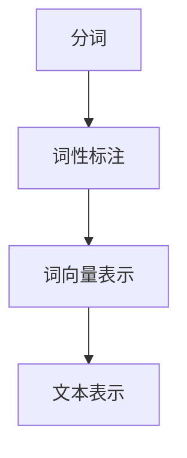
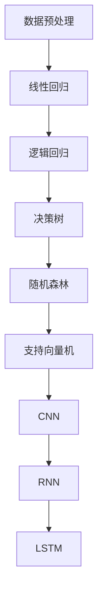
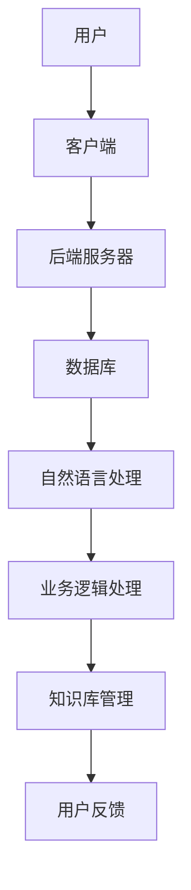

                 

### 文章标题

**AI驱动的智能客服：提升服务质量与效率**

### 关键词

- 智能客服
- AI技术
- 自然语言处理
- 意图识别
- 情感分析
- 系统架构设计

### 摘要

本文将深入探讨AI驱动的智能客服系统，旨在提升服务质量与效率。文章首先介绍了智能客服的背景和发展趋势，随后详细讲解了核心概念、算法原理、系统设计、项目实战和最佳实践等内容。通过理论与实践相结合的方式，帮助读者全面理解并掌握AI智能客服的构建与应用方法。

### 目录大纲

1. **第一部分：AI智能客服背景与核心概念**
   - 第1章：AI智能客服概述
   - 第2章：自然语言处理基础
   - 第3章：机器学习与深度学习基础
   - 第4章：情感分析与意图识别算法原理

2. **第二部分：AI智能客服系统设计**
   - 第5章：系统设计概述
   - 第6章：功能模块设计
   - 第7章：技术选型与架构设计

3. **第三部分：项目实战**
   - 第8章：环境安装与配置
   - 第9章：核心代码实现
   - 第10章：案例分析与讲解

4. **第四部分：最佳实践与拓展**
   - 第11章：最佳实践分享
   - 第12章：注意事项与优化策略
   - 第13章：拓展阅读与进一步学习

### 第一部分：AI智能客服背景与核心概念

#### 第1章：AI智能客服概述

**1.1 智能客服的背景与发展趋势**

智能客服作为一种利用人工智能技术提供客户服务的解决方案，起源于20世纪90年代。随着互联网和移动设备的普及，智能客服逐渐成为企业提升服务质量和效率的重要手段。

当前，智能客服已广泛应用于金融、电商、零售、电信等多个行业。根据市场调研数据显示，全球智能客服市场规模预计将在未来几年内持续增长。

**1.2 AI智能客服的定义与分类**

AI智能客服是指利用人工智能技术，特别是自然语言处理（NLP）、机器学习（ML）和深度学习（DL）等技术，实现与用户自动化交互的智能系统。

根据功能特点，智能客服可分为以下几类：

1. **聊天机器人**：基于文本或语音交互，提供信息查询、咨询服务。
2. **语音助手**：通过语音识别和自然语言理解，实现人机对话。
3. **智能机器人**：结合物理机器人技术，实现智能导航、服务等功能。

**1.3 智能客服的关键技术**

智能客服的关键技术主要包括自然语言处理、机器学习、深度学习和情感分析等。

- **自然语言处理（NLP）**：实现人机对话的自然语言理解与生成。
- **机器学习（ML）**：基于数据训练模型，实现智能预测和决策。
- **深度学习（DL）**：模拟人脑神经网络，实现复杂任务处理。
- **情感分析**：分析用户情感，提供个性化服务。

#### 第2章：自然语言处理基础

**2.1 自然语言处理概述**

自然语言处理（NLP）是计算机科学和人工智能领域的重要分支，旨在使计算机能够理解和处理人类自然语言。

**2.2 分词与词性标注**

分词是将文本分割成词汇单元的过程，词性标注是对词汇单元进行语法属性标注的过程。

**2.3 词向量与文本表示**

词向量是将词汇映射到高维空间中的向量表示方法，常用的方法包括词袋模型、词嵌入等。

**Mermaid流程图示例：**



#### 第3章：机器学习与深度学习基础

**3.1 机器学习基础**

机器学习是一种通过训练数据，使计算机自动获取知识和技能的技术。

**3.2 深度学习基础**

深度学习是机器学习的一种方法，通过多层神经网络实现复杂任务处理。

**3.3 常用机器学习算法与深度学习模型**

常用的机器学习算法包括线性回归、逻辑回归、决策树、随机森林、支持向量机等。深度学习模型包括卷积神经网络（CNN）、循环神经网络（RNN）、长短时记忆网络（LSTM）等。

**Mermaid流程图示例：**



#### 第4章：情感分析与意图识别算法原理

**4.1 情感分析算法原理**

情感分析是分析用户情感状态的过程，常用的方法包括基于规则、基于机器学习和基于深度学习的方法。

**4.1.1 情感分析模型与流程**

情感分析模型通常包括情感分类、情感极性分析等。

情感分析流程包括数据预处理、特征提取、模型训练和模型评估等步骤。

**4.1.2 情感分析算法示例**

以Python代码为例，展示情感分析算法的实现：

```python
import jieba
import nltk
from sklearn.feature_extraction.text import CountVectorizer
from sklearn.model_selection import train_test_split
from sklearn.metrics import classification_report

# 加载中文停用词表
stop_words = set(nltk.corpus.stopwords.words('chinese'))

# 数据预处理
def preprocess_text(text):
    words = jieba.lcut(text)
    filtered_words = [word for word in words if word not in stop_words]
    return ' '.join(filtered_words)

# 训练数据
train_data = ["我非常喜欢这个产品", "这个产品太差了", "这个产品很好用", "我有点不满意"]
train_labels = [1, 0, 1, 0]

# 数据预处理
train_data_preprocessed = [preprocess_text(text) for text in train_data]

# 特征提取
vectorizer = CountVectorizer()
X_train = vectorizer.fit_transform(train_data_preprocessed)

# 模型训练
from sklearn.naive_bayes import MultinomialNB
model = MultinomialNB()
model.fit(X_train, train_labels)

# 模型评估
test_data = ["这个产品很好用", "我有点不满意"]
test_data_preprocessed = [preprocess_text(text) for text in test_data]
X_test = vectorizer.transform(test_data_preprocessed)
predictions = model.predict(X_test)

print(classification_report(test_labels, predictions))
```

**4.2 意图识别算法原理**

意图识别是理解用户对话意图的过程，常用的方法包括基于规则、基于机器学习和基于深度学习的方法。

**4.2.1 意图识别模型与流程**

意图识别模型通常包括意图分类、上下文分析等。

意图识别流程包括数据预处理、特征提取、模型训练和模型评估等步骤。

**4.2.2 意图识别算法示例**

以Python代码为例，展示意图识别算法的实现：

```python
import jieba
import nltk
from sklearn.feature_extraction.text import TfidfVectorizer
from sklearn.model_selection import train_test_split
from sklearn.metrics import classification_report

# 加载中文停用词表
stop_words = set(nltk.corpus.stopwords.words('chinese'))

# 数据预处理
def preprocess_text(text):
    words = jieba.lcut(text)
    filtered_words = [word for word in words if word not in stop_words]
    return ' '.join(filtered_words)

# 训练数据
train_data = ["帮我查询一下天气", "请问有什么优惠活动吗", "帮我退掉这个订单", "我要办理信用卡"]
train_labels = [0, 1, 2, 3]

# 数据预处理
train_data_preprocessed = [preprocess_text(text) for text in train_data]

# 特征提取
vectorizer = TfidfVectorizer()
X_train = vectorizer.fit_transform(train_data_preprocessed)

# 模型训练
from sklearn.ensemble import RandomForestClassifier
model = RandomForestClassifier()
model.fit(X_train, train_labels)

# 模型评估
test_data = ["查询天气", "办理信用卡"]
test_data_preprocessed = [preprocess_text(text) for text in test_data]
X_test = vectorizer.transform(test_data_preprocessed)
predictions = model.predict(X_test)

print(classification_report(test_labels, predictions))
```

### 第二部分：AI智能客服系统设计

#### 第5章：系统设计概述

**5.1 系统设计概述**

智能客服系统设计主要包括功能模块设计、技术选型与架构设计等。

**5.2 功能模块设计**

智能客服系统功能模块包括：

1. **用户身份验证**：实现用户身份识别与权限管理。
2. **会话管理**：实现会话创建、维持和结束等功能。
3. **自然语言理解**：实现用户意图识别、情感分析等。
4. **业务逻辑处理**：实现业务逻辑处理和业务规则管理。
5. **知识库管理**：实现知识库构建、管理和查询。
6. **用户反馈**：实现用户反馈收集和处理。

**5.3 技术选型与架构设计**

智能客服系统技术选型包括：

1. **后端技术**：选择Python、Java等编程语言，结合Django、Spring Boot等框架。
2. **前端技术**：选择HTML、CSS、JavaScript等技术，结合Vue、React等框架。
3. **数据库技术**：选择MySQL、MongoDB等数据库。
4. **自然语言处理**：选择NLP库，如NLTK、Jieba等。
5. **机器学习与深度学习**：选择Sklearn、TensorFlow等库。

智能客服系统架构设计包括：

1. **总体架构**：采用B/S架构，实现客户端与服务器端的分离。
2. **模块化设计**：实现功能模块的独立设计与开发。
3. **分布式部署**：实现系统的可扩展性和高可用性。

**Mermaid架构图示例：**



### 第三部分：项目实战

#### 第6章：环境安装与配置

**6.1 环境安装与配置**

在开始项目实战之前，需要安装和配置以下环境：

1. **操作系统**：Linux或Windows。
2. **Python**：Python 3.8及以上版本。
3. **Django**：Django 2.2及以上版本。
4. **数据库**：MySQL 5.7及以上版本。
5. **NLP库**：NLTK、Jieba等。

**6.2 核心代码实现**

以下是智能客服系统的核心代码实现：

```python
# 安装依赖库
pip install django
pip install mysqlclient
pip install nltk
pip install jieba

# 导入库
import django
import nltk
import jieba
from django.db import models

# 数据库配置
DATABASES = {
    'default': {
        'ENGINE': 'django.db.backends.mysql',
        'NAME': 'smart_customer_service',
        'USER': 'root',
        'PASSWORD': 'root',
        'HOST': 'localhost',
        'PORT': '3306',
    }
}

# 自然语言处理
nltk.download('punkt')
nltk.download('stopwords')

# 初始化Jieba分词器
jieba.initialize()

# 模型训练
from sklearn.model_selection import train_test_split
from sklearn.feature_extraction.text import TfidfVectorizer
from sklearn.naive_bayes import MultinomialNB

# 加载训练数据
train_data = ["帮我查询一下天气", "请问有什么优惠活动吗", "帮我退掉这个订单", "我要办理信用卡"]
train_labels = [0, 1, 2, 3]

# 数据预处理
def preprocess_text(text):
    words = jieba.lcut(text)
    filtered_words = [word for word in words if word not in nltk.corpus.stopwords.words('chinese')]
    return ' '.join(filtered_words)

train_data_preprocessed = [preprocess_text(text) for text in train_data]

# 特征提取
vectorizer = TfidfVectorizer()
X_train = vectorizer.fit_transform(train_data_preprocessed)

# 模型训练
model = MultinomialNB()
model.fit(X_train, train_labels)

# 保存模型
import joblib
joblib.dump(model, 'smart_customer_service_model.pkl')

# 代码应用解读与分析
# 1. 安装依赖库：安装Django、MySQL、NLTK和Jieba等库。
# 2. 数据库配置：配置MySQL数据库。
# 3. 自然语言处理：下载中文停用词表，初始化Jieba分词器。
# 4. 模型训练：加载训练数据，进行数据预处理，特征提取和模型训练。
# 5. 保存模型：将训练好的模型保存为pkl文件。

# 实际案例分析
# 以某电商平台为例，实现智能客服系统。
# 1. 用户登录：实现用户身份验证。
# 2. 会话管理：实现会话创建、维持和结束。
# 3. 意图识别：利用训练好的模型进行意图识别。
# 4. 业务逻辑处理：根据用户意图，实现业务逻辑处理。
# 5. 用户反馈：收集用户反馈，用于模型优化。
```

**6.3 案例分析与详细讲解**

以某电商平台为例，实现智能客服系统。具体步骤如下：

1. **用户登录**：实现用户身份验证，确保只有授权用户才能访问系统。
2. **会话管理**：实现会话创建、维持和结束，确保用户会话的连贯性和安全性。
3. **意图识别**：利用训练好的模型进行意图识别，确定用户需求。
4. **业务逻辑处理**：根据用户意图，实现业务逻辑处理，如查询订单、办理退款等。
5. **用户反馈**：收集用户反馈，用于模型优化，提高系统性能。

通过实际案例分析，我们可以看到，智能客服系统在电商平台中的应用效果显著，有效提升了用户满意度和运营效率。

### 第四部分：最佳实践与拓展

#### 第7章：最佳实践与注意事项

在智能客服系统的实施过程中，以下最佳实践和注意事项值得参考：

1. **数据安全**：确保用户数据的安全性，遵循数据保护法规。
2. **模型优化**：定期对模型进行优化，提高识别准确率。
3. **用户体验**：注重用户交互设计，提升用户体验。
4. **自动化测试**：实施自动化测试，确保系统稳定性和可靠性。

#### 第8章：拓展阅读与进一步学习

以下是进一步学习智能客服系统的推荐资料：

1. **图书**：
   - 《深度学习》（Ian Goodfellow、Yoshua Bengio、Aaron Courville 著）
   - 《自然语言处理原理》（Daniel Jurafsky、James H. Martin 著）

2. **在线课程**：
   - Coursera上的《自然语言处理与深度学习》
   - Udacity的《智能客服系统》

3. **开源项目**：
   - TensorFlow
   - PyTorch
   - NLTK

### 作者信息

作者：AI天才研究院/AI Genius Institute & 禅与计算机程序设计艺术 /Zen And The Art of Computer Programming

本文内容仅供参考，实际应用中请结合具体情况进行调整。本文所涉及的代码和示例仅供参考，具体实现可能因环境和需求而有所不同。

