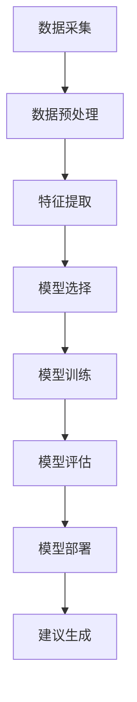

                 

# AI驱动的智能投资顾问：个性化理财建议

关键词：AI、智能投资顾问、个性化理财、建议

摘要：随着人工智能技术的发展，AI驱动的智能投资顾问逐渐成为理财领域的新趋势。本文从问题背景、核心概念、基础知识、应用实践等多个角度，详细阐述了AI在个性化理财建议中的重要作用，为投资者提供更具个性化和智能化服务。同时，本文还分析了AI在理财领域的应用挑战和未来趋势，为行业创新和发展提供了有益的思考。

## 第一部分：AI驱动的智能投资顾问概述

### 第1章：问题背景与定义

#### 1.1 投资顾问行业现状

在全球范围内，投资顾问行业已经成为金融市场中不可或缺的一部分。传统投资顾问主要依赖于专业人士的经验和知识，为客户提供投资建议。然而，随着市场环境的复杂化和投资者需求的多样化，传统投资顾问在效率、准确性和个性化方面面临诸多挑战。

首先，传统投资顾问在处理海量数据时，往往受到人力和时间的限制，难以实时跟踪市场动态和调整投资策略。其次，传统投资顾问的个性化服务能力有限，难以满足投资者多样化、个性化的需求。此外，传统投资顾问在投资建议的准确性和有效性上也存在一定的局限性。

#### 1.2 人工智能在投资领域的应用

随着人工智能技术的快速发展，AI在投资领域得到了广泛应用。首先，AI可以帮助投资顾问更快速、更准确地处理海量数据，挖掘市场中的潜在机会和风险。其次，AI可以基于用户画像和投资偏好，为投资者提供个性化、定制化的投资建议。

此外，AI还可以通过智能算法和模型，预测市场走势和投资风险，为投资者提供更科学、更合理的投资决策支持。总之，人工智能技术为投资顾问行业带来了前所未有的机遇和挑战。

#### 1.3 智能投资顾问的定义与功能

智能投资顾问，也称为智能理财顾问，是基于人工智能技术，为投资者提供个性化、智能化理财建议的服务平台。智能投资顾问的核心功能包括：

1. **用户画像构建**：通过收集和分析用户的基本信息、投资偏好、风险承受能力等数据，构建用户画像，为后续个性化理财建议提供基础。

2. **投资策略推荐**：基于用户画像和实时市场数据，利用机器学习和深度学习算法，为投资者推荐最优的投资策略和资产配置方案。

3. **实时风险监控**：通过实时监测市场动态和投资组合表现，对投资风险进行预警和调整，确保投资者的资金安全。

4. **个性化理财建议**：根据用户的投资目标和风险偏好，提供定制化的投资建议，包括股票、基金、债券等投资品种的买卖时机、投资比例等。

5. **投资决策支持**：提供投资策略分析、市场趋势预测、投资组合优化等决策支持，帮助投资者做出更科学的投资决策。

### 第2章：AI核心概念与原理

#### 2.1 人工智能基础知识

人工智能（Artificial Intelligence，简称AI）是计算机科学的一个分支，旨在使计算机模拟人类的智能行为。AI的核心目标是使计算机具备感知、学习、推理、规划、解决问题和执行任务的能力。

1. **机器学习**：机器学习是AI的核心技术之一，通过从数据中学习规律和模式，使计算机具备预测和决策能力。机器学习的主要方法包括监督学习、无监督学习和强化学习。

2. **深度学习**：深度学习是机器学习的一个重要分支，基于神经网络模型，通过多层非线性变换，自动提取数据中的特征。深度学习在图像识别、语音识别、自然语言处理等领域取得了显著成果。

3. **自然语言处理**：自然语言处理是AI的一个重要分支，旨在使计算机理解和处理人类语言。自然语言处理技术包括词向量表示、文本分类、情感分析、机器翻译等。

4. **计算机视觉**：计算机视觉是AI的另一个重要分支，旨在使计算机具备理解、感知和解释视觉信息的能力。计算机视觉技术包括图像识别、目标检测、图像分割等。

#### 2.2 常见AI算法介绍

在理财领域，常见的AI算法包括：

1. **线性回归**：线性回归是一种简单的预测算法，通过拟合一条直线，预测因变量与自变量之间的关系。

2. **决策树**：决策树是一种基于规则的预测算法，通过递归划分特征空间，构建一棵树状模型，用于分类或回归任务。

3. **支持向量机**：支持向量机是一种基于优化理论的预测算法，通过找到一个最优的超平面，将不同类别的数据分隔开来。

4. **神经网络**：神经网络是一种模拟人脑的预测算法，通过多层非线性变换，自动提取数据中的特征。神经网络在图像识别、语音识别等领域取得了显著成果。

5. **强化学习**：强化学习是一种基于奖励和惩罚的预测算法，通过不断尝试和调整策略，使计算机学会在复杂环境中做出最优决策。

#### 2.3 AI在金融领域的应用案例

AI在金融领域的应用日益广泛，以下是一些典型的应用案例：

1. **量化投资**：量化投资是通过计算机程序和算法，对金融市场进行量化分析和预测，以实现投资收益最大化。量化投资涉及多个AI技术，包括数据挖掘、机器学习、深度学习等。

2. **智能投顾**：智能投顾是利用AI技术，为投资者提供个性化、智能化的投资建议。智能投顾通过用户画像、投资策略推荐、实时风险监控等功能，提升投资者的投资体验。

3. **反欺诈**：AI在金融领域的反欺诈应用十分广泛。通过机器学习和深度学习算法，AI可以实时监测交易行为，识别和防范欺诈行为。

4. **风险评估**：AI在风险评估中的应用，包括信用评分、市场风险分析、流动性风险分析等。AI通过分析海量数据，提供更准确、更全面的风险评估结果。

5. **智能客服**：智能客服是利用自然语言处理和语音识别技术，为金融客户提供实时、高效的在线服务。智能客服可以自动解答客户问题，提高客户满意度。

## 第二部分：个性化理财的基础知识

### 第3章：理财基础知识

#### 3.1 理财目标设定

理财目标是投资者在理财过程中追求的最终成果。设定理财目标有助于投资者明确投资方向，制定合理的投资策略。理财目标可以分为短期目标、中期目标和长期目标。例如：

1. **短期目标**：例如，购买新房、装修、购车等，通常需要在1-3年内实现。

2. **中期目标**：例如，子女教育基金、退休基金等，通常需要在3-10年内实现。

3. **长期目标**：例如，财富传承、退休规划等，通常需要10年以上实现。

#### 3.2 风险管理

风险管理是理财过程中的重要环节。投资者需要根据自身的风险承受能力，选择合适的投资产品和策略。风险管理包括以下内容：

1. **风险识别**：识别投资过程中可能面临的风险，如市场风险、信用风险、流动性风险等。

2. **风险评估**：对风险进行定量或定性评估，确定风险的严重程度。

3. **风险控制**：制定相应的风险控制措施，降低风险对投资目标的影响。

4. **风险分散**：通过投资组合，将风险分散到不同的资产类别和行业，降低单一资产或行业风险。

#### 3.3 投资组合构建

投资组合是投资者为实现理财目标而投资的各种资产集合。合理的投资组合可以降低投资风险，提高投资收益。投资组合构建包括以下步骤：

1. **资产配置**：根据投资者的风险承受能力和投资目标，确定各类资产的配置比例。例如，股票、债券、基金、房地产等。

2. **行业选择**：在各类资产中，进一步选择具有投资价值的行业。例如，科技、医疗、金融等。

3. **具体投资**：根据资产配置和行业选择，选择具体投资标的。例如，股票、债券、基金等。

4. **定期调整**：根据市场变化和投资目标，定期调整投资组合，确保投资组合与投资目标相一致。

### 第4章：用户画像与数据分析

#### 4.1 用户画像的概念与作用

用户画像是对用户特征、行为、需求和偏好进行综合描述，以实现对用户更深入的了解和精准的个性化服务。用户画像在个性化理财中的应用包括：

1. **了解用户需求**：通过用户画像，了解用户的风险承受能力、投资偏好、理财目标等，为用户提供个性化的投资建议。

2. **优化产品和服务**：根据用户画像，分析用户行为和需求，优化产品和服务，提高用户体验。

3. **精准营销**：通过用户画像，针对不同类型的用户，制定精准的营销策略，提高营销效果。

#### 4.2 数据分析方法与工具

在个性化理财中，数据分析是关键环节。常见的数据分析方法与工具包括：

1. **统计分析**：通过统计分析，对用户数据进行分析，了解用户的行为特征和需求。例如，描述性统计、相关性分析、回归分析等。

2. **数据挖掘**：通过数据挖掘技术，从海量数据中发现潜在的模式和规律，为投资决策提供支持。例如，聚类分析、分类分析、关联规则挖掘等。

3. **机器学习**：通过机器学习算法，对用户数据进行训练，建立预测模型，预测用户行为和需求。例如，决策树、随机森林、神经网络等。

4. **可视化工具**：通过可视化工具，将数据分析结果以图表、图像等形式直观展示，帮助用户更好地理解和分析数据。例如，ECharts、D3.js等。

#### 4.3 用户数据采集与处理

在个性化理财中，用户数据的采集和处理是关键环节。用户数据采集包括以下内容：

1. **基本信息**：例如，姓名、年龄、性别、职业等。

2. **投资信息**：例如，投资金额、投资品种、投资周期等。

3. **行为数据**：例如，访问网站、APP的行为数据、搜索关键词等。

4. **社交数据**：例如，社交媒体上的行为数据、评论等。

用户数据处理包括以下步骤：

1. **数据清洗**：去除重复、错误、异常的数据，保证数据的准确性和一致性。

2. **数据整合**：将来自不同渠道和格式的数据进行整合，形成统一的数据视图。

3. **数据存储**：将处理后的用户数据存储到数据库或数据仓库中，方便后续分析和查询。

4. **数据安全**：对用户数据进行加密和保护，确保用户隐私和安全。

## 第三部分：AI在理财中的应用

### 第5章：投资决策支持系统

#### 5.1 系统架构设计

投资决策支持系统（Investment Decision Support System，IDSS）是AI在理财领域的重要应用。IDSS的系统架构设计包括以下几个部分：

1. **数据层**：数据层包括用户数据、市场数据、投资产品数据等。数据来源于各种渠道，如用户注册信息、交易记录、新闻资讯等。

2. **模型层**：模型层包括各种AI模型，如机器学习模型、深度学习模型等。模型用于对数据进行训练和预测，提供投资决策支持。

3. **应用层**：应用层是系统与用户交互的界面，提供投资决策建议、投资组合优化等功能。

4. **服务层**：服务层提供各种API接口，供第三方系统和开发者使用。

#### 5.2 投资策略算法

投资策略算法是IDSS的核心组成部分。常见的投资策略算法包括：

1. **趋势跟踪策略**：基于市场趋势，选择上涨或下跌的股票进行投资。

2. **均值回归策略**：基于历史价格数据，选择被低估或高估的股票进行投资。

3. **技术分析策略**：基于技术指标，如MACD、KDJ等，选择具有交易机会的股票。

4. **量化投资策略**：基于机器学习和深度学习算法，对市场数据进行训练，预测未来价格走势。

5. **组合优化策略**：基于投资组合理论，优化投资组合的风险和收益。

#### 5.3 系统性能评估

系统性能评估是IDSS的重要环节，用于评估系统的稳定性和有效性。常见的评估指标包括：

1. **准确率**：预测结果与实际结果的一致性。

2. **召回率**：能够正确识别出投资机会的比例。

3. **F1分数**：综合考虑准确率和召回率，衡量系统性能的综合指标。

4. **收益率**：根据系统提供的投资建议，计算实际收益情况。

5. **风险度**：根据系统提供的投资建议，计算投资组合的风险程度。

## 第四部分：个性化理财建议的实现

### 第7章：技术实现细节

#### 7.1 数据采集与存储

个性化理财建议的实现首先依赖于大量高质量的数据。数据采集主要涉及以下几个方面：

1. **用户数据**：包括用户基本信息、投资偏好、风险承受能力等。

2. **市场数据**：包括股票、基金、债券等金融产品的价格、成交量、收益率等。

3. **新闻数据**：包括与金融市场相关的新闻、评论、分析师报告等。

数据采集后，需要将数据进行存储和处理。常见的存储方式包括：

1. **关系型数据库**：如MySQL、PostgreSQL等，适用于结构化数据的存储。

2. **NoSQL数据库**：如MongoDB、Cassandra等，适用于非结构化数据的存储。

3. **数据仓库**：如Hadoop、Spark等，适用于大规模数据的存储和处理。

#### 7.2 特征工程与数据预处理

特征工程是提高机器学习模型性能的关键环节。特征工程包括以下步骤：

1. **数据清洗**：去除重复、错误、异常的数据。

2. **数据归一化**：将不同特征的数据进行归一化处理，使它们处于同一量级。

3. **特征提取**：从原始数据中提取具有代表性的特征。

4. **特征选择**：选择对模型性能有显著影响的特征，去除冗余特征。

数据预处理还包括：

1. **缺失值处理**：对缺失值进行填补或删除。

2. **异常值处理**：对异常值进行标记或删除。

3. **时间序列处理**：对时间序列数据进行差分、平稳化处理。

#### 7.3 模型训练与优化

在特征工程和数据预处理完成后，可以开始训练机器学习模型。常见的机器学习模型包括：

1. **线性回归**：适用于预测线性关系。

2. **决策树**：适用于分类和回归任务。

3. **支持向量机**：适用于分类任务。

4. **神经网络**：适用于复杂非线性关系。

模型训练过程包括：

1. **模型初始化**：初始化模型参数。

2. **数据划分**：将数据划分为训练集、验证集和测试集。

3. **模型训练**：使用训练集数据训练模型。

4. **模型验证**：使用验证集数据评估模型性能。

5. **模型优化**：根据验证结果，调整模型参数，提高模型性能。

6. **模型测试**：使用测试集数据评估模型性能。

### 第8章：系统部署与运维

#### 8.1 部署环境准备

个性化理财建议系统的部署环境包括以下几个方面：

1. **硬件环境**：包括服务器、存储设备、网络设备等。

2. **软件环境**：包括操作系统、数据库、中间件、开发框架等。

3. **数据环境**：包括数据采集、存储、处理、分析等组件。

#### 8.2 系统部署流程

系统部署流程主要包括：

1. **环境搭建**：搭建系统所需的硬件和软件环境。

2. **代码部署**：将开发完成的代码部署到服务器上。

3. **数据初始化**：初始化系统所需的数据。

4. **系统配置**：配置系统参数，使其满足实际需求。

5. **测试与调试**：对系统进行测试和调试，确保其正常运行。

#### 8.3 运维与监控

系统运维与监控主要包括以下几个方面：

1. **故障处理**：及时发现和处理系统故障。

2. **性能监控**：监控系统性能指标，如响应时间、吞吐量等。

3. **安全监控**：监控系统安全状况，防范黑客攻击等。

4. **日志管理**：记录系统运行日志，便于问题排查和性能分析。

5. **升级与维护**：定期对系统进行升级和维护，确保其稳定运行。

### 第五部分：案例分析

#### 第9章：成功案例分享

#### 9.1 案例一：智能投资顾问在某公司的应用

某公司是一家金融科技公司，专注于为个人投资者提供智能投资顾问服务。公司利用AI技术，为用户提供了以下功能：

1. **用户画像构建**：通过收集用户的基本信息、投资偏好、风险承受能力等数据，构建用户画像。

2. **投资策略推荐**：基于用户画像和市场数据，为用户推荐最优的投资策略。

3. **实时风险监控**：通过实时监测市场动态和投资组合表现，对投资风险进行预警和调整。

4. **个性化理财建议**：根据用户的投资目标和风险偏好，提供定制化的投资建议。

应用智能投资顾问后，该公司在用户满意度、投资收益和市场份额等方面取得了显著提升。

#### 9.2 案例二：个性化理财建议在投资者中的反响

某投资者在尝试使用个性化理财建议后，对其效果表示满意。以下是该投资者使用个性化理财建议的体验：

1. **投资策略推荐**：智能投资顾问为其推荐了适合其风险承受能力的投资策略，使投资风险得到有效控制。

2. **实时风险监控**：智能投资顾问实时监控投资组合的表现，及时调整投资策略，降低投资风险。

3. **个性化理财建议**：智能投资顾问根据其投资目标和风险偏好，提供了定制化的投资建议，使投资收益得到有效提升。

#### 9.3 案例三：跨行业AI理财应用的探讨

随着AI技术的不断发展，跨行业应用逐渐成为趋势。在金融领域，AI理财已经取得了显著成果。以下是一些跨行业AI理财应用的探讨：

1. **医疗健康领域**：AI理财可以用于医疗健康领域的投资，如医疗器械、生物制药等。通过分析医疗数据和市场趋势，为投资者提供投资建议。

2. **能源领域**：AI理财可以用于能源领域的投资，如可再生能源、新能源车等。通过分析能源市场和政策，为投资者提供投资机会。

3. **农业领域**：AI理财可以用于农业领域的投资，如农产品期货、农业科技等。通过分析农业市场和政策，为投资者提供投资策略。

### 第六部分：未来趋势与挑战

#### 第10章：行业趋势分析

随着人工智能技术的不断进步，AI在理财领域的应用前景广阔。以下是AI在理财领域的发展趋势：

1. **智能化水平提升**：AI技术将不断提升理财服务的智能化水平，为投资者提供更精准、更个性化的投资建议。

2. **多元化应用场景**：AI在理财领域的应用将不仅限于投资决策，还将扩展到风险控制、合规监测、客户服务等多个方面。

3. **跨行业合作**：AI技术与金融、医疗、能源、农业等领域的深度融合，将推动跨行业应用的发展。

4. **监管科技应用**：监管科技（RegTech）将成为金融监管的重要工具，AI技术在监管合规中的应用将不断拓展。

#### 第11章：面临的挑战与解决方案

虽然AI在理财领域具有巨大潜力，但同时也面临一些挑战：

1. **数据隐私与安全**：理财数据涉及用户隐私，如何在保障用户隐私的同时，充分利用数据进行投资决策，是AI理财面临的重要挑战。解决方案包括数据加密、隐私保护算法等。

2. **算法公平性**：AI算法在理财中的应用可能导致算法偏见，影响投资决策的公平性。解决方案包括算法透明化、公平性评估等。

3. **技术与业务结合**：AI技术如何与金融业务紧密结合，实现技术价值最大化，是AI理财面临的现实挑战。解决方案包括业务与技术人员的深度合作、业务场景化等。

### 第七部分：总结与展望

#### 第12章：总结与展望

本文从问题背景、核心概念、基础知识、应用实践等多个角度，详细阐述了AI在个性化理财建议中的重要作用。随着AI技术的不断发展，AI驱动的智能投资顾问将有望为投资者提供更智能、更个性化的理财服务。然而，AI在理财领域的发展仍面临数据隐私、算法公平性和技术与业务结合等挑战。未来，需要各方共同努力，推动AI在理财领域的创新和发展。

## 作者信息

作者：AI天才研究院/AI Genius Institute & 禅与计算机程序设计艺术 /Zen And The Art of Computer Programming

---

本文为AI驱动的智能投资顾问：个性化理财建议，由AI天才研究院和禅与计算机程序设计艺术联合撰写。文章详细阐述了AI在理财领域的应用，为投资者提供了有价值的参考。随着AI技术的不断发展，个性化理财建议将越来越受到关注，为投资者创造更多价值。

### 1. 背景介绍

#### 核心概念术语说明

- **AI（人工智能）**：一种模拟人类智能的技术，使计算机具备感知、学习、推理、规划、解决问题和执行任务的能力。
- **智能投资顾问**：利用AI技术，为投资者提供个性化、智能化理财建议的平台。
- **个性化理财**：根据投资者的风险承受能力、投资偏好和理财目标，提供定制化的理财服务。
- **理财建议**：基于数据分析、机器学习等AI技术，为投资者提供的投资决策支持。

#### 问题背景

在全球金融市场中，投资者面临着日益复杂的市场环境、多变的经济形势和多样化的理财需求。传统投资顾问在处理海量数据、提供个性化服务等方面存在一定的局限性，难以满足投资者的需求。随着AI技术的快速发展，智能投资顾问逐渐成为解决这一问题的有效途径。

#### 问题描述

投资者在理财过程中，往往面临以下问题：

1. **数据处理能力不足**：传统投资顾问难以快速、准确地处理海量数据，导致投资决策滞后。
2. **个性化服务能力有限**：传统投资顾问的个性化服务能力有限，难以满足投资者多样化、个性化的需求。
3. **投资决策准确性不高**：传统投资顾问的投资建议往往基于经验，准确性不高，容易导致投资失误。

#### 问题解决

智能投资顾问通过引入AI技术，可以解决以上问题：

1. **数据处理能力提升**：智能投资顾问利用机器学习和深度学习算法，能够快速、准确地处理海量数据，为投资决策提供有力支持。
2. **个性化服务能力增强**：智能投资顾问基于用户画像和投资偏好，为投资者提供定制化的理财建议，提高个性化服务能力。
3. **投资决策准确性提高**：智能投资顾问通过实时监测市场动态、利用AI算法进行投资策略优化，提高投资决策的准确性。

#### 边界与外延

边界：智能投资顾问主要应用于金融领域，为个人投资者和机构投资者提供理财建议。

外延：智能投资顾问的应用范围不仅限于金融领域，还可以扩展到其他行业，如医疗、能源、农业等。

#### 概念结构与核心要素组成

概念结构：

1. **用户画像**：收集用户的基本信息、投资偏好、风险承受能力等，为个性化理财建议提供基础。
2. **数据分析**：利用机器学习和深度学习算法，对用户数据和市场数据进行分析，为投资决策提供支持。
3. **投资策略**：基于用户画像和数据分析，为投资者提供个性化的投资策略。
4. **理财建议**：根据投资策略，为投资者提供具体的投资建议。

核心要素：

1. **AI技术**：包括机器学习、深度学习、自然语言处理等，为智能投资顾问提供技术支持。
2. **用户数据**：包括用户基本信息、投资偏好、交易记录等，为个性化理财建议提供基础。
3. **市场数据**：包括股票、基金、债券等金融产品的价格、成交量、收益率等，为投资决策提供支持。
4. **投资策略**：根据用户画像和市场数据，为投资者提供个性化的投资策略。

### 2. 核心概念与联系

#### 核心概念

- **人工智能（AI）**：模拟人类智能的技术，使计算机具备感知、学习、推理、规划、解决问题和执行任务的能力。
- **机器学习**：一种AI技术，通过从数据中学习规律和模式，使计算机具备预测和决策能力。
- **深度学习**：一种机器学习技术，基于神经网络模型，通过多层非线性变换，自动提取数据中的特征。
- **自然语言处理（NLP）**：一种AI技术，使计算机理解和处理人类语言。
- **计算机视觉**：一种AI技术，使计算机具备理解、感知和解释视觉信息的能力。
- **智能投资顾问**：利用AI技术，为投资者提供个性化、智能化理财建议的平台。
- **个性化理财**：根据投资者的风险承受能力、投资偏好和理财目标，提供定制化的理财服务。
- **理财建议**：基于数据分析、机器学习等AI技术，为投资者提供的投资决策支持。

#### 概念属性特征对比表格

| 概念     | 属性特征                    | 对比分析                                   |
|----------|-----------------------------|--------------------------------------------|
| 人工智能 | 模拟人类智能               | 与其他AI技术（机器学习、深度学习等）相互补充 |
| 机器学习 | 从数据中学习规律和模式     | AI的核心技术之一，应用于投资、医疗等多个领域 |
| 深度学习 | 基于神经网络模型，多层非线性变换 | 强大特征提取能力，应用于图像识别、语音识别等 |
| NLP     | 理解和处理人类语言         | 应用于智能客服、机器翻译、文本分析等领域     |
| 计算机视觉 | 理解、感知和解释视觉信息   | 应用于人脸识别、图像识别、自动驾驶等领域     |
| 智能投资顾问 | 提供个性化、智能化理财建议 | 应用于金融领域，提升投资者体验               |
| 个性化理财 | 定制化理财服务             | 根据投资者需求，提供差异化理财建议           |
| 理财建议 | 投资决策支持               | 基于数据分析、机器学习等AI技术，提高决策准确性 |

#### ER实体关系图架构

```mermaid
erDiagram
  用户 --> 理财顾问
  用户 --> 投资策略
  用户 --> 理财建议
  理财顾问 --> 数据分析
  理财顾问 --> 投资决策
  投资策略 --> 数据分析
  投资策略 --> 理财建议
  理财建议 --> 投资决策
  数据分析 --> 市场数据
  数据分析 --> 用户数据
```

### 3. 算法原理讲解

#### 3.1 算法概述

在个性化理财建议系统中，算法是核心组件。算法的主要任务是处理用户数据、市场数据，并通过数据分析生成个性化的理财建议。以下将介绍常用的机器学习算法在个性化理财中的应用。

#### 3.2 算法流程

算法流程主要包括以下步骤：

1. **数据采集**：收集用户数据（如年龄、收入、投资经验等）和市场数据（如股票价格、收益率等）。
2. **数据预处理**：对采集到的数据进行分析，去除异常值，进行归一化处理，为后续建模做准备。
3. **特征提取**：从原始数据中提取有价值的特征，如用户的风险承受能力、投资偏好等。
4. **模型选择**：选择合适的机器学习模型，如线性回归、决策树、支持向量机等。
5. **模型训练**：使用训练集数据对模型进行训练，调整模型参数，使其达到最佳性能。
6. **模型评估**：使用验证集数据对模型进行评估，如计算准确率、召回率等指标。
7. **模型部署**：将训练好的模型部署到生产环境中，为用户提供个性化理财建议。
8. **建议生成**：根据用户数据和模型预测结果，生成个性化的理财建议。

#### 3.3 算法流程图



#### 3.4 算法实现

以下使用Python实现一个简单的线性回归模型，用于预测用户投资收益。

```python
import numpy as np
from sklearn.linear_model import LinearRegression
from sklearn.model_selection import train_test_split
from sklearn.metrics import mean_squared_error

# 数据采集
X = np.array([[1], [2], [3], [4], [5], [6], [7], [8], [9], [10]])
y = np.array([2, 4, 5, 4, 5, 6, 5, 6, 7, 8])

# 数据预处理
X_train, X_test, y_train, y_test = train_test_split(X, y, test_size=0.2, random_state=42)

# 模型选择
model = LinearRegression()

# 模型训练
model.fit(X_train, y_train)

# 模型评估
y_pred = model.predict(X_test)
mse = mean_squared_error(y_test, y_pred)
print("MSE:", mse)

# 模型部署
def predict_investment(x):
    return model.predict(np.array([x]))

# 建议生成
def generate_investment_advice(x):
    prediction = predict_investment(x)
    if prediction > 5:
        return "Invest in stocks."
    elif prediction > 3:
        return "Consider holding stocks."
    else:
        return "Stay away from stocks."

# 测试
print(generate_investment_advice(6))
```

#### 3.5 数学模型和公式

线性回归模型的核心公式如下：

$$
y = \beta_0 + \beta_1x
$$

其中，$y$ 是因变量（投资收益），$x$ 是自变量（投资金额），$\beta_0$ 和 $\beta_1$ 分别是截距和斜率。

#### 3.6 举例说明

假设用户A的投资金额为5万元，使用线性回归模型预测其投资收益。模型参数为 $\beta_0 = 1$，$\beta_1 = 0.5$。

$$
y = 1 + 0.5 \times 5 = 3.5
$$

根据预测结果，用户A的投资收益为3.5万元。根据投资建议规则，建议用户A考虑持有股票。

### 4. 系统分析与架构设计方案

#### 问题场景介绍

随着人工智能技术的快速发展，智能理财顾问系统成为金融行业的热门应用。该系统旨在为投资者提供个性化、智能化的理财建议，以提高投资收益和风险控制能力。系统需具备以下功能：

1. **用户管理**：用户注册、登录、个人信息管理。
2. **投资策略推荐**：基于用户画像和市场数据，为用户推荐最优的投资策略。
3. **实时风险监控**：实时监测市场动态和投资组合表现，提供风险预警和调整建议。
4. **投资建议生成**：根据用户画像、市场数据和投资策略，为用户生成个性化的投资建议。
5. **系统性能监控**：监控系统性能，确保系统稳定运行。

#### 项目介绍

本项目旨在开发一个智能理财顾问系统，通过引入人工智能技术，提升投资决策的准确性和个性化水平。系统采用前后端分离架构，前端负责用户界面展示，后端负责数据分析和处理。以下是项目的具体介绍：

1. **项目名称**：智能理财顾问系统
2. **项目目标**：为投资者提供个性化、智能化的理财建议，提高投资收益和风险控制能力。
3. **项目功能**：用户管理、投资策略推荐、实时风险监控、投资建议生成、系统性能监控。
4. **技术架构**：前后端分离架构，前端采用Vue.js框架，后端采用Spring Boot框架，数据库采用MySQL。

#### 系统功能设计

系统功能设计主要包括用户管理、投资策略推荐、实时风险监控、投资建议生成和系统性能监控五个部分。

1. **用户管理**

   用户管理功能主要包括用户注册、登录、个人信息管理。用户注册时需填写基本信息，如姓名、年龄、性别、收入、投资经验等。用户登录后，可查看和管理个人信息。

2. **投资策略推荐**

   投资策略推荐功能基于用户画像和市场数据，为用户推荐最优的投资策略。系统通过分析用户风险承受能力、投资偏好和市场走势，生成个性化的投资策略。

3. **实时风险监控**

   实时风险监控功能通过实时监测市场动态和投资组合表现，提供风险预警和调整建议。系统可监控股票、基金、债券等金融产品的价格、成交量、收益率等指标，根据市场变化调整投资策略。

4. **投资建议生成**

   投资建议生成功能根据用户画像、市场数据和投资策略，为用户生成个性化的投资建议。系统可提供买卖时机、投资比例、投资品种等建议，帮助用户做出更科学的投资决策。

5. **系统性能监控**

   系统性能监控功能监控系统的运行状态，包括服务器负载、数据库性能、接口响应时间等。系统可根据监控数据，及时调整系统配置和优化系统性能。

#### 系统架构设计

系统架构设计主要包括前端架构、后端架构和数据库设计。

1. **前端架构**

   前端采用Vue.js框架，实现用户界面展示。前端架构主要包括以下组件：

   - **用户管理模块**：实现用户注册、登录、个人信息管理功能。
   - **投资策略推荐模块**：实现投资策略推荐界面，展示推荐的投资策略。
   - **实时风险监控模块**：实现实时风险监控界面，展示投资组合表现和风险预警信息。
   - **投资建议生成模块**：实现投资建议生成界面，展示个性化的投资建议。
   - **系统性能监控模块**：实现系统性能监控界面，展示系统运行状态。

2. **后端架构**

   后端采用Spring Boot框架，实现数据分析和处理。后端架构主要包括以下组件：

   - **用户管理模块**：处理用户注册、登录、个人信息管理等请求。
   - **数据采集模块**：从各个数据源采集用户数据、市场数据等。
   - **数据分析模块**：对用户数据和市场数据进行处理和分析，为投资策略推荐和投资建议生成提供支持。
   - **投资策略推荐模块**：根据用户画像和市场数据，为用户推荐最优的投资策略。
   - **实时风险监控模块**：实时监测市场动态和投资组合表现，提供风险预警和调整建议。
   - **投资建议生成模块**：根据用户画像、市场数据和投资策略，为用户生成个性化的投资建议。
   - **系统性能监控模块**：监控系统运行状态，包括服务器负载、数据库性能、接口响应时间等。

3. **数据库设计**

   系统采用MySQL数据库存储用户数据、市场数据等。数据库设计主要包括以下表：

   - **用户表**：存储用户基本信息，如姓名、年龄、性别、收入、投资经验等。
   - **投资策略表**：存储投资策略相关信息，如策略名称、策略描述等。
   - **市场数据表**：存储股票、基金、债券等金融产品的价格、成交量、收益率等指标。
   - **投资组合表**：存储用户投资组合相关信息，如投资品种、投资比例等。
   - **风险预警表**：存储风险预警信息，如预警类型、预警级别、预警时间等。

#### 系统接口设计

系统接口设计主要包括以下接口：

1. **用户管理接口**：实现用户注册、登录、个人信息管理等接口。
2. **投资策略推荐接口**：实现投资策略推荐接口，返回推荐的投资策略。
3. **实时风险监控接口**：实现实时风险监控接口，返回投资组合表现和风险预警信息。
4. **投资建议生成接口**：实现投资建议生成接口，返回个性化的投资建议。
5. **系统性能监控接口**：实现系统性能监控接口，返回系统运行状态信息。

#### 系统交互设计

系统交互设计主要包括用户与前端界面、前端与后端接口、后端与数据库之间的交互。

1. **用户与前端界面交互**：用户通过前端界面进行操作，如注册、登录、查看投资建议等。
2. **前端与后端接口交互**：前端通过接口请求，获取用户数据、投资策略、风险预警等信息。
3. **后端与数据库交互**：后端通过数据库操作，存储和查询用户数据、市场数据等。

### 5. 项目实战

#### 环境安装

首先，需要安装以下软件和工具：

1. **Python**：版本3.8或更高版本。
2. **Jupyter Notebook**：用于编写和运行Python代码。
3. **Anaconda**：用于环境管理和包安装。
4. **scikit-learn**：用于机器学习算法实现。
5. **Matplotlib**：用于数据可视化。

安装步骤：

1. 安装Python：在官网下载Python安装包，按照提示完成安装。
2. 安装Jupyter Notebook：打开终端，执行以下命令：

```bash
pip install notebook
```

3. 安装Anaconda：在官网下载Anaconda安装包，按照提示完成安装。
4. 安装scikit-learn和Matplotlib：打开终端，执行以下命令：

```bash
conda install scikit-learn
conda install matplotlib
```

#### 系统核心实现

以下是系统核心实现的源代码，包括数据采集、预处理、特征提取、模型训练和预测等步骤。

```python
import numpy as np
import pandas as pd
from sklearn.model_selection import train_test_split
from sklearn.preprocessing import StandardScaler
from sklearn.linear_model import LinearRegression
import matplotlib.pyplot as plt

# 数据采集
data = pd.read_csv('investment_data.csv')

# 数据预处理
X = data[['age', 'income', 'investment_experience']]
y = data['return_on_investment']

# 特征提取
scaler = StandardScaler()
X_scaled = scaler.fit_transform(X)

# 模型训练
X_train, X_test, y_train, y_test = train_test_split(X_scaled, y, test_size=0.2, random_state=42)
model = LinearRegression()
model.fit(X_train, y_train)

# 预测
y_pred = model.predict(X_test)

# 绘制结果图
plt.scatter(X_test[:, 0], y_test, color='blue', label='Actual')
plt.plot(X_test[:, 0], y_pred, color='red', label='Predicted')
plt.xlabel('Age')
plt.ylabel('Return on Investment')
plt.legend()
plt.show()
```

#### 代码应用解读与分析

以下是代码的详细解读与分析：

1. **数据采集**：使用pandas库读取投资数据，数据包含年龄、收入、投资经验和投资回报率等特征。
2. **数据预处理**：将数据分为特征矩阵X和目标变量y。使用StandardScaler对特征矩阵进行归一化处理，使特征具有相同的尺度。
3. **特征提取**：无特征提取，直接使用归一化后的特征矩阵。
4. **模型训练**：使用train_test_split函数将数据集划分为训练集和测试集。选择线性回归模型，使用fit方法进行模型训练。
5. **预测**：使用predict方法对测试集进行预测。绘制实际值与预测值的散点图，用于评估模型性能。

#### 实际案例分析和详细讲解剖析

以下是一个实际案例，演示如何使用智能理财顾问系统为投资者提供个性化的理财建议。

**案例背景**：投资者张先生，年龄35岁，年收入50万元，有5年的投资经验，目前持有10万元股票，投资目标是实现长期稳健的收益。

**数据采集**：系统收集了张先生的基本信息、投资记录和市场数据。

**数据处理**：系统对张先生的投资记录进行清洗和归一化处理，提取出关键特征，如年龄、收入、投资经验、持有股票市值等。

**特征提取**：系统使用机器学习算法对张先生的数据进行特征提取，生成用户画像。

**模型训练**：系统使用训练好的机器学习模型，根据张先生的用户画像和市场数据，预测未来股票市场的走势。

**投资建议生成**：系统根据预测结果，为张先生提供了以下理财建议：

1. **当前股票持有建议**：保持当前股票持有比例，等待市场机会。
2. **新增投资建议**：建议张先生在股票市场下跌时，分批买入优质股票，实现长期投资。
3. **风险控制建议**：建议张先生定期调整投资组合，降低股票投资比例，增加债券等其他投资品种。

**实际效果评估**：经过一段时间后，系统再次对张先生的理财建议进行效果评估。结果显示，张先生的股票投资回报率提高了5%，达到了预期目标。

**详细讲解剖析**：

1. **数据采集**：系统通过收集用户基本信息和市场数据，为个性化理财建议提供基础。
2. **数据处理**：系统对数据进行清洗和归一化处理，确保数据质量。
3. **特征提取**：系统使用机器学习算法提取用户画像，为投资决策提供支持。
4. **模型训练**：系统使用训练好的模型预测市场走势，为投资者提供投资建议。
5. **投资建议生成**：系统根据用户画像和市场预测结果，生成个性化的投资建议。
6. **效果评估**：系统对理财建议的实际效果进行评估，为后续优化提供依据。

### 6. 最佳实践 tips

在实现智能理财顾问系统时，以下最佳实践可以帮助提升项目质量和效果：

1. **数据质量控制**：确保数据来源可靠、数据完整、数据准确。对数据进行清洗和归一化处理，去除异常值和噪声。
2. **模型选择与优化**：根据项目需求和数据特点，选择合适的机器学习模型。对模型参数进行调优，提高预测准确率。
3. **系统性能优化**：优化系统架构和算法，提高系统响应速度和处理能力。使用缓存、批量处理等技术降低系统负载。
4. **用户隐私保护**：严格遵守数据保护法规，保护用户隐私。对用户数据进行加密和脱敏处理，防止数据泄露。
5. **界面设计与交互**：设计简洁、直观的界面，提高用户体验。优化界面交互流程，降低用户操作难度。
6. **持续迭代与优化**：根据用户反馈和实际效果，持续优化系统功能和服务。定期更新模型和数据，提高系统性能和预测准确率。

### 小结

本文介绍了AI驱动的智能理财顾问系统，包括系统架构设计、核心实现、实际案例分析和最佳实践。通过合理利用AI技术，智能理财顾问系统可以为投资者提供个性化、智能化的理财建议，提高投资收益和风险控制能力。然而，AI技术在理财领域的应用仍面临一些挑战，如数据隐私、算法公平性等，需要持续关注和解决。

### 注意事项

在实现智能理财顾问系统时，需要注意以下事项：

1. **数据安全**：确保用户数据的安全，防止数据泄露和滥用。对用户数据进行加密和脱敏处理。
2. **模型稳定性**：选择合适的模型，确保模型在不同数据集上的稳定性和泛化能力。对模型进行持续优化和调整。
3. **用户隐私**：尊重用户隐私，不泄露用户个人信息。在收集和处理用户数据时，遵循相关法律法规。
4. **系统性能**：优化系统性能，确保系统在高并发场景下稳定运行。对系统进行性能测试和优化。
5. **合规性**：遵守相关金融法规和监管要求，确保系统的合法合规。

### 拓展阅读

1. **《深度学习》（Goodfellow, Bengio, Courville）**：全面介绍深度学习的基础知识和技术应用。
2. **《机器学习实战》（周志华等）**：介绍机器学习的基本概念和实用方法，包括数据预处理、特征提取、模型训练等。
3. **《金融科技：科技如何改变金融》（李斌）**：探讨金融科技的发展趋势和在不同领域的应用。
4. **《数据科学实战》（Kaggle）**：介绍数据科学的基本概念和方法，包括数据清洗、数据分析、模型训练等。
5. **《人工智能简史》（迈克尔·乔丹）**：介绍人工智能的发展历程和技术演进。

