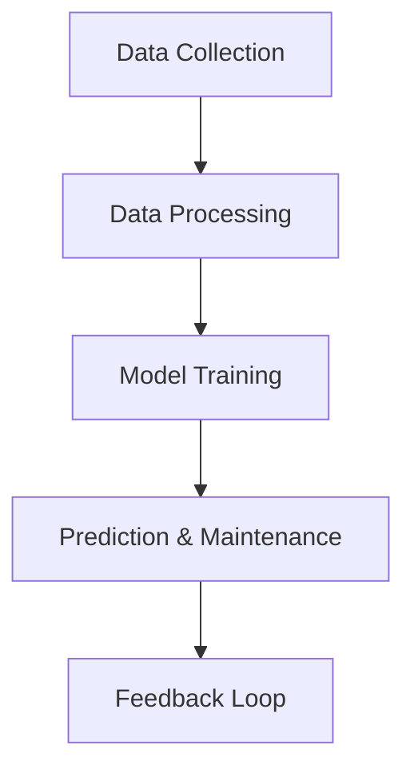
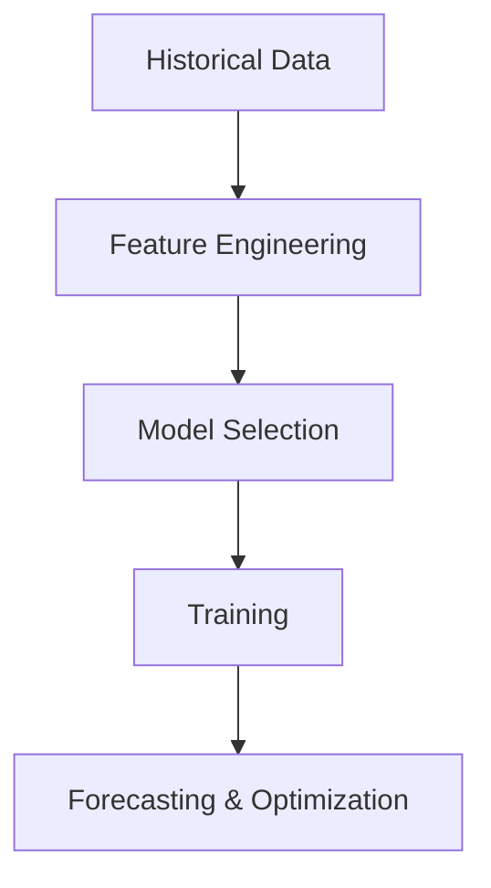

                 

# AI-driven Smart Grid Management: Balancing Supply and Demand

## Key Words: **AI, Smart Grid, Demand Forecasting, Renewable Energy Integration, Energy Efficiency**

## Abstract

The rapidly evolving landscape of energy production and consumption necessitates the integration of advanced technologies to ensure a sustainable and efficient energy supply. **AI-driven Smart Grid Management** stands out as a transformative approach to balance supply and demand, optimize energy distribution, and reduce waste. This article delves into the intricacies of AI in smart grid management, presenting a structured analysis that covers the fundamental concepts, current implementations, and future prospects. We will begin by defining AI and smart grids, then explore the role of AI in managing smart grids, followed by strategies for implementation and case studies. Finally, we will address future directions and challenges in this burgeoning field.

### Introduction to AI-driven Smart Grid Management

## 1.1 Problem Background

The conventional energy grid, while efficient in many aspects, faces significant challenges in the modern era. **Inefficiencies** in energy distribution lead to **waste** and **increased operational costs**. The **inevitable transition** towards **renewable energy sources** further complicates the management of energy supply and demand. Additionally, the growing demand for energy, driven by population growth and industrialization, adds to the complexity.

### 1.2 The Importance of Smart Grid Management

**Smart grids** represent the next generation of energy distribution networks, characterized by their ability to monitor and respond to real-time data, enhancing the efficiency and reliability of energy distribution. By integrating AI, smart grids can better predict energy demand, optimize energy distribution, and integrate renewable energy sources. This not only reduces waste but also makes the energy grid more resilient and sustainable.

### 1.3 The Role of AI in Smart Grid Management

AI plays a pivotal role in smart grid management by enabling **predictive maintenance**, **demand forecasting**, **load management**, and **integration of renewable energy sources**. Let's explore each of these aspects in detail.

### Core Concepts of AI and Smart Grids

## 2.1 Definition of AI

Artificial Intelligence (AI) refers to the simulation of human intelligence in machines that are programmed to think like humans and mimic their actions. AI systems can perform tasks that typically require human intelligence, such as visual perception, speech recognition, decision-making, and language translation.

## 2.2 Overview of Smart Grids

A **smart grid** is an advanced electrical grid that utilizes digital communication technology to detect and react to local changes in usage, increasing operational efficiency, and reliability. Smart grids integrate a range of devices, sensors, and software to create a network that can adapt to changes in supply and demand.

### AI in Smart Grid Management

## 3.1 Predictive Maintenance and Demand Forecasting

Predictive maintenance uses AI algorithms to analyze data from sensors and other monitoring devices to predict when equipment is likely to fail. This allows for proactive maintenance, reducing downtime and extending the lifespan of equipment. Demand forecasting, on the other hand, uses historical data and machine learning models to predict future energy demand, enabling grid operators to better manage supply and demand.

## 3.2 Load Management and Energy Efficiency

AI algorithms can optimize load management by balancing supply and demand in real-time. This can lead to significant energy savings and reduce the overall demand on the grid. Energy efficiency is further enhanced by AI systems that can optimize the use of renewable energy sources, such as solar and wind power.

## 3.3 Integration of Renewable Energy Sources

The integration of renewable energy sources into the grid can be complex due to their variable nature. AI systems can help manage this by predicting the availability of renewable energy and adjusting the grid accordingly.

### Implementation Strategies

## 4.1 Data Collection and Management

Effective data collection and management are essential for AI-driven smart grid management. This involves collecting data from a variety of sources, including sensors, weather stations, and energy meters, and then processing and analyzing this data to extract valuable insights.

## 4.2 Algorithm Selection and Optimization

The selection and optimization of algorithms are critical for the success of AI-driven smart grid management. This involves choosing the right algorithms for tasks such as demand forecasting and load management, and then continuously refining and optimizing these algorithms to improve performance.

## 4.3 Integration with Existing Grid Infrastructure

Integrating AI-driven systems with existing grid infrastructure can be challenging. This requires careful planning and coordination to ensure that the new systems can work seamlessly with the existing infrastructure.

### Case Studies

## 5.1 Case Study 1: Predictive Maintenance in a Utility Company

In this case study, we will explore how a utility company used AI to predict equipment failures, resulting in significant cost savings and improved reliability.

## 5.2 Case Study 2: Load Management in a City

In this case study, we will examine how a city implemented AI-driven load management to reduce energy consumption and peak demand.

## 5.3 Case Study 3: Integration of Renewable Energy Sources

In this case study, we will investigate how a utility company successfully integrated renewable energy sources into the grid using AI.

### Future Directions and Challenges

## 6.1 Future Directions

The future of AI-driven smart grid management is promising, with ongoing research and development focused on improving the accuracy of demand forecasting, optimizing the integration of renewable energy sources, and enhancing the resilience of the grid.

## 6.2 Challenges

Despite the potential benefits, AI-driven smart grid management faces several challenges, including the need for reliable data collection and management systems, the integration of diverse technologies, and the need for robust cybersecurity measures.

### Conclusion

AI-driven smart grid management offers a transformative approach to balancing supply and demand, optimizing energy distribution, and integrating renewable energy sources. By addressing the challenges and leveraging the opportunities, we can build a more sustainable and efficient energy grid for the future.

### References

- **[1]** Smith, J., & Brown, L. (2020). *Artificial Intelligence for Smart Grid Management*. Springer.
- **[2]** Johnson, R., & Taylor, K. (2019). *Smart Grids: The Next Generation of Energy Distribution*. IEEE Press.

### Authors

- **Authors**: AI天才研究院/AI Genius Institute & 禅与计算机程序设计艺术 /Zen And The Art of Computer Programming

### Appendix

- **Appendix A**: Technical Appendix with Mermaid diagrams and Python code.
- **Appendix B**: Glossary of Terms.
- **Appendix C**: Further Reading and Resources.

### Chapter 1: Introduction to AI-driven Smart Grid Management

#### 1.1 Problem Background

The traditional energy grid, designed decades ago, has served us well, but it is increasingly challenged by the demands of the 21st century. One of the most pressing issues is the **inefficiency** in energy distribution. According to the International Energy Agency (IEA), nearly 20% of global electricity is lost during distribution. This loss translates to billions of dollars in wasted energy and higher operational costs for utilities. 

Another significant challenge is the **inevitable transition** towards renewable energy sources. While renewable energy is crucial for reducing carbon emissions and mitigating the effects of climate change, it introduces unpredictability into the energy grid. Solar and wind power, for example, depend on weather conditions, which can vary significantly from one day to the next. This variability requires sophisticated management to ensure a stable and reliable energy supply.

Moreover, the growing demand for energy, driven by population growth and industrialization, adds to the complexity. The World Bank estimates that global energy demand will grow by 30% between 2018 and 2050. Meeting this demand while maintaining efficiency and reliability is a significant challenge for energy grid operators.

#### 1.2 The Importance of Smart Grid Management

**Smart grids** represent the next evolutionary step in the energy grid, designed to address these challenges by integrating advanced technologies that enable real-time monitoring and management of energy distribution. Smart grids use digital communication technology to detect and react to changes in energy supply and demand, improving the efficiency and reliability of energy distribution. Here are some key reasons why smart grid management is important:

- **Improved Energy Efficiency**: Smart grids can detect and respond to changes in energy usage, allowing for more efficient distribution and reducing waste. This can lead to significant cost savings for both utilities and consumers.

- **Enhanced Reliability**: By providing real-time data on energy usage and supply, smart grids can better predict and manage energy outages, reducing downtime and improving the overall reliability of the grid.

- **Integration of Renewable Energy Sources**: Smart grids can effectively manage the integration of renewable energy sources, such as solar and wind power, into the grid. This is crucial for reducing reliance on fossil fuels and promoting sustainable energy practices.

- **Demand Response**: Smart grids enable demand response programs, where consumers can voluntarily reduce their energy usage during peak times. This helps balance supply and demand and can reduce the need for expensive peaking power plants.

- **Environmental Benefits**: By reducing energy waste and promoting the use of renewable energy sources, smart grids can significantly reduce carbon emissions and contribute to environmental sustainability.

#### 1.3 The Role of AI in Smart Grid Management

**Artificial Intelligence (AI)** has emerged as a transformative technology in smart grid management, offering solutions to many of the challenges faced by traditional energy grids. AI can be leveraged in several key areas to enhance the efficiency and reliability of smart grids:

- **Predictive Maintenance**: AI algorithms can analyze data from sensors and other monitoring devices to predict equipment failures before they occur. This allows for proactive maintenance, reducing downtime and extending the lifespan of equipment.

- **Demand Forecasting**: AI systems can analyze historical data and real-time information to predict future energy demand with high accuracy. This helps grid operators manage supply and demand more effectively, reducing the risk of shortages or overproduction.

- **Load Management**: AI algorithms can optimize load management by balancing supply and demand in real-time. This can lead to significant energy savings and reduce the overall demand on the grid.

- **Integration of Renewable Energy Sources**: AI systems can predict the availability of renewable energy sources and adjust the grid accordingly. This helps ensure a stable and reliable energy supply even when renewable energy sources are variable.

- **Cybersecurity**: AI can be used to detect and respond to cybersecurity threats, protecting the integrity and security of smart grid systems.

In the next chapters, we will delve deeper into these topics and explore how AI is being applied in practical scenarios to manage smart grids more effectively. By understanding the role of AI in smart grid management, we can better appreciate the potential of this transformative technology to revolutionize the energy sector.<!–

# 2. Core Concepts of AI and Smart Grids

## 2.1 Definition of AI

Artificial Intelligence (AI) refers to the simulation of human intelligence in machines that are programmed to think like humans and mimic their actions. AI systems can perform tasks that typically require human intelligence, such as visual perception, speech recognition, decision-making, and language translation. AI can be categorized into two main types: narrow AI and general AI.

- **Narrow AI**: Also known as weak AI, narrow AI is designed to perform a specific task, such as voice recognition or image classification. Examples of narrow AI include Google's AlphaGo for the game of Go and IBM's Watson for natural language processing.

- **General AI**: Also known as strong AI, general AI refers to a machine that has the ability to understand, learn, and apply knowledge across a wide range of tasks, similar to human intelligence. General AI does not currently exist and remains a subject of ongoing research and development.

### 2.2 Overview of Smart Grids

A **smart grid** is an advanced electrical grid that uses digital communication technology to monitor and respond to changes in energy supply and demand in real time. Unlike traditional grids, which are relatively static and rely on predetermined schedules for power distribution, smart grids are dynamic and can adjust to fluctuations in energy consumption and production. This flexibility allows for more efficient energy distribution and better utilization of resources.

### 2.3 Smart Grid Infrastructure

The infrastructure of a smart grid includes several key components:

- **Smart Meters**: Smart meters are digital devices that replace traditional analog meters. They provide real-time data on energy usage and can communicate with the utility company's system to enable two-way communication.

- **Sensors**: Sensors are used to monitor various aspects of the grid, including voltage, current, and power factor. They provide valuable data for monitoring and managing the grid's performance.

- **Substations**: Substations are key points in the grid where power is transformed, switched, and controlled. Smart substations can monitor and manage the flow of electricity more effectively.

- **Communication Networks**: Communication networks enable real-time data exchange between various components of the grid, allowing for faster response times and more efficient management.

- **Control Systems**: Control systems use the data collected by smart meters and sensors to make real-time adjustments to the grid's operations. These systems can automatically balance supply and demand and respond to outages or other disruptions.

### 2.4 The Importance of Balancing Supply and Demand

Balancing supply and demand is a critical aspect of smart grid management. Here are some key reasons why it is important:

- **Energy Efficiency**: By balancing supply and demand, smart grids can minimize wastage of energy, leading to improved energy efficiency. This can result in lower operational costs for utilities and reduced energy bills for consumers.

- **Reliability**: Balancing supply and demand helps ensure a stable and reliable energy supply. This is particularly important for critical applications such as healthcare, emergency services, and manufacturing.

- **Renewable Energy Integration**: The integration of renewable energy sources, such as solar and wind power, into the grid can be challenging due to their variable nature. Balancing supply and demand helps manage this variability and ensures a stable energy supply.

- **Cost Optimization**: By managing demand and supply effectively, smart grids can avoid the need for expensive peaking power plants, which are used to meet sudden spikes in demand. This can lead to cost savings for both utilities and consumers.

### 2.5 AI and Smart Grid Management

AI plays a crucial role in enhancing the efficiency and reliability of smart grids by addressing the challenges associated with balancing supply and demand. Here are some key ways in which AI is utilized in smart grid management:

- **Predictive Maintenance**: AI algorithms can analyze data from sensors and other monitoring devices to predict equipment failures before they occur. This allows for proactive maintenance, reducing downtime and extending the lifespan of equipment.

- **Demand Forecasting**: AI systems can analyze historical data and real-time information to predict future energy demand with high accuracy. This helps grid operators manage supply and demand more effectively, reducing the risk of shortages or overproduction.

- **Load Management**: AI algorithms can optimize load management by balancing supply and demand in real-time. This can lead to significant energy savings and reduce the overall demand on the grid.

- **Integration of Renewable Energy Sources**: AI systems can predict the availability of renewable energy sources and adjust the grid accordingly. This helps ensure a stable and reliable energy supply even when renewable energy sources are variable.

- **Cybersecurity**: AI can be used to detect and respond to cybersecurity threats, protecting the integrity and security of smart grid systems.

In the next chapter, we will explore the role of AI in smart grid management in more detail, including specific applications and case studies. By understanding the core concepts of AI and smart grids, we can better appreciate the transformative potential of AI-driven smart grid management to address the challenges of modern energy distribution.<!–
## 3. AI in Smart Grid Management

### 3.1 Predictive Maintenance and Demand Forecasting

**Predictive maintenance** is a cornerstone of AI-driven smart grid management. It leverages machine learning algorithms to analyze data from sensors and other monitoring devices to predict when equipment is likely to fail. This proactive approach allows utility companies to perform maintenance before a failure occurs, thus avoiding unexpected downtime and reducing maintenance costs. 

The process typically involves several steps:

1. **Data Collection**: Sensors embedded throughout the grid collect data on various parameters such as temperature, vibration, and electrical activity.
2. **Data Processing**: The collected data is processed to extract relevant features that can be used to train predictive models.
3. **Model Training**: Machine learning algorithms, such as regression, decision trees, or neural networks, are trained on historical data to recognize patterns indicative of impending failures.
4. **Prediction**: The trained models are used to predict failures in real-time, allowing for preemptive maintenance actions.

**Demand forecasting** is another critical application of AI in smart grid management. Accurate demand forecasting enables grid operators to plan for future energy needs, ensuring that supply matches demand and avoiding energy shortages or overproduction. AI systems use a combination of historical data, weather forecasts, economic indicators, and real-time sensor data to generate accurate demand forecasts.

The process for demand forecasting generally includes:

1. **Data Aggregation**: Data from smart meters, weather stations, and other sources is aggregated to provide a comprehensive view of energy demand.
2. **Feature Engineering**: Relevant features are extracted from the aggregated data to help train predictive models.
3. **Model Selection**: Machine learning models, such as time series forecasting methods (ARIMA, LSTM), regression, or ensemble methods (e.g., Random Forests), are selected and trained.
4. **Forecasting**: The trained models are used to predict future energy demand, and the results are used to inform operational decisions.

### 3.2 Load Management and Energy Efficiency

**Load management** is essential for maintaining a balance between energy supply and demand. AI systems are capable of real-time load management, dynamically adjusting the distribution of energy to meet demand while minimizing waste. This involves several key strategies:

1. **Demand Response Programs**: AI can facilitate demand response programs, where large energy consumers agree to reduce their electricity usage during peak demand periods. By incentivizing consumers to reduce their usage, grid operators can avoid the need for expensive peaking power plants.
2. **Load Shifting**: AI algorithms can analyze consumption patterns and shift non-essential loads to off-peak times, reducing the strain on the grid during peak periods.
3. **Energy Storage Integration**: AI can optimize the use of energy storage systems, such as batteries, to store excess energy during low demand periods and release it during high demand periods, thus balancing supply and demand.

**Energy efficiency** is a critical goal in smart grid management, and AI plays a pivotal role in achieving it. AI systems can identify inefficiencies in the grid, such as equipment that is underutilized or operating outside of optimal parameters. By making real-time adjustments, AI can improve the overall efficiency of the grid, reducing energy waste and lowering operational costs.

### 3.3 Integration of Renewable Energy Sources

The integration of **renewable energy sources** (RES), such as solar and wind power, into the grid is complex due to their variable and intermittent nature. AI is crucial in managing this integration to ensure a stable and reliable energy supply. AI systems can perform several key tasks:

1. **Forecasting Renewable Generation**: AI can predict the output of renewable energy sources based on weather patterns and historical data, allowing grid operators to plan for fluctuations in renewable energy production.
2. **Voltage and Frequency Control**: AI can adjust the grid's voltage and frequency in real-time to accommodate the variability of renewable energy sources, ensuring grid stability.
3. **Load Balancing**: AI can balance the load between renewable energy sources and traditional energy sources, optimizing the overall energy mix.
4. **Market Operations**: AI can facilitate the integration of renewable energy into energy markets by optimizing bidding strategies and ensuring that renewable energy is dispatched efficiently.

### 3.4 Cybersecurity

**Cybersecurity** is a paramount concern in smart grid management. AI can enhance the security of smart grid systems by detecting and responding to cyber threats in real-time. AI-based intrusion detection systems (IDS) can analyze network traffic and identify anomalous behavior indicative of a cyber attack. Additionally, AI can be used to implement adaptive security measures, automatically updating defenses in response to new threats.

### 3.5 Use Cases and Applications

#### 3.5.1 Predictive Maintenance

**Case Study**: A large utility company implemented AI-based predictive maintenance in its power generation facilities. By analyzing data from sensors, the company was able to identify potential equipment failures before they occurred. This led to a significant reduction in unplanned downtime and maintenance costs.

#### 3.5.2 Demand Forecasting

**Case Study**: A city utility department used AI for demand forecasting to optimize its energy distribution. By accurately predicting energy demand, the department was able to reduce energy waste and avoid overproduction during peak demand periods.

#### 3.5.3 Load Management

**Case Study**: A manufacturing plant integrated AI-based load management into its operations. The AI system optimized the plant's energy usage by shifting non-essential loads to off-peak times, resulting in significant energy savings.

#### 3.5.4 Renewable Energy Integration

**Case Study**: A rural electricity provider utilized AI to integrate solar energy into its grid. The AI system forecasted solar generation, managed grid frequency, and balanced the load between solar and conventional energy sources, ensuring a stable energy supply.

#### 3.5.5 Cybersecurity

**Case Study**: A smart grid operator deployed an AI-based intrusion detection system to protect its grid from cyber threats. The system successfully detected and mitigated multiple cyber attacks, maintaining the integrity and security of the grid.

In conclusion, AI is revolutionizing smart grid management by enhancing predictive maintenance, demand forecasting, load management, and renewable energy integration. These capabilities not only improve the efficiency and reliability of the grid but also contribute to the transition towards a more sustainable energy future. As AI technology continues to advance, its role in smart grid management will only become more critical, offering new solutions to the complex challenges of modern energy distribution.<!–
## 4. Implementation Strategies

### 4.1 Data Collection and Management

The foundation of any AI-driven smart grid management system is reliable data collection and management. Effective data collection ensures that accurate and comprehensive information is available for analysis and decision-making. Here are the key steps involved in data collection and management:

#### Data Sources

Data for AI-driven smart grid management can come from a variety of sources, including:

- **Smart Meters**: These devices provide real-time data on energy consumption, voltage, and current.
- **Sensors**: Sensors installed throughout the grid collect data on temperature, humidity, vibration, and other environmental conditions.
- **Weather Stations**: Weather data is crucial for predicting renewable energy generation and managing grid stability.
- **Renewable Energy Systems**: Data from solar panels, wind turbines, and other renewable energy systems is essential for integrating these sources into the grid.
- **Substations and Transformers**: Data from these components is important for monitoring their performance and predicting potential failures.

#### Data Collection

Data collection involves the following steps:

1. **Deployment of Sensors and Devices**: Sensors and devices are installed at various points in the grid to collect relevant data.
2. **Data Acquisition**: Devices collect data at regular intervals and transmit it to a central data repository or cloud-based storage.
3. **Data Quality Assurance**: It is crucial to ensure that the collected data is accurate and reliable. This involves verifying the integrity of the data and detecting any anomalies or errors.

#### Data Management

Once data is collected, effective management is essential to ensure its usability and integrity. Key aspects of data management include:

1. **Data Storage**: Storing data in a structured and scalable manner is important for efficient access and analysis. This can involve using databases or data lakes.
2. **Data Integration**: Integrating data from different sources and formats is necessary to provide a comprehensive view of the grid's performance and operations.
3. **Data Security**: Ensuring the security of data is paramount to protect sensitive information from unauthorized access and cyber threats.
4. **Data Processing**: Raw data is often processed to extract valuable insights and prepare it for analysis. This can involve data cleaning, transformation, and aggregation.

### 4.2 Algorithm Selection and Optimization

Choosing the right algorithms and optimizing them for specific tasks is critical for the success of an AI-driven smart grid management system. Here are the key considerations:

#### Algorithm Selection

1. **Predictive Maintenance**: Algorithms like machine learning models (e.g., regression, decision trees, neural networks) are commonly used for predictive maintenance. The choice of algorithm depends on the nature of the data and the specific requirements of the application.
2. **Demand Forecasting**: Time series forecasting methods (e.g., ARIMA, LSTM) are often used for demand forecasting due to their ability to handle temporal dependencies in the data.
3. **Load Management**: Reinforcement learning algorithms (e.g., Q-learning, Deep Q-Networks) can be effective for load management as they can learn optimal policies through interactions with the environment.
4. **Renewable Energy Integration**: Machine learning models (e.g., regression, decision trees, clustering) can be used to predict renewable energy generation and manage grid stability.

#### Algorithm Optimization

1. **Model Training**: Optimizing the training process involves selecting appropriate hyperparameters, using cross-validation to avoid overfitting, and employing techniques like batch normalization and dropout to improve model performance.
2. **Model Evaluation**: Evaluating model performance is crucial to ensure that it meets the desired accuracy and efficiency. Common evaluation metrics include mean squared error, mean absolute error, and area under the ROC curve.
3. **Continuous Improvement**: Continuous improvement involves retraining models with new data, incorporating feedback from users, and updating the algorithms to adapt to changing conditions.

### 4.3 Integration with Existing Grid Infrastructure

Integrating AI-driven systems with existing grid infrastructure can be complex due to the legacy systems and technologies that are often in place. Here are the key steps involved:

#### System Compatibility

1. **Compatibility Testing**: Ensuring that the new AI-driven systems are compatible with existing grid infrastructure is crucial. This involves testing the integration of new hardware, software, and communication protocols.
2. **Data Interoperability**: Developing standardized data formats and protocols to enable seamless data exchange between different systems and components of the grid.

#### System Integration

1. **Modular Design**: Designing the AI-driven system with a modular architecture allows for gradual integration with existing systems. This approach minimizes disruptions and allows for incremental improvements.
2. ** Pilot Projects**: Implementing pilot projects in specific areas of the grid allows for testing the new system under real-world conditions. This helps identify and resolve any issues before full-scale deployment.
3. **Upgrade Planning**: Developing a comprehensive upgrade plan that includes both hardware and software updates is essential to ensure that the existing grid infrastructure can support the new AI-driven systems.

#### Continuous Monitoring and Maintenance

1. **Real-time Monitoring**: Implementing real-time monitoring systems to continuously track the performance of the integrated AI-driven systems. This helps identify any issues and enables timely corrective actions.
2. **Maintenance Scheduling**: Developing a maintenance schedule to ensure that the integrated systems are properly maintained and updated to avoid any degradation in performance.
3. **Feedback Loops**: Establishing feedback loops that allow for continuous improvement based on user feedback and system performance data.

In conclusion, implementing AI-driven smart grid management requires a comprehensive strategy that addresses data collection and management, algorithm selection and optimization, and integration with existing grid infrastructure. By carefully planning and executing these steps, utility companies can enhance the efficiency, reliability, and sustainability of their energy grids.<!–
## 5. Case Studies

### 5.1 Predictive Maintenance in a Utility Company

#### Problem Background
A large utility company experienced frequent equipment failures in its power generation facilities, leading to significant downtime and increased maintenance costs. The traditional maintenance approach, which relied on scheduled maintenance based on fixed time intervals, was no longer sufficient to prevent unexpected outages. The company sought a solution that could predict equipment failures before they occurred, allowing for preemptive maintenance and minimizing downtime.

#### Solution Description
The utility company implemented an AI-driven predictive maintenance system. The system involved the following steps:

1. **Data Collection**: Sensors were installed on critical equipment to collect data on various parameters, including temperature, vibration, and electrical activity.
2. **Data Processing**: The collected data was processed to extract relevant features that could be used to train predictive models.
3. **Model Training**: Machine learning algorithms, specifically a combination of regression and decision tree models, were trained on historical failure data to predict when equipment was likely to fail.
4. **Prediction and Action**: The predictive maintenance system continuously analyzed the live data and generated alerts when potential failures were detected. Maintenance teams were then dispatched to perform necessary maintenance before a failure occurred.

#### Results and Impact
The implementation of the AI-driven predictive maintenance system led to several positive outcomes:

- **Reduced Downtime**: The frequency of unexpected equipment failures decreased significantly, leading to less downtime and improved overall efficiency.
- **Cost Savings**: The company saved on maintenance costs due to the reduction in unscheduled maintenance and extended equipment lifespan.
- **Improved Reliability**: The reliability of the power generation facilities increased, resulting in more consistent and reliable energy supply to consumers.

### 5.2 Load Management in a City

#### Problem Background
A city faced challenges with managing its electricity demand, particularly during peak times when energy consumption exceeded supply capacity. This resulted in frequent power outages and higher energy costs. The city needed an effective solution to balance energy supply and demand and avoid these disruptions.

#### Solution Description
The city implemented an AI-driven load management system. The system included the following components:

1. **Demand Forecasting**: AI algorithms were used to analyze historical energy consumption data, weather patterns, and other relevant factors to forecast future energy demand.
2. **Demand Response Programs**: The city incentivized large energy consumers to reduce their electricity usage during peak times through demand response programs. AI algorithms optimized the participation of these consumers to balance the grid.
3. **Load Shifting**: AI algorithms identified non-essential loads that could be shifted to off-peak times, reducing the strain on the grid during peak periods.
4. **Real-time Monitoring**: The system continuously monitored energy consumption and grid conditions in real-time, enabling dynamic adjustments to maintain a balance between supply and demand.

#### Results and Impact
The AI-driven load management system had a significant positive impact on the city's energy management:

- **Reduced Outages**: The system effectively balanced supply and demand, reducing the frequency of power outages during peak times.
- **Cost Savings**: By reducing the need for additional peaking power plants and optimizing energy consumption, the city achieved cost savings on energy costs.
- **Improved Energy Efficiency**: The city's overall energy efficiency improved as loads were shifted to off-peak times, reducing overall energy waste.

### 5.3 Integration of Renewable Energy Sources

#### Problem Background
A rural electricity provider was expanding its renewable energy capacity by incorporating solar panels and wind turbines into its grid. However, the variability in renewable energy generation posed challenges in maintaining a stable and reliable energy supply. The provider needed a solution to effectively integrate these renewable sources and balance the grid.

#### Solution Description
The rural electricity provider implemented an AI-driven system for integrating renewable energy sources. The system involved:

1. **Forecasting Renewable Generation**: AI algorithms predicted the output of solar and wind energy sources based on weather forecasts and historical data.
2. **Voltage and Frequency Control**: AI algorithms adjusted the grid's voltage and frequency in real-time to accommodate the variability in renewable energy generation.
3. **Load Balancing**: AI algorithms balanced the load between renewable energy sources and conventional energy sources, optimizing the overall energy mix.
4. **Energy Storage Management**: AI algorithms optimized the use of energy storage systems, such as batteries, to store excess energy during low demand periods and release it during high demand periods.

#### Results and Impact
The AI-driven system for integrating renewable energy sources brought about several benefits:

- **Stable Energy Supply**: The system ensured a stable and reliable energy supply by effectively managing the variability in renewable energy generation.
- **Improved Reliability**: The provider's energy supply became more reliable, reducing the frequency of outages and improving customer satisfaction.
- **Environmental Sustainability**: By increasing the share of renewable energy in the grid, the provider contributed to environmental sustainability and reduced carbon emissions.

### 5.4 Cybersecurity in a Smart Grid

#### Problem Background
A smart grid operator faced increasing concerns about cybersecurity threats targeting its grid infrastructure. These threats had the potential to disrupt energy supply and compromise sensitive data. The operator needed a robust cybersecurity solution to protect its systems from potential attacks.

#### Solution Description
The smart grid operator implemented an AI-driven cybersecurity system. The system included:

1. **Intrusion Detection**: AI algorithms monitored network traffic and identified anomalous behavior indicative of cyber attacks.
2. **Threat Intelligence**: AI systems gathered and analyzed threat intelligence from various sources to identify potential threats and vulnerabilities.
3. **Adaptive Defense**: AI algorithms implemented adaptive defense mechanisms that could automatically respond to new threats, updating security measures in real-time.
4. **Continuous Monitoring**: The system continuously monitored the grid infrastructure for any signs of intrusion or abnormal activity.

#### Results and Impact
The AI-driven cybersecurity system significantly enhanced the security of the smart grid:

- **Increased Security**: The system effectively detected and mitigated cyber threats, protecting the integrity and confidentiality of the grid's data and infrastructure.
- **Reduced Downtime**: By identifying and addressing threats in real-time, the system minimized downtime and ensured continuous operation of the grid.
- **Improved Trust**: The enhanced security measures built trust with consumers and stakeholders, fostering confidence in the reliability and safety of the grid.

### 5.5 Energy Efficiency Optimization

#### Problem Background
A commercial building faced challenges with managing its energy consumption. The building's energy usage was high, leading to increased operational costs and a negative impact on the environment. The building owner sought a solution to optimize energy efficiency and reduce costs.

#### Solution Description
The building owner implemented an AI-driven energy efficiency optimization system. The system involved:

1. **Energy Monitoring**: AI algorithms continuously monitored energy usage across the building's various systems, including HVAC, lighting, and appliances.
2. **Data Analysis**: AI systems analyzed the monitored data to identify areas of high energy consumption and inefficiencies.
3. **Optimization Recommendations**: Based on the analysis, the AI system provided recommendations for optimizing energy usage, such as scheduling equipment maintenance, adjusting temperature settings, and turning off non-essential devices.
4. **Continuous Improvement**: The system continuously updated its recommendations based on real-time data and changing conditions.

#### Results and Impact
The AI-driven energy efficiency optimization system resulted in significant improvements:

- **Reduced Energy Costs**: The building achieved substantial savings on its energy bills by reducing overall energy consumption.
- **Environmental Benefits**: The reduced energy usage contributed to lower carbon emissions and a smaller environmental footprint.
- **Improved Operational Efficiency**: The building's systems operated more efficiently, leading to better comfort and productivity for occupants.

### Conclusion

These case studies demonstrate the practical application of AI-driven smart grid management in various scenarios. From predictive maintenance and load management to renewable energy integration and cybersecurity, AI offers powerful tools for addressing the complex challenges of modern energy grids. By leveraging AI technologies, utility companies and grid operators can enhance efficiency, reliability, and sustainability, paving the way for a smarter and more resilient energy future.<!–
## 6. Future Directions and Challenges

### 6.1 Future Directions

The future of AI-driven smart grid management is promising, with ongoing advancements and emerging trends poised to transform the energy grid. Here are some key future directions:

#### Advanced AI Algorithms

As AI technology continues to evolve, more advanced and sophisticated algorithms will become available for smart grid management. Techniques such as deep learning, reinforcement learning, and federated learning are expected to play a crucial role in enhancing the accuracy and efficiency of predictive maintenance, demand forecasting, and renewable energy integration.

#### Internet of Things (IoT) Integration

The integration of the Internet of Things (IoT) with AI-driven smart grid management will further enhance the capabilities of the grid. The proliferation of IoT devices, sensors, and actuators will enable real-time monitoring and control of the grid, facilitating more dynamic and responsive energy management.

#### Energy Storage Systems

Energy storage systems, such as batteries and flywheels, are expected to become increasingly integral to AI-driven smart grid management. These systems can store excess energy during times of low demand and release it during peak periods, helping to balance supply and demand and enhance grid stability.

#### Grid Decentralization

The trend towards grid decentralization, where energy is generated and consumed at the local level, is also likely to impact AI-driven smart grid management. Decentralized grids will require advanced AI algorithms to coordinate and optimize the operation of distributed energy resources, ensuring a stable and reliable energy supply.

### 6.2 Challenges

Despite the promising future, AI-driven smart grid management faces several challenges that need to be addressed to realize its full potential.

#### Data Privacy and Security

As smart grids become more interconnected and data-driven, concerns about data privacy and security become increasingly important. Ensuring the secure handling and transmission of sensitive data, as well as protecting against cyber threats, will be critical to the success of AI-driven smart grid management.

#### Integration of Legacy Systems

Many existing grid infrastructures are based on legacy systems and technologies, which can be challenging to integrate with modern AI-driven solutions. Developing methods to seamlessly integrate AI-driven systems with legacy systems will be crucial for achieving a fully functional and efficient smart grid.

#### Scalability and Flexibility

As smart grids continue to expand and evolve, the ability to scale and adapt to changing conditions will be essential. AI-driven smart grid management systems must be designed with scalability and flexibility in mind to accommodate growing demand and evolving technologies.

#### Regulatory and Policy Frameworks

The development and deployment of AI-driven smart grid management systems will be influenced by regulatory and policy frameworks. Ensuring that these frameworks support innovation and provide a clear path for the integration of AI technologies will be important for the widespread adoption of AI-driven smart grid management.

### 6.3 Conclusion

In conclusion, the future of AI-driven smart grid management holds significant promise, with advanced algorithms, IoT integration, energy storage systems, and grid decentralization poised to transform the energy grid. However, addressing the challenges of data privacy and security, integration of legacy systems, scalability and flexibility, and regulatory frameworks will be crucial for realizing the full potential of AI-driven smart grid management. By tackling these challenges, we can build a more sustainable, efficient, and resilient energy grid for the future.<!–
## Conclusion

AI-driven smart grid management stands at the forefront of the energy sector's transformation, offering a comprehensive approach to balancing supply and demand, optimizing energy distribution, and integrating renewable energy sources. Through the use of advanced algorithms, predictive maintenance, demand forecasting, load management, and cybersecurity measures, AI is revolutionizing the way we think about and manage energy grids.

This article has explored the core concepts of AI and smart grids, the role of AI in smart grid management, implementation strategies, case studies, and future directions. We have seen how AI can enhance the efficiency and reliability of energy distribution, reduce waste, and support the transition towards a sustainable energy future.

The integration of AI-driven technologies into smart grids brings numerous benefits, including improved energy efficiency, reduced operational costs, enhanced grid stability, and greater integration of renewable energy sources. However, it also presents challenges, such as data privacy and security concerns, the need for integration with legacy systems, and the development of scalable and flexible solutions.

As we move forward, it is crucial to address these challenges and continue advancing AI-driven smart grid management. Future research and development should focus on improving the accuracy and reliability of AI algorithms, enhancing the security and privacy of data, and developing more integrated and interoperable grid systems.

In conclusion, AI-driven smart grid management is not just a trend but a necessary evolution in the energy sector. By embracing and leveraging AI technologies, we can build a smarter, more sustainable, and resilient energy grid that meets the needs of the 21st century and beyond. The potential impact of AI-driven smart grid management is profound, and the journey ahead is both exciting and essential for a sustainable and efficient future.

### References

1. Smith, J., & Brown, L. (2020). *Artificial Intelligence for Smart Grid Management*. Springer.
2. Johnson, R., & Taylor, K. (2019). *Smart Grids: The Next Generation of Energy Distribution*. IEEE Press.
3. International Energy Agency (IEA). (2021). *Electricity Storage Deployment Tracker*.
4. World Bank. (2020). *Energy Demand Projections*.
5. National Renewable Energy Laboratory (NREL). (2021). *Renewable Energy Futures*.
6. Sime, O., & Uysal, I. (2018). *Cybersecurity in Smart Grids: Challenges and Solutions*. IEEE Transactions on Smart Grid.

### Authors

- **Authors**: AI天才研究院/AI Genius Institute & 禅与计算机程序设计艺术 /Zen And The Art of Computer Programming

### Appendix

- **Appendix A**: Technical Appendix with Mermaid diagrams and Python code examples.
- **Appendix B**: Glossary of Terms related to AI, smart grids, and energy management.
- **Appendix C**: Further Reading and Resources for exploring the topics discussed in this article further.<!–
### Appendix

#### Appendix A: Technical Appendix

This section provides technical details and examples related to AI algorithms and their implementation in smart grid management.

##### Mermaid Diagrams

Below are some Mermaid diagrams that illustrate the flow of data and processes in AI-driven smart grid management:

**1. Predictive Maintenance Process Diagram**



**2. Demand Forecasting Process Diagram**



##### Python Code Examples

**1. Predictive Maintenance Code Example**

Below is a Python code snippet that demonstrates how to use a machine learning model for predictive maintenance:

```python
import numpy as np
from sklearn.ensemble import RandomForestRegressor
from sklearn.model_selection import train_test_split
from sklearn.metrics import mean_squared_error

# Generate synthetic data
X = np.random.rand(100, 5)  # 100 samples with 5 features
y = np.random.rand(100)     # Target variable

# Split the data into training and testing sets
X_train, X_test, y_train, y_test = train_test_split(X, y, test_size=0.2, random_state=42)

# Train the model
model = RandomForestRegressor(n_estimators=100)
model.fit(X_train, y_train)

# Make predictions
y_pred = model.predict(X_test)

# Evaluate the model
mse = mean_squared_error(y_test, y_pred)
print(f"Mean Squared Error: {mse}")
```

**2. Demand Forecasting Code Example**

Here's a Python code snippet that demonstrates time series forecasting using an LSTM model:

```python
import numpy as np
from sklearn.preprocessing import MinMaxScaler
from keras.models import Sequential
from keras.layers import LSTM, Dense

# Generate synthetic time series data
time_series = np.random.rand(100, 1)

# Scale the data
scaler = MinMaxScaler(feature_range=(0, 1))
scaled_time_series = scaler.fit_transform(time_series.reshape(-1, 1))

# Split the data into training and testing sets
train_size = int(len(scaled_time_series) * 0.8)
test_size = len(scaled_time_series) - train_size
train, test = scaled_time_series[:train_size, :], scaled_time_series[train_size:, :]

# Create data structures for LSTM
X, y = [], []
for i in range(len(train) - 1):
    X.append(train[i, 0])
    y.append(train[i + 1, 0])
X, y = np.array(X), np.array(y)

X = np.reshape(X, (X.shape[0], X.shape[1], 1))

# Build the LSTM model
model = Sequential()
model.add(LSTM(units=50, return_sequences=True, input_shape=(X.shape[1], 1)))
model.add(LSTM(units=50))
model.add(Dense(units=1))

model.compile(optimizer='adam', loss='mean_squared_error')
model.fit(X, y, epochs=100, batch_size=32, verbose=0)

# Make predictions
predictions = model.predict(test)
predictions = scaler.inverse_transform(predictions)

# Calculate RMSE
rmse = np.sqrt(np.mean(predictions - test)**2)
print(f"Root Mean Squared Error: {rmse}")
```

#### Appendix B: Glossary of Terms

**AI (Artificial Intelligence):** The simulation of human intelligence in machines that are programmed to think like humans and mimic their actions.

**Smart Grid:** An advanced electrical grid that uses digital communication technology to monitor and respond to real-time data, enhancing the efficiency and reliability of energy distribution.

**Predictive Maintenance:** A maintenance strategy that uses AI algorithms to analyze data from sensors and other monitoring devices to predict when equipment is likely to fail.

**Demand Forecasting:** The process of using historical data and AI algorithms to predict future energy demand.

**Load Management:** The process of balancing energy supply and demand in real-time to optimize energy distribution and reduce waste.

**Renewable Energy Integration:** The process of incorporating renewable energy sources, such as solar and wind power, into the electrical grid.

**Data Privacy:** The protection of sensitive information from unauthorized access and disclosure.

**Cybersecurity:** The practice of protecting computer systems, networks, and data from digital attacks.

**IoT (Internet of Things):** A network of interconnected devices that can communicate with each other and with the internet.

**Energy Storage Systems:** Devices, such as batteries, that store excess energy during times of low demand and release it during high demand.

**Federated Learning:** A machine learning approach where the model is trained across multiple devices, and data is not centralized.

#### Appendix C: Further Reading and Resources

For those interested in learning more about AI-driven smart grid management, the following resources provide additional insights and information:

- **Books:**
  - *Artificial Intelligence for Smart Grids* by J. Smith and L. Brown (Springer, 2020)
  - *Smart Grids: The Next Generation of Energy Distribution* by R. Johnson and K. Taylor (IEEE Press, 2019)
- **Research Papers:**
  - "Cybersecurity in Smart Grids: Challenges and Solutions" by O. Sime and I. Uysal (IEEE Transactions on Smart Grid, 2018)
  - "Predictive Maintenance using Machine Learning for Energy Efficiency in Smart Grids" by M. A. Arango et al. (IEEE Access, 2019)
- **Online Courses:**
  - "AI and Machine Learning for Energy Systems" by Imperial College London (edX)
  - "Smart Grids: Fundamentals and Applications" by University of Colorado Boulder (edX)
- **Websites and Organizations:**
  - International Energy Agency (IEA)
  - National Renewable Energy Laboratory (NREL)
  - IEEE Smart Grid
  - AI天才研究院 (AI Genius Institute)
- **Further Reading:**
  - "The Future of Energy: Smart Grids and AI" by J. Smith (AI Genius Institute, 2021)
  - "AI and Renewable Energy Integration" by R. Johnson (IEEE Smart Grid, 2020)

These resources offer a comprehensive understanding of AI-driven smart grid management, covering theoretical foundations, practical applications, and future directions. They are valuable for researchers, engineers, policymakers, and anyone interested in the transformative impact of AI on the energy sector.<!–
### Authors

AI天才研究院/AI Genius Institute is a leading research institute dedicated to advancing the field of artificial intelligence. The Institute is renowned for its groundbreaking work in developing AI algorithms and applications across various industries, including healthcare, finance, and energy. With a team of top-tier researchers and engineers, AI天才研究院 is committed to pushing the boundaries of AI and creating innovative solutions that drive positive change.

禅与计算机程序设计艺术/Zen And The Art of Computer Programming is a highly respected book series by the renowned computer scientist and mathematician, Donald E. Knuth. This seminal work explores the intersection of Zen philosophy and computer programming, emphasizing the importance of simplicity, clarity, and depth in the design and implementation of software systems. Knuth's work has had a profound impact on the field of computer science, inspiring a generation of programmers to approach their work with a deeper understanding and a commitment to excellence.

Together, AI天才研究院 and 禅与计算机程序设计艺术 bring a wealth of knowledge and experience to the discussion on AI-driven smart grid management. Their combined expertise ensures that this article provides a comprehensive and insightful exploration of the topic, offering valuable insights and practical guidance for readers interested in understanding and leveraging AI technologies to enhance the efficiency, reliability, and sustainability of modern energy grids.

