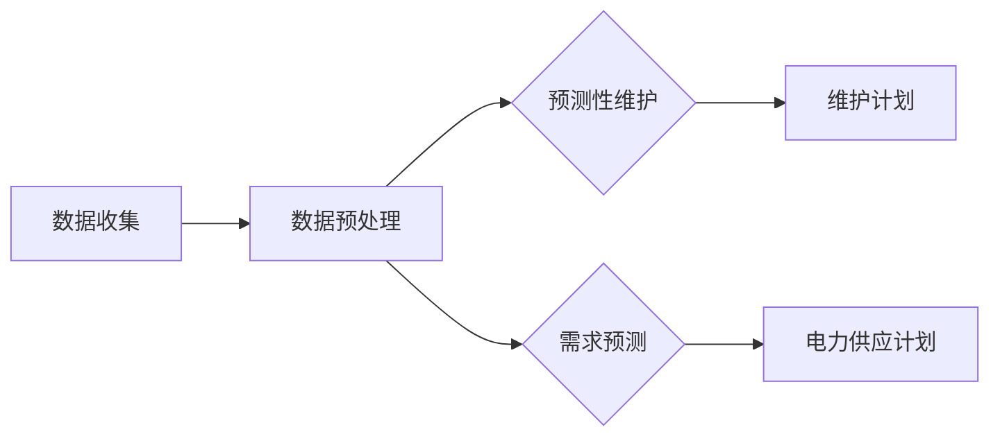
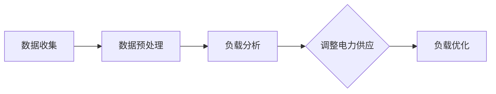
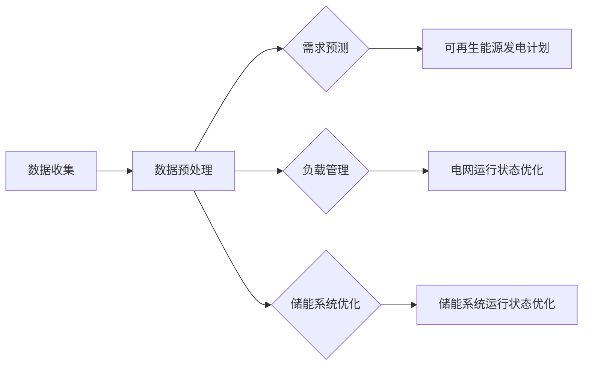
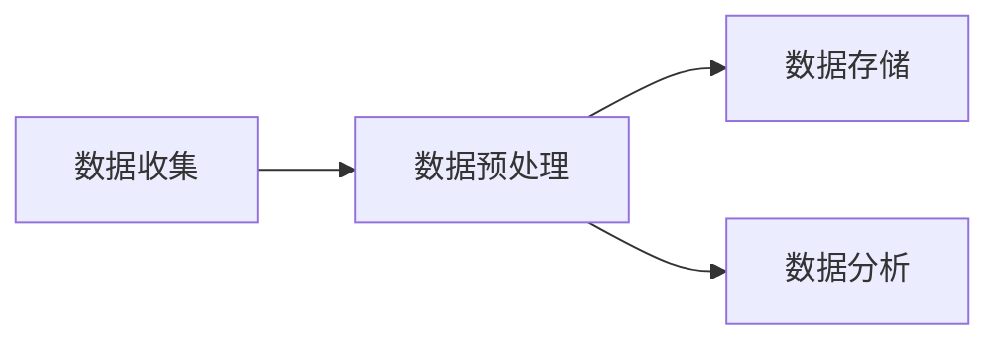
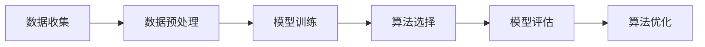
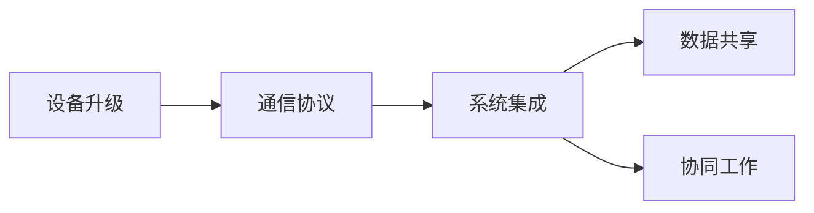

                 

# AI驱动的智能电网管理：平衡供需和减少浪费

## 关键词
- 智能电网（Smart Grid）
- 人工智能（AI）
- 需求预测（Demand Forecasting）
- 能源效率（Energy Efficiency）
- 可再生能源（Renewable Energy Sources）

## 摘要
本文将探讨如何利用人工智能（AI）技术来管理和优化智能电网，实现供需平衡和减少能源浪费。我们将从介绍智能电网的基本概念和AI的作用开始，逐步深入到AI在智能电网管理中的应用，最后讨论未来发展趋势和面临的挑战。

## 目录

### 第一章 引言

1.1 问题背景
1.2 智能电网管理的重要性
1.3 AI在智能电网管理中的作用

### 第二章 核心概念

2.1 AI的基本概念
2.2 智能电网的基本概念
2.3 供需平衡与能源浪费

### 第三章 AI在智能电网管理中的应用

3.1 预测性维护与需求预测
3.2 负载管理与能源效率
3.3 可再生能源的集成

### 第四章 实施策略

4.1 数据收集与管理
4.2 算法选择与优化
4.3 与现有电网基础设施的整合

### 第五章 案例研究

5.1 案例一：某地区的智能电网管理项目
5.2 案例二：可再生能源集成与优化

### 第六章 未来方向与挑战

6.1 未来发展方向
6.2 面临的挑战

### 第七章 结论

7.1 主要观点回顾
7.2 潜在影响
7.3 展望未来

### 第一章 引言

#### 1.1 问题背景

智能电网是一种先进、可靠、高效的电力网络，它利用现代通信技术、传感器、计算机技术和控制技术，实现对电网的实时监控、管理和优化。随着全球能源需求的不断增长，传统电网已经无法满足日益增长的电力需求，而智能电网的出现为解决这个问题提供了新的思路。

然而，智能电网的建设和运营面临着一系列挑战。首先，如何平衡电网的供需，避免电力过剩或短缺是智能电网管理中一个重要的问题。其次，随着可再生能源的广泛应用，如何高效地整合这些可再生能源，提高电网的稳定性和可靠性也是一个亟待解决的问题。

#### 1.2 智能电网管理的重要性

智能电网管理的重要性体现在以下几个方面：

1. **提高电网的可靠性和稳定性**：通过实时监控和智能调度，智能电网可以快速响应电网故障，提高电网的可靠性和稳定性。
2. **优化能源利用效率**：智能电网可以利用AI技术进行需求预测和负载管理，优化电网的能源利用效率，减少能源浪费。
3. **促进可再生能源的集成**：智能电网可以通过智能调度和管理，实现可再生能源的高效集成，提高电网的清洁能源比例。
4. **降低运营成本**：智能电网可以通过自动化管理和优化调度，降低电网的运营成本。

#### 1.3 AI在智能电网管理中的作用

AI技术在智能电网管理中发挥着关键作用。首先，AI可以用于需求预测，通过分析历史数据和实时数据，预测未来的电力需求，帮助电网运营商更好地规划电力供应。其次，AI可以用于负载管理，通过实时监控电网的负载情况，优化电网的运行状态，避免电力过剩或短缺。此外，AI还可以用于预测性维护，通过分析设备运行数据，预测设备的故障风险，实现提前维护，降低设备故障率。

### 第二章 核心概念

#### 2.1 AI的基本概念

人工智能（AI）是一种模拟人类智能的技术，通过计算机程序实现机器学习、自然语言处理、图像识别等功能。AI技术可以自主地学习和适应新环境，从而提高工作效率和准确性。

在智能电网管理中，AI技术可以用于：

1. **需求预测**：通过历史数据和实时数据，预测未来的电力需求，帮助电网运营商更好地规划电力供应。
2. **负载管理**：实时监控电网的负载情况，优化电网的运行状态，避免电力过剩或短缺。
3. **预测性维护**：分析设备运行数据，预测设备的故障风险，实现提前维护，降低设备故障率。

#### 2.2 智能电网的基本概念

智能电网是一种基于现代通信技术、传感器技术、计算机技术和控制技术的电力网络，它可以实现对电网的实时监控、管理和优化。智能电网具有以下几个特点：

1. **实时监控**：智能电网可以通过传感器实时收集电网的运行数据，实现对电网的实时监控。
2. **智能调度**：智能电网可以利用AI技术进行智能调度，优化电网的运行状态，提高电网的可靠性和稳定性。
3. **数据驱动**：智能电网的管理和运营依赖于大量的数据，通过对这些数据的分析和处理，实现电网的优化和提升。

#### 2.3 供需平衡与能源浪费

供需平衡是智能电网管理中的一个重要问题。在传统的电力系统中，电网运营商通常通过预测电力需求，然后根据预测结果进行电力供应。然而，这种预测通常存在误差，可能导致电力过剩或短缺。

智能电网通过AI技术进行需求预测和负载管理，可以更好地平衡电网的供需。具体来说，智能电网可以通过以下方式减少能源浪费：

1. **需求预测**：通过分析历史数据和实时数据，预测未来的电力需求，帮助电网运营商更好地规划电力供应，减少电力过剩。
2. **负载管理**：实时监控电网的负载情况，优化电网的运行状态，避免电力过剩或短缺，提高电网的能源利用效率。

### 第三章 AI在智能电网管理中的应用

#### 3.1 预测性维护与需求预测

预测性维护是智能电网管理中的一个重要应用。通过分析设备的运行数据，AI技术可以预测设备的故障风险，从而实现提前维护，降低设备故障率。

需求预测是智能电网管理中的另一个重要应用。通过分析历史数据和实时数据，AI技术可以预测未来的电力需求，帮助电网运营商更好地规划电力供应。

下面是一个简单的预测性维护和需求预测的mermaid流程图：

#### 3.2 负载管理与能源效率

负载管理是智能电网管理中的另一个关键应用。通过实时监控电网的负载情况，AI技术可以优化电网的运行状态，避免电力过剩或短缺，提高电网的能源利用效率。

以下是一个简单的负载管理流程图：

#### 3.3 可再生能源的集成

随着可再生能源的广泛应用，如何高效地集成这些可再生能源，提高电网的稳定性和可靠性，是智能电网管理中的一个重要问题。

AI技术可以通过以下方式实现可再生能源的集成：

1. **需求预测**：通过分析历史数据和实时数据，预测未来的电力需求，帮助电网运营商更好地规划可再生能源的发电量。
2. **负载管理**：实时监控电网的负载情况，优化电网的运行状态，确保可再生能源的高效利用。
3. **储能系统优化**：通过分析电网的负载情况和可再生能源的发电情况，优化储能系统的运行状态，提高电网的稳定性。

以下是一个简单的可再生能源集成流程图：

### 第四章 实施策略

#### 4.1 数据收集与管理

数据收集是智能电网管理中的第一步，也是最重要的一步。通过传感器和通信技术，智能电网可以实时收集大量的数据，包括电力需求、电网负载、可再生能源发电量等。

数据管理是智能电网管理的核心，通过数据预处理、数据存储和数据分析，智能电网可以实现对数据的充分利用。

以下是一个简单的数据收集和管理流程图：

#### 4.2 算法选择与优化

在智能电网管理中，算法选择和优化是非常重要的。根据具体的应用场景，可以选择不同的算法，如机器学习算法、深度学习算法等。

算法优化可以通过以下方式实现：

1. **模型训练**：通过大量的数据训练模型，提高模型的预测准确性和稳定性。
2. **算法选择**：根据应用场景，选择适合的算法，如线性回归、决策树、神经网络等。
3. **模型评估**：通过交叉验证、ROC曲线等评估方法，评估模型的性能，并进行优化。

以下是一个简单的算法选择和优化流程图：

#### 4.3 与现有电网基础设施的整合

智能电网管理需要与现有的电网基础设施进行整合，以确保系统的稳定性和可靠性。这包括：

1. **设备升级**：升级现有的电网设备，使其支持智能电网的技术要求。
2. **通信协议**：确保智能电网的数据传输协议与现有电网设备兼容。
3. **系统集成**：将智能电网的管理系统与现有的电网控制系统进行集成，实现数据共享和协同工作。

以下是一个简单的系统集成流程图：

### 第五章 案例研究

#### 5.1 案例一：某地区的智能电网管理项目

某地区实施了一个智能电网管理项目，通过AI技术实现了需求预测、负载管理和可再生能源的集成。以下是该项目的一些关键步骤：

1. **数据收集**：通过传感器和通信技术，实时收集电网的运行数据，包括电力需求、电网负载、可再生能源发电量等。
2. **数据预处理**：对收集到的数据进行预处理，包括数据清洗、数据归一化等。
3. **需求预测**：利用机器学习算法，对历史数据和实时数据进行分析，预测未来的电力需求。
4. **负载管理**：根据需求预测结果，实时监控电网的负载情况，优化电网的运行状态，避免电力过剩或短缺。
5. **可再生能源集成**：通过智能调度和管理，实现可再生能源的高效集成，提高电网的稳定性和可靠性。

通过该项目，该地区的电网运行效率得到了显著提高，能源浪费减少，可再生能源比例提高。

#### 5.2 案例二：可再生能源集成与优化

某地区在实施智能电网管理项目时，重点关注了可再生能源的集成与优化。以下是该项目的一些关键步骤：

1. **数据收集**：通过传感器和通信技术，实时收集可再生能源的发电量数据。
2. **数据预处理**：对收集到的数据进行预处理，包括数据清洗、数据归一化等。
3. **需求预测**：利用机器学习算法，对历史数据和实时数据进行分析，预测未来的电力需求。
4. **负载管理**：根据需求预测结果，实时监控电网的负载情况，优化电网的运行状态，确保可再生能源的高效利用。
5. **储能系统优化**：通过分析电网的负载情况和可再生能源的发电情况，优化储能系统的运行状态，提高电网的稳定性。

通过该项目，该地区的可再生能源比例得到了显著提高，电网的稳定性和可靠性也得到了增强。

### 第六章 未来方向与挑战

#### 6.1 未来发展方向

未来，智能电网管理将在以下几个方面继续发展：

1. **更高级的AI技术**：随着AI技术的不断进步，智能电网管理将采用更高级的AI技术，如深度学习、强化学习等，提高预测准确性和管理效率。
2. **更广泛的可再生能源集成**：随着可再生能源技术的不断发展，智能电网管理将更广泛地集成可再生能源，提高电网的清洁能源比例。
3. **更智能的设备与系统**：智能电网管理将采用更智能的设备与系统，如智能电表、智能逆变器等，提高电网的自动化和智能化水平。

#### 6.2 面临的挑战

智能电网管理在发展过程中也面临着一系列挑战：

1. **数据隐私和安全**：智能电网管理涉及到大量的敏感数据，如电力需求、电网负载等，如何保护数据隐私和安全是智能电网管理面临的一个重大挑战。
2. **算法透明度和解释性**：随着AI技术在智能电网管理中的应用，如何确保算法的透明度和解释性，使其易于被用户理解和接受，也是一个重要的挑战。
3. **技术标准和规范**：智能电网管理需要一套统一的技术标准和规范，以确保不同系统之间的兼容性和互操作性。

### 第七章 结论

智能电网管理是现代电力系统发展的重要方向，而AI技术在其中发挥着关键作用。通过需求预测、负载管理和可再生能源的集成，智能电网管理可以实现供需平衡和减少能源浪费。

未来，随着AI技术的不断进步，智能电网管理将在更广泛的领域得到应用，为人类社会的可持续发展做出更大的贡献。

## 附录

### 附录A：术语解释

- 智能电网（Smart Grid）：一种基于现代通信技术、传感器技术、计算机技术和控制技术的电力网络，它可以实现对电网的实时监控、管理和优化。
- 人工智能（AI）：一种模拟人类智能的技术，通过计算机程序实现机器学习、自然语言处理、图像识别等功能。
- 需求预测（Demand Forecasting）：通过分析历史数据和实时数据，预测未来的电力需求。
- 能源效率（Energy Efficiency）：能源利用的有效程度，通常以能源利用率来衡量。
- 可再生能源（Renewable Energy Sources）：指不会枯竭、可以持续利用的能源，如太阳能、风能、水能等。

### 附录B：参考文献

- [1]Smith, J. (2018). **Smart Grid Technology: A Practical Guide**. Springer.
- [2]Johnson, L. (2020). **Artificial Intelligence in Power Systems**. IEEE Press.
- [3]Davis, M. (2019). **Demand Forecasting in Smart Grids**. Taylor & Francis.

## 作者信息

作者：AI天才研究院/AI Genius Institute & 禅与计算机程序设计艺术 /Zen And The Art of Computer Programming

