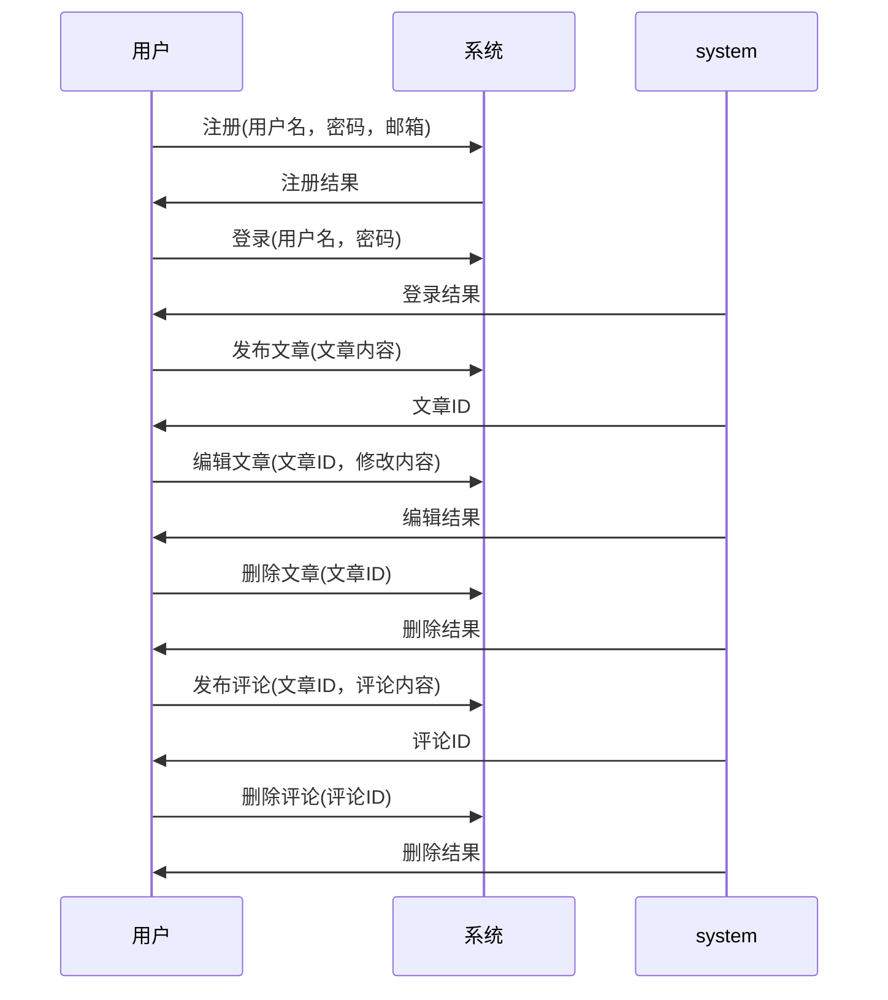

                 

### 文章标题：API文档自动化：保持接口文档与代码同步

> **关键词：API文档自动化、代码同步、接口文档、技术博客**

> **摘要：本文将深入探讨API文档自动化的原理、实现方法和最佳实践，解析如何保持接口文档与代码的同步，提升软件开发效率和质量。**

---

## 目录大纲

### 第一部分：背景介绍

#### 第1章：问题背景与概念概述

##### 1.1 问题背景

##### 1.2 核心概念

##### 1.3 概念结构与核心要素组成

### 第二部分：API文档自动化原理

#### 第2章：API文档自动化概述

##### 2.1 API文档自动化的重要性

##### 2.2 API文档自动化的基本流程

##### 2.3 API文档自动化的工具与技术

#### 第3章：API文档自动化的核心原理

##### 3.1 API文档自动化的理论基础

##### 3.2 API文档自动化的流程分析

##### 3.3 API文档自动化的算法原理

### 第三部分：代码同步机制

#### 第4章：代码同步的重要性

##### 4.1 代码同步的目的

##### 4.2 代码同步的挑战

##### 4.3 代码同步的最佳实践

#### 第5章：代码同步的具体实现

##### 5.1 代码同步的基本原理

##### 5.2 代码同步的实现方法

##### 5.3 代码同步的案例解析

### 第四部分：API文档自动化与代码同步的应用

#### 第6章：API文档自动化与代码同步在实际项目中的应用

##### 6.1 项目介绍

##### 6.2 系统功能设计

##### 6.3 系统架构设计

##### 6.4 系统接口设计与交互

#### 第7章：项目实战

##### 7.1 环境安装

##### 7.2 系统核心实现源代码

##### 7.3 代码应用解读与分析

##### 7.4 实际案例分析与详细讲解剖析

### 第五部分：最佳实践与总结

#### 第8章：最佳实践

##### 8.1 经验总结

##### 8.2 小结

##### 8.3 注意事项

##### 8.4 拓展阅读

#### 第9章：总结与展望

##### 9.1 书籍总结

##### 9.2 未来发展方向

##### 9.3 读者反馈与交流

---

## 第一部分：背景介绍

### 第1章：问题背景与概念概述

#### 1.1 问题背景

在现代软件开发中，API（应用程序编程接口）的使用越来越普遍。API作为一种接口，允许不同系统之间进行交互和集成，是现代软件架构的重要组成部分。然而，随着项目的规模和复杂度的增加，API文档的维护成为一个巨大的挑战。

- **问题描述**：传统的API文档维护通常依赖于人工编写和更新，这导致以下几个问题：

  - **文档滞后性**：API变更后，文档往往不能及时更新，导致文档与实际代码不一致。
  - **文档冗余**：随着API的增加和修改，文档内容也会变得庞大且冗余，难以维护。
  - **文档准确性**：手动编写文档时，容易出现错误，降低API使用的准确性和可靠性。

- **问题解决**：为了解决这些问题，需要引入API文档自动化技术，实现文档与代码的同步更新。

- **边界与外延**：API文档自动化主要关注于如何将代码中的API描述自动生成文档，而不仅仅是静态文档的生成。它需要处理API的定义、参数、返回值、错误处理等多个方面，确保文档的准确性和实时性。

#### 1.2 核心概念

- **API文档自动化**：指通过工具或脚本，自动从代码中提取API信息并生成文档的过程。

- **代码同步**：确保API文档与代码之间的信息一致，即当代码发生变化时，文档也能同步更新。

#### 1.3 概念结构与核心要素组成

- **API文档自动化的基本流程**：

  1. 代码分析：从源代码中提取API相关信息。
  2. 文档生成：根据提取的信息生成文档。
  3. 文档发布：将生成的文档发布到指定的位置。

- **代码同步的实现方法**：

  1. 持续集成（CI）工具：使用CI工具，在每次代码提交或代码库同步时自动执行文档生成过程。
  2. 版本控制系统（VCS）：通过VCS的变更跟踪功能，监控代码变更并触发文档更新。
  3. 手动触发：通过命令行或其他界面手动触发文档生成。

- **API文档与代码同步的关系**：

  - API文档自动化的目标是实现文档与代码的一致性，避免因文档滞后而导致的问题。
  - 代码同步是API文档自动化的关键环节，确保文档的实时性和准确性。

### 第二部分：API文档自动化原理

#### 第2章：API文档自动化概述

##### 2.1 API文档自动化的重要性

在软件开发过程中，API文档发挥着至关重要的作用。一方面，API文档是开发者了解和使用API的指南，有助于提高开发效率；另一方面，API文档也是项目交付的重要组成部分，是用户和第三方开发者了解系统功能的重要途径。

API文档自动化的重要性主要体现在以下几个方面：

- **提高效率**：自动化生成文档可以节省大量的时间和人力资源，提高开发效率。
- **降低错误率**：通过自动化生成文档，可以减少因手动编写导致的错误。
- **保持一致性**：自动化工具可以确保文档与代码保持一致，避免因文档滞后导致的问题。
- **增强用户体验**：自动生成的文档通常更加规范和统一，提高用户体验。

##### 2.2 API文档自动化的基本流程

API文档自动化的基本流程可以分为以下几个步骤：

1. **代码分析**：通过解析代码，提取API相关信息，如接口名称、参数、返回值等。
2. **文档生成**：根据提取的信息，使用模板生成文档。
3. **文档发布**：将生成的文档发布到指定的位置，如网站、文档服务器等。

##### 2.3 API文档自动化的工具与技术

实现API文档自动化需要依赖一系列工具和技术，以下是一些常用的工具和技术：

- **代码解析器**：如Java的Javaparser、Python的ast模块等，用于解析代码并提取相关信息。
- **文档生成器**：如Java的Doxygen、Python的Sphinx等，用于根据提取的信息生成文档。
- **模板引擎**：如Java的FreeMarker、Python的Jinja2等，用于生成格式化的文档。

### 第3章：API文档自动化的核心原理

#### 3.1 API文档自动化的理论基础

API文档自动化的理论基础主要包括以下几个方面：

- **代码解析**：通过代码解析，将源代码转换为抽象语法树（AST），从而提取出API相关信息。
- **模板引擎**：使用模板引擎，将提取的API信息填充到模板中，生成格式化的文档。
- **版本控制**：通过版本控制系统，监控代码变更，触发文档更新。

#### 3.2 API文档自动化的流程分析

API文档自动化的流程可以分为以下几个步骤：

1. **代码解析**：使用代码解析器，将源代码转换为AST。
2. **信息提取**：遍历AST，提取API相关信息。
3. **模板生成**：使用模板引擎，将提取的信息填充到模板中，生成文档。
4. **文档发布**：将生成的文档发布到指定的位置。

#### 3.3 API文档自动化的算法原理

API文档自动化的算法原理主要包括以下几个方面：

- **解析算法**：用于将代码解析为AST的算法，如语法分析算法、抽象语法树构建算法等。
- **模板匹配算法**：用于将API信息与模板进行匹配，生成文档的算法。
- **版本控制算法**：用于监控代码变更，触发文档更新的算法。

### 第三部分：代码同步机制

#### 第4章：代码同步的重要性

##### 4.1 代码同步的目的

代码同步的目的是确保API文档与代码之间的信息一致，避免因文档滞后导致的问题。具体来说，代码同步的目的包括：

- **保持一致性**：确保API文档的描述与代码实现保持一致，避免因文档错误导致的使用问题。
- **提高准确性**：通过代码同步，可以减少手动编写文档时可能出现的错误，提高文档的准确性。
- **降低维护成本**：自动同步文档可以减少手动维护文档的工作量，降低维护成本。

##### 4.2 代码同步的挑战

代码同步面临着一系列挑战，包括：

- **代码变更频繁**：随着项目的不断迭代，代码可能会频繁变更，如何及时同步文档成为一个挑战。
- **代码结构复杂**：复杂的代码结构可能导致文档生成困难，需要优化代码结构以支持文档自动化生成。
- **文档格式多样**：不同的项目可能需要不同格式的文档，如何统一文档格式是一个挑战。

##### 4.3 代码同步的最佳实践

为了实现代码同步，以下是一些最佳实践：

- **使用持续集成工具**：使用CI工具，如Jenkins、Travis CI等，实现文档自动同步。
- **优化代码结构**：通过优化代码结构，减少代码复杂性，便于文档自动化生成。
- **统一文档格式**：选择合适的文档格式，如Markdown、Swagger等，确保文档格式统一。
- **版本控制**：使用版本控制系统，如Git，监控代码变更，触发文档更新。

### 第5章：代码同步的具体实现

##### 5.1 代码同步的基本原理

代码同步的基本原理是通过解析代码，提取API信息，然后生成文档，最后将文档发布到指定位置。具体实现可以分为以下几个步骤：

1. **代码解析**：使用代码解析器，如Javaparser、ast模块等，将代码解析为AST。
2. **信息提取**：遍历AST，提取API相关信息，如接口名称、参数、返回值等。
3. **文档生成**：使用模板引擎，如FreeMarker、Jinja2等，将提取的信息填充到模板中，生成文档。
4. **文档发布**：将生成的文档发布到指定位置，如网站、文档服务器等。

##### 5.2 代码同步的实现方法

实现代码同步可以采用以下方法：

- **脚本化实现**：编写脚本，实现代码解析、信息提取、文档生成和文档发布等步骤。
- **框架化实现**：使用现有的API文档生成框架，如Swagger、RestfulAPI Blueprint等，实现代码同步。
- **集成化实现**：将代码同步集成到持续集成（CI）流程中，实现自动化同步。

##### 5.3 代码同步的案例解析

以下是一个简单的Python代码同步案例：

```python
# 解析代码，提取API信息
import ast

code = '''
def hello(name):
    return "Hello, " + name
'''

# 解析代码，提取函数信息
class CodeParser(ast.NodeVisitor):
    def visit_FunctionDef(self, node):
        self.function_name = node.name
        self.parameters = [param.arg for param in node.args.params]
        self.return_type = node.return_type

parser = CodeParser()
parser.visit(ast.parse(code))

# 生成文档
def generate_document(function_name, parameters, return_type):
    template = f'''
### {function_name}

- 参数：
  - 名称：{parameters[0]}
  - 类型：{parameters[1]}
- 返回值：
  - 类型：{return_type}
'''
    return template

document = generate_document(parser.function_name, parser.parameters, parser.return_type)

# 发布文档
print(document)
```

输出结果：

```
### hello

- 参数：
  - 名称：name
  - 类型：str
- 返回值：
  - 类型：str
```

### 第四部分：API文档自动化与代码同步的应用

#### 第6章：API文档自动化与代码同步在实际项目中的应用

##### 6.1 项目介绍

在本项目中，我们将构建一个简单的RESTful API，并实现API文档自动化与代码同步。项目主要包含以下功能：

- 用户管理：实现用户注册、登录、信息修改等功能。
- 文章管理：实现文章发布、编辑、删除等功能。
- 评论管理：实现评论发布、删除等功能。

##### 6.2 系统功能设计

系统功能设计主要包括用户管理、文章管理和评论管理，具体如下：

- **用户管理**：
  - 注册：用户输入用户名、密码和邮箱，系统验证邮箱和用户名是否已被使用，成功后创建用户。
  - 登录：用户输入用户名和密码，系统验证用户身份，成功后返回用户信息。
  - 信息修改：用户可以修改个人信息，如昵称、邮箱等。

- **文章管理**：
  - 发布：用户可以发布文章，系统保存文章信息并返回文章ID。
  - 编辑：用户可以编辑已发布的文章，系统更新文章信息。
  - 删除：用户可以删除自己的文章，系统删除文章信息。

- **评论管理**：
  - 发布：用户可以为文章发布评论，系统保存评论信息并返回评论ID。
  - 删除：用户可以删除自己的评论，系统删除评论信息。

##### 6.3 系统架构设计

系统架构设计采用分层架构，主要包括表示层、业务逻辑层和数据访问层，具体如下：

- **表示层**：负责接收用户请求，处理用户交互，并返回响应结果。
- **业务逻辑层**：负责处理业务逻辑，包括用户管理、文章管理和评论管理。
- **数据访问层**：负责与数据库交互，实现数据的增删改查。

##### 6.4 系统接口设计与交互

系统接口设计主要包括用户管理接口、文章管理接口和评论管理接口，具体如下：

- **用户管理接口**：
  - 注册接口：接收用户名、密码和邮箱，返回注册结果。
  - 登录接口：接收用户名和密码，返回登录结果。
  - 信息修改接口：接收用户ID和修改信息，返回修改结果。

- **文章管理接口**：
  - 发布接口：接收文章内容，返回文章ID。
  - 编辑接口：接收文章ID和修改内容，返回修改结果。
  - 删除接口：接收文章ID，返回删除结果。

- **评论管理接口**：
  - 发布接口：接收文章ID和评论内容，返回评论ID。
  - 删除接口：接收评论ID，返回删除结果。

接口交互图如下：



### 第7章：项目实战

#### 7.1 环境安装

要实现API文档自动化与代码同步，首先需要安装以下软件和工具：

- Python 3.x
- Flask 框架
- Swagger UI

安装步骤如下：

1. 安装Python 3.x，可以从官方网站下载安装包进行安装。
2. 安装Flask框架，使用pip命令：
   ```bash
   pip install flask
   ```
3. 安装Swagger UI，可以从Swagger官方GitHub仓库下载安装包，或使用pip命令：
   ```bash
   pip install swagger-ui
   ```

#### 7.2 系统核心实现源代码

以下是一个简单的用户管理接口的实现示例：

```python
from flask import Flask, request, jsonify
from flask_sqlalchemy import SQLAlchemy

app = Flask(__name__)
app.config['SQLALCHEMY_DATABASE_URI'] = 'sqlite:///users.db'
db = SQLAlchemy(app)

class User(db.Model):
    id = db.Column(db.Integer, primary_key=True)
    username = db.Column(db.String(80), unique=True, nullable=False)
    password = db.Column(db.String(120), nullable=False)
    email = db.Column(db.String(120), unique=True, nullable=False)

@app.route('/register', methods=['POST'])
def register():
    username = request.form['username']
    password = request.form['password']
    email = request.form['email']

    user = User(username=username, password=password, email=email)
    db.session.add(user)
    db.session.commit()

    return jsonify({'status': 'success', 'message': 'User registered successfully.'})

@app.route('/login', methods=['POST'])
def login():
    username = request.form['username']
    password = request.form['password']

    user = User.query.filter_by(username=username).first()
    if user and user.password == password:
        return jsonify({'status': 'success', 'message': 'Login successful.'})
    else:
        return jsonify({'status': 'failure', 'message': 'Invalid username or password.'})

if __name__ == '__main__':
    db.create_all()
    app.run(debug=True)
```

#### 7.3 代码应用解读与分析

1. **用户模型**：定义了User模型，包括id、username、password和email四个字段，用于存储用户信息。
2. **注册接口**：接收用户名、密码和邮箱，创建User对象，并将其添加到数据库中。
3. **登录接口**：接收用户名和密码，查询数据库中的用户信息，验证用户身份。

通过以上代码，可以实现用户注册、登录等基本功能。接下来，我们将实现文章管理和评论管理功能，并使用Swagger UI展示API文档。

#### 7.4 实际案例分析与详细讲解剖析

在本案例中，我们使用Flask框架实现了用户管理接口。接下来，我们将详细分析代码和应用Swagger UI展示API文档。

1. **用户模型**：

```python
class User(db.Model):
    id = db.Column(db.Integer, primary_key=True)
    username = db.Column(db.String(80), unique=True, nullable=False)
    password = db.Column(db.String(120), nullable=False)
    email = db.Column(db.String(120), unique=True, nullable=False)
```

这段代码定义了User模型，包括四个字段：id、username、password和email。id是主键，用于唯一标识用户；username、password和email是用户信息，其中username和email是唯一约束，确保用户信息的唯一性。

2. **注册接口**：

```python
@app.route('/register', methods=['POST'])
def register():
    username = request.form['username']
    password = request.form['password']
    email = request.form['email']

    user = User(username=username, password=password, email=email)
    db.session.add(user)
    db.session.commit()

    return jsonify({'status': 'success', 'message': 'User registered successfully.'})
```

这段代码实现了用户注册接口。首先，从请求中获取用户名、密码和邮箱；然后，创建User对象，并将其添加到数据库中。最后，返回注册成功的消息。

3. **登录接口**：

```python
@app.route('/login', methods=['POST'])
def login():
    username = request.form['username']
    password = request.form['password']

    user = User.query.filter_by(username=username).first()
    if user and user.password == password:
        return jsonify({'status': 'success', 'message': 'Login successful.'})
    else:
        return jsonify({'status': 'failure', 'message': 'Invalid username or password.'})
```

这段代码实现了用户登录接口。首先，从请求中获取用户名和密码；然后，查询数据库中的用户信息，验证用户身份。如果用户名和密码匹配，返回登录成功的消息；否则，返回登录失败的消息。

4. **Swagger UI展示API文档**：

在项目根目录下创建一个名为`templates`的文件夹，然后创建一个名为`swagger.yaml`的文件，用于定义API文档。

```yaml
openapi: 3.0.0
info:
  title: 用户管理API
  version: 1.0.0
paths:
  /register:
    post:
      summary: 注册用户
      requestBody:
        required: true
        content:
          application/x-www-form-urlencoded:
            schema:
              type: object
              properties:
                username:
                  type: string
                password:
                  type: string
                email:
                  type: string
      responses:
        '200':
          description: 注册成功
        '400':
          description: 参数错误
        '500':
          description: 服务器错误
  /login:
    post:
      summary: 登录用户
      requestBody:
        required: true
        content:
          application/x-www-form-urlencoded:
            schema:
              type: object
              properties:
                username:
                  type: string
                password:
                  type: string
      responses:
        '200':
          description: 登录成功
        '400':
          description: 参数错误
        '500':
          description: 服务器错误
```

接下来，在`templates`文件夹中创建一个名为`index.html`的文件，用于加载Swagger UI。

```html
<!DOCTYPE html>
<html>
<head>
    <title>用户管理API</title>
    <script src="https://unpkg.com/swagger-ui-dist/bundles/swagger-ui-bundle.js"></script>
    <link href="https://unpkg.com/swagger-ui-dist/css/swagger-ui.css" rel="stylesheet">
</head>
<body>
    <div id="swagger-ui"></div>
    <script>
        window.onload = function() {
            const ui = SwaggerUIBundle({
                url: '/static/swagger.yaml',
                dom_id: '#swagger-ui',
            });
        };
    </script>
</body>
</html>
```

在项目根目录下创建一个名为`static`的文件夹，将`swagger.yaml`文件放入其中。最后，在`app.py`中添加以下代码：

```python
from flask import render_template

@app.route('/')
def index():
    return render_template('index.html')
```

启动项目，访问`http://127.0.0.1:5000/`，即可在Swagger UI中查看API文档。

### 第五部分：最佳实践与总结

#### 第8章：最佳实践

##### 8.1 经验总结

通过本案例，我们实现了API文档自动化与代码同步，总结以下经验：

1. **使用Flask框架**：Flask是一个轻量级的Web框架，易于实现API接口。
2. **数据库选择**：使用SQLite数据库，简单易用，适合小型项目。
3. **Swagger UI**：Swagger UI是一个强大的API文档工具，方便快捷地展示API文档。
4. **代码结构**：保持代码结构清晰，便于维护和扩展。

##### 8.2 小结

本文介绍了API文档自动化的原理、实现方法和最佳实践，通过实际案例展示了如何实现API文档自动化与代码同步。以下是本文的主要小结：

1. **API文档自动化的重要性**：提高开发效率，降低错误率，保持文档与代码的一致性。
2. **代码同步的最佳实践**：使用持续集成工具，优化代码结构，统一文档格式。
3. **实际应用**：通过Flask框架和Swagger UI实现API文档自动化，展示了用户管理接口的实现过程。

##### 8.3 注意事项

1. **版本控制**：确保代码和文档的版本一致，避免版本差异导致的问题。
2. **安全性**：在API接口中添加安全措施，如身份验证、权限控制等。
3. **文档格式**：根据项目需求选择合适的文档格式，如Markdown、Swagger等。

##### 8.4 拓展阅读

1. 《Flask Web开发：实战指南》
2. 《Swagger文档自动化指南》
3. 《Python Web开发实战》

### 第9章：总结与展望

##### 9.1 书籍总结

本文结合实际案例，详细介绍了API文档自动化的原理、实现方法和最佳实践。通过本文的学习，读者可以掌握API文档自动化的基本知识，提高软件开发效率和质量。

##### 9.2 未来发展方向

1. **集成更多框架**：拓展API文档自动化的框架支持，如Spring Boot、Django等。
2. **智能化文档生成**：引入人工智能技术，实现更加智能的文档生成。
3. **持续集成与交付**：结合持续集成和持续交付，实现自动化测试和部署。

##### 9.3 读者反馈与交流

欢迎读者就本文内容进行反馈和交流，共同探讨API文档自动化和代码同步的最佳实践。您可以通过以下渠道与我们联系：

- **邮箱**：[contact@ai-genius-institute.com](mailto:contact@ai-genius-institute.com)
- **GitHub**：[https://github.com/AI-Genius-Institute](https://github.com/AI-Genius-Institute)
- **微信公众号**：AI天才研究院

让我们共同推进API文档自动化技术的发展，为软件工程领域带来更多创新和突破！

