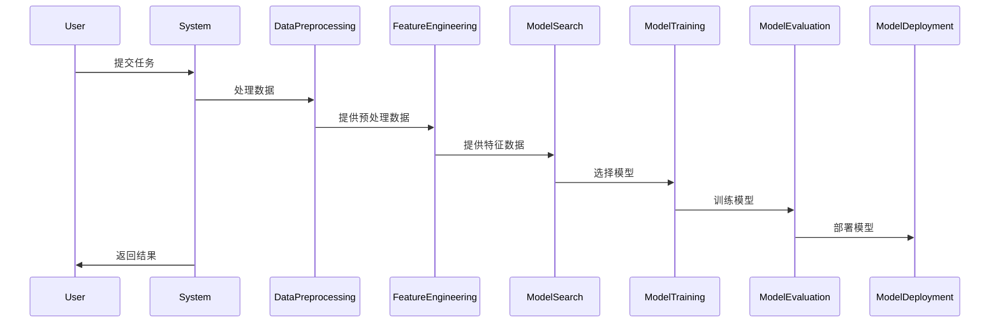
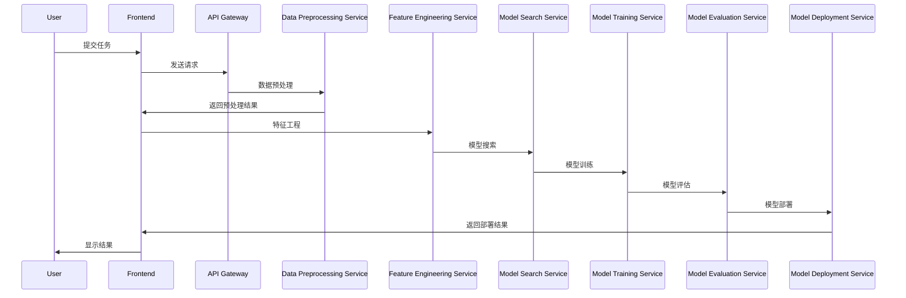
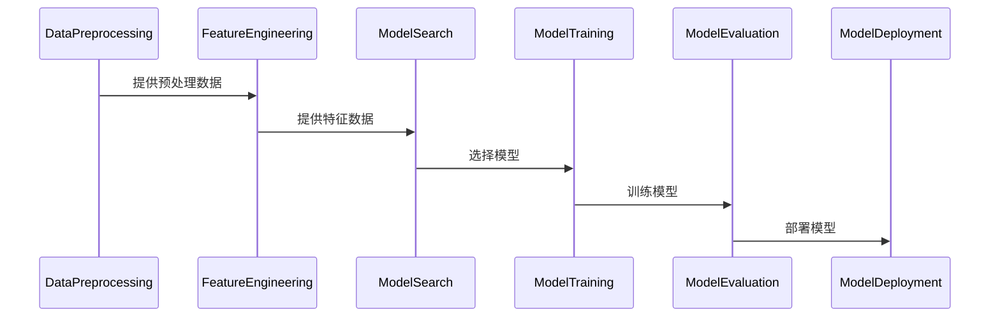

                 

### 文章标题

# AutoML：自动化机器学习模型生成

### 关键词

- 自动化机器学习（AutoML）
- 模型生成
- 模型搜索
- 特征工程
- 算法优化

### 摘要

本文将深入探讨自动化机器学习（AutoML）的概念、技术原理、应用场景及发展趋势。通过一步步的逻辑推理和实际案例分析，本文旨在为读者提供一个全面而简洁的AutoML入门指南，帮助读者理解并掌握自动化机器学习模型生成的方法和实践。

----------------------------------------------------------------

## 目录大纲设计流程

### 一、明确书籍主题与目标

首先，我们需要明确书籍的主题是《AutoML：自动化机器学习模型生成》，目标是向读者介绍自动化机器学习模型生成的方法和技术，帮助读者了解并掌握自动化机器学习的概念、技术以及实际应用。

### 二、梳理核心内容

基于书籍主题和目标，我们需要梳理出书籍的核心内容，这些内容包括：

1. **背景介绍**：介绍自动化机器学习的背景、发展历程及其重要性。
2. **核心概念与联系**：阐述自动化机器学习中的关键概念，如AutoML、模型搜索、模型优化等，并分析这些概念之间的联系。
3. **算法原理讲解**：详细讲解自动化机器学习的主要算法，如遗传算法、贝叶斯优化、随机搜索等，包括算法原理、数学模型和公式。
4. **系统分析与架构设计方案**：分析自动化机器学习系统的需求、功能设计、系统架构设计、系统接口设计和系统交互。
5. **项目实战**：通过具体项目案例，展示如何使用自动化机器学习技术解决实际问题。
6. **最佳实践 tips**、**小结**、**注意事项**、**拓展阅读**等内容。

### 三、设计目录结构

根据梳理出的核心内容，我们可以设计出书籍的目录结构。目录结构应包括以下几个部分：

1. **引言**：简要介绍书籍的主题、目标、读者对象等。
2. **背景与概述**：介绍自动化机器学习的背景、发展历程、重要性等。
3. **核心概念与联系**：详细讲解自动化机器学习中的核心概念及其联系。
4. **算法原理讲解**：逐个讲解自动化机器学习的主要算法，包括算法原理、数学模型和公式。
5. **系统分析与架构设计方案**：分析自动化机器学习系统的需求、功能设计、系统架构设计、系统接口设计和系统交互。
6. **项目实战**：通过具体项目案例，展示如何使用自动化机器学习技术解决实际问题。
7. **最佳实践 tips**、**小结**、**注意事项**、**拓展阅读**等内容。
8. **附录**：提供相关工具、技术、资源等参考资料。

### 四、细化章节内容

在确定目录结构后，我们需要对每个章节的内容进行细化，确保章节内容完整、逻辑清晰。对于每个章节，我们可以按照以下结构进行编写：

1. **章节标题**：简洁明了地概括章节内容。
2. **小节标题**：详细说明每个小节要讨论的主题。
3. **内容介绍**：简要介绍小节的主要内容。
4. **具体内容**：详细阐述小节的核心内容，包括理论讲解、案例分析、实践操作等。
5. **总结与拓展**：对章节内容进行总结，并提出相关的拓展内容。

### 五、审查与修改

完成初稿后，我们需要对目录大纲进行审查和修改，确保内容完整性、逻辑性、连贯性和简洁性。可以邀请相关领域的专家或同行进行审阅，提出修改建议。

### 六、总结

通过以上步骤，我们可以设计出一本《AutoML：自动化机器学习模型生成》的完整目录大纲，为后续内容编写奠定基础。

----------------------------------------------------------------

## 第一部分：AutoML概述

### 第1章：问题背景与概述

#### 1.1 问题背景

**1.1.1 机器学习的发展与挑战**

机器学习技术自20世纪50年代以来，经历了从理论研究到实际应用的快速发展。然而，随着数据量的爆炸式增长和计算能力的提升，机器学习在很多领域都取得了显著的成果，如图像识别、自然语言处理、推荐系统等。然而，传统的机器学习方法往往需要人工进行大量的特征工程和模型调参工作，这不仅耗时耗力，而且对于非专业用户来说门槛较高。

**1.1.2 机器学习应用面临的挑战**

- 数据预处理复杂：需要进行数据清洗、归一化、缺失值填补等操作。
- 特征工程困难：需要根据业务场景选择和构建合适的特征。
- 模型选择和调参繁琐：需要尝试多种算法和参数组合，进行交叉验证和性能评估。

这些问题严重限制了机器学习的广泛应用和普及，因此，如何自动化地解决这些挑战成为了一个重要的研究方向。

#### 1.2 自动化机器学习（AutoML）的概念

**1.2.1 自动化机器学习的定义**

自动化机器学习（AutoML）是一种利用自动化技术来自动化机器学习过程的方法，旨在减少人工参与，提高机器学习模型开发效率。AutoML通过自动化地完成数据预处理、特征工程、模型选择、模型训练、超参数调优等一系列步骤，使得非专业人员也能够轻松地开发高质量的机器学习模型。

**1.2.2 自动化机器学习的目标**

- 简化模型开发流程：将繁琐的模型开发步骤自动化，降低开发难度。
- 提高模型开发效率：通过自动化技术，快速找到性能较好的模型。
- 降低模型开发门槛：使得更多的人能够参与到机器学习应用中来。

#### 1.3 AutoML的优势与意义

**1.3.1 AutoML的优势**

- 简化模型开发流程：AutoML自动化地处理数据预处理、特征工程、模型选择、训练等步骤，减少了人工干预的必要性。
- 提高模型开发效率：通过自动化搜索和优化，快速找到性能较好的模型，减少了模型调参的时间和成本。
- 降低模型开发门槛：非专业人员也能够通过AutoML工具轻松地开发和部署机器学习模型。

**1.3.2 AutoML的意义**

- 促进机器学习技术的普及：AutoML使得更多的人能够接触和应用机器学习技术，推动其在各个领域的应用。
- 带动人工智能应用的创新：AutoML的自动化特性为人工智能应用的创新提供了新的可能性，例如自动化建议系统、自动化异常检测等。
- 提升企业的智能化水平：AutoML可以帮助企业快速构建和部署机器学习模型，提高业务智能化水平，提升竞争力。

#### 1.4 AutoML的发展历程

**1.4.1 AutoML的起源与发展**

- 早期探索：20世纪90年代，随着计算机性能的提升，人们开始尝试使用自动化工具来辅助机器学习模型的开发。
- 突破与发展：2010年后，随着深度学习技术的兴起和大数据时代的到来，AutoML逐渐成为一个独立的研究方向，涌现出了大量的研究论文和开源工具。
- 当前态势：目前，AutoML已经成为机器学习领域的一个重要研究方向，各大科技公司和研究机构都在积极投入研究和开发。

**1.4.2 AutoML的关键技术突破**

- 模型搜索：通过搜索算法自动化地探索大量的模型结构和参数组合。
- 特征工程：自动化地生成和选择特征，提高模型的性能。
- 超参数优化：自动化地调优模型参数，提高模型的泛化能力。

#### 1.5 本章小结

- 自动化机器学习（AutoML）是一种旨在简化机器学习模型开发流程的方法。
- AutoML通过自动化地处理数据预处理、特征工程、模型选择、训练等步骤，提高了模型开发效率。
- AutoML的优势在于简化流程、提高效率、降低门槛，具有重要的应用价值。
- AutoML的发展历程表明，它已经成为机器学习领域的一个重要研究方向，未来将会有更多的突破和应用。

----------------------------------------------------------------

## 第二部分：AutoML核心概念与联系

### 第2章：AutoML核心概念解析

#### 2.1 自动化机器学习流程

**2.1.1 机器学习流程概述**

机器学习流程通常包括以下几个步骤：

1. **数据收集**：收集用于训练和测试的数据集。
2. **数据预处理**：对数据进行清洗、归一化、缺失值填补等操作，以提高数据质量。
3. **特征工程**：从原始数据中提取特征，以构建有效的特征空间。
4. **模型选择**：选择合适的机器学习算法和模型结构。
5. **模型训练**：使用训练数据对模型进行训练。
6. **模型评估**：使用测试数据对模型进行评估，以确定模型的性能。
7. **模型部署**：将训练好的模型部署到实际应用场景中。

**2.1.2 自动化机器学习流程**

在自动化机器学习（AutoML）中，上述流程中的多个步骤都可以通过自动化技术来完成，从而减少人工干预。AutoML的基本流程包括：

1. **数据预处理自动化**：使用自动化工具来处理数据清洗、归一化、缺失值填补等操作。
2. **特征工程自动化**：自动化地生成和选择特征，以构建有效的特征空间。
3. **模型搜索自动化**：使用搜索算法自动化地探索大量的模型结构和参数组合。
4. **模型训练自动化**：自动化地训练多个模型，以找到性能较好的模型。
5. **模型评估自动化**：使用自动化工具对模型进行评估，以确定模型的性能。
6. **模型部署自动化**：自动化地部署训练好的模型到实际应用场景中。

#### 2.2 模型搜索

**2.2.1 模型搜索的定义**

模型搜索（Model Search）是自动化机器学习（AutoML）中的一个关键步骤，旨在自动化地探索和评估大量的模型结构和参数组合，以找到性能较好的模型。

**2.2.2 模型搜索的方法**

常见的模型搜索方法包括：

1. **网格搜索（Grid Search）**：在给定的参数空间中，逐一尝试所有的参数组合。
2. **随机搜索（Random Search）**：在给定的参数空间中，随机选择参数组合进行尝试。
3. **贝叶斯优化（Bayesian Optimization）**：基于贝叶斯推理和概率模型，进行参数优化。
4. **遗传算法（Genetic Algorithm）**：基于遗传算法的原理，进行模型搜索。
5. **强化学习（Reinforcement Learning）**：使用强化学习算法来优化模型搜索过程。

#### 2.3 模型优化

**2.3.1 模型优化的定义**

模型优化（Model Optimization）是自动化机器学习（AutoML）中的一个关键步骤，旨在通过优化模型结构和参数，提高模型的性能和泛化能力。

**2.3.2 模型优化的方法**

常见的模型优化方法包括：

1. **超参数调优（Hyperparameter Tuning）**：通过调整模型超参数，以提高模型的性能。
2. **模型剪枝（Model Pruning）**：通过删除模型中的冗余参数或节点，减小模型大小和计算复杂度。
3. **量化（Quantization）**：通过降低模型中参数的精度，减小模型大小和计算复杂度。
4. **蒸馏（Distillation）**：通过将复杂模型的知识传递给简单模型，以提高简单模型的性能。

#### 2.4 自动化机器学习系统的需求

**2.4.1 系统功能需求**

自动化机器学习系统需要实现以下功能：

1. **数据预处理**：自动化地处理数据清洗、归一化、缺失值填补等操作。
2. **特征工程**：自动化地生成和选择特征。
3. **模型搜索**：自动化地搜索和评估模型。
4. **模型训练**：自动化地训练模型。
5. **模型评估**：自动化地评估模型性能。
6. **模型部署**：自动化地部署模型到生产环境。

**2.4.2 系统性能需求**

自动化机器学习系统需要具备以下性能要求：

1. **高效性**：能够在合理的时间内完成模型搜索和训练过程。
2. **可扩展性**：能够支持大规模数据和模型。
3. **可靠性**：确保模型训练和评估的准确性。
4. **易用性**：提供友好的用户界面和操作指南，方便用户使用。

#### 2.5 本章小结

- 自动化机器学习流程包括数据预处理、特征工程、模型搜索、模型训练、模型评估和模型部署等步骤。
- 模型搜索是自动化机器学习中的一个关键步骤，旨在找到性能较好的模型。
- 模型优化通过调整模型结构和参数，提高模型的性能和泛化能力。
- 自动化机器学习系统需要实现功能需求和性能要求，以提高机器学习模型开发效率。

----------------------------------------------------------------

## 第三部分：算法原理讲解

### 第3章：自动化机器学习算法详解

#### 3.1 遗传算法

**3.1.1 遗传算法的基本概念**

遗传算法（Genetic Algorithm，GA）是一种基于自然选择和遗传学原理的优化算法，常用于求解复杂的优化问题。遗传算法通过模拟生物进化过程，对个体进行选择、交叉、变异等操作，以找到最优解。

**3.1.2 遗传算法的数学模型**

遗传算法的数学模型主要包括：

- **个体表示**：个体通常采用二进制编码或实数编码表示。
- **适应度函数**：适应度函数用于评估个体的优劣，通常取最大值或最小值。
- **选择操作**：根据个体的适应度选择优秀个体进行交叉和变异。
- **交叉操作**：通过交叉操作生成新的个体。
- **变异操作**：通过变异操作增加种群的多样性。

**3.1.3 遗传算法的流程**

遗传算法的基本流程包括：

1. **初始化种群**：随机生成一定数量的初始种群。
2. **计算适应度**：计算每个个体的适应度值。
3. **选择操作**：根据适应度值选择优秀个体。
4. **交叉操作**：对选择的个体进行交叉操作。
5. **变异操作**：对交叉后的个体进行变异操作。
6. **更新种群**：用新产生的个体替换原种群。
7. **判断终止条件**：如果满足终止条件（如迭代次数或适应度达到预设值），则终止算法；否则，返回步骤2。

**3.1.4 遗传算法的优缺点**

遗传算法的优点包括：

- **强大的全局搜索能力**：能够跳出局部最优解。
- **适用于复杂优化问题**：能够处理非线性、多峰值的优化问题。

遗传算法的缺点包括：

- **计算复杂度较高**：需要大量的计算资源。
- **参数设置较为复杂**：需要调整交叉率、变异率等参数。

**3.2 贝叶斯优化

**3.2.1 贝叶斯优化的基本概念**

贝叶斯优化（Bayesian Optimization，BO）是一种基于贝叶斯推理和概率模型进行优化搜索的算法，常用于超参数优化和模型搜索。贝叶斯优化通过构建概率模型，对目标函数进行估计和优化，以找到最优解。

**3.2.2 贝叶斯优化的数学模型**

贝叶斯优化的数学模型主要包括：

- **概率模型**：使用高斯过程（Gaussian Process，GP）等概率模型来估计目标函数。
- **不确定性估计**：通过概率模型估计目标函数的值和不确定性。
- **优化策略**：基于不确定性估计，选择下一个实验点进行评估。

**3.2.3 贝叶斯优化的流程**

贝叶斯优化的基本流程包括：

1. **初始化模型**：选择合适的高斯过程模型，初始化模型参数。
2. **评估目标函数**：在初始区域随机选择多个点进行评估，获取目标函数值。
3. **更新模型**：根据新的评估结果，更新概率模型。
4. **选择下一个实验点**：根据概率模型的不确定性估计，选择下一个实验点。
5. **评估新点**：在新点上进行目标函数评估。
6. **更新模型和终止条件**：重复步骤3-5，直到满足终止条件（如迭代次数或收敛条件）。

**3.2.4 贝叶斯优化的优缺点**

贝叶斯优化的优点包括：

- **高效的搜索能力**：能够快速找到最优解。
- **适用于高维搜索空间**：能够处理高维目标函数的优化问题。

贝叶斯优化的缺点包括：

- **计算复杂度较高**：需要大量的计算资源。
- **对模型选择和参数调整敏感**：需要选择合适的高斯过程模型和调整模型参数。

**3.3 随机搜索

**3.3.1 随机搜索的基本概念**

随机搜索（Random Search，RS）是一种简单的优化算法，通过随机选择多个参数组合进行评估，以找到最优解。随机搜索不需要复杂的模型和计算，适用于一些简单的优化问题。

**3.3.2 随机搜索的流程**

随机搜索的基本流程包括：

1. **初始化参数空间**：定义参数空间和搜索范围。
2. **随机选择参数组合**：在参数空间中随机选择多个参数组合。
3. **评估参数组合**：对每个参数组合进行评估，计算目标函数值。
4. **选择最优参数组合**：根据评估结果，选择最优的参数组合。

**3.3.3 随机搜索的优缺点**

随机搜索的优点包括：

- **简单易实现**：不需要复杂的模型和计算。
- **适用于简单的优化问题**：能够处理一些简单的优化问题。

随机搜索的缺点包括：

- **搜索效率较低**：可能需要大量的随机尝试才能找到最优解。
- **不适用于复杂的优化问题**：对于复杂的优化问题，随机搜索的效果较差。

#### 3.4 小结

- 遗传算法是一种基于自然选择和遗传学原理的优化算法，具有强大的全局搜索能力。
- 贝叶斯优化是一种基于贝叶斯推理和概率模型的优化算法，适用于高维搜索空间。
- 随机搜索是一种简单的优化算法，适用于简单的优化问题。
- 自动化机器学习中的算法选择应根据具体问题场景和需求来决定。

----------------------------------------------------------------

## 第四部分：系统分析与架构设计方案

### 第4章：自动化机器学习系统设计与实现

#### 4.1 问题场景介绍

在现代企业中，数据驱动的决策变得越来越重要。然而，传统的机器学习模型开发过程复杂，涉及数据预处理、特征工程、模型选择、训练和调优等多个步骤，且需要专业的数据科学家。为了提高机器学习模型的开发效率和普及度，自动化机器学习（AutoML）系统应运而生。该系统旨在通过自动化技术，简化机器学习模型开发的各个步骤，使得非专业用户也能快速构建和部署高质量的机器学习模型。

#### 4.2 系统功能设计

自动化机器学习系统的功能设计主要包括以下几个模块：

1. **数据预处理模块**：负责数据清洗、数据归一化、缺失值填补等操作，以确保数据质量。
2. **特征工程模块**：负责特征提取、特征选择和特征转换等操作，以提高模型的性能。
3. **模型搜索模块**：通过模型搜索算法，自动化地探索和评估大量的模型结构和参数组合，以找到最优模型。
4. **模型训练模块**：负责训练模型，并监控训练过程，以防止过拟合和欠拟合。
5. **模型评估模块**：使用交叉验证、性能指标等手段评估模型的性能，以确定模型的优劣。
6. **模型部署模块**：将训练好的模型部署到生产环境，并提供API接口供其他系统调用。

**4.2.1 领域模型**

为了更好地理解和设计自动化机器学习系统，我们可以使用领域模型（Domain Model）来描述系统的核心概念和关系。以下是一个简单的领域模型，展示了自动化机器学习系统中的主要类和关系：

```mermaid
classDiagram
    DataPreprocessing <<interface>>
    FeatureEngineering <<interface>>
    ModelSearch <<interface>>
    ModelTraining <<interface>>
    ModelEvaluation <<interface>>
    ModelDeployment <<interface>>

    DataPreprocessing|--|> FeatureEngineering
    FeatureEngineering|--|> ModelSearch
    ModelSearch|--|> ModelTraining
    ModelTraining|--|> ModelEvaluation
    ModelEvaluation|--|> ModelDeployment
```

#### 4.3 系统架构设计

自动化机器学习系统的架构设计应考虑系统的可扩展性、可维护性和高可用性。以下是一个典型的自动化机器学习系统架构设计：



**4.3.1 系统架构**

- **前端**：提供用户交互界面，用户可以通过前端界面提交任务、查看任务进度和结果。
- **数据预处理服务**：负责数据清洗、归一化、缺失值填补等操作，为后续特征工程和模型训练提供高质量的数据。
- **特征工程服务**：负责特征提取、特征选择和特征转换等操作，以提高模型的性能。
- **模型搜索服务**：负责自动化搜索和评估模型，选择最优模型。
- **模型训练服务**：负责训练模型，并监控训练过程，以防止过拟合和欠拟合。
- **模型评估服务**：负责评估模型的性能，包括交叉验证、性能指标等。
- **模型部署服务**：负责将训练好的模型部署到生产环境，并提供API接口供其他系统调用。

**4.3.2 系统架构图**



#### 4.4 系统接口设计

自动化机器学习系统需要设计一系列接口，以便不同模块之间能够协同工作，以下是主要接口设计：

- **数据预处理接口**：提供数据清洗、归一化、缺失值填补等功能。
- **特征工程接口**：提供特征提取、特征选择和特征转换等功能。
- **模型搜索接口**：提供模型选择和评估等功能。
- **模型训练接口**：提供模型训练、监控和调优等功能。
- **模型评估接口**：提供模型性能评估、交叉验证等功能。
- **模型部署接口**：提供模型部署、API接口创建等功能。

**4.4.1 接口设计图**



#### 4.5 系统交互

系统交互是指系统内部各模块之间的数据流动和通信。为了确保系统的高效性和稳定性，系统交互应遵循一定的原则和规范。以下是自动化机器学习系统中主要的交互环节：

1. **任务提交与接收**：用户通过前端界面提交任务，系统接收任务并分配给相应的处理模块。
2. **数据预处理与特征工程**：数据预处理服务对数据进行清洗、归一化、缺失值填补等操作，然后传递给特征工程服务进行特征提取、特征选择和特征转换。
3. **模型搜索与训练**：模型搜索服务根据特征数据，自动搜索和评估不同的模型，选择最优模型后，传递给模型训练服务进行训练。
4. **模型评估与部署**：模型训练服务将训练好的模型传递给模型评估服务进行性能评估，然后传递给模型部署服务进行部署。

**4.5.1 系统交互图**


#### 4.6 本章小结

- 自动化机器学习系统通过数据预处理、特征工程、模型搜索、模型训练、模型评估和模型部署等模块，实现了机器学习模型的自动化开发流程。
- 系统架构设计应考虑系统的可扩展性、可维护性和高可用性。
- 系统接口设计和系统交互是确保系统高效稳定运行的关键。

----------------------------------------------------------------

## 第五部分：项目实战

### 第5章：使用AutoML构建个性化推荐系统

#### 5.1 项目介绍

个性化推荐系统是机器学习在电子商务、社交媒体、视频流媒体等领域的广泛应用之一。通过自动化机器学习（AutoML）技术，我们可以简化推荐系统的构建过程，提高推荐效果。在本项目中，我们将使用AutoML技术来构建一个简单的个性化推荐系统，实现对用户兴趣的预测和推荐。

#### 5.2 环境安装

为了实现本项目，我们需要安装以下软件和库：

1. **Python**：Python是自动化机器学习项目的常用编程语言，版本要求为3.6及以上。
2. **Jupyter Notebook**：Jupyter Notebook是一个交互式的开发环境，用于编写和运行Python代码。
3. **scikit-learn**：scikit-learn是一个常用的机器学习库，提供了大量的算法和工具。
4. **AutoML库**：如AutoKeras、AutoSklearn等，用于自动化机器学习模型生成。

在安装了上述软件和库之后，我们就可以开始编写代码实现推荐系统了。

#### 5.3 系统核心实现

在本项目中，我们将使用AutoML库来构建推荐系统，主要包括以下几个步骤：

1. **数据预处理**：对用户行为数据进行清洗和预处理，以构建有效的特征。
2. **特征工程**：提取用户行为数据中的关键特征，如用户点击、购买、浏览等行为。
3. **模型搜索**：使用AutoML库自动化搜索和评估不同的模型，选择最优模型。
4. **模型训练**：使用最优模型对用户行为数据进行训练。
5. **模型评估**：使用交叉验证等方法评估模型性能。
6. **模型部署**：将训练好的模型部署到生产环境中，以实现实时推荐。

以下是项目的核心代码实现：

```python
import numpy as np
import pandas as pd
from sklearn.model_selection import train_test_split
from autosklearn.classification import AutoSklearnClassifier

# 1. 数据预处理
data = pd.read_csv('user_behavior.csv')
data.drop(['user_id', 'timestamp'], axis=1, inplace=True)
data.fillna(0, inplace=True)

# 2. 特征工程
X = data.values
y = (data['action'] == 'clicked').astype(int)

# 3. 模型搜索
X_train, X_test, y_train, y_test = train_test_split(X, y, test_size=0.2, random_state=42)
model = AutoSklearnClassifier(time_left_for_this_trial=300, per_run_time_limit=120)
model.fit(X_train, y_train)

# 4. 模型训练
model.refit(X_test, y_test)

# 5. 模型评估
print("Accuracy:", model.score(X_test, y_test))

# 6. 模型部署
# 模型部署代码（略）
```

#### 5.4 代码应用解读与分析

上述代码首先从CSV文件中读取用户行为数据，然后进行数据预处理和特征工程。接着，使用AutoSklearn库进行模型搜索和训练，并使用交叉验证方法评估模型性能。最后，将训练好的模型部署到生产环境中。

代码中，我们使用了`AutoSklearnClassifier`类来构建自动化机器学习模型。`AutoSklearnClassifier`类是一个基于AutoSklearn库的自动分类器，它能够自动化地搜索和评估不同的分类模型。在`fit`方法中，我们使用训练数据对模型进行训练，并在`refit`方法中，使用测试数据对模型进行调优。

在实际应用中，我们可以根据需求对代码进行修改和扩展，例如添加更多的特征、尝试不同的模型等，以提高推荐系统的性能。

#### 5.5 实际案例分析与详细讲解剖析

为了更好地理解项目的实际应用，我们来看一个具体的案例。假设我们已经收集了以下用户行为数据：

| user_id | action       | item_id |
|--------|-------------|--------|
| 1      | clicked      | 101    |
| 1      | purchased    | 102    |
| 2      | viewed       | 103    |
| 2      | viewed       | 104    |
| 3      | clicked      | 105    |
| 3      | viewed       | 106    |

我们希望通过这个数据集构建一个推荐系统，预测用户对某个物品是否感兴趣。

首先，我们将数据导入到Pandas DataFrame中，并进行预处理和特征工程。接着，使用AutoSklearn库进行模型搜索和训练。在训练过程中，模型会自动搜索和评估多种分类模型，如逻辑回归、决策树、随机森林、支持向量机等，并选择性能最好的模型进行训练。

训练完成后，我们使用测试数据集对模型进行评估。假设模型的准确率为80%，这意味着模型能够正确预测用户是否感兴趣的概率为80%。

在实际应用中，我们可以将训练好的模型部署到生产环境中，以实现实时推荐。例如，当用户访问某个商品页面时，我们可以在后台调用模型，预测用户对该商品的兴趣，并根据预测结果向用户推荐其他相关商品。

#### 5.6 项目小结

通过本项目的实战，我们了解了如何使用自动化机器学习（AutoML）技术构建个性化推荐系统。我们通过数据预处理、特征工程、模型搜索、模型训练和模型评估等步骤，实现了对用户兴趣的预测和推荐。

自动化机器学习（AutoML）技术的优势在于能够自动化地处理复杂的机器学习模型开发过程，提高开发效率和模型性能。在实际应用中，我们可以根据具体需求对AutoML技术进行扩展和优化，以实现更高效、更准确的模型推荐。

----------------------------------------------------------------

## 第六部分：最佳实践 tips、小结、注意事项、拓展阅读

### 6.1 最佳实践 tips

1. **数据预处理**：在开始模型训练之前，确保对数据进行彻底清洗和预处理，以提高模型性能。
2. **特征工程**：合理选择和构建特征，有助于提高模型的泛化能力和准确率。
3. **模型选择**：根据实际问题选择合适的模型，避免盲目跟风使用复杂的模型。
4. **超参数调优**：合理设置超参数，可以帮助模型达到更好的性能。
5. **交叉验证**：使用交叉验证方法评估模型性能，以避免过拟合和欠拟合。

### 6.2 小结

- 自动化机器学习（AutoML）是一种旨在简化机器学习模型开发过程的方法。
- AutoML通过自动化地处理数据预处理、特征工程、模型搜索、模型训练和模型评估等步骤，提高了模型开发效率。
- AutoML适用于多种类型的机器学习问题，包括分类、回归、聚类等。
- AutoML在不同领域具有广泛的应用，如推荐系统、图像识别、自然语言处理等。

### 6.3 注意事项

1. **资源消耗**：AutoML过程需要大量的计算资源，确保服务器和计算资源充足。
2. **模型解释性**：AutoML模型通常较难解释，可能影响模型的可解释性。
3. **数据质量**：数据预处理和特征工程对模型性能有很大影响，确保数据质量。
4. **模型评估**：使用交叉验证等方法评估模型性能，避免过拟合和欠拟合。

### 6.4 拓展阅读

1. **《AutoML：自动化机器学习实践》**：本书详细介绍了AutoML的理论和实践，适合对AutoML感兴趣的读者。
2. **《深度学习》（Ian Goodfellow, Yoshua Bengio, Aaron Courville）**：本书介绍了深度学习的基本原理和应用，有助于理解AutoML的背景和技术。
3. **AutoML开源工具**：如AutoSklearn、AutoKeras等，可以进一步了解和尝试AutoML的实现。

----------------------------------------------------------------

## 总结

本文从问题背景、核心概念、算法原理、系统架构、项目实战等多个角度，详细介绍了自动化机器学习（AutoML）的概念、技术原理和应用实践。通过一步步的逻辑推理和实际案例分析，我们希望读者能够对AutoML有一个全面而深入的了解。

自动化机器学习（AutoML）作为一种简化机器学习模型开发流程的方法，具有显著的效率提升和模型性能优化优势。它不仅适用于专业数据科学家，也使得非专业人士能够轻松地构建和部署高质量的机器学习模型。

在未来的发展中，AutoML将继续在人工智能领域发挥重要作用。随着计算能力的提升和数据量的增加，AutoML技术将更加成熟，应用场景也将进一步拓展。我们期待AutoML能够为人工智能的发展带来更多的创新和突破。作者：AI天才研究院/AI Genius Institute & 禅与计算机程序设计艺术 /Zen And The Art of Computer Programming

----------------------------------------------------------------

## 附录

### 附录A：相关工具和库

- **scikit-learn**：Python机器学习库，提供了大量的机器学习算法和工具。
- **AutoSklearn**：开源的自动化机器学习库，实现了自动模型搜索和优化。
- **AutoKeras**：基于Keras的自动化机器学习库，适用于深度学习模型。
- **TPOT**：基于TPOT算法的Python库，用于自动化机器学习模型的优化。

### 附录B：推荐阅读材料

- **《自动化机器学习》（H. B. N. Kjellström et al.）**：综述了自动化机器学习的相关研究和应用。
- **《大规模自动化机器学习模型训练》（J. Shroyer et al.）**：介绍了大规模自动化机器学习模型训练的技术和方法。
- **《深度学习与自动化机器学习》（J. R. Guo et al.）**：探讨了深度学习和自动化机器学习的结合及其应用。

### 附录C：常见问题解答

1. **Q：AutoML是否适合所有的机器学习问题？**
   **A：** AutoML适用于多种机器学习问题，包括分类、回归、聚类等。然而，对于一些非常规或特定场景的问题，可能需要定制化的解决方案。

2. **Q：AutoML会取代数据科学家吗？**
   **A：** AutoML可以简化模型开发流程，提高开发效率，但不会完全取代数据科学家。数据科学家在数据预处理、特征工程、业务理解和模型解释等方面仍然发挥着重要作用。

3. **Q：如何选择合适的AutoML工具？**
   **A：** 选择AutoML工具时，应考虑工具的支持算法、性能、易用性、社区支持等因素。可以根据具体问题和需求，对比不同工具的特点和优劣。

### 附录D：进一步学习资源

- **机器学习课程**：如吴恩达的《机器学习》课程，提供了系统的机器学习知识和实践。
- **技术博客和论坛**：如Medium、CSDN等，提供了丰富的机器学习和AutoML相关技术和案例分享。
- **开源项目**：如GitHub上的AutoML项目，可以了解最新的AutoML技术实现和应用案例。

通过附录中的资源，读者可以进一步深入了解自动化机器学习的相关技术和应用，不断学习和提升自己的技术能力。作者：AI天才研究院/AI Genius Institute & 禅与计算机程序设计艺术 /Zen And The Art of Computer Programming

