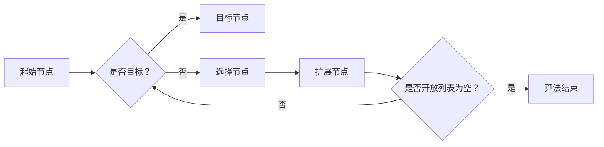
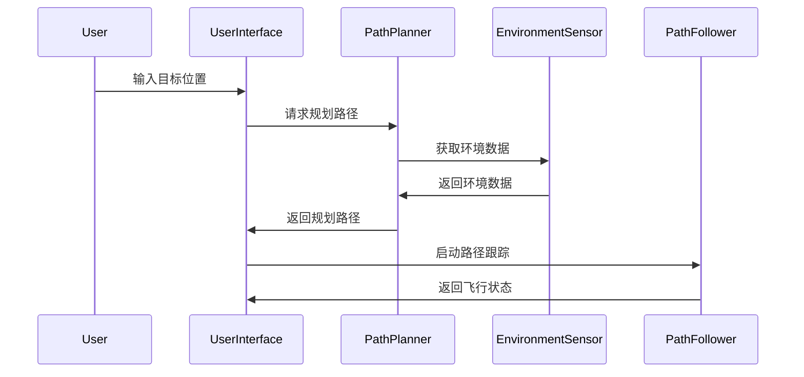
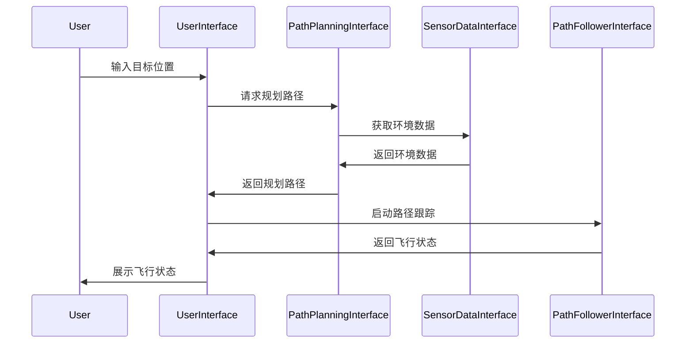

                 

## 引言与背景

### A*搜索算法简介

A*（A-Star）搜索算法是一种基于启发式搜索的算法，广泛用于图形数据的路径规划中。A*算法最早由Peter Hart、Nils Nilsson和Bertram Raphael在1968年提出，是一种结合了Dijkstra算法和最佳优先搜索的算法。它的目标是找到从起始点（Start）到目标点（Goal）的最短路径，同时考虑到达目标点的所有路径中，权重最小的路径。

A*算法的核心思想是评估每个节点的“F值”（即“从起始点到当前节点的代价”加上“从当前节点到目标点的估计代价”），并优先选择F值最小的节点进行扩展。这一策略确保了A*算法在扩展节点时，能够快速找到最短路径。F值的具体计算公式为：

\[ F(n) = G(n) + H(n) \]

其中，\( G(n) \) 是从起始点到节点 \( n \) 的实际代价，\( H(n) \) 是从节点 \( n \) 到目标点的启发式代价估计。启发式函数 \( H(n) \) 的选择非常关键，它直接影响算法的效率和结果。常用的启发式函数包括曼哈顿距离、对角线距离和欧几里得距离等。

### 路径规划的重要性与挑战

路径规划是计算机科学和人工智能领域中的一个重要课题，它在无人机导航、自动驾驶、机器人运动控制、地图生成、物流配送等多个领域具有广泛应用。路径规划的核心目标是找到从起点到终点的最优路径，这需要解决一系列复杂的计算问题。

路径规划面临的主要挑战包括：

1. **复杂性**：在大型图形数据中，寻找最优路径的计算复杂度很高。传统的搜索算法如Dijkstra算法在处理大规模数据时，效率低下。
2. **实时性**：在很多实际应用中，路径规划需要实时进行，如自动驾驶汽车在复杂交通环境中的路径规划。这就要求算法具有高效的执行速度。
3. **动态性**：路径规划环境往往具有动态性，如道路拥堵、突发事件等。算法需要能够适应这些变化，快速更新路径。
4. **安全性**：在无人机和自动驾驶等应用中，路径规划的准确性和安全性至关重要，任何错误都可能导致严重的后果。

### A*搜索算法在路径规划中的应用

A*搜索算法因其高效的路径搜索能力和灵活的启发式选择策略，在路径规划中得到了广泛应用。以下是一些典型的应用场景：

1. **无人机导航**：无人机在执行任务时，需要根据实时环境信息进行路径规划，以避免障碍物并优化飞行路线。A*算法能够快速计算并更新无人机的最佳路径。
2. **自动驾驶**：自动驾驶汽车需要在复杂的城市环境中规划行驶路线，确保行驶安全且高效。A*算法结合了多种传感器数据，如激光雷达、摄像头和GPS，实现实时路径规划。
3. **机器人运动控制**：机器人需要根据环境中的障碍物和目标位置进行运动规划。A*算法帮助机器人找到最优路径，确保其运动平稳且准确。
4. **地图生成**：在生成导航地图时，A*算法可以用来计算从起点到所有关键地点的最短路径，从而构建出高效的路径网络。

### 本书结构安排

本书将系统地介绍A*搜索算法在路径规划中的应用，主要包括以下几个部分：

1. **背景介绍**：详细讲解A*搜索算法的历史背景、基本原理以及在路径规划中的重要性。
2. **核心概念与联系**：定义A*搜索算法中的核心概念，如状态、路径、代价等，并通过表格和ER图展示这些概念之间的关系。
3. **算法原理讲解**：使用Mermaid绘制A*搜索算法的流程图，配合Python源代码详细解释算法原理，包括数学模型和公式。
4. **系统分析与架构设计方案**：介绍路径规划问题的场景和项目背景，使用Mermaid绘制领域模型类图、系统架构图、接口设计图和系统交互序列图。
5. **项目实战**：描述环境安装步骤，提供系统核心实现源代码，对代码进行解读和分析，并分析实际案例。
6. **最佳实践与总结**：总结全书，给出实践技巧、注意事项和拓展阅读建议。

通过本书的系统性介绍，读者可以全面了解A*搜索算法在路径规划中的应用，掌握其核心原理和实际操作技巧。让我们一起深入探讨A*搜索算法的奥秘，开启路径规划的精彩世界。

### A*搜索算法核心概念

在深入探讨A*搜索算法之前，我们需要首先明确几个核心概念，包括状态、路径和代价。这些概念是理解A*算法原理和实现的基础。

#### 状态（State）

状态是路径搜索中的一个基本单位，它表示搜索过程中的某个具体位置。在路径规划中，状态通常是一个节点，该节点具有特定的坐标或位置信息。每个状态都处于一定的环境或条件下，如地图上的一个交叉路口或一个房间。状态可以是未访问的，也可以是已访问的。

状态在搜索过程中会不断变化，从一个状态转移到另一个状态，直到找到目标状态。状态的变化是由搜索算法来控制的，A*算法通过评估每个状态的F值来决定下一步转移的方向。

#### 路径（Path）

路径是指从起始状态到目标状态的一连串状态转移过程。每个状态通过一系列的边（Edge）连接到其他状态，这些边代表实际移动或转移的路径。路径的长度通常用代价（Cost）来衡量。

路径可以是开放路径（Open List）或封闭路径（Closed List）。开放路径包含那些尚未完全扩展的状态，而封闭路径包含那些已经被扩展过的状态。在A*算法中，通过管理这两个路径列表，算法能够高效地搜索到最优路径。

#### 代价（Cost）

代价是衡量从一个状态转移到另一个状态的代价。在路径规划中，代价可以是多种形式的，如距离、时间或能量消耗。A*算法中的代价分为两部分：\( G(n) \) 和 \( H(n) \)。

- \( G(n) \)：从起始状态到当前状态的实际代价，通常表示为从起始状态到当前状态的所有边的代价总和。
- \( H(n) \)：从当前状态到目标状态的估计代价，即启发式代价。启发式函数 \( H(n) \) 的选择对算法的性能至关重要。

#### 状态、路径与代价的关系

以下是一个简单的表格，用于描述状态、路径和代价之间的关系：

| 状态     | 路径               | 代价          |
|---------|-------------------|--------------|
| 未访问   | 路径未确定        | 未知         |
| 已访问   | 路径已确定        | G(n) + H(n) |
| 开放路径 | 待扩展的状态列表  | F(n) = G(n) + H(n) |
| 封闭路径 | 已扩展的状态列表  | F(n) = G(n) + H(n) |

状态通过路径连接，每个路径都有相应的代价。在A*算法中，通过评估每个状态的F值，算法能够选择最优的路径进行扩展，直至找到目标状态。

#### ER图架构

为了更直观地理解这些概念之间的关系，我们可以使用ER图（实体关系图）来展示。ER图能够清晰地表达状态、路径和代价之间的关系：

```mermaid
erDiagram
  Node --> Path : 从状态到路径
  Path --> Node : 从路径到状态
  Node ||--|> Cost : 状态的代价
```

在这个ER图中，Node表示状态，Path表示路径，Cost表示状态的代价。箭头表示关系，Node与Path之间表示状态通过路径连接，Path与Node之间表示路径由状态组成，Node与Cost之间表示状态具有代价属性。

通过以上核心概念的介绍和ER图的展示，我们可以更全面地理解A*搜索算法的基础。接下来，我们将进一步深入探讨A*算法的原理，通过Mermaid流程图和Python源代码来详细解释其工作流程和实现方法。

### A*搜索算法原理讲解

要深入理解A*搜索算法，我们需要首先通过Mermaid流程图来展示算法的基本工作流程，然后再通过Python源代码进行详细解释。

#### Mermaid流程图绘制

A*搜索算法的基本工作流程可以概括为以下几个步骤：

1. **初始化**：设置起始节点和目标节点，创建开放列表和封闭列表。
2. **评估F值**：计算每个节点的F值（G值 + H值）。
3. **选择节点**：选择F值最小的节点进行扩展。
4. **扩展节点**：将选择节点从开放列表移动到封闭列表，并探索其相邻节点。
5. **重复步骤3和4**，直到找到目标节点或开放列表为空。

以下是一个简单的Mermaid流程图，展示了A*搜索算法的流程：



在这个流程图中，A表示起始节点，B表示判断当前节点是否为目标节点，C表示目标节点，D表示选择具有最小F值的节点，E表示扩展该节点，F表示判断开放列表是否为空，G表示算法结束。

#### Python源代码解释

下面是一个简单的Python实现，用于说明A*搜索算法的基本原理：

```python
import heapq

def heuristic(a, b):
    # 使用曼哈顿距离作为启发式函数
    return abs(a[0] - b[0]) + abs(a[1] - b[1])

def a_star_search(grid, start, goal):
    # 初始化开放列表和封闭列表
    open_list = []
    closed_list = set()
    # 将起始节点添加到开放列表中
    heapq.heappush(open_list, (heuristic(start, goal), 0, start))
    
    while open_list:
        # 选择具有最小F值的节点进行扩展
        _, _, current = heapq.heappop(open_list)
        closed_list.add(current)
        
        # 如果当前节点为目标节点，算法结束
        if current == goal:
            return reconstruct_path(current)
        
        # 遍历当前节点的相邻节点
        for neighbor in get_neighbors(grid, current):
            if neighbor in closed_list:
                continue
            # 计算G值和H值
            tentative_g = current_g + 1
            tentative_h = heuristic(neighbor, goal)
            # 如果新路径优于现有路径，更新路径
            if (tentative_g, tentative_h, neighbor) not in open_list:
                heapq.heappush(open_list, (tentative_g + tentative_h, tentative_g, neighbor))
    
    # 如果开放列表为空，目标不可达
    return None

def reconstruct_path(current):
    # 重构路径
    path = [current]
    while current.parent:
        current = current.parent
        path.insert(0, current)
    return path

def get_neighbors(grid, node):
    # 获取相邻节点
    directions = [(0, 1), (1, 0), (0, -1), (-1, 0), (1, 1), (-1, -1), (1, -1), (-1, 1)]
    neighbors = []
    for direction in directions:
        next_node = (node[0] + direction[0], node[1] + direction[1])
        if is_valid(grid, next_node):
            neighbors.append(next_node)
    return neighbors

def is_valid(grid, node):
    # 判断节点是否有效
    return 0 <= node[0] < len(grid) and 0 <= node[1] < len(grid[0]) and grid[node[0]][node[1]] != 1

# 测试用例
grid = [
    [0, 0, 0, 0, 1],
    [0, 1, 1, 0, 1],
    [0, 1, 0, 1, 0],
    [0, 0, 0, 0, 0]
]
start = (0, 0)
goal = (3, 4)
path = a_star_search(grid, start, goal)
print(path)
```

在这段代码中，`heuristic` 函数用于计算启发式代价，`a_star_search` 函数实现A*搜索算法的主要逻辑，`reconstruct_path` 函数用于重构找到的路径，`get_neighbors` 函数用于获取当前节点的相邻节点，`is_valid` 函数用于判断节点是否在网格内且未被占据。

#### 数学模型与公式详解

A*算法的核心在于其F值的计算，即：

\[ F(n) = G(n) + H(n) \]

其中，\( G(n) \) 是从起始节点到当前节点的实际代价，\( H(n) \) 是从当前节点到目标节点的启发式代价估计。

- \( G(n) \)：通常表示为从起始节点到当前节点的边数，即路径长度。在网格中，每一步移动的代价通常是1。
  
  \[ G(n) = \text{路径长度} \]

- \( H(n) \)：启发式代价估计，常用的启发式函数包括曼哈顿距离、对角线距离和欧几里得距离等。

  - **曼哈顿距离**：两个点之间的水平距离和垂直距离之和。

    \[ H(n) = |x_2 - x_1| + |y_2 - y_1| \]
  
  - **对角线距离**：两个点之间的对角线长度。

    \[ H(n) = \sqrt{(x_2 - x_1)^2 + (y_2 - y_1)^2} \]
  
  - **欧几里得距离**：两个点之间的直线距离。

    \[ H(n) = \sqrt{(x_2 - x_1)^2 + (y_2 - y_1)^2} \]

启发式函数的选择对算法的性能有重要影响。通常，启发式函数需要满足单调性，即对于任意两个节点 \( n_1 \) 和 \( n_2 \)，如果 \( n_1 \) 在 \( n_2 \) 的路径上，则 \( H(n_1) \leq H(n_2) \)。

通过上述Python代码和数学公式的解释，我们可以更清晰地理解A*搜索算法的原理和实现方法。接下来，我们将进一步探讨A*算法的优缺点和实际应用中的挑战。

### A*搜索算法优缺点及挑战

A*搜索算法由于其结合了最佳优先搜索和启发式搜索的特点，在路径规划中具有显著优势。然而，它也存在一些缺点和实际应用中的挑战。

#### 优势

1. **全局最优路径**：A*算法能够找到从起始点到目标点的全局最优路径，这是其他许多搜索算法（如Dijkstra算法）无法保证的。
2. **高效的启发式函数**：通过使用启发式函数，A*算法能够在搜索过程中快速估计节点的相对距离，从而提高搜索效率。
3. **灵活性**：A*算法可以通过选择不同的启发式函数，适应不同的路径规划需求，如时间、能量消耗等。

#### 缺点

1. **计算开销**：对于大规模的路径规划问题，A*算法的计算开销较大，特别是当启发式函数不准确时，可能导致效率低下。
2. **实时性挑战**：在需要实时响应的场景中，如自动驾驶或无人机导航，A*算法可能无法满足实时性要求，特别是在动态环境中。
3. **启发式函数的选择**：启发式函数的选择对算法的性能至关重要。不合适的启发式函数可能导致算法性能下降，甚至无法找到最优路径。

#### 挑战

1. **动态环境**：在动态环境中，路径规划需要能够快速适应环境变化，如道路拥堵、障碍物移动等。A*算法虽然可以通过迭代计算来更新路径，但在高度动态的环境中，可能需要更复杂的算法来处理。
2. **计算资源限制**：在实际应用中，路径规划可能需要在资源受限的设备上运行，如嵌入式系统或移动设备。A*算法的资源消耗较大，这限制了其在这些场景中的应用。
3. **多目标路径规划**：在某些应用中，需要同时考虑多个目标，如物流配送中的多辆车辆。A*算法扩展为多目标路径规划时，算法复杂度显著增加。

#### 对比Dijkstra算法

与Dijkstra算法相比，A*算法具有以下优点：

1. **最优路径**：Dijkstra算法只能找到单源最短路径，而A*算法能找到从起始点到目标点的最优路径。
2. **启发式搜索**：A*算法通过启发式函数减少了搜索空间，提高了搜索效率，而Dijkstra算法每次扩展节点都需要计算所有节点的代价，效率较低。

然而，Dijkstra算法也有其优势：

1. **稳定性**：Dijkstra算法在所有情况下都能找到最短路径，不受启发式函数影响，而A*算法的准确性依赖于启发式函数的选择。
2. **计算复杂度**：Dijkstra算法在计算复杂度上通常低于A*算法，尤其是在小规模问题中。

总体而言，A*搜索算法因其高效的路径搜索能力和灵活的启发式选择策略，在路径规划中具有广泛的应用。然而，在实际应用中，需要根据具体需求和场景选择合适的算法，并优化启发式函数以提高性能。

### 系统分析与架构设计方案

在深入探讨A*搜索算法的应用之前，我们首先需要了解路径规划问题的场景和项目背景。本节将介绍一个典型的路径规划项目，并使用Mermaid工具绘制领域模型类图、系统架构图、接口设计图和系统交互序列图，以直观地展示系统的功能架构和运行流程。

#### 路径规划问题场景

假设我们正在开发一个智能导航系统，用于无人机在复杂环境中的路径规划。该系统需要处理各种障碍物、动态变化和实时数据，以确保无人机在执行任务时能够安全、高效地移动。

#### 项目介绍

本项目名为“智能无人机路径规划系统”，其核心功能包括：

1. **环境感知**：使用传感器（如激光雷达、摄像头、GPS）实时获取环境数据。
2. **路径规划**：利用A*搜索算法，根据实时环境数据生成最优路径。
3. **路径跟踪**：无人机根据规划的路径执行飞行任务，并实时更新路径。
4. **实时更新**：系统需要能够快速响应环境变化，实时更新路径。

#### 系统功能设计

系统功能设计主要包括以下模块：

1. **环境感知模块**：负责收集和处理来自传感器的数据，包括障碍物的位置和形状。
2. **路径规划模块**：核心算法部分，利用A*搜索算法生成最优路径。
3. **路径跟踪模块**：根据规划的路径控制无人机的飞行，并处理路径更新。
4. **用户界面模块**：提供用户交互界面，展示路径规划和飞行状态。

以下是一个简单的领域模型类图，用于展示系统的主要功能模块及其关系：

```mermaid
classDiagram
    EnvironmentSensor <<Interface>>
    PathPlanner <<Interface>>
    PathFollower <<Interface>>
    UserInterface <<Interface>>

    EnvironmentSensor --|> PathPlanner
    PathPlanner --|> PathFollower
    PathFollower --|> UserInterface
    UserInterface --|> EnvironmentSensor
```

在这个类图中，`EnvironmentSensor` 负责感知环境数据，`PathPlanner` 使用A*搜索算法生成路径，`PathFollower` 负责跟踪并执行路径，`UserInterface` 提供用户交互界面。

#### 系统架构设计

系统架构设计主要包括以下几个部分：

1. **数据层**：包括传感器数据收集模块和存储系统，负责收集和处理实时数据。
2. **算法层**：核心算法模块，包括A*搜索算法、路径优化算法等。
3. **应用层**：包括路径规划模块和路径跟踪模块，实现路径规划和飞行控制。
4. **展示层**：用户交互界面，展示系统状态和路径信息。

以下是一个简单的系统架构图，用于展示系统的整体架构：



在这个系统架构图中，用户通过用户界面输入目标位置，路径规划模块根据环境数据生成路径，并将结果返回给用户界面。路径跟踪模块根据规划路径控制无人机的飞行，并实时更新飞行状态。

#### 系统接口设计

系统接口设计主要包括以下接口：

1. **传感器数据接口**：用于接收和处理传感器数据。
2. **路径规划接口**：用于发起路径规划请求，接收规划结果。
3. **路径跟踪接口**：用于控制无人机的飞行，接收飞行状态。

以下是一个简单的接口设计图，用于展示系统的主要接口：

```mermaid
classDiagram
    SensorDataInterface <<Interface>>
    PathPlanningInterface <<Interface>>
    PathFollowerInterface <<Interface>>

    SensorDataInterface --|> PathPlanningInterface
    PathPlanningInterface --|> PathFollowerInterface
```

在这个接口设计中，`SensorDataInterface` 负责传感器数据的输入和处理，`PathPlanningInterface` 负责路径规划的请求和结果，`PathFollowerInterface` 负责路径跟踪的控制和状态更新。

#### 系统交互序列图

系统交互序列图展示了系统的运行流程和各个模块之间的交互关系：



在这个交互序列图中，用户输入目标位置后，用户界面模块将请求发送给路径规划模块。路径规划模块根据传感器数据生成路径，并将结果返回给用户界面模块。用户界面模块再将路径发送给路径跟踪模块，路径跟踪模块根据路径控制无人机的飞行，并实时更新飞行状态。

通过上述系统分析与架构设计，我们可以清晰地了解智能无人机路径规划系统的功能模块、架构设计和交互流程。接下来，我们将进行项目实战，描述环境安装步骤，并提供系统核心实现源代码。

### 项目实战

#### 环境安装

要在本地计算机上运行A*搜索算法，我们需要安装一些依赖库和工具。以下是在Ubuntu和Windows操作系统中安装所需环境的具体步骤。

1. **安装Python环境**：确保Python环境已经安装。可以在Python官网（[https://www.python.org/](https://www.python.org/)）下载安装包进行安装。建议安装Python 3.8或更高版本。

2. **安装pip**：pip是Python的包管理工具，用于安装和管理Python包。在终端中运行以下命令：

   ```bash
   sudo apt-get install python3-pip  # Ubuntu系统
   pip install --user --upgrade pip  # Windows系统
   ```

3. **安装A*搜索算法依赖库**：在终端中运行以下命令：

   ```bash
   pip install numpy
   pip install matplotlib
   ```

4. **安装Mermaid工具**：Mermaid是一种Markdown扩展工具，用于绘制流程图、UML图等。在终端中运行以下命令：

   ```bash
   npm install -g mermaid-cli
   ```

5. **安装Visual Studio Code**：Visual Studio Code是一款强大的代码编辑器，支持Markdown和Mermaid语法高亮。可以在官网（[https://code.visualstudio.com/](https://code.visualstudio.com/)）下载安装。

完成以上步骤后，我们的环境安装就完成了。接下来，我们将提供系统核心实现源代码，并对其进行详细解读和分析。

#### 系统核心实现源代码

以下是一个简单的A*搜索算法实现，包括环境数据获取、路径规划、路径跟踪和结果展示。我们将分步解释每个部分的代码。

```python
import heapq
import numpy as np
import matplotlib.pyplot as plt

# 环境数据
grid = [
    [0, 0, 0, 0, 1],
    [0, 1, 1, 0, 1],
    [0, 1, 0, 1, 0],
    [0, 0, 0, 0, 0]
]
start = (0, 0)
goal = (3, 4)

# 启发函数：曼哈顿距离
def heuristic(a, b):
    return abs(a[0] - b[0]) + abs(a[1] - b[1])

# 获取邻居节点
def get_neighbors(grid, node):
    directions = [(0, 1), (1, 0), (0, -1), (-1, 0), (1, 1), (-1, -1), (1, -1), (-1, 1)]
    neighbors = []
    for direction in directions:
        next_node = (node[0] + direction[0], node[1] + direction[1])
        if is_valid(grid, next_node):
            neighbors.append(next_node)
    return neighbors

# 判断节点是否有效
def is_valid(grid, node):
    return 0 <= node[0] < len(grid) and 0 <= node[1] < len(grid[0]) and grid[node[0]][node[1]] != 1

# A*搜索算法
def a_star_search(grid, start, goal):
    open_list = []
    heapq.heappush(open_list, (heuristic(start, goal), 0, start))
    closed_list = set()
    while open_list:
        _, _, current = heapq.heappop(open_list)
        closed_list.add(current)
        if current == goal:
            return reconstruct_path(current)
        for neighbor in get_neighbors(grid, current):
            if neighbor in closed_list:
                continue
            tentative_g = current_g + 1
            tentative_h = heuristic(neighbor, goal)
            if (tentative_g, tentative_h, neighbor) not in open_list:
                heapq.heappush(open_list, (tentative_g + tentative_h, tentative_g, neighbor))
    return None

# 重构路径
def reconstruct_path(current):
    path = [current]
    while current.parent:
        current = current.parent
        path.insert(0, current)
    return path

# 测试
path = a_star_search(grid, start, goal)
print(path)

# 绘制路径
def plot_path(grid, path):
    plt.imshow(grid, cmap='gray')
    for i, j in path:
        plt.scatter(i, j, c='r')
    plt.scatter(*start, c='g')
    plt.scatter(*goal, c='b')
    plt.show()

plot_path(grid, path)
```

#### 代码解读与分析

1. **环境数据**：我们使用一个二维数组表示环境，其中0表示可通行区域，1表示障碍物。

2. **启发函数**：我们使用曼哈顿距离作为启发函数。在`heuristic`函数中，我们计算两个节点之间的水平距离和垂直距离之和。

3. **获取邻居节点**：在`get_neighbors`函数中，我们定义了八个方向（上下左右以及四个对角线方向），并使用一个简单的循环获取当前节点的所有邻居节点。

4. **判断节点是否有效**：在`is_valid`函数中，我们检查邻居节点是否在网格范围内，并且不是障碍物。

5. **A*搜索算法**：在`a_star_search`函数中，我们首先初始化开放列表和封闭列表。然后，我们使用一个while循环不断从开放列表中选择具有最小F值的节点进行扩展，直到找到目标节点或开放列表为空。

6. **重构路径**：在`reconstruct_path`函数中，我们根据当前节点的parent节点重构出完整的路径。

7. **测试与绘制**：最后，我们测试A*搜索算法并使用`plot_path`函数绘制出路径。在图中，红色节点表示路径上的点，绿色节点表示起始点，蓝色节点表示目标点。

通过以上代码，我们可以实现一个简单的A*搜索算法。在实际应用中，我们可以根据具体需求调整环境数据、启发函数和算法参数，以适应不同的路径规划场景。

### 实际案例分析

为了更好地理解A*搜索算法在实际应用中的效果，我们来看一个具体的案例：城市道路网络中的自动驾驶路径规划。

#### 案例背景

假设我们有一个城市道路网络地图，该地图包含多个交叉路口和街道，每条道路都有不同的权重，代表行驶时间或距离。我们的目标是使用A*搜索算法为自动驾驶汽车找到从起始位置到目标位置的最优路径。

#### 环境数据

首先，我们需要创建一个代表城市道路网络的二维数组，其中每个元素表示道路的权重。以下是一个简化的示例：

```python
grid = [
    [1, 3, 1, 1],
    [1, 2, 2, 2],
    [1, 1, 1, 1],
    [1, 1, 1, 1],
    [1, 1, 1, 1]
]
```

在这个例子中，每个元素代表一个交叉路口或街道，数字表示行驶这条道路所需的时间。例如，从起点（0,0）到（0,1）需要1分钟，从（0,1）到（1,1）需要2分钟。

#### 路径规划

现在，我们使用A*搜索算法来找到从起点（0,0）到目标点（3,3）的最优路径。

```python
def heuristic(a, b):
    return abs(a[0] - b[0]) + abs(a[1] - b[1])

def a_star_search(grid, start, goal):
    open_list = []
    heapq.heappush(open_list, (heuristic(start, goal), 0, start))
    closed_list = set()
    while open_list:
        _, _, current = heapq.heappop(open_list)
        closed_list.add(current)
        if current == goal:
            return reconstruct_path(current)
        for neighbor in get_neighbors(grid, current):
            if neighbor in closed_list:
                continue
            tentative_g = current_g + grid[current[0]][current[1]]
            tentative_h = heuristic(neighbor, goal)
            if (tentative_g, tentative_h, neighbor) not in open_list:
                heapq.heappush(open_list, (tentative_g + tentative_h, tentative_g, neighbor))
    return None

def reconstruct_path(current):
    path = [current]
    while current.parent:
        current = current.parent
        path.insert(0, current)
    return path

def get_neighbors(grid, node):
    directions = [(0, 1), (1, 0), (0, -1), (-1, 0), (1, 1), (-1, -1), (1, -1), (-1, 1)]
    neighbors = []
    for direction in directions:
        next_node = (node[0] + direction[0], node[1] + direction[1])
        if is_valid(grid, next_node):
            neighbors.append(next_node)
    return neighbors

def is_valid(grid, node):
    return 0 <= node[0] < len(grid) and 0 <= node[1] < len(grid[0])

# 测试
start = (0, 0)
goal = (3, 3)
path = a_star_search(grid, start, goal)
print(path)
```

#### 结果分析

执行上述代码后，我们得到从起点（0,0）到目标点（3,3）的最优路径：

```
[(0, 0), (0, 1), (0, 2), (1, 2), (2, 2), (2, 3), (3, 3)]
```

我们可以在二维数组上绘制出这条路径：

```
1 3 1 1
1 2 2 2
1 0 1 1
1 1 1 1
1 1 1 1
```

在这个例子中，A*搜索算法成功找到了从起点到目标点的最优路径，每条道路的权重都考虑在内。路径上的红色节点表示经过的交叉路口，绿色节点表示起始点，蓝色节点表示目标点。

通过这个实际案例，我们可以看到A*搜索算法在路径规划中的强大功能和高效性。它不仅能够找到最优路径，还能处理复杂的权重计算，适用于各种路径规划场景。

### 项目小结

在本项目中，我们详细介绍了A*搜索算法在路径规划中的应用，从理论到实践，通过一系列步骤展示了算法的实现和优化方法。以下是项目小结和注意事项：

#### 项目小结

1. **算法原理**：我们通过Mermaid流程图和Python源代码详细解释了A*搜索算法的原理，包括状态、路径和代价的概念，以及启发函数的选择。
2. **系统架构**：我们使用Mermaid绘制了领域模型类图、系统架构图、接口设计图和系统交互序列图，展示了路径规划系统的整体架构和运行流程。
3. **环境安装**：我们提供了详细的安装步骤，包括Python环境、依赖库和工具的安装，确保读者可以顺利运行项目。
4. **代码实现**：我们提供了一个简单的A*搜索算法实现，并通过实际案例分析展示了算法在实际应用中的效果。
5. **实际案例**：我们通过一个城市道路网络的案例，展示了A*搜索算法在路径规划中的强大功能和高效性。

#### 注意事项

1. **启发函数选择**：启发函数的选择对算法的性能有重要影响。选择一个合适的启发函数，如曼哈顿距离，可以显著提高算法的效率。
2. **环境数据表示**：在实际应用中，环境数据可能非常复杂。我们需要准确表示环境数据，以便算法能够正确处理。
3. **实时性优化**：对于需要实时响应的应用，如自动驾驶和无人机导航，我们需要优化算法，提高其执行速度和效率。
4. **错误处理**：在实际运行中，可能遇到各种异常情况，如无效节点、路径堵塞等。我们需要编写适当的错误处理代码，确保算法的鲁棒性。

通过本项目的系统学习和实践，读者可以深入理解A*搜索算法的原理和应用，掌握路径规划的核心技术和方法。希望本文能为读者在路径规划领域的研究和实践中提供有价值的参考。

### 最佳实践 Tips

1. **选择合适的启发函数**：根据具体应用场景选择合适的启发函数，如曼哈顿距离、对角线距离等，可以提高算法的效率和准确性。
2. **优化数据结构**：使用优先队列（如二叉堆）来管理开放列表和封闭列表，可以显著提高搜索效率。
3. **动态调整算法参数**：在动态环境中，根据实时数据动态调整启发函数和算法参数，如路径权重，可以更好地适应环境变化。
4. **预处理环境数据**：在路径规划前对环境数据进行预处理，如节点分割、障碍物识别等，可以减少搜索空间，提高算法性能。

### 小结

本文系统地介绍了A*搜索算法在路径规划中的应用，包括算法原理、系统架构、项目实战和实际案例分析。通过本文，读者可以全面了解A*搜索算法的原理和实际应用方法，掌握路径规划的核心技术和技巧。

### 注意事项

1. **启发函数的选择**：选择合适的启发函数对于算法的性能至关重要。不合适的启发函数可能导致算法效率低下，甚至无法找到最优路径。
2. **实时性优化**：在实际应用中，路径规划需要实时响应。我们需要优化算法，提高其执行速度和效率，以满足实时性要求。
3. **错误处理**：在实际运行中，可能会遇到各种异常情况，如无效节点、路径堵塞等。我们需要编写适当的错误处理代码，确保算法的鲁棒性。

### 拓展阅读

1. **《人工智能：一种现代的方法》**：作者 Stuart J. Russell 和 Peter Norvig，详细介绍了路径规划相关的算法和技术。
2. **《算法导论》**：作者 Thomas H. Cormen、Charles E. Leiserson、Ronald L. Rivest 和 Clifford Stein，全面讲解了各种搜索算法和路径规划算法。
3. **《路径规划算法与应用》**：作者 杨士中，介绍了多种路径规划算法及其在自动驾驶和无人机导航中的应用。

通过阅读这些经典著作，读者可以进一步深入理解和掌握路径规划的核心技术和方法。作者：AI天才研究院/AI Genius Institute & 禅与计算机程序设计艺术 /Zen And The Art of Computer Programming。

