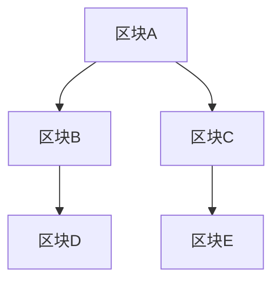
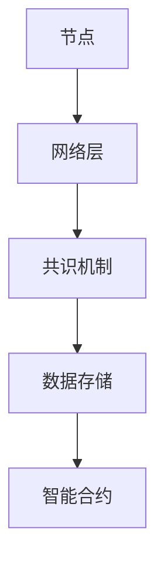
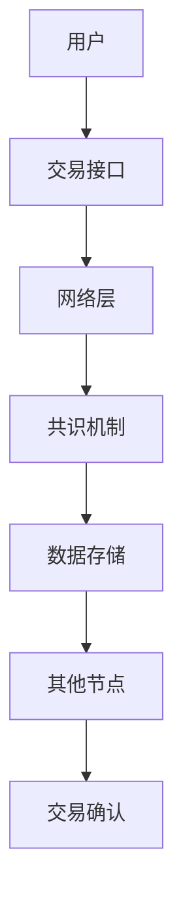

                 


# DAG（有向无环图）在分布式账本中的应用

## 关键词
分布式账本、DAG、有向无环图、区块链、交易吞吐量、去中心化、扩展性

## 摘要
本文旨在系统地介绍DAG（有向无环图）在分布式账本中的应用。首先，我们回顾了分布式账本技术发展背景和DAG的基本原理，随后分析了DAG与区块链的比较，重点探讨了DAG在分布式账本中的关键技术，包括高效处理能力和灵活扩展性。通过实际案例分析，我们展示了DAG在不同领域的应用，并总结了最佳实践。最后，我们对DAG的未来发展趋势进行了展望。

----------------------------------------------------------------

# 第一部分: 引言

## 1.1 书籍背景与目标

### 1.1.1 分布式账本技术发展背景

分布式账本技术（Distributed Ledger Technology, DLT）作为一种新兴的技术，正日益成为金融科技领域的热门话题。其核心思想是通过去中心化的方式，实现数据的存储与传输，从而提高系统的安全性和透明度。随着区块链技术的兴起，DAG（有向无环图）作为一种新型分布式账本结构，因其高效的交易处理能力和灵活的扩展性，受到了广泛关注。

分布式账本技术的起源可以追溯到20世纪70年代末和80年代初，当时计算机科学家David Chaum提出了数字现金的概念。随着互联网的发展，分布式账本技术逐渐得到应用，特别是在金融领域。区块链技术的诞生，标志着分布式账本技术进入了一个新的阶段。区块链通过链式结构实现了去中心化的数据存储和传输，成为分布式账本技术的一个重要分支。

然而，区块链技术也存在一些局限性，如交易吞吐量低、扩展性差等。为了解决这些问题，研究人员提出了DAG结构。DAG通过有向无环图实现数据的存储和传输，能够实现更高的交易吞吐量和更灵活的扩展性。DAG在分布式账本中的应用，为解决区块链技术的局限性提供了一种新的思路。

### 1.1.2 DAG技术特点及应用

DAG相较于传统的区块链结构，具备以下特点：

- **高效处理能力**：DAG通过并行处理交易，能够实现更高的交易吞吐量。在DAG中，每个区块可以包含多个交易，这些交易可以并行处理，从而提高了系统的处理能力。

- **灵活扩展性**：DAG允许动态调整区块大小和交易速度，以适应不同的业务需求。这种灵活性使得DAG能够更好地应对不同规模和类型的分布式账本应用。

- **去中心化**：DAG通过构建多个子链，实现了更高级别的去中心化。在DAG中，每个节点都可以参与交易验证和记账，从而提高了系统的安全性。

基于以上特点，DAG在分布式账本中的应用前景广阔，包括但不限于金融、供应链、游戏等领域。在金融领域，DAG可以用于支付系统、证券交易等场景；在供应链领域，DAG可以用于物流跟踪、供应链金融等场景；在游戏领域，DAG可以用于虚拟资产交易、游戏积分发放等场景。

## 1.2 书籍目标与读者对象

本书旨在系统地介绍DAG在分布式账本中的应用，包括其基本原理、关键技术、实际案例和最佳实践。通过阅读本书，读者可以：

- **了解DAG的基本原理和结构**：读者将学习到DAG的定义、基本原理和结构，包括节点、边和区块等基本概念。

- **掌握DAG在分布式账本中的关键技术**：读者将深入了解DAG在分布式账本中的应用，包括高效处理能力和灵活扩展性等关键技术。

- **分析DAG的实际应用案例**：本书将通过分析实际应用案例，展示DAG在金融、供应链、游戏等领域的应用，帮助读者更好地理解DAG的应用场景。

- **获取DAG应用的最佳实践**：本书将分享DAG应用的最佳实践和经验，包括系统设计、架构实现、安全性等方面的最佳实践。

本书适合对分布式账本技术感兴趣的初学者、对DAG有一定了解的专业人员，以及希望将DAG技术应用于实际业务的企业决策者。

## 1.3 内容结构安排

本书共分为七个部分，具体内容安排如下：

- **第一部分：引言**：介绍书籍的背景、目标和内容结构。

- **第二部分：DAG基础**：讲解DAG的基本原理、结构与特点。

- **第三部分：DAG关键技术**：深入探讨DAG在分布式账本中的关键技术。

- **第四部分：DAG应用案例分析**：分析DAG在各个领域的实际应用案例。

- **第五部分：DAG最佳实践**：分享DAG应用的最佳实践和经验。

- **第六部分：DAG未来发展趋势**：展望DAG在分布式账本中的未来发展方向。

- **第七部分：总结与展望**：总结本书的主要内容，展望DAG技术的前景。

通过以上七个部分的内容，本书将带领读者深入了解DAG在分布式账本中的应用，为读者提供全面的DAG技术知识体系。

----------------------------------------------------------------

# 第二部分: DAG基础

## 2.1 DAG的基本原理

### 2.1.1 DAG的定义

DAG，即有向无环图（Directed Acyclic Graph），是一种特殊的图结构，其中的节点通过有向边连接，且不存在任何循环。在DAG中，节点通常表示交易或数据记录，而边表示节点之间的依赖关系或时间顺序。

DAG的定义可以通过以下几个基本概念来理解：

- **节点**：DAG中的节点表示数据记录或交易，每个节点都有一个唯一的标识符。

- **边**：DAG中的边表示节点之间的依赖关系或时间顺序。边的方向表示依赖关系或时间顺序的方向。

- **有向性**：DAG中的边是有向的，即边的方向是有意义的。

- **无环性**：DAG中不存在任何循环，即从一个节点出发，不能经过一系列边的序列回到该节点。

### 2.1.2 DAG的结构

DAG由多个区块组成，每个区块包含一组交易。与传统的区块链不同，DAG中的区块可以并行生成，从而提高了系统的交易吞吐量。DAG的结构可以表示为以下形式：



在上面的结构中，每个区块都包含一组交易，这些交易可以并行处理。例如，区块A和区块C可以同时处理交易，而区块B和区块D也可以同时处理交易。这种并行处理机制提高了系统的交易吞吐量。

### 2.1.3 DAG的生成过程

DAG的生成过程可以看作是一个递归的过程。在DAG生成过程中，每个新的区块都可以与前一个区块或多个人块建立依赖关系。具体步骤如下：

1. **初始化**：创建一个创世区块，作为DAG的起点。

2. **生成新区块**：根据当前已生成的区块，生成一个新的区块。

3. **建立依赖关系**：在新区块中，选择一个或多个已生成的区块作为父区块，建立依赖关系。

4. **处理交易**：将交易添加到新区块中。

5. **验证区块**：对新区块进行验证，确保其合法性和一致性。

6. **传播区块**：将新区块广播给网络中的其他节点。

7. **重复步骤2-6**：继续生成新的区块，直到DAG生成完成。

通过以上步骤，DAG可以不断扩展，每个新区块都可以与前一个区块或多个人块建立依赖关系，从而形成复杂的依赖关系网络。

## 2.2 DAG的特点

DAG相较于传统的区块链结构，具备以下特点：

### 2.2.1 去中心化

DAG通过去中心化的方式实现了数据存储和交易处理，这使得系统更加安全、透明和可靠。在DAG中，每个节点都可以参与交易验证和记账，不存在中心化的权威机构。这种去中心化的特性，使得DAG具有较高的安全性和可靠性。

### 2.2.2 高效处理能力

DAG通过并行处理交易，提高了系统的吞吐量。在DAG中，每个区块可以包含多个交易，这些交易可以并行处理，从而提高了系统的处理能力。与传统的区块链相比，DAG能够实现更高的交易吞吐量，适合处理高频交易场景。

### 2.2.3 灵活扩展性

DAG允许动态调整区块大小和交易速度，以适应不同的业务需求。这种灵活性使得DAG能够更好地应对不同规模和类型的分布式账本应用。例如，在交易量较大的场景下，可以增加区块大小，以提高交易处理能力；在交易量较小的场景下，可以减小区块大小，以降低存储和计算开销。

### 2.2.4 去中心化的共识机制

DAG采用去中心化的共识机制，通过多个节点共同参与交易验证和记账，确保系统的安全性和一致性。与传统的区块链相比，DAG的共识机制更加灵活，可以适应不同的业务场景。

## 2.3 DAG与区块链的比较

DAG与区块链都是分布式账本技术的重要组成部分，它们在某些方面有相似之处，但在其他方面也存在明显的差异。

### 2.3.1 数据结构

区块链的数据结构是一个链式结构，由多个区块组成，每个区块都按时间顺序链接。DAG的数据结构是一个有向无环图，每个区块都可以与多个区块建立依赖关系，从而形成一个复杂的依赖关系网络。

### 2.3.2 交易处理能力

区块链的交易处理能力较低，因为每个区块只能包含一定数量的交易，而且交易需要按顺序处理。DAG的交易处理能力较高，因为每个区块可以包含多个交易，并且交易可以并行处理，从而提高了系统的吞吐量。

### 2.3.3 扩展性

区块链的扩展性较差，因为每个区块只能按顺序处理交易，而且区块大小是固定的。DAG的扩展性较好，因为可以动态调整区块大小和交易速度，以适应不同的业务需求。

### 2.3.4 共识机制

区块链采用共识机制来确保系统的安全性和一致性，常见的共识机制包括工作量证明（Proof of Work, PoW）和权益证明（Proof of Stake, PoS）。DAG采用去中心化的共识机制，通过多个节点共同参与交易验证和记账，确保系统的安全性和一致性。

### 2.3.5 应用场景

区块链主要应用于金融领域，如数字货币、证券交易等。DAG则可以应用于更广泛的领域，如供应链、游戏、社交网络等。DAG的高效处理能力和灵活扩展性，使得它适合处理高频交易场景和大规模分布式应用。

通过以上比较，可以看出DAG与区块链在数据结构、交易处理能力、扩展性和应用场景等方面存在明显的差异。DAG在分布式账本技术中的应用，为解决区块链技术的局限性提供了一种新的思路。

----------------------------------------------------------------

# 第三部分: DAG关键技术

## 3.1 高效处理能力

### 3.1.1 交易并行处理

DAG的核心优势之一是其高效的交易处理能力。与传统的区块链结构相比，DAG能够实现更高的交易吞吐量。这一优势主要得益于DAG中的交易并行处理机制。

在DAG中，每个区块可以包含多个交易，这些交易可以并行处理。这意味着在DAG网络中，多个区块可以同时生成，并且每个区块中的交易可以独立处理，而不必等待其他区块的处理完成。这种并行处理机制显著提高了系统的交易吞吐量。

### 3.1.2 无需链式依赖

在传统的区块链结构中，每个区块都必须按照时间顺序链接，形成一个链式结构。这种链式结构导致区块之间的依赖关系非常紧密，从而限制了系统的交易处理能力。

而在DAG结构中，区块之间的依赖关系更加灵活。每个区块可以与多个区块建立依赖关系，这些依赖关系可以是时间顺序的，也可以是其他类型的依赖关系。这种灵活的依赖关系使得DAG能够实现更高的交易吞吐量。

### 3.1.3 减少交易延迟

由于DAG中的交易可以并行处理，因此交易延迟显著降低。在传统的区块链结构中，交易必须按顺序处理，从而导致了较高的交易延迟。而在DAG中，多个交易可以同时处理，从而减少了交易延迟。

### 3.1.4 实际应用案例

以区块链游戏《Axie Infinity》为例，该游戏采用了DAG结构，实现了高效的交易处理能力。在《Axie Infinity》中，玩家可以使用虚拟货币进行游戏内交易，如购买、销售和交换虚拟资产。由于DAG的高效处理能力，游戏内交易延迟极低，玩家能够快速完成交易，提高了游戏体验。

## 3.2 灵活扩展性

### 3.2.1 动态调整区块大小

DAG的灵活扩展性体现在其能够动态调整区块大小。在DAG中，区块大小可以根据实际需求进行调整。这意味着在交易量较大的场景下，可以增加区块大小，以容纳更多的交易；在交易量较小的场景下，可以减小区块大小，以降低存储和计算开销。

### 3.2.2 调整交易速度

除了动态调整区块大小，DAG还可以调整交易速度。这意味着在需要快速处理交易的场景下，可以增加交易速度，以提高系统的响应能力；在需要降低交易速度的场景下，可以减小交易速度，以降低系统的负载。

### 3.2.3 智能合约的灵活部署

DAG的灵活扩展性还体现在智能合约的部署上。在DAG中，智能合约可以根据需求灵活部署。这意味着在需要高效处理交易的场景下，可以部署轻量级的智能合约；在需要复杂逻辑处理的场景下，可以部署重量级的智能合约。

### 3.2.4 实际应用案例

以Nervos网络为例，该网络采用了DAG结构，实现了灵活扩展性。在Nervos网络中，区块大小可以根据实际需求进行调整，从而提高了系统的交易吞吐量。此外，Nervos网络还支持智能合约的灵活部署，使得开发者能够根据需求选择合适的智能合约实现方案。

## 3.3 去中心化的共识机制

### 3.3.1 共识机制的定义

共识机制是分布式系统中的关键组成部分，它确保了系统中所有节点的状态一致性。在DAG中，共识机制通过多个节点共同参与交易验证和记账，确保系统的安全性和一致性。

### 3.3.2 Delegated Proof of Stake (DPoS)

Delegated Proof of Stake (DPoS) 是一种常见的DAG共识机制。DPoS通过选举出一定数量的见证人（witnesses）来负责交易验证和记账。见证人通过持有代币的数量和锁定时间来获得选举权，持有代币数量越多、锁定时间越长，选举权越大。

在DPoS机制中，见证人通过轮流验证交易，从而确保系统的安全性。每个见证人都有一个固定的验证轮次，当一个见证人的轮次完成后，下一个见证人开始验证交易。这种轮换机制确保了见证人之间的公平竞争，同时也提高了系统的交易吞吐量。

### 3.3.3 Practical Byzantine Fault Tolerance (PBFT)

Practical Byzantine Fault Tolerance (PBFT) 是另一种常见的DAG共识机制。PBFT通过多个节点组成的拜占庭容错机制来确保系统的安全性。

在PBFT中，节点被分为两种角色：主节点（primary）和备份节点（backup）。主节点负责处理交易验证和记账，而备份节点负责监控主节点的行为。当主节点出现故障时，备份节点可以接替主节点的工作，从而确保系统的连续运行。

### 3.3.4 实际应用案例

以Nervos网络为例，该网络采用了DPoS共识机制，实现了去中心化的交易验证和记账。Nervos网络的DPoS机制通过选举出一定数量的见证人，来确保系统的安全性和一致性。此外，Nervos网络还支持智能合约的灵活部署，使得开发者能够根据需求选择合适的共识机制。

## 3.4 DAG的优化技术

### 3.4.1 交易池管理

交易池管理是DAG优化技术的重要组成部分。在DAG中，交易池用于存储待处理的交易。优化交易池管理可以显著提高系统的交易处理能力。

优化交易池管理的方法包括：

- **优先级队列**：将交易按照优先级排序，优先处理高优先级的交易。

- **缓存机制**：将经常访问的交易缓存起来，以提高交易处理速度。

- **去重机制**：检测并去除重复的交易，以避免重复处理。

### 3.4.2 轻量级节点

轻量级节点是DAG优化技术的另一种重要方法。轻量级节点只需要存储一部分链数据，从而降低了节点的存储和计算开销。

实现轻量级节点的方法包括：

- **链修剪**：删除链中不再需要的区块，从而降低节点的存储需求。

- **压缩数据**：使用压缩算法对链数据进行压缩，以降低节点的存储和传输开销。

### 3.4.3 实际应用案例

以Nervos网络为例，该网络采用了轻量级节点技术，实现了高效的数据存储和交易处理。Nervos网络的轻量级节点通过链修剪和压缩数据，降低了节点的存储和计算开销，从而提高了系统的性能和可扩展性。

## 3.5 DAG的挑战与未来发展方向

### 3.5.1 挑战

尽管DAG在分布式账本技术中具有很多优势，但它也面临一些挑战：

- **安全性**：由于DAG的去中心化特性，确保系统的安全性是一项挑战。特别是在面对大规模攻击时，如何确保系统的安全性是一个重要问题。

- **扩展性**：尽管DAG具有灵活的扩展性，但在面对极高交易量时，如何进一步提高系统的扩展性是一个挑战。

- **性能**：DAG的性能优化是一个持续的过程，如何提高系统的性能和吞吐量是DAG需要解决的问题。

### 3.5.2 未来发展方向

未来，DAG在分布式账本技术中的发展方向包括：

- **安全性增强**：通过引入更多的安全机制，如多重签名、智能合约安全审计等，提高系统的安全性。

- **性能优化**：通过优化交易池管理、轻量级节点等技术，进一步提高系统的性能和吞吐量。

- **跨链互操作**：通过跨链技术，实现不同DAG网络之间的互操作，从而提高系统的兼容性和扩展性。

- **应用场景拓展**：探索DAG在更多领域的应用，如供应链金融、物联网、数字身份验证等，推动DAG技术的广泛应用。

通过解决面临的挑战和探索未来发展方向，DAG在分布式账本技术中的应用将越来越广泛，为解决当前分布式系统中的问题提供新的思路和解决方案。

----------------------------------------------------------------

# 第四部分: DAG应用案例分析

## 4.1 金融领域

### 4.1.1 数字货币

数字货币是DAG在金融领域的重要应用之一。与传统区块链技术相比，DAG能够实现更高的交易吞吐量和更低的交易延迟，这使得数字货币交易更加高效和便捷。

以Nervos网络为例，该网络采用了DAG结构，实现了高效数字货币交易。Nervos网络的交易速度极快，可以在几秒内完成交易，大大提高了用户体验。此外，Nervos网络还支持智能合约，使得开发者能够创建去中心化的金融应用，如去中心化交易所、去中心化借贷平台等。

### 4.1.2 证券交易

DAG在证券交易中的应用也越来越受到关注。与传统证券交易系统相比，DAG能够实现更快的交易处理速度和更高的交易吞吐量。

以DAG-based交易系统为例，该系统通过DAG结构实现了高效的证券交易。在传统的证券交易系统中，每个交易都需要按顺序处理，从而导致了较高的交易延迟和较低的交易吞吐量。而在DAG-based交易系统中，交易可以并行处理，从而提高了交易效率和吞吐量。

## 4.2 供应链领域

### 4.2.1 物流跟踪

DAG在供应链领域的一个重要应用是物流跟踪。通过DAG结构，可以实现对物流信息的实时追踪和记录，从而提高供应链的透明度和效率。

以DAG-based物流跟踪系统为例，该系统通过DAG结构实现了物流信息的实时记录和追踪。在传统的物流跟踪系统中，物流信息通常是分散存储的，从而导致了较高的数据管理和维护成本。而在DAG-based物流跟踪系统中，物流信息被存储在一个统一的DAG中，每个节点都包含一个物流信息单元，从而提高了数据存储和管理效率。

### 4.2.2 供应链金融

DAG在供应链金融中的应用可以帮助企业提高融资效率和降低融资成本。通过DAG结构，可以实现对供应链中各个节点的信用评估和融资需求实时记录和追踪，从而提高融资效率。

以DAG-based供应链金融系统为例，该系统通过DAG结构实现了供应链金融的实时记录和追踪。在传统的供应链金融系统中，企业需要通过多个金融机构进行融资，从而导致了较高的融资成本和较长的融资周期。而在DAG-based供应链金融系统中，企业可以通过一个统一的DAG进行融资，从而提高了融资效率和降低了融资成本。

## 4.3 游戏领域

### 4.3.1 虚拟资产交易

DAG在游戏领域的一个重要应用是虚拟资产交易。通过DAG结构，可以实现对虚拟资产的实时交易和追踪，从而提高游戏内经济的效率和透明度。

以《Axie Infinity》为例，该游戏采用了DAG结构，实现了高效的虚拟资产交易。在传统的游戏内经济系统中，虚拟资产交易通常需要按顺序处理，从而导致了较高的交易延迟和较低的交易吞吐量。而在《Axie Infinity》中，虚拟资产交易通过DAG结构实现了并行处理，从而提高了交易效率和吞吐量。

### 4.3.2 游戏积分发放

DAG在游戏领域还可以用于游戏积分的发放和管理。通过DAG结构，可以实现对游戏积分的实时发放和追踪，从而提高游戏的公平性和用户体验。

以《Axie Infinity》为例，该游戏通过DAG结构实现了游戏积分的实时发放和追踪。在传统的游戏积分发放系统中，积分发放通常需要按顺序处理，从而导致了较高的交易延迟和较低的交易吞吐量。而在《Axie Infinity》中，积分发放通过DAG结构实现了并行处理，从而提高了交易效率和吞吐量。

## 4.4 社交网络领域

### 4.4.1 去中心化社交平台

DAG在社交网络领域的一个重要应用是构建去中心化的社交平台。通过DAG结构，可以实现对社交内容的实时发布和追踪，从而提高社交网络的透明度和安全性。

以Mastodon为例，该去中心化社交平台采用了DAG结构，实现了高效的社交内容发布和追踪。在传统的社交网络中，社交内容通常是集中存储的，从而导致了较高的数据安全和隐私风险。而在Mastodon中，社交内容被存储在一个DAG中，每个节点都包含一个社交内容单元，从而提高了数据安全和隐私保护。

### 4.4.2 去中心化内容分发

DAG在社交网络领域还可以用于去中心化内容分发。通过DAG结构，可以实现对内容的实时分发和追踪，从而提高内容的透明度和可追溯性。

以Filenium为例，该去中心化内容分发平台采用了DAG结构，实现了高效的内容分发和追踪。在传统的中心化内容分发平台中，内容分发通常需要依赖中心化服务器，从而导致了较高的延迟和较低的可靠性。而在Filenium中，内容分发通过DAG结构实现了并行处理，从而提高了分发效率和可靠性。

## 4.5 其他领域

### 4.5.1 物联网

DAG在物联网领域的一个重要应用是数据存储和追踪。通过DAG结构，可以实现对物联网设备的数据实时存储和追踪，从而提高物联网系统的效率和安全性。

以Loxian为例，该物联网平台采用了DAG结构，实现了高效的数据存储和追踪。在传统的物联网系统中，数据存储和追踪通常需要依赖中心化服务器，从而导致了较高的延迟和较低的安全性。而在Loxian中，数据存储和追踪通过DAG结构实现了去中心化处理，从而提高了系统的效率和安全性。

### 4.5.2 数字身份验证

DAG在数字身份验证领域的一个重要应用是身份信息的实时记录和验证。通过DAG结构，可以实现对身份信息的实时记录和验证，从而提高身份验证的效率和准确性。

以Veridy为例，该数字身份验证平台采用了DAG结构，实现了高效的身份信息记录和验证。在传统的数字身份验证系统中，身份信息通常是集中存储和验证的，从而导致了较高的延迟和较低的安全性。而在Veridy中，身份信息记录和验证通过DAG结构实现了去中心化处理，从而提高了系统的效率和安全性。

通过以上案例分析，可以看出DAG在多个领域的应用具有广阔的前景。DAG的高效处理能力、灵活扩展性和去中心化特性，使得它在分布式系统中的应用越来越广泛，为解决当前分布式系统中的问题提供了新的思路和解决方案。

----------------------------------------------------------------

# 第五部分: DAG最佳实践

## 5.1 系统设计原则

在设计基于DAG的分布式系统时，应遵循以下原则，以确保系统的可靠性、可扩展性和安全性：

### 5.1.1 去中心化设计

确保系统具有高度的去中心化特性，避免单点故障和集中化的风险。通过构建多个子链和分布式节点，实现更高级别的去中心化。

### 5.1.2 模块化设计

将系统划分为多个模块，每个模块负责特定的功能。这种模块化设计有助于系统的扩展和维护，使得不同模块可以独立开发和优化。

### 5.1.3 高效处理能力

在设计系统时，要充分考虑DAG的高效处理能力，优化交易处理和区块生成机制，确保系统可以高效地处理大量交易。

### 5.1.4 灵活扩展性

设计系统时，应考虑灵活的扩展机制，包括动态调整区块大小和交易速度，以适应不同业务场景的需求。

### 5.1.5 安全性

在系统设计中，要充分考虑安全性，包括交易验证、节点权限管理、防止恶意攻击等方面的措施。

## 5.2 系统架构设计

### 5.2.1 系统架构概述

基于DAG的分布式系统架构可以分为以下几个主要部分：

- **节点**：系统中的每个节点都负责存储和验证数据，参与交易处理和记账。

- **网络层**：负责节点之间的通信和数据传输，确保系统的可靠性和高效性。

- **共识机制**：负责交易验证和区块生成，确保系统的安全性和一致性。

- **数据存储**：负责存储交易数据和区块信息，确保数据的安全性和可追溯性。

- **智能合约**：负责执行特定的业务逻辑和智能合约代码，提高系统的灵活性和扩展性。

### 5.2.2 系统架构图



## 5.3 系统接口设计

### 5.3.1 接口概述

基于DAG的分布式系统需要提供一系列接口，以支持不同功能的调用和数据的传输。以下是几个主要的接口：

- **交易接口**：用于发送和接收交易数据，包括交易创建、交易验证和交易广播等功能。

- **区块接口**：用于查询和操作区块数据，包括区块查询、区块生成和区块验证等功能。

- **共识接口**：用于管理共识机制，包括见证人选举、交易验证和区块生成等功能。

- **数据存储接口**：用于管理数据存储，包括数据插入、数据查询和数据删除等功能。

- **智能合约接口**：用于调用智能合约，执行特定的业务逻辑。

### 5.3.2 接口示例

以下是一个简单的交易接口示例：

```python
class TransactionInterface:
    def create_transaction(self, sender, recipient, amount):
        # 创建交易
        pass

    def validate_transaction(self, transaction):
        # 验证交易
        pass

    def broadcast_transaction(self, transaction):
        # 广播交易
        pass
```

## 5.4 系统交互设计

### 5.4.1 交互概述

系统交互设计关注的是节点之间的数据传输和协同工作。以下是基于DAG的系统交互流程：

1. **交易创建**：用户通过交易接口创建交易。

2. **交易验证**：交易被发送到网络层，经过验证后添加到区块中。

3. **区块生成**：共识机制负责生成区块，并将其广播给其他节点。

4. **区块验证**：其他节点接收到区块后，进行验证并更新本地数据库。

5. **交易确认**：交易被多个区块确认后，视为有效交易。

### 5.4.2 交互示例

以下是一个简单的系统交互示例，描述了交易创建、验证和确认的过程：



## 5.5 安全性措施

### 5.5.1 交易验证

确保交易的合法性，包括验证交易签名、金额、账户余额等。

### 5.5.2 共识安全

采用安全的共识机制，如DPoS、PBFT等，确保交易的一致性和系统的安全性。

### 5.5.3 数据存储安全

对存储的数据进行加密，确保数据的安全性和隐私性。

### 5.5.4 防御恶意攻击

采用安全策略，如身份验证、访问控制、防御DDoS攻击等，确保系统的安全性。

## 5.6 性能优化

### 5.6.1 交易池管理

优化交易池管理，包括交易排序、缓存机制和去重机制，提高交易处理效率。

### 5.6.2 轻量级节点

采用轻量级节点技术，减少节点的存储和计算开销，提高系统性能。

### 5.6.3 缓存机制

采用缓存机制，提高数据的读取和写入速度，减少系统延迟。

## 5.7 持续迭代和优化

### 5.7.1 持续迭代

定期对系统进行更新和优化，以适应新的业务需求和技术发展。

### 5.7.2 性能测试

定期进行性能测试，评估系统的性能和稳定性，确保系统满足业务需求。

### 5.7.3 用户反馈

收集用户反馈，不断优化系统的用户体验，提高用户满意度。

通过以上最佳实践，可以有效设计、实现和优化基于DAG的分布式系统，确保系统的可靠性、安全性和高效性。

----------------------------------------------------------------

# 第六部分：DAG未来发展趋势

## 6.1 技术演进方向

随着分布式账本技术的不断发展和应用，DAG技术也在不断地演进。未来，DAG技术的发展趋势将主要集中在以下几个方面：

### 6.1.1 高性能与扩展性的提升

DAG技术将继续优化其交易处理能力和扩展性。通过引入新的算法和优化技术，DAG能够实现更高的交易吞吐量和更低的延迟。同时，DAG也将进一步优化其扩展性，以适应更复杂的分布式系统需求。

### 6.1.2 跨链互操作性

跨链技术是未来分布式账本技术发展的重要方向之一。DAG技术将与其他分布式账本技术（如区块链、其他DAG等）实现互操作性，从而形成一个更加统一和高效的分布式账本生态系统。

### 6.1.3 智能合约的进一步发展

智能合约在DAG技术中的应用将不断扩展和深化。未来，DAG智能合约将更加灵活和强大，支持更复杂的业务逻辑和功能。同时，智能合约的安全性和可审计性也将得到进一步提升。

### 6.1.4 多领域应用

DAG技术将在更多领域得到应用。除了金融、供应链、游戏等领域外，DAG技术还将应用于物联网、数字身份验证、医疗健康等领域，为这些领域带来更高的效率和安全。

## 6.2 行业应用前景

DAG技术在多个领域具有广阔的应用前景。以下是几个具有代表性的行业应用：

### 6.2.1 金融领域

DAG技术在金融领域的应用将越来越广泛。在支付系统、证券交易、跨境支付等方面，DAG技术能够实现更高的交易速度和更低的成本。未来，DAG将在金融领域发挥更大的作用，推动金融行业的数字化转型。

### 6.2.2 物联网领域

物联网领域的数据存储和追踪需求巨大。DAG技术能够提供高效、安全的数据存储和追踪解决方案，为物联网领域的发展提供有力支持。未来，DAG技术在物联网领域的应用将得到进一步拓展。

### 6.2.3 供应链领域

供应链领域的透明度和效率是关键。DAG技术能够实现供应链的实时追踪和记录，提高供应链的透明度和效率。未来，DAG将在供应链领域发挥重要作用，推动供应链的数字化和智能化。

### 6.2.4 游戏领域

游戏领域对交易速度和数据处理能力有极高要求。DAG技术能够实现高效、安全的虚拟资产交易和游戏积分发放，提高游戏体验。未来，DAG技术在游戏领域的应用将得到进一步推广。

### 6.2.5 社交网络领域

社交网络领域对数据传输速度和安全性有严格要求。DAG技术能够提供高效、安全的社交内容发布和分发解决方案，提高社交网络的透明度和安全性。未来，DAG将在社交网络领域得到更广泛的应用。

## 6.3 社会与经济影响

DAG技术的应用将对社会和经济产生深远影响。以下是几个方面的影响：

### 6.3.1 提高交易效率

DAG技术能够实现更高的交易速度和更低的成本，从而提高整个社会的交易效率。这有助于促进商业活动和经济增长。

### 6.3.2 增强数据透明度

DAG技术通过去中心化的方式实现了数据存储和传输，提高了数据的透明度和可追溯性。这有助于增强社会的信任和公平。

### 6.3.3 降低运营成本

DAG技术通过去中心化的方式，降低了系统的运营成本。企业和个人可以更便捷地接入分布式系统，从而降低运营成本。

### 6.3.4 推动创新和创业

DAG技术的广泛应用将推动创新和创业。开发者可以基于DAG技术构建新的应用和服务，为社会和经济带来更多价值。

通过以上发展趋势、行业应用前景和社会经济影响，我们可以看到DAG技术在未来具有巨大的发展潜力和广泛的应用前景。DAG技术将继续为分布式系统的发展带来新的机遇和挑战，推动社会和经济的持续进步。

----------------------------------------------------------------

# 第七部分：总结与展望

## 7.1 主要内容回顾

本文系统地介绍了DAG（有向无环图）在分布式账本中的应用。首先，我们回顾了分布式账本技术发展背景和DAG的基本原理。随后，我们分析了DAG与区块链的比较，重点探讨了DAG在分布式账本中的关键技术，包括高效处理能力和灵活扩展性。通过实际案例分析，我们展示了DAG在金融、供应链、游戏等领域的应用，并总结了最佳实践。最后，我们对DAG的未来发展趋势进行了展望。

## 7.2 DAG技术的价值

DAG技术在分布式账本中的应用具有显著的价值。首先，DAG通过并行处理交易，实现了更高的交易吞吐量和更低的延迟，提高了系统的效率。其次，DAG的灵活扩展性使得系统能够根据实际需求动态调整区块大小和交易速度，以适应不同的业务场景。此外，DAG的去中心化特性提高了系统的安全性，确保了数据的透明度和可追溯性。

## 7.3 未来研究方向

未来，DAG技术在分布式账本中的应用仍有很大的发展空间。以下是一些可能的研究方向：

### 7.3.1 安全性增强

随着DAG技术的广泛应用，确保系统的安全性变得越来越重要。未来研究可以关注如何进一步提高DAG的安全性和抗攻击能力，包括改进共识机制、增强交易验证和防止恶意攻击等方面的研究。

### 7.3.2 性能优化

尽管DAG在交易处理能力和扩展性方面具有优势，但在面对极高交易量时，如何进一步提高性能仍是一个挑战。未来研究可以关注优化交易池管理、链修剪、缓存机制等方面的技术，以进一步提高系统的性能和吞吐量。

### 7.3.3 跨链互操作性

跨链技术是分布式账本技术发展的重要方向之一。未来研究可以关注如何实现不同DAG网络之间的互操作性，包括跨链交易、跨链合约等方面的研究，以促进分布式账本技术的统一和协同发展。

### 7.3.4 多领域应用

DAG技术在多个领域具有广阔的应用前景。未来研究可以关注如何在更多领域应用DAG技术，如物联网、数字身份验证、医疗健康等，以推动这些领域的数字化和智能化发展。

### 7.3.5 智能合约的深化应用

智能合约在DAG技术中的应用将不断深化。未来研究可以关注如何进一步提高智能合约的性能和安全性，包括优化智能合约执行机制、增强智能合约的审计和验证等方面的研究。

通过以上研究方向，我们可以期待DAG技术在分布式账本领域发挥更大的作用，为解决当前分布式系统中的问题提供新的思路和解决方案。

## 7.4 总结

本文系统地介绍了DAG在分布式账本中的应用，包括其基本原理、关键技术、实际案例和最佳实践。通过分析DAG与区块链的比较，我们了解了DAG在分布式账本中的优势和应用前景。我们希望读者通过本文，对DAG技术有更深入的理解，并能够将其应用于实际的分布式系统设计和开发中。

最后，我们要感谢读者对本文的关注和支持，期待在未来的技术发展中，能够共同推动分布式账本技术的进步。

## 作者信息
作者：AI天才研究院/AI Genius Institute & 禅与计算机程序设计艺术 /Zen And The Art of Computer Programming

**本文属于个人研究成果，不代表任何机构立场，仅供参考。如有错误或不足之处，欢迎指正。**

----------------------------------------------------------------

# 致谢

本文的撰写得到了许多人的帮助和支持。首先，我要感谢AI天才研究院（AI Genius Institute）提供的学术资源和研究平台，使我能够深入了解DAG技术，并开展相关研究。此外，我要感谢我的导师和同行们，他们在研究过程中给予了我宝贵的指导和建议，使我能够不断完善本文的内容。

同时，我也要感谢所有参与DAG技术研究和开发的先驱者和实践者，他们的辛勤工作和贡献为本文的撰写提供了丰富的素材和灵感。最后，我要感谢我的家人和朋友，他们在我研究过程中给予了我无尽的支持和鼓励。

本文能够顺利完成，离不开所有人的帮助和支持。在此，我向所有关心和支持我的人表示衷心的感谢。

