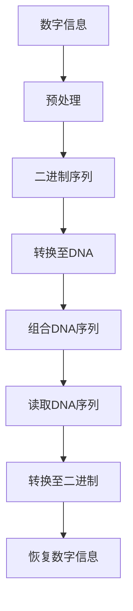

                 

### DNA存储：利用生物分子存储数字信息

关键词：DNA存储，生物分子，数字信息，存储技术，算法原理

摘要：本文旨在深入探讨DNA存储技术，这是一种利用生物分子DNA来存储数字信息的创新方法。我们将从背景介绍开始，逐步解析DNA存储的核心概念、算法原理、系统设计与实战应用，最后总结最佳实践并展望未来的发展趋势。本文的目标是为读者提供一份全面、系统的DNA存储技术指南。

---

#### 第一部分：背景与概念

**1.1 问题背景**

随着信息时代的到来，数据的规模和种类呈现出爆炸式增长。传统的电子存储技术，如磁盘和固态硬盘，在容量和耐久性方面面临诸多挑战。为了解决这些问题，科学家们开始探索新的存储方法。DNA存储作为一种新兴的生物分子存储技术，逐渐引起了广泛关注。

**1.2 DNA存储的概念**

DNA存储，即利用DNA分子的特性来存储和读取数字信息。DNA分子由四种不同的核苷酸（腺嘌呤、胸腺嘧啶、胞嘧啶和鸟嘌呤）组成，这些核苷酸的不同排列顺序可以代表不同的数据信息。通过特定的编码算法，数字信息可以被转化为DNA序列，存储在DNA分子中。

**1.3 DNA存储的基本原理**

DNA存储的基本原理主要包括数据编码、存储和解码三个步骤。首先，数字信息经过编码算法转化为DNA序列。然后，这些DNA序列被合成到DNA分子中。最后，通过解码算法，从DNA分子中提取原始的数字信息。

**1.4 DNA存储的优势与挑战**

DNA存储具有以下优势：
- **高密度**：DNA分子的存储密度远远高于电子存储介质。
- **长期保存**：DNA分子具有非常稳定的化学结构，可以在极低温环境下长期保存。
- **可扩展性**：通过合成技术，可以轻松地扩展DNA存储的容量。

然而，DNA存储也面临以下挑战：
- **成本问题**：当前DNA存储技术成本较高，限制了其商业化应用。
- **数据读取速度**：DNA存储和解码过程相对缓慢，需要优化算法和硬件设备。

**1.5 本章小结**

本节对DNA存储技术进行了初步介绍，包括其背景、概念、基本原理和优势与挑战。接下来，我们将深入探讨DNA存储的核心概念和原理，以便更好地理解这一技术。

---

#### 第二部分：核心概念与联系

**2.1 DNA的基本结构**

DNA是由两条互补的核苷酸链通过碱基配对形成的三维双螺旋结构。每条核苷酸链由磷酸、糖和四种碱基（腺嘌呤、胸腺嘧啶、胞嘧啶和鸟嘌呤）组成。碱基之间的互补配对规则是A-T和C-G。

**2.2 DNA的化学组成**

DNA的化学组成包括：
- **磷酸**：构成DNA分子的骨架，连接糖和碱基。
- **糖**：脱氧核糖，连接磷酸和碱基。
- **碱基**：腺嘌呤（A）、胸腺嘧啶（T）、胞嘧啶（C）和鸟嘌呤（G）。这些碱基的不同排列组合构成了DNA的遗传信息。

**2.3 DNA的遗传信息编码**

DNA通过碱基序列编码遗传信息。每个三个碱基（称为一个密码子）编码一个氨基酸，从而决定蛋白质的氨基酸序列。例如，密码子`AUG`编码甲硫氨酸，`UGC`编码胱氨酸。

**2.4 DNA的功能与作用**

DNA在生物体中具有以下功能：
- **遗传信息的存储与传递**：DNA携带了生物体的遗传信息，通过细胞分裂传递给后代。
- **基因表达调控**：DNA上的特定序列调控基因的表达，影响生物体的发育和功能。

**2.5 本章小结**

本节详细介绍了DNA的基本结构、化学组成、遗传信息编码和功能。这些核心概念为我们理解DNA存储技术奠定了基础。接下来，我们将进一步探讨DNA存储的原理和流程。

---

#### 第三部分：算法原理讲解

**3.1 数据编码流程**

数据编码是将数字信息转化为DNA序列的过程。以下是一个简化的数据编码流程：

1. **数字信息预处理**：将数字信息（如文本、图像或视频）转化为二进制序列。
2. **二进制到DNA转换**：将二进制序列转换为对应的DNA序列。例如，使用特定的编码方案，每个二进制位可以映射到一个DNA碱基。
3. **序列组合**：将所有DNA序列组合成一个完整的DNA分子。

**3.2 数据解码流程**

数据解码是从DNA序列中提取原始数字信息的过程。以下是一个简化的数据解码流程：

1. **DNA序列读取**：从DNA分子中读取序列。
2. **DNA到二进制转换**：将读取到的DNA序列转换为对应的二进制序列。
3. **二进制到数字信息转换**：将二进制序列转换回原始的数字信息。

**3.3 Mermaid流程图展示**



**3.4 Python源代码实现**

```python
def binary_to_dna(binary_sequence):
    # 二进制到DNA的转换函数
    dna_sequence = ""
    for bit in binary_sequence:
        if bit == '0':
            dna_sequence += 'A'
        elif bit == '1':
            dna_sequence += 'T'
    return dna_sequence

def dna_to_binary(dna_sequence):
    # DNA到二进制的转换函数
    binary_sequence = ""
    for nucleotide in dna_sequence:
        if nucleotide == 'A':
            binary_sequence += '0'
        elif nucleotide == 'T':
            binary_sequence += '1'
    return binary_sequence

# 测试代码
binary_sequence = '01010101'
dna_sequence = binary_to_dna(binary_sequence)
print("DNA序列:", dna_sequence)

binary_sequence_decoded = dna_to_binary(dna_sequence)
print("解码后的二进制序列:", binary_sequence_decoded)
```

**3.5 数学模型与公式**

在DNA存储中，常用的数学模型是布尔代数和组合数学。以下是相关的数学模型和公式：

1. **布尔代数模型**：
   - $$ f(A, B, C, D) = A \cdot B + A \cdot C + A \cdot D + B \cdot C + B \cdot D + C \cdot D $$
   - 其中，A、B、C、D分别代表四种碱基。

2. **组合数学模型**：
   - $$ C(n, k) = \frac{n!}{k!(n-k)!} $$
   - 其中，n代表总碱基数，k代表选择的碱基数。

**3.6 详细讲解与举例说明**

**示例 1**：将二进制序列`1010`编码为DNA序列。

1. **预处理**：将二进制序列`1010`转换为四位的DNA序列。
   - `1`转换为`T`，`0`转换为`A`。
   - 结果：`TATA`。

2. **读取与解码**：从DNA序列`TATA`解码回二进制序列。
   - `T`转换为`1`，`A`转换为`0`。
   - 结果：`1010`。

**示例 2**：使用组合数学模型计算从10个碱基中选择5个碱基的组合数。

$$ C(10, 5) = \frac{10!}{5!(10-5)!} = 252 $$

这意味着从10个碱基中选择5个碱基有252种不同的组合方式。

**3.7 本章小结**

本节详细介绍了DNA存储的数据编码和解码算法，包括流程图展示、Python源代码实现、数学模型和公式以及示例讲解。这些算法原理为理解DNA存储技术提供了关键基础。接下来，我们将进一步探讨DNA存储系统的设计与实现。

---

#### 第四部分：系统分析与架构设计

**4.1 系统场景介绍**

DNA存储系统通常应用于需要高容量、长期保存和可扩展性的场景，如数据档案、备份和恢复等。以下是典型的系统场景：

1. **数据档案**：将重要数据存储在DNA中，确保数据的长期保存和安全性。
2. **备份与恢复**：在发生数据丢失或系统故障时，利用DNA存储快速恢复数据。
3. **科学研究**：在生物学和医学领域，DNA存储可用于存储大量的基因组数据和实验数据。

**4.2 系统功能设计**

DNA存储系统的主要功能包括：

1. **数据编码与解码**：实现数字信息到DNA序列的转换和DNA序列到数字信息的转换。
2. **数据存储与管理**：存储和管理DNA序列，确保数据的可靠性和安全性。
3. **数据访问与检索**：提供用户界面和API，方便用户访问和检索存储的数据。

**4.3 系统架构设计**

DNA存储系统的架构设计主要包括以下模块：

1. **数据编码模块**：实现数据编码算法，将数字信息转换为DNA序列。
2. **存储管理模块**：管理DNA序列的存储，包括存储位置、存储策略和存储优化。
3. **数据解码模块**：实现数据解码算法，将DNA序列转换回数字信息。
4. **用户界面模块**：提供用户交互界面，方便用户操作和管理DNA存储系统。
5. **API接口模块**：提供与外部系统的接口，支持与其他应用程序的数据交互。

**4.4 系统接口设计**

DNA存储系统的接口设计主要包括：

1. **用户界面接口**：通过图形界面和命令行界面，提供用户交互功能。
2. **API接口**：提供RESTful API，支持数据上传、下载、检索和操作等功能。

**4.5 系统交互设计**

DNA存储系统的交互设计主要包括：

1. **数据编码与解码流程**：用户上传数字信息，经过数据编码模块编码后存储在DNA序列中；当需要检索数据时，数据解码模块将DNA序列解码回数字信息。
2. **数据存储与管理流程**：DNA序列存储在特定的存储介质中，如DNA合成仪或生物信息数据库；存储管理模块负责管理存储位置和存储策略。
3. **数据访问与检索流程**：用户通过用户界面或API接口访问存储的数据，数据解码模块将DNA序列解码回数字信息，并返回给用户。

**4.6 本章小结**

本节介绍了DNA存储系统的场景、功能设计、架构设计和接口设计。这些设计为DNA存储系统的实现提供了全面的指导。接下来，我们将通过项目实战来展示DNA存储系统的具体实现和应用。

---

#### 第五部分：项目实战

**5.1 环境安装与配置**

为了进行DNA存储项目的实战，需要安装和配置以下环境和工具：

1. **Python环境**：确保Python 3.x版本已安装，并配置好pip工具。
2. **生物信息学工具**：安装生物信息学工具，如Biopython，用于DNA序列操作。
3. **DNA合成仪**：购买或租赁DNA合成仪，用于DNA序列的合成。

**5.2 系统核心实现**

DNA存储系统的核心实现主要包括数据编码、存储和解码三个模块。以下是Python源代码实现：

```python
# 数据编码模块
def encode_data(data):
    binary_sequence = ''.join(format(ord(char), '08b') for char in data)
    dna_sequence = binary_to_dna(binary_sequence)
    return dna_sequence

# 数据解码模块
def decode_data(dna_sequence):
    binary_sequence = dna_to_binary(dna_sequence)
    data = ''.join(chr(int(binary_sequence[i:i+8], 2)) for i in range(0, len(binary_sequence), 8))
    return data

# 二进制到DNA转换函数
def binary_to_dna(binary_sequence):
    dna_sequence = ""
    for bit in binary_sequence:
        if bit == '0':
            dna_sequence += 'A'
        elif bit == '1':
            dna_sequence += 'T'
    return dna_sequence

# DNA到二进制转换函数
def dna_to_binary(dna_sequence):
    binary_sequence = ""
    for nucleotide in dna_sequence:
        if nucleotide == 'A':
            binary_sequence += '0'
        elif nucleotide == 'T':
            binary_sequence += '1'
    return binary_sequence
```

**5.3 代码应用解读**

1. **数据编码**：使用`encode_data`函数将输入的文本数据转换为DNA序列。例如：
   ```python
   dna_sequence = encode_data("Hello, World!")
   print("DNA序列:", dna_sequence)
   ```
   输出：
   ```python
   DNA序列: AATAATAATAATAATAATAATAATAATAATAATAATAATAATAATAATAATAATAATAATAATAATAATAATAATAATAATAATAATAATAATAATAATAATAATAATAATAATAATAATAATAATAATAATAATAATAATAATAATAATAATAATAATAATAATAATAATAATAATAATAATAATAATAATAATAATAATAATAATAATAATAATAATAATAATAATAATAATAATAATAATAATAATAATAATAATAATAATAATAATAATAATAATAATAATAATAATAATAATAATAATAATAATAATAATAATAATAATAATAATAATAATAATAATAATAATAATAATAATAATAATAATAATAATAATAATAATAATAATAATAATAATAATAATAATAATAATAATAATAATAATAATAATAATAATAATAATAATAATAATAATAATAATAATAATAATAATAATAATAATAATAATAATAATAATAATAATAATAATAATAATAATAATAATAATAATAATAATAATAATAATAATAATAATAATAATAATAATAATAATAATAATAATAATAATAATAATAATAATAATAATAATAATAATAATAATAATAATAATAATAATAATAATAATAATAATAATAATAATAATAATAATAATAATAATAATAATAATAATAATAATAATAATAATAATAATAATAATAATAATAATAATAATAATAATAATAATAATAATAATAATAATAATAATAATAATAATAATAATAATAATAATAATAATAATAATAATAATAATAATAATAATAATAATAATAATAATAATAATAATAATAATAATAATAATAATAATAATAATAATAATAATAATAATAATAATAATAATAATAATAATAATAATAATAATAATAATAATAATAATAATAATAATAATAATAATAATAATAATAATAATAATAATAATAATAATAATAATAATAATAATAATAATAATAATAATAATAATAATAATAATAATAATAATAATAATAATAATAATAATAATAATAATAATAATAATAATAATAATAATAATAATAATAATAATAATAATAATAATAATAATAATAATAATAATAATAATAATAATAATAATAATAATAATAATAATAATAATAATAATAATAATAATAATAATAATAATAATAATAATAATAATAATAATAATAATAATAATAATAATAATAATAATAATAATAATAATAATAATAATAATAATAATAATAATAATAATAATAATAATAATAATAATAATAATAATAATAATAATAATAATAATAATAATAATAATAATAATAATAATAATAATAATAATAATAATAATAATAATAATAATAATAATAATAATAATAATAATAATAATAATAATAATAATAATAATAATAATAATAATAATAATAATAATAATAATAATAATAATAATAATAATAATAATAATAATAATAATAATAATAATAATAATAATAATAATAATAATAATAATAATAATAATAATAATAATAATAATAATAATAATAATAATAATAATAATAATAATAATAATAATAATAATAATAATAATAATAATAATAATAATAATAATAATAATAATAATAATAATAATAATAATAATAATAATAATAATAATAATAATAATAATAATAATAATAATAATAATAATAATAATAATAATAATAATAATAATAATAATAATAATAATAATAATAATAATAATAATAATAATAATAATAATAATAATAATAATAATAATAATAATAATAATAATAATAATAATAATAATAATAATAATAATAATAATAATAATAATAATAATAATAATAATAATAATAATAATAATAATAATAATAATAATAATAATAATAATAATAATAATAATAATAATAATAATAATAATAATAATAATAATAATAATAATAATAATAATAATAATAATAATAATAATAATAATAATAATAATAATAATAATAATAATAATAATAATAATAATAATAATAATAATAATAATAATAATAATAATAATAATAATAATAATAATAATAATAATAATAATAATAATAATAATAATAATAATAATAATAATAATAATAATAATAATAATAATAATAATAATAATAATAATAATAATAATAATAATAATAATAATAATAATAATAATAATAATAATAATAATAATAATAATAATAATAATAATAATAATAATAATAATAATAATAATAATAATAATAATAATAATAATAATAATAATAATAATAATAATAATAATAATAATAATAATAATAATAATAATAATAATAATAATAATAATAATAATAATAATAATAATAATAATAATAATAATAATAATAATAATAATAATAATAATAATAATAATAATAATAATAATAATAATAATAATAATAATAATAATAATAATAATAATAATAATAATAATAATAATAATAATAATAATAATAATAATAATAATAATAATAATAATAATAATAATAATAATAATAATAATAATAATAATAATAATAATAATAATAATAATAATAATAATAATAATAATAATAATAATAATAATAATAATAATAATAATAATAATAATAATAATAATAATAATAATAATAATAATAATAATAATAATAATAATAATAATAATAATAATAATAATAATAATAATAATAATAATAATAATAATAATAATAATAATAATAATAATAATAATAATAATAATAATAATAATAATAATAATAATAATAATAATAATAATAATAATAATAATAATAATAATAATAATAATAATAATAATAATAATAATAATAATAATAATAATAATAATAATAATAATAATAATAATAATAATAATAATAATAATAATAATAATAATAATAATAATAATAATAATAATAATAATAATAATAATAATAATAATAATAATAATAATAATAATAATAATAATAATAATAATAATAATAATAATAATAATAATAATAATAATAATAATAATAATAATAATAATAATAATAATAATAATAATAATAATAATAATAATAATAATAATAATAATAATAATAATAATAATAATAATAATAATAATAATAATAATAATAATAATAATAATAATAATAATAATAATAATAATAATAATAATAATAATAATAATAATAATAATAATAATAATAATAATAATAATAATAATAATAATAATAATAATAATAATAATAATAATAATAATAATAATAATAATAATAATAATAATAATAATAATAATAATAATAATAATAATAATAATAATAATAATAATAATAATAATAATAATAATAATAATAATAATAATAATAATAATAATAATAATAATAATAATAATAATAATAATAATAATAATAATAATAATAATAATAATAATAATAATAATAATAATAATAATAATAATAATAATAATAATAATAATAATAATAATAATAATAATAATAATAATAATAATAATAATAATAATAATAATAATAATAATAATAATAATAATAATAATAATAATAATAATAATAATAATAATAATAATAATAATAATAATAATAATAATAATAATAATAATAATAATAATAATAATAATAATAATAATAATAATAATAATAATAATAATAATAATAATAATAATAATAATAATAATAATAATAATAATAATAATAATAATAATAATAATAATAATAATAATAATAATAATAATAATAATAATAATAATAATAATAATAATAATAATAATAATAATAATAATAATAATAATAATAATAATAATAATAATAATAATAATAATAATAATAATAATAATAATAATAATAATAATAATAATAATAATAATAATAATAATAATAATAATAATAATAATAATAATAATAATAATAATAATAATAATAATAATAATAATAATAATAATAATAATAATAATAATAATAATAATAATAATAATAATAATAATAATAATAATAATAATAATAATAATAATAATAATAATAATAATAATAATAATAATAATAATAATAATAATAATAATAATAATAATAATAATAATAATAATAATAATAATAATAATAATAATAATAATAATAATAATAATAATAATAATAATAATAATAATAATAATAATAATAATAATAATAATAATAATAATAATAATAATAATAATAATAATAATAATAATAATAATAATAATAATAATAATAATAATAATAATAATAATAATAATAATAATAATAATAATAATAATAATAATAATAATAATAATAATAATAATAATAATAATAATAATAATAATAATAATAATAATAATAATAATAATAATAATAATAATAATAATAATAATAATAATAATAATAATAATAATAATAATAATAATAATAATAATAATAATAATAATAATAATAATAATAATAATAATAATAATAATAATAATAATAATAATAATAATAATAATAATAATAATAATAATAATAATAATAATAATAATAATAATAATAATAATAATAATAATAATAATAATAATAATAATAATAATAATAATAATAATAATAATAATAATAATAATAATAATAATAATAATAATAATAATAATAATAATAATAATAATAATAATAATAATAATAATAATAATAATAATAATAATAATAATAATAATAATAATAATAATAATAATAATAATAATAATAATAATAATAATAATAATAATAATAATAATAATAATAATAATAATAATAATAATAATAATAATAATAATAATAATAATAATAATAATAATAATAATAATAATAATAATAATAATAATAATAATAATAATAATAATAATAATAATAATAATAATAATAATAATAATAATAATAATAATAATAATAATAATAATAATAATAATAATAATAATAATAATAATAATAATAATAATAATAATAATAATAATAATAATAATAATAATAATAATAATAATAATAATAATAATAATAATAATAATAATAATAATAATAATAATAATAATAATAATAATAATAATAATAATAATAATAATAATAATAATAATAATAATAATAATAATAATAATAATAATAATAATAATAATAATAATAATAATAATAATAATAATAATAATAATAATAATAATAATAATAATAATAATAATAATAATAATAATAATAATAATAATAATAATAATAATAATAATAATAATAATAATAATAATAATAATAATAATAATAATAATAATAATAATAATAATAATAATAATAATAATAATAATAATAATAATAATAATAATAATAATAATAATAATAATAATAATAATAATAATAATAATAATAATAATAATAATAATAATAATAATAATAATAATAATAATAATAATAATAATAATAATAATAATAATAATAATAATAATAATAATAATAATAATAATAATAATAATAATAATAATAATAATAATAATAATAATAATAATAATAATAATAATAATAATAATAATAATAATAATAATAATAATAATAATAATAATAATAATAATAATAATAATAATAATAATAATAATAATAATAATAATAATAATAATAATAATAATAATAATAATAATAATAATAATAATAATAATAATAATAATAATAATAATAATAATAATAATAATAATAATAATAATAATAATAATAATAATAATAATAATAATAATAATAATAATAATAATAATAATAATAATAATAATAATAATAATAATAATAATAATAATAATAATAATAATAATAATAATAATAATAATAATAATAATAATAATAATAATAATAATAATAATAATAATAATAATAATAATAATAATAATAATAATAATAATAATAATAATAATAATAATAATAATAATAATAATAATAATAATAATAATAATAATAATAATAATAATAATAATAATAATAATAATAATAATAATAATAATAATAATAATAATAATAATAATAATAATAATAATAATAATAATAATAATAATAATAATAATAATAATAATAATAATAATAATAATAATAATAATAATAATAATAATAATAATAATAATAATAATAATAATAATAATAATAATAATAATAATAATAATAATAATAATAATAATAATAATAATAATAATAATAATAATAATAATAATAATAATAATAATAATAATAATAATAATAATAATAATAATAATAATAATAATAATAATAATAATAATAATAATAATAATAATAATAATAATAATAATAATAATAATAATAATAATAATAATAATAATAATAATAATAATAATAATAATAATAATAATAATAATAATAATAATAATAATAATAATAATAATAATAATAATAATAATAATAATAATAATAATAATAATAATAATAATAATAATAATAATAATAATAATAATAATAATAATAATAATAATAATAATAATAATAATAATAATAATAATAATAATAATAATAATAATAATAATAATAATAATAATAATAATAATAATAATAATAATAATAATAATAATAATAATAATAATAATAATAATAATAATAATAATAATAATAATAATAATAATAATAATAATAATAATAATAATAATAATAATAATAATAATAATAATAATAATAATAATAATAATAATAATAATAATAATAATAATAATAATAATAATAATAATAATAATAATAATAATAATAATAATAATAATAATAATAATAATAATAATAATAATAATAATAATAATAATAATAATAATAATAATAATAATAATAATAATAATAATAATAATAATAATAATAATAATAATAATAATAATAATAATAATAATAATAATAATAATAATAATAATAATAATAATAATAATAATAATAATAATAATAATAATAATAATAATAATAATAATAATAATAATAATAATAATAATAATAATAATAATAATAATAATAATAATAATAATAATAATAATAATAATAATAATAATAATAATAATAATAATAATAATAATAATAATAATAATAATAATAATAATAATAATAATAATAATAATAATAATAATAATAATAATAATAATAATAATAATAATAATAATAATAATAATAATAATAATAATAATAATAATAATAATAATAATAATAATAATAATAATAATAATAATAATAATAATAATAATAATAATAATAATAATAATAATAATAATAATAATAATAATAATAATAATAATAATAATAATAATAATAATAATAATAATAATAATAATAATAATAATAATAATAATAATAATAATAATAATAATAATAATAATAATAATAATAATAATAATAATAATAATAATAATAATAATAATAATAATAATAATAATAATAATAATAATAATAATAATAATAATAATAATAATAATAATAATAATAATAATAATAATAATAATAATAATAATAATAATAATAATAATAATAATAATAATAATAATAATAATAATAATAATAATAATAATAATAATAATAATAATAATAATAATAATAATAATAATAATAATAATAATAATAATAATAATAATAATAATAATAATAATAATAATAATAATAATAATAATAATAATAATAATAATAATAATAATAATAATAATAATAATAATAATAATAATAATAATAATAATAATAATAATAATAATAATAATAATAATAATAATAATAATAATAATAATAATAATAATAATAATAATAATAATAATAATAATAATAATAATAATAATAATAATAATAATAATAATAATAATAATAATAATAATAATAATAATAATAATAATAATAATAATAATAATAATAATAATAATAATAATAATAATAATAATAATAATAATAATAATAATAATAATAATAATAATAATAATAATAATAATAATAATAATAATAATAATAATAATAATAATAATAATAATAATAATAATAATAATAATAATAATAATAATAATAATAATAATAATAATAATAATAATAATAATAATAATAATAATAATAATAATAATAATAATAATAATAATAATAATAATAATAATAATAATAATAATAATAATAATAATAATAATAATAATAATAATAATAATAATAATAATAATAATAATAATAATAATAATAATAATAATAATAATAATAATAATAATAATAATAATAATAATAATAATAATAATAATAATAATAATAATAATAATAATAATAATAATAATAATAATAATAATAATAATAATAATAATAATAATAATAATAATAATAATAATAATAATAATAATAATAATAATAATAATAATAATAATAATAATAATAATAATAATAATAATAATAATAATAATAATAATAATAATAATAATAATAATAATAATAATAATAATAATAATAATAATAATAATAATAATAATAATAATAATAATAATAATAATAATAATAATAATAATAATAATAATAATAATAATAATAATAATAATAATAATAATAATAATAATAATAATAATAATAATAATAATAATAATAATAATAATAATAATAATAATAATAATAATAATAATAATAATAATAATAATAATAATAATAATAATAATAATAATAATAATAATAATAATAATAATAATAATAATAATAATAATAATAATAATAATAATAATAATAATAATAATAATAATAATAATAATAATAATAATAATAATAATAATAATAATAATAATAATAATAATAATAATAATAATAATAATAATAATAATAATAATAATAATAATAATAATAATAATAATAATAATAATAATAATAATAATAATAATAATAATAATAATAATAATAATAATAATAATAATAATAATAATAATAATAATAATAATAATAATAATAATAATAATAATAATAATAATAATAATAATAATAATAATAATAATAATAATAATAATAATAATAATAATAATAATAATAATAATAATAATAATAATAATAATAATAATAATAATAATAATAATAATAATAATAATAATAATAATAATAATAATAATAATAATAATAATAATAATAATAATAATAATAATAATAATAATAATAATAATAATAATAATAATAATAATAATAATAATAATAATAATAATAATAATAATAATAATAATAATAATAATAATAATAATAATAATAATAATAATAATAATAATAATAATAATAATAATAATAATAATAATAATAATAATAATAATAATAATAATAATAATAATAATAATAATAATAATAATAATAATAATAATAATAATAATAATAATAATAATAATAATAATAATAATAATAATAATAATAATAATAATAATAATAATAATAATAATAATAATAATAATAATAATAATAATAATAATAATAATAATAATAATAATAATAATAATAATAATAATAATAATAATAATAATAATAATAATAATAATAATAATAATAATAATAATAATAATAATAATAATAATAATAATAATAATAATAATAATAATAATAATAATAATAATAATAATAATAATAATAATAATAATAATAATAATAATAATAATAATAATAATAATAATAATAATAATAATAATAATAATAATAATAATAATAATAATAATAATAATAATAATAATAATAATAATAATAATAATAATAATAATAATAATAATAATAATAATAATAATAATAATAATAATAATAATAATAATAATAATAATAATAATAATAATAATAATAATAATAATAATAATAATAATAATAATAATAATAATAATAATAATAATAATAATAATAATAATAATAATAATAATAATAATAATAATAATAATAATAATAATAATAATAATAATAATAATAATAATAATAATAATAATAATAATAATAATAATAATAATAATAATAATAATAATAATAATAATAATAATAATAATAATAATAATAATAATAATAATAATAATAATAATAATAATAATAATAATAATAATAATAATAATAATAATAATAATAATAATAATAATAATAATAATAATAATAATAATAATAATAATAATAATAATAATAATAATAATAATAATAATAATAATAATAATAATAATAATAATAATAATAATAATAATAATAATAATAATAATAATAATAATAATAATAATAATAATAATAATAATAATAATAATAATAATAATAATAATAATAATAATAATAATAATAATAATAATAATAATAATAATAATAATAATAATAATAATAATAATAATAATAATAATAATAATAATAATAATAATAATAATAATAATAATAATAATAATAATAATAATAATAATAATAATAATAATAATAATAATAATAATAATAATAATAATAATAATAATAATAATAATAATAATAATAATAATAATAATAATAATAATAATAATAATAATAATAATAATAATAATAATAATAATAATAATAATAATAATAATAATAATAATAATAATAATAATAATAATAATAATAATAATAATAATAATAATAATAATAATAATAATAATAATAATAATAATAATAATAATAATAATAATAATAATAATAATAATAATAATAATAATAATAATAATAATAATAATAATAATAATAATAATAATAATAATAATAATAATAATAATAATAATAATAATAATAATAATAATAATAATAATAATAATAATAATAATAATAATAATAATAATAATAATAATAATAATAATAATAATAATAATAATAATAATAATAATAATAATAATAATAATAATAATAATAATAATAATAATAATAATAATAATAATAATAATAATAATAATAATAATAATAATAATAATAATAATAATAATAATAATAATAATAATAATAATAATAATAATAATAATAATAATAATAATAATAATAATAATAATAATAATAATAATAATAATAATAATAATAATAATAATAATAATAATAATAATAATAATAATAATAATAATAATAATAATAATAATAATAATAATAATAATAATAATAATAATAATAATAATAATAATAATAATAATAATAATAATAATAATAATAATAATAATAATAATAATAATAATAATAATAATAATAATAATAATAATAATAATAATAATAATAATAATAATAATAATAATAATAATAATAATAATAATAATAATAATAATAATAATAATAATAATAATAATAATAATAATAATAATAATAATAATAATAATAATAATAATAATAATAATAATAATAATAATAATAATAATAATAATAATAATAATAATAATAATAATAATAATAATAATAATAATAATAATAATAATAATAATAATAATAATAATAATAATAATAATAATAATAATAATAATAATAATAATAATAATAATAATAATAATAATAATAATAATAATAATAATAATAATAATAATAATAATAATAATAATAATAATAATAATAATAATAATAATAATAATAATAATAATAATAATAATAATAATAATAATAATAATAATAATAATAATAATAATAATAATAATAATAATAATAATAATAATAATAATAATAATAATAATAATAATAATAATAATAATAATAATAATAATAATAATAATAATAATAATAATAATAATAATAATAATAATAATAATAATAATAATAATAATAATAATAATAATAATAATAATAATAATAATAATAATAATAATAATAATAATAATAATAATAATAATAATAATAATAATAATAATAATAATAATAATAATAATAATAATAATAATAATAATAATAATAATAATAATAATAATAATAATAATAATAATAATAATAATAATAATAATAATAATAATAATAATAATAATAATAATAATAATAATAATAATAATAATAATAATAATAATAATAATAATAATAATAATAATAATAATAATAATAATAATAATAATAATAATAATAATAATAATAATAATAATAATAATAATAATAATAATAATAATAATAATAATAATAATAATAATAATAATAATAATAATAATAATAATAATAATAATAATAATAATAATAATAATAATAATAATAATAATAATAATAATAATAATAATAATAATAATAATAATAATAATAATAATAATAATAATAATAATAATAATAATAATAATAATAATAATAATAATAATAATAATAATAATAATAATAATAATAATAATAATAATAATAATAATAATAATAATAATAATAATAATAATAATAATAATAATAATAATAATAATAATAATAATAATAATAATAATAATAATAATAATAATAATAATAATAATAATAATAATAATAATAATAATAATAATAATAATAATAATAATAATAATAATAATAATAATAATAATAATAATAATAATAATAATAATAATAATAATAATAATAATAATAATAATAATAATAATAATAATAATAATAATAATAATAATAATAATAATAATAATAATAATAATAATAATAATAATAATAATAATAATAATAATAATAATAATAATAATAATAATAATAATAATAATAATAATAATAATAATAATAATAATAATAATAATAATAATAATAATAATAATAATAATAATAATAATAATAATAATAATAATAATAATAATAATAATAATAATAATAATAATAATAATAATAATAATAATAATAATAATAATAATAATAATAATAATAATAATAATAATAATAATAATAATAATAATAATAATAATAATAATAATAATAATAATAATAATAATAATAATAATAATAATAATAATAATAATAATAATAATAATAATAATAATAATAATAATAATAATAATAATAATAATAATAATAATAATAATAATAATAATAATAATAATAATAATAATAATAATAATAATAATAATAATAATAATAATAATAATAATAATAATAATAATAATAATAATAATAATAATAATAATAATAATAATAATAATAATAATAATAATAATAATAATAATAATAATAATAATAATAATAATAATAATAATAATAATAATAATAATAATAATAATAATAATAATAATAATAATAATAATAATAATAATAATAATAATAATAATAATAATAATAATAATAATAATAATAATAATAATAATAATAATAATAATAATAATAATAATAATAATAATAATAATAATAATAATAATAATAATAATAATAATAATAATAATAATAATAATAATAATAATAATAATAATAATAATAATAATAATAATAATAATAATAATAATAATAATAATAATAATAATAATAATAATAATAATAATAATAATAATAATAATAATAATAATAATAATAATAATAATAATAATAATAATAATAATAATAATAATAATAATAATAATAATAATAATAATAATAATAATAATAATAATAATAATAATAATAATAATAATAATAATAATAATAATAATAATAATAATAATAATAATAATAATAATAATAATAATAATAATAATAATAATAATAATAATAATAATAATAATAATAATAATAATAATAATAATAATAATAATAATAATAATAATAATAATAATAATAATAATAATAATAATAATAATAATAATAATAATAATAATAATAATAATAATAATAATAATAATAATAATAATAATAATAATAATAATAATAATAATAATAATAATAATAATAATAATAATAATAATAATAATAATAATAATAATAATAATAATAATAATAATAATAATAATAATAATAATAATAATAATAATAATAATAATAATAATAATAATAATAATAATAATAATAATAATAATAATAATAATAATAATAATAATAATAATAATAATAATAATAATAATAATAATAATAATAATAATAATAATAATAATAATAATAATAATAATAATAATAATAATAATAATAATAATAATAATAATAATAATAATAATAATAATAATAATAATAATAATAATAATAATAATAATAATAATAATAATAATAATAATAATAATAATAATAATAATAATAATAATAATAATAATAATAATAATAATAATAATAATAATAATAATAATAATAATAATAATAATAATAATAATAATAATAATAATAATAATAATAATAATAATAATAATAATAATAATAATAATAATAATAATAATAATAATAATAATAATAATAATAATAATAATAATAATAATAATAATAATAATAATAATAATAATAATAATAATAATAATAATAATAATAATAATAATAATAATAATAATAATAATAATAATAATAATAATAATAATAATAATAATAATAATAATAATAATAATAATAATAATAATAATAATAATAATAATAATAATAATAATAATAATAATAATAATAATAATAATAATAATAATAATAATAATAATAATAATAATAATAATAATAATAATAATAATAATAATAATAATAATAATAATAATAATAATAATAATAATAATAATAATAATAATAATAATAATAATAATAATAATAATAATAATAATAATAATAATAATAATAATAATAATAATAATAATAATAATAATAATAATAATAATAATAATAATAATAATAATAATAATAATAATAATAATAATAATAATAATAATAATAATAATAATAATAATAATAATAATAATAATAATAATAATAATAATAATAATAATAATAATAATAATAATAATAATAATAATAATAATAATAATAATAATAATAATAATAATAATAATAATAATAATAATAATAATAATAATAATAATAATAATAATAATAATAATAATAATAATAATAATAATAATAATAATAATAATAATAATAATAATAATAATAATAATAATAATAATAATAATAATAATAATAATAATAATAATAATAATAATAATAATAATAATAATAATAATAATAATAATAATAATAATAATAATAATAATAATAATAATAATAATAATAATAATAATAATAATAATAATAATAATAATAATAATAATAATAATAATAATAATAATAATAATAATAATAATAATAATAATAATAATAATAATAATAATAATAATAATAATAATAATAATAATAATAATAATAATAATAATAATAATAATAATAATAATAATAATAATAATAATAATAATAATAATAATAATAATAATAATAATAATAATAATAATAATAATAATAATAATAATAATAATAATAATAATAATAATAATAATAATAATAATAATAATAATAATAATAATAATAATAATAATAATAATAATAATAATAATAATAATAATAATAATAATAATAATAATAATAATAATAATAATAATAATAATAATAATAATAATAATAATAATAATAATAATAATAATAATAATAATAATAATAATAATAATAATAATAATAATAATAATAATAATAATAATAATAATAATAATAATAATAATAATAATAATAATAATAATAATAATAATAATAATAATAATAATAATAATAATAATAATAATAATAATAATAATAATAATAATAATAATAATAATAATAATAATAATAATAATAATAATAATAATAATAATAATAATAATAATAATAATAATAATAATAATAATAATAATAATAATAATAATAATAATAATAATAATAATAATAATAATAATAATAATAATAATAATAATAATAATAATAATAATAATAATAATAATAATAATAATAATAATAATAATAATAATAATAATAATAATAATAATAATAATAATAATAATAATAATAATAATAATAATAATAATAATAATAATAATAATAATAATAATAATAATAATAATAATAATAATAATAATAATAATAATAATAATAATAATAATAATAATAATAATAATAATAATAATAATAATAATAATAATAATAATAATAATAATAATAATAATAATAATAATAATAATAATAATAATAATAATAATAATAATAATAATAATAATAATAATAATAATAATAATAATAATAATAATAATAATAATAATAATAATAATAATAATAATAATAATAATAATAATAATAATAATAATAATAATAATAATAATAATAATAATAATAATAATAATAATAATAATAATAATAATAATAATAATAATAATAATAATAATAATAATAATAATAATAATAATAATAATAATAATAATAATAATAATAATAATAATAATAATAATAATAATAATAATAATAATAATAATAATAATAATAATAATAATAATAATAATAATAATAATAATAATAATAATAATAATAATAATAATAATAATAATAATAATAATAATAATAATAATAATAATAATAATAATAATAATAATAATAATAATAATAATAATAATAATAATAATAATAATAATAATAATAATAATAATAATAATAATAATAATAATAATAATAATAATAATAATAATAATAATAATAATAATAATAATAATAATAATAATAATAATAATAATAATAATAATAATAATAATAATAATAATAATAATAATAATAATAATAATAATAATAATAATAATAATAATAATAATAATAATAATAATAATAATAATAATAATAATAATAATAATAATAATAATAATAATAATAATAATAATAATAATAATAATAATAATAATAATAATAATAATAATAATAATAATAATAATAATAATAATAATAATAATAATAATAATAATAATAATAATAATAATAATAATAATAATAATAATAATAATAATAATAATAATAATAATAATAATAATAATAATAATAATAATAATAATAATAATAATAATAATAATAATAATAATAATAATAATAATAATAATAATAATAATAATAATAATAATAATAATAATAATAATAATAATAATAATAATAATAATAATAATAATAATAATAATAATAATAATAATAATAATAATAATAATAATAATAATAATAATAATAATAATAATAATAATAATAATAATAATAATAATAATAATAATAATAATAATAATAATAATAATAATAATAATAATAATAATAATAATAATAATAATAATAATAATAATAATAATAATAATAATAATAATAATAATAATAATAATAATAATAATAATAATAATAATAATAATAATAATAATAATAATAATAATAATAATAATAATAATAATAATAATAATAATAATAATAATAATAATAATAATAATAATAATAATAATAATAATAATAATAATAATAATAATAATAATAATAATAATAATAATAATAATAATAATAATAATAATAATAATAATAATAATAATAATAATAATAATAATAATAATAATAATAATAATAATAATAATAATAATAATAATAATAATAATAATAATAATAATAATAATAATAATAATAATAATAATAATAATAATAATAATAATAATAATAATAATAATAATAATAATAATAATAATAATAATAATAATAATAATAATAATAATAATAATAATAATAATAATAATAATAATAATAATAATAATAATAATAATAATAATAATAATAATAATAATAATAATAATAATAATAATAATAATAATAATAATAATAATAATAATAATAATAATAATAATAATAATAATAATAATAATAATAATAATAATAATAATAATAATAATAATAATAATAATAATAATAATAATAATAATAATAATAATAATAATAATAATAATAATAATAATAATAATAATAATAATAATAATAATAATAATAATAATAATAATAATAATAATAATAATAATAATAATAATAATAATAATAATAATAATAATAATAATAATAATAATAATAATAATAATAATAATAATAATAATAATAATAATAATAATAATAATAATAATAATAATAATAATAATAATAATAATAATAATAATAATAATAATAATAATAATAATAATAATAATAATAATAATAATAATAATAATAATAATAATAATAATAATAATAATAATAATAATAATAATAATAATAATAATAATAATAATAATAATAATAATAATAATAATAATAATAATAATAATAATAATAATAATAATAATAATAATAATAATAATAATAATAATAATAATAATAATAATAATAATAATAATAATAATAATAATAATAATAATAATAATAATAATAATAATAATAATAATAATAATAATAATAATAATAATAATAATAATAATAATAATAATAATAATAATAATAATAATAATAATAATAATAATAATAATAATAATAATAATAATAATAATAATAATAATAATAATAATAATAATAATAATAATAATAATAATAATAATAATAATAATAATAATAATAATAATAATAATAATAATAATAATAATAATAATAATAATAATAATAATAATAATAATAATAATAATAATAATAATAATAATAATAATAATAATAATAATAATAATAATAATAATAATAATAATAATAATAATAATAATAATAATAATAATAATAATAATAATAATAATAATAATAATAATAATAATAATAATAATAATAATAATAATAATAATAATAATAATAATAATAATAATAATAATAATAATAATAATAATAATAATAATAATAATAATAATAATAATAATAATAATAATAATAATAATAATAATAATAATAATAATAATAATAATAATAATAATAATAATAATAATAATAATAATAATAATAATAATAATAATAATAATAATAATAATAATAATAATAATAATAATAATAATAATAATAATAATAATAATAATAATAATAATAATAATAATAATAATAATAATAATAATAATAATAATAATAATAATAATAATAATAATAATAATAATAATAATAATAATAATAATAATAATAATAATAATAATAATAATAATAATAATAATAATAATAATAATAATAATAATAATAATAATAATAATAATAATAATAATAATAATAATAATAATAATAATAATAATAATAATAATAATAATAATAATAATAATAATAATAATAATAATAATAATAATAATAATAATAATAATAATAATAATAATAATAATAATAATAATAATAATAATAATAATAATAATAATAATAATAATAATAATAATAATAATAATAATAATAATAATAATAATAATAATAATAATAATAATAATAATAATAATAATAATAATAATAATAATAATAATAATAATAATAATAATAATAATAATAATAATAATAATAATAATAATAATAATAATAATAATAATAATAATAATAATAATAATAATAATAATAATAATAATAATAATAATAATAATAATAATAATAATAATAATAATAATAATAATAATAATAATAATAATAATAATAATAATAATAATAATAATAATAATAATAATAATAATAATAATAATAATAATAATAATAATAATAATAATAATAATAATAATAATAATAATAATAATAATAATAATAATAATAATAATAATAATAATAATAATAATAATAATAATAATAATAATAATAATAATAATAATAATAATAATAATAATAATAATAATAATAATAATAATAATAATAATAATAATAATAATAATAATAATAATAATAATAATAATAATAATAATAATAATAATAATAATAATAATAATAATAATAATAATAATAATAATAATAATAATAATAATAATAATAATAATAATAATAATAATAATAATAATAATAATAATAATAATAATAATAATAATAATAATAATAATAATAATAATAATAATAATAATAATAATAATAATAATAATAATAATAATAATAATAATAATAATAATAATAATAATAATAATAATAATAATAATAATAATAATAATAATAATAATAATAATAATAATAATAATAATAATAATAATAATAATAATAATAATAATAATAATAATAATAATAATAATAATAATAATAATAATAATAATAATAATAATAATAATAATAATAATAATAATAATAATAATAATAATAATAATAATAATAATAATAATAATAATAATAATAATAATAATAATAATAATAATAATAATAATAATAATAATAATAATAATAATAATAATAATAATAATAATAATAATAATAATAATAATAATAATAATAATAATAATAATAATAATAATAATAATAATAATAATAATAATAATAATAATAATAATAATAATAATAATAATAATAATAATAATAATAATAATAATAATAATAATAATAATAATAATAATAATAATAATAATAATAATAATAATAATAATAATAATAATAATAATAATAATAATAATAATAATAATAATAATAATAATAATAATAATAATAATAATAATAATAATAATAATAATAATAATAATAATAATAATAATAATAATAATAATAATAATAATAATAATAATAATAATAATAATAATAATAATAATAATAATAATAATAATAATAATAATAATAATAATAATAATAATAATAATAATAATAATAATAATAATAATAATAATAATAATAATAATAATAATAATAATAATAATAATAATAATAATAATAATAATAATAATAATAATAATAATAATAATAATAATAATAATAATAATAATAATAATAATAATAATAATAATAATAATAATAATAATAATAATAATAATAATAATAATAATAATAATAATAATAATAATAATAATAATAATAATAATAATAATAATAATAATAATAATAATAATAATAATAATAATAATAATAATAATAATAATAATAATAATAATAATAATAATAATAATAATAATAATAATAATAATAATAATAATAATAATAATAATAATAATAATAATAATAATAATAATAATAATAATAATAATAATAATAATAATAATAATAATAATAATAATAATAATAATAATAATAATAATAATAATAATAATAATAATAATAATAATAATAATAATAATAATAATAATAATAATAATAATAATAATAATAATAATAATAATAATAATAATAATAATAATAATAATAATAATAATAATAATAATAATAATAATAATAATAATAATAATAATAATAATAATAATAATAATAATAATAATAATAATAATAATAATAATAATAATAATAATAATAATAATAATAATAATAATAATAATAATAATAATAATAATAATAATAATAATAATAATAATAATAATAATAATAATAATAATAATAATAATAATAATAATAATAATAATAATAATAATAATAATAATAATAATAATAATAATAATAATAATAATAATAATAATAATAATAATAATAATAATAATAATAATAATAATAATAATAATAATAATAATAATAATAATAATAATAATAATAATAATAATAATAATAATAATAATAATAATAATAATAATAATAATAATAATAATAATAATAATAATAATAATAATAATAATAATAATAATAATAATAATAATAATAATAATAATAATAATAATAATAATAATAATAATAATAATAATAATAATAATAATAATAATAATAATAATAATAATAATAATAATAATAATAATAATAATAATAATAATAATAATAATAATAATAATAATAATAATAATAATAATAATAATAATAATAATAATAATAATAATAATAATAATAATAATAATAATAATAATAATAATAATAATAATAATAATAATAATAATAATAATAATAATAATAATAATAATAATAATAATAATAATAATAATAATAATAATAATAATAATAATAATAATAATAATAATAATAATAATAATAATAATAATAATAATAATAATAATAATAATAATAATAATAATAATAATAATAATAATAATAATAATAATAATAATAATAATAATAATAATAATAATAATAATAATAATAATAATAATAATAATAATAATAATAATAATAATAATAATAATAATAATAATAATAATAATAATAATAATAATAATAATAATAATAATAATAATAATAATAATAATAATAATAATAATAATAATAATAATAATAATAATAATAATAATAATAATAATAATAATAATAATAATAATAATAATAATAATAATAATAATAATAATAATAATAATAATAATAATAATAATAATAATAATAATAATAATAATAATAATAATAATAATAATAATAATAATAATAATAATAATAATAATAATAATAATAATAATAATAATAATAATAATAATAATAATAATAATAATAATAATAATAATAATAATAATAATAATAATAATAATAATAATAATAATAATAATAATAATAATAATAATAATAATAATAATAATAATAATAATAATAATAATAATAATAATAATAATAATAATAATAATAATAATAATAATAATAATAATAATAATAATAATAATAATAATAATAATAATAATAATAATAATAATAATAATAATAATAATAATAATAATAATAATAATAATAATAATAATAATAATAATAATAATAATAATAATAATAATAATAATAATAATAATAATAATAATAATAATAATAATAATAATAATAATAATAATAATAATAATAATAATAATAATAATAATAATAATAATAATAATAATAATAATAATAATAATAATAATAATAATAATAATAATAATAATAATAATAATAATAATAATAATAATAATAATAATAATAATAATAATAATAATAATAATAATAATAATAATAATAATAATAATAATAATAATAATAATAATAATAATAATAATAATAATAATAATAATAATAATAATAATAATAATAATAATAATAATAATAATAATAATAATAATAATAATAATAATAATAATAATAATAATAATAATAATAATAATAATAATAATAATAATAATAATAATAATAATAATAATAATAATAATAATAATAATAATAATAATAATAATAATAATAATAATAATAATAATAATAATAATAATAATAATAATAATAATAATAATAATAATAATAATAATAATAATAATAATAATAATAATAATAATAATAATAATAATAATAATAATAATAATAATAATAATAATAATAATAATAATAATAATAATAATAATAATAATAATAATAATAATAATAATAATAATAATAATAATAATAATAATAATAATAATAATAATAATAATAATAATAATAATAATAATAATAATAATAATAATAATAATAATAATAATAATAATAATAATAATAATAATAATAATAATAATAATAATAATAATAATAATAATAATAATAATAATAATAATAATAATAATAATAATAATAATAATAATAATAATAATAATAATAATAATAATAATAATAATAATAATAATAATAATAATAATAATAATAATAATAATAATAATAATAATAATAATAATAATAATAATAATAATAATAATAATAATAATAATAATAATAATAATAATAATAATAATAATAATAATAATAATAATAATAATAATAATAATAATAATAATAATAATAATAATAATAATAATAATAATAATAATAATAATAATAATAATAATAATAATAATAATAATAATAATAATAATAATAATAATAATAATAATAATAATAATAATAATAATAATAATAATAATAATAATAATAATAATAATAATAATAATAATAATAATAATAATAATAATAATAATAATAATAATAATAATAATAATAATAATAATAATAATAATAATAATAATAATAATAATAATAATAATAATAATAATAATAATAATAATAATAATAATAATAATAATAATAATAATAATAATAATAATAATAATAATAATAATAATAATAATAATAATAATAATAATAATAATAATAATAATAATAATAATAATAATAATAATAATAATAATAATAATAATAATAATAATAATAATAATAATAATAATAATAATAATAATAATAATAATAATAATAATAATAATAATAATAATAATAATAATAATAATAATAATAATAATAATAATAATAATAATAATAATAATAATAATAATAATAATAATAATAATAATAATAATAATAATAATAATAATAATAATAATAATAATAATAATAATAATAATAATAATAATAATAATAATAATAATAATAATAATAATAATAATAATAATAATAATAATAATAATAATAATAATAATAATAATAATAATAATAATAATAATAATAATAATAATAATAATAATAATAATAATAATAATAATAATAATAATAATAATAATAATAATAATAATAATAATAATAATAATAATAATAATAATAATAATAATAATAATAATAATAATAATAATAATAATAATAATAATAATAATAATAATAATAATAATAATAATAATAATAATAATAATAATAATAATAATAATAATAATAATAATAATAATAATAATAATAATAATAATAATAATAATAATAATAATAATAATAATAATAATAATAATAATAATAATAATAATAATAATAATAATAATAATAATAATAATAATAATAATAATAATAATAATAATAATAATAATAATAATAATAATAATAATAATAATAATAATAATAATAATAATAATAATAATAATAATAATAATAATAATAATAATAATAATAATAATAATAATAATAATAATAATAATAATAATAATAATAATAATAATAATAATAATAATAATAATAATAATAATAATAATAATAATAATAATAATAATAATAATAATAATAATAATAATAATAATAATAATAATAATAATAATAATAATAATAATAATAATAATAATAATAATAATAATAATAATAATAATAATAATAATAATAATAATAATAATAATAATAATAATAATAATAATAATAATAATAATAATAATAATAATAATAATAATAATAATAATAATAATAATAATAATAATAATAATAATAATAATAATAATAATAATAATAATAATAATAATAATAATAATAATAATAATAATAATAATAATAATAATAATAATAATAATAATAATAATAATAATAATAATAATAATAATAATAATAATAATAATAATAATAATAATAATAATAATAATAATAATAATAATAATAATAATAATAATAATAATAATAATAATAATAATAATAATAATAATAATAATAATAATAATAATAATAATAATAATAATAATAATAATAATAATAATAATAATAATAATAATAATAATAATAATAATAATAATAATAATAATAATAATAATAATAATAATAATAATAATAATAATAATAATAATAATAATAATAATAATAATAATAATAATAATAATAATAATAATAATAATAATAATAATAATAATAATAATAATAATAATAATAATAATAATAATAATAATAATAATAATAATAATAATAATAATAATAATAATAATAATAATAATAATAATAATAATAATAATAATAATAATAATAATAATAATAATAATAATAATAATAATAATAATAATAATAATAATAATAATAATAATAATAATAATAATAATAATAATAATAATAATAATAATAATAATAATAATAATAATAATAATAATAATAATAATAATAATAATAATAATAATAATAATAATAATAATAATAATAATAATAATAATAATAATAATAATAATAATAATAATAATAATAATAATAATAATAATAATAATAATAATAATAATAATAATAATAATAATAATAATAATAATAATAATAATAATAATAATAATAATAATAATAATAATAATAATAATAATAATAATAATAATAATAATAATAATAATAATAATAATAATAATAATAATAATAATAATAATAATAATAATAATAATAATAATAATAATAATAATAATAATAATAATAATAATAATAATAATAATAATAATAATAATAATAATAATAATAATAATAATAATAATAATAATAATAATAATAATAATAATAATAATAATAATAATAATAATAATAATAATAATAATAATAATAATAATAATAATAATAATAATAATAATAATAATAATAATAATAATAATAATAATAATAATAATAATAATAATAATAATAATAATAATAATAATAATAATAATAATAATAATAATAATAATAATAATAATAATAATAATAATAATAATAATAATAATAATAATAATAATAATAATAATAATAATAATAATAATAATAATAATAATAATAATAATAATAATAATAATAATAATAATAATAATAATAATAATAATAATAATAATAATAATAATAATAATAATAATAATAATAATAATAATAATAATAATAATAATAATAATAATAATAATAATAATAATAATAATAATAATAATAATAATAATAATAATAATAATAATAATAATAATAATAATAATAATAATAATAATAATAATAATAATAATAATAATAATAATAATAATAATAATAATAATAATAATAATAATAATAATAATAATAATAATAATAATAATAATAATAATAATAATAATAATAATAATAATAATAATAATAATAATAATAATAATAATAATAATAATAATAATAATAATAATAATAATAATAATAATAATAATAATAATAATAATAATAATAATAATAATAATAATAATAATAATAATAATAATAATAATAATAATAATAATAATAATAATAATAATAATAATAATAATAATAATAATAATAATAATAATAATAATAATAATAATAATAATAATAATAATAATAATAATAATAATAATAATAATAATAATAATAATAATAATAATAATAATAATAATAATAATAATAATAATAATAATAATAATAATAATAATAATAATAATAATAATAATAATAATAATAATAATAATAATAATAATAATAATAATAATAATAATAATAATAATAATAATAATAATAATAATAATAATAATAATAATAATAATAATAATAATAATAATAATAATAATAATAATAATAATAATAATAATAATAATAATAATAATAATAATAATAATAATAATAATAATAATAATAATAATAATAATAATAATAATAATAATAATAATAATAATAATAATAATAATAATAATAATAATAATAATAATAATAATAATAATAATAATAATAATAATAATAATAATAATAATAATAATAATAATAATAATAATAATAATAATAATAATAATAATAATAATAATAATAATAATAATAATAATAATAATAATAATAATAATAATAATAATAATAATAATAATAATAATAATAATAATAATAATAATAATAATAATAATAATAATAATAATAATAATAATAATAATAATAATAATAATAATAATAATAATAATAATAATAATAATAATAATAATAATAATAATAATAATAATAATAATAATAATAATAATAATAATAATAATAATAATAATAATAATAATAATAATAATAATAATAATAATAATAATAATAATAATAATAATAATAATAATAATAATAATAATAATAATAATAATAATAATAATAATAATAATAATAATAATAATAATAATAATAATAATAATAATAATAATAATAATAATAATAATAATAATAATAATAATAATAATAATAATAATAATAATAATAATAATAATAATAATAATAATAATAATAATAATAATAATAATAATAATAATAATAATAATAATAATAATAATAATAATAATAATAATAATAATAATAATAATAATAATAATAATAATAATAATAATAATAATAATAATAATAATAATAATAATAATAATAATAATAATAATAATAATAATAATAATAATAATAATAATAATAATAATAATAATAATAATAATAATAATAATAATAATAATAATAATAATAATAATAATAATAATAATAATAATAATAATAATAATAATAATAATAATAATAATAATAATAATAATAATAATAATAATAATAATAATAATAATAATAATAATAATAATAATAATAATAATAATAATAATAATAATAATAATAATAATAATAATAATAATAATAATAATAATAATAATAATAATAATAATAATAATAATAATAATAATAATAATAATAATAATAATAATAATAATAATAATAATAATAATAATAATAATAATAATAATAATAATAATAATAATAATAATAATAATAATAATAATAATAATAATAATAATAATAATAATAATAATAATAATAATAATAATAATAATAATAATAATAATAATAATAATAATAATAATAATAATAATAATAATAATAATAATAATAATAATAATAATAATAATAATAATAATAATAATAATAATAATAATAATAATAATAATAATAATAATAATAATAATAATAATAATAATAATAATAATAATAATAATAATAATAATAATAATAATAATAATAATAATAATAATAATAATAATAATAATAATAATAATAATAATAATAATAATAATAATAATAATAATAATAATAATAATAATAATAATAATAATAATAATAATAATAATAATAATAATAATAATAATAATAATAATAATAATAATAATAATAATAATAATAATAATAATAATAATAATAATAATAATAATAATAATAATAATAATAATAATAATAATAATAATAATAATAATAATAATAATAATAATAATAATAATAATAATAATAATAATAATAATAATAATAATAATAATAATAATAATAATAATAATAATAATAATAATAATAATAATAATAATAATAATAATAATAATAATAATAATAATAATAATAATAATAATAATAATAATAATAATAATAATAATAATAATAATAATAATAATAATAATAATAATAATAATAATAATAATAATAATAATAATAATAATAATAATAATAATAATAATAATAATAATAATAATAATAATAATAATAATAATAATAATAATAATAATAATAATAATAATAATAATAATAATAATAATAATAATAATAATAATAATAATAATAATAATAATAATAATAATAATAATAATAATAATAATAATAATAATAATAATAATAATAATAATAATAATAATAATAATAATAATAATAATAATAATAATAATAATAATAATAATAATAATAATAATAATAATAATAATAATAATAATAATAATAATAATAATAATAATAATAATAATAATAATAATAATAATAATAATAATAATAATAATAATAATAATAATAATAATAATAATAATAATAATAATAATAATAATAATAATAATAATAATAATAATAATAATAATAATAATAATAATAATAATAATAATAATAATAATAATAATAATAATAATAATAATAATAATAATAATAATAATAATAATAATAATAATAATAATAATAATAATAATAATAATAATAATAATAATAATAATAATAATAATAATAATAATAATAATAATAATAATAATAATAATAATAATAATAATAATAATAATAATAATAATAATAATAATAATAATAATAATAATAATAATAATAATAATAATAATAATAATAATAATAATAATAATAATAATAATAATAATAATAATAATAATAATAATAATAATAATAATAATAATAATAATAATAATAATAATAATAATAATAATAATAATAATAATAATAATAATAATAATAATAATAATAATAATAATAATAATAATAATAATAATAATAATAATAATAATAATAATAATAATAATAATAATAATAATAATAATAATAATAATAATAATAATAATAATAATAATAATAATAATAATAATAATAATAATAATAATAATAATAATAATAATAATAATAATAATAATAATAATAATAATAATAATAATAATAATAATAATAATAATAATAATAATAATAATAATAATAATAATAATAATAATAATAATAATAATAATAATAATAATAATAATAATAATAATAATAATAATAATAATAATAATAATAATAATAATAATAATAATAATAATAATAATAATAATAATAATAATAATAATAATAATAATAATAATAATAATAATAATAATAATAATAATAATAATAATAATAATAATAATAATAATAATAATAATAATAATAATAATAATAATAATAATAATAATAATAATAATAATAATAATAATAATAATAATAATAATAATAATAATAATAATAATAATAATAATAATAATAATAATAATAATAATAATAATAATAATAATAATAATAATAATAATAATAATAATAATAATAATAATAATAATAATAATAATAATAATAATAATAATAATAATAATAATAATAATAATAATAATAATAATAATAATAATAATAATAATAATAATAATAATAATAATAATAATAATAATAATAATAATAATAATAATAATAATAATAATAATAATAATAATAATAATAATAATAATAATAATAATAATAATAATAATAATAATAATAATAATAATAATAATAATAATAATAATAATAATAATAATAATAATAATAATAATAATAATAATAATAATAATAATAATAATAATAATAATAATAATAATAATAATAATAATAATAATAATAATAATAATAATAATAATAATAATAATAATAATAATAATAATAATAATAATAATAATAATAATAATAATAATAATAATAATAATAATAATAATAATAATAATAATAATAATAATAATAATAATAATAATAATAATAATAATAATAATAATAATAATAATAATAATAATAATAATAATAATAATAATAATAATAATAATAATAATAATAATAATAATAATAATAATAATAATAATAATAATAATAATAATAATAATAATAATAATAATAATAATAATAATAATAATAATAATAATAATAATAATAATAATAATAATAATAATAATAATAATAATAATAATAATAATAATAATAATAATAATAATAATAATAATAATAATAATAATAATAATAATAATAATAATAATAATAATAATAATAATAATAATAATAATAATAATAATAATAATAATAATAATAATAATAATAATAATAATAATAATAATAATAATAATAATAATAATAATAATAATAATAATAATAATAATAATAATAATAATAATAATAATAATAATAATAATAATAATAATAATAATAATAATAATAATAATAATAATAATAATAATAATAATAATAATAATAATAATAATAATAATAATAATAATAATAATAATAATAATAATAATAATAATAATAATAATAATAATAATAATAATAATAATAATAATAATAATAATAATAATAATAATAATAATAATAATAATAATAATAATAATAATAATAATAATAATAATAATAATAATAATAATAATAATAATAATAATAATAATAATAATAATAATAATAATAATAATAATAATAATAATAATAATAATAATAATAATAATAATAATAATAATAATAATAATAATAATAATAATAATAATAATAATAATAATAATAATAATAATAATAATAATAATAATAATAATAATAATAATAATAATAATAATAATAATAATAATAATAATAATAATAATAATAATAATAATAATAATAATAATAATAATAATAATAATAATAATAATAATAATAATAATAATAATAATAATAATAATAATAATAATAATAATAATAATAATAATAATAATAATAATAATAATAATAATAATAATAATAATAATAATAATAATAATAATAATAATAATAATAATAATAATAATAATAATAATAATAATAATAATAATAATAATAATAATAATAATAATAATAATAATAATAATAATAATAATAATAATAATAATAATAATAATAATAATAATAATAATAATAATAATAATAATAATAATAATAATAATAATAATAATAATAATAATAATAATAATAATAATAATAATAATAATAATAATAATAATAATAATAATAATAATAATAATAATAATAATAATAATAATAATAATAATAATAATAATAATAATAATAATAATAATAATAATAATAATAATAATAATAATAATAATAATAATAATAATAATAATAATAATAATAATAATAATAATAATAATAATAATAATAATAATAATAATAATAATAATAATAATAATAATAATAATAATAATAATAATAATAATAATAATAATAATAATAATAATAATAATAATAATAATAATAATAATAATAATAATAATAATAATAATAATAATAATAATAATAATAATAATAATAATAATAATAATAATAATAATAATAATAATAATAATAATAATAATAATAATAATAATAATAATAATAATAATAATAATAATAATAATAATAATAATAATAATAATAATAATAATAATAATAATAATAATAATAATAATAATAATAATAATAATAATAATAATAATAATAATAATAATAATAATAATAATAATAATAATAATAATAATAATAATAATAATAATAATAATAATAATAATAATAATAATAATAATAATAATAATAATAATAATAATAATAATAATAATAATAATAATAATAATAATAATAATAATAATAATAATAATAATAATAATAATAATAATAATAATAATAATAATAATAATAATAATAATAATAATAATAATAATAATAATAATAATAATAATAATAATAATAATAATAATAATAATAATAATAATAATAATAATAATAATAATAATAATAATAATAATAATAATAATAATAATAATAATAATAATAATAATAATAATAATAATAATAATAATAATAATAATAATAATAATAATAATAATAATAATAATAATAATAATAATAATAATAATAATAATAATAATAATAATAATAATAATAATAATAATAATAATAATAATAATAATAATAATAATAATAATAATAATAATAATAATAATAATAATAATAATAATAATAATAATAATAATAATAATAATAATAATAATAATAATAATAATAATAATAATAATAATAATAATAATAATAATAATAATAATAATAATAATAATAATAATAATAATAATAATAATAATAATAATAATAATAATAATAATAATAATAATAATAATAATAATAATAATAATAATAATAATAATAATAATAATAATAATAATAATAATAATAATAATAATAATAATAATAATAATAATAATAATAATAATAATAATAATAATAATAATAATAATAATAATAATAATAATAATAATAATAATAATAATAATAATAATAATAATAATAATAATAATAATAATAATAATAATAATAATAATAATAATAATAATAATAATAATAATAATAATAATAATAATAATAATAATAATAATAATAATAATAATAATAATAATAATAATAATAATAATAATAATAATAATAATAATAATAATAATAATAATAATAATAATAATAATAATAATAATAATAATAATAATAATAATAATAATAATAATAATAATAATAATAATAATAATAATAATAATAATAATAATAATAATAATAATAATAATAATAATAATAATAATAATAATAATAATAATAATAATAATAATAATAATAATAATAATAATAATAATAATAATAATAATAATAATAATAATAATAATAATAATAATAATAATAATAATAATAATAATAATAATAATAATAATAATAATAATAATAATAATAATAATAATAATAATAATAATAATAATAATAATAATAATAATAATAATAATAATAATAATAATAATAATAATAATAATAATAATAATAATAATAATAATAATAATAATAATAATAATAATAATAATAATAATAATAATAATAATAATAATAATAATAATAATAATAATAATAATAATAATAATAATAATAATAATAATAATAATAATAATAATAATAATAATAATAATAATAATAATAATAATAATAATAATAATAATAATAATAATAATAATAATAATAATAATAATAATAATAATAATAATAATAATAATAATAATAATAATAATAATAATAATAATAATAATAATAATAATAATAATAATAATAATAATAATAATAATAATAATAATAATAATAATAATAATAATAATAATAATAATAATAATAATAATAATAATAATAATAATAATAATAATAATAATAATAATAATAATAATAATAATAATAATAATAATAATAATAATAATAATAATAATAATAATAATAATAATAATAATAATAATAATAATAATAATAATAATAATAATAATAATAATAATAATAATAATAATAATAATAATAATAATAATAATAATAATAATAATAATAATAATAATAATAATAATAATAATAATAATAATAATAATAATAATAATAATAATAATAATAATAATAATAATAATAATAATAATAATAATAATAATAATAATAATAATAATAATAATAATAATAATAATAATAATAATAATAATAATAATAATAATAATAATAATAATAATAATAATAATAATAATAATAATAATAATAATAATAATAATAATAATAATAATAATAATAATAATAATAATAATAATAATAATAATAATAATAATAATAATAATAATAATAATAATAATAATAATAATAATAATAATAATAATAATAATAATAATAATAATAATAATAATAATAATAATAATAATAATAATAATAATAATAATAATAATAATAATAATAATAATAATAATAATAATAATAATAATAATAATAATAATAATAATAATAATAATAATAATAATAATAATAATAATAATAATAATAATAATAATAATAATAATAATAATAATAATAATAATAATAATAATAATAATAATAATAATAATAATAATAATAATAATAATAATAATAATAATAATAATAATAATAATAATAATAATAATAATAATAATAATAATAATAATAATAATAATAATAATAATAATAATAATAATAATAATAATAATAATAATAATAATAATAATAATAATAATAATAATAATAATAATAATAATAATAATAATAATAATAATAATAATAATAATAATAATAATAATAATAATAATAATAATAATAATAATAATAATAATAATAATAATAATAATAATAATAATAATAATAATAATAATAATAATAATAATAATAATAATAATAATAATAATAATAATAATAATAATAATAATAATAATAATAATAATAATAATAATAATAATAATAATAATAATAATAATAATAATAATAATAATAATAATAATAATAATAATAATAATAATAATAATAATAATAATAATAATAATAATAATAATAATAATAATAATAATAATAATAATAATAATAATAATAATAATAATAATAATAATAATAATAATAATAATAATAATAATAATAATAATAATAATAATAATAATAATAATAATAATAATAATAATAATAATAATAATAATAATAATAATAATAATAATAATAATAATAATAATAATAATAATAATAATAATAATAATAATAATAATAATAATAATAATAATAATAATAATAATAATAATAATAATAATAATAATAATAATAATAATAATAATAATAATAATAATAATAATAATAATAATAATAATAATAATAATAATAATAATAATAATAATAATAATAATAATAATAATAATAATAATAATAATAATAATAATAATAATAATAATAATAATAATAATAATAATAATAATAATAATAATAATAATAATAATAATAATAATAATAATAATAATAATAATAATAATAATAATAATAATAATAATAATAATAATAATAATAATAATAATAATAATAATAATAATAATAATAATAATAATAATAATAATAATAATAATAATAATAATAATAATAATAATAATAATAATAATAATAATAATAATAATAATAATAATAATAATAATAATAATAATAATAATAATAATAATAATAATAATAATAATAATAATAATAATAATAATAATAATAATAATAATAATAATAATAATAATAATAATAATAATAATAATAATAATAATAATAATAATAATAATAATAATAATAATAATAATAATAATAATAATAATAATAATAATAATAATAATAATAATAATAATAATAATAATAATAATAATAATAATAATAATAATAATAATAATAATAATAATAATAATAATAATAATAATAATAATAATAATAATAATAATAATAATAATAATAATAATAATAATAATAATAATAATAATAATAATAATAATAATAATAATAATAATAATAATAATAATAATAATAATAATAATAATAATAATAATAATAATAATAATAATAATAATAATAATAATAATAATAATAATAATAATAATAATAATAATAATAATAATAATAATAATAATAATAATAATAATAATAATAATAATAATAATAATAATAATAATAATAATAATAATAATAATAATAATAATAATAATAATAATAATAATAATAATAATAATAATAATAATAATAATAATAATAATAATAATAATAATAATAATAATAATAATAATAATAATAATAATAATAATAATAATAATAATAATAATAATAATAATAATAATAATAATAATAATAATAATAATAATAATAATAATAATAATAATAATAATAATAATAATAATAATAATAATAATAATAATAATAATAATAATAATAATAATAATAATAATAATAATAATAATAATAATAATAATAATAATAATAATAATAATAATAATAATAATAATAATAATAATAATAATAATAATAATAATAATAATAATAATAATAATAATAATAATAATAATAATAATAATAATAATAATAATAATAATAATAATAATAATAATAATAATAATAATAATAATAATAATAATAATAATAATAATAATAATAATAATAATAATAATAATAATAATAATAATAATAATAATAATAATAATAATAATAATAATAATAATAATAATAATAATAATAATAATAATAATAATAATAATAATAATAATAATAATAATAATAATAATAATAATAATAATAATAATAATAATAATAATAATAATAATAATAATAATAATAATAATAATAATAATAATAATAATAATAATAATAATAATAATAATAATAATAATAATAATAATAATAATAATAATAATAATAATAATAATAATAATAATAATAATAATAATAATAATAATAATAATAATAATAATAATAATAATAATAATAATAATAATAATAATAATAATAATAATAATAATAATAATAATAATAATAATAATAATAATAATAATAATAATAATAATAATAATAATAATAATAATAATAATAATAATAATAATAATAATAATAATAATAATAATAATAATAATAATAATAATAATAATAATAATAATAATAATAATAATAATAATAATAATAATAATAATAATAATAATAATAATAATAATAATAATAATAATAATAATAATAATAATAATAATAATAATAATAATAATAATAATAATAATAATAATAATAATAATAATAATAATAATAATAATAATAATAATAATAATAATAATAATAATAATAATAATAATAATAATAATAATAATAATAATAATAATAATAATAATAATAATAATAATAATAATAATAATAATAATAATAATAATAATAATAATAATAATAATAATAATAATAATAATAATAATAATAATAATAATAATAATAATAATAATAATAATAATAATAATAATAATAATAATAATAATAATAATAATAATAATAATAATAATAATAATAATAATAATAATAATAATAATAATAATAATAATAATAATAATAATAATAATAATAATAATAATAATAATAATAATAATAATAATAATAATAATAATAATAATAATAATAATAATAATAATAATAATAATAATAATAATAATAATAATAATAATAATAATAATAATAATAATAATAATAATAATAATAATAATAATAATAATAATAATAATAATAATAATAATAATAATAATAATAATAATAATAATAATAATAATAATAATAATAATAATAATAATAATAATAATAATAATAATAATAATAATAATAATAATAATAATAATAATAATAATAATAATAATAATAATAATAATAATAATAATAATAATAATAATAATAATAATAATAATAATAATAATAATAATAATAATAATAATAATAATAATAATAATAATAATAATAATAATAATAATAATAATAATAATAATAATAATAATAATAATAATAATAATAATAATAATAATAATAATAATAATAATAATAATAATAATAATAATAATAATAATAATAATAATAATAATAATAATAATAATAATAATAATAATAATAATAATAATAATAATAATAATAATAATAATAATAATAATAATAATAATAATAATAATAATAATAATAATAATAATAATAATAATAATAATAATAATAATAATAATAATAATAATAATAATAATAATAATAATAATAATAATAATAATAATAATAATAATAATAATAATAATAATAATAATAATAATAATAATAATAATAATAATAATAATAATAATAATAATAATAATAATAATAATAATAATAATAATAATAATAATAATAATAATAATAATAATAATAATAATAATAATAATAATAATAATAATAATAATAATAATAATAATAATAATAATAATAATAATAATAATAATAATAATAATAATAATAATAATAATAATAATAATAATAATAATAATAATAATAATAATAATAATAATAATAATAATAATAATAATAATAATAATAATAATAATAATAATAATAATAATAATAATAATAATAATAATAATAATAATAATAATAATAATAATAATAATAATAATAATAATAATAATAATAATAATAATAATAATAATAATAATAATAATAATAATAATAATAATAATAATAATAATAATAATAATAATAATAATAATAATAATAATAATAATAATAATAATAATAATAATAATAATAATAATAATAATAATAATAATAATAATAATAATAATAATAATAATAATAATAATAATAATAATAATAATAATAATAATAATAATAATAATAATAATAATAATAATAATAATAATAATAATAATAATAATAATAATAATAATAATAATAATAATAATAATAATAATAATAATAATAATAATAATAATAATAATAATAATAATAATAATAATAATAATAATAATAATAATAATAATAATAATAATAATAATAATAATAATAATAATAATAATAATAATAATAATAATAATAATAATAATAATAATAATAATAATAATAATAATAATAATAATAATAATAATAATAATAATAATAATAATAATAATAATAATAATAATAATAATAATAATAATAATAATAATAATAATAATAATAATAATAATAATAATAATAATAATAATAATAATAATAATAATAATAATAATAATAATAATAATAATAATAATAATAATAATAATAATAATAATAATAATAATAATAATAATAATAATAATAATAATAATAATAATAATAATAATAATAATAATAATAATAATAATAATAATAATAATAATAATAATAATAATAATAATAATAATAATAATAATAATAATAATAATAATAATAATAATAATAATAATAATAATAATAATAATAATAATAATAATAATAATAATAATAATAATAATAATAATAATAATAATAATAATAATAATAATAATAATAATAATAATAATAATAATAATAATAATAATAATAATAATAATAATAATAATAATAATAATAATAATAATAATAATAATAATAATAATAATAATAATAATAATAATAATAATAATAATAATAATAATAATAATAATAATAATAATAATAATAATAATAATAATAATAATAATAATAATAATAATAATAATAATAATAATAATAATAATAATAATAATAATAATAATAATAATAATAATAATAATAATAATAATAATAATAATAATAATAATAATAATAATAATAATAATAATAATAATAATAATAATAATAATAATAATAATAATAATAATAATAATAATAATAATAATAATAATAATAATAATAATAATAATAATAATAATAATAATAATAATAATAATAATAATAATAATAATAATAATAATAATAATAATAATAATAATAATAATAATAATAATAATAATAATAATAATAATAATAATAATAATAATAATAATAATAATAATAATAATAATAATAATAATAATAATAATAATAATAATAATAATAATAATAATAATAATAATAATAATAATAATAATAATAATAATAATAATAATAATAATAATAATAATAATAATAATAATAATAATAATAATAATAATAATAATAATAATAATAATAATAATAATAATAATAATAATAATAATAATAATAATAATAATAATAATAATAATAATAATAATAATAATAATAATAATAATAATAATAATAATAATAATAATAATAATAATAATAATAATAATAATAATAATAATAATAATAATAATAATAATAATAATAATAATAATAATAATAATAATAATAATAATAATAATAATAATAATAATAATAATAATAATAATAATAATAATAATAATAATAATAATAATAATAATAATAATAATAATAATAATAATAATAATAATAATAATAATAATAATAATAATAATAATAATAATAATAATAATAATAATAATAATAATAATAATAATAATAATAATAATAATAATAATAATAATAATAATAATAATAATAATAATAATAATAATAATAATAATAATAATAATAATAATAATAATAATAATAATAATAATAATAATAATAATAATAATAATAATAATAATAATAATAATAATAATAATAATAATAATAATAATAATAATAATAATAATAATAATAATAATAATAATAATAATAATAATAATAATAATAATAATAATAATAATAATAATAATAATAATAATAATAATAATAATAATAATAATAATAATAATAATAATAATAATAATAATAATAATAATAATAATAATAATAATAATAATAATAATAATAATAATAATAATAATAATAATAATAATAATAATAATAATAATAATAATAATAATAATAATAATAATAATAATAATAATAATAATAATAATAATAATAATAATAATAATAATAATAATAATAATAATAATAATAATAATAATAATAATAATAATAATAATAATAATAATAATAATAATAATAATAATAATAATAATAATAATAATAATAATAATAATAATAATAATAATAATAATAATAATAATAATAATAATAATAATAATAATAATAATAATAATAATAATAATAATAATAATAATAATAATAATAATAATAATAATAATAATAATAATAATAATAATAATAATAATAATAATAATAATAATAATAATAATAATAATAATAATAATAATAATAATAATAATAATAATAATAATAATAATAATAATAATAATAATAATAATAATAATAATAATAATAATAATAATAATAATAATAATAATAATAATAATAATAATAATAATAATAATAATAATAATAATAATAATAATAATAATAATAATAATAATAATAATAATAATAATAATAATAATAATAATAATAATAATAATAATAATAATAATAATAATAATAATAATAATAATAATAATAATAATAATAATAATAATAATAATAATAATAATAATAATAATAATAATAATAATAATAATAATAATAATAATAATAATAATAATAATAATAATAATAATAATAATAATAATAATAATAATAATAATAATAATAATAATAATAATAATAATAATAATAATAATAATAATAATAATAATAATAATAATAATAATAATAATAATAATAATAATAATAATAATAATAATAATAATAATAATAATAATAATAATAATAATAATAATAATAATAATAATAATAATAATAATAATAATAATAATAATAATAATAATAATAATAATAATAATAATAATAATAATAATAATAATAATAATAATAATAATAATAATAATAATAATAATAATAATAATAATAATAATAATAATAATAATAATAATAATAATAATAATAATAATAATAATAATAATAATAATAATAATAATAATAATAATAATAATAATAATAATAATAATAATAATAATAATAATAATAATAATAATAATAATAATAATAATAATAATAATAATAATAATAATAATAATAATAATAATAATAATAATAATAATAATAATAATAATAATAATAATAATAATAATAATAATAATAATAATAATAATAATAATAATAATAATAATAATAATAATAATAATAATAATAATAATAATAATAATAATAATAATAATAATAATAATAATAATAATAATAATAATAATAATAATAATAATAATAATAATAATAATAATAATAATAATAATAATAATAATAATAATAATAATAATAATAATAATAATAATAATAATAATAATAATAATAATAATAATAATAATAATAATAATAATAATAATAATAATAATAATAATAATAATAATAATAATAATAATAATAATAATAATAATAATAATAATAATAATAATAATAATAATAATAATAATAATAATAATAATAATAATAATAATAATAATAATAATAATAATAATAATAATAATAATAATAATAATAATAATAATAATAATAATAATAATAATAATAATAATAATAATAATAATAATAATAATAATAATAATAATAATAATAATAATAATAATAATAATAATAATAATAATAATAATAATAATAATAATAATAATAATAATAATAATAATAATAATAATAATAATAATAATAATAATAATAATAATAATAATAATAATAATAATAATAATAATAATAATAATAATAATAATAATAATAATAATAATAATAATAATAATAATAATAATAATAATAATAATAATAATAATAATAATAATAATAATAATAATAATAATAATAATAATAATAATAATAATAATAATAATAATAATAATAATAATAATAATAATAATAATAATAATAATAATAATAATAATAATAATAATAATAATAATAATAATAATAATAATAATAATAATAATAATAATAATAATAATAATAATAATAATAATAATAATAATAATAATAATAATAATAATAATAATAATAATAATAATAATAATAATAATAATAATAATAATAATAATAATAATAATAATAATAATAATAATAATAATAATAATAATAATAATAATAATAATAATAATAATAATAATAATAATAATAATAATAATAATAATAATAATAATAATAATAATAATAATAATAATAATAATAATAATAATAATAATAATAATAATAATAATAATAATAATAATAATAATAATAATAATAATAATAATAATAATAATAATAATAATAATAATAATAATAATAATAATAATAATAATAATAATAATAATAATAATAATAATAATAATAATAATAATAATAATAATAATAATAATAATAATAATAATAATAATAATAATAATAATAATAATAATAATAATAATAATAATAATAATAATAATAATAATAATAATAATAATAATAATAATAATAATAATAATAATAATAATAATAATAATAATAATAATAATAATAATAATAATAATAATAATAATAATAATAATAATAATAATAATAATAATAATAATAATAATAATAATAATAATAATAATAATAATAATAATAATAATAATAATAATAATAATAATAATAATAATAATAATAATAATAATAATAATAATAATAATAATAATAATAATAATAATAATAATAATAATAATAATAATAATAATAATAATAATAATAATAATAATAATAATAATAATAATAATAATAATAATAATAATAATAATAATAATAATAATAATAATAATAATAATAATAATAATAATAATAATAATAATAATAATAATAATAATAATAATAATAATAATAATAATAATAATAATAATAATAATAATAATAATAATAATAATAATAATAATAATAATAATAATAATAATAATAATAATAATAATAATAATAATAATAATAATAATAATAATAATAATAATAATAATAATAATAATAATAATAATAATAATAATAATAATAATAATAATAATAATAATAATAATAATAATAATAATAATAATAATAATAATAATAATAATAATAATAATAATAATAATAATAATAATAATAATAATAATAATAATAATAATAATAATAATAATAATAATAATAATAATAATAATAATAATAATAATAATAATAATAATAATAATAATAATAATAATAATAATAATAATAATAATAATAATAATAATAATAATAATAATAATAATAATAATAATAATAATAATAATAATAATAATAATAATAATAATAATAATAATAATAATAATAATAATAATAATAATAATAATAATAATAATAATAATAATAATAATAATAATAATAATAATAATAATAATAATAATAATAATAATAATAATAATAATAATAATAATAATAATAATAATAATAATAATAATAATAATAATAATAATAATAATAATAATAATAATAATAATAATAATAATAATAATAATAATAATAATAATAATAATAATAATAATAATAATAATAATAATAATAATAATAATAATAATAATAATAATAATAATAATAATAATAATAATAATAATAATAATAATAATAATAATAATAATAATAATAATAATAATAATAATAATAATAATAATAATAATAATAATAATAATAATAATAATAATAATAATAATAATAATAATAATAATAATAATAATAATAATAATAATAATAATAATAATAATAATAATAATAATAATAATAATAATAATAATAATAATAATAATAATAATAATAATAATAATAATAATAATAATAATAATAATAATAATAATAATAATAATAATAATAATAATAATAATAATAATAATAATAATAATAATAATAATAATAATAATAATAATAATAATAATAATAATAATAATAATAATAATAATAATAATAATAATAATAATAATAATAATAATAATAATAATAATAATAATAATAATAATAATAATAATAATAATAATAATAATAATAATAATAATAATAATAATAATAATAATAATAATAATAATAATAATAATAATAATAATAATAATAATAATAATAATAATAATAATAATAATAATAATAATAATAATAATAATAATAATAATAATAATAATAATAATAATAATAATAATAATAATAATAATAATAATAATAATAATAATAATAATAATAATAATAATAATAATAATAATAATAATAATAATAATAATAATAATAATAATAATAATAATAATAATAATAATAATAATAATAATAATAATAATAATAATAATAATAATAATAATAATAATAATAATAATAATAATAATAATAATAATAATAATAATAATAATAATAATAATAATAATAATAATAATAATAATAATAATAATAATAATAATAATAATAATAATAATAATAATAATAATAATAATAATAATAATAATAATAATAATAATAATAATAATAATAATAATAATAATAATAATAATAATAATAATAATAATAATAATAATAATAATAATAATAATAATAATAATAATAATAATAATAATAATAATAATAATAATAATAATAATAATAATAATAATAATAATAATAATAATAATAATAATAATAATAATAATAATAATAATAATAATAATAATAATAATAATAATAATAATAATAATAATAATAATAATAATAATAATAATAATAATAATAATAATAATAATAATAATAATAATAATAATAATAATAATAATAATAATAATAATAATAATAATAATAATAATAATAATAATAATAATAATAATAATAATAATAATAATAATAATAATAATAATAATAATAATAATAATAATAATAATAATAATAATAATAATAATAATAATAATAATAATAATAATAATAATAATAATAATAATAATAATAATAATAATAATAATAATAATAATAATAATAATAATAATAATAATAATAATAATAATAATAATAATAATAATAATAATAATAATAATAATAATAATAATAATAATAATAATAATAATAATAATAATAATAATAATAATAATAATAATAATAATAATAATAATAATAATAATAATAATAATAATAATAATAATAATAATAATAATAATAATAATAATAATAATAATAATAATAATAATAATAATAATAATAATAATAATAATAATAATAATAATAATAATAATAATAATAATAATAATAATAATAATAATAATAATAATAATAATAATAATAATAATAATAATAATAATAATAATAATAATAATAATAATAATAATAATAATAATAATAATAATAATAATAATAATAATAATAATAATAATAATAATAATAATAATAATAATAATAATAATAATAATAATAATAATAATAATAATAATAATAATAATAATAATAATAATAATAATAATAATAATAATAATAATAATAATAATAATAATAATAATAATAATAATAATAATAATAATAATAATAATAATAATAATAATAATAATAATAATAATAATAATAATAATAATAATAATAATAATAATAATAATAATAATAATAATAATAATAATAATAATAATAATAATAATAATAATAATAATAATAATAATAATAATAATAATAATAATAATAATAATAATAATAATAATAATAATAATAATAATAATAATAATAATAATAATAATAATAATAATAATAATAATAATAATAATAATAATAATAATAATAATAATAATAATAATAATAATAATAATAATAATAATAATAATAATAATAATAATAATAATAATAATAATAATAATAATAATAATAATAATAATAATAATAATAATAATAATAATAATAATAATAATAATAATAATAATAATAATAATAATAATAATAATAATAATAATAATAATAATAATAATAATAATAATAATAATAATAATAATAATAATAATAATAATAATAATAATAATAATAATAATAATAATAATAATAATAATAATAATAATAATAATAATAATAATAATAATAATAATAATAATAATAATAATAATAATAATAATAATAATAATAATAATAATAATAATAATAATAATAATAATAATAATAATAATAATAATAATAATAATAATAATAATAATAATAATAATAATAATAATAATAATAATAATAATAATAATAATAATAATAATAATAATAATAATAATAATAATAATAATAATAATAATAATAATAATAATAATAATAATAATAATAATAATAATAATAATAATAATAATAATAATAATAATAATAATAATAATAATAATAATAATAATAATAATAATAATAATAATAATAATAATAATAATAATAATAATAATAATAATAATAATAATAATAATAATAATAATAATAATAATAATAATAATAATAATAATAATAATAATAATAATAATAATAATAATAATAATAATAATAATAATAATAATAATAATAATAATAATAATAATAATAATAATAATAATAATAATAATAATAATAATAATAATAATAATAATAATAATAATAATAATAATAATAATAATAATAATAATAATAATAATAATAATAATAATAATAATAATAATAATAATAATAATAATAATAATAATAATAATAATAATAATAATAATAATAATAATAATAATAATAATAATAATAATAATAATAATAATAATAATAATAATAATAATAATAATAATAATAATAATAATAATAATAATAATAATAATAATAATAATAATAATAATAATAATAATAATAATAATAATAATAATAATAATAATAATAATAATAATAATAATAATAATAATAATAATAATAATAATAATAATAATAATAATAATAATAATAATAATAATAATAATAATAATAATAATAATAATAATAATAATAATAATAATAATAATAATAATAATAATAATAATAATAATAATAATAATAATAATAATAATAATAATAATAATAATAATAATAATAATAATAATAATAATAATAATAATAATAATAATAATAATAATAATAATAATAATAATAATAATAATAATAATAATAATAATAATAATAATAATAATAATAATAATAATAATAATAATAATAATAATAATAATAATAATAATAATAATAATAATAATAATAATAATAATAATAATAATAATAATAATAATAATAATAATAATAATAATAATAATAATAATAATAATAATAATAATAATAATAATAATAATAATAATAATAATAATAATAATAATAATAATAATAATAATAATAATAATAATAATAATAATAATAATAATAATAATAATAATAATAATAATAATAATAATAATAATAATAATAATAATAATAATAATAATAATAATAATAATAATAATAATAATAATAATAATAATAATAATAATAATAATAATAATAATAATAATAATAATAATAATAATAATAATAATAATAATAATAATAATAATAATAATAATAATAATAATAATAATAATAATAATAATAATAATAATAATAATAATAATAATAATAATAATAATAATAATAATAATAATAATAATAATAATAATAATAATAATAATAATAATAATAATAATAATAATAATAATAATAATAATAATAATAATAATAATAATAATAATAATAATAATAATAATAATAATAATAATAATAATAATAATAATAATAATAATAATAATAATAATAATAATAATAATAATAATAATAATAATAATAATAATAATAATAATAATAATAATAATAATAATAATAATAATAATAATAATAATAATAATAATAATAATAATAATAATAATAATAATAATAATAATAATAATAATAATAATAATAATAATAATAATAATAATAATAATAATAATAATAATAATAATAATAATAATAATAATAATAATAATAATAATAATAATAATAATAATAATAATAATAATAATAATAATAATAATAATAATAATAATAATAATAATAATAATAATAATAATAATAATAATAATAATAATAATAATAATAATAATAATAATAATAATAATAATAATAATAATAATAATAATAATAATAATAATAATAATAATAATAATAATAATAATAATAATAATAATAATAATAATAATAATAATAATAATAATAATAATAATAATAATAATAATAATAATAATAATAATAATAATAATAATAATAATAATAATAATAATAATAATAATAATAATAATAATAATAATAATAATAATAATAATAATAATAATAATAATAATAATAATAATAATAATAATAATAATAATAATAATAATAATAATAATAATAATAATAATAATAATAATAATAATAATAATAATAATAATAATAATAATAATAATAATAATAATAATAATAATAATAATAATAATAATAATAATAATAATAATAATAATAATAATAATAATAATAATAATAATAATAATAATAATAATAATAATAATAATAATAATAATAATAATAATAATAATAATAATAATAATAATAATAATAATAATAATAATAATAATAATAATAATAATAATAATAATAATAATAATAATAATAATAATAATAATAATAATAATAATAATAATAATAATAATAATAATAATAATAATAATAATAATAATAATAATAATAATAATAATAATAATAATAATAATAATAATAATAATAATAATAATAATAATAATAATAATAATAATAATAATAATAATAATAATAATAATAATAATAATAATAATAATAATAATAATAATAATAATAATAATAATAATAATAATAATAATAATAATAATAATAATAATAATAATAATAATAATAATAATAATAATAATAATAATAATAATAATAATAATAATAATAATAATAATAATAATAATAATAATAATAATAATAATAATAATAATAATAATAATAATAATAATAATAATAATAATAATAATAATAATAATAATAATAATAATAATAATAATAATAATAATAATAATAATAATAATAATAATAATAATAATAATAATAATAATAATAATAATAATAATAATAATAATAATAATAATAATAATAATAATAATAATAATAATAATAATAATAATAATAATAATAATAATAATAATAATAATAATAATAATAATAATAATAATAATAATAATAATAATAATAATAATAATAATAATAATAATAATAATAATAATAATAATAATAATAATAATAATAATAATAATAATAATAATAATAATAATAATAATAATAATAATAATAATAATAATAATAATAATAATAATAATAATAATAATAATAATAATAATAATAATAATAATAATAATAATAATAATAATAATAATAATAATAATAATAATAATAATAATAATAATAATAATAATAATAATAATAATAATAATAATAATAATAATAATAATAATAATAATAATAATAATAATAATAATAATAATAATAATAATAATAATAATAATAATAATAATAATAATAATAATAATAATAATAATAATAATAATAATAATAATAATAATAATAATAATAATAATAATAATAATAATAATAATAATAATAATAATAATAATAATAATAATAATAATAATAATAATAATAATAATAATAATAATAATAATAATAATAATAATAATAATAATAATAATAATAATAATAATAATAATAATAATAATAATAATAATAATAATAATAATAATAATAATAATAATAATAATAATAATAATAATAATAATAATAATAATAATAATAATAATAATAATAATAATAATAATAATAATAATAATAATAATAATAATAATAATAATAATAATAATAATAATAATAATAATAATAATAATAATAATAATAATAATAATAATAATAATAATAATAATAATAATAATAATAATAATAATAATAATAATAATAATAATAATAATAATAATAATAATAATAATAATAATAATAATAATAATAATAATAATAATAATAATAATAATAATAATAATAATAATAATAATAATAATAATAATAATAATAATAATAATAATAATAATAATAATAATAATAATAATAATAATAATAATAATAATAATAATAATAATAATAATAATAATAATAATAATAATAATAATAATAATAATAATAATAATAATAATAATAATAATAATAATAATAATAATAATAATAATAATAATAATAATAATAATAATAATAATAATAATAATAATAATAATAATAATAATAATAATAATAATAATAATAATAATAATAATAATAATAATAATAATAATAATAATAATAATAATAATAATAATAATAATAATAATAATAATAATAATAATAATAATAATAATAATAATAATAATAATAATAATAATAATAATAATAATAATAATAATAATAATAATAATAATAATAATAATAATAATAATAATAATAATAATAATAATAATAATAATAATAATAATAATAATAATAATAATAATAATAATAATAATAATAATAATAATAATAATAATAATAATAATAATAATAATAATAATAATAATAATAATAATAATAATAATAATAATAATAATAATAATAATAATAATAATAATAATAATAATAATAATAATAATAATAATAATAATAATAATAATAATAATAATAATAATAATAATAATAATAATAATAATAATAATAATAATAATAATAATAATAATAATAATAATAATAATAATAATAATAATAATAATAATAATAATAATAATAATAATAATAATAATAATAATAATAATAATAATAATAATAATAATAATAATAATAATAATAATAATAATAATAATAATAATAATAATAATAATAATAATAATAATAATAATAATAATAATAATAATAATAATAATAATAATAATAATAATAATAATAATAATAATAATAATAATAATAATAATAATAATAATAATAATAATAATAATAATAATAATAATAATAATAATAATAATAATAATAATAATAATAATAATAATAATAATAATAATAATAATAATAATAATAATAATAATAATAATAATAATAATAATAATAATAATAATAATAATAATAATAATAATAATAATAATAATAATAATAATAATAATAATAATAATAATAATAATAATAATAATAATAATAATAATAATAATAATAATAATAATAATAATAATAATAATAATAATAATAATAATAATAATAATAATAATAATAATAATAATAATAATAATAATAATAATAATAATAATAATAATAATAATAATAATAATAATAATAATAATAATAATAATAATAATAATAATAATAATAATAATAATAATAATAATAATAATAATAATAATAATAATAATAATAATAATAATAATAATAATAATAATAATAATAATAATAATAATAATAATAATAATAATAATAATAATAATAATAATAATAATAATAATAATAATAATAATAATAATAATAATAATAATAATAATAATAATAATAATAATAATAATAATAATAATAATAATAATAATAATAATAATAATAATAATAATAATAATAATAATAATAATAATAATAATAATAATAATAATAATAATAATAATAATAATAATAATAATAATAATAATAATAATAATAATAATAATAATAATAATAATAATAATAATAATAATAATAATAATAATAATAATAATAATAATAATAATAATAATAATAATAATAATAATAATAATAATAATAATAATAATAATAATAATAATAATAATAATAATAATAATAATAATAATAATAATAATAATAATAATAATAATAATAATAATAATAATAATAATAATAATAATAATAATAATAATAATAATAATAATAATAATAATAATAATAATAATAATAATAATAATAATAATAATAATAATAATAATAATAATAATAATAATAATAATAATAATAATAATAATAATAATAATAATAATAATAATAATAATAATAATAATAATAATAATAATAATAATAATAATAATAATAATAATAATAATAATAATAATAATAATAATAATAATAATAATAATAATAATAATAATAATAATAATAATAATAATAATAATAATAATAATAATAATAATAATAATAATAATAATAATAATAATAATAATAATAATAATAATAATAATAATAATAATAATAATAATAATAATAATAATAATAATAATAATAATAATAATAATAATAATAATAATAATAATAATAATAATAATAATAATAATAATAATAATAATAATAATAATAATAATAATAATAATAATAATAATAATAATAATAATAATAATAATAATAATAATAATAATAATAATAATAATAATAATAATAATAATAATAATAATAATAATAATAATAATAATAATAATAATAATAATAATAATAATAATAATAATAATAATAATAATAATAATAATAATAATAATAATAATAATAATAATAATAATAATAATAATAATAATAATAATAATAATAATAATAATAATAATAATAATAATAATAATAATAATAATAATAATAATAATAATAATAATAATAATAATAATAATAATAATAATAATAATAATAATAATAATAATAATAATAATAATAATAATAATAATAATAATAATAATAATAATAATAATAATAATAATAATAATAATAATAATAATAATAATAATAATAATAATAATAATAATAATAATAATAATAATAATAATAATAATAATAATAATAATAATAATAATAATAATAATAATAATAATAATAATAATAATAATAATAATAATAATAATAATAATAATAATAATAATAATAATAATAATAATAATAATAATAATAATAATAATAATAATAATAATAATAATAATAATAATAATAATAATAATAATAATAATAATAATAATAATAATAATAATAATAATAATAATAATAATAATAATAATAATAATAATAATAATAATAATAATAATAATAATAATAATAATAATAATAATAATAATAATAATAATAATAATAATAATAATAATAATAATAATAATAATAATAATAATAATAATAATAATAATAATAATAATAATAATAATAATAATAATAATAATAATAATAATAATAATAATAATAATAATAATAATAATAATAATAATAATAATAATAATAATAATAATAATAATAATAATAATAATAATAATAATAATAATAATAATAATAATAATAATAATAATAATAATAATAATAATAATAATAATAATAATAATAATAATAATAATAATAATAATAATAATAATAATAATAATAATAATAATAATAATAATAATAATAATAATAATAATAATAATAATAATAATAATAATAATAATAATAATAATAATAATAATAATAATAATAATAATAATAATAATAATAATAATAATAATAATAATAATAATAATAATAATAATAATAATAATAATAATAATAATAATAATAATAATAATAATAATAATAATAATAATAATAATAATAATAATAATAATAATAATAATAATAATAATAATAATAATAATAATAATAATAATAATAATAATAATAATAATAATAATAATAATAATAATAATAATAATAATAATAATAATAATAATAATAATAATAATAATAATAATAATAATAATAATAATAATAATAATAATAATAATAATAATAATAATAATAATAATAATAATAATAATAATAATAATAATAATAATAATAATAATAATAATAATAATAATAATAATAATAATAATAATAATAATAATAATAATAATAATAATAATAATAATAATAATAATAATAATAATAATAATAATAATAATAATAATAATAATAATAATAATAATAATAATAATAATAATAATAATAATAATAATAATAATAATAATAATAATAATAATAATAATAATAATAATAATAATAATAATAATAATAATAATAATAATAATAATAATAATAATAATAATAATAATAATAATAATAATAATAATAATAATAATAATAATAATAATAATAATAATAATAATAATAATAATAATAATAATAATAATAATAATAATAATAATAATAATAATAATAATAATAATAATAATAATAATAATAATAATAATAATAATAATAATAATAATAATAATAATAATAATAATAATAATAATAATAATAATAATAATAATAATAATAATAATAATAATAATAATAATAATAATAATAATAATAATAATAATAATAATAATAATAATAATAATAATAATAATAATAATAATAATAATAATAATAATAATAATAATAATAATAATAATAATAATAATAATAATAATAATAATAATAATAATAATAATAATAATAATAATAATAATAATAATAATAATAATAATAATAATAATAATAATAATAATAATAATAATAATAATAATAATAATAATAATAATAATAATAATAATAATAATAATAATAATAATAATAATAATAATAATAATAATAATAATAATAATAATAATAATAATAATAATAATAATAATAATAATAATAATAATAATAATAATAATAATAATAATAATAATAATAATAATAATAATAATAATAATAATAATAATAATAATAATAATAATAATAATAATAATAATAATAATAATAATAATAATAATAATAATAATAATAATAATAATAATAATAATAATAATAATAATAATAATAATAATAATAATAATAATAATAATAATAATAATAATAATAATAATAATAATAATAATAATAATAATAATAATAATAATAATAATAATAATAATAATAATAATAATAATAATAATAATAATAATAATAATAATAATAATAATAATAATAATAATAATAATAATAATAATAATAATAATAATAATAATAATAATAATAATAATAATAATAATAATAATAATAATAATAATAATAATAATAATAATAATAATAATAATAATAATAATAATAATAATAATAATAATAATAATAATAATAATAATAATAATAATAATAATAATAATAATAATAATAATAATAATAATAATAATAATAATAATAATAATAATAATAATAATAATAATAATAATAATAATAATAATAATAATAATAATAATAATAATAATAATAATAATAATAATAATAATAATAATAATAATAATAATAATAATAATAATAATAATAATAATAATAATAATAATAATAATAATAATAATAATAATAATAATAATAATAATAATAATAATAATAATAATAATAATAATAATAATAATAATAATAATAATAATAATAATAATAATAATAATAATAATAATAATAATAATAATAATAATAATAATAATAATAATAATAATAATAATAATAATAATAATAATAATAATAATAATAATAATAATAATAATAATAATAATAATAATAATAATAATAATAATAATAATAATAATAATAATAATAATAATAATAATAATAATAATAATAATAATAATAATAATAATAATAATAATAATAATAATAATAATAATAATAATAATAATAATAATAATAATAATAATAATAATAATAATAATAATAATAATAATAATAATAATAATAATAATAATAATAATAATAATAATAATAATAATAATAATAATAATAATAATAATAATAATAATAATAATAATAATAATAATAATAATAATAATAATAATAATAATAATAATAATAATAATAATAATAATAATAATAATAATAATAATAATAATAATAATAATAATAATAATAATAATAATAATAATAATAATAATAATAATAATAATAATAATAATAATAATAATAATAATAATAATAATAATAATAATAATAATAATAATAATAATAATAATAATAATAATAATAATAATAATAATAATAATAATAATAATAATAATAATAATAATAATAATAATAATAATAATAATAATAATAATAATAATAATAATAATAATAATAATAATAATAATAATAATAATAATAATAATAATAATAATAATAATAATAATAATAATAATAATAATAATAATAATAATAATAATAATAATAATAATAATAATAATAATAATAATAATAATAATAATAATAATAATAATAATAATAATAATAATAATAATAATAATAATAATAATAATAATAATAATAATAATAATAATAATAATAATAATAATAATAATAATAATAATAATAATAATAATAATAATAATAATAATAATAATAATAATAATAATAATAATAATAATAATAATAATAATAATAATAATAATAATAATAATAATAATAATAATAATAATAATAATAATAATAATAATAATAATAATAATAATAATAATAATAATAATAATAATAATAATAATAATAATAATAATAATAATAATAATAATAATAATAATAATAATAATAATAATAATAATAATAATAATAATAATAATAATAATAATAATAATAATAATAATAATAATAATAATAATAATAATAATAATAATAATAATAATAATAATAATAATAATAATAATAATAATAATAATAATAATAATAATAATAATAATAATAATAATAATAATAATAATAATAATAATAATAATAATAATAATAATAATAATAATAATAATAATAATAATAATAATAATAATAATAATAATAATAATAATAATAATAATAATAATAATAATAATAATAATAATAATAATAATAATAATAATAATAATAATAATAATAATAATAATAATAATAATAATAATAATAATAATAATAATAATAATAATAATAATAATAATAATAATAATAATAATAATAATAATAATAATAATAATAATAATAATAATAATAATAATAATAATAATAATAATAATAATAATAATAATAATAATAATAATAATAATAATAATAATAATAATAATAATAATAATAATAATAATAATAATAATAATAATAATAATAATAATAATAATAATAATAATAATAATAATAATAATAATAATAATAATAATAATAATAATAATAATAATAATAATAATAATAATAATAATAATAATAATAATAATAATAATAATAATAATAATAATAATAATAATAATAATAATAATAATAATAATAATAATAATAATAATAATAATAATAATAATAATAATAATAATAATAATAATAATAATAATAATAATAATAATAATAATAATAATAATAATAATAATAATAATAATAATAATAATAATAATAATAATAATAATAATAATAATAATAATAATAATAATAATAATAATAATAATAATAATAATAATAATAATAATAATAATAATAATAATAATAATAATAATAATAATAATAATAATAATAATAATAATAATAATAATAATAATAATAATAATAATAATAATAATAATAATAATAATAATAATAATAATAATAATAATAATAATAATAATAATAATAATAATAATAATAATAATAATAATAATAATAATAATAATAATAATAATAATAATAATAATAATAATAATAATAATAATAATAATAATAATAATAATAATAATAATAATAATAATAATAATAATAATAATAATAATAATAATAATAATAATAATAATAATAATAATAATAATAATAATAATAATAATAATAATAATAATAATAATAATAATAATAATAATAATAATAATAATAATAATAATAATAATAATAATAATAATAATAATAATAATAATAATAATAATAATAATAATAATAATAATAATAATAATAATAATAATAATAATAATAATAATAATAATAATAATAATAATAATAATAATAATAATAATAATAATAATAATAATAATAATAATAATAATAATAATAATAATAATAATAATAATAATAATAATAATAATAATAATAATAATAATAATAATAATAATAATAATAATAATAATAATAATAATAATAATAATAATAATAATAATAATAATAATAATAATAATAATAATAATAATAATAATAATAATAATAATAATAATAATAATAATAATAATAATAATAATAATAATAATAATAATAATAATAATAATAATAATAATAATAATAATAATAATAATAATAATAATAATAATAATAATAATAATAATAATAATAATAATAATAATAATAATAATAATAATAATAATAATAATAATAATAATAATAATAATAATAATAATAATAATAATAATAATAATAATAATAATAATAATAATAATAATAATAATAATAATAATAATAATAATAATAATAATAATAATAATAATAATAATAATAATAATAATAATAATAATAATAATAATAATAATAATAATAATAATAATAATAATAATAATAATAATAATAATAATAATAATAATAATAATAATAATAATAATAATAATAATAATAATAATAATAATAATAATAATAATAATAATAATAATAATAATAATAATAATAATAATAATAATAATAATAATAATAATAATAATAATAATAATAATAATAATAATAATAATAATAATAATAATAATAATAATAATAATAATAATAATAATAATAATAATAATAATAATAATAATAATAATAATAATAATAATAATAATAATAATAATAATAATAATAATAATAATAATAATAATAATAATAATAATAATAATAATAATAATAATAATAATAATAATAATAATAATAATAATAATAATAATAATAATAATAATAATAATAATAATAATAATAATAATAATAATAATAATAATAATAATAATAATAATAATAATAATAATAATAATAATAATAATAATAATAATAATAATAATAATAATAATAATAATAATAATAATAATAATAATAATAATAATAATAATAATAATAATAATAATAATAATAATAATAATAATAATAATAATAATAATAATAATAATAATAATAATAATAATAATAATAATAATAATAATAATAATAATAATAATAATAATAATAATAATAATAATAATAATAATAATAATAATAATAATAATAATAATAATAATAATAATAATAATAATAATAATAATAATAATAATAATAATAATAATAATAATAATAATAATAATAATAATAATAATAATAATAATAATAATAATAATAATAATAATAATAATAATAATAATAATAATAATAATAATAATAATAATAATAATAATAATAATAATAATAATAATAATAATAATAATAATAATAATAATAATAATAATAATAATAATAATAATAATAATAATAATAATAATAATAATAATAATAATAATAATAATAATAATAATAATAATAATAATAATAATAATAATAATAATAATAATAATAATAATAATAATAATAATAATAATAATAATAATAATAATAATAATAATAATAATAATAATAATAATAATAATAATAATAATAATAATAATAATAATAATAATAATAATAATAATAATAATAATAATAATAATAATAATAATAATAATAATAATAATAATAATAATAATAATAATAATAATAATAATAATAATAATAATAATAATAATAATAATAATAATAATAATAATAATAATAATAATAATAATAATAATAATAATAATAATAATAATAATAATAATAATAATAATAATAATAATAATAATAATAATAATAATAATAATAATAATAATAATAATAATAATAATAATAATAATAATAATAATAATAATAATAATAATAATAATAATAATAATAATAATAATAATAATAATAATAATAATAATAATAATAATAATAATAATAATAATAATAATAATAATAATAATAATAATAATAATAATAATAATAATAATAATAATAATAATAATAATAATAATAATAATAATAATAATAATAATAATAATAATAATAATAATAATAATAATAATAATAATAATAATAATAATAATAATAATAATAATAATAATAATAATAATAATAATAATAATAATAATAATAATAATAATAATAATAATAATAATAATAATAATAATAATAATAATAATAATAATAATAATAATAATAATAATAATAATAATAATAATAATAATAATAATAATAATAATAATAATAATAATAATAATAATAATAATAATAATAATAATAATAATAATAATAATAATAATAATAATAATAATAATAATAATAATAATAATAATAATAATAATAATAATAATAATAATAATAATAATAATAATAATAATAATAATAATAATAATAATAATAATAATAATAATAATAATAATAATAATAATAATAATAATAATAATAATAATAATAATAATAATAATAATAATAATAATAATAATAATAATAATAATAATAATAATAATAATAATAATAATAATAATAATAATAATAATAATAATAATAATAATAATAATAATAATAATAATAATAATAATAATAATAATAATAATAATAATAATAATAATAATAATAATAATAATAATAATAATAATAATAATAATAATAATAATAATAATAATAATAATAATAATAATAATAATAATAATAATAATAATAATAATAATAATAATAATAATAATAATAATAATAATAATAATAATAATAATAATAATAATAATAATAATAATAATAATAATAATAATAATAATAATAATAATAATAATAATAATAATAATAATAATAATAATAATAATAATAATAATAATAATAATAATAATAATAATAATAATAATAATAATAATAATAATAATAATAATAATAATAATAATAATAATAATAATAATAATAATAATAATAATAATAATAATAATAATAATAATAATAATAATAATAATAATAATAATAATAATAATAATAATAATAATAATAATAATAATAATAATAATAATAATAATAATAATAATAATAATAATAATAATAATAATAATAATAATAATAATAATAATAATAATAATAATAATAATAATAATAATAATAATAATAATAATAATAATAATAATAATAATAATAATAATAATAATAATAATAATAATAATAATAATAATAATAATAATAATAATAATAATAATAATAATAATAATAATAATAATAATAATAATAATAATAATAATAATAATAATAATAATAATAATAATAATAATAATAATAATAATAATAATAATAATAATAATAATAATAATAATAATAATAATAATAATAATAATAATAATAATAATAATAATAATAATAATAATAATAATAATAATAATAATAATAATAATAATAATAATAATAATAATAATAATAATAATAATAATAATAATAATAATAATAATAATAATAATAATAATAATAATAATAATAATAATAATAATAATAATAATAATAATAATAATAATAATAATAATAATAATAATAATAATAATAATAATAATAATAATAATAATAATAATAATAATAATAATAATAATAATAATAATAATAATAATAATAATAATAATAATAATAATAATAATAATAATAATAATAATAATAATAATAATAATAATAATAATAATAATAATAATAATAATAATAATAATAATAATAATAATAATAATAATAATAATAATAATAATAATAATAATAATAATAATAATAATAATAATAATAATAATAATAATAATAATAATAATAATAATAATAATAATAATAATAATAATAATAATAATAATAATAATAATAATAATAATAATAATAATAATAATAATAATAATAATAATAATAATAATAATAATAATAATAATAATAATAATAATAATAATAATAATAATAATAATAATAATAATAATAATAATAATAATAATAATAATAATAATAATAATAATAATAATAATAATAATAATAATAATAATAATAATAATAATAATAATAATAATAATAATAATAATAATAATAATAATAATAATAATAATAATAATAATAATAATAATAATAATAATAATAATAATAATAATAATAATAATAATAATAATAATAATAATAATAATAATAATAATAATAATAATAATAATAATAATAATAATAATAATAATAATAATAATAATAATAATAATAATAATAATAATAATAATAATAATAATAATAATAATAATAATAATAATAATAATAATAATAATAATAATAATAATAATAATAATAATAATAATAATAATAATAATAATAATAATAATAATAATAATAATAATAATAATAATAATAATAATAATAATAATAATAATAATAATAATAATAATAATAATAATAATAATAATAATAATAATAATAATAATAATAATAATAATAATAATAATAATAATAATAATAATAATAATAATAATAATAATAATAATAATAATAATAATAATAATAATAATAATAATAATAATAATAATAATAATAATAATAATAATAATAATAATAATAATAATAATAATAATAATAATAATAATAATAATAATAATAATAATAATAATAATAATAATAATAATAATAATAATAATAATAATAATAATAATAATAATAATAATAATAATAATAATAATAATAATAATAATAATAATAATAATAATAATAATAATAATAATAATAATAATAATAATAATAATAATAATAATAATAATAATAATAATAATAATAATAATAATAATAATAATAATAATAATAATAATAATAATAATAATAATAATAATAATAATAATAATAATAATAATAATAATAATAATAATAATAATAATAATAATAATAATAATAATAATAATAATAATAATAATAATAATAATAATAATAATAATAATAATAATAATAATAATAATAATAATAATAATAATAATAATAATAATAATAATAATAATAATAATAATAATAATAATAATAATAATAATAATAATAATAATAATAATAATAATAATAATAATAATAATAATAATAATAATAATAATAATAATAATAATAATAATAATAATAATAATAATAATAATAATAATAATAATAATAATAATAATAATAATAATAATAATAATAATAATAATAATAATAATAATAATAATAATAATAATAATAATAATAATAATAATAATAATAATAATAATAATAATAATAATAATAATAATAATAATAATAATAATAATAATAATAATAATAATAATAATAATAATAATAATAATAATAATAATAATAATAATAATAATAATAATAATAATAATAATAATAATAATAATAATAATAATAATAATAATAATAATAATAATAATAATAATAATAATAATAATAATAATAATAATAATAATAATAATAATAATAATAATAATAATAATAATAATAATAATAATAATAATAATAATAATAATAATAATAATAATAATAATAATAATAATAATAATAATAATAATAATAATAATAATAATAATAATAATAATAATAATAATAATAATAATAATAATAATAATAATAATAATAATAATAATAATAATAATAATAATAATAATAATAATAATAATAATAATAATAATAATAATAATAATAATAATAATAATAATAATAATAATAATAATAATAATAATAATAATAATAATAATAATAATAATAATAATAATAATAATAATAATAATAATAATAATAATAATAATAATAATAATAATAATAATAATAATAATAATAATAATAATAATAATAATAATAATAATAATAATAATAATAATAATAATAATAATAATAATAATAATAATAATAATAATAATAATAATAATAATAATAATAATAATAATAATAATAATAATAATAATAATAATAATAATAATAATAATAATAATAATAATAATAATAATAATAATAATAATAATAATAATAATAATAATAATAATAATAATAATAATAATAATAATAATAATAATAATAATAATAATAATAATAATAATAATAATAATAATAATAATAATAATAATAATAATAATAATAATAATAATAATAATAATAATAATAATAATAATAATAATAATAATAATAATAATAATAATAATAATAATAATAATAATAATAATAATAATAATAATAATAATAATAATAATAATAATAATAATAATAATAATAATAATAATAATAATAATAATAATAATAATAATAATAATAATAATAATAATAATAATAATAATAATAATAATAATAATAATAATAATAATAATAATAATAATAATAATAATAATAATAATAATAATAATAATAATAATAATAATAATAATAATAATAATAATAATAATAATAATAATAATAATAATAATAATAATAATAATAATAATAATAATAATAATAATAATAATAATAATAATAATAATAATAATAATAATAATAATAATAATAATAATAATAATAATAATAATAATAATAATAATAATAATAATAATAATAATAATAATAATAATAATAATAATAATAATAATAATAATAATAATAATAATAATAATAATAATAATAATAATAATAATAATAATAATAATAATAATAATAATAATAATAATAATAATAATAATAATAATAATAATAATAATAATAATAATAATAATAATAATAATAATAATAATAATAATAATAATAATAATAATAATAATAATAATAATAATAATAATAATAATAATAATAATAATAATAATAATAATAATAATAATAATAATAATAATAATAATAATAATAATAATAATAATAATAATAATAATAATAATAATAATAATAATAATAATAATAATAATAATAATAATAATAATAATAATAATAATAATAATAATAATAATAATAATAATAATAATAATAATAATAATAATAATAATAATAATAATAATAATAATAATAATAATAATAATAATAATAATAATAATAATAATAATAATAATAATAATAATAATAATAATAATAATAATAATAATAATAATAATAATAATAATAATAATAATAATAATAATAATAATAATAATAATAATAATAATAATAATAATAATAATAATAATAATAATAATAATAATAATAATAATAATAATAATAATAATAATAATAATAATAATAATAATAATAATAATAATAATAATAATAATAATAATAATAATAATAATAATAATAATAATAATAATAATAATAATAATAATAATAATAATAATAATAATAATAATAATAATAATAATAATAATAATAATAATAATAATAATAATAATAATAATAATAATAATAATAATAATAATAATAATAATAATAATAATAATAATAATAATAATAATAATAATAATAATAATAATAATAATAATAATAATAATAATAATAATAATAATAATAATAATAATAATAATAATAATAATAATAATAATAATAATAATAATAATAATAATAATAATAATAATAATAATAATAATAATAATAATAATAATAATAATAATAATAATAATAATAATAATAATAATAATAATAATAATAATAATAATAATAATAATAATAATAATAATAATAATAATAATAATAATAATAATAATAATAATAATAATAATAATAATAATAATAATAATAATAATAATAATAATAATAATAATAATAATAATAATAATAATAATAATAATAATAATAATAATAATAATAATAATAATAATAATAATAATAATAATAATAATAATAATAATAATAATAATAATAATAATAATAATAATAATAATAATAATAATAATAATAATAATAATAATAATAATAATAATAATAATAATAATAATAATAATAATAATAATAATAATAATAATAATAATAATAATAATAATAATAATAATAATAATAATAATAATAATAATAATAATAATAATAATAATAATAATAATAATAATAATAATAATAATAATAATAATAATAATAATAATAATAATAATAATAATAATAATAATAATAATAATAATAATAATAATAATAATAATAATAATAATAATAATAATAATAATAATAATAATAATAATAATAATAATAATAATAATAATAATAATAATAATAATAATAATAATAATAATAATAATAATAATAATAATAATAATAATAATAATAATAATAATAATAATAATAATAATAATAATAATAATAATAATAATAATAATAATAATAATAATAATAATAATAATAATAATAATAATAATAATAATAATAATAATAATAATAATAATAATAATAATAATAATAATAATAATAATAATAATAATAATAATAATAATAATAATAATAATAATAATAATAATAATAATAATAATAATAATAATAATAATAATAATAATAATAATAATAATAATAATAATAATAATAATAATAATAATAATAATAATAATAATAATAATAATAATAATAATAATAATAATAATAATAATAATAATAATAATAATAATAATAATAATAATAATAATAATAATAATAATAATAATAATAATAATAATAATAATAATAATAATAATAATAATAATAATAATAATAATAATAATAATAATAATAATAATAATAATAATAATAATAATAATAATAATAATAATAATAATAATAATAATAATAATAATAATAATAATAATAATAATAATAATAATAATAATAATAATAATAATAATAATAATAATAATAATAATAATAATAATAATAATAATAATAATAATAATAATAATAATAATAATAATAATAATAATAATAATAATAATAATAATAATAATAATAATAATAATAATAATAATAATAATAATAATAATAATAATAATAATAATAATAATAATAATAATAATAATAATAATAATAATAATAATAATAATAATAATAATAATAATAATAATAATAATAATAATAATAATAATAATAATAATAATAATAATAATAATAATAATAATAATAATAATAATAATAATAATAATAATAATAATAATAATAATAATAATAATAATAATAATAATAATAATAATAATAATAATAATAATAATAATAATAATAATAATAATAATAATAATAATAATAATAATAATAATAATAATAATAATAATAATAATAATAATAATAATAATAATAATAATAATAATAATAATAATAATAATAATAATAATAATAATAATAATAATAATAATAATAATAATAATAATAATAATAATAATAATAATAATAATAATAATAATAATAATAATAATAATAATAATAATAATAATAATAATAATAATAATAATAATAATAATAATAATAATAATAATAATAATAATAATAATAATAATAATAATAATAATAATAATAATAATAATAATAATAATAATAATAATAATAATAATAATAATAATAATAATAATAATAATAATAATAATAATAATAATAATAATAATAATAATAATAATAATAATAATAATAATAATAATAATAATAATAATAATAATAATAATAATAATAATAATAATAATAATAATAATAATAATAATAATAATAATAATAATAATAATAATAATAATAATAATAATAATAATAATAATAATAATAATAATAATAATAATAATAATAATAATAATAATAATAATAATAATAATAATAATAATAATAATAATAATAATAATAATAATAATAATAATAATAATAATAATAATAATAATAATAATAATAATAATAATAATAATAATAATAATAATAATAATAATAATAATAATAATAATAATAATAATAATAATAATAATAATAATAATAATAATAATAATAATAATAATAATAATAATAATAATAATAATAATAATAATAATAATAATAATAATAATAATAATAATAATAATAATAATAATAATAATAATAATAATAATAATAATAATAATAATAATAATAATAATAATAATAATAATAATAATAATAATAATAATAATAATAATAATAATAATAATAATAATAATAATAATAATAATAATAATAATAATAATAATAATAATAATAATAATAATAATAATAATAATAATAATAATAATAATAATAATAATAATAATAATAATAATAATAATAATAATAATAATAATAATAATAATAATAATAATAATAATAATAATAATAATAATAATAATAATAATAATAATAATAATAATAATAATAATAATAATAATAATAATAATAATAATAATAATAATAATAATAATAATAATAATAATAATAATAATAATAATAATAATAATAATAATAATAATAATAATAATAATAATAATAATAATAATAATAATAATAATAATAATAATAATAATAATAATAATAATAATAATAATAATAATAATAATAATAATAATAATAATAATAATAATAATAATAATAATAATAATAATAATAATAATAATAATAATAATAATAATAATAATAATAATAATAATAATAATAATAATAATAATAATAATAATAATAATAATAATAATAATAATAATAATAATAATAATAATAATAATAATAATAATAATAATAATAATAATAATAATAATAATAATAATAATAATAATAATAATAATAATAATAATAATAATAATAATAATAATAATAATAATAATAATAATAATAATAATAATAATAATAATAATAATAATAATAATAATAATAATAATAATAATAATAATAATAATAATAATAATAATAATAATAATAATAATAATAATAATAATAATAATAATAATAATAATAATAATAATAATAATAATAATAATAATAATAATAATAATAATAATAATAATAATAATAATAATAATAATAATAATAATAATAATAATAATAATAATAATAATAATAATAATAATAATAATAATAATAATAATAATAATAATAATAATAATAATAATAATAATAATAATAATAATAATAATAATAATAATAATAATAATAATAATAATAATAATAATAATAATAATAATAATAATAATAATAATAATAATAATAATAATAATAATAATAATAATAATAATAATAATAATAATAATAATAATAATAATAATAATAATAATAATAATAATAATAATAATAATAATAATAATAATAATAATAATAATAATAATAATAATAATAATAATAATAATAATAATAATAATAATAATAATAATAATAATAATAATAATAATAATAATAATAATAATAATAATAATAATAATAATAATAATAATAATAATAATAATAATAATAATAATAATAATAATAATAATAATAATAATAATAATAATAATAATAATAATAATAATAATAATAATAATAATAATAATAATAATAATAATAATAATAATAATAATAATAATAATAATAATAATAATAATAATAATAATAATAATAATAATAATAATAATAATAATAATAATAATAATAATAATAATAATAATAATAATAATAATAATAATAATAATAATAATAATAATAATAATAATAATAATAATAATAATAATAATAATAATAATAATAATAATAATAATAATAATAATAATAATAATAATAATAATAATAATAATAATAATAATAATAATAATAATAATAATAATAATAATAATAATAATAATAATAATAATAATAATAATAATAATAATAATAATAATAATAATAATAATAATAATAATAATAATAATAATAATAATAATAATAATAATAATAATAATAATAATAATAATAATAATAATAATAATAATAATAATAATAATAATAATAATAATAATAATAATAATAATAATAATAATAATAATAATAATAATAATAATAATAATAATAATAATAATAATAATAATAATAATAATAATAATAATAATAATAATAATAATAATAATAATAATAATAATAATAATAATAATAATAATAATAATAATAATAATAATAATAATAATAATAATAATAATAATAATAATAATAATAATAATAATAATAATAATAATAATAATAATAATAATAATAATAATAATAATAATAATAATAATAATAATAATAATAATAATAATAATAATAATAATAATAATAATAATAATAATAATAATAATAATAATAATAATAATAATAATAATAATAATAATAATAATAATAATAATAATAATAATAATAATAATAATAATAATAATAATAATAATAATAATAATAATAATAATAATAATAATAATAATAATAATAATAATAATAATAATAATAATAATAATAATAATAATAATAATAATAATAATAATAATAATAATAATAATAATAATAATAATAATAATAATAATAATAATAATAATAATAATAATAATAATAATAATAATAATAATAATAATAATAATAATAATAATAATAATAATAATAATAATAATAATAATAATAATAATAATAATAATAATAATAATAATAATAATAATAATAATAATAATAATAATAATAATAATAATAATAATAATAATAATAATAATAATAATAATAATAATAATAATAATAATAATAATAATAATAATAATAATAATAATAATAATAATAATAATAATAATAATAATAATAATAATAATAATAATAATAATAATAATAATAATAATAATAATAATAATAATAATAATAATAATAATAATAATAATAATAATAATAATAATAATAATAATAATAATAATAATAATAATAATAATAATAATAATAATAATAATAATAATAATAATAATAATAATAATAATAATAATAATAATAATAATAATAATAATAATAATAATAATAATAATAATAATAATAATAATAATAATAATAATAATAATAATAATAATAATAATAATAATAATAATAATAATAATAATAATAATAATAATAATAATAATAATAATAATAATAATAATAATAATAATAATAATAATAATAATAATAATAATAATAATAATAATAATAATAATAATAATAATAATAATAATAATAATAATAATAATAATAATAATAATAATAATAATAATAATAATAATAATAATAATAATAATAATAATAATAATAATAATAATAATAATAATAATAATAATAATAATAATAATAATAATAATAATAATAATAATAATAATAATAATAATAATAATAATAATAATAATAATAATAATAATAATAATAATAATAATAATAATAATAATAATAATAATAATAATAATAATAATAATAATAATAATAATAATAATAATAATAATAATAATAATAATAATAATAATAATAATAATAATAATAATAATAATAATAATAATAATAATAATAATAATAATAATAATAATAATAATAATAATAATAATAATAATAATAATAATAATAATAATAATAATAATAATAATAATAATAATAATAATAATAATAATAATAATAATAATAATAATAATAATAATAATAATAATAATAATAATAATAATAATAATAATAATAATAATAATAATAATAATAATAATAATAATAATAATAATAATAATAATAATAATAATAATAATAATAATAATAATAATAATAATAATAATAATAATAATAATAATAATAATAATAATAATAATAATAATAATAATAATAATAATAATAATAATAATAATAATAATAATAATAATAATAATAATAATAATAATAATAATAATAATAATAATAATAATAATAATAATAATAATAATAATAATAATAATAATAATAATAATAATAATAATAATAATAATAATAATAATAATAATAATAATAATAATAATAATAATAATAATAATAATAATAATAATAATAATAATAATAATAATAATAATAATAATAATAATAATAATAATAATAATAATAATAATAATAATAATAATAATAATAATAATAATAATAATAATAATAATAATAATAATAATAATAATAATAATAATAATAATAATAATAATAATAATAATAATAATAATAATAATAATAATAATAATAATAATAATAATAATAATAATAATAATAATAATAATAATAATAATAATAATAATAATAATAATAATAATAATAATAATAATAATAATAATAATAATAATAATAATAATAATAATAATAATAATAATAATAATAATAATAATAATAATAATAATAATAATAATAATAATAATAATAATAATAATAATAATAATAATAATAATAATAATAATAATAATAATAATAATAATAATAATAATAATAATAATAATAATAATAATAATAATAATAATAATAATAATAATAATAATAATAATAATAATAATAATAATAATAATAATAATAATAATAATAATAATAATAATAATAATAATAATAATAATAATAATAATAATAATAATAATAATAATAATAATAATAATAATAATAATAATAATAATAATAATAATAATAATAATAATAATAATAATAATAATAATAATAATAATAATAATAATAATAATAATAATAATAATAATAATAATAATAATAATAATAATAATAATAATAATAATAATAATAATAATAATAATAATAATAATAATAATAATAATAATAATAATAATAATAATAATAATAATAATAATAATAATAATAATAATAATAATAATAATAATAATAATAATAATAATAATAATAATAATAATAATAATAATAATAATAATAATAATAATAATAATAATAATAATAATAATAATAATAATAATAATAATAATAATAATAATAATAATAATAATAATAATAATAATAATAATAATAATAATAATAATAATAATAATAATAATAATAATAATAATAATAATAATAATAATAATAATAATAATAATAATAATAATAATAATAATAATAATAATAATAATAATAATAATAATAATAATAATAATAATAATAATAATAATAATAATAATAATAATAATAATAATAATAATAATAATAATAATAATAATAATAATAATAATAATAATAATAATAATAATAATAATAATAATAATAATAATAATAATAATAATAATAATAATAATAATAATAATAATAATAATAATAATAATAATAATAATAATAATAATAATAATAATAATAATAATAATAATAATAATAATAATAATAATAATAATAATAATAATAATAATAATAATAATAATAATAATAATAATAATAATAATAATAATAATAATAATAATAATAATAATAATAATAATAATAATAATAATAATAATAATAATAATAATAATAATAATAATAATAATAATAATAATAATAATAATAATAATAATAATAATAATAATAATAATAATAATAATAATAATAATAATAATAATAATAATAATAATAATAATAATAATAATAATAATAATAATAATAATAATAATAATAATAATAATAATAATAATAATAATAATAATAATAATAATAATAATAATAATAATAATAATAATAATAATAATAATAATAATAATAATAATAATAATAATAATAATAATAATAATAATAATAATAATAATAATAATAATAATAATAATAATAATAATAATAATAATAATAATAATAATAATAATAATAATAATAATAATAATAATAATAATAATAATAATAATAATAATAATAATAATAATAATAATAATAATAATAATAATAATAATAATAATAATAATAATAATAATAATAATAATAATAATAATAATAATAATAATAATAATAATAATAATAATAATAATAATAATAATAATAATAATAATAATAATAATAATAATAATAATAATAATAATAATAATAATAATAATAATAATAATAATAATAATAATAATAATAATAATAATAATAATAATAATAATAATAATAATAATAATAATAATAATAATAATAATAATAATAATAATAATAATAATAATAATAATAATAATAATAATAATAATAATAATAATAATAATAATAATAATAATAATAATAATAATAATAATAATAATAATAATAATAATAATAATAATAATAATAATAATAATAATAATAATAATAATAATAATAATAATAATAATAATAATAATAATAATAATAATAATAATAATAATAATAATAATAATAATAATAATAATAATAATAATAATAATAATAATAATAATAATAATAATAATAATAATAATAATAATAATAATAATAATAATAATAATAATAATAATAATAATAATAATAATAATAATAATAATAATAATAATAATAATAATAATAATAATAATAATAATAATAATAATAATAATAATAATAATAATAATAATAATAATAATAATAATAATAATAATAATAATAATAATAATAATAATAATAATAATAATAATAATAATAATAATAATAATAATAATAATAATAATAATAATAATAATAATAATAATAATAATAATAATAATAATAATAATAATAATAATAATAATAATAATAATAATAATAATAATAATAATAATAATAATAATAATAATAATAATAATAATAATAATAATAATAATAATAATAATAATAATAATAATAATAATAATAATAATAATAATAATAATAATAATAATAATAATAATAATAATAATAATAATAATAATAATAATAATAATAATAATAATAATAATAATAATAATAATAATAATAATAATAATAATAATAATAATAATAATAATAATAATAATAATAATAATAATAATAATAATAATAATAATAATAATAATAATAATAATAATAATAATAATAATAATAATAATAATAATAATAATAATAATAATAATAATAATAATAATAATAATAATAATAATAATAATAATAATAATAATAATAATAATAATAATAATAATAATAATAATAATAATAATAATAATAATAATAATAATAATAATAATAATAATAATAATAATAATAATAATAATAATAATAATAATAATAATAATAATAATAATAATAATAATAATAATAATAATAATAATAATAATAATAATAATAATAATAATAATAATAATAATAATAATAATAATAATAATAATAATAATAATAATAATAATAATAATAATAATAATAATAATAATAATAATAATAATAATAATAATAATAATAATAATAATAATAATAATAATAATAATAATAATAATAATAATAATAATAATAATAATAATAATAATAATAATAATAATAATAATAATAATAATAATAATAATAATAATAATAATAATAATAATAATAATAATAATAATAATAATAATAATAATAATAATAATAATAATAATAATAATAATAATAATAATAATAATAATAATAATAATAATAATAATAATAATAATAATAATAATAATAATAATAATAATAATAATAATAATAATAATAATAATAATAATAATAATAATAATAATAATAATAATAATAATAATAATAATAATAATAATAATAATAATAATAATAATAATAATAATAATAATAATAATAATAATAATAATAATAATAATAATAATAATAATAATAATAATAATAATAATAATAATAATAATAATAATAATAATAATAATAATAATAATAATAATAATAATAATAATAATAATAATAATAATAATAATAATAATAATAATAATAATAATAATAATAATAATAATAATAATAATAATAATAATAATAATAATAATAATAATAATAATAATAATAATAATAATAATAATAATAATAATAATAATAATAATAATAATAATAATAATAATAATAATAATAATAATAATAATAATAATAATAATAATAATAATAATAATAATAATAATAATAATAATAATAATAATAATAATAATAATAATAATAATAATAATAATAATAATAATAATAATAATAATAATAATAATAATAATAATAATAATAATAATAATAATAATAATAATAATAATAATAATAATAATAATAATAATAATAATAATAATAATAATAATAATAATAATAATAATAATAATAATAATAATAATAATAATAATAATAATAATAATAATAATAATAATAATAATAATAATAATAATAATAATAATAATAATAATAATAATAATAATAATAATAATAATAATAATAATAATAATAATAATAATAATAATAATAATAATAATAATAATAATAATAATAATAATAATAATAATAATAATAATAATAATAATAATAATAATAATAATAATAATAATAATAATAATAATAATAATAATAATAATAATAATAATAATAATAATAATAATAATAATAATAATAATAATAATAATAATAATAATAATAATAATAATAATAATAATAATAATAATAATAATAATAATAATAATAATAATAATAATAATAATAATAATAATAATAATAATAATAATAATAATAATAATAATAATAATAATAATAATAATAATAATAATAATAATAATAATAATAATAATAATAATAATAATAATAATAATAATAATAATAATAATAATAATAATAATAATAATAATAATAATAATAATAATAATAATAATAATAATAATAATAATAATAATAATAATAATAATAATAATAATAATAATAATAATAATAATAATAATAATAATAATAATAATAATAATAATAATAATAATAATAATAATAATAATAATAATAATAATAATAATAATAATAATAATAATAATAATAATAATAATAATAATAATAATAATAATAATAATAATAATAATAATAATAATAATAATAATAATAATAATAATAATAATAATAATAATAATAATAATAATAATAATAATAATAATAATAATAATAATAATAATAATAATAATAATAATAATAATAATAATAATAATAATAATAATAATAATAATAATAATAATAATAATAATAATAATAATAATAATAATAATAATAATAATAATAATAATAATAATAATAATAATAATAATAATAATAATAATAATAATAATAATAATAATAATAATAATAATAATAATAATAATAATAATAATAATAATAATAATAATAATAATAATAATAATAATAATAATAATAATAATAATAATAATAATAATAATAATAATAATAATAATAATAATAATAATAATAATAATAATAATAATAATAATAATAATAATAATAATAATAATAATAATAATAATAATAATAATAATAATAATAATAATAATAATAATAATAATAATAATAATAATAATAATAATAATAATAATAATAATAATAATAATAATAATAATAATAATAATAATAATAATAATAATAATAATAATAATAATAATAATAATAATAATAATAATAATAATAATAATAATAATAATAATAATAATAATAATAATAATAATAATAATAATAATAATAATAATAATAATAATAATAATAATAATAATAATAATAATAATAATAATAATAATAATAATAATAATAATAATAATAATAATAATAATAATAATAATAATAATAATAATAATAATAATAATAATAATAATAATAATAATAATAATAATAATAATAATAATAATAATAATAATAATAATAATAATAATAATAATAATAATAATAATAATAATAATAATAATAATAATAATAATAATAATAATAATAATAATAATAATAATAATAATAATAATAATAATAATAATAATAATAATAATAATAATAATAATAATAATAATAATAATAATAATAATAATAATAATAATAATAATAATAATAATAATAATAATAATAATAATAATAATAATAATAATAATAATAATAATAATAATAATAATAATAATAATAATAATAATAATAATAATAATAATAATAATAATAATAATAATAATAATAATAATAATAATAATAATAATAATAATAATAATAATAATAATAATAATAATAATAATAATAATAATAATAATAATAATAATAATAATAATAATAATAATAATAATAATAATAATAATAATAATAATAATAATAATAATAATAATAATAATAATAATAATAATAATAATAATAATAATAATAATAATAATAATAATAATAATAATAATAATAATAATAATAATAATAATAATAATAATAATAATAATAATAATAATAATAATAATAATAATAATAATAATAATAATAATAATAATAATAATAATAATAATAATAATAATAATAATAATAATAATAATAATAATAATAATAATAATAATAATAATAATAATAATAATAATAATAATAATAATAATAATAATAATAATAATAATAATAATAATAATAATAATAATAATAATAATAATAATAATAATAATAATAATAATAATAATAATAATAATAATAATAATAATAATAATAATAATAATAATAATAATAATAATAATAATAATAATAATAATAATA

