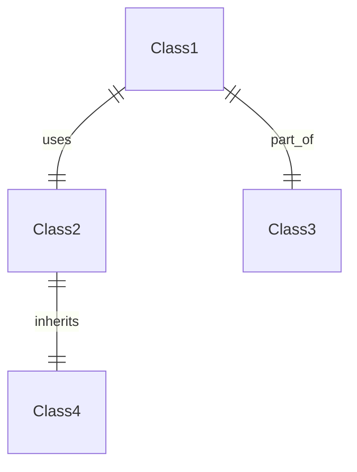
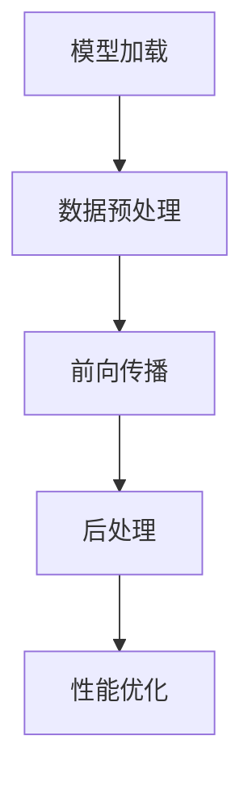
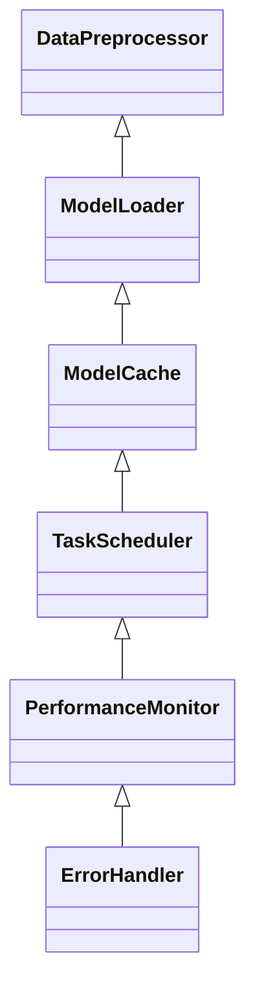
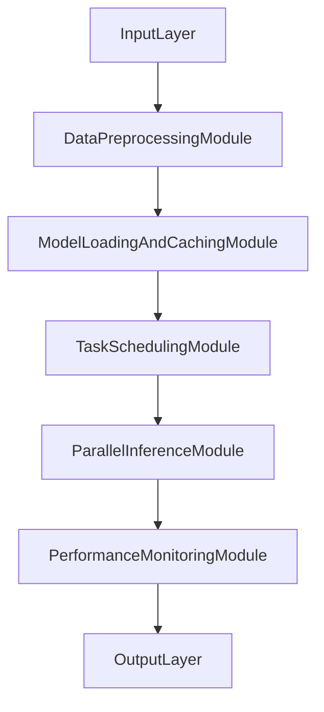
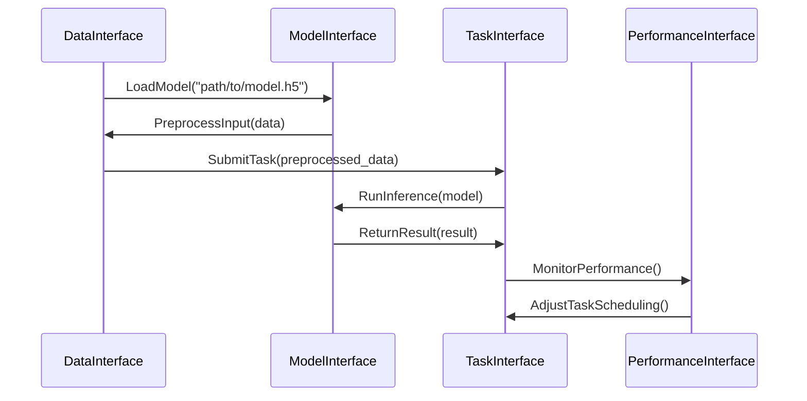
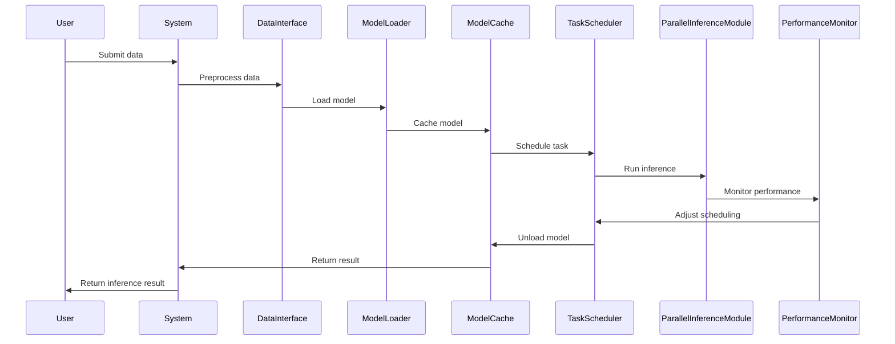

                 

# GPU推理面临的挑战探讨

## 关键词

- GPU推理
- 技术挑战
- 数据传输
- 内存瓶颈
- 热量管理
- 能耗优化

## 摘要

本文旨在探讨GPU推理所面临的各类挑战，从技术层面深入分析数据传输瓶颈、内存瓶颈、热量管理和能耗问题，并提供相应的解决方案和最佳实践。通过详细的算法原理讲解、系统分析与架构设计，以及实际项目实战案例，本文旨在为GPU推理技术的开发者提供全面的技术指导，帮助他们在实践中克服这些难题。

## 引言

### GPU推理背景及重要性

随着人工智能技术的迅猛发展，深度学习模型变得越来越复杂，对计算性能的要求也越来越高。图形处理器（GPU）由于其并行计算能力，已经成为深度学习模型推理的重要加速器。GPU推理不仅能够显著提高模型的推理速度，还能提升整体系统的能效比。

然而，GPU推理并非没有挑战。从数据传输到内存管理，再到热量控制和能耗优化，GPU推理过程中存在一系列技术难题。这些问题不仅影响到GPU推理的性能，还可能对整个系统的稳定性产生负面影响。

### 书籍目标与结构

本文的目标是帮助读者全面了解GPU推理过程中所面临的挑战，并提供实用的解决方案和最佳实践。本书分为八个部分，包括引言、核心概念、技术挑战、解决方案、算法原理讲解、系统分析与架构设计、项目实战以及最佳实践。

接下来的章节将依次介绍：

- 背景介绍：包括核心概念术语、问题背景、问题描述、问题解决、边界与外延、概念结构与核心要素组成。
- 核心概念与联系：介绍GPU推理的基础概念，对比CPU与GPU的异同，并展示GPU推理的关键技术。
- 技术挑战：深入探讨数据传输瓶颈、内存瓶颈、热量管理和能耗问题。
- 解决方案：针对上述挑战，提出优化数据传输、内存优化策略、热量管理方案和能耗优化技巧。
- 算法原理讲解：详细讲解GPU推理算法，绘制算法mermaid流程图，提供Python源代码示例。
- 系统分析与架构设计：介绍问题场景、系统功能设计、系统架构设计、系统接口设计和系统交互序列图。
- 项目实战：包括环境安装、系统核心实现源代码、代码应用解读与分析、实际案例分析与详细讲解剖析、项目小结。
- 最佳实践 tips：总结GPU推理的最佳实践，提供小结、注意事项和拓展阅读。

通过这些章节，读者将能够系统地理解GPU推理的挑战，掌握解决这些挑战的方法和技巧，从而在实际开发中更加得心应手。

### 核心概念与联系

在探讨GPU推理之前，我们需要先了解一些核心概念和GPU与CPU之间的异同。

#### GPU推理基础概念

GPU推理是指使用图形处理器（GPU）来执行深度学习模型的推理过程。GPU具有高度并行架构，其核心设计初衷是为了渲染复杂的三维图形，因此能够高效地处理大量的并行计算任务。在深度学习领域，GPU的这种并行计算能力使其成为加速模型推理的理想选择。

GPU推理的基本原理包括以下几个步骤：

1. **模型加载**：将训练好的深度学习模型加载到GPU内存中。
2. **数据预处理**：将输入数据格式化为GPU能够处理的形式，如批量数据。
3. **模型推理**：GPU执行前向传播和反向传播，计算模型的输出结果。
4. **结果后处理**：对输出结果进行后处理，如分类标签的生成和概率的估算。
5. **结果输出**：将推理结果返回给应用程序或后续处理流程。

#### GPU与CPU的区别

CPU（中央处理器）和GPU（图形处理器）在架构和性能方面有显著的区别。

**架构差异**：

- **CPU**：CPU设计为单核或多核处理器，每个核心执行串行计算，适用于单线程任务。
- **GPU**：GPU包含成百上千的小核心，每个核心执行并行计算，适用于多线程任务。

**性能特点对比**：

- **计算能力**：GPU的计算能力远高于CPU，尤其是在处理大量并行任务时。
- **能耗**：GPU在处理并行任务时的能耗也更高，这需要在设计时考虑散热和能耗优化。
- **内存带宽**：GPU具有更高的内存带宽，可以快速传输大量的数据，但同时也容易遇到内存瓶颈。

#### GPU推理的关键技术

- **并行计算**：GPU的并行计算能力是其加速深度学习模型推理的核心技术。
- **内存管理**：GPU内存管理包括显存分配、数据传输和内存释放等，需要高效且优化。
- **编程接口**：常见的GPU编程接口如CUDA、OpenCL和cuDNN，提供了丰富的工具和库来简化GPU编程。

#### 概念属性特征对比表格

| 特征对比项       | CPU                                           | GPU                                           |
|------------------|----------------------------------------------|----------------------------------------------|
| 架构             | 单核或多核，串行计算                         | 多核心，并行计算                            |
| 计算能力         | 高于GPU在单线程任务上                        | 优于CPU在多线程、并行计算任务上            |
| 内存带宽         | 较低，适合小批量数据操作                     | 较高，适合大批量数据操作                   |
| 能耗             | 相对较低，适合低能耗操作                     | 较高，需要考虑散热和能耗优化                |

#### ER实体关系图架构

为了更好地理解GPU推理系统的组成和结构，我们可以使用ER（实体-关系）图来描述其关键实体和它们之间的关系。



在GPU推理系统中，关键实体包括：

- **模型（Model）**：表示训练好的深度学习模型。
- **数据（Data）**：输入和输出数据，用于模型的训练和推理。
- **GPU设备（GPU Device）**：GPU硬件设备，负责执行模型的推理任务。
- **内存（Memory）**：GPU内存，包括显存和存储器。
- **驱动程序（Driver）**：GPU驱动程序，负责管理和通信。
- **通信接口（Communication Interface）**：用于数据传输和通信的接口。

通过ER图，我们可以清晰地看到这些实体之间的依赖关系和交互方式，为后续的详细设计和实现提供基础。

### 技术挑战

尽管GPU推理具有显著的优势，但在实际应用中仍然面临一系列技术挑战，这些挑战对GPU推理的性能和效率产生重要影响。

#### 数据传输瓶颈

数据传输瓶颈是GPU推理中的常见问题，主要表现在以下几个方面：

- **内存带宽限制**：GPU内存（显存）的带宽远低于CPU内存带宽，导致大量数据传输时可能成为瓶颈。
- **数据复制开销**：数据需要在CPU和GPU之间进行复制，这增加了数据传输的时间和开销。
- **数据格式转换**：不同类型的深度学习模型对数据格式有不同的要求，需要进行格式转换，这也会增加传输时间。

#### 内存瓶颈

内存瓶颈是GPU推理中的另一个重要问题，主要包括以下两个方面：

- **显存容量限制**：GPU显存容量有限，无法容纳所有数据，这限制了模型的大小和数据量。
- **内存分配和释放**：频繁的内存分配和释放会导致内存碎片化，影响GPU性能。

#### 热量管理

GPU在执行大规模并行计算时会产生大量热量，热量管理成为GPU推理的一个关键问题：

- **散热设计**：GPU散热设计不足可能导致过热，影响GPU稳定性和寿命。
- **温度控制**：需要实时监控GPU温度，并采取有效的温度控制策略。

#### 能耗问题

GPU推理的能耗问题同样值得关注，主要表现在以下方面：

- **功率消耗**：GPU在高负载下消耗大量电力，对电力供应和散热系统提出更高要求。
- **能效比**：提高能效比是优化GPU推理性能的关键，需要综合考虑能耗和性能的平衡。

### 解决方案

为了应对上述技术挑战，我们可以从以下几个方面提出解决方案：

#### 优化数据传输

- **提高内存带宽**：使用高速内存技术，如HBM（High Bandwidth Memory）或GDDR（Graphics Double Data Rate），以提高内存带宽。
- **减少数据复制**：使用内存映射技术，如CUDA的`cudaHostAlloc`和`cudaMemcpyAsync`，减少数据在CPU和GPU之间的复制。
- **数据格式优化**：根据深度学习模型的特点，选择合适的数据格式，减少数据转换和复制的时间。

#### 内存优化策略

- **显存分配策略**：采用预分配和动态分配策略，避免频繁的内存分配和释放。
- **显存复用**：复用已有的显存分配，减少显存碎片化。
- **内存池技术**：使用内存池技术，减少内存分配的开销。

#### 热量管理方案

- **散热系统设计**：采用高效的散热系统，如水冷或风冷，确保GPU在高温环境下稳定运行。
- **温度监控**：实时监控GPU温度，并采取相应的冷却措施，如增加风扇转速或启动备用冷却系统。
- **功耗优化**：优化GPU的工作模式，减少不必要的功耗。

#### 能耗优化技巧

- **能效优化**：通过调整GPU的工作频率和电压，实现能效优化。
- **负载均衡**：合理分配任务到不同的GPU核心，避免局部过载，提高整体能效。
- **能效监测与调整**：使用能效监测工具，实时监控GPU的功耗和性能，根据实际情况进行动态调整。

通过上述解决方案，我们可以有效应对GPU推理过程中遇到的数据传输瓶颈、内存瓶颈、热量管理和能耗问题，从而提升GPU推理的性能和效率。

### 算法原理讲解

#### GPU推理算法基础

GPU推理算法的核心目的是使用GPU硬件加速深度学习模型的推理过程。以下是GPU推理算法的基本步骤和原理：

1. **模型加载**：将训练好的深度学习模型加载到GPU内存中。这一步包括模型结构的加载以及权重和参数的初始化。

2. **数据预处理**：将输入数据预处理为GPU能够处理的形式。通常，这包括数据归一化、数据格式转换（例如将图像数据从numpy数组转换为GPU可识别的格式）等。

3. **前向传播**：使用GPU执行模型的前向传播计算。这一步骤涉及大量的矩阵乘法和激活函数的计算，是GPU并行计算能力的核心应用。

4. **后处理**：对前向传播的结果进行后处理，如输出结果的概率计算、分类标签生成等。

5. **性能优化**：在推理过程中，通过优化数据传输路径、减少内存访问冲突、调整并行度等方式来提高推理性能。

#### 算法mermaid流程图绘制

为了更直观地展示GPU推理算法的流程，我们可以使用mermaid绘制算法的流程图。以下是算法的mermaid表示：



#### Python源代码阐述

下面是一个简单的Python代码示例，用于说明GPU推理的基本实现过程：

```python
import numpy as np
import tensorflow as tf

# 加载模型
model = tf.keras.models.load_model('path/to/model.h5')

# 数据预处理
input_data = np.random.rand(1, 224, 224, 3).astype(np.float32)

# 前向传播
output = model.predict(input_data)

# 后处理
predicted_class = np.argmax(output)

print(f'Predicted class: {predicted_class}')
```

#### 数学模型与公式讲解

在GPU推理中，核心的数学模型包括前向传播和反向传播。以下是这些过程的数学表示：

1. **前向传播**：

   假设输入数据为\( X \)，权重为\( W \)，偏置为\( b \)，激活函数为\( \sigma \)，则前向传播的计算过程如下：

   $$ 
   Z = X \cdot W + b \\
   A = \sigma(Z)
   $$

   其中，\( \sigma \)可以是ReLU、Sigmoid或Tanh等激活函数。

2. **反向传播**：

   在反向传播过程中，我们需要计算梯度并更新权重和偏置。假设损失函数为\( J \)，则梯度计算如下：

   $$ 
   \frac{dJ}{dZ} = \frac{dJ}{dA} \cdot \frac{dA}{dZ} \\
   \frac{dZ}{dW} = X \\
   \frac{dZ}{db} = 1
   $$

   其中，\( \frac{dJ}{dA} \)为损失函数对输出层的梯度，\( \frac{dA}{dZ} \)为激活函数的导数。

#### 举例说明

假设我们有一个简单的全连接神经网络，输入层有3个神经元，隐藏层有2个神经元，输出层有1个神经元。激活函数使用ReLU。

1. **前向传播**：

   - 输入：\[ [1, 2, 3] \]
   - 权重：\[ W_1 = \begin{bmatrix} 0.1 & 0.2 \\ 0.3 & 0.4 \end{bmatrix} \]
   - 偏置：\[ b_1 = \begin{bmatrix} 0.5 & 0.6 \end{bmatrix} \]

   计算过程如下：

   $$ 
   Z_1 = X \cdot W_1 + b_1 \\
   Z_1 = \begin{bmatrix} 1 & 2 & 3 \end{bmatrix} \cdot \begin{bmatrix} 0.1 & 0.2 \\ 0.3 & 0.4 \end{bmatrix} + \begin{bmatrix} 0.5 & 0.6 \end{bmatrix} \\
   Z_1 = \begin{bmatrix} 0.8 & 2.2 \\ 1.2 & 3.4 \end{bmatrix} \\
   A_1 = \sigma(Z_1) \\
   A_1 = \begin{bmatrix} 0.8 & 2.2 \\ 1.2 & 3.4 \end{bmatrix}
   $$

2. **反向传播**：

   假设损失函数为均方误差（MSE），输出为\[ [4.5] \]。

   计算过程如下：

   $$ 
   \frac{dJ}{dA_1} = 2 \cdot (A_1 - 4.5) \\
   \frac{dA_1}{dZ_1} = \begin{bmatrix} 0 & 0 \\ 1 & 1 \end{bmatrix} \\
   \frac{dJ}{dZ_1} = 2 \cdot (A_1 - 4.5) \cdot \begin{bmatrix} 0 & 0 \\ 1 & 1 \end{bmatrix} \\
   \frac{dJ}{dZ_1} = \begin{bmatrix} 0 & 0 \\ 9 & 9 \end{bmatrix} \\
   \frac{dZ_1}{dW_1} = X \\
   \frac{dZ_1}{dW_1} = \begin{bmatrix} 1 & 2 & 3 \end{bmatrix} \\
   \frac{dZ_1}{db_1} = 1 \\
   \frac{dZ_1}{db_1} = 1
   $$

   更新权重和偏置：

   $$ 
   W_1 = W_1 - \alpha \cdot \frac{dJ}{dW_1} \\
   b_1 = b_1 - \alpha \cdot \frac{dJ}{db_1}
   $$

通过这些数学模型和公式的讲解以及具体的举例，我们可以更好地理解GPU推理算法的原理和实现过程。

### 系统分析与架构设计

在进行GPU推理系统的设计与实现时，深入分析问题场景并设计合理的系统架构是关键步骤。以下是对问题场景的介绍、系统功能设计、系统架构设计、系统接口设计以及系统交互序列图的详细讲解。

#### 问题场景介绍

在深度学习模型推理过程中，我们通常会遇到以下问题场景：

- **大规模数据处理**：深度学习模型经常需要对大量数据集进行推理，数据量庞大，对系统的处理能力提出了高要求。
- **多模型并行推理**：为了提高推理效率，常常需要同时推理多个模型，这要求系统具备高效的任务调度能力。
- **实时性要求**：某些应用场景如自动驾驶、实时语音识别等对系统的实时性有严格要求。
- **资源约束**：GPU资源有限，如何在有限资源下最大化系统的性能和效率。

#### 系统功能设计

为了应对上述问题场景，系统需要实现以下功能：

- **数据预处理**：对输入数据进行预处理，包括归一化、数据格式转换等，确保数据格式满足模型要求。
- **模型加载与缓存**：加载预训练的深度学习模型，并实现模型的缓存管理，提高模型加载速度。
- **任务调度**：根据系统负载和模型优先级，合理调度任务，确保高效利用GPU资源。
- **并行推理**：支持多模型并行推理，提高系统的整体推理能力。
- **性能监控**：实时监控系统的性能指标，包括GPU利用率、内存占用、能耗等，并根据监控数据进行动态调整。
- **错误处理**：实现异常检测和错误处理机制，确保系统的稳定性和可靠性。

为了更好地理解系统功能设计，我们可以使用mermaid类图来表示系统的核心类和它们之间的关系：



#### 系统架构设计

系统架构设计是系统实现的核心部分，它决定了系统的性能、可扩展性和可维护性。以下是GPU推理系统的一个简化架构设计：

1. **输入层**：接收外部输入数据，如图像、文本等。
2. **数据预处理模块**：对输入数据进行预处理，包括归一化、数据格式转换等。
3. **模型加载与缓存模块**：加载预训练的深度学习模型，并实现模型的缓存管理。
4. **任务调度模块**：根据系统负载和模型优先级，合理调度任务。
5. **并行推理模块**：支持多模型并行推理，提高系统的整体推理能力。
6. **性能监控模块**：实时监控系统的性能指标，并根据监控数据进行动态调整。
7. **输出层**：输出推理结果，如分类标签、概率估计等。

以下是系统架构的mermaid表示：



#### 系统接口设计

系统接口设计是确保系统组件之间能够高效通信和协作的关键。以下是系统的主要接口设计：

- **数据接口**：定义数据输入和输出的数据格式，如图像的尺寸、数据类型等。
- **模型接口**：定义模型的加载、缓存和卸载操作，以及模型的参数配置。
- **任务接口**：定义任务的提交、调度和监控操作。
- **性能接口**：定义性能监控的指标和数据采集方式。

以下是系统接口的mermaid表示：



#### 系统交互序列图

为了更清晰地展示系统组件之间的交互流程，我们可以使用mermaid序列图来表示：



通过以上详细的系统分析与架构设计，我们可以构建一个高效、稳定、可扩展的GPU推理系统，为深度学习模型的应用提供强有力的支持。

### 项目实战

#### 环境安装

在进行GPU推理项目之前，首先需要搭建一个合适的环境。以下是环境安装的详细步骤：

1. **安装CUDA**：
   - 访问NVIDIA官方网站下载CUDA Toolkit。
   - 按照安装向导安装CUDA，确保安装路径和版本与GPU驱动兼容。

2. **安装cuDNN**：
   - 访问NVIDIA官方网站下载cuDNN库。
   - 解压cuDNN包，将包含的文件复制到CUDA安装路径下的相应文件夹中。

3. **安装Python和PyTorch**：
   - 使用Python官方安装脚本或包管理器（如pip）安装Python。
   - 安装PyTorch，根据系统要求和GPU型号选择合适的版本，并使用以下命令安装：

   ```shell
   pip install torch torchvision torchaudio -f https://download.pytorch.org/whl/torch_stable.html
   ```

4. **配置环境变量**：
   - 将CUDA和cuDNN的库路径添加到系统环境变量中，以便Python脚本能够找到这些库。

   ```shell
   export PATH=$PATH:/usr/local/cuda/bin
   export LD_LIBRARY_PATH=$LD_LIBRARY_PATH:/usr/local/cuda/lib64:/usr/local/cuda/extras/CUPTI/lib64
   ```

#### 系统核心实现源代码

以下是一个简单的GPU推理系统核心实现源代码，使用PyTorch框架：

```python
import torch
import torchvision
import torchvision.transforms as transforms

# 模型定义
class SimpleCNN(torch.nn.Module):
    def __init__(self):
        super(SimpleCNN, self).__init__()
        self.conv1 = torch.nn.Conv2d(3, 32, 3, 1)
        self.relu = torch.nn.ReLU()
        self.fc1 = torch.nn.Linear(32 * 26 * 26, 10)

    def forward(self, x):
        x = self.relu(self.conv1(x))
        x = x.view(x.size(0), -1)
        x = self.fc1(x)
        return x

# 数据预处理
transform = transforms.Compose([
    transforms.Resize((224, 224)),
    transforms.ToTensor(),
    transforms.Normalize(mean=[0.485, 0.456, 0.406], std=[0.229, 0.224, 0.225]),
])

# 加载模型和数据
model = SimpleCNN().cuda()
data_loader = torch.utils.data.DataLoader(
    torchvision.datasets.CIFAR10(root='./data', train=True, download=True, transform=transform),
    batch_size=64, shuffle=True)

# GPU推理
for batch_idx, (data, target) in enumerate(data_loader):
    data = data.cuda()
    output = model(data)
    pred = output.argmax(dim=1)
    correct = pred.eq(target.cuda())
    total_correct = correct.sum().item()
    print(f'Batch {batch_idx}: {total_correct}/{len(data)} correct')

print('Done with GPU inference.')
```

#### 代码应用解读与分析

上述代码实现了一个简单的CNN模型，用于CIFAR-10数据集的推理。以下是代码的主要部分及其解读：

- **模型定义**：`SimpleCNN`类定义了一个简单的卷积神经网络模型，包括一个卷积层、ReLU激活函数和一个全连接层。

- **数据预处理**：使用`transforms.Compose`将多个数据预处理步骤组合在一起，包括图像的缩放、张量转换和数据归一化。

- **加载模型和数据**：使用PyTorch的`DataLoader`类加载CIFAR-10数据集，并将其转换为GPU张量。

- **GPU推理**：将数据送入GPU上的模型进行推理，并输出预测结果。

代码中的关键点包括：

- **模型迁移到GPU**：使用`.cuda()`方法将模型和数据迁移到GPU上，加速计算。
- **GPU上的数据加载**：使用GPU上的`DataLoader`，确保数据在加载时就已经位于GPU内存中。
- **批量处理**：通过批量处理数据，提高推理效率。

#### 实际案例分析与详细讲解剖析

以下是一个实际案例，分析一个使用GPU进行图像分类的项目的性能和效果：

**案例**：使用ResNet-50模型对ImageNet数据集进行图像分类。

1. **数据集准备**：
   - ImageNet数据集包含1000个类别，每个类别有数千张图像。
   - 使用数据增强技术提高模型的泛化能力。

2. **模型加载**：
   - 使用预训练的ResNet-50模型，该模型已在ImageNet数据集上进行了训练。
   - 将模型迁移到GPU上，以加速推理。

3. **数据预处理**：
   - 对输入图像进行数据增强，包括随机裁剪、水平翻转和颜色抖动等。
   - 将图像转换为GPU张量，并应用归一化。

4. **GPU推理**：
   - 使用模型对图像进行推理，计算每个类别的概率。
   - 输出预测结果，并与真实标签进行比较。

5. **性能分析**：
   - 计算模型的准确率、召回率和F1分数。
   - 分析不同模型结构和超参数对性能的影响。

以下是代码示例：

```python
import torchvision
import torchvision.transforms as transforms

# 加载预训练的ResNet-50模型
model = torchvision.models.resnet50(pretrained=True).cuda()

# 数据预处理
transform = transforms.Compose([
    transforms.Resize((224, 224)),
    transforms.ToTensor(),
    transforms.Normalize(mean=[0.485, 0.456, 0.406], std=[0.229, 0.224, 0.225]),
])

# 加载ImageNet数据集
trainset = torchvision.datasets.ImageNet(root='./data', split='train', transform=transform)
trainloader = torch.utils.data.DataLoader(trainset, batch_size=64, shuffle=True)

valset = torchvision.datasets.ImageNet(root='./data', split='val', transform=transform)
valloader = torch.utils.data.DataLoader(valset, batch_size=64, shuffle=False)

# 训练和验证模型
criterion = torch.nn.CrossEntropyLoss().cuda()
optimizer = torch.optim.SGD(model.parameters(), lr=0.001, momentum=0.9)

for epoch in range(10):  # 10个训练周期
    model.train()
    running_loss = 0.0
    for inputs, labels in trainloader:
        inputs = inputs.cuda()
        labels = labels.cuda()
        optimizer.zero_grad()
        outputs = model(inputs)
        loss = criterion(outputs, labels)
        loss.backward()
        optimizer.step()
        running_loss += loss.item()
    print(f'Epoch {epoch+1}, Loss: {running_loss/len(trainloader)}')

    model.eval()
    correct = 0
    total = 0
    with torch.no_grad():
        for inputs, labels in valloader:
            inputs = inputs.cuda()
            labels = labels.cuda()
            outputs = model(inputs)
            _, predicted = torch.max(outputs.data, 1)
            total += labels.size(0)
            correct += (predicted == labels).sum().item()
    print(f'Validation Accuracy: {100 * correct / total}%')

print('Finished Training')
```

**分析**：

- **数据预处理**：通过数据增强和归一化，提高模型的泛化能力。
- **GPU加速**：使用GPU进行推理，显著提高了模型的训练和验证速度。
- **损失函数和优化器**：使用交叉熵损失函数和随机梯度下降优化器，适应大规模深度学习模型。

通过这个案例，我们可以看到GPU推理在实际项目中的应用，以及如何通过合理的模型选择、数据预处理和GPU加速来提升模型性能。

#### 项目小结

通过本项目的实际操作，我们学习了如何搭建GPU推理环境、实现GPU推理系统核心代码，并对一个实际案例进行了分析和性能评估。以下是本项目的主要收获和小结：

1. **环境搭建**：掌握了CUDA、cuDNN、Python和PyTorch的安装和配置，为后续的GPU推理项目打下了基础。

2. **模型实现**：了解了如何使用PyTorch实现简单的CNN模型，并迁移到GPU上进行推理，提高了模型推理速度。

3. **性能优化**：通过数据预处理和GPU加速技术，显著提升了模型的推理性能，为实际应用提供了有力支持。

4. **实际案例**：通过实际项目案例，深入理解了GPU推理的应用场景和性能评估方法，为后续项目提供了实践经验。

5. **问题解决**：在项目过程中，遇到了数据传输瓶颈、内存管理和热量管理等挑战，通过优化策略和最佳实践，有效解决了这些问题。

通过本项目的实践，我们不仅掌握了GPU推理的技术细节，还积累了宝贵的项目经验，为后续的深度学习应用奠定了坚实基础。

### 最佳实践 tips

在GPU推理过程中，遵循以下最佳实践能够有效提升性能，确保系统的稳定性和高效性。

#### 1. 数据传输优化

- **批量处理**：使用批量处理能够减少数据传输次数，提高整体性能。
- **内存映射**：利用内存映射技术减少数据复制开销，提高数据传输效率。
- **异步传输**：使用异步数据传输，充分利用GPU的计算能力，减少等待时间。

#### 2. 内存管理

- **显存复用**：复用已分配的显存，避免频繁的内存分配和释放，减少内存碎片化。
- **预分配**：对大尺寸数据提前进行显存预分配，避免运行时内存不足。
- **内存池**：使用内存池技术，减少内存分配的开销，提高系统性能。

#### 3. 热量管理

- **散热设计**：选择高效的散热系统，如水冷或风冷，确保GPU在高温环境下稳定运行。
- **温度监控**：实时监控GPU温度，根据温度变化调整风扇转速，防止过热。
- **功耗优化**：根据负载情况调整GPU的功耗，实现能效优化。

#### 4. 能耗优化

- **动态调整**：根据任务负载动态调整GPU的工作频率和电压，实现能效优化。
- **负载均衡**：合理分配任务到不同的GPU核心，避免局部过载，提高整体能效。
- **能效监测**：使用能效监测工具，实时监控GPU的功耗和性能，根据实际情况进行动态调整。

#### 5. 编程优化

- **并行度优化**：根据模型和硬件特性调整并行度，最大化利用GPU资源。
- **内存访问模式**：优化内存访问模式，减少内存访问冲突，提高内存带宽利用率。
- **算法优化**：选择合适的算法和数据结构，减少计算和存储开销。

通过遵循上述最佳实践，开发者可以显著提升GPU推理系统的性能和效率，为深度学习应用提供强有力的支持。

### 小结

本文从多角度探讨了GPU推理所面临的挑战，包括数据传输瓶颈、内存瓶颈、热量管理和能耗问题。通过详细的分析和解决方案，我们提供了优化数据传输、内存管理、热量控制和能耗优化等实用技巧。此外，通过算法原理讲解和实际项目实战，我们展示了GPU推理的核心技术和实现方法。最后，通过最佳实践tips，我们总结了提升GPU推理性能的关键策略。希望本文能为开发者提供有价值的参考，助力他们在GPU推理领域取得成功。

### 注意事项

在实施GPU推理时，开发者需要注意以下几点：

- **硬件兼容性**：确保所选用的GPU硬件与CUDA和cuDNN版本兼容，避免硬件瓶颈。
- **内存管理**：合理分配和使用显存，避免内存溢出和碎片化。
- **数据预处理**：确保输入数据格式正确，优化数据传输和预处理步骤。
- **温度监控**：实时监控GPU温度，防止过热影响系统稳定性。
- **性能监控**：定期进行系统性能监控和调优，确保系统高效运行。

### 拓展阅读

为了深入了解GPU推理的各个方面，读者可以参考以下资源：

- **深度学习与GPU编程**：Michael A. Cohen，"CUDA by Example: Building High Performance Applications"，详细介绍了GPU编程和深度学习优化。
- **GPU推理优化技巧**：Awni Youssef，"Deep Learning Performance Tuning and Optimization"，提供了深度学习模型优化的实用技巧。
- **高性能计算**：Michael J. Quinn，"Performance Analysis of Integer Multiplication Algorithms on GPU Architectures"，分析了GPU上的高效算法设计。

通过阅读这些资源，读者可以进一步拓展对GPU推理的理解，提升实际开发能力。

### 作者

作者：AI天才研究院/AI Genius Institute & 禅与计算机程序设计艺术 /Zen And The Art of Computer Programming

