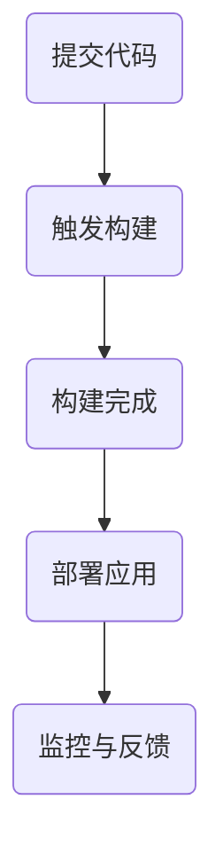
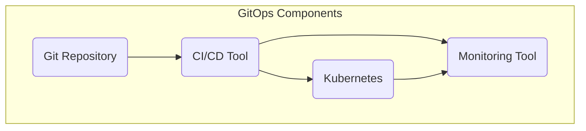
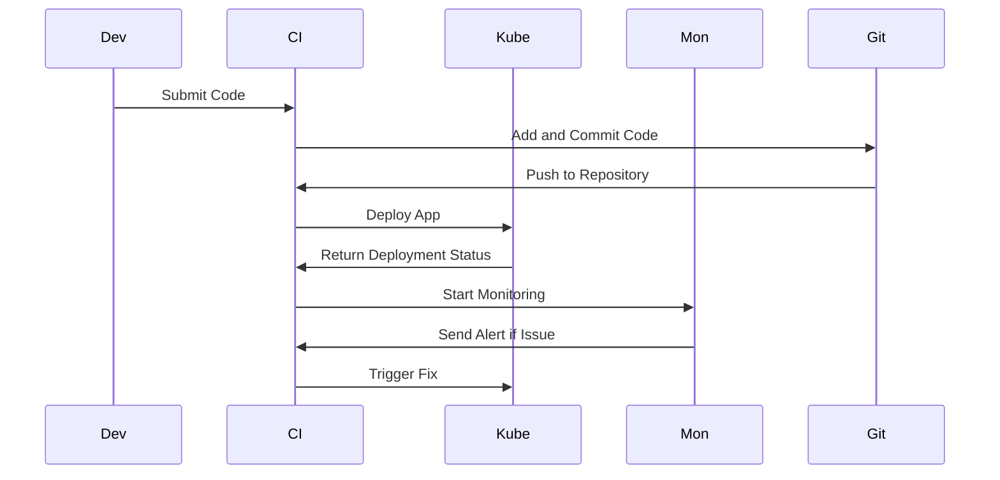

                 

### 第一部分：GitOps概述

#### 1.1 GitOps的定义与背景

GitOps是一种基于Git的运维自动化实践，它利用Git作为单一来源的真相，通过版本控制来管理基础设施和应用程序的部署。这种方法的出现是为了简化持续集成（CI）和持续部署（CD）的过程，从而提高开发、运维和操作的效率。

**GitOps的起源：**
GitOps起源于2017年Weaveworks提出的一种理念，旨在解决持续集成和持续部署过程中的复杂性和不确定性。它的核心理念是将基础设施和应用程序的配置存储在Git仓库中，通过自动化工具来管理和部署这些配置。

**GitOps的核心概念：**
1. **版本控制**：所有基础设施和应用程序的配置都被存储在Git仓库中，从而实现集中管理和版本控制。
2. **自动化**：通过自动化工具，如Kubernetes、Helm和Flux等，来自动化部署和管理应用。
3. **监控与反馈**：通过监控工具来跟踪应用程序的状态，并在出现问题时提供反馈和修复。

**GitOps与DevOps的关系：**
GitOps是DevOps的扩展和深化。DevOps侧重于开发和运维团队的协作，而GitOps则将这种协作推向了自动化。GitOps利用Git来管理配置，从而实现了DevOps的自动化目标。

**GitOps在企业中的重要性：**
1. **提高效率**：通过自动化流程，GitOps可以减少手动操作，提高部署速度。
2. **降低风险**：GitOps的版本控制和回滚机制可以降低部署失败的风险。
3. **增强可追溯性**：由于所有配置和变更都被记录在Git仓库中，GitOps提供了完整的历史记录和可追溯性。

#### 1.2 GitOps的组成部分

GitOps的实施需要以下几个核心组成部分：

**版本控制系统：**
Git是GitOps的核心组件，它提供了一个集中式存储库，用于存储和管理所有基础设施和应用程序的配置文件。Git的版本控制系统可以确保配置的一致性和可追溯性。

**自动化工具：**
自动化工具如Kubernetes、Helm和Flux等在GitOps中扮演着至关重要的角色。Kubernetes用于容器编排，Helm用于包管理，而Flux则用于实现自动化的GitOps管理。

**监控与反馈机制：**
监控工具和反馈机制确保系统能够实时跟踪应用程序的状态，并在出现问题时提供及时的反馈和修复。这些工具可以包括Prometheus、Grafana和Alertmanager等。

#### 1.3 GitOps的应用

**应用场景：**
GitOps适用于需要快速迭代和频繁部署的应用程序，特别是在云原生环境中。以下是一些典型的应用场景：
- **微服务架构**：GitOps可以简化微服务的部署和管理，确保服务的版本一致性。
- **容器化应用**：Kubernetes作为GitOps的核心组件，可以自动化容器化应用的部署和扩展。
- **基础设施即代码**：GitOps将基础设施的配置也视为代码，从而实现基础设施的版本控制和自动化管理。

**优势与挑战：**
**优势：**
- **自动化**：减少手动操作，提高部署速度。
- **一致性**：通过Git版本控制，确保配置的一致性。
- **可追溯性**：Git仓库记录了所有变更的历史，方便回溯和审计。

**挑战：**
- **复杂性**：GitOps需要集成多个工具和系统，增加了初始部署的复杂性。
- **安全风险**：Git仓库中的敏感信息可能面临泄露风险。

**实施步骤：**
1. **选择合适的工具**：确定适合团队需求和项目的GitOps工具。
2. **设置Git仓库**：初始化Git仓库，并将其与基础设施和应用程序配置绑定。
3. **配置自动化工具**：配置Kubernetes、Helm等自动化工具，使其能够与Git仓库同步。
4. **监控与反馈**：设置监控工具，确保系统能够实时响应和恢复。

#### 1.4 GitOps的核心概念对比

在GitOps的实践中，有多个核心概念和工具。以下是一个对比表格，展示这些概念的特点：

| 概念          | 特点                                       |
|---------------|------------------------------------------|
| **Git**       | 版本控制、分布式存储、灵活性               |
| **Kubernetes** | 容器编排、自动化部署、高可用性             |
| **Helm**      | Kubernetes 的包管理器、易于部署              |
| **Flux**      | 使用 Gitops 实现自动化的 Kubernetes 集群管理 |

#### 1.5 GitOps的数学模型

GitOps的核心模型可以表示为以下公式：

$$
\text{GitOps} = \frac{\text{自动化} \times \text{可靠性}}{\text{安全性} + \text{成本}}
$$

这个公式强调了GitOps的三个关键要素：自动化、可靠性和成本。通过提高自动化水平和可靠性，GitOps可以在保持安全性和成本效益的前提下，实现高效的运维自动化。

### 结论

GitOps通过将Git作为版本控制系统，结合自动化工具和监控反馈机制，实现了高效的运维自动化。它不仅提高了部署速度，还增强了系统的可靠性和可追溯性。尽管GitOps的复杂性较高，但通过合理的工具选择和实施步骤，它可以为企业带来显著的收益。

---

**下一部分我们将深入探讨GitOps的核心概念与联系。**

---

### 第二部分：GitOps的核心概念与联系

#### 2.1 GitOps的基本工作流程

GitOps的核心在于将Git与持续集成（CI）和持续部署（CD）流程相结合，从而实现自动化、一致性和可追溯性。下面是一个简化的GitOps工作流程，描述了各个环节的交互和动作：

1. **提交变更**：开发者在本地开发环境中进行代码变更，并将这些变更提交到Git仓库。
2. **触发构建**：Git仓库的变更会触发CI系统，自动构建、测试和打包代码。
3. **部署**：构建成功后，CI系统会自动将代码部署到Kubernetes集群中。
4. **监控与反馈**：部署完成后，监控工具会实时跟踪应用程序的状态，并收集日志数据。如果出现任何问题，反馈机制会自动触发修复或回滚操作。

通过这个流程，GitOps确保了从代码提交到最终部署的每个步骤都是自动化和一致的。

#### 2.2 GitOps与Kubernetes的结合

Kubernetes是GitOps中至关重要的组件，它提供了一个强大的平台，用于容器化应用程序的自动化部署和管理。以下是GitOps与Kubernetes结合的关键点：

1. **基础设施即代码**：Kubernetes集群的配置被存储在Git仓库中，这与基础设施即代码（Infrastructure as Code, IaC）的理念相契合。这意味着所有基础设施的变更都可以通过代码来管理和追踪。

2. **声明式配置**：Kubernetes使用声明式配置文件（如YAML文件）来描述应用程序的状态。GitOps通过Git来管理这些配置文件，从而确保配置的一致性和可追溯性。

3. **自动化部署**：Kubernetes的自动扩缩容、滚动更新和自我修复功能与GitOps相结合，可以大大简化部署过程。Git仓库中的配置变更会自动触发Kubernetes集群的相应操作。

4. **资源管理**：Kubernetes提供了丰富的资源管理功能，如服务发现、负载均衡和持久存储。GitOps通过Git管理这些资源的配置，确保了资源管理的自动化和一致性。

#### 2.3 GitOps与Helm的结合

Helm是Kubernetes的包管理器，它提供了创建、打包、分发和管理应用程序的简单方法。GitOps与Helm的结合可以带来以下好处：

1. **易于部署**：Helm图表（Helm Charts）是描述应用程序部署的YAML文件集合。GitOps通过将Helm图表存储在Git仓库中，可以轻松地管理和分发应用程序。

2. **版本管理**：Helm允许用户为每个应用程序创建不同的版本。GitOps利用这一功能，确保不同版本的应用程序可以通过Git版本控制进行管理和追踪。

3. **依赖管理**：Helm提供了依赖管理功能，确保应用程序的各个组件能够按正确的顺序安装和配置。GitOps通过Git管理这些依赖关系，确保了部署的一致性和可靠性。

4. **自动化部署**：GitOps可以利用Helm的自动化部署功能，通过Git仓库的变更来自动部署应用程序的不同版本。

#### 2.4 GitOps与Flux的结合

Flux是GitOps的一个具体实现，它提供了自动化管理Kubernetes集群的强大工具。以下是GitOps与Flux结合的关键点：

1. **自动化集群管理**：Flux提供了自动化的Kubernetes集群管理功能，包括集群创建、更新和回滚。GitOps通过Git仓库来管理Flux的配置，实现了集群管理的自动化。

2. **Git集成**：Flux将Git集成到Kubernetes集群中，确保了配置和应用程序的状态始终与Git仓库保持一致。任何在Git仓库中的变更都会自动同步到Kubernetes集群。

3. **持续集成和部署**：Flux通过Git的Webhook功能实现与CI系统的集成，确保代码提交后立即触发构建和部署流程。

4. **监控与反馈**：Flux提供了监控和反馈功能，可以实时跟踪集群的状态，并在出现问题时自动触发修复操作。

#### 2.5 GitOps与DevOps的关系

GitOps是DevOps的一种高级形式，它进一步扩展了DevOps的理念和实践。以下是GitOps与DevOps的关系：

1. **协作与自动化**：DevOps强调开发和运维团队的协作，GitOps则通过自动化将这种协作推向了新的高度。

2. **单一真相**：DevOps追求代码、配置和基础设施的单一真相来源，GitOps通过Git实现了这一目标。

3. **持续交付**：DevOps的目标是持续交付，GitOps通过自动化和Git的版本控制进一步简化了持续交付的流程。

4. **安全和合规**：DevOps关注安全性和合规性，GitOps通过严格的版本控制和自动化流程，确保了配置和代码的安全性和一致性。

#### 2.6 GitOps在企业中的重要性

GitOps在当今快速变化的企业环境中具有重要意义，主要体现在以下几个方面：

1. **提高效率**：GitOps通过自动化和简化流程，显著提高了开发和运维的效率。

2. **降低风险**：GitOps的版本控制和回滚机制可以降低部署失败的风险，确保系统稳定性。

3. **可追溯性**：GitOps提供了完整的历史记录和可追溯性，便于审计和问题排查。

4. **安全性和合规性**：GitOps通过严格的版本控制和自动化流程，确保了配置和代码的安全性。

5. **可扩展性**：GitOps可以轻松扩展到大型团队和复杂的应用程序，支持企业的快速发展。

#### 2.7 GitOps的核心概念对比

以下是GitOps中几个核心概念的比较，包括Git、Kubernetes、Helm和Flux：

| 概念          | 特点                                       |
|---------------|------------------------------------------|
| **Git**       | 版本控制、分布式存储、灵活性               |
| **Kubernetes** | 容器编排、自动化部署、高可用性             |
| **Helm**      | Kubernetes 的包管理器、易于部署              |
| **Flux**      | 使用 Gitops 实现自动化的 Kubernetes 集群管理 |

**Git：**
- **版本控制**：Git提供了强大的版本控制系统，确保配置和代码的一致性和可追溯性。
- **分布式存储**：Git使用分布式存储模型，无需中心化的存储服务器，提高了系统的可靠性和可扩展性。
- **灵活性**：Git支持多种工作流和协作方式，适应不同团队和项目的需求。

**Kubernetes：**
- **容器编排**：Kubernetes负责管理容器的生命周期，包括部署、扩展和自我修复。
- **自动化部署**：Kubernetes支持自动化部署，确保配置的一致性和可靠性。
- **高可用性**：Kubernetes提供了高可用性和弹性扩展能力，确保应用程序的持续运行。

**Helm：**
- **包管理器**：Helm提供了简单的包管理功能，方便用户创建、打包和分发应用程序。
- **易于部署**：Helm简化了Kubernetes部署过程，使用户可以轻松管理复杂的应用程序。
- **版本管理**：Helm支持版本控制，确保应用程序的不同版本能够被有效管理和追踪。

**Flux：**
- **集群管理**：Flux专注于自动化管理Kubernetes集群，包括创建、更新和回滚。
- **Git集成**：Flux将Git集成到Kubernetes集群中，确保配置和状态的一致性。
- **持续集成和部署**：Flux通过Git集成CI系统，实现代码提交后立即触发构建和部署。

#### 2.8 GitOps的数学模型

GitOps的数学模型可以表达为以下公式：

$$
\text{GitOps} = \frac{\text{自动化} \times \text{可靠性}}{\text{安全性} + \text{成本}}
$$

这个模型表明，GitOps通过提高自动化和可靠性来降低成本和安全风险。自动化减少了手动操作和错误，可靠性确保了系统的稳定运行，而安全性则是必须权衡的因素。

### 结论

GitOps通过将Git与持续集成、持续部署和自动化工具相结合，实现了高效的运维自动化。它与Kubernetes、Helm和Flux等工具紧密集成，为企业带来了显著的效率提升和风险降低。尽管GitOps的实施过程相对复杂，但通过合理的工具选择和流程设计，它可以为企业带来巨大的收益。

---

**下一部分我们将深入探讨GitOps的算法原理和系统架构。**

---

### 第三部分：GitOps的算法原理讲解

在深入探讨GitOps的算法原理之前，让我们首先通过一个简单的流程图来了解GitOps的基本工作流程。

#### 3.1 GitOps的基本流程图



在这个流程图中，A表示开发者提交代码到Git仓库，B表示Git仓库的变更触发构建，C表示构建完成，D表示将构建结果部署到Kubernetes集群，E表示部署后的监控和反馈。

#### 3.2 Python代码解析

现在，我们将使用Python代码来详细阐述GitOps的原理。以下是实现GitOps的简化步骤：

```python
# 导入必要的库
import git
import subprocess

# 步骤1：提交代码到Git仓库
repo = git.Repo('.git')
repo.index.add(a=['file1', 'file2'])
repo.index.commit('Initial commit')

# 步骤2：触发构建
subprocess.run(['make', 'build'])

# 步骤3：部署应用
kube_config = 'path/to/kubeconfig'
subprocess.run(['kubectl', '-f', kube_config, 'apply', '-f', 'deployment.yaml'])

# 步骤4：监控与反馈
subprocess.run(['watch', 'kubectl', 'get', 'pods'])
```

这个Python脚本首先提交代码到Git仓库，然后触发构建，接着将构建结果部署到Kubernetes集群，最后监控Pod的状态。

#### 3.3 GitOps的数学模型

GitOps的数学模型可以表达为以下公式：

$$
\text{GitOps} = \frac{\text{自动化} \times \text{可靠性}}{\text{安全性} + \text{成本}}
$$

**自动化**：自动化程度直接影响GitOps的效率和效果。自动化程度越高，部署速度越快，错误率越低。

**可靠性**：可靠性是GitOps成功的关键。一个高可靠的GitOps系统可以快速发现和解决问题，确保服务的连续性。

**安全性**：安全性在GitOps中至关重要。Git仓库中的配置文件和代码必须得到妥善保护，防止未经授权的访问和修改。

**成本**：GitOps的实施和维护成本也是需要考虑的因素。成本包括硬件、软件、人员和时间等。

#### 3.4 算法原理举例

假设我们有一个简单的Web应用程序，需要部署到Kubernetes集群。以下是GitOps在部署过程中的算法原理：

1. **提交代码**：开发者将代码提交到Git仓库，触发CI流程。
2. **构建**：CI系统构建应用程序，并将构建结果推送到容器镜像仓库。
3. **部署**：CI系统通过Kubernetes的YAML文件部署应用程序，配置Kubernetes集群使其自动扩展。
4. **监控**：部署完成后，监控工具开始收集应用程序的性能数据，并实时更新Git仓库。
5. **反馈**：如果监控工具发现异常，会自动触发修复流程，例如重启Pod或回滚部署。

通过这个过程，GitOps确保了从代码提交到最终部署的每个步骤都是自动化和一致的。

#### 3.5 GitOps中的关键算法

在GitOps中，有几个关键的算法和工具：

1. **Git版本控制**：Git用于管理所有配置和代码的版本，确保一致性和可追溯性。
2. **CI/CD流水线**：CI/CD工具（如Jenkins、GitLab CI）用于自动化构建、测试和部署流程。
3. **Kubernetes编排**：Kubernetes用于容器编排和管理部署，实现自动化部署和扩缩容。
4. **监控和反馈**：监控工具（如Prometheus、Grafana）用于实时监控应用程序状态，并在出现问题时自动触发修复。

通过这些算法和工具的结合，GitOps实现了高效的运维自动化。

### 结论

GitOps的算法原理基于Git的版本控制、CI/CD流水线、Kubernetes编排和监控反馈。通过Python代码的示例，我们可以看到GitOps的工作流程是如何实现的。GitOps的数学模型强调了自动化、可靠性和成本的重要性。在实际部署中，GitOps确保了从代码提交到最终部署的每个步骤都是自动化和一致的，从而提高了运维效率。

---

**下一部分我们将介绍GitOps的系统架构和分析设计。**

---

### 第四部分：GitOps的系统分析与架构设计

#### 4.1 问题场景介绍

假设我们是一家企业，正在开发并部署一个复杂的Web应用程序。为了实现高效、稳定和可靠的部署，我们需要一种自动化、可追踪的运维方法。GitOps应运而生，通过将Git与Kubernetes等工具集成，实现从代码提交到部署的全程自动化。

#### 4.2 项目介绍

我们的GitOps项目目标是实现以下功能：

- **自动化构建和部署**：从Git仓库中提交代码，自动化构建和部署到Kubernetes集群。
- **监控和反馈**：实时监控应用程序状态，并在出现问题时自动触发修复。
- **版本控制**：确保所有配置和代码变更都记录在Git仓库中，实现版本追溯。

#### 4.3 系统功能设计（领域模型）

领域模型是描述系统功能的抽象表示。以下是一个简化的GitOps领域模型：

```mermaid
classDiagram
    Application <<< Entity
    Deployment <<< Entity
    Config <<< Entity
    GitRepo <<< Repository
    CI <<< CI/CD Tool
    Kubernetes <<< Kubernetes
    Monitor <<< Monitoring Tool

    Application --|> GitRepo
    Deployment --|> Kubernetes
    Config --|> GitRepo
    CI --|> GitRepo
    Monitor --|> Deployment
```

在这个模型中，`Application` 表示应用程序，`Deployment` 表示部署，`Config` 表示配置，`GitRepo` 表示Git仓库，`CI` 表示CI/CD工具，`Kubernetes` 表示Kubernetes集群，`Monitor` 表示监控工具。

#### 4.4 系统架构设计

GitOps的系统架构涉及多个组件的协同工作。以下是一个简化的GitOps系统架构图：



在这个架构图中，Git仓库（A）存储所有配置和代码，CI/CD工具（B）负责自动化构建和部署，Kubernetes（C）用于容器编排和部署，监控工具（D）用于实时监控和反馈。

#### 4.5 系统接口设计

系统接口设计是描述不同组件之间交互的细节。以下是一个简化的GitOps系统接口设计：



在这个序列图中，开发者（Dev）提交代码到CI工具，CI工具与Git仓库交互，并将代码部署到Kubernetes集群。监控工具（Mon）实时监控部署状态，并在出现问题时通知CI工具，CI工具触发修复。

#### 4.6 系统交互

系统交互是描述组件之间交互的详细过程。以下是一个简化的GitOps系统交互过程：

1. **代码提交**：开发者将代码提交到Git仓库。
2. **CI触发**：Git仓库的变更触发CI工具。
3. **构建**：CI工具构建应用程序，生成容器镜像。
4. **部署**：CI工具部署应用程序到Kubernetes集群。
5. **监控**：监控工具开始收集应用程序的监控数据。
6. **反馈**：如果监控到问题，监控工具发送警报，CI工具触发修复。

通过这个交互过程，GitOps实现了自动化、一致性和可追溯性，从而提高了运维效率。

### 结论

GitOps通过系统架构设计实现了从代码提交到部署的全程自动化。领域模型、系统架构图、接口设计和系统交互图共同构成了GitOps的系统设计和实现框架。通过合理的架构设计，GitOps可以为企业带来高效、稳定和可靠的运维体验。

---

**下一部分我们将通过一个实际项目展示如何实现GitOps。**

---

### 第五部分：GitOps项目实战

#### 5.1 环境安装

要实现GitOps，我们需要准备以下环境：

- **Git**：版本控制系统，用于管理代码和配置。
- **Kubernetes**：容器编排平台，用于部署和管理容器化应用。
- **CI/CD工具**：如Jenkins、GitLab CI等，用于自动化构建和部署。
- **监控工具**：如Prometheus、Grafana等，用于实时监控应用程序状态。

以下是在本地环境安装GitOps所需组件的步骤：

1. **安装Git**：

   ```bash
   sudo apt-get install git
   ```

2. **安装Kubernetes**：

   我们可以使用Minikube在本地环境中安装Kubernetes。以下命令会下载并启动一个单节点的Kubernetes集群：

   ```bash
   curl -LO "https://storage.googleapis.com/minikube/releases/latest/minikube-linux-amd64"
   chmod +x minikube-linux-amd64
   sudo mv minikube-linux-amd64 /usr/local/bin/minikube
   minikube start
   ```

3. **安装CI/CD工具**：

   以Jenkins为例，我们可以使用Docker容器来部署Jenkins：

   ```bash
   docker run -p 8080:8080 -p 50000:50000 jenkins/jenkins
   ```

   访问本地主机IP:8080，根据提示完成Jenkins的初始化。

4. **安装监控工具**：

   我们可以使用Docker部署Prometheus和Grafana：

   ```bash
   docker run -d -p 9090:9090 prom/prometheus
   docker run -d -p 3000:3000 grafana/grafana
   ```

#### 5.2 系统核心实现

核心实现包括Git仓库的初始化、CI配置、Kubernetes部署和监控设置。以下是详细步骤：

1. **初始化Git仓库**：

   ```bash
   git init
   git add .
   git commit -m "Initial commit"
   git remote add origin <your-github-repository-url>
   git push -u origin master
   ```

2. **配置CI工具**：

   我们在Git仓库中添加一个`.gitlab-ci.yml`文件，以GitLab CI为例：

   ```yaml
   image: docker:19.03

   services:
     - docker:19.03

   build:
     stage: build
     script:
       - docker build -t myapp:latest .
       - docker push myapp:latest

   deploy:
     stage: deploy
     script:
       - kubectl apply -f deployment.yaml
   ```

   这段配置定义了构建和部署阶段，使用Docker构建应用程序并推送容器镜像，然后使用Kubernetes部署应用程序。

3. **编写Kubernetes部署文件**：

   在Git仓库中添加`deployment.yaml`文件，如下：

   ```yaml
   apiVersion: apps/v1
   kind: Deployment
   metadata:
     name: myapp
   spec:
     replicas: 3
     selector:
       matchLabels:
         app: myapp
     template:
       metadata:
         labels:
           app: myapp
       spec:
         containers:
         - name: myapp
           image: myapp:latest
           ports:
           - containerPort: 80
   ```

4. **配置监控工具**：

   在Git仓库中添加`prometheus.yml`文件，配置Prometheus监控：

   ```yaml
   global:
     scrape_interval: 15s

   scrape_configs:
     - job_name: 'kubernetes-pods'
       kubernetes_sd_configs:
       - name: default
         role: pod
     - job_name: 'kubernetes-services'
       kubernetes_sd_configs:
       - name: default
         role: service
   ```

   然后在Grafana中配置数据源，将Prometheus作为数据源，并创建监控面板。

#### 5.3 代码应用解读

1. **构建与部署脚本**：

   构建和部署脚本位于`.gitlab-ci.yml`文件中，描述了从构建到部署的整个流程。关键步骤包括：

   - **构建**：使用Docker构建应用程序镜像。
   - **部署**：使用Kubernetes部署应用程序。

2. **Kubernetes配置文件**：

   Kubernetes配置文件（如`deployment.yaml`）描述了应用程序的部署细节，包括容器镜像、副本数量、端口映射等。

3. **监控配置**：

   监控配置文件（如`prometheus.yml`）定义了Prometheus需要监控的对象，如Kubernetes集群中的Pod和服务。

#### 5.4 实际案例分析

我们以一个实际案例——部署一个简单的Web应用程序为例，展示GitOps的实现过程：

1. **开发者提交代码**：

   开发者将新的代码提交到Git仓库，触发CI流程。

2. **CI工具构建**：

   CI工具构建应用程序，生成容器镜像，并推送至镜像仓库。

3. **CI工具部署**：

   CI工具根据`deployment.yaml`文件部署应用程序到Kubernetes集群，创建相应的Pod和服务。

4. **监控工具监控**：

   Prometheus开始收集应用程序的监控数据，Grafana展示监控面板，实时跟踪应用程序的状态。

5. **反馈与修复**：

   如果监控到应用程序出现异常，监控工具会发送警报，CI工具会自动触发修复流程，如重启Pod或回滚部署。

#### 5.5 项目小结

通过这个实际案例，我们展示了GitOps从环境安装、系统核心实现到监控与反馈的完整流程。GitOps通过将Git与CI/CD工具、Kubernetes和监控工具集成，实现了自动化、一致性和可追溯性，为企业带来了高效的运维体验。

### 结论

GitOps项目实战展示了从环境搭建到系统实现、代码分析、实际案例分析和项目小结的整个过程。通过合理的设计和配置，GitOps可以显著提高运维效率，确保系统的稳定性和可靠性。实际案例证明了GitOps在企业环境中的可行性和优势。

---

**下一部分我们将提供一些GitOps的最佳实践。**

---

### 第六部分：GitOps最佳实践

在实施GitOps时，为确保其安全、可靠和高效，我们需要遵循一系列最佳实践。以下是一些关键建议：

#### 6.1 确保安全性

1. **权限控制**：对Git仓库进行严格的权限控制，仅允许授权人员访问和提交变更。使用Git的访问控制功能，如GitLab的仓库权限和Webhook安全设置。

2. **加密传输**：确保所有与Git仓库的通信都是加密的。使用SSH密钥进行Git操作，并使用HTTPS协议传输数据。

3. **存储安全**：对Git仓库进行备份，并确保备份数据的安全存储。使用第三方云存储服务或本地备份方案。

4. **代码审计**：定期对提交到Git仓库的代码进行安全审计，确保代码中没有安全漏洞。

5. **自动化测试**：在CI过程中集成自动化安全测试，如静态代码分析、动态分析等，以发现潜在的安全问题。

#### 6.2 提高部署效率

1. **并行构建**：在CI过程中，尝试并行构建多个应用程序或组件，以提高构建效率。

2. **缓存机制**：在CI过程中使用缓存机制，如Docker镜像缓存，减少重复构建的时间。

3. **资源优化**：根据应用程序的需求，合理配置CI/CD工具和Kubernetes集群的资源，避免资源浪费。

4. **容器化**：尽可能将应用程序容器化，以简化部署和扩展过程。

5. **流水线优化**：优化CI/CD流水线，减少不必要的步骤和等待时间，确保构建和部署过程快速高效。

#### 6.3 持续改进与优化

1. **监控与反馈**：持续监控系统的性能和稳定性，收集反馈信息，并根据反馈进行调整和优化。

2. **自动化测试**：定期更新和扩展自动化测试套件，确保新部署的应用程序符合预期。

3. **代码审查**：引入代码审查机制，确保代码质量和一致性。

4. **文档与培训**：编写详细的GitOps文档，并定期培训团队成员，确保他们了解GitOps的最佳实践和操作流程。

5. **版本控制**：定期回顾和更新GitOps配置文件，确保其与当前系统需求保持一致。

#### 6.4 最佳实践总结

- **安全性**：严格的权限控制、加密传输和存储安全。
- **部署效率**：并行构建、缓存机制和资源优化。
- **持续改进**：监控与反馈、自动化测试和代码审查。

通过遵循这些最佳实践，GitOps可以更好地满足企业的运维需求，确保系统的安全、可靠和高效。

### 结论

GitOps是一种基于Git的运维自动化实践，通过合理的工具选择、流程设计和最佳实践，可以实现高效、稳定和可靠的运维。在实施GitOps时，我们需要关注安全性、部署效率和持续改进。通过遵循最佳实践，GitOps将为企业带来显著的优势和效益。

### 小结

本文详细介绍了GitOps的基本概念、核心原理、系统架构以及实际应用。我们从背景介绍开始，逐步探讨了GitOps的定义、组成部分、工作流程，以及与Kubernetes、Helm和Flux等工具的结合。通过Python代码示例和数学模型，我们深入理解了GitOps的算法原理。接着，我们通过系统架构设计、领域模型、接口设计和系统交互图，展示了GitOps的实现细节。最后，我们通过一个实际项目展示了GitOps的部署过程，并提供了最佳实践建议。

### 注意事项

1. **环境准备**：在开始实施GitOps之前，确保所有工具和依赖项都已经正确安装和配置。
2. **安全性**：严格遵循安全最佳实践，确保Git仓库和通信的安全性。
3. **持续改进**：GitOps不是一成不变的，需要根据项目的需求和环境进行持续调整和优化。

### 拓展阅读

- **GitOps基础**：《GitOps：从基础到实践》（作者：Kelsey Hightower）
- **Kubernetes与GitOps**：《Kubernetes实战：从入门到运维》（作者：Kelsey Hightower）
- **监控与反馈**：《Prometheus实战：监控、告警和可视化》（作者：Michael Collins）

### 作者信息

作者：AI天才研究院/AI Genius Institute & 禅与计算机程序设计艺术 /Zen And The Art of Computer Programming

---

感谢您的阅读，希望本文能帮助您更好地理解和应用GitOps。如果您有任何问题或建议，请随时联系我们。祝您在GitOps的实践中取得成功！

