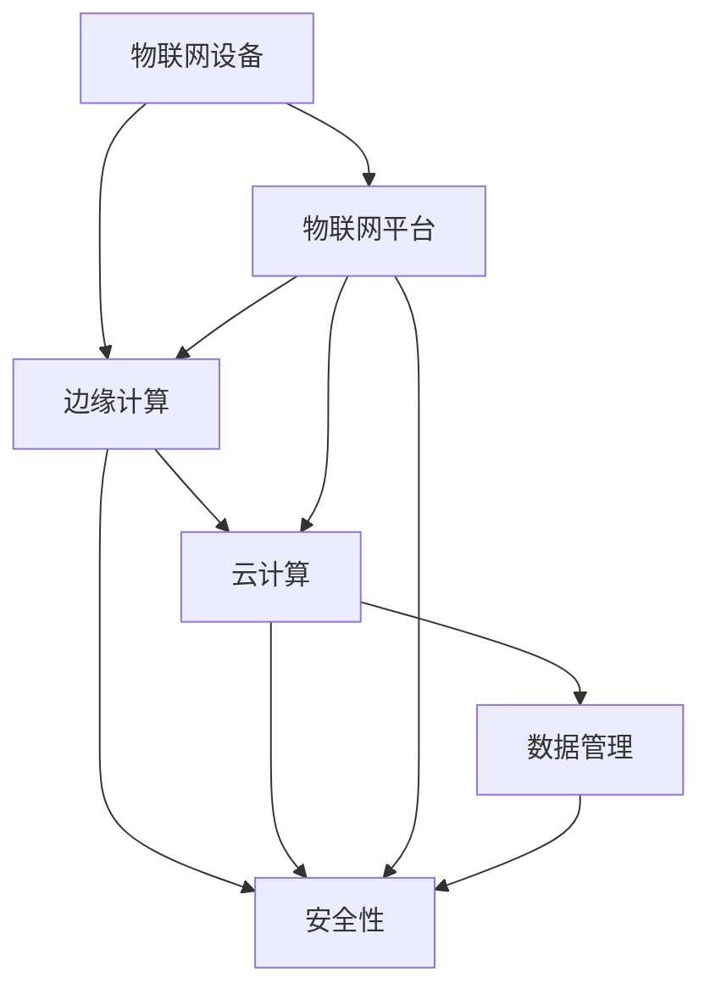

                 

# IoT系统架构：P9工程师的物联网思维

## 关键词

- 物联网（IoT）
- 系统架构
- P9工程师
- 物联网思维
- 边缘计算
- 安全性
- 智能家居

## 摘要

本文旨在探讨物联网（IoT）系统架构的设计原则与实现方法，特别关注P9工程师在物联网领域中的角色与思维。通过对物联网基本概念、核心组件、通信协议、数据管理、安全性等方面进行深入分析，结合P9工程师的专业视角，本文将逐步展开对IoT系统架构的讨论，并提供设计、实施与部署的最佳实践。希望通过本文，能够帮助读者建立起物联网系统架构的全面理解，为实际项目提供有力的指导。

### 引言：物联网系统架构的重要性

随着信息技术的飞速发展，物联网（IoT）已成为全球范围内的重要趋势。IoT系统通过将物理世界与数字世界相连接，实现了设备与设备、设备与云之间的智能交互，为各行各业带来了革命性的变革。然而，物联网系统的成功离不开一个关键因素——系统架构。

系统架构在物联网系统中扮演着至关重要的角色。它不仅决定了系统的性能、可扩展性和可靠性，还影响了系统的安全性和可维护性。一个良好的物联网系统架构能够确保数据的有效采集、传输、存储和分析，从而为用户提供高质量的智能服务。因此，设计一个符合物联网需求的系统架构是确保项目成功的关键。

本文将围绕物联网系统架构展开讨论，旨在为读者提供全面的架构设计思路和方法。我们将从以下几个方面进行深入探讨：

1. **核心概念**：介绍物联网的基本概念，包括关键组件、通信协议、数据管理、安全等。
2. **系统架构模式**：分析常见的物联网系统架构模式，如客户端-服务器模型、边缘计算、P2P网络等。
3. **系统设计**：讨论物联网系统的设计过程，包括需求分析、架构设计、组件选择等。
4. **通信协议与技术创新**：探讨物联网中常用的通信协议和新技术，如Wi-Fi、蓝牙、LPWAN等。
5. **安全性**：讨论物联网系统的安全性问题，包括威胁、漏洞和最佳安全实践。
6. **实施与部署**：介绍物联网系统的实施和部署过程，包括硬件选择、软件开发、系统集成等。
7. **实际应用**：分析物联网系统在各个行业中的实际应用案例。
8. **未来趋势与挑战**：探讨物联网的未来发展趋势和面临的挑战。

通过本文的逐步分析，读者将能够建立起对物联网系统架构的全面理解，并为实际项目提供有价值的参考。接下来，我们将首先探讨物联网的基本概念和核心组件，为后续的深入讨论打下基础。

### 核心概念：物联网的基本组件与通信协议

物联网（IoT）系统由多个核心组件组成，这些组件相互协作，共同实现智能互联和数据处理。以下是物联网系统中的关键组件及其在架构中的角色：

1. **设备**：设备是物联网系统的基本单元，可以是任何能够接入网络的物理设备，如传感器、智能家电、工业机械等。设备通过感知环境数据（如温度、湿度、亮度等）来实现对物理世界的监测和控制。

2. **传感器**：传感器是设备的重要组成部分，用于检测和测量环境参数，并将其转换为数字信号。常见的传感器包括温度传感器、湿度传感器、光照传感器等。传感器通常与设备集成，但也可以独立存在，通过无线通信方式将数据发送到中心系统。

3. **网关**：网关是物联网系统中连接设备和云平台的关键节点。它负责将来自设备的原始数据转换为统一的格式，并通过互联网或移动网络传输到云平台。网关通常具备数据过滤、协议转换、安全认证等功能。

4. **服务器**：服务器是物联网系统的数据中心和计算中心，负责处理和分析来自网关的数据。服务器通常运行在云平台上，提供数据存储、数据处理、应用托管等服务。

5. **云平台**：云平台是物联网系统的核心，提供数据存储、计算、分析和应用开发等基础设施服务。云平台通常包括多个模块，如数据湖、数据仓库、数据处理引擎、机器学习服务等，支持大规模数据分析和智能决策。

除了设备、传感器、网关、服务器和云平台等核心组件，物联网系统的通信协议也是不可或缺的一部分。以下是物联网系统中常用的几种通信协议：

1. **Wi-Fi**：Wi-Fi是一种无线局域网通信技术，广泛用于短距离的数据传输。Wi-Fi协议具有较高的带宽和稳定性，适合高速数据传输和实时应用。

2. **蓝牙**：蓝牙是一种低功耗无线通信技术，常用于短距离设备之间的通信。蓝牙协议支持点对点通信和广播通信，适合低功耗和间歇性数据传输。

3. **LPWAN**：LPWAN（Low-Power Wide Area Network，低功耗广域网）是一种用于长距离、低功耗数据传输的通信技术。LPWAN协议如LoRa、NB-IoT和Sigfox等，适合大规模物联网应用，能够实现远程监控和数据采集。

4. **MQTT**：MQTT（Message Queuing Telemetry Transport）是一种轻量级的消息队列协议，常用于物联网系统中的设备与服务器之间的通信。MQTT协议支持发布/订阅模式，能够确保数据的高效传输和可靠传输。

5. **CoAP**：CoAP（Constrained Application Protocol）是一种用于物联网系统的约束应用协议，特别适用于资源受限的设备。CoAP协议基于HTTP协议，支持设备之间的简单通信和数据交换。

在物联网系统中，这些核心组件和通信协议相互协作，共同实现数据的采集、传输、处理和分析。接下来，我们将进一步探讨物联网系统中的数据管理、安全性和设计模式。

#### 核心概念与联系

在进一步探讨物联网系统架构之前，我们需要明确几个核心概念，并理解它们之间的联系。以下是物联网系统中一些关键概念的定义和它们之间的相互关系：

1. **物联网设备**：物联网设备是指能够接入互联网并具备一定计算能力的硬件设备，如智能传感器、智能门锁、智能家电等。这些设备通过传感器获取环境数据，并通过通信模块将数据发送到系统其他部分。

2. **边缘计算**：边缘计算是一种在数据产生的地方（如传感器网络、智能设备）进行计算和数据处理的技术，以减少数据传输的延迟和带宽消耗。边缘计算可以提升系统的响应速度和实时性，特别是在物联网应用中具有重要作用。

3. **云计算**：云计算是一种基于互联网的计算服务模型，提供计算资源、存储资源和应用程序等服务。云计算平台如AWS、Azure和Google Cloud等，为物联网系统提供了强大的数据处理能力和灵活的资源管理。

4. **物联网平台**：物联网平台是一个综合性的软件系统，提供设备管理、数据采集、数据处理、应用开发等功能，连接物联网设备、边缘计算和云平台。物联网平台是物联网系统架构的核心，负责协调和管理整个系统的运行。

5. **数据管理**：数据管理涉及数据的采集、存储、处理、分析和共享。在物联网系统中，数据管理是一个关键环节，确保数据的高效利用和可靠传输。数据管理包括数据格式标准化、数据压缩、数据加密等。

6. **安全性**：安全性是物联网系统面临的重要挑战之一。物联网系统需要确保数据的安全传输和存储，防止未经授权的访问和攻击。安全性包括身份认证、访问控制、数据加密、威胁检测等。

为了更清晰地理解这些概念之间的联系，我们可以使用Mermaid流程图来表示：

在这个流程图中，物联网设备通过边缘计算将数据发送到物联网平台，物联网平台再通过云计算进行数据处理和分析。数据管理模块负责处理和存储数据，而安全性模块确保数据在整个生命周期中的安全。通过这个流程图，我们可以更直观地理解物联网系统中的各个组件及其相互关系。

#### 边缘计算原理与架构

边缘计算是物联网系统架构中的一个关键组成部分，它将计算能力从传统的云端下沉到数据产生的源头，即边缘设备。这种计算模式不仅减少了数据传输的延迟和带宽消耗，还能够提升系统的实时性和响应速度。边缘计算通过将数据处理和计算任务分散到边缘设备上，实现了对海量数据的实时分析和处理。

### 边缘计算的基本原理

边缘计算的基本原理在于将数据处理和计算任务从中心化的云平台分散到分布式的边缘设备上。具体来说，边缘计算包括以下几个关键步骤：

1. **数据采集**：在数据产生的源头（如传感器网络、智能设备）进行数据的采集。这些数据可以包括环境参数、设备状态、用户行为等。

2. **数据处理**：在边缘设备上对采集到的数据进行初步处理，如数据清洗、数据压缩、数据转换等。这些处理步骤有助于减少数据传输的负担，并提高系统的实时性。

3. **数据传输**：将处理后的数据传输到中心化的云平台或其他边缘设备。传输的数据可以包括关键信息或需要进一步分析的数据。

4. **数据分析**：在云平台或边缘设备上进行数据分析和处理，生成智能决策或操作指令。

5. **反馈与控制**：将分析结果反馈给边缘设备或用户，实现实时控制或优化。

边缘计算的核心优势在于其低延迟和高响应速度。通过在边缘设备上进行数据预处理和计算，可以大大减少数据传输的时间和带宽消耗，从而实现实时决策和操作。此外，边缘计算还能够提升系统的可靠性和容错能力，因为数据处理和计算任务分布在不同设备上，单个设备的故障不会导致整个系统瘫痪。

### 边缘计算架构

边缘计算架构可以分为三个层次：边缘设备、边缘网关和云平台。

1. **边缘设备**：边缘设备是数据采集和初步处理的地方，通常包括传感器、智能终端和边缘服务器。边缘设备可以直接连接到物联网平台，也可以通过边缘网关进行数据传输。

2. **边缘网关**：边缘网关位于边缘设备和云平台之间，负责数据传输和协议转换。边缘网关通常具备数据过滤、加密、认证等功能，确保数据的安全和可靠传输。

3. **云平台**：云平台是边缘计算的核心，负责数据处理、存储和应用程序托管。云平台提供强大的计算资源和存储能力，支持大规模数据分析和智能决策。

边缘计算架构的特点是分布式和灵活。通过将计算和数据处理任务分布在不同设备和层级上，边缘计算架构能够适应不同规模和复杂度的物联网应用。此外，边缘计算架构还支持模块化和可扩展性，可以根据实际需求动态调整计算资源和数据处理能力。

### 边缘计算在物联网系统中的应用

边缘计算在物联网系统中具有广泛的应用场景，以下是一些典型的应用实例：

1. **智能城市**：在智能城市建设中，边缘计算可以用于实时监测城市环境数据（如空气质量、交通流量等），并快速做出应对措施，如智能交通管理、环境监测等。

2. **工业物联网**：在工业物联网中，边缘计算可以用于实时监测生产设备状态，预测设备故障，实现智能维护和优化生产流程。

3. **智能农业**：在智能农业中，边缘计算可以用于实时监测农田环境数据（如土壤湿度、气温等），并自动调整灌溉、施肥等操作，提高农业生产效率。

4. **智能家居**：在智能家居中，边缘计算可以用于实时处理家庭设备数据，实现智能控制和自动化场景，提升生活便利性和舒适度。

通过上述分析，我们可以看到边缘计算在物联网系统中的重要性。它不仅提升了系统的实时性和响应速度，还提高了系统的可靠性和灵活性。在接下来的章节中，我们将进一步探讨物联网系统的设计过程和关键设计模式。

#### 系统设计：需求分析、架构设计、组件选择

在物联网系统的设计中，需求分析、架构设计和组件选择是三个关键环节，它们共同决定了系统的性能、可扩展性和可靠性。以下我们将逐步探讨这些环节，并提供实际项目案例，帮助读者更好地理解物联网系统设计的全过程。

### 需求分析

需求分析是系统设计的起点，它旨在明确系统需要实现的功能和性能要求。在物联网系统中，需求分析包括以下几个方面：

1. **功能需求**：明确系统需要实现的基本功能，如数据采集、数据传输、数据分析、远程控制等。例如，在一个智能农业项目中，我们需要实现的环境数据采集、自动灌溉和远程监控等功能。

2. **性能需求**：确定系统的性能指标，如数据传输速率、响应时间、数据准确性等。例如，在智能交通系统中，我们需要确保交通流量的实时监测和快速响应。

3. **用户需求**：了解用户的实际需求和期望，包括用户体验、操作便捷性等。例如，在智能家居系统中，用户可能希望设备能够实现一键控制，提供智能化的家居解决方案。

4. **安全性需求**：评估系统面临的安全风险，并制定相应的安全措施。例如，在医疗物联网系统中，我们需要确保患者数据的保密性和完整性。

### 架构设计

架构设计是系统设计的关键环节，它决定了系统的整体结构和组件之间的相互作用。在物联网系统中，常见的架构设计模式包括：

1. **客户端-服务器模型**：在这种模式下，客户端（如移动设备、PC）通过互联网向服务器发送请求，服务器处理请求并返回结果。这种模式适用于数据量较小、实时性要求不高的物联网应用。

2. **边缘计算模型**：在这种模式下，数据处理和计算任务分布在边缘设备（如传感器、网关）上，减少了数据传输的延迟和带宽消耗。这种模式适用于数据量大、实时性要求高的物联网应用。

3. **微服务架构**：在这种模式下，系统被分解为多个独立的微服务，每个微服务负责特定的功能，并通过API进行通信。这种模式提高了系统的可扩展性和可维护性。

4. **P2P网络模型**：在这种模式下，设备之间直接进行数据传输和计算，无需依赖中心化的服务器。这种模式适用于去中心化、低延迟的物联网应用。

### 组件选择

组件选择是系统设计中的另一个重要环节，它决定了系统的实现效率和性能。以下是物联网系统中的常见组件及其选择标准：

1. **传感器**：选择传感器时需要考虑其精度、响应速度和功耗。例如，在智能农业项目中，我们可以选择高精度的土壤湿度传感器。

2. **通信模块**：选择通信模块时需要考虑其通信范围、带宽和功耗。例如，在智能家居项目中，我们可以选择Wi-Fi或蓝牙通信模块。

3. **网关**：网关是连接设备和云平台的关键节点，需要具备数据处理、协议转换和安全认证等功能。例如，在智能交通项目中，我们可以选择支持边缘计算的网关。

4. **服务器**：服务器负责处理和分析数据，需要具备强大的计算能力和存储容量。例如，在工业物联网项目中，我们可以选择高性能的云服务器。

### 实际项目案例

以下是一个智能农业项目的实际案例，通过这个案例，我们可以更清晰地看到需求分析、架构设计和组件选择的具体过程。

1. **需求分析**：

   - 功能需求：环境数据采集、自动灌溉、远程监控等。
   - 性能需求：数据传输延迟低于1秒，传感器精度±2%。
   - 用户需求：一键控制、实时数据监控。
   - 安全性需求：确保数据传输和存储的安全。

2. **架构设计**：

   - 架构模式：采用边缘计算模型，将数据处理和计算任务分布到农田边缘设备上。
   - 系统架构：包括传感器、边缘网关、物联网平台和云平台。

3. **组件选择**：

   - 传感器：选择高精度土壤湿度传感器和光照传感器。
   - 通信模块：选择低功耗Wi-Fi模块，确保数据传输的稳定性和可靠性。
   - 网关：选择支持边缘计算功能的网关，具备数据处理、协议转换和安全认证等功能。
   - 服务器：选择高性能云服务器，用于数据存储和处理。

通过这个案例，我们可以看到物联网系统设计的全过程，从需求分析到架构设计，再到组件选择，每个环节都至关重要，共同决定了系统的性能和可靠性。

在物联网系统的设计中，需求分析、架构设计和组件选择是关键环节，它们共同决定了系统的实现效率和性能。通过合理的需求分析和架构设计，以及合适的组件选择，我们可以构建出高效、可靠、可扩展的物联网系统。在接下来的章节中，我们将进一步探讨物联网系统中的通信协议与技术创新。

#### IoT通信协议与技术创新

在物联网系统中，通信协议和技术的选择至关重要，它们直接影响系统的性能、可靠性和成本。以下我们将介绍几种常用的IoT通信协议和它们的技术特点，并探讨如何选择适合特定应用场景的通信协议。

### 常见IoT通信协议

1. **Wi-Fi**：
   - **技术特点**：Wi-Fi是一种广泛使用的无线通信技术，提供较高的带宽和稳定性。Wi-Fi协议支持IEEE 802.11标准，包括802.11n、802.11ac等。Wi-Fi适用于需要高速数据传输和实时性的场景。
   - **适用场景**：智能家居、办公室无线网络、商业Wi-Fi热点等。

2. **蓝牙**：
   - **技术特点**：蓝牙是一种低功耗、短距离的无线通信技术，适用于点对点通信和广播通信。蓝牙协议包括经典蓝牙（Classic Bluetooth）和蓝牙低功耗（Bluetooth Low Energy，BLE）。
   - **适用场景**：智能手环、智能手表、无线耳机、智能家居设备等。

3. **LPWAN**：
   - **技术特点**：LPWAN（Low-Power Wide Area Network，低功耗广域网）是一种用于长距离、低功耗数据传输的通信技术。LPWAN协议如LoRa、NB-IoT和Sigfox等，适用于大规模物联网应用。
   - **适用场景**：智能农业、智能城市、环境监测、远程监控等。

4. **MQTT**：
   - **技术特点**：MQTT（Message Queuing Telemetry Transport）是一种轻量级的消息队列协议，特别适用于物联网设备与云平台之间的通信。MQTT支持发布/订阅模式，确保数据的高效传输和可靠传输。
   - **适用场景**：智能家居、智能交通、工业物联网、远程监控等。

5. **CoAP**：
   - **技术特点**：CoAP（Constrained Application Protocol）是一种用于物联网系统的约束应用协议，特别适用于资源受限的设备。CoAP基于HTTP协议，支持设备之间的简单通信和数据交换。
   - **适用场景**：智能城市、智能农业、智能家居等。

### 选择适合的通信协议

选择适合的IoT通信协议需要考虑以下几个因素：

1. **带宽需求**：如果应用场景需要高速数据传输，可以选择Wi-Fi或LTE等高带宽通信技术。如果带宽需求较低，可以选择蓝牙或LPWAN等低带宽通信技术。

2. **功耗要求**：对于低功耗设备，如智能传感器和可穿戴设备，应选择低功耗通信协议，如蓝牙或LPWAN。这些协议能够延长设备电池寿命。

3. **通信范围**：如果应用场景需要远距离通信，应选择LPWAN等长距离通信技术。如果通信范围较短，可以选择Wi-Fi或蓝牙。

4. **可靠性**：对于需要高可靠性的应用场景，应选择支持可靠传输协议，如MQTT。这些协议提供消息确认和重传机制，确保数据的可靠传输。

5. **成本**：通信技术成本也是一个重要考虑因素。LPWAN等技术通常成本较低，适用于大规模应用。Wi-Fi和LTE等技术成本较高，但提供更高的带宽和可靠性。

### 实际应用案例

以下是一个智能农业项目的实际应用案例，该项目选择了LoRa作为通信协议。

1. **项目背景**：该项目旨在通过物联网技术实现农田环境数据的实时监测和智能灌溉。

2. **通信协议选择**：由于农田环境数据传输距离较远，且设备需要长时间运行，因此选择了LoRa作为通信协议。LoRa具备长距离、低功耗的特点，适用于大规模农田监测应用。

3. **系统实现**：系统包括环境传感器（土壤湿度、气温等）、LoRa网关和物联网平台。传感器将环境数据发送到LoRa网关，网关通过LoRa网络将数据传输到物联网平台。物联网平台对数据进行处理和分析，生成灌溉计划，并通过LoRa网关发送到智能灌溉系统。

4. **效果评估**：通过该项目，农田环境数据实现了实时监测和智能灌溉，提高了农业生产效率，降低了人力成本。

通过上述实际应用案例，我们可以看到如何根据应用需求选择合适的IoT通信协议，并实现物联网系统的设计与部署。在接下来的章节中，我们将探讨物联网系统的安全性问题，包括常见威胁、漏洞和最佳安全实践。

#### 物联网系统的安全性

随着物联网技术的飞速发展，物联网系统的安全性问题日益突出。由于物联网设备数量庞大、分布广泛，且涉及大量敏感数据，因此确保物联网系统的安全性至关重要。本文将介绍物联网系统中常见的威胁和漏洞，并探讨最佳安全实践。

### 常见威胁

1. **设备篡改**：攻击者可以通过物理方式访问物联网设备，修改设备固件或硬件，从而获取敏感数据或控制设备。

2. **数据窃取**：攻击者可以通过网络入侵物联网设备，窃取设备中的敏感数据，如用户个人信息、财务数据等。

3. **拒绝服务攻击（DDoS）**：攻击者可以通过控制大量物联网设备，发起DDoS攻击，导致系统瘫痪或服务中断。

4. **中间人攻击（Man-in-the-Middle，MitM）**：攻击者可以在通信过程中窃取或篡改数据，从而获取敏感信息。

5. **设备失控**：攻击者可以通过入侵物联网设备，控制设备执行恶意操作，如破坏设备、恶意攻击其他设备等。

6. **供应链攻击**：攻击者可以通过供应链中的漏洞，植入恶意软件或篡改设备固件，从而控制大量设备。

### 常见漏洞

1. **默认密码**：许多物联网设备使用默认密码或弱密码，攻击者可以通过暴力破解或密码猜测攻击获取设备控制权。

2. **软件漏洞**：物联网设备通常运行在嵌入式操作系统上，这些操作系统可能存在未修补的漏洞，攻击者可以利用这些漏洞进行攻击。

3. **协议漏洞**：物联网通信协议可能存在漏洞，攻击者可以通过这些漏洞窃取或篡改数据。

4. **物理漏洞**：物联网设备可能存在物理安全漏洞，如未加密封装的接口、可访问的硬件组件等，攻击者可以通过这些漏洞获取设备控制权。

### 最佳安全实践

1. **设备认证**：使用强密码或多因素认证，确保只有授权用户可以访问设备。对于敏感设备，可以使用数字证书进行认证。

2. **加密通信**：使用加密协议（如TLS）进行数据传输，确保数据在传输过程中的安全性。对于敏感数据，应使用高级加密算法进行加密。

3. **安全更新**：定期检查设备固件和操作系统的更新，及时修补漏洞，确保设备处于最新安全状态。

4. **访问控制**：实施严格的访问控制策略，限制设备间的通信，防止未经授权的访问。

5. **监控与报警**：部署安全监控工具，实时监控物联网系统的异常活动，并设置报警机制，及时发现并应对安全事件。

6. **物理安全**：确保物联网设备的物理安全，避免设备被盗或被篡改。

7. **安全培训**：为用户和开发人员提供安全培训，提高他们对物联网安全威胁的认识和防范能力。

通过上述最佳安全实践，可以有效提高物联网系统的安全性，保护设备和数据的安全。在接下来的章节中，我们将探讨物联网系统的实施与部署过程。

#### 实施与部署：物联网系统的实现步骤

在物联网系统的设计完成后，实施与部署是确保系统顺利运行的关键步骤。这一过程包括硬件选择、软件开发、系统集成和测试等多个环节。以下我们将详细探讨这些环节，并提供一个实际项目案例，帮助读者更好地理解物联网系统的实施与部署过程。

### 硬件选择

硬件选择是物联网系统实施的第一步，它决定了系统的性能、功耗和成本。在选择硬件时，需要考虑以下几个方面：

1. **传感器**：传感器是物联网系统的数据采集单元，选择传感器时需要考虑其精度、功耗和可靠性。例如，在智能农业项目中，可以选择土壤湿度传感器、光照传感器等。

2. **通信模块**：通信模块负责将传感器数据传输到中心系统。选择通信模块时需要考虑通信范围、带宽和功耗。例如，在智能家居项目中，可以选择Wi-Fi、蓝牙或Zigbee通信模块。

3. **网关**：网关是连接设备和云平台的关键节点，需要具备数据处理、协议转换和安全认证等功能。选择网关时需要考虑其处理能力和兼容性。

4. **服务器**：服务器负责数据处理、存储和应用程序托管。选择服务器时需要考虑其计算能力、存储容量和可靠性。对于大规模物联网应用，可以选择云服务器。

### 软件开发

软件开发是物联网系统实现的核心环节，它包括数据采集、数据传输、数据处理和用户界面等方面。以下是软件开发的主要步骤：

1. **数据采集**：编写代码实现传感器数据的采集和预处理，确保数据的有效性和准确性。

2. **数据传输**：开发数据传输模块，实现传感器数据到网关或服务器的传输。可以使用MQTT、CoAP等物联网通信协议。

3. **数据处理**：开发数据处理模块，实现数据的存储、分析和可视化。可以使用数据库、数据分析和可视化工具。

4. **用户界面**：开发用户界面，实现用户对系统的交互和控制。可以使用Web前端框架（如React、Vue.js）和后端框架（如Spring Boot、Django）。

### 系统集成

系统集成是将硬件和软件结合起来，确保系统各组件协同工作的过程。以下是系统集成的主要步骤：

1. **硬件集成**：将传感器、通信模块、网关和服务器等硬件设备进行物理连接和配置。

2. **软件集成**：将数据采集、数据传输、数据处理和用户界面等软件模块集成到系统中。

3. **调试与优化**：在系统集成过程中，进行调试和优化，确保系统稳定运行。

### 测试与部署

在系统集成完成后，需要对系统进行全面的测试和部署。以下是测试与部署的主要步骤：

1. **功能测试**：测试系统的各个功能，确保功能正常运行。

2. **性能测试**：测试系统的性能指标，如响应时间、数据传输速率等。

3. **安全测试**：测试系统的安全性，确保系统不受攻击。

4. **部署**：将系统部署到生产环境，包括硬件安装、软件部署和配置。

### 实际项目案例

以下是一个智能农业项目的实际案例，该项目旨在通过物联网技术实现农田环境数据的实时监测和智能灌溉。

#### 项目背景

该项目旨在提高农业生产效率，通过物联网技术实时监测农田环境数据，如土壤湿度、气温、光照等，并自动调整灌溉系统，实现精准灌溉。

#### 硬件选择

- **传感器**：土壤湿度传感器、气温传感器、光照传感器。
- **通信模块**：LoRa通信模块。
- **网关**：支持LoRa的边缘网关。
- **服务器**：云服务器。

#### 软件开发

- **数据采集**：编写代码实现传感器数据的采集和预处理。
- **数据传输**：使用LoRa协议将数据传输到边缘网关，再通过物联网平台传输到服务器。
- **数据处理**：使用物联网平台对数据进行存储、分析和可视化。
- **用户界面**：开发Web界面，实现用户对农田数据的实时监控和灌溉控制。

#### 系统集成

- **硬件集成**：将传感器、通信模块、网关和服务器进行物理连接和配置。
- **软件集成**：将数据采集、数据传输、数据处理和用户界面等模块集成到系统中。

#### 调试与优化

- **功能测试**：确保系统的各个功能正常运行。
- **性能测试**：测试系统的性能指标，如数据传输速率、响应时间等。
- **安全测试**：测试系统的安全性，确保系统不受攻击。

#### 部署

- **部署**：将系统部署到生产环境，包括硬件安装、软件部署和配置。

通过上述实际项目案例，我们可以看到物联网系统的实施与部署过程。在接下来的章节中，我们将探讨物联网系统的测试与部署过程，包括测试策略、验证和故障排查。

#### 物联网系统的测试与部署

在物联网系统的实施完成后，进行全面的测试与部署是确保系统稳定运行的关键步骤。以下我们将详细探讨物联网系统的测试与部署过程，包括测试策略、验证和故障排查。

### 测试策略

1. **功能测试**：功能测试是验证系统是否满足需求的重要步骤。测试内容包括：
   - 数据采集：确保传感器数据能够准确采集和传输。
   - 数据处理：验证数据处理模块的正确性和效率。
   - 用户界面：测试用户界面功能的完整性和响应速度。

2. **性能测试**：性能测试是评估系统性能指标的重要步骤。测试内容包括：
   - 响应时间：测试系统对请求的响应时间。
   - 数据传输速率：测试数据在系统中的传输速度。
   - 系统负载：评估系统在高负载情况下的稳定性和性能。

3. **安全测试**：安全测试是确保系统安全的重要步骤。测试内容包括：
   - 密码破解：测试系统的密码策略和认证机制。
   - 中间人攻击：验证系统对中间人攻击的防护能力。
   - 数据加密：测试数据在传输和存储过程中的加密机制。

4. **可靠性测试**：可靠性测试是评估系统在长时间运行中的稳定性和可靠性。测试内容包括：
   - 系统稳定性：测试系统在长时间运行中的稳定性和故障率。
   - 异常处理：测试系统对异常情况（如设备故障、网络中断等）的应对能力。

### 验证

1. **功能验证**：通过功能测试，验证系统是否满足需求。功能验证可以采用黑盒测试方法，即不考虑系统内部实现细节，只关注系统的功能是否符合预期。

2. **性能验证**：通过性能测试，验证系统性能指标是否达到预期。性能验证可以采用白盒测试方法，即深入分析系统内部实现，评估系统性能瓶颈。

3. **安全验证**：通过安全测试，验证系统的安全性。安全验证可以采用渗透测试方法，模拟攻击者的攻击行为，发现系统中的安全漏洞。

4. **可靠性验证**：通过可靠性测试，验证系统在长时间运行中的稳定性和可靠性。可靠性验证可以采用长时间运行测试方法，模拟系统在实际运行中的环境。

### 故障排查

在系统部署后，可能会出现各种故障。以下是一些常见的故障排查方法：

1. **日志分析**：通过分析系统日志，查找故障原因。系统日志包括错误日志、调试日志和性能日志等。

2. **网络监控**：监控系统的网络流量，查找网络瓶颈或异常流量。

3. **性能监控**：监控系统的性能指标，如CPU使用率、内存使用率等，查找性能瓶颈。

4. **故障模拟**：模拟设备故障或网络中断等异常情况，测试系统的故障处理能力和恢复速度。

5. **故障隔离**：通过逐步缩小故障范围，定位故障原因。

通过上述测试与部署策略，可以有效确保物联网系统的稳定运行，提高系统的可靠性和用户体验。在接下来的章节中，我们将探讨物联网系统在各个行业的实际应用案例。

### 实际应用：物联网系统的行业案例

物联网（IoT）系统在各个行业中的应用日益广泛，为行业带来了巨大的变革和提升。以下我们将探讨物联网系统在几个关键行业中的实际应用案例，通过这些案例，我们可以更清晰地了解物联网系统的设计、实现和带来的巨大价值。

#### 智能制造

在制造业中，物联网系统通过连接各种生产设备和传感器，实现设备的实时监控、故障预测和优化生产流程。一个典型的案例是西门子公司在汽车制造中的应用。

**项目背景**：西门子公司在汽车制造过程中，希望提高生产效率和产品质量，降低设备故障率。

**系统设计**：
1. **传感器部署**：在汽车生产线上部署各种传感器，如温度传感器、压力传感器和振动传感器，实时监测设备状态和生产环境参数。
2. **通信协议**：使用工业以太网和Wi-Fi等通信协议，确保数据的高速传输和稳定性。
3. **数据分析**：通过大数据分析和机器学习算法，分析传感器数据，预测设备故障和优化生产流程。

**实现**：
1. **设备监控**：通过物联网平台，实现对生产设备的实时监控，包括设备运行状态、故障预警和生产效率等。
2. **远程维护**：通过远程诊断技术，工程师可以快速定位设备故障，并提供远程维修指导，减少停机时间。

**价值**：
- 提高生产效率：通过实时监控和优化生产流程，减少生产停机时间，提高生产效率。
- 提高产品质量：通过故障预测和实时监控，减少设备故障率，提高产品质量。

#### 智能医疗

在医疗领域，物联网系统通过连接各种医疗设备和患者数据，实现远程监护、智能诊断和个性化治疗。

**项目背景**：某医院希望实现对患者数据的远程监控，提高医疗服务的质量和效率。

**系统设计**：
1. **传感器部署**：在病房中部署各种传感器，如心电传感器、血压传感器和体温传感器，实时监测患者生命体征。
2. **通信协议**：使用有线和无线通信技术，如Wi-Fi和蓝牙，确保数据的高效传输。
3. **数据分析**：通过大数据分析和机器学习算法，分析患者数据，实现智能诊断和个性化治疗。

**实现**：
1. **远程监护**：医生可以通过物联网平台实时查看患者数据，包括生命体征、用药情况和检查结果，实现远程监护和诊断。
2. **智能诊断**：通过分析患者数据，实现智能诊断和个性化治疗建议，提高诊断准确性和治疗效果。

**价值**：
- 提高医疗服务质量：通过远程监护和智能诊断，提高医疗服务的质量和效率。
- 提高患者体验：通过实时监控和个性化治疗，提高患者的满意度和体验。

#### 智能交通

在交通领域，物联网系统通过连接各种交通设备和传感器，实现智能交通管理、车辆监控和路径优化。

**项目背景**：某城市政府希望提高交通管理效率，减少交通拥堵和事故发生率。

**系统设计**：
1. **传感器部署**：在交通路口、道路和车辆中部署各种传感器，如摄像头、雷达和GPS，实时监测交通状况。
2. **通信协议**：使用5G和Wi-Fi等高速通信技术，确保数据的高效传输。
3. **数据分析**：通过大数据分析和人工智能算法，分析交通数据，实现智能交通管理和优化。

**实现**：
1. **智能交通管理**：通过物联网平台，实现对交通流量、车速和路况的实时监控，实现智能交通管理和信号优化。
2. **车辆监控**：通过物联网平台，实现对车辆的实时监控，包括车辆位置、行驶速度和安全状态等。

**价值**：
- 提高交通管理效率：通过实时监控和智能交通管理，减少交通拥堵和事故发生率。
- 提高出行体验：通过实时交通信息和路径优化，提高出行效率和体验。

#### 智能农业

在农业领域，物联网系统通过连接各种农业设备和传感器，实现精准农业、智能灌溉和病虫害监测。

**项目背景**：某农场主希望通过物联网技术提高农业生产效率，减少资源浪费。

**系统设计**：
1. **传感器部署**：在农田中部署各种传感器，如土壤湿度传感器、光照传感器和气象传感器，实时监测农田环境。
2. **通信协议**：使用LoRa和Wi-Fi等通信技术，确保数据的高效传输。
3. **数据分析**：通过大数据分析和机器学习算法，分析农田数据，实现精准农业和智能灌溉。

**实现**：
1. **精准农业**：通过物联网平台，实现对农田环境的实时监控和数据分析，实现精准施肥、灌溉和病虫害监测。
2. **智能灌溉**：通过物联网平台，实现自动灌溉系统，根据农田湿度数据自动调整灌溉时间。

**价值**：
- 提高农业生产效率：通过精准农业和智能灌溉，提高农业生产效率，减少资源浪费。
- 提高农产品质量：通过实时监控和精准管理，提高农产品质量和产量。

通过这些行业案例，我们可以看到物联网系统在各个领域的广泛应用和巨大价值。在未来的发展中，物联网系统将继续为各行业带来更多的创新和变革。

### 未来趋势与挑战

随着物联网技术的不断发展和成熟，物联网系统在未来的发展趋势和面临的挑战也将变得更加复杂和多样化。以下是物联网系统未来可能面临的主要趋势和挑战：

#### 发展趋势

1. **5G技术的普及**：随着5G技术的普及，物联网系统的通信速度和可靠性将得到显著提升。5G的低延迟和高带宽特性将使得物联网系统在实时应用场景中更具优势，如自动驾驶、远程手术等。

2. **边缘计算的发展**：边缘计算将继续向智能化、分布式和协同化发展。随着计算能力的提升和物联网设备数量的增加，边缘计算将在数据处理和决策方面发挥更大作用，实现更高效的数据处理和更快速的响应。

3. **AI与IoT的融合**：人工智能（AI）与物联网（IoT）的深度融合将成为未来物联网系统的重要趋势。通过AI技术，物联网系统可以实现更智能的数据分析、预测和决策，提高系统的自动化和智能化水平。

4. **安全性的提升**：随着物联网系统的规模和复杂度增加，安全性问题将变得更加重要。未来，物联网系统将采用更先进的安全技术和机制，如区块链、多方安全计算等，以提高系统的安全性。

5. **标准化和开源生态**：物联网技术的标准化和开源生态建设将加速发展。标准化有助于不同厂商和平台之间的互操作性，开源生态则为开发者提供了丰富的资源和工具，加速物联网技术的创新和应用。

#### 面临的挑战

1. **数据隐私和保护**：随着物联网设备数量和数据量的爆炸性增长，数据隐私和保护将成为一个巨大挑战。如何确保用户数据的隐私和安全，防止数据泄露和滥用，将成为物联网系统设计和运营中的重要问题。

2. **系统可靠性和稳定性**：物联网系统通常涉及大量的设备和复杂的网络架构，系统可靠性和稳定性将面临挑战。如何确保系统在长时间运行中的稳定性和可靠性，减少故障率和维护成本，是一个亟待解决的问题。

3. **能耗和电池寿命**：物联网设备通常依赖于电池供电，如何降低能耗、延长电池寿命是物联网系统设计中的重要问题。随着物联网设备数量的增加，解决能耗和电池寿命问题将变得更加紧迫。

4. **标准化和互操作性**：物联网技术的多样性和碎片化将导致标准化和互操作性的挑战。如何实现不同厂商和平台之间的数据交换和互操作，将是一个长期而艰巨的任务。

5. **安全威胁和防护**：物联网系统将面临各种安全威胁，如设备篡改、数据窃取、DDoS攻击等。如何确保物联网系统的安全性，防止恶意攻击和入侵，将是一个持续性的挑战。

总之，物联网系统在未来将继续面临各种挑战，但同时也充满了机遇。通过技术创新、标准化和安全措施，物联网系统有望在未来实现更广泛的应用和更高的价值。

### 结论

通过本文的探讨，我们深入了解了物联网系统架构的设计原则与实现方法，特别是P9工程师在物联网领域中的角色与思维。物联网系统作为连接物理世界与数字世界的桥梁，其架构设计不仅关乎系统的性能、可扩展性和可靠性，还直接影响着系统的安全性、用户体验和业务价值。

在文章中，我们首先介绍了物联网的基本概念和核心组件，包括设备、传感器、网关、服务器和云平台等。接着，我们探讨了物联网系统中的通信协议与技术创新，分析了Wi-Fi、蓝牙、LPWAN、MQTT和CoAP等通信协议的优缺点及其适用场景。此外，我们还详细阐述了边缘计算的基本原理、架构和应用，强调了其在物联网系统中的重要性。

在系统设计部分，我们讨论了需求分析、架构设计和组件选择等关键环节，并通过实际项目案例展示了物联网系统的设计与实现过程。在安全性方面，我们分析了物联网系统中常见的威胁和漏洞，并提出了最佳安全实践。最后，我们探讨了物联网系统在各个行业的实际应用案例，展示了物联网系统的广泛应用和巨大价值。

尽管物联网系统已经取得了显著的发展，但未来仍面临着数据隐私保护、系统可靠性、能耗和电池寿命、标准化和互操作性、安全威胁等诸多挑战。只有通过持续的技术创新、标准化的推动和全面的安全措施，物联网系统才能在未来实现更广泛的应用和更高的价值。

我们鼓励读者在实践过程中不断探索和创新，将物联网系统架构的设计原则和方法应用到实际项目中，为推动物联网技术的发展和应用贡献力量。

### 最佳实践Tips

1. **安全性优先**：在物联网系统设计和实现过程中，始终将安全性放在首位。确保数据传输和存储的安全，采用加密、认证和访问控制等安全机制。

2. **选择合适的通信协议**：根据应用场景的需求，选择合适的通信协议。对于高带宽、低延迟的场景，可以选择Wi-Fi或5G；对于长距离、低功耗的场景，可以选择LoRa或NB-IoT。

3. **优化数据传输和存储**：通过数据压缩、数据过滤和边缘计算等技术，优化数据传输和存储，降低系统的带宽和存储需求，提高系统性能。

4. **定期更新和升级**：定期检查和更新物联网设备固件和操作系统，修补漏洞，确保系统的安全性和稳定性。

5. **用户培训与支持**：为用户提供充分的培训和指导，确保用户能够正确使用物联网系统，并能够及时反馈问题和建议。

6. **可持续发展**：在物联网系统设计和实施过程中，考虑环境因素和可持续发展，减少能源消耗和环境污染。

### 小结

本文全面探讨了物联网系统架构的设计原则与实现方法，特别关注了P9工程师在物联网领域中的角色与思维。通过对物联网基本概念、核心组件、通信协议、数据管理、安全性等方面进行深入分析，结合实际项目案例，我们为读者提供了全面的架构设计思路和最佳实践。希望本文能够帮助读者建立起物联网系统架构的全面理解，为实际项目提供有力的指导。

### 注意事项

1. **隐私保护**：在设计和实现物联网系统时，务必关注用户数据的隐私保护，遵循相关法律法规，确保用户数据的安全和合规性。

2. **系统可靠性**：物联网系统通常涉及大量设备和复杂网络，因此在设计和实现过程中，要确保系统的可靠性和稳定性，避免因设备故障或网络中断导致系统崩溃。

3. **能耗管理**：物联网设备通常采用电池供电，因此在设计和实现过程中，要考虑能耗管理，尽量减少设备的功耗，延长电池寿命。

4. **标准化与兼容性**：在物联网系统的设计和实现过程中，要遵循相关标准和规范，确保系统的兼容性和互操作性。

5. **安全审计**：定期进行安全审计和风险评估，确保物联网系统的安全性，及时发现和解决潜在的安全隐患。

### 拓展阅读

1. **《物联网系统设计与实现》**：这本书详细介绍了物联网系统设计、开发、部署和管理的各个方面，是物联网系统开发者的必读之作。

2. **《边缘计算：技术与实践》**：这本书深入探讨了边缘计算的基本概念、技术架构和应用案例，有助于读者了解边缘计算在物联网系统中的应用。

3. **《物联网安全实战》**：这本书从实际案例出发，详细介绍了物联网系统面临的安全威胁、安全机制和安全实践，是物联网系统安全领域的经典之作。

### 作者信息

**作者：AI天才研究院/AI Genius Institute & 禅与计算机程序设计艺术 /Zen And The Art of Computer Programming**

