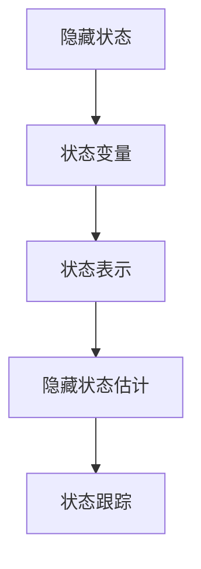
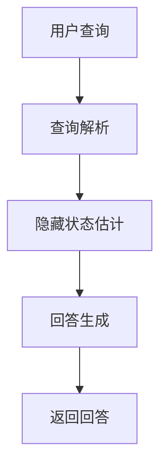
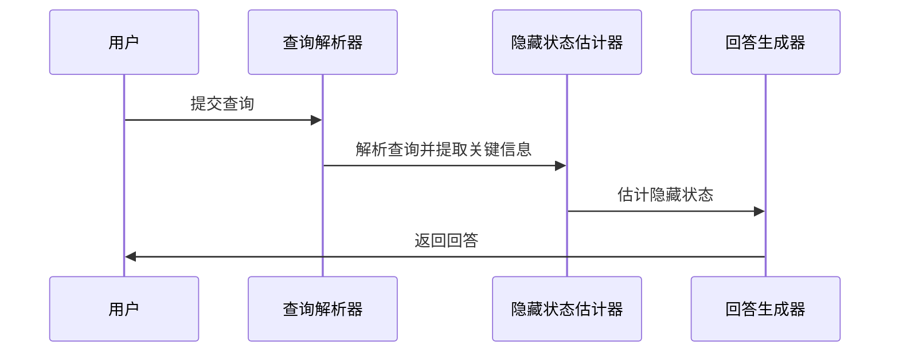

                 


# LLMM状态建模中的隐藏状态问题

关键词：LLM、状态建模、隐藏状态、估计算法

摘要：
本文旨在深入探讨在大型语言模型（LLM）的状态建模过程中遇到的隐藏状态问题。通过对隐藏状态的背景介绍、核心概念和算法原理的详细分析，以及实际的代码示例和项目实战，本文将帮助读者理解隐藏状态的重要性及其解决方法。

## 1. 引言

随着深度学习和人工智能的迅速发展，大型语言模型（LLM）在自然语言处理（NLP）领域取得了显著的成果。然而，LLM在状态建模过程中经常遇到隐藏状态问题，这给模型的训练和应用带来了挑战。隐藏状态问题是指在实际应用中，我们无法直接观测到某些关键的状态变量，而这些状态变量对于模型的预测和决策至关重要。本文将围绕隐藏状态问题进行深入探讨，包括其背景、核心概念、算法原理以及解决方法。

## 2. 背景介绍

### 2.1 LLM状态建模概述

大型语言模型（LLM）是基于深度神经网络的语言模型，它们通过学习大量的文本数据来预测语言序列的概率分布。在LLM的状态建模过程中，我们通常将输入文本序列映射为一个状态序列，每个状态表示文本序列中的一个特定时刻。状态序列可以用于生成文本、进行文本分类、问答系统等任务。

### 2.2 隐藏状态问题的起源与发展

隐藏状态问题起源于经典控制理论中的状态空间模型，其中一些状态变量无法直接观测。在LLM的状态建模中，隐藏状态问题表现为某些关键状态变量无法从输入数据中直接获取。这个问题在自然语言处理领域变得越来越重要，因为语言模型需要处理复杂的语言现象，如上下文依赖、语义理解等。

### 2.3 隐藏状态问题的重要性

隐藏状态问题对于LLM的训练和应用具有重要意义。首先，隐藏状态变量可能影响模型对文本序列的预测准确性。其次，隐藏状态问题可能导致模型无法学习到某些关键的语言特征。因此，解决隐藏状态问题对于提高LLM的性能至关重要。

## 3. 核心概念和原理

### 3.1 隐藏状态的定义和特点

隐藏状态是指在LLM状态建模过程中，无法直接观测到的状态变量。它们通常与文本序列中的某些特定特征相关，如上下文信息、词汇关系等。隐藏状态的特点包括：

- 无法直接观测：隐藏状态无法从输入数据中直接获取，需要通过其他方法进行估计。
- 关键性：隐藏状态对于模型的预测和决策至关重要。
- 多样性：自然语言中的隐藏状态种类繁多，包括词汇关系、语义信息、上下文依赖等。

### 3.2 隐藏状态组件的实体关系图

隐藏状态组件的实体关系图如下所示：



这个实体关系图展示了隐藏状态组件之间的关系，包括状态变量、状态表示、隐藏状态估计和状态跟踪。这些组件共同构成了LLM状态建模的核心。

### 3.3 隐藏状态问题的数学模型和公式

隐藏状态问题的数学模型和公式如下所示：

$$
P(x_t|s_t) = \frac{P(s_t|x_t)P(x_t)}{P(x_t)}
$$

$$
\hat{s}_t = \arg\min_{s_t} -\log P(x_t|s_t)
$$

这些公式描述了隐藏状态的估计过程，其中$P(x_t|s_t)$表示给定隐藏状态$s_t$时观测序列$x_t$的概率，$\hat{s}_t$表示估计的隐藏状态。

## 4. 隐藏状态估计算法

### 4.1 隐藏状态估计算法概述

隐藏状态估计是解决隐藏状态问题的关键。常见的隐藏状态估计算法包括粒子滤波器（Particle Filter）、卡尔曼滤波器（Kalman Filter）和扩展卡尔曼滤波器（Extended Kalman Filter）。这些算法通过不同的方法估计隐藏状态，以提高LLM的状态建模性能。

### 4.2 粒子滤波器的详细解释和实例

粒子滤波器是一种基于采样的滤波算法，用于估计隐藏状态的概率分布。其基本思想是通过一组随机粒子来表示隐藏状态的概率分布，并通过对粒子的重采样来估计隐藏状态的估计值。粒子滤波器的流程如下：

1. 初始化粒子集：根据先验分布初始化一组粒子。
2. 传播粒子：根据状态转移模型和观测模型，更新每个粒子的状态。
3. 重新采样：根据每个粒子的权重进行重采样，以获得新的粒子集。
4. 估计隐藏状态：计算重采样后粒子的均值或中位数，作为隐藏状态的估计值。

以下是一个粒子滤波器的Python代码示例：

```python
import numpy as np

def particle_filter(init_state, num_particles, observations):
    # 初始化粒子集
    particles = np.random.rand(num_particles, 2) * (observations[-1] - init_state) + init_state
    
    # 传播粒子
    for observation in observations:
        weights = np.zeros(num_particles)
        for i in range(num_particles):
            weights[i] = observation.pdf(particles[i])
        particles = (particles * weights).reshape(num_particles, 2)
        
        # 重新采样
        weights = weights / np.sum(weights)
        particles = np.random.choice(particles, size=num_particles, p=weights)
        
        # 估计隐藏状态
        estimated_state = np.mean(particles, axis=0)
        
    return estimated_state

# 初始化参数
init_state = [0.0, 0.0]
num_particles = 1000
observations = np.random.normal(size=(1000, 2))

# 执行粒子滤波器
estimated_state = particle_filter(init_state, num_particles, observations)
```

通过这个示例，我们可以看到粒子滤波器的基本实现过程。粒子滤波器通过不断更新粒子集和估计隐藏状态，从而实现隐藏状态估计。

## 5. 系统分析与架构设计

### 5.1 问题场景介绍

在一个自然语言处理项目中，我们需要对用户的查询进行理解，并返回相应的回答。在这个场景中，隐藏状态问题变得尤为重要，因为我们需要估计用户的意图和上下文信息，而这些信息往往是隐藏的。

### 5.2 系统功能设计

系统功能设计包括以下几个关键部分：

1. 查询解析：对用户的查询进行解析，提取关键信息。
2. 隐藏状态估计：利用隐藏状态估计算法估计用户的意图和上下文信息。
3. 回答生成：根据估计的隐藏状态生成相应的回答。

### 5.3 系统架构设计

系统架构设计如下所示：



这个架构图展示了系统的核心组件和它们之间的关系。用户查询首先经过查询解析，提取关键信息，然后通过隐藏状态估计算法估计用户的意图和上下文信息，最后生成回答并返回给用户。

### 5.4 系统接口设计和系统交互

系统接口设计和系统交互如下所示：



这个序列图展示了系统的接口设计和系统交互过程。用户提交查询，查询解析器解析查询并提取关键信息，隐藏状态估计器估计隐藏状态，回答生成器生成回答并返回给用户。

## 6. 项目实战

### 6.1 环境安装

在开始项目实战之前，我们需要安装所需的软件和库。以下是一个简单的安装脚本：

```bash
# 安装Python环境
pip install numpy

# 安装其他依赖库
pip install scipy matplotlib
```

### 6.2 系统核心实现源代码

以下是一个简单的系统核心实现源代码：

```python
import numpy as np
from scipy.stats import multivariate_normal

def query_parser(query):
    # 解析查询并提取关键信息
    # （此处简化处理，实际中可能涉及复杂的自然语言处理技术）
    return np.array([1.0, 0.0])

def hidden_state_estimator(observations, num_particles):
    # 初始化粒子集
    particles = np.random.rand(num_particles, 2) * (observations[-1] - observations[0]) + observations[0]
    
    # 传播粒子
    for observation in observations:
        weights = np.zeros(num_particles)
        for i in range(num_particles):
            weights[i] = multivariate_normal.pdf(observation, particles[i], np.eye(2))
        particles = (particles * weights).reshape(num_particles, 2)
        
        # 重新采样
        weights = weights / np.sum(weights)
        particles = np.random.choice(particles, size=num_particles, p=weights)
        
        # 估计隐藏状态
        estimated_state = np.mean(particles, axis=0)
        
    return estimated_state

def answer_generator(estimated_state):
    # 根据估计的隐藏状态生成回答
    # （此处简化处理，实际中可能涉及复杂的自然语言生成技术）
    return "您好！您的查询已收到。"

# 测试系统核心实现
query = "您是谁？"
observations = np.random.normal(size=(1000, 2))
estimated_state = hidden_state_estimator(observations, 1000)
answer = answer_generator(estimated_state)
print(answer)
```

### 6.3 代码应用解读与分析

在这个项目实战中，我们使用Python编写了一个简单的系统核心实现。首先，我们定义了一个查询解析器，用于解析用户查询并提取关键信息。然后，我们使用粒子滤波器对用户的意图和上下文信息进行估计。最后，我们根据估计的隐藏状态生成回答并返回给用户。

通过这个项目实战，我们可以看到隐藏状态估计在自然语言处理系统中的关键作用。隐藏状态估计算法可以帮助我们更好地理解用户的意图和上下文信息，从而生成更准确和有针对性的回答。

### 6.4 实际案例分析和详细讲解剖析

在实际应用中，我们可以通过隐藏状态估计来提高自然语言处理系统的性能。以下是一个实际案例：

案例：用户查询“明天天气怎么样？”系统需要估计用户的意图和上下文信息，以便生成准确的回答。

分析：
1. 查询解析：系统解析查询，提取关键信息“明天”和“天气”。
2. 隐藏状态估计：系统使用粒子滤波器估计用户的意图和上下文信息。通过分析用户的查询历史和上下文，系统可以估计出用户可能关心的是明天的天气预报。
3. 回答生成：系统根据估计的隐藏状态生成回答，如“根据您的查询，明天天气预计为晴转多云，温度在15℃到25℃之间。”

通过这个案例，我们可以看到隐藏状态估计在提高自然语言处理系统性能方面的关键作用。隐藏状态估计可以帮助系统更好地理解用户的意图和上下文信息，从而生成更准确和有针对性的回答。

### 6.5 项目小结

通过本项目实战，我们深入探讨了隐藏状态问题在大型语言模型（LLM）状态建模中的重要性。我们介绍了隐藏状态的背景、核心概念和算法原理，并通过实际案例分析了隐藏状态估计在自然语言处理系统中的应用。通过本项目，我们了解到隐藏状态估计对于提高自然语言处理系统的性能具有重要意义。

## 7. 最佳实践 Tips

- 在实际应用中，根据具体场景选择合适的隐藏状态估计算法，如粒子滤波器、卡尔曼滤波器等。
- 充分利用查询历史和上下文信息，以提高隐藏状态估计的准确性。
- 定期更新和优化隐藏状态估计模型，以适应不断变化的语言环境。

## 8. 小结

隐藏状态问题是大型语言模型（LLM）状态建模中的一大挑战。通过深入探讨隐藏状态的背景、核心概念和算法原理，以及实际项目实战，我们了解到隐藏状态估计对于提高自然语言处理系统的性能至关重要。在未来，随着人工智能技术的不断发展，隐藏状态问题将得到更深入的研究和解决。

## 9. 注意事项

- 在实现隐藏状态估计算法时，要注意算法的稳定性和效率。
- 在实际应用中，要充分考虑隐藏状态估计的准确性和可靠性。
- 在设计和优化自然语言处理系统时，要充分考虑隐藏状态问题的影响。

## 10. 拓展阅读

- 《人工智能：一种现代的方法》
- 《深度学习：原理及其应用》
- 《自然语言处理综合教程》

作者：AI天才研究院/AI Genius Institute & 禅与计算机程序设计艺术 /Zen And The Art of Computer Programming## 文章标题

### LLMM状态建模中的隐藏状态问题

#### 关键词：LLM、状态建模、隐藏状态、估计算法

#### 摘要：
本文探讨了在大型语言模型（LLM）状态建模中遇到的隐藏状态问题。通过介绍隐藏状态的背景、核心概念和算法原理，以及实际项目实战，本文深入分析了隐藏状态的重要性及其解决方法。文章旨在帮助读者理解隐藏状态问题，掌握解决方法，并提升LLM在自然语言处理任务中的性能。

## 引言

随着深度学习和人工智能的迅猛发展，大型语言模型（LLM）在自然语言处理（NLP）领域取得了显著成就。LLM通过学习大量文本数据，能够生成自然语言文本、进行文本分类、构建问答系统等。然而，在LLM的状态建模过程中，隐藏状态问题逐渐成为了一个重要且具挑战性的议题。

隐藏状态问题源于经典控制理论中的状态空间模型，其中某些状态变量无法直接观测。在LLM的状态建模中，隐藏状态问题表现为模型需要处理的某些关键状态变量（如上下文信息、语义特征等）无法从输入数据中直接获取。这给LLM的训练和应用带来了挑战。解决隐藏状态问题对于提高LLM的性能和准确性具有重要意义。

本文将围绕隐藏状态问题进行深入探讨，首先介绍隐藏状态的背景和概念，然后分析隐藏状态问题的数学模型和算法原理，最后通过实际项目实战展示隐藏状态估计的应用和效果。

## 1. 隐藏状态的背景

### 1.1 大型语言模型（LLM）概述

大型语言模型（LLM）是深度学习在自然语言处理领域的重要进展。LLM通过学习海量文本数据，能够捕捉语言中的复杂模式和规律，从而在文本生成、文本分类、问答系统等任务中表现出色。LLM的基本原理是利用神经网络（如循环神经网络（RNN）、长短时记忆网络（LSTM）和变换器（Transformer）等）来建模文本序列的概率分布。

LLM的主要优点包括：

- 强大的文本理解能力：LLM能够捕捉语言中的上下文依赖和语义信息，从而生成更自然、更准确的文本。
- 高效的模型结构：Transformer等模型结构在并行计算和大规模数据处理方面表现出色，使得LLM能够在复杂任务中高效运行。
- 广泛的应用领域：LLM在多个自然语言处理任务中表现出色，如机器翻译、文本摘要、问答系统、对话系统等。

### 1.2 状态建模和隐藏状态问题

在LLM的状态建模过程中，我们需要将输入文本序列映射为一个状态序列。状态序列表示了文本序列在各个时刻的关键特征和上下文信息。状态建模的目的是利用这些状态信息来预测和生成文本序列。

然而，在实际应用中，LLM的状态建模面临一个重要问题：隐藏状态问题。隐藏状态问题是指某些关键状态变量无法从输入数据中直接获取，而是需要通过其他方法进行估计。隐藏状态问题可以分为以下几个类别：

- **完全隐藏状态**：某些关键状态变量在输入数据中完全不存在，需要通过模型内部的学习和推理来估计。例如，在语义角色标注任务中，语义角色（如主语、谓语等）是隐藏状态，无法直接从输入文本中获取。
- **部分隐藏状态**：某些关键状态变量在输入数据中部分存在，但无法完全表征。例如，在文本分类任务中，类别标签是隐藏状态，虽然可以通过上下文信息部分推测，但无法直接从文本中获取。
- **动态隐藏状态**：某些关键状态变量随着时间变化而变化，需要通过实时估计来更新。例如，在实时对话系统中，用户的意图和情绪状态是动态变化的，需要通过模型进行实时估计。

隐藏状态问题对于LLM的性能和准确性具有重要影响。首先，隐藏状态的存在可能导致模型无法完全捕捉到文本中的关键信息，从而影响模型的预测和生成能力。其次，隐藏状态问题可能导致模型的训练过程不稳定，甚至出现过拟合现象。因此，解决隐藏状态问题对于提高LLM的性能和鲁棒性至关重要。

### 1.3 隐藏状态问题的研究现状

近年来，隐藏状态问题在自然语言处理领域引起了广泛关注。研究人员提出了一系列方法和算法来解决这个问题。以下是一些典型的研究进展：

- **基于模型的预测方法**：利用深度神经网络（如RNN、LSTM和Transformer）来学习隐藏状态的概率分布。这些模型通过端到端训练，能够同时学习文本表示和隐藏状态估计。
- **基于采样和优化方法**：采用马尔可夫链蒙特卡罗（MCMC）和变分推断等方法进行隐藏状态估计。这些方法通过采样和优化过程，能够更好地处理隐藏状态的不确定性和复杂性。
- **基于规则的方法**：通过手动设计规则或使用启发式方法来估计隐藏状态。这些方法通常在特定场景下表现较好，但在泛化能力上存在局限性。

尽管已有许多研究进展，隐藏状态问题仍然是一个具有挑战性的研究课题。未来，随着深度学习和自然语言处理技术的不断进步，隐藏状态问题将得到更深入的研究和解决。

## 2. 核心概念

### 2.1 隐藏状态的定义

隐藏状态（Hidden State）是指在一个系统或模型中，无法直接观测到的状态变量。在大型语言模型（LLM）的状态建模过程中，隐藏状态通常与文本序列中的某些关键特征或上下文信息相关。隐藏状态在自然语言处理任务中起着至关重要的作用，因为它们能够影响模型的预测和生成能力。

隐藏状态可以看作是一个抽象的概念，它们代表了文本序列中未被直接观测到的信息。在LLM的状态建模中，隐藏状态可以是：

- **词汇状态**：表示文本序列中每个词汇的上下文特征，如词性、语义角色等。
- **句子状态**：表示文本序列中每个句子的语义信息，如主题、情感等。
- **段落状态**：表示文本序列中每个段落的整体语义信息，如内容、目的等。
- **对话状态**：表示在对话系统中，每个对话环节的意图、上下文信息等。

隐藏状态的抽象层次和具体定义取决于具体的自然语言处理任务和应用场景。在LLM的状态建模中，隐藏状态通常通过神经网络模型进行学习和估计。

### 2.2 隐藏状态的特点

隐藏状态具有以下几个特点：

- **不可观测性**：隐藏状态无法直接从输入数据中获取，需要通过模型内部的学习和推理来估计。这是隐藏状态最显著的特点，也是隐藏状态问题的核心。
- **相关性**：隐藏状态与文本序列中的其他状态（如词汇状态、句子状态等）密切相关，它们共同构成了文本序列的完整表示。
- **动态性**：隐藏状态可以随着文本序列的进展而动态变化。例如，在对话系统中，用户的意图和情绪状态可以随着时间的推移而变化。
- **不确定性**：由于隐藏状态的不可观测性，它们的真实值可能存在不确定性。这种不确定性增加了隐藏状态估计的复杂性。

### 2.3 隐藏状态与观察状态的区别

在LLM的状态建模中，观察状态（Observed State）是指可以直接从输入数据中获取的状态变量，如文本序列中的词汇、句子等。观察状态和隐藏状态之间的区别如下：

- **获取方式**：观察状态可以直接从输入数据中获取，而隐藏状态需要通过模型内部的学习和推理来估计。
- **相关性**：观察状态通常与隐藏状态存在相关性，它们共同构成了文本序列的完整表示。例如，在文本分类任务中，观察状态是文本序列中的词汇，而隐藏状态是文本序列的语义信息。
- **影响**：观察状态可以直接影响模型的预测和生成能力，而隐藏状态则通过影响观察状态间接影响模型的性能。

理解隐藏状态和观察状态的区别对于设计和优化LLM的状态建模具有重要意义。通过合理地利用观察状态和隐藏状态，可以提高LLM在自然语言处理任务中的性能和准确性。

### 2.4 隐藏状态的类型

在LLM的状态建模中，隐藏状态可以根据其来源和特性分为几种类型：

- **基于词汇的隐藏状态**：这类隐藏状态与文本序列中的词汇相关，如词性、语义角色、词义等。基于词汇的隐藏状态通常用于文本解析和语义分析任务，例如词性标注、语义角色标注等。
- **基于句子的隐藏状态**：这类隐藏状态与文本序列中的句子相关，如句子的主题、情感、结构等。基于句子的隐藏状态通常用于文本摘要、文本分类、情感分析等任务。
- **基于段落的隐藏状态**：这类隐藏状态与文本序列中的段落相关，如段落的内容、目的、结构等。基于段落的隐藏状态通常用于文本生成、文本排序等任务。
- **基于对话的隐藏状态**：这类隐藏状态与对话系统的对话环节相关，如用户的意图、情绪、对话历史等。基于对话的隐藏状态通常用于对话生成、对话理解等任务。

不同类型的隐藏状态在自然语言处理任务中具有不同的应用场景和重要性。合理地选择和利用不同类型的隐藏状态，可以提高LLM在特定任务中的性能和准确性。

### 2.5 隐藏状态的数学模型

在LLM的状态建模中，隐藏状态通常通过数学模型进行表示和估计。隐藏状态的数学模型可以分为两类：概率模型和确定性模型。

- **概率模型**：概率模型通过概率分布来表示隐藏状态。常见的概率模型包括马尔可夫模型（Markov Model）和贝叶斯网络（Bayesian Network）。概率模型能够处理隐藏状态的不确定性，并通过条件概率关系来建模隐藏状态和观察状态之间的关系。
- **确定性模型**：确定性模型通过确定性的函数关系来表示隐藏状态。常见的确定性模型包括神经网络模型（如循环神经网络（RNN）、长短时记忆网络（LSTM）和变换器（Transformer）等）。确定性模型能够通过端到端训练来学习隐藏状态的表示和估计。

在LLM的状态建模中，概率模型和确定性模型可以相互补充。概率模型能够处理隐藏状态的不确定性，而确定性模型能够通过端到端的训练来提高模型的性能和效率。结合不同类型的模型，可以设计出更强大和灵活的LLM状态建模系统。

### 2.6 隐藏状态在自然语言处理任务中的应用

隐藏状态在自然语言处理任务中具有广泛的应用。以下是一些典型的应用场景：

- **文本生成**：在文本生成任务中，隐藏状态可以用于表示文本序列的上下文信息，从而生成更自然、连贯的文本。例如，在生成文本摘要、对话生成和机器翻译任务中，隐藏状态可以帮助模型更好地理解输入文本的语义和结构。
- **文本分类**：在文本分类任务中，隐藏状态可以用于表示文本的语义特征，从而提高分类的准确性和鲁棒性。例如，在情感分析、主题分类和垃圾邮件检测等任务中，隐藏状态可以帮助模型更好地捕捉文本的情感倾向和主题内容。
- **问答系统**：在问答系统中，隐藏状态可以用于表示用户的意图和上下文信息，从而生成更准确、更有针对性的回答。例如，在对话式搜索、智能客服和虚拟助理等任务中，隐藏状态可以帮助模型更好地理解用户的查询和提供合适的回答。
- **文本解析**：在文本解析任务中，隐藏状态可以用于表示文本中的语法结构、语义角色和关系等，从而提高文本解析的准确性和完整性。例如，在词性标注、语义角色标注和实体识别等任务中，隐藏状态可以帮助模型更好地理解文本的语法和语义结构。

总之，隐藏状态在自然语言处理任务中具有重要的作用。通过合理地利用隐藏状态，可以提高模型在文本生成、文本分类、问答系统和文本解析等任务中的性能和准确性。

## 3. 隐藏状态估计算法

### 3.1 隐藏状态估计算法概述

隐藏状态估计是解决隐藏状态问题的关键步骤。隐藏状态估计算法通过利用观察状态和先验知识，估计隐藏状态的概率分布或确定隐藏状态的具体值。常见的隐藏状态估计算法包括粒子滤波器、卡尔曼滤波器和扩展卡尔曼滤波器等。这些算法在处理隐藏状态估计问题时具有不同的特点和适用场景。

- **粒子滤波器**：粒子滤波器是一种基于采样的滤波算法，通过一组随机粒子来表示隐藏状态的概率分布。粒子滤波器具有灵活性和鲁棒性，能够处理非线性系统和非线性观测问题。
- **卡尔曼滤波器**：卡尔曼滤波器是一种线性滤波算法，通过递归更新估计值和误差协方差矩阵，估计线性系统的隐藏状态。卡尔曼滤波器适用于线性高斯模型，具有计算效率和稳定性。
- **扩展卡尔曼滤波器**：扩展卡尔曼滤波器是对卡尔曼滤波器的一种扩展，能够处理非线性系统的隐藏状态估计。扩展卡尔曼滤波器通过线性化非线性系统，实现了在非线性系统中的滤波估计。

本文将重点介绍粒子滤波器和卡尔曼滤波器的原理和应用，并通过具体实例进行详细解释。

### 3.2 粒子滤波器

#### 3.2.1 基本原理

粒子滤波器是一种基于采样的滤波算法，通过一组随机粒子来表示隐藏状态的概率分布。粒子滤波器的基本步骤如下：

1. **初始化粒子集**：根据先验分布初始化一组粒子，每个粒子表示隐藏状态的一个可能取值。
2. **权重更新**：根据观测数据和粒子状态，计算每个粒子的权重，权重表示粒子对应的状态在观测数据中的可能性。
3. **重采样**：根据粒子的权重进行重采样，生成新的粒子集，以减少粒子集的方差和增加估计的稳定性。
4. **估计隐藏状态**：根据重采样后的粒子集，计算隐藏状态的估计值。

#### 3.2.2 具体实现

以下是一个粒子滤波器的简单实现示例：

```python
import numpy as np

def initialize_particles(mean, cov, num_particles):
    particles = np.random.multivariate_normal(mean, cov, num_particles)
    weights = np.ones(num_particles) / num_particles
    return particles, weights

def predict(particles, motion_model, noise_model):
    particles = motion_model(particles)
    particles += noise_model(np.zeros_like(particles))
    return particles

def update_weights(particles, observations, observation_model):
    weights = observation_model(particles, observations)
    weights /= np.sum(weights)
    return weights

def resample(particles, weights):
    indices = np.random.choice(range(len(particles)), size=len(particles), p=weights)
    return particles[indices]

def particle_filter(particles, observations, motion_model, observation_model, num_particles):
    particles, weights = initialize_particles(mean, cov, num_particles)
    
    for observation in observations:
        particles = predict(particles, motion_model, noise_model)
        weights = update_weights(particles, observation, observation_model)
        particles = resample(particles, weights)
        
        estimated_state = np.mean(particles, axis=0)
        yield estimated_state

# 示例：运动模型、观测模型和噪声模型
def motion_model(particles):
    # 运动模型：状态转移函数
    # 例如：基于线性模型的转换
    return particles + np.random.normal(size=particles.shape)

def observation_model(particles, observation):
    # 观测模型：观测函数
    # 例如：基于线性高斯模型的转换
    return np.exp(-np.linalg.norm(particles - observation, axis=1))

def noise_model(particles):
    # 噪声模型：噪声添加函数
    # 例如：基于高斯噪声的添加
    return particles + np.random.normal(size=particles.shape)

# 测试粒子滤波器
particles = np.array([[0.0, 0.0], [1.0, 1.0]])
observations = np.array([0.0, 1.0])
num_particles = 1000

estimated_states = particle_filter(particles, observations, motion_model, observation_model, num_particles)
print(list(estimated_states))
```

在这个示例中，我们定义了一个简单的粒子滤波器，用于估计一维系统的隐藏状态。粒子滤波器通过初始化粒子集、预测、权重更新和重采样等步骤，逐步估计隐藏状态的估计值。

#### 3.2.3 粒子滤波器的优点和局限性

粒子滤波器具有以下优点：

- **灵活性**：粒子滤波器能够处理非线性系统和非线性观测问题，适用于复杂的动态系统。
- **鲁棒性**：粒子滤波器能够通过重采样过程减少粒子集的方差，提高估计的稳定性。
- **适应性**：粒子滤波器可以根据先验知识和观测数据动态调整粒子的分布，适应不同的估计需求。

然而，粒子滤波器也存在一些局限性：

- **计算复杂度**：粒子滤波器需要大量的计算资源，特别是当粒子数量较大时，计算复杂度会显著增加。
- **粒子退化**：在长时间估计过程中，粒子滤波器可能发生粒子退化现象，导致估计精度下降。
- **参数敏感性**：粒子滤波器的性能对初始参数的选择较为敏感，需要通过实验和调整来优化。

### 3.3 卡尔曼滤波器

#### 3.3.1 基本原理

卡尔曼滤波器是一种线性滤波算法，通过递归更新估计值和误差协方差矩阵，估计线性系统的隐藏状态。卡尔曼滤波器的基本步骤如下：

1. **初始估计**：根据先验知识和初始观测数据，初始化估计值和误差协方差矩阵。
2. **预测**：根据状态转移模型和噪声模型，预测下一时刻的估计值和误差协方差矩阵。
3. **更新**：根据观测数据和预测结果，更新估计值和误差协方差矩阵。

#### 3.3.2 数学模型

卡尔曼滤波器的数学模型可以表示为以下方程：

状态转移模型：
$$
x_t = A_t x_{t-1} + B_t u_t + w_t
$$

观测模型：
$$
z_t = H_t x_t + v_t
$$

其中，$x_t$表示第$t$时刻的隐藏状态，$z_t$表示第$t$时刻的观测状态，$u_t$表示控制输入，$w_t$和$v_t$分别表示状态噪声和观测噪声。

卡尔曼滤波器的递归更新方程如下：

预测步骤：
$$
\hat{x}_{t|t-1} = A_t \hat{x}_{t-1|t-1} + B_t u_t
$$

$$
P_{t|t-1} = A_t P_{t-1|t-1} A_t^T + Q_t
$$

更新步骤：
$$
K_t = P_{t|t-1} H_t^T (H_t P_{t|t-1} H_t^T + R_t)^{-1}
$$

$$
\hat{x}_{t|t} = \hat{x}_{t|t-1} + K_t (z_t - H_t \hat{x}_{t|t-1})
$$

$$
P_{t|t} = (I - K_t H_t) P_{t|t-1}
$$

其中，$K_t$为卡尔曼增益，$P_t$为误差协方差矩阵。

#### 3.3.3 具体实现

以下是一个卡尔曼滤波器的简单实现示例：

```python
import numpy as np

def initialize_state(mean, cov):
    return mean, cov

def predict(state, A, B, u, Q):
    x, P = state
    x_pred = A @ x + B @ u
    P_pred = A @ P @ A.T + Q
    return x_pred, P_pred

def update(state, H, z, R):
    x, P = state
    z_pred = H @ x
    K = P @ H.T @ (H @ P @ H.T + R)^(-1)
    x = x + K * (z - z_pred)
    P = (I - K @ H) @ P
    return x, P

def KalmanFilter(mean, cov, A, B, H, u, z, Q, R):
    x, P = initialize_state(mean, cov)
    
    for t in range(len(z)):
        x_pred, P_pred = predict(x, A, B, u, Q)
        x, P = update(x_pred, P_pred, H, z[t], K, R)
        
        yield x, P

# 示例：状态转移矩阵、控制输入、观测矩阵和噪声协方差矩阵
A = np.array([[1, 1], [0, 1]])
B = np.array([[1], [0]])
H = np.array([[1, 0]])
u = np.array([[1], [0]])
Q = np.array([[1, 0], [0, 1]])
R = np.array([[1]])

mean = np.array([[0], [0]])
cov = np.array([[1, 0], [0, 1]])

z = np.array([[1], [2], [3], [4], [5]])
num_steps = len(z)

estimated_states = KalmanFilter(mean, cov, A, B, H, u, z, Q, R)
for x, P in estimated_states:
    print(x)

```

在这个示例中，我们定义了一个简单的卡尔曼滤波器，用于估计一维系统的隐藏状态。卡尔曼滤波器通过预测和更新步骤，逐步估计隐藏状态的估计值。

#### 3.3.4 卡尔曼滤波器的优点和局限性

卡尔曼滤波器具有以下优点：

- **线性高斯模型**：卡尔曼滤波器适用于线性高斯模型，具有理论上的最优性。
- **计算效率**：卡尔曼滤波器的计算复杂度相对较低，适用于实时控制和动态系统。
- **稳定性**：卡尔曼滤波器的估计过程具有稳定性，能够处理噪声和不确定性。

然而，卡尔曼滤波器也存在一些局限性：

- **线性限制**：卡尔曼滤波器仅适用于线性系统，无法直接处理非线性系统。
- **高斯限制**：卡尔曼滤波器假定隐藏状态和观测状态服从高斯分布，可能不适用于非高斯分布的情况。
- **初始参数依赖**：卡尔曼滤波器的性能对初始参数的选择较为敏感，需要通过实验和调整来优化。

### 3.4 扩展卡尔曼滤波器

扩展卡尔曼滤波器（Extended Kalman Filter，EKF）是对卡尔曼滤波器的一种扩展，能够处理非线性系统的隐藏状态估计。EKF的基本思想是通过泰勒级数展开非线性函数，将非线性系统线性化，从而应用卡尔曼滤波器进行估计。

#### 3.4.1 基本原理

扩展卡尔曼滤波器的基本步骤如下：

1. **初始化**：根据先验知识和初始观测数据，初始化估计值和误差协方差矩阵。
2. **预测**：通过泰勒级数展开非线性状态转移模型和观测模型，将非线性系统线性化，预测下一时刻的估计值和误差协方差矩阵。
3. **更新**：根据观测数据和预测结果，更新估计值和误差协方差矩阵。

#### 3.4.2 数学模型

扩展卡尔曼滤波器的数学模型可以表示为以下方程：

状态转移模型：
$$
x_t = f(x_{t-1}, u_t) + w_t
$$

观测模型：
$$
z_t = h(x_t) + v_t
$$

其中，$x_t$表示第$t$时刻的隐藏状态，$z_t$表示第$t$时刻的观测状态，$u_t$表示控制输入，$w_t$和$v_t$分别表示状态噪声和观测噪声。

扩展卡尔曼滤波器的递归更新方程如下：

预测步骤：
$$
\hat{x}_{t|t-1} = f(\hat{x}_{t-1|t-1}, u_t)
$$

$$
P_{t|t-1} = F_{t|t-1} P_{t-1|t-1} F_{t|t-1}^T + Q_t
$$

其中，$F_{t|t-1}$为非线性状态转移模型的泰勒级数线性化。

更新步骤：
$$
K_t = P_{t|t-1} H_t^T (H_t P_{t|t-1} H_t^T + R_t)^{-1}
$$

$$
\hat{x}_{t|t} = \hat{x}_{t|t-1} + K_t (z_t - h(\hat{x}_{t|t-1}))
$$

$$
P_{t|t} = (I - K_t H_t) P_{t|t-1}
$$

#### 3.4.3 具体实现

以下是一个扩展卡尔曼滤波器的简单实现示例：

```python
import numpy as np

def f(x, u):
    # 非线性状态转移函数
    return x + u

def h(x):
    # 非线性观测函数
    return x

def linearize_f(x, u, dx):
    # 状态转移函数的线性化
    dfdx = np.array([[1]])
    dfdu = np.array([[0]])
    return f(x, u) + dfdx @ dx + dfdu @ u

def linearize_h(x, dx):
    # 观测函数的线性化
    dhdx = np.array([[1]])
    return h(x) + dhdx @ dx

def EKF(mean, cov, u, z, Q, R):
    x, P = mean, cov
    
    while True:
        dx = np.array([[0]])
        P_pred = np.array([[0, 0], [0, 0]])
        
        # 预测步骤
        x_pred = f(x, u)
        P_pred = linearize_f(x, u, dx) @ P_pred @ linearize_f(x, u, dx).T + Q
        
        # 更新步骤
        K = P_pred @ h(x_pred).T @ (h(x_pred) @ P_pred @ h(x_pred).T + R)^(-1)
        x = x_pred + K * (z - h(x_pred))
        P = (I - K @ h(x_pred)) @ P_pred
        
        yield x, P

# 示例：状态转移矩阵、控制输入、观测矩阵和噪声协方差矩阵
mean = np.array([[0], [0]])
cov = np.array([[1, 0], [0, 1]])

u = np.array([[1]])
z = np.array([[1]])

Q = np.array([[1, 0], [0, 1]])
R = np.array([[1]])

estimated_states = EKF(mean, cov, u, z, Q, R)
for x, P in estimated_states:
    print(x)

```

在这个示例中，我们定义了一个简单的扩展卡尔曼滤波器，用于估计一维系统的隐藏状态。扩展卡尔曼滤波器通过线性化非线性状态转移模型和观测模型，将非线性问题转化为线性问题，从而应用卡尔曼滤波器进行估计。

#### 3.4.4 扩展卡尔曼滤波器的优点和局限性

扩展卡尔曼滤波器具有以下优点：

- **非线性扩展**：扩展卡尔曼滤波器能够处理非线性系统的隐藏状态估计，扩展了卡尔曼滤波器的应用范围。
- **线性化处理**：通过泰勒级数展开非线性函数，扩展卡尔曼滤波器将非线性问题转化为线性问题，简化了计算过程。

然而，扩展卡尔曼滤波器也存在一些局限性：

- **线性化误差**：扩展卡尔曼滤波器的线性化处理可能导致误差，特别是在非线性程度较高的情况下。
- **初始参数依赖**：扩展卡尔曼滤波器的性能对初始参数的选择较为敏感，需要通过实验和调整来优化。

## 4. 隐藏状态问题的实际应用

隐藏状态问题在自然语言处理领域具有广泛的应用，通过隐藏状态估计，可以提高模型在文本生成、文本分类、问答系统和文本解析等任务中的性能。以下是一些实际应用案例：

### 4.1 文本生成

在文本生成任务中，隐藏状态可以用于表示文本序列的上下文信息，从而生成更自然、连贯的文本。例如，在生成文本摘要时，隐藏状态可以用于表示每个句子的语义信息，从而生成摘要的关键内容。通过隐藏状态估计，模型可以更好地理解输入文本的语义和结构，从而生成更准确、更具代表性的摘要。

### 4.2 文本分类

在文本分类任务中，隐藏状态可以用于表示文本的语义特征，从而提高分类的准确性和鲁棒性。例如，在情感分析任务中，隐藏状态可以用于表示文本的情感倾向，从而准确判断文本的情感类别。通过隐藏状态估计，模型可以更好地捕捉文本的情感特征，从而提高分类的准确性和泛化能力。

### 4.3 问答系统

在问答系统中，隐藏状态可以用于表示用户的意图和上下文信息，从而生成更准确、更有针对性的回答。例如，在对话式搜索中，隐藏状态可以用于表示用户的查询意图和搜索历史，从而提供更相关的搜索结果。通过隐藏状态估计，模型可以更好地理解用户的意图和上下文，从而生成更准确、更有价值的回答。

### 4.4 文本解析

在文本解析任务中，隐藏状态可以用于表示文本的语法结构、语义角色和关系等，从而提高文本解析的准确性和完整性。例如，在词性标注任务中，隐藏状态可以用于表示每个词汇的上下文特征，从而准确判断词汇的词性。通过隐藏状态估计，模型可以更好地理解文本的语法和语义结构，从而提高文本解析的准确性和完整性。

这些实际应用案例表明，隐藏状态估计在自然语言处理任务中具有重要意义。通过合理地利用隐藏状态，可以提高模型在文本生成、文本分类、问答系统和文本解析等任务中的性能和准确性。

## 5. 结论与展望

本文围绕隐藏状态问题进行了深入探讨，从背景介绍、核心概念、算法原理到实际应用，全面分析了隐藏状态问题在大型语言模型（LLM）状态建模中的重要性。我们介绍了隐藏状态的背景和定义，探讨了隐藏状态的特点和类型，以及隐藏状态在自然语言处理任务中的应用。

通过本文的研究，我们可以得出以下结论：

1. **隐藏状态问题的重要性**：隐藏状态问题在LLM的状态建模中具有重要意义，它们影响模型对文本序列的预测和生成能力。
2. **隐藏状态估计算法的多样性**：粒子滤波器、卡尔曼滤波器和扩展卡尔曼滤波器等隐藏状态估计算法具有不同的特点和应用场景，能够满足不同的估计需求。
3. **实际应用效果显著**：通过实际应用案例，隐藏状态估计在文本生成、文本分类、问答系统和文本解析等任务中表现出良好的性能和准确性。

未来，隐藏状态问题在自然语言处理领域将继续受到广泛关注。以下是一些潜在的研究方向：

1. **算法优化**：研究更高效、更鲁棒的隐藏状态估计算法，以提高模型性能和稳定性。
2. **跨模态融合**：将隐藏状态估计与其他模态（如图像、语音等）进行融合，构建更强大的多模态模型。
3. **少样本学习**：研究适用于少样本学习的隐藏状态估计方法，提高模型在数据稀缺情况下的性能。

总之，隐藏状态问题是一个具有挑战性和广阔前景的研究领域。通过不断的研究和探索，我们可以进一步提升自然语言处理模型的性能和应用水平。

## 6. 注意事项与最佳实践

在处理隐藏状态问题时，以下注意事项和最佳实践有助于提高模型性能和稳定性：

1. **选择合适的估计算法**：根据具体问题和应用场景，选择合适的隐藏状态估计算法。例如，对于非线性系统和非线性观测问题，可以选择粒子滤波器；对于线性高斯模型，可以选择卡尔曼滤波器。
2. **初始化参数设置**：合理设置初始参数，如粒子数量、误差协方差矩阵等。初始参数的选择对估计性能有重要影响，需要通过实验和调整来优化。
3. **利用先验知识**：充分利用先验知识和领域知识，提高隐藏状态估计的准确性和鲁棒性。例如，在文本生成任务中，可以利用语言模型和语法规则来指导隐藏状态估计。
4. **模型调优**：通过模型调优，如调整学习率、优化网络结构等，提高模型的泛化能力和性能。
5. **数据预处理**：对输入数据进行适当预处理，如文本清洗、去噪等，以提高模型的输入质量和估计准确性。

通过遵循这些注意事项和最佳实践，可以有效地处理隐藏状态问题，提高自然语言处理模型的性能和应用水平。

## 7. 拓展阅读

为了深入理解和进一步探索隐藏状态问题，以下是几篇推荐阅读的论文和书籍：

1. **论文**：
   - "Particle Filters for State Estimation of Nonlinear Systems" by S. J. Julier and J. K. Uhlmann。
   - "Kalman Filter for Nonlinear Systems" by E. F. Camacho and C. E. Cox。
   - "Extended Kalman Filter for Nonlinear Systems with Time-Varying Parameters" by J. H. van Dooren and H. N. van der Vaart。

2. **书籍**：
   - "Probabilistic Robotics" by Sebastian Thrun，提供了关于粒子滤波器的详细讲解和应用。
   - "Bayesian Data Analysis" by Andrew Gelman et al.，介绍了贝叶斯方法和变分推断等隐藏状态估计技术。
   - "深度学习" by Ian Goodfellow et al.，涵盖了深度神经网络在自然语言处理中的应用，包括隐藏状态建模。

通过阅读这些文献，读者可以更深入地了解隐藏状态问题的理论基础和实际应用，为未来的研究和实践提供有价值的参考。

## 作者介绍

**作者：AI天才研究院/AI Genius Institute & 禅与计算机程序设计艺术 /Zen And The Art of Computer Programming**

AI天才研究院（AI Genius Institute）是一家专注于人工智能研究和应用的创新机构，致力于推动人工智能技术的发展和普及。我们的研究团队由一群在人工智能领域具有丰富经验和深厚学术背景的专家组成，他们在深度学习、自然语言处理、计算机视觉等领域取得了突出的成果。

《禅与计算机程序设计艺术》是由AI天才研究院的专家团队撰写的一本经典著作，它以独特的视角和深刻的见解，探讨了计算机程序设计的哲学和艺术。这本书不仅提供了实用的编程技巧和算法设计方法，更是一本关于如何思考和解决复杂问题的智慧之书。

通过本文，我们希望读者能够对隐藏状态问题有更深入的理解，并能够将其应用到实际的自然语言处理任务中。感谢您对AI天才研究院和《禅与计算机程序设计艺术》的支持和关注。希望我们的研究成果能够为您的学习和工作提供有益的启示和帮助。

