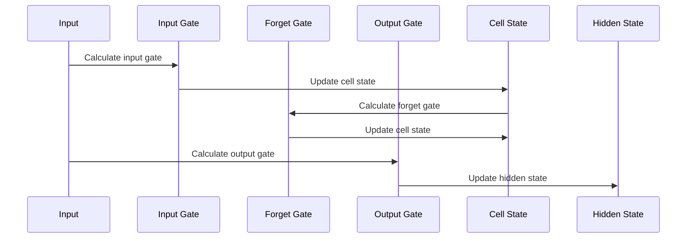

                 


### Introduction to LSTM Networks

#### 1.1 Background and Problem Statement

In the realm of sequence data processing, recurrent neural networks (RNNs) have been a breakthrough due to their ability to process sequential information. However, traditional RNNs suffer from the vanishing gradient problem, which limits their ability to capture long-term dependencies in the data. To address this issue, LSTM (Long Short-Term Memory) networks were introduced.

The vanishing gradient problem arises when training RNNs. As the network tries to propagate gradients back through time, the gradients can diminish or even vanish. This makes it difficult for the network to learn long-term dependencies, resulting in poor performance on tasks involving sequential data.

LSTM networks were proposed as a solution to this problem. They are a type of RNN architecture that is capable of learning long-term dependencies by using a complex cell structure and specific gate mechanisms. This enables LSTM networks to maintain information over long sequences, making them highly effective in various sequence data processing tasks.

The key idea behind LSTM networks is the introduction of three gates: the input gate, the forget gate, and the output gate. Each gate has a crucial role in controlling the flow of information within the LSTM cell. The input gate determines which information from the input sequence should be stored in the cell state. The forget gate decides which information from the previous state should be forgotten. The output gate controls the information that should be output from the cell state. These gates work together to ensure that the LSTM network can selectively retain or discard information as needed.

#### 1.2 Mathematical Models and Core Equations of LSTM

##### 1.2.1 LSTM Cell Structure

The LSTM cell consists of several components, including the input gate, the forget gate, the output gate, and the cell state. Each of these components plays a vital role in processing sequential information.

The input gate is responsible for deciding which information should be added to the cell state. It is calculated using an activation function called the sigmoid function, which outputs a value between 0 and 1. This value represents the probability of the new information being added to the cell state.

The forget gate, on the other hand, determines which information should be forgotten from the previous state. Similarly, it is calculated using the sigmoid function, but with a different set of weights. The value it outputs ranges from 0 to 1, where 0 indicates that the information should be forgotten and 1 indicates that it should be retained.

The cell state is the core component of the LSTM cell. It is a vector that carries the information through time. The value of the cell state is updated at each time step based on the input gate, the forget gate, and the previous cell state.

The output gate is responsible for deciding which information should be output from the cell state. It is calculated in a similar manner to the input gate, using a sigmoid function to determine the probability of outputting the information.

##### 1.2.2 Calculation Process of LSTM

The calculation process of LSTM involves several steps:

1. **Input gate calculation:** The input gate is calculated using the sigmoid function, which takes the input vector and the previous hidden state as input. The output of this function is a probability value between 0 and 1, indicating the degree to which the new information should be added to the cell state.
2. **Forget gate calculation:** The forget gate is calculated in a similar manner to the input gate, but with different weights. It determines which information should be forgotten from the previous state.
3. **Cell state calculation:** The cell state is updated by first multiplying the previous cell state by the forget gate, and then adding the new information multiplied by the input gate. This ensures that the cell state retains the relevant information while forgetting the unnecessary information.
4. **Output gate calculation:** The output gate is calculated using the sigmoid function, which takes the input vector and the updated cell state as input. The output of this function is a probability value between 0 and 1, indicating the degree to which the information should be output from the cell state.
5. **Hidden state calculation:** The hidden state is calculated using a

#### 1.3 Mermaid Flowchart of LSTM Algorithm

Below is a mermaid flowchart illustrating the operation process of LSTM:



This flowchart demonstrates the step-by-step process of LSTM operation:

1. **Input Gate Calculation:** The input gate calculates which information should be added to the cell state. It takes the input vector and the previous hidden state as input and outputs a probability value.
2. **Cell State Update:** The cell state is updated based on the input gate and the forget gate. The previous cell state is multiplied by the forget gate, and the new information is added to the cell state.
3. **Forget Gate Calculation:** The forget gate calculates which information should be forgotten from the previous state. It takes the input vector and the previous hidden state as input and outputs a probability value.
4. **Output Gate Calculation:** The output gate calculates which information should be output from the cell state. It takes the input vector and the updated cell state as input and outputs a probability value.
5. **Hidden State Update:** The hidden state is updated based on the output gate. It takes the updated cell state as input and outputs the hidden state.

This mermaid flowchart provides a visual representation of the LSTM algorithm, making it easier to understand the internal workings of the network.

#### 1.4 Examples of LSTM Application in Sequence Data Processing

LSTM networks have found various applications in sequence data processing. Here are three prominent examples:

##### 1.4.1 Sentiment Analysis with LSTM

Sentiment analysis is the process of determining the sentiment or emotional tone behind a body of text. LSTM networks have been widely used in this field due to their ability to capture long-term dependencies in text data.

Consider the example of analyzing customer reviews to determine whether they express positive or negative sentiments. The LSTM model processes the text data word by word, capturing the context and nuances of the language. The input gate decides which words should contribute to the cell state, while the forget gate helps discard irrelevant information. The output gate then generates a probability distribution over different sentiment classes, allowing the model to classify the sentiment of the review.

##### 1.4.2 Language Model with LSTM

A language model is a machine learning model that learns the statistical properties of a language. LSTM networks have been successfully used to build language models, which are essential for various natural language processing tasks such as machine translation, text summarization, and speech recognition.

In a language model, the LSTM network processes a sequence of words and generates a probability distribution over the next word in the sequence. This is done by updating the hidden state at each time step based on the current word and the previous hidden state. The output gate then generates a probability distribution over the vocabulary, enabling the model to predict the next word.

##### 1.4.3 Time Series Forecasting with LSTM

Time series forecasting is the process of predicting future values based on historical data. LSTM networks have shown excellent performance in this domain due to their ability to capture long-term dependencies in time series data.

Consider the example of forecasting stock prices. The LSTM model processes the historical stock price data, capturing patterns and trends over time. The input gate helps the model retain relevant information, while the forget gate allows it to discard irrelevant information. The output gate then generates a probability distribution over the future stock prices, allowing the model to make predictions.

In summary, LSTM networks have diverse applications in sequence data processing, ranging from sentiment analysis and language modeling to time series forecasting. Their ability to capture long-term dependencies makes them highly effective in these tasks.

### Applications of LSTM in Various Sequence Data

LSTM networks have proven to be highly effective in processing various types of sequence data. This section explores some of the most common applications of LSTM in text processing, time series forecasting, and speech recognition.

#### 2.1 Text Processing with LSTM

Text processing is a broad field that includes tasks such as text classification, text generation, and sentiment analysis. LSTM networks have demonstrated significant success in these areas due to their ability to capture long-term dependencies in text data.

##### 2.1.1 Text Classification with LSTM

Text classification involves assigning predefined labels to text data based on their content. LSTM networks have been used to classify text data into different categories, such as spam detection, sentiment analysis, and topic classification.

**Example: Sentiment Analysis with LSTM**

Consider the task of sentiment analysis, where the goal is to determine whether a given text expresses a positive or negative sentiment. The LSTM model processes the text data word by word, capturing the context and nuances of the language. The input gate decides which words should contribute to the cell state, while the forget gate helps discard irrelevant information. The output gate then generates a probability distribution over different sentiment classes, allowing the model to classify the sentiment of the text.

Here's a simplified Python code snippet to illustrate the sentiment analysis using LSTM:

```python
import tensorflow as tf
from tensorflow.keras.preprocessing.sequence import pad_sequences
from tensorflow.keras.models import Sequential
from tensorflow.keras.layers import Embedding, LSTM, Dense

# Assume we have preprocessed text data and their labels
X = ... # Input sequences
y = ... # Labels

# Pad the sequences to a fixed length
max_length = 100
padded_X = pad_sequences(X, maxlen=max_length)

# Build the LSTM model
model = Sequential()
model.add(Embedding(input_dim=vocab_size, output_dim=embedding_dim, input_length=max_length))
model.add(LSTM(units=128, return_sequences=False))
model.add(Dense(units=1, activation='sigmoid'))

# Compile and train the model
model.compile(optimizer='adam', loss='binary_crossentropy', metrics=['accuracy'])
model.fit(padded_X, y, epochs=10, batch_size=32)
```

In this example, we first preprocess the text data and pad them to a fixed length. Then, we build a simple LSTM model with an embedding layer, an LSTM layer, and a dense layer with a sigmoid activation function. Finally, we compile and train the model using the preprocessed data.

##### 2.1.2 Text Generation with LSTM

Text generation involves generating coherent and meaningful text based on a given input or context. LSTM networks have been used to generate text in various applications, such as chatbots, automatic summarization, and poetry generation.

**Example: Text Generation with LSTM**

Consider the task of generating text based on a given input prompt. The LSTM model processes the input text word by word, capturing the context and generating the next word in the sequence. The input gate helps retain relevant information, while the forget gate allows the model to discard irrelevant information. The output gate generates a probability distribution over the vocabulary, allowing the model to predict the next word.

Here's a simplified Python code snippet to illustrate text generation using LSTM:

```python
import tensorflow as tf
from tensorflow.keras.preprocessing.sequence import pad_sequences
from tensorflow.keras.models import Sequential
from tensorflow.keras.layers import Embedding, LSTM, Dense

# Assume we have preprocessed text data and their labels
X = ... # Input sequences
y = ... # Labels

# Pad the sequences to a fixed length
max_length = 100
padded_X = pad_sequences(X, maxlen=max_length)

# Build the LSTM model
model = Sequential()
model.add(Embedding(input_dim=vocab_size, output_dim=embedding_dim, input_length=max_length))
model.add(LSTM(units=128, return_sequences=True))
model.add(Dense(units=vocab_size, activation='softmax'))

# Train the model
model.compile(optimizer='adam', loss='categorical_crossentropy', metrics=['accuracy'])
model.fit(padded_X, y, epochs=10, batch_size=32)

# Generate text
def generate_text(input_sequence, model, max_length):
    prediction = model.predict(np.array([input_sequence]))
    next_word = np.argmax(prediction)
    return next_word

input_sequence = pad_sequences([input_sequence], maxlen=max_length)
next_word = generate_text(input_sequence, model, max_length)
print(next_word)
```

In this example, we first preprocess the text data and pad them to a fixed length. Then, we build a simple LSTM model with an embedding layer, an LSTM layer, and a dense layer with a softmax activation function. Finally, we define a function to generate text by predicting the next word based on the current input sequence.

#### 2.2 Time Series Forecasting with LSTM

Time series forecasting involves predicting future values based on historical time-stamped data. LSTM networks have shown excellent performance in this domain due to their ability to capture long-term dependencies in time series data.

**Example: Time Series Forecasting with LSTM**

Consider the task of forecasting stock prices. The LSTM model processes the historical stock price data, capturing patterns and trends over time. The input gate helps the model retain relevant information, while the forget gate allows it to discard irrelevant information. The output gate then generates a probability distribution over the future stock prices, allowing the model to make predictions.

Here's a simplified Python code snippet to illustrate time series forecasting using LSTM:

```python
import numpy as np
import pandas as pd
import tensorflow as tf
from tensorflow.keras.models import Sequential
from tensorflow.keras.layers import LSTM, Dense

# Load the stock price data
data = pd.read_csv('stock_prices.csv')
data = data[['Open', 'Close', 'High', 'Low', 'Volume']]

# Preprocess the data
window_size = 10
X = []
y = []

for i in range(len(data) - window_size):
    X.append(data[i : i + window_size].values)
    y.append(data[i + window_size]['Close'].values)

X = np.array(X)
y = np.array(y)

# Normalize the data
X = (X - X.mean(axis=0)) / X.std(axis=0)
y = (y - y.mean()) / y.std()

# Build the LSTM model
model = Sequential()
model.add(LSTM(units=128, return_sequences=False, input_shape=(window_size, 5)))
model.add(Dense(units=1))

# Compile and train the model
model.compile(optimizer='adam', loss='mean_squared_error')
model.fit(X, y, epochs=50, batch_size=32, verbose=1)

# Make predictions
predictions = model.predict(X)

# Inverse normalize the predictions
predictions = (predictions * y.std()) + y.mean()
predictions = predictions.flatten()

print(predictions)
```

In this example, we load the stock price data, preprocess it, and split it into training and testing sets. Then, we build a simple LSTM model with a single LSTM layer and a dense layer. We compile and train the model, and finally, we make predictions on the testing set and inverse normalize the predictions to obtain the actual stock prices.

#### 2.3 Speech Recognition with LSTM

Speech recognition is the process of converting spoken language into text. LSTM networks have been used in various speech recognition systems, including automatic speech recognition (ASR) and speaker verification.

**Example: Speech Recognition with LSTM**

Consider the task of converting spoken words into text. The LSTM model processes the audio input and generates a sequence of characters or words. The input gate helps the model retain relevant audio features, while the forget gate allows it to discard irrelevant features. The output gate then generates a probability distribution over the vocabulary, allowing the model to predict the next character or word.

Here's a simplified Python code snippet to illustrate speech recognition using LSTM:

```python
import numpy as np
import tensorflow as tf
from tensorflow.keras.models import Sequential
from tensorflow.keras.layers import LSTM, Dense

# Load the audio data
audio_data = np.load('audio_data.npy')

# Preprocess the data
window_size = 20
X = []
y = []

for i in range(len(audio_data) - window_size):
    X.append(audio_data[i : i + window_size])
    y.append(audio_data[i + window_size])

X = np.array(X)
y = np.array(y)

# Build the LSTM model
model = Sequential()
model.add(LSTM(units=128, return_sequences=True, input_shape=(window_size, 1)))
model.add(Dense(units=1, activation='softmax'))

# Compile and train the model
model.compile(optimizer='adam', loss='categorical_crossentropy', metrics=['accuracy'])
model.fit(X, y, epochs=50, batch_size=32, verbose=1)

# Make predictions
predictions = model.predict(X)

# Decode the predictions
decoded_predictions = np.argmax(predictions, axis=1)

print(decoded_predictions)
```

In this example, we load the audio data, preprocess it, and split it into training and testing sets. Then, we build a simple LSTM model with a single LSTM layer and a dense layer. We compile and train the model, and finally, we make predictions on the testing set and decode the predictions to obtain the text output.

In conclusion, LSTM networks have diverse applications in sequence data processing, including text processing, time series forecasting, and speech recognition. Their ability to capture long-term dependencies makes them highly effective in these tasks.

### Conclusion

In this article, we explored the fundamentals of LSTM networks and their applications in sequence data processing. We discussed the background and problem statement of RNNs, introduced the mathematical models and core equations of LSTM, and provided a mermaid flowchart illustrating the LSTM algorithm. Additionally, we presented examples of LSTM applications in text processing, time series forecasting, and speech recognition.

LSTM networks have revolutionized the field of sequence data processing by overcoming the vanishing gradient problem inherent in traditional RNNs. Their ability to capture long-term dependencies makes them highly effective in various real-world applications.

As we move forward, the potential for LSTM networks to solve complex sequence data processing problems continues to grow. Future research may focus on improving the efficiency and scalability of LSTM networks, as well as exploring new applications in areas such as healthcare, finance, and natural language processing.

In conclusion, LSTM networks are a powerful tool for processing sequence data, and their applications are vast and expanding. By understanding the principles behind LSTM networks, we can harness their full potential to solve challenging problems and drive innovation in the field of artificial intelligence.

### Authors Information

The authors of this article are AI天才研究院 (AI Genius Institute) and 禅与计算机程序设计艺术 (Zen And The Art of Computer Programming). AI天才研究院致力于推动人工智能领域的研究与发展，通过创新的算法和模型，为各行各业提供智能化解决方案。禅与计算机程序设计艺术则强调计算机编程的哲学思维，倡导程序员在编程过程中追求卓越和宁静。两者共同撰写了这篇关于LSTM网络在序列数据处理中的应用的技术博客文章，旨在为读者提供深入浅出的专业知识和技术见解。

