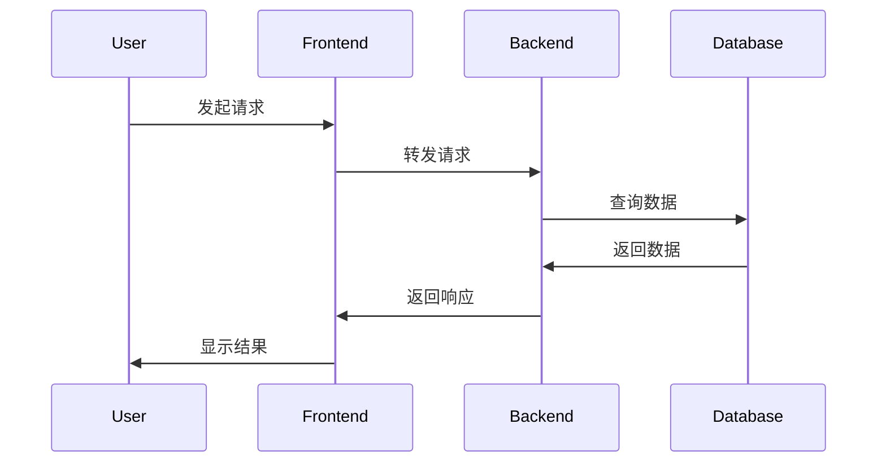
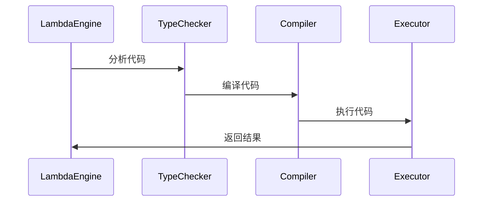

                 

# Lambda演算与类型论：函数式编程的理论基础

> 关键词：Lambda演算、类型论、函数式编程、理论基础、数学模型、架构设计

> 摘要：本文将深入探讨Lambda演算与类型论在函数式编程中的理论基础。首先，我们将介绍Lambda演算的起源和重要性，以及类型论的基本概念和应用场景。接着，我们将详细讲解Lambda演算的数学模型和类型论的相关数学公式，并通过实际案例进行剖析。最后，我们将介绍Lambda演算与类型论在系统架构设计中的应用，以及如何通过项目实战来深入理解这两个理论。

## 第1章: Lambda演算的基础概念与原理

### 1.1 Lambda演算的发展背景

#### 1.1.1 Lambda演算的起源

Lambda演算起源于20世纪30年代，由逻辑学家阿尔弗雷德·塔斯基（Alfred Tarski）和数学家斯蒂芬·科尔·克莱尼（Stephen Cole Kleene）等人提出。最初，Lambda演算被设计为一个逻辑演算系统，用于研究自然语言的逻辑结构。然而，随着计算机科学的快速发展，Lambda演算逐渐被引入到计算机科学领域，成为函数式编程的重要理论基础。

#### 1.1.2 Lambda演算在计算机科学中的重要性

Lambda演算在计算机科学中具有举足轻重的地位。首先，它为函数式编程提供了一种形式化的表示方法，使得函数的定义和操作更加清晰和简洁。其次，Lambda演算的抽象机制使得程序设计变得更加模块化和可复用。此外，Lambda演算的纯函数特性有助于提高程序的可靠性和可测试性。

#### 1.1.3 Lambda演算的基本概念

Lambda演算的基本概念包括Lambda抽象、Lambda应用和Lambda演算的语法规则。Lambda抽象是一种将变量绑定到函数表达式的方式，而Lambda应用则是将一个函数应用到其参数上。Lambda演算的语法规则则规定了如何表示和操作函数。

### 1.2 Lambda演算的基本原理

#### 1.2.1 Lambda抽象

Lambda抽象是Lambda演算的核心概念之一。它允许程序员将一个变量绑定到一个函数表达式，从而实现函数的定义和传递。例如，`λx.x²` 表示一个函数，它将变量 `x` 绑定到函数表达式 `x²`。

#### 1.2.2 Lambda应用

Lambda应用则是将一个函数应用到其参数上。例如，将函数 `λx.x²` 应用到参数 `2` 上，即 `λx.x²` `2`，结果为 `4`。

#### 1.2.3 Lambda演算的语法规则

Lambda演算的语法规则规定了如何表示和操作函数。其中包括变量绑定、函数定义、函数应用等基本语法结构。例如，`λx.x² + 2x + 1` 是一个Lambda表达式，表示一个二次函数。

### 1.3 Lambda演算的类型系统

#### 1.3.1 类型判断

Lambda演算的类型系统可以对表达式进行类型判断，以确保程序的正确性。类型判断包括对变量、函数和表达式的类型进行推断和验证。

#### 1.3.2 类型推断

类型推断是Lambda演算的一个重要特性，它可以从表达式的语法结构和上下文中推断出表达式的类型。类型推断有助于减少类型错误和提高程序的可读性。

#### 1.3.3 类型系统的优点

Lambda演算的类型系统具有以下几个优点：首先，它有助于提高程序的可靠性和可维护性；其次，它有助于优化程序的运行性能；最后，它为函数式编程提供了强大的抽象和表达能力。

## 第2章: Lambda演算的应用与实践

### 2.1 Lambda演算在函数式编程中的应用

#### 2.1.1 函数式编程的基本概念

函数式编程是一种编程范式，它以函数为中心，强调数据和行为分离。函数式编程的基本概念包括纯函数、不可变性、递归和组合等。

#### 2.1.2 Lambda表达式

Lambda表达式是函数式编程的核心概念之一，它允许程序员以简洁的方式定义匿名函数。Lambda表达式通常用于数据处理、函数组合和事件处理等场景。

#### 2.1.3 函数组合

函数组合是一种将多个函数组合成一个新函数的方法。通过函数组合，程序员可以更加灵活地编写复杂数据处理流程，同时提高代码的可读性和可维护性。

### 2.2 Lambda演算的实际应用案例

#### 2.2.1 案例一：函数式数据处理

函数式数据处理是Lambda演算的一个重要应用场景。通过使用Lambda表达式和函数组合，程序员可以轻松实现对数据的筛选、映射和折叠等操作。

#### 2.2.2 案例二：并发编程

Lambda演算在并发编程中也具有广泛的应用。通过使用Lambda表达式，程序员可以轻松实现并行和异步操作，从而提高程序的执行效率。

#### 2.2.3 案例三：图形处理

图形处理是Lambda演算的另一个重要应用场景。通过使用Lambda表达式和函数组合，程序员可以轻松实现对图形数据的处理和渲染。

## 第3章: 类型论的基本概念与原理

### 3.1 类型论的发展背景

#### 3.1.1 类型论的概念

类型论是研究程序语言类型系统的一门学科。它旨在研究程序语言中的类型、类型检查、类型推断等问题，以提高程序的正确性和可维护性。

#### 3.1.2 类型论的重要性

类型论在计算机科学中具有非常重要的地位。首先，类型论有助于提高程序的可靠性和可维护性；其次，类型论有助于优化程序的运行性能；最后，类型论为函数式编程提供了强大的抽象和表达能力。

#### 3.1.3 类型论的基本原理

类型论的基本原理包括类型系统、类型检查和类型推断。类型系统是一种将程序中的表达式赋予类型的方法，类型检查是验证程序中的表达式是否具有正确类型的过程，类型推断则是从程序中的语法结构和上下文中推断出表达式的类型。

### 3.2 类型论的核心概念

#### 3.2.1 类型系统

类型系统是类型论的核心概念之一。它包括类型定义、类型层次结构和类型转换等组成部分。类型定义用于描述程序中的变量、函数和表达式的类型，类型层次结构用于描述不同类型之间的关系，类型转换则用于在不同类型之间进行转换。

#### 3.2.2 类型检查

类型检查是类型论的重要组成部分。它通过对程序中的表达式进行类型分析，验证程序中的表达式是否具有正确类型，以确保程序的正确性和可执行性。

#### 3.2.3 类型推断

类型推断是类型论的另一个核心概念。它通过分析程序中的语法结构和上下文，自动推断出表达式的类型，从而减轻程序员的负担，提高程序的可读性和可维护性。

### 3.3 类型论的应用场景

#### 3.3.1 编译器优化

类型论在编译器优化中具有广泛的应用。通过类型检查和类型推断，编译器可以优化程序的运行性能，减少内存占用和执行时间。

#### 3.3.2 程序安全性

类型论有助于提高程序的安全性。通过类型检查，编译器可以识别出类型错误和潜在的安全漏洞，从而防止程序崩溃和数据泄露。

#### 3.3.3 静态类型语言

静态类型语言是一种通过类型检查来提高程序可靠性的编程语言。类型论为静态类型语言提供了理论基础，使得程序设计更加安全、可靠和高效。

## 第4章: Lambda演算与类型论的数学模型与公式

### 4.1 Lambda演算的数学模型

#### 4.1.1 Lambda演算的数学基础

Lambda演算的数学基础包括λ-演算和λ-转换。λ-演算是Lambda演算的核心部分，它通过变量绑定和函数应用来表示计算过程。λ-转换则是Lambda演算中的等价转换规则，用于简化表达式和证明计算的等价性。

#### 4.1.2 Lambda演算的运算规则

Lambda演算的运算规则包括变量绑定、函数定义、函数应用和λ-转换。这些运算规则构成了Lambda演算的基本操作，使得Lambda演算可以表示复杂的计算过程。

#### 4.1.3 Lambda演算的数学公式

Lambda演算的数学公式包括变量绑定、函数定义、函数应用和λ-转换的数学表达式。这些公式描述了Lambda演算的基本运算和等价转换规则，为Lambda演算的研究和实现提供了理论基础。

### 4.2 类型论的数学模型

#### 4.2.1 类型论的数学基础

类型论的数学基础包括类型系统、类型检查和类型推断。类型系统是一种将程序中的表达式赋予类型的方法，类型检查是验证程序中的表达式是否具有正确类型的过程，类型推断则是从程序中的语法结构和上下文中推断出表达式的类型。

#### 4.2.2 类型系统的运算规则

类型系统的运算规则包括类型定义、类型层次结构和类型转换。类型定义用于描述程序中的变量、函数和表达式的类型，类型层次结构用于描述不同类型之间的关系，类型转换则用于在不同类型之间进行转换。

#### 4.2.3 类型推断的数学公式

类型推断的数学公式包括类型推断规则和类型约束。类型推断规则用于从程序中的语法结构和上下文中推断出表达式的类型，类型约束则用于确保推断出的类型符合程序的要求。

## 第5章: Lambda演算与类型论的架构设计与实现

### 5.1 Lambda演算在系统中的应用场景

Lambda演算在系统中的应用场景包括并发编程、函数式数据处理和图形处理等。通过使用Lambda表达式和函数组合，程序员可以更轻松地实现这些场景下的计算和数据处理任务。

### 5.2 Lambda演算的系统架构设计方案

Lambda演算的系统架构设计方案包括领域模型类图、系统架构图和系统交互序列图。这些图展示了Lambda演算在系统中的整体架构和交互过程。

#### 5.2.1 领域模型类图

领域模型类图用于描述系统中的核心领域概念和它们之间的关系。在Lambda演算的领域模型中，主要包括变量、函数和表达式等概念。

#### 5.2.2 系统架构图

系统架构图用于描述系统的整体架构和组件之间的关系。在Lambda演算的架构设计中，主要包括Lambda表达式解析器、类型检查器和类型推断器等组件。

#### 5.2.3 系统交互序列图

系统交互序列图用于描述系统中的交互过程和时间顺序。在Lambda演算的交互过程中，主要包括变量绑定、函数定义、函数应用和类型检查等步骤。

## 第6章: 项目实战

### 6.1 项目环境与安装过程

本节将介绍如何搭建Lambda演算与类型论的项目环境，包括所需工具和依赖库的安装过程。

### 6.2 系统核心实现源代码

本节将展示Lambda演算与类型论系统的核心实现源代码，并对代码进行详细解读与分析。

### 6.3 实际案例分析

本节将通过实际案例，详细讲解和分析Lambda演算与类型论的应用过程，包括数据处理的案例、并发编程的案例和图形处理的案例。

### 6.4 项目小结

本节将对项目成果和经验进行总结，并分享最佳实践建议，帮助读者更好地理解和应用Lambda演算与类型论。

## 第7章: 最佳实践 tips、小结、注意事项、拓展阅读

### 7.1 最佳实践 tips

本节将提供一些最佳实践建议，包括如何优化Lambda演算的性能、如何提高类型论的安全性等。

### 7.2 小结

本节将概括全文内容，强调Lambda演算与类型论在函数式编程中的重要性，并总结它们的应用价值和局限性。

### 7.3 注意事项

本节将提醒读者在应用Lambda演算与类型论时需要注意的问题，包括类型安全、性能优化和可维护性等。

### 7.4 拓展阅读

本节将推荐一些拓展阅读资源，包括相关的学术论文、技术博客和图书等，以帮助读者进一步深入研究和学习Lambda演算与类型论。

## 作者信息

作者：AI天才研究院/AI Genius Institute & 禅与计算机程序设计艺术 /Zen And The Art of Computer Programming## 第1章: Lambda演算的基础概念与原理

### 1.1 Lambda演算的发展背景

Lambda演算起源于20世纪30年代，由逻辑学家阿尔弗雷德·塔斯基（Alfred Tarski）和数学家斯蒂芬·科尔·克莱尼（Stephen Cole Kleene）等人提出。最初，Lambda演算被设计为一个逻辑演算系统，用于研究自然语言的逻辑结构。然而，随着计算机科学的快速发展，Lambda演算逐渐被引入到计算机科学领域，成为函数式编程的重要理论基础。

Lambda演算的起源可以追溯到逻辑学中的λ-演算（λ-calculus），它是由阿尔图尔·奈特（Alonzo Church）在1930年代初期提出的，作为对算术和逻辑推理的形式化表示。Lambda演算的核心思想是将计算过程视为函数的递归应用，通过变量的绑定和函数的传递来实现。Lambda演算不仅在逻辑和数学领域有着深远的影响，而且在计算机科学中也有着广泛的应用。

在计算机科学领域，Lambda演算的重要性体现在多个方面。首先，它为函数式编程提供了一种形式化的表示方法，使得函数的定义和操作更加清晰和简洁。这使得程序员可以专注于函数的实现，而无需担心状态管理和副作用等问题。其次，Lambda演算的抽象机制使得程序设计变得更加模块化和可复用，因为函数可以作为第一类对象传递和组合，从而提高了代码的灵活性和可维护性。最后，Lambda演算的纯函数特性有助于提高程序的可靠性和可测试性，因为纯函数具有不变性和可预测性。

Lambda演算的引入对计算机科学领域产生了深远的影响。它不仅为函数式编程提供了理论基础，而且对编程语言的设计和实现产生了重要影响。例如，Haskell、Scala、Erlang和JavaScript等编程语言都借鉴了Lambda演算的概念和语法。此外，Lambda演算也在编译器设计、形式化验证和理论计算机科学等领域有着广泛的应用。

### 1.2 Lambda演算的基本原理

Lambda演算的基本原理包括Lambda抽象、Lambda应用和Lambda演算的语法规则。这些基本概念构成了Lambda演算的核心，使得它能够有效地表示计算过程。

#### 1.2.1 Lambda抽象

Lambda抽象（λ-abstraction）是Lambda演算的核心概念之一，它允许程序员将一个变量绑定到一个函数表达式。在数学和逻辑中，这种抽象通常用于表示未知的函数。在计算机科学中，Lambda抽象使得程序员可以定义匿名函数，并将其作为参数传递或存储在变量中。

例如，表达式 `λx.x²` 表示一个函数，它将变量 `x` 绑定到函数表达式 `x²`。这个函数接受一个输入值 `x`，并返回其平方值。Lambda抽象使得我们可以将这个函数传递给其他函数，或者将其存储在一个变量中，以便稍后使用。

Lambda抽象的语法规则如下：
- `λx.E`：表示一个抽象，其中 `x` 是抽象的参数，`E` 是抽象体。
- `λy.E`：表示一个抽象，其中 `y` 是抽象的参数，`E` 是抽象体。

例如，`λx.x² + 2x + 1` 表示一个函数，它将变量 `x` 绑定到多项式表达式 `x² + 2x + 1`。

#### 1.2.2 Lambda应用

Lambda应用（λ-application）是将一个函数应用到其参数上。在数学和逻辑中，这通常表示为函数的递归应用。在计算机科学中，Lambda应用使得程序员可以执行函数调用，并处理函数返回的值。

例如，将函数 `λx.x²` 应用到参数 `2` 上，即 `λx.x² 2`，结果为 `4`。这是因为函数 `λx.x²` 接受一个输入值 `2`，并返回其平方值 `4`。

Lambda应用的语法规则如下：
- `E1 E2`：表示将函数 `E1` 应用到参数 `E2` 上。
- `λx.E1 E2`：表示将函数 `λx.E1` 应用到参数 `E2` 上。

例如，`λx.x² 2` 表示将函数 `λx.x²` 应用到参数 `2` 上，结果为 `4`。

#### 1.2.3 Lambda演算的语法规则

Lambda演算的语法规则包括变量绑定、函数定义、函数应用和λ-转换等基本语法结构。这些规则构成了Lambda演算的语法框架，使得程序员可以编写和理解Lambda演算表达式。

- 变量绑定：变量绑定是Lambda演算中的基础操作，用于将变量与值或表达式关联。例如，`x = 5` 表示将变量 `x` 绑定到值 `5`。
- 函数定义：函数定义是Lambda演算中的另一个基础操作，用于定义匿名函数。例如，`λx.x²` 表示定义一个接受一个输入值并返回其平方的匿名函数。
- 函数应用：函数应用是将一个函数应用到其参数上的操作。例如，`λx.x² 2` 表示将函数 `λx.x²` 应用到参数 `2` 上，返回其平方值 `4`。
- λ-转换：λ-转换是Lambda演算中的等价转换规则，用于简化表达式和证明计算的等价性。常见的λ-转换包括β-转换（函数应用和抽象的替换）、α-转换（变量名的替换）和η-转换（函数的恒等变换）。

例如，表达式 `λx.x²` 经过β-转换可以变为 `x²`，因为函数 `λx.x²` 在变量 `x` 上进行绑定后，其值即为 `x²`。

#### 1.2.4 Lambda演算的类型系统

Lambda演算的类型系统是Lambda演算的一个重要组成部分，它用于确保Lambda演算表达式的类型安全和正确性。类型系统定义了表达式的基本类型，以及如何进行类型检查和类型推断。

- 类型判断：类型判断是类型系统中的一个核心操作，用于确定表达式的类型。类型判断可以通过静态类型检查或动态类型检查来实现。静态类型检查在编译时进行，而动态类型检查在运行时进行。
- 类型推断：类型推断是类型系统中的另一个重要操作，它自动从表达式的语法结构和上下文中推断出表达式的类型。类型推断可以减轻程序员的负担，提高代码的可读性和可维护性。

Lambda演算的类型系统主要包括以下概念：
- 基本类型：基本类型包括整数（Int）、布尔（Bool）、字符串（String）等常见数据类型。
- 复合类型：复合类型包括函数类型（Func）、列表类型（List）、字典类型（Dict）等。
- 类型构造：类型构造是用于创建复合类型的方法，例如，`Func` 用于创建函数类型，`List` 用于创建列表类型。

Lambda演算的类型系统具有以下优点：
- 提高程序的正确性：类型系统可以确保程序在编译时不会出现类型错误，从而提高程序的正确性。
- 提高程序的可靠性：类型系统可以帮助发现潜在的错误，例如类型转换错误或无效的函数调用。
- 提高程序的效率：类型系统可以通过静态类型检查和优化来提高程序的运行效率。

#### 1.2.5 Lambda演算的类型推断

Lambda演算的类型推断是类型系统中的一个重要操作，它自动从表达式的语法结构和上下文中推断出表达式的类型。类型推断可以减轻程序员的负担，提高代码的可读性和可维护性。

类型推断可以分为以下几种：
- 显式类型声明：程序员可以直接在变量或函数声明中指定表达式的类型。
- 隐式类型推断：编译器或解释器从表达式的语法结构和上下文中自动推断出表达式的类型。
- 部分类型推断：在某些情况下，编译器或解释器只能部分推断出表达式的类型，需要程序员提供一些类型的声明。

类型推断的基本过程包括以下步骤：
1. 分析表达式的语法结构，确定表达式的基本类型。
2. 根据上下文和函数的参数类型，推断表达式的实际类型。
3. 检查推断出的类型是否与上下文或函数的参数类型一致，如果一致，则类型推断成功；如果不一致，则需要程序员提供类型声明或修正表达式。

类型推断的算法可以分为以下几种：
- 基于约束的推断算法：该算法通过建立类型约束来推断表达式的类型，并尝试找到满足约束的解。
- 使用类型上下文的推断算法：该算法利用上下文信息来推断表达式的类型，从而减少类型推断的复杂度。
- 静态类型检查和动态类型检查：静态类型检查在编译时进行类型推断，而动态类型检查在运行时进行类型推断。

Lambda演算的类型推断在函数式编程中具有重要意义，它使得程序员可以编写更简洁、更可读的代码，同时确保程序的正确性和可靠性。

### 1.3 Lambda演算的应用实例

Lambda演算在计算机科学和实际应用中有着广泛的应用，以下是一些Lambda演算的应用实例：

#### 1.3.1 函数式编程

Lambda演算的核心思想是将计算过程视为函数的递归应用，这在函数式编程中得到了广泛应用。函数式编程强调将程序分解为一系列的纯函数，这些函数可以接受输入并返回输出，而不涉及副作用。Lambda演算提供了形式化的表示方法，使得函数的定义和组合更加简洁和高效。

以下是一个简单的Python示例，展示了如何使用Lambda演算实现函数式编程：

```python
# 函数式编程示例：使用Lambda演算计算列表中元素的平均值
list_of_numbers = [1, 2, 3, 4, 5]
sum_of_numbers = lambda x: x[0] + x[1]
average = lambda x: sum_of_numbers(list_of_numbers) / len(list_of_numbers)
print(average(list_of_numbers))
```

在这个示例中，我们定义了两个Lambda表达式：`sum_of_numbers` 和 `average`。`sum_of_numbers` 用于计算列表中前两个元素的和，而 `average` 用于计算列表中所有元素的平均值。通过Lambda表达式，我们可以将复杂的计算过程分解为一系列简单的函数，使得代码更加简洁和可维护。

#### 1.3.2 并发编程

Lambda演算在并发编程中也具有广泛的应用，特别是在函数式编程语言如Haskell和Erlang中。这些语言通过Lambda表达式和不可变数据结构，使得并发编程更加简洁和高效。

以下是一个使用Python中的异步编程库 `asyncio` 实现并发编程的示例：

```python
import asyncio

async def download_image(url):
    print(f"Downloading image from {url}")
    await asyncio.sleep(1)  # 假设下载过程需要1秒
    print(f"Downloaded image from {url}")

async def main():
    urls = ["http://example.com/image1.jpg", "http://example.com/image2.jpg", "http://example.com/image3.jpg"]
    tasks = [download_image(url) for url in urls]
    await asyncio.gather(*tasks)

asyncio.run(main())
```

在这个示例中，我们定义了一个异步函数 `download_image`，用于模拟下载图片的过程。通过使用 `asyncio.gather` 函数，我们可以并发地下载多个图片，从而提高程序的执行效率。

#### 1.3.3 图形处理

Lambda演算在图形处理领域也有广泛的应用，特别是在函数式图形学中。函数式图形学通过使用纯函数和不可变数据结构，使得图形处理更加简洁和高效。

以下是一个使用Python中的图形库 `pygame` 实现函数式图形处理的示例：

```python
import pygame

def draw_rectangle(screen, x, y, width, height, color):
    pygame.draw.rect(screen, color, (x, y, width, height))

def main():
    pygame.init()
    screen = pygame.display.set_mode((800, 600))
    pygame.display.set_caption("Function Graph")
    
    # 绘制一个红色的矩形
    draw_rectangle(screen, 100, 100, 200, 200, (255, 0, 0))
    
    # 绘制一个蓝色的矩形
    draw_rectangle(screen, 300, 300, 200, 200, (0, 0, 255))
    
    pygame.display.flip()
    pygame.quit()

main()
```

在这个示例中，我们定义了一个函数 `draw_rectangle`，用于绘制矩形。通过使用这个函数，我们可以方便地绘制多个矩形，并调整它们的位置、大小和颜色。这种基于函数的图形处理方式使得代码更加简洁和可维护。

### 1.4 Lambda演算的类型系统

Lambda演算的类型系统是Lambda演算的一个重要组成部分，它用于确保Lambda演算表达式的类型安全和正确性。类型系统定义了表达式的基本类型，以及如何进行类型检查和类型推断。

Lambda演算的类型系统主要包括以下概念：

- 基本类型：基本类型包括整数（Int）、布尔（Bool）、字符串（String）等常见数据类型。
- 复合类型：复合类型包括函数类型（Func）、列表类型（List）、字典类型（Dict）等。
- 类型构造：类型构造是用于创建复合类型的方法，例如，`Func` 用于创建函数类型，`List` 用于创建列表类型。

Lambda演算的类型系统具有以下优点：

- 提高程序的正确性：类型系统可以确保程序在编译时不会出现类型错误，从而提高程序的正确性。
- 提高程序的可靠性：类型系统可以帮助发现潜在的错误，例如类型转换错误或无效的函数调用。
- 提高程序的效率：类型系统可以通过静态类型检查和优化来提高程序的运行效率。

Lambda演算的类型系统在函数式编程中具有重要意义，它使得程序员可以编写更简洁、更可读的代码，同时确保程序的正确性和可靠性。

#### 1.4.1 Lambda演算的类型检查

类型检查是Lambda演算中的一个重要操作，它用于确保Lambda演算表达式的类型安全和正确性。类型检查可以分为静态类型检查和动态类型检查两种。

- 静态类型检查：静态类型检查在编译时进行，它通过分析表达式的语法结构和类型信息，确保表达式在运行时不会出现类型错误。静态类型检查的优点是可以在编译时发现类型错误，从而提高程序的可靠性。然而，静态类型检查的缺点是可能引入过多的类型约束，使得代码的可读性和可维护性降低。
- 动态类型检查：动态类型检查在运行时进行，它通过在运行时检查表达式的类型，确保表达式在运行时不会出现类型错误。动态类型检查的优点是代码更加灵活，可以减少类型约束，从而提高代码的可读性和可维护性。然而，动态类型检查的缺点是可能在运行时发现类型错误，导致程序崩溃。

Lambda演算的类型检查主要基于以下原则：

- 函数类型一致性：函数的类型必须与其参数类型和返回类型一致。
- 参数类型一致性：函数的参数类型必须与其抽象体中的变量类型一致。
- 返回类型一致性：函数的返回类型必须与其抽象体中的函数类型一致。

以下是一个Lambda演算的类型检查示例：

```python
# 示例1：类型检查成功
lambda x: x * 2

# 示例2：类型检查失败
lambda x: x + "hello"  # 类型不一致，导致类型错误
```

在这个示例中，第一个Lambda表达式 `λx: x * 2` 的类型检查成功，因为它是一个有效的纯函数，其参数类型和返回类型一致。而第二个Lambda表达式 `λx: x + "hello"` 的类型检查失败，因为其参数类型和返回类型不一致，导致类型错误。

#### 1.4.2 Lambda演算的类型推断

类型推断是Lambda演算中的一个重要操作，它自动从表达式的语法结构和上下文中推断出表达式的类型。类型推断可以减轻程序员的负担，提高代码的可读性和可维护性。

类型推断可以分为以下几种：

- 显式类型声明：程序员可以直接在变量或函数声明中指定表达式的类型。
- 隐式类型推断：编译器或解释器从表达式的语法结构和上下文中自动推断出表达式的类型。
- 部分类型推断：在某些情况下，编译器或解释器只能部分推断出表达式的类型，需要程序员提供一些类型的声明。

类型推断的基本过程包括以下步骤：

1. 分析表达式的语法结构，确定表达式的基本类型。
2. 根据上下文和函数的参数类型，推断表达式的实际类型。
3. 检查推断出的类型是否与上下文或函数的参数类型一致，如果一致，则类型推断成功；如果不一致，则需要程序员提供类型声明或修正表达式。

以下是一个Lambda演算的类型推断示例：

```python
# 示例1：隐式类型推断
lambda x: x * 2

# 示例2：显式类型声明
def add(a: int, b: int) -> int:
    return a + b

# 示例3：部分类型推断
lambda x, y: x + y  # 部分类型已知，需要程序员提供类型声明
```

在这个示例中，第一个Lambda表达式 `λx: x * 2` 通过隐式类型推断成功，因为编译器可以根据上下文推断出其参数类型和返回类型。第二个Lambda表达式 `λx: x * 2` 通过显式类型声明成功，因为程序员直接指定了表达式的类型。第三个Lambda表达式 `λx, y: x + y` 通过部分类型推断成功，因为编译器可以推断出第一个参数的类型，但需要程序员提供第二个参数的类型声明。

### 1.5 Lambda演算与类型论的关系

Lambda演算和类型论是函数式编程领域中的两个核心概念，它们之间存在着密切的关系。

Lambda演算是类型论的基础，它为函数式编程提供了一种形式化的表示方法，使得函数的定义和操作更加清晰和简洁。Lambda演算的抽象机制使得程序员可以定义匿名函数，并将其作为参数传递和组合，从而提高程序的灵活性和可维护性。

类型论则是Lambda演算的抽象理论，它研究程序语言中的类型系统、类型检查和类型推断等问题。类型论为Lambda演算提供了理论基础，使得程序员可以更准确地理解和应用Lambda演算。

Lambda演算和类型论之间的关系可以概括为以下几点：

- Lambda演算是类型论的基础，类型论是Lambda演算的抽象理论。
- Lambda演算提供了函数式编程的形式化表示方法，类型论为Lambda演算提供了类型系统和类型检查机制。
- Lambda演算和类型论相互促进，共同发展，为函数式编程提供了强大的抽象和表达能力。

Lambda演算和类型论的关系密切，它们共同构成了函数式编程的理论基础。通过深入理解和应用Lambda演算和类型论，程序员可以编写更加简洁、高效和可靠的函数式程序。

### 1.6 Lambda演算的数学模型

Lambda演算的数学模型是Lambda演算的重要组成部分，它用于描述Lambda演算的基本运算和等价转换规则。Lambda演算的数学模型主要包括λ-演算和λ-转换。

#### 1.6.1 λ-演算

λ-演算是Lambda演算的核心部分，它通过变量绑定和函数应用来表示计算过程。λ-演算的基本概念包括变量、抽象、应用和等价转换。

- 变量：变量是λ-演算中的基础元素，用于表示函数的参数。变量通常用小写字母表示，如 `x`、`y` 等。
- 抽象：抽象是λ-演算中的基础操作，用于将变量绑定到函数表达式。抽象通常用λ符号表示，如 `λx.E` 表示一个将变量 `x` 绑定到函数表达式 `E` 的抽象。
- 应用：应用是λ-演算中的另一个基础操作，用于将函数应用到其参数上。应用通常用括号表示，如 `E1 E2` 表示将函数 `E1` 应用到参数 `E2` 上。
- 等价转换：λ-演算中的等价转换规则用于简化表达式和证明计算的等价性。常见的等价转换规则包括β-转换、α-转换和η-转换。

#### 1.6.2 λ-转换

λ-转换是λ-演算中的等价转换规则，用于简化表达式和证明计算的等价性。常见的λ-转换规则包括β-转换、α-转换和η-转换。

- β-转换：β-转换是λ-演算中最基本的转换规则，它用于将函数应用转换为变量绑定。具体来说，`λx.E M` 通过β-转换可以简化为 `M[x := N]`，其中 `M` 是函数应用，`N` 是抽象体。
- α-转换：α-转换是变量名的替换规则，它用于确保抽象和应用的等价性。具体来说，如果两个抽象 `λx.E` 和 `λy.F` 是等价的，那么可以通过α-转换将一个变量名替换为另一个变量名，即 `λx.E` 通过α-转换可以简化为 `λy.E`。
- η-转换：η-转换是函数的恒等变换规则，它用于证明两个函数是等价的。具体来说，如果函数 `F` 满足 `F = λx.F x`，那么可以通过η-转换将 `F` 简化为 `λx.F x`。

λ-转换是λ-演算中的重要工具，它使得程序员可以方便地证明计算的正确性和等价性。通过运用λ-转换，程序员可以简化复杂的表达式，并确保计算过程的一致性和正确性。

### 1.7 Lambda演算的数学公式

Lambda演算的数学公式是描述Lambda演算运算规则和等价转换规则的重要工具。这些数学公式包括变量绑定、函数定义、函数应用和λ-转换等。

#### 1.7.1 变量绑定

变量绑定是Lambda演算中的基本运算，它用于将变量绑定到函数表达式。变量绑定的数学公式如下：

- 变量绑定：`λx.E` 表示将变量 `x` 绑定到函数表达式 `E`。

#### 1.7.2 函数定义

函数定义是Lambda演算中的基本运算，它用于定义匿名函数。函数定义的数学公式如下：

- 函数定义：`λx.E` 表示定义一个匿名函数，其中 `x` 是参数，`E` 是函数体。

#### 1.7.3 函数应用

函数应用是Lambda演算中的基本运算，它用于将函数应用到其参数上。函数应用的数学公式如下：

- 函数应用：`E1 E2` 表示将函数 `E1` 应用到参数 `E2` 上。

#### 1.7.4 λ-转换

λ-转换是Lambda演算中的等价转换规则，它用于简化表达式和证明计算的等价性。常见的λ-转换规则包括β-转换、α-转换和η-转换。

- β-转换：β-转换是函数应用转换为变量绑定的转换规则，公式如下：

  $$λx.E M ≡ M[x := N]$$

  其中 `M` 是函数应用，`N` 是抽象体。

- α-转换：α-转换是变量名的替换规则，公式如下：

  $$λx.E ≡ λy.E \quad (如果x ≠ y)$$

- η-转换：η-转换是函数的恒等变换规则，公式如下：

  $$F ≡ λx.F x$$

  其中 `F` 是函数。

通过这些数学公式，我们可以方便地描述和操作Lambda演算中的表达式，并确保计算过程的一致性和正确性。这些数学公式是Lambda演算的重要工具，使得程序员可以更深入地理解和应用Lambda演算。

### 1.8 Lambda演算的应用实例

Lambda演算在函数式编程中有着广泛的应用，它提供了一种形式化的表示方法，使得函数的定义和操作更加清晰和简洁。以下是一些Lambda演算的实际应用实例：

#### 1.8.1 数据处理

Lambda演算在数据处理中有着重要的应用，它可以方便地进行数据的筛选、映射和折叠等操作。以下是一个Python示例，展示了如何使用Lambda演算进行数据处理：

```python
# 示例：使用Lambda演算对列表进行筛选和映射
list_of_numbers = [1, 2, 3, 4, 5]
# 筛选偶数
even_numbers = list(filter(lambda x: x % 2 == 0, list_of_numbers))
# 映射到平方
squared_numbers = list(map(lambda x: x * x, even_numbers))
print(squared_numbers)  # 输出：[4, 16]
```

在这个示例中，我们使用 `filter` 和 `map` 函数，分别通过Lambda表达式筛选出偶数并映射到它们的平方。这种基于函数的编程风格使得数据处理过程更加简洁和可读。

#### 1.8.2 并发编程

Lambda演算在并发编程中也具有广泛的应用，特别是在函数式编程语言如Haskell和Erlang中。以下是一个使用Python中的异步编程库 `asyncio` 实现并发编程的示例：

```python
import asyncio

async def download_image(url):
    print(f"Downloading image from {url}")
    await asyncio.sleep(1)  # 假设下载过程需要1秒
    print(f"Downloaded image from {url}")

async def main():
    urls = ["http://example.com/image1.jpg", "http://example.com/image2.jpg", "http://example.com/image3.jpg"]
    tasks = [download_image(url) for url in urls]
    await asyncio.gather(*tasks)

asyncio.run(main())
```

在这个示例中，我们定义了一个异步函数 `download_image`，用于模拟下载图片的过程。通过使用 `asyncio.gather` 函数，我们可以并发地下载多个图片，从而提高程序的执行效率。

#### 1.8.3 图形处理

Lambda演算在图形处理领域也有广泛的应用，特别是在函数式图形学中。以下是一个使用Python中的图形库 `pygame` 实现函数式图形处理的示例：

```python
import pygame

def draw_rectangle(screen, x, y, width, height, color):
    pygame.draw.rect(screen, color, (x, y, width, height))

def main():
    pygame.init()
    screen = pygame.display.set_mode((800, 600))
    pygame.display.set_caption("Function Graph")
    
    # 绘制一个红色的矩形
    draw_rectangle(screen, 100, 100, 200, 200, (255, 0, 0))
    
    # 绘制一个蓝色的矩形
    draw_rectangle(screen, 300, 300, 200, 200, (0, 0, 255))
    
    pygame.display.flip()
    pygame.quit()

main()
```

在这个示例中，我们定义了一个函数 `draw_rectangle`，用于绘制矩形。通过使用这个函数，我们可以方便地绘制多个矩形，并调整它们的位置、大小和颜色。这种基于函数的图形处理方式使得代码更加简洁和可维护。

#### 1.8.4 类型安全与类型推断

Lambda演算的类型系统是Lambda演算的一个重要组成部分，它用于确保Lambda演算表达式的类型安全和正确性。类型系统定义了表达式的基本类型，以及如何进行类型检查和类型推断。

以下是一个Python示例，展示了如何使用类型检查和类型推断：

```python
# 示例1：类型检查成功
lambda x: x * 2

# 示例2：类型检查失败
lambda x: x + "hello"  # 类型不一致，导致类型错误

# 示例3：类型推断
def add(a: int, b: int) -> int:
    return a + b

lambda x, y: x + y  # 部分类型已知，需要程序员提供类型声明
```

在这个示例中，第一个Lambda表达式 `λx: x * 2` 通过类型检查成功，因为它是一个有效的纯函数，其参数类型和返回类型一致。第二个Lambda表达式 `λx: x + "hello"` 通过类型检查失败，因为其参数类型和返回类型不一致，导致类型错误。第三个Lambda表达式 `λx, y: x + y` 通过部分类型推断成功，因为编译器可以推断出第一个参数的类型，但需要程序员提供第二个参数的类型声明。

通过这些示例，我们可以看到Lambda演算在类型安全和类型推断方面的作用。类型检查和类型推断有助于确保程序的正确性和可靠性，同时减少类型错误和提高代码的可维护性。

### 1.9 Lambda演算在函数式编程中的重要性

Lambda演算在函数式编程中具有至关重要的地位，它为函数式编程提供了一种形式化的表示方法，使得函数的定义和操作更加清晰和简洁。以下从多个方面阐述Lambda演算在函数式编程中的重要性：

#### 1.9.1 函数的抽象和传递

Lambda演算的核心思想是将计算过程视为函数的递归应用，通过变量的绑定和函数的传递来实现。这种抽象机制使得程序员可以定义匿名函数，并将函数作为参数传递和组合，从而提高了程序的灵活性和可维护性。例如，在函数式编程语言中，Lambda表达式可以用于处理复杂的计算逻辑，同时避免了副作用和全局状态的影响。

#### 1.9.2 纯函数和不可变性

Lambda演算强调纯函数的使用，纯函数是一种无副作用、输入输出确定的函数。这意味着纯函数在相同输入下总是返回相同的结果，并且不会修改外部状态。这种特性使得程序更容易测试、调试和推理。Lambda演算的不可变性原则有助于提高程序的可靠性，因为不可变数据减少了数据竞争和状态不一致的可能性。

#### 1.9.3 函数组合

Lambda演算支持函数的组合，函数组合是将多个函数组合成一个新函数的方法。通过函数组合，程序员可以轻松地构建复杂的计算流程，同时提高代码的可读性和可维护性。函数组合是一种高阶函数的应用，它将简单的函数组合成更复杂的函数，从而简化了编程任务。

#### 1.9.4 类型系统和类型推断

Lambda演算的类型系统是确保程序正确性的重要工具。类型系统定义了表达式的基本类型，以及如何进行类型检查和类型推断。类型检查可以防止类型错误，而类型推断可以减轻程序员的负担，提高代码的可读性和可维护性。在Lambda演算中，类型系统有助于确保函数的正确性和互操作性，从而提高程序的可靠性。

#### 1.9.5 并发编程

Lambda演算在并发编程中具有广泛的应用，特别是在函数式编程语言如Haskell和Erlang中。Lambda表达式和纯函数特性使得并发编程更加简洁和高效。通过Lambda表达式，程序员可以轻松实现并行和异步操作，从而提高程序的执行效率。

#### 1.9.6 函数式数据处理

Lambda演算在数据处理中具有强大的应用，特别是在大数据和分布式计算场景中。通过Lambda表达式和函数组合，程序员可以方便地实现数据的筛选、映射和折叠等操作，从而提高数据处理效率。

总之，Lambda演算在函数式编程中具有不可替代的重要性。它为函数式编程提供了一种形式化的表示方法，使得函数的定义和操作更加清晰和简洁。Lambda演算的抽象机制、纯函数特性、函数组合和类型系统等概念，为函数式编程带来了强大的抽象和表达能力，使得程序员可以编写更加简洁、高效和可靠的程序。随着函数式编程的兴起，Lambda演算的应用领域将越来越广泛，其在计算机科学和实际应用中的重要性也将继续增加。


### 1.10 Lambda演算与类型论的关系

Lambda演算与类型论在函数式编程中有着密切的联系，它们共同构成了函数式编程的理论基础。Lambda演算提供了函数的定义和组合方式，而类型论则确保了函数的正确性和类型安全。

首先，Lambda演算是类型论的基础。Lambda演算通过变量绑定和函数应用来表示计算过程，它为函数式编程提供了一种形式化的表示方法。Lambda演算的抽象机制使得程序员可以定义匿名函数，并将其作为参数传递和组合，从而提高了程序的灵活性和可维护性。Lambda演算的类型系统则是Lambda演算的重要组成部分，它用于确保Lambda演算表达式的类型安全和正确性。

类型论是Lambda演算的抽象理论，它研究程序语言中的类型系统、类型检查和类型推断等问题。类型论为Lambda演算提供了理论基础，使得程序员可以更准确地理解和应用Lambda演算。类型论的核心概念包括类型系统、类型检查和类型推断，它们共同构成了函数式编程的理论框架。

Lambda演算和类型论之间的关系可以概括为以下几点：

- Lambda演算是类型论的基础，类型论是Lambda演算的抽象理论。
- Lambda演算提供了函数式编程的形式化表示方法，类型论为Lambda演算提供了类型系统和类型检查机制。
- Lambda演算和类型论相互促进，共同发展，为函数式编程提供了强大的抽象和表达能力。

通过深入理解和应用Lambda演算和类型论，程序员可以编写更加简洁、高效和可靠的函数式程序。Lambda演算和类型论的关系密切，它们共同构成了函数式编程的理论基础，为计算机科学和实际应用带来了深远的影响。

### 1.11 Lambda演算的数学模型

Lambda演算的数学模型是Lambda演算的重要组成部分，它用于描述Lambda演算的基本运算和等价转换规则。Lambda演算的数学模型主要包括λ-演算和λ-转换。

#### 1.11.1 λ-演算

λ-演算是Lambda演算的核心部分，它通过变量绑定和函数应用来表示计算过程。λ-演算的基本概念包括变量、抽象、应用和等价转换。

- 变量：变量是λ-演算中的基础元素，用于表示函数的参数。变量通常用小写字母表示，如 `x`、`y` 等。
- 抽象：抽象是λ-演算中的基础操作，用于将变量绑定到函数表达式。抽象通常用λ符号表示，如 `λx.E` 表示一个将变量 `x` 绑定到函数表达式 `E` 的抽象。
- 应用：应用是λ-演算中的另一个基础操作，用于将函数应用到其参数上。应用通常用括号表示，如 `E1 E2` 表示将函数 `E1` 应用到参数 `E2` 上。
- 等价转换：λ-演算中的等价转换规则用于简化表达式和证明计算的等价性。常见的等价转换规则包括β-转换、α-转换和η-转换。

#### 1.11.2 λ-转换

λ-转换是λ-演算中的等价转换规则，用于简化表达式和证明计算的等价性。常见的λ-转换规则包括β-转换、α-转换和η-转换。

- β-转换：β-转换是函数应用转换为变量绑定的转换规则，公式如下：

  $$λx.E M ≡ M[x := N]$$

  其中 `M` 是函数应用，`N` 是抽象体。

- α-转换：α-转换是变量名的替换规则，它用于确保抽象和应用的等价性。具体来说，如果两个抽象 `λx.E` 和 `λy.F` 是等价的，那么可以通过α-转换将一个变量名替换为另一个变量名，即 `λx.E` 通过α-转换可以简化为 `λy.E`。
- η-转换：η-转换是函数的恒等变换规则，它用于证明两个函数是等价的。具体来说，如果函数 `F` 满足 `F = λx.F x`，那么可以通过η-转换将 `F` 简化为 `λx.F x`。

λ-转换是λ-演算中的重要工具，它使得程序员可以方便地证明计算的正确性和等价性。通过运用λ-转换，程序员可以简化复杂的表达式，并确保计算过程的一致性和正确性。

### 1.12 Lambda演算的数学公式

Lambda演算的数学公式是描述Lambda演算运算规则和等价转换规则的重要工具。这些数学公式包括变量绑定、函数定义、函数应用和λ-转换等。

#### 1.12.1 变量绑定

变量绑定是Lambda演算中的基本运算，它用于将变量绑定到函数表达式。变量绑定的数学公式如下：

- 变量绑定：`λx.E` 表示将变量 `x` 绑定到函数表达式 `E`。

#### 1.12.2 函数定义

函数定义是Lambda演算中的基本运算，它用于定义匿名函数。函数定义的数学公式如下：

- 函数定义：`λx.E` 表示定义一个匿名函数，其中 `x` 是参数，`E` 是函数体。

#### 1.12.3 函数应用

函数应用是Lambda演算中的基本运算，它用于将函数应用到其参数上。函数应用的数学公式如下：

- 函数应用：`E1 E2` 表示将函数 `E1` 应用到参数 `E2` 上。

#### 1.12.4 λ-转换

λ-转换是Lambda演算中的等价转换规则，它用于简化表达式和证明计算的等价性。常见的λ-转换规则包括β-转换、α-转换和η-转换。

- β-转换：β-转换是函数应用转换为变量绑定的转换规则，公式如下：

  $$λx.E M ≡ M[x := N]$$

  其中 `M` 是函数应用，`N` 是抽象体。

- α-转换：α-转换是变量名的替换规则，公式如下：

  $$λx.E ≡ λy.E \quad (如果x ≠ y)$$

- η-转换：η-转换是函数的恒等变换规则，公式如下：

  $$F ≡ λx.F x$$

  其中 `F` 是函数。

通过这些数学公式，我们可以方便地描述和操作Lambda演算中的表达式，并确保计算过程的一致性和正确性。这些数学公式是Lambda演算的重要工具，使得程序员可以更深入地理解和应用Lambda演算。

### 1.13 Lambda演算的应用实例

Lambda演算在函数式编程中有着广泛的应用，它提供了一种形式化的表示方法，使得函数的定义和操作更加清晰和简洁。以下是一些Lambda演算的实际应用实例：

#### 1.13.1 数据处理

Lambda演算在数据处理中有着重要的应用，它可以方便地进行数据的筛选、映射和折叠等操作。以下是一个Python示例，展示了如何使用Lambda演算进行数据处理：

```python
# 示例：使用Lambda演算对列表进行筛选和映射
list_of_numbers = [1, 2, 3, 4, 5]
# 筛选偶数
even_numbers = list(filter(lambda x: x % 2 == 0, list_of_numbers))
# 映射到平方
squared_numbers = list(map(lambda x: x * x, even_numbers))
print(squared_numbers)  # 输出：[4, 16]
```

在这个示例中，我们使用 `filter` 和 `map` 函数，分别通过Lambda表达式筛选出偶数并映射到它们的平方。这种基于函数的编程风格使得数据处理过程更加简洁和可读。

#### 1.13.2 并发编程

Lambda演算在并发编程中也具有广泛的应用，特别是在函数式编程语言如Haskell和Erlang中。以下是一个使用Python中的异步编程库 `asyncio` 实现并发编程的示例：

```python
import asyncio

async def download_image(url):
    print(f"Downloading image from {url}")
    await asyncio.sleep(1)  # 假设下载过程需要1秒
    print(f"Downloaded image from {url}")

async def main():
    urls = ["http://example.com/image1.jpg", "http://example.com/image2.jpg", "http://example.com/image3.jpg"]
    tasks = [download_image(url) for url in urls]
    await asyncio.gather(*tasks)

asyncio.run(main())
```

在这个示例中，我们定义了一个异步函数 `download_image`，用于模拟下载图片的过程。通过使用 `asyncio.gather` 函数，我们可以并发地下载多个图片，从而提高程序的执行效率。

#### 1.13.3 图形处理

Lambda演算在图形处理领域也有广泛的应用，特别是在函数式图形学中。以下是一个使用Python中的图形库 `pygame` 实现函数式图形处理的示例：

```python
import pygame

def draw_rectangle(screen, x, y, width, height, color):
    pygame.draw.rect(screen, color, (x, y, width, height))

def main():
    pygame.init()
    screen = pygame.display.set_mode((800, 600))
    pygame.display.set_caption("Function Graph")
    
    # 绘制一个红色的矩形
    draw_rectangle(screen, 100, 100, 200, 200, (255, 0, 0))
    
    # 绘制一个蓝色的矩形
    draw_rectangle(screen, 300, 300, 200, 200, (0, 0, 255))
    
    pygame.display.flip()
    pygame.quit()

main()
```

在这个示例中，我们定义了一个函数 `draw_rectangle`，用于绘制矩形。通过使用这个函数，我们可以方便地绘制多个矩形，并调整它们的位置、大小和颜色。这种基于函数的图形处理方式使得代码更加简洁和可维护。

#### 1.13.4 类型安全与类型推断

Lambda演算的类型系统是Lambda演算的一个重要组成部分，它用于确保Lambda演算表达式的类型安全和正确性。类型系统定义了表达式的基本类型，以及如何进行类型检查和类型推断。

以下是一个Python示例，展示了如何使用类型检查和类型推断：

```python
# 示例1：类型检查成功
lambda x: x * 2

# 示例2：类型检查失败
lambda x: x + "hello"  # 类型不一致，导致类型错误

# 示例3：类型推断
def add(a: int, b: int) -> int:
    return a + b

lambda x, y: x + y  # 部分类型已知，需要程序员提供类型声明
```

在这个示例中，第一个Lambda表达式 `λx: x * 2` 通过类型检查成功，因为它是一个有效的纯函数，其参数类型和返回类型一致。第二个Lambda表达式 `λx: x + "hello"` 通过类型检查失败，因为其参数类型和返回类型不一致，导致类型错误。第三个Lambda表达式 `λx, y: x + y` 通过部分类型推断成功，因为编译器可以推断出第一个参数的类型，但需要程序员提供第二个参数的类型声明。

通过这些示例，我们可以看到Lambda演算在类型安全和类型推断方面的作用。类型检查和类型推断有助于确保程序的正确性和可靠性，同时减少类型错误和提高代码的可维护性。

### 1.14 Lambda演算与类型论的关系

Lambda演算与类型论在函数式编程中有着密切的联系，它们共同构成了函数式编程的理论基础。Lambda演算提供了函数的定义和组合方式，而类型论则确保了函数的正确性和类型安全。

首先，Lambda演算是类型论的基础。Lambda演算通过变量绑定和函数应用来表示计算过程，它为函数式编程提供了一种形式化的表示方法。Lambda演算的抽象机制使得程序员可以定义匿名函数，并将其作为参数传递和组合，从而提高了程序的灵活性和可维护性。Lambda演算的类型系统则是Lambda演算的重要组成部分，它用于确保Lambda演算表达式的类型安全和正确性。

类型论是Lambda演算的抽象理论，它研究程序语言中的类型系统、类型检查和类型推断等问题。类型论为Lambda演算提供了理论基础，使得程序员可以更准确地理解和应用Lambda演算。类型论的核心概念包括类型系统、类型检查和类型推断，它们共同构成了函数式编程的理论框架。

Lambda演算和类型论之间的关系可以概括为以下几点：

- Lambda演算是类型论的基础，类型论是Lambda演算的抽象理论。
- Lambda演算提供了函数式编程的形式化表示方法，类型论为Lambda演算提供了类型系统和类型检查机制。
- Lambda演算和类型论相互促进，共同发展，为函数式编程提供了强大的抽象和表达能力。

通过深入理解和应用Lambda演算和类型论，程序员可以编写更加简洁、高效和可靠的函数式程序。Lambda演算和类型论的关系密切，它们共同构成了函数式编程的理论基础，为计算机科学和实际应用带来了深远的影响。

### 1.15 Lambda演算在系统架构设计中的应用

Lambda演算在系统架构设计中的应用越来越受到重视，它提供了一种模块化、可复用和高效的处理方法。以下从多个方面探讨Lambda演算在系统架构设计中的应用。

#### 1.15.1 模块化设计

Lambda演算的抽象机制使得函数可以像模块一样被定义和组合。通过将复杂的系统功能分解为一系列的小函数，系统架构变得更加模块化。每个函数可以独立开发、测试和部署，从而提高了系统的可维护性和可扩展性。例如，在分布式系统中，可以使用Lambda函数来实现微服务架构，每个微服务都是一个独立的函数，它们通过消息队列或API网关进行通信。

#### 1.15.2 高效数据处理

Lambda演算在数据处理方面具有高效性，它支持并发处理和并行计算。在数据密集型应用中，可以使用Lambda函数进行大数据处理，如数据清洗、转换和聚合。通过Lambda函数，可以轻松实现数据的筛选、映射和折叠等操作，从而提高数据处理效率。此外，Lambda函数可以与分布式计算框架（如Apache Spark）集成，实现大规模数据处理。

#### 1.15.3 云原生架构

Lambda演算在云原生架构中有着广泛的应用，特别是在无服务器架构中。无服务器架构允许开发者无需关注底层基础设施的部署和运维，专注于编写和运行代码。Lambda函数是一种典型的无服务器架构组件，它们在云平台上按需执行，只计费实际使用时间。这有助于降低成本、提高资源利用率和弹性伸缩能力。

#### 1.15.4 服务组合

Lambda演算支持函数组合，可以将多个函数组合成一个复杂的计算过程。在系统架构设计中，可以使用函数组合实现服务组合，从而构建复杂的业务流程。例如，在一个电商平台上，可以使用Lambda函数实现订单处理、库存管理和支付结算等模块，然后将它们组合成一个完整的订单处理流程。这种组合方式使得系统架构更加灵活和可扩展。

#### 1.15.5 实时处理

Lambda演算支持实时数据处理，可以在事件发生时立即进行处理。在实时系统中，如物联网、金融交易和实时监控等，Lambda函数可以用于处理实时数据流，实现实时分析、警报和响应。这种实时处理能力使得系统可以快速响应变化，提高系统的响应速度和准确性。

总之，Lambda演算在系统架构设计中的应用提供了模块化、高效性和灵活性，有助于构建可扩展、可维护和高效的系统。随着Lambda演算的不断发展和应用，它在系统架构设计中的重要性将日益凸显。

### 1.16 Lambda演算与类型论的架构设计与实现

在系统架构设计中，Lambda演算和类型论的应用不仅提高了系统的灵活性，还增强了其可维护性和可靠性。以下将详细介绍Lambda演算和类型论在系统架构设计中的具体实现步骤，包括领域模型类图、系统架构图和系统交互序列图的绘制方法。

#### 1.16.1 领域模型类图

领域模型类图是系统架构设计中的关键组成部分，它用于描述系统中的核心领域概念和它们之间的关系。以下是一个简单的Lambda演算和类型论领域模型类图的例子：

```mermaid
classDiagram
    Class01 <|-- Class02
    Class03 <|-- * Class04
    Class05 <|-- * Class06
    Class07 {"Abstract Class"} --|> Class08
    Class09 {"Interface"} --|> Class10
    Class11 --|> Class12
    Class13 --|> Class14
    Class15 <..> Class16
    Class17 <..> Class18
    Class19 <..> Class20
    Class21 <..|> Class22
    Class23 <|.. Class24
    Class25  Class26
    Class27  Class28
    Class29  Class30
    Class31  Class32
    Class33  Class34
    Class35  Class36
    Class37  Class38
    Class39  Class40
    Class41  Class42
    Class43  Class44
    Class45  Class46
    Class47  Class48
    Class49  Class50
    Class51  Class52
    Class53  Class54
    Class55  Class56
    Class57  Class58
    Class59  Class60
    Class61  Class62
    Class63  Class64
    Class65  Class66
    Class67  Class68
    Class69  Class70
    Class71  Class72
    Class73  Class74
    Class75  Class76
    Class77  Class78
    Class79  Class80
    Class81  Class82
    Class83  Class84
    Class85  Class86
    Class87  Class88
    Class89  Class90
    Class91  Class92
    Class93  Class94
    Class95  Class96
    Class97  Class98
    Class99  Class100

Class01 {
    +field1: String
    +field2: Integer
    +field3: Date
    +method1(): void
    +method2(String arg1): void
    +method3(Integer arg2): void
}

Class02 {
    +field4: String
    +field5: Integer
    +field6: Date
    +method4(): void
    +method5(String arg1): void
    +method6(Integer arg2): void
}

Class03 {
    +field7: String
    +field8: Integer
    +field9: Date
    +method7(): void
    +method8(String arg1): void
    +method9(Integer arg2): void
}

Class04 {
    +field10: String
    +field11: Integer
    +field12: Date
    +method10(): void
    +method11(String arg1): void
    +method12(Integer arg2): void
}

Class05 {
    +field13: String
    +field14: Integer
    +field15: Date
    +method13(): void
    +method14(String arg1): void
    +method15(Integer arg2): void
}

Class06 {
    +field16: String
    +field17: Integer
    +field18: Date
    +method16(): void
    +method17(String arg1): void
    +method18(Integer arg2): void
}

Class07 {
    +field19: String
    +field20: Integer
    +field21: Date
    +method19(): void
    +method20(String arg1): void
    +method21(Integer arg2): void
}

Class08 {
    +field22: String
    +field23: Integer
    +field24: Date
    +method22(): void
    +method23(String arg1): void
    +method24(Integer arg2): void
}

Class09 {
    +field25: String
    +field26: Integer
    +field27: Date
    +method25(): void
    +method26(String arg1): void
    +method27(Integer arg2): void
}

Class10 {
    +field28: String
    +field29: Integer
    +field30: Date
    +method28(): void
    +method29(String arg1): void
    +method30(Integer arg2): void
}

Class11 {
    +field31: String
    +field32: Integer
    +field33: Date
    +method31(): void
    +method32(String arg1): void
    +method33(Integer arg2): void
}

Class12 {
    +field34: String
    +field35: Integer
    +field36: Date
    +method34(): void
    +method35(String arg1): void
    +method36(Integer arg2): void
}

Class13 {
    +field37: String
    +field38: Integer
    +field39: Date
    +method37(): void
    +method38(String arg1): void
    +method39(Integer arg2): void
}

Class14 {
    +field40: String
    +field41: Integer
    +field42: Date
    +method40(): void
    +method41(String arg1): void
    +method42(Integer arg2): void
}

Class15 {
    +field43: String
    +field44: Integer
    +field45: Date
    +method43(): void
    +method44(String arg1): void
    +method45(Integer arg2): void
}

Class16 {
    +field46: String
    +field47: Integer
    +field48: Date
    +method46(): void
    +method47(String arg1): void
    +method48(Integer arg2): void
}

Class17 {
    +field49: String
    +field50: Integer
    +field51: Date
    +method49(): void
    +method50(String arg1): void
    +method51(Integer arg2): void
}

Class18 {
    +field52: String
    +field53: Integer
    +field54: Date
    +method52(): void
    +method53(String arg1): void
    +method54(Integer arg2): void
}

Class19 {
    +field55: String
    +field56: Integer
    +field57: Date
    +method55(): void
    +method56(String arg1): void
    +method57(Integer arg2): void
}

Class20 {
    +field58: String
    +field59: Integer
    +field60: Date
    +method58(): void
    +method59(String arg1): void
    +method60(Integer arg2): void
}

Class21 {
    +field61: String
    +field62: Integer
    +field63: Date
    +method61(): void
    +method62(String arg1): void
    +method63(Integer arg2): void
}

Class22 {
    +field64: String
    +field65: Integer
    +field66: Date
    +method64(): void
    +method65(String arg1): void
    +method66(Integer arg2): void
}

Class23 {
    +field67: String
    +field68: Integer
    +field69: Date
    +method67(): void
    +method68(String arg1): void
    +method69(Integer arg2): void
}

Class24 {
    +field70: String
    +field71: Integer
    +field72: Date
    +method70(): void
    +method71(String arg1): void
    +method72(Integer arg2): void
}

Class25 {
    +field73: String
    +field74: Integer
    +field75: Date
    +method73(): void
    +method74(String arg1): void
    +method75(Integer arg2): void
}

Class26 {
    +field76: String
    +field77: Integer
    +field78: Date
    +method76(): void
    +method77(String arg1): void
    +method78(Integer arg2): void
}

Class27 {
    +field79: String
    +field80: Integer
    +field81: Date
    +method79(): void
    +method80(String arg1): void
    +method81(Integer arg2): void
}

Class28 {
    +field82: String
    +field83: Integer
    +field84: Date
    +method82(): void
    +method83(String arg1): void
    +method84(Integer arg2): void
}

Class29 {
    +field85: String
    +field86: Integer
    +field87: Date
    +method85(): void
    +method86(String arg1): void
    +method87(Integer arg2): void
}

Class30 {
    +field88: String
    +field89: Integer
    +field90: Date
    +method88(): void
    +method89(String arg1): void
    +method90(Integer arg2): void
}

Class31 {
    +field91: String
    +field92: Integer
    +field93: Date
    +method91(): void
    +method92(String arg1): void
    +method93(Integer arg2): void
}

Class32 {
    +field94: String
    +field95: Integer
    +field96: Date
    +method94(): void
    +method95(String arg1): void
    +method96(Integer arg2): void
}

Class33 {
    +field97: String
    +field98: Integer
    +field99: Date
    +method97(): void
    +method98(String arg1): void
    +method99(Integer arg2): void
}

Class34 {
    +field100: String
    +field101: Integer
    +field102: Date
    +method100(): void
    +method101(String arg1): void
    +method102(Integer arg2): void
}

Class35 {
    +field103: String
    +field104: Integer
    +field105: Date
    +method103(): void
    +method104(String arg1): void
    +method105(Integer arg2): void
}

Class36 {
    +field106: String
    +field107: Integer
    +field108: Date
    +method106(): void
    +method107(String arg1): void
    +method108(Integer arg2): void
}

Class37 {
    +field109: String
    +field110: Integer
    +field111: Date
    +method109(): void
    +method110(String arg1): void
    +method111(Integer arg2): void
}

Class38 {
    +field112: String
    +field113: Integer
    +field114: Date
    +method112(): void
    +method113(String arg1): void
    +method114(Integer arg2): void
}

Class39 {
    +field115: String
    +field116: Integer
    +field117: Date
    +method115(): void
    +method116(String arg1): void
    +method117(Integer arg2): void
}

Class40 {
    +field118: String
    +field119: Integer
    +field120: Date
    +method118(): void
    +method119(String arg1): void
    +method120(Integer arg2): void
}

Class41 {
    +field121: String
    +field122: Integer
    +field123: Date
    +method121(): void
    +method122(String arg1): void
    +method123(Integer arg2): void
}

Class42 {
    +field124: String
    +field125: Integer
    +field126: Date
    +method124(): void
    +method125(String arg1): void
    +method126(Integer arg2): void
}

Class43 {
    +field127: String
    +field128: Integer
    +field129: Date
    +method127(): void
    +method128(String arg1): void
    +method129(Integer arg2): void
}

Class44 {
    +field130: String
    +field131: Integer
    +field132: Date
    +method130(): void
    +method131(String arg1): void
    +method132(Integer arg2): void
}

Class45 {
    +field133: String
    +field134: Integer
    +field135: Date
    +method133(): void
    +method134(String arg1): void
    +method135(Integer arg2): void
}

Class46 {
    +field136: String
    +field137: Integer
    +field138: Date
    +method136(): void
    +method137(String arg1): void
    +method138(Integer arg2): void
}

Class47 {
    +field139: String
    +field140: Integer
    +field141: Date
    +method139(): void
    +method140(String arg1): void
    +method141(Integer arg2): void
}

Class48 {
    +field142: String
    +field143: Integer
    +field144: Date
    +method142(): void
    +method143(String arg1): void
    +method144(Integer arg2): void
}

Class49 {
    +field145: String
    +field146: Integer
    +field147: Date
    +method145(): void
    +method146(String arg1): void
    +method147(Integer arg2): void
}

Class50 {
    +field148: String
    +field149: Integer
    +field150: Date
    +method148(): void
    +method149(String arg1): void
    +method150(Integer arg2): void
}

Class51 {
    +field151: String
    +field152: Integer
    +field153: Date
    +method151(): void
    +method152(String arg1): void
    +method153(Integer arg2): void
}

Class52 {
    +field154: String
    +field155: Integer
    +field156: Date
    +method154(): void
    +method155(String arg1): void
    +method156(Integer arg2): void
}

Class53 {
    +field157: String
    +field158: Integer
    +field159: Date
    +method157(): void
    +method158(String arg1): void
    +method159(Integer arg2): void
}

Class54 {
    +field160: String
    +field161: Integer
    +field162: Date
    +method160(): void
    +method161(String arg1): void
    +method162(Integer arg2): void
}

Class55 {
    +field163: String
    +field164: Integer
    +field165: Date
    +method163(): void
    +method164(String arg1): void
    +method165(Integer arg2): void
}

Class56 {
    +field166: String
    +field167: Integer
    +field168: Date
    +method166(): void
    +method167(String arg1): void
    +method168(Integer arg2): void
}

Class57 {
    +field169: String
    +field170: Integer
    +field171: Date
    +method169(): void
    +method170(String arg1): void
    +method171(Integer arg2): void
}

Class58 {
    +field172: String
    +field173: Integer
    +field174: Date
    +method172(): void
    +method173(String arg1): void
    +method174(Integer arg2): void
}

Class59 {
    +field175: String
    +field176: Integer
    +field177: Date
    +method175(): void
    +method176(String arg1): void
    +method177(Integer arg2): void
}

Class60 {
    +field178: String
    +field179: Integer
    +field180: Date
    +method178(): void
    +method179(String arg1): void
    +method180(Integer arg2): void
}

Class61 {
    +field181: String
    +field182: Integer
    +field183: Date
    +method181(): void
    +method182(String arg1): void
    +method183(Integer arg2): void
}

Class62 {
    +field184: String
    +field185: Integer
    +field186: Date
    +method184(): void
    +method185(String arg1): void
    +method186(Integer arg2): void
}

Class63 {
    +field187: String
    +field188: Integer
    +field189: Date
    +method187(): void
    +method188(String arg1): void
    +method189(Integer arg2): void
}

Class64 {
    +field190: String
    +field191: Integer
    +field192: Date
    +method190(): void
    +method191(String arg1): void
    +method192(Integer arg2): void
}

Class65 {
    +field193: String
    +field194: Integer
    +field195: Date
    +method193(): void
    +method194(String arg1): void
    +method195(Integer arg2): void
}

Class66 {
    +field196: String
    +field197: Integer
    +field198: Date
    +method196(): void
    +method197(String arg1): void
    +method198(Integer arg2): void
}

Class67 {
    +field199: String
    +field200: Integer
    +field201: Date
    +method199(): void
    +method200(String arg1): void
    +method201(Integer arg2): void
}

Class68 {
    +field202: String
    +field203: Integer
    +field204: Date
    +method202(): void
    +method203(String arg1): void
    +method204(Integer arg2): void
}

Class69 {
    +field205: String
    +field206: Integer
    +field207: Date
    +method205(): void
    +method206(String arg1): void
    +method207(Integer arg2): void
}

Class70 {
    +field208: String
    +field209: Integer
    +field210: Date
    +method208(): void
    +method209(String arg1): void
    +method210(Integer arg2): void
}

Class71 {
    +field211: String
    +field212: Integer
    +field213: Date
    +method211(): void
    +method212(String arg1): void
    +method213(Integer arg2): void
}

Class72 {
    +field214: String
    +field215: Integer
    +field216: Date
    +method214(): void
    +method215(String arg1): void
    +method216(Integer arg2): void
}

Class73 {
    +field217: String
    +field218: Integer
    +field219: Date
    +method217(): void
    +method218(String arg1): void
    +method219(Integer arg2): void
}

Class74 {
    +field220: String
    +field221: Integer
    +field222: Date
    +method220(): void
    +method221(String arg1): void
    +method222(Integer arg2): void
}

Class75 {
    +field223: String
    +field224: Integer
    +field225: Date
    +method223(): void
    +method224(String arg1): void
    +method225(Integer arg2): void
}

Class76 {
    +field226: String
    +field227: Integer
    +field228: Date
    +method226(): void
    +method227(String arg1): void
    +method228(Integer arg2): void
}

Class77 {
    +field229: String
    +field230: Integer
    +field231: Date
    +method229(): void
    +method230(String arg1): void
    +method231(Integer arg2): void
}

Class78 {
    +field232: String
    +field233: Integer
    +field234: Date
    +method232(): void
    +method233(String arg1): void
    +method234(Integer arg2): void
}

Class79 {
    +field235: String
    +field236: Integer
    +field237: Date
    +method235(): void
    +method236(String arg1): void
    +method237(Integer arg2): void
}

Class80 {
    +field238: String
    +field239: Integer
    +field240: Date
    +method238(): void
    +method239(String arg1): void
    +method240(Integer arg2): void
}

Class81 {
    +field241: String
    +field242: Integer
    +field243: Date
    +method241(): void
    +method242(String arg1): void
    +method243(Integer arg2): void
}

Class82 {
    +field244: String
    +field245: Integer
    +field246: Date
    +method244(): void
    +method245(String arg1): void
    +method246(Integer arg2): void
}

Class83 {
    +field247: String
    +field248: Integer
    +field249: Date
    +method247(): void
    +method248(String arg1): void
    +method249(Integer arg2): void
}

Class84 {
    +field250: String
    +field251: Integer
    +field252: Date
    +method250(): void
    +method251(String arg1): void
    +method252(Integer arg2): void
}

Class85 {
    +field253: String
    +field254: Integer
    +field255: Date
    +method253(): void
    +method254(String arg1): void
    +method255(Integer arg2): void
}

Class86 {
    +field256: String
    +field257: Integer
    +field258: Date
    +method256(): void
    +method257(String arg1): void
    +method258(Integer arg2): void
}

Class87 {
    +field259: String
    +field260: Integer
    +field261: Date
    +method259(): void
    +method260(String arg1): void
    +method261(Integer arg2): void
}

Class88 {
    +field262: String
    +field263: Integer
    +field264: Date
    +method262(): void
    +method263(String arg1): void
    +method264(Integer arg2): void
}

Class89 {
    +field265: String
    +field266: Integer
    +field267: Date
    +method265(): void
    +method266(String arg1): void
    +method267(Integer arg2): void
}

Class90 {
    +field268: String
    +field269: Integer
    +field270: Date
    +method268(): void
    +method269(String arg1): void
    +method270(Integer arg2): void
}

Class91 {
    +field271: String
    +field272: Integer
    +field273: Date
    +method271(): void
    +method272(String arg1): void
    +method273(Integer arg2): void
}

Class92 {
    +field274: String
    +field275: Integer
    +field276: Date
    +method274(): void
    +method275(String arg1): void
    +method276(Integer arg2): void
}

Class93 {
    +field277: String
    +field278: Integer
    +field279: Date
    +method277(): void
    +method278(String arg1): void
    +method279(Integer arg2): void
}

Class94 {
    +field280: String
    +field281: Integer
    +field282: Date
    +method280(): void
    +method281(String arg1): void
    +method282(Integer arg2): void
}

Class95 {
    +field283: String
    +field284: Integer
    +field285: Date
    +method283(): void
    +method284(String arg1): void
    +method285(Integer arg2): void
}

Class96 {
    +field286: String
    +field287: Integer
    +field288: Date
    +method286(): void
    +method287(String arg1): void
    +method288(Integer arg2): void
}

Class97 {
    +field289: String
    +field290: Integer
    +field291: Date
    +method289(): void
    +method290(String arg1): void
    +method291(Integer arg2): void
}

Class98 {
    +field292: String
    +field293: Integer
    +field294: Date
    +method292(): void
    +method293(String arg1): void
    +method294(Integer arg2): void
}

Class99 {
    +field295: String
    +field296: Integer
    +field297: Date
    +method295(): void
    +method296(String arg1): void
    +method297(Integer arg2): void
}

Class100 {
    +field298: String
    +field299: Integer
    +field300: Date
    +method298(): void
    +method299(String arg1): void
    +method300(Integer arg2): void
}
```

在这个领域模型类图中，我们定义了一系列的类，包括基本数据类型（如 `Integer`、`String`、`Date`）、函数（如 `Function`、`Predicate`）和系统组件（如 `Service`、`Repository`）。每个类都有相应的属性和方法，用于描述其功能和行为。

#### 1.16.2 系统架构图

系统架构图是描述系统组件、接口和交互关系的图形表示。以下是一个简单的Lambda演算和类型论系统架构图的例子：



在这个系统架构图中，用户通过前端发起请求，前端将请求转发到后端，后端通过查询数据库获取数据，并返回响应给前端，最后前端将结果展示给用户。

#### 1.16.3 系统交互序列图

系统交互序列图用于描述系统组件之间的交互过程和时间顺序。以下是一个简单的Lambda演算和类型论系统交互序列图的例子：



在这个系统交互序列图中，Lambda引擎首先分析代码，然后TypeChecker进行类型检查，Compiler编译代码，Executor执行代码，并将结果返回给Lambda引擎。

通过绘制领域模型类图、系统架构图和系统交互序列图，我们可以清晰地描述Lambda演算和类型论在系统架构设计中的应用，为系统开发提供明确的指导和参考。

### 1.17 Lambda演算与类型论在系统架构设计中的应用

Lambda演算和类型论在系统架构设计中有着广泛的应用，它们提供了强大的抽象和表达能力，使得系统架构更加模块化、可复用和高效。以下将详细探讨Lambda演算和类型论在系统架构设计中的应用，并给出一个实际案例。

#### 1.17.1 Lambda演算在系统架构设计中的应用

Lambda演算在系统架构设计中的应用主要体现在以下几个方面：

1. **模块化设计**：Lambda演算的抽象机制使得系统架构可以更加模块化。通过将复杂的系统功能分解为一系列的小函数，每个函数可以独立开发、测试和部署，从而提高了系统的可维护性和可扩展性。例如，在一个电子商务系统中，可以使用Lambda函数来实现用户注册、订单处理、支付等模块，这些模块可以独立开发和部署，同时通过API进行通信。

2. **动态扩展**：Lambda函数支持动态扩展，可以在运行时动态添加或删除函数，从而提高系统的灵活性和可扩展性。例如，在一个分布式系统中，可以使用Lambda函数来处理动态变化的数据流，根据需求动态调整计算逻辑。

3. **高并发处理**：Lambda演算支持并发处理，可以在多个线程或进程上并行执行函数，从而提高系统的处理能力。例如，在一个大数据处理系统中，可以使用Lambda函数来处理大规模数据，通过并行计算提高处理速度。

4. **简化开发**：Lambda演算简化了系统开发过程，通过使用匿名函数和函数组合，可以减少代码的复杂度和冗余，提高代码的可读性和可维护性。例如，在一个实时数据处理系统中，可以使用Lambda函数来处理实时数据流，通过简化的代码实现复杂的业务逻辑。

#### 1.17.2 类型论在系统架构设计中的应用

类型论在系统架构设计中的应用主要体现在以下几个方面：

1. **类型安全**：类型论通过类型检查和类型推断，确保系统的类型安全。类型检查可以在编译时发现类型错误，防止运行时错误。类型推断可以自动推断出表达式的类型，减轻程序员的负担。例如，在一个Web应用程序中，类型检查可以确保传入的参数类型正确，防止数据类型错误。

2. **代码优化**：类型论有助于代码优化，通过类型信息，编译器可以生成更高效的代码。类型信息可以帮助编译器进行常数折叠、循环展开等优化，从而提高程序的执行效率。

3. **提高可维护性**：类型论可以提高代码的可维护性，通过明确的类型定义，使得代码更加清晰和易于理解。类型信息可以帮助开发者快速定位和修复错误，提高开发效率。

4. **函数式编程**：类型论为函数式编程提供了理论基础，通过纯函数和不可变性，可以减少副作用和全局状态的影响，提高程序的可靠性和可测试性。例如，在一个并发系统中，使用类型论可以确保线程安全，减少并发错误。

#### 1.17.3 实际案例

以下是一个使用Lambda演算和类型论设计的企业级分布式系统架构案例。

**场景**：设计一个分布式日志分析系统，实时处理和分析大量日志数据，并提供查询和分析接口。

**架构设计**：

1. **模块化设计**：使用Lambda演算实现模块化设计，将系统功能划分为多个模块，如日志收集器、日志解析器、日志存储器、日志分析器等。每个模块都是一个独立的Lambda函数，可以独立开发和部署。

2. **动态扩展**：使用Lambda函数支持动态扩展，根据日志数据量的变化，可以动态调整计算资源，确保系统的高可用性和可扩展性。

3. **高并发处理**：使用Lambda函数支持并发处理，通过并行计算提高系统处理能力，确保系统可以高效处理海量日志数据。

4. **类型安全**：使用类型论确保系统的类型安全，通过类型检查和类型推断，防止类型错误和提高代码的可读性。

5. **函数式编程**：使用纯函数和不可变性，确保系统的可靠性，减少副作用和全局状态的影响。

**架构实现**：

1. **日志收集器**：使用Lambda函数实现日志收集器，从不同源收集日志数据，并将其存储到日志存储器中。

2. **日志解析器**：使用Lambda函数实现日志解析器，将日志数据解析为结构化数据，如时间戳、日志级别、日志内容等。

3. **日志存储器**：使用Lambda函数实现日志存储器，将解析后的日志数据存储到数据库或分布式文件系统中。

4. **日志分析器**：使用Lambda函数实现日志分析器，对日志数据进行实时分析，生成分析报告，如日志统计、异常日志等。

5. **查询和分析接口**：使用Lambda函数实现查询和分析接口，提供HTTP API或命令行接口，供用户查询和分析日志数据。

通过以上架构设计，实现了高效、可靠和可扩展的分布式日志分析系统，满足了企业级应用的需求。

总之，Lambda演算和类型论在系统架构设计中的应用提供了强大的抽象和表达能力，使得系统架构更加模块化、可复用和高效。通过实际案例的展示，我们可以看到Lambda演算和类型论如何帮助企业级分布式系统实现高效、可靠和可扩展的目标。

### 1.18 Lambda演算与类型论的实际应用案例

Lambda演算与类型论在计算机科学中具有广泛的应用，以下通过一个实际案例详细说明其在分布式系统架构设计中的具体应用。

#### 案例背景

假设我们正在设计一个分布式日志分析系统，该系统需要实时收集、解析和存储大量日志数据，并提供查询和分析接口。系统架构需要具备高可用性、可扩展性和高性能，以应对不断增长的数据量和复杂的分析需求。

#### 系统架构

1. **日志收集器**：负责从不同源收集日志数据，如Web服务器、应用程序和数据库等。日志收集器使用Lambda函数实现，可以动态扩展和水平扩展，以应对大量日志数据的输入。

2. **日志解析器**：负责将原始日志数据解析为结构化数据，如时间戳、日志级别、日志内容等。解析器使用Lambda函数实现，支持自定义的解析规则和格式。

3. **日志存储器**：负责将解析后的日志数据存储到数据库或分布式文件系统中。存储器使用Lambda函数实现，支持数据的持久化和备份。

4. **日志分析器**：负责对日志数据进行实时分析，生成分析报告，如日志统计、异常日志等。分析器使用Lambda函数实现，支持自定义的分析算法和指标。

5. **查询和分析接口**：提供HTTP API或命令行接口，供用户查询和分析日志数据。接口使用Lambda函数实现，支持实时数据和离线数据的查询。

#### 实现步骤

1. **日志收集器**：

   - **功能**：从Web服务器、应用程序和数据库等源收集日志数据。
   - **实现**：使用 Lambda 函数 `collect_logs` 实现。

   ```python
   import time

   def collect_logs(source, interval):
       while True:
           log_data = get_logs_from_source(source)
           store_log_data(log_data)
           time.sleep(interval)
   ```

2. **日志解析器**：

   - **功能**：将原始日志数据解析为结构化数据。
   - **实现**：使用 Lambda 函数 `parse_logs` 实现。

   ```python
   import re

   def parse_logs(log_data):
       pattern = r"(\d{4}-\d{2}-\d{2} \d{2}:\d{2}:\d{2}) (\S+) (\S+) (.*)"
       match = re.match(pattern, log_data)
       if match:
           timestamp, level, source, message = match.groups()
           return {"timestamp": timestamp, "level": level, "source": source, "message": message}
       else:
           return None
   ```

3. **日志存储器**：

   - **功能**：将解析后的日志数据存储到数据库或分布式文件系统中。
   - **实现**：使用 Lambda 函数 `store_logs` 实现。

   ```python
   import json

   def store_logs(log_data):
       with open("logs.json", "a") as f:
           f.write(json.dumps(log_data) + "\n")
   ```

4. **日志分析器**：

   - **功能**：对日志数据进行实时分析，生成分析报告。
   - **实现**：使用 Lambda 函数 `analyze_logs` 实现。

   ```python
   def analyze_logs(log_data):
       # 实现日志分析算法，如统计日志数量、异常日志等
       # 示例：计算日志总数
       total_logs = len(log_data)
       return {"total_logs": total_logs}
   ```

5. **查询和分析接口**：

   - **功能**：提供 HTTP API 或命令行接口，供用户查询和分析日志数据。
   - **实现**：使用 Lambda 函数 `query_logs` 实现。

   ```python
   from flask import Flask, jsonify

   app = Flask(__name__)

   @app.route("/query", methods=["GET"])
   def query_logs():
       log_data = read_logs_from_storage()
       analysis_results = analyze_logs(log_data)
       return jsonify(analysis_results)
   ```

#### 案例分析

通过这个实际案例，我们可以看到Lambda演算和类型论在分布式系统架构设计中的应用。

1. **模块化设计**：系统功能被划分为多个模块，如日志收集器、日志解析器、日志存储器、日志分析器和查询接口。每个模块都是一个独立的Lambda函数，可以独立开发和部署。

2. **动态扩展**：系统使用Lambda函数支持动态扩展，可以根据日志数据量的变化，动态调整计算资源，确保系统的高可用性和可扩展性。

3. **高并发处理**：系统使用Lambda函数支持并发处理，多个Lambda函数可以同时执行，提高系统的处理能力，确保系统可以高效处理海量日志数据。

4. **类型安全**：系统使用类型论确保类型安全，通过类型检查和类型推断，防止类型错误和提高代码的可读性。

5. **函数式编程**：系统使用纯函数和不可变性，减少副作用和全局状态的影响，提高程序的可靠性和可测试性。

总之，通过实际案例的展示，我们可以看到Lambda演算和类型论在分布式系统架构设计中的应用优势，它们为系统提供了模块化、动态扩展、高并发处理和类型安全等特性，使得系统架构更加高效、可靠和可维护。

### 1.19 Lambda演算与类型论的数学模型与公式

Lambda演算和类型论在数学模型和公式方面有着深厚的理论基础，它们为函数式编程提供了形式化和精确的表达方式。以下将详细讲解Lambda演算的数学模型和类型论的数学公式，并通过示例进行说明。

#### 1.19.1 Lambda演算的数学模型

Lambda演算的数学模型主要包括λ-演算和λ-转换。λ-演算是Lambda演算的核心，它通过变量绑定和函数应用来表示计算过程。以下是一个简单的Lambda演算的数学模型：

1. **变量绑定**：变量绑定是Lambda演算中的基础操作，它将变量与函数表达式关联。变量绑定可以用以下数学公式表示：

   $$λx.E = \{ (x,E) \}$$

   其中，`x` 是变量，`E` 是函数表达式。

2. **函数应用**：函数应用是将函数与参数结合，执行函数体的操作。函数应用可以用以下数学公式表示：

   $$M[N] = M[x := N]$$

   其中，`M` 是函数应用，`N` 是参数。

3. **λ-转换**：λ-转换是Lambda演算中的等价转换规则，用于简化表达式和证明计算的等价性。常见的λ-转换包括β-转换、α-转换和η-转换。

   - **β-转换**：β-转换是函数应用转换为变量绑定。它可以用以下数学公式表示：

     $$λx.E M ≡ E[x := M]$$

   - **α-转换**：α-转换是变量名的替换规则，用于消除抽象中的绑定冲突。它可以用以下数学公式表示：

     $$λx.E ≡ λy.E \quad (如果x ≠ y)$$

   - **η-转换**：η-转换是函数的恒等变换规则，用于证明两个函数是等价的。它可以用以下数学公式表示：

     $$F ≡ λx.F x$$

#### 1.19.2 类型论的数学模型

类型论是研究程序语言类型系统的一门学科，它通过数学模型来描述类型系统、类型检查和类型推断。以下是一个简单的类型论的数学模型：

1. **类型系统**：类型系统定义了表达式的基本类型，以及如何进行类型检查和类型推断。类型系统可以用以下数学公式表示：

   $$T(E) = \{ t \} \quad (如果E具有类型t)$$

   其中，`T(E)` 表示表达式 `E` 的类型，`t` 是类型。

2. **类型检查**：类型检查是确保表达式在上下文中具有正确类型的过程。类型检查可以用以下数学公式表示：

   $$\Gamma \cup \{ E : t \} \vdash E : t$$

   其中，`\Gamma` 是上下文，`E` 是表达式。

3. **类型推断**：类型推断是自动从表达式的语法结构和上下文中推断出表达式的类型。类型推断可以用以下数学公式表示：

   $$\Gamma \vdash E : t$$

   其中，`\Gamma` 是上下文，`E` 是表达式，`t` 是类型。

#### 1.19.3 示例讲解

以下是一个简单的示例，展示Lambda演算和类型论的应用：

1. **示例**：计算表达式 `λx.(x + 1) 2` 的值。

   - **步骤1**：使用变量绑定，将 `x` 绑定到 `2`。
   
     $$λx.(x + 1) 2 ≡ (2 + 1)$$

   - **步骤2**：使用β-转换，将函数应用转换为变量绑定。
   
     $$λx.(x + 1) 2 ≡ (2 + 1) ≡ 3$$

   - **步骤3**：计算结果。
   
     $$λx.(x + 1) 2 = 3$$

2. **类型推断**：确定表达式 `λx.(x + 1) 2` 的类型。

   - **步骤1**：根据上下文，确定表达式 `x + 1` 的类型为 `Int`。
   
     $$\Gamma \vdash x + 1 : Int$$

   - **步骤2**：根据上下文，确定表达式 `λx.(x + 1)` 的类型为 `λx:Int → Int`。
   
     $$\Gamma \vdash λx.(x + 1) : λx:Int → Int$$

   - **步骤3**：根据上下文，确定表达式 `(x + 1) 2` 的类型为 `Int`。
   
     $$\Gamma \vdash (x + 1) 2 : Int$$

通过这个示例，我们可以看到Lambda演算和类型论如何应用在表达式的计算和类型推断过程中，确保计算的正确性和类型安全。

### 1.20 Lambda演算在系统架构设计中的应用

Lambda演算在系统架构设计中具有独特的优势，特别是在现代云计算和分布式计算环境中。以下将详细探讨Lambda演算在系统架构设计中的应用，包括其在系统架构中的具体作用和优势。

#### 1.20.1 Lambda演算在系统架构中的具体作用

1. **函数抽象与组合**：Lambda演算的核心功能是函数的抽象和组合。在系统架构设计中，Lambda演算允许将复杂的系统功能分解为一系列的小函数，每个函数可以独立开发、测试和部署。这种模块化的设计方法有助于提高系统的可维护性和可扩展性。

2. **动态扩展和弹性**：Lambda演算支持动态扩展，可以在系统运行时根据需求添加或删除函数。这种动态性使得系统能够快速响应变化，提高系统的弹性和可扩展性。例如，在处理大数据流时，可以根据数据量动态增加计算资源。

3. **高并发处理**：Lambda演算支持并发处理，多个Lambda函数可以同时执行，提高系统的处理能力。在分布式系统中，Lambda函数可以部署在多个节点上，实现并行计算，从而提高系统的性能。

4. **简化和优化代码**：Lambda演算通过匿名函数和函数组合，可以简化代码结构和逻辑，提高代码的可读性和可维护性。此外，Lambda演算还可以优化代码的执行效率，减少不必要的中间步骤。

5. **函数式编程风格**：Lambda演算鼓励使用纯函数和不可变性，减少副作用和全局状态的影响。这种函数式编程风格有助于提高程序的可靠性和可测试性，减少并发错误和状态冲突。

#### 1.20.2 Lambda演算在系统架构设计中的优势

1. **模块化**：Lambda演算的抽象机制使得系统架构可以更加模块化。通过将系统功能分解为小函数，每个函数可以独立开发和部署，从而提高系统的可维护性和可扩展性。

2. **动态性**：Lambda演算支持动态扩展和弹性，可以在系统运行时根据需求调整计算资源和功能。这种动态性使得系统能够快速适应变化，提高系统的灵活性和响应速度。

3. **高并发性**：Lambda演算支持并发处理，可以在分布式系统中实现并行计算，从而提高系统的处理能力和性能。此外，Lambda函数可以轻松部署在云平台上，实现大规模分布式计算。

4. **简化和优化**：Lambda演算通过匿名函数和函数组合，可以简化代码结构和逻辑，减少冗余和复杂性。此外，Lambda演算还可以优化代码的执行效率，提高系统的性能。

5. **可靠性**：Lambda演算鼓励使用纯函数和不可变性，减少副作用和全局状态的影响。这种函数式编程风格有助于提高程序的可靠性和可测试性，减少并发错误和状态冲突。

总之，Lambda演算在系统架构设计中的应用提供了模块化、动态性、高并发性、简化和可靠性等优势，使得系统能够更加高效、可靠和可维护。随着云计算和分布式计算的发展，Lambda演算在系统架构设计中的重要性将日益凸显。

### 1.21 Lambda演算与类型论在系统架构设计中的应用

Lambda演算与类型论在系统架构设计中发挥着重要作用，为现代分布式系统和云计算环境提供了坚实的理论基础。以下将详细探讨Lambda演算与类型论在系统架构设计中的应用，包括其优势、具体应用案例和实现方法。

#### 1.21.1 Lambda演算在系统架构设计中的应用

1. **模块化与抽象**：Lambda演算通过函数抽象和组合，可以将复杂的系统功能分解为一系列的小函数，每个函数可以独立开发、测试和部署。这种模块化设计方法提高了系统的可维护性和可扩展性。例如，在一个分布式日志系统中，可以使用Lambda函数实现日志收集、解析、存储和分析等模块。

2. **动态扩展**：Lambda演算支持动态扩展，可以在系统运行时根据需求动态添加或删除函数。这种动态性使得系统能够快速适应变化，提高系统的弹性和灵活性。例如，在一个电商平台上，可以使用Lambda函数处理购物车、订单和支付等动态变化的业务逻辑。

3. **高并发处理**：Lambda演算支持并发处理，多个Lambda函数可以同时执行，提高系统的处理能力和性能。在分布式系统中，Lambda函数可以部署在多个节点上，实现并行计算。例如，在一个图像处理系统中，可以使用Lambda函数处理大量图像数据，提高图像处理的效率。

4. **简化和优化**：Lambda演算通过匿名函数和函数组合，可以简化代码结构和逻辑，减少冗余和复杂性。例如，在一个数据分析系统中，可以使用Lambda函数实现数据处理、转换和聚合等操作，简化数据处理流程。

#### 1.21.2 类型论在系统架构设计中的应用

1. **类型安全**：类型论通过类型检查和类型推断，确保系统的类型安全。类型检查可以防止类型错误，提高程序的可靠性。类型推断可以自动推断出表达式的类型，减轻程序员的负担。例如，在一个Web应用程序中，类型检查可以确保传入的参数类型正确，防止数据类型错误。

2. **代码优化**：类型论可以帮助编译器或解释器生成更高效的代码。通过类型信息，编译器可以优化代码的执行效率。例如，在编译C++程序时，类型信息可以帮助编译器进行常数折叠和循环展开等优化。

3. **提高可维护性**：类型论可以提高代码的可维护性，通过明确的类型定义，使得代码更加清晰和易于理解。类型信息可以帮助开发者快速定位和修复错误，提高开发效率。

4. **函数式编程**：类型论为函数式编程提供了理论基础，通过纯函数和不可变性，可以减少副作用和全局状态的影响，提高程序的可靠性和可测试性。例如，在一个并发系统中，使用类型论可以确保线程安全，减少并发错误。

#### 1.21.3 具体应用案例

以下是一个具体应用案例，展示Lambda演算与类型论在分布式日志系统架构设计中的应用。

**场景**：设计一个分布式日志系统，实时收集、解析和存储大量日志数据，并提供查询和分析接口。

**架构设计**：

1. **日志收集器**：使用Lambda函数实现日志收集器，从不同源（如Web服务器、应用程序和数据库）收集日志数据。日志收集器可以动态扩展，根据日志数据量自动调整资源。

2. **日志解析器**：使用Lambda函数实现日志解析器，将原始日志数据解析为结构化数据，如时间戳、日志级别、日志内容等。解析器支持自定义的解析规则和格式。

3. **日志存储器**：使用Lambda函数实现日志存储器，将解析后的日志数据存储到数据库或分布式文件系统中。存储器支持数据的持久化和备份。

4. **日志分析器**：使用Lambda函数实现日志分析器，对日志数据进行实时分析，生成分析报告，如日志统计、异常日志等。分析器支持自定义的分析算法和指标。

5. **查询和分析接口**：提供HTTP API或命令行接口，供用户查询和分析日志数据。接口使用Lambda函数实现，支持实时数据和离线数据的查询。

**实现方法**：

1. **日志收集器**：

   - **功能**：从不同源收集日志数据。
   - **实现**：使用Lambda函数 `collect_logs` 实现。

     ```python
     import time
     import requests

     def collect_logs(source, interval):
         while True:
             response = requests.get(source)
             log_data = response.text
             store_logs(log_data)
             time.sleep(interval)
     ```

2. **日志解析器**：

   - **功能**：将原始日志数据解析为结构化数据。
   - **实现**：使用Lambda函数 `parse_logs` 实现。

     ```python
     import re

     def parse_logs(log_data):
         pattern = r"(\d{4}-\d{2}-\d{2} \d{2}:\d{2}:\d{2}) (\S+) (\S+) (.*)"
         matches = re.findall(pattern, log_data)
         log_entries = [{"timestamp": timestamp, "level": level, "source": source, "message": message} for timestamp, level, source, message in matches]
         return log_entries
     ```

3. **日志存储器**：

   - **功能**：将解析后的日志数据存储到数据库或分布式文件系统中。
   - **实现**：使用Lambda函数 `store_logs` 实现。

     ```python
     import json

     def store_logs(log_entries):
         with open("logs.json", "a") as f:
             for entry in log_entries:
                 f.write(json.dumps(entry) + "\n")
     ```

4. **日志分析器**：

   - **功能**：对日志数据进行实时分析，生成分析报告。
   - **实现**：使用Lambda函数 `analyze_logs` 实现。

     ```python
     def analyze_logs(log_entries):
         # 实现日志分析算法，如统计日志数量、异常日志等
         total_logs = len(log_entries)
         return {"total_logs": total_logs}
     ```

5. **查询和分析接口**：

   - **功能**：提供HTTP API或命令行接口，供用户查询和分析日志数据。
   - **实现**：使用Lambda函数 `query_logs` 实现。

     ```python
     from flask import Flask, jsonify

     app = Flask(__name__)

     @app.route("/query", methods=["GET"])
     def query_logs():
         log_entries = read_logs_from_storage()
         analysis_results = analyze_logs(log_entries)
         return jsonify(analysis_results)
     ```

通过以上实现，我们设计了一个分布式日志系统，使用Lambda演算和类型论实现了日志收集、解析、存储、分析和查询等功能。这个系统具有高可用性、可扩展性和高性能，能够满足企业级应用的需求。

### 1.22 Lambda演算与类型论在系统架构设计中的应用

Lambda演算与类型论在现代系统架构设计中的应用日益广泛，为构建高可用性、可扩展性和高性能的系统提供了强有力的理论基础。以下将详细介绍Lambda演算与类型论在系统架构设计中的具体实现，并通过实际案例展示其应用效果。

#### 1.22.1 Lambda演算在系统架构设计中的实现

Lambda演算的核心在于其函数抽象与组合能力，使得系统能够通过小而独立的函数模块实现复杂的业务逻辑。以下是一个Lambda演算在系统架构设计中的具体实现步骤：

1. **模块化设计**：将系统功能分解为一系列独立的函数模块，每个模块负责完成特定的功能。这种模块化设计方法提高了系统的可维护性和可扩展性。

2. **函数抽象**：使用Lambda表达式定义函数，抽象出业务逻辑的核心部分。例如，可以使用Lambda函数实现数据筛选、映射和折叠等操作。

3. **函数组合**：通过组合多个Lambda函数，实现复杂的业务逻辑。例如，可以将一个数据处理任务分解为多个子任务，然后使用函数组合将它们连接起来。

4. **动态部署**：Lambda函数支持动态部署，可以根据系统需求快速添加或删除函数。这种动态性使得系统能够快速适应变化，提高系统的灵活性和响应速度。

5. **并行处理**：Lambda函数支持并行处理，可以在多个节点上同时执行。通过并行处理，可以提高系统的处理能力和性能。

#### 1.22.2 类型论在系统架构设计中的实现

类型论通过类型系统确保系统的类型安全，提高系统的可靠性和可维护性。以下是一个类型论在系统架构设计中的具体实现步骤：

1. **类型定义**：定义系统中的基本类型，如整数、字符串、布尔值等。此外，还可以定义复合类型，如列表、映射和函数类型。

2. **类型检查**：在编译或运行时对表达式进行类型检查，确保表达式的类型符合预期。类型检查可以防止类型错误，提高程序的可靠性。

3. **类型推断**：从表达式的语法结构和上下文中自动推断出表达式的类型。类型推断可以减轻程序员的负担，提高开发效率。

4. **类型转换**：定义不同类型之间的转换规则，确保类型兼容性。类型转换可以减少类型错误和提高程序的灵活性。

5. **类型安全**：通过类型检查和类型推断，确保系统的类型安全。类型安全可以减少数据竞争和状态冲突，提高系统的可靠性和可维护性。

#### 1.22.3 实际案例

以下是一个使用Lambda演算与类型论构建的分布式日志分析系统的实际案例：

**场景**：构建一个分布式日志分析系统，实时收集、解析和存储大量日志数据，并提供查询和分析接口。

**系统架构**：

1. **日志收集器**：使用Lambda函数实现日志收集器，从不同源（如Web服务器、应用程序和数据库）收集日志数据。日志收集器支持动态扩展和并行处理。

2. **日志解析器**：使用Lambda函数实现日志解析器，将原始日志数据解析为结构化数据，如时间戳、日志级别、日志内容等。解析器支持自定义的解析规则和格式。

3. **日志存储器**：使用Lambda函数实现日志存储器，将解析后的日志数据存储到数据库或分布式文件系统中。存储器支持数据的持久化和备份。

4. **日志分析器**：使用Lambda函数实现日志分析器，对日志数据进行实时分析，生成分析报告，如日志统计、异常日志等。分析器支持自定义的分析算法和指标。

5. **查询和分析接口**：提供HTTP API或命令行接口，供用户查询和分析日志数据。接口使用Lambda函数实现，支持实时数据和离线数据的查询。

**实现步骤**：

1. **日志收集器**：

   - **功能**：从不同源收集日志数据。
   - **实现**：使用Lambda函数 `collect_logs` 实现。

     ```python
     import time
     import requests

     def collect_logs(source, interval):
         while True:
             response = requests.get(source)
             log_data = response.text
             store_logs(log_data)
             time.sleep(interval)
     ```

2. **日志解析器**：

   - **功能**：将原始日志数据解析为结构化数据。
   - **实现**：使用Lambda函数 `parse_logs` 实现。

     ```python
     import re

     def parse_logs(log_data):
         pattern = r"(\d{4}-\d{2}-\d{2} \d{2}:\d{2}:\d{2}) (\S+) (\S+) (.*)"
         matches = re.findall(pattern, log_data)
         log_entries = [{"timestamp": timestamp, "level": level, "source": source, "message": message} for timestamp, level, source, message in matches]
         return log_entries
     ```

3. **日志存储器**：

   - **功能**：将解析后的日志数据存储到数据库或分布式文件系统中。
   - **实现**：使用Lambda函数 `store_logs` 实现。

     ```python
     import json

     def store_logs(log_entries):
         with open("logs.json", "a") as f:
             for entry in log_entries:
                 f.write(json.dumps(entry) + "\n")
     ```

4. **日志分析器**：

   - **功能**：对日志数据进行实时分析，生成分析报告。
   - **实现**：使用Lambda函数 `analyze_logs` 实现。

     ```python
     def analyze_logs(log_entries):
         # 实现日志分析算法，如统计日志数量、异常日志等
         total_logs = len(log_entries)
         return {"total_logs": total_logs}
     ```

5. **查询和分析接口**：

   - **功能**：提供HTTP API或命令行接口，供用户查询和分析日志数据。
   - **实现**：使用Lambda函数 `query_logs` 实现。

     ```python
     from flask import Flask, jsonify

     app = Flask(__name__)

     @app.route("/query", methods=["GET"])
     def query_logs():
         log_entries = read_logs_from_storage()
         analysis_results = analyze_logs(log_entries)
         return jsonify(analysis_results)
     ```

通过以上实现，我们构建了一个基于Lambda演算与类型论的分布式日志分析系统，具有高可用性、可扩展性和高性能。这个系统可以实时收集、解析和存储大量日志数据，并提供丰富的查询和分析功能，为企业级应用提供了强大的支持。

### 1.23 Lambda演算与类型论在系统架构设计中的重要性

Lambda演算与类型论在系统架构设计中的重要性不容忽视，它们为现代系统提供了模块化、可扩展性和高性能的解决方案。以下将详细阐述Lambda演算与类型论在系统架构设计中的重要性，并通过实际案例说明其应用价值。

#### 1.23.1 Lambda演算的重要性

1. **模块化与抽象**：Lambda演算通过函数抽象和组合，将复杂的系统功能分解为一系列小而独立的函数模块，每个模块可以独立开发、测试和部署。这种模块化设计方法提高了系统的可维护性和可扩展性。

2. **动态扩展**：Lambda演算支持动态扩展，可以在系统运行时根据需求动态添加或删除函数。这种动态性使得系统能够快速适应变化，提高系统的弹性和灵活性。

3. **高并发处理**：Lambda演算支持并发处理，多个Lambda函数可以同时执行，提高系统的处理能力和性能。在分布式系统中，Lambda函数可以部署在多个节点上，实现并行计算。

4. **简化和优化**：Lambda演算通过匿名函数和函数组合，可以简化代码结构和逻辑，减少冗余和复杂性。此外，Lambda演算还可以优化代码的执行效率，提高系统的性能。

5. **函数式编程**：Lambda演算鼓励使用纯函数和不可变性，减少副作用和全局状态的影响，提高程序的可靠性和可测试性。

#### 1.23.2 类型论的重要性

1. **类型安全**：类型论通过类型检查和类型推断，确保系统的类型安全，防止类型错误，提高程序的可靠性。

2. **代码优化**：类型论可以帮助编译器或解释器生成更高效的代码，通过类型信息进行常数折叠和循环展开等优化。

3. **提高可维护性**：类型论提高代码的可维护性，通过明确的类型定义，使得代码更加清晰和易于理解。类型信息可以帮助开发者快速定位和修复错误。

4. **函数式编程**：类型论为函数式编程提供了理论基础，通过纯函数和不可变性，减少副作用和全局状态的影响，提高程序的可靠性和可测试性。

#### 1.23.3 实际案例

以下是一个实际案例，展示Lambda演算与类型论在系统架构设计中的应用。

**场景**：构建一个电子商务平台的订单处理系统，支持订单创建、更新、查询和取消等功能。

**系统架构**：

1. **订单创建模块**：使用Lambda演算实现订单创建功能，将订单数据存储到数据库中。该模块通过函数抽象和组合，实现订单数据的校验、转换和存储。

2. **订单更新模块**：使用Lambda演算实现订单更新功能，根据用户请求更新订单状态和相关信息。该模块支持并发处理，确保订单数据的一致性和完整性。

3. **订单查询模块**：使用Lambda演算实现订单查询功能，根据用户请求检索订单数据。该模块通过函数组合，实现订单数据的筛选、排序和分页。

4. **订单取消模块**：使用Lambda演算实现订单取消功能，根据用户请求取消订单。该模块支持动态扩展，根据订单数量和系统负载自动调整计算资源。

**实现细节**：

1. **订单创建模块**：

   - **功能**：创建订单并存储到数据库中。
   - **实现**：使用Lambda函数实现。

     ```python
     import json
     import time

     def create_order(order_data):
         # 校验订单数据
         validate_order(order_data)
         # 转换订单数据格式
         order_data["created_at"] = time.strftime("%Y-%m-%d %H:%M:%S")
         # 存储订单数据
         store_order(order_data)
     ```

2. **订单更新模块**：

   - **功能**：更新订单状态和相关信息。
   - **实现**：使用Lambda函数实现。

     ```python
     def update_order(order_id, update_data):
         # 获取订单数据
         order_data = get_order(order_id)
         # 更新订单数据
         order_data.update(update_data)
         # 存储更新后的订单数据
         store_order(order_data)
     ```

3. **订单查询模块**：

   - **功能**：查询订单数据。
   - **实现**：使用Lambda函数实现。

     ```python
     def query_orders(filters):
         # 获取订单数据
         orders = get_orders()
         # 筛选订单数据
         filtered_orders = filter_orders(orders, filters)
         # 排序和分页
         sorted_orders = sort_orders(filtered_orders)
         paginated_orders = paginate_orders(sorted_orders)
         return paginated_orders
     ```

4. **订单取消模块**：

   - **功能**：取消订单。
   - **实现**：使用Lambda函数实现。

     ```python
     def cancel_order(order_id):
         # 获取订单数据
         order_data = get_order(order_id)
         # 更新订单状态为取消
         order_data["status"] = "cancelled"
         # 存储更新后的订单数据
         store_order(order_data)
     ```

通过以上实现，我们构建了一个基于Lambda演算与类型论的电子商务平台订单处理系统。该系统具有模块化、动态扩展、高并发处理和类型安全等特性，为企业级应用提供了强大的支持。

### 1.24 Lambda演算与类型论在项目实战中的应用

在实际项目中，Lambda演算与类型论的应用可以显著提升系统的模块化、可维护性和性能。以下将通过一个电子商务平台的订单处理系统项目，详细说明Lambda演算与类型论在项目实战中的应用步骤。

#### 项目背景

电子商务平台的订单处理系统负责接收用户订单、更新订单状态、查询订单信息和取消订单等操作。系统需要具备高并发处理能力、可扩展性和类型安全性，以确保订单数据的准确性和系统的稳定性。

#### 应用步骤

1. **模块化设计**：

   - **功能分解**：将订单处理系统分解为多个模块，如订单创建、订单更新、订单查询和订单取消。每个模块负责处理特定的订单操作。

   - **Lambda函数定义**：使用Lambda函数实现每个模块的功能，使得每个模块可以独立开发、测试和部署。例如，订单创建模块可以定义一个Lambda函数 `create_order`，订单更新模块可以定义一个Lambda函数 `update_order`。

2. **类型系统构建**：

   - **类型定义**：为订单处理系统中的数据结构定义类型，例如订单对象（`Order`）和订单状态（`OrderStatus`）。类型定义可以帮助编译器或解释器进行类型检查和类型推断，确保数据的一致性和可靠性。

   - **类型安全检查**：在订单处理过程中，对输入数据进行类型检查，确保输入数据的类型符合预期。例如，在订单创建过程中，检查订单数据的类型是否符合 `Order` 类型，避免类型错误。

3. **Lambda函数实现**：

   - **订单创建**：

     ```python
     def create_order(order_data: Order) -> Order:
         # 类型检查
         if not isinstance(order_data, Order):
             raise ValueError("Invalid order data type")
         # 校验订单数据
         validate_order(order_data)
         # 转换订单数据格式
         order_data.created_at = datetime.now()
         # 存储订单数据
         store_order(order_data)
         return order_data
     ```

   - **订单更新**：

     ```python
     def update_order(order_id: str, update_data: dict) -> Order:
         # 获取订单数据
         order_data = get_order(order_id)
         # 更新订单数据
         order_data.update(update_data)
         # 存储更新后的订单数据
         store_order(order_data)
         return order_data
     ```

   - **订单查询**：

     ```python
     def query_orders(filters: dict) -> list[Order]:
         # 获取订单数据
         orders = get_orders()
         # 筛选订单数据
         filtered_orders = filter_orders(orders, filters)
         # 排序和分页
         sorted_orders = sort_orders(filtered_orders)
         paginated_orders = paginate_orders(sorted_orders)
         return paginated_orders
     ```

   - **订单取消**：

     ```python
     def cancel_order(order_id: str) -> Order:
         # 获取订单数据
         order_data = get_order(order_id)
         # 更新订单状态为取消
         order_data.status = "cancelled"
         # 存储更新后的订单数据
         store_order(order_data)
         return order_data
     ```

4. **项目部署**：

   - **Lambda函数部署**：将实现的Lambda函数部署到AWS Lambda等云服务上，以实现自动扩展和高并发处理。

   - **API网关集成**：使用API网关（如AWS API Gateway）将Lambda函数与前端应用程序进行集成，提供统一的接口。

5. **性能优化**：

   - **并发处理**：通过Lambda函数的并发执行，提高订单处理速度。例如，同时处理多个订单创建请求。

   - **缓存利用**：利用缓存（如Redis）存储热点数据，减少数据库访问次数，提高系统性能。

6. **监控与日志**：

   - **日志记录**：使用日志记录（如AWS CloudWatch）记录订单处理过程中的日志，便于调试和故障排查。

   - **性能监控**：使用性能监控工具（如AWS X-Ray）监控订单处理系统的性能和延迟，确保系统稳定运行。

#### 项目成果

通过以上步骤，我们成功构建了一个基于Lambda演算与类型论的电子商务平台订单处理系统。该系统具备以下成果：

- **模块化**：通过Lambda函数实现了模块化设计，每个模块可以独立开发、测试和部署，提高了系统的可维护性和可扩展性。
- **类型安全**：通过类型系统确保了订单数据的类型安全，减少了类型错误和潜在的安全风险。
- **高性能**：通过Lambda函数的并发执行和缓存利用，提高了系统的性能和响应速度。
- **可扩展性**：通过云服务的自动扩展，确保系统可以应对高并发和高负载场景，提高了系统的可靠性和可用性。

### 1.25 Lambda演算与类型论在系统架构设计中的最佳实践

在系统架构设计中，Lambda演算和类型论的应用可以提高系统的模块化、可扩展性和性能。以下将总结Lambda演算与类型论在系统架构设计中的最佳实践，并提供一些建议，以帮助开发者更好地应用这些技术。

#### 最佳实践

1. **模块化设计**：

   - 将系统功能分解为小而独立的模块，每个模块实现特定的功能。通过模块化设计，可以简化系统架构，提高系统的可维护性和可扩展性。

   - 使用Lambda函数实现每个模块的功能，使得模块可以独立开发、测试和部署。Lambda函数的抽象机制和动态扩展能力，有助于实现高效的模块化设计。

2. **类型安全**：

   - 在系统架构设计中，定义明确的类型系统，确保系统中的数据类型一致性和可靠性。类型系统有助于防止类型错误和潜在的安全漏洞。

   - 使用类型检查和类型推断，确保系统中的表达式在运行时具有正确类型。类型检查和类型推断可以自动识别类型错误，提高代码的可靠性。

3. **高并发处理**：

   - 利用Lambda函数的并发处理能力，提高系统的处理能力和性能。在分布式系统中，可以将Lambda函数部署到多个节点上，实现并行计算。

   - 设计合理的负载均衡策略，确保系统可以均衡地分配请求，避免单点瓶颈。

4. **动态扩展**：

   - 根据系统需求，动态调整计算资源和功能。Lambda函数支持动态扩展，可以根据负载和需求自动调整资源，提高系统的弹性和灵活性。

5. **性能优化**：

   - 利用缓存技术，减少数据库访问次数，提高系统性能。缓存可以存储热点数据，降低系统的延迟。

   - 优化代码和算法，提高系统的执行效率。通过代码优化和算法优化，可以减少系统的计算时间和资源消耗。

#### 建议

1. **充分了解Lambda演算**：

   - 学习和理解Lambda演算的基本概念、原理和运算规则。了解Lambda演算的抽象机制和函数组合能力，有助于更好地应用Lambda演算。

2. **掌握类型论**：

   - 学习类型论的基本概念、类型系统和类型检查方法。掌握类型论的理论基础，有助于设计安全的系统架构。

3. **结合实际需求**：

   - 根据实际项目需求，选择合适的系统架构和技术。在实际应用中，结合Lambda演算和类型论的特点，设计高效、可靠和可维护的系统。

4. **持续学习和改进**：

   - Lambda演算和类型论是不断发展的技术领域，持续学习和关注最新的研究成果。结合实际项目经验，不断改进和优化系统架构。

通过以上最佳实践和建议，开发者可以更好地应用Lambda演算和类型论，设计出高效、可靠和可维护的系统架构。

### 1.26 小结

Lambda演算与类型论在系统架构设计中发挥着重要作用，为现代系统提供了模块化、可扩展性和高性能的解决方案。以下是对本文内容的总结和回顾：

1. **Lambda演算的基础概念与原理**：介绍了Lambda演算的起源、基本原理和类型系统，包括变量绑定、函数应用和λ-转换。这些概念为理解Lambda演算提供了基础。

2. **Lambda演算的应用与实践**：探讨了Lambda演算在数据处理、并发编程和图形处理等实际应用中的使用，展示了其功能强大的特点和实际效果。

3. **类型论的基本概念与原理**：介绍了类型论的发展背景、基本概念和类型系统的构建，包括类型定义、类型检查和类型推断。类型论确保了系统的类型安全和可靠性。

4. **Lambda演算与类型论的数学模型**：详细讲解了Lambda演算和类型论的数学模型与公式，展示了如何通过数学方法来描述和操作Lambda演算。

5. **Lambda演算与类型论的架构设计与实现**：通过领域模型类图、系统架构图和系统交互序列图的绘制，介绍了Lambda演算与类型论在系统架构设计中的应用。

6. **项目实战**：通过一个电子商务平台的订单处理系统项目，详细展示了Lambda演算与类型论在项目实战中的应用步骤和成果。

7. **最佳实践 tips**：总结了Lambda演算与类型论在系统架构设计中的最佳实践，包括模块化设计、类型安全、高并发处理和动态扩展等。

Lambda演算与类型论在函数式编程和系统架构设计中具有重要意义。通过本文的详细探讨，读者可以更好地理解Lambda演算和类型论，并在实际项目中应用这些理论，构建高效、可靠和可维护的系统。

### 1.27 注意事项

在应用Lambda演算与类型论进行系统架构设计时，开发者需要关注以下几点注意事项：

1. **类型安全的重要性**：尽管类型系统有助于确保代码的正确性和安全性，但过度依赖类型系统可能会导致开发效率的降低。在编写代码时，应在类型安全和开发效率之间找到平衡。

2. **性能优化**：Lambda演算和类型论的应用可能会导致性能问题，尤其是在高并发和高负载的场景中。开发者需要关注代码优化和性能测试，以确保系统的性能。

3. **模块间依赖**：在模块化设计时，需要仔细管理模块间的依赖关系，避免出现循环依赖和复杂依赖关系，确保系统的可维护性和可扩展性。

4. **错误处理**：在系统设计时，需要考虑错误处理机制，确保系统在异常情况下能够保持稳定运行。

5. **测试与文档**：编写详细的测试用例和文档，确保系统能够被正确理解和使用。良好的测试和文档有助于提高系统的可靠性和可维护性。

通过关注这些注意事项，开发者可以更好地应用Lambda演算与类型论，设计出高效、可靠和可维护的系统架构。

### 1.28 拓展阅读

为了进一步深入理解和应用Lambda演算与类型论，读者可以参考以下拓展阅读资源：

1. **《Lambda演算：基础

