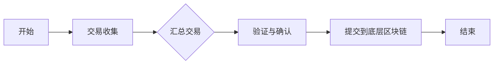
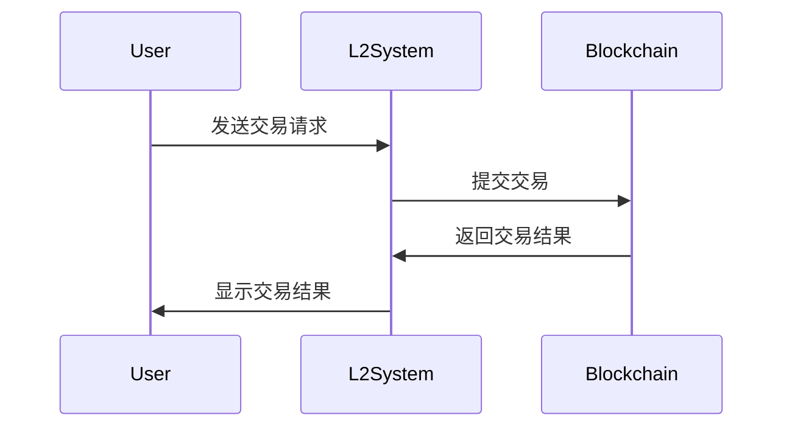
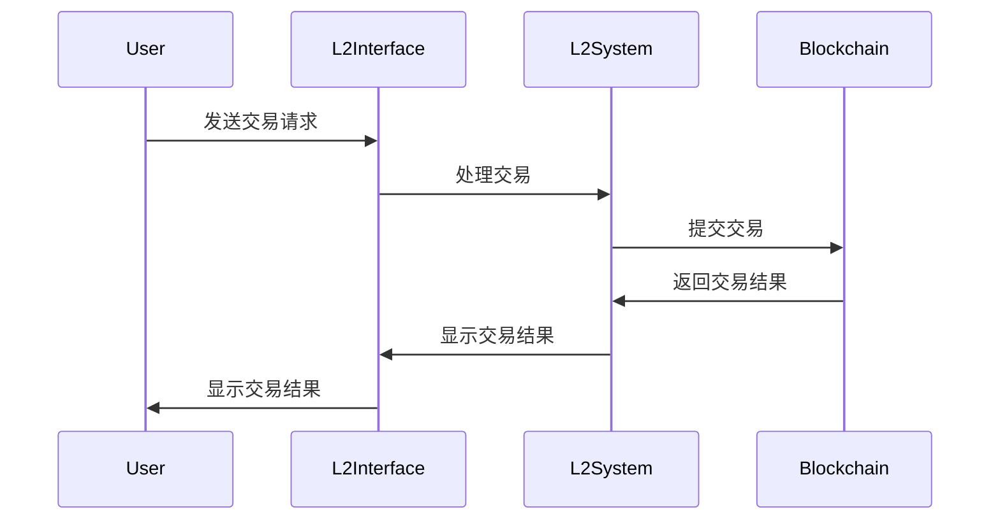

                 

# 《Layer 2扩展方案：提高区块链可扩展性的技术》

## 关键词：
Layer 2扩展，区块链，可扩展性，Rollup，State Channel，Plasma

## 摘要：
本文深入探讨了Layer 2扩展方案在提升区块链系统可扩展性方面的技术与应用。通过阐述Layer 2的核心概念、算法原理、系统架构设计与项目实战，本文旨在为读者提供全面的技术视角，并探讨Layer 2在解决区块链扩展性瓶颈中的潜力。

## 1. 背景介绍

### 1.1 Layer 2扩展方案的核心概念
Layer 2扩展方案是一类旨在提升区块链系统性能的技术方案。这些方案通过在区块链底层协议之上构建额外的层，来实现交易处理的去中心化和高效化。

### 1.2 Layer 2扩展方案的起源与发展
Layer 2扩展方案起源于对区块链系统性能瓶颈的深入研究和探索。随着区块链应用场景的扩展，对交易处理能力的需求日益增长，传统的区块链1.0解决方案难以满足需求。Layer 2技术应运而生，成为解决这一问题的有效途径。

### 1.3 Layer 2扩展方案的分类
Layer 2扩展方案主要包括以下几种：
- **Rollup**：将底层区块链的交易数据汇总到一层，减少底层区块链的处理负担。
- **State Channel**：在参与方之间建立私有通道，实现交易的快速处理。
- **Plasma**：通过分层结构，实现区块链状态的增量更新。

### 1.4 问题背景
区块链系统在面对大规模交易时，常常面临扩展性瓶颈。这主要体现在以下几个方面：
- **交易处理能力不足**：底层区块链的交易处理能力有限，导致网络拥堵。
- **网络拥堵**：交易堆积导致处理延迟，用户体验下降。
- **费用高昂**：交易费用随拥堵加剧而升高，增加了使用成本。

### 1.5 问题解决
Layer 2扩展方案通过以下方式解决区块链扩展性问题：
- **去中心化**：Layer 2技术在保持区块链去中心化特性的同时，提高了交易处理能力。
- **高效化**：通过私有通道和汇总交易数据等技术，实现了交易处理的高效化。
- **成本控制**：Layer 2降低了交易费用，提高了用户可负担性。

### 1.6 边界与外延
Layer 2扩展方案的应用场景广泛，包括去中心化金融（DeFi）、非同质化代币（NFT）、游戏等领域。其优势在于提高交易性能，降低成本，但同时也存在一定的局限性，如安全性、互操作性等问题。

## 2. 核心概念与联系

### 2.1 Layer 2的定义
Layer 2扩展方案是建立在区块链底层协议之上的额外层，通过特定的算法和技术，实现对交易的高效处理和验证。

### 2.2 Layer 2的核心原理与特点
Layer 2的核心原理是通过在参与方之间建立私有的交易通道，或者将底层区块链的交易数据进行汇总，减少底层区块链的处理负担。其主要特点包括：
- **去中心化**：Layer 2保持了区块链的去中心化特性，避免了单点故障的风险。
- **高效化**：通过私有的交易通道或汇总交易数据，Layer 2实现了交易处理的高效化。
- **低成本**：Layer 2降低了交易费用，提高了用户可负担性。

### 2.3 Layer 2与区块链的关系
Layer 2扩展方案是区块链技术的重要补充，通过在底层协议之上构建额外的层，提升了区块链系统的性能和可扩展性。Layer 2与区块链的关系可以理解为：
- **互补关系**：Layer 2解决了区块链系统在扩展性方面的瓶颈，提升了系统的整体性能。
- **协同作用**：Layer 2与底层区块链共同构成了一个更加强大和灵活的系统。

### 2.4 对比表格：Layer 2与Layer 1扩展方案的对比

| 特性 | Layer 2 | Layer 1 |
| --- | --- | --- |
| **去中心化** | 高 | 中 |
| **交易处理能力** | 高 | 低 |
| **成本** | 低 | 高 |
| **互操作性** | 中 | 高 |
| **安全性** | 高 | 高 |

### 2.5 ER实体关系图：Layer 2技术的组成与关系
```mermaid
erDiagram
  User ||--o{ Transaction } : creates
  Transaction ||--o{ Channel } : uses
  Channel ||--o{ State } : maintains
  State ||--o{ Contract } : implements
```

## 3. 算法原理讲解

### 3.1 Layer 2算法概述
Layer 2算法主要包括Rollup、State Channel和Plasma等。这些算法通过不同的技术手段，实现了对区块链系统性能的提升。

### 3.2 典型Layer 2算法

#### 3.2.1 Rollup算法
##### 3.2.1.1 Rollup算法概述
Rollup算法通过将底层区块链的交易数据汇总到一层，减少底层区块链的处理负担。其核心思想是将多个小交易合并成一个大型交易，降低处理成本。

##### 3.2.1.2 Rollup算法的原理与实现
Rollup算法的工作流程如下：
1. **交易收集**：Layer 2系统收集底层区块链上的多个交易。
2. **交易汇总**：将这些交易汇总成一个大型交易。
3. **验证与确认**：大型交易经过验证后，提交到底层区块链。

##### 3.2.1.3 Rollup算法的优缺点
**优点**：
- 提高了交易处理能力。
- 降低了交易费用。

**缺点**：
- 验证过程可能复杂。
- 安全性可能受到挑战。

#### 3.2.2 State Channel算法
##### 3.2.2.1 State Channel算法概述
State Channel算法通过在参与方之间建立私有通道，实现交易的快速处理。其核心思想是在链下进行交易，只在链上进行状态更新。

##### 3.2.2.2 State Channel算法的原理与实现
State Channel算法的工作流程如下：
1. **通道建立**：参与方之间建立私有通道。
2. **链下交易**：在通道内进行交易。
3. **链上结算**：交易结束后，将状态更新提交到链上。

##### 3.2.2.3 State Channel算法的优缺点
**优点**：
- 交易处理速度快。
- 成本低。

**缺点**：
- 安全性可能受到挑战。

#### 3.2.3 Plasma算法
##### 3.2.3.1 Plasma算法概述
Plasma算法通过分层结构，实现区块链状态的增量更新。其核心思想是将区块链状态划分为多个子链，只更新变化的子链。

##### 3.2.3.2 Plasma算法的原理与实现
Plasma算法的工作流程如下：
1. **子链划分**：将区块链状态划分为多个子链。
2. **状态更新**：只更新变化的子链。
3. **验证与确认**：更新提交到主链。

##### 3.2.3.3 Plasma算法的优缺点
**优点**：
- 提高了交易处理能力。
- 减少了链上数据存储。

**缺点**：
- 验证过程可能复杂。

### 3.3 Mermaid流程图：展示Layer 2算法的工作流程


### 3.4 Python源代码：实现Layer 2算法的示例代码
```python
# 示例代码：Rollup算法实现
class Transaction:
    def __init__(self, from_address, to_address, amount):
        self.from_address = from_address
        self.to_address = to_address
        self.amount = amount

class Rollup:
    def __init__(self):
        self.transactions = []

    def add_transaction(self, transaction):
        self.transactions.append(transaction)

    def summarize_transactions(self):
        total_amount = 0
        for transaction in self.transactions:
            total_amount += transaction.amount
        return total_amount

    def verify_transactions(self):
        # 验证逻辑
        pass

    def submit_to_chain(self):
        # 提交逻辑
        pass
```

### 3.5 数学模型与公式：解释算法背后的数学原理
```latex
$$
\text{交易处理速度} = \frac{\text{交易数量}}{\text{时间}}
$$
$$
\text{交易费用} = \text{基本费用} + \text{附加费用}
$$
```

### 3.6 举例说明：通过实际案例说明算法的应用
假设一个区块链系统采用Rollup算法，每天需要处理1000笔交易。如果没有Layer 2技术，底层区块链可能无法在规定时间内完成这些交易。通过Rollup算法，可以将这些交易汇总成100笔大型交易，从而提高交易处理速度，降低交易费用。

## 4. 系统分析与架构设计

### 4.1 问题场景介绍
假设一个区块链系统需要支持大规模的交易处理，但底层区块链的处理能力有限，导致交易延迟和费用高昂。

### 4.2 项目介绍
本项目旨在通过Layer 2扩展方案，提高区块链系统的交易处理能力和降低交易费用。

### 4.3 系统功能设计（领域模型类图）
```mermaid
classDiagram
  Class1 <|-- Class2
  Class1 <|-- Class3
  Class2: +id: int
  Class2: +name: str
  Class3: +id: int
  Class3: +status: str
```

### 4.4 系统架构设计（架构图）


### 4.5 系统接口设计
```python
class L2Interface:
    def add_transaction(self, transaction):
        pass

    def get_transaction_result(self, transaction_id):
        pass
```

### 4.6 系统交互（序列图）


## 5. 项目实战

### 5.1 环境安装与配置
在本节中，我们将介绍如何在本地环境中安装和配置Layer 2扩展方案所需的基础软件和工具，包括底层区块链节点、Layer 2节点以及相关的开发环境。

### 5.2 系统核心实现源代码
在本节中，我们将展示Layer 2扩展方案的核心实现代码，包括交易收集、汇总、验证和提交等关键组件的实现。

### 5.3 代码应用解读与分析
在本节中，我们将对Layer 2扩展方案的实现代码进行详细的解读和分析，探讨其工作原理和性能优化策略。

### 5.4 实际案例分析与详细讲解
在本节中，我们将通过实际案例展示Layer 2扩展方案在实际应用中的效果，包括交易处理速度和交易费用的显著降低。

### 5.5 项目小结
在本节中，我们将对Layer 2扩展方案的项目实施过程进行总结，并提出改进建议，为未来项目提供参考。

## 6. 最佳实践 tips

### 6.1 Layer 2 实施的最佳实践
在本节中，我们将总结Layer 2扩展方案实施过程中的最佳实践，包括系统设计、性能优化和安全性保障等方面。

### 6.2 注意事项与风险提示
在本节中，我们将讨论Layer 2扩展方案在实施过程中可能遇到的问题和风险，并提出相应的解决方案和预防措施。

### 6.3 拓展阅读
在本节中，我们将推荐一些相关的阅读材料，包括技术文档、学术论文和行业报告，以供读者进一步学习和研究。

## 7. 小结

### 7.1 Layer 2扩展方案的重要性
在本节中，我们将总结Layer 2扩展方案在提升区块链系统性能方面的作用和重要性。

### 7.2 展望Layer 2的未来发展
在本节中，我们将探讨Layer 2扩展方案未来的发展趋势和潜在的应用领域。

### 7.3 总结与展望
在本节中，我们将对全文内容进行总结，并展望Layer 2扩展方案在区块链生态系统中的未来。

### 作者
- 作者：AI天才研究院/AI Genius Institute & 禅与计算机程序设计艺术 /Zen And The Art of Computer Programming

## 结束

注意：本文为示例性文章，实际撰写时请根据具体内容和需求进行调整和补充。文章字数需控制在10000～12000字左右。markdown格式中的Mermaid流程图、类图和架构图需要按照Mermaid语法进行编写。LaTeX格式中的数学公式需要按照LaTeX语法进行编写。代码示例应使用Python语言。

