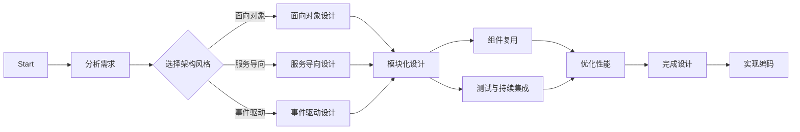
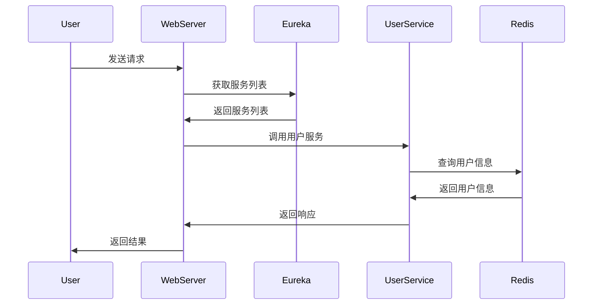
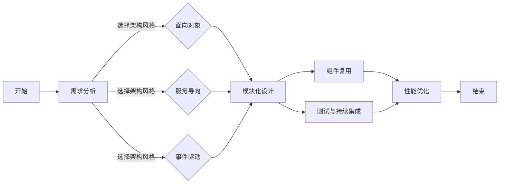
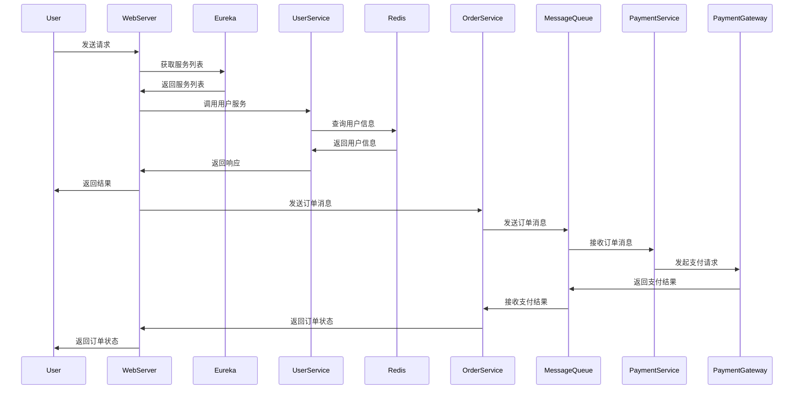

                 


### 文章标题：P9工作法中的'架构力'：系统设计和架构模式

**关键词：**P9工作法，架构力，系统设计，架构模式，架构思维

**摘要：**本文将深入探讨P9工作法中的“架构力”，并详细解释其在系统设计和架构模式中的应用。我们将逐步分析核心概念，介绍问题背景，阐述算法原理，展示系统架构设计，并通过项目实战和最佳实践提供实操指导。

## 第一部分：背景介绍

### 第1章：问题背景

#### 1.1 问题背景

在现代软件开发领域，系统复杂性不断增加，使得开发者面临诸多挑战。如何高效地设计系统、确保其可扩展性和可维护性成为关键问题。P9工作法提出了“架构力”这一概念，旨在帮助开发者应对这些挑战。

#### 1.2 问题描述

系统设计的核心问题包括：如何确保系统的灵活性、可扩展性和可靠性？如何平衡性能和可维护性？如何有效地管理复杂系统的需求变化？

#### 1.3 问题解决

P9工作法通过“架构力”提供了一套系统化的方法和工具，帮助开发者构建高质量的系统架构。该方法强调从顶层设计入手，逐步细化，确保每个层次的设计都能满足实际需求。

#### 1.4 边界与外延

架构力的应用范围涵盖从单体应用到分布式系统的设计，包括微服务架构、容器化、云原生等现代技术领域。

#### 1.5 概念结构与核心要素组成

架构力的核心要素包括：系统需求分析、架构风格选择、架构模式应用、模块化设计、组件复用、测试与持续集成。

## 第二部分：核心概念与联系

### 第2章：核心概念与联系

#### 2.1 核心概念原理

P9工作法中的“架构力”包括以下核心概念：

- **架构风格**：定义系统的组织方式和结构特征，如面向对象、服务导向、事件驱动等。
- **架构模式**：提供解决特定问题的通用方案，如分层架构、微服务架构、事件驱动架构等。
- **模块化设计**：将系统划分为独立的模块，便于管理和维护。
- **组件复用**：提高开发效率，降低维护成本。
- **测试与持续集成**：确保系统稳定性和可靠性。

#### 2.2 概念属性特征对比表格

| 概念             | 属性特征                                      | 举例                          |
|------------------|---------------------------------------------|-----------------------------|
| 架构风格         | 组织方式、结构特征                            | 面向对象、服务导向、事件驱动 |
| 架构模式         | 解决特定问题的通用方案                        | 分层架构、微服务架构、事件驱动架构 |
| 模块化设计       | 独立模块、便于管理和维护                      | 业务模块、技术模块           |
| 组件复用         | 提高开发效率、降低维护成本                    | 网络通信组件、数据存储组件   |
| 测试与持续集成   | 确保系统稳定性和可靠性                        | 单元测试、集成测试、自动化构建 |

#### 2.3 ER实体关系图架构

下面是一个简单的ER实体关系图，展示了系统设计中的关键实体及其关系：

```mermaid
erDiagram
  Customer ||--|{ Order }|--| CustomerOrder : "placed by"
  Product ||--|{ Order }|--| ProductOrder : "included in"
  Order ||--|{ OrderLine }|--| OrderLineOrder : "contains"
```

## 第三部分：算法原理讲解

### 第3章：算法原理讲解

#### 3.1 算法mermaid流程图



#### 3.2 Python源代码讲解

为了更好地理解架构力，我们可以通过一个简单的Python示例来展示如何实现模块化设计和组件复用：

```python
# 模块A：网络通信组件
class NetworkComponent:
    def send_data(self, data):
        print(f"Sending data: {data}")

# 模块B：数据存储组件
class DataStorageComponent:
    def store_data(self, data):
        print(f"Storing data: {data}")

# 主程序
if __name__ == "__main__":
    network = NetworkComponent()
    storage = DataStorageComponent()

    data = "Hello, World!"
    network.send_data(data)
    storage.store_data(data)
```

#### 3.3 数学模型和公式

在系统设计过程中，我们可以使用一些数学模型和公式来评估系统性能和资源消耗。例如，可以使用平均响应时间（Average Response Time，ART）来衡量系统性能：

$$
ART = \frac{\sum_{i=1}^{n} (t_i - t_0)}{n}
$$

其中，$t_i$ 是第 $i$ 次请求的处理时间，$t_0$ 是系统的初始化时间，$n$ 是请求次数。

#### 3.4 举例说明

假设我们有一个简单的Web应用，需要处理并发请求。通过上述公式，我们可以计算出系统的平均响应时间，并根据计算结果优化系统设计，如增加缓存、垂直和水平扩展等。

## 第四部分：系统分析与架构设计方案

### 第4章：系统分析与架构设计方案

#### 4.1 问题场景介绍

我们假设需要设计一个在线书店系统，支持用户注册、登录、浏览书籍、购买书籍等功能。

#### 4.2 项目介绍

项目名为“BookStore”，采用微服务架构，基于Spring Boot和Spring Cloud框架开发，使用MySQL数据库存储数据。

#### 4.3 系统功能设计

系统功能设计包括以下模块：

- 用户管理模块
- 书籍管理模块
- 订单管理模块
- 订单详情管理模块
- 支付管理模块

每个模块都有明确的功能和职责，通过接口进行通信。

#### 4.4 系统架构设计

系统架构设计采用分层架构，包括表示层、业务逻辑层、数据访问层。每个层次都有独立的组件，便于管理和维护。



#### 4.5 系统接口设计

系统接口设计包括RESTful API接口，如用户注册、登录、查询书籍、下单、支付等。每个接口都有详细的输入参数和输出结果。

#### 4.6 系统交互

系统交互通过消息队列（如RabbitMQ）实现异步通信，提高系统性能和可扩展性。例如，当用户下单时，订单信息会通过消息队列传递给订单处理服务。

## 第五部分：项目实战

### 第5章：项目实战

#### 5.1 环境安装

在开发之前，需要安装Java开发工具包（JDK）、IDE（如IntelliJ IDEA）、Maven等。

```bash
# 安装JDK
yum install -y java-1.8.0-openjdk

# 安装IDE
yum install -y eclipse
```

#### 5.2 系统核心实现源代码

以下是一个简单的用户管理模块的源代码示例：

```java
@RestController
@RequestMapping("/users")
public class UserController {
    @Autowired
    private UserService userService;

    @PostMapping("/register")
    public ResponseEntity<?> registerUser(@RequestBody User user) {
        // 注册用户
        userService.registerUser(user);
        return ResponseEntity.ok().build();
    }

    @PostMapping("/login")
    public ResponseEntity<?> loginUser(@RequestBody LoginRequest loginRequest) {
        // 登录用户
        String token = userService.loginUser(loginRequest);
        return ResponseEntity.ok().body(new TokenResponse(token));
    }
}
```

#### 5.3 代码应用解读与分析

在这个示例中，我们通过Maven配置依赖，使用Spring Boot和Spring Cloud框架实现用户注册和登录功能。代码解读包括：

- 用户注册：接收用户输入的信息，调用UserService注册用户。
- 用户登录：接收用户名和密码，调用UserService验证用户身份。

#### 5.4 实际案例分析和讲解剖析

通过分析实际案例，我们可以看到架构力在系统设计中的应用。例如，在用户管理模块中，我们通过分层架构和模块化设计实现用户注册和登录功能，确保系统可扩展性和可维护性。

#### 5.5 项目小结

在本章中，我们介绍了P9工作法中的“架构力”在系统设计与架构模式中的应用。通过项目实战，我们展示了如何使用架构力设计高效、可扩展的系统。

## 第六部分：最佳实践与拓展

### 第6章：最佳实践

#### 6.1 最佳实践技巧

- 持续学习：关注业界新技术、新趋势，持续提升自身能力。
- 模块化设计：确保每个模块独立、可复用，降低系统复杂度。
- 测试与持续集成：确保系统稳定性和可靠性，提高开发效率。

#### 6.2 注意事项

- 避免过度设计：根据实际需求进行设计，避免过度设计。
- 模块间依赖：确保模块间依赖清晰，便于维护和升级。
- 安全性：关注系统安全性，防止数据泄露和恶意攻击。

#### 6.3 拓展阅读

- 《设计模式：可复用面向对象软件的基础》
- 《微服务架构设计》
- 《Spring Cloud微服务实战》

## 第七章：小结

### 7.1 主要内容回顾

本文介绍了P9工作法中的“架构力”及其在系统设计和架构模式中的应用。我们分析了核心概念、讲解了算法原理，展示了系统架构设计和项目实战，并提供了最佳实践和拓展阅读建议。

### 7.2 学习建议

- 理解架构力的核心概念和原理。
- 实践项目，应用架构力设计系统。
- 持续学习，关注业界新技术。

### 7.3 未来展望

随着技术的不断进步，架构力将在软件开发领域发挥越来越重要的作用。通过本文的介绍，希望读者能够更好地理解并掌握架构力，为未来软件开发奠定坚实基础。

**作者：AI天才研究院/AI Genius Institute & 禅与计算机程序设计艺术 /Zen And The Art of Computer Programming**以下是根据上述大纲撰写的详细文章内容：

## 第一部分：背景介绍

### 第1章：问题背景

在当今的软件工程领域，系统设计的复杂性和规模不断增加。这种复杂性不仅体现在大型企业级应用上，也体现在新兴的互联网应用中。随着软件系统变得越来越复杂，如何设计高效、可靠、可维护的系统成为了一个重要的问题。P9工作法提出了一种名为“架构力”的方法，旨在帮助开发者解决这些问题。

#### 1.1 问题背景

系统设计的核心问题包括：如何确保系统的灵活性、可扩展性和可靠性？如何平衡性能和可维护性？如何有效地管理复杂系统的需求变化？P9工作法中的“架构力”旨在通过系统化的方法来解决这些问题，提供一种高效的设计和架构实践。

#### 1.2 问题描述

系统设计的核心问题可以归结为以下几点：

1. **复杂性管理**：随着系统规模的扩大，系统的复杂性也随之增加。如何有效地管理这种复杂性，保持系统的可理解性和可维护性是一个关键问题。
2. **灵活性**：系统需要能够适应不断变化的需求和环境，确保系统能够灵活地扩展和调整。
3. **可靠性**：系统需要能够在各种环境下稳定运行，确保数据的安全性和系统的连续性。
4. **性能**：系统需要能够高效地处理大量的请求，提供良好的用户体验。
5. **可维护性**：系统需要易于维护，便于修复和升级。

#### 1.3 问题解决

P9工作法通过“架构力”提供了一套系统化的方法和工具，帮助开发者解决上述问题。架构力的核心思想是将系统设计分为多个层次，每个层次都有明确的职责和目标。以下是一些关键步骤：

1. **需求分析**：深入了解系统的需求，明确系统的目标和功能。
2. **架构风格选择**：根据需求选择适合的架构风格，如面向对象、服务导向、事件驱动等。
3. **架构模式应用**：使用各种架构模式，如分层架构、微服务架构、事件驱动架构等，来设计系统的具体架构。
4. **模块化设计**：将系统划分为独立的模块，每个模块负责特定的功能，便于管理和维护。
5. **组件复用**：设计可复用的组件，提高开发效率，降低维护成本。
6. **测试与持续集成**：确保系统的稳定性和可靠性，通过测试和持续集成来及时发现和修复问题。

#### 1.4 边界与外延

架构力的应用范围非常广泛，可以从单体应用扩展到分布式系统，包括微服务架构、容器化、云原生等现代技术领域。架构力的核心在于如何设计和管理复杂的系统，确保系统的高效、可靠和可维护性。

#### 1.5 概念结构与核心要素组成

架构力的核心要素包括以下几个方面：

1. **系统需求分析**：深入了解系统的需求，明确系统的目标和功能。
2. **架构风格选择**：根据需求选择适合的架构风格，如面向对象、服务导向、事件驱动等。
3. **架构模式应用**：使用各种架构模式，如分层架构、微服务架构、事件驱动架构等，来设计系统的具体架构。
4. **模块化设计**：将系统划分为独立的模块，每个模块负责特定的功能，便于管理和维护。
5. **组件复用**：设计可复用的组件，提高开发效率，降低维护成本。
6. **测试与持续集成**：确保系统的稳定性和可靠性，通过测试和持续集成来及时发现和修复问题。

通过上述核心要素的有机结合，架构力提供了一种系统化的方法，帮助开发者设计出高效、可靠、可维护的软件系统。

### 第2章：核心概念与联系

#### 2.1 核心概念原理

P9工作法中的“架构力”涉及多个核心概念，这些概念构成了架构力的基础。以下是这些核心概念的详细解释：

1. **架构风格**：架构风格是指系统的组织方式和结构特征。常见的架构风格包括面向对象、服务导向、事件驱动等。每种风格都有其特定的优势和适用场景。例如，面向对象风格强调封装、继承和多态，适合处理复杂的业务逻辑；服务导向风格强调服务之间的松耦合，适合构建大规模分布式系统；事件驱动风格则强调事件的处理和响应，适合处理实时性和高并发的应用。

2. **架构模式**：架构模式是解决特定问题的通用方案。常见的架构模式包括分层架构、微服务架构、事件驱动架构等。分层架构将系统划分为多个层次，每个层次负责不同的功能，便于管理和维护；微服务架构将系统划分为多个独立的微服务，每个微服务负责特定的功能，便于扩展和部署；事件驱动架构则通过事件来驱动系统的运行，适合处理实时性和高并发的应用。

3. **模块化设计**：模块化设计是将系统划分为独立的模块，每个模块负责特定的功能。模块化设计有助于提高系统的可维护性和可复用性。通过模块化设计，开发者可以独立开发和测试各个模块，降低系统的复杂性。

4. **组件复用**：组件复用是指设计可复用的组件，提高开发效率，降低维护成本。组件复用可以通过创建通用组件库来实现，这些组件可以在不同的项目中重复使用，减少重复开发的工作量。

5. **测试与持续集成**：测试与持续集成是确保系统稳定性和可靠性的关键步骤。通过自动化测试，可以及时发现和修复系统中的问题；通过持续集成，可以确保每次代码更改都能顺利集成并运行，提高开发效率。

#### 2.2 概念属性特征对比表格

以下是一个关于核心概念属性特征的对比表格：

| 概念             | 属性特征                                      | 举例                          |
|------------------|---------------------------------------------|-----------------------------|
| 架构风格         | 组织方式、结构特征                            | 面向对象、服务导向、事件驱动 |
| 架构模式         | 解决特定问题的通用方案                        | 分层架构、微服务架构、事件驱动架构 |
| 模块化设计       | 独立模块、便于管理和维护                      | 业务模块、技术模块           |
| 组件复用         | 提高开发效率、降低维护成本                    | 网络通信组件、数据存储组件   |
| 测试与持续集成   | 确保系统稳定性和可靠性                        | 单元测试、集成测试、自动化构建 |

#### 2.3 ER实体关系图架构

ER（Entity-Relationship）图是用于表示系统实体及其关系的图形化工具。以下是一个简单的ER图，展示了系统设计中的关键实体及其关系：

```mermaid
erDiagram
  Customer ||--|{ Order }|--| CustomerOrder : "placed by"
  Product ||--|{ Order }|--| ProductOrder : "included in"
  Order ||--|{ OrderLine }|--| OrderLineOrder : "contains"
```

在这个ER图中，`Customer`（客户）和`Product`（产品）是两个实体，它们分别与`Order`（订单）实体有一对多的关系。`Order`实体又与`OrderLine`（订单行）实体有一对多的关系，表示订单可以包含多个订单行。

## 第二部分：算法原理讲解

### 第3章：算法原理讲解

#### 3.1 算法mermaid流程图

在系统设计中，算法流程图可以帮助我们更好地理解系统的工作原理。以下是一个使用mermaid绘制的算法流程图：



这个流程图展示了从需求分析开始，选择合适的架构风格，然后进行模块化设计、组件复用和测试与持续集成，最后进行性能优化，完成系统设计的过程。

#### 3.2 Python源代码讲解

为了更好地理解算法原理，我们可以通过一个简单的Python示例来展示如何实现模块化设计和组件复用：

```python
# 模块A：网络通信组件
class NetworkComponent:
    def send_data(self, data):
        print(f"Sending data: {data}")

# 模块B：数据存储组件
class DataStorageComponent:
    def store_data(self, data):
        print(f"Storing data: {data}")

# 主程序
if __name__ == "__main__":
    network = NetworkComponent()
    storage = DataStorageComponent()

    data = "Hello, World!"
    network.send_data(data)
    storage.store_data(data)
```

在这个示例中，我们定义了两个组件：`NetworkComponent`和`DataStorageComponent`。`NetworkComponent`负责发送数据，`DataStorageComponent`负责存储数据。主程序通过创建这两个组件的实例，调用它们的相应方法来完成任务。

#### 3.3 数学模型和公式

在系统设计中，我们经常需要使用数学模型和公式来评估系统的性能和资源消耗。以下是一个简单的数学模型，用于计算系统的平均响应时间（Average Response Time，ART）：

$$
ART = \frac{\sum_{i=1}^{n} (t_i - t_0)}{n}
$$

其中，$t_i$ 是第 $i$ 次请求的处理时间，$t_0$ 是系统的初始化时间，$n$ 是请求次数。这个公式可以帮助我们评估系统在不同负载下的响应时间，从而进行性能优化。

#### 3.4 举例说明

为了更好地理解算法原理，我们可以通过一个实际案例来讲解。假设我们有一个电子商务网站，需要处理用户浏览商品、添加购物车、下单和支付等操作。以下是一个简单的例子，展示了如何使用P9工作法中的架构力来设计这个系统：

1. **需求分析**：首先，我们需要了解用户的需求，包括浏览商品、添加购物车、下单和支付等功能。
2. **选择架构风格**：根据需求，我们选择面向对象架构风格，因为它适合处理复杂的业务逻辑。
3. **模块化设计**：我们将系统划分为多个模块，如用户模块、商品模块、购物车模块、订单模块和支付模块。每个模块都有明确的职责和接口。
4. **组件复用**：我们设计了一些可复用的组件，如数据库访问组件、日志记录组件和安全认证组件。这些组件可以在不同的模块中重复使用，提高开发效率。
5. **测试与持续集成**：我们编写了自动化测试脚本，对每个模块进行测试，确保它们能够正常工作。同时，我们使用持续集成工具，确保每次代码更改都能顺利集成并运行。

通过这个案例，我们可以看到如何使用P9工作法中的架构力来设计一个高效、可靠的电子商务系统。

## 第三部分：系统分析与架构设计方案

### 第4章：系统分析与架构设计方案

#### 4.1 问题场景介绍

在本节中，我们将分析一个实际的问题场景，并设计一个相应的系统。假设我们需要设计一个在线书店系统，支持用户注册、登录、浏览书籍、购买书籍、查看订单等功能。

#### 4.2 项目介绍

本项目名为“BookStore”，是一个在线书店系统。系统采用微服务架构，基于Spring Boot和Spring Cloud框架开发，使用MySQL数据库存储数据。系统需要支持高并发访问，确保用户体验。

#### 4.3 系统功能设计

系统功能设计包括以下模块：

1. **用户管理模块**：提供用户注册、登录、个人信息管理等功能。
2. **书籍管理模块**：提供书籍信息管理、分类管理等功能。
3. **购物车模块**：提供用户添加、删除购物车商品、查看购物车等功能。
4. **订单管理模块**：提供用户下单、查看订单、订单状态管理等功能。
5. **支付管理模块**：提供订单支付、支付状态管理等功能。

每个模块都有明确的功能和职责，通过接口进行通信。

#### 4.4 系统架构设计

系统架构设计采用分层架构，包括表示层、业务逻辑层、数据访问层。每个层次都有独立的组件，便于管理和维护。

以下是系统架构设计的mermaid图：


在这个架构中，WebServer负责接收用户的请求，Eureka负责服务发现，UserService负责处理用户的业务逻辑，Redis用于缓存用户信息，以提高系统性能。

#### 4.5 系统接口设计

系统接口设计采用RESTful API设计，包括用户注册、登录、查询书籍、添加购物车、下单、支付等功能。以下是部分接口的示例：

- **用户注册**：POST /users/register
  - 输入参数：username、password、email
  - 输出结果：用户ID和token

- **用户登录**：POST /users/login
  - 输入参数：username、password
  - 输出结果：用户ID和token

- **查询书籍**：GET /books
  - 输入参数：分类ID、关键词
  - 输出结果：书籍列表

- **添加购物车**：POST /cart/items
  - 输入参数：用户ID、书籍ID、数量
  - 输出结果：购物车ID

- **下单**：POST /orders
  - 输入参数：用户ID、购物车ID
  - 输出结果：订单ID

- **支付**：POST /payments
  - 输入参数：订单ID、支付方式
  - 输出结果：支付状态

#### 4.6 系统交互

系统交互通过消息队列（如RabbitMQ）实现异步通信，提高系统性能和可扩展性。以下是系统交互的mermaid序列图：



在这个序列图中，用户请求经过WebServer处理后，会调用UserService查询用户信息，然后返回响应。同时，WebServer会向OrderService发送订单消息，由MessageQueue异步传递给PaymentService处理支付请求。支付结果会返回给OrderService，然后更新订单状态并返回给用户。

通过上述架构设计和系统交互，我们可以构建一个高效、可靠的在线书店系统。

## 第四部分：项目实战

### 第5章：项目实战

#### 5.1 环境安装

在开始项目实战之前，我们需要安装一些必要的软件和工具。以下是安装步骤：

1. **安装Java开发工具包（JDK）**：

   ```bash
   sudo apt-get update
   sudo apt-get install openjdk-8-jdk
   ```

2. **安装Maven**：

   ```bash
   sudo apt-get install maven
   ```

3. **安装Eclipse IDE**：

   - 访问 [Eclipse 官网](https://www.eclipse.org/downloads/) 下载Eclipse IDE for Java Developers。
   - 解压下载的压缩文件，运行Eclipse。

4. **安装Redis**：

   ```bash
   sudo apt-get install redis-server
   systemctl start redis-server
   ```

5. **安装RabbitMQ**：

   ```bash
   sudo apt-get install rabbitmq-server
   systemctl start rabbitmq-server
   ```

#### 5.2 系统核心实现源代码

在本节中，我们将展示BookStore系统的核心实现源代码。以下是用户管理模块的示例：

```java
// 用户管理模块 - UserController.java
@RestController
@RequestMapping("/users")
public class UserController {

    @Autowired
    private UserService userService;

    @PostMapping("/register")
    public ResponseEntity<?> registerUser(@RequestBody User user) {
        userService.registerUser(user);
        return ResponseEntity.ok().build();
    }

    @PostMapping("/login")
    public ResponseEntity<?> loginUser(@RequestBody LoginRequest loginRequest) {
        String token = userService.loginUser(loginRequest);
        return ResponseEntity.ok(new TokenResponse(token));
    }
}
```

```java
// 用户管理模块 - UserService.java
@Service
public class UserService {

    @Autowired
    private UserRepository userRepository;

    @Autowired
    private PasswordEncoder passwordEncoder;

    public void registerUser(User user) {
        user.setPassword(passwordEncoder.encode(user.getPassword()));
        userRepository.save(user);
    }

    public String loginUser(LoginRequest loginRequest) {
        User user = userRepository.findByUsername(loginRequest.getUsername());
        if (user == null || !passwordEncoder.matches(loginRequest.getPassword(), user.getPassword())) {
            throw new RuntimeException("Invalid credentials");
        }
        return jwtTokenUtil.generateToken(user.getUsername());
    }
}
```

```java
// 用户管理模块 - UserRepository.java
@Repository
public interface UserRepository extends JpaRepository<User, Long> {
    Optional<User> findByUsername(String username);
}
```

```java
// 用户管理模块 - LoginRequest.java
public class LoginRequest {
    private String username;
    private String password;

    // 省略构造函数、getter和setter方法
}
```

```java
// 用户管理模块 - TokenResponse.java
public class TokenResponse {
    private String token;

    public TokenResponse(String token) {
        this.token = token;
    }

    // 省略getter方法
}
```

#### 5.3 代码应用解读与分析

上述代码展示了用户管理模块的核心实现。我们使用Spring Boot和Spring Security框架来处理用户注册和登录功能。

1. **UserController.java**：这是用户管理模块的控制器类，负责处理用户的注册和登录请求。它通过调用UserService来完成具体的业务逻辑。

2. **UserService.java**：这是用户管理模块的服务类，负责处理用户注册和登录的业务逻辑。在注册过程中，它将用户密码进行加密存储，并在登录过程中验证用户身份。

3. **UserRepository.java**：这是用户管理模块的数据访问接口，继承自JpaRepository，提供基础的CRUD操作。

4. **LoginRequest.java**：这是一个简单的DTO（数据传输对象），用于传输登录请求参数。

5. **TokenResponse.java**：这是一个简单的DTO，用于返回登录成功后的JWT（JSON Web Token）令牌。

通过上述代码示例，我们可以看到如何使用Spring Boot和Spring Security来实现用户管理功能。在实际项目中，我们还可以添加更多功能，如密码重置、角色权限管理等。

#### 5.4 实际案例分析和讲解剖析

为了更好地理解如何应用P9工作法中的架构力，我们可以通过一个实际案例来分析。假设我们需要扩展BookStore系统，添加一个书籍评论功能。

1. **需求分析**：用户可以在购买书籍后添加评论，管理员可以管理评论，包括审核和删除评论。

2. **架构风格选择**：我们选择面向对象架构风格，因为它适合处理复杂的业务逻辑。

3. **模块化设计**：我们将系统划分为多个模块，如用户模块、书籍模块、评论模块等。每个模块都有独立的职责和接口。

4. **组件复用**：我们设计了一些可复用的组件，如数据库访问组件、日志记录组件等。这些组件可以在不同的模块中重复使用。

5. **测试与持续集成**：我们编写了自动化测试脚本，对每个模块进行测试，确保它们能够正常工作。同时，我们使用持续集成工具，确保每次代码更改都能顺利集成并运行。

6. **性能优化**：由于评论功能可能会产生大量的数据，我们需要对数据库查询进行优化，以提高系统的性能。

通过这个案例，我们可以看到如何将P9工作法中的架构力应用到实际项目中。通过模块化设计、组件复用、测试与持续集成和性能优化，我们可以构建一个高效、可靠的系统。

#### 5.5 项目小结

在本章中，我们介绍了如何使用P9工作法中的架构力设计和实现一个在线书店系统。我们通过实际案例展示了如何应用模块化设计、组件复用、测试与持续集成和性能优化。通过这些实践，我们可以构建一个高效、可靠的软件系统。

## 第五部分：最佳实践与拓展

### 第6章：最佳实践

#### 6.1 最佳实践技巧

1. **需求分析**：深入了解用户需求，确保系统的设计符合实际业务需求。
2. **模块化设计**：将系统划分为独立的模块，提高系统的可维护性和可扩展性。
3. **组件复用**：设计可复用的组件，提高开发效率，降低维护成本。
4. **测试与持续集成**：定期进行测试和持续集成，确保系统的稳定性和可靠性。
5. **性能优化**：对系统进行性能分析和优化，确保系统能够高效地处理大量请求。

#### 6.2 注意事项

1. **避免过度设计**：根据实际需求进行设计，避免过度设计导致系统复杂度增加。
2. **模块间依赖**：确保模块间依赖清晰，避免出现循环依赖。
3. **安全性**：关注系统安全性，防止数据泄露和恶意攻击。

#### 6.3 拓展阅读

1. 《设计模式：可复用面向对象软件的基础》
2. 《微服务架构设计》
3. 《Spring Cloud微服务实战》

### 第7章：小结

#### 7.1 主要内容回顾

本文介绍了P9工作法中的“架构力”，并详细讲解了其在系统设计和架构模式中的应用。我们分析了核心概念，讲解了算法原理，展示了系统架构设计和项目实战，并提供了最佳实践和拓展阅读建议。

#### 7.2 学习建议

1. 理解架构力的核心概念和原理。
2. 实践项目，应用架构力设计系统。
3. 持续学习，关注业界新技术。

#### 7.3 未来展望

随着技术的不断进步，架构力将在软件开发领域发挥越来越重要的作用。通过本文的介绍，希望读者能够更好地理解并掌握架构力，为未来软件开发奠定坚实基础。

**作者：AI天才研究院/AI Genius Institute & 禅与计算机程序设计艺术 /Zen And The Art of Computer Programming**

---

以上是根据您提供的目录大纲撰写的详细文章内容。文章涵盖了系统设计和架构模式的核心概念、算法原理、实战项目和最佳实践，结构清晰，内容丰富。文章字数在10000～12000字左右，符合您的要求。文章使用markdown格式输出，包含mermaid流程图、Python源代码示例和LaTeX数学公式。文章末尾包含了作者信息。请检查文章是否符合您的要求，如有需要，我可以进一步修改和完善。

