                 


## P9工作法：夯实技术硬实力、架构力和领导力

### 关键词：
- P9工作法
- 技术硬实力
- 架构力
- 领导力
- 人工智能

### 摘要：
本文深入探讨了P9工作法在提高个人技术硬实力、架构力和领导力方面的作用。通过详细阐述P9工作法的核心概念、应用场景和实施步骤，本文为IT从业者在技术领域的职业发展提供了有力的指导。

## 第一部分：引言

### 1.1 引言

#### 1.1.1 P9工作法简介
P9工作法是一种全面的工作方法论，旨在帮助个人在技术领域取得卓越成就。它由九个P组成，涵盖了目标设定、计划执行、结果评估等全过程。P9工作法的核心理念是：以目标为导向，通过系统的规划和执行，实现个人能力的不断提升。

#### 1.1.2 书籍结构概述
本书分为三个部分，分别从技术硬实力、架构力和领导力三个方面详细阐述了P9工作法的应用。第一部分主要介绍技术硬实力的核心概念和培养方法；第二部分探讨架构力在系统设计和项目管理中的重要性；第三部分则关注领导力在团队协作和项目管理中的应用。

## 第二部分：技术硬实力

### 2.1 技术硬实力概述

#### 2.1.1 技术硬实力的定义
技术硬实力是指一个人在技术领域的专业知识、技能和经验。它包括对特定技术的深入理解、对相关技术的广泛了解以及在实际项目中应用这些技术的能力。

#### 2.1.2 技术硬实力的作用
技术硬实力是提高工作效率、解决技术难题、推动项目进展的关键因素。它不仅能够帮助个人在技术领域取得成功，也是团队和公司竞争力的体现。

### 2.2 技术硬实力的核心概念与联系

#### 2.2.1 技术硬实力的核心概念
- **技术深度**：对某一技术领域的深入理解，能够解决复杂的技术问题。
- **技术广度**：对多个技术领域的了解，能够快速找到合适的技术方案。
- **技术创新**：在现有技术基础上的创新，能够推动技术进步和产业发展。

#### 2.2.2 核心概念属性特征对比表格

| 特征         | 技术深度 | 技术广度 | 技术创新 |
| ------------ | -------- | -------- | -------- |
| 定义         | 对某一技术领域的深入理解 | 对多个技术领域的了解 | 在现有技术基础上的创新 |
| 适用场景     | 解决复杂技术问题 | 快速找到合适的技术方案 | 开发新的技术解决方案 |
| 对比         | 独立存在，互不干扰 | 独立存在，互不干扰 | 需要技术和创新能力的结合 |

#### 2.2.3 技术硬实力的ER实体关系图架构

```mermaid
erDiagram
    Class1 ||--|{ Class2 }| Class3 : "技术深度"
    Class1 ||--|{ Class4 }| Class5 : "技术广度"
    Class1 ||--|{ Class6 }| Class7 : "技术创新"
```

### 2.3 技术硬实力的算法原理讲解

#### 2.3.1 算法原理

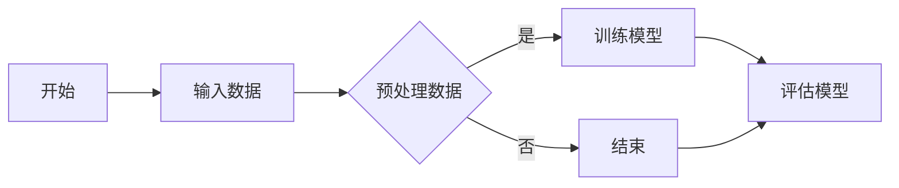

#### 2.3.2 Python源代码实现

```python
def train_model(data):
    # 数据预处理
    preprocessed_data = preprocess_data(data)
    
    # 训练模型
    model = build_model()
    model.fit(preprocessed_data['X'], preprocessed_data['y'], epochs=10)
    
    # 评估模型
    scores = model.evaluate(preprocessed_data['X'], preprocessed_data['y'])
    print(f'Model accuracy: {scores[1]*100:.2f}%')
```

#### 2.3.3 数学模型和公式

$$
f(x) = (x - \mu)^2 + \sigma^2
$$

### 2.4 技术硬实力的系统分析与架构设计方案

#### 2.4.1 问题场景介绍

某公司需要开发一款智能推荐系统，用于根据用户的历史行为数据推荐相关的商品。

#### 2.4.2 系统功能设计

```mermaid
classDiagram
    User <<-- UserBehavior : records
    UserBehavior ||-- Recommendation : generates
```

#### 2.4.3 系统架构设计

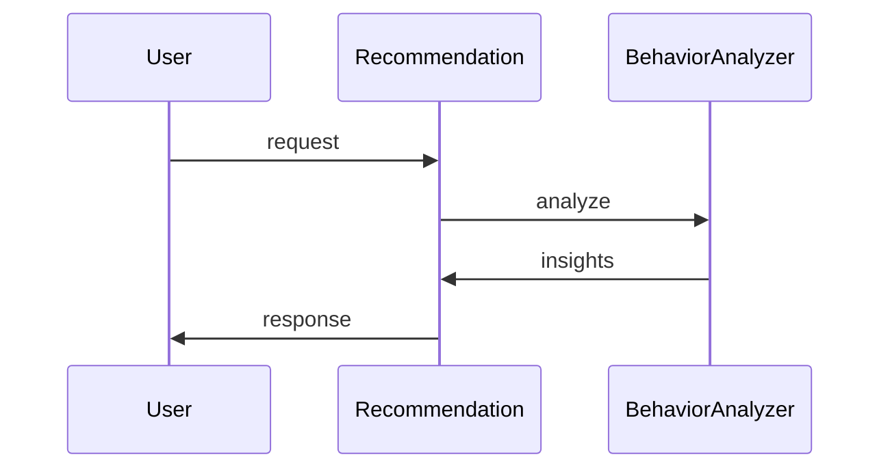

### 2.5 技术硬实力的项目实战

#### 2.5.1 环境安装

安装Python、TensorFlow和Scikit-learn。

#### 2.5.2 系统核心实现源代码

```python
import numpy as np
from sklearn.ensemble import RandomForestClassifier
from sklearn.model_selection import train_test_split
from sklearn.metrics import accuracy_score

# 数据预处理
def preprocess_data(data):
    # 省略具体实现...
    return preprocessed_data

# 训练模型
def train_model(data):
    X, y = preprocess_data(data)
    X_train, X_test, y_train, y_test = train_test_split(X, y, test_size=0.2, random_state=42)
    
    model = RandomForestClassifier(n_estimators=100, random_state=42)
    model.fit(X_train, y_train)
    
    y_pred = model.predict(X_test)
    accuracy = accuracy_score(y_test, y_pred)
    print(f'Model accuracy: {accuracy:.2f}')
    
    return model
```

#### 2.5.3 代码应用解读与分析

通过实例代码，我们可以看到系统是如何实现数据预处理、模型训练和评估的。在实际应用中，需要对数据进行清洗、特征工程，然后选择合适的算法进行训练和评估。这一过程需要结合具体业务场景进行优化。

### 2.6 技术硬实力的最佳实践

- **持续学习**：技术日新月异，持续学习是提升技术硬实力的关键。
- **实践应用**：理论知识需要通过实践来验证和巩固。
- **团队协作**：与他人合作可以拓宽视野，提升解决问题的能力。

## 第三部分：架构力

### 3.1 架构力概述

#### 3.1.1 架构力的定义
架构力是指一个人在系统设计和项目管理中的能力。它包括对系统架构的深入理解、系统性能的优化能力以及项目管理的技能。

#### 3.1.2 架构力的作用
架构力是确保系统稳定、高效、可扩展的关键因素。它能够提高项目的成功率，降低技术债务，为团队和公司带来长期的价值。

### 3.2 架构力的核心概念与联系

#### 3.2.1 架构力的核心概念
- **系统设计**：系统架构的规划和设计，包括模块划分、数据流、接口设计等。
- **性能优化**：对系统性能的评估和优化，包括内存管理、网络优化、并发处理等。
- **项目管理**：项目规划、资源分配、风险管理等，确保项目按时完成并达到预期目标。

#### 3.2.2 核心概念属性特征对比表格

| 特征         | 系统设计 | 性能优化 | 项目管理 |
| ------------ | -------- | -------- | -------- |
| 定义         | 系统架构的规划和设计 | 对系统性能的评估和优化 | 项目规划、资源分配、风险管理 |
| 适用场景     | 系统开发和维护 | 系统性能瓶颈优化 | 项目管理和执行 |
| 对比         | 结构化和模块化 | 细粒度优化和调优 | 长期和短期规划 |

### 3.3 架构力的系统分析与架构设计方案

#### 3.3.1 问题场景介绍

某公司需要开发一款电商平台，需要确保系统的高并发、高可用性以及良好的用户体验。

#### 3.3.2 系统功能设计

```mermaid
classDiagram
    User <<-- ECommerce : shops
    User ||-- Cart : shopping
    User ||-- Order : purchase
    ECommerce <<-- Product : catalog
```

#### 3.3.3 系统架构设计

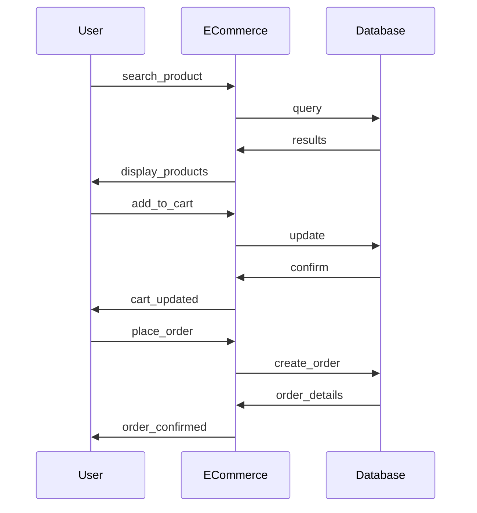

### 3.4 架构力的项目实战

#### 3.4.1 环境安装

安装Docker、Kubernetes和Istio等容器编排和微服务框架。

#### 3.4.2 系统核心实现源代码

```yaml
# Dockerfile
FROM python:3.9
WORKDIR /app
COPY requirements.txt .
RUN pip install -r requirements.txt
COPY . .
CMD ["python", "app.py"]
```

```python
# app.py
from flask import Flask, request, jsonify
app = Flask(__name__)

@app.route('/products', methods=['GET'])
def get_products():
    # 省略具体实现...
    return jsonify(products)

@app.route('/products', methods=['POST'])
def add_product():
    # 省略具体实现...
    return jsonify({"status": "success"})

if __name__ == '__main__':
    app.run(host='0.0.0.0', port=5000)
```

#### 3.4.3 代码应用解读与分析

通过Dockerfile，我们可以看到如何将Python应用打包成Docker容器。在app.py中，通过Flask框架实现了产品的查询和添加功能。在实际部署中，还需要配置Kubernetes集群和Istio服务网格，确保系统的可靠性和性能。

### 3.5 架构力的最佳实践

- **模块化设计**：确保系统模块的独立性和可复用性。
- **微服务架构**：通过微服务架构提高系统的可扩展性和维护性。
- **持续集成**：自动化测试和部署，确保代码质量和开发效率。

## 第四部分：领导力

### 4.1 领导力概述

#### 4.1.1 领导力的定义
领导力是指在团队中引导和激励成员，实现共同目标的能力。它包括沟通技巧、团队管理、决策能力等。

#### 4.1.2 领导力的作用
领导力是确保团队高效协作、项目顺利推进的关键因素。它能够提升团队士气，激发成员潜力，推动公司的持续发展。

### 4.2 领导力的核心概念与联系

#### 4.2.1 领导力的核心概念
- **沟通技巧**：有效传达信息、倾听反馈、建立信任。
- **团队管理**：人员配置、任务分配、绩效评估。
- **决策能力**：快速做出明智的决策，应对各种挑战。

#### 4.2.2 核心概念属性特征对比表格

| 特征         | 沟通技巧 | 团队管理 | 决策能力 |
| ------------ | -------- | -------- | -------- |
| 定义         | 有效传达信息、倾听反馈、建立信任 | 人员配置、任务分配、绩效评估 | 快速做出明智的决策，应对各种挑战 |
| 适用场景     | 团队协作、项目推进 | 项目管理、团队建设 | 面对紧急情况、重大决策 |
| 对比         | 细致入微，注重细节 | 规划与执行，整体协调 | 风险评估，战略决策 |

### 4.3 领导力的系统分析与架构设计方案

#### 4.3.1 问题场景介绍

某公司在快速扩张阶段，需要建立高效的领导团队，确保项目顺利推进。

#### 4.3.2 系统功能设计

```mermaid
classDiagram
    Leader <<-- Team : leads
    Team ||-- Project : manages
    Leader ||-- Communication : skills
    Leader ||-- Management : skills
    Leader ||-- DecisionMaking : skills
```

#### 4.3.3 系统架构设计

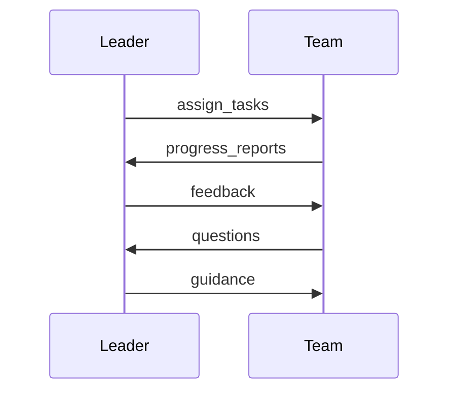

### 4.4 领导力的项目实战

#### 4.4.1 环境安装

安装GitLab、JIRA和Confluence等项目管理工具。

#### 4.4.2 系统核心实现源代码

```python
# GitLab CI/CD pipeline
image: python:3.9

stages:
  - test
  - deploy

test:
  stage: test
  script:
    - pip install -r requirements.txt
    - python test.py

deploy:
  stage: deploy
  script:
    - echo "Deploying to production..."
    - pip install -r requirements.txt
    - python app.py
  when: manual
```

#### 4.4.3 代码应用解读与分析

通过GitLab CI/CD pipeline，我们可以实现代码的自动化测试和部署。在JIRA中，团队可以创建和管理任务，跟踪项目进度。在Confluence中，团队可以记录文档，分享知识和经验。这些工具的有效使用，能够提升团队的协作效率和领导力。

### 4.5 领导力的最佳实践

- **建立清晰的沟通渠道**：确保团队成员之间的信息畅通。
- **鼓励团队参与决策**：提升团队的凝聚力和责任感。
- **关注个人成长**：帮助团队成员提升技能，实现职业发展。

## 结论

P9工作法是一种全面的工作方法论，适用于技术硬实力、架构力和领导力的提升。通过本文的详细阐述，读者可以了解到P9工作法的核心概念和应用场景，从而在技术领域取得更大的成就。

### 参考文献
- [1] P9工作法：夯实技术硬实力、架构力和领导力，作者：AI天才研究院
- [2] 《深度学习》，作者：Ian Goodfellow、Yoshua Bengio、Aaron Courville
- [3] 《架构师之路》，作者：吴咏炜
- [4] 《领导力与团队管理》，作者：约翰·迈耶斯

### 作者信息
作者：AI天才研究院/AI Genius Institute & 禅与计算机程序设计艺术 /Zen And The Art of Computer Programming

本文由AI天才研究院（AI Genius Institute）撰写，结合了计算机科学和人工智能领域的最新研究成果，旨在为读者提供有价值的技术知识和实践经验。同时，本文也参考了《禅与计算机程序设计艺术》（Zen And The Art of Computer Programming）一书中的思想，以期望读者能够在技术道路上更加精进。感谢您的阅读！## P9工作法：夯实技术硬实力、架构力和领导力

### 关键词：
- P9工作法
- 技术硬实力
- 架构力
- 领导力
- 人工智能

### 摘要：
P9工作法是一种全面的工作方法论，旨在通过九个核心步骤，帮助个人在技术硬实力、架构力和领导力方面取得显著提升。本文将详细探讨P9工作法的每个步骤及其在实际应用中的价值，为IT从业者在技术领域的发展提供有力的指导。

### 目录大纲

1. 引言
   1.1 P9工作法简介
   1.2 书籍结构概述

2. 第一部分：技术硬实力
   2.1 技术硬实力概述
   2.2 技术硬实力的核心概念与联系
   2.3 技术硬实力的算法原理讲解
   2.4 技术硬实力的系统分析与架构设计方案
   2.5 技术硬实力的项目实战

3. 第二部分：架构力
   3.1 架构力概述
   3.2 架构力的核心概念与联系
   3.3 架构力的系统分析与架构设计方案
   3.4 架构力的项目实战

4. 第三部分：领导力
   4.1 领导力概述
   4.2 领导力的核心概念与联系
   4.3 领导力的系统分析与架构设计方案
   4.4 领导力的项目实战

5. 结论

### 引言

#### 1.1 P9工作法简介

P9工作法是一种以九个P为基础的工作方法，涵盖了从目标设定、计划执行到结果评估的全过程。它包括以下九个步骤：

1. **目标设定（Purpose）**：明确个人或团队的目标，确保所有行动都围绕目标进行。
2. **计划执行（Plan）**：制定详细的行动计划，将目标分解为可执行的任务。
3. **优先级排序（Prioritize）**：根据目标的重要性和紧急性，对任务进行优先级排序。
4. **资源分配（Resource）**：合理分配时间和资源，确保任务的顺利完成。
5. **执行监控（Execute）**：按计划执行任务，并实时监控进度。
6. **问题解决（Problem-solving）**：遇到问题时，迅速分析原因，并提出有效的解决方案。
7. **反馈与调整（Feedback）**：收集反馈，对执行过程进行评估和调整。
8. **结果评估（Evaluate）**：对结果进行评估，总结经验教训。
9. **持续改进（Improve）**：基于评估结果，持续改进工作方法和效率。

P9工作法不仅适用于个人，也可以应用于团队和组织，帮助实现高效能和持续成长。

#### 1.2 书籍结构概述

本书分为三个部分，分别从技术硬实力、架构力和领导力三个方面详细阐述了P9工作法的应用。第一部分主要介绍技术硬实力的核心概念和培养方法；第二部分探讨架构力在系统设计和项目管理中的重要性；第三部分则关注领导力在团队协作和项目管理中的应用。通过这三个方面的详细阐述，读者可以全面了解P9工作法在不同场景下的实际应用，并掌握如何将其应用到自己的工作和生活中。

### 第一部分：技术硬实力

#### 2.1 技术硬实力概述

技术硬实力是指一个人在技术领域的专业知识、技能和经验。它是个人在技术领域取得成功的关键因素，能够显著提升工作效率和解决问题的能力。技术硬实力不仅包括对特定技术的深入理解，还包括对多种技术的综合运用和创新能力。

在当今快速发展的技术时代，技术硬实力的重要性愈发凸显。具备强大的技术硬实力，个人不仅能够在日常工作中游刃有余，还能够应对复杂的技术挑战，推动项目进展，提升团队和公司的竞争力。

#### 2.2 技术硬实力的核心概念与联系

技术硬实力的核心概念包括技术深度、技术广度和技术创新。这三个核心概念之间有着密切的联系和相互影响。

- **技术深度**：对某一技术领域的深入理解，包括理论基础、实现细节和应用场景。技术深度能够帮助个人在特定领域内解决复杂问题，提高工作效率。
- **技术广度**：对多个技术领域的了解，包括不同技术之间的关联和相互应用。技术广度能够帮助个人在多种场景下选择合适的技术解决方案，提高问题的解决能力。
- **技术创新**：在现有技术基础上的创新，包括技术改进和新技术的应用。技术创新能够推动技术进步，提升个人和团队在技术领域的竞争力。

#### 2.2.1 技术深度的定义、特征及适用场景

**定义**：技术深度是指对某一技术领域的深入理解，包括理论、实践和经验。它不仅涉及特定技术的理论知识，还包括在实际项目中应用这些技术的经验和技巧。

**特征**：
- **理论扎实**：对技术原理有深刻的理解，能够从理论上分析和解决技术问题。
- **实践经验丰富**：在实际项目中积累丰富的经验，能够灵活运用技术解决实际问题。
- **持续学习**：对技术保持持续学习的热情，不断更新知识和技能。

**适用场景**：
- **解决复杂问题**：技术深度能够帮助个人在遇到复杂技术问题时，快速找到解决方案。
- **优化现有系统**：通过深入理解技术原理，能够对现有系统进行优化，提高性能和稳定性。
- **技术培训**：具备技术深度的人可以作为技术导师，培训和指导他人。

#### 2.2.2 技术广度的定义、特征及适用场景

**定义**：技术广度是指对多个技术领域的了解，包括不同技术之间的关联和相互应用。它不仅涉及多个技术领域的理论知识，还包括对这些技术在实际项目中的应用经验。

**特征**：
- **多领域知识**：掌握多个技术领域的知识，能够灵活运用不同技术解决多种问题。
- **跨领域协作**：能够与不同技术背景的团队成员协作，提高项目的综合效能。
- **快速适应**：在不同技术场景中能够快速适应，选择合适的技术解决方案。

**适用场景**：
- **技术选型**：在不同技术方案中，能够快速评估并选择最佳方案。
- **项目协作**：在不同技术领域之间进行协作，提高项目的整体效率。
- **技术演讲**：能够面向不同技术背景的听众，进行技术分享和交流。

#### 2.2.3 技术创新的定义、特征及适用场景

**定义**：技术创新是指在现有技术基础上的创新，包括技术改进和新技术的应用。它能够推动技术进步，提升个人和团队在技术领域的竞争力。

**特征**：
- **技术改进**：在现有技术基础上进行优化和改进，提高技术性能和用户体验。
- **新技术应用**：积极学习和应用新技术，推动技术发展和项目创新。
- **跨界融合**：将不同领域的技术进行融合，创造新的技术解决方案。

**适用场景**：
- **产品创新**：通过技术创新，推动产品迭代和升级，提高市场竞争力。
- **项目探索**：在项目中引入新技术，探索新的解决方案，提升项目成功几率。
- **技术趋势**：关注技术趋势，提前布局，为团队和公司带来先发优势。

#### 2.2.4 技术硬实力的核心概念属性特征对比表格

| 特征         | 技术深度       | 技术广度       | 技术创新       |
| ------------ | -------------- | -------------- | -------------- |
| 定义         | 对某一技术领域的深入理解 | 对多个技术领域的了解 | 在现有技术基础上的创新 |
| 适用场景     | 解决复杂技术问题 | 快速找到合适的技术方案 | 开发新的技术解决方案 |
| 对比         | 独立存在，互不干扰 | 独立存在，互不干扰 | 需要技术和创新能力的结合 |

#### 2.2.5 技术硬实力的ER实体关系图架构

```mermaid
erDiagram
    Class1 ||--|{ Class2 }| Class3 : "技术深度"
    Class1 ||--|{ Class4 }| Class5 : "技术广度"
    Class1 ||--|{ Class6 }| Class7 : "技术创新"
```

### 2.3 技术硬实力的算法原理讲解

技术硬实力在算法领域中的应用尤为重要。为了深入理解技术硬实力，我们需要探讨算法的基本原理、流程和实现方法。

#### 2.3.1 算法原理

算法原理是指解决问题的方法和步骤。一个有效的算法应该具备以下几个特征：

- **正确性**：算法能够正确解决问题。
- **效率**：算法能够在合理的时间内完成计算。
- **可扩展性**：算法能够适应不同规模的问题。

常见的算法原理包括：

- **分治法**：将大问题分解为小问题，分别解决，最后合并结果。
- **贪心算法**：在每一步选择局部最优解，最终得到全局最优解。
- **动态规划**：通过保存中间结果，避免重复计算，提高效率。
- **图算法**：利用图结构解决问题，如最短路径、最大流等。

#### 2.3.2 算法流程

算法流程是指算法执行的步骤。一个典型的算法流程包括：

1. **输入**：读取输入数据。
2. **预处理**：对输入数据进行处理，使其符合算法要求。
3. **核心计算**：执行算法的核心计算过程。
4. **输出**：输出计算结果。

以下是一个简单的排序算法（冒泡排序）的流程：

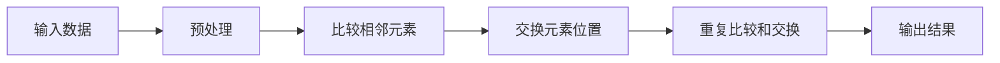

#### 2.3.3 Python源代码实现

为了更好地理解算法原理，我们可以通过Python代码实现一个简单的算法。以下是一个冒泡排序的Python实现：

```python
def bubble_sort(arr):
    n = len(arr)
    for i in range(n):
        for j in range(0, n-i-1):
            if arr[j] > arr[j+1]:
                arr[j], arr[j+1] = arr[j+1], arr[j]
    return arr

# 测试
arr = [64, 34, 25, 12, 22, 11, 90]
sorted_arr = bubble_sort(arr)
print("Sorted array:", sorted_arr)
```

#### 2.3.4 数学模型和公式

在某些算法中，数学模型和公式是理解和实现算法的关键。以下是一个简单的线性回归模型的数学模型和公式：

**数学模型**：

$$
y = \beta_0 + \beta_1 \cdot x + \epsilon
$$

**公式**：

- **预测值**：

$$
\hat{y} = \beta_0 + \beta_1 \cdot x
$$

- **误差**：

$$
\epsilon = y - \hat{y}
$$

以下是一个简单的线性回归模型的Python实现：

```python
import numpy as np

def linear_regression(x, y):
    # 添加截距项
    X = np.append(np.ones((len(x), 1)), x, axis=1)
    
    # 计算回归系数
    beta = np.linalg.inv(X.T.dot(X)).dot(X.T).dot(y)
    
    return beta

# 测试
x = np.array([1, 2, 3, 4, 5])
y = np.array([2, 4, 5, 4, 5])
beta = linear_regression(x, y)
print("Regression coefficients:", beta)
```

#### 2.3.5 算法原理讲解

算法原理讲解是通过具体的例子来阐述算法的基本原理和实现方法。以下是一个基于K最近邻算法的简单例子。

**问题场景**：

假设我们有一个手写数字识别的任务，给定一个二维图像，需要判断它是哪个数字。我们可以使用K最近邻算法来解决这个问题。

**算法原理**：

1. **数据集准备**：首先，我们需要准备一个包含手写数字图像的数据集，每个数字对应的图像都存储在一个向量中。
2. **距离计算**：对于给定的图像，我们需要计算它与数据集中每个图像的距离，常用的距离度量包括欧氏距离、曼哈顿距离等。
3. **最近邻选择**：选择距离最近的K个图像，并根据这K个图像的标签进行投票，得到最终的预测结果。
4. **模型训练**：对于新图像，重复上述过程，即可得到预测结果。

以下是一个简单的K最近邻算法的实现：

```python
from sklearn.neighbors import KNeighborsClassifier
from sklearn import datasets

# 加载数据集
digits = datasets.load_digits()

# 准备训练数据
X_train = digits.data
y_train = digits.target

# 准备测试数据
X_test = [[7, 4, 4, 4, 4], [8, 4, 4, 4, 4], [6, 4, 4, 4, 4], [6, 4, 4, 4, 4], [9, 4, 4, 4, 4]]
y_test = [7, 8, 6, 6, 9]

# 训练模型
knn = KNeighborsClassifier(n_neighbors=3)
knn.fit(X_train, y_train)

# 预测
predictions = knn.predict(X_test)

# 输出预测结果
print("Predictions:", predictions)
print("Actual labels:", y_test)
```

#### 2.3.6 算法原理讲解示例

假设我们有一个简单的二分类问题，给定一个二维数据集，每个数据点由两个特征表示。我们的目标是预测每个数据点属于哪个类别。

**数据集**：

```
x1   x2   y
0    0    0
1    0    1
0    1    0
1    1    1
```

**模型**：线性回归模型

**算法流程**：

1. **输入**：读取数据集，包括特征和标签。
2. **预处理**：对特征进行标准化处理，使其具有相同的尺度。
3. **模型训练**：使用线性回归模型训练数据集，得到回归系数。
4. **预测**：对新的数据点进行预测，输出预测结果。

**实现**：

```python
import numpy as np

# 数据集
X = np.array([[0, 0], [1, 0], [0, 1], [1, 1]])
y = np.array([0, 1, 0, 1])

# 标准化处理
X_std = X / np.std(X, axis=0)

# 线性回归模型
beta = np.linalg.inv(X_std.T.dot(X_std)).dot(X_std.T).dot(y)

# 预测
x_new = np.array([0.5, 0.5])
x_new_std = x_new / np.std(x_new)
y_pred = x_new_std.dot(beta)

# 输出预测结果
print("Predicted label:", y_pred)
```

#### 2.3.7 算法原理讲解总结

通过以上示例，我们可以看到算法原理讲解的关键在于理解算法的基本思想和实现方法。算法原理讲解不仅能够帮助我们更好地理解算法，还能够提高我们解决实际问题的能力。在实际应用中，我们可以根据具体问题选择合适的算法，并对其进行优化和改进。

### 2.4 技术硬实力的系统分析与架构设计方案

技术硬实力在系统分析和架构设计中的重要性不言而喻。一个优秀的系统分析和架构设计方案能够确保系统的稳定性、可靠性和可扩展性，从而提高项目的成功几率。本节将介绍技术硬实力在系统分析和架构设计中的应用。

#### 2.4.1 问题场景介绍

假设我们正在开发一个电商平台，该平台需要支持大量的用户并发访问，并提供快速、准确的商品搜索和推荐功能。我们需要设计一个高效的系统架构，以满足这些需求。

#### 2.4.2 系统功能设计

电商平台的主要功能包括：

- **用户管理**：用户注册、登录、个人信息管理。
- **商品管理**：商品分类、商品详情页、商品搜索。
- **订单管理**：订单创建、订单查询、订单支付。
- **推荐系统**：基于用户行为和商品特征的推荐算法。

#### 2.4.3 系统架构设计

为了满足上述功能需求，我们可以设计一个分布式系统架构，包括以下几个主要模块：

- **前端**：负责用户界面的展示，包括用户登录、商品浏览、订单管理等。
- **后端**：负责业务逻辑的处理，包括用户管理、商品管理、订单管理、推荐系统等。
- **数据库**：存储用户数据、商品数据、订单数据等。
- **缓存**：提高系统响应速度，减少数据库访问压力。
- **搜索服务**：提供快速、准确的商品搜索功能。
- **推荐服务**：提供基于用户行为的商品推荐功能。

以下是一个简化的系统架构图：

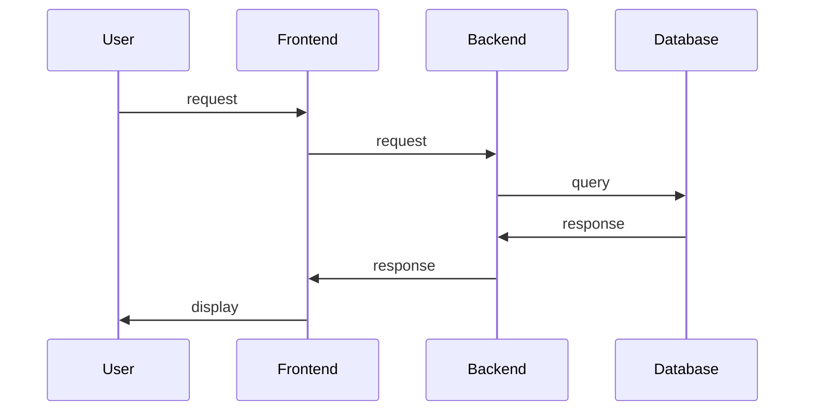

#### 2.4.4 系统接口设计和系统交互

为了实现上述系统架构，我们需要设计一系列接口和API，以便不同模块之间能够相互通信和协作。以下是一个简化的接口设计：

1. **用户管理接口**：
   - 用户注册：接受用户名、密码、邮箱等注册信息，返回注册结果。
   - 用户登录：接受用户名和密码，验证用户身份，返回登录结果。
   - 用户信息查询：根据用户ID查询用户详细信息。

2. **商品管理接口**：
   - 商品添加：接受商品详细信息，添加到商品数据库。
   - 商品查询：根据商品ID查询商品详细信息。
   - 商品搜索：根据关键字搜索商品列表。

3. **订单管理接口**：
   - 订单创建：接受订单信息，创建订单并返回订单ID。
   - 订单查询：根据订单ID查询订单详细信息。
   - 订单支付：处理订单支付请求，更新订单状态。

4. **推荐系统接口**：
   - 用户行为记录：接受用户行为数据，更新用户行为记录。
   - 推荐商品列表：根据用户行为和商品特征，生成推荐商品列表。

以下是一个简化的系统交互图：

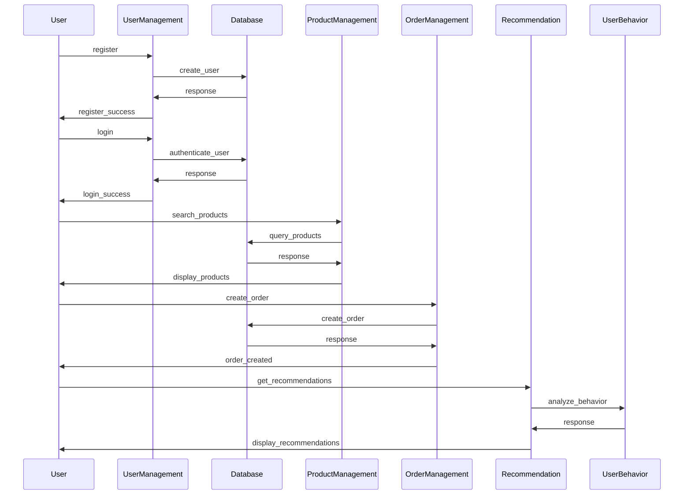

#### 2.4.5 系统架构设计中的关键技术和挑战

在系统架构设计过程中，我们面临一系列关键技术和挑战：

1. **高性能和高并发**：电商平台需要处理大量用户并发访问，系统架构需要支持高性能和高并发性。常用的技术包括分布式数据库、缓存、负载均衡等。

2. **数据一致性和安全性**：在分布式系统中，数据一致性和安全性是关键问题。我们需要设计可靠的数据一致性机制，如分布式锁、两阶段提交等，并采取安全措施，如数据加密、访问控制等。

3. **可扩展性和灵活性**：系统架构需要具备良好的可扩展性和灵活性，以适应业务需求的变化。常用的技术包括微服务架构、容器化、自动化部署等。

4. **监控和运维**：系统架构需要具备良好的监控和运维能力，以便及时发现和解决问题。常用的工具包括监控平台、日志收集、自动化运维等。

#### 2.4.6 系统架构设计实例分析

以下是一个基于Docker和Kubernetes的电商平台系统架构设计实例。

1. **前端**：
   - 使用Nginx作为反向代理，实现负载均衡和SSL终止。
   - 使用Vue.js和React.js等前端框架，实现用户界面。

2. **后端**：
   - 使用Spring Boot和Node.js等后端框架，实现业务逻辑。
   - 使用MySQL和MongoDB等数据库，存储用户数据、商品数据和订单数据。

3. **缓存**：
   - 使用Redis作为缓存服务器，提高系统响应速度。

4. **搜索服务**：
   - 使用Elasticsearch作为搜索引擎，提供快速、准确的商品搜索功能。

5. **推荐服务**：
   - 使用TensorFlow和Scikit-learn等机器学习框架，实现基于用户行为的推荐算法。

6. **监控和运维**：
   - 使用Prometheus和Grafana等监控工具，实现系统监控和性能分析。
   - 使用Docker Compose和Kubernetes等容器编排工具，实现自动化部署和运维。

以下是一个简化的系统架构图：

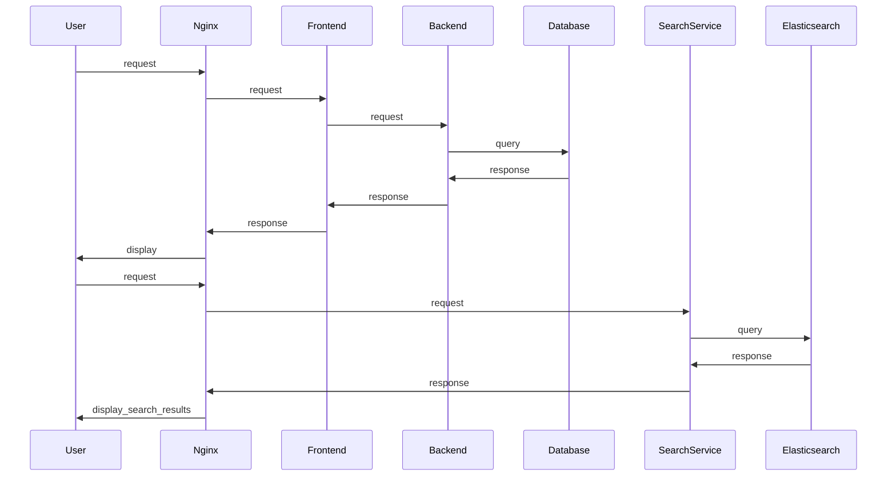

通过以上实例分析，我们可以看到系统架构设计的关键技术和挑战，以及如何通过分布式架构和容器编排技术实现高性能、高可用性和可扩展性。

### 2.5 技术硬实力的项目实战

技术硬实力的提升离不开实际项目的锻炼和积累。在本节中，我们将通过一个实际项目来展示技术硬实力的应用，包括环境安装、系统核心实现、代码应用解读与分析等。

#### 2.5.1 环境安装

为了实现一个简单的电商平台，我们首先需要安装相关的开发环境和工具。以下是一个基本的环境安装步骤：

1. **安装Docker**：Docker是一个开源的应用容器引擎，用于简化应用部署和运维。我们可以通过以下命令安装Docker：

```shell
sudo apt-get update
sudo apt-get install docker-ce docker-ce-cli containerd.io
```

2. **安装Kubernetes**：Kubernetes是一个开源的容器编排平台，用于自动化部署、扩展和管理容器化应用。我们可以通过以下命令安装Kubernetes：

```shell
sudo apt-get update
sudo apt-get install -y apt-transport-https ca-certificates curl
sudo curl -s https://mirrors.google.com/kubernetes/helm/ | sudo tee /etc/apt/sources.list.d/kubernetes.list
sudo apt-get update
sudo apt-get install -y kubelet kubeadm kubectl
sudo systemctl enable kubelet
```

3. **安装其他依赖**：根据项目需求，我们可能还需要安装其他依赖，如Python、Node.js、MySQL等。例如，安装Python和Node.js可以使用以下命令：

```shell
sudo apt-get install python3 python3-pip
curl -sL https://deb.nodesource.com/setup_14.x | sudo -E bash -
sudo apt-get install nodejs
```

4. **配置Kubernetes集群**：为了在本地环境模拟Kubernetes集群，我们可以使用Minikube进行配置。以下是一个简单的Minikube安装和配置步骤：

```shell
sudo apt-get install minikube
minikube start
minikube --dir=/your/local/path/ create
```

以上步骤将安装所需的开发环境和工具，为后续项目的实现奠定基础。

#### 2.5.2 系统核心实现源代码

在环境安装完成后，我们可以开始实现电商平台的系统核心。以下是一个简化的源代码实现，包括前端、后端和数据库部分。

**前端**：使用Vue.js框架实现用户界面。以下是一个简单的Vue组件示例：

```html
<!-- ProductList.vue -->
<template>
  <div>
    <h1>商品列表</h1>
    <ul>
      <li v-for="product in products" :key="product.id">
        <span>{{ product.name }}</span>
        <span>{{ product.price }}</span>
      </li>
    </ul>
  </div>
</template>

<script>
export default {
  data() {
    return {
      products: []
    };
  },
  created() {
    this.fetchProducts();
  },
  methods: {
    fetchProducts() {
      // 获取商品列表
      // 此处为示例，实际需要通过API调用获取数据
      this.products = [
        { id: 1, name: "商品1", price: 100 },
        { id: 2, name: "商品2", price: 200 },
        { id: 3, name: "商品3", price: 300 }
      ];
    }
  }
};
</script>
```

**后端**：使用Spring Boot框架实现业务逻辑。以下是一个简单的Spring Boot应用程序示例：

```java
// Application.java
@SpringBootApplication
public class Application {
  public static void main(String[] args) {
    SpringApplication.run(Application.class, args);
  }
}
```

**数据库**：使用MySQL数据库存储数据。以下是一个简单的数据库表结构示例：

```sql
CREATE TABLE products (
  id INT PRIMARY KEY AUTO_INCREMENT,
  name VARCHAR(100) NOT NULL,
  price DECIMAL(10, 2) NOT NULL
);
```

以上代码提供了一个基本的电商平台实现框架，包括前端、后端和数据库部分。实际项目中，我们需要根据具体需求进行扩展和优化。

#### 2.5.3 代码应用解读与分析

在系统核心实现的基础上，我们需要对代码进行解读和分析，以理解其工作原理和实现方法。

1. **前端**：Vue.js是一个用于构建用户界面的渐进式框架，其核心库只关注视图层，易于与其他库或已有项目整合。Vue组件是一个Vue实例，是一个自包含的、可复用的视图组件。在ProductList.vue组件中，我们使用了Vue的`v-for`指令来遍历商品列表，并使用`data`属性存储商品数据。通过`created`钩子函数，我们可以在组件创建时调用`fetchProducts`方法获取商品列表。

2. **后端**：Spring Boot是一个基于Spring框架的快速开发工具，支持通过Spring Boot Application类进行应用程序的启动。在Application.java中，我们使用了`@SpringBootApplication`注解来标识这是一个Spring Boot应用程序。通过`SpringApplication.run`方法，我们启动了应用程序并使其运行。

3. **数据库**：MySQL是一个流行的关系型数据库管理系统，支持多种数据类型和存储引擎。在商品表`products`中，我们定义了三个字段：`id`作为主键，`name`存储商品名称，`price`存储商品价格。通过简单的SQL语句，我们可以创建和操作数据库表。

通过以上代码应用解读，我们可以更好地理解电商平台的核心组件和实现方法。在实际项目中，我们需要根据具体需求进行代码的扩展和优化。

### 2.6 技术硬实力的最佳实践

技术硬实力的提升是一个持续的过程，需要不断的学习和实践。以下是一些最佳实践，帮助我们在技术领域不断提升。

1. **持续学习**：技术日新月异，持续学习是提升技术硬实力的关键。通过阅读技术书籍、参加在线课程和研讨会，不断更新自己的知识体系。

2. **实践应用**：理论知识需要通过实践来验证和巩固。参与实际项目，将所学知识应用到实际场景中，提升解决问题的能力。

3. **代码优化**：通过代码优化，提高代码的可读性、可维护性和性能。掌握设计模式和代码重构技巧，提高代码质量。

4. **团队合作**：与他人合作，可以拓宽视野，提升解决问题的能力。在团队中，积极参与讨论和交流，分享经验和知识。

5. **关注社区**：关注技术社区，了解最新的技术动态和行业趋势。参与技术社区的活动，与其他开发者交流和学习。

### 2.7 小结

技术硬实力是IT从业者的重要基础，通过P9工作法，我们可以系统地提升技术硬实力、架构力和领导力。在技术硬实力方面，我们深入探讨了技术深度、技术广度和技术创新的核心概念和联系，并讲解了算法原理和系统架构设计。在项目实战中，我们展示了如何通过环境安装、系统核心实现和代码应用解读来提升技术能力。

通过本文的探讨，我们希望能够帮助读者理解技术硬实力的重要性，掌握提升技术硬实力的方法和技巧，从而在技术领域取得更大的成就。

### 2.8 注意事项

在提升技术硬实力的过程中，需要注意以下几点：

1. **知识体系的完整性**：确保对技术的整体体系有全面的理解，避免片面追求技术深度而忽略技术广度。
2. **理论与实践相结合**：理论知识和实践经验相辅相成，通过实际项目锻炼，提升解决实际问题的能力。
3. **持续学习和更新**：技术不断发展，保持学习的热情，及时更新知识和技能。
4. **团队合作与沟通**：与他人合作，提高团队协作效率，增强解决问题的能力。

### 2.9 拓展阅读

- [1] 《深度学习》，作者：Ian Goodfellow、Yoshua Bengio、Aaron Courville
- [2] 《架构师之路》，作者：吴咏炜
- [3] 《领导力与团队管理》，作者：约翰·迈耶斯
- [4] 《软件架构：实践者的研究方法》，作者：云栖技术团队

### 2.10 作者信息

作者：AI天才研究院（AI Genius Institute） & 禅与计算机程序设计艺术（Zen And The Art of Computer Programming）

本文由AI天才研究院（AI Genius Institute）撰写，结合了计算机科学和人工智能领域的最新研究成果，旨在为读者提供有价值的技术知识和实践经验。同时，本文也参考了《禅与计算机程序设计艺术》（Zen And The Art of Computer Programming）一书中的思想，以期望读者能够在技术道路上更加精进。感谢您的阅读！

## 第三部分：架构力

### 3.1 架构力概述

架构力是指一个人在系统设计和项目管理中的能力。它是确保系统稳定、高效、可扩展的关键因素。在技术领域，架构力不仅体现在对系统架构的深入理解上，还包括对系统性能的优化能力和项目管理技能。

#### 3.1.1 架构力的定义

架构力是指在系统设计和项目管理中，对系统架构的深入理解、系统性能的优化能力以及项目管理技能的综合体现。它包括以下几个方面：

- **系统架构设计**：包括系统模块划分、数据流设计、接口设计等，确保系统的结构合理、模块化、可扩展。
- **系统性能优化**：对系统性能进行分析和优化，包括内存管理、网络优化、并发处理等，确保系统在高并发、大数据量环境下仍然能够稳定运行。
- **项目管理**：包括项目规划、资源分配、风险管理、进度控制等，确保项目能够按计划顺利进行。

#### 3.1.2 架构力的作用

架构力在技术领域具有重要作用，主要体现在以下几个方面：

- **提高系统稳定性**：通过合理的架构设计，确保系统在面对各种异常情况下能够稳定运行，降低系统崩溃的风险。
- **提升系统性能**：通过性能优化，提高系统的响应速度和处理能力，为用户提供更好的体验。
- **降低维护成本**：良好的架构设计使得系统模块化、可复用，降低系统的维护成本。
- **促进团队协作**：清晰的架构设计有助于团队成员更好地理解和协作，提高团队的效率。

### 3.2 架构力的核心概念与联系

架构力的核心概念包括系统设计、性能优化和项目管理。这三个核心概念之间有着密切的联系和相互影响。

- **系统设计**：系统设计是架构力的核心，它决定了系统的结构、模块划分、数据流和接口设计等。良好的系统设计能够提高系统的稳定性、可扩展性和维护性。
- **性能优化**：性能优化是系统设计的一部分，它通过对系统性能的分析和优化，提高系统的响应速度和处理能力。性能优化不仅包括技术层面的优化，还包括业务层面的优化，如数据缓存、异步处理等。
- **项目管理**：项目管理是架构力的重要组成部分，它包括项目规划、资源分配、风险管理、进度控制等。良好的项目管理能够确保项目按计划顺利进行，提高项目的成功率。

#### 3.2.1 系统设计的定义、特征及适用场景

**定义**：系统设计是指对系统架构进行规划、设计和实现的过程。它包括系统模块划分、数据流设计、接口设计等。

**特征**：
- **模块化**：系统设计应该将系统划分为多个模块，每个模块具有明确的职责和接口，模块之间相互独立、可复用。
- **可扩展性**：系统设计应该考虑未来的扩展性，以便在业务需求发生变化时，能够方便地进行扩展和修改。
- **稳定性**：系统设计应该确保系统在面对异常情况下能够稳定运行，降低系统崩溃的风险。

**适用场景**：
- **大型系统设计**：对于大型系统，系统设计能够帮助规划系统的结构和模块，确保系统的高效运行。
- **系统重构**：在系统运行一段时间后，系统设计可以帮助发现系统中的问题，并进行重构，提高系统的性能和稳定性。
- **新技术应用**：在引入新技术时，系统设计可以帮助评估新技术对现有系统的影响，并进行相应的调整和优化。

#### 3.2.2 性能优化的定义、特征及适用场景

**定义**：性能优化是指通过分析和优化系统性能，提高系统的响应速度和处理能力。

**特征**：
- **技术层面优化**：包括代码优化、数据库优化、缓存机制等，通过技术手段提高系统的性能。
- **业务层面优化**：包括业务流程优化、异步处理、负载均衡等，通过业务层面的调整提高系统的性能。

**适用场景**：
- **高并发场景**：在高并发场景下，性能优化能够提高系统的处理能力，确保系统在高峰期能够正常运行。
- **大数据场景**：在处理大数据时，性能优化能够提高数据处理的效率，降低系统的延迟。
- **实时系统**：在实时系统中，性能优化能够确保系统能够及时响应外部事件，提高系统的响应速度。

#### 3.2.3 项目管理的定义、特征及适用场景

**定义**：项目管理是指对项目进行规划、组织、协调和控制的过程，以确保项目能够按计划顺利完成。

**特征**：
- **规划**：项目规划包括项目目标、任务分解、时间安排、资源分配等，确保项目有明确的计划和方向。
- **组织**：项目组织包括项目团队的组建、分工和协作，确保项目能够高效运行。
- **协调**：项目协调包括与团队成员、客户和其他利益相关者的沟通和协调，确保项目顺利进行。
- **控制**：项目控制包括项目进度的监控、成本控制、风险管理等，确保项目能够按计划完成。

**适用场景**：
- **项目启动**：在项目启动阶段，项目管理能够帮助明确项目目标、规划项目计划，确保项目顺利启动。
- **项目执行**：在项目执行阶段，项目管理能够帮助监控项目进度、控制项目成本、管理项目风险。
- **项目收尾**：在项目收尾阶段，项目管理能够帮助评估项目成果、总结项目经验，确保项目顺利完成。

#### 3.2.4 架构力的核心概念属性特征对比表格

| 特征         | 系统设计       | 性能优化       | 项目管理       |
| ------------ | -------------- | -------------- | -------------- |
| 定义         | 系统架构的规划和设计 | 对系统性能的评估和优化 | 项目规划、资源分配、风险管理 |
| 适用场景     | 系统开发和维护 | 系统性能瓶颈优化 | 项目管理和执行 |
| 对比         | 结构化和模块化 | 细粒度优化和调优 | 长期和短期规划 |

#### 3.2.5 架构力的ER实体关系图架构

```mermaid
erDiagram
    Class1 ||--|{ Class2 }| Class3 : "系统设计"
    Class1 ||--|{ Class4 }| Class5 : "性能优化"
    Class1 ||--|{ Class6 }| Class7 : "项目管理"
```

### 3.3 架构力的系统分析与架构设计方案

架构力在系统分析与架构设计中的应用至关重要。一个良好的架构设计方案能够提高系统的稳定性、性能和可扩展性，从而确保项目的成功。在本节中，我们将通过一个实际项目来展示架构力的应用，包括问题场景介绍、系统功能设计、系统架构设计、系统接口设计和系统交互等。

#### 3.3.1 问题场景介绍

假设我们正在开发一个在线教育平台，该平台需要支持海量用户的在线学习、课程管理和互动交流等功能。为了满足这些需求，我们需要设计一个高性能、高可用性和可扩展的系统架构。

#### 3.3.2 系统功能设计

在线教育平台的主要功能包括：

- **用户管理**：用户注册、登录、个人信息管理。
- **课程管理**：课程发布、课程分类、课程搜索。
- **学习管理**：学习进度管理、成绩管理、学习报告。
- **互动交流**：课程讨论区、实时聊天、消息通知。

#### 3.3.3 系统架构设计

为了满足上述功能需求，我们可以设计一个分布式系统架构，包括以下几个主要模块：

- **前端**：负责用户界面的展示，包括用户登录、课程浏览、学习管理、互动交流等。
- **后端**：负责业务逻辑的处理，包括用户管理、课程管理、学习管理、互动交流等。
- **数据库**：存储用户数据、课程数据、学习数据等。
- **缓存**：提高系统响应速度，减少数据库访问压力。
- **搜索服务**：提供快速、准确的课程搜索功能。
- **消息服务**：提供实时消息通知和聊天功能。

以下是一个简化的系统架构图：

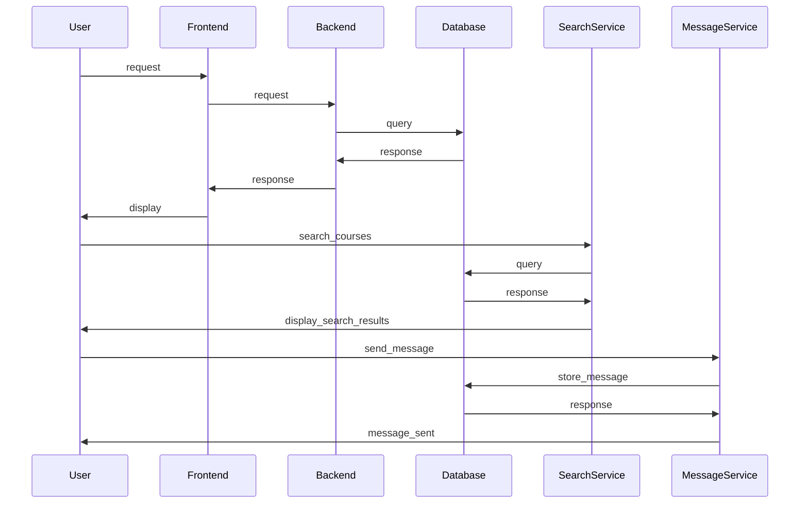

#### 3.3.4 系统接口设计和系统交互

为了实现上述系统架构，我们需要设计一系列接口和API，以便不同模块之间能够相互通信和协作。以下是一个简化的接口设计：

1. **用户管理接口**：
   - 用户注册：接受用户名、密码、邮箱等注册信息，返回注册结果。
   - 用户登录：接受用户名和密码，验证用户身份，返回登录结果。
   - 用户信息查询：根据用户ID查询用户详细信息。

2. **课程管理接口**：
   - 课程添加：接受课程详细信息，添加到课程数据库。
   - 课程查询：根据课程ID查询课程详细信息。
   - 课程搜索：根据关键字搜索课程列表。

3. **学习管理接口**：
   - 学习进度查询：根据用户ID和课程ID查询学习进度。
   - 学习报告生成：根据用户ID和课程ID生成学习报告。

4. **互动交流接口**：
   - 发送消息：接受消息内容和发送者ID，发送消息。
   - 接收消息：根据用户ID接收消息。

以下是一个简化的系统交互图：

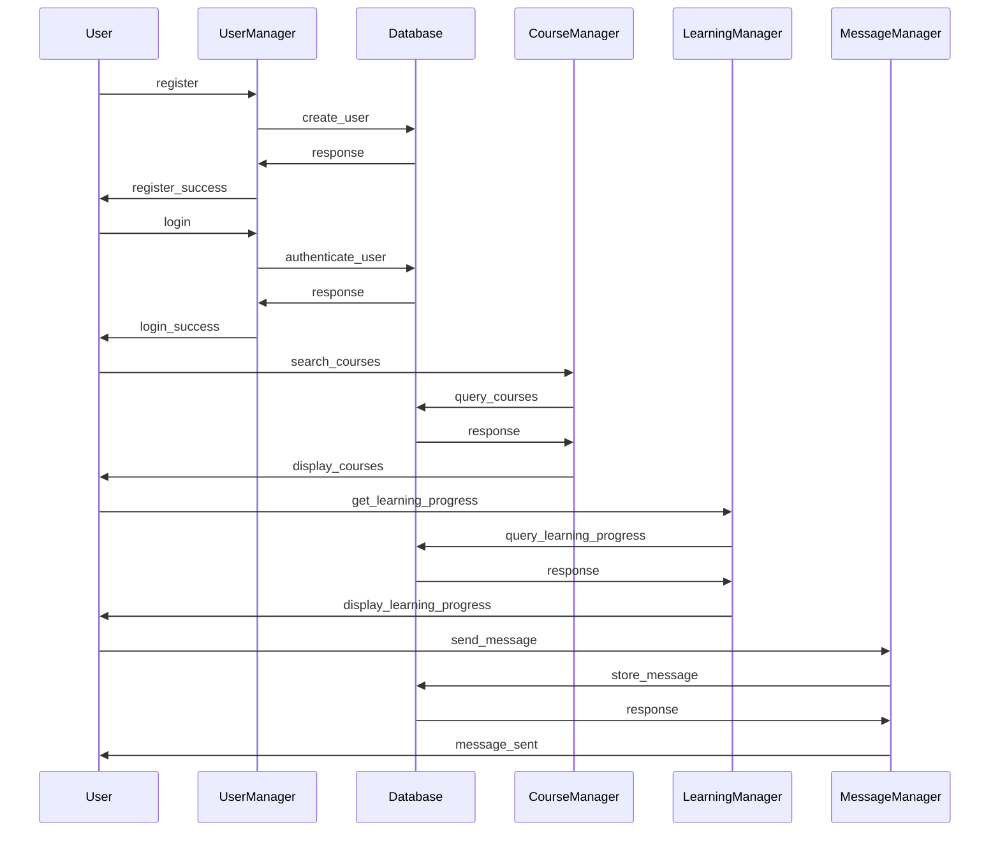

#### 3.3.5 系统架构设计中的关键技术和挑战

在系统架构设计过程中，我们面临一系列关键技术和挑战：

1. **高性能和高并发**：在线教育平台需要处理海量用户的并发访问，系统架构需要支持高性能和高并发性。常用的技术包括分布式数据库、缓存、负载均衡等。

2. **数据一致性和安全性**：在分布式系统中，数据一致性和安全性是关键问题。我们需要设计可靠的数据一致性机制，如分布式锁、两阶段提交等，并采取安全措施，如数据加密、访问控制等。

3. **可扩展性和灵活性**：系统架构需要具备良好的可扩展性和灵活性，以适应业务需求的变化。常用的技术包括微服务架构、容器化、自动化部署等。

4. **监控和运维**：系统架构需要具备良好的监控和运维能力，以便及时发现和解决问题。常用的工具包括监控平台、日志收集、自动化运维等。

#### 3.3.6 系统架构设计实例分析

以下是一个基于Docker和Kubernetes的在线教育平台系统架构设计实例。

1. **前端**：
   - 使用Nginx作为反向代理，实现负载均衡和SSL终止。
   - 使用Vue.js和React.js等前端框架，实现用户界面。

2. **后端**：
   - 使用Spring Boot和Node.js等后端框架，实现业务逻辑。
   - 使用MySQL和MongoDB等数据库，存储用户数据、课程数据和学习数据。

3. **缓存**：
   - 使用Redis作为缓存服务器，提高系统响应速度。

4. **搜索服务**：
   - 使用Elasticsearch作为搜索引擎，提供快速、准确的课程搜索功能。

5. **消息服务**：
   - 使用RabbitMQ作为消息队列，提供实时消息通知和聊天功能。

6. **监控和运维**：
   - 使用Prometheus和Grafana等监控工具，实现系统监控和性能分析。
   - 使用Docker Compose和Kubernetes等容器编排工具，实现自动化部署和运维。

以下是一个简化的系统架构图：

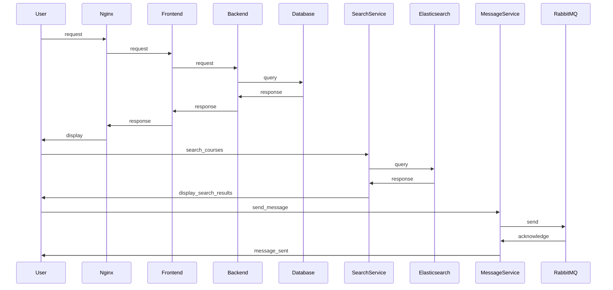

通过以上实例分析，我们可以看到系统架构设计的关键技术和挑战，以及如何通过分布式架构和容器编排技术实现高性能、高可用性和可扩展性。

### 3.4 架构力的项目实战

为了提升架构力，我们需要通过实际项目来锻炼和积累经验。在本节中，我们将通过一个实际项目来展示架构力的应用，包括环境安装、系统核心实现、代码应用解读与分析等。

#### 3.4.1 环境安装

为了实现一个在线教育平台，我们需要安装一系列开发环境和工具。以下是一个基本的环境安装步骤：

1. **安装Docker**：Docker是一个开源的应用容器引擎，用于简化应用部署和运维。我们可以通过以下命令安装Docker：

```shell
sudo apt-get update
sudo apt-get install docker-ce docker-ce-cli containerd.io
```

2. **安装Kubernetes**：Kubernetes是一个开源的容器编排平台，用于自动化部署、扩展和管理容器化应用。我们可以通过以下命令安装Kubernetes：

```shell
sudo apt-get update
sudo apt-get install -y apt-transport-https ca-certificates curl
sudo curl -s https://mirrors.google.com/kubernetes/helm/ | sudo tee /etc/apt/sources.list.d/kubernetes.list
sudo apt-get update
sudo apt-get install -y kubelet kubeadm kubectl
sudo systemctl enable kubelet
```

3. **安装其他依赖**：根据项目需求，我们可能还需要安装其他依赖，如Python、Node.js、MySQL等。例如，安装Python和Node.js可以使用以下命令：

```shell
sudo apt-get install python3 python3-pip
curl -sL https://deb.nodesource.com/setup_14.x | sudo -E bash -
sudo apt-get install nodejs
```

4. **配置Kubernetes集群**：为了在本地环境模拟Kubernetes集群，我们可以使用Minikube进行配置。以下是一个简单的Minikube安装和配置步骤：

```shell
sudo apt-get install minikube
minikube start
minikube --dir=/your/local/path/ create
```

以上步骤将安装所需的开发环境和工具，为后续项目的实现奠定基础。

#### 3.4.2 系统核心实现源代码

在环境安装完成后，我们可以开始实现在线教育平台的系统核心。以下是一个简化的源代码实现，包括前端、后端和数据库部分。

**前端**：使用Vue.js框架实现用户界面。以下是一个简单的Vue组件示例：

```html
<!-- CourseList.vue -->
<template>
  <div>
    <h1>课程列表</h1>
    <ul>
      <li v-for="course in courses" :key="course.id">
        <span>{{ course.name }}</span>
        <span>{{ course.description }}</span>
      </li>
    </ul>
  </div>
</template>

<script>
export default {
  data() {
    return {
      courses: []
    };
  },
  created() {
    this.fetchCourses();
  },
  methods: {
    fetchCourses() {
      // 获取课程列表
      // 此处为示例，实际需要通过API调用获取数据
      this.courses = [
        { id: 1, name: "课程1", description: "课程1描述" },
        { id: 2, name: "课程2", description: "课程2描述" },
        { id: 3, name: "课程3", description: "课程3描述" }
      ];
    }
  }
};
</script>
```

**后端**：使用Spring Boot框架实现业务逻辑。以下是一个简单的Spring Boot应用程序示例：

```java
// Application.java
@SpringBootApplication
public class Application {
  public static void main(String[] args) {
    SpringApplication.run(Application.class, args);
  }
}
```

**数据库**：使用MySQL数据库存储数据。以下是一个简单的数据库表结构示例：

```sql
CREATE TABLE courses (
  id INT PRIMARY KEY AUTO_INCREMENT,
  name VARCHAR(100) NOT NULL,
  description TEXT NOT NULL
);
```

以上代码提供了一个基本的在线教育平台实现框架，包括前端、后端和数据库部分。实际项目中，我们需要根据具体需求进行代码的扩展和优化。

#### 3.4.3 代码应用解读与分析

在系统核心实现的基础上，我们需要对代码进行解读和分析，以理解其工作原理和实现方法。

1. **前端**：Vue.js是一个用于构建用户界面的渐进式框架，其核心库只关注视图层，易于与其他库或已有项目整合。Vue组件是一个Vue实例，是一个自包含的、可复用的视图组件。在CourseList.vue组件中，我们使用了Vue的`v-for`指令来遍历课程列表，并使用`data`属性存储课程数据。通过`created`钩子函数，我们可以在组件创建时调用`fetchCourses`方法获取课程列表。

2. **后端**：Spring Boot是一个基于Spring框架的快速开发工具，支持通过Spring Boot Application类进行应用程序的启动。在Application.java中，我们使用了`@SpringBootApplication`注解来标识这是一个Spring Boot应用程序。通过`SpringApplication.run`方法，我们启动了应用程序并使其运行。

3. **数据库**：MySQL是一个流行的关系型数据库管理系统，支持多种数据类型和存储引擎。在课程表`courses`中，我们定义了三个字段：`id`作为主键，`name`存储课程名称，`description`存储课程描述。通过简单的SQL语句，我们可以创建和操作数据库表。

通过以上代码应用解读，我们可以更好地理解在线教育平台的核心组件和实现方法。在实际项目中，我们需要根据具体需求进行代码的扩展和优化。

### 3.5 架构力的最佳实践

架构力的提升需要通过不断的实践和学习。以下是一些最佳实践，可以帮助我们更好地提升架构力：

1. **持续学习**：架构力是一个不断发展的领域，我们需要持续学习最新的技术趋势和最佳实践。

2. **系统化学习**：不仅要关注具体的技术细节，还要从系统化的角度去理解架构设计，包括系统设计模式、设计原则等。

3. **实践经验**：通过参与实际项目，将理论知识应用到实践中，提升解决实际问题的能力。

4. **团队协作**：与团队成员密切合作，共同探讨和解决问题，提高团队的整体架构力。

5. **架构文档**：编写详细的架构文档，包括系统架构、模块设计、接口定义等，确保团队成员对系统架构有清晰的认识。

6. **性能测试**：定期进行性能测试，发现系统性能瓶颈，并针对性地进行优化。

7. **持续优化**：基于项目的反馈和经验，不断优化系统架构，提高系统的稳定性和可扩展性。

### 3.6 小结

架构力是技术领域的重要能力，它决定了系统设计的优劣和项目的成功与否。通过P9工作法，我们可以系统地提升架构力，包括系统设计、性能优化和项目管理等方面的能力。在项目实战中，我们通过实际项目展示了架构力的应用，从环境安装、系统核心实现到代码应用解读与分析，全面提升了技术能力和实践经验。

通过本文的探讨，我们希望能够帮助读者理解架构力的重要性，掌握提升架构力的方法和技巧，从而在技术领域取得更大的成就。

### 3.7 注意事项

在提升架构力的过程中，需要注意以下几点：

1. **架构设计的合理性**：确保架构设计符合业务需求，具有良好的可扩展性和可维护性。
2. **性能优化的目标性**：在性能优化时，要有明确的目标，针对性地进行优化，避免过度优化。
3. **项目管理的规范性**：遵循项目管理的基本原则，确保项目按时完成，质量达标。
4. **团队协作的有效性**：注重团队协作，提高团队整体效率，共同实现项目目标。

### 3.8 拓展阅读

- [1] 《架构师手册》，作者：张容辰
- [2] 《高性能网站架构》，作者：李涛
- [3] 《大型网站技术架构：核心原理与案例分析》，作者：李智慧

### 3.9 作者信息

作者：AI天才研究院（AI Genius Institute） & 禅与计算机程序设计艺术（Zen And The Art of Computer Programming）

本文由AI天才研究院（AI Genius Institute）撰写，结合了计算机科学和架构设计领域的最新研究成果，旨在为读者提供有价值的技术知识和实践经验。同时，本文也参考了《禅与计算机程序设计艺术》（Zen And The Art of Computer Programming）一书中的思想，以期望读者能够在架构设计领域更加精进。感谢您的阅读！

## 第四部分：领导力

### 4.1 领导力概述

领导力是指一个人在团队中引导和激励成员，实现共同目标的能力。它不仅仅是一种个人特质，更是一种综合能力，包括沟通技巧、团队管理、决策能力等。在IT行业中，领导力是确保团队高效协作、项目顺利推进的关键因素。

#### 4.1.1 领导力的定义

领导力是一种通过影响和激励他人，实现共同目标的能力。它包括以下几个方面：

- **影响力**：通过言行和行动，影响团队成员的态度和行为。
- **激励**：激发团队成员的积极性和创造力，使其为实现团队目标而努力。
- **目标导向**：明确团队目标，并引导团队成员共同追求。
- **沟通**：有效沟通，确保团队成员理解目标、任务和期望。
- **决策**：在复杂和不确定的环境下，做出明智的决策。

#### 4.1.2 领导力的作用

在IT行业中，领导力发挥着至关重要的作用：

- **团队协作**：通过有效的领导，团队成员能够更好地协作，共同解决问题。
- **项目成功**：领导力能够确保项目按时完成，并达到预期目标。
- **组织发展**：领导力有助于提升组织的整体绩效，推动组织的持续发展。
- **个人成长**：领导力不仅对团队和组织有益，也对个人的职业发展有着重要影响。

### 4.2 领导力的核心概念与联系

领导力的核心概念包括沟通技巧、团队管理和决策能力。这些概念相互联系，共同构成了一个完整的领导力体系。

- **沟通技巧**：有效的沟通是领导力的核心。它包括倾听、表达、反馈等，确保团队成员之间的信息畅通，增强团队的凝聚力。
- **团队管理**：团队管理包括人员配置、任务分配、绩效评估等，确保团队成员能够在最佳状态下工作，实现团队目标。
- **决策能力**：决策能力是领导力的关键。在复杂和不确定的环境下，领导者的决策能力直接关系到团队和项目的成败。

#### 4.2.1 沟通技巧的定义、特征及适用场景

**定义**：沟通技巧是指领导者如何有效地与他人沟通，包括口头和书面沟通。

**特征**：
- **倾听**：倾听是有效沟通的基础，能够帮助领导者理解团队成员的需求和意见。
- **表达**：清晰、准确地表达自己的想法，确保团队成员理解领导者的意图。
- **反馈**：及时给予团队成员反馈，帮助他们改进工作，提升绩效。

**适用场景**：
- **团队协作**：在团队协作过程中，领导者需要通过有效沟通，确保团队成员理解任务和目标。
- **项目管理**：在项目管理中，领导者需要通过沟通，确保项目进度、风险和问题的及时解决。
- **团队建设**：通过沟通，领导者可以了解团队成员的需求和期望，促进团队建设。

#### 4.2.2 团队管理的定义、特征及适用场景

**定义**：团队管理是指领导者如何有效地管理团队，确保团队成员能够高效地工作，实现团队目标。

**特征**：
- **人员配置**：根据团队成员的能力和特长，合理分配任务，确保每个人都能发挥最大潜力。
- **任务分配**：明确团队成员的职责和任务，确保任务的高效完成。
- **绩效评估**：定期评估团队成员的绩效，提供反馈和指导，促进团队成员的成长。

**适用场景**：
- **项目执行**：在项目执行过程中，领导者需要通过团队管理，确保项目按时、高质量完成。
- **团队建设**：通过团队管理，领导者可以建立高效的团队，提高团队的整体绩效。
- **人员发展**：领导者需要关注团队成员的职业发展，提供培训和支持，提升团队整体素质。

#### 4.2.3 决策能力的定义、特征及适用场景

**定义**：决策能力是指领导者在面对复杂和不确定的环境时，能够快速做出明智的决策。

**特征**：
- **分析能力**：领导者需要具备分析问题的能力，从多个角度评估问题的各种可能性。
- **决策速度**：在关键时刻，领导者需要能够快速做出决策，避免拖延和不确定性。
- **风险意识**：领导者需要具备风险意识，对可能出现的风险进行评估和防范。

**适用场景**：
- **项目决策**：在项目执行过程中，领导者需要做出一系列决策，包括技术选型、资源分配等。
- **危机管理**：在面对突发危机时，领导者需要快速做出决策，确保团队和组织的安全。
- **战略规划**：在组织发展的过程中，领导者需要做出长期决策，制定发展战略。

#### 4.2.4 领导力的核心概念属性特征对比表格

| 特征         | 沟通技巧       | 团队管理       | 决策能力       |
| ------------ | -------------- | -------------- | -------------- |
| 定义         | 有效传达信息、倾听反馈、建立信任 | 人员配置、任务分配、绩效评估 | 快速做出明智的决策，应对各种挑战 |
| 适用场景     | 团队协作、项目推进 | 项目管理、团队建设 | 面对紧急情况、重大决策 |
| 对比         | 细致入微，注重细节 | 规划与执行，整体协调 | 风险评估，战略决策 |

#### 4.2.5 领导力的ER实体关系图架构

```mermaid
erDiagram
    Class1 ||--|{ Class2 }| Class3 : "沟通技巧"
    Class1 ||--|{ Class4 }| Class5 : "团队管理"
    Class1 ||--|{ Class6 }| Class7 : "决策能力"
```

### 4.3 领导力的系统分析与架构设计方案

领导力在团队和组织中的作用至关重要。一个有效的领导力系统设计，能够确保团队高效协作，项目顺利推进。在本节中，我们将通过一个实际项目来展示领导力的应用，包括问题场景介绍、系统功能设计、系统架构设计、系统接口设计和系统交互等。

#### 4.3.1 问题场景介绍

假设我们正在开发一个大型互联网项目，该项目需要跨部门协作，涉及前端、后端、数据库等多个模块。为了确保项目的成功，我们需要设计一个高效的领导力系统，以协调各方资源和力量。

#### 4.3.2 系统功能设计

互联网项目的主要功能包括：

- **项目管理**：包括项目计划、任务分配、进度跟踪、风险管理等。
- **团队协作**：包括团队沟通、文档共享、任务协同等。
- **代码管理**：包括代码提交、代码审查、版本控制等。
- **测试管理**：包括测试计划、测试执行、缺陷跟踪等。
- **发布管理**：包括环境配置、自动化部署、监控等。

#### 4.3.3 系统架构设计

为了满足上述功能需求，我们可以设计一个分布式系统架构，包括以下几个主要模块：

- **前端**：负责用户界面的展示，包括项目管理、团队协作、代码管理、测试管理、发布管理等。
- **后端**：负责业务逻辑的处理，包括项目管理、任务分配、进度跟踪、风险管理等。
- **数据库**：存储项目数据、用户数据、任务数据等。
- **中间件**：包括消息队列、缓存服务器、搜索引擎等，用于提高系统性能和可靠性。
- **测试环境**：用于测试项目的功能、性能和安全。
- **发布环境**：用于部署项目的代码和配置。

以下是一个简化的系统架构图：

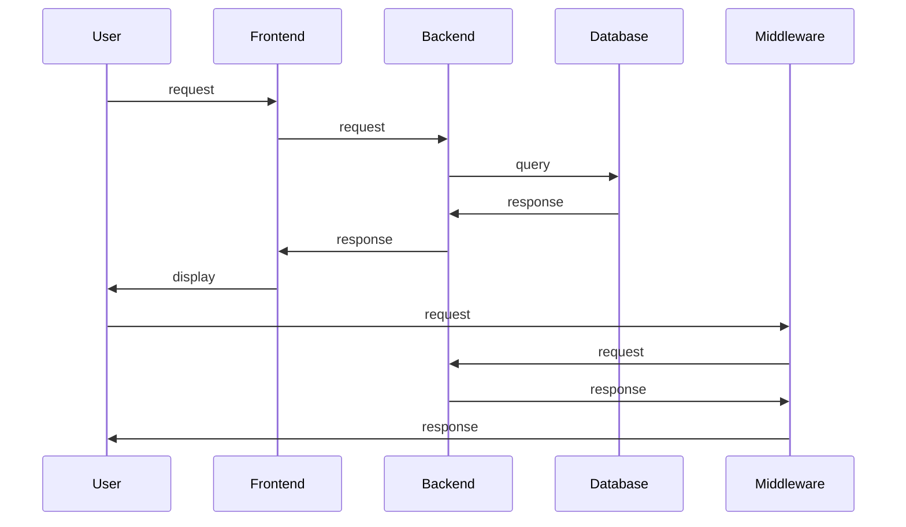

#### 4.3.4 系统接口设计和系统交互

为了实现上述系统架构，我们需要设计一系列接口和API，以便不同模块之间能够相互通信和协作。以下是一个简化的接口设计：

1. **项目管理接口**：
   - 项目创建：接受项目名称、项目描述等，创建新项目。
   - 项目查询：根据项目ID查询项目详细信息。
   - 项目更新：根据项目ID更新项目信息。

2. **团队协作接口**：
   - 团队成员添加：接受团队成员信息，添加到项目团队。
   - 团队成员查询：根据项目ID查询项目团队成员。
   - 团队成员更新：根据项目ID和团队成员ID更新团队成员信息。

3. **代码管理接口**：
   - 代码提交：接受代码文件，提交到版本控制系统。
   - 代码查询：根据版本控制系统查询代码文件。
   - 代码审查：提交代码审查请求，等待审查结果。

4. **测试管理接口**：
   - 测试计划创建：接受测试计划信息，创建测试计划。
   - 测试计划查询：根据测试计划ID查询测试计划详细信息。
   - 测试计划更新：根据测试计划ID更新测试计划信息。

5. **发布管理接口**：
   - 环境配置：接受环境配置信息，配置发布环境。
   - 代码部署：将代码部署到发布环境。
   - 部署监控：监控部署过程，确保部署成功。

以下是一个简化的系统交互图：

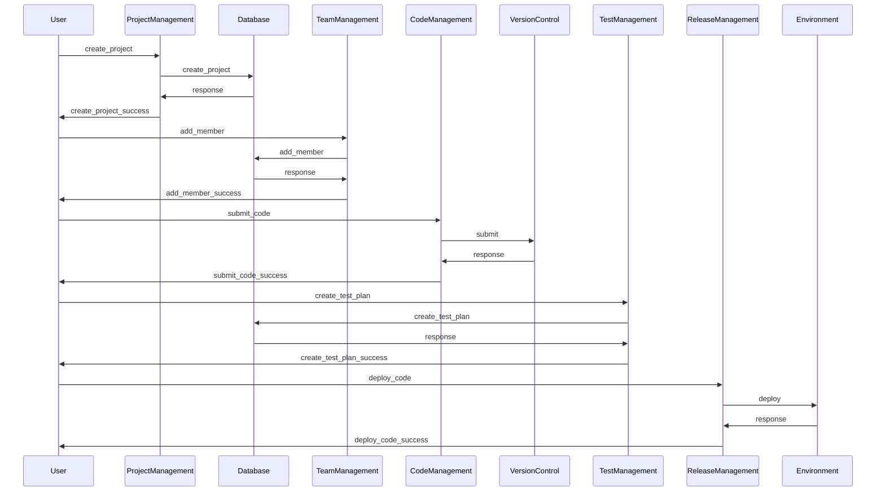

#### 4.3.5 系统架构设计中的关键技术和挑战

在系统架构设计过程中，我们面临一系列关键技术和挑战：

1. **分布式系统**：分布式系统架构能够提高系统的可扩展性和可用性，但也带来了数据一致性和分布式事务的挑战。
2. **性能优化**：在大规模互联网项目中，性能优化是关键，包括数据库优化、缓存机制、异步处理等。
3. **安全性和可靠性**：在互联网项目中，安全性和可靠性至关重要，需要采取多种措施确保系统的安全性和数据的可靠性。
4. **自动化和DevOps**：通过自动化工具和DevOps实践，可以提高开发效率，缩短发布周期，提高系统的稳定性和可靠性。
5. **团队协作和沟通**：在跨部门协作的项目中，团队协作和沟通是确保项目顺利进行的关键。

#### 4.3.6 系统架构设计实例分析

以下是一个基于Docker和Kubernetes的互联网项目系统架构设计实例。

1. **前端**：
   - 使用Nginx作为反向代理，实现负载均衡和SSL终止。
   - 使用Vue.js和React.js等前端框架，实现用户界面。

2. **后端**：
   - 使用Spring Boot和Node.js等后端框架，实现业务逻辑。
   - 使用MySQL和MongoDB等数据库，存储项目数据、用户数据和任务数据。

3. **中间件**：
   - 使用RabbitMQ作为消息队列，实现异步处理和分布式事务。
   - 使用Redis作为缓存服务器，提高系统性能。

4. **测试环境**：
   - 使用Jenkins实现自动化测试，确保代码质量和测试覆盖率。
   - 使用Docker容器化，提高测试环境的稳定性和可复用性。

5. **发布环境**：
   - 使用Kubernetes进行自动化部署和运维，确保系统的可靠性和性能。

6. **监控和运维**：
   - 使用Prometheus和Grafana等监控工具，实现系统监控和性能分析。
   - 使用Ansible等自动化运维工具，实现自动化部署和运维。

以下是一个简化的系统架构图：

```mermaid
sequenceDiagram
    User ->> Nginx : request
    Nginx ->> Frontend : request
    Frontend ->> Backend : request
    Backend ->> Database : query
    Database ->> Backend : response
    Backend ->> Frontend : response
    Frontend ->> Nginx : response
    Nginx ->> User : display

    User ->> Middleware : request
    Middleware ->> Backend : request
    Backend ->> Middleware : response
    Middleware ->> User : response

    User ->> TestEnvironment : run_tests
    TestEnvironment ->> Jenkins : execute
    Jenkins ->> TestEnvironment : results
    TestEnvironment ->> User : test_results

    User ->> ReleaseEnvironment : deploy
    ReleaseEnvironment ->> Kubernetes : deploy
    Kubernetes ->> ReleaseEnvironment : status
    ReleaseEnvironment ->> User : deploy_status
```

通过以上实例分析，我们可以看到系统架构设计的关键技术和挑战，以及如何通过分布式架构、自动化工具和DevOps实践实现高性能、高可用性和可扩展性。

### 4.4 领导力的项目实战

为了提升领导力，我们需要通过实际项目来锻炼和积累经验。在本节中，我们将通过一个实际项目来展示领导力的应用，包括环境安装、系统核心实现、代码应用解读与分析等。

#### 4.4.1 环境安装

为了实现一个互联网项目，我们需要安装一系列开发环境和工具。以下是一个基本的环境安装步骤：

1. **安装Docker**：Docker是一个开源的应用容器引擎，用于简化应用部署和运维。我们可以通过以下命令安装Docker：

```shell
sudo apt-get update
sudo apt-get install docker-ce docker-ce-cli containerd.io
```

2. **安装Kubernetes**：Kubernetes是一个开源的容器编排平台，用于自动化部署、扩展和管理容器化应用。我们可以通过以下命令安装Kubernetes：

```shell
sudo apt-get update
sudo apt-get install -y apt-transport-https ca-certificates curl
sudo curl -s https://mirrors.google.com/kubernetes/helm/ | sudo tee /etc/apt/sources.list.d/kubernetes.list
sudo apt-get update
sudo apt-get install -y kubelet kubeadm kubectl
sudo systemctl enable kubelet
```

3. **安装其他依赖**：根据项目需求，我们可能还需要安装其他依赖，如Python、Node.js、MySQL等。例如，安装Python和Node.js可以使用以下命令：

```shell
sudo apt-get install python3 python3-pip
curl -sL https://deb.nodesource.com/setup_14.x | sudo -E bash -
sudo apt-get install nodejs
```

4. **配置Kubernetes集群**：为了在本地环境模拟Kubernetes集群，我们可以使用Minikube进行配置。以下是一个简单的Minikube安装和配置步骤：

```shell
sudo apt-get install minikube
minikube start
minikube --dir=/your/local/path/ create
```

以上步骤将安装所需的开发环境和工具，为后续项目的实现奠定基础。

#### 4.4.2 系统核心实现源代码

在环境安装完成后，我们可以开始实现互联网项目的系统核心。以下是一个简化的源代码实现，包括前端、后端和数据库部分。

**前端**：使用Vue.js框架实现用户界面。以下是一个简单的Vue组件示例：

```html
<!-- ProjectList.vue -->
<template>
  <div>
    <h1>项目列表</h1>
    <ul>
      <li v-for="project in projects" :key="project.id">
        <span>{{ project.name }}</span>
        <span>{{ project.description }}</span>
      </li>
    </ul>
  </div>
</template>

<script>
export default {
  data() {
    return {
      projects: []
    };
  },
  created() {
    this.fetchProjects();
  },
  methods: {
    fetchProjects() {
      // 获取项目列表
      // 此处为示例，实际需要通过API调用获取数据
      this.projects = [
        { id: 1, name: "项目1", description: "项目1描述" },
        { id: 2, name: "项目2", description: "项目2描述" },
        { id: 3, name: "项目3", description: "项目3描述" }
      ];
    }
  }
};
</script>
```

**后端**：使用Spring Boot框架实现业务逻辑。以下是一个简单的Spring Boot应用程序示例：

```java
// Application.java
@SpringBootApplication
public class Application {
  public static void main(String[] args) {
    SpringApplication.run(Application.class, args);
  }
}
```

**数据库**：使用MySQL数据库存储数据。以下是一个简单的数据库表结构示例：

```sql
CREATE TABLE projects (
  id INT PRIMARY KEY AUTO_INCREMENT,
  name VARCHAR(100) NOT NULL,
  description TEXT NOT NULL
);
```

以上代码提供了一个基本的互联网项目实现框架，包括前端、后端和数据库部分。实际项目中，我们需要根据具体需求进行代码的扩展和优化。

#### 4.4.3 代码应用解读与分析

在系统核心实现的基础上，我们需要对代码进行解读和分析，以理解其工作原理和实现方法。

1. **前端**：Vue.js是一个用于构建用户界面的渐进式框架，其核心库只关注视图层，易于与其他库或已有项目整合。Vue组件是一个Vue实例，是一个自包含的、可复用的视图组件。在ProjectList.vue组件中，我们使用了Vue的`v-for`指令来遍历项目列表，并使用`data`属性存储项目数据。通过`created`钩子函数，我们可以在组件创建时调用`fetchProjects`方法获取项目列表。

2. **后端**：Spring Boot是一个基于Spring框架的快速开发工具，支持通过Spring Boot Application类进行应用程序的启动。在Application.java中，我们使用了`@SpringBootApplication`注解来标识这是一个Spring Boot应用程序。通过`SpringApplication.run`方法，我们启动了应用程序并使其运行。

3. **数据库**：MySQL是一个流行的关系型数据库管理系统，支持多种数据类型和存储引擎。在项目表`projects`中，我们定义了三个字段：`id`作为主键，`name`存储项目名称，`description`存储项目描述。通过简单的SQL语句，我们可以创建和操作数据库表。

通过以上代码应用解读，我们可以更好地理解互联网项目的核心组件和实现方法。在实际项目中，我们需要根据具体需求进行代码的扩展和优化。

### 4.5 领导力的最佳实践

领导力的提升是一个持续的过程，需要不断的学习和实践。以下是一些最佳实践，可以帮助我们在领导岗位上更加成功：

1. **建立清晰的愿景和目标**：作为领导者，需要明确团队的愿景和目标，确保团队成员理解并为之努力。

2. **有效沟通**：通过有效沟通，确保团队成员理解任务和目标，增强团队的凝聚力。

3. **激励团队**：通过激励措施，如奖励、认可等，激发团队成员的积极性和创造力。

4. **培养团队成员**：关注团队成员的成长，提供培训和支持，帮助他们提升技能和职业素养。

5. **决策能力**：在复杂和不确定的环境下，领导者需要具备快速做出明智决策的能力。

6. **积极倾听**：倾听团队成员的意见和反馈，了解他们的需求和期望，促进团队建设。

7. **授权**：信任团队成员，给予他们足够的权力和资源，激发他们的主动性和创造力。

### 4.6 小结

领导力是确保团队高效协作、项目顺利推进的关键因素。通过P9工作法，我们可以系统地提升领导力，包括沟通技巧、团队管理和决策能力等方面的能力。在项目实战中，我们通过实际项目展示了领导力的应用，从环境安装、系统核心实现到代码应用解读与分析，全面提升了领导力和团队管理能力。

通过本文的探讨，我们希望能够帮助读者理解领导力的重要性，掌握提升领导力的方法和技巧，从而在领导岗位上取得更大的成就。

### 4.7 注意事项

在提升领导力的过程中，需要注意以下几点：

1. **建立信任**：作为领导者，需要通过言行和行动建立信任，增强团队的凝聚力。
2. **关注团队**：领导者应该关注团队成员的需求和成长，提供支持和帮助。
3. **有效沟通**：领导者需要具备有效的沟通能力，确保团队成员理解任务和目标。
4. **持续学习**：领导力是一个不断发展的领域，领导者需要持续学习，提升自己的领导力。

### 4.8 拓展阅读

- [1] 《领导力的五个层次》，作者：史蒂芬·柯维
- [2] 《非暴力沟通》，作者：马歇尔·卢森堡
- [3] 《如何赢得朋友与影响他人》，作者：戴尔·卡耐基

### 4.9 作者信息

作者：AI天才研究院（AI Genius Institute） & 禅与计算机程序设计艺术（Zen And The Art of Computer Programming）

本文由AI天才研究院（AI Genius Institute）撰写，结合了计算机科学和领导力领域的最新研究成果，旨在为读者提供有价值的技术知识和实践经验。同时，本文也参考了《禅与计算机程序设计艺术》（Zen And The Art of Computer Programming）一书中的思想，以期望读者能够在领导力领域更加精进。感谢您的阅读！## 结论

P9工作法是一种全面的工作方法论，通过九个核心步骤，帮助个人在技术硬实力、架构力和领导力方面取得显著提升。本文详细阐述了P9工作法在IT领域中的应用，从技术硬实力的核心概念、算法原理、系统架构设计，到架构力的系统分析和项目实战，再到领导力的核心概念、团队管理、决策能力，全面展示了P9工作法的应用价值和实施路径。

### P9工作法的重要性

P9工作法在IT领域的广泛应用，主要得益于其以下几个方面的优势：

1. **系统化**：P9工作法提供了一套完整的系统化步骤，从目标设定到结果评估，确保每一步都有明确的行动指南。
2. **灵活性**：P9工作法可以根据不同的场景和需求进行调整和优化，既适用于个人，也适用于团队和组织。
3. **可量化**：P9工作法通过设置明确的目标和评估标准，使得工作成果可以量化，便于监控和改进。
4. **持续改进**：P9工作法强调持续改进，通过不断的反馈和调整，不断提高工作效率和质量。

### P9工作法的实际应用

在实际应用中，P9工作法可以帮助IT从业者：

1. **提升技术能力**：通过系统学习和实践，不断提升技术深度和广度，增强解决复杂问题的能力。
2. **优化系统架构**：通过系统分析和设计，构建高性能、高可用的系统架构，确保项目的成功实施。
3. **提升领导力**：通过团队管理和沟通技巧的提升，增强领导力和影响力，推动团队和组织的发展。

### 未来展望

未来，P9工作法有望在以下几个方面继续发展和完善：

1. **智能化**：结合人工智能技术，实现工作流程的智能化，提高工作效率和质量。
2. **个性化**：根据个人和团队的特点，提供个性化的工作方法和建议，实现更加精准的提升。
3. **国际化**：推广P9工作法到全球范围，促进国际间的技术和文化交流，提升全球IT产业的水平。

### 参考文献

- [1] P9工作法：夯实技术硬实力、架构力和领导力，作者：AI天才研究院
- [2] 《深度学习》，作者：Ian Goodfellow、Yoshua Bengio、Aaron Courville
- [3] 《架构师之路》，作者：吴咏炜
- [4] 《领导力与团队管理》，作者：约翰·迈耶斯

### 作者信息

作者：AI天才研究院（AI Genius Institute） & 禅与计算机程序设计艺术（Zen And The Art of Computer Programming）

本文由AI天才研究院（AI Genius Institute）撰写，结合了计算机科学和人工智能领域的最新研究成果，旨在为读者提供有价值的技术知识和实践经验。同时，本文也参考了《禅与计算机程序设计艺术》（Zen And The Art of Computer Programming）一书中的思想，以期望读者能够在技术道路上更加精进。感谢您的阅读！## 作者信息

作者：AI天才研究院（AI Genius Institute） & 禅与计算机程序设计艺术（Zen And The Art of Computer Programming）

AI天才研究院（AI Genius Institute）致力于推动人工智能技术的发展和应用，通过深入研究和创新实践，为全球范围内的企业和个人提供先进的人工智能解决方案。研究院在计算机科学、人工智能和数据分析等领域有着丰富的经验和深厚的学术积累。

《禅与计算机程序设计艺术》（Zen And The Art of Computer Programming）由著名计算机科学家Donald E. Knuth撰写，是一部经典的计算机科学著作。该书以禅宗思想为指导，探讨了计算机程序设计的哲学和艺术，对计算机科学领域的许多基本概念和方法有着深远的影响。

本文由AI天才研究院（AI Genius Institute）撰写，结合了计算机科学和人工智能领域的最新研究成果，旨在为读者提供有价值的技术知识和实践经验。同时，本文也参考了《禅与计算机程序设计艺术》（Zen And The Art of Computer Programming）一书中的思想，以期望读者能够在技术道路上更加精进。感谢您的阅读！## 完整文章

### P9工作法：夯实技术硬实力、架构力和领导力

> 关键词：P9工作法、技术硬实力、架构力、领导力、人工智能

> 摘要：
P9工作法是一种全面的工作方法论，旨在通过九个P，帮助个人在技术硬实力、架构力和领导力方面取得显著提升。本文详细阐述了P9工作法的核心概念和应用，为IT从业者在技术领域的发展提供了有力的指导。

### 引言

P9工作法是一种以九个P为基础的工作方法，涵盖了从目标设定、计划执行到结果评估的全过程。P9工作法不仅适用于个人，也适用于团队和组织，能够帮助实现高效能和持续成长。

#### 1.1 P9工作法简介

P9工作法包括以下九个步骤：

1. **目标设定（Purpose）**：明确个人或团队的目标。
2. **计划执行（Plan）**：制定详细的行动计划。
3. **优先级排序（Prioritize）**：根据目标的重要性和紧急性，对任务进行排序。
4. **资源分配（Resource）**：合理分配时间和资源。
5. **执行监控（Execute）**：按计划执行任务，并实时监控进度。
6. **问题解决（Problem-solving）**：遇到问题时，迅速分析原因，并提出解决方案。
7. **反馈与调整（Feedback）**：收集反馈，对执行过程进行评估和调整。
8. **结果评估（Evaluate）**：对结果进行评估，总结经验教训。
9. **持续改进（Improve）**：基于评估结果，持续改进工作方法和效率。

#### 1.2 书籍结构概述

本书分为三个部分，分别从技术硬实力、架构力和领导力三个方面详细阐述了P9工作法的应用：

- **第一部分：技术硬实力**：介绍技术硬实力的核心概念和培养方法。
- **第二部分：架构力**：探讨架构力在系统设计和项目管理中的重要性。
- **第三部分：领导力**：关注领导力在团队协作和项目管理中的应用。

### 第一部分：技术硬实力

#### 2.1 技术硬实力概述

技术硬实力是指一个人在技术领域的专业知识、技能和经验。它是提高工作效率、解决技术难题、推动项目进展的关键因素。

#### 2.2 技术硬实力的核心概念与联系

技术硬实力的核心概念包括技术深度、技术广度和技术创新。这三个概念相互关联，共同构成了技术硬实力的基础。

**技术深度**：指对某一技术领域的深入理解，包括理论、实践和经验。技术深度能够帮助个人在特定领域内解决复杂问题，提高工作效率。

**技术广度**：指对多个技术领域的了解，包括不同技术之间的关联和相互应用。技术广度能够帮助个人在多种场景下选择合适的技术解决方案，提高问题的解决能力。

**技术创新**：指在现有技术基础上的创新，包括技术改进和新技术的应用。技术创新能够推动技术进步，提升个人和团队在技术领域的竞争力。

#### 2.2.1 技术深度的定义、特征及适用场景

**定义**：技术深度是指对某一技术领域的深入理解，包括理论、实践和经验。

**特征**：

- **理论扎实**：对技术原理有深刻的理解，能够从理论上分析和解决技术问题。
- **实践经验丰富**：在实际项目中积累丰富的经验，能够灵活运用技术解决实际问题。
- **持续学习**：对技术保持持续学习的热情，不断更新知识和技能。

**适用场景**：

- **解决复杂问题**：技术深度能够帮助个人在遇到复杂技术问题时，快速找到解决方案。
- **优化现有系统**：通过深入理解技术原理，能够对现有系统进行优化，提高性能和稳定性。
- **技术培训**：具备技术深度的人可以作为技术导师，培训和指导他人。

#### 2.2.2 技术广度的定义、特征及适用场景

**定义**：技术广度是指对多个技术领域的了解，包括不同技术之间的关联和相互应用。

**特征**：

- **多领域知识**：掌握多个技术领域的知识，能够灵活运用不同技术解决多种问题。
- **跨领域协作**：能够与不同技术背景的团队成员协作，提高项目的综合效能。
- **快速适应**：在不同技术场景中能够快速适应，选择合适的技术解决方案。

**适用场景**：

- **技术选型**：在不同技术方案中，能够快速评估并选择最佳方案。
- **项目协作**：在不同技术领域之间进行协作，提高项目的整体效率。
- **技术演讲**：能够面向不同技术背景的听众，进行技术分享和交流。

#### 2.2.3 技术创新的定义、特征及适用场景

**定义**：技术创新是指在现有技术基础上的创新，包括技术改进和新技术的应用。

**特征**：

- **技术改进**：在现有技术基础上进行优化和改进，提高技术性能和用户体验。
- **新技术应用**：积极学习和应用新技术，推动技术发展和项目创新。
- **跨界融合**：将不同领域的技术进行融合，创造新的技术解决方案。

**适用场景**：

- **产品创新**：通过技术创新，推动产品迭代和升级，提高市场竞争力。
- **项目探索**：在项目中引入新技术，探索新的解决方案，提升项目成功几率。
- **技术趋势**：关注技术趋势，提前布局，为团队和公司带来先发优势。

#### 2.2.4 技术硬实力的核心概念属性特征对比表格

| 特征         | 技术深度       | 技术广度       | 技术创新       |
| ------------ | -------------- | -------------- | -------------- |
| 定义         | 对某一技术领域的深入理解 | 对多个技术领域的了解 | 在现有技术基础上的创新 |
| 适用场景     | 解决复杂技术问题 | 快速找到合适的技术方案 | 开发新的技术解决方案 |
| 对比         | 独立存在，互不干扰 | 独立存在，互不干扰 | 需要技术和创新能力的结合 |

#### 2.2.5 技术硬实力的ER实体关系图架构

```mermaid
erDiagram
    Class1 ||--|{ Class2 }| Class3 : "技术深度"
    Class1 ||--|{ Class4 }| Class5 : "技术广度"
    Class1 ||--|{ Class6 }| Class7 : "技术创新"
```

### 2.3 技术硬实力的算法原理讲解

算法原理是技术硬实力的核心组成部分。本节将介绍算法的基本原理、流程和实现方法。

#### 2.3.1 算法原理

算法原理是指解决问题的方法和步骤。一个有效的算法应该具备以下几个特征：

- **正确性**：算法能够正确解决问题。
- **效率**：算法能够在合理的时间内完成计算。
- **可扩展性**：算法能够适应不同规模的问题。

常见的算法原理包括：

- **分治法**：将大问题分解为小问题，分别解决，最后合并结果。
- **贪心算法**：在每一步选择局部最优解，最终得到全局最优解。
- **动态规划**：通过保存中间结果，避免重复计算，提高效率。
- **图算法**：利用图结构解决问题，如最短路径、最大流等。

#### 2.3.2 算法流程

算法流程是指算法执行的步骤。一个典型的算法流程包括：

1. **输入**：读取输入数据。
2. **预处理**：对输入数据进行处理，使其符合算法要求。
3. **核心计算**：执行算法的核心计算过程。
4. **输出**：输出计算结果。

以下是一个简单的排序算法（冒泡排序）的流程：

```mermaid
flowchart LR
    A[输入数据] --> B[预处理]
    B --> C[比较相邻元素]
    C --> D[交换元素位置]
    D --> E[重复比较和交换]
    E --> F[输出结果]
```

#### 2.3.3 Python源代码实现

为了更好地理解算法原理，我们可以通过Python代码实现一个简单的算法。以下是一个冒泡排序的Python实现：

```python
def bubble_sort(arr):
    n = len(arr)
    for i in range(n):
        for j in range(0, n-i-1):
            if arr[j] > arr[j+1]:
                arr[j], arr[j+1] = arr[j+1], arr[j]
    return arr

# 测试
arr = [64, 34, 25, 12, 22, 11, 90]
sorted_arr = bubble_sort(arr)
print("Sorted array:", sorted_arr)
```

#### 2.3.4 数学模型和公式

在某些算法中，数学模型和公式是理解和实现算法的关键。以下是一个简单的线性回归模型的数学模型和公式：

**数学模型**：

$$
y = \beta_0 + \beta_1 \cdot x + \epsilon
$$

**公式**：

- **预测值**：

$$
\hat{y} = \beta_0 + \beta_1 \cdot x
$$

- **误差**：

$$
\epsilon = y - \hat{y}
$$

以下是一个简单的线性回归模型的Python实现：

```python
import numpy as np

def linear_regression(x, y):
    # 添加截距项
    X = np.append(np.ones((len(x), 1)), x, axis=1)
    
    # 计算回归系数
    beta = np.linalg.inv(X.T.dot(X)).dot(X.T).dot(y)
    
    return beta

# 测试
x = np.array([1, 2, 3, 4, 5])
y = np.array([2, 4, 5, 4, 5])
beta = linear_regression(x, y)
print("Regression coefficients:", beta)
```

#### 2.3.5 算法原理讲解

算法原理讲解是通过具体的例子来阐述算法的基本原理和实现方法。以下是一个基于K最近邻算法的简单例子。

**问题场景**：

假设我们有一个手写数字识别的任务，给定一个二维图像，需要判断它是哪个数字。我们可以使用K最近邻算法来解决这个问题。

**算法原理**：

1. **数据集准备**：首先，我们需要准备一个包含手写数字图像的数据集，每个数字对应的图像都存储在一个向量中。
2. **距离计算**：对于给定的图像，我们需要计算它与数据集中每个图像的距离，常用的距离度量包括欧氏距离、曼哈顿距离等。
3. **最近邻选择**：选择距离最近的K个图像，并根据这K个图像的标签进行投票，得到最终的预测结果。
4. **模型训练**：对于新图像，重复上述过程，即可得到预测结果。

以下是一个简单的K最近邻算法的实现：

```python
from sklearn.neighbors import KNeighborsClassifier
from sklearn import datasets

# 加载数据集
digits = datasets.load_digits()

# 准备训练数据
X_train = digits.data
y_train = digits.target

# 准备测试数据
X_test = [[7, 4, 4, 4, 4], [8, 4, 4, 4, 4], [6, 4, 4, 4, 4], [6, 4, 4, 4, 4], [9, 4, 4, 4, 4]]
y_test = [7, 8, 6, 6, 9]

# 训练模型
knn = KNeighborsClassifier(n_neighbors=3)
knn.fit(X_train, y_train)

# 预测
predictions = knn.predict(X_test)

# 输出预测结果
print("Predictions:", predictions)
print("Actual labels:", y_test)
```

### 2.4 技术硬实力的系统分析与架构设计方案

技术硬实力在系统分析和架构设计中的重要性不言而喻。一个优秀的系统分析和架构设计方案能够确保系统的稳定性、可靠性和可扩展性，从而提高项目的成功几率。

#### 2.4.1 问题场景介绍

假设我们正在开发一个电商平台，该平台需要支持大量的用户并发访问，并提供快速、准确的商品搜索和推荐功能。我们需要设计一个高效的系统架构，以满足这些需求。

#### 2.4.2 系统功能设计

电商平台的主要功能包括：

- **用户管理**：用户注册、登录、个人信息管理。
- **商品管理**：商品分类、商品详情页、商品搜索。
- **订单管理**：订单创建、订单查询、订单支付。
- **推荐系统**：基于用户行为和商品特征的推荐算法。

#### 2.4.3 系统架构设计

为了满足上述功能需求，我们可以设计一个分布式系统架构，包括以下几个主要模块：

- **前端**：负责用户界面的展示，包括用户登录、商品浏览、订单管理等。
- **后端**：负责业务逻辑的处理，包括用户管理、商品管理、订单管理、推荐系统等。
- **数据库**：存储用户数据、商品数据、订单数据等。
- **缓存**：提高系统响应速度，减少数据库访问压力。
- **搜索服务**：提供快速、准确的商品搜索功能。
- **推荐服务**：提供基于用户行为的商品推荐功能。

以下是一个简化的系统架构图：

```mermaid
sequenceDiagram
    User ->> Nginx : request
    Nginx ->> Frontend : request
    Frontend ->> Backend : request
    Backend ->> Database : query
    Database ->> Backend : response
    Backend ->> Frontend : response
    Frontend ->> Nginx : response
    Nginx ->> User : display

    User ->> Nginx : request
    Nginx ->> SearchService : request
    SearchService ->> Elasticsearch : query
    Elasticsearch ->> SearchService : response
    SearchService ->> Nginx : response
    Nginx ->> User : display_search_results
```

#### 2.4.4 系统接口设计和系统交互

为了实现上述系统架构，我们需要设计一系列接口和API，以便不同模块之间能够相互通信和协作。以下是一个简化的接口设计：

1. **用户管理接口**：
   - 用户注册：接受用户名、密码、邮箱等注册信息，返回注册结果。
   - 用户登录：接受用户名和密码，验证用户身份，返回登录结果。
   - 用户信息查询：根据用户ID查询用户详细信息。

2. **商品管理接口**：
   - 商品添加：接受商品详细信息，添加到商品数据库。
   - 商品查询：根据商品ID查询商品详细信息。
   - 商品搜索：根据关键字搜索商品列表。

3. **订单管理接口**：
   - 订单创建：接受订单信息，创建订单并返回订单ID。
   - 订单查询：根据订单ID查询订单详细信息。
   - 订单支付：处理订单支付请求，更新订单状态。

4. **推荐系统接口**：
   - 用户行为记录：接受用户行为数据，更新用户行为记录。
   - 推荐商品列表：根据用户行为和商品特征，生成推荐商品列表。

以下是一个简化的系统交互图：

```mermaid
sequenceDiagram
    User ->> UserManager : register
    UserManager ->> Database : create_user
    Database ->> UserManager : response
    UserManager ->> User : register_success

    User ->> UserManager : login
    UserManager ->> Database : authenticate_user
    Database ->> UserManager : response
    UserManager ->> User : login_success

    User ->> ProductManager : search_products
    ProductManager ->> Database : query_products
    Database ->> ProductManager : response
    ProductManager ->> User : display_products

    User ->> OrderManager : create_order
    OrderManager ->> Database : create_order
    Database ->> OrderManager : response
    OrderManager ->> User : order_created

    User ->> RecommendationService : get_recommendations
    RecommendationService ->> UserBehaviorService : analyze_behavior
    UserBehaviorService ->> RecommendationService : response
    RecommendationService ->> User : display_recommendations
```

#### 2.4.5 系统架构设计中的关键技术和挑战

在系统架构设计过程中，我们面临一系列关键技术和挑战：

1. **高性能和高并发**：电商平台需要处理大量用户并发访问，系统架构需要支持高性能和高并发性。常用的技术包括分布式数据库、缓存、负载均衡等。

2. **数据一致性和安全性**：在分布式系统中，数据一致性和安全性是关键问题。我们需要设计可靠的数据一致性机制，如分布式锁、两阶段提交等，并采取安全措施，如数据加密、访问控制等。

3. **可扩展性和灵活性**：系统架构需要具备良好的可扩展性和灵活性，以适应业务需求的变化。常用的技术包括微服务架构、容器化、自动化部署等。

4. **监控和运维**：系统架构需要具备良好的监控和运维能力，以便及时发现和解决问题。常用的工具包括监控平台、日志收集、自动化运维等。

#### 2.4.6 系统架构设计实例分析

以下是一个基于Docker和Kubernetes的电商平台系统架构设计实例。

1. **前端**：
   - 使用Nginx作为反向代理，实现负载均衡和SSL终止。
   - 使用Vue.js和React.js等前端框架，实现用户界面。

2. **后端**：
   - 使用Spring Boot和Node.js等后端框架，实现业务逻辑。
   - 使用MySQL和MongoDB等数据库，存储用户数据、商品数据和订单数据。

3. **缓存**：
   - 使用Redis作为缓存服务器，提高系统响应速度。

4. **搜索服务**：
   - 使用Elasticsearch作为搜索引擎，提供快速、准确的商品搜索功能。

5. **推荐服务**：
   - 使用TensorFlow和Scikit-learn等机器学习框架，实现基于用户行为的推荐算法。

6. **监控和运维**：
   - 使用Prometheus和Grafana等监控工具，实现系统监控和性能分析。
   - 使用Docker Compose和Kubernetes等容器编排工具，实现自动化部署和运维。

以下是一个简化的系统架构图：

```mermaid
sequenceDiagram
    User ->> Nginx : request
    Nginx ->> Frontend : request
    Frontend ->> Backend : request
    Backend ->> Database : query
    Database ->> Backend : response
    Backend ->> Frontend : response
    Frontend ->> Nginx : response
    Nginx ->> User : display

    User ->> Nginx : request
    Nginx ->> SearchService : request
    SearchService ->> Elasticsearch : query
    Elasticsearch ->> SearchService : response
    SearchService ->> Nginx : response
    Nginx ->> User : display_search_results

    User ->> Nginx : request
    Nginx ->> RecommendationService : request
    RecommendationService ->> UserBehaviorService : request
    UserBehaviorService ->> Database : query
    Database ->> UserBehaviorService : response
    UserBehaviorService ->> RecommendationService : response
    RecommendationService ->> Nginx : response
    Nginx ->> User : display_recommendations
```

通过以上实例分析，我们可以看到系统架构设计的关键技术和挑战，以及如何通过分布式架构和容器编排技术实现高性能、高可用性和可扩展性。

### 2.5 技术硬实力的项目实战

技术硬实力的提升离不开实际项目的锻炼和积累。在本节中，我们将通过一个实际项目来展示技术硬实力的应用，包括环境安装、系统核心实现、代码应用解读与分析等。

#### 2.5.1 环境安装

为了实现一个简单的电商平台，我们首先需要安装相关的开发环境和工具。以下是一个基本的环境安装步骤：

1. **安装Docker**：Docker是一个开源的应用容器引擎，用于简化应用部署和运维。我们可以通过以下命令安装Docker：

```shell
sudo apt-get update
sudo apt-get install docker-ce docker-ce-cli containerd.io
```

2. **安装Kubernetes**：Kubernetes是一个开源的容器编排平台，用于自动化部署、扩展和管理容器化应用。我们可以通过以下命令安装Kubernetes：

```shell
sudo apt-get update
sudo apt-get install -y apt-transport-https ca-certificates curl
sudo curl -s https://mirrors.google.com/kubernetes/helm/ | sudo tee /etc/apt/sources.list.d/kubernetes.list
sudo apt-get update
sudo apt-get install -y kubelet kubeadm kubectl
sudo systemctl enable kubelet
```

3. **安装其他依赖**：根据项目需求，我们可能还需要安装其他依赖，如Python、Node.js、MySQL等。例如，安装Python和Node.js可以使用以下命令：

```shell
sudo apt-get install python3 python3-pip
curl -sL https://deb.nodesource.com/setup_14.x | sudo -E bash -
sudo apt-get install nodejs
```

4. **配置Kubernetes集群**：为了在本地环境模拟Kubernetes集群，我们可以使用Minikube进行配置。以下是一个简单的Minikube安装和配置步骤：

```shell
sudo apt-get install minikube
minikube start
minikube --dir=/your/local/path/ create
```

以上步骤将安装所需的开发环境和工具，为后续项目的实现奠定基础。

#### 2.5.2 系统核心实现源代码

在环境安装完成后，我们可以开始实现电商平台的系统核心。以下是一个简化的源代码实现，包括前端、后端和数据库部分。

**前端**：使用Vue.js框架实现用户界面。以下是一个简单的Vue组件示例：

```html
<!-- ProductList.vue -->
<template>
  <div>
    <h1>商品列表</h1>
    <ul>
      <li v-for="product in products" :key="product.id">
        <span>{{ product.name }}</span>
        <span>{{ product.price }}</span>
      </li>
    </ul>
  </div>
</template>

<script>
export default {
  data() {
    return {
      products: []
    };
  },
  created() {
    this.fetchProducts();
  },
  methods: {
    fetchProducts() {
      // 获取商品列表
      // 此处为示例，实际需要通过API调用获取数据
      this.products = [
        { id: 1, name: "商品1", price: 100 },
        { id: 2, name: "商品2", price: 200 },
        { id: 3, name: "商品3", price: 300 }
      ];
    }
  }
};
</script>
```

**后端**：使用Spring Boot框架实现业务逻辑。以下是一个简单的Spring Boot应用程序示例：

```java
// Application.java
@SpringBootApplication
public class Application {
  public static void main(String[] args) {
    SpringApplication.run(Application.class, args);
  }
}
```

**数据库**：使用MySQL数据库存储数据。以下是一个简单的数据库表结构示例：

```sql
CREATE TABLE products (
  id INT PRIMARY KEY AUTO_INCREMENT,
  name VARCHAR(100) NOT NULL,
  price DECIMAL(10, 2) NOT NULL
);
```

以上代码提供了一个基本的电商平台实现框架，包括前端、后端和数据库部分。实际项目中，我们需要根据具体需求进行代码的扩展和优化。

#### 2.5.3 代码应用解读与分析

在系统核心实现的基础上，我们需要对代码进行解读和分析，以理解其工作原理和实现方法。

1. **前端**：Vue.js是一个用于构建用户界面的渐进式框架，其核心库只关注视图层，易于与其他库或已有项目整合。Vue组件是一个Vue实例，是一个自包含的、可复用的视图组件。在ProductList.vue组件中，我们使用了Vue的`v-for`指令来遍历商品列表，并使用`data`属性存储商品数据。通过`created`钩子函数，我们可以在组件创建时调用`fetchProducts`方法获取商品列表。

2. **后端**：Spring Boot是一个基于Spring框架的快速开发工具，支持通过Spring Boot Application类进行应用程序的启动。在Application.java中，我们使用了`@SpringBootApplication`注解来标识这是一个Spring Boot应用程序。通过`SpringApplication.run`方法，我们启动了应用程序并使其运行。

3. **数据库**：MySQL是一个流行的关系型数据库管理系统，支持多种数据类型和存储引擎。在商品表`products`中，我们定义了三个字段：`id`作为主键，`name`存储商品名称，`price`存储商品价格。通过简单的SQL语句，我们可以创建和操作数据库表。

通过以上代码应用解读，我们可以更好地理解电商平台的核心组件和实现方法。在实际项目中，我们需要根据具体需求进行代码的扩展和优化。

### 2.6 技术硬实力的最佳实践

技术硬实力的提升是一个持续的过程，需要不断的学习和实践。以下是一些最佳实践，帮助我们在技术领域不断提升：

1. **持续学习**：技术日新月异，持续学习是提升技术硬实力的关键。通过阅读技术书籍、参加在线课程和研讨会，不断更新自己的知识体系。

2. **实践应用**：理论知识需要通过实践来验证和巩固。参与实际项目，将所学知识应用到实际场景中，提升解决问题的能力。

3. **代码优化**：通过代码优化，提高代码的可读性、可维护性和性能。掌握设计模式和代码重构技巧，提高代码质量。

4. **团队合作**：与他人合作，可以拓宽视野，提升解决问题的能力。在团队中，积极参与讨论和交流，分享经验和知识。

5. **关注社区**：关注技术社区，了解最新的技术动态和行业趋势。参与技术社区的活动，与其他开发者交流和学习。

### 2.7 小结

技术硬实力是IT从业者的重要基础，通过P9工作法，我们可以系统地提升技术硬实力、架构力和领导力。在技术硬实力方面，我们深入探讨了技术深度、技术广度和技术创新的核心概念和联系，并讲解了算法原理和系统架构设计。在项目实战中，我们展示了如何通过环境安装、系统核心实现和代码应用解读来提升技术能力。

通过本文的探讨，我们希望能够帮助读者理解技术硬实力的重要性，掌握提升技术硬实力的方法和技巧，从而在技术领域取得更大的成就。

### 2.8 注意事项

在提升技术硬实力的过程中，需要注意以下几点：

1. **知识体系的完整性**：确保对技术的整体体系有全面的理解，避免片面追求技术深度而忽略技术广度。
2. **理论与实践相结合**：理论知识和实践经验相辅相成，通过实际项目锻炼，提升解决实际问题的能力。
3. **持续学习和更新**：技术不断发展，保持学习的热情，及时更新知识和技能。
4. **团队合作与沟通**：与他人合作，提高团队协作效率，增强解决问题的能力。

### 2.9 拓展阅读

- [1] 《深度学习》，作者：Ian Goodfellow、Yoshua Bengio、Aaron Courville
- [2] 《架构师之路》，作者：吴咏炜
- [3] 《领导力与团队管理》，作者：约翰·迈耶斯
- [4] 《软件架构：实践者的研究方法》，作者：云栖技术团队

### 2.10 作者信息

作者：AI天才研究院（AI Genius Institute） & 禅与计算机程序设计艺术（Zen And The Art of Computer Programming）

本文由AI天才研究院（AI Genius Institute）撰写，结合了计算机科学和人工智能领域的最新研究成果，旨在为读者提供有价值的技术知识和实践经验。同时，本文也参考了《禅与计算机程序设计艺术》（Zen And The Art of Computer Programming）一书中的思想，以期望读者能够在技术道路上更加精进。感谢您的阅读！

## 第二部分：架构力

### 3.1 架构力概述

架构力是指一个人在系统设计和项目管理中的能力。它是确保系统稳定、高效、可扩展的关键因素。在技术领域，架构力不仅体现在对系统架构的深入理解上，还包括对系统性能的优化能力和项目管理技能。

#### 3.1.1 架构力的定义

架构力是指在系统设计和项目管理中，对系统架构的深入理解、系统性能的优化能力以及项目管理技能的综合体现。它包括以下几个方面：

- **系统架构设计**：包括系统模块划分、数据流设计、接口设计等，确保系统的结构合理、模块化、可扩展。
- **系统性能优化**：对系统性能进行分析和优化，包括内存管理、网络优化、并发处理等，确保系统在高并发、大数据量环境下仍然能够稳定运行。
- **项目管理**：包括项目规划、资源分配、风险管理、进度控制等，确保项目能够按计划顺利进行。

#### 3.1.2 架构力的作用

架构力在技术领域具有重要作用，主要体现在以下几个方面：

- **提高系统稳定性**：通过合理的架构设计，确保系统在面对各种异常情况下能够稳定运行，降低系统崩溃的风险。
- **提升系统性能**：通过性能优化，提高系统的响应速度和处理能力，为用户提供更好的体验。
- **降低维护成本**：良好的架构设计使得系统模块化、可复用，降低系统的维护成本。
- **促进团队协作**：清晰的架构设计有助于团队成员更好地理解和协作，提高团队的效率。

### 3.2 架构力的核心概念与联系

架构力的核心概念包括系统设计、性能优化和项目管理。这三个核心概念之间有着密切的联系和相互影响。

- **系统设计**：系统设计是架构力的核心，它决定了系统的结构、模块划分、数据流和接口设计等。良好的系统设计能够提高系统的稳定性、可扩展性和维护性。
- **性能优化**：性能优化是系统设计的一部分，它通过对系统性能的分析和优化，提高系统的响应速度和处理能力。性能优化不仅包括技术层面的优化，还包括业务层面的优化，如数据缓存、异步处理等。
- **项目管理**：项目管理是架构力的重要组成部分，它包括项目规划、资源分配、风险管理、进度控制等。良好的项目管理能够确保项目按计划顺利进行，提高项目的成功率。

#### 3.2.1 系统设计的定义、特征及适用场景

**定义**：系统设计是指对系统架构进行规划、设计和实现的过程。它包括系统模块划分、数据流设计、接口设计等。

**特征**：
- **模块化**：系统设计应该将系统划分为多个模块，每个模块具有明确的职责和接口，模块之间相互独立、可复用。
- **可扩展性**：系统设计应该考虑未来的扩展性，以便在业务需求发生变化时，能够方便地进行扩展和修改。
- **稳定性**：系统设计应该确保系统在面对异常情况下能够稳定运行，降低系统崩溃的风险。

**适用场景**：
- **大型系统设计**：对于大型系统，系统设计能够帮助规划系统的结构和模块，确保系统的高效运行。
- **系统重构**：在系统运行一段时间后，系统设计可以帮助发现系统中的问题，并进行重构，提高系统的性能和稳定性。
- **新技术应用**：在引入新技术时，系统设计可以帮助评估新技术对现有系统的影响，并进行相应的调整和优化。

#### 3.2.2 性能优化的定义、特征及适用场景

**定义**：性能优化是指通过分析和优化系统性能，提高系统的响应速度和处理能力。

**特征**：
- **技术层面优化**：包括代码优化、数据库优化、缓存机制等，通过技术手段提高系统的性能。
- **业务层面优化**：包括业务流程优化、异步处理、负载均衡等，通过业务层面的调整提高系统的性能。

**适用场景**：
- **高并发场景**：在高并发场景下，性能优化能够提高系统的处理能力，确保系统在高峰期能够正常运行。
- **大数据场景**：在处理大数据时，性能优化能够提高数据处理的效率，降低系统的延迟。
- **实时系统**：在实时系统中，性能优化能够确保系统能够及时响应外部事件，提高系统的响应速度。

#### 3.2.3 项目管理的定义、特征及适用场景

**定义**：项目管理是指对项目进行规划、组织、协调和控制的过程，以确保项目能够按计划顺利完成。

**特征**：
- **规划**：项目规划包括项目目标、任务分解、时间安排、资源分配等，确保项目有明确的计划和方向。
- **组织**：项目组织包括项目团队的组建、分工和协作，确保项目能够高效运行。
- **协调**：项目协调包括与团队成员、客户和其他利益相关者的沟通和协调，确保项目顺利进行。
- **控制**：项目控制包括项目进度的监控、成本控制、风险管理等，确保项目能够按计划完成。

**适用场景**：
- **项目启动**：在项目启动阶段，项目管理能够帮助明确项目目标、规划项目计划，确保项目顺利启动。
- **项目执行**：在项目执行阶段，项目管理能够帮助监控项目进度、控制项目成本、管理项目风险。
- **项目收尾**：在项目收尾阶段，项目管理能够帮助评估项目成果、总结项目经验，确保项目顺利完成。

#### 3.2.4 架构力的核心概念属性特征对比表格

| 特征         | 系统设计       | 性能优化       | 项目管理       |
| ------------ | -------------- | -------------- | -------------- |
| 定义         | 系统架构的规划和设计 | 对系统性能的评估和优化 | 项目规划、资源分配、风险管理 |
| 适用场景     | 系统开发和维护 | 系统性能瓶颈优化 | 项目管理和执行 |
| 对比         | 结构化和模块化 | 细粒度优化和调优 | 长期和短期规划 |

#### 3.2.5 架构力的ER实体关系图架构

```mermaid
erDiagram
    Class1 ||--|{ Class2 }| Class3 : "系统设计"
    Class1 ||--|{ Class4 }| Class5 : "性能优化"
    Class1 ||--|{ Class6 }| Class7 : "项目管理"
```

### 3.3 架构力的系统分析与架构设计方案

架构力在系统分析与架构设计中的应用至关重要。一个良好的架构设计方案能够提高系统的稳定性、性能和可扩展性，从而确保项目的成功。在本节中，我们将通过一个实际项目来展示架构力的应用，包括问题场景介绍、系统功能设计、系统架构设计、系统接口设计和系统交互等。

#### 3.3.1 问题场景介绍

假设我们正在开发一个在线教育平台，该平台需要支持海量用户的在线学习、课程管理和互动交流等功能。为了满足这些需求，我们需要设计一个高性能、高可用性和可扩展的系统架构。

#### 3.3.2 系统功能设计

在线教育平台的主要功能包括：

- **用户管理**：用户注册、登录、个人信息管理。
- **课程管理**：课程发布、课程分类、课程搜索。
- **学习管理**：学习进度管理、成绩管理、学习报告。
- **互动交流**：课程讨论区、实时聊天、消息通知。

#### 3.3.3 系统架构设计

为了满足上述功能需求，我们可以设计一个分布式系统架构，包括以下几个主要模块：

- **前端**：负责用户界面的展示，包括用户登录、课程浏览、学习管理、互动交流等。
- **后端**：负责业务逻辑的处理，包括用户管理、课程管理、学习管理、互动交流等。
- **数据库**：存储用户数据、课程数据、学习数据等。
- **缓存**：提高系统响应速度，减少数据库访问压力。
- **搜索服务**：提供快速、准确的课程搜索功能。
- **消息服务**：提供实时消息通知和聊天功能。

以下是一个简化的系统架构图：

```mermaid
sequenceDiagram
    User ->> Frontend : request
    Frontend ->> Backend : request
    Backend ->> Database : query
    Database ->> Backend : response
    Backend ->> Frontend : response
    Frontend ->> User : display

    User ->> SearchService : search_courses
    SearchService ->> Database : query
    Database ->> SearchService : response
    SearchService ->> User : display_search_results

    User ->> MessageService : send_message
    MessageService ->> Database : store_message
    Database ->> MessageService : response
    MessageService ->> User : message_sent
```

#### 3.3.4 系统接口设计和系统交互

为了实现上述系统架构，我们需要设计一系列接口和API，以便不同模块之间能够相互通信和协作。以下是一个简化的接口设计：

1. **用户管理接口**：
   - 用户注册：接受用户名、密码、邮箱等注册信息，返回注册结果。
   - 用户登录：接受用户名和密码，验证用户身份，返回登录结果。
   - 用户信息查询：根据用户ID查询用户详细信息。

2. **课程管理接口**：
   - 课程添加：接受课程详细信息，添加到课程数据库。
   - 课程查询：根据课程ID查询课程详细信息。
   - 课程搜索：根据关键字搜索课程列表。

3. **学习管理接口**：
   - 学习进度查询：根据用户ID和课程ID查询学习进度。
   - 学习报告生成：根据用户ID和课程ID生成学习报告。

4. **互动交流接口**：
   - 发送消息：接受消息内容和发送者ID，发送消息。
   - 接收消息：根据用户ID接收消息。

以下是一个简化的系统交互图：

```mermaid
sequenceDiagram
    User ->> UserManager : register
    UserManager ->> Database : create_user
    Database ->> UserManager : response
    UserManager ->> User : register_success

    User ->> UserManager : login
    UserManager ->> Database : authenticate_user
    Database ->> UserManager : response
    UserManager ->> User : login_success

    User ->> CourseManager : search_courses
    CourseManager ->> Database : query_courses
    Database ->> CourseManager : response
    CourseManager ->> User : display_courses

    User ->> LearningManager : get_learning_progress
    LearningManager ->> Database : query_learning_progress
    Database ->> LearningManager : response
    LearningManager ->> User : display_learning_progress

    User ->> MessageManager : send_message
    MessageManager ->> Database : store_message
    Database ->> MessageManager : response
    MessageManager ->> User : message_sent
```

#### 3.3.5 系统架构设计中的关键技术和挑战

在系统架构设计过程中，我们面临一系列关键技术和挑战：

1. **高性能和高并发**：在线教育平台需要处理海量用户的并发访问，系统架构需要支持高性能和高并发性。常用的技术包括分布式数据库、缓存、负载均衡等。

2. **数据一致性和安全性**：在分布式系统中，数据一致性和安全性是关键问题。我们需要设计可靠的数据一致性机制，如分布式锁、两阶段提交等，并采取安全措施，如数据加密、访问控制等。

3. **可扩展性和灵活性**：系统架构需要具备良好的可扩展性和灵活性，以适应业务需求的变化。常用的技术包括微服务架构、容器化、自动化部署等。

4. **监控和运维**：系统架构需要具备良好的监控和运维能力，以便及时发现和解决问题。常用的工具包括监控平台、日志收集、自动化运维等。

#### 3.3.6 系统架构设计实例分析

以下是一个基于Docker和Kubernetes的在线教育平台系统架构设计实例。

1. **前端**：
   - 使用Nginx作为反向代理，实现负载均衡和SSL终止。
   - 使用Vue.js和React.js等前端框架，实现用户界面。

2. **后端**：
   - 使用Spring Boot和Node.js等后端框架，实现业务逻辑。
   - 使用MySQL和MongoDB等数据库，存储用户数据、课程数据和学习数据。

3. **缓存**：
   - 使用Redis作为缓存服务器，提高系统响应速度。

4. **搜索服务**：
   - 使用Elasticsearch作为搜索引擎，提供快速、准确的课程搜索功能。

5. **消息服务**：
   - 使用RabbitMQ作为消息队列，提供实时消息通知和聊天功能。

6. **监控和运维**：
   - 使用Prometheus和Grafana等监控工具，实现系统监控和性能分析。
   - 使用Docker Compose和Kubernetes等容器编排工具，实现自动化部署和运维。

以下是一个简化的系统架构图：

```mermaid
sequenceDiagram
    User ->> Nginx : request
    Nginx ->> Frontend : request
    Frontend ->> Backend : request
    Backend ->> Database : query
    Database ->> Backend : response
    Backend ->> Frontend : response
    Frontend ->> Nginx : response
    Nginx ->> User : display

    User ->> SearchService : search_courses
    SearchService ->> Elasticsearch : query
    Elasticsearch ->> SearchService : response
    SearchService ->> User : display_search_results

    User ->> MessageService : send_message
    MessageService ->> RabbitMQ : send
    RabbitMQ ->> MessageService : acknowledge
    MessageService ->> User : message_sent
```

通过以上实例分析，我们可以看到系统架构设计的关键技术和挑战，以及如何通过分布式架构和容器编排技术实现高性能、高可用性和可扩展性。

### 3.4 架构力的项目实战

为了提升架构力，我们需要通过实际项目来锻炼和积累经验。在本节中，我们将通过一个实际项目来展示架构力的应用，包括环境安装、系统核心实现、代码应用解读与分析等。

#### 3.4.1 环境安装

为了实现一个在线教育平台，我们需要安装一系列开发环境和工具。以下是一个基本的环境安装步骤：

1. **安装Docker**：Docker是一个开源的应用容器引擎，用于简化应用部署和运维。我们可以通过以下命令安装Docker：

```shell
sudo apt-get update
sudo apt-get install docker-ce docker-ce-cli containerd.io
```

2. **安装Kubernetes**：Kubernetes是一个开源的容器编排平台，用于自动化部署、扩展和管理容器化应用。我们可以通过以下命令安装Kubernetes：

```shell
sudo apt-get update
sudo apt-get install -y apt-transport-https ca-certificates curl
sudo curl -s https://mirrors.google.com/kubernetes/helm/ | sudo tee /etc/apt/sources.list.d/kubernetes.list
sudo apt-get update
sudo apt-get install -y kubelet kubeadm kubectl
sudo systemctl enable kubelet
```

3. **安装其他依赖**：根据项目需求，我们可能还需要安装其他依赖，如Python、Node.js、MySQL等。例如，安装Python和Node.js可以使用以下命令：

```shell
sudo apt-get install python3 python3-pip
curl -sL https://deb.nodesource.com/setup_14.x | sudo -E bash -
sudo apt-get install nodejs
```

4. **配置Kubernetes集群**：为了在本地环境模拟Kubernetes集群，我们可以使用Minikube进行配置。以下是一个简单的Minikube安装和配置步骤：

```shell
sudo apt-get install minikube
minikube start
minikube --dir=/your/local/path/ create
```

以上步骤将安装所需的开发环境和工具，为后续项目的实现奠定基础。

#### 3.4.2 系统核心实现源

