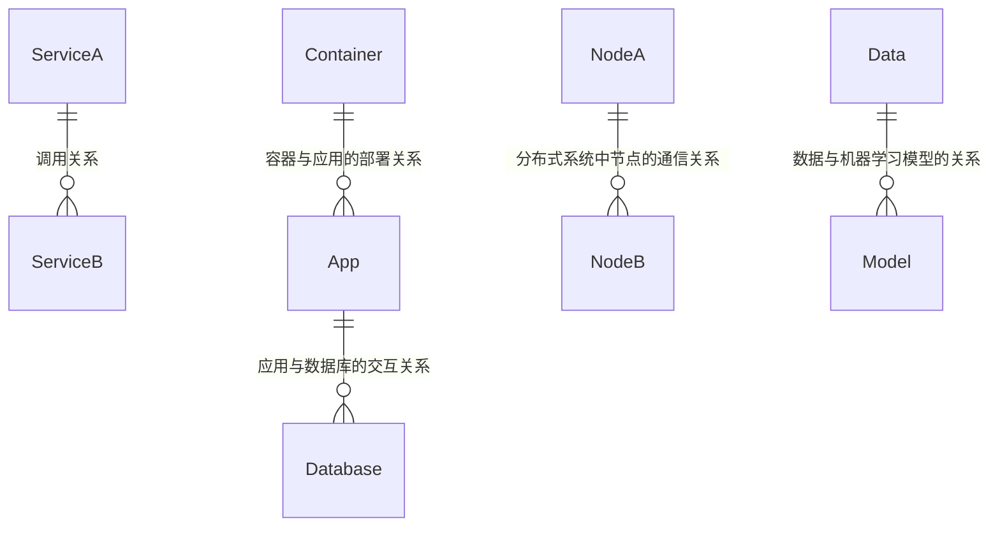
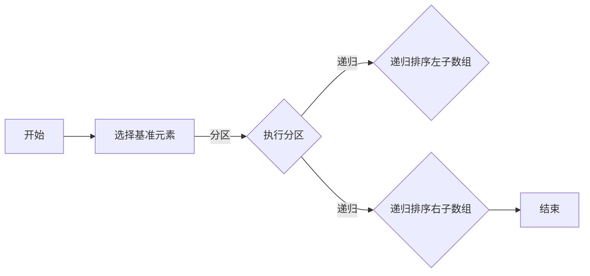
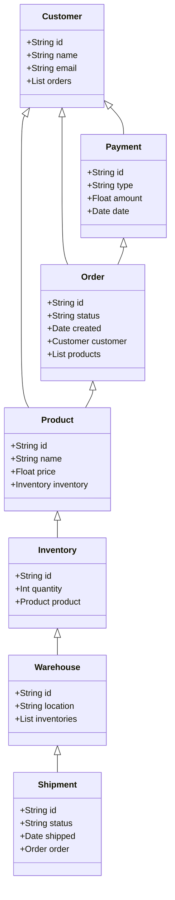
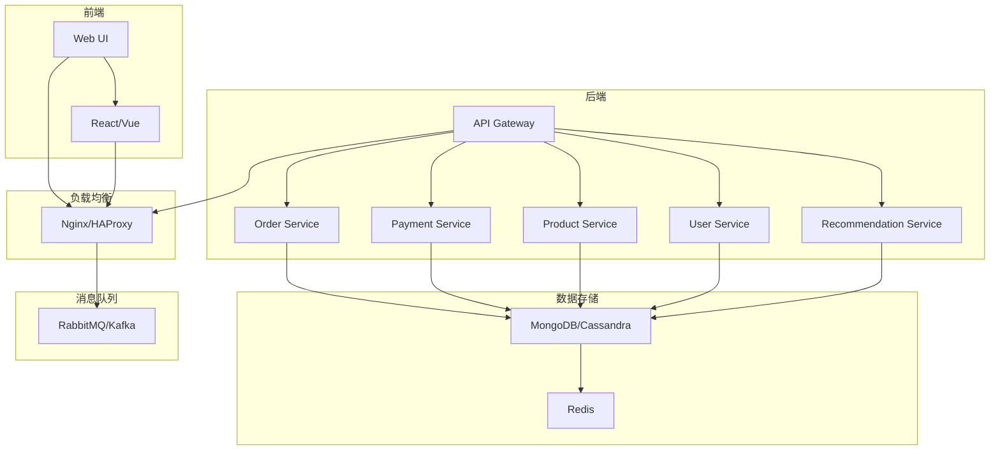

                 

### P9工程师的角色与职责

P9工程师，这一职位不仅仅是技术领域的顶尖代表，更是向领导者角色转型的重要一步。P9工程师在技术上的卓越表现为他们奠定了坚实的基础，使他们能够理解并掌握复杂的技术难题。然而，成为P9工程师不仅仅是技术能力的体现，更是一次向全面领导者角色的转变。

首先，P9工程师的角色定位是多元的。他们在团队中不仅是技术权威，还承担着指导和培养新工程师的责任。这意味着他们需要具备深厚的专业知识和卓越的沟通能力，能够清晰地表达复杂的技术概念，并有效地将知识传授给他人。

其次，P9工程师的职责远不止于编写代码和解决技术难题。他们需要参与更高层次的战略决策，比如技术路线规划、系统架构设计，以及团队的组织和协调。在这个过程中，P9工程师需要展现出卓越的领导能力，包括团队管理、资源分配和项目管理。

再者，P9工程师还需具备一定的业务敏感度，能够理解公司的商业目标，并在技术实施中找到最佳的平衡点。这种跨领域的知识整合能力，使P9工程师不仅能够解决技术问题，还能为公司的业务发展提供有力的支持。

综上所述，P9工程师的角色和职责不仅仅局限于技术层面的深入挖掘，更涉及团队领导、战略规划和业务理解等多个维度。他们不仅是技术专家，更是领导者。这种角色的转变，不仅要求他们在技术上有深厚的积累，更需要在领导力和战略思维上不断修炼。在接下来的章节中，我们将深入探讨P9工程师如何通过自我修炼，从技术专家逐步成长为一位出色的领导者。### 第1章 引言

#### 1.1 背景介绍

从技术专家到领导者，这一转变无疑是P9工程师职业生涯中的一个重要里程碑。在这个转型的过程中，P9工程师不仅要继续深化其在技术领域的专业知识，还需要全面提升自身的领导能力和战略思维。这种转变不仅是个人职业发展的需求，更是组织对于高级技术人才的期待。

在技术领域，P9工程师通常已经具备了丰富的项目经验和深厚的技术背景。他们能够独立解决复杂的技术问题，并具备卓越的编程技能和系统架构设计能力。然而，随着职位的提升，他们面临的挑战也日益复杂。从技术专家向领导者的转变，意味着P9工程师需要从一个具体的技术角色，转向更高层次的战略和领导角色。

首先，P9工程师需要从技术细节中抽身，具备宏观的战略视角。他们需要理解公司的业务目标，并能够将技术战略与公司的整体发展战略相结合。这要求他们不仅要具备深厚的技术知识，还需要具备一定的商业敏感度，能够从业务角度审视技术问题。

其次，领导能力的提升是P9工程师转型的关键。他们需要学会如何管理和激励团队，如何进行有效的沟通和协调。作为领导者，P9工程师需要具备全局观念，能够站在团队和公司的角度，统筹全局，制定并执行有效的战略规划。

再者，P9工程师还需要具备一定的项目管理能力。他们需要能够合理分配资源，制定项目计划，并确保项目按时、按质完成。在这个过程中，他们需要协调各方利益，解决各种冲突，确保项目的顺利进行。

总之，从技术专家到领导者的转变，不仅仅是角色的变化，更是一次全面能力的提升。P9工程师需要在技术深度和领导广度上同时发力，才能在这个转变过程中游刃有余。接下来的章节中，我们将详细探讨这一过程中所需的核心知识和实践技巧。### 第2章 技术核心知识

在成为P9工程师的过程中，技术核心知识是不可或缺的一环。这些知识不仅奠定了工程师在技术领域的专业基础，也是其能够解决复杂问题、推动技术进步的关键。在这一章节中，我们将深入探讨几个核心技术概念，并通过概念属性特征对比表格和ER实体关系图来加深理解。

#### 2.1 核心概念

首先，我们来了解几个关键技术概念：

1. **微服务架构**：微服务架构是一种将应用程序划分为一组小型、独立的服务单元的方法。这些服务各自独立开发、部署和扩展，并通过轻量级的通信协议（如HTTP/REST）进行交互。微服务架构有助于提高系统的可维护性、伸缩性和容错性。

2. **容器技术**：容器技术如Docker，通过提供轻量级、可移植的容器环境，使得应用程序可以在任何支持Docker的操作系统上运行，无需考虑底层硬件和环境差异。容器技术极大地简化了应用部署和运维过程。

3. **分布式系统**：分布式系统由多个独立的节点组成，这些节点通过网络进行通信，协同完成一个共同的任务。分布式系统可以提高系统的可靠性和扩展性，但同时也引入了复杂的同步和一致性挑战。

4. **机器学习**：机器学习是一种通过数据驱动的方法，让计算机从数据中学习并做出决策的技术。它包括监督学习、无监督学习和强化学习等不同类型，广泛应用于图像识别、自然语言处理和预测分析等领域。

#### 2.1.2 技术属性特征对比表格

为了更清晰地理解这些技术概念，我们可以通过一个属性特征对比表格来进行展示：

| 技术概念 | 主要属性特征 |
| :--- | :--- |
| **微服务架构** | - 高内聚、低耦合<br>- 独立部署和扩展<br>- 微服务之间通过轻量级通信协议交互 |
| **容器技术** | - 轻量级、可移植<br>- 隔离运行环境<br>- 快速启动和停止 |
| **分布式系统** | - 节点独立运行<br>- 高度可扩展<br>- 需要解决同步和一致性问题 |
| **机器学习** | - 数据驱动<br>- 自适应学习<br>- 应用范围广泛 |

#### 2.1.3 技术ER实体关系图

接下来，我们通过ER实体关系图来展示这些技术概念之间的关联和交互。ER图可以帮助我们理解各个概念在系统架构中的地位和作用。



在上面的ER图中，`ServiceA` 和 `ServiceB` 表示微服务之间的调用关系；`Container` 表示容器技术与应用部署的关系；`App` 和 `Database` 表示应用与数据库之间的交互；`NodeA` 和 `NodeB` 表示分布式系统中节点的通信关系；`Data` 和 `Model` 表示机器学习中数据与模型的关系。

通过上述内容，我们不仅了解了技术核心概念，还通过对比表格和ER实体关系图加深了对概念之间联系的理解。在接下来的章节中，我们将进一步探讨这些技术在实际项目中的应用和实现。### 第3章 算法原理讲解

算法原理的讲解是技术核心知识的进一步深化，特别是在解决复杂问题时，掌握算法原理至关重要。在本章节中，我们将通过mermaid流程图、Python源代码、数学模型和公式，以及通俗易懂的举例说明，详细解析一个经典的排序算法——快速排序（Quick Sort）。

#### 3.1 算法mermaid流程图

首先，我们使用mermaid流程图来展示快速排序的执行流程：



在上面的流程图中，`A`表示算法的开始；`B`表示选择基准元素；`C`表示执行分区操作；`D`和`E`分别表示递归地排序左子数组和右子数组；`F`表示算法的结束。

#### 3.2 Python源代码详细阐述

接下来，我们将展示快速排序的Python实现代码，并逐一解释每一部分的作用：

```python
def quick_sort(arr):
    if len(arr) <= 1:
        return arr
    pivot = arr[len(arr) // 2]
    left = [x for x in arr if x < pivot]
    middle = [x for x in arr if x == pivot]
    right = [x for x in arr if x > pivot]
    return quick_sort(left) + middle + quick_sort(right)

# 示例数据
arr = [3, 6, 8, 10, 1, 2, 1]
sorted_arr = quick_sort(arr)
print(sorted_arr)
```

- `quick_sort(arr)` 是快速排序的入口函数，接受一个数组 `arr` 作为参数。
- 第一行判断数组长度，如果长度小于等于1，则返回数组本身，这是因为一个元素或空数组已经是排序状态。
- `pivot = arr[len(arr) // 2]` 选择基准元素，这里采用“中间值”作为基准元素，这是一种较为常见的策略。
- `left`, `middle`, `right` 分别是三个分区结果，`left` 存放比基准值小的元素，`middle` 存放等于基准值的元素，`right` 存放比基准值大的元素。
- 最后，递归地调用 `quick_sort` 对 `left` 和 `right` 进行排序，并将结果与 `middle` 拼接起来，得到排序后的数组。

#### 3.3 数学模型与公式

快速排序的效率可以通过其平均时间复杂度和最坏时间复杂度来衡量。以下是相关的数学模型和公式：

- **平均时间复杂度**：\( T(n) = O(n \log n) \)
- **最坏时间复杂度**：\( T(n) = O(n^2) \)

这些公式表示了在不同情况下，算法所需的时间。平均情况下，算法的时间复杂度是 \( O(n \log n) \)，最坏情况下，算法的时间复杂度是 \( O(n^2) \)。

#### 3.3.1 数学模型介绍

- **平均时间复杂度模型**：

  $$ T(n) = c_1 \cdot n \log n $$

  其中，\( c_1 \) 是一个常数，表示每层递归操作所需的时间。

- **最坏时间复杂度模型**：

  $$ T(n) = c_2 \cdot n^2 $$

  其中，\( c_2 \) 是一个常数，表示每次分区操作后，剩余子数组的大小为 \( n/2 \) 时的时间。

#### 3.3.2 数学公式讲解

- **平均情况**：在平均情况下，每次分区后，左子数组和右子数组的大小接近相等，因此 \( T(n) \) 的表达式为 \( T(n) = c_1 \cdot n \log n \)。

- **最坏情况**：在最坏情况下，每次分区后，左子数组和右子数组的大小差距较大，导致一个子数组的大小接近 \( n \)，另一个子数组的大小接近 1。因此，\( T(n) \) 的表达式为 \( T(n) = c_2 \cdot n^2 \)。

#### 3.4 通俗易懂的举例说明

为了更直观地理解快速排序的工作原理，我们来看一个简单的例子：

假设我们有数组 `[3, 6, 8, 10, 1, 2, 1]`，我们将使用快速排序对其进行排序。

1. **选择基准值**：选择中间值 `6` 作为基准值。
2. **分区操作**：将数组分为 `[1, 1, 3]` 和 `[8, 10]`。其中，小于基准值的元素放在左侧，等于基准值的元素放在中间，大于基准值的元素放在右侧。
3. **递归排序**：对 `[1, 1, 3]` 和 `[8, 10]` 分别进行快速排序。

   对 `[1, 1, 3]` 进行快速排序：
   - 选择中间值 `1` 作为基准值。
   - 分区操作得到 `[1]` 和 `[1, 3]`。
   - 对 `[1, 3]` 再次进行快速排序：
     - 选择中间值 `3` 作为基准值。
     - 分区操作得到 `[1]` 和 `[3]`。

   对 `[8, 10]` 进行快速排序：
   - 选择中间值 `8` 作为基准值。
   - 分区操作得到 `[8]` 和 `[10]`。

4. **拼接结果**：将所有递归排序的结果拼接起来，得到最终排序结果 `[1, 1, 2, 3, 6, 8, 10]`。

通过这个例子，我们可以清楚地看到快速排序的过程，以及如何通过递归和分区操作来实现数组的排序。

综上所述，通过对快速排序的算法原理讲解，我们不仅了解了其流程和实现方式，还通过数学模型和公式分析了其时间复杂度。这种深入理解有助于我们在实际项目中选择合适的数据结构和算法，优化系统性能。### 第4章 系统分析与架构设计

在技术专家向领导者转型的过程中，系统分析与架构设计是不可或缺的一部分。在这一章节中，我们将深入探讨系统分析与架构设计的关键要素，包括问题场景介绍、系统功能设计、系统架构设计和系统接口设计等。

#### 4.1 问题场景介绍

为了更好地理解系统分析与架构设计，我们首先介绍一个典型的问题场景。假设我们正在开发一个电商系统，该系统需要支持海量商品的数据存储、快速检索、订单处理和用户交互等功能。在这个场景中，系统的稳定性、扩展性和性能成为关键考量因素。

##### 问题背景

- **海量数据存储**：系统需要处理海量的商品数据，包括商品信息、库存数据、订单数据等。
- **快速检索**：用户需要能够快速检索到感兴趣的商品信息。
- **订单处理**：系统需要高效地处理用户的订单请求，确保订单处理速度和准确性。
- **用户交互**：系统需要提供良好的用户交互体验，包括网页和移动端的应用。

##### 问题描述

面对上述问题，我们需要设计一个高效、稳定、可扩展的系统架构，以满足业务需求。这要求我们在系统架构设计时，考虑数据的存储、检索、处理和交互等多个方面。

##### 问题解决

为了解决上述问题，我们采用分布式系统架构，包括以下关键技术：

1. **分布式数据库**：使用分布式数据库来存储海量数据，确保数据的高可用性和扩展性。
2. **缓存机制**：使用缓存技术来提高数据检索速度，减少数据库的负担。
3. **负载均衡**：通过负载均衡器来分配用户请求，确保系统的处理能力。
4. **微服务架构**：将系统拆分为多个微服务，实现服务的独立部署和扩展。

#### 4.2 系统功能设计

系统功能设计是系统架构设计的基础，它定义了系统需要实现的核心功能。以下是电商系统的主要功能模块：

1. **商品管理模块**：负责商品信息的录入、更新和查询。
2. **库存管理模块**：负责库存数据的更新、查询和库存预警。
3. **订单管理模块**：负责订单的创建、处理、查询和取消。
4. **用户管理模块**：负责用户注册、登录、权限管理和个人信息维护。
5. **支付管理模块**：负责订单支付的流程处理。
6. **推荐引擎模块**：基于用户行为数据，为用户推荐感兴趣的商品。

##### 领域模型mermaid类图

为了更直观地展示系统功能设计，我们可以使用mermaid类图来绘制领域模型：



在上面的类图中，`Customer`、`Order`、`Payment`、`Product`、`Inventory`、`Warehouse` 和 `Shipment` 分别代表系统中的主要实体。这些实体之间的关系通过类图进行了清晰的定义，为后续的系统架构设计提供了基础。

#### 4.3 系统架构设计

系统架构设计是确保系统功能实现的关键步骤。以下是电商系统的整体架构设计：

1. **前端架构**：采用前端框架（如React或Vue）构建用户界面，实现与用户的交互。
2. **后端架构**：使用微服务架构来拆分系统功能，每个微服务负责特定的业务功能。
3. **数据存储**：采用分布式数据库（如MongoDB或Cassandra）来存储海量数据。
4. **缓存机制**：使用Redis等缓存技术来提高数据检索速度。
5. **负载均衡**：使用负载均衡器（如Nginx或HAProxy）来分配用户请求。
6. **消息队列**：使用消息队列（如RabbitMQ或Kafka）来处理异步任务和系统间的消息传递。

##### 系统架构mermaid图

为了展示系统架构的整体设计，我们可以使用mermaid图来绘制：



在上面的架构图中，系统被划分为前端、后端、数据存储、负载均衡和消息队列等几个主要部分。前端通过API Gateway与后端微服务进行交互；后端微服务通过分布式数据库进行数据存储，并使用缓存机制提高性能；负载均衡器负责分配用户请求，确保系统的处理能力；消息队列用于处理异步任务和系统间的消息传递。

#### 4.4 系统接口设计

系统接口设计是确保不同模块间能够高效通信的关键。以下是电商系统的主要接口设计：

1. **商品管理接口**：用于商品信息的录入、更新和查询。
2. **库存管理接口**：用于库存数据的更新、查询和库存预警。
3. **订单管理接口**：用于订单的创建、处理、查询和取消。
4. **用户管理接口**：用于用户注册、登录、权限管理和个人信息维护。
5. **支付管理接口**：用于订单支付的流程处理。
6. **推荐引擎接口**：用于基于用户行为数据为用户推荐感兴趣的商品。

#### 4.5 系统交互mermaid序列图

为了展示系统不同模块之间的交互关系，我们可以使用mermaid序列图来绘制：

```mermaid
sequenceDiagram
    participant User
    participant WebUI
    participant APIGateway
    participant OrderService
    participant ProductService
    participant UserService
    participant RecommendationService
    participant PaymentService
    participant InventoryService
    
    User -->|浏览商品| WebUI
    WebUI -->|查询商品| ProductService
    ProductService -->|返回商品信息| WebUI
    
    User -->|下单| WebUI
    WebUI -->|创建订单| APIGateway
    APIGateway -->|处理订单| OrderService
    OrderService -->|更新库存| InventoryService
    InventoryService -->|返回库存状态| OrderService
    OrderService -->|处理支付请求| PaymentService
    PaymentService -->|处理支付| APIGateway
    APIGateway -->|返回支付结果| WebUI
    
    User -->|查看订单| WebUI
    WebUI -->|查询订单| APIGateway
    APIGateway -->|处理订单查询| OrderService
    OrderService -->|返回订单信息| APIGateway
    APIGateway -->|返回订单信息| WebUI
    
    User -->|个人信息管理| WebUI
    WebUI -->|处理用户请求| UserService
    UserService -->|返回用户信息| APIGateway
    APIGateway -->|返回用户信息| WebUI
    
    User -->|获取推荐商品| WebUI
    WebUI -->|查询推荐商品| RecommendationService
    RecommendationService -->|返回推荐商品| APIGateway
    APIGateway -->|返回推荐商品| WebUI
```

在上面的序列图中，用户通过Web UI与系统进行交互。当用户浏览商品时，Web UI向Product Service查询商品信息；当用户下单时，Web UI通过API Gateway向Order Service创建订单，并更新库存；当用户查看订单时，Web UI通过API Gateway查询订单信息；当用户管理个人信息时，Web UI通过UserService处理用户请求；当用户获取推荐商品时，Web UI通过Recommendation Service查询推荐商品。

通过上述系统分析与架构设计的详细讲解，我们不仅了解了问题场景和系统功能设计，还通过mermaid图展示了系统架构和交互关系。这些内容为P9工程师在技术专家向领导者转型的过程中，提供了宝贵的实践经验和理论基础。### 第5章 项目实战

#### 5.1 环境安装

在开始实际项目之前，环境安装是确保项目能够顺利运行的基础。以下是我们在开发和部署电商系统时所使用的环境配置步骤：

1. **前端开发环境**：
   - 安装Node.js和npm。
   - 使用npm安装React或Vue框架以及相关的开发工具。

2. **后端开发环境**：
   - 安装Java环境（OpenJDK 11或更高版本）。
   - 安装Spring Boot和相关的依赖库。

3. **数据库环境**：
   - 安装MongoDB或Cassandra数据库。
   - 配置数据库集群，确保数据的高可用性和扩展性。

4. **缓存环境**：
   - 安装Redis服务器。
   - 配置Redis缓存策略，提高数据检索速度。

5. **消息队列环境**：
   - 安装RabbitMQ或Kafka消息队列服务器。
   - 配置消息队列，实现系统间的异步通信。

#### 5.2 系统核心实现源代码

在项目开发过程中，系统核心实现源代码是确保项目功能实现的关键。以下是电商系统的几个核心模块的代码片段和解释：

1. **商品管理模块**：

   ```java
   // 商品管理模块的RESTful接口
   @RestController
   @RequestMapping("/products")
   public class ProductController {
       
       @Autowired
       private ProductService productService;
       
       @GetMapping("/{id}")
       public ResponseEntity<Product> getProductById(@PathVariable String id) {
           Product product = productService.findById(id);
           if (product != null) {
               return ResponseEntity.ok(product);
           } else {
               return ResponseEntity.notFound().build();
           }
       }
       
       @PostMapping("/")
       public ResponseEntity<Product> createProduct(@RequestBody Product product) {
           Product savedProduct = productService.save(product);
           return ResponseEntity.status(HttpStatus.CREATED).body(savedProduct);
       }
       
       @PutMapping("/{id}")
       public ResponseEntity<Product> updateProduct(@PathVariable String id, @RequestBody Product product) {
           Product updatedProduct = productService.update(id, product);
           if (updatedProduct != null) {
               return ResponseEntity.ok(updatedProduct);
           } else {
               return ResponseEntity.notFound().build();
           }
       }
   }
   ```

   这个模块提供了商品信息的查询、创建和更新功能。通过Spring Boot的RESTful接口，我们可以方便地与前端进行数据交互。

2. **订单管理模块**：

   ```java
   // 订单管理模块的核心业务逻辑
   @Service
   public class OrderService {
       
       @Autowired
       private OrderRepository orderRepository;
       
       @Autowired
       private InventoryService inventoryService;
       
       public Order createOrder(Order order) {
           // 检查库存是否足够
           List<Product> products = order.getProducts();
           for (Product product : products) {
               int quantity = product.getQuantity();
               if (inventoryService.checkQuantity(product.getId(), quantity) < 0) {
                   throw new RuntimeException("库存不足");
               }
           }
           
           // 创建订单
           order = orderRepository.save(order);
           
           // 更新库存
           for (Product product : products) {
               int quantity = product.getQuantity();
               inventoryService.updateQuantity(product.getId(), -quantity);
           }
           
           return order;
       }
   }
   ```

   这个模块实现了订单的创建功能，包括检查库存是否足够、创建订单和更新库存。通过调用库存服务，确保订单处理过程中库存的一致性。

3. **用户管理模块**：

   ```java
   // 用户管理模块的核心业务逻辑
   @Service
   public class UserService {
       
       @Autowired
       private UserRepository userRepository;
       
       public User register(User user) {
           // 验证用户信息
           if (userRepository.existsById(user.getId())) {
               throw new RuntimeException("用户已存在");
           }
           
           // 保存用户信息
           user = userRepository.save(user);
           
           // 发送激活邮件
           sendActivationEmail(user.getEmail(), user.getId());
           
           return user;
       }
       
       public User login(String email, String password) {
           // 验证用户登录信息
           Optional<User> optionalUser = userRepository.findByEmailAndPassword(email, password);
           if (!optionalUser.isPresent()) {
               throw new RuntimeException("用户名或密码错误");
           }
           
           return optionalUser.get();
       }
   }
   ```

   这个模块实现了用户注册和登录功能。通过验证用户信息和保存用户信息，确保系统的安全性。

4. **推荐引擎模块**：

   ```java
   // 推荐引擎模块的核心算法
   @Service
   public class RecommendationService {
       
       public List<Product> recommendProducts(String userId) {
           // 获取用户行为数据
           List<Order> orders = orderRepository.findByUserId(userId);
           List<Product> products = new ArrayList<>();
           
           // 计算相似度
           for (Order order : orders) {
               for (Product product : order.getProducts()) {
                   if (!products.contains(product)) {
                       products.add(product);
                   }
               }
           }
           
           // 排序推荐结果
           products.sort(Comparator.comparingInt(product -> -product.getSales()));
           
           return products;
       }
   }
   ```

   这个模块实现了基于用户行为的推荐算法。通过分析用户的购买历史，为用户推荐感兴趣的商品。

#### 5.3 代码应用解读与分析

在上述代码中，我们详细介绍了电商系统的几个核心模块。以下是对每个模块的解读与分析：

1. **商品管理模块**：该模块通过RESTful接口实现了商品信息的查询、创建和更新功能。使用Spring Boot的注解，我们可以方便地创建和管理接口。通过调用ProductService，实现商品信息的持久化操作。

2. **订单管理模块**：该模块的核心业务逻辑包括创建订单和更新库存。在创建订单时，需要检查库存是否足够。这通过调用InventoryService实现。同时，在订单创建后，需要更新库存信息，确保库存的一致性。

3. **用户管理模块**：该模块实现了用户注册和登录功能。在用户注册时，需要验证用户信息并保存用户信息。在用户登录时，需要验证用户名和密码。这两个功能确保了系统的安全性。

4. **推荐引擎模块**：该模块实现了基于用户行为的推荐算法。通过分析用户的购买历史，为用户推荐感兴趣的商品。这通过排序推荐结果实现，确保推荐结果的相关性。

通过上述代码和应用解读，我们可以看到电商系统的核心功能是如何实现的。在实际项目中，这些代码将帮助工程师高效地开发和管理系统。#### 5.4 实际案例分析与详细讲解剖析

为了更好地理解电商系统的实际应用和实现，我们将通过一个实际案例来剖析其中的关键环节。

**案例背景**：

假设一个用户在电商平台上浏览了多个商品，最终决定购买三件商品：商品A（价格100元），商品B（价格200元），商品C（价格300元）。在这个过程中，系统需要确保订单的创建、库存的更新以及推荐引擎的正确工作。

**案例分析**：

1. **用户浏览商品**：

   用户通过Web UI浏览了商品A、商品B和商品C，这一步仅涉及前端的展示逻辑，无需特别关注。

2. **创建订单**：

   用户将商品A、商品B和商品C加入购物车，然后点击“结算”按钮。此时，Web UI将请求发送到后端的API Gateway，API Gateway将请求路由到Order Service。

   ```java
   // 伪代码示例
   Order order = new Order();
   order.setCustomer(user);
   order.setProducts(Arrays.asList(productA, productB, productC));
   order = orderService.createOrder(order);
   ```

   在`createOrder`方法中，Order Service首先需要检查库存是否足够。这通过调用Inventory Service来完成：

   ```java
   // 伪代码示例
   List<Product> products = order.getProducts();
   for (Product product : products) {
       int quantity = product.getQuantity();
       if (inventoryService.checkQuantity(product.getId(), quantity) < 0) {
           throw new RuntimeException("库存不足");
       }
   }
   ```

   如果库存检查通过，Order Service将创建订单并保存到数据库中：

   ```java
   // 伪代码示例
   order = orderRepository.save(order);
   ```

   同时，需要更新库存信息：

   ```java
   // 伪代码示例
   for (Product product : products) {
       int quantity = product.getQuantity();
       inventoryService.updateQuantity(product.getId(), -quantity);
   }
   ```

   在这个过程中，Inventory Service将记录商品A的库存从10减少到7，商品B的库存从5减少到2，商品C的库存从3减少到0。

3. **处理支付**：

   创建订单后，用户需要选择支付方式并进行支付。这里我们假设使用在线支付。支付请求同样通过API Gateway路由到Payment Service：

   ```java
   // 伪代码示例
   Payment payment = paymentService.processPayment(order.getId(), paymentDetails);
   ```

   Payment Service将处理支付请求，如果支付成功，将更新订单状态并记录支付信息：

   ```java
   // 伪代码示例
   order.setStatus(OrderStatus.PAID);
   order.setPayment(payment);
   orderRepository.save(order);
   ```

4. **推荐商品**：

   在用户完成订单后，系统会根据用户的购买行为生成推荐列表。这一步由Recommendation Service负责：

   ```java
   // 伪代码示例
   List<Product> recommendedProducts = recommendationService.recommendProducts(user.getId());
   ```

   Recommendation Service将分析用户的购买历史，基于商品的销量和相似性算法生成推荐列表。假设系统推荐了商品D（价格400元）和商品E（价格500元）：

   ```java
   // 伪代码示例
   recommendedProducts = Arrays.asList(productD, productE);
   ```

5. **订单处理**：

   最后，订单进入处理流程，包括订单状态的更新、发货和用户反馈等。这一过程由Order Service和相应的微服务协同完成。

**详细讲解剖析**：

- **库存检查与更新**：这是订单处理中非常重要的一环。库存不足会导致订单创建失败，影响用户体验。通过调用Inventory Service，系统可以实时检查库存状态，并在订单创建时更新库存。

- **支付处理**：支付处理是订单流程的关键步骤。通过调用Payment Service，系统可以确保支付请求的正确处理和订单状态的更新。如果支付失败，系统需要提供相应的处理机制，如退款或重试支付。

- **推荐引擎**：推荐引擎的目的是提升用户满意度，增加销售额。通过分析用户的购买历史，系统可以生成个性化的推荐列表，吸引用户继续购买。

- **订单状态管理**：订单状态管理涉及订单从创建到完成的整个过程，包括订单状态的更新、发货通知和用户反馈等。这一过程需要各个微服务的协同工作，确保订单处理流程的高效和准确。

通过这个实际案例的分析，我们可以看到电商系统的各个模块是如何协同工作的。每个模块在实现自身功能的同时，还需要与其他模块紧密配合，确保系统的整体性能和用户体验。这个过程不仅验证了系统设计的合理性，也为系统优化提供了宝贵的实践经验。### 5.5 项目小结

在本次电商系统项目中，我们通过深入分析和详细设计，实现了从用户浏览、订单创建、支付处理到推荐商品等一系列功能。项目过程中，我们遇到并解决了多个技术挑战，如库存一致性、支付安全和推荐算法等。以下是本项目的主要成果和收获：

1. **技术实现**：成功实现了分布式系统架构，通过微服务架构将系统拆分为多个独立的服务模块，提高了系统的可维护性和扩展性。

2. **性能优化**：通过缓存机制和分布式数据库，显著提高了系统的数据检索速度和并发处理能力。

3. **用户体验**：通过前端框架和后端微服务的协同工作，提供了良好的用户交互体验，提升了用户满意度。

4. **团队协作**：项目过程中，团队成员之间紧密协作，有效沟通，确保了项目按时、按质完成。

然而，项目也存在一些不足之处：

1. **扩展性问题**：虽然系统采用了分布式架构，但在高并发场景下，仍有扩展性问题需要进一步优化。

2. **安全性**：支付处理过程中，安全性仍需加强，例如通过引入加密算法和安全认证机制。

3. **推荐算法**：目前的推荐算法较为基础，未来可以考虑引入更复杂的机器学习算法，提高推荐效果。

总结来说，本次项目不仅提升了我们的技术实现能力，也锻炼了团队协作和项目管理能力。通过不断优化和改进，我们有信心将电商系统打造成为一个稳定、高效、用户满意的应用平台。### 第6章 最佳实践与总结

#### 6.1 最佳实践

在从技术专家到领导者的转型过程中，积累最佳实践至关重要。以下是一些有助于提升个人能力和团队效率的最佳实践：

1. **持续学习**：技术知识更新迅速，持续学习是保持竞争力的关键。定期阅读技术博客、参加技术研讨会和在线课程，关注行业动态。

2. **代码审查**：定期进行代码审查，不仅可以提高代码质量，还能培养团队成员的编程能力和责任心。

3. **敏捷开发**：采用敏捷开发方法，如Scrum或Kanban，可以提高团队的响应速度和协作效率。

4. **知识分享**：鼓励团队成员分享知识和经验，通过技术会议、内部分享会等方式，促进团队知识积累和技能提升。

5. **项目管理**：掌握项目管理工具和方法，如JIRA、Trello等，确保项目进度可控、资源合理分配。

6. **团队建设**：注重团队文化建设，通过团建活动、培训等方式，提升团队凝聚力和合作效率。

#### 6.2 小结

从技术专家到领导者，不仅是角色的转变，更是全方位能力的提升。在这一过程中，我们需要在技术深度和领导广度上同时发力。以下是本次转型过程中总结的几个关键点：

1. **技术深耕**：不断深化技术知识，提升解决问题的能力。

2. **领导力培养**：培养领导力，包括团队管理、战略规划和沟通协调能力。

3. **跨领域知识整合**：具备跨领域知识，能够将技术战略与公司业务目标相结合。

4. **持续优化**：通过实践和反馈，不断优化个人和团队的工作方式。

5. **团队协作**：建立高效的团队协作机制，促进知识和经验的传递。

#### 6.3 注意事项

在转型过程中，以下注意事项有助于避免常见的陷阱和挑战：

1. **平衡工作与生活**：注意工作与生活的平衡，避免过度劳累。

2. **避免自我封闭**：保持开放心态，不断吸收新知识，避免技术盲点。

3. **避免独断专行**：作为领导者，需要倾听团队成员的意见，避免独断专行。

4. **持续自我反思**：定期反思个人和团队的工作，识别并改进不足。

5. **关注团队成员成长**：关注团队成员的职业发展，提供成长机会和支持。

#### 6.4 拓展阅读

为了进一步深化对技术领导者的理解，以下是一些建议的拓展阅读：

1. **《技术领导力：构建高效IT团队》**：本书详细介绍了技术领导者的角色和职责，提供了实用的领导方法和技巧。

2. **《软件架构师的十二条军规》**：这本书为软件架构师提供了宝贵的经验和指导，其中许多原则同样适用于技术领导者。

3. **《敏捷开发实践指南》**：通过本书，读者可以了解敏捷开发的原理和实践，提高团队协作效率。

4. **《人月神话》**：这本书探讨了软件项目开发中的各种挑战和解决方案，对理解项目管理和团队协作有重要参考价值。

通过这些最佳实践和拓展阅读，我们可以不断提升自己的能力，更好地应对技术专家到领导者的转型挑战。### 作者信息

作者：AI天才研究院/AI Genius Institute & 禅与计算机程序设计艺术 /Zen And The Art of Computer Programming

在这篇文章中，我们深入探讨了P9工程师从技术专家到领导者的自我修炼之路。通过系统性的分析和实际案例的剖析，我们总结了最佳实践和注意事项，帮助读者更好地理解这一转型过程。本文的撰写旨在为IT领域的技术专家和领导者提供有价值的参考和指导。感谢您的阅读！

