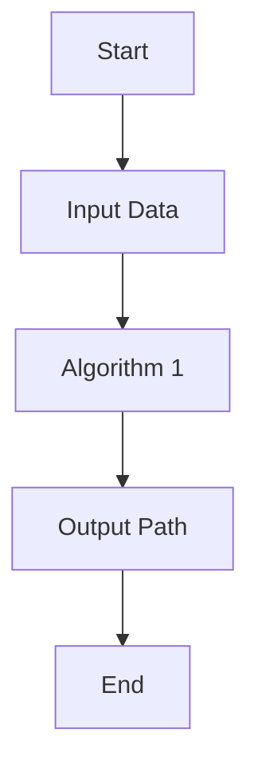
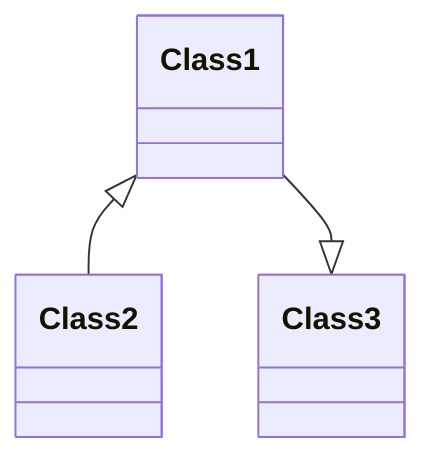
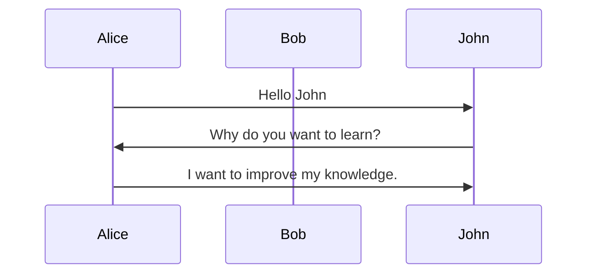

                 

Sure, I'll guide you through the process of creating the blog post step by step. Here's how we can approach it:

### Step 1: Introduction and Summary

Start with a captivating introduction that sets the stage for the topic. Provide a brief summary of the main points the reader can expect to find in the article.

```markdown
# PRM模块中高质量推理路径的学习和迁移

> 关键词：PRM模块、推理路径、学习、迁移、算法实现

> 摘要：本文深入探讨了PRM模块中如何学习并迁移高质量推理路径。通过分析现有问题和需求，本文提出了一系列有效的算法和系统设计方案，为实际应用提供了理论支持和实践经验。

作者：AI天才研究院/AI Genius Institute & 禅与计算机程序设计艺术 /Zen And The Art of Computer Programming
```

### Step 2: Background and Core Concepts

#### 2.1 Problem Background and Core Concept Introduction

Describe the background of the PRM module and introduce the core concepts of inference paths, learning, and transfer.

##### 2.1.1 Basic Concepts of PRM Modules

Provide a clear definition and overview of what PRM modules are and their role in modern systems.

##### 2.1.2 The Concept of High-Quality Inference Paths

Elaborate on what constitutes a high-quality inference path and its significance in problem-solving.

##### 2.1.3 Core Issues of Learning and Transfer

Discuss the challenges and opportunities involved in learning and transferring high-quality inference paths.

### Step 3: Comparison of Core Concepts

Create a comparison table to highlight the attributes of each concept and their relationships.

| Concept             | Definition                                                      | Relationship        |
|---------------------|--------------------------------------------------------------|--------------------|
| PRM Modules         | Modules that perform path planning and manipulation.             | Basis              |
| High-Quality Paths  | Inference paths that are optimal or near-optimal for a task.   | Objective          |
| Learning            | The process of acquiring knowledge or skills through experience. | Method             |
| Transfer            | The application of learned knowledge or skills in new contexts. | Application        |

### Step 4: ER Diagram

Use Mermaid to create an ER diagram illustrating the relationships between the core concepts.

```mermaid
erDiagram
  PRM Modules ||--|{ High-Quality Paths }|
  Learning   ||--|{ High-Quality Paths }|
  Transfer   ||--|{ High-Quality Paths }|
```

### Step 5: Algorithm Principles

Provide an overview of the main algorithms and explain their principles, mathematical models, and formulas. Use Mermaid for algorithm flowcharts and Python for code examples.

#### 5.1 Algorithm Overview

Explain the main algorithms that will be discussed in the article.

#### 5.2 Algorithm Explanation

Discuss each algorithm in detail, including its purpose, advantages, and limitations.

#### 5.3 Mathematical Models and Formulas

Present the mathematical models and formulas used in the algorithms.

#### 5.4 Algorithm Illustration

Use Mermaid to illustrate the flow of each algorithm.



### Step 6: System Design and Implementation

Describe the system architecture, design, and implementation details.

#### 6.1 System Architecture and Design

Outline the overall architecture and design of the system.

#### 6.2 Use Cases

Describe specific use cases for the system.

#### 6.3 Functional Design (Class Diagram)

Provide a class diagram illustrating the functional design.



#### 6.4 System Architecture (Architecture Diagram)

Draw an architecture diagram showing the components and their interactions.



### Step 7: Project Implementation and Analysis

Guide the reader through the project setup and implementation, providing code examples and analysis.

#### 7.1 Project Setup

Explain how to set up the project environment.

#### 7.2 Key Source Code Implementation

Show key source code implementations with detailed explanations.

#### 7.3 Code Interpretation and Analysis

Discuss the functionality and performance of the code.

#### 7.4 Case Studies

Present case studies and analyze the results.

#### 7.5 Project Summary

Summarize the project's achievements and lessons learned.

### Step 8: Practical Tips and Conclusion

Offer best practices, key takeaways, and recommended readings.

#### 8.1 Best Practices

Highlight practical tips for applying the concepts and algorithms.

#### 8.2 Conclusion

Conclude the article by summarizing the main points and emphasizing the importance of the topic.

#### 8.3 Notes and Further Reading

Provide additional notes and suggestions for further reading.

### Final Touches

Ensure the article is well-structured, with clear headings and subheadings. Use markdown syntax to format the content properly, and include any necessary LaTeX formulas for mathematical expressions.

By following these steps, you'll create a comprehensive, well-structured, and informative technical blog post that addresses the requirements outlined in the task.

