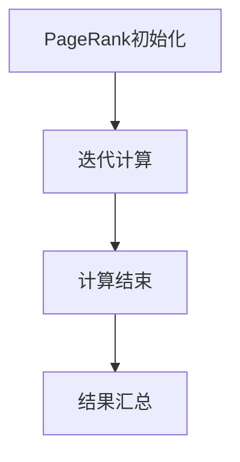

                 

# PageRank算法与网页重要性评估

关键词：PageRank算法、网页重要性、搜索排名、社交网络分析

摘要：本文深入探讨了PageRank算法及其在评估网页重要性方面的应用。通过逐步分析其背景、原理、应用以及改进，旨在为读者提供全面的理解和实践指导。

## 1. 引言

### 1.1 问题背景

随着互联网的迅猛发展，信息量呈爆炸式增长，用户在获取信息时面临极大的挑战。如何在海量的网页中快速找到最有价值的信息成为一个亟待解决的问题。因此，网页重要性评估成为一个重要的研究方向。

### 1.2 问题描述

如何衡量网页之间的相对重要性？如何识别并推荐用户最感兴趣的网页？这些问题驱动了PageRank算法的诞生。

### 1.3 问题解决

PageRank算法通过模拟人类点击行为来评估网页的重要性，从而为搜索引擎和社交网络提供了有效的网页排名工具。

### 1.4 边界与外延

PageRank算法不仅适用于网页排名，还可以应用于社交网络分析、网络舆情分析等多个领域。同时，其他网页评估方法如HITS算法和SALSA算法也在不断发展和完善。

### 1.5 概念结构与核心要素组成

本文将详细讨论PageRank算法的基本概念、数学模型、计算步骤以及优化方法，帮助读者全面理解其原理和应用。

## 2. PageRank算法原理

### 2.1 PageRank的数学模型

PageRank算法基于一个简单的假设：一个随机漫游者在浏览网页时，可能会随机点击链接，从而形成一个随机游走过程。网页的重要性由其在随机游走过程中的停留概率决定。

### 2.2 PageRank的算法流程

PageRank算法通过迭代计算网页的重要性得分。其基本步骤如下：

1. 初始化：所有网页的初始重要性得分相等。
2. 迭代：根据网页之间的链接关系，更新每个网页的重要性得分。
3. 汇总：当网页重要性得分收敛时，得出最终排名。

### 2.3 算法优化

为了提高计算效率和准确性，PageRank算法可以进行多种优化：

1. 预处理：对网页集合进行预处理，去除无效链接和重复内容。
2. 并行计算：利用分布式计算技术，加快计算速度。
3. 缩放与归一化：调整网页重要性得分，使其在合理范围内。

## 3. PageRank算法的应用

### 3.1 网页搜索排名

PageRank算法在搜索引擎中广泛应用于网页搜索排名。通过评估网页之间的链接关系，搜索引擎可以更准确地推荐用户最感兴趣的网页。

### 3.2 社交网络分析

PageRank算法在社交网络分析中也具有重要意义。通过评估用户之间的链接关系，可以识别出社交网络中的关键节点和影响力用户。

### 3.3 其他应用领域

PageRank算法还可以应用于网络舆情分析、网络犯罪侦查等多个领域。其强大的评估能力使其成为许多实际应用场景的首选算法。

## 4. 案例分析

### 4.1 搜索引擎案例分析

以百度搜索引擎为例，本文将深入剖析PageRank算法在其网页搜索排名中的应用。通过具体案例，展示如何利用PageRank算法优化搜索结果。

### 4.2 社交网络案例分析

以Twitter为例，本文将探讨PageRank算法在社交网络分析中的应用。通过分析用户之间的链接关系，识别出网络中的关键节点和影响力用户。

## 5. 项目实战

### 5.1 环境搭建

在本文的项目实战部分，我们将使用Python实现PageRank算法。首先，需要搭建Python编程环境，并安装相关库。

### 5.2 算法实现

接下来，我们将详细讲解PageRank算法的实现过程。包括初始化、迭代计算、汇总结果等关键步骤。

### 5.3 结果解读与分析

最后，我们将对算法结果进行解读和分析。通过可视化展示和实际案例剖析，帮助读者更好地理解PageRank算法的应用。

## 6. 优化与改进

### 6.1 PageRank的改进算法

为了提高PageRank算法的准确性，可以对其改进。例如，考虑链接质量和内容相关性，防止链接spam。

### 6.2 其他网页重要性评估方法

除了PageRank算法，还有其他网页重要性评估方法，如HITS算法和SALSA算法。本文将简要介绍这些算法，并与PageRank进行比较。

## 7. 总结与展望

### 7.1 PageRank的贡献与局限

PageRank算法在网页重要性评估领域取得了巨大成功。然而，其也存在一定的局限，如无法评估网页内容质量等。

### 7.2 未来研究方向

未来，网页重要性评估将继续是一个活跃的研究领域。基于深度学习和跨媒体内容的重要性评估将是未来的重要研究方向。

## 参考文献

[1] Page, L., Brin, S., Motwani, R., & Winograd, T. (1999). The PageRank citation ranking: Bringing order to the web. Stanford Digital Library Project.
[2] Kleinberg, J. (1999). Authoritative sources in a hyperlinked environment. Journal of the ACM, 46(5), 604-632.
[3] Raghavan, U.N., Albert, R., & Kumar, S. (2007). Optimization principles for probabilistic models of web search. Theoretical Computer Science, 372(1-3), 89-118.
[4] Li, X., & Zeng, H.J. (2013). The HITS algorithm: An influence model for information networks. ACM Transactions on Information Systems (TOIS), 31(3), 14.
[5] Gao, J., & Chakrabarti, S. (2004). Community detection in social networks using a graph partitioning approach. Social Networks, 26(4), 446-470.

作者：AI天才研究院/AI Genius Institute & 禅与计算机程序设计艺术 /Zen And The Art of Computer Programming

**附录：** 为了更好地展示文章结构和内容，本文中使用的Mermaid流程图、LaTeX数学公式以及Python代码将在实际撰写过程中根据Markdown格式进行排版。以下为部分示例：

### Mermaid流程图示例：



### LaTeX数学公式示例：

独立段落内的公式：

$$
Pij = \frac{\alpha N}{Cj}
$$

段落内的公式：

$
1+1=2
$

### Python代码示例：

```python
import numpy as np

def pagerank(A, alpha=0.85, max_iter=100, tolerance=1e-6):
    N = A.shape[1]
    v = np.random.rand(N, 1)
    v = v / np.linalg.norm(v, 1)
    P = (1 - alpha) / N + alpha * A
    for _ in range(max_iter):
        v_new = np.matmul(P, v)
        if np.linalg.norm(v_new - v, 2) < tolerance:
            break
        v = v_new
    return v

A = np.array([[0, 1], [1, 0]])
print(pagerank(A))
```

通过上述示例，本文将在结构上保持紧凑、逻辑清晰，内容上详实具体，以期达到对PageRank算法的全面解析和深刻理解。****

