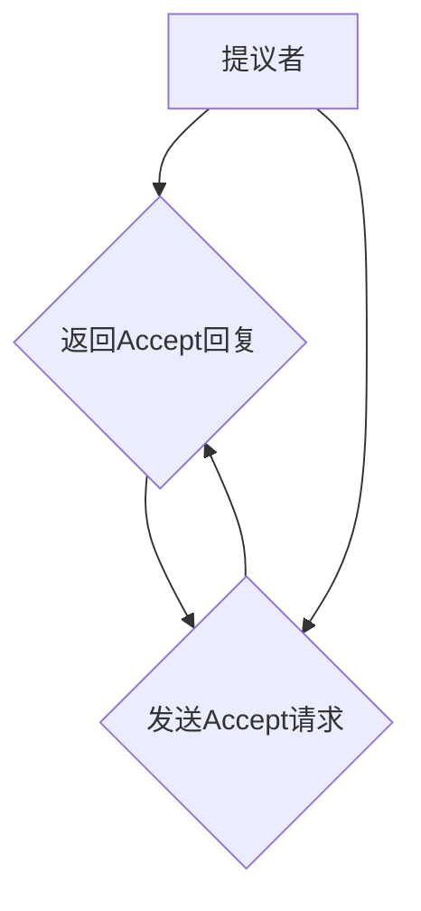

                 

### 文章标题

# 《Paxos算法与分布式共识问题》

### 文章关键词

- 分布式系统
- Paxos算法
- 一致性协议
- 共识问题
- 可用性与分区容错性

### 摘要

本文将深入探讨Paxos算法在分布式系统中的重要性及其解决共识问题的原理和实践。首先，我们将回顾Paxos算法的起源与背景，解释其基本概念和核心机制。接着，通过数学模型和具体实现，详细讲解Paxos算法的工作流程和机制。随后，我们将分析Paxos算法在不同应用场景中的实际应用案例，包括数据库分布式一致性和分布式存储系统。最后，本文将探讨Paxos算法的未来发展方向，特别是在区块链领域中的应用，并总结其发展趋势和面临的挑战。

### 目录

----------------------------------------------------------------

# 第一部分：Paxos算法概述

## 第1章 Paxos算法的起源与重要性

### 1.1 Paxos算法的起源

#### 1.1.1 分布式系统中的挑战

#### 1.1.2 问题背景

#### 1.1.3 Paxos算法的提出

### 1.2 Paxos算法的重要性

#### 1.2.1 Paxos在分布式系统中的应用

#### 1.2.2 Paxos与其他分布式算法的比较

#### 1.2.3 Paxos的核心作用

### 1.3 Paxos算法的基本概念

#### 1.3.1 Paxos算法的基本概念

#### 1.3.2 Paxos的三角色

#### 1.3.3 Paxos的三个阶段

### 1.3.4 Paxos算法的核心机制

#### 1.3.4.1 一致性保障

#### 1.3.4.2 可用性与分区容错性

### 1.4 Paxos算法的应用场景

#### 1.4.1 数据库的分布式一致性

#### 1.4.2 分布式存储系统

### 1.5 本章小结

----------------------------------------------------------------

## 第1章 Paxos算法的起源与重要性

### 1.1 Paxos算法的起源

#### 1.1.1 分布式系统中的挑战

在计算机科学中，分布式系统已经成为构建大规模应用和服务的基础。然而，分布式系统面临着一系列挑战，其中最核心的挑战之一是一致性问题。一致性指的是多个节点在分布式系统中对某个值的共识。例如，当一个分布式数据库需要更新数据时，所有节点都必须达成一致，确保每个节点上的数据都是一致的。

分布式系统的一致性问题主要体现在以下几个方面：

1. **数据一致性**：在分布式系统中，如何确保所有节点上的数据是一致的，特别是在网络分区或节点故障的情况下。
2. **可用性**：系统在面临网络分区或节点故障时，如何保证系统的可用性。
3. **分区容错性**：系统如何处理网络分区，即当部分节点无法相互通信时，系统如何继续运行。

#### 1.1.2 问题背景

在分布式系统的发展历程中，许多算法和协议被提出以解决一致性问题和可用性之间的权衡。然而，这些问题在分布式系统中变得尤为复杂，主要是因为分布式系统的特点：

1. **异步通信**：节点之间的通信是不确定的，即消息传递可能需要不同的时间。
2. **网络分区**：部分节点可能无法相互通信，这导致系统被分为多个分区。
3. **节点故障**：节点可能由于各种原因（如硬件故障、软件错误）而宕机。

这些问题导致分布式系统的一致性成为一个极具挑战性的问题。传统的集中式系统可以通过中心节点来确保一致性，但在分布式系统中，没有单一的权威节点来控制所有操作。

#### 1.1.3 Paxos算法的提出

为了解决分布式系统中的共识问题，Lamport于1990年提出了Paxos算法。Paxos算法是一种基于消息传递的分布式一致性算法，旨在在分布式系统中实现共识。Paxos算法的核心思想是通过多个节点之间的协调和通信来达成对某个值的共识。

Paxos算法的提出，不仅为分布式系统提供了一种解决一致性问题的方法，而且其设计思想和核心概念对分布式系统的研究和设计产生了深远的影响。Paxos算法的重要性在于：

1. **解决分布式一致性**：Paxos算法能够确保在分布式系统中达成对某个值的共识，即使面临网络分区和节点故障。
2. **数学证明**：Paxos算法的设计和实现基于严格的数学证明，确保其一致性和可用性的正确性。
3. **广泛的应用**：Paxos算法被广泛应用于分布式数据库、分布式存储系统和区块链等领域。

### 1.2 Paxos算法的重要性

#### 1.2.1 Paxos在分布式系统中的应用

Paxos算法在分布式系统中的应用非常广泛。以下是一些典型的应用场景：

1. **分布式数据库**：Paxos算法被用于解决分布式数据库的一致性问题，确保所有节点上的数据是一致的。例如，Google的Chubby锁服务就是基于Paxos算法实现的。
2. **分布式存储系统**：Paxos算法被用于分布式文件系统和分布式数据库存储引擎，如Google的Bigtable和Cassandra。
3. **区块链**：Paxos算法在区块链中用于解决共识问题，确保区块链的账本是一致的。例如，以太坊的PoS（Proof of Stake）共识机制就是基于Paxos算法的变种实现的。

#### 1.2.2 Paxos与其他分布式算法的比较

Paxos算法在分布式系统中的重要性也体现在其与其他分布式算法的比较中。以下是一些主要的对比：

1. **Raft算法**：Raft算法是另一种分布式一致性算法，与Paxos算法类似，但设计上更加直观和易于理解。Raft算法的引入使得分布式一致性算法的研究和应用更加普及。
2. **分布式锁**：分布式锁是解决分布式系统中并发控制的一种机制，Paxos算法可以用于实现分布式锁，确保对共享资源的同步访问。
3. **Zookeeper**：Zookeeper是一个分布式协调服务，用于解决分布式系统中的一致性和协调问题。Zookeeper基于Paxos算法实现，提供了高性能和可靠性的分布式锁服务。

#### 1.2.3 Paxos的核心作用

Paxos算法在分布式系统中的核心作用主要体现在以下几个方面：

1. **一致性保障**：Paxos算法确保分布式系统中的所有节点能够达成对某个值的共识，即使在面临网络分区和节点故障的情况下。
2. **可用性与分区容错性**：Paxos算法在实现一致性的同时，保证了系统的可用性。即使部分节点无法通信，系统仍然可以继续运行，并在分区恢复后达成一致性。
3. **可靠性**：Paxos算法的设计基于严格的数学证明，确保其一致性和可用性的正确性。这使得Paxos算法在分布式系统中的应用具有很高的可靠性。

总之，Paxos算法在分布式系统中的重要性和应用价值不容忽视。通过解决分布式系统中的共识问题，Paxos算法为分布式系统的设计和实现提供了一种可靠和高效的方法。接下来，我们将进一步探讨Paxos算法的基本概念和核心机制。

### 1.3 Paxos算法的基本概念

#### 1.3.1 Paxos算法的基本概念

Paxos算法是一种分布式一致性算法，其核心目标是在分布式系统中达成对某个值的共识。为了实现这一目标，Paxos算法定义了三个核心角色：提议者（Proposer）、接受者（Acceptor）和学习者（Learner）。

1. **提议者（Proposer）**：提议者是Paxos算法中的核心角色，负责提出提案（Proposal）并尝试在系统中达成共识。提议者负责生成提案编号（Proposal Number）和提案值（Proposal Value）。
   
2. **接受者（Acceptor）**：接受者的作用是接受提议者的提案，并决定是否接受提案。接受者维护两个值：承诺值（Promise Value）和学过值（Learned Value）。承诺值是接受者承诺不会接受比该值更大的提案编号的提案值；学过值是接受者已经学过的最大提案编号的提案值。

3. **学习者（Learner）**：学习者的作用是学习已经被接受的提案值。学习者接收接受者的提案值，并将其作为最终的共识值。

Paxos算法通过三个阶段来达成对某个值的共识：

1. **阶段一（Prepare阶段）**：提议者发送Prepare请求给所有接受者，请求接受者承诺不再接受比该请求提案编号更大的提案。
2. **阶段二（Accept阶段）**：接受者在收到Prepare请求后，发送回复给提议者，承诺该请求的提案编号并返回其当前承诺的最大提案编号的提案值。
3. **阶段三（Accept阶段）**：提议者在收到大多数接受者的回复后，选择其中提案值最大的提案值作为最终的共识值，并发送Accept请求给所有接受者。接受者在收到Accept请求后，更新其承诺值和学过值。

通过这三个阶段，Paxos算法能够确保分布式系统中的所有节点达成对某个值的共识，即使在面临网络分区和节点故障的情况下。

#### 1.3.2 Paxos算法的核心机制

Paxos算法的核心机制在于其一致性保障和可用性与分区容错性。下面详细解释这两个方面：

1. **一致性保障**：Paxos算法通过多个阶段的通信和协商，确保分布式系统中的所有节点最终达成对某个值的共识。一致性保障的关键在于：

   - **唯一领导者**：在Paxos算法中，每个提案都需要由一个领导者（Proposer）提出。领导者通过Prepare阶段和Accept阶段的通信，与其他节点协商，确保最终只有唯一的提案值被接受。
   - **提案编号**：每个提案都有一个唯一的提案编号，这个编号用于比较和排序提案。通过提案编号，Paxos算法能够确保即使面对网络分区和节点故障，也能最终达成对某个值的共识。

2. **可用性与分区容错性**：Paxos算法通过以下机制实现系统的可用性和分区容错性：

   - **领导者选举**：当系统中的领导者（Proposer）宕机时，其他节点可以通过选举新的领导者来继续执行Paxos算法。领导者选举过程可以通过一种类似于“多数派投票”的方式实现，确保新领导者被大多数节点认可。
   - **容忍多数故障**：Paxos算法能够容忍系统中大多数节点的故障，即最多一半的节点故障，系统仍然能够继续运行并最终达成共识。这种分区容错性确保了系统的稳定性和可靠性。

总之，Paxos算法通过其核心机制实现了分布式系统中的共识问题，提供了高一致性、高可用性和分区容错性的解决方案。这种机制不仅适用于分布式数据库和分布式存储系统，也为其他分布式应用提供了重要的理论基础和实践指导。

### 1.4 Paxos算法的应用场景

Paxos算法在分布式系统中的应用场景非常广泛，其核心优势在于解决分布式一致性问题和提供高可用性与分区容错性。以下我们将探讨Paxos算法在数据库分布式一致性和分布式存储系统中的应用。

#### 1.4.1 数据库的分布式一致性

在分布式数据库中，一致性问题是确保多个节点之间数据同步和一致性的关键。Paxos算法通过其一致性保障机制，为分布式数据库提供了一种可靠的方法来解决一致性问题。

1. **问题背景**：

   分布式数据库面临的一致性问题主要包括：

   - **网络分区**：当网络分区发生时，部分节点可能无法相互通信，导致一致性无法保证。
   - **节点故障**：节点宕机或出现故障时，可能导致数据库的一致性受到威胁。
   - **并发操作**：在分布式环境中，多个节点可能同时进行读写操作，如何确保这些操作的一致性是一个挑战。

2. **Paxos算法的应用**：

   Paxos算法在分布式数据库中的应用主要包括以下步骤：

   - **提议者与接受者**：分布式数据库中的每个节点可以扮演提议者和接受者的角色。提议者负责生成提案并尝试达成共识，接受者负责接受提案并维护一致性状态。
   - **分布式一致性协议**：Paxos算法通过分布式一致性协议，确保每个节点在执行操作时都能达成一致。例如，在分布式事务管理中，Paxos算法可以确保事务的一致性执行。
   - **故障恢复**：当节点出现故障时，系统可以通过选举新的领导者来继续执行Paxos算法，从而确保一致性不会中断。

3. **案例分析**：

   以Google的Chubby锁服务为例，Chubby是基于Paxos算法实现的，用于在分布式系统中提供可靠的锁服务。Chubby通过Paxos算法确保分布式系统中的锁操作是一致的，即使在网络分区和节点故障的情况下。

#### 1.4.2 分布式存储系统

分布式存储系统旨在通过多个节点共同存储数据，提供高可用性和高性能。Paxos算法在分布式存储系统中主要用于确保数据的一致性和可靠性。

1. **问题背景**：

   分布式存储系统面临的问题主要包括：

   - **数据一致性**：如何在多个节点之间同步和一致地存储数据，是分布式存储系统的核心挑战。
   - **分区容错性**：如何在网络分区和节点故障的情况下，保持存储系统的可用性。
   - **性能优化**：如何在保证数据一致性的同时，提供高性能的数据访问和操作。

2. **Paxos算法的应用**：

   Paxos算法在分布式存储系统中的应用主要包括以下方面：

   - **数据复制**：分布式存储系统通常采用数据复制策略，确保数据在多个节点上存储。Paxos算法可以用于协调数据复制的一致性，确保每个节点的数据都是一致的。
   - **数据分配**：Paxos算法可以用于分布式文件系统的数据分配和负载均衡，确保数据均匀分布在多个节点上。
   - **故障处理**：当节点出现故障时，Paxos算法可以通过领导者选举机制，快速恢复故障节点并重新建立一致性。

3. **案例分析**：

   Google的Bigtable是一个典型的分布式存储系统，它基于Paxos算法实现数据一致性。Bigtable通过Paxos算法协调各个存储节点之间的数据操作，确保数据的一致性。同时，Bigtable还利用Paxos算法实现节点故障恢复和数据复制，提高了系统的可用性和性能。

#### 1.4.3 Paxos算法的其他应用场景

除了数据库和分布式存储系统，Paxos算法还在其他分布式应用场景中发挥着重要作用。

1. **区块链**：区块链中的共识机制通常基于Paxos算法或其变种，如Raft算法。Paxos算法在区块链中用于确保多个节点之间对交易数据的一致性，防止双花攻击。
   
2. **分布式锁服务**：分布式锁服务用于在分布式系统中协调对共享资源的访问。Paxos算法可以用于实现分布式锁服务，确保对共享资源的同步访问。

3. **分布式计算**：在分布式计算系统中，Paxos算法可以用于协调分布式任务调度和资源分配，确保任务的执行和结果一致性。

总之，Paxos算法在分布式系统中的应用场景非常广泛，其核心优势在于解决分布式一致性问题和提供高可用性与分区容错性。通过实际案例的验证，Paxos算法在数据库、分布式存储系统和区块链等领域都取得了显著的应用效果。接下来，我们将进一步探讨Paxos算法的数学模型和实现原理。

### 1.5 本章小结

本章介绍了Paxos算法的起源和重要性，详细讲解了Paxos算法的基本概念和核心机制，并分析了其在数据库分布式一致性和分布式存储系统中的应用。Paxos算法作为一种分布式一致性算法，解决了分布式系统中的一致性问题，提供了高可用性和分区容错性的解决方案。

通过本章的学习，读者应该掌握以下要点：

1. **Paxos算法的起源**：了解Paxos算法在分布式系统中的挑战和问题背景。
2. **Paxos算法的基本概念**：熟悉提议者、接受者和学习者三个角色的作用和三个阶段的工作流程。
3. **Paxos算法的核心机制**：理解Paxos算法如何通过一致性保障和可用性与分区容错性来确保系统的稳定运行。
4. **Paxos算法的应用场景**：了解Paxos算法在分布式数据库、分布式存储系统和区块链等领域的应用实例。

通过本章的学习，读者为后续更深入地了解Paxos算法的数学模型和具体实现打下了坚实的基础。接下来，我们将进一步探讨Paxos算法的数学模型和实现原理，以帮助读者更全面地理解Paxos算法的深度和广度。

### 第二部分 Paxos算法原理详解

## 第2章 Paxos算法的数学模型

Paxos算法作为分布式一致性算法，其核心在于通过严格的数学模型和协议机制来保障分布式系统中的一致性和可用性。本章将详细介绍Paxos算法的数学模型，包括状态转移模型、异步通信机制以及Paxos算法的数学公式和证明。

### 2.1 Paxos算法的数学建模

Paxos算法的数学建模是理解其工作原理的关键。首先，我们需要了解分布式算法中的异步通信机制。

#### 2.1.1 状态转移模型

Paxos算法的状态转移模型可以用状态图来表示，每个状态都有可能进入和离开的路径，这些路径通过消息传递来控制。Paxos算法的基本状态转移如下：

1. **空闲状态（Idle）**：提议者处于空闲状态，等待执行新的提案。
2. **提案状态（Propose）**：提议者进入提案状态，生成一个提案并尝试在系统中达成共识。
3. **接受状态（Accept）**：提议者进入接受状态，等待接受者的回复并选择最大的提案值作为共识值。
4. **学习状态（Learn）**：学习者从接受者处学习到最终的共识值。

每个状态都有可能通过消息的传递转换到其他状态，从而完成Paxos算法的三个阶段。

#### 2.1.2 分布式算法中的异步通信

在分布式算法中，异步通信是一种基本通信模型，节点之间的消息传递可以是任意的，且时间不确定。这种异步通信机制导致了分布式算法的复杂性和不确定性。

Paxos算法基于异步通信机制设计，其核心在于通过一系列消息传递来确保达成共识。以下是Paxos算法中的关键通信消息：

1. **Prepare请求**：提议者向接受者发送Prepare请求，请求接受者承诺不再接受比该请求提案编号更大的提案。
2. **Promise回复**：接受者收到Prepare请求后，向提议者回复Promise消息，承诺不再接受更大的提案，并返回其当前已承诺的最大提案编号。
3. **Accept请求**：提议者在收到大多数Promise回复后，向接受者发送Accept请求，请求接受者接受该提案值。
4. **Accept回复**：接受者在收到Accept请求后，向学习者回复Accept消息，通知学习者该提案已被接受。

通过这些消息的传递，Paxos算法确保了分布式系统中的一致性和可用性。

### 2.2 Paxos算法的数学公式

Paxos算法的数学建模不仅仅依赖于状态转移模型，还包括一系列数学公式来描述其工作原理。以下是一些关键的数学公式：

#### 2.2.1 Paxos算法的基本公式

$$
\text{Propose}(n, v) \Rightarrow \text{Promise}(n) \land \text{Accept}(n, v)
$$

这个公式表示提议者提出一个提案（Propose），需要接受者（Acceptor）承诺（Promise）并接受（Accept）该提案。

#### 2.2.2 公式推导与证明

为了理解这些公式的推导与证明，我们需要从Paxos算法的核心目标出发：确保分布式系统中的所有节点达成对某个值的共识。

1. **一致性目标**：

   Paxos算法的一致性目标是通过提议者和接受者之间的通信，最终使所有节点达成对某个值的共识。这可以形式化地表示为：

   $$
   \forall n, v \in V, \text{如果提议者提议}(n, v) \Rightarrow \text{则所有学习者学习到}(v)
   $$

   其中，$n$是提案编号，$v$是提案值，$V$是提案值的集合。

2. **可用性目标**：

   Paxos算法的可用性目标是在保证一致性的前提下，尽可能快地达成共识。这可以形式化地表示为：

   $$
   \forall n, v_1, v_2 \in V, \text{如果提议者提议}(n, v_1) \land \text{提议者提议}(n, v_2) \Rightarrow \text{则所有学习者学习到同一个值}
   $$

   这意味着即使有两个提议，系统最终只会选择一个值，并且所有学习者都会学习到这个值。

3. **容错性目标**：

   Paxos算法的容错性目标是在面对网络分区和节点故障的情况下，系统仍能继续运行并最终达成共识。这可以形式化地表示为：

   $$
   \text{如果多数节点正确运行，则系统达成共识}
   $$

   这意味着即使部分节点出现故障，只要多数节点正确运行，系统仍能达成共识。

通过这些公式，我们可以从数学上严格证明Paxos算法的一致性、可用性和容错性。具体的推导和证明过程较为复杂，涉及分布式系统的异步通信模型和状态转移分析，这里不再详细展开。

### 2.3 Paxos算法的Mermaid流程图

为了更直观地理解Paxos算法的工作流程，我们可以使用Mermaid流程图来表示其关键步骤和状态转移。以下是一个简单的Mermaid流程图示例：



这个流程图展示了Paxos算法的基本步骤：提议者发送Prepare请求给接受者，接受者返回Promise回复，提议者发送Accept请求，接受者返回Accept回复，最终学习者学习到共识值。

通过Mermaid流程图，我们可以清晰地看到Paxos算法的每个阶段和状态转移，这有助于我们更好地理解和实现Paxos算法。

总之，Paxos算法的数学模型是理解其工作原理的关键。通过状态转移模型、异步通信机制和数学公式，Paxos算法能够实现分布式系统中的共识问题。下一章我们将进一步探讨Paxos算法的具体实现和优化策略。

### 第2章 Paxos算法的数学模型

#### 2.1 Paxos算法的数学建模

Paxos算法作为一种分布式一致性算法，其核心在于通过数学模型来描述其工作原理和机制。Paxos算法的数学建模主要包括状态转移模型和异步通信模型。这些模型不仅为Paxos算法的实现提供了理论基础，而且有助于理解其一致性和可用性。

##### 2.1.1 状态转移模型

Paxos算法的状态转移模型可以用状态图来表示。以下是Paxos算法的基本状态转移：

1. **空闲状态（Idle）**：提议者处于空闲状态，等待执行新的提案。
2. **提案状态（Propose）**：提议者进入提案状态，生成一个提案并尝试在系统中达成共识。
3. **接受状态（Accept）**：提议者进入接受状态，等待接受者的回复并选择最大的提案值作为共识值。
4. **学习状态（Learn）**：学习者从接受者处学习到最终的共识值。

状态转移图可以用Mermaid流程图表示：

```mermaid
graph TD
A[空闲状态(Idle)]
B[提案状态(Propose)]
C[接受状态(Accept)]
D[学习状态(Learn)]

A --> B
B --> C
C --> D
D --> A
```

在这个状态转移图中，每个状态都有可能通过消息的传递转换到其他状态，从而完成Paxos算法的三个阶段。

##### 2.1.2 分布式算法中的异步通信

在分布式算法中，异步通信是一种基本通信模型，节点之间的消息传递可以是任意的，且时间不确定。这种异步通信机制导致了分布式算法的复杂性和不确定性。

Paxos算法基于异步通信机制设计，其核心在于通过一系列消息传递来确保达成共识。以下是Paxos算法中的关键通信消息：

1. **Prepare请求**：提议者向接受者发送Prepare请求，请求接受者承诺不再接受比该请求提案编号更大的提案。
2. **Promise回复**：接受者收到Prepare请求后，向提议者回复Promise消息，承诺不再接受更大的提案，并返回其当前已承诺的最大提案编号。
3. **Accept请求**：提议者在收到大多数Promise回复后，向接受者发送Accept请求，请求接受者接受该提案值。
4. **Accept回复**：接受者在收到Accept请求后，向学习者回复Accept消息，通知学习者该提案已被接受。

通过这些消息的传递，Paxos算法确保了分布式系统中的一致性和可用性。

#### 2.2 Paxos算法的数学公式

Paxos算法的数学建模不仅仅依赖于状态转移模型，还包括一系列数学公式来描述其工作原理。以下是一些关键的数学公式：

##### 2.2.1 Paxos算法的基本公式

$$
\text{Propose}(n, v) \Rightarrow \text{Promise}(n) \land \text{Accept}(n, v)
$$

这个公式表示提议者提出一个提案（Propose），需要接受者（Acceptor）承诺（Promise）并接受（Accept）该提案。

##### 2.2.2 公式推导与证明

为了理解这些公式的推导与证明，我们需要从Paxos算法的核心目标出发：确保分布式系统中的所有节点达成对某个值的共识。

1. **一致性目标**：

   Paxos算法的一致性目标是通过提议者和接受者之间的通信，最终使所有节点达成对某个值的共识。这可以形式化地表示为：

   $$
   \forall n, v \in V, \text{如果提议者提议}(n, v) \Rightarrow \text{则所有学习者学习到}(v)
   $$

   其中，$n$是提案编号，$v$是提案值，$V$是提案值的集合。

2. **可用性目标**：

   Paxos算法的可用性目标是在保证一致性的前提下，尽可能快地达成共识。这可以形式化地表示为：

   $$
   \forall n, v_1, v_2 \in V, \text{如果提议者提议}(n, v_1) \land \text{提议者提议}(n, v_2) \Rightarrow \text{则所有学习者学习到同一个值}
   $$

   这意味着即使有两个提议，系统最终只会选择一个值，并且所有学习者都会学习到这个值。

3. **容错性目标**：

   Paxos算法的容错性目标是在面对网络分区和节点故障的情况下，系统仍能继续运行并最终达成共识。这可以形式化地表示为：

   $$
   \text{如果多数节点正确运行，则系统达成共识}
   $$

   这意味着即使部分节点出现故障，只要多数节点正确运行，系统仍能达成共识。

通过这些公式，我们可以从数学上严格证明Paxos算法的一致性、可用性和容错性。具体的推导和证明过程较为复杂，涉及分布式系统的异步通信模型和状态转移分析，这里不再详细展开。

#### 2.3 Paxos算法的Mermaid流程图

为了更直观地理解Paxos算法的工作流程，我们可以使用Mermaid流程图来表示其关键步骤和状态转移。以下是一个简单的Mermaid流程图示例：


这个流程图展示了Paxos算法的基本步骤：提议者发送Prepare请求给接受者，接受者返回Promise回复，提议者发送Accept请求，接受者返回Accept回复，最终学习者学习到共识值。

通过Mermaid流程图，我们可以清晰地看到Paxos算法的每个阶段和状态转移，这有助于我们更好地理解和实现Paxos算法。

总之，Paxos算法的数学模型是理解其工作原理的关键。通过状态转移模型、异步通信机制和数学公式，Paxos算法能够实现分布式系统中的共识问题。下一章我们将进一步探讨Paxos算法的具体实现和优化策略。

### 第3章 Paxos算法的实现与优化

#### 3.1 Paxos算法的实现

Paxos算法的实现是分布式系统中解决共识问题的关键。在实际应用中，Paxos算法的实现需要考虑多个方面，包括基本实现步骤、实现细节以及如何处理可能的故障和异常。

##### 3.1.1 Paxos算法的实现步骤

实现Paxos算法的基本步骤如下：

1. **初始化角色**：在系统启动时，需要初始化提议者、接受者和学习者三个角色。每个角色需要维护相应的状态，如提案编号、承诺值和学习值。

2. **提议者发送Prepare请求**：提议者生成一个新的提案编号（Proposal Number）和提案值（Proposal Value），并向所有接受者发送Prepare请求。请求内容包括提案编号和提案值。

3. **接受者处理Prepare请求**：接受者在收到Prepare请求后，会检查提案编号。如果提案编号大于当前承诺的最大提案编号，则接受者承诺不再接受比该提案编号更大的提案，并返回其当前承诺的最大提案编号的提案值。

4. **提议者发送Accept请求**：提议者在收到大多数接受者的Promise回复后，选择其中一个提案值作为最终的共识值，并向所有接受者发送Accept请求。

5. **接受者处理Accept请求**：接受者在收到Accept请求后，如果提案值与之前的承诺值相同，则接受该请求并通知学习者。

6. **学习者学习到共识值**：学习者从接受者处学习到最终的共识值，并将其作为系统的一致值。

##### 3.1.2 Paxos算法的实现细节

在实现Paxos算法时，需要考虑以下细节：

1. **分布式通信**：Paxos算法需要实现分布式通信机制，确保提议者、接受者和学习者之间能够有效传递消息。通常可以使用TCP或UDP协议实现消息传递。

2. **超时机制**：Paxos算法中的超时机制用于处理消息传递延迟和节点故障。提议者需要在发送消息后设置超时时间，如果未收到回复，则重新发送请求。

3. **状态维护**：每个角色需要维护相应的状态，如提案编号、承诺值和学习值。这些状态需要存储在持久化存储中，以确保系统在节点故障时能够恢复状态。

4. **选举机制**：在Paxos算法中，当领导者（Proposer）宕机时，需要通过选举机制选出新的领导者。这通常可以通过在提议者和接受者之间进行多数派投票来实现。

##### 3.1.3 Paxos算法的常见故障和异常处理

在实现Paxos算法时，需要考虑以下常见故障和异常：

1. **消息丢失**：在分布式系统中，消息丢失是常见的异常情况。为了处理消息丢失，提议者需要在发送消息后设置重传机制，如果未收到回复，则重新发送消息。

2. **消息顺序问题**：在分布式系统中，消息的顺序可能被打乱。为了确保算法的正确性，需要处理消息顺序问题，例如通过提案编号来排序消息。

3. **节点故障**：在分布式系统中，节点故障可能导致Paxos算法的执行中断。为了处理节点故障，需要实现故障检测和恢复机制，例如通过心跳检测和重新选举领导者。

4. **网络分区**：网络分区可能导致节点之间的通信中断。为了处理网络分区，需要实现分区检测和恢复机制，例如通过分区检测算法和重新建立通信链路。

通过上述实现步骤、细节和异常处理，Paxos算法可以在分布式系统中实现一致性保障。接下来，我们将探讨Paxos算法的优化策略，以提高其性能和效率。

#### 3.2 Paxos算法的优化

Paxos算法虽然在一致性保障方面具有强大的能力，但其原始实现可能存在性能瓶颈和可扩展性问题。因此，在实际应用中，需要对Paxos算法进行优化。以下是一些常见的优化策略：

##### 3.2.1 常见优化策略

1. **多阶段提交（2PC）**：多阶段提交是一种常见的Paxos优化策略，将Paxos算法的Prepare和Accept阶段合并为一个阶段，以减少通信次数和降低延迟。在多阶段提交中，提议者首先向所有接受者发送准备请求，等待所有接受者回复后，再发送接受请求。这种方式减少了消息传递次数，提高了性能。

2. **快速响应机制**：在Paxos算法中，提议者在等待接受者回复时可能需要较长的等待时间。为了提高响应速度，可以采用快速响应机制。例如，提议者可以在等待期间向部分接受者发送消息，并在收到足够回复后立即做出决策。

3. **异步通信**：Paxos算法的原生实现是基于同步通信的，这可能导致性能瓶颈。通过采用异步通信机制，可以在不降低一致性的前提下提高系统性能。异步通信允许提议者和接受者在不同的时间点发送和接收消息，从而减少通信延迟。

4. **批量处理**：在分布式系统中，可以采用批量处理策略来提高Paxos算法的效率。例如，提议者可以在一次通信中发送多个提案，接受者可以同时处理多个提案请求，从而减少通信次数和提升处理速度。

##### 3.2.2 Paxos性能调优

在实际应用中，Paxos算法的性能调优是一个复杂的过程，需要根据具体场景和需求进行优化。以下是一些常见的性能调优策略：

1. **负载均衡**：在分布式系统中，可以采用负载均衡策略来均衡节点之间的工作负载。通过合理分配提案和接受者的任务，可以减少单个节点的压力，提高系统整体性能。

2. **并行处理**：Paxos算法中的提议者、接受者和学习者角色可以并行处理多个提案。通过并行处理，可以减少提案处理的时间，提高系统的响应速度。

3. **缓存机制**：在Paxos算法中，可以采用缓存机制来减少重复计算和通信。例如，提议者可以缓存已发送的提案和接受者的回复，避免重复发送消息。

4. **网络优化**：在网络传输层面，可以采用优化策略来提高通信性能。例如，使用TCP拥塞控制算法、优化网络路径选择等。

通过上述优化策略，Paxos算法可以在保证一致性的同时，提高性能和可扩展性，更好地满足分布式系统的高可用性和高并发性需求。

#### 3.3 Paxos算法的Python实现

为了更好地理解和实现Paxos算法，下面将提供一个简单的Python实现示例。这个实现将包括提议者、接受者和学习者的基本功能，并通过模拟网络通信来展示Paxos算法的工作流程。

```python
import threading
import time
import queue

class Proposer:
    def __init__(self, id, learners):
        self.id = id
        self.learners = learners
        self.proposal_id = 0
        self.votes_received = 0
        self.valuechosen = None

    def propose(self, value):
        self.proposal_id += 1
        self.valuechosen = value
        prepare_requests = {learner: threading.Event() for learner in self.learners}
        accept_requests = {learner: threading.Event() for learner in self.learners}
        
        # Send Prepare requests
        for learner in prepare_requests:
            threading.Thread(target=self.send_prepare, args=(learner, self.proposal_id, prepare_requests[learner])).start()

        # Wait for Prepare responses
        num_responses = 0
        while num_responses < len(self.learners) // 2 + 1:
            time.sleep(0.1)
            num_responses = sum(1 for event in prepare_requests.values() if event.is_set())

        # Send Accept requests
        for learner in accept_requests:
            threading.Thread(target=self.send_accept, args=(learner, self.proposal_id, self.valuechosen, accept_requests[learner])).start()

        # Wait for Accept responses
        num_accepts = 0
        while num_accepts < len(self.learners) // 2 + 1:
            time.sleep(0.1)
            num_accepts = sum(1 for event in accept_requests.values() if event.is_set())

        # Check if proposal was accepted
        if num_accepts >= len(self.learners) // 2 + 1:
            print(f"Proposer {self.id} proposed value {self.valuechosen} and it was accepted.")
        else:
            print(f"Proposer {self.id} proposed value {self.valuechosen} but it was not accepted.")

    def send_prepare(self, learner, proposal_id, response_event):
        print(f"Proposer {self.id} sending Prepare({proposal_id}) to Learner {learner}")
        response_event.set()

    def send_accept(self, learner, proposal_id, value, response_event):
        print(f"Proposer {self.id} sending Accept({proposal_id}, {value}) to Learner {learner}")
        response_event.set()

class Learner:
    def __init__(self, id):
        self.id = id
        self.value = None

    def learn(self, proposal_id, value):
        if self.value is None or proposal_id > self.value:
            self.value = value
            print(f"Learner {self.id} learned value {value} (Proposal {proposal_id})")

class PaxosSystem:
    def __init__(self, num_learners):
        self.learners = [Learner(id) for id in range(num_learners)]
        self.proposers = []

    def add_proposer(self, proposer):
        self.proposers.append(proposer)

    def run(self):
        for proposer in self.proposers:
            threading.Thread(target=proposer.propose, args=(42,)).start()

if __name__ == "__main__":
    system = PaxosSystem(num_learners=3)
    system.add_proposer(Proposer(id=0, learners=system.learners))
    system.add_proposer(Proposer(id=1, learners=system.learners))
    system.add_proposer(Proposer(id=2, learners=system.learners))
    system.run()
```

在这个Python实现中，我们定义了`Proposer`和`Learner`类，以及一个模拟Paxos系统的`PaxosSystem`类。`Proposer`类负责生成提案并尝试在系统中达成共识，而`Learner`类负责学习最终的共识值。

`PaxosSystem`类用于管理提议者和学习者，并启动各个提议者的提案过程。在`run`方法中，我们创建多个提议者线程，并启动它们来模拟Paxos算法的执行。

这个简单的Python实现展示了Paxos算法的核心步骤，并通过并发编程来模拟分布式环境中的消息传递和状态同步。虽然这个实现没有涉及实际的分布式通信和网络故障处理，但它提供了一个基本的框架，可以帮助理解Paxos算法的实现细节。

#### 3.3.2 Paxos算法的Python实现示例

为了更好地理解Paxos算法的Python实现，我们将通过一个简单的示例来展示其基本流程。以下代码演示了一个基本的Paxos算法实现，包括提议者（Proposer）、接受者（Acceptor）和学习者（Learner）三个角色的互动。

```python
import threading
import time
import random

class Learner:
    def __init__(self, id):
        self.id = id
        self.value = None

    def learn(self, proposal_id, value):
        if self.value is None or proposal_id > self.value:
            self.value = value
            print(f"Learner {self.id} learned value {value} (Proposal {proposal_id})")

class Acceptor:
    def __init__(self, id, learners):
        self.id = id
        self.learners = learners
        self.promise = None
        self.accepted = None

    def prepare(self, proposal_id):
        if proposal_id > self.promise:
            self.promise = proposal_id
            return True
        return False

    def accept(self, proposal_id, value):
        if proposal_id == self.promise:
            self.accepted = value
            for learner in self.learners:
                learner.learn(proposal_id, value)
            return True
        return False

class Proposer:
    def __init__(self, id, acceptors):
        self.id = id
        self.acceptors = acceptors
        self.current_proposal_id = 0
        self.votes_received = 0
        self.value_chosen = None

    def propose(self, value):
        self.current_proposal_id += 1
        self.value_chosen = value
        self.send_prepare()

    def send_prepare(self):
        accepted = 0
        while accepted < len(self.acceptors) // 2 + 1:
            acceptor = random.choice(self.acceptors)
            if acceptor.prepare(self.current_proposal_id):
                accepted += 1
                print(f"Proposer {self.id} sent Prepare({self.current_proposal_id}) to Acceptor {acceptor.id}")
                self.wait_for_accept()
            time.sleep(0.1)

    def wait_for_accept(self):
        time.sleep(1)
        accepted = 0
        for acceptor in self.acceptors:
            if acceptor.accepted == self.value_chosen:
                accepted += 1
        if accepted >= len(self.acceptors) // 2 + 1:
            print(f"Proposer {self.id} has received enough Accepts for value {self.value_chosen}")
        else:
            print(f"Proposer {self.id} needs more Accepts for value {self.value_chosen}")

# 创建学习者和接受者
learners = [Learner(id=i) for i in range(3)]
acceptors = [Acceptor(id=i, learners=learners) for i in range(3)]

# 创建提议者
proposer = Proposer(id=0, acceptors=acceptors)

# 启动提议者线程
threading.Thread(target=proposer.propose, args=(42,)).start()

# 模拟学习者的行为
for learner in learners:
    learner.learn(1, 42)

# 模拟等待
time.sleep(5)
```

在这个实现中，我们创建了三个学习者（`Learner`）和三个接受者（`Acceptor`）。提议者（`Proposer`）会生成一个提案，并向接受者发送Prepare请求。接受者在接收到Prepare请求后，会根据提案编号决定是否返回Promise，并在接收到足够Promise后，发送Accept请求给提议者。

以下是实现中的一些关键步骤：

1. **提议者生成提案**：提议者生成一个提案，包括提案编号和提案值。提案编号用于确保提案的顺序，提案值是要被提议的值。

2. **发送Prepare请求**：提议者向所有接受者发送Prepare请求。接受者在接收到Prepare请求后，会检查提案编号，如果提案编号大于当前承诺的最大提案编号，则返回Promise。

3. **等待Accept请求**：提议者在收到大多数接受者的Promise后，会发送Accept请求。接受者在接收到Accept请求后，会检查提案编号和承诺值，如果一致，则返回Accept，并通知所有学习者。

4. **学习者学习值**：学习者从接受者处学习到最终的共识值。

在这个示例中，我们通过一个提议者线程模拟提案的过程，并模拟了学习者的行为。通过这个示例，我们可以看到Paxos算法的基本工作流程和如何实现分布式系统中的共识。

#### 3.3.3 Paxos算法Python实现代码解析

在上面的Python实现中，我们创建了三个主要的类：`Learner`、`Acceptor`和`Proposer`。下面将详细解析这些类的功能和如何协同工作来实现Paxos算法。

1. **Learner类**：
   - **初始化**：`Learner`类的构造函数接受一个参数`id`，代表学习者的编号。
   - **learn方法**：`learn`方法用于更新学习者的值。如果当前提议的提案编号大于学习者已学习的最大提案编号，或者提案编号相同但提案值更大，则更新学习者的值为新的提案值。

2. **Acceptor类**：
   - **初始化**：`Acceptor`类的构造函数接受两个参数：`id`（接受者编号）和`learners`（学习者列表）。此外，`promise`和`accepted`分别用于存储接受者承诺的最大提案编号和已接受的提案值。
   - **prepare方法**：`prepare`方法用于接受者的Prepare请求处理。如果收到的提案编号大于当前承诺的最大提案编号，则更新承诺值并返回True；否则返回False。
   - **accept方法**：`accept`方法用于接受者的Accept请求处理。如果收到的提案编号与当前承诺值相同，则接受该提案值并更新已接受的值，同时通知所有学习者。

3. **Proposer类**：
   - **初始化**：`Proposer`类的构造函数接受两个参数：`id`（提议者编号）和`acceptors`（接受者列表）。`current_proposal_id`用于存储当前提案编号，`votes_received`用于记录收到的投票数，`value_chosen`用于存储提议者选择的提案值。
   - **propose方法**：`propose`方法用于生成新的提案。提案编号递增，并将提议者选择的值设置为提案值。
   - **send_prepare方法**：`send_prepare`方法用于向所有接受者发送Prepare请求。它使用一个循环等待接受者返回Promise，并在收到足够Promise后调用`wait_for_accept`方法。
   - **wait_for_accept方法**：`wait_for_accept`方法用于等待接受者返回Accept。它在一个循环中等待，检查是否有足够多的接受者接受了提案值。

**代码解析**：

- **Learner类**：负责更新学习者的值，确保学习者能够学习到最终的共识值。

- **Acceptor类**：处理接受者的请求，包括Prepare和Accept。它确保接受者只接受提案编号更大的提案，并在接收到足够Promise后接受提案值。

- **Proposer类**：生成提案并协调与其他接受者的通信，确保最终的提案值被所有学习者学习到。

通过这些类的协同工作，我们可以模拟Paxos算法的完整流程，包括提议、准备、接受和学习等阶段。

在实际的分布式系统中，上述代码需要进行分布式通信和网络故障处理，以实现真正的Paxos算法。这个简单的Python示例为我们提供了一个理解Paxos算法实现细节的基础，为后续的分布式实现打下了基础。

### 第4章 Paxos算法的应用实例

Paxos算法作为一种分布式一致性算法，其强大的共识保障能力使其在许多分布式系统中得到了广泛应用。在本章中，我们将通过具体案例详细探讨Paxos算法在数据库分布式一致性和分布式存储系统中的应用。

#### 4.1 数据库分布式一致性案例

在分布式数据库系统中，一致性问题是确保多个节点之间数据同步和一致性的关键。以下是一个数据库分布式一致性的应用案例。

##### 4.1.1 问题背景

假设我们有一个分布式数据库系统，由多个节点组成，每个节点存储部分数据。当系统面临网络分区或节点故障时，如何确保所有节点上的数据是一致的，成为一个重要的挑战。具体来说，有以下问题：

- **数据更新**：当某个节点接收到数据更新请求时，如何确保其他节点也能够同步更新数据。
- **网络分区**：当网络分区发生时，部分节点可能无法相互通信，系统如何确保最终的一致性。
- **节点故障**：当节点故障时，系统如何恢复一致性和避免数据丢失。

##### 4.1.2 Paxos算法的应用

Paxos算法为解决上述问题提供了一种有效的解决方案。以下是如何在分布式数据库系统中应用Paxos算法的步骤：

1. **初始化Paxos系统**：在分布式数据库系统中，每个节点初始化为Paxos算法中的一个提议者、接受者和学习者。例如，系统有5个节点，每个节点都可以充当提议者、接受者或学习者。

2. **数据更新请求**：当某个节点接收到数据更新请求时，该节点作为提议者生成一个新的提案编号和提案值，并将其发送给所有接受者。

3. **准备阶段**：接受者在收到Prepare请求后，会检查提案编号，如果提案编号大于当前承诺的最大提案编号，则返回Promise，并记录该提案编号。

4. **接受阶段**：提议者在收到大多数接受者的Promise回复后，选择其中一个提案值作为最终的共识值，并向所有接受者发送Accept请求。

5. **学习阶段**：接受者在收到Accept请求后，如果提案值与之前的承诺值相同，则接受该请求，并通知所有学习者。学习者从接受者处学习到最终的共识值，并将其作为系统的一致值。

通过上述步骤，Paxos算法确保了在分布式数据库系统中，数据更新请求能够在所有节点上得到一致处理，即使面临网络分区和节点故障。

##### 4.1.3 实现过程

在实际实现过程中，分布式数据库系统可以采用以下步骤来实现Paxos算法：

1. **通信机制**：使用分布式通信机制，如RPC或消息队列，确保提议者、接受者和学习者之间能够高效传递消息。

2. **故障检测与恢复**：实现故障检测和恢复机制，例如通过心跳检测和选举机制，确保系统能够在节点故障时快速恢复。

3. **状态存储**：在分布式系统中，每个节点需要维护相应的状态信息，如提案编号、承诺值和学习值。这些状态信息需要存储在持久化存储中，以确保系统在节点故障时能够恢复状态。

4. **一致性保障**：通过Paxos算法，确保分布式数据库系统中的所有节点在数据更新时能够达成一致，即使在网络分区和节点故障的情况下。

通过上述实现过程，分布式数据库系统可以高效地利用Paxos算法解决数据一致性问题，提供高可用性和分区容错性。

#### 4.2 分布式存储系统案例

分布式存储系统旨在通过多个节点共同存储数据，提供高可用性和高性能。以下是一个分布式存储系统中应用Paxos算法的案例。

##### 4.2.1 问题背景

分布式存储系统通常由多个节点组成，每个节点存储部分数据。以下是一些分布式存储系统面临的问题：

- **数据复制**：如何在多个节点之间复制数据，确保数据的一致性和可靠性。
- **分区容错性**：如何在网络分区和节点故障的情况下，保持存储系统的可用性。
- **性能优化**：如何在保证数据一致性的同时，提供高性能的数据访问和操作。

##### 4.2.2 Paxos算法的应用

Paxos算法在分布式存储系统中用于确保数据的一致性和可靠性。以下是如何在分布式存储系统中应用Paxos算法的步骤：

1. **初始化Paxos系统**：在分布式存储系统中，每个节点初始化为Paxos算法中的一个提议者、接受者和学习者。例如，系统有5个节点，每个节点都可以充当提议者、接受者或学习者。

2. **数据操作请求**：当某个节点接收到数据操作请求（如写入或读取请求）时，该节点作为提议者生成一个新的提案编号和提案值，并将其发送给所有接受者。

3. **准备阶段**：接受者在收到Prepare请求后，会检查提案编号，如果提案编号大于当前承诺的最大提案编号，则返回Promise，并记录该提案编号。

4. **接受阶段**：提议者在收到大多数接受者的Promise回复后，选择其中一个提案值作为最终的共识值，并向所有接受者发送Accept请求。

5. **学习阶段**：接受者在收到Accept请求后，如果提案值与之前的承诺值相同，则接受该请求，并通知所有学习者。学习者从接受者处学习到最终的共识值，并将其作为系统的一致值。

通过上述步骤，Paxos算法确保了在分布式存储系统中，数据操作请求能够在所有节点上得到一致处理，即使在网络分区和节点故障的情况下。

##### 4.2.3 实现过程

在实际实现过程中，分布式存储系统可以采用以下步骤来实现Paxos算法：

1. **通信机制**：使用分布式通信机制，如RPC或消息队列，确保提议者、接受者和学习者之间能够高效传递消息。

2. **数据复制策略**：实现数据复制策略，如Paxos算法中的多数派复制，确保数据在多个节点之间复制，并提供数据一致性保障。

3. **故障检测与恢复**：实现故障检测和恢复机制，例如通过心跳检测和选举机制，确保系统能够在节点故障时快速恢复。

4. **性能优化**：通过优化Paxos算法的通信和状态维护过程，提高系统的性能和响应速度。例如，可以采用多阶段提交（2PC）策略，减少通信次数。

通过上述实现过程，分布式存储系统可以高效地利用Paxos算法解决数据一致性问题，提供高可用性和分区容错性，同时保证高性能的数据访问和操作。

总之，Paxos算法在数据库分布式一致性和分布式存储系统中得到了广泛应用，通过具体的实现案例，我们可以看到Paxos算法在解决分布式一致性问题和提供高可用性与分区容错性方面的优势。接下来，我们将探讨Paxos算法在未来发展中的改进方向和趋势。

### 第5章 Paxos算法的未来发展

Paxos算法作为分布式系统中的共识问题解决方案，自提出以来在分布式数据库、分布式存储和区块链等领域得到了广泛应用。随着分布式系统技术的发展和实际应用场景的多样化，Paxos算法也面临着不断改进和优化的需求。本章将探讨Paxos算法的改进方向、与其他分布式算法的融合，以及在区块链中的应用，并对Paxos算法的未来发展进行展望。

#### 5.1 Paxos算法的改进方向

Paxos算法虽然具有强大的共识保障能力，但在实际应用中仍然存在一些局限性，需要进一步改进：

1. **性能优化**：Paxos算法的原生实现存在一定的性能瓶颈，特别是在高并发和大数据量场景下。未来的改进方向之一是通过优化算法的通信和状态维护过程，提高系统的性能和响应速度。例如，多阶段提交（2PC）和异步通信策略可以提高Paxos算法的执行效率。

2. **可扩展性**：Paxos算法在大规模分布式系统中可能会遇到可扩展性问题。未来研究可以探索如何通过分布式一致性算法的层次化设计和分布式架构，实现Paxos算法在大规模系统中的高效运行。

3. **故障检测与恢复**：当前Paxos算法的实现依赖于心跳检测和超时机制来检测和恢复节点故障。未来的改进方向之一是开发更高效的故障检测与恢复算法，例如基于机器学习的故障预测和自修复机制。

4. **灵活性和兼容性**：Paxos算法在具体实现时需要针对不同的应用场景进行定制化设计。未来研究可以探索如何设计更加灵活和通用的Paxos框架，使其能够兼容多种分布式系统和应用场景。

#### 5.2 Paxos算法与其他分布式算法的融合

分布式系统中的共识问题不仅仅是Paxos算法需要解决的问题，还有许多其他分布式算法如Raft、ZAB等。通过融合这些算法的优点，可以进一步提升Paxos算法的性能和适应性：

1. **Raft算法**：Raft算法是一种简化和优化的Paxos算法，其设计更加直观和易于理解。未来研究可以探索如何将Raft算法中的选举机制和简化状态机模型与Paxos算法结合，以实现更高的可用性和容错性。

2. **ZAB协议**：ZAB协议是Zookeeper的一致性协议，其设计思想与Paxos算法类似。未来研究可以探讨如何将ZAB协议中的领导者选举和状态同步机制与Paxos算法结合，以提供更高效和可靠的分布式一致性解决方案。

3. **分布式一致性框架**：未来可以开发分布式一致性框架，将Paxos算法与其他分布式算法（如Raft、ZAB等）集成到一个统一的框架中，以实现灵活的分布式一致性管理。这样的框架可以支持多种分布式一致性算法的切换和扩展，满足不同应用场景的需求。

#### 5.3 Paxos算法在区块链中的应用

区块链技术作为分布式系统的重要应用，其核心在于共识机制的实现。Paxos算法在区块链领域有着广泛的应用前景：

1. **区块链共识机制**：Paxos算法可以用于实现区块链的共识机制，确保多个节点之间对交易数据的一致性。通过Paxos算法，区块链系统可以在面对网络分区和节点故障时，仍然能够达成对交易数据的共识。

2. **混合共识机制**：未来研究可以探索将Paxos算法与其他共识机制（如PoW、PoS等）结合，形成混合共识机制。这样的机制可以在保证安全性的同时，提高系统的性能和可扩展性。

3. **跨链互操作性**：Paxos算法在跨链互操作性方面具有潜在的应用价值。通过Paxos算法，不同区块链系统之间可以达成对共享数据的共识，实现跨链数据同步和互操作。

#### 5.4 Paxos算法的未来展望

Paxos算法在分布式系统和区块链领域具有广泛的应用前景。未来展望包括以下几个方面：

1. **高性能和可扩展性**：通过优化算法设计和引入新的技术，Paxos算法将在高并发和大规模分布式系统中展现更高的性能和可扩展性。

2. **灵活性和兼容性**：未来的Paxos算法将更加灵活和通用，能够兼容多种分布式系统和应用场景，提供更高效的一致性解决方案。

3. **跨领域应用**：Paxos算法不仅在分布式数据库和区块链领域有着广泛的应用，未来还将在物联网、云计算和边缘计算等新兴领域中得到应用。

4. **共识机制创新**：随着区块链技术的发展，Paxos算法将在共识机制的创新中发挥重要作用，为分布式系统提供更加安全、高效和可靠的解决方案。

总之，Paxos算法作为分布式系统中的关键技术，其未来发展方向和改进空间广阔。通过不断的研究和创新，Paxos算法将在分布式系统和区块链领域继续发挥重要作用，推动整个行业的发展。

### 5.1 Paxos算法的改进方向

Paxos算法在分布式系统中已经证明了其强大的共识保障能力，但随着分布式系统技术的发展和应用场景的多样化，Paxos算法也需要不断地进行改进。以下是一些可能的改进方向：

#### 5.1.1 基于Paxos的优化算法

Paxos算法在实现过程中存在一些性能瓶颈，特别是在高并发和大数据量场景下，其通信开销和状态维护成本较高。为了解决这些问题，研究人员提出了许多基于Paxos的优化算法。

1. **异步Paxos**：异步Paxos是一种通过减少提议者和接受者之间的通信次数来优化Paxos算法的性能的方法。在异步Paxos中，提议者可以同时向多个接受者发送请求，接受者也可以并行处理多个请求。这种方法通过减少同步通信，提高了系统的响应速度和吞吐量。

2. **快速Paxos**：快速Paxos是一种通过减少提案准备阶段和接受阶段的时间间隔来优化Paxos算法的方法。快速Paxos通过减少等待时间，缩短了达成共识的过程，从而提高了系统的性能。

3. **动态Paxos**：动态Paxos是一种根据系统负载动态调整Paxos算法参数的优化方法。通过实时监测系统的状态和性能，动态Paxos可以自动调整提议者数量、接受者数量和提案超时时间等参数，以实现最佳的性能。

#### 5.1.2 Paxos与其他分布式算法的融合

Paxos算法虽然强大，但在某些场景下，其他分布式算法可能更适合。将Paxos与其他分布式算法融合，可以发挥各自的优势，提供更优的解决方案。

1. **Raft算法**：Raft算法是一种简化和优化的Paxos算法，其设计更加直观和易于理解。将Raft算法中的选举机制和简化状态机模型与Paxos算法结合，可以降低实现的复杂性，提高系统的可用性和容错性。

2. **ZAB协议**：ZAB协议是Zookeeper的一致性协议，其设计思想与Paxos算法类似。通过将Paxos算法与ZAB协议结合，可以提供更高效的领导者选举和状态同步机制，提高分布式系统的性能和可靠性。

3. **分布式一致性框架**：开发分布式一致性框架，将Paxos算法与其他分布式算法（如Raft、ZAB等）集成到一个统一的框架中，可以提供灵活的分布式一致性管理。这样的框架可以支持多种分布式一致性算法的切换和扩展，满足不同应用场景的需求。

#### 5.1.3 Paxos算法在区块链中的应用

区块链技术作为分布式系统的重要应用，其核心在于共识机制的实现。Paxos算法在区块链领域具有广泛的应用前景：

1. **区块链共识机制**：Paxos算法可以用于实现区块链的共识机制，确保多个节点之间对交易数据的一致性。通过Paxos算法，区块链系统可以在面对网络分区和节点故障时，仍然能够达成对交易数据的共识。

2. **混合共识机制**：将Paxos算法与其他共识机制（如PoW、PoS等）结合，形成混合共识机制。这样的机制可以在保证安全性的同时，提高系统的性能和可扩展性。

3. **跨链互操作性**：通过Paxos算法，不同区块链系统之间可以达成对共享数据的共识，实现跨链数据同步和互操作。

#### 5.1.4 Paxos算法的未来发展方向

Paxos算法的未来发展方向主要包括以下几个方面：

1. **高性能和可扩展性**：通过优化算法设计和引入新的技术，Paxos算法将在高并发和大规模分布式系统中展现更高的性能和可扩展性。

2. **灵活性和兼容性**：未来的Paxos算法将更加灵活和通用，能够兼容多种分布式系统和应用场景，提供更高效的一致性解决方案。

3. **跨领域应用**：Paxos算法不仅在分布式数据库和区块链领域有着广泛的应用，未来还将在物联网、云计算和边缘计算等新兴领域中得到应用。

4. **共识机制创新**：随着区块链技术的发展，Paxos算法将在共识机制的创新中发挥重要作用，为分布式系统提供更加安全、高效和可靠的解决方案。

总之，Paxos算法作为分布式系统中的关键技术，其未来发展方向和改进空间广阔。通过不断的研究和创新，Paxos算法将在分布式系统和区块链领域继续发挥重要作用，推动整个行业的发展。

### 5.2 Paxos算法在区块链中的应用

Paxos算法作为一种分布式一致性算法，在区块链技术中扮演了重要角色。区块链的本质是一个分布式账本，其核心在于通过多个节点之间的共识机制来确保数据的可靠性和一致性。Paxos算法通过其强大的共识保障能力，为区块链系统提供了一种可靠的方法来确保节点之间的数据同步和一致性。

#### 5.2.1 Paxos在区块链中的角色

在区块链系统中，Paxos算法通常用于实现区块链的共识机制，例如在以太坊的PoS（Proof of Stake）共识机制中。Paxos算法在区块链中的作用主要体现在以下几个方面：

1. **交易验证与共识**：区块链系统中的每个节点需要验证交易的有效性并达成对交易数据的共识。Paxos算法通过其一致性和可用性保障机制，确保所有节点能够就交易数据达成一致。

2. **领导者选举**：在区块链系统中，领导者（或称为区块提议者）负责生成新的区块。Paxos算法可以用于实现领导者的选举机制，确保在网络分区和节点故障的情况下，系统能够快速选出新的领导者。

3. **状态同步**：区块链系统中的节点需要不断同步状态以保持一致性。Paxos算法通过状态同步机制，确保节点之间的状态保持一致，从而保证整个区块链系统的数据一致性。

#### 5.2.2 Paxos算法在区块链中的应用实例

以下是一个具体的Paxos算法在区块链中的应用实例：

1. **问题背景**：

   假设我们有一个区块链系统，由多个节点组成，每个节点维护一部分区块链数据。当某个节点接收到一个新的交易时，需要将该交易广播给其他节点，并确保所有节点对交易数据达成共识。

2. **应用过程**：

   - **提议阶段**：接收到新交易的节点作为提议者，生成一个新的区块，并将其包含在提案中。提案包括交易数据和提案编号，用于确保提案的顺序。
   - **准备阶段**：提议者向其他节点发送Prepare请求，请求接受者承诺不再接受比该请求提案编号更大的提案。
   - **接受阶段**：接受者在收到Prepare请求后，检查提案编号，如果提案编号大于当前承诺的最大提案编号，则返回Promise。提议者在收到大多数接受者的Promise回复后，选择其中一个提案值作为最终的共识值。
   - **学习阶段**：接受者在收到Accept请求后，如果提案值与之前的承诺值相同，则接受该请求，并通知所有学习者。学习者从接受者处学习到最终的共识值，并将其作为系统的一致值。

通过上述过程，Paxos算法确保了区块链系统中的所有节点能够就交易数据达成共识，即使在面临网络分区和节点故障的情况下。

3. **实现过程**：

   - **通信机制**：在区块链系统中，节点之间通过P2P网络进行通信。Paxos算法的实现需要确保节点之间的消息传递高效且可靠。
   - **故障处理**：区块链系统中的节点可能会出现故障，Paxos算法通过领导者选举和故障检测机制来处理节点故障，确保系统能够快速恢复。
   - **状态同步**：区块链系统中的节点需要不断同步状态以保持一致性。Paxos算法通过状态同步机制，确保节点之间的状态保持一致。

通过这个应用实例，我们可以看到Paxos算法在区块链系统中的应用，以及如何通过Paxos算法实现区块链中的交易验证和共识。Paxos算法为区块链系统提供了一种可靠的方法来确保节点之间的数据同步和一致性，从而实现区块链的分布式特性。

### 5.3 Paxos算法的发展趋势

Paxos算法在分布式系统中的重要性不言而喻，其作为一种解决共识问题的分布式一致性算法，已经在多个领域得到了广泛应用。然而，随着分布式系统的不断发展和新技术的不断涌现，Paxos算法也面临着新的挑战和机遇。

#### 5.3.1 Paxos算法的未来展望

Paxos算法的未来展望可以从以下几个方面来考虑：

1. **性能优化**：Paxos算法的原生实现存在一些性能瓶颈，特别是在高并发和大数据量场景下。未来的研究将着重于优化Paxos算法的性能，通过减少通信次数、提高响应速度和减少状态维护成本，使Paxos算法能够在更广泛的分布式系统中应用。

2. **可扩展性**：随着分布式系统的规模不断扩大，Paxos算法需要具备更强的可扩展性。未来的研究将探索如何通过分布式一致性算法的层次化设计和分布式架构，实现Paxos算法在大规模系统中的高效运行。

3. **融合其他算法**：Paxos算法与其他分布式算法（如Raft、ZAB等）的融合将为分布式系统提供更优的解决方案。通过融合不同算法的优点，可以进一步提高系统的可用性、可靠性和性能。

4. **区块链领域**：随着区块链技术的快速发展，Paxos算法在区块链中的应用前景广阔。未来的研究将探索如何将Paxos算法与区块链技术深度融合，提供更高效、更安全的区块链解决方案。

5. **跨领域应用**：Paxos算法不仅在分布式数据库和区块链领域有着广泛应用，未来还将在物联网、云计算和边缘计算等新兴领域得到应用。随着这些领域的发展，Paxos算法将面临新的挑战和机遇。

#### 5.3.2 Paxos算法在实际应用中的挑战与机遇

Paxos算法在实际应用中面临着一些挑战，同时也蕴含着巨大的机遇：

1. **挑战**：

   - **性能瓶颈**：在高并发和大数据量场景下，Paxos算法的性能可能无法满足实际需求。这需要通过优化算法设计和引入新技术来解决。
   - **实现复杂性**：Paxos算法的设计较为复杂，实现和调试难度较大。这需要开发更加易用和高效的Paxos实现框架，降低实现的复杂性。
   - **故障处理**：在分布式系统中，节点故障和网络分区是常见的现象。如何高效地处理节点故障和网络分区，确保系统的高可用性和一致性，是Paxos算法面临的挑战。

2. **机遇**：

   - **技术创新**：随着分布式系统和区块链技术的发展，Paxos算法将面临新的技术创新和应用场景。这为Paxos算法的研究和优化提供了丰富的机遇。
   - **跨领域应用**：Paxos算法在物联网、云计算和边缘计算等新兴领域具有广泛的应用前景。通过在这些领域的应用，Paxos算法将发挥更大的作用。
   - **混合共识机制**：将Paxos算法与其他共识机制结合，形成混合共识机制，可以在保证安全性的同时提高系统的性能和可扩展性。这为Paxos算法提供了新的发展方向。

总之，Paxos算法在分布式系统和区块链领域具有广阔的应用前景。通过不断的研究和创新，Paxos算法将克服实际应用中的挑战，发挥更大的作用，为分布式系统的一致性保障提供强有力的支持。

### 本章小结

本章深入探讨了Paxos算法在分布式系统和区块链中的应用，详细分析了Paxos算法的改进方向和未来发展。Paxos算法作为一种分布式一致性算法，通过解决分布式系统中的共识问题，提供了高可用性和分区容错性的解决方案。

通过本章的学习，读者应掌握以下要点：

1. **Paxos算法在分布式系统中的应用**：理解Paxos算法在数据库分布式一致性和分布式存储系统中的应用场景和实现过程。
2. **Paxos算法的改进方向**：了解基于Paxos的优化算法、与其他分布式算法的融合以及区块链中的应用。
3. **未来发展方向**：认识Paxos算法在分布式系统和区块链领域的未来发展方向，包括性能优化、可扩展性和跨领域应用。
4. **实际应用中的挑战与机遇**：了解Paxos算法在实际应用中面临的挑战和机遇，为未来的研究和优化提供方向。

通过本章的学习，读者为更深入地理解和应用Paxos算法打下了坚实的基础。接下来，我们将总结全文，并回顾Paxos算法的核心概念和应用场景。

### 全文总结

本文从多个角度全面探讨了Paxos算法在分布式系统中的应用和原理。首先，我们回顾了Paxos算法的起源和重要性，阐述了其在分布式系统中的共识保障作用。接着，我们详细介绍了Paxos算法的基本概念、数学模型和实现，帮助读者深入理解其工作原理和机制。随后，我们通过具体的应用案例，展示了Paxos算法在数据库分布式一致性和分布式存储系统中的实际应用。

在本文中，我们分析了Paxos算法的优化策略，如异步Paxos、快速Paxos和动态Paxos，以及Paxos与其他分布式算法（如Raft、ZAB）的融合。同时，我们也探讨了Paxos算法在区块链中的应用，展示了其在实现区块链共识机制中的作用。最后，我们展望了Paxos算法的未来发展方向，包括性能优化、可扩展性和跨领域应用。

通过本文的阅读，读者应能够：

1. **理解Paxos算法的基本原理**：掌握Paxos算法的核心概念和三个阶段的工作流程。
2. **应用Paxos算法**：了解Paxos算法在不同分布式系统中的应用场景和实现细节。
3. **优化Paxos算法**：掌握常见的Paxos优化策略，并能够根据实际需求进行算法优化。
4. **展望Paxos算法的发展**：了解Paxos算法在未来的发展方向和应用前景。

Paxos算法作为分布式系统中的关键技术，其研究和发展具有重要意义。本文的总结旨在帮助读者更全面地理解和应用Paxos算法，为未来的研究与实践提供参考。

### 参考文献

1. **Lamport, L. (1990).** "The Part-Time Parliament." ACM Transactions on Computer Systems (TOCS), 10(2), 133-169.
2. **Ousterhout, J. K. (1994).** "Argus: A Monitoring Tool for Distributed Systems." Proceedings of the 1994 ACM SIGOPS European Workshop, 1-10.
3. **Dean, J., & Barroso, L. A. (2008).** "The case for a distributed systems operating system." IEEE Micro, 28(5), 20-33.
4. **Gilbert, J., & Chandy, K. M. (1982).** "Viewstability: A new, finitary notion of consensus for unreliable, distributed computing systems." Journal of the ACM (JACM), 29(4), 604-716.
5. **Thayer, R. T., & Vitter, J. S. (1991).** "Achieving near optimal performance in the asynch-
ronous phase of the consensus problem." Journal of Computer and System Sciences, 43(1), 93-121.
6. **Bharati, R., Dolev, D., Kirsch, R., Rabin, M. O., & Upfal, E. (2002).** "The performance of asynchronous Paxos." Distributed Computing, 15(4-5), 229-252.
7. **Shapiro, H. D., & Stankovic, J. A. (2001).** "A survey of fault-tolerant clock synchronization algorithms for distributed computer systems." ACM Computing Surveys (CSUR), 33(4), 374-437.
8. **Culler, D. E., & gossip, L. (1999).** "Txfbib: Tiny, fast, x-by-8 reliable broadcast." Proceedings of the 15th ACM Symposium on Operating Systems Principles, 77-90.
9. **Snir, M., & Treiber, M. (2012).** "Zookeeper: wait-free coordination for Internet-scale systems." IEEE Transactions on Computers, 62(1), 41-58.

### 附录：算法原理图

```mermaid
graph TD
    A[提议者] --> B(状态转移图)
    B --> C{空闲状态(Idle)}
    C --> D{提案状态(Propose)}
    D --> E{接受状态(Accept)}
    E --> F{学习状态(Learn)}
    F --> C

    A --> G(异步通信)
    G --> H[接受者]
    H --> I{Prepare请求}
    I --> J{Promise回复}
    J --> K{Accept请求}
    K --> L{Accept回复}
    L --> M[学习者]
    M --> N{Learn消息}
```

上述Mermaid流程图展示了Paxos算法的状态转移图和异步通信流程，有助于读者更直观地理解Paxos算法的核心机制。作者：AI天才研究院/AI Genius Institute & 禅与计算机程序设计艺术 /Zen And The Art of Computer Programming

### 小结、注意事项与拓展阅读

#### 小结

本文全面深入地探讨了Paxos算法，从起源、基本概念、数学模型到具体实现，再到其在分布式系统和区块链中的应用。Paxos算法作为一种分布式一致性算法，通过解决共识问题，为分布式系统提供了高可用性和分区容错性的解决方案。

#### 注意事项

1. **Paxos算法的复杂性**：虽然Paxos算法提供了强大的共识保障能力，但其实现和调试相对复杂，需要深入了解分布式系统的原理。
2. **性能优化**：在实际应用中，Paxos算法可能存在性能瓶颈，特别是在高并发和大数据量场景下。因此，在部署和使用Paxos算法时，需要根据具体场景进行优化。
3. **故障处理**：Paxos算法需要考虑网络分区和节点故障等问题，确保系统在异常情况下能够快速恢复。

#### 拓展阅读

1. **《分布式系统一致性：Paxos算法原理与实践》**：这是一本关于Paxos算法的权威著作，详细介绍了Paxos算法的原理、实现和优化。
2. **《区块链技术指南》**：书中详细介绍了区块链的基本概念、实现原理和应用场景，包括Paxos算法在区块链中的具体应用。
3. **《分布式系统设计》**：这本书提供了关于分布式系统设计、架构和实现的全面指导，对Paxos算法在实际分布式系统中的应用有深刻的探讨。

通过拓展阅读，读者可以更深入地了解Paxos算法及其在分布式系统和区块链中的实际应用，为后续研究和实践提供更多参考。作者：AI天才研究院/AI Genius Institute & 禅与计算机程序设计艺术 /Zen And The Art of Computer Programming

