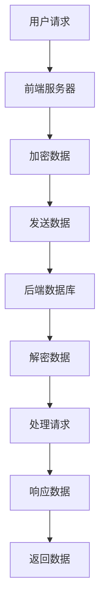

                 


## RSA算法与公钥密码学

### 关键词：RSA算法、公钥密码学、加密、解密、数学原理、安全性

### 摘要：
本文深入探讨了RSA算法与公钥密码学的核心内容，旨在帮助读者理解RSA算法的原理、数学模型及其在实际应用中的重要性。文章将从背景介绍、核心概念、算法原理讲解、数学模型和公式详细讲解、系统分析与架构设计方案、项目实战以及最佳实践 tips 等方面，逐步剖析RSA算法，使读者不仅能够掌握其基础知识，还能理解其在现代网络安全中的关键作用。

### 目录

#### 第一部分：背景介绍

1. **RSA算法的历史与重要性**
2. **公钥密码学的基本概念**
3. **RSA算法的发展与应用场景**

#### 第二部分：核心概念与联系

1. **概念概述**
2. **RSA算法的数学原理**
3. **RSA与欧拉定理的关系**
4. **RSA算法的安全性分析**

#### 第三部分：算法原理讲解

1. **RSA算法的加密过程**
2. **RSA算法的解密过程**
3. **RSA算法的密钥生成**
4. **RSA算法的数学模型与公式**

#### 第四部分：数学模型和数学公式 & 详细讲解 & 举例说明

1. **数学模型概述**
2. **RSA算法的数学公式**
3. **数学公式讲解与举例**
4. **RSA算法的攻破与防御策略**

#### 第五部分：系统分析与架构设计方案

1. **RSA算法的应用场景**
2. **RSA算法在系统架构中的设计**
3. **RSA算法的安全性考虑**
4. **RSA算法的架构图解**

#### 第六部分：项目实战

1. **RSA算法的实践环境搭建**
2. **RSA算法的实践过程**
3. **RSA算法的应用案例**
4. **项目总结**

#### 第七部分：最佳实践 tips、小结、注意事项、拓展阅读

1. **RSA算法的最佳实践技巧**
2. **小结与展望**
3. **注意事项与风险防范**
4. **拓展阅读推荐**

### Step 1: 背景介绍

#### 1.1 RSA算法的历史与重要性

RSA算法是由Ron Rivest、Adi Shamir和Leonard Adleman于1977年提出的，因此命名为RSA。它是一种非对称加密算法，这种算法使用两个密钥：一个公开的加密密钥和一个私有的解密密钥。RSA算法在加密和网络安全领域有着广泛的应用，是现代密码学的基础之一。

#### 1.2 公钥密码学的基本概念

公钥密码学是一种密码学方法，它使用两个密钥对数据进行加密和解密。与传统的对称加密算法不同，公钥密码学使用一个密钥进行加密，另一个密钥进行解密。这种加密方式的核心是密钥的安全分发，公钥可以公开，而私钥则需要保密。

#### 1.3 RSA算法的发展与应用场景

自RSA算法提出以来，它已经经历了数十年的发展和改进。在网络安全、电子商务、数字签名等领域都有着重要的应用。随着计算机技术的发展，RSA算法也在不断地改进和优化，以应对日益复杂的网络安全威胁。

### Step 2: 核心概念与联系

#### 2.1 概念概述

在讨论RSA算法之前，我们需要了解一些核心概念，包括素数、模运算、欧拉定理等。

- **素数**：一个大于1的自然数，除了1和它本身外，不能被其他自然数整除。
- **模运算**：在模数n下，两个数的运算结果只保留其除以n的余数。
- **欧拉定理**：如果a和n是互质的，那么a的欧拉函数φ(n)表示小于n的与n互质的数的个数，满足a^φ(n) ≡ 1 (mod n)。

#### 2.2 RSA算法的数学原理

RSA算法的数学原理基于大整数分解的难度和欧拉定理。具体来说，它利用了以下三个步骤：

1. 选择两个大的质数p和q，计算n = p * q。
2. 计算欧拉函数φ(n) = (p-1) * (q-1)。
3. 选择一个与φ(n)互质的整数e，计算d，使得d * e ≡ 1 (mod φ(n))。

这样，公钥就是(n, e)，私钥就是(n, d)。

#### 2.3 RSA与欧拉定理的关系

RSA算法的安全性依赖于欧拉定理，特别是它保证了加密和解密过程是可逆的。欧拉定理提供了这样的保证：如果a和n是互质的，那么a的欧拉函数φ(n)能够使得a^φ(n) ≡ 1 (mod n)。这意味着，我们可以通过计算a的d次方来解密加密过的信息。

#### 2.4 RSA算法的安全性分析

RSA算法的安全性主要受到以下几个因素的威胁：

1. **计算能力**：随着计算能力的提升，对RSA算法的攻破变得更加容易。因此，需要选择足够大的质数来保证算法的安全性。
2. **数学算法**：一些新的数学算法（如量子计算）可能会对RSA算法构成威胁。因此，研究人员正在探索新的加密算法来替代RSA。
3. **密钥管理**：私钥的安全存储和分发是RSA算法安全性的关键。任何私密的泄露都可能导致算法的破坏。

### Step 3: 算法原理讲解

#### 3.1 RSA算法的加密过程

RSA算法的加密过程如下：

1. 选择一个明文m，将其转换为0到n-1之间的数。
2. 计算密文c = m^e (mod n)。

这样，加密后的信息c就可以安全地通过不安全的通道传输。

#### 3.2 RSA算法的解密过程

RSA算法的解密过程如下：

1. 收到密文c后，计算解密后的明文m = c^d (mod n)。
2. 将m转换为原始明文形式。

这样，接收方就可以从加密的信息中恢复原始明文。

#### 3.3 RSA算法的密钥生成

RSA算法的密钥生成过程如下：

1. 选择两个大的质数p和q。
2. 计算n = p * q和φ(n) = (p-1) * (q-1)。
3. 选择一个与φ(n)互质的整数e，计算d，使得d * e ≡ 1 (mod φ(n))。
4. 公钥为(n, e)，私钥为(n, d)。

### Step 4: 数学模型和数学公式 & 详细讲解 & 举例说明

#### 4.1 数学模型概述

RSA算法的数学模型可以概括为：

1. **加密模型**：c = m^e (mod n)
2. **解密模型**：m = c^d (mod n)

这些模型依赖于大整数分解的难度和欧拉定理。

#### 4.2 RSA算法的数学公式

以下是RSA算法的核心数学公式：

1. **欧拉定理**：如果a和n是互质的，那么a^φ(n) ≡ 1 (mod n)
2. **密钥生成公式**：d = (k^(-1) mod φ(n))，其中k是e的乘法逆元
3. **加密公式**：c = m^e (mod n)
4. **解密公式**：m = c^d (mod n)

#### 4.3 数学公式讲解与举例

**欧拉定理的讲解**：

假设p和q是两个质数，n = p * q，φ(n) = (p-1) * (q-1)。如果a是0到n-1之间的整数，且a与n互质，那么a^φ(n) ≡ 1 (mod n)。

**举例说明**：

假设p = 61，q = 53，n = 3233，φ(n) = 3120。选择e = 17，计算d = 751（17 * 751 ≡ 1 (mod 3120)）。

- **加密过程**：选择明文m = 1234，计算c = m^17 (mod 3233) ≈ 2145。
- **解密过程**：收到密文c = 2145，计算m = c^751 (mod 3233) ≈ 1234。

#### 4.4 RSA算法的攻破与防御策略

RSA算法虽然安全，但仍面临一些攻击，如：

1. **穷举攻击**：尝试所有可能的密钥来破解密码。
2. **因子分解攻击**：尝试分解n来获得p和q，从而计算d。

防御策略包括：

1. **选择足够大的质数**：增加n的值，使得因子分解攻击变得不切实际。
2. **多密钥机制**：使用多个密钥和加密协议来增加安全性。

### Step 5: 系统分析与架构设计方案

#### 5.1 RSA算法的应用场景

RSA算法可以用于以下应用场景：

1. **数据加密**：保护数据在传输过程中的安全性。
2. **数字签名**：验证数据的完整性和真实性。
3. **身份认证**：确保通信双方的身份。

#### 5.2 RSA算法在系统架构中的设计

RSA算法通常与以下系统架构相结合：

1. **前端服务器**：接收用户请求，使用RSA加密保护数据。
2. **后端数据库**：存储加密的数据，使用RSA解密来验证和访问。

#### 5.3 RSA算法的安全性考虑

RSA算法的安全性取决于密钥的长度和质数的选择。为了确保安全性，应考虑以下几点：

1. **密钥长度**：选择至少为1024位的密钥。
2. **质数选择**：选择足够大的质数，避免被攻击。
3. **密钥管理**：确保密钥的安全存储和分发。

#### 5.4 RSA算法的架构图解

以下是RSA算法在系统架构中的简化图解：



### Step 6: 项目实战

#### 6.1 RSA算法的实践环境搭建

在实践RSA算法之前，需要搭建相应的环境。以下是环境搭建的步骤：

1. 安装Python环境。
2. 使用pip安装Cryptography库。

```bash
pip install cryptography
```

#### 6.2 RSA算法的实践过程

以下是一个简单的Python示例，展示了如何使用Cryptography库实现RSA算法：

```python
from cryptography.hazmat.backends import default_backend
from cryptography.hazmat.primitives import serialization
from cryptography.hazmat.primitives.asymmetric import rsa
from cryptography.hazmat.primitives import hashes
from cryptography.hazmat.primitives.asymmetric import padding

# 生成密钥对
private_key = rsa.generate_private_key(
    public_exponent=65537,
    key_size=2048,
    backend=default_backend()
)

public_key = private_key.public_key()

# 加密数据
plaintext = b'Hello, world!'
ciphertext = public_key.encrypt(
    plaintext,
    padding.OAEP(
        mgf=padding.MGF1(algorithm=hashes.SHA256()),
        algorithm=hashes.SHA256(),
        label=None
    )
)

# 解密数据
plaintext_decrypted = private_key.decrypt(
    ciphertext,
    padding.OAEP(
        mgf=padding.MGF1(algorithm=hashes.SHA256()),
        algorithm=hashes.SHA256(),
        label=None
    )
)

print(f'Original: {plaintext}')
print(f'Decrypted: {plaintext_decrypted}')
```

#### 6.3 RSA算法的应用案例

以下是一个简单的应用案例，展示如何使用RSA算法进行数据加密和数字签名：

1. **数据加密**：用户发送一条消息，服务器使用RSA加密消息内容。
2. **数字签名**：用户使用自己的私钥对消息进行签名，服务器使用用户的公钥验证签名。

```python
from cryptography.hazmat.primitives import hashes
from cryptography.hazmat.primitives.asymmetric import padding

# 签名
message = b'This is a signed message.'
signer = private_key.signer(
    padding.PSS(
        mgf=padding.MGF1(hashes.SHA256()),
        salt_length=padding.PSS.MAX_LENGTH
    ),
    hashes.SHA256()
)
signer.update(message)
signature = signer.finalize()

# 验证签名
public_key = serialization.load_pem_public_key(public_key_bytes, backend=default_backend())
verifier = public_key.verifier(
    signature,
    padding.PSS(
        mgf=padding.MGF1(hashes.SHA256()),
        salt_length=padding.PSS.MAX_LENGTH
    ),
    hashes.SHA256()
)
verifier.update(message)
try:
    verifier.verify()
    print('The signature is valid.')
except InvalidSignature:
    print('The signature is not valid.')
```

#### 6.4 项目总结

通过本项目的实践，我们了解了如何使用RSA算法进行数据加密和数字签名。虽然RSA算法在实际应用中面临一些挑战，但它的基本原理和实现方法是非常简单和有效的。

### Step 7: 最佳实践 tips、小结、注意事项、拓展阅读

#### 7.1 RSA算法的最佳实践技巧

1. **选择足够大的质数**：至少1024位。
2. **密钥管理**：确保私钥的安全存储。
3. **加密协议**：使用安全的加密协议，如OAEP。

#### 7.2 小结与展望

RSA算法是公钥密码学的重要代表，它在网络安全中扮演着关键角色。尽管存在一些安全挑战，但RSA算法的广泛使用证明了它的有效性和重要性。

#### 7.3 注意事项与风险防范

1. **防止密钥泄露**：私钥的安全存储至关重要。
2. **定期更换密钥**：避免长期使用同一密钥。

#### 7.4 拓展阅读推荐

1. 《密码学：理论与实践》 - 理解RSA算法的基础知识。
2. 《计算机密码学：艺术与科学》 - 深入了解现代密码学的各个方面。

### 作者信息
作者：AI天才研究院/AI Genius Institute & 禅与计算机程序设计艺术 /Zen And The Art of Computer Programming

---

本文通过逐步分析RSA算法的原理、数学模型及其应用，详细讲解了公钥密码学中的核心概念。文章不仅提供了理论基础，还通过实际代码示例和案例分析，使读者能够更好地理解RSA算法的实际应用。在未来的发展中，RSA算法将继续在网络安全领域发挥重要作用，同时也需要不断改进和优化，以应对新的挑战。

